::: article
# Introduction

There has been a considerable recent interest in measuring dependence by
employing the concept of the distance covariance function. @Szekely
initially introduced the distance covariance as a new measure of
dependence defined as the weighted $L_2$-norm between the joint
characteristic function of two random vectors of arbitrary, but not
necessarily of equal dimensions, and their marginal characteristic
functions. However, the idea of using distance covariance for detecting
independence can be also found in some early work by @Feuerverger. He
considered measures of this form, with the main differences being the
restriction to the univariate case and the choice of the weight
function. Since [@Szekely] work, there has been a wide range of studies
extending the distance covariance definition and methodology in various
topics; see @Grettonetal and @JosseHolmes and the references therein for
a nice review.

[@Szekely] distance covariance methodology is based on the assumption
that the underlying data are iid. However, this assumption is often
violated in many practical problems. @Remillard proposed to extend the
distance covariance methodology to a time series context in order to
measure serial dependence. There have been few works on how to develop a
distance covariance methodology in the context of time series
[@Zhou; @Duecketal; @Davisetal]. Motivated by the work of @Szekely,
@Zhou recently defined the so-called auto-distance covariance function
(ADCV) - and its rescaled version, the so-called auto-distance
correlation function (ADCF), for a strictly stationary multivariate time
series. Compared to the classical Pearson autocorrelation function (ACF)
which measures the strength of linear dependencies and can be equal to
zero even when the variables are related, ADCF vanishes only in the case
where the observations are independent. However, @Zhou studied the
asymptotic behavior of ADCV at a fixed lag order. @FokianosPitsillou
relaxed this assumption and constructed a univariate test of
independence by considering an increasing number of lags following
[@HongB] generalized spectral domain methodology. Although the proposed
methodology is for univariate processes, it can be extended for
multivariate processes.

@Zhou developed a distance covariance methodology for multivariate time
series, but he did not explore the interrelationships between the
various time series components. @FokianosPitsillouB made this possible
by defining the matrix version of pairwise auto-distance covariance and
correlation functions. In particular, they construct multivariate tests
of independence based on these new measures in order to identify whether
there is some inherent nonlinear interdependence between the component
series.

The [*energy*](https://CRAN.R-project.org/package=energy)
[@SzekelyRizzoManual] package for R is a package that involves a wide
range of functions for the existing distance covariance methodology.
However, there is no package for the aforementioned distance covariance
methodology in time series. Thus, we aim at filling this gap by
publishing an R-package named *dCovTS*. In this first version of the
package, we provide functions that compute and plot ADCV and ADCF using
the functions `dcov()` and `dcor()` respectively from *energy* package.
The new testing methodology proposed by @FokianosPitsillou
[@FokianosPitsillouB] is also included in the package.

The structure of the paper is as follows. In the first two sections we
introduce the theoretical background of distance covariance function for
both univariate and multivariate time series respectively. In the next
section, we briefly state the main results about the asymptotic
properties of distance covariance function. The proposed testing
methodology for both univariate and multivariate time series are also
described. Empirical $p$-values of the tests and empirical critical
values for the distance correlation plots are computed via the wild
bootstrap methodology [@DehlingMikosch; @Shao2010; @Leuchtb] which is
explained in the corresponding section. The implementation section
demonstrates the usage of the package with two real data examples.
Lastly, we give some concluding remarks and some further points for
future extensions of the *dCovTS* package.

# Distance covariance function {#section:dcov}

Denote a univariate strictly stationary time series by
$\{X_t, t \in \mathbb{Z}\}$. Motivated by @Szekely and @Zhou, we define
the distance covariance function as a function of the joint and marginal
characteristic functions of the pair $(X_t, X_{t+j})$. Denote by
$\phi_{j}(u,v)$ the joint characteristic function of $X_t$ and
$X_{t+j}$; that is
$$\label{eq:phi}
\phi_{j}(u,v) = E\Bigl[\exp\Bigl(i\left(uX_t + vX_{t+j}\right)\Bigr)\Bigr], ~~~~ j= 0, \pm 1, \pm 2, \dots, \nonumber   (\#eq:phi)$$
and the marginal characteristic functions of $X_t$ and $X_{t+j}$ as
$\phi(u) := \phi_{j}(u,0)$ and $\phi(v) := \phi_{j}(0,v)$ respectively,
where $(u,v) \in \mathbb{R}^2$, and $i^2=-1$. For a strictly stationary
$\alpha$-mixing univariate time series, @HongB defined a new measure of
dependence between the joint characteristic function of $X_t$ and its
lagged observation $X_{t+j}$ and the product of their marginals, namely
$$\label{eq:sigma}
\sigma_j(u,v) = \phi_{j}(u,v) - \phi(u)\phi(v), ~~~~ j= 0, \pm 1, \pm 2, \dots,   (\#eq:sigma)$$
where $(u,v) \in \mathbb{R}^2$. Considering the property that the joint
characteristic function factorizes under independence of $X_t$ and
$X_{t+j}$, $\sigma_{j}(u,v)$ equals 0 if and only if $X_t$ and $X_{t+j}$
are independent. Thus, compared to the classical autocorrelation
function (ACF), $\sigma_j(\cdot,\cdot)$ can capture all pairwise
dependencies including those with zero autocorrelation. The
auto-distance covariance function (ADCV), $V_X(j)$, between $X_t$ and
$X_{t+j}$ is then defined as the square root of
$$\label{eq:dcov}
V_X^2(j) = \int_{\mathbb{R}^2}{\left|\sigma_j(u,v)\right|^2 d\mathcal{W}(u,v)}, ~~~~ j=0, \pm 1, \pm 2, \dots   (\#eq:dcov)$$
where $\mathcal{W}(\cdot,\cdot)$ is a positive weight function for which
the above integral exists.

Although @HongB suggests the use of an arbitrary integrable weight
function, $\mathcal{W}(\cdot,\cdot)$, we propose the use of a
non-integrable weight function, i.e.
$$\label{eq:weight}
\mathcal{W}(u,v) = \mathcal{W}_0(u) \mathcal{W}_0(v)=\frac{1}{\pi \left|u\right|^2} \frac{1}{\pi \left|v\right|^2}, ~~~ (u,v) \in \mathbb{R}^2   (\#eq:weight)$$
which avoids missing any potential dependence among observations
[@Szekely p. 2771]. Rescaling \@ref(eq:dcov), one can define the
auto-distance correlation function (ADCF) as the positive square root of
$$\label{eq:dcor}
R_X^2(j) = \frac{V_X^2(j)}{V_X^2(0)}, ~~~~~ j=0, \pm 1, \pm 2, \dots   (\#eq:dcor)$$
for $V_X^2(0) \neq 0$ and zero otherwise. @Szekely showed that by
applying a non-integrable weight function, like \@ref(eq:weight), ADCF
is scale invariant and is not zero under dependence.

The empirical ADCV, $\widehat{V}_X(\cdot)$, is the non-negative square
root of
$$\label{eq:Vhat}
\widehat{V}_X^2(j) = \frac{1}{(n-j)^2}\sum_{r,l=1+j}^{n}{A_{rl}B_{rl}}, ~~~~~ 0 \leq j \leq (n-1)   (\#eq:Vhat)$$
and $\widehat{V}_X^2(-j) = \widehat{V}_X^2(j)$, for $-(n-1) \leq j < 0$,
where $A=A_{rl}$ and $B=B_{rl}$ are Euclidean distance matrices given by
$$A_{rl} = a_{rl} - \bar{a}_{r.} - \bar{a}_{.l} + \bar{a}_{..},$$
with $a_{rl}=\left|X_r-X_l\right|$,
$\bar{a}_{r.}=\Bigl(\sum_{l=1+j}^{n}{a_{rl}}\Bigr)/(n-j)$,
$\bar{a}_{.l}=\Bigl(\sum_{r=1+j}^{n}{a_{rl}}\Bigr)/(n-j)$,
$\bar{a}_{..}=\Bigl(\sum_{r,l=1+j}^{n}{a_{rl}}\Bigr)/(n-j)^2$. $B_{rl}$
is defined analogously in terms of $b_{rl}=\left|Y_r-Y_l\right|$, where
$Y_t \equiv X_{t+j}$. @SzekelyRizzo proposed an unbiased version of the
sample distance covariance. In the context of time series data this is
given by
$$\label{eq:Vhat2}
\widetilde{V}^2_X(j) = \frac{1}{(n-j)(n-j-3)}\sum_{r\neq l}{\widetilde{A}_{rl}\widetilde{B}_{rl}},   (\#eq:Vhat2)$$
for $n > 3$, where $\widetilde{A}_{rl}$ is the $(r,l)$ element of the
so-called $\mathcal{U}$-centered matrix $\widetilde{A}$, defined by

$$\widetilde{A}_{rl} = \left\{
  \begin{array}{ll}
    \displaystyle a_{rl} - \frac{1}{n-j-2}\sum_{t=1+j}^{n}{a_{rt}}-\frac{1}{n-j-2}\sum_{s=1+j}^{n}{a_{sl}+\frac{1}{(n-j-1)(n-j-2)}\sum_{t,s=1+j}^{n}{a_{ts}}}, & \hbox{$r \neq l$;} \\
    0, & \hbox{$r=l$.}
  \end{array}
\right.$$

The empirical ADCF, $\widehat{R}_X(j)$ (or its unbiased version,
$\widetilde{R}_X(j)$), can be obtained by replacing \@ref(eq:Vhat) (or
\@ref(eq:Vhat2)) into \@ref(eq:dcor). The functions `ADCV()` and
`ADCF()` in *dCovTS* return the empirical quantities
$\widehat{V}_X(\cdot)$ and $\widehat{R}_X(\cdot)$ respectively. Using
the same functions with argument `unbiased=TRUE`, the results correspond
to the unbiased sqaured quantities $\widetilde{V}^2_X(\cdot)$ and
$\widetilde{R}^2_X(\cdot)$. Note that the default option has been set to
`unbiased=FALSE` (corresponding to \@ref(eq:Vhat)).

# Distance covariance matrix {#section:mdcov}

We denote by $\{\textbf{X}_t: t=0,\pm 1, \pm 2, \dots\}$ a
$d$-dimensional time series process, with components
$\{X_{t;i}\}_{i=1}^d$. The characteristic functions can be defined in
analogous way as in the univariate case. In particular, the joint
characteristic function of $X_{t;r}$ and $X_{t+j;m}$ is given by
$$\phi_{j}^{(r,m)}(u,v) = E\Bigl[\exp\Bigl(i\left(uX_{t;r} + vX_{t+j;m}\right)\Bigr)\Bigr], ~~~~ j = 0, \pm 1, \pm 2, \dots$$
and the marginal characteristic functions of $X_{t;r}$ and $X_{t+j;m}$
by $\phi^{(r)}(u) := \phi_{j}^{(r,m)}(u,0)$ and
$\phi^{(m)}(v) := \phi_{j}^{(r,m)}(0,v)$ respectively, with
$(u,v) \in \mathbb{R}^2$, $r,m=1, \dots d$ and $i^2=-1$. The pairwise
ADCV between $X_{t;r}$ and $X_{t+j;m}$ is denoted by $V_{rm}(j)$ and it
is defined as the non-negative square root of
$$V_{rm}^2(j) = \int_{\mathbb{R}^2}{\left|\sigma_{j}^{(r,m)}(u,v)\right|^2\mathcal{W}(u,v)dudv}, ~~~~ j = 0, \pm 1, \pm 2, \dots$$
where $\mathcal{W}(\cdot,\cdot)$ is given by \@ref(eq:weight) and
$\sigma_{j}^{(r,m)}(u,v)$ is similarly defined as in the univariate
case, namely
$$\sigma_{j}^{(r,m)}(u,v) = \phi_{j}^{(r,m)}(u,v) - \phi^{(r)}(u)\phi^{(m)}(v).$$
Clearly, $V_{rm}^2(j) \geq 0$, $\forall ~~ j$ and $X_{t;r}$ and
$X_{t+j;m}$ are independent if and only if $V_{rm}^2(j) = 0$. The ADCV
matrix, $V(j)$, is then defined by
$$\label{eq:V}
V(j) = \Bigl[ V_{rm}(j) \Bigr]_{r,m=1}^d, ~~~~ j = 0, \pm 1, \pm 2, \dots   (\#eq:V)$$

The pairwise ADCF between $X_{t;r}$ and $X_{t+j;m}$, $R_{rm}(j)$, is a
coefficient that lies in the interval $[0,1]$ and also measures
dependence and is defined as the positive square root of
$$\label{eq:rrmk}
R^2_{rm}(j) = \frac{V_{rm}^2(j)}{\sqrt{V^2_{rr}(0)}\sqrt{V^2_{mm}(0)}},   (\#eq:rrmk)$$
for $V_{rr}(0)V_{mm}(0) \neq 0$ and zero otherwise. The ADCF matrix of
$\textbf{X}_t$, is then defined as
$$R(j) = \Bigl[R_{rm}(j)\Bigr]_{r,m=1}^{d}, ~~~~ j = 0, \pm 1, \pm 2, \dots$$

$V_{rm}(j)$ measures the dependence of $X_{t;r}$ on $X_{t+j;m}$. In
general, $V_{rm}(j) \neq V_{mr}(j)$ for $r \neq m$, since they measure
different dependence structure between the series $\{X_{t;r}\}$ and
$\{X_{t;m}\}$ for all $r,m=1, 2, \dots, d$. Thus, $V(j)$ and $R(j)$ are
non-symmetric matrices. Moreover, because of the assumed stationarity
and relation $\mbox{Cov}(x,y) = \mbox{Cov}(y,x)$, $V(j) = V'(-j)$ and
consequently $R(j) = R'(-j)$. More properties of these new defined
functions can be found in @FokianosPitsillouB.

Estimation of $V_{rm}^2(\cdot)$ can be dealt in a similar way as in the
univariate case. In particular, let first $Y_{t;m} \equiv X_{t+j;m}$.
Based on the sample $\{(X_{t;r},Y_{t;m}):t=1+j, \dots, n\}$, we define
the Euclidean distance matrices by
$(a_{ts}^r)=\left|X_{t;r}-X_{s;r}\right|$ and
$(b_{ts}^m)=\left|Y_{t;m}-Y_{s;m}\right|$ and the centered distance
matrices by
$$\begin{aligned}
A_{ts}^r & = a_{ts}^r - \bar{a}_{t.}^r - \bar{a}_{.s}^r + \bar{a}_{..}^r, \nonumber \\
B_{ts}^m & = b_{ts}^m - \bar{b}_{t.}^m - \bar{b}_{.s}^m + \bar{b}_{..}^m, \nonumber
\end{aligned}$$
where the quantities in the right hand side are defined analogously as
those defined in the univariate case. The biased estimator of
$V_{rm}^2(\cdot)$ is then given by
$$\label{eq:Vrmest2}
\widehat{V}_{rm}^2(j) = \left\{
  \begin{array}{ll}
    \displaystyle \frac{1}{(n-j)^2}\sum_{t,s=1+j}^{n}{A_{ts}^rB_{ts}^m}, & \hbox{$0 \leq j \leq (n-1)$;} \\
    \displaystyle \frac{1}{(n+j)^2}\sum_{t,s=1}^{n+j}{A_{ts}^rB_{ts}^m}, & \hbox{$-(n-1) \leq j < 0$.}
  \end{array}
\right.   (\#eq:Vrmest2)$$
Analogously to \@ref(eq:Vhat2), an unbiased estimator of
$\widehat{V}_{rm}^2(\cdot)$ is given by

$$\label{eq:Vrmest3}
\widetilde{V}_{rm}^2(j) = \left\{
  \begin{array}{ll}
    \displaystyle \frac{1}{(n-j)(n-j-3)}\sum_{t,s=1+j}^{n}{\widetilde{A}_{ts}^r\widetilde{B}_{ts}^m}, & \hbox{$0 \leq j \leq (n-1)$;} \\
    \displaystyle \frac{1}{(n+j)(n+j-3)}\sum_{t,s=1}^{n+j}{\widetilde{A}_{ts}^r\widetilde{B}_{ts}^m}, & \hbox{$-(n-1) \leq j < 0$,}
  \end{array}
\right.   (\#eq:Vrmest3)$$
where $\widetilde{A}_{ts}^{r}$ are computed appropriately.

The sample ADCV matrix, $\widehat{V}(\cdot)$, is then obtained by
replacing its elements by the positive square root of \@ref(eq:Vrmest2)
and can be calculated from *dCovTS* using the `mADCV()` function. The
estimator based on \@ref(eq:Vrmest3), $\widetilde{V}(\cdot)$, is
obtained from *dCovTS* using the argument `unbiased = TRUE`. The package
also gives the sample ADCF matrix $\widehat{R}(\cdot)$ (function
`mADCF()`) which is obtained after replacing \@ref(eq:Vrmest2) (or
$\widetilde{R}_X(j)$ which is based on \@ref(eq:Vhat2)) into
\@ref(eq:rrmk). The distance correlation plots for both univariate and
multivariate time series are obtained by the `ADCFplot()` and
`mADCFplot()` functions respectively, where the shown critical values
(blue dotted horizontal line) are computed by employing bootstrap
methodology described in the appropriate section. Recall that these are
computed by using the biased definition of distance covariance and
correlation.

# Consistency and asymptotic distribution of distance covariance {#section:asymp}

Consider first the univariate case. For a strictly stationary and
$\alpha$-mixing process $X_t$, with $E\left|X_t\right| < \infty$, then
for all $j=0, \pm 1, \pm 2, \dots$
$$\widehat{V}_X^2(j) \rightarrow V_X^2(j)$$
almost surely, as $n \rightarrow \infty$. A detailed proof of this
result can be found in @FokianosPitsillou. Under mild conditions, @Zhou
obtained the weak consistency of $\widehat{V}_X^2(\cdot)$ and its
asymptotic distribution at a fixed lag, but under alternative mixing
conditions.

In addition, @FokianosPitsillouB showed that for a $d$-dimensional
strictly stationary and ergodic time series process $\{\textbf{X}_t\}$
with $E\left|X_{t;r}\right| < \infty$ for $r=1, \dots, d$, then for all
$j=0, \pm 1, \pm 2, \dots$
$$\widehat{V}(j) \rightarrow V(j)$$
almost surely as $n \rightarrow \infty$. Under pairwise independence,
the empirical pairwise ADCV is a degenerate $V$-statistic of order two
with a measurable kernel function that is symmetric, continuous and
positive semidefinite Then
$$\label{eq:distribution}
(n-j)\widehat{V}_{X}^2(j) \rightarrow Z:=\sum_{k}{\lambda_kZ_k^2}   (\#eq:distribution)$$
in distribution, as $n \rightarrow \infty$, where $\{Z_k\}$ is an iid
sequence of $N(0,1)$ random variables, and $(\lambda_k)$ is a sequence
of nonzero eigenvalues. A similar result showing the limiting
distribution of $\widehat{V}_{rm}(\cdot)$ can be obtained by replacing
$\widehat{V}_{X}(\cdot)$ by $\widehat{V}_{rm}(\cdot)$ in
\@ref(eq:distribution).

# Testing for pairwise dependence in univariate time series {#section:testUniv}

As shown in the previous section, the asymptotic distribution of
distance covariance is derived at a fixed lag, for both univariate and
multivariate time series. @FokianosPitsillou [@FokianosPitsillouB]
constructed the asymptotic behavior of distance covariance considering
an increasing number of lags by employing [@HongB] generalized spectral
domain methodology. @HongB highlighted that standard spectral density
approaches become inappropriate for non-Gaussian and nonlinear processes
with zero autocorrelation. Considering a univariate strictly stationary
$\alpha$-mixing process, he proposed the generalized spectral density,
which is the Fourier transform of $\sigma_j(u,v)$ defined in
\@ref(eq:sigma), given by
$$f(\omega,u,v) = \frac{1}{2\pi} \sum_{j=-\infty}^{\infty}{\sigma_j(u,v)e^{-ij\omega}}.$$
Under the null hypothesis of independence, the corresponding null
density is given by
$$f_0(\omega,u,v) = \frac{1}{2\pi}\sigma_0(u,v), ~~~~ \omega \in [-\pi,\pi].$$
Any deviation of $f$ from $f_0$ is a strong evidence of pairwise
dependence. Thus, @HongB compares the [@Parzen] kernel-type estimators
$\hat{f}(\omega,u,v)$ and $\hat{f}_0(\omega,u,v)$ via an $L_2$-norm
resulting in a test statistic of the form
$$\label{eq:Tn2}
T_n^{(2)} = \int_{\mathbb{R}^2}{\sum_{j=1}^{n-1}{(n-j)k^2(j/p)\left|\hat{\sigma}_j(u,v)\right|} d \mathcal{W}(u,v)},   (\#eq:Tn2)$$
where $\mathcal{W}(\cdot,\cdot): \mathbb{R}^2 \rightarrow \mathbb{R}$ is
an arbitrary nondecreasing function with bounded total variation, $p$ is
a bandwidth of the form $p = cn^{\lambda}$ for $c > 0$
$\lambda \in (0,1)$ and $k(\cdot)$ is a Lipschitz-continuous kernel
function satisfying the following assumption:

#### assumption {#assumption:kernel}

$k: \mathbb{R} \rightarrow [-1,1]$ is symmetric and is continuous at $0$
and at all but a finite number of points, with $k(0)=1$,
$\int_{-\infty}^{\infty}{k^2(z)dz} < \infty$ and
$\left|k(z)\right| \leq C \left|z\right|^{-b}$ for large $z$ and
$b > 1/2$.

The function `kernelFun()` in *dCovTS* computes a number of such kernel
functions including the truncated (default option), Bartlett, Daniell,
QS and Parzen kernels.

@FokianosPitsillou proposed a portmanteau type statistic based on ADCV
$$\label{eq:Tn}
T_n = \sum_{j=1}^{n-1}{(n-j)k^2(j/p)\widehat{V}^2_X(j)}.   (\#eq:Tn)$$
Under the null hypothesis that the data are iid and some further
assumptions about the kernel function $k(\cdot)$, the standardized
version of $T_n$ follows a $N(0,1)$ asymptotically, and it is
consistent. The authors also considered a similar test statistic based
on ADCF
$$\label{eq:Tndcor}
\sum_{j=1}^{n-1}{(n-j)k^2(j/p)\widehat{R}^2_X(j)}.   (\#eq:Tndcor)$$
The function `UnivTest` from *dCovTS* package performs univariate tests
of independence based on \@ref(eq:Tn) and its rescaled version
\@ref(eq:Tndcor), using the arguments `testType = "covariance"` and
`testType = "correlation"` respectively.

# Testing for pairwise dependence in multivariate time series {#section:testMult}

Following a similar methodology described in the previous section,
@FokianosPitsillouB suggested a test statistic suitable for testing
pairwise independence in a multivariate time series framework. The
proposed test statistic is based on the ADCV matrix \@ref(eq:V), and it
is given by
$$\label{eq:tildeTn}
\widetilde{T}_n = \sum_{j=1}^{n-1}{(n-j)k^2(j/p) \mbox{tr}{\widehat{V}^*(j)\widehat{V}(j)}}.   (\#eq:tildeTn)$$

where $k(\cdot)$ is a univariate kernel function satisfying Assumption
[1](#assumption:kernel), $p$ is a bandwidth as described before.
Moreover, $\widehat{V}^{*}(\cdot)$ denotes the complex conjugate matrix
of $\widehat{V}(\cdot)$ and $\mbox{tr}(A)$ denotes the trace of the
matrix $A$. The authors formed the statistic \@ref(eq:tildeTn) in terms
of the ADCF matrix as follows

$$\label{eq:barTn}
\overline{T}_n = \sum_{j=1}^{n-1}{(n-j)k^2(j/p) \mbox{tr}{\widehat{V}^*(j)\widehat{D}^{-1}\widehat{V}(j)\widehat{D}^{-1}}},   (\#eq:barTn)$$

where $D = diag\{V_{rr}(0), r = 1, 2, \dots, d\}$. Under the null
hypothesis of independence and some further assumptions about the kernel
function $k(\cdot)$, the standardized version of the test statistics
$\widetilde{T}_n$ and $\overline{T}_n$ given in \@ref(eq:tildeTn) and
\@ref(eq:barTn) were proved to follow $N(0,1)$ asymptotically and they
are consistent. The multivariate tests of independence based on
$\widetilde{T}_n$ and $\overline{T}_n$ are performed via `mADCVtest()`
and `mADCFtest()` respectively in *dCovTS* package.

# Bootstrap methodology {#section:boot}

To examine the asymptotic behavior of the proposed test statistics, a
resampling method is proposed. First, recall that all test statistics
$T_n$, $\widetilde{T}_n$ and $\overline{T}_n$ of equations \@ref(eq:Tn),
\@ref(eq:tildeTn) and \@ref(eq:barTn) respectively, are functions of
degenerate $V$- statistics of order two. @DehlingMikosch proposed wild
bootstrap techniques to approximate the distribution of degenerate
$U$-statistics for the case of iid data. Recently, @Leucht [@Leuchtb]
suggested the use of a new variant of dependent wild bootstrap
[@Shao2010] to approximate the limit distribution of degenerate $U$- and
$V$-statistics for dependent data. The method relies on generating
auxiliary random variables $\left(W_{tn}^*\right)_{t=1}^{n-j}$.
@Shao2010 highlighted that the methodology of wild bootstrap for time
series extends that of @Wu1986 by allowing the auxiliary random
variables $W_{tn}^{*}$ to be dependent. In particular, @Leuchtb proposed
to generate the sequence $W_{tn}^{*}$ by a first order autoregressive
model. In the case of independent data, @DehlingMikosch studied the wild
bootstrap methodology by employing independent auxiliary variables
$W_{tn}^{*}$. Because our focus is on testing independence we implement
the calculation of the test statistics by using $W_{tn}^{*}$ iid
standard normal random variables. Thus, the empirical $p$-values of the
tests are derived based on this methodology.

We also suggest the use of independent wild bootstrap for obtaining
simultaneous $95\%$ empirical critical values for the distance
correlation plots. In the case of a univariate time series, we
additionally propose the subsampling approach suggested by @Zhou
[Section 5.1] for computing the pairwise $95\%$ critical values
(argument `method = "Subsampling"`). The choice of the subsampling block
size is based on the minimum volatility method proposed by @PolitisBook
[Section 9.4.2]. In addition, the package provides the ordinary
independent bootstrap methodology to derive empirical $p$-values of the
tests and simultaneous $95\%$ critical values for the ADCF plots
(argument `method = "Independent Bootstrap"`). The default bootstrap
method provided to the user is the independent wild bootstrap technique.

The computation of the bootstrap replications, and thus the empirical
$p$-values and the critical values, can be distributed to multiple cores
simultaneously (argument `parallel = TRUE`). To do this, the
[*doParallel*](https://CRAN.R-project.org/package=doParallel)
[@doParallel] package needs to be installed first, in order to register
a computing cluster.

# Implementation of *dCovTS* package {#section:usage}

The current version of *dCovTS* package (version number 1.1) is
available from CRAN and can be downloaded via
<https://cran.r-project.org/web/packages/dCovTS/>. The aim of the
*dCovTS* package is to provide a set of functions that compute and plot
distance covariance and correlation functions in both univariate and
multivariate time series. As we mentioned, the package supports both
versions of biased and unbiased estimators of distance covariance and
correlation functions. Moreover, it offers functions that perform
univariate and multivariate tests of independence based on distance
covariance function using the biased estimator (corresponding to
\@ref(eq:Vhat) and \@ref(eq:Vrmest2)). All these functions are provided
in Table [1](#tab:functions). Apart from these functions, the package
also provides two real datasets listed in Table [2](#tab:datasets). A
more detailed description of the functions and datasets can be found in
the help files. We apply *dCovTS* to two real data examples.

::: {#tab:functions}
  -------------------------------------------------------------------------------------------------------------------------------------------
  Function                   Description
  -------------------------- ----------------------------------------------------------------------------------------------------------------
  `ADCF`, `mADCF`            Estimates distance correlation for a univariate and multivariate time series respectively

  `ADCV`, `mADCV`            Estimates distance covariance for a univariate and multivariate time series respectively

  `ADCFplot`, `mADCFplot`    Plots sample distance correlation in a univariate and multivariate time series framework respectively

  `kernelFun`                Gives a range of univariate kernel function, $k(\cdot)$, that satisfy Assumption [1](#assumption:kernel)

  `UnivTest`                 Performs a univariate test of independence based on $T_n$

  `mADCFtest`, `mADCVtest`   Perform multivariate tests of independence based on $\overline{T}_n$ and $\widetilde{T}_n$ respectively
  -------------------------------------------------------------------------------------------------------------------------------------------

  : Table 1: Functions in *dCovTS*
:::

[]{#tab:functions label="tab:functions"}

::: {#tab:datasets}
  ---------------------------------------------------------------------------------------------------------------------------
  Data             Description
  ---------------- ----------------------------------------------------------------------------------------------------------
  `ibmSp500`       Monthly returns of IBM and S$\&$P 500 composite index from January 1926 to December 2011

  `MortTempPart`   Mortality, temperature and pollution data measured daily in Los Angeles County over the period 1970-1979
  ---------------------------------------------------------------------------------------------------------------------------

  : Table 2: Datasets in *dCovTS*
:::

[]{#tab:datasets label="tab:datasets"}

## Regression with autocorrelated errors

We first consider the pollution, temperature and mortality data measured
daily in Los Angeles County over the 10 year period 1970-1979
[@Shumway88]. The data are available in our package by the argument
`MortTempPart` and contain 508 observations and 3 variables representing
the mortality (`"cmort"`), temperature (`"tempr"`) and pollutant
particulates (`"part"`) data.

``` r
library(dCovTS)
data(MortTempPart)
MortTempPart[1:10,] # the first ten observations
##     cmort tempr  part
## 1   97.85 72.38 72.72
## 2  104.64 67.19 49.60
## 3   94.36 62.94 55.68
## 4   98.05 72.49 55.16
## 5   95.85 74.25 66.02
## 6   95.98 67.88 44.01
## 7   88.63 74.20 47.83
## 8   90.85 74.88 43.60
## 9   92.06 64.17 24.99
## 10  88.75 67.09 40.41
attach(MortTempPart)
```

Following the analysis of @ShumwayStoffer, the possible effects of
temperature ($T_t$) and pollutant particulates ($P_t$) on daily
cardiovascular mortality ($M_t$) are examined via regression. In
particular, once the temperature is adjusted for its mean ($T_.=74.3$),
we fit the following regression model using the function `lm()`
$$\begin{aligned}
\label{eq:regr1}
\widehat{M}_t &= 2831.49 - 1.396_{(0.101)}t - 0.472_{(0.032)}\left(T_t - T.\right) \nonumber \\
&\phantom{=} + 0.023_{(0.003)}\left(T_t - T.\right)^2 + 0.255_{(0.019)}P_t,
\end{aligned}   (\#eq:regr1)$$
where the standard errors of the estimators are given in parentheses.
Figure [1](#fig:corFirst) provides the sample autocorrelation (ACF),
partial correlation (PACF) and ADCF plots of the residuals of model
\@ref(eq:regr1).

<figure id="fig:corFirst">
<p>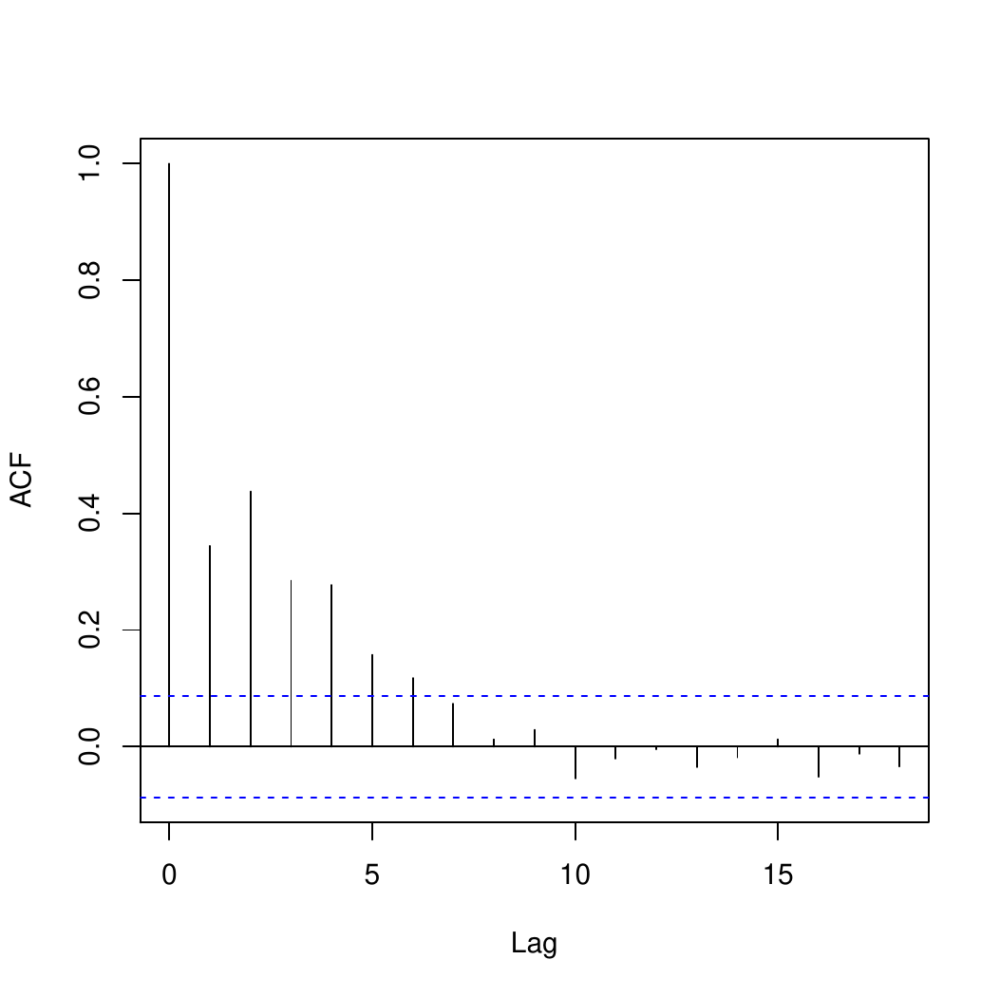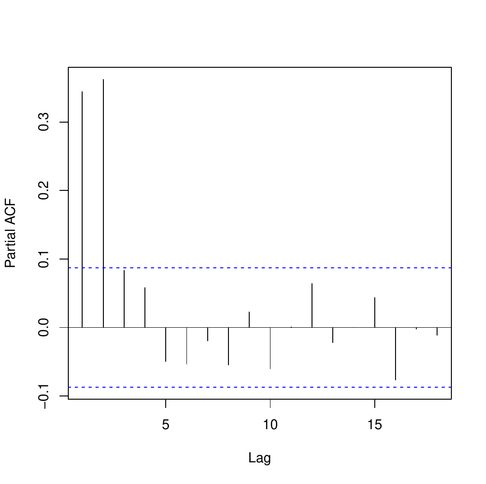</p>
<p>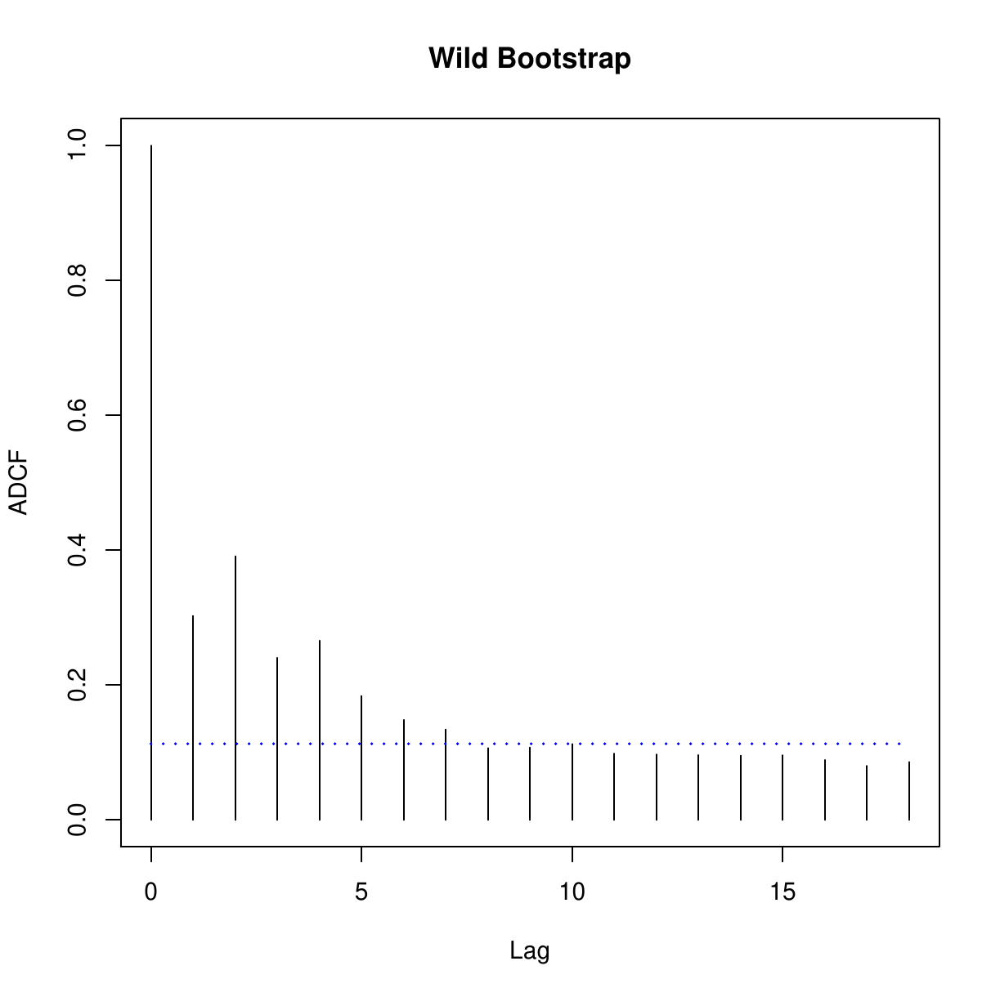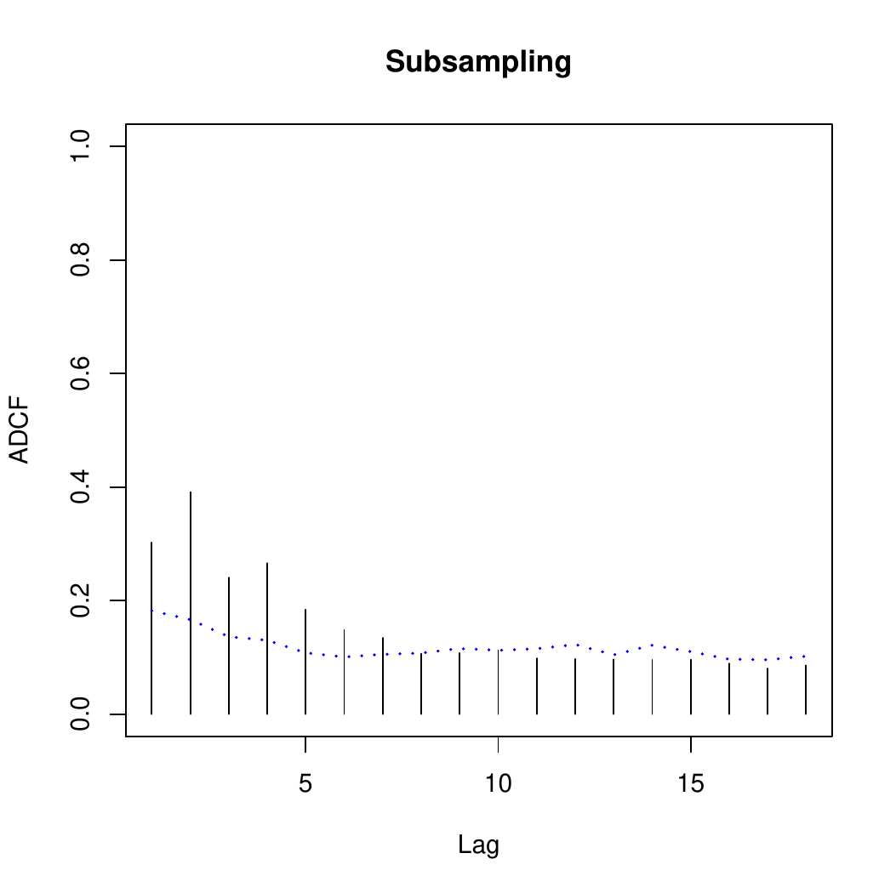</p>
<figcaption>Figure 1: Sample ACF, PACF and ADCF plots of the mortality
residuals of model .</figcaption>
</figure>

The plots shown in Figure [1](#fig:corFirst) suggest an AR(2) process
for the residuals. The new fit is
$$\begin{aligned}
\label{eq:regr2}
\widehat{M}_t &= 3075.15 - 1.517_{(0.423)}t - 0.019_{(0.050)}(T_t - T.) \nonumber \\
&\phantom{=}+ 0.015_{(0.002)}(T_t - T.)^2 + 0.155_{(0.027)}P_t,
\end{aligned}   (\#eq:regr2)$$
where the standard errors of the estimators are given in parentheses.
The above model fit was derived by using the `arima()` function of R.
The correlation plots for the residuals from the new model
\@ref(eq:regr2) are shown in Figure [2](#fig:corSecond) indicating that
there is no serial dependence.

<figure id="fig:corSecond">
<p>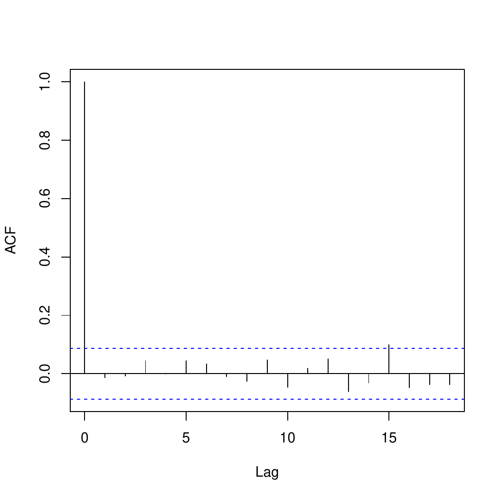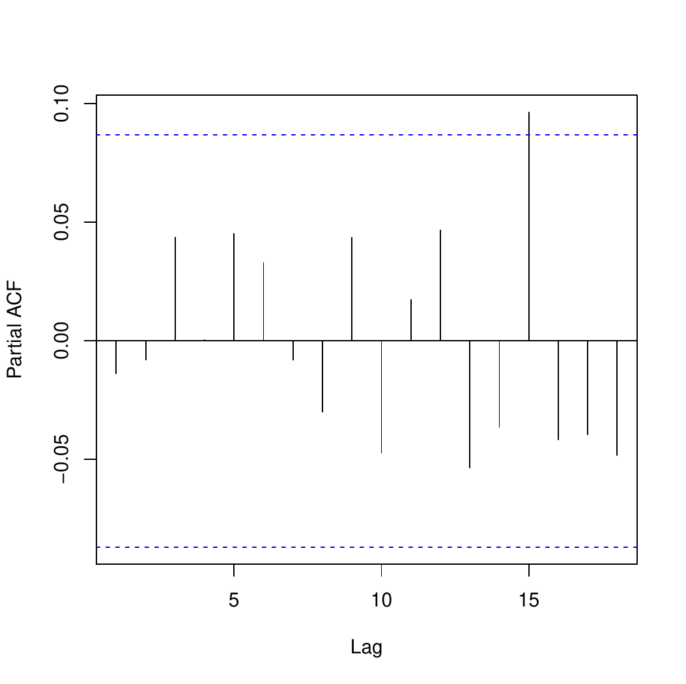</p>
<p>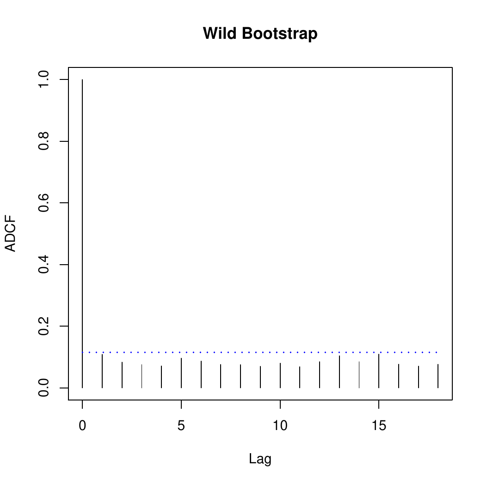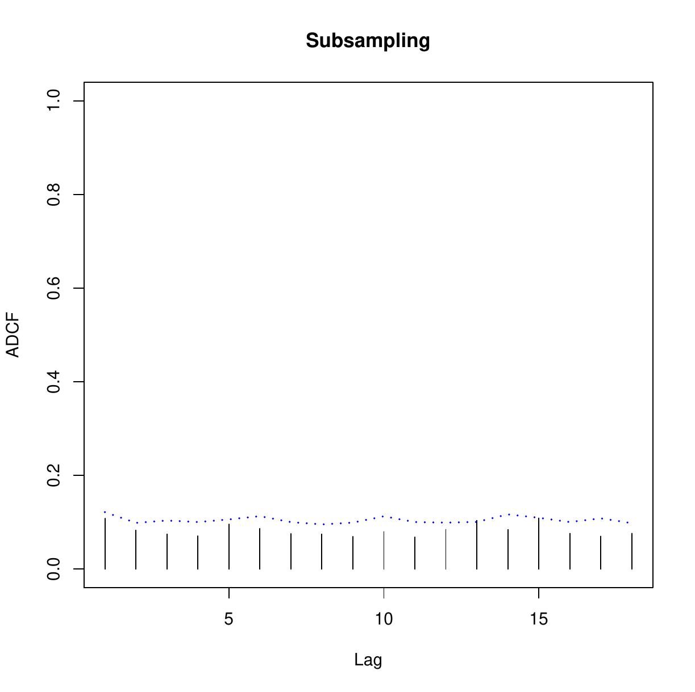</p>
<figcaption>Figure 2: Sample ACF, PACF and ADCF plots of the mortality
residuals of model indicating that the new residuals can be taken as
white noise.</figcaption>
</figure>

The calls for both model fits and their diagnostic plots are given
below. ADCF plots (lower plots of Figures [1](#fig:corFirst) and
[2](#fig:corSecond)) are constructed using both resampling schemes
explained in the previous section: independent wild bootstrap (with
$b=499$ replications) and subsampling.

``` r
temp <- tempr - mean(tempr)  # center temperature
temp2 <- temp^2
trend <- time(cmort)
fit <- lm(cmort ~ trend + temp + temp2 + part, na.action = NULL)
Residuals <- as.numeric(resid(fit))
##Correlation plots
acf(Residuals, lag.max = 18,main = "")
pacf(Residuals, lag.max = 18,main = "")
ADCFplot(Residuals, MaxLag = 18, main = "Wild Bootstrap", method = "Wild")
ADCFplot(Residuals, MaxLag = 18, main = "Subsampling", method = "Subsampling")

fit2 <- arima(cmort, order =c(2, 0, 0), xreg = cbind(trend, temp, temp2, part))
Residuals2 <- as.numeric(residuals(fit2))
##Correlation plots
acf(Residuals2, lag.max = 18, main = "")
pacf(Residuals2, lag.max = 18, main = "")
ADCFplot(Residuals2, MaxLag = 18, main = "Wild Bootstrap", method = "Wild")
ADCFplot(Residuals2, MaxLag = 18, main = "Subsampling", method = "Subsampling")
```

To formally confirm the absence of any serial dependence among the new
residuals of model \@ref(eq:regr2), as shown in Figure
[2](#fig:corSecond), we perform univariate tests of independence based
on the test statistic $T_n$ given in \@ref(eq:Tn). We use the
`UnivTest()` function from our package with argument
`testType = "covariance"` (default option). In order to examine the
effect of using different bandwidths, we choose
$p = \left[3n^\lambda\right]$ for $\lambda=0.1$, $0.2$ and $0.3$, that
is $p=6$, $11$, and $20$, and we apply Bartlett kernel. The resulting
$p$-values are $0.118$, $0.170$ and $0.208$ respectively suggesting
acceptance of independence. We calculated $p$-values for $b=499$
independent wild bootstrap replications. The bootstrap procedure can be
computed on multiple cores simultaneously by using the argument
`parallel = TRUE` (they take about 10, 14 and 23 seconds respectively on
a standard laptop with Intel Core i5 system and CPU 2.30 GHz):

``` r
UnivTest(Residuals2, type = "bartlett", p = 6, b = 499, parallel = TRUE)

##         Univariate test of independence based on distance covariance
##
## data:  Residuals2, kernel type: bartlett, bandwidth=6, boot replicates 499
## Tn = 67.7344, p-value = 0.118

UnivTest(Residuals2, type = "bartlett", p = 11, b = 499, parallel = TRUE)

##         Univariate test of independence based on distance covariance
##
## data:  Residuals2, kernel type: bartlett, bandwidth=11, boot replicates 499
## Tn = 125.6674, p-value = 0.170

UnivTest(Residuals2, type = "bartlett", p = 20, b = 499, parallel = TRUE)

##         Univariate test of independence based on distance covariance
##
## data:  Residuals2, kernel type: bartlett, bandwidth=20, boot replicates 499
## Tn = 225.9266, p-value = 0.208
```

We compare the proposed test statistic with other test statistics to
check its performance. In particular, we consider the Box-Pierce
[@BoxPierce] test statistic
$$BP = n\sum_{j=1}^{p}{\hat{\rho}^2(j)},$$
the Ljung-Box [@LjungBox] test statistic
$$LB = n(n+2)\sum_{j=1}^{p}{(n-j)^{-1}\hat{\rho}^2(j)},$$
the test statistic proposed by @Hong
$$T_n^{(1)} = n\sum_{j=1}^{n-1}{k^2(j/p)\hat{\rho}^2(j)}$$
and the test statistic $T_n^{(2)}$ proposed by @HongB defined in
\@ref(eq:Tn2) with $\mathcal{W}(u,v) = \Phi(u)\Phi(v)$, and
$\Phi(\cdot)$ being the cumulative distribution function of standard
normal. For the aforestated bandwidth values, all these alternative test
statistic give large $p$-values indicating the absence of any serial
dependence among the new residuals. More precisely, BP and LB give
$0.848$, $0.906$, $0.170$ and $0.844$, $0.901$, $0.142$ respectively. BP
and LB based tests are performed in R by the function `Box.test()` as
follows:

``` r
box1 <- Box.test(Residuals2, lag = 6)
box2 <- Box.test(Residuals2, lag = 11)
box3 <- Box.test(Residuals2, lag = 20)
ljung1 <- Box.test(Residuals2, lag = 6, type = "Ljung")
ljung2 <- Box.test(Residuals2, lag = 11, type = "Ljung")
ljung3 <- Box.test(Residuals2, lag = 20, type = "Ljung")
```

The $p$-values obtained by $T_n^{(1)}$ are $0.896$, $0.930$ and $0.870$
respectively. $T_n^{(2)}$ gives the following $p$-values: $0.854$,
$0.752$ and $0.504$ respectively. $T_n^{(1)}$ and $T_n^{(2)}$ are
calculated by employing the Bartlett kernel. These $p$-values are
calculated for $b=499$ ordinary bootstrap replications. The R functions
for constructing these test statistics are beyond the scope of this
paper and are available from the authors upon request.

## Bivariate financial time series

We now analyze the monthly log returns of the stocks of International
Business Machines (IBM) and the S&P 500 composite index starting from 30
September 1953 to 30 December 2011 for 700 observations. A larger
dataset is available in our package by the object `ibmSp500` starting
from January 1926 for 1032 observations. It is actually a combination of
two smaller datasets: the first one was first reported by @Tsay10 and
the second one was first reported by @Tsay14. ACF and ADCF plots of the
original series are provided in Figure [3](#fig:original), whereas
Figure [4](#fig:squared) shows the ACF and ADCF plots of the squared
series.

<figure id="fig:original">
<p>(a)<br />
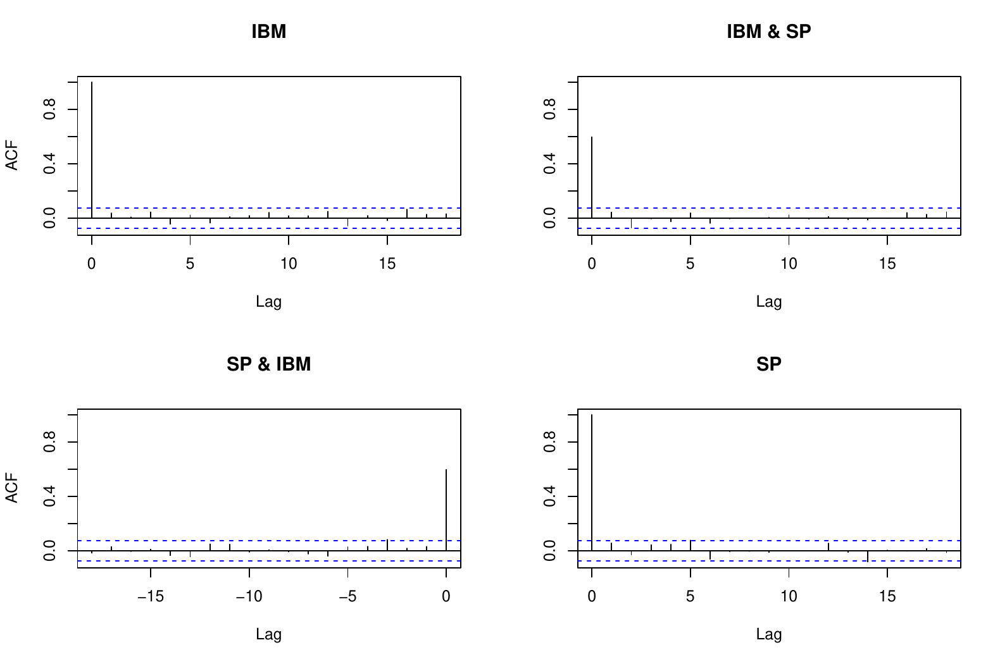<br />
(b)<br />
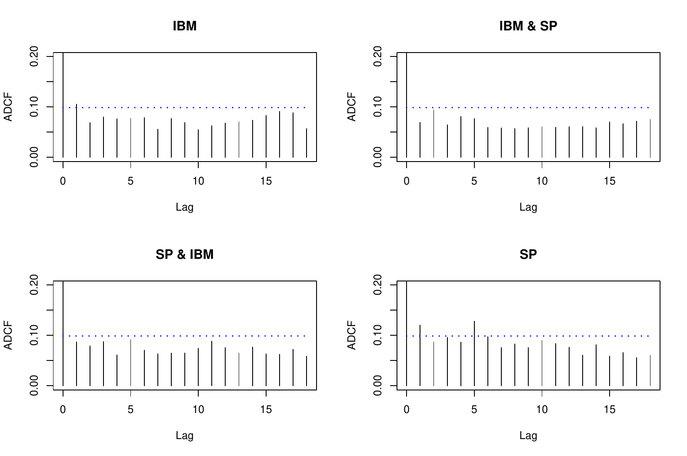<br />
</p>
<figcaption>Figure 3: (a) The sample ACF of the original series. (b) The
sample ADCF of the original series.</figcaption>
</figure>

<figure id="fig:squared">
<p>(a)<br />
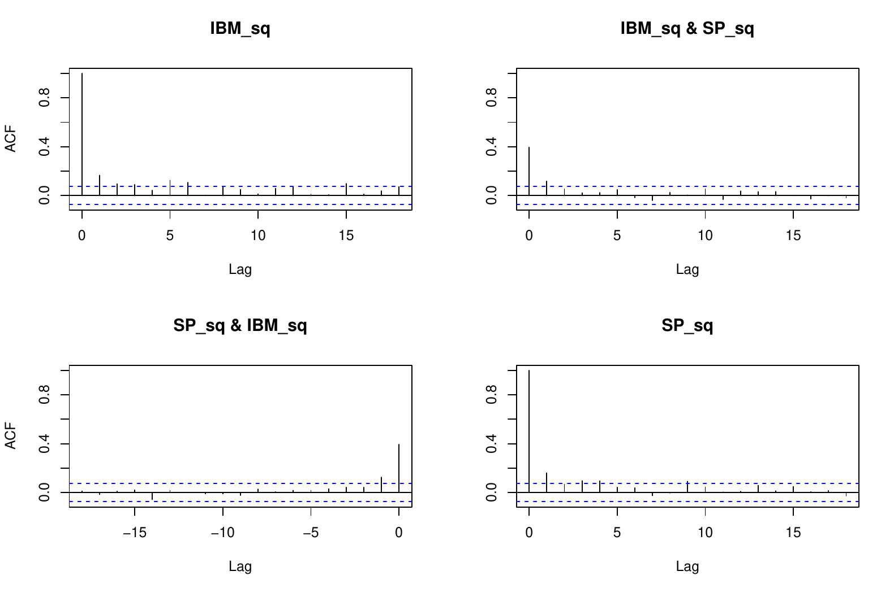<br />
(b)<br />
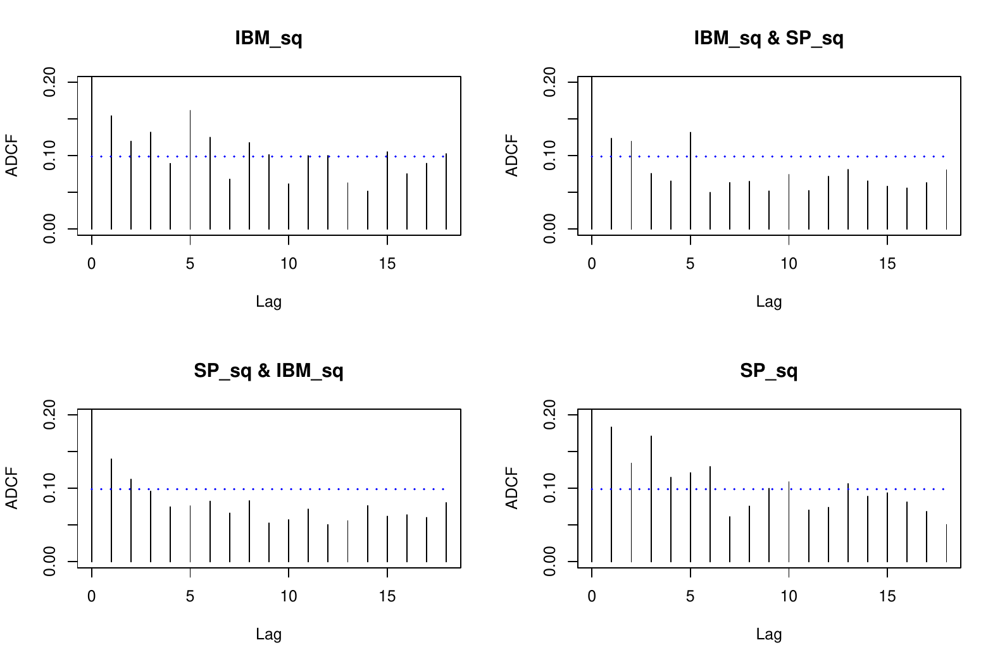<br />
</p>
<figcaption>Figure 4: (a) The sample ACF of the squared series. (b) The
sample ADCF of the squared series.</figcaption>
</figure>

The R commands for constructing these plots are as follows:

``` r
data(ibmSp500)
new_data <- tail(ibmSp500[,2:3], 700)
series <- log(new_data + 1)
t=scale(lseries, center = TRUE, scale = FALSE)
t2 <- at^2
olnames(at) <- c("IBM", "SP")
olnames(at2) <- c("IBM_sq", "SP_sq")
cf(at, lag.max = 18)
cf(at2, lag.max = 18)
ADCFplot(at, MaxLag = 18, ylim = c(0, 0.2))
ADCFplot(at2, MaxLag = 18, ylim = c(0, 0.2))
```

The ACF plots of the original series (upper panel of Figure
[3](#fig:original)) suggest no serial correlation among observations,
while the ACF plots of the squared series (upper panel of Figure
[4](#fig:squared)) imply strong dependence. This confirms the
conditional heteroscedasticity in the monthly log returns. However, the
ADCF plots for both original and squared series (lower panels of Figures
[3](#fig:original) and [4](#fig:squared)) suggest dependence. Indeed,
choosing $p=\left[3n^\lambda\right]$ for $\lambda=0.1$, $0.2$ and $0.3$,
that is $p = 6$, $12$ and $22$, and employing Bartlett kernel,
$\overline{T}_n$ gives low $p$-values ($0.022$, $0.014$ and $0.020$
respectively). The calls for these three multivariate tests of
independence can be found below (they take about 2, 3 and 6 minutes
respectively for $b=499$ bootstrap replications on a standard laptop
with Intel Core i5 system and CPU 2.30 GHz):

``` r
mADCFtest(at, "bartlett", p = 6, b = 499, parallel = TRUE)

##        Multivariate test of independence based on distance correlation
##
## data:  at, kernel type: bartlett, bandwidth=6, boot replicates 499
## Tnbar = 34.1743, p-value = 0.022

mADCFtest(at, "bartlett", p = 12, b = 499, parallel = TRUE)

##        Multivariate test of independence based on distance correlation
##
## data:  at, kernel type: bartlett, bandwidth=12, boot replicates 499
## Tnbar = 71.1713, p-value = 0.014

mADCFtest(at, "bartlett", p = 22, b = 499, parallel = TRUE)

##        Multivariate test of independence based on distance correlation
##
## data:  at, kernel type: bartlett, bandwidth=22, boot replicates 499
## Tnbar = 122.9424, p-value = 0.02
```

To compare the performance of the proposed test statistic
$\overline{T}_n$, we consider the multivariate Ljung-Box statistic
[@Hosking] defined by:
$$mLB = n^2\sum_{j=1}^{p}{(n-j)^{-1}\mbox{tr}\{\widehat{\Gamma}'(j)\widehat{\Gamma}^{-1}(0)\widehat{\Gamma}(j)\widehat{\Gamma}^{-1}(0)\}}$$
where $\widehat{\Gamma}(\cdot)$ is the ordinary covariance matrix. In
contrast to the $\overline{M}_n$'s results, $mLB$ gives large $p$-values
($0.218$, $0.731$ and $0.525$) respectively. The
[*portes*](https://CRAN.R-project.org/package=portes) [@portes] package
needs to be installed in order to perform tests of independence based on
$mLB$ statistic:

``` r
> library(portes)
> LjungBox(at, c(6, 12, 22))
```

Assuming that the bivariate log returns follows a VAR model and
employing the AIC to choose its best order, we obtain that a VAR(2)
model fits the data well. Figure [5](#fig:res) shows the ACF plots
(upper panel) and ADCF plots (lower panel) of the residuals after
fitting a VAR(2) model to the original bivariate log return series using
the function `VAR()` from the
[*MTS*](https://CRAN.R-project.org/package=MTS) [@MTS] package.

<figure id="fig:res">
<p>(a)<br />
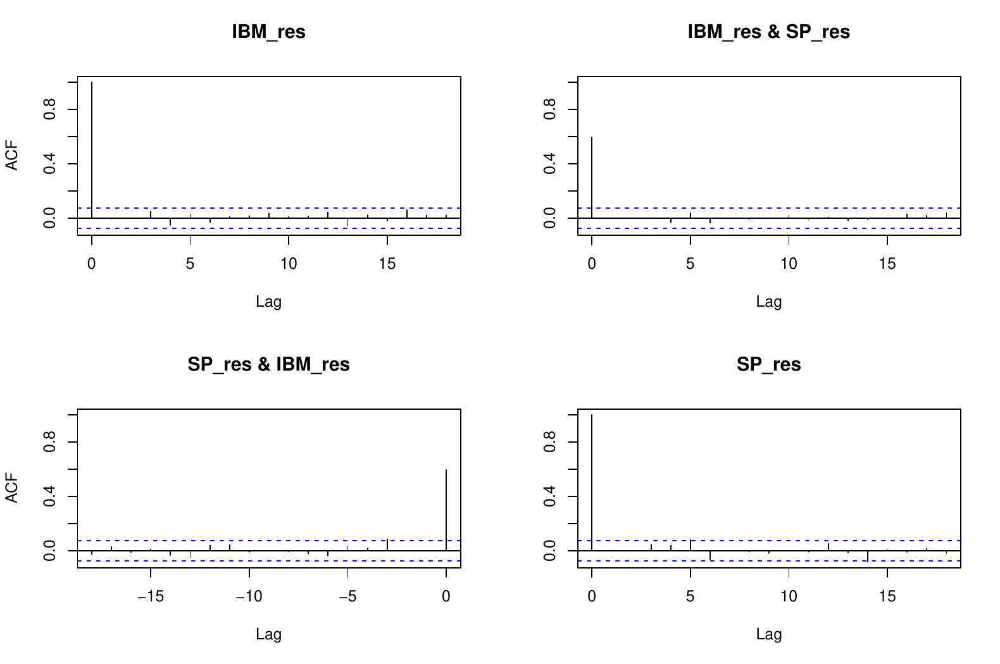<br />
(b)<br />
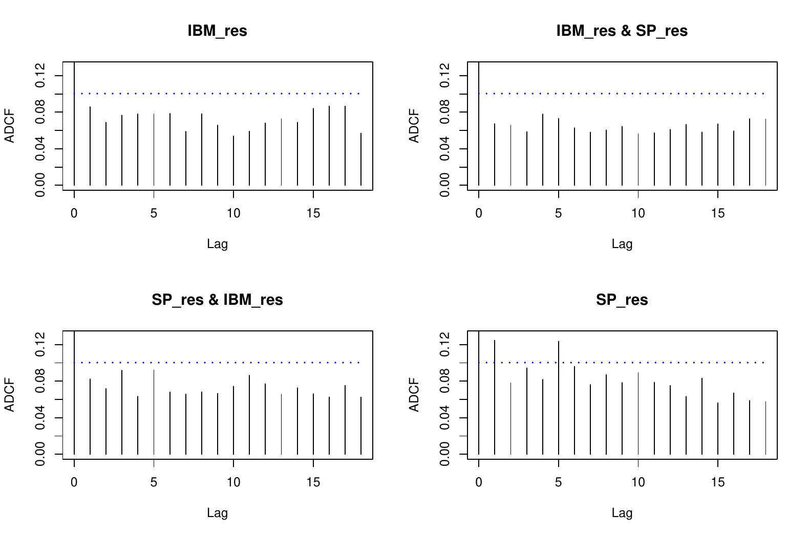<br />
</p>
<figcaption>Figure 5: (a) The sample ACF and (b) sample ADCF of the
residuals after fitting VAR(2) model to the original
series.</figcaption>
</figure>

In contrast to the ACF plot, the ADCF plot still indicates some
dependence among the residuals. Constructing tests of independence based
on $\overline{T}_n$ and $mLB$ for the same choices of bandwidth, $p=6$,
$12$, $22$, we confirm this visual result. In particular, employing a
Bartlett kernel, $\overline{T}_n$ statistic gives low $p$-values
($0.036$, $0.018$ and $0.034$ respectively) whereas the $mLB$ statistic
yields large $p$-values ($0.669$, $0.958$ and $0.806$ respectively). The
calls for the plots of Figure [5](#fig:res) and the corresponding tests
of independence are as follows:

``` r
library(MTS)
model <- VAR(at, 2)
resids <- residuals(model)
colnames(resids) <- c("IBM_res", "SP_res")
windows(9, 6)
acf(resids, lag.max = 18)
mADCFplot(resids, MaxLag = 18, ylim = c(0, 0.13))

## Tests of independence based on \overline{T}_n
mADCFtest(resids, "bartlett", p = 6, b = 499, parallel = TRUE)

##         Multivariate test of independence based on distance correlation
##
## data:  resids, kernel type: bartlett, bandwidth=6, boot replicates 499
## Tnbar = 29.9114, p-value = 0.036

mADCFtest(resids, "bartlett", p = 12, b = 499, parallel = TRUE)

##         Multivariate test of independence based on distance correlation
##
## data:  resids, kernel type: bartlett, bandwidth=12, boot replicates 499
## Tnbar = 64.7754, p-value = 0.018

mADCFtest(resids, "bartlett", p = 22, b = 499, parallel = TRUE)

##        Multivariate test of independence based on distance correlation
##
## data:  resids, kernel type: bartlett, bandwidth=22, boot replicates 499
## Tnbar = 115.3462, p-value = 0.034

## Tests of independence based on mLB
LjungBox(resids, c(6, 12, 22))
```

# Summary and further research {#section:conclusion}

There have been many works in the literature based on [@Szekely]
distance covariance methodology. The R package *energy*
[@SzekelyRizzoManual], provides functions that cover this methodology.
However, there is no published package that includes functions about
distance covariance for time series data. *dCovTS* contributes to
filling this gap by providing functions that compute distance covariance
and correlation functions for both univariate and multivariate time
series. We also include functions that develop univariate and
multivariate tests of serial dependence based on distance covariance and
correlation functions.

There is a number of possible extensions of this package, and some of
them are not covered by existing theory and can be seen as further
research. One possible direction is to develop a theory based on partial
ADCV or conditional ADCV and a related testing methodology to identify
possible dependencies among time series (see @SzekelyRizzo for partial
distance covariance methodology and @PoczosPartial, @Wangetal for
conditional distance covariance methodology; all three works deal with
independent random variables). Among the many applications of partial
correlation are graphical models. Thus, a graphical modeling theory
based on partial ADCV could be carried out and this methodology can be
included for a future version of this package.

# Acknowledgments

The authors thank Tobias Liboschik for his considerable help on the
development of this package. The authors would also like to thank
Dominic Edelmann for carefully checking the package and making helpful
comments and suggestions for its improvement. In addition, we would like
to extend our gratitude to R. Bivand and to an anonymous reviewer whose
comments improved our original submission.
:::
