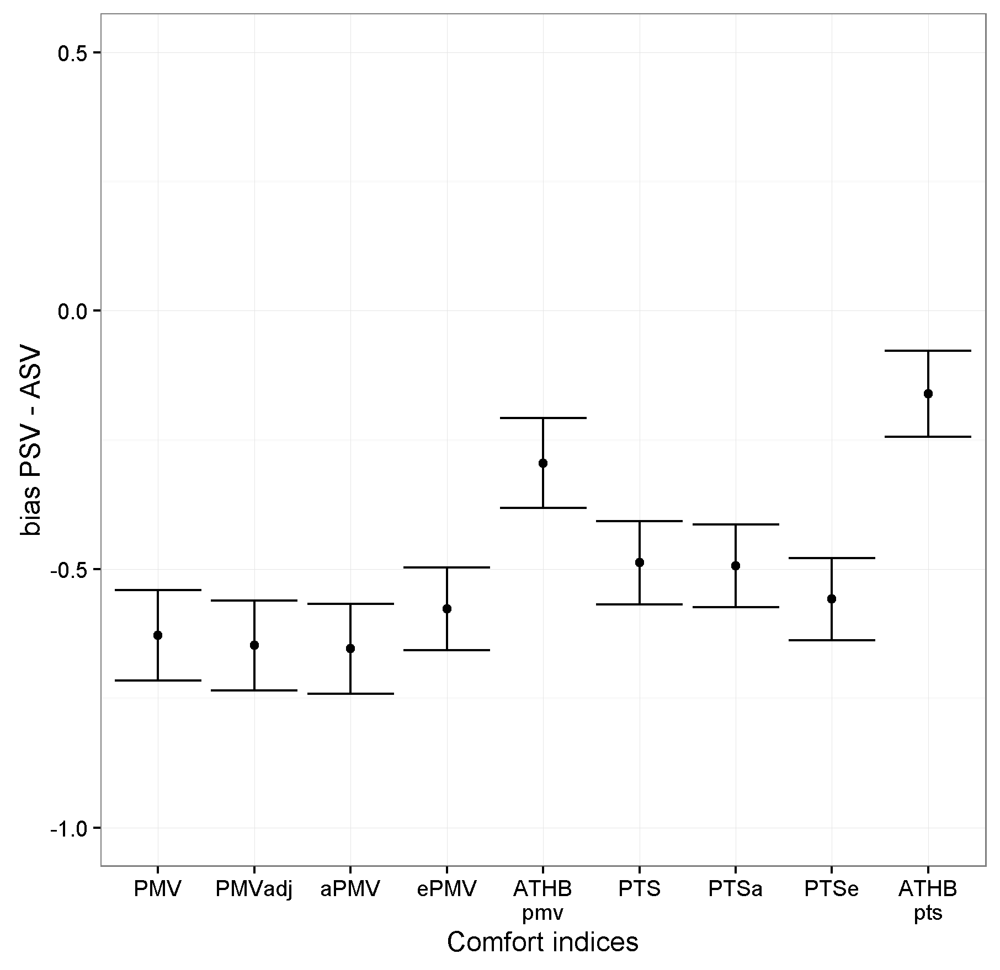
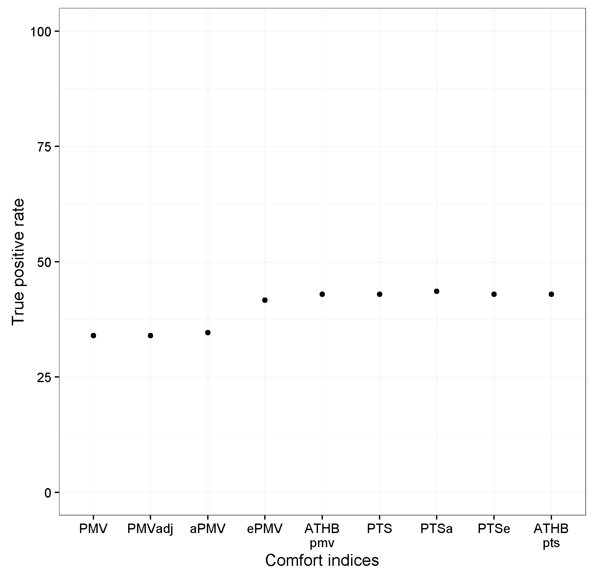

# Introduction

Since the 1960's, researchers in the field of thermal comfort generated
a number of thermal comfort indices (see [1.1](#sec:Review) for
details). The three most common indices are the predicted mean vote
(PMV) introduced by @Fanger1970, the standard effective temperature
(SET) by @Gagge1986, and the adaptive comfort equation as presented
e.g. in @DINEN15251 and @ASHRAE2013. The latter is based on the work of
@Auliciems1981, @deDear1997, @Nicol2002 and others.

The purpose of these indices is the prediction of a) thermally
acceptable indoor conditions or b) the evaluation of indoor conditions
by a group of persons. The calculation procedures and/or equations for
the indices are described in the literature they are introduced.
However, in most cases the code implementation needs to be done by each
researcher individually. Such process is a source for errors; chances
are high that the codes of two researchers do not lead to the same
outcome given identical input parameters. Therefore, I introduce the R
package, [*comf*](https://CRAN.R-project.org/package=comf), that enables
the calculation of the most common thermal comfort indices and several
new indices. The objective is to create a publicly available reference
for comparisons and benchmarking.

Additional functions of this package allow a comparison between the
outcome of those indices compared to subjective evaluations obtained by
a given sample of occupants in a building. Such evaluation of the
indices performance is seldom found in thermal comfort research. Given
the increasing number of indices, such comparison needs to be done more
often in order to judge under which circumstances which index performs
best [@Schweiker2015f; @Schweiker2016].

In this paper, existing thermal comfort indices are reviewed together
with available tools and code implementations for their calculation.
This is followed by the introduction of the R package, *comf*, and an
example application to an existing dataset.

## Review of thermal comfort indices {#sec:Review}

Table [1](#tab:indices) gives an overview of the indices dealt with in
this article or included in the R package, *comf*. Thereby, this list is
not exclusive given the high number of additional comfort indices.

The indices can be grouped according to their outcome in those
predicting

-   a mean vote on the $7$-point thermal sensation scale,

-   a neutral or comfortable temperature, or

-   other values related to the perception of the thermal indoor
    environment.

The $7$-point thermal sensation scale is the standard scale for the
assessment of thermal perception given to subjects and is coded $-3$
cold, $-2$ cool, $-1$ slightly cool, $0$ neither cold nor warm, $+1$
slightly warm, $+2$ warm, $+3$ hot [@ISO7726]. Traditionally, this scale
was used as categorical scale, but recent studies are using either a
categorical or a continuous version [@Schweiker2016c].

The neutral temperature is a set of operative temperatures evaluated in
average as neutral (neither cold nor warm) on the $7$-point thermal
sensation scale [@Auliciems1981a; @humphreys1978outdoor]. Sometimes,
this is also referred to as comfortable temperature [@Schweiker2016c].
Additional members of this group of indices are the adaptive comfort
temperatures [@Brager2001; @Nicol2010]

The other values are e.g. related to the thermal strain of an individual
due to the indoor thermal environment [@Gagge1986], the exergy
consumption rate of the human body [@Shukuya2009], or the distance of
observed operative temperature or mean skin temperature to the
thermoneutral zone [@Kingma2016] and will be explained below.

::: {#tab:indices}
  --------------------------------------------------------------------------------------------------------------------------------------------------
  Index           Input variables^1^                            Output                                                Reference
  --------------- --------------------------------------------- ----------------------------------------------------- ------------------------------
  PMV             ta, tr, rh, vel, clo, met                     Predicted mean vote ($-3$ to $+3$)                    [@Fanger1970]

  PMV$_{adj}$     ta, tr, rh, vel, clo, met                     Predicted mean vote ($-3$ to $+3$)                    [@ASHRAE2013; @Schiavon2014]

  ePMV            ta, tr, rh, vel, clo, met, e or asv           Predicted mean vote ($-3$ to $+3$)                    [@FangerAndToftum_2002]

  aPMV            ta, tr, rh, vel, clo, met, $\lambda$ or asv   Predicted mean vote ($-3$ to $+3$)                    [@Yaoetal_2009]

  ATHB$_{pmv}$    ta, tr, rh, vel, met, trm, psych              Predicted mean vote ($-3$ to $+3$)                    [@Schweiker2015f]

                                                                                                                      

  PTS             ta, tr, rh, vel, clo, met                     Predicted thermal sensation ($-3$ to $+3$)            [@McIntyre1980]

  PTSe            ta, tr, rh, vel, clo, met, e or asv           Predicted thermal sensation ($-3$ to $+3$)            [@Gao2015]

  PTSa            ta, tr, rh, vel, clo, met, $\lambda$ or asv   Predicted thermal sensation ($-3$ to $+3$)            [@Gao2015]

  ATHB$_{pts}$    ta, tr, rh, vel, met, trm, psych              Predicted thermal sensation ($-3$ to $+3$)            [@Schweiker2016]

  tAdapt15251     trm                                           Adaptive comfort temperature                          [@DINEN15251; @Nicol2010]

  tAdaptASHRAE    tmmo                                          Adaptive comfort temperature                          [@Brager2001]

  tnAuliciems     ta, tmmo                                      Neutral temperature                                   [@Auliciems1981a]

  tnHumphreysNV   tmmo                                          Neutral temperature in natural-ventilated buildings   [@humphreys1978outdoor]

  tnHumphreysAC   tmmo                                          Neutral temperature in climate-controlled buildings   [@humphreys1978outdoor]

  PPD             ta, tr, rh, vel, clo, met                     Predicted percentage dissatisfied (0 to 100)          [@Fanger1970]

  SET             ta, tr, rh, vel, clo, met                     Standard effective temperature                        [@Gagge1986]

  dTNZ            ta, vel, clo, met                             Distance to thermoneutral zone                        [@Kingma2016]

  Ex              ta, tr, rh, vel, clo, met, tao, rho           Human body exergy consumption rate                    [@Shukuya2009]

                                                                                                                      
  --------------------------------------------------------------------------------------------------------------------------------------------------

  : Table 1: Thermal comfort indices included in the R package, *comf*,
  their input variables, output description, values, and references
:::

::: {#tab:indices}
  --------------------------------------------------------------------------------------------------------------------------
  ^1^ta = air temperature; tr = radiant temperature; rh = relative humidity; vel = air velocity; clo = clothing insulation level;

  met = metabolic rate; tao = outdoor air temperature; rho = outdoor relative humidity; trm = running mean outdoor temperature;

  tmmo = monthly mean outdoor temperature; e = expectancy factor; $\lambda$ = adaptive coefficient;

  psych = factor related to psychological adaptation; asv = actual sensation vote
  --------------------------------------------------------------------------------------------------------------------------

  : 
:::

The first group of indices predicting a mean vote on the thermal
sensation scale consists of the PMV-index and its alterations (s. below)
together with the predicted thermal sensation (PTS) based on the
SET-index and corresponding adjusted versions.

The PMV index is based on the assumption that comfortable conditions are
perceived when there is a balance between the heat generated by the
metabolism and the heat lost or gained through convection, radiation,
and evaporation [@Fanger1970].

Alterations to the PMV-index are

-   the adjusted PMV (PMV$_{adj}$), which modifies the PMV model for
    elevated air velocities [@ASHRAE2013; @Schiavon2014],

-   the ePMV, which uses the expectancy factor, e, to account for
    variations in the expectation of people [@FangerAndToftum_2002],

-   the aPMV, which alters the PMV based on an adaptive coefficient,
    $\lambda$, which represents the sum of behavioural, physiological,
    and psychological adaptation [@Yaoetal_2009], and

-   the ATHB$_{pmv}$, which adjusts the input values for clothing level
    and metabolic rate based on individual equations for the three just
    mentioned adaptive processes [@Schweiker2015f].

In order to calculate the PTS it is necessary to calculate the SET first
(s. below). Then, PTS can be calculated through the equation
[@McIntyre1980]:

$$PTS = .25 \cdot SET - 6.03.$$

Adjusted versions of the PTS are parallel to the alterations to PMV,

-   the PTSe using the expectancy factor [@Gao2015],

-   the PTSa using the adaptive coefficient [@Gao2015], and

-   the ATHB$_{pts}$ changing the input values of clothing level and
    metabolic rate for the calculation of SET [@Schweiker2016].

The second group of indices consists of the adaptive comfort equations
given e.g. in @DINEN15251 and @Brager2001 as well as the equations for
the neutral temperatures by @Auliciems1981a and @humphreys1978outdoor.
Both types of equations calculate the indoor environmental temperature
to be evaluated as neutral on the $7$-point thermal sensation scale or
as comfortable.

The third group consists of the predicted percentage of dissatisfied
(PPD), the SET, the distance to the thermoneutral zone (dTNZ), and the
exergy consumption rate (Ex).

The predicted percentage of dissatisfied (PPD) is calculated based on
the PMV value as described in @Fanger1970 by

$$PPD = 100 - 95 e^{\left[-\left(.3353 \cdot PMV^4+.2179 \cdot PMV^2\right)\right]}.$$

The SET is \"the temperature of an imaginary environment at 50% relative
humidity, \<0.1 m/s average air speed, and mean radiant temperature
equal to average air temperature, in which total heat loss from the skin
of an imaginary occupant with an activity level of 1.0 met and a
clothing level of 0.6 clo is the same as that from a person in the
actual environment, with actual clothing and activity level\"
[@ASHRAE2013] and is based on the work by Gagge and his group
[@Gagge1986].

The dTNZ was introduced by @Kingma2016 and presents a biophysical
approach to predict thermal sensation. Similar to the ATHB, the dTNZ is
a new concept and still needs to be further evaluated. The same is true
for the concept of Ex. A lower Ex was shown to be related to conditions
regarded as thermally comfortable. @Schweiker2016a [@Simoneetal2011]
demonstrated that there is a relationship between Ex, thermal sensation,
and thermal acceptance.

## Existing software and tools

Only few of the thermal comfort indices can be calculated with existing
tools. Table [2](#tab:tools) gives an overview of existing software,
applications, and code implementations. In addition, several building
energy performance simulation programs, e.g. Energy+, do offer the
option to calculate the PMV value or other value.

Notable exceptions are the calculations of the most common indices: a
BASIC code is given in @ISO7730 for the calculation of PMV and PPD and a
FORTRAN code for the calculation of SET was presented in @Gagge1986.
Recently a JavaScript-version for SET calculation was included in
@ASHRAE2013. However, this version does not use the full code for
calculation of SET by @Gagge1986 or @Fountain1995, but a modified
version. The difference is that for the SET-code used in @ASHRAE2013,
the part related to convection from metabolically-generated air movement
has been removed. This was done in order to have a smooth transition
from original PMV values up to .15 m/s of air velocity to the adjusted
PMV values starting above this air velocity.

Another source for code implementations is the source code of the CBE
comfort tool, which is available at
<https://github.com/CenterForTheBuiltEnvironment/comfort_tool>. This
includes code in JavaScript and Python for the calculation of PMV,
PMV$_{adj}$, the adaptive comfort temperature and range, and the
modified SET calculation as described in @ASHRAE2013.

::: {#tab:tools}
  --------------------------------------------------------------------------------------------------------------------------------------------------------------------------
  Name                          Type                       Comfort indices                 Link/Source
  ----------------------------- -------------------------- ------------------------------- ---------------------------------------------------------------------------------
  ASHRAE Thermal Comfort Tool   Software                   PMV, PMVadj, PPD, SET, Tadapt   <https://www.ashrae.org/resources--publications/bookstore/thermal-comfort-tool>

  CBE comfort tool              Web application            PMV/PMVadj, PPD, SET, Tadapt    <http://comfort.cbe.berkeley.edu/>^1^, @Fountain1995 [@Schiavon2014]

  USYD homepage                 Web application            PMV, PPD, SET, ET, + ^2^        <http://web.arch.usyd.edu.au/~rdedear/>

  ISO 7730                      Code snippets in BASIC     PMV, PPD                        @ISO7730

  Gagge et al.                  Code snippets in FORTRAN   SET, ET, + ^2^                  @Gagge1986

  ASHRAE PMV                    Code snippets in BASIC     PMV, PPD                        @ASHRAE2013

  ASHRAE SET ^3^                Code snippets in Java      SET                             @ASHRAE2013

  Schweiker et al.              Code snippets in R         HbExUnSt                        @Schweiker2016a

  Shukuya                       Excel sheet                HbExUnSt                        Shukuya
  --------------------------------------------------------------------------------------------------------------------------------------------------------------------------

  : Table 2: Existing applications, software, and code snippets for the
  calculation of thermal comfort indices
:::

::: {#tab:tools}
  ---------------------------------------------------------------------------------------------------
  ^1^The source code is available at <https://github.com/CenterForTheBuiltEnvironment/comfort_tool>

  ^2^+ = and other indices

  ^3^A version of SET fit for adjusting PMV to higher air velocities
  ---------------------------------------------------------------------------------------------------

  : 
:::

# Introduction to the package *comf*

The idea behind the R package, *comf* is to support researchers in the
field of thermal comfort not only through publicly available code
implementations for the calculation of comfort indices in R, but also
through additional functions. Therefore, the main functions of this
package can be grouped into those related to

-   the preparation of a dataset and transformation of physical
    variables,

-   the calculation of one or more comfort indices (see
    Table [1](#tab:indices)), and

-   the evaluation of the performance of a comfort index.

## Preparation of a dataset and conversion of physical variables

Each thermal comfort index requires different input parameters.
Therefore, the R package, *comf*, offers two procedures in order to
prepare a dataset to be used as input to the calculation of one or more
thermal comfort indices.

The first procedure starts with calling the function `createCond`. This
function creates a list with standard values for the variables required
for all comfort indices included in this package. Own data or further
adjustments to these values could be done as follows:

``` r
  install.packages("comf_0.1.6.tar.gz", repos=NULL, type="source")
  library(comf)
  
  lsCond <- createCond()
  lsCond$ta <- 21:30
  lsCond$rh <- 51:60
  lsCond$met <- 1.0
```

It is important that the length of vectors assigned to the elements of
this list are either 1 or do have the same length. In above example, it
is not possible to assign a vector with 11 items to `ta`, the indoor air
temperature, and a vector with 10 items to `rh`, the relative humidity
indoors.

The second procedure starts with a dataframe containing all variables to
be used for the calculation. This procedure requires the user to know
the required variables. This dataframe can then be transferred into a
list or used directly.

``` r
  ta <- 21:30
  rh <- 51:60
  met <- 1.0
  dfCond <- data.frame(ta, rh, met)
  lsCond2 <- as.list(dfCond)
```

In addition, *comf* offers a variety of small functions to convert
variables from one type to another. This includes among others

-   `calcDewp`, which calculates the dew point temperature, given air
    temperature and relative humidity,

-   `calcEnth`, which calculates the enthalpy of the air, given air
    temperature, relative humidity, and barometric pressure,

-   `calcRH`, which calculates the relative humidity of air, given air
    temperature, mixing ratio, and barometric pressure,

-   `calcTroin`, which calculates the operative and radiant temperature
    for standard globe measurements according to @ISO7726, given air
    temperature, globe temperature, air velocity, and metabolic rate.

## Calculating one or more comfort indices

Before the preparation of a dataset, it is important to know that the
structure of the input to functions for the calculation of one specific
index such as `calcATHB` differs to that of the main function,
`calcComfInd`. The latter requires a list or data frame with variables
as described below, while the former works with vectors or data frames.

There are again two possibilities to calculate one or more comfort
indices.

The first one uses the main function of this package, `calcComfInd`.
This function requires a list or data frame of variables together with a
vector of comfort indices to be calculated, e.g. `request="all"` to
calculate all indices or `request=c("ATHBpmv", "pmv")` to calculate
these two. The list of variables can consist of one item per variable or
several items per variable, i.e. one value for each input parameter, or
for some parameters 234 values and for the others one parameter. The
rationale behind this is that very often, variables such as age, gender,
or metabolic rate do not differ in a given dataset, while others like
the indoor air temperature are different for each case. A complete list
of indices to be calculated can be found in the help file of
`calcComfInd` or obtained calling `listOfRequests()`.

The function `calcComfInd` checks whether there is only one or more
values for each variable and whether all variables required for the
thermal comfort index to be calculated exist in the list. In case one or
more required variables do not exist, the index is calculated using
pre-defined standard values for these variables. In such case a warning
is given at the end of the calculation in order to inform the user about
the missing variable(s) and the value(s) used for the calculation.

``` r
# using lsCond from above does not produce a warning
calcComfInd(lsCond, request="all")

# using lsCond2 from above displays 31 warnings which report
# the corresponding standard values used
calcComfInd(lsCond2, request="all")
warnings()

# the results however are identical
```

Individual functions, e.g. `calcSET` to calculate SET, can be used for
the second possibility to calculate one or more comfort indices. With
this procedure, one can use a data frame or a list of vectors to
calculate a specific thermal comfort index. The list of required
variables as well as information about the standard values used when a
variable is missing is included in each helpfile, e.g. `?calcSET`.

The following example illustrates the usage for multiple input lines:

``` r
ta <- c(20,22,24)
tr <- ta
vel <- rep(0.15,3)
rh <- rep(50,3)

maxLength <- max(sapply(list(ta, tr, vel, rh), length))
SET <- sapply(seq(maxLength), 
function(x) { calcSET(ta[x], tr[x], vel[x], rh[x]) } )
```

## Evaluating the performance of one or more comfort indices

Due to the number of new or adjusted indices being presented in the
scientific literature, the comparison between the performance of them
will be an important aspect in future studies. The R package, *comf*,
includes functions for different performance criteria.

The function `calcBias` calculates the mean bias, its standard
deviation, and standard error between the actual (observed) thermal
sensation vote (ASV) and the predicted thermal sensation vote (PSV)
[@Humphreys2002]. This is calculated according to

$$mean \ bias = mean(PSV_{i} - ASV_i),$$
where $i$ denotes the individual vote.

The true positive rate (TPR) is the proportion of true predicted cases,
where the categorical ASV is equal to the categorical PSV
[@Schweiker2015f]. This can be calculated using the function
`calcTPRTSV`, which calculates

$$TPR = \frac{1}{n}\sum_{i=1}^{k}tp_k,$$
where $k$ denotes the category of the sensation scale (e.g. *cold*), $n$
the total number of votes, and $tp$ the true positive cases, where the
categorical PSV is equal to the categorical ASV.

The function `calcAvgAcc` calculates the average accuracy between PSV
and ASV according to @Sokolova2009 by

$$average \  accuracy = \frac{1}{l} \sum_{i=1}^{l}\frac{tp_i+tn_i}{tp_i+fn_i+fp_i+tn_i},$$
where $l$ denotes the number of categories of the sensation scale, $tp$,
$tn$, $fn$, and $fp$ the number of true positives, true negatives, false
positives, and false negatives for the corresponsing class. Note that
the value of the average accuracy depends strongly on the distribution
of ASV, i.e. in case most of the ASV's are in the same category,
e.g. *neutral*, the average accuracy is very high due to the fact that
for all other categories the number of true negative predicted votes is
high as well.

# An example using data from a field experiment

The R package, *comf*, includes a data set deriving from a field
experiment. This field measurement is described in detail in
@Hawighorst2016 and @Schweiker2016. The data set included in this
package contains 156 samples, which is a subset of the original data set
with 620 samples, and was drawn with the R function `sample`.

The original data set was obtained by two field experiments in six
office buildings in southern Germany. They were conducted during the
summer periods of 2011 and 2012. Data loggers for air temperature and
relative humidity were placed in the offices. In addition outdoor air
temperature and relative humidity were measured with another data logger
on the roof of each building.

Subjects were visited up to 4 times during a two week period. The number
of votes obtained by each subject differs due to absence periods of
subjects. During each visit, subjects were asked about their thermal
sensation ($7$-point categorical scale with the categories $-3$ cold,
$-2$ cool, $-1$ slightlqy cool, $0$ neutral, $+1$ slightly warm, $+2$
warm, $+3$ hot) together with a set of additional questiqons not
relevant for this paper. While the subjects answered the paper-pencil
based questionnaire the investigator noted down the clothing level of
each subject. Written informed consent was obtained from the subjects
prior to the installment of the data loggers. The air velocity included
in the data set was estimated based on the state of window(s), door, and
table fan and detailed measurements in a single room.

::: {#tab:variables}
  ----------------------------------------------------------------------------------------------------------------------------
  Column   Variable name                      Unit                  Derivation
  -------- ---------------------------------- --------------------- ----------------------------------------------------------
  `ta`     Air temperature                    $\,^{\circ}{\rm C}$   Measured

  `tr`     Radiant temperature                $\,^{\circ}{\rm C}$   Assumed to be equal to ta

  `rh`     Relative humidity                  $\%$                  Measured

  `trm`    Running mean outdoor temperature   $\,^{\circ}{\rm C}$   Calculated from tout using the equation from @DINEN15251

  `clo`    Clothing insulation level          $CLO$                 Assessed during visit

  `tout`   Outdoor air temperature            $\,^{\circ}{\rm C}$   Measured

  `vel`    Air velocity                       $m/s$                 Assumed based on state of window(s) and door

  `met`    Metabolic rate                     $MET$                 Assumed based on @ISO7730

  `asv`    Actual sensation vote              $-$                   Obtained through questionnaire
  ----------------------------------------------------------------------------------------------------------------------------

  : Table 3: Variables included in the dataset together with their
  derivation
:::

The variables included in the dataset are presented in
Table [3](#tab:variables). Descriptive statistics of the data set
included in the package can be explored using:

``` r
library(comf)
library(psych)
data(dfField)
describe(dfField)
```

In order to calculate a number of comfort indices for the conditions
present in the data, it is recommended to start with the list of
standard values and assign the values of the data set to the
corresponding items of the list by:

``` r
# creating a list with standard values
lsField <- createCond()

# assigning the variables included in the data set to the list
variables <- c("ta", "tr", "vel", "rh", "clo", "met", "trm", "asv", "tao")
for(i in 1:length(variables)) {
    lsField[[variables[i]]] <- dfField[[variables[i]]]
}
```

For this example, the following 8 thermal comfort indices will be
calculated and compared: PMV, PMVadj, ATHBpmv, aPMV, ePMV, PTS, PTSa,
PTSe, and ATHBpts. In order to be able to calculate aPMV, ePMV, PTSa,
and PTSe, one needs to get an estimate for the adaptive coefficient and
expectancy factor. This is done using the corresponding functions of the
package by:

``` r
lsField$epCoeff <- calcepCoeff(lsField)$epCoeff
lsField$apCoeff <- calcapCoeff(lsField)$apCoeff
lsField$esCoeff <- calcesCoeff(lsField)$esCoeff
lsField$asCoeff <- calcasCoeff(lsField)$asCoeff
```

Then, the thermal comfort indices are calculated at once using the
function `calcComfInd`. Note that it would be also possible to calculate
all eight indices individually by calling their function as described
above.

``` r

indices <- c('pmv', 'pmvadj', 'apmv', 'epmv', 'ATHBpmv', 
'pts', 'ptsa', 'ptse', 'ATHBpts')
results <- calcComfInd(lsField, request = indices)
```

For the comparison between predicted thermal sensation votes and actual
thermal sensation votes, the predicted continuous sensation votes need
to be converted into categorical ones. This is necessary, because the
actual sensation vote included in the dataset was obtained using a
categorical scale. This can be done using the function `cutTSV`, which
converts continuous thermal sensation votes to categorical ones. The
conversion is done using intervals closed on the right, e.g. setting all
values higher than $-2.5$ and lower or equal $-1.5$ to the value of
$-2$.

``` r

asv.cat <- cutTSV(dfField$asv)
results.cat <- lapply(seq(length(indices)), function(i) {cutTSV(results[,i])})
names(results.cat)  <- indices
```

With the binned predicted values of thermal sensation votes, the mean
bias, its standard error, and the true positive rate (TPR) can be
calculated for each thermal comfort index individually:

``` r

# calculating mean value of bias between predicted and actual sensation vote 
# for each comfort index
meanBias <- sapply(indices, function(i) {
    calcBias(asv.cat, results.cat[[i]])$meanBias
})

# calculating standard error of bias between predicted and actual sensation vote
# for each comfort index
seBias <- sapply(indices, function(i) {
    calcBias(asv.cat, results.cat[[i]])$seBias
})

# calculating the true positive rate for each comfort index
TPR <- sapply(indices, function(i) {
    calcTPRTSV(asv.cat, results.cat[[i]])
})
```

The comparison of bias and true positive rate can be done
e.g. graphically using the R package, *ggplot2*:

``` r

library(ggplot2)
library(plyr)
library(reshape2)

group <- c("PMV", "PMVadj", "aPMV", "ePMV", "ATHB pmv", "PTS", "PTSa",
     "PTSe", "ATHB pts")
lower <- meanBias - seBias
upper <- meanBias + seBias

fig4Win <- data.frame(meanBias, TPR, group, lower, upper)
fig4Win$variable <- rep(2,9)
fig4Win$group <- factor(fig4Win$group, levels = fig4Win$group)

addline_format <- function(x,...){
    gsub('\\s','\n',x)
}

means.barplot <- qplot(x=group, y=meanBias, data=fig4Win, geom="point",
 stat="identity", position="dodge", ymax=.5) +
	scale_x_discrete(breaks=unique(fig4Win$group), 
	labels=addline_format(c("PMV","PMVadj","aPMV","ePMV",
	"ATHB pmv","PTS","PTSa","PTSe","ATHB pts")))
	
means.barplot + geom_errorbar(aes(ymax=upper,ymin=lower),
	position=position_dodge(0.9), data=fig4Win)	+
	theme_bw() + 
	xlab("Comfort indices") + 
	ylab("bias PSV - ASV") + 
	ylim(c(-1,.5))
								
## uncomment next line to save file to current working directory			
#ggsave("Fig1_MeanBias.png")

means.barplot <- qplot(x=group, y=TPR*100, data=fig4Win, geom="point",
	stat="identity", position="dodge", ymax=100) +
	scale_x_discrete(breaks=unique(fig4Win$group), 
	labels=addline_format(c("PMV", "PMVadj", "aPMV", "ePMV", "ATHB pmv",
	"PTS", "PTSa", "PTSe", "ATHB pts")))

means.barplot + 
	theme_bw() + 
	xlab("Comfort indices") + 
	ylab("True positive rate")  + 
	ylim(c(0,100))

## uncomment next line to save file to current working directory			
#ggsave("Fig1_TPR.png")
```

The result can be seen in Figure [1](#figure:TPRmBias). This shows, that
for this particular data set, the indices ATHBpmv and ATHBpts have the
lowest mean bias between predicted and actual sensation votes. Related
to the true positive rate, there are five indices with a similar
performance of around 42% of truly predicted sensation votes, while the
true positive rate of the other three indices is around 34%.

<figure id="figure:TPRmBias">
<table>
<caption> </caption>
<tbody>
<tr class="odd">
<td style="text-align: center;"></td>
<td style="text-align: center;"></td>
</tr>
<tr class="even">
<td style="text-align: center;">(a) Mean bias and standard error.</td>
<td style="text-align: center;">(b) True positive rate.</td>
</tr>
</tbody>
</table>
<figcaption>Figure 1: True positive rate for eight comfort
indices.</figcaption>
</figure>

# Summary

This article has described the R package comf. This package implements
several functions to assist researchers in the field of thermal comfort.
The main functions calculate various common and less common thermal
comfort indices. Additional functions are related to the preparation of
a suitable data set and to the comparison of observed and predicted
assessment.

# Acknowledgements

The author would like to thank Sophia Mueller for her outstanding work
during the preparation of this package. The author would like to thank
Masanori Shukuya for the permission to include the code implementation
based on the VBA code for the calculation of human body exergy
consumption rate. In addition, the author would like to thank those who
contributed to parts of the code or checked one or more of the
functions, namely Michael Kleber and Boris Kingma.
:::
