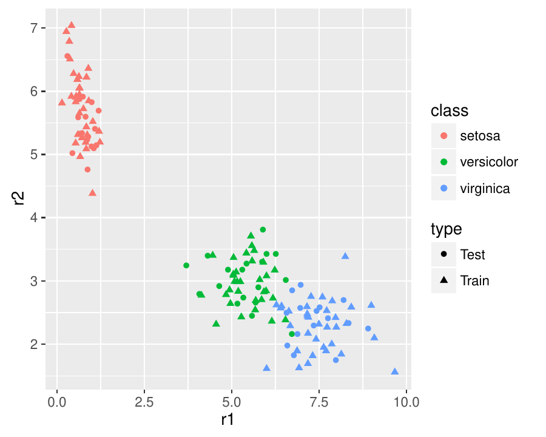
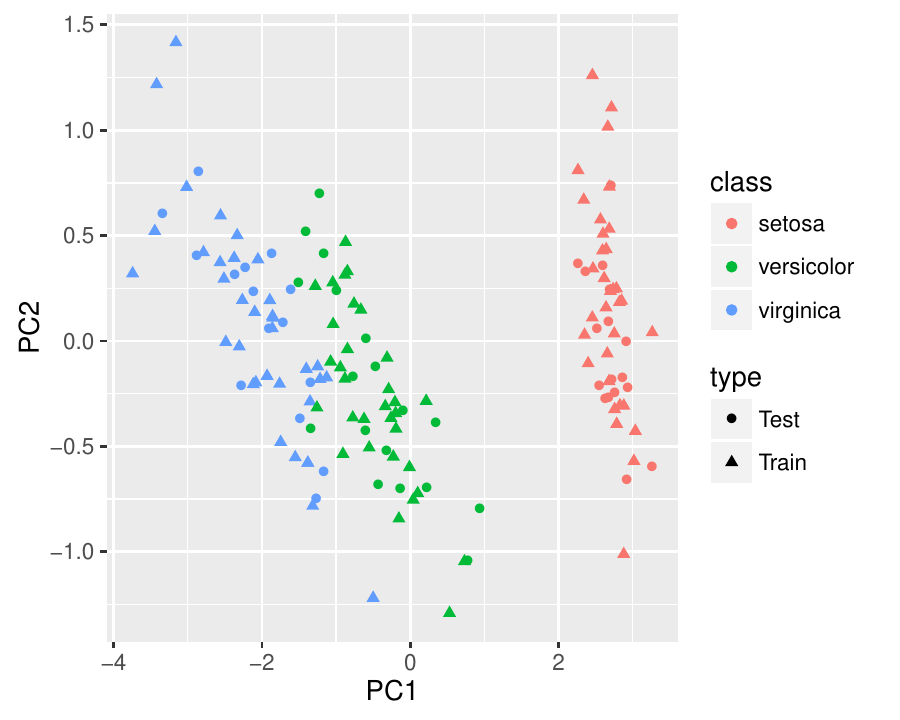
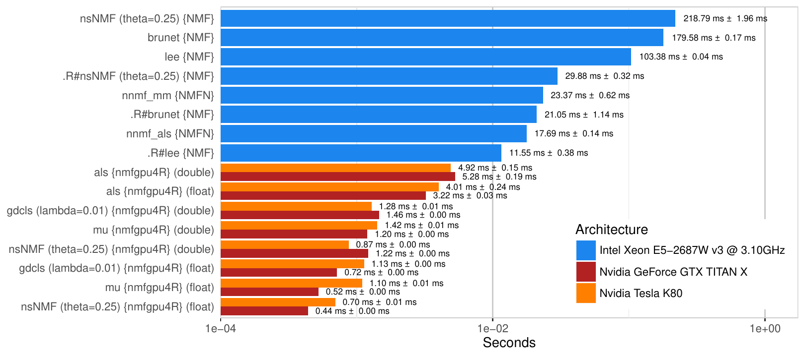
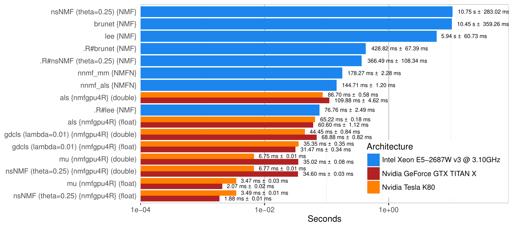

::: article
# Introduction

Dimension reduction techniques are commonly used in machine learning and
data mining tasks. For instance in text mining a corpora with thousands
of words in the vocabulary could be too complex to be learned by
*Support Vector Machines (SVM)* directly. Therefore the most important
structure within the data must be extracted prior to the learning
process. In the context of text mining new data axes at best represent
topics in the corpora, which are used to approximate the original
documents. Furthermore by reducing the feature space of the data it is
less likely to be influenced by the *Curse of Dimensionality (CoD)*
[@Bellman1961].

There are several methods to reduce the dimension of a data matrix, for
example *Principal Component Analysis (PCA)* [@Pearson1901] and *Latent
Dirichlet Allocation (LDA)* [@Blei.etal2003]. Another powerful technique
namely *Non-negative Matrix Factorization (NMF)* [@leeseung99] will be
discussed in the first section of this work. Currently available NMF
implementations require a prohibitively long computation time, which
make the usage for real-world applications impractical. Therefore we
present an implementation using the *Compute Unified Device Architecture
(CUDA)* platform with a binding to the R environment. Furthermore the
package is developed platform independent and is compatible with all
three major platforms for R: Windows, Linux and Mac OS X.

# Overview of non-negative matrix factorization

Let $X\in\mathbb{R}^{n\times m}_+$ be a matrix with $n$ attributes and
$m$ observations in the dataset, then the data matrix $X$ is
approximated by the product of two new matrices $W$ and $H$
[@leeseung01]:
$$X\approx WH$$
Each column of the matrix $W\in\mathbb{R}^{n\times r}_+$ represents a
single basis vector, whereas each column of the matrix
$H\in\mathbb{R}^{r\times m}_+$ represents an encoding vector. Therefore
a column of the data matrix can be approximated by the linear
combination of all basis vectors with one encoding vector [@leeseung01].
The importance of each basis vector can be seen by analysing the row
sums of matrix H. Row sums with a low value identify basis vectors with
very little influence on the dataset and vice versa [@skillicorn07]. It
is also important to note that the data matrix as well as both matrices
$W$ and $H$ contain only non-negative values.

Besides the general convention in the context of data mining, NMF
expects columns to represent observations of the dataset instead of
attributes [@skillicorn07], as visualized in Figure
[1](#figure:nmf_model). For that reason it is very important to read the
data matrix definition in the literature carefully.

{#figure:nmf_model width="100%" alt="graphic without alt text"}

Contrary to PCA or *Singular Value Decomposition (SVD)*, the basis
vectors are not linearly independent and thus the solution is not
unique. However the reconstruction of the data matrix is purely additive
and yields a more natural parts-based decomposition [@leeseung99].

As the factorization should represent a compressed form of the original
data matrix, one approach is to choose $r$ depending on the number of
rows and columns of the data matrix [@leeseung01]:
$$\label{eq:parameter_normalized}
r < \frac{n\cdot m}{n + m}   (\#eq:parameter-normalized)$$
In general, one should choose $r \ll m$ [@Shahnaz.etal2006]. However,
choosing the right parameter depends on the dataset and usage of the
factorization.

## Pseudo-code

1.  **Input**: Data matrix $X\in\mathbb{R}_{+}^{n\times m}$ and number
    of features $r$

2.  Initialize $W^{(0)}\in\mathbb{R}_{+}^{n\times r}$,
    $H^{(0)}\in\mathbb{R}_{+}^{r\times m}$ with non-negative values and
    set $k=0$

3.  **while** $k < k_{max}$ **and not** converged:

    1.  Fix matrix $W^{(k)}$ and compute matrix $H^{(k+1)}$

    2.  Fix matrix $H^{(k+1)}$ and compute matrix $W^{(k+1)}$

    3.  Evaluate error function to check for convergence

    4.  $k = k + 1$

4.  Set $W=W^{(k)}$ and $H=H^{(k)}$

## Initialization of factor matrices

Using a good initialization of the matrices can decrease the required
number of iterations and further improve the factorization's quality.
Depending on the chosen algorithm either only matrix $W$ or both
matrices need to be initialized.

Several different approaches were presented to execute step 2 of the
pseudo-code, the most simple one by @leeseung99 [@leeseung01] namely
initializing both matrices just with random values. A more complex
initialization uses the SVD of the data matrix [@Boutsidis2008], a very
expensive approach which should be only used if the SVD is already
available [@langville14]. However this initialization yields a unique
factorization because SVD is also unique.

In general, the convergence theory of NMF is not researched enough. For
example, @leeseung01 had shown that the multiplicative update rules
converge to a local minimum. However @gonzalez2005 disproved that and
clearly state the algorithm is only proven to converge at most to a
saddle point. In fact most of the newer algorithms are only guaranteed
to converge to a local minimum. This is mainly because NMF is a
non-convex optimization problem [@leeseung01]. In each computation step
only one of two matrices gets updated, independently from the other one.
Hence finding a global minimum is unlikely, however multiple local
minima do exist. If the execution time of an algorithm is short enough,
then a Monte-Carlo like approach can be chosen [@berry07]. That implies
executing the algorithm multiple times using different initializations
each time and picking the factorization with the best quality.

## Error function

In the literature, different error or loss functions are proposed. The
most common are *Kullback-Leibler Divergence* [@leeseung99] and
*Frobenius norm* [@paatero94; @leeseung01]. Since only the Frobenius
norm is used in this work, Kullback-Leibler divergence won't be
discussed.

In an abstract sense, the Frobenius norm of a matrix
$A\in\mathbb{R}^{n\times m}_+$ is equal to the Euclidean distance of a
vector $\vec{a}\in\mathbb{R}^{n\cdot m}_+$. To be more precise the
Frobenius norm is the square root of the sum of all squared matrix
elements [@reinhardt2013]:
$$\left\|A\right\|_F:= \sqrt{\sum_{i=1}^{n}\sum_{j=1}^{m}\left|a_{ij}\right|^2}$$
Besides this general definition there do exist alternative
representations, among others the representation using the trace of a
matrix [@reinhardt2013]:
$$\left\|A\right\|_F:= \sqrt{\text{trace}\left(A^TA\right)}$$
For optimized computation the widely used minimization problem is
rearranged using this equivalence:
$$\min \frac{1}{2}\cdot\left\|X-WH\right\|_F^2 = \min \frac{1}{2}\left(\text{trace}\left(X^TX\right) - 2\cdot \text{trace}\left(H^TW^TX\right)+\text{trace}\left(HH^TW^TW\right)\right)$$
Upon first sight the error function seems to be more expensive to
compute but actually most terms get computed during the algorithm
execution anyway [@berry07; @langville14]. Furthermore, the
$\text{trace}\left(X^TX\right)$ is constant and can be precomputed.

The following algorithms minimize the Frobenius norm, but can also
easily be derived for other error functions.

## Updating with multiplicative update rules

Multiplicative update rules have been first described by @leeseung99
[@leeseung01] and are the fastest algorithms in terms of computational
cost per iteration. In fact this type of algorithm is a special case of
the gradient-descent algorithm with a specific step size [@leeseung01].
Both update rules for the matrices $W$ and $H$ are applied in an
alternating fashion to solve step 3a) and 3b) of the NMF pseudo-code:
$$H^{\left(k+1\right)}=H^{\left(k\right)}\otimes\left(\left(W^{\left(k\right)}\right)^TX\right)\oslash\left(\left(W^{\left(k\right)}\right)^TW^{\left(k\right)}H^{\left(k\right)}\right)$$

$$W^{\left(k+1\right)} = W^{\left(k\right)}\otimes\left(X\left(H^{\left(k+1\right)}\right)^T\right)\oslash\left(W^{\left(k\right)}H^{\left(k+1\right)}\left(H^{\left(k+1\right)}\right)^T\right)$$
Where $\otimes$ denotes the element-wise matrix multiplication and
$\oslash$ the element-wise matrix division. However it is advised to add
an epsilon to the denominator, e.g. $\epsilon\approx10^{-9}$ for double
precision floating point values, to avoid divisions by zero [@berry07].
Referring to table [3](#table:algorithms) in the implementation section,
multiplicative update rules are used in `mu` and `nsNMF` for both
matrices, in `gdcls` only for matrix $W$.

## Updating with alternating least squares

*Alternating Least Squares (ALS)* type algorithms are another approach
to solve step 3a) and 3b) of the NMF pseudo-code. The central idea is
that for one given matrix the other one can be computed using a
least-squares projection [@paatero94].
$$\label{eq:als_h}
\left(W^{\left(k\right)}\right)^TW^{\left(k\right)}H^{\left(k+1\right)}=\left(W^{\left(k\right)}\right)^TX   (\#eq:als-h)$$

$$\label{eq:als_w}
H^{\left(k+1\right)}\left(H^{\left(k+1\right)}\right)^T\left(W^{\left(k+1\right)}\right)^T=H^{\left(k+1\right)}X^T   (\#eq:als-w)$$
In the first step, Equation \@ref(eq:als-h) gets solved to
$H^{\left(k+1\right)}$ whereby the computation of matrix $W$ becomes
possible. Equation \@ref(eq:als-w) gets solved for
$\left(W^{\left(k+1\right)}\right)^T$, followed by transposing the
solution to acquire the matrix $W^{\left(k+1\right)}$.

Since solving a linear equation system possibly yields negative values,
the non-negativity constraint for both matrices $W$ and $H$ must be
ensured after each solving step. One possible solution for this problem
is to set all negative values to zero [@langville14].

@langville14 describe ALS extensions like *Alternating Constraint Least
Squares (ACLS)* and *Alternating Hoyer Constraint Least Squares
(AHCLS)*, which use additional parameters to provide a more sparse
factorization. Therefore both diagonal and non-diagonal values of the
covariance matrices $W^TW$ and $HH^T$ get manipulated. For example, the
AHCLS uses the additional parameters $\lambda_W, \lambda_H, \alpha_W$
and $\alpha_H$ to solve the following equations:
$$\left(\left(W^{\left(k\right)}\right)^TW^{\left(k\right)}+\lambda_H\cdot\beta_H\cdot I - \lambda_H\cdot E\right)H^{\left(k+1\right)} = \left(W^{\left(k\right)}\right)^TX$$

$$\left(H^{\left(k+1\right)}\left(H^{\left(k+1\right)}\right)^T+\lambda_W\cdot\beta_W\cdot I - \lambda_W\cdot E\right)\left(W^{\left(k+1\right)}\right)^T=H^{\left(k+1\right)}X^T$$
Where $I\in\mathbb{R}^{r\times r}$ denotes the identity matrix and
$E\in\mathbb{R}^{r\times r}$ a matrix of ones, furthermore $\beta_W$ and
$\beta_H$ are defined as:
$$\beta_W := \left(\left(1-\alpha_H\right)\cdot\sqrt{r} + \alpha_H\right)^2$$

$$\beta_H := \left(\left(1-\alpha_W\right)\cdot\sqrt{r} + \alpha_W\right)^2$$
n The authors have advised to use $\lambda_W,\lambda_H\in[0, \infty)$
and $\alpha_W,\alpha_H\in[0, 1)$, where $\alpha_W$ and $\alpha_H$ should
represent the requested percentage of sparsity. As a head start all four
values should be set to $0.5$. Once more referring to Table
[3](#table:algorithms) in the implementation section, ALS update rules
are used in `als`, `acls`, and `ahcls` for both matrices, in `gdcls`
only for matrix $H$.

# The NMF algorithm for R using CUDA: *nmfgpu4R*

There already exist some approaches to compute NMF in R, for example the
[*NMF*](https://CRAN.R-project.org/package=NMF) [@gaujoux10] and
[*NMFN*](https://CRAN.R-project.org/package=NMFN) [@R_NMFN] packages on
CRAN. However both packages use the CPU for the computational process
and even with parallelization of multiple runs the usage for real-world
datasets is limited.

CUDA-based implementations of NMF are already part of the *GPUMLib*[^1]
[@Lopes.Ribeiro2010], which itself contains various algorithms of
machine learning tasks for CUDA platforms. Currently, as of version
0.3.4, there are two algorithms available, one additive and one
multiplicative, for both Frobenius norm and Kullback-Leibler divergence.
Besides that no complex initialization strategies or algorithms
incorporating constraints are available. Furthermore the computation of
NMF is restricted to single precision format, which might not be
suitable for every dataset.

In this work we propose a new package called
[*nmfgpu4R*](https://CRAN.R-project.org/package=nmfgpu4R)[^2], which is
a binding to a separate library called *nmfgpu*[^3] written in C++11
using CUDA (version $\ge 7.0$) for Nvidia GPUs with compute capability
$\ge 3.0$ (Kepler). When using CUDA, different build tools must be
chosen depending on the platform. This limitation is induced by Nvidia's
`nvcc` compiler, which only supports one compiler per platform (nvcc
itself is built on top of one compiler). By splitting the package and
C++ library in two separate modules, it is possible to provide both
*nmfgpu4R* and *nmfgpu* for all three major platforms: Windows, Linux,
and Mac OS X.

Modern *Graphics Processing Units (GPU)* can also be used as *High
Performance Computing (HPC)* devices using either OpenCL or CUDA. Latter
is restricted to only Nvidia hardware but is more common and can be
integrated directly into C/C++ source code. One advantage of the GPU
over CPU parallelization is that algorithms have to be developed
scalable and data parallel. Synchronization and data transfer logic has
to be handled by the developer and therefore these algorithms are able
to profit more from new and more powerful hardware generations. For more
information about the CUDA platform please visit the Nvidia CUDA
website[^4].

## Supported data matrix formats

Internally the library computes the algorithms using dense matrices, so
one option is to pass in a numeric matrix with proper dimensions.
Furthermore the *nmfgpu4R* package currently supports S4 classes from
the [*Matrix*](https://CRAN.R-project.org/package=Matrix) package,
developed by @R_Matrix, and the
[*SparseM*](https://CRAN.R-project.org/package=SparseM) package,
developed by @R_SparseM. A complete reference about supported S4 classes
is listed in table [1](#fig:supported_s4_classes). It is important to
note that the sparse matrices get converted into dense matrices on the
GPU-side. At the moment, a computation using sparse algorithms does not
take place at any time.

::: {#fig:supported_s4_classes}
  -----------------------------------------------------------------
  **Storage Format**                 **Matrix**      **SparseM**
  -------------------------------- --------------- ----------------
  Dense                             `"dgeMatrix"`         \-

  Coordinate (COO)                  `"dgTMatrix"`   `"matrix.coo"`

  Compressed Sparse Column (CSC)    `"dgCMatrix"`   `"matrix.csc"`

  Compressed Sparse Row (CSR)       `"dgRMatrix"`   `"matrix.csr"`
  -----------------------------------------------------------------

  : Table 1: Supported S4 classes as input data matrix to *nmfgpu4R*.
:::

However this feature allows large sparse matrices to be converted much
faster in GPU memory. For example this might be quite useful for
*Bag-of-Words (BoW)* in text mining [@Salton.Buckley1988] or
*Bag-of-Visual-Words (BoVW)* in image classification / retrieval
[@Cula.Dana2001], where the vocabulary is commonly very large but the
frequencies are mostly zero.

## Customizing the initialization

Algorithms of the Non-negative Matrix Factorizations solve a non-convex
optimization problem. Thus choosing a good initialization can reduce the
number of iterations and yield better results. In *NMF* four different
initialization strategies are implemented. There are different
approaches to choose an initialization for both matrices $W$ and $H$. It
is important to keep in mind that when an ALS type algorithm is chosen
only matrix $W$ has to be initialized. Matrix $H$ will be computed in
the first iteration from only matrix $W$ and the data matrix.

::: {#fig:supported_initializations}
  ------------------------------------------------------------------------------------------------------------------------------------------------------------------------------------------------------------------------
  **Strategy**                    **Matrix $W$**                                                                                  **Matrix $H$**
  ------------------------ ---------------------------- ------------------------------------------------------------------------------------------------------------------------------------------------------------------
  CopyExisting                       Copy $W$                                                                                        Copy $H$

  AllRandomValues                     Random                                                                                          Random

  MeanColumns               Mean of $k$ random columns                                                                                Random

  k-means/Random                     k-means                                                                                          Random

  k-means/NonNegativeWTH             k-means                                                                   $h_{ij}=\max\left(0, \left(W^TX\right)_{ij}\right)$

  EIn-NMF                            k-means             $h_{ij} = 1/\left(\sum\limits_{k=1}^{i}\left(\frac{\left|\left|x_j - c_k\right|\right|_2}{\left|\left|x_j - c_i \right|\right|_2}\right)^{\frac{2}{1-m}}\right)$
  ------------------------------------------------------------------------------------------------------------------------------------------------------------------------------------------------------------------------

  : Table 2: Supported initialization strategies for initializing matrix
  $W$ and $H$.
:::

All supported initializations by *nmfgpu4R* are listed in Table
[2](#fig:supported_initializations). Strategy *CopyExisting* can be used
to provide user-defined initializations for both matrices $W$ and $H$
which get copied directly into GPU memory. When using *AllRandomValues*
both matrices $W$ and $H$ get initialized by random values which is the
most common but also the simplest strategy [@pauca2006]. @langville14
presented a method called *MeanColumns* to form initial basis vectors
from data columns. The idea behind this initialization is that if the
data columns are sparse then the initial basis vectors should be sparse
as well. Furthermore, k-means clustering can be used to find initial
basis vectors [@gong13]. If matrix $H$ has to be initialized in the
context of k-means based initializations, then there are different
approaches. Most complex is the *EIn-NMF* initialization which computes
the membership degree of each data column [@gong13].

## Using different algorithms

There are currently six different algorithms implemented in *nmfgpu4R*,
because NMF models can be computed in different ways and, furthermore,
can be restricted by constraints. Those algorithms which do have extra
constraints, can also be adjusted through parameters. In Table
[3](#table:algorithms) all implemented algorithms and their
corresponding publications are listed.

::: {#table:algorithms}
  ---------------------------------------------------------------------------------------
  **Method**   **Name**                                       **Publication**
  ------------ ---------------------------------------------- ---------------------------
  `acls`       Alternating Constrained Least Squares          @langville14

  `ahcls`      Alternating Hoyer Constrained Least Squares    @langville14

  `als`        Alternating Least Squares                      @paatero94

  `gdcls`      Gradient Descent Constrained Least Squares     @Shahnaz.etal2006

  `mu`         Multiplicative Update Rules (Frobenius Norm)   @leeseung01

  `nsnmf`      non-smooth Non-negative Matrix Factorization   @Pascual-Montano.etal2006
  ---------------------------------------------------------------------------------------

  : Table 3: Overview of implemented algorithms in *nmfgpu4R*.
:::

A few of these algorithms will be evaluated in the benchmark section,
using two different image datasets. In general the right choice of
algorithm depends on the data and noise within the data. For an overview
of all required parameters for a specific algorithm, please have a look
at the package documentation.

## Adjusting convergence tests

Most NMF implementations only use the number of iterations as a
convergence test, as this is a very cheap test. However, for a
mathematically correct convergence test an error function has to be
computed and observed during the algorithm execution. In *NMF* there are
four different stopping criteria implemented, which can also be
combined. The *nmfgpu4R* package implements both: the convergence test
by observing an error function, as the primary and an upper limit of
iterations, as the secondary convergence criterion.

Setting the threshold value can be done by passing in the parameter
`threshold`. This value is actually interpreted differently depending on
the configured error function. Currently the *Frobenius Norm* and *Root
Mean Squared Deviation (RMSD)* are supported. One advantage of the RMSD
error function is that it is normalized by the number of data matrix
elements and therefore independent of the data matrix dimension. By
passing in the parameter `maxiter` the maximum number of iterations can
be overwritten, which is by default set to $2000$. For example, execute
the algorithm until the delta error is less than $0.1$ regarding the
RMSD error function but at most $500$ iterations:

``` r
result <- nmf(data, r, threshold=0.1, thresholdType="rmsd", maxiter=500)
```

Depending on the datasets the ALS type algorithms are sometimes not
stable and therefore not monotonically decreasing. In such a case the
convergence test using the threshold value will not work properly.

## Encoding matrix for new unseen data

A simple but effective method to calculate an encoding matrix for unseen
data was described by @lopez2011, which allows NMF to be used within
learning algorithms. Using this method the training data gets factorized
with a normal NMF step. However the factorization step of the testing
data reuses the matrix $W$ and only updates the matrix $H$. Thus the
resulting matrix $H$ is an encoding of learned basis vectors from the
training data. A complete scheme of the process is visualized in figure
[2](#figure:prediction).

{#figure:prediction width="100%" alt="graphic without alt text"}

As a result, structures between both training and test data are being
preserved, but the feature dimension in matrix $H$ can be reduced to a
fraction of the original dimension. Hence, learning, for example, a
Support-Vector-Machine (SVM) can be speeded up and furthermore
prediction accuracy can be improved.

In the following example code the `nmf` method is used to train the
basis vectors for the training dataset. After that, the generic
`predict` method can be used to either retrieve the encoding matrix $H$
of the training data or to generate an encoding matrix for a new data
matrix. The objective here is to reduce the 4 dimensions of the `iris`
dataset [@Fisher1936] to 2 dimensions.

``` r
# Set seed for reproducible results
set.seed(42)
	
# Split iris dataset into training and test data
idx <- sample(1:nrow(iris), 100, replace=F)
data.train <- iris[idx,-5]
data.test <- iris[-idx,-5]

# Compute model and retrieve encoding matrix H for both training and test data
library(nmfgpu4R)
nmfgpu4R.init()
model <- nmf(t(data.train), 2)
encoding.train <- t(predict(model)) # Identical: encoding.train <- t(model$H)
encoding.test <- t(predict(model, t(data.test)))

# Use encoding matrices to predict "Species"
library(e1071)
model.svm <- best.svm(x=encoding.train, y=iris$Species[idx])
prediction <- predict(model.svm, encoding.test)
table(iris[-idx,5], prediction)
```

Using the `iris` dataset is just an example and should be replaced with
a much larger dataset to fully utilize the GPU. Furthermore an
improvement in speed and possibly in accuracy over non-reduced data is
more likely to be observed when the dimension is reduced by a larger
magnitude.

This example learns basis vectors from a training dataset and predicts
the encoding matrix for the test dataset. To visualize the encoding
matrices of both datasets and their relationships, a simple scatter plot
can be made with the following code:

``` r
# Plot encoding matrices
library(ggplot2)
data.plot <- data.frame(rbind(encoding.train, encoding.test), 
                        class=unlist(list(iris[idx,5], iris[-idx,5])),
                        type=c(rep("Train", nrow(data.train)), 
                        rep("Test", nrow(data.test))))
ggplot(data.plot, aes(x=r1, y=r2, color=class, shape=type)) + geom_point()
```

As shown in Figure [3](#fig:iris_nmfgpu), both datasets share the same
structure. Observations from each of the three classes are predicted to
belong to the same area as the training observations.

<figure id="fig:iris_nmfgpu">
<p></p>
<figcaption>Figure 3: Visualization of the encoding matrices for the
iris dataset <span class="citation" data-cites="Fisher1936">(Fischer
1936)</span>, which is reduced by the <code>nmf</code> method (left) and
by the <code>pcromp</code> method (right) to 2 dimensions.</figcaption>
</figure>

## Issues during developement

The *nmfgpu4R* package provides a binding to an independent C++ library,
which uses the latest C++ features from the C++11 standard. In order to
support multiple platforms deploying an extra library is a necessary
step since the Nvidia CUDA compiler *nvcc* only supports the Microsoft
Visual C++ compiler on Windows platforms. But R uses its own compilation
tool chain and therefore does not allow the Microsoft Visual C++
compiler.

The main problem is that C++ compilers emit an object code which is not
compatible with the object code of another compiler. R uses g++ from the
MinGW tool chain and therefore both compiled binaries are not
link-compatible, virtual tables are only compatible in some situations
and struct returns simply do not work. Furthermore since the object code
is not link-compatible one must fall back to an `extern "C"` interface,
which then can be loaded using native system calls like `GetProcAddress`
on Windows or `dlsym` on Linux/Mac OS. Such issues do not come up on
Linux or Mac OS because R uses on these platforms the default configured
compiler which is also supported by the nvcc compiler.

# Benchmarks

In this section multiple benchmarks are described which were performed
on the *Yale Face Database* [@yale_faces] and *Cropped Extended Yale
Face Database B* [@extended_yale_faces_b]. As a preprocessing step all
images were scaled to a common height of 64 pixels while preserving the
aspect ratio. The resulting matrix dimensions can be taken from table
[4](#table:benchmark_matrix_dimensions).

::: {#table:benchmark_matrix_dimensions}
  ---------------------------------------------------------------------------------------------------------
  **Dataset**                      **Pixels (orig.)**   **Pixels (scaled)**   **Count**      **Matrix**
  ------------------------------- -------------------- --------------------- ----------- ------------------
  Yale Face Database                 $320\times243$        $64\times64$         $165$     $4096\times165$

  Extended Yale Face Database B      $168\times192$        $56\times64$        $2414$     $3584\times2414$
  ---------------------------------------------------------------------------------------------------------

  : Table 4: Dimensions of data matrices which where used to benchmark
  existing CPU implementations as well as GPU implementations by the
  *nmfgpu4R* package.
:::

For testing, a system server with CentOS 7.2.1511, Intel Xeon E5-2687W
v3 \@3.10GHz (10 physical cores), 256GB RAM, Nvidia GeForce GTX Titan X
and two Nvidia Tesla K80 was used. R is a custom build of version 3.3.1
using *OpenBLAS*[^5] as BLAS back-end.

In this benchmark the *nmfgpu4R* (version 0.2.5.1) package is compared
to the CRAN packages *NMF* (version 0.20.6) and *NMFN* (version 2.0),
which both provide CPU implementations of common NMF algorithms. The NMF
package does provide optimized C++ algorithms as well as pure R
implementations. Regarding the package documentation parallelization is
only performed using clusters for parallelizing multiple runs of the
same algorithm with different initializations. In order to fully utilize
the CPU cores, pure R algorithms were benchmarked using an OpenBLAS
back-end with `OPENBLAS_NUM_THREADS=10`. Algorithms from the *NMFN*
package were modified to accept preinitialized matrices to be able to
compare the algorithms with identical starting points. Both the CPU and
GPU algorithms were executed 10 times each.

::: {#table:benchmark}
  -------------------------------------- ------------------- -------------------------- --------------------------------------------- -------------------- --------------------------------------------- ------------------------
                                                                                                               **Yale Face Database**                                 **Extended Yale Face Database B+** 

  **Device**                             **Package**         **Algorithm**                $\mathbf{\left|\left|X-WH\right|\right|_F}$     **Elapsed Time**   $\mathbf{\left|\left|X-WH\right|\right|_F}$         **Elapsed Time**

  Intel Xeon E5-2687W v3 \@3.10GHz       NMF                 .R#brunet                                               $82.12 \pm 0.68$    $42.11 \pm 2.28s$                             $218.39 \pm 0.58$     $857.64 \pm 134.77s$

                                                             .R#lee                                                  $75.68 \pm 0.56$    $23.10 \pm 0.75s$                             $208.15 \pm 0.78$       $153.53 \pm 4.98s$

                                                             .R#nsNMF ($\theta$=0.25)                                $92.15 \pm 0.69$    $59.75 \pm 0.64s$                             $243.59 \pm 0.50$     $732.97 \pm 216.69s$

                                                             brunet                                                  $82.12 \pm 0.68$   $359.15 \pm 0.34s$                             $218.39 \pm 0.58$   $20891.94 \pm 718.52s$

                                                             lee                                                     $75.68 \pm 0.56$   $206.76 \pm 0.08s$                             $208.15 \pm 0.78$   $11877.49 \pm 121.46s$

                                                             nsNMF ($\theta$=0.25)                                   $92.15 \pm 0.69$   $437.58 \pm 3.91s$                             $243.59 \pm 0.50$   $21503.39 \pm 566.04s$

                                         NMFN                nnmf_als                                              $227.86 \pm 18.11$    $35.37 \pm 0.28s$                           $1188.68 \pm 49.38$       $289.41 \pm 2.41s$

                                                             nnmf_mm                                $75.72 \pm 0.5$`<!-- -->`{=html}2    $46.74 \pm 1.23s$                             $208.02 \pm 0.75$       $356.53 \pm 4.56s$

  Nvidia GeForce GTX TITAN X (Maxwell)   nmfgpu4R (double)   als                                                    $218.97 \pm 8.71$    $10.56 \pm 0.38s$                           $1182.94 \pm 50.47$       $219.77 \pm 9.24s$

                                                             gdcls ($\lambda$=0.01)                                  $92.47 \pm 0.91$     $2.91 \pm 0.01s$                             $217.94 \pm 0.85$       $137.75 \pm 1.63s$

                                                             mu                                                      $75.86 \pm 0.49$     $2.40 \pm 0.01s$                             $208.37 \pm 0.72$        $70.03 \pm 0.15s$

                                                             nsNMF ($\theta$=0.25)                                   $88.97 \pm 0.47$     $2.43 \pm 0.01s$                             $254.38 \pm 0.85$        $69.20 \pm 0.05s$

                                         nmfgpu4R (float)    als                                                   $231.60 \pm 19.44$     $6.43 \pm 0.07s$                           $1161.70 \pm 34.22$       $121.20 \pm 2.24s$

                                                             gdcls ($\lambda$=0.01)                                  $92.75 \pm 1.06$     $1.44 \pm 0.01s$                             $219.04 \pm 0.90$        $62.95 \pm 0.68s$

                                                             mu                                                      $75.86 \pm 0.49$     $1.05 \pm 0.01s$                             $208.38 \pm 0.72$         $4.14 \pm 0.04s$

                                                             nsNMF ($\theta$=0.25)                                   $86.74 \pm 0.33$     $0.88 \pm 0.01s$                             $237.35 \pm 0.77$         $3.76 \pm 0.01s$

  Nvidia Tesla K80 (Kepler)              nmfgpu4R (double)   als                                                   $223.00 \pm 14.60$     $9.84 \pm 0.30s$                           $1160.46 \pm 57.60$       $173.40 \pm 1.17s$

                                                             gdcls ($\lambda$=0.01)                                  $93.26 \pm 1.31$     $2.57 \pm 0.01s$                             $218.75 \pm 1.37$        $88.89 \pm 1.68s$

                                                             mu                                                      $74.24 \pm 0.32$     $2.84 \pm 0.01s$                             $217.71 \pm 0.94$        $13.51 \pm 0.01s$

                                                             nsNMF ($\theta$=0.25)                                   $88.36 \pm 0.93$     $1.75 \pm 0.01s$                             $254.58 \pm 1.16$        $13.54 \pm 0.01s$

                                         nmfgpu4R (float)    als                                                   $233.16 \pm 21.10$     $8.01 \pm 0.48s$                           $1147.49 \pm 36.85$       $130.43 \pm 0.35s$

                                                             gdcls ($\lambda$=0.01)                                  $93.80 \pm 1.53$     $2.26 \pm 0.01s$                             $218.83 \pm 1.02$        $70.69 \pm 0.69s$

                                                             mu                                                      $74.25 \pm 0.32$     $2.19 \pm 0.02s$                             $217.72 \pm 0.94$         $6.95 \pm 0.06s$

                                                             nsNMF ($\theta$=0.25)                                   $84.60 \pm 0.39$     $1.39 \pm 0.02s$                             $246.74 \pm 0.74$         $6.98 \pm 0.02s$
  -------------------------------------- ------------------- -------------------------- --------------------------------------------- -------------------- --------------------------------------------- ------------------------

  : Table 5: Benchmark results for the Yale Face Database with $r=32$
  features and Cropped Extended Yale Face Database with $r=128$. Each
  measurement was taken at iteration 2000 with $n=10$ computations.
:::

<figure id="fig:benchmark_one_iteration">


<figcaption>Figure 4: Computation time for one iteration on the Yale
Face Database with <span class="math inline"><em>r</em> = 32</span>
(top) and Cropped Extended Yale Face Database B with <span
class="math inline"><em>r</em> = 128</span> (bottom) shown on a
logarithmic scale.</figcaption>
</figure>

As already stated in the previous section Alternating Least Squares
algorithms seem to perform poorly on very dense datasets, leading to a
non-stable factorization or even no solution at all. However the
execution times of the ALS algorithms in *nmfgpu4R* are the highest of
all GPU algorithms, but they are still very low compared to the ALS
implementation in NMFN, which is shown by Figure
[4](#fig:benchmark_one_iteration) (top). Furthermore, the optimized C++
algorithms in the *NMF* package are much slower when computed in
sequential mode compared to the R implementations, which are accelerated
by the multi-threaded OpenBLAS back-end.

Overall the multiplicative algorithm is the fastest algorithm for both
GPU and CPU. Depending on the dataset it might be useful to compute the
factorization in single precision format, because modern GPUs have still
more single precision than double precision floating point units. As
shown by Figure [4](#fig:benchmark_one_iteration), GPUs of Nvidia's
GeForce series are optimized for single precision calculations, which is
sufficient for end-user gaming experience. However double precision
computation is very limited on those cards, whereas the Tesla series
also provides enough double precision units for fast calculations. As
Table [5](#table:benchmark) indicates, there is no noticeable difference
in terms of factorization quality but very much in execution time. Small
variations between error functions can be caused due to computational
ordering and on GPU-side due to dispatching of thread blocks.

# Summary

In this work a new possibility to compute Non-negative Matrix
Factorizations (NMF) using CUDA hardware is presented. As shown in the
benchmarks, the performance gain is remarkable and therefore much larger
datasets can be reduced, without having to wait on completion for weeks
or even months. Currently the implementation is only limited by the
available memory on the device, because all algorithms work directly in
device memory without transfering intermediate results back to the host.
Possible extensions to this library/package could make use of
out-of-core computation and multiple CUDA devices, either to compute one
distributed factorization or multiple factorizations with different
initializations. Furthermore more complex algorithms and initialization
strategies could be implemented in the future.
:::

[^1]: <https://sourceforge.net/projects/gpumlib/> (last access:
    18.04.2016)

[^2]: <https://github.com/razorx89/nmfgpu4R> (last access: 18.04.2016)

[^3]: <https://github.com/razorx89/nmfgpu> (last access: 18.04.2016)

[^4]: <http://www.nvidia.com/object/cuda_home_new.html> (last access:
    18.04.2016)\
    <https://developer.nvidia.com/cuda-zone> (last access: 18.04.2016)

[^5]: <http://www.openblas.net> (last access: 31.10.2016)
