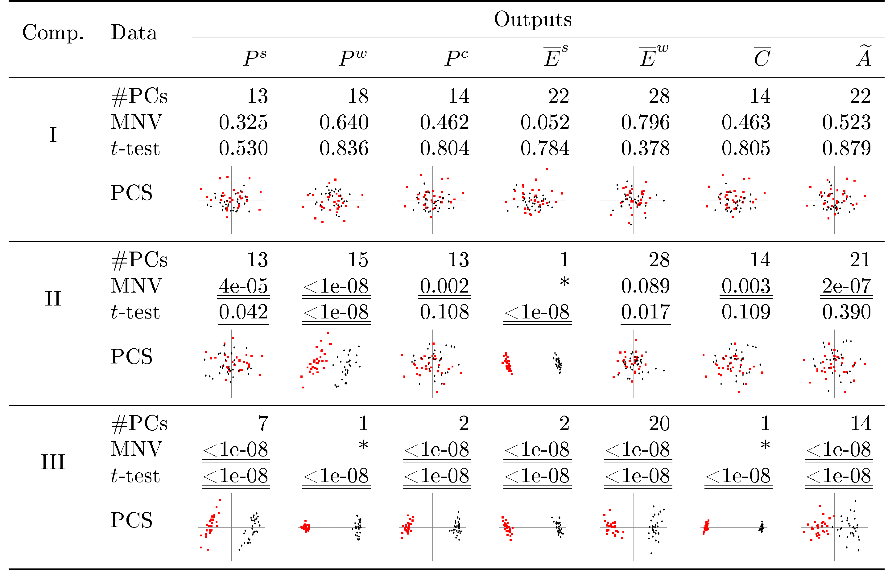

::: article
# Introduction {#micompr:sec:intro}

The aim of this paper is to present the
[*micompr*](https://CRAN.R-project.org/package=micompr) package for R
[@micompr], which implements a procedure for comparing multivariate
samples associated with different factor levels or groups. The research
goal is to differentiate among pre-specified, well-defined classes or
groups of sampling entities generating highly multivariate observations
in which the dimensions or dependent variables are correlated, and to
test for significant differences among groups. The procedure uses
principal component analysis [PCA; @jolliffe2002principal] to convert
multivariate observations into a set of linearly uncorrelated
statistical measures, which are then compared using a number of
statistical methods, such as hypothesis tests and score plots.

This technique has several desirable attributes: a) it automatically
selects observation features that best explain sample differences; b) it
does not depend on the distributional properties of samples; and, c) it
simplifies the researchers' work, as it can be used directly on
multivariate observations. The procedure is appropriate for comparing
samples of multivariate observations with highly correlated and similar
scale dimensions, such as time series, images or spectrometric measures.
However, the *micompr* package goes one step further by also
accommodating the simultaneous comparison of multiple observation types,
i.e., multiple *outputs* from a given "system". In this context, a
"system" can be defined as an abstract entity capable of generating one
or more stochastic data streams, i.e., *outputs*. Thus, *micompr* can
determine if two or more instances of such a "system" display the same
behavior by comparing observations of their *outputs*.

The remainder of this paper is organized as follows. First, in Section
[2](#micompr:sec:finding), commonly used techniques for differentiating
samples of multivariate observations are discussed. The methodology
employed by *micompr* is described in Section [3](#micompr:sec:theory).
Section [4](#micompr:sec:micompr) introduces the software and its
architecture, namely the available objects and functions. Several
concrete application examples, and how the "system"-*output* terminology
fits each one, are presented in Section [5](#micompr:sec:examples). The
paper closes with Section [6](#micompr:sec:summary), in which the
overall approach and the R package are summarized.

# Testing for significant differences in multivariate samples {#micompr:sec:finding}

Two-sample or multi-sample hypothesis tests are commonly used for
assessing statistically dissimilarity in univariate samples, i.e.,
samples composed of scalar observations. If samples are drawn from
normally distributed populations, the $t$ (two samples) and ANOVA
($n$-samples) tests are adequate [@montgomery2010applied].
Non-parametric tests are more appropriate if population normality cannot
be assumed. The Mann-Whitney $U$ test [@gibbons2011nonparametric] and
the Kolmogorov-Smirnov test [@massey1951kolmogorov] are typically
employed for comparing two samples. The Kruskal-Wallis test
[@kruskal1952use] extends the former for the $n$-sample case.

Multivariate analysis of variance [MANOVA;
@krzanowski1998; @tabachnick2013using] can be used as a statistical test
for comparing multivariate samples. In this context, samples are
composed of multi-dimensional observations, for which each dimension is
a dependent variable (DV). However, MANOVA is not appropriate for cases
with highly correlated DVs and when the number of DVs or dimensions is
higher than the number of observations. Additionally, MANOVA is a
parametric method which makes a series of assumptions on the underlying
data which are not always met in practice.

Analogous non-parametric tests exist, but they are not as widespread and
are commonly oriented towards specific research topics. Multiple
Response Permutation Procedures [MRPP; @mielke1976multi] and associated
permutation-based methods, such as ANOSIM [@clarke1993nonparametric] or
permutational MANOVA [@anderson2001new], test for differences in
distances between observations from each group. These tests are
implemented in the [*vegan*](https://CRAN.R-project.org/package=vegan)
package [@vegan2016], typically used in Ecology studies. The
[*Blossom*](https://CRAN.R-project.org/package=Blossom) package
[@talbert2016blossom] also provides MRPP and other distance-function
based permutation tests. In a similar note, [@szekely2004testing]
proposed a multi-sample test for equality of multivariate distributions
based on the Euclidean distance between sample elements. The test
statistic belongs to a class of multivariate statistics (energy
statistics) proposed by the same authors. The
[*energy*](https://CRAN.R-project.org/package=energy) package
[@rizzo2016energy] implements this test and other energy
statistics-related functionality. The cross-match test is another
distance-based test [@rosenbaum2005exact], with the particularity of not
requiring permutation techniques. It is available for the R environment
via the [*crossmatch*](https://CRAN.R-project.org/package=crossmatch)
package [@heller2012crossmatch]. In turn, the
[*cramer*](https://CRAN.R-project.org/package=cramer) package
[@franz2014cramer] provides a multivariate implementation of the
non-parametric two-sample Cramér test, originally proposed by
[@baringhaus2004new]. The critical value of the test can be determined
with bootstrap (ordinary or permutation-based) or eigenvalue-based
methods. Another test which avoids permutation was proposed by
[@duong2012closed]. It is a kernel-based test, originally developed to
assess the statistical differences between two cellular topologies. The
test is implemented in the [*ks*](https://CRAN.R-project.org/package=ks)
package [@duong2016ks], although limited to six-dimensional data.

An alternative to multivariate tests is to extract a number of
statistical summaries (e.g., averages or extreme values) or specific
points from individual multivariate observations, and then perform a
univariate test for each summary measure. This approach also has its
issues: a) it does not provide a single answer, i.e., it will yield as
many $p$-values as there are summary measures; b) the choice of summary
is problem-dependent and empirically driven, and consequently,
error-prone, in the sense that the chosen summaries may not be
representative of the original multivariate observations. While only
careful analysis can minimize the latter issue, the former problem can
be addressed with a multiple comparison adjustment procedure, such as
the Bonferroni correction [@shaffer1995multiple].

# Independent comparison of multivariate observations {#micompr:sec:theory}

Given a matrix $\mathbf{X}_{(n \times m)}$ of $n$ observations and $m$
variables or dimensions, PCA can be used to obtain matrix
$\mathbf{T}_{(n \times r)}$, which is the representation of
$\mathbf{X}_{(n \times m)}$ in the principal components (PCs) space, and
vector $\boldsymbol{\lambda}_{(1 \times r)}$, containing the eigenvalues
of the covariance matrix of the original mean-centered data. Rows of
$\mathbf{T}$ directly correspond to the observations of the original
samples, while columns correspond to PCs. Columns are ordered by
decreasing variance, i.e., the first column corresponds to the first PC,
and so on. Variance is given by the eigenvalues in vector
$\boldsymbol{\lambda}$, which are likewise ordered, each eigenvalue
corresponding to the variance of the columns of $\mathbf{T}$. The
percentage of variance explained by each PC can be obtained by dividing
the respective eigenvalue with the sum of all eigenvalues. At this
stage, PCA-reshaped observations associated with different groups can be
compared using statistical methods. More specifically, hypothesis tests
can be used to check if the sample projections on the PC space are drawn
from populations with the same distribution. There are two possible
lines of action:

1.  Apply a MANOVA test to the samples, where each observation has
    $q$-dimensions, corresponding to the first $q$ PCs (dimensions) such
    that these explain a user-defined minimum percentage of variance.

2.  Apply a univariate test to observations in individual PCs. Possible
    tests include the $t$-test and the Mann-Whitney $U$ test for
    comparing two samples, or ANOVA and Kruskal-Wallis test, which are
    the respective parametric and non-parametric versions for comparing
    more than two samples.

The MANOVA test yields a single $p$-value from the simultaneous
comparison of observations along multiple PCs. An equally succinct
answer can be obtained with a univariate test using the Bonferroni
correction or a similar method for handling $p$-values from multiple
comparisons. However, both approaches will not prioritize dimensions,
even though the first PCs can be more important for characterizing an
output, as they explain more variance. In the univariate case one can
prioritize PCs according to the explained variance using the weighted
Bonferroni procedure [@rosenthal1983ensemble].

Conclusions concerning whether samples are statistically similar can be
drawn by analyzing the $p$-values produced by the employed statistical
tests, which should be below the typical 1% or 5% when samples are
significantly different. In such case, less PCs should be required to
explain the same percentage of variance than when, in the same context,
no significant differences are found. The scatter plot of the first two
PC dimensions can also provide visual, although subjective feedback on
sample similarity.

While the procedure is most appropriate for comparing multivariate
observations with highly correlated and similar scale dimensions,
assessing the similarity of "systems" with multiple outputs of different
scales is also possible. The simplest approach would be to apply the
proposed method to samples of individual outputs, and analyze the
results in a multiple comparison context. An alternative approach
consists in concatenating, observation-wise, all outputs, centered and
scaled to the same order of magnitude, thus reducing a "system" with $k$
outputs to a "system" with one output. The proposed method would then be
applied to samples composed of concatenated observations encompassing
the existing outputs. This technique is described in detail by
@fachada2015model in the context of comparing simulation outputs.

# The *micompr* package {#micompr:sec:micompr}

## Overview

The *micompr* package for the R statistical computing environment
implements the methodology proposed in Section [3](#micompr:sec:theory).
Here we describe version 1.0.1 of the package, which is available at
<https://CRAN.R-project.org/package=micompr/>. The development version
is hosted at <https://github.com/fakenmc/micompr>. The package is
covered by the MIT license.

The *micompr* package is built upon two functions, `cmpoutput` and
`micomp`. The former compares two or more samples of multivariate
observations collected from one output. The latter is used for comparing
multiple outputs and/or comparing outputs in multiple contexts.
`grpoutputs` is a helper function for loading data from two or more set
of files and preparing the data to be processed by the `cmpoutput`
and/or `micomp` functions. `assumptions` is a generic function for
assessing the assumptions of the parametric tests used in sample
comparisons.

## Architecture

*micompr* is structured according to the S3 object-oriented system. The
`cmpoutput`, `micomp` and `grpoutputs` functions produce S3 objects with
the same name. The package also provides the generic function
`assumptions`, and two concrete implementations of methods for
"cmpoutput" and "micomp" objects, which return objects of class
"assumptions_cmpoutput" and "assumptions_micomp", respectively. All
classes have method implementations of the common S3 generic functions
`print`, `summary` and `plot`. Additionally, method implementations of
the `toLatex` function, for producing user-configurable LaTeX tables
with information about the performed comparisons, are provided for
"cmpoutput" and "micomp" objects.

### `grpoutputs`

This function groups outputs from sets of files containing multiple
observations into samples. It returns a list of output matrices, ready
to be processed by `micomp`. Alternatively, individual output matrices
can be handled by `cmpoutput`. Separate files contain one multivariate
observation of one or more outputs, one column per output, one row per
dimension or variable. Each specified set of files is associated with a
different sample. The function is also able to create an additional
concatenated output, composed from the centered and scaled original
outputs.

The `plot` method for "grpoutputs" objects shows $k$ plots, one per
output. Output observations are plotted on top of each other, with
different samples colored distinctively. The `summary` method for
"grpoutputs" objects returns a list containing two elements: a) the
$n \times m$ dimensions of each output matrix; and, b) the sizes of
individual samples. The `print` method for "grpoutputs" objects simply
outputs the summary in a more adequate presentation format.

### `cmpoutput`

The `cmpoutput` function is at the core of *micompr*. It compares two or
more samples of multivariate observations using the technique described
in Section [3](#micompr:sec:theory). It accepts an output matrix,
$\mathbf{X}_{(n \times m)}$, with $n$ observations and $m$ variables or
dimensions, a factor vector of length $n$, specifying the group
associated with each observation, and a vector of explained variances
with which to determine the number of PCs to use in the MANOVA test
(alternatively, the number of PCs can also be directly specified). The
function returns matrix $\mathbf{T}_{(n \times r)}$ of PCA scores and
the $p$-values for the performed statistical tests, namely: a) a MANOVA
test for each explained variance (or number of PCs); and, b) parametric
($t$-test or ANOVA) and non-parametric (Mann-Whitney or Kruskal-Wallis)
univariate tests for each PC. Regarding the latter, the function also
returns $p$-values adjusted with the weighted Bonferroni correction,
using the percentages of explained variance by PC as weights.

The `plot` implementation for "cmpoutput" objects shows six sub-plots,
namely a scatter plot with the PC1 vs. PC2 scores and five bar plots.
The horizontal scale of the latter consists of the $r$ PCs, and the
vertical bars represent the explained variance (one plot) or univariate
parametric and non-parametric $p$-values, before and after weighted
Bonferroni correction (four plots). The `summary` method for "cmpoutput"
objects returns a list with the following items: a) percentage of
variance explained by each PC; b) $p$-values of the MANOVA test or
tests; c) $p$-values of the parametric test, per PC, before and after
weighted Bonferroni correction; d) $p$-values of the non-parametric
test, per PC, before and after weighted Bonferroni correction; and, e)
name of the parametric and non-parametric univariate tests employed
(either $t$-test and Mann-Whitney $U$ test for comparing two samples, or
ANOVA and Kruskal-Wallis for more than two samples). The `print` method
for "cmpoutput" objects shows the information provided by the `summary`
implementation, but the $p$-values of the univariate tests are only
shown for the first PC.

### `micomp`

The `micomp` function performs one or more comparisons of multiple
outputs, invoking `cmpoutput` for each comparison/output combination. It
accepts a list of comparisons, where individual comparisons can have one
of two configurations: a) a vector of folders and a vector of file sets
containing data in the format required by `grpoutputs`, where each file
set corresponds to a different sample; and, b) a "grpoutputs" object,
passed directly. The returned objects, of class "micomp", are basically
two-dimensional lists of "cmpoutput" instances, with rows associated
with individual outputs, and columns with separate comparisons.

The `plot` method for "micomp" objects shows the PC1 vs. PC2 score plots
for each comparison/output combination. The `summary` implementation for
"micomp" objects returns a list of comparisons, each one containing a
$a \times k$ matrix of $p$-values or number of PCs, associated with
$a \geq 6$ measures and $k$ outputs. Four rows represent the $p$-values
of the parametric and non-parametric univariate tests for the first PC,
before and after weighted Bonferroni correction. The remaining pairs of
rows are associated with the MANOVA test for a given percentage of
variance to explain. One row shows the $p$-values, and the other
displays the number of PCs required to explain the specified percentage
of variance for the given output. As with other *micompr* objects, the
`print` method for "micomp" objects also shows the summary with a better
presentation.

### `assumptions`

`assumptions` is a generic function which performs a number of
statistical tests concerning the assumptions of the parametric tests
performed by the package functions. Implementations of this generic
function exist for "cmpoutput" and "micomp" objects. The former method
returns objects of class "assumptions_cmpoutput" containing results of
the assumptions tests for a single output comparison. The latter returns
a two-dimensional list of "assumptions_cmpoutput" objects, with rows
associated to individual outputs, and columns to separate comparisons.
These objects are tagged with the "assumptions_micomp" class attribute.

The following assumptions are checked: a) observations are normally
distributed within each sample along individual PCs (Shapiro-Wilk test);
b) observations follow a multivariate normal distribution within each
sample for all PCs used in MANOVA (Royston test); c) samples have
homogeneous variance along individual PCs (Bartlett test); and, d)
samples have homogeneous covariance matrices for all PCs used in MANOVA
(Box's $M$ test). Assumptions a) and c) should be verified for the
parametric test applied to each PC, while assumptions b) and d) should
be verified for individual MANOVA tests performed for each variance to
explain (or, alternatively, for each specified number of PCs).

The `plot` implementations for classes "assumptions_cmpoutput" and
"assumptions_micomp" display a number of bar plots for the $p$-values of
the performed tests. These are more detailed for "assumptions_cmpoutput"
objects, showing the $p$-values of the univariate test for all PCs. For
"assumptions_micomp" objects, one bar plot is shown per
output/comparison combination, but in the case of the univariate tests
only the $p$-values of the first PC are shown. Implementations of
`summary` return a list of tabular data containing the $p$-values of the
assumption tests. The `summary` method for "assumptions_cmpoutput"
objects returns a list with two matrices of $p$-values, one for the
MANOVA tests, another for the univariate tests. The `summary` method for
"assumptions_micomp" objects follows the approach taken by the `summary`
method for "micomp" objects, returning a list of $p$-value matrices, one
matrix per comparison. Rows of individual matrices correspond to the
assumptions tests, and columns to outputs. The `print` methods for
"assumptions_cmpoutput" objects and for "assumptions_micomp" objects
again show the summary information in a printable format.

### `toLatex` methods for "cmpoutput" and "micomp" objects

These methods are implementations of the `toLatex` generic function, and
convert "cmpoutput" and "micomp" objects to character vectors
representing LaTeX tables. The generated tables are configurable via
function arguments, with sensible defaults. Tables can present the
following data for each output/comparison combination: a) number of
principal components required to explain a user-specified percentage of
variance; b) MANOVA $p$-value for a user-specified percentage of
variance to explain or number of PCs; c) parametric test $p$-value for a
given PC, before and/or after weighted Bonferroni correction; d)
non-parametric test $p$-value for a given PC, before and/or after
weighted Bonferroni correction; e) variance explained by a specific PC;
and, f) a score plot with the output projection on the first two PCs.

### Other functions

The *micompr* package is bundled with additional functions whose purpose
is to aid the main package methods do their job. However, some of these
may be useful in other contexts.

The `concat_outputs` function concatenates outputs collected from
multiple observations. It accepts two arguments, namely a list of output
matrices, and the centering and scaling method. Several centering and
scaling methods, such as "range", "iqrange", "vast" or "pareto"
[@berg2006centering], are recognized in the second argument. The
function returns an $n \times p$ matrix of $n$ observations with length
$p$, which is the sum of individual output lengths. Lower-level
centering and scaling of individual outputs is performed by the
`centerscale` function, which accepts a numeric vector and returns a new
vector, centered and scaled with the specified method.

The `pvalf` generic function formats $p$-values for LaTeX. A concrete
default implementation is used by the *micompr* `toLatex`
implementations if not specified otherwise. This implementation
underlines and double-underlines $p$-values lower than $0.05$ and
$0.01$, respectively, although these limits are configurable, and
underlining can be turned off by setting both limits to zero. It is also
possible to specify a limit below which $p$-values are capped. For
example, if this limit is set to $1 \times 10^{-5}$, a $p$-value equal
to $1 \times 10^{-6}$ would be displayed as "$< 1\text{e}^{-5}$". The
default method of `pvalf` will format $p$-values lower than
$5 \times 10^{-4}$ using scientific E notation, which is more compact
and thus a better fit for tables. $p$-values between $5 \times 10^{-4}$
and $1$ are formatted using regular decimal notation with three decimal
places. This aspect is not configurable. However, another implementation
of `pvalf` can be passed to the *micompr* `toLatex` implementations if
different formatting is desired.

Simple Ti*k*Z 2D scatter plots, as the ones produced by the *micompr*
`toLatex` implementations, can be generated with the `tikzscat`
function. The function accepts the data to plot, an $n$ x 2 numeric
matrix, of $n$ observations and $2$ dimensions, and a factor vector
specifying the levels or groups associated with each observation.
Several plot characteristics, such as mark types, scale and axes color,
are configurable via function arguments. `tikzscat` returns a string
containing the Ti*k*Z figure code for plotting the specified data.

## Included data

The package includes test data produced by several implementations of
the Predator-Prey for High Performance Computing (PPHPC) simulation
model [@fachada2015template]. The data is provided in `rdata` format,
and is readily available on loading the package. The same data is also
provided in TSV format. This is a limited subset of the complete data,
and is included for package testing and exemplification purposes. The
example discussed in Section [5.1](#micompr:sec:examples:pphpc) uses a
superset of this data, which is available for public download, but could
not be included with the package due to its large size.

## Dependencies

*micompr* has a number of optional dependencies, not required for
package installation and for using most of its functionality. The
[*biotools*](https://CRAN.R-project.org/package=biotools)
[@silva2015biotools] and [*MVN*](https://CRAN.R-project.org/package=MVN)
[@korkmaz2014mvn] packages are required by the `assumptions` functions,
providing the statistical tests for assessing MANOVA and $t$-test
assumptions. If these functions are invoked without the presence of the
specified packages, they will inform the user of that fact, and
terminate cleanly. The
[*testthat*](https://CRAN.R-project.org/package=testthat)
[@wickham2011testthat],
[*knitr*](https://CRAN.R-project.org/package=knitr) [@xie2015dynamic]
and [*roxygen2*](https://CRAN.R-project.org/package=roxygen2)
[@wickham2015roxygen2] packages are required for package development.
The [*deseasonalize*](https://CRAN.R-project.org/package=deseasonalize)
package [@mcleod2013optimal] is required for building one of the
vignettes.

# Examples {#micompr:sec:examples}

In this section we discuss four concrete application examples for the
*micompr* package. The complete scripts used in these examples are
available at <https://github.com/fakenmc/micompr-examples>.

## Simulation model with multiple outputs {#micompr:sec:examples:pphpc}

The replication of a simulation model in a new context highlights
differences between the conceptual and implemented models, as well as
inconsistencies in the conceptual model specification
[@edmonds2003replication], promoting model verification, model
validation [@wilensky2007making], and model credibility
[@thiele2015replicating]. Some argue that a simulation model is
untrustworthy until it has been successfully replicated
[@edmonds2003replication; @david2013validating]. Model parallelization
is an illustrative example of the importance of replication, as it is
often required for simulating large models in practical time frames
[@fachada2015parallelization]. By definition, model parallelization
implies a number of changes, or even full reimplementation, of the
original model, such that a robust comparison methodology, as provided
by the *micompr* package, is required in order to make sure a
parallelized model faithfully reproduces the behavior of the original
serial model.

PPHPC is a reference model for studying and evaluating implementation
strategies for spatial agent-based models, capturing important
characteristics such as agent movement and local agent interactions
[@fachada2015template]. The model describes a prototypical predator-prey
system, and has six outputs, namely prey population, $P^s$, predator
population, $P^w$, cell-bound food quantity, $P^c$, mean prey energy,
$\overline{E}^s$, mean predator energy, $\overline{E}^w$, and mean
cell-bound food levels, $\overline{C}$. Since outputs are collected once
per iteration, each simulation run yields six time series, associated
with the individual outputs. With several open source implementations
publicly available, the model provides a good test case for multivariate
comparison purposes.

Here we show the main comparison cases discussed in a previous article
[@fachada2015model], in which the model implementations are
parameterized with size 400 and parameter set 1 [@fachada2015template].
A canonical PPHPC realization, implemented in NetLogo
[@wilensky1999compat], is compared with three configurations of a
parallel Java implementation [@fachada2015parallelization]. The NetLogo
implementation and the first Java configuration follow the PPHPC
conceptual model and the specified parameters. The second Java
configuration disables agent shuffling prior to agent actions, which is
explicitly mandated in the conceptual model description. The third Java
configuration performs a minimal change in one of the parameters
specified by parameter set 1. As such, we define three comparison cases:

Case I

:   Compare the NetLogo implementation with the first Java
    configuration. These should yield distributionally equivalent
    results.

Case II

:   Compare the NetLogo implementation with the second Java
    configuration. A small misalignment is to be expected.

Case III

:   Compare the NetLogo implementation with the third Java
    configuration. There should be a mismatch in the outputs.

Independent samples of the six model outputs were obtained from $n=30$
replications for each implementation or configuration, in a total of
$4n=120$ runs. Each replication $r=1,\ldots,4n$ was performed with a
PRNG seed obtained by taking the MD5 checksum of $r$, guaranteeing
independence between seeds, and consequently, between replications. The
data generated by this computational experiment, as well as the scripts
used to set up the experiment, are made available to other researchers
at <https://zenodo.org/record/46848>.

The following script performs these comparisons. Note that the
`concat = TRUE` option of the `micomp` function specifies that an
additional concatenated output, $\widetilde{A}$, should be generated
from the original outputs and analyzed in a similar fashion. The
`dir_data` variable specifies the location of the dataset.

``` r
R> # Load package
R> library(micompr)

R> # Output names
R> outputs <- c("$P^s$", "$P^w$", "$P^c$", "$\\mean{E}^s$",
+               "$\\overline{E}^w$", "$\\overline{C}$", "$\\widetilde{A}$")

R> # Outputs from the NetLogo implementation
R> dir_nl_ok <- paste0(dir_data, "nl_ok")
R> # Outputs from the Java implementation, first configuration
R> dir_jex_ok <- paste0(dir_data, "j_ex_ok")
R> # Outputs from the Java implementation, second configuration
R> dir_jex_noshuff <- paste0(dir_data, "j_ex_noshuff")
R> # Outputs from the Java implementation, third configuration
R> dir_jex_diff <- paste0(dir_data, "j_ex_diff")

R> # Files for model size 400, parameter set 1
R> filez <- glob2rx("stats400v1*.txt")

R> # Perform the three comparison cases
R> mic <- micomp(outputs,
+                ve_npcs = 0.75,
+                list(list(name = "I",
+                          folders = c(dir_nl_ok, dir_jex_ok),
+                          files = c(filez, filez),
+                          lvls = c("NLOK", "JEXOK")),
+                     list(name = "II",
+                          folders = c(dir_nl_ok, dir_jex_noshuff),
+                          files = c(filez, filez),
+                          lvls = c("NLOK", "JEXNS")),
+                     list(name = "III",
+                          folders = c(dir_nl_ok, dir_jex_diff),
+                          files = c(filez, filez),
+                          lvls = c("NLOK", "JEXDIF"))),
+                concat = TRUE)
```

The `mic` object can be inspected at the R prompt using the common S3
generic functions `print`, `summary` and `plot`. For publication
purposes, the `toLatex` method for "micomp" objects produces
LaTeX tables with user-specified information. For example, to generate a
table similar to Table 4 of our previous work [@fachada2015model],
`toLatex` is invoked as follows:

``` r
R> toLatex(mic, booktabs = TRUE,
+          data_show = c("npcs-1", "mnvp-1", "parp-1", "scoreplot"),
+          data_labels = c("$\\#$PCs", "MNV", "$t$-test", "PCS"),
+          col_width = TRUE, pvalf_params = list(minval = 1e-8, na_str = "*"),
+          label = "tab:pphpc",
+          caption = paste("Comparison of a NetLogo implementation of",
+                          "the PPHPC model against three configurations",
+                          "of a parallel Java implementation."))
```

This call produces Table [1](#tab:pphpc) with booktabs
[@fear2005booktabsmanual] table style (`booktabs = TRUE`) and width set
to document column width (`col_width = TRUE`), since the table is
somewhat large. The `label` and `caption` parameters set the label and
caption of the LaTeX table, respectively, while the `pvalf_params`
argument accepts a list of options for formatting $p$-values. The
`data_show` parameter specifies what data to show, which in this case
is: 1) `npcs-1`, the number of PCs for the first specified variance (the
`micomp` function accepts and performs output comparison with one or
more specified variances); 2) `mnvp-1`, the MANOVA $p$-value for the
first specified variance; 3) `parp-1`, $t$-test $p$-value for the first
PC; and, 4) score plot for the first two PCs.

<figure id="tab:pphpc">

<figcaption>Table 1: Comparison of a NetLogo implementation of the
PPHPC model against three configurations of a parallel Java
implementation.</figcaption>
</figure>

In terms of comparison, the method does not find significant differences
in case I. However, it successfully differentiates the configurations
compared in cases II and III. This is in line with what would be
expected, and is discussed in further detail by [@fachada2015model].
While not shown here, the `assumptions(mic)` command reveals that most
assumptions of the MANOVA and $t$-tests are verified.

## Monthly sunspots {#micompr:sec:examples:sunspots}

This example uses the monthly sunspot data [@sunspots], included with R,
which contains the monthly numbers of sunspots from 1749 to the present
day. The solar cycle is an approximate 11-year period of changes in the
number of sunspots and other associated phenomena. Thus, we divide the
data into 11-year (132-month) periods, and consider each period to be an
observation. In practice this is an oversimplification, since the cycles
can be a bit longer or shorter than 11 years.

Given the data, we define two samples of 10 observations each, over a
period of 110 years or 1320 months. The first sample includes solar
cycles from 1749 to 1859, while the second encompasses cycles from 1902
to 2012. We can now ask the following question: were the solar cycles
during the 1749--1859 interval significantly different from the more
recent observations? The following code compares observations from the
two time intervals, and attempts to provide an answer:

``` r
R> # Load package
R> library(micompr)

R> # Months in the 1749-1859 interval (110 years)
R> # Months in the 1902-2012 interval (110 years)
R> m <- sunspot.month[c(1:1320, 1837:3156)]
R> m <- matrix(m, nrow = 20)

R> # Factor vector, two levels:
R> # a) ten 11-year cycles from 1749 to 1859
R> # b) ten 11-year cycles from 1902 to 2012
R> groups <- factor(c(rep("A", 10), rep("B", 10)))

R> # Compare the two groups, use 9 PCs for MANOVA
R> cmp <- cmpoutput("SunSpots", 9, m, groups)
```

The `cmp` object can now be analyzed:

``` r
R> cmp

Output name: SunSpots 
Number of PCs which explain 85.0% of variance: 9
P-Value for MANOVA along 9 dimensions: 3.40755e-06
P-Value for t-test (1st PC): 2.713985e-06 
P-Value for Mann-Whitney U test (1st PC): 4.330035e-05 
Adjusted p-Value for t-test (1st PC): 6.513579e-06 
Adjusted p-Value for Mann-Whitney U test (1st PC): 0.0001039211 
```

The MANOVA $p$-value is significant, as well as the $t$-test and
Mann-Whitney PC1 $p$-values, before and after weighted Bonferroni
correction. As such, it is possible to conclude that solar cycles from
1749 to 1859 were significantly different from cycles between 1902 and
2012. However, is the data in accordance with the assumptions for the
MANOVA and $t$-test? This can be checked with the `assumptions`
function:

``` r
R> assumptions(cmp)

=== MANOVA assumptions ===
                  NPCs=9
Royston (A) 2.190796e-01
Royston (B) 3.627858e-01
Box's M     1.567180e-08

=== T-test assumptions ===
                       PC1
Shapiro-Wilk (A) 0.7739058
Shapiro-Wilk (B) 0.3791168
Bartlett         0.9353299
```

Only Box's $M$ test, which checks for homogeneity of variance-covariance
matrices, is significant. However, this test is prone to false
positives, and this assumption is not critical when samples are of the
same size [@tabachnick2013using]. Given this information, it seems
plausible to consider the results provided by the parametric tests in
our final decision, i.e., that there is in fact a significant difference
between samples. A good way to visualize the overall results is to plot
the "cmpoutput" object:

``` r
R> plot(cmp)
```

This command generates the plots shown in Figure
[1](#micompr:fig:sunspots). The score plot shows the samples to be
distinctly separated, and the variance explained by PC decreases
abruptly from the first PC to the second. Univariate $p$-values for PC1
are visibly significant, though not very much for the remaining PCs.

{#micompr:fig:sunspots width="100%" alt="graphic without alt text"}

## Saugeen river flow {#micompr:sec:examples:saugeen}

This example uses the Saugeen River daily flow data [@hipel1994time],
included with the *deseasonalize* package. This data consists of a time
series of the rivers' daily flow (m^3^/s) from 1915 to 1979. Considering
one year as an observation, there are a total of 65 observations. We
can, for example, define two samples of 30 observations each, with the
first and last 30 years of records, and ask the following question: is
there any statistical difference between the flow dynamics during the
1915--1944 and 1950--1979 periods (perhaps due to climate change or some
other factor)? The following code compares observations from the two
periods:

``` r
R> # Load packages
R> library(micompr)
R> library(deseasonalize)

R> # Unique years
R> years <- unique(sapply(rownames(SaugeenDay), substr, 1, 4))

R> # Number of days in each year
R> ndays <- sapply(years, function(x) sum(substr(rownames(SaugeenDay), 1, 4) == x))

R> # Indexes of last day in each year
R> lastdays <- cumsum(ndays)

R> # Prepare data for PCA
R> saugdata <- t(mapply(
+    function(nd, ld) {
+      rflows <- rep(NA, 366)
+      rflows[1:nd] <- SaugeenDay[(ld - nd + 1):ld]
+      # Discard last day in leap years
+      rflows[1:365]
+    },
+  ndays, lastdays))

R> # Consider first 30 years and last 30 years (discard 5 years in between)
R> saugdata <- saugdata[c(1:30, 36:65), ]

R> # Factor vector, two levels: first 30 years and last 30 years
R> groups <- factor(c(rep("A", 30), rep("B", 30)))

R> # Compare
R> cmp <- cmpoutput("SaugeenFlow", 0.9, saugdata, groups)
```

The `cmp` object can now be analyzed:

``` r
R> cmp

Output name: SaugeenFlow 
Number of PCs which explain 90.0% of variance: 21
P-Value for MANOVA along 21 dimensions: 0.0740641
P-Value for t-test (1st PC): 0.3088125 
P-Value for Mann-Whitney U test (1st PC): 0.3980033 
Adjusted p-Value for t-test (1st PC): 1 
Adjusted p-Value for Mann-Whitney U test (1st PC): 1 
```

There are no significant $p$-values. As such, it is not possible to
conclude that the river flow dynamic during the first 30 years of
measurements is statistically different from the last 30 years. The
MANOVA assumptions are not verified, as shown by be `assumptions`
function:

``` r
R> assumptions(cmp)

=== MANOVA assumptions ===
                 NPCs=21
Royston (A) 1.309146e-05
Royston (B) 3.947504e-05
Box's M     1.859561e-10

=== T-test assumptions ===
                        PC1
Shapiro-Wilk (A) 0.02860029
Shapiro-Wilk (B) 0.83367671
Bartlett         0.79716243
```

The $t$-test assumptions mostly hold, in spite of the PC1 normality test
for sample A (first 30 years) being significant at the $\alpha=0.05$
level. Nonetheless, the $U$ test $p$-value provides a similar
conclusion. Plotting the `cmp` object provides another perspective:

``` r
R> plot(cmp)
```

The previous command will produce plots in
Figure [2](#micompr:fig:saugeen). The PC1 vs. PC2 score plot does not
show any clear sample separation and the decrease in explained variance
from the first PC to the second is considerably less abrupt than what
was observed for the sunspots example. Additionally, no $t$ and $U$ test
$p$-values are significant for the 60 PCs after weighted Bonferroni
correction, further reinforcing the conclusion that the yearly Saugeen
river flow dynamic was similar during the compared periods of time.

{#micompr:fig:saugeen width="100%" alt="graphic without alt text"}

## PH^2^ database of dermoscopic images {#micompr:sec:examples:ph2}

In this example we use the tools provided by the *micompr* package to
study the PH^2^ database of dermoscopic images [@mendonca2013ph2]. This
image database contains a total of 200 dermoscopic images of melanocytic
lesions, including, from benign to more serious, 80 common nevi, 80
atypical nevi, and 40 melanomas. These are 8-bit RGB color images, with
a resolution of purportedly $768 \times 560$ pixels. We have found,
however, that resolutions vary between $761 \times 570$ and
$769 \times 577$. As such, we resized all images to $760 \times 570$
prior to our analysis. The goal is to verify if images of the three
types of lesions form statistically distinguishable samples, i.e., this
is not a classification exercise such as performed by [@barata2014two].

Each image is considered an observation of three outputs, **r**ed,
**g**reen and **b**lue, corresponding to the respective color channels.
The concatenation of all outputs, i.e., channels, provides a 4^th^
output. The three lesion samples are compared pairwise, as follows:

1v2

:   Common nevi and atypical nevi.

1v3

:   Common nevi and melanomas.

2v3

:   Atypical nevi and melanomas.

The following code reads the image dataset from disk and compares images
grouped by lesion type. The `imgfolder` variable specifies the path
containing the images (resized to $760 \times 570$), while the
`grpsfile` variable specifies the path to the file containing the sample
to which each image belongs.

``` r
R> # Load packages
R> library(bmp)
R> library(micompr)

R> # Image definitions
R> imgs <- dir(imgfolder)
R> nimgs <- length(imgs)
R> npixels <- 760 * 570

R> # Specify image groups (Common nevi, atypical nevi, melanomas).
R> f <- read.table(grpsfile, row.names = 1)
R> grps <- f[order(row.names(f)), ]

R> # Read images from disk
R> # Use different color channels as outputs, and also use a concatenated output
R> rimgs <- matrix(nrow = nimgs, ncol = npixels)
R> gimgs <- matrix(nrow = nimgs, ncol = npixels)
R> bimgs <- matrix(nrow = nimgs, ncol = npixels)
R> rgbimgs <- matrix(nrow = nimgs, ncol = npixels * 3)

R> for (i in 1:nimgs) {
+    cimg <- read.bmp(paste0(imgfolder, imgs[i]))
+    rimgs[i, ] <- c(cimg[ , , 1])
+    gimgs[i, ] <- c(cimg[ , , 2])
+    bimgs[i, ] <- c(cimg[ , , 3])
+    rgbimgs[i, ] <- c(cimg[ , , 1], cimg[ , , 2], cimg[ , , 3])
+  }

R> # Perform multivariate independent comparison of images
R> mic <- 
+    micomp(outputs = c("R", "G", "B", "RGB"),
+           ve_npcs = 0.9,
+           comps = list(
+             list(name = "1v2",
+                  grpout = list(
+                    data = list(R = rimgs[grps != 3, ],
+                                G = gimgs[grps != 3, ],
+                                B = bimgs[grps != 3, ],
+                                RGB = rgbimgs[grps != 3, ]),
+                    obs_lvls = factor(grps[grps != 3]))),
+             list(name = "1v3",
+                  grpout = list(
+                    data = list(R = rimgs[grps != 2, ],
+                                G = gimgs[grps != 2, ],
+                                B = bimgs[grps != 2, ],
+                                RGB = rgbimgs[grps != 2, ]),
+                    obs_lvls = factor(grps[grps != 2]))),
+             list(name = "2v3",
+                  grpout = list(
+                    data = list(R = rimgs[grps != 1, ],
+                                G = gimgs[grps != 1, ],
+                                B = bimgs[grps != 1, ],
+                                RGB = rgbimgs[grps != 1, ]),
+                    obs_lvls = factor(grps[grps != 1])))))
```

As in the [5.1](#micompr:sec:examples:pphpc) example, the `mic` object
can be inspected at the R prompt using the common S3 generic functions.
Likewise, the `toLatex` function produces LaTeX tables summarizing the
object. The following code generates Table [2](#tab:ph2):

``` r
R> toLatex(mic, booktabs = TRUE, data_show = c("parp-1", "nparp-1", "scoreplot"),
+          data_labels = c("$t$-test", "$U$ test", "PCS"),
+          pvalf_params = list(minval = 1e-8, na_str = "*"), label = "tab:ph2",
+          caption = paste("Comparison of PH$^2$ dataset images",
+                          "grouped by lesion type."))
```

Note that we did not request the MANOVA $p$-values in the `data_show`
parameter, as in this case the required assumptions do not appear to be
verified. However, assumptions for the $t$-test on the first PC seem to
hold. In any case, and to complement the information provided by the
$t$-test, we specified the `"nparp-1"` option to the `data_show`
argument, such that the table shows the $p$-value of the Mann-Whitney
$U$ test on the first PC.

{#tab:ph2 width="100%" alt="graphic without alt text"}

Results in Table [2](#tab:ph2) show that images of different lesions
have statistically significant differences, when compared either by
individual color channels or with the three channels concatenated. The
latter seems to provide better differentiation, with the common nevi and
melanoma samples (1v3 comparison) appearing to be the most dissimilar.

# Summary {#micompr:sec:summary}

In this paper we presented the R package *micompr*, which implements a
procedure for comparing multivariate samples associated with different
factor levels or groups. The package architecture and its core
components were discussed and four examples were examined.

# Acknowledgments {#acknowledgments .unnumbered}

This work was supported by the Fundação para a Ciência e a Tecnologia
(FCT) projects UID/EEA// and UID/MAT//, and partially funded with grant
SFRH/BD//, also from FCT.
:::
