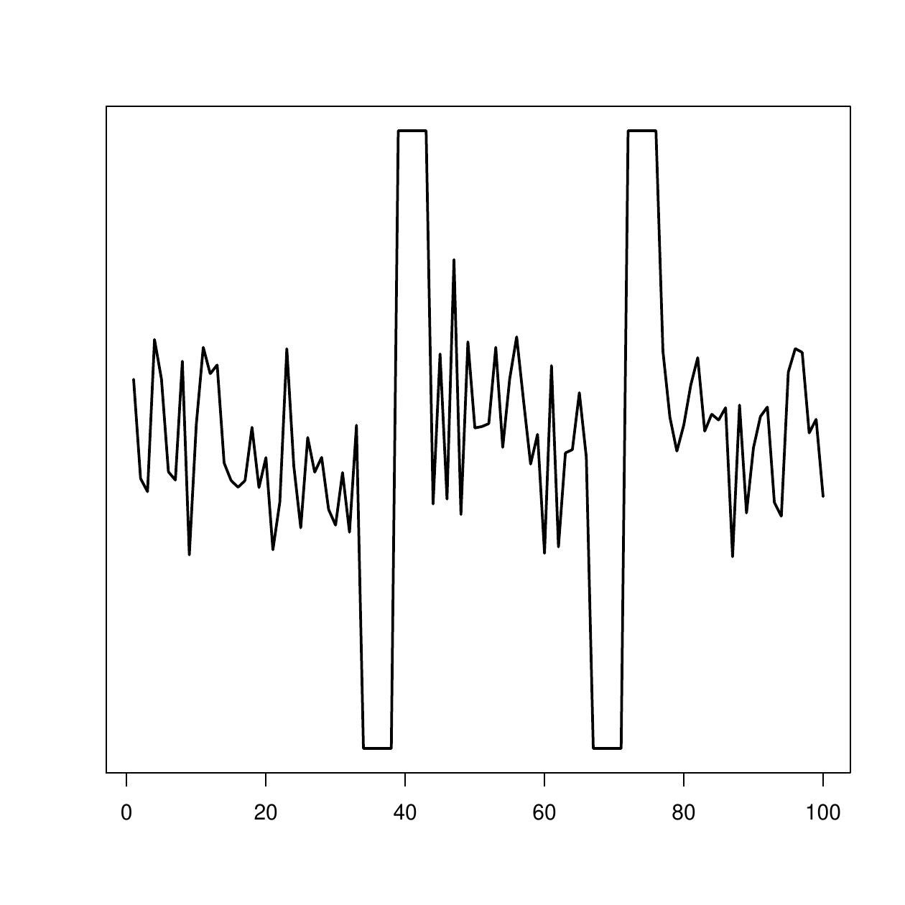
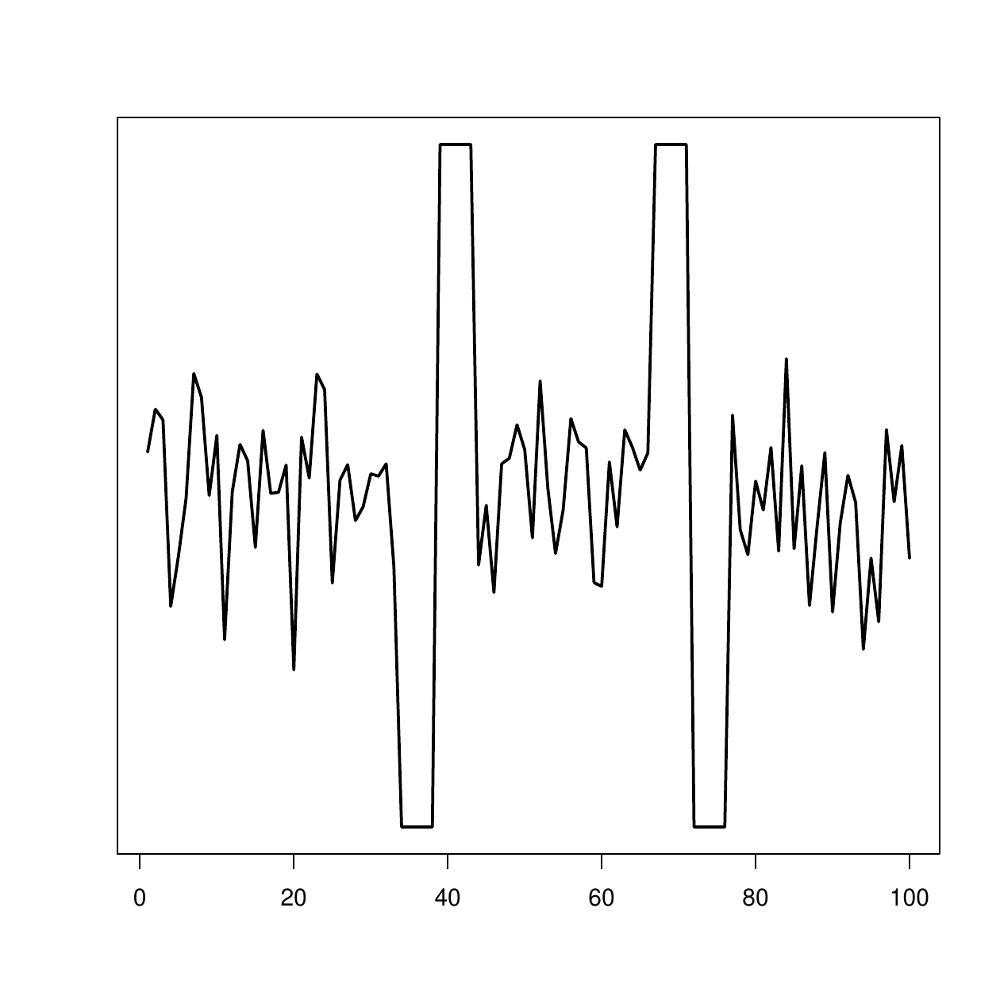
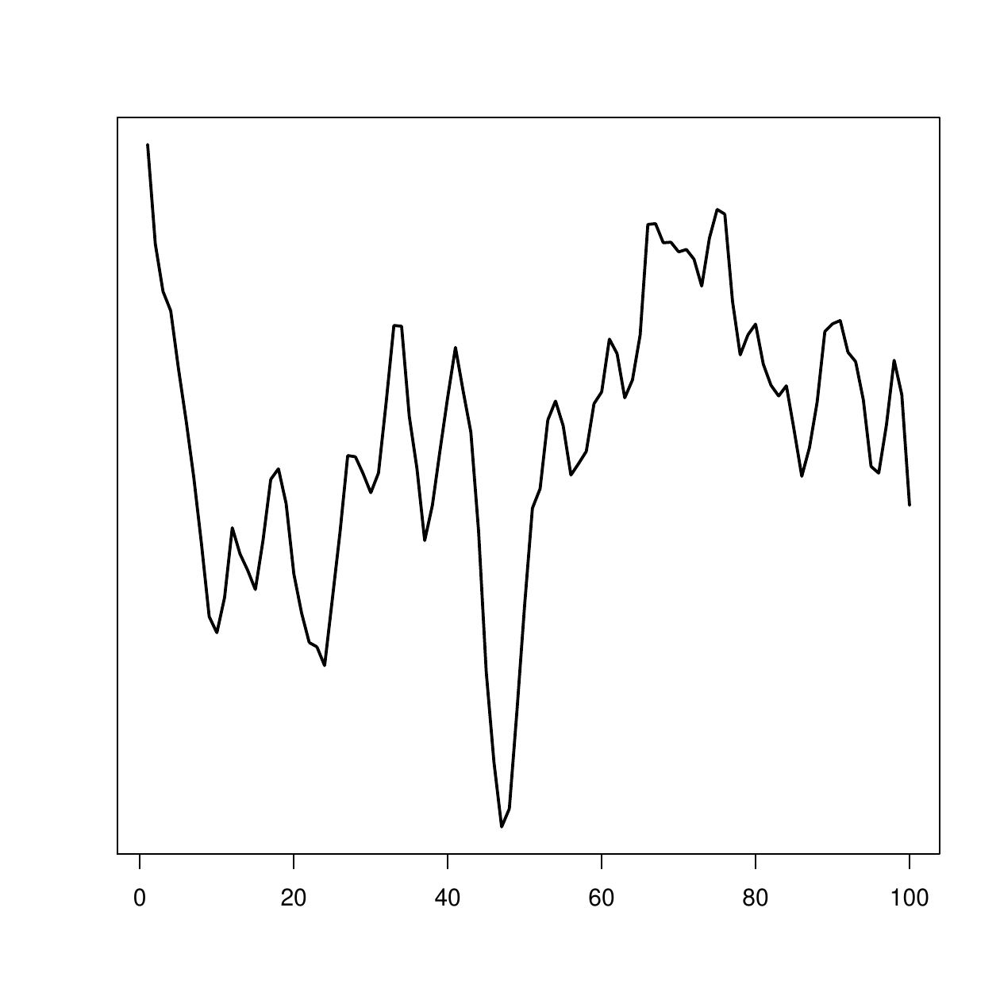
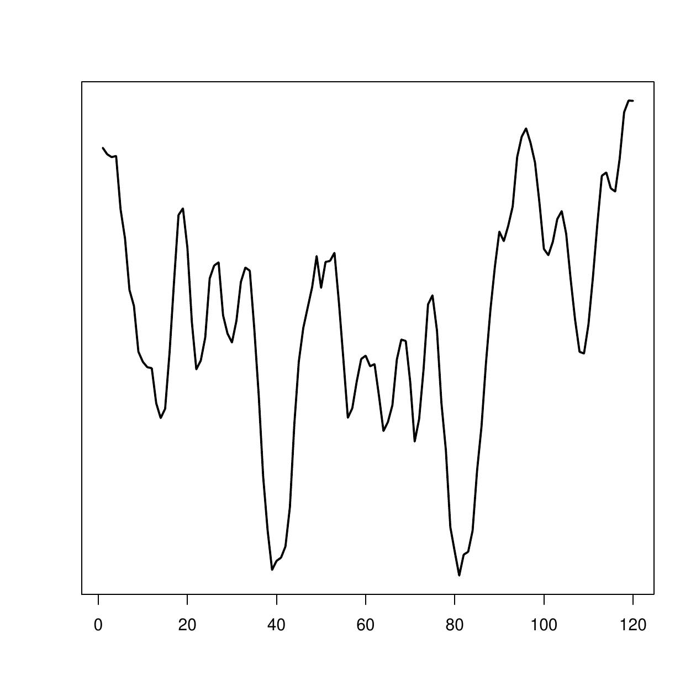

# Introduction

In recent years, the increase in data collecting technologies has
triggered the creation of time series databases, where each instance
consists of an entire time series. The main features of this type of
data are its high dimensionality, dynamism, auto-correlation and noisy
nature, all which complicate the study and pattern extraction to a large
extent. However, in the past few years, tasks such as regression,
classification, clustering or segmentation have been extended and
modified successfully for time series databases [@Fu2011; @Bagnall2016].
In many cases, these tasks require the definition of a distance measure,
which will indicate the level of similarity between time series. Because
of this, understanding suitable measures for this specific type of data
has become a crucial area of study.

R is a popular programming language and a free software environment for
statistical computing, data analysis and graphics [@Team2014], which can
be extended by means of *packages*, contributed by the users themselves.
A few of these R packages, such as
[*dtw*](https://CRAN.R-project.org/package=dtw) [@ToniGiorgino2009],
[*pdc*](https://CRAN.R-project.org/package=pdc) [@Brandmaier2015],
[*proxy*](https://CRAN.R-project.org/package=proxy) [@Meyer2015],
[*longitudinalData*](https://CRAN.R-project.org/package=longitudinalData)
[@Genolini2014] and
[*TSclust*](https://CRAN.R-project.org/package=TSclust) [@Montero2014]
provide implementations of some time series distance measures. However,
many of the most popular distances reviewed by @Esling2012 [@Wang2012]
and @Bagnall2016 are not available in these R packages.

In this paper, the *TSdist* package [@Mori2016] for the R statistical
software is presented. In addition to providing wrapper functions to all
the distance measures implemented in the previously mentioned packages,
*TSdist* implements another 9 distance measures designed for univariate
numerical time series. These distance measures have been selected based
on their prevalence, and because they are mentioned in recent reviews on
the topic [@WarrenLiao2005; @Esling2012; @Wang2012]. In this manner, and
to the best of our knowledge, this package provides the most up-to-date
coverage of the published time series distance measures in R.

# Design and implementation of the package {#design}

As can be seen in Figure [1](#fig:TSdist), the core of the *TSdist*
package consists of three types of functions. To begin with, in the
lowest level, the functions of the type `MethodDistance` conform the
basis of the package, and can be used to calculate distances between
pairs of numerical and univariate vectors. Of course, `Method` must be
substituted by the name of a specific distance measure. Most of them are
implemented exclusively in R language but, the internal routines of a
few of them are implemented in C language, for reasons of computational
efficiency.

In the next level, the wrapper function called `TSDistances` enables the
calculation of distance measures between univariate time series objects
of type `ts`, `zoo` and `xts`, the latter two defined in their
respective packages: [*zoo*](https://CRAN.R-project.org/package=zoo)
[@Zeileis2005] and [*xts*](https://CRAN.R-project.org/package=xts)
[@Ryan2013]. All these objects are specific for temporal data and the
corresponding packages provide a complete set of methods to work with
them. However, there are slight differences between them. Objects of
type `ts` are the most basic and are exclusively addressed for regularly
sampled time series. The `zoo` objects incorporate the possibility of
dealing with irregularly sampled time series. Finally, the *xts* package
further extends the *zoo* package to provide a uniform handling of all
the time series data types in R. To calculate the distance measure
between two objects of one of these types, the `TSDistances` function
just takes care of the conversion of data types and then makes use of
the desired `MethodDistance` function. Note that, in addition to `ts`,
`xts` and `zoo` objects, we can also introduce basic numeric vectors
into the `TSdistances` function. In this sense, it generalizes and
unifies the calculation of all the distance measures in one function.

Finally, on some occasions, it is necessary to calculate the distance
between each pair of series in a given database of series
$(X=\{X_1,X_2,...,X_N\})$. This will result in a distance matrix such as
the following:

$$D(X) =
 \begin{pmatrix}
  d(X_1,X_1) & d(X_1,X_2) & \cdots & d(X_1,X_N) \\
  d(X_2,X_1) & d(X_2,X_2) & \cdots & d(X_2,X_N) \\
  \vdots  & \vdots  & \ddots & \vdots  \\
  d(X_N,X_1) & d(X_N,X_2) & \cdots & d(X_N,X_N) \\
 \end{pmatrix}$$

The `TSDatabaseDistances` function is specifically designed to build
distance matrices from time series databases saved in matrices, `mts`
objects, `zoo` objects, `xts` objects or lists. Upon loading the
*TSdist* package, the `TSDistances` function is automatically included
in the `pr_DB` database, which is a list of similarity measures defined
in the *proxy* package. This directly enables the use of the `dist`
function, the baseline R function to calculate distance matrices, with
the dissimilarity measures defined in the *TSdist* package. This is the
general strategy followed by the `TSDatabaseDistances` function and,
only for a few special measures, the distance matrix is calculated in
other ad-hoc manners for efficiency purposes.

As an additional capability of the `TSDatabaseDistances` function, the
distance matrices can not only be calculated for a single database, but
also for two separate databases. In this second case, all the pairwise
distances between the series in the first database and the second
database are calculated:

$$D(X, Y) =
 \begin{pmatrix}
  d(X_1,Y_1) & d(X_1,Y_2) & \cdots & d(X_1,Y_N) \\
  d(X_2,Y_1) & d(X_2,Y_2) & \cdots & d(X_2,Y_N) \\
  \vdots  & \vdots  & \ddots & \vdots  \\
  d(X_M,Y_1) & d(X_M,Y_2) & \cdots & d(X_M,Y_N) \\
 \end{pmatrix}$$

This last feature is especially useful for classification tasks where
train/test validation frameworks are frequently used.

{#fig:TSdist width="100%" alt="graphic without alt text"}

 

::: {#summary-tab}
  --------------------------------------------------------------------------------------------------------------------------------------------
                                              **proxy**     **longitudinal Data**   **TSclust**      **dtw**        **pdc**       **TSdist**
  ----------------------------------------- -------------- ----------------------- -------------- -------------- -------------- --------------
         ***Shape based distances***                                                                                            

          ***Lock-step measures***                                                                                              

               $L_p$ distances               $\checkmark$                                                                       

                   DISSIM                                                                                                        $\checkmark$

      Short Time Series Distance (STS)                                                                                           $\checkmark$

           Cross-correlation based                                                                                               $\checkmark$

          Pearson correlation based                                                 $\checkmark$                                

                CORT distance                                                       $\checkmark$                                

           ***Elastic measures***                                                                                               

              Frechet distance                                  $\checkmark$                                                    

         Dynamic Time Warping (DTW)                                                                $\checkmark$                 

              Keogh_LB for DTW                                                                                                   $\checkmark$

   Edit Distance for Real Sequences (EDR)                                                                                        $\checkmark$

    Edit Distance with Real Penalty (ERP)                                                                                        $\checkmark$

      Longest Common Subsequence (LCSS)                                                                                          $\checkmark$

        ***Feature-based distances***                                                                                           

       (Partial) Autocorrelation based                                              $\checkmark$                                

         Fourier Decomposition based                                                                                             $\checkmark$

                   TQuest                                                                                                        $\checkmark$

         Wavelet Decomposition based                                                $\checkmark$                                

       (Integrated) Periodogram based                                               $\checkmark$                                

          SAX representation based                                                  $\checkmark$                                

           Spectral Density based                                                   $\checkmark$                                

       ***Structure-based distances***                                                                                          

              ***Model based***                                                                                                 

              Piccolo distance                                                      $\checkmark$                                

              Maharaj distance                                                      $\checkmark$                                

          Cepstral based distances                                                  $\checkmark$                                

           ***Compression based***                                                                                              

         Compression based distances                                                $\checkmark$                                

        Complexity invariant distance                                               $\checkmark$                                

   Permutation distribution based distance                                                                        $\checkmark$  

           ***Prediction based***                                                                                               

        Non Parametric Forecast based                                               $\checkmark$                                
  --------------------------------------------------------------------------------------------------------------------------------------------

  : Table 1: Summary of distance measures for time series implemented in
  R.
:::

# Summary of distance measures included in TSdist {#distances}

In Table [1](#summary-tab), a summary of the distance measures included
in *TSdist* is presented. Since the package includes wrapper functions
to distance measures hosted in other packages, the original package is
also cited in the table.

Based on the literature, we have divided the distance measures into four
groups. Shape-based distances compare the overall shape of the time
series by measuring the closeness of the raw-values of the time series
[@Esling2012]. Within this category, we separate the (i) lock-step
measures, which compare the $i$-th point of one time series to the
$i$-th point of another, and the (ii) elastic measures, which are more
flexible and allow one-to-many points and one-to-none point matchings
[@Wang2012]. Feature-based distances are based on comparing certain
features extracted from the series, such as Fourier or wavelet
coefficients, autocorrelation values, etc. Next, structure-based
distances include (i) model-based approaches, where a model is fit to
each series and the comparison is made between models, and (ii)
complexity-based models, where the similarity between two series is
measured based on the quantity of shared information. Finally,
prediction-based distances analyze the similarity of the forecasts
obtained for different time series.

As can be seen in Table [1](#summary-tab), the distance measures
implemented specifically in *TSdist* complement the set of measures
already included in other packages, contributing to a more thorough
coverage of the existing time series distance measures. As the most
notable example, edit based distances for numeric time series (EDR, ERP
and LCSS) have been introduced, which were completely overlooked in
previous R packages.

For more extensive explanations on each of the distance measures, the
readers can access the documentation of the *TSdist* package, where more
details or suitable references are provided.

# User interface by example {#sec:usage}

The *TSdist* package is available from the CRAN repository, where the
source files for Unix platforms and the binaries for Windows and some
OS-X distributions can be downloaded. For more information on software
pre-requisites and detailed instructions on the installation process of
*TSdist*, please see the README file included in the inst/doc directory
of the package.

Note that, in the following sections, we will use several time series
and time series databases included in **TSdist**. These databases are
all synthetic, and have been chosen and designed specifically because of
their simplicity and because they allow us to provide straightforward
examples which clearly illustrate the usage of the different functions
included in the package, and can be easily analyzed, replicated and
visualized by the reader. However, once the practitioner becomes
familiar with the examples provided in the following sections, it is
straightforward to download any real dataset, such as those included in
the UCR archive [@UCR], and work on it.

## Examples of distance calculations between numeric vectors

The `example.series1` and `example.series2` objects (see
Figure [2](#example12)) included in the *TSdist* package are two numeric
vectors that represent two different synthetic series which were
generated based on the shapes that define the Two Patterns synthetic
database of series [@Geurts2002].

<figure id="example12">
<table>
<caption> </caption>
<tbody>
<tr class="odd">
<td style="text-align: center;"></td>
<td style="text-align: center;"></td>
</tr>
<tr class="even">
<td style="text-align: center;">(a) example.series1.</td>
<td style="text-align: center;">(b) example.series2.</td>
</tr>
</tbody>
</table>
<figcaption>Figure 2: The two example series of the same length included
in the TSdist package.</figcaption>
</figure>

Additionaly, `example.series3` and `example.series4` (see
Figure [3](#example34)) represent two ARMA(3,2) series of coefficients
AR=(1, -0.24, 0.1) and MA=(1, 1.2) generated with different random seeds
and with different lengths, 100 and 120, respectively.

<figure id="example34">
<table>
<caption> </caption>
<tbody>
<tr class="odd">
<td style="text-align: center;"></td>
<td style="text-align: center;"></td>
</tr>
<tr class="even">
<td style="text-align: center;">(a) example.series3.</td>
<td style="text-align: center;">(b) example.series4.</td>
</tr>
</tbody>
</table>
<figcaption>Figure 3: The two example series of different length
included in the TSdist package.</figcaption>
</figure>

As mentioned previously, the basic calculation of the distance between
two series, such as `example.series1` and `example.series2`, is done by
using the `MethodDistance` functions and replacing `Method` with the
reference name of the distance measure of choice (for a complete list of
reference names, the user can access the help pages of *TSdist*):

``` r
> CCorDistance(example.series1, example.series2)
```

``` r
[1] 1.192903
```

``` r
> CorDistance(example.series1, example.series2)
```

``` r
[1] 1.399347
```

Many of the distance measures require the definition of a parameter,
which must be included in the call to the corresponding function:

``` r
> EDRDistance(example.series1, example.series2, epsilon=0.1)
```

``` r
[1] 80
```

``` r
> ERPDistance(example.series1, example.series2, g=0)
```

``` r
[1] 98.29833
```

Additionally, each distance measure has some characteristics which can
impose some constraints on the input time series. For example, some
distance measures such as the Euclidean distance can not deal with time
series of different lengths. As such, if the conditions are not
fulfilled, the distance can not be computed and the function will return
`NA` together with the corresponding error message:

``` r
> EuclideanDistance(example.series3, example.series4)
```

``` r
Error : Both series must have the same length.
[1] NA
```

``` r
> EDRDistance(example.series3, example.series4, epsilon=0.1, sigma=105)
```

``` r
Error : The window size exceeds the length of the first series
[1] NA
```

Finally, note that all these distance calculations can be carried out by
using the `TSdistances` wrapper function as follows:

``` r
> TSDistances(example.series1, example.series2, distance="ccor")
```

``` r
[1] 1.192903
```

``` r
> TSDistances(example.series1, example.series2, distance="cor")
```

``` r
[1] 1.399347
```

``` r
> TSDistances(example.series1, example.series2, distance="edr", epsilon=0.1)
```

``` r
[1] 80
```

``` r
> TSDistances(example.series1, example.series2, distance="erp", g=0)
```

``` r
[1] 98.29833
```

As can be seen, the distance of choice must be specified within the
`distance` argument, followed by the necessary parameters.

We must emphasize that each distance measure is scaled differently and
so, distance values obtained from different distance measures are not
directly comparable, even when comparing the two same time series. As
such, completely different values can be obtained from different
distance measures, as can be seen in the previous example.

## Examples of distance calculations between time series objects

The `zoo.series1` and `zoo.series2` time series included in the package
are replicas of the `example.series1` and `example.series2` objects
introduced previously but saved as `zoo` objects with a specific time
index. A basic distance calculation between two series like these is
done using the `TSDistances` function exactly as shown in the previous
section:

``` r
> TSDistances(zoo.series1, zoo.series2, distance="cor")
```

``` r
[1] 1.399347
```

``` r
> TSDistances(zoo.series1, zoo.series2, distance="dtw", sigma=10)
```

``` r
[1] 123.8757
```

The distance calculation between `ts` or `xts` objects is done in the
same manner.

## Examples of distance matrix calculations

The `example.database` object included in the package is a matrix that
represents a database with 6 ARMA(3,2) series of coefficients AR=(1,
-0.24, 0.1) and MA=(1, 1.2), but generated with different random seeds.
Each time series corresponds to a row of the matrix. Additionally, the
`zoo.database` object included in the package is a multivariate `zoo`
object that saves the series of `example.database` with a specific time
index.

The `dist` function calculates the pairwise distance between all the
rows in a matrix so, the calculation of the distance matrix can be done
easily for the `example.database` object in the following manner:

``` r
> dist(example.database, method="TSDistances", distance="tquest", 
+      tau=mean(example.database), diag=TRUE, upper=TRUE)
```

``` r
           series1    series2    series3    series4    series5    series6
series1 0.00000000 0.10310669 0.06460465 0.05345349 0.08355246 0.04768702
series2 0.10310669 0.00000000 0.05260503 0.07685220 0.12273356 0.03049604
series3 0.06460465 0.05260503 0.00000000 0.02003566 0.09874005 0.01984044
series4 0.05345349 0.07685220 0.02003566 0.00000000 0.04998743 0.02302477
series5 0.08355246 0.12273356 0.09874005 0.04998743 0.00000000 0.06191323
series6 0.04768702 0.03049604 0.01984044 0.02302477 0.06191323 0.00000000
```

When using the `dist` function with the distances included in *TSdist*,
the `method` argument will always be left as `"TSDistances"`, and the
selected distance measure must be introduced in the `distance` argument,
followed by its parameters. The `diag` and `upper` options are used to
specify if the diagonal and upper triangle of the matrix should be
shown. In any case, this calculation can also be done more directly by
using the `TSDatabaseDistances` function:

``` r
> TSDatabaseDistances(example.database, distance="tquest", 
+ tau=mean(example.database))
```

When the database is not saved as a matrix, such as with `zoo.database`,
the distance matrix calculation can not be done by using the `dist`
function directly. In this case, the calculation must necessarily be
carried out by using `TSDatabaseDistances`:

``` r
> TSDatabaseDistances(zoo.database, distance="tquest", 
+ tau=mean(zoo.database))
```

``` r
           series1    series2    series3    series4    series5
series2 0.10310669                                            
series3 0.06460465 0.05260503                                 
series4 0.05345349 0.07685220 0.02003566                      
series5 0.08355246 0.12273356 0.09874005 0.04998743           
series6 0.04768702 0.03049604 0.01984044 0.02302477 0.06191323
```

Note that, by default, the `TSDatabaseDistances` function does not show
the diagonal and upper triangle of the computed distance matrix. If we
want the whole matrix to appear, we must include the options `diag=TRUE`
and `upper=TRUE` as with the `dist` function.

Finally, as previously stated, an additional capability of the
`TSDatabaseDistances` function is that it is capable of calculating
distances between the time series in two separate databases:

``` r
> TSDatabaseDistances(example.database, zoo.database, distance="tquest", 
+ tau=mean(zoo.database))
```

``` r
           series1    series2    series3    series4    series5    series6
series1 0.00000000 0.10310669 0.06460465 0.05345349 0.08355246 0.04768702
series2 0.10310669 0.00000000 0.05260503 0.07685220 0.12273356 0.03049604
series3 0.06460465 0.05260503 0.00000000 0.02003566 0.09874005 0.01984044
series4 0.05345349 0.07685220 0.02003566 0.00000000 0.04998743 0.02302477
series5 0.08355246 0.12273356 0.09874005 0.04998743 0.00000000 0.06191323
series6 0.04768702 0.03049604 0.01984044 0.02302477 0.06191323 0.00000000
```

Note that the two databases do not have to be provided in identical
formats.

## Time series classification and clustering with the `TSdist` package

The most common usage of time series distance measures is within
clustering and classification tasks,[^1] and all the measures included
in this package can be useful within these two frameworks. As a support
for these two tasks, the *TSdist* package includes two well-known
functions.

The first function (`OneNN`) implements the 1NN classifier. This
classifier is commonly used to evaluate the performance of different
distance measures, due to the influence the distance measure has on its
performance together with its reduced number of parameters [@Wang2012].
Given a pair of train/test time series datasets and the class values of
the series in the training set, the `oneNN` function outputs the
predicted class values for the test series. Additionally, if the ground
truth class values of the series in the testing set are provided by the
user, the error obtained in the classification process is also
calculated.

As an example of usage, suppose we want to classify the series in the
`example.database2` database (included in `TSdist`), which contains 100
series from 6 classes. In order to simulate a typical classification
framework, we divide the database into two sets by randomly selecting
30% of the series for training purposes and 70% for testing.[^2] Then,
we apply the 1-NN classifier to the testing set with any distance
measure of choice:

``` r
> OneNN(train, trainclass, test, "euclidean")
```

``` r
 [1] 1 1 1 1 1 1 1 1 1 1 1 1 1 1 2 2 2 2 2 2 2 2 2 2 3 3 3 3 3 3 3 3 3 3 4 4 4 4
[39] 4 4 4 4 4 4 4 5 5 5 5 5 5 5 5 5 5 5 5 5 6 6 6 6 6 6 6 6 6 6 6 6
```

Additionally, if the selected distance measure requires the definition
of any parameters, these should be included at the end of the call:

``` r
> OneNN(train, trainclass, test, "tquest", tau=85)
```

``` r
 [1] 1 3 3 3 2 3 3 3 5 1 2 3 3 3 2 2 2 2 2 2 2 2 2 2 3 3 3 3 3 3 3 3 3 3 4 6 4 4
[39] 4 6 4 4 4 4 4 5 5 5 5 5 5 5 5 5 5 5 5 5 6 4 6 6 4 4 6 4 6 6 6 6
```

If we also provide the true class labels of the test instances, we can
obtain the classification error obtained by the 1NN algorithm and the
distance measure of choice:

``` r
> OneNN(train, trainclass, test, testclass, "euclidean")$error
```

``` r
[1] 0
```

``` r
> OneNN(train, trainclass, test, testclass, "acf")$error
```

``` r
[1] 0.4142857
```

``` r
> OneNN(train, trainclass, test, testclass, "tquest", tau=85)$error
```

``` r
[1] 0.3285714
```

``` r
> OneNN(train, trainclass, test, testclass, "dtw", sigma=20)$error
```

``` r
[1] 0
```

For clustering tasks, the `k.medoids` function can be used, which, given
the data and the number of clusters, outputs the clustering result
together with the F evaluation measure [@ww-ccao-07], if the ground
truth clustering is provided by the user. In the following example, the
popular k-medoids algorithm is applied to the `example.database3`
database, (which contains series from 5 classes obtained from ARMA
processes), using different distance measures and setting the number of
clusters to 5:

``` r
> KMedoids(data, 5, "euclidean")
```

``` r
 [1] 1 1 1 2 1 2 3 2 1 2 2 4 1 4 5 1 4 1 4 1 5 2 5 5 5 5 2 4 2 4 3 3 2
[34] 3 2 2 3 2 3 2 5 5 2 5 1 2 5 2 5 2
```

``` r
> KMedoids(data, 5, "tquest",tau=0)
```

``` r
 [1] 1 1 1 2 1 2 3 1 1 1 2 2 4 2 4 4 2 4 2 4 3 3 3 2 3 3 2 2 3 2 3 3 2
[34] 3 2 2 3 2 3 2 3 5 2 5 1 2 5 2 5 2
```

As mentioned, if we provide the ground truth clustering result, we can
also obtain the F measure of the obtained clustering:

``` r
> KMedoids(data, 5, ground.truth, "euclidean")$F
```

``` r
[1] 0.5154762
```

``` r
> KMedoids(data, 5, ground.truth, "acf")$F
```

``` r
[1] 0.9799499
```

``` r
> KMedoids(data, 5, ground.truth, "tquest", tau=0)$F
```

``` r
[1] 0.594479
```

``` r
> KMedoids(data, 5, ground.truth, "dtw", sigma=20)$F
```

``` r
[1] 0.8933333
```

As can be seen, the best results are provided by the Euclidean distance
and DTW when we classify the `example.database2` database, and the
autocorrelation distance is the best performing measure from the
selected options when clustering the `example.database3` database.

In this line, previous experiments show that there is no "best" distance
measure which is suitable for all databases and all tasks, [@Wang2012].
In this context, a specific distance measure must be selected, in each
case, in order to obtain satisfactory results [@Mori2015]. The large
number of distance measures included in *TSdist* and the simple design
of this package allows the user to try different distance measures
directly, simplifying the distance measure selection process
considerably.

# Summary and conclusions

The *TSdist* package enables the calculation of distances between time
series and time series databases, by using a large variety of measures
available in the literature. By including wrapper functions for time
series distances already available in R, and implementing other
unavailable popular measures reviewed in the literature, this package
provides the largest selection of time series distance measures
available at R at the moment, to the best of our knowledge.
Additionally, it also simplifies the evaluation of these measures and
their application in classification and clustering contexts by providing
several ad-hoc functions.

For more detailed information on the databases and functions included in
the *TSdist* package, and a more complete set of examples, the reader
can consult the help pages or the manual of the *TSdist* package and the
vignette included within.


[^1]: Beware when using these distance measures within kernel based
    classifiers. Some of them, such as DTW, do not necessarily issue
    positive definite Gram matrices when inserted directly into common
    kernel functions, such as the Gaussian RBF. More information and
    some possible solutions can be found in
    [@Cuturi2011; @Pree2014; @Gaidon2011; @Marteau2015].

[^2]: The code to load and prepare the data is available in the
    documentation of the `OneNN` function.
