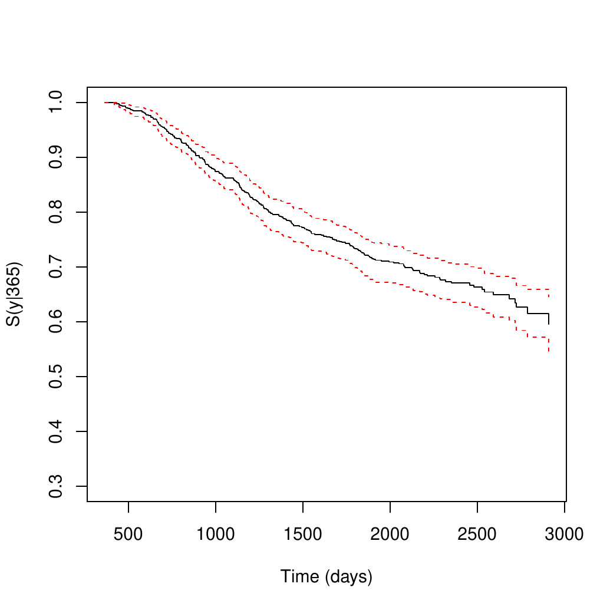
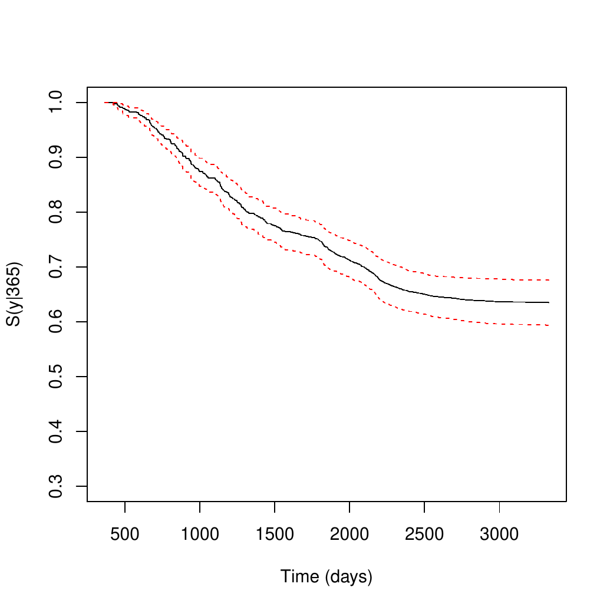
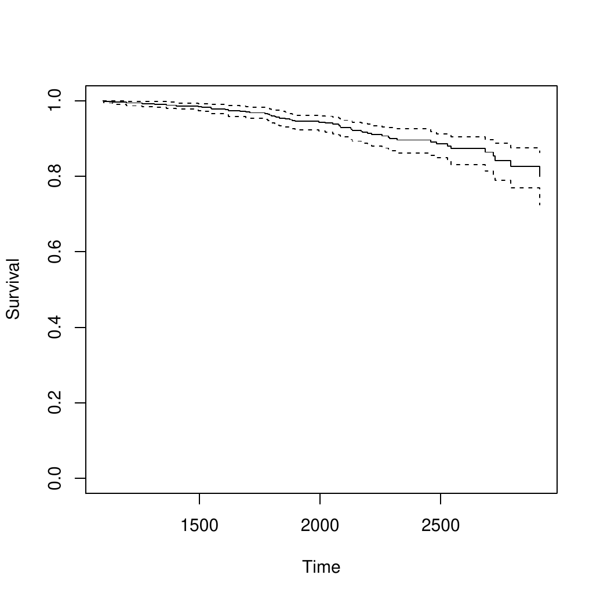
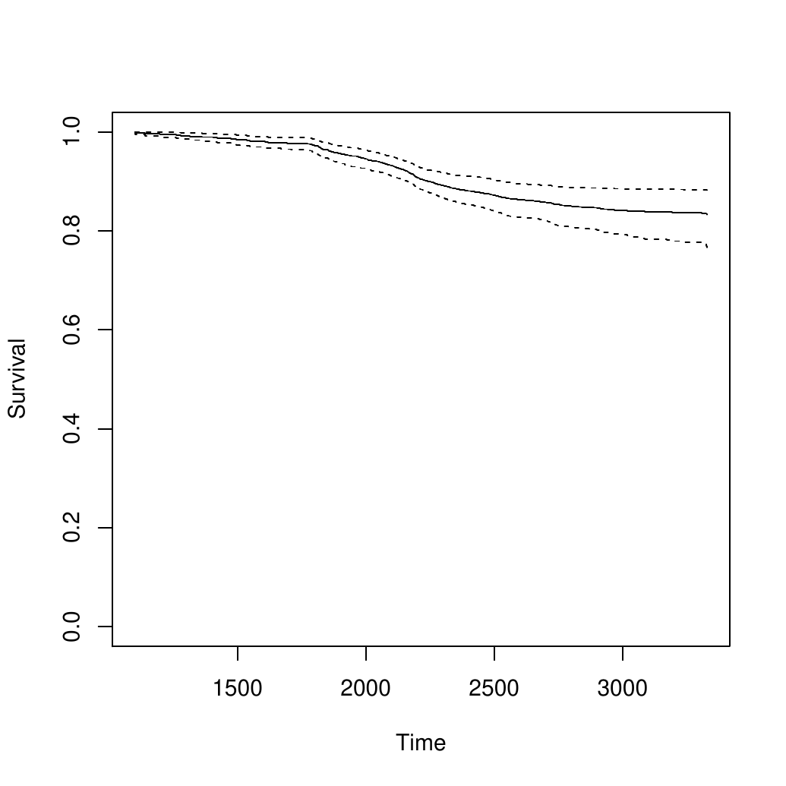

::: article
# Introduction

One major goal in survival studies is the estimation of the survival
function. The most popular method for estimating this function is the
well-known product-limit estimator also known as Kaplan-Meier estimator
[@KM58]. The popularity of the product-limit estimator is explained by
its simplicity and intuitive appeal while requiring very week
assumptions. It simply takes into account the empirical probability of
surviving over a certain time. The method does not take into account of
covariates, so it is mainly descriptive. Discrete covariates can be
included by splitting the sample for each level of the covariate and
applying the product-limit estimator for each subsample. This approach
is not recommended for continuous covariates. To account for this extra
difficulty several generalizations to the Kaplan-Meier estimator have
been proposed throughout the last decades. @Beran81 was the first one
who proposed an estimator of the conditional distribution (survival)
function with censored data in a fully nonparametric way. His estimator
was further studied among others by @Dabrowska87, @Akritas94,
@Manteiga94 and @VanKeilegom2001. All these estimators can be used to
estimate the distribution (or survival) function conditional on a
continuous covariable in a regression model, when data are subject to
censoring. However, none of the above methods can be used to estimate
the conditional survival when the covariate is censored.

Several software packages in the form of R packages have been developed
to estimate the survival function. Though this function can be estimated
parametrically or using nonparametric maximum likelihood estimation, the
product limit Kaplan-Meier estimator is still one of the best options
for estimating the survival function. Several R packages have been
developed to implement the product-limit Kaplan-Meier estimator. For
instance, the [*survival*](https://CRAN.R-project.org/package=survival)
package [@survival] and the
[*prodlim*](https://CRAN.R-project.org/package=prodlim) package
[@prodlim] can be used to obtain Kaplan-Meier estimates. A comprehensive
list of the available packages which can be used to estimate the
survival function can be seen in the CRAN Task View "Survival Analysis"
[@Allignol] of the Comprehensive R Archive Network (CRAN).

In many longitudinal medical studies, patients may experience several
events through a follow-up period. In these studies, the analysis of
sequentially ordered events are often of interest. The events of concern
can be of the same nature (e.g., recurrent disease episodes in cancer
studies) or represent different states in the disease process (e.g.,
"alive and disease-free", "alive with recurrence" and "dead"). If the
events are of the same nature, this is usually referred as recurrent
events [@Cook], whereas if they are based on different disease
categories they are usually modeled through their intensity functions
[@MeiraMachado2009]. Again, several R packages have been developed to
deal with problems that arise in these processes (see for example,
@Allignol). Some of these packages can be used to estimate occupation
probabilities, transition probabilities and the cumulative incidence
functions. However, none can be used to estimate conditional survival
probabilities such as: $P(T_2 > y \mid T_1 > x)$,
$P(T_3 > y | T_1 < x_1, T_2 > x_2)$ or
$P(T_3 > y | T_1 > x_1, T_2 > x_2)$ where $T_1$, $T_2$ and $T_3$ are
ordered event times of successive events. This issue was recently
considered by @MeiraMachado2016 who proposed nonparametric and
semiparametric estimators for such quantities.

This paper describes the R package
[*condSURV*](https://CRAN.R-project.org/package=condSURV) (available
from the Comprehensive R Archive Network at
<https://CRAN.R-project.org/package=condSURV/>) and its capabilities for
implementing nonparametric and semiparametric estimators for conditional
survival probabilities for two multivariate ordered times. The package
can also be used to estimate more general functions involving more than
two successive event times. The estimation of these quantities is
essential for long-term survival prognosis which arises in many medical
contexts such as cancer studies, asthma, HIV/AIDS, heart disease,
dementia and Alzheimer's disease, etc. The methods implemented in the
package also deal with the possible effect of covariates on the
conditional survival probabilities (e.g.,
$P(T_2 > y \mid T_1 > x_1, Z = z)$ where $Z$ denotes a continuous
covariate). To account for the covariate effect, a flexible approach is
based on local smoothing by means of kernel weights based on local
constant (Nadaraya-Watson) regression. In this article we explain and
illustrate how numerical and graphical output for all methods can be
obtained using the *condSURV* package.

The remainder of this paper is organized as follows. The following
section provides a brief introduction to the methodological background.
All estimators for the conditional survival function are presented.
Then, a detailed description of the package is presented, and its usage
is illustrated through the analysis of a real data set; and finally, the
last section contains the main conclusions of this work. The use of the
package to more than two consecutive events is illustrated in
the [Appendix](#sec:appendix-zhu).

# Methodology background {#sec:meth-backgr}

Suppose that an individual may experience $K$ consecutive events at
times $T_1<T_2<\cdot\cdot\cdot<T_K=T$, which are measured from the start
of the follow-up. In this section different methods are proposed to
estimate conditional survival probabilities such as
$P(T_2 > y \mid T_1 > x)$ or $P(T_2 > y \mid T_1 \leq x)$, where $T_1$
and $T_2$ are ordered event times of two successive events. The proposed
methods are all based on the Kaplan-Meier estimator and the ideas behind
the proposed estimators can also be used to estimate more general
functions involving more than two successive event times. However, for
ease of presentation and without loss of generality, we take $K=2$ in
this section. The extension to $K>2$ is straightforward.

Let $(T_{1},T_{2})$ be a pair of successive event times corresponding to
two ordered (possibly consecutive) events measured from the start of the
follow-up. Let $T=T_{2}$ denote the total time and assume that both
$T_1$ and $T$ are observed subject to a (univariate) random
right-censoring variable $C$ assumed to be independent of $(T_1,T)$. Due
to censoring, rather than $(T_1,T)$ we observe
$(\widetilde T_{1},\Delta_1,\widetilde T,\Delta_2)$ where
$\widetilde T_{1}=\min (T_{1},C)$, $\Delta_{1}=I(T_{1}\leq C)$,
$\widetilde T=\min (T,C)$, $\Delta_{2}=I(T\leq C)$, where $I(\cdot)$ is
the indicator function. Let
$(\widetilde T_{1i},\Delta_{1i},\widetilde T_i,\Delta_{2i})$,
$1\leq i\leq n$ be independent and identically distributed data with the
same distribution as
$(\widetilde T_{1},\Delta_1,\widetilde T,\Delta_2)$.

Let $S_1$ and $S$ be the marginal survival functions of $T_1$ and $T$;
that is, $S_1(y)=P(T_1>y)$ and $S(y)=P(T>y)$. Introduce also the
conditional survival probabilities $P(T>y|T_1>x)$ and
$P(T>y|T_1\leq x)$. without loss of generality, we only consider the
estimation of $S(y|x)=P(T>y|T_1>x)$.

The Kaplan-Meier estimator, also known as the product-limit estimator,
is the most frequently used method to estimate survival for censored
data. The most used representation of the Kaplan-Meier estimator of the
total time is through a product of the following form
$$\begin{aligned}
\widehat S(y)=\prod_{\widetilde T_i\leq t}\left(1-\frac{\Delta_{2i}}{R(\widetilde T_i)}\right),
\end{aligned}$$
where $R(t)=\sum_{i=1}^{n} I(\widetilde T_i \geq t)$ denotes the number
of individuals at risk just before time $t$. The censoring is assumed to
be independent in the sense that the additional knowledge of the
right-censoring times before any time $y$ does not carry information on
the risk of failure at time $y$. The Kaplan-Meier estimate is a step
function with jumps at event times. The size of the steps depends on the
number of events and the number of individuals at risk at the
corresponding time. Below we introduce a weighted average representation
of the Kaplan-Meier estimator which will be used later to introduce
estimators for the conditional survival function

$$\widehat S(y)=1-\sum_{i=1}^{n}W_{i}I\left (\widetilde T_{\left(i\right)}\leq y\right ), %\equiv 1-\widehat{F}_1(x),$$
where
$\widetilde T_{\left( 1\right) }\leq \ldots\leq \widetilde T_{\left(
    n\right) }$ denotes the ordered $\widetilde T$-sample and

$$W_{i}=\frac{\Delta_{2\left[ i\right] }}{n-i+1}\prod_{j=1}^{i-1}\left[ 1-\frac{%
\Delta _{2\left[ j\right] }}{n-j+1}\right]$$
is the Kaplan-Meier weight attached to
$\widetilde T_{\left( i\right) }$. In the expression of $W_{i}$ notation
$\Delta_{2\left[ i\right] }$ is used for the $i$-th concomitant value of
the censoring indicator (that is,
$\Delta_{2\left[ i \right] }=\Delta _{2j}$ if
$\widetilde T_{\left( i\right) }=\widetilde T_{j}$).

In this work we are interested in the estimation of the conditional
survival function, $S(y\mid x)=P(T>y\mid T_1>x)$. Below we provide
estimators for this quantity, all based on the Kaplan-Meier estimator.

The conditional survival function $S(y\mid x)$ can be expressed as
$S(y\mid x)=P(T > y|T_1 > x) = 1 - P(T\leq y\mid T_1 > x)= 1 - P(T_1 >
x, T\leq y)/\left(1-P\left(T_1\leq x\right)\right)$. Then, the
denominator of the term at the right hand side can be estimated using
the Kaplan-Meier estimator of survival of the first time; the quantity
at the numerator involves transformations of the pair $(T_1,T)$ which
cannot be estimated so simply. This quantity can be estimated using
Kaplan-Meier weights pertaining to the distribution of the total time to
weight the bivariate data [@MeiraMachado2016]. The corresponding
estimator is given as follows:
$$\widehat S^{\texttt{KMW}}(y\mid x)=1-\frac{\sum_{i=1}^{n}{W_iI\left (\widetilde T_{1\left[i\right]} >x, \widetilde T_{\left(i\right)} \leq y\right )}}{\widehat S_1(x)}.$$
Another way to introduce a (monotonic) nonparametric estimator for the
conditional survival is by considering the landmark approach
[@vanHouwelingen]. Given the time point $x$, to estimate
$S(y\mid x)=P(T> y\mid T_1>x)$ the analysis can be restricted to the
individuals with an observed first event time greater than $x$. Then, an
estimator for the conditional survival function is just the Kaplan-Meier
estimator of the survival function of $T$ computed from such a subset
$$\widehat S^{\texttt{LDM}}(y\mid x) = \widehat S^{x}(y),$$
where $\widehat S^{x}(y)$ is the Kaplan-Meier estimator of survival
computed from the $\left(\widetilde T,\Delta_2\right)$-sample in
$\Big\{i:$ $\widetilde T_{1i}>x\Big\}$ ordered with respect to
$\widetilde T$.

The standard error of the nonparametric landmark estimator (`LDM`) may
be large when the censoring is heavy, particularly with a small sample
size. Interestingly, the variance of this estimator may be reduced by
presmoothing [@Dikta1998]. Here, the idea of presmoothing involves
replacing the censoring indicators (in the expression of the
Kaplan-Meier weights) by some smooth fit before the Kaplan-Meier formula
is applied. This preliminary smoothing may be based on a certain
parametric family such as the logistic (thus leading to a semiparametric
estimator), or on a nonparametric estimator of the binary regression
curve. The corresponding presmoothed landmark estimator is then given by

$$\widehat S^{\texttt{PLDM}}(y\mid x) = 1-\sum_{i=1}^{n_x}{w_i^{x}I\left(\widetilde T_{\left(i\right)}^x \leq y\right)},$$
where $w_i^{x}$ is defined through

$$w_{i}^{x}=\frac {m\left(\widetilde T_{\left(i\right)}^{x}\right)}{n_x-i+1}\prod_{j=1}^{i-1}\left[1-\frac {m\left(\widetilde T_{\left(i\right)}^{x}\right)}{n_x-j+1}\right] ,\text{ \ \ \ \ }1\leq i\leq n_{x},$$
where
$\left(\widetilde T_{\left( i\right) }^{x},\Delta_{2\left[ i\right]}^{x}\right)$,
$i=1,\ldots,n_{x}$, is the $\left(\widetilde T,\Delta_2\right)$-sample
in $\left\{i:\widetilde T_{1i}>x\right\}$ ordered with respect to
$\widetilde T$.

Here, $m(t)= P(\Delta_{2}=1\mid \widetilde T=t)$, where
$m(\widetilde T)$ belongs to a parametric (smooth) family of binary
regression curves, e.g., logistic. In practice, we assume that
$m(t)=m(t;\beta)$ where $\beta$ is a vector of parameters which will be
computed by maximizing the conditional likelihood of the $\Delta_2$'s
given $\widetilde T$.

Note that $\widehat S^{\texttt{PLDM}}(y\mid x)$ is the presmoothed
Kaplan-Meier estimator of survival computed from the
$\left(\widetilde T,\Delta_2\right)$-sample in
$\left\{i:\widetilde T_{1i}>x\right\}$ ordered with respect to
$\widetilde T$.

The practical performance of the proposed estimators for the conditional
survival function has been investigated through simulations
[@MeiraMachado2016]. It has been demonstrated that all of the studied
estimators perform well, approaching their targets as the sample size
increases. Besides, simulation results reveal that the landmark
estimator (`LDM`) performs favorably when compared with the first method
(`KMW`). Furthermore, the reported simulation results reveal relative
benefits of presmoothing (`PLDM`) in the heavily censored scenarios or
for small sample sizes.

Now we will explain how to introduce covariate information in the
conditional survival function. Discrete covariates can be also included
by splitting the sample for each level of the covariate and repeating
the described procedures for each subsample. This approach is not valid
for continuous covariates. To estimate the survival probabilities
conditionally on continuous covariates we propose to use local smoothing
which is introduced using regression weights. Without loss of generality
the methodology will be explained in the build of the conditional
survival probability $P(T>y|T_1>x, Z=z)$, where $Z$ denotes a continuous
covariate. To estimate
$S(y\mid x, z) = 1 - P(T_1 > x, T\leq y|Z=z)/\left(1-P\left(T_1\leq
    x|Z=z\right)\right)$ we need to estimate the following conditional
expectations: $E\left( I(T_1>x, T\leq y)\mid Z \right)$ and
$E\left(I(T_1\leq x)\mid Z \right)$.

In the absence of censoring, to estimate these quantities, we may use
kernel smoothing techniques by calculating a local average of the
indicator functions. For example, $E[I(T_1>x, T\leq y)|Z=z]$ could be
estimated as follows
$$\widehat E[I(T_1>x, T\leq y)|Z=z]= \sum_{i=1}^{n} NW_i(z,a_n)I\left(\widetilde T_1>x,\widetilde T\leq y\right),$$
where $NW_i(z,a_n)$ is a weight function which corresponds to the
Nadaraya-Watson [@Nadaraya65; @Watson64-machado] estimator (NW) as
follows
$$NW_{i}(z,a_n)=\frac{K\left({(z-Z_{i})/a_n}\right)}{\sum _{j=1}^n K\left({(z-Z_{j})/a_n}\right)},$$
where $K$ is a known probability density function (the kernel function)
and $a_n$ is a sequence of bandwidths.

In our case, however, we allow the data to be right-censored. To handle
right-censoring, inverse probability of censoring weighting (IPCW; see
for example, @SattenDatta01) can be used. In order to introduce our
estimators, note that, assuming that the support of the conditional
distribution of $T$ is contained in that of $C\mid Z$, we have
$E[I(T_1>x,T\leq y)\mid Z]=E[I(\widetilde T_1 > x,\widetilde T \leq
y)\Delta_2/G_Z(\widetilde T) \mid Z)]$ and
$E[I(T_1\leq x)\mid Z]=E[I(\widetilde T_1 \leq
x)\Delta_1/H_Z(\widetilde T_1) \mid Z)]$ where $G_Z$ and $H_Z$ denote
the conditional survival functions of the censoring variable of the
total time and the first event time, respectively, given Z.

The estimation of the conditional survival function, given a covariate
under random censoring has been considered in many papers. This topic
was introduced by @Beran81 and was further studied by several authors
[@Dabrowska87; @Akritas94; @Manteiga94; @VanKeilegom2001]. Their
proposals can also be used to estimate the conditional survival function
of $C\mid Z=z$, say $\widehat G_z$. This can be done using the estimator
introduced by Beran,

$$\widehat G_z(y)= \prod_{T_{i}\leq y,\Delta_{2i}=0}\left[  {1-\frac{NW_{i}(z,a_n)}{\sum_{j=1}^{n}I(T_j\geq T_i)NW_{j}(z,a_n)} }\right].$$

In order to introduce our estimators we propose to plug-in Beran's
estimator $\widehat G_Z$ and use NW to compute

$$\begin{aligned}
\widehat P(T_1>x, T\leq y \mid Z=z) =\sum_{i=1}^{n}NW_{i}(z,a_n)\frac{I(\widetilde T_{1i}>x,\widetilde T_{i}\leq y)\Delta_{2i}}{\widehat G_{Z_i}(\widetilde T_i)}.
\end{aligned}$$

Similarly, we propose to plug-in Beran's estimator $\widehat H_Z$ and
use NW to compute

$$\begin{aligned}
\widehat P(T_1\leq x \mid Z=z) =\sum_{i=1}^{n}NW_{i}(z,a_n)\frac{I(\widetilde T_{1i}\leq x)\Delta_{1i}}{\widehat H_{Z_i}(\widetilde T_{1i})}.
\end{aligned}$$

Then, we may introduce the `IPCW` estimator as follows:

$$\begin{aligned}
\widehat S^{\texttt{IPCW}}(y\mid x,z)= 1- \widehat P(T_1>x, T\leq y \mid Z=z)/ (1-\widehat P(T_1\leq x \mid Z=z)).
\end{aligned}$$

# *condSURV* in practice {#package}

This section introduces an overview of how the package is structured.
*condSURV* is a shortcut for "conditional survival" and this is its
major functionality: to provide estimates of the survival function
conditional to previous (possibly censored) events. This software
enables both numerical and graphical outputs to be displayed for all
methods (`KMW`, `LDM`, `PLDM` and `IPCW`) described in the previous
section. This software is intended to be used with the R environment for
statistical computing and graphics. Our package is composed of 12
functions that allow users to obtain estimates for all proposed methods.
Details on the usage of the functions (described in Table
[1](#package:func)) can be obtained with the corresponding help pages.

::: {#package:func}
  ---------------------------------------------------------------------------------------------------------------------------------------------------------------------------------------------------------------------------------------------
  Function           Description
  ------------------ --------------------------------------------------------------------------------------------------------------------------------------------------------------------------------------------------------------------------
  `survCOND`         Conditional survival probabilities based on Kaplan-Meier weights and the Landmark approaches. This function also implements estimation methods for these quantities conditionally on current or past covariate measures.

  `survCS`           Create a \"survCS\" object, usually used as a response variable in a model formula.

  `plot.survCS`      Plot for an object of class \"survCS\".

  `summary.survCS`   Summary for an object of class \"survCS\".

  `print.survCS`     Print for an object of class \"survCS\".

  `KM`               Computes the Kaplan-Meier product-limit of survival.

  `PKM`              Computes the presmoothed Kaplan-Meier product-limit of survival.

  `Beran`            Computes the conditional survival probability $P(T>y|T_1=x)$ using Beran's estimator.

  `KMW`              Returns a vector with the Kaplan-Meier weights.

  `PKMW`             Returns a vector with the presmoothed Kaplan-Meier weights.

  `LLW`              Returns a vector with the local linear weights.

  `NWW`              Returns a vector with the Nadaraya-Watson weights.
  ---------------------------------------------------------------------------------------------------------------------------------------------------------------------------------------------------------------------------------------------

  : Table 1: Summary of functions in the *condSURV* package.
:::

It should be noted that to implement the methods described in
Section [2](#sec:meth-backgr) one needs the following variables of data
in a specific order (as shown): `time1`, `event1`, `Stime` and `event`.
The variable `time1` represents the observed time to the first event of
interest, and `event1` the corresponding status/censoring indicator (if
the survival time is a censored observation, the value is 0 and
otherwise the value is 1). The variable `Stime` represents the total
survival time. If `event1` = 0, then the total survival time is equal to
the observed time to the first event. The variable `event` is the final
status of the individual (takes the value 1 if the final event of
interest is observed and 0 otherwise). The illustration of the
*condSURV* package for more than two event times is discussed in
the [Appendix](#sec:appendix-zhu).

## Example of application {#colon}

For illustration, we apply the proposed methods to data from a large
clinical trial on Duke's stage III patients, affected by colon cancer,
that underwent a curative surgery for colorectal cancer [@Moertel90].
This data set is freely available as part of the R *survival* package.
The data is also available as part of the R package *condSURV*. From the
total of 929 patients, 468 developed a recurrence and among these 414
died. For each individual, an indicator of his/her final vital status
(censored or not), the survival times (time to recurrence, time to
death) from the entry of the patient in the study (in days), and a
vector of covariates including age (in years) and recurrence (coded as 1
= yes; 0 = no) were recorded. The covariate recurrence is a
time-dependent covariate which can be expressed as an intermediate
event. We will use the methods described in
Section [2](#sec:meth-backgr) to study survival as well as the effect of
recurrence on the final outcome (death).

In the following, we will demonstrate the package capabilities using
this data. Below is an excerpt of the data.frame with one row per
individual.

``` r
> library("condSURV")
> data(colonCS)
> head(colonCS[, 1:7])

  time1 event1 Stime event      rx sex age
1   968      1  1521     1 Lev+5FU   1  43
2  3087      0  3087     0 Lev+5FU   1  63
3   542      1   963     1     Obs   0  71
4   245      1   293     1 Lev+5FU   0  66
5   523      1   659     1     Obs   1  69
6   904      1  1767     1 Lev+5FU   0  57
```

Individuals represented in lines 1, 3, 4, 5 and 6 experienced a
recurrence of the tumor and have died; the individual represented in
line 2 is alive and without recurrence at the end of follow-up. We note
that `event1 = 1` and `event = 0` corresponds to individuals with an
observed recurrence that remain alive at the end of the follow-up.

The development of the *condSURV* R package has been motivated by recent
contributions that allow the estimation of the (conditional) survival
function for ordered multivariate failure time data. This package
contains the function `survCS` which takes the input data as an R
formula and creates a survival object among the chosen variables for
analysis. This function will verify if the data has been introduced
correctly and will create a \"survCS\" object. Arguments in this
function must be introduced in the following order `time1`, `event1`,
`time2`, `event2`, ..., `Stime` and `event`, where `time1`, `time2`,
..., `Stime` are ordered event times and `event1`, `event2`, ...,
`event` their corresponding indicator statuses. This function plays a
similar role as the `Surv` function in the *survival* R package.

The effect of "recurrence" is important on the patient outcome and can
be studied through the ordered multivariate event time data of
time-to-event from enrolment, to recurrence and to death. Results
obtained from the estimation of the conditional survival probabilities,
$S(y\mid x)=P(T>y|T_1>x)$, can be used to understand which individuals
without recurring cancer after surgery are most likely to survive from
their disease and which would benefit from more personal attention,
closer follow-up and monitoring. Below we discuss how to estimate this
and other quantities using the *condSURV* package.

Estimates for the conditional survival probabilities are obtained using
function `survCOND`. The first argument of this function is a formula
object with the response on the left of a `~` operator. The response
must be a \"survCS\" object which is obtained using the `survCS`
function. A single covariate (qualitative or quantitative) can be
included in the right hand side of the formula allowing the estimation
of survival probabilities conditionally on current or past covariate
measures. The use of the main function `survCOND` is explained below.

In the absence of covariates, two methods can be used to estimate the
conditional survival probabilities: the method based on the use of
Kaplan-Meier weights (`KMW`) and the method based on the landmark
approach (`KMW`). A smoothed version of the landmark approach is also
implemented. Given $x = 365$ (one year) and $y = 1825$ (five years),
estimates for $S(y\mid x)=P(T>y|T_1>x)$ can be obtained using function
`survCOND` with the method based on the use of Kaplan-Meier weights
(`method = "KMW"`):

``` r
> set.seed(123)
> colon.kmw.1 <- survCOND(survCS(time1, event1, Stime, event) ~ 1, x = 365, y = 1825,
+   data = colonCS, method = "KMW")
> summary(colon.kmw.1)

P(T>y|T1>365)

    y  estimate lower 95% CI upper 95% CI
 1825 0.7303216     0.697005    0.7562444
```

As can be seen, the `survCOND` function provides, by default, 95%
pointwise confidence intervals (`conf = TRUE`) using 200 bootstrap
replicates (`n.boot = 200`). The construction of the pointwise
confidence intervals is obtained by means of the bootstrap percentile
method by randomly sampling the $n$ items from the original data set
with replacement [@Davison97]. Intervals with other levels of confidence
besides 95% (the default value) can be obtained by setting the argument
`conf.level` to the desired level.

Given a fixed value of $x$, estimates for the conditional survival can
be obtained for a vector of $y$ values. An example is given below:

``` r
> colon.kmw.2 <- survCOND(survCS(time1, event1, Stime, event) ~ 1, x = 365,
+   y = 365 * 1:7, data = colonCS, method = "KMW")
> summary(colon.kmw.2)

P(T>y|T1>365)

    y  estimate lower 95% CI upper 95% CI
  365 1.0000000    1.0000000    1.0000000
  730 0.9441430    0.9265015    0.9599035
 1095 0.8624983    0.8353103    0.8843765
 1460 0.7750519    0.7389898    0.8090082
 1825 0.7303216    0.6920535    0.7664671
 2190 0.6879923    0.6511133    0.7249555
 2555 0.6548414    0.6114144    0.6940938
```

If argument `y` is omitted, then the `survCOND` function allows the user
to obtain estimates for all possible `y` values. Then, one can use the
summary function to get the estimated values at the desired values
(through argument `times` of the summary function). A truncated output
for the following input commands is shown below:

``` r
> colon.kmw.3 <- survCOND(survCS(time1, event1, Stime, event) ~ 1, x = 365,
    data = colonCS, method = "KMW")
> summary(colon.kmw.3)

P(T>y|T1>365)

      y  estimate lower 95% CI upper 95% CI
  365.0 1.0000000    1.0000000    1.0000000
  421.0 0.9985694    0.9956263    1.0000000
  430.0 0.9971388    0.9928077    1.0000000
  448.0 0.9957082    0.9900836    1.0000000
  454.5 0.9942758    0.9871742    0.9985958
  465.0 0.9928434    0.9853940    0.9985509
  485.0 0.9914111    0.9826719    0.9971681
  486.0 0.9899787    0.9808888    0.9958287
  499.0 0.9885463    0.9797218    0.9956079
  ..... .........    .........    .........
```

Similarly, one can obtain the results for the landmark methods (`LDM`
and `PLDM`) using the same function `survCOND`. The unsmoothed landmark
estimator is obtained using argument `method = "LDM"` whereas for
obtaining the presmoothed landmark estimator the argument
`presmooth = TRUE` is also required.

``` r
> colon.ldm.1 <- survCOND(survCS(time1, event1, Stime, event) ~ 1, x = 365,
+   data = colonCS, method = "LDM")
> summary(colon.ldm.1, times = 365 * 1:7)

    y  estimate lower 95% CI upper 95% CI
  365 1.0000000    1.0000000    1.0000000
  730 0.9441319    0.9296298    0.9614001
 1095 0.8624695    0.8418715    0.8877858
 1460 0.7750019    0.7413340    0.8002003
 1825 0.7302521    0.6957642    0.7584186
 2190 0.6878056    0.6515754    0.7196251
 2555 0.6543273    0.6119221    0.6916915

> colon.pldm.1 <- survCOND(survCS(time1, event1, Stime, event) ~ 1, x = 365,
+   data = colonCS, method = "LDM", presmooth = TRUE)
> summary(colon.pldm.1, times = 365 * 1:7)

    y  estimate lower 95% CI upper 95% CI
  365 1.0000000    1.0000000    1.0000000
  730 0.9429609    0.9236513    0.9590418
 1095 0.8624778    0.8373879    0.8844013
 1460 0.7788757    0.7430835    0.8137728
 1825 0.7411599    0.7046557    0.7710392
 2190 0.6795849    0.6377276    0.7118881
 2555 0.6467549    0.6028921    0.6821533
```

In addition, one may also be interested in calculating the conditional
survival function, $S(y\mid x)=P(T>y|T_1\leq x)$. This is the
probability of the individual to be alive at time $y$ conditional that
he/she is alive with recurrence at a previous time $x$. This quantity
can also be estimated using function `survCOND` by considering the
argument `lower.tail = TRUE`:

``` r
> colon.ldm.2 <- survCOND(survCS(time1, event1, Stime, event) ~ 1, x = 365,
+   data = colonCS, method = "LDM", lower.tail = TRUE)
> summary(colon.ldm.2, times=c(90, 180, 365, 730, 1095, 1460, 1825))

    y   estimate lower 95% CI upper 95% CI
   90 0.96956522   0.94541818   0.99122998
  180 0.89565217   0.85836820   0.93278055
  365 0.66086957   0.60452616   0.73021864
  730 0.25652174   0.20552495   0.30834239
 1095 0.10434783   0.07551852   0.14219702
 1460 0.06956522   0.04000000   0.10000000
 1825 0.06086957   0.03553539   0.09006894
```

It is worth mentioning that, given x, `lower.tail = TRUE` provides the
survival estimates conditional to $T_1 \leq x$ whereas
`lower.tail = FALSE` provides the survival estimates conditional to
$T_1 > x$. It should be noted that conditioning on $T_1 > x$ is the
default behavior of `survCOND`.

The package also provides plots for all methods. The following input
commands (shown below) provide the plots for the conditional survival
function $P(T>y|T_1>x)$ along $y\geq x$ where $x$ is a predefined fixed
value. The corresponding plots for the two landmark methods (`LDM` and
`PLDM`) are shown in Figure [1](#fig1). The plots were obtained for
fixed values $x$ equal to 365 and 1095 days, along time $y$. This figure
allows for an inspection along time of the survival probability (i.e.,
of being alive with or without recurrence) for the individuals who are
disease free 1 and 3 years after surgery. All curves are monotonously
decreasing. It is also evident that the conditional survival
probabilities are smaller for lower $x$ values. This feature was
expected since the survival time increases with an increase in the
recurrence-free survival. Results also suggest that individuals with
higher recurrence times are most likely to survive from their disease.

To illustrate the usage of the graphical parameter arguments of function
`plot.survCS`, plots shown in the first row in Figure [1](#fig1) were
obtained using arguments `col`, `confcol`, `xlab`, `ylab` and `ylim`.
Plots shown on the second row were obtained using the default values.
For more details about the graphical parameter arguments, see the
corresponding help file.

``` r
> colon.ldm.1 <- survCOND(survCS(time1, event1, Stime, event) ~ 1, x = 365,
+   data = colonCS, method = "LDM")
> plot(colon.ldm.1, col = 1, confcol = 2, xlab = "Time (days)", ylab = "S(y|365)",
+   ylim = c(0.3, 1))
> colon.pldm.1 <- survCOND(survCS(time1, event1, Stime, event) ~ 1, x = 365,
+   data = colonCS, method = "LDM", presmooth = TRUE)
> plot(colon.ldm.1, col = 1, confcol = 2, xlab = "Time (days)", ylab = "S(y|365)",
+   ylim = c(0.3, 1))
> colon.ldm.2 <- survCOND(survCS(time1, event1, Stime, event) ~ 1, x = 1095,
+   data = colonCS, method = "LDM")
> plot(colon.ldm.1)
> colon.pldm.2 <- survCOND(survCS(time1, event1, Stime, event) ~ 1, x = 1095,
+   data = colonCS, method = "LDM", presmooth = TRUE)
> plot(colon.ldm.1)
```

<figure id="fig1">
<p><br />
<br />
</p>
<figcaption>Figure 1: Estimation of the conditional survival function
given that the subject is alive and disease-free at <span
class="math inline"><em>x</em> = 365</span> (top) and <span
class="math inline"><em>x</em> = 1095</span> (bottom row) days. Landmark
estimators at the left and presmoothed landmark estimator on the right
hand side. Colon cancer data.</figcaption>
</figure>

When comparing the results obtained through the two methods (`LDM` and
`PLDM`), it is seen that the semiparametric estimator `PLDM` has less
variability with more jump points, specially at the right tail. It can
also be seen that the semiparametric estimator takes higher values at
the right tail.

One important goal is to obtain estimates for the above estimated
quantities (conditional survival probabilities) conditionally on current
or past covariate measures. The current version of the package allows
the inclusion of a single covariate. Below we illustrate its usage using
two qualitative covariates rx (treatment: Obs(ervation), Lev(amisole),
Lev(amisole)+5FU), sex (1 -- male) and a continuous covariate age (in
years). The following input commands provide the estimates of the
conditional survival $S(y\mid x)=P(T>y|T_1>x)$ for the three treatment
groups by including the covariate (rx) in the right hand side of the
formula argument.

``` r
> colon.rx.ldm <- survCOND(survCS(time1, event1, Stime, event) ~ rx, x = 365,
+   data = colonCS, method = "LDM")
> summary(colon.rx.ldm, times = 365 * 1:6)

    rx = Obs
    y  estimate lower 95% CI upper 95% CI
  365 1.0000000    1.0000000    1.0000000
  730 0.9469212    0.9095018    0.9780613
 1095 0.8672736    0.8247419    0.9131253
 1460 0.7655017    0.7187629    0.8095914
 1825 0.7123480    0.6608400    0.7638970
 2190 0.6562687    0.6038035    0.7170123

    rx = Lev
    y  estimate lower 95% CI upper 95% CI
  365 1.0000000    1.0000000    1.0000000
  730 0.9411765    0.9070484    0.9695116
 1095 0.8280543    0.7757624    0.8773140
 1460 0.7375566    0.6787002    0.7929553
 1825 0.7102667    0.6541314    0.7709486
 2190 0.6704293    0.6101410    0.7309958

    rx = Lev+5FU
    y  estimate lower 95% CI upper 95% CI
  365 1.0000000    1.0000000    1.0000000
  730 0.9442231    0.9142632    0.9716684
 1095 0.8884462    0.8431373    0.9243251
 1460 0.8165244    0.7672650    0.8666731
 1825 0.7639544    0.7092081    0.8144077
 2190 0.7314409    0.6709950    0.7813303
```

Results obtained for the three treatment groups reveal that the combined
treatment of levamisole plus fluorouracil have a benefit on overall
survival. This is confirmed by the plot shown in Figure [2](#fig2) which
can be obtained using the following input command:

``` r
> plot(colon.rx.ldm, xlab = "Time (days)", ylab = "S(y|365)", conf = FALSE)
```

{#fig2 width="100%" alt="graphic without alt text"}

Similarly, one can obtain the corresponding survival probabilities
$S(y\mid x)=P(T>y|T_1\leq x)$ for both genders (1 -- male). Since this
variable in the data.frame colonCS is of class \"integer\" it must be
included in the formula using function `factor`.

``` r
> colon.sex.ldm <- survCOND(survCS(time1, event1, Stime, event) ~ factor(sex), x = 365,
+   data = colonCS, method = "LDM")
> summary(colon.sex.ldm, times = 365 * 1:6)

    factor(sex) = 0
    y  estimate lower 95% CI upper 95% CI
  365 1.0000000    1.0000000    1.0000000
  730 0.9569231    0.9370979    0.9792300
 1095 0.8769231    0.8417722    0.9172158
 1460 0.7876565    0.7424245    0.8314511
 1825 0.7475015    0.7084168    0.7982421
 2190 0.6940773    0.6518322    0.7563382

    factor(sex) = 1
    y  estimate lower 95% CI upper 95% CI
  365 1.0000000    1.0000000    1.0000000
  730 0.9329893    0.9037317    0.9615385
 1095 0.8498782    0.8109783    0.8846094
 1460 0.7639861    0.7247797    0.8053898
 1825 0.7152471    0.6742324    0.7612994
 2190 0.6822945    0.6336874    0.7277440
```

The *condSURV* package also allows the user to estimate the conditional
survival given a continuous covariate (i.e., objects of class
\"integer\" or \"numeric\"). For example, estimates and plots for the
conditional survival for individuals aged 48 years,
$S(y|x,Z=z)=P(T>y|T_1>x, age=48)$. This can be obtained using the
following input commands:

``` r
> colon.ipcw.age <- survCOND(survCS(time1, event1, Stime, event) ~ age, x = 365,
+   z.value = 48, data = colonCS, lower.tail = FALSE)
> summary(colon.ipcw.age, times = 365 * 1:7)

    y  estimate lower 95% CI upper 95% CI
  365 1.0000000    1.0000000    1.0000000
  730 0.9582900    0.8993620    0.9960546
 1095 0.8994077    0.8354449    0.9570992
 1460 0.8069071    0.7154049    0.8968507
 1825 0.7490154    0.6531423    0.8387582
 2190 0.7211058    0.6265042    0.8126480
 2555 0.6860070    0.5588995    0.8012140

> plot(colon.ipcw.age, col = 1, confcol = 2, xlab = "Time (days)",
+   ylab = "P(T>y|T1>365,age=48)", ylim = c(0.5, 1))
```

{#fig3 width="100%" alt="graphic without alt text"}

The plot shown in Figure [3](#fig3) depicts the conditional survival
estimates taking into account the influence of the covariate age
together with the 95% pointwise confidence bands based on the percentile
bootstrap which resamples each datum with probability $1/n$. The methods
for implementing the conditional survival function conditionally on
current or past covariate measures can be computationally demanding. In
particular, the use of bootstrap resampling techniques are
time-consuming processes because it is necessary to estimate the model a
great number of times. The CPU time needed for running the input command
required to obtain the plot shown in Figure [3](#fig3) can take a few
minutes. In such cases we recommend the use of parallelization
(`cluster = TRUE`). This allows to run those repeated operations (for
example, the estimation of the conditional probability in each of the
bootstrap replicates) on multiple processors/cores on your computer, or
on multiple nodes of a cluster. Thus, we can reduce the execution time
in the construction of the bootstrap-based confidence interval.

The use of the *condSURV* package to more than two consecutive events is
illustrated in the [Appendix](#sec:appendix-zhu).

# Conclusions

This paper discusses the implementation in R of some newly developed
methods for the estimation of the conditional survival function. The
*condSURV* package implements nonparametric and semiparametric
estimators for these quantities. The package also introduces and
implements feasible estimation methods for these quantities
conditionally on current or past covariate measures. Other related
estimators are also implemented in the package. One of these estimators
is the Kaplan-Meier estimator typically assumed to estimate the survival
function. A modification of the Kaplan-Meier estimator based on a
preliminary estimation (presmoothing) of the censoring probability for
the survival time, given the available information is also implemented.

Software for multi-state survival analysis has been developed recently.
These models deal with problems that are similar to those implemented in
package *condSURV*. Among other quantities these packages deal with the
estimation of the transition probabilities. It can be shown that in the
progressive model with three states the conditional survival function
$P(T_2 > y \mid T_1 > x)$ can be expressed as the sum of two transition
probabilities, $p_{11}(x,y)+p_{12}(x,y)$. However, for more than three
states no formal relation can be established between the two quantities.
To the best of our knowledge none of the available software packages can
be used to estimate conditional survival probabilities such as:
$P(T_2 > y \mid T_1 > x)$, $P(T_3 > y | T_1 < x_1, T_2 > x_2)$ or
$P(T_3 > y | T_1 > x_1, T_2 > x_2)$ where $T_1$, $T_2$ and $T_3$ are
ordered event times of successive events.

We mention some important topics that we shall consider in future
versions of the package. One important issue is about the extension of
the proposed methods for interval censoring. Another topic of much
practical interest is to establish a more formal relation between our
software and the *survival* package.

The results in this paper were obtained using R 3.2.5. The *condSURV*
package is available from the Comprehensive R Archive Network at
<https://CRAN.R-project.org/package=condSURV/>.

# Acknowledgments

This research was financed by Portuguese Funds through FCT - "Fundação
para a Ciência e a Tecnologia", within Project UID/MAT/00013/2013 and by
research grant SFRH/BPD/93928/2013. We thank the reviewers for their
constructive comments.

# Appendix {#sec:appendix-zhu}

To illustrate the use of the *condSURV* package to more than two event
times we use data from a bladder cancer study [@Byar] conducted by the
Veterans Administration Cooperative Urological Research Group. In this
study, patients had superficial bladder tumors that were removed by
transurethral resection. Many patients had multiple recurrences of
tumors during the study, and new tumors were removed at each visit. For
illustration purposes we use data from 85 individuals in the placebo and
thiotepa treatment groups.

Here, only the first three recurrence times (in months) and the
corresponding event times, $T_1$, $T_2$ and $T_3$, are considered. From
the total of 85 patients, 47 relapsed at least once and, among these, 29
experienced a new recurrence and 22 individuals had a third recurrence.

Below we illustrate how to obtain estimates for the conditional survival
function $P(T_3> y|T_1\leq x_1, T_2 > x_2)$. First we need to built a
formula object using the `survCS` function as the response. The three
event times and their corresponding indicator statuses have to be
specified in this function. Then, the conditional survival function can
be estimated using function `survCOND` by considering the argument
`lower.tail = c(TRUE, FALSE)`. Below we show the corresponding input
commands for the landmark method (`LDM`) and for its presmoothed
version.

``` r
> bladder.ldm <- survCOND(survCS(t1, e1, t2, e2, t3, e3) ~ 1, x = c(8, 12),
+   lower.tail = c(TRUE, FALSE), data = bladderCS, method = "LDM")
> summary(bladder.ldm)

P(T>y|T1<=8,T2>12)

  y  estimate lower 95% CI upper 95% CI
 12 1.0000000    1.0000000    1.0000000
 19 0.9444444    0.8174641    1.0000000
 22 0.8854167    0.7141053    1.0000000
 23 0.7083333    0.4991667    0.9230769
 24 0.6493056    0.4117563    0.8461538
 25 0.5902778    0.3656623    0.8000893
 46 0.3935185    0.0000000    0.7692308
 47 0.0000000    0.0000000    0.6675000

> bladder.pldm <- survCOND(survCS(t1, e1, t2, e2, t3, e3) ~ 1, x = c(8, 12),
+   lower.tail = c(TRUE, FALSE), data = bladderCS, method = "LDM", presmooth = TRUE)
> summary(bladder.pldm)

P(T>y|T1<=8,T2>12)

  y  estimate lower 95% CI upper 95% CI
 12 1.0000000   1.00000000    1.0000000
 14 0.9734802   0.92306857    1.0000000
 18 0.9473931   0.89833894    1.0000000
 19 0.8935818   0.80656969    0.9932548
 22 0.8663338   0.74760747    0.9691555
 23 0.7795092   0.57123322    0.9414341
 24 0.7485065   0.49188561    0.9316808
 25 0.7163915   0.43525931    0.9189147
 26 0.6475479   0.32652371    0.8674366
 27 0.6102029   0.32640074    0.8358788
 29 0.5709044   0.32624995    0.8159263
 43 0.4475656   0.23840137    0.6916276
 46 0.3217597   0.12021360    0.6010603
 47 0.2062917   0.03004109    0.6010603
```

When comparing the unsmoothed estimator with the semiparametric
presmoothed estimator it can be seen that the later has less variability
with more jump points, specially at the right tail. Differences obtained
for the estimates using the two methods are explained by the small
sample size and the high censoring percentage. For such cases we
recommend the use of the presmoothed estimator.

It is worth mentioning that the *condSURV* package can be used to
estimate other quantities involving all possible combinations in the
argument `lower.tail`. For example: $P(T>y|T_1> 6, T_2\leq 32)$ or
$P(T>y|T_1\leq 12, T_2\leq 32)$.
:::
