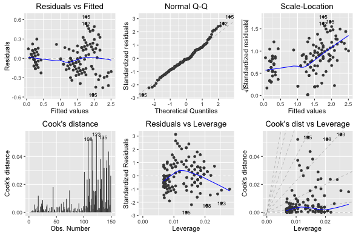
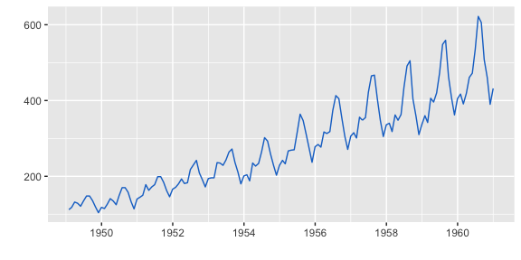

::: article
# Background

R users have many plotting options to choose from, such as base
graphics, grid graphics, and
[*lattice*](https://CRAN.R-project.org/package=lattice) graphics
[@lattice-tang]. Each has their own unique customization and
extensibility options. In recent years,
[*ggplot2*](https://CRAN.R-project.org/package=ggplot2) has emerged as a
popular choice for creating visualizations [@wickham2009ggplot2] and
provides a strong programming model based on a "grammar of graphics"
which enables methodical production of virtually any kind of statistical
chart. The *ggplot2* package makes it possible to describe a wide range
of graphics with succinct syntax and independent components and is based
on an object-oriented model that also makes it modular and extensible.
It has become a widely used framework for producing statistical graphics
in R.\
The distinct syntax of *ggplot2* makes it a definite paradigm shift from
base and *lattice* graphics and presents a somewhat steep learning curve
for those used to existing R charting idioms. Often times users only
want to quickly visualize some statistical results from key R packages,
especially those focusing on clustering and time series analysis. Many
of these packages provide default base `plot()` visualizations for the
data and models they generate. These components require transformation
before using them in *ggplot2* and each of those transformation steps
must be replicated by others when they wish to produce similar charts in
their analyses. Creating a central repository for common/popular
transformations and default plotting idioms would reduce the amount of
effort needed by all to create compelling, consistent and informative
charts. To achieve this, we provide a unified *ggplot2* plotting
interface to many statistics and machine-learning packages and functions
in order to help these users achieve reproducibility goals with minimal
effort.\
The [*ggfortify*](https://CRAN.R-project.org/package=ggfortify)
[@ggfortify] package has a very easy-to-use and uniform programming
interface that enables users to use one line of code to visualize
statistical results of many popular R packages using *ggplot2* as a
foundation. This helps statisticians, data scientists, and researchers
avoid both repetitive work and the need to identify the correct
*ggplot2* syntax to achieve what they need. With *ggfortify*, users are
able to generate beautiful visualizations of their statistical results
produced by popular packages with minimal effort.

# Software architecture

There are many ways to extend the functionality of *ggplot2*. One
straightforward way is through the use of S3 generic functions [^1].
Specifically, it is possible to provide custom functions for:

-   `autoplot()`, which enables plotting a custom object with *ggplot2*,
    and

-   `fortify()`, which enables converting a custom object to a tidy
    `"data.frame"`

The *ggforitfy* package uses this extensibility to provide default
*ggplot2* visualizations and data transformations.\
To illustrate this, we consider the implementation for
`fortify.prcomp()` and `autoplot.pca_common()` used as a basis of other
PCA related implementations:

``` r
fortify.prcomp <- function(model, data = NULL, ...) {

  if (is(model, "prcomp")) {
    d <- as.data.frame(model$x)
    values <- model$x %*% t(model$rotation)
  } else if (is(model, "princomp")) {
    d <- as.data.frame(model$scores)
    values <- model$scores %*% t(model$loadings[,])
  } else {
    stop(paste0("Unsupported class for fortify.pca_common: ", class(model)))
  }

  values <- ggfortify::unscale(values, center = model$center,
                               scale = model$scale)
  values <- cbind_wraps(data, values)
  d <- cbind_wraps(values, d)
  post_fortify(d)
}
```

This S3 function recognizes `"prcomp"` objects and will extract the
necessary components from them such as the matrix whose columns contain
the eigenvectors in `"rotation"` and rotated data in `"x"`, which can be
drawn using `autoplot()` later on. The `if()` call is used here to
handle different objects that are of essentially the same principal
components family since they can be handled in the exactly same way once
the necessary components are extracted from *ggfortify*.\
The following `autoplot.pca_common()` function first calls `fortify()`
to perform the component extraction for different PCA-related objects,
then performs some common data preparation for those objects, and
finally calls `ggbiplot()` internally to handle the actual plotting.

``` r
autoplot.pca_common <- function(object, data = NULL,
                                scale = 1.0, ...) {

  plot.data <- ggplot2::fortify(object, data = data)
  plot.data$rownames <- rownames(plot.data)

  if (is_derived_from(object, "prcomp")) {
    x.column <- "PC1"
    y.column <- "PC2"
    loadings.column <- "rotation"

    lam <- object$sdev[1L:2L]
    lam <- lam * sqrt(nrow(plot.data))

  } else if (is_derived_from(object, "princomp")) {
    ...
  } else {
    stop(paste0("Unsupported class for autoplot.pca_common: ", class(object)))
  }

  # common and additional preparation before plotting
  ...

  p <- ggbiplot(plot.data = plot.data,
                loadings.data = loadings.data, ...)
  return(p)
}
```

Once *ggfortify* is loaded, users have instant access to 38 pre-defined
`autoplot()` functions and 36 pre-defined `fortify()` functions,
enabling them to immediately `autoplot()` numerous types of objects or
pass those objects directly to *ggplot2* for manual customization.
Furthermore, *ggfortify* is highly extensible and customizable and
provides utility functions that make it easy for users to define
`autoplot()` and `fortify()` methods for their own custom objects.\
To present a streamlined API, *ggfortify* groups common implementations
for various object-types, including:

-   Time-series

-   Principal components analysis (PCA), including clustering and
    multi-dimensional sacling (MDS)

-   1d/2d kernel density estimation (KDE)

-   Survival analysis

-   Cartography

A list of currently supported packages and classes can be found in
Table [1](#tab:implementations). Additional packages that are in
development are not shown here but more than 50 object types are
supported by *ggfortify*. Feedback is being collected from users[^2] for
possible bug fixes and future enhancements.

::: {#tab:implementations}
  -----------------------------------------------------------------------------------------------------------------------------------------------------------------------------------------------------------------------------------------------------------------------------
  package         supported types                               package         supported types
  --------------- --------------------------------------------- --------------- -----------------------------------------------------------------------------------------------------------------------------------------------------------------------------------------------
  *base*          `"matrix"`, `"table"`                         *sp*            `"SpatialPoints"`, `"SpatialPolygons"`, `"Line"`, `"Lines"`, `"Polygon"`, `"Polygons"`, `"SpatialLines"`, `"SpatialLinesDataFrame"`, `"SpatialPointsDataFrame"`, `"SpatialPolygonsDataFrame"`

  *cluster*       `"clara"`, `"fanny"`, `"pam"`                 *stats*         `"HoltWinters"`, `"lm"`, `"acf"`, `"ar"`, `"Arima"`, `"stepfun"`, `"stl"`, `"ts"`,`"cmdscale"`, `"decomposed.ts"`, `"density"`, `"factanal"`, `"glm"`, `"kmeans"`, `"princomp"`, `"spec"`

  *changepoint*   `"cpt"`                                       *survival*      `"survfit"`, `"survvfit.cox"`

  *dlm*           `"dlmFilter"`, `"dlmSmooth"`                  *strucchange*   `"breakpoints"`, `"breakpointsfull"`

  *fGarch*        `"fGARCH"`                                    *timeSeries*    `"timeSeries"`

  *forecast*      `"bats"`, `"forecast"`, `"ets"`, `"nnetar"`   *tseries*       `"irts"`

  *fracdiff*      `"fracdiff"`                                  *vars*          `"varprd"`

  *glmnet*        `"cv.glmnet"`, `"glmnet"`                     *xts*           `"xts"`

  *KFAS*          `"KFS"`, `"signal"`                           *zoo*           `"zooreg"`

  *lfda*          `"lfda"`, `"klfda"`, `"self"`                 *MASS*          `"isoMDS"`, `"sammon"`

  *maps*          `"map"`                                                       
  -----------------------------------------------------------------------------------------------------------------------------------------------------------------------------------------------------------------------------------------------------------------------------

  : Table 1: Supported packages
:::

# Illustrations

As previously stated, *ggfortify* provides methods that enable *ggplot2*
to work with objects in different classes from different R packages. The
following subsections illustrate how to use *ggfortify* to plot results
from several of these packages.

## Principal components analysis

The *ggfortify* package defines both `fortify()` and `autoplot()`
methods for the two core PCA functions in the *stats* package:
`stats::prcomp()` and `stats::princomp()`. The values returned by either
function can be passed directly to `ggplot2::autoplot()` as illustrated
in the following code and in Figure [1](#figure:pca1). Note that users
can also specify a column to be used for the `colour` aesthetic.

``` r
library(ggfortify)
df <- iris[c(1, 2, 3, 4)]
autoplot(prcomp(df), data = iris, colour = "Species")
```

{#figure:pca1 width="100%" alt="graphic without alt text"}

If `label = TRUE` is specified, as shown in Figure [2](#figure:pca3),
*ggfortify* will draw labels for each data point. Users can also specify
the size of the labels via `label.size`. If `shape = FALSE` is
specified, the shape of the data points will be removed, leaving only
the labels on the plot.

``` r
autoplot(prcomp(df), data = iris, colour = "Species", shape = FALSE, label.size = 3)
```

{#figure:pca3 width="100%" alt="graphic without alt text"}

The `autoplot` function returns the constructed *ggplot2* object so
users can apply additional *ggplot2* code to further enhance the plot.
For example:

``` r
autoplot(prcomp(df), data=iris, colour = "Species", shape = FALSE, label.size = 3)
	+ labs(title = "Principal Component Analysis")
```

Users can also specify `loadings = TRUE` to draw the PCA eigen-vectors.
More aesthetic options such as size and colors of the eigen-vector
labels can also be specified as shown in Figure [3](#figure:pca5) and
the following code:

``` r
autoplot(prcomp(df), data = iris, colour = "Species",
         loadings = TRUE, loadings.colour = 'blue',
         loadings.label = TRUE, loadings.label.size = 3)
```

{#figure:pca5 width="100%" alt="graphic without alt text"}

## Linear models

The *ggfortify* function is able able to interpret `lm()` fitted model
objects and allows the user to select the subset of desired plots
through the `which` parameter (just like the `plot.lm()` function). The
`ncol` and `nrow` parameters also allow users to specify the number of
subplot columns and rows, as seen in Figure [4](#figure:lm1) and the
following code:

``` r
par(mfrow = c(1, 2))
m <- lm(Petal.Width ~ Petal.Length, data = iris)
autoplot(m, which = 1:6, ncol = 3, label.size = 3)
```

{#figure:lm1
width="100%" alt="graphic without alt text"}

Many plot aesthetics can be changed by using the appropriate named
parameters. For example, the `colour` parameter is for coloring data
points, the `smooth.colour` parameter is for coloring smoothing lines
and the `ad.colour` parameter is for coloring the auxiliary lines, as
demonstrated in Figure [5](#figure:lm2) and the following code:

``` r
autoplot(m, which = 1:6, colour = "dodgerblue3",
         smooth.colour = "black", smooth.linetype = "dashed",
         ad.colour = "blue",
         label.size = 3, label.n = 5, label.colour = "blue",
         ncol = 3)
```

{#figure:lm2 width="100%" alt="graphic without alt text"}

## Clustering

The *ggfortify* package also supports various objects like `"clara"`,
`"fanny"`, `"pam"`, `"kmeans"`, and `"lfda"`, from the
[*cluster*](https://CRAN.R-project.org/package=cluster) [@cluster] and
[*lfda*](https://CRAN.R-project.org/package=lfda) [@lfda] packages. It
automatically infers the object type and plots the results from those
packages using *ggplot2* with a single function call. Users can specify
`frame = TRUE` to easily draw the clustering boundaries as seen in
Figure [6](#figure:cluster1) and the following code:

``` r
library(cluster)
autoplot(fanny(iris[-5], 3), frame = TRUE)
```

{#figure:cluster1 width="100%" alt="graphic without alt text"}

As illustrated in Figure [7](#figure:cluster2) with
`frame.type = "norm"`, by specifying `frame.type` users are able to draw
boundaries of different shapes. The different frame types can be found
in `frame.type` option in `ggplot2::stat_ellipse()`.

``` r
autoplot(pam(iris[-5], 3), frame = TRUE, frame.type = "norm")
```

{#figure:cluster2 width="100%" alt="graphic without alt text"}

## Time series

The *ggfortify* package makes it much easier to visualize time series
objects using *ggplot2* and provides `autoplot()` and `fortify()`
implementatons for ojects from many time series libraries such as
[*zoo*](https://CRAN.R-project.org/package=zoo) [@zoo-2],
[*xts*](https://CRAN.R-project.org/package=xts) [@xts-tang], and
[*timeSeries*](https://CRAN.R-project.org/package=timeSeries)
[@timeSeries].\
Here is an example of using *ggfortify* to plot the `AirPassengers`
example time series data set from the *timeSeries* package, specifying
color via `ts.colour`, geometric shape via `ts.geom` as seen in
Figure [8](#figure:ts1), Figure [9](#figure:ts2), and
Figure [10](#figure:ts3):

``` r
library(timeSeries)
autoplot(as.timeSeries(AirPassengers), ts.colour = "dodgerblue3")
```

{#figure:ts1
width="100%" alt="graphic without alt text"}

``` r
autoplot(AirPassengers, ts.geom = "bar", fill = "blue")
```

{#figure:ts2 width="100%" alt="graphic without alt text"}

``` r
autoplot(AirPassengers, ts.geom = "point", shape = 3)
```

{#figure:ts3 width="100%" alt="graphic without alt text"}

## Forecasting

Forecasting packages such as
[*forecast*](https://CRAN.R-project.org/package=forecast) [@forecast],
[*changepoint*](https://CRAN.R-project.org/package=changepoint)
[@changepoint],
[*strucchange*](https://CRAN.R-project.org/package=strucchange)
[@strucchange], and [*dlm*](https://CRAN.R-project.org/package=dlm)
[@dlm], are popular choices for statisticians and researchers.
Predictions and statistical results from those packages can now be
plotted automatically with *ggplot2* using the functions provided by
*ggfortify*. Note that in these cases the order of loading packages
matters. For example, since *forecast* has its own `autoplot()`
function, if it is loaded before *ggfortify*, the `autoplot()` function
in *forecast* will be used instead.\
The *ggfortify* function automatically plots the original and smoothed
line from Kalman filter function in the *dlm* package as shown in
Figure [11](#figure:forecast1) .

``` r
library(dlm)
form <- function(theta){
  dlmModPoly(order = 1, dV = exp(theta[1]), dW = exp(theta[2]))
}

model <- form(dlmMLE(Nile, parm = c(1, 1), form)$par)
filtered <- dlmFilter(Nile, model)

autoplot(filtered)
```

{#figure:forecast1 width="100%" alt="graphic without alt text"}

The *ggfortify* package automatically plots the change points with
optimal positioning for the `AirPassengers` data set found in the
*changepoint* package using the `cpt.meanvar()` function, shown in
Figure [12](#figure:forecast2) .

``` r
library(changepoint)
autoplot(cpt.meanvar(AirPassengers))
```

{#figure:forecast2 width="100%" alt="graphic without alt text"}

As well, *ggfortify* plots the optimal break points where possible
structural changes happen in the regression models built by the
`strucchange::breakpoints()`, shown in Figure [13](#figure:forecast3).

``` r
library(strucchange)
autoplot(breakpoints(Nile ~ 1), ts.colour = "blue", ts.linetype = "dashed",
         cpt.colour = "dodgerblue3", cpt.linetype = "solid")
```

{#figure:forecast3 width="100%" alt="graphic without alt text"}

# Future development

We welcome suggestions and contributions from others. Providing default
`autoplot()` and `fortify()` methods for additional R objects means
researchers will spend less time focusing on *ggplot2* plotting details
and more time on their work and research. We are have provided a Github
repository <https://github.com/sinhrks/ggfortify> where users can test
out development versions of the package and provide feature requests,
feedback and bug reports. We encourage you to submit your issues and
pull requests to help us make this package better for the R community.

# Summary

The *ggfortify* package provides a very simple interface to streamline
the process of plotting statistical results from many popular R
packages. Users can spend more time and focus on their analyses instead
of figuring out the details of how to visualize their results in
*ggplot2*.

# Acknowledgement

We sincerely thank all developers for their efforts behind the packages
that *ggfortify* depend on, namely,
[*dplyr*](https://CRAN.R-project.org/package=dplyr) [@dplyr4],
[*tidyr*](https://CRAN.R-project.org/package=tidyr) [@tidyr],
[*gridExtra*](https://CRAN.R-project.org/package=gridExtra)
[@gridExtra], and [*scales*](https://CRAN.R-project.org/package=scales)
[@scales].
:::

[^1]: <http://adv-r.had.co.nz/S3.html>

[^2]: <https://github.com/sinhrks/ggfortify/issues>
