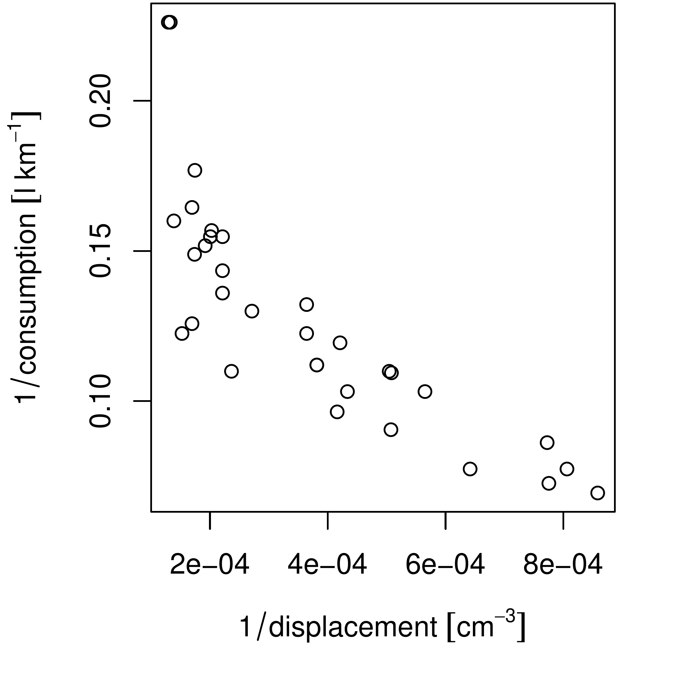
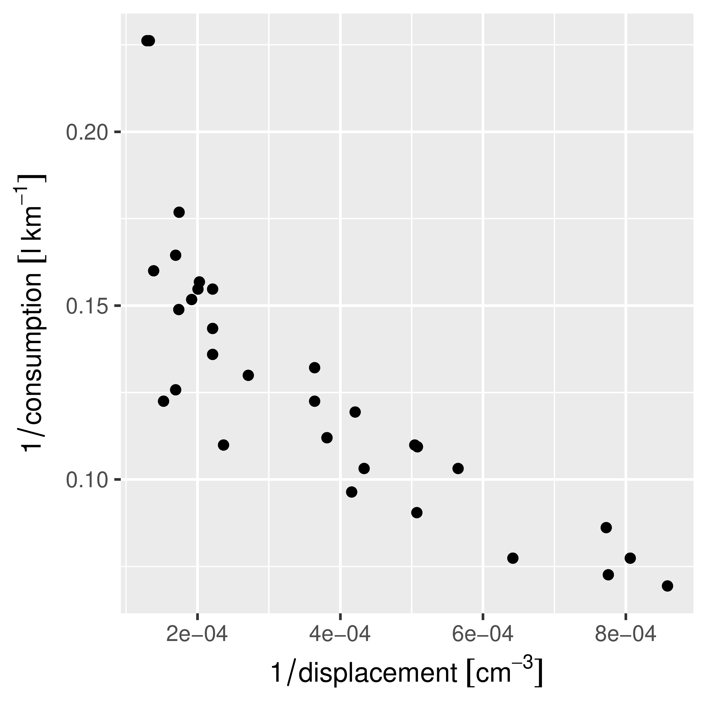

::: article
# Introduction

Two quotes from [@cobb] -- *"Data are not just numbers, they are numbers
with a context"* and *"in data analysis, context provides meaning"* --
illustrate that for a data analysis to be meaningful, knowledge of the
data's context is needed. Pragmatic aspects of this context include who
collected or generated the data, how this was done, and for which
purpose [@scheider]; semantic aspects concern what the data represents:
which aspect of the world do the data refer to, when and where were they
measured, and what a value of `1` means.

R does allow for keeping some context with data, for instance

-   `"data.frame"` columns must have and `"list"` elements may have
    names that can be used to describe context, using freetext

-   `"matrix"` or `"array"` objects may have `dimnames`

-   for variables of class `"factor"` or `"ordered"`, `levels` may
    indicate, using freetext, the categories of nominal or ordinal
    variables

-   `"POSIXt"` and `"Date"` objects specify how numbers should be
    interpreted as time or date, with fixed units (second and day,
    respectively) and origin (Jan 1, 1970, 00:00 UTC)

-   `"difftime"` objects specify how time duration can be represented by
    numbers, with flexible units (secs, mins, hours, days, weeks);
    [*lubridate*](https://CRAN.R-project.org/package=lubridate)
    [@lubridate] extends some of this functionality.

Furthermore, if spatial objects as defined in package
[*sp*](https://CRAN.R-project.org/package=sp) [@sp] have a proper
coordinate reference system set, they can be transformed to other
datums, or converted to various flat (projected) representations of the
Earth [@iliffe].

In many cases however, R drops contextual information. As an example, we
look at annual global land-ocean temperature index[^1] since 1960:

``` r
> temp_data = subset(read.table("647_Global_Temperature_Data_File.txt", 
+ 	header=TRUE)[1:2], Year >= 1960)
> temp_data$date = as.Date(paste0(temp_data$Year, "-01-01"))
> temp_data$time = as.POSIXct(temp_data$date)
> Sys.setenv(TZ="UTC")
> head(temp_data, 3)
   Year Annual_Mean       date       time
81 1960       -0.03 1960-01-01 1960-01-01
82 1961        0.05 1961-01-01 1961-01-01
83 1962        0.02 1962-01-01 1962-01-01
> year_duration = diff(temp_data$date)
> mean(year_duration)
Time difference of 365.2545 days
```

Here, the time difference units are reported for the `difftime` object
`year_duration`, but if we would use it in a linear algebra operation

``` r
> year_duration %*% rep(1, length(year_duration)) / length(year_duration)
         [,1]
[1,] 365.2545
```

the unit is dropped. Similarly, for linear regression coefficients we
see

``` r
> coef(lm(Annual_Mean ~ date, temp_data))
 (Intercept)         date 
1.833671e-02 4.364763e-05 
> coef(lm(Annual_Mean ~ time, temp_data))
 (Intercept)         time 
1.833671e-02 5.051809e-10 
```

where the unit of change is in degrees Celsius but either *per day*
(`date`) or *per second* (`time`). For purely mathematical
manipulations, R often strips context from numbers when it is carried in
attributes, the linear algebra routines being a prime example.

Most variables are somehow attributed with information about their
*units*, which specify what the value 1 of this variable represents.
This may be counts of something, e.g. `1 apple`, but it may also refer
to some *physical unit*, such as distance in meter. This article
discusses how strong unit support can be introduced in R.

# SI

The BIPM (Bureau International des Poids et Mesures) is the "*the
intergovernmental organization through which Member States act together
on matters related to measurement science and measurement standards. Its
recommended practical system of units of measurement is the
International System of Units (Système International d'Unités, with the
international abbreviation SI)*[^2]". [@si] describe the SI units,
where, briefly, *SI units*

-   consist of seven base units (length, mass, time & duration, electric
    current, thermodynamic temperature, amount of substance, and
    luminous intensity), each with a name and abbreviation (Table
    [1](#tab:si))

-   consist of *derived units* that are formed by products of powers of
    base units, such as $m/s^2$, many of which have special names and
    symbols (e.g. angle: 1 rad = 1 m/m; force: 1 N = 1 m kg s$^{-2}$)

-   consist of *coherent derived units* when derived units include no
    numerical factors other than one (with the exception of `kg`[^3]);
    an example of a coherent derived unit is 1 watt = 1 joule per 1
    second,

-   may contain SI prefixes (k = kilo for $10^3$, m = milli for
    $10^{-3}$, etc.)

-   contain special quantities where units disappear (e.g., m/m) or have
    the nature of a count, in which cases the unit is `1`.

::: center
::: {#tab:si}
  -------------------------------------------------------------------
  Base quantity                               SI base unit   
  --------------------------- --------------- -------------- --------
  Name                        Symbol          Name           Symbol

  length                      $l,x,r,$ etc.   meter          m

  mass                        $m$             kilogram       kg

  time, duration              $t$             second         s

  electric current            $I, i$          ampere         A

  thermodynamic temperature   $T$             kelvin         K

  amount of substance         $n$             mole           mol

  luminous intensity          $I_v$           candela        cd
  -------------------------------------------------------------------

  : Table 1: base quantities, SI units and their symbols (from [@si], p.
  23)
:::
:::

# Related work in R

Several R packages provide unit conversions. For instance,
[*measurements*](https://CRAN.R-project.org/package=measurements)
[@measurements] provides a collection of tools to make working with
physical measurements easier. It converts between metric and imperial
units, or calculates a dimension's unknown value from other dimensions'
measurements. It does this by the `conv_unit` function:

``` r
> library(measurements)
> conv_unit(2.54, "cm", "inch")
[1] 1
> conv_unit(c("101 44.32","3 19.453"), "deg_dec_min", "deg_min_sec")
[1] "101 44 19.2000000000116" "3 19 27.1800000000003"  
> conv_unit(10, "cm_per_sec", "km_per_day")
[1] 8.64
```

but uses for instance `kph` instead of `km_per_hour`, and then
`m3_per_hr` for flow -- unit names seem to come from convention rather
than systematic composition. Object `conv_unit_options` contains all 173
supported units, categorized by the physical dimension they describe:

``` r
> names(conv_unit_options)
 [1] "acceleration" "angle"        "area"         "coordinate"   "count"       
 [6] "duration"     "energy"       "flow"         "length"       "mass"        
[11] "power"        "pressure"     "speed"        "temperature"  "volume"      
> conv_unit_options$volume
 [1] "ul"        "ml"        "dl"        "l"         "cm3"       "dm3"      
 [7] "m3"        "km3"       "us_tsp"    "us_tbsp"   "us_oz"     "us_cup"   
[13] "us_pint"   "us_quart"  "us_gal"    "inch3"     "ft3"       "mi3"      
[19] "imp_tsp"   "imp_tbsp"  "imp_oz"    "imp_cup"   "imp_pint"  "imp_quart"
[25] "imp_gal"  
```

Function `conv_dim` allows for the conversion of units in products or
ratios, e.g.

``` r
> conv_dim(x = 100, x_unit = "m", trans = 3, trans_unit = "ft_per_sec", y_unit = "min")
[1] 1.822689
```

computes how many minutes it takes to travel 100 meters at 3 feet per
second.

Package [*NISTunits*](https://CRAN.R-project.org/package=NISTunits)
[@NISTunits] provides fundamental physical constants (Quantity, Value,
Uncertainty, Unit) for SI and non-SI units, plus unit conversions, based
on the data from NIST (National Institute of Standards and Technology).
The package provides a single function for every unit conversion; all
but 5 from its 896 functions are of the form `NISTxxxTOyyy` where `xxx`
and `yyy` refer to two different units. For instance, converting from W
m$^{-2}$ to W *inch*$^{-2}$ is done by

``` r
> library(NISTunits)
> NISTwattPerSqrMeterTOwattPerSqrInch(1:5)
[1] 0.00064516 0.00129032 0.00193548 0.00258064 0.00322580
```

Both *measurements* and *NISTunits* are written entirely in R.

# UNIDATA's udunits library and the *udunits2* R package

Udunits, developed by UCAR/UNIDATA, advertises itself on its web
page[^4] as: "*The udunits package supports units of physical
quantities. Its C library provides for arithmetic manipulation of units
and for conversion of numeric values between compatible units. The
package contains an extensive unit database, which is in XML format and
user-extendable.* The R package
[*udunits2*](https://CRAN.R-project.org/package=udunits2) [@udunits2]
provides an R level interface to the most important functions in the C
library.

The functions provided by *udunits2* are

``` r
> library(udunits2)
> ls(2)
[1] "ud.are.convertible"  "ud.convert"          "ud.get.name"        
[4] "ud.get.symbol"       "ud.have.unit.system" "ud.is.parseable"    
[7] "ud.set.encoding"    
```

Dropping the `ud` prefix, `is.parseable` verifies whether a unit is
parseable

``` r
> ud.is.parseable("m/s")
[1] TRUE
> ud.is.parseable("q")
[1] FALSE
```

`are.convertible` specifies whether two units are convertible

``` r
> ud.are.convertible("m/s", "km/h")
[1] TRUE
> ud.are.convertible("m/s", "s")
[1] FALSE
```

`convert` converts units that are convertible, and throws an error
otherwise

``` r
> ud.convert(1:3, "m/s", "km/h")
[1]  3.6  7.2 10.8
```

and `get.name`, `get.symbol` and `set.encoding` get name, get symbol or
modify encoding of the character unit arguments.

``` r
> ud.get.name("kg")
[1] "kilogram"
> ud.get.symbol("kilogram")
[1] "kg"
> ud.set.encoding("utf8")
NULL
```

Unlike the *measurements* and *NISTunits*, *udunits2* parses units as
expressions, and bases its logic upon the convertibility of expressions,
rather than the comparison of fixed strings:

``` r
> m100_a = paste(rep("m", 100), collapse = "*")
> m100_b = "dm^100"
> ud.is.parseable(m100_a)
[1] TRUE
> ud.is.parseable(m100_b)
[1] TRUE
> ud.are.convertible(m100_a, m100_b)
[1] TRUE
```

This has the advantage that through complex computations, intermediate
objects can have units that are arbitrarily complex, and that can
potentially be simplified later on. It also means that the package
practically supports an unlimited amount of derived units.

# Udunits versus the Unified Code for Units of Measure (UCUM)

Another set of encodings for measurement units is the Unified Code for
Units of Measure (UCUM, [@ucum]). A dedicated web site[^5] describes the
details of the differences between udunits and UCUM, and provides a
conversion service between the two encoding sets.

The UCUM website refers to some Java implementations, but some of the
links seem to be dead. UCUM is the preferred encoding for standards from
the Open Geospatial Consortium. udunits on the other hand is the units
standard of choice by the climate science community, and is adopted by
the CF (Climate and Forecast) conventions, which mostly uses NetCDF.
NetCDF [@netcdf] is a binary data format that is widely used for
atmospheric and climate model predictions.

The udunits library is a C library that has strong support from UNIDATA,
and we decided to build our developments on this, rather than on Java
implementations of UCUM with a less clear provenance.

# Handling data with units in R: the [*units*](https://CRAN.R-project.org/package=units) package

The *units* package builds `"units"` objects from scratch, where `m`,
created by

``` r
> library(units)
> m = make_unit("m")
> str(m)
Class 'units'  atomic [1:1] 1
  ..- attr(*, "units")=List of 2
  .. ..$ numerator  : chr "m"
  .. ..$ denominator: chr(0) 
  .. ..- attr(*, "class")= chr "symbolic_units"
```

represents `1 m`, one meter. Other length values are obtained by using
this unit in an expression:

``` r
> x1 = 1:5 * m
```

As an alternative to using `make_unit`, we can retrieve units directly
from the `ud_units` database, which is part of *units*, and was derived
from the xml units database that is part of udunits. Two ways of doing
this are

``` r
> x2 = 1:5 * ud_units$m
> identical(x1, x2)
[1] TRUE
> x3 = 1:5 * with(ud_units, m)
> identical(x1, x3)
[1] TRUE
```

Although one could attach `ud_units` to use the units directly, there
are over 3000 and this would not only clobber the namespace but also
lead to conflicts, e.g. for `T` (Tesla, `TRUE`) or `in` (inch, reserved
R language element). The last form using `with` has the advantage that
it can take direct expressions:

``` r
> with(ud_units, m/s^2)
1 m/s^2
```

Several manipulations with `"units"` objects will now be illustrated.

``` r
> m =  with(ud_units,  m)
> km = with(ud_units, km)
> cm = with(ud_units, cm)
> s =  with(ud_units,  s)
> h =  with(ud_units,  h)
```

Manipulations that do not involve unit conversion are for instance
addition:

``` r
> x = 1:3 * m/s
> x + 2 * x
Units: m/s
[1] 3 6 9
```

Explicit unit conversion is done by assigning new units:

``` r
> units(x) = cm/s
> x
Units: cm/s
[1] 100 200 300
> as.numeric(x)
[1] 100 200 300
```

similar to the behaviour of `"difftime"` objects, this modifies the
numeric values without modifying their meaning (what the numbers refer
to).

When mixing units in sums, comparisons or concatenation, units are
automatically converted to those of the first argument:

``` r
> y = 1:3 * km/h
> x + y
Units: cm/s
[1] 127.7778 255.5556 383.3333
> y + x
Units: km/h
[1]  4.6  9.2 13.8
> x < y
[1] FALSE FALSE FALSE
> c(y, x)
Units: km/h
[1]  1.0  2.0  3.0  3.6  7.2 10.8
```

where `c(y, x)` concatenates `y` and `x` after converting `x` to the
units of `y`. Derived units are created where appropriate:

``` r
> x * y
Units: cm*km/h/s
[1] 100 400 900
> x^3
Units: cm^3/s^3
[1] 1.0e+06 8.0e+06 2.7e+07
```

and meaningful error messages appear when units are not compatible:

``` r
> e = try(z <- x + x * y)
> attr(e, "condition")[[1]]
[1] "cannot convert cm*km/h/s into cm/s"
```

The full set of methods and method groups for `units` objects is shown
by

``` r
> methods(class = "units")
 [1] as.data.frame c             diff          format        hist         
 [6] Math          mean          median        Ops           plot         
[11] print         quantile      Summary       [             units<-      
[16] units         weighted.mean
see '?methods' for accessing help and source code
```

where the method groups

-   `Ops` include operations that require compatible units, converting
    when necessary (`+`, `-`, `==`, `!=`, `<`, `>`, `<=`, `>=`), and
    operations that create new units (`*`, `/`, `^` and `**`),

-   `Math` include `abs`, `sign`, `floor`, `ceiling`, `trunc`, `round`,
    `signif`, `log`, `cumsum`, `cummax`, `cummin`, and

-   `Summary` include `sum`, `min`, `max` and `range`, and all convert
    to the unit of the first argument.

When possible, new units are simplified:

``` r
> a = 1:10 * m/s
> b = 1:10 * h
> a * b
Units: m
 [1]   3600  14400  32400  57600  90000 129600 176400 230400 291600 360000
> make_unit(m100_a) / make_unit(m100_b)
1e+100 1
```

Units are printed as simple R expressions, e.g.

``` r
> m^5/s^4
1 m^5/s^4
```

Another way to print units commonly seen in Climate and Forecast
Conventions[^6] is `m2 s-1` for $m^2/s$. These are not R expressions,
but as they are understood by udunits, they can be converted (by
udunits) but not simplified (by R):

``` r
> x = make_unit("m2 s-1")
> y = km^2/h
> z = m^2/s
> x + y
278.7778 (m2 s-1)
> x/y
1 h*(m2 s-1)/km^2
> z/y
0.0036 1
```

However, `parse_unit` parses such units, and `as_cf` returns such unit
strings from `"units"` objects:

``` r
> parse_unit("m2 s-1")
1 m^2/s
> as_cf(m^2*s^-1)
[1] "m2 s-1"
```

The `plot` and `hist` methods add units to default axis labels, an
example is shown in Figure [1](#fig). For
[*ggplot2*](https://CRAN.R-project.org/package=ggplot2) plots
[@ggplot2-mur], automatic unit placement in default axis label is
provided by package **ggforce** [@ggforce]; `demo(ggforce)` gives an
example.

<figure id="fig">
<p></p>
<figcaption>Figure 1: Plot of 1/consumption against 1/displacement of
dataset <span><code>mtcars</code></span>, illustrating automatic units
in default axis labels (after conversion to SI) for base plot (left) and
ggplot (right); <code>demo(ggforce)</code> illustrates how these plots
are generated. </figcaption>
</figure>

Automatic conversion between `"units"` and `"difftime"` is provided:

``` r
> (dt = diff(Sys.time() + c(0, 1, 1+60, 1+60+3600))) # class difftime
Time differences in secs
[1]    1   60 3600
> (dt.u = as.units(dt))
Units: s
[1]    1   60 3600
> identical(as.dt(dt.u), dt) # as.difftime is not a generic
[1] TRUE
```

Objects of class `"units"` can be used as columns in `"data.frame"`
objects, as well as in `"tbl_df"` [@tibble].

# Discussion and conclusions

The *units* R package provides a new class, `"units"`, for numeric data
with associated measurement units. Operations on objects of this class
retain the unit metadata and provide automated dimensional analysis:
dimensions are taken into consideration in computations and comparisons.
Combining different units that are compatible triggers automatic unit
conversion, derived units are automatically generated and simplified
where possible, and meaningful error messages are given when a user
tries to add objects with incompatible units. This verifies that
computations are not only syntactically and numerically allowed, but
also semantically, and in the case of physical units, physically
allowed, which may support code verification and provenance tracking.
Using this package may eliminate a whole class of potential scientific
programming mistakes.

Where the R packages *measurements* and *NISTunits* provide conversion
between a fixed number of units, with the help of the udunits library
and unit database R package *units* allows for arbitrarily complex
derived units. By treating units as expressions it can derive, convert
and simplify units. In addition, beyond the SI units packaged, *units*
handles user-defined units not supported by udunits.

Data in `"units"` vectors can be stored as columns in `"data.frame"` or
`"tbl_df"` objects, and can be converted to and from `"difftime"`. When
`"units"` objects have associated time and location information, they
could be stored in spatial or spatio-temporal objects provided by *sp*
or [*spacetime*](https://CRAN.R-project.org/package=spacetime)
[@spacetime] as these store attribute data in `"data.frame"` slots, but
for instance not in `"zoo"` [@zoo] or `"xts"` [@xts-mur] objects, as
these latter two set the class attribute of a vector or matrix.

Despite all standardization efforts, units may still be ambiguous, or
subject to interpretation. For instance for the duration of one year
*NISTunits* or *udunits2* give us an answer that depends on whether we
want a common, leap, Gregorian, Julian, tropical or siderial year
([@lang], see also `demo(year)`). This illustrates that those who apply
unit conversion should be aware of possible pitfalls. Support for
calendars in udunits seems not as well developed as in R.

Future work includes extending packages that read external data from
formats, databases or interfaces with support for measurement unit
information into R, preserving the measurement unit information.
Examples would be interfaces to HDF5 (e.g.,
[*h5*](https://CRAN.R-project.org/package=h5), [@h5]),
[*RNetCDF*](https://CRAN.R-project.org/package=RNetCDF) [@RNetCDF] or
[*sos4R*](https://CRAN.R-project.org/package=sos4R) [@sos4R]. It would
be nice to see units of measurements propagate into units of regression
coefficient estimates.

# Acknowledgements {#acknowledgements .unnumbered}

We acknowledge three anonymous reviewers and the handling editor for
their constructive comments, and Thomas Lin Pedersen for implementing
the ggplot extensions in package **ggforce** that automatically add
units to default ggplot axis labels (Fig 1).
:::

[^1]: data from
    <http://climate.nasa.gov/vital-signs/global-temperature/>

[^2]: <http://www.bipm.org/en/measurement-units/>

[^3]: as a base unit, kg can be part of coherent derived units

[^4]: <https://www.unidata.ucar.edu/software/udunits/>

[^5]: <http://coastwatch.pfeg.noaa.gov/erddap/convert/units.html>

[^6]: CF,
    <http://cfconventions.org/Data/cf-standard-names/34/build/cf-standard-name-table.html>
