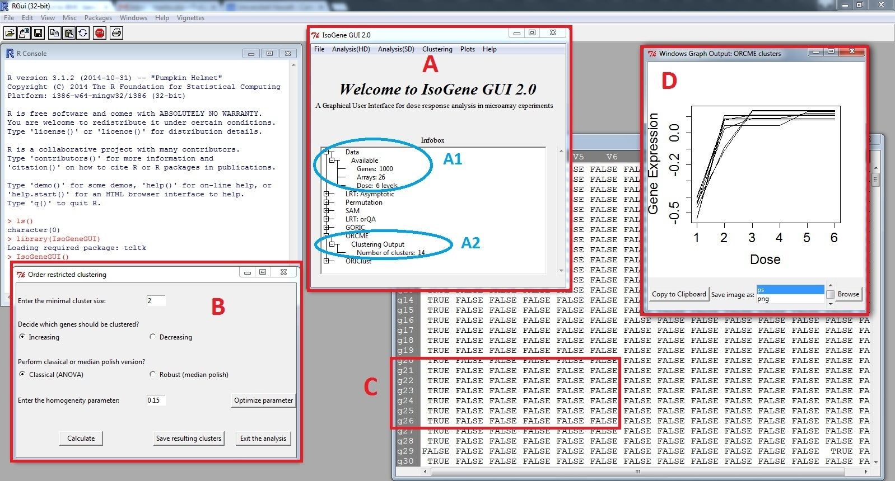

::: article
# Introduction

Modelling the dose-response relationship plays an important role in the
drug discovery process in the pharmaceutical industry. Typical responses
are efficacy or toxicity measures that are modelled with the aim of
identifying the dose that is simultaneously efficacious and safe
[@Pinheiro2006]. The recent development of microarray technology
introduced gene expression level as an additional important outcome
related to dose. Genes, for which the expression level changes over the
dose of the experimental drug, are of interest, since they provide
insight into efficacy, toxicity and many other phenotypes. Order
restriction is often assumed in the dose-response modelling, usually in
terms of monotone trend [@Lin2012]. The restriction is a consequence of
the assumption that higher dose levels induce stronger effects in the
response (either increasing or decreasing). However, order restriction
can also be related to umbrella profiles. In such a case, monotonicity
is assumed up to a certain dose level and the direction of the
dose-response relationship changes thereafter [@Bretz2003].

{#figure:IsoScheme width="100%" alt="graphic without alt text"}

Order restricted analysis received a lot of attention in previous years
and several R packages were developed for this purpose. Specifically,
the R packages [*IsoGene*](https://CRAN.R-project.org/package=IsoGene)
([@Lin2013] and [@Pramana2010]) and
[*orQA*](https://CRAN.R-project.org/package=orQA) [@Klinglmueller2010]
were developed for inference,
[*goric*](https://CRAN.R-project.org/package=goric) ([@Gerhard2012] and
[@Kuiper2013]) for model selection, and
[*ORCME*](https://CRAN.R-project.org/package=ORCME) [@Kasim2014] and
[*ORIClust*](https://CRAN.R-project.org/package=ORIClust) [@Liu2012]
were developed for order restricted clustering of genes.

Inference consists of testing a null hypothesis of a no dose-response
relationship, against an ordered alternative. Multiplicity correction
needs to be applied due to the large number of tests. The model
selection framework quantifies the expected relative distance of a given
model to the true underlying model in order to select the best model
among a set of candidate models. The model selection approach is basis
for the identification of the minimal effective dose or
lowest-observed-adverse-effect level [@Kuiper2014]. Order restricted
clustering is a data analysis approach which aims to form subsets of
genes with similar expression profiles. It can be very useful when
reference genes are available and the aim of the analysis is to identify
genes that behave in a similar way to the reference genes. The clusters
can be formed in unsupervised way and the genes that share cluster with
reference genes can be identified. Additionally, the resulting clusters
can be used to establish potential pathways and gene sets that react to
the exposure in close agreement.

All the different methods mentioned above were scattered across multiple
specialized packages. The *IsoGeneGUI* package is an envelope package in
which all the methods are available together in user friendly framework,
allowing to explore the gene expression data set with collection of
state-of-the-art tools. The overview of the package structure is
schematically shown in Figure [1](#figure:IsoScheme).

Not all scientists performing microarray experiment analysis are
necessarily educated in using R. Hence, the package *IsoGeneGUI*
[@Pramana2012] was originally created as a graphical user interface
extension of the *IsoGene* package. The large number of *IsoGeneGUI*
package downloads from the BioConductor [@Gentleman2004] repository
suggests that there is a demand for GUI data analysis tools for
inference, model selection, estimation and order restricted clustering.
Therefore, the *IsoGeneGUI* package was extended to embrace all
currently available tools in one package. In addition to the data
analysis tools for estimation, inference, model selection and
clustering, the package contains many tools for exporting results, their
visualization and easy handling of produced figures. Therefore,
*IsoGeneGUI* provides the most complete and simultaneously user friendly
data analysis tool, dealing with order restricted microarray experiments
and other dose-response studies, that is currently available in R.

The aim of this manuscript is to provide a brief introduction to the
package, both the underlying methodological aspects and its particular
implementation are discussed. Methods for inference, estimation,
clustering and model selection available in *IsoGeneGUI* package are
introduced in following section. The structure of the package is
described and details about implementation of the methods are given.

# Modelling order-restricted dose-response data

## Estimation under order restriction

The methodology described in this section has its roots in the maximum
likelihood estimate (MLE) under the order constraints. The MLE is
obtained by least squares minimization, with restriction on monotonicity
of dose-specific means. The estimation procedure under such condition is
called 'isotonic regression' [@Barlow1972]. It can be shown that the MLE
can be obtained using the 'pool adjacent violators algorithm' (PAVA).
The algorithm first computes the dose-specific means. If there is any
violation of the monotonicity between any two estimates of means, it
assigns to both of them their weighted average as new estimate for both
means. The weights are proportional to the number of observations for
particular dose. The procedure is repeated, until all the estimates
comply with the monotonicity assumption.

Specifically, assume non-decreasing profile and denote
$\mu_0, \ldots, \mu_{K-1}$ the dose-specific means and $n_i$,
$i=0, \ldots,K-1$ number of observations per dose level $i$. The
unrestricted MLE are equal to the dose-specific sample means denoted by
$\hat{\mu}_0, \ldots, \hat{\mu}_{K-1}$. Isotonic means
$\hat{\mu}^*_0, \ldots, \hat{\mu}^*_{K-1}$, i.e. the means under the
assumption of monotonicity, are computed as
$\hat{\mu}^*_j = \hat{\mu}_j$, $j=0,\ldots,K-1$, if the means fulfill
$\hat{\mu}_j \leq \hat{\mu}_{j+1}$. If any
$\hat{\mu}_j > \hat{\mu}_{j+1}$, then
$\hat{\mu}^*_j = \hat{\mu}^*_{j+1} = (n_j \hat{\mu}_j + n_{j+1} \hat{\mu}_{j+1})/(n_j + n_{j+1})$.
The procedure is repeated iteratively, until it holds that
$\hat{\mu}^*_0 \leq \cdots \leq \hat{\mu}^*_{K-1}$.

## Inference

The main goal of the inference framework is to test the relationship
between the dose level and the response of interest; gene expression in
our case. The primary interest is to test the null hypothesis of no dose
effect on the response, given by
$$\label{null}
\begin{array}{l}
H_{0}:\mu_{0} = \mu_{1} = \mu_{2} = \ldots = \mu_{K-1},
\end{array}   (\#eq:null)$$
against an ordered (monotonic) alternative
$$\label{formula:h1up}
\begin{array}{l}
H^{up}:\mu_{0} \le \mu_{1} \le \mu_{2} \le \ldots \le \mu_{K-1},
\end{array}
\;\;\;\;\mbox{or}\;\;\;
\begin{array}{l}
H^{dn}:\mu_{0} \ge \mu_{1} \ge \mu_{2} \ge \ldots \ge \mu_{K-1},\\
\end{array}   (\#eq:formulah1up)$$
with at least one strict inequality. Several test statistics for order
restricted problems were developed over the last few decades. In the
package, the following methods are available: likelihood-ratio test
(LRT, [@Barlow1972]), Williams' test statistic [@Williams1971], Marcus'
statistic [@Marcus1976], M statistic [@Hu2005] and modified M statistic
[@Lin2007]. The different methods are sensitive to different possible
underlying profiles, so there is no overall best method. The choice
strongly depends on the context of interest. The LRT test is based on
the ratio of a residual sum of squares under monotonicity over a
residual sum of squares under the null hypothesis. Williams' test
statistic is based on difference $\hat{\mu}^*_{K-1} -  \hat{\mu}_{0}$,
i.e. fold change between isotonic mean of last dose and sample mean
under first dose. Marcus' statistics is a modification of Williams' that
compares isotonic means $\hat{\mu}^*_{K-1} -  \hat{\mu}^*_{0}$. The M
and modified M test statistics are based on the same difference as
Marcus' test, but they differ in a way how the estimation of standard
error is approached. Detailed discussion about the methods, their usage
and advantages and disadvantages can be found in @Lin2007. The
distribution of some of the test statistics cannot be derived
analytically. Therefore, resampling based inference is implemented to
approximate distribution of test statistics under the null model
([@Westfall1993] and [@Ge2003]).

When the tests are performed for a large number of genes, the
multiplicity adjustment is necessary. Otherwise, the significance level
control would be compromised and large number of false positives is
expected. In general, there are two approaches for multiplicity
corrections. Either by controlling the probability of at least one false
positive among the findings (Family Wise Error Rate, FWER) or
alternatively by controlling the proportion of false positives among the
findings (False Discovery Rate, FDR). The FWER can be controlled by
Bonferroni [@Bonferroni1936], Holm [@Holm1979], Hochberg [@Hochberg1990]
or Šidák single-step and step-down [@vSidak1971] procedures. The method
of Bonferroni and Šidák's are conservative methods due to the assumption
of independence among tests, especially in case of large number of tests
performed simultaneously, which is often the case in microarray setting.
Hochberg's method is more powerful, but it only provides control of FWER
under assumption that there is non-negative dependance among the tests
[@Hochberg1990]. Therefore, among the FWER methods, we suggest to use
Holm's procedure, unless there is strong motivation otherwise. The
procedure is uniformly more powerful than Bonferroni's method, but does
not need positive dependence assumption to control FWER, as in case of
Hochberg's method. The use of FDR instead of FWER is common in
microarray studies. It translates into relaxing the control of false
positives, while decreasing false negatives. It is suitable to use, if
few false positives among findings are not a practical problem and we
are mainly interested in identification of as many true positives as
possible. The FDR can be controlled using the Benjamini-Hochberg (BH,
[@Benjamini1995]) or Benjamini-Yekutieli (BY, [@Benjamini2001])
procedures. Similarly to FWER, the BY-FDR method is valid only under
positive dependence among the tests, so the BH-FDR should be used unless
there is a strong motivation otherwise.

A common issue in gene expression inference is the presence of genes
with relatively low variance that induce large values of the test
statistics under consideration, although the magnitude of the effect is
negligible. Formally, the genes are declared statistically significant,
but from a biological point of view, these genes will not be further
investigated due to small fold change. Significance Analysis of
Microarrays (SAM, [@Tusher2001]) was proposed as a solution for this
issue by inflating the standard error.

## Clustering

The *IsoGeneGUI* package provides two clustering approaches based on
algorithms that incorporate order restrictions. The *ORCME* package
implements the $\delta$-clustering algorithm [@Kasim2012] which is based
on the $\delta$-biclustering algorithm proposed by @Cheng2000. The
clustering is not applied on the data themselves, but on the isotonic
means. Hence, it ignores the within dose variability and uncertainty
about the mean estimation. Therefore, it is advised that the algorithm
is applied either to a filtered data set (i.e. genes with fold change
higher than given threshold) or on the genes showing significant
dose-response profile (i.e. after the inference step). The method is
sensitive both to differences in shape and to the different magnitude of
the effect (even if shape is similar). The clustering criterion in
@Kasim2012 is based on error sum of squares. The more robust version of
the algorithm is achieved by using the median polish algorithm to
compute the residuals [@Mosteller1977] and by replacing the squared
error by an absolute value of error. This implies that less weight is
put on outlying residuals and the clusters are allowed for greater
deviations under the same degree of homogeneity.

The *ORIClust* package implements the one or two-stage Order Restricted
Information Criterion Clustering algorithm (ORICC, [@Liu2009],
[@Lin2012a]) which is based on an information criterion that takes into
account order restrictions. The filtering step can be addressed within
the algorithm itself. The ORICC algorithm considers different type of
dose-response profiles, such as monotone profiles and umbrella profiles,
that can be used for clustering. Umbrella profiles assume that the
monotonicity holds up to a certain dose and then the trend changes the
direction. Practical example, when such profiles are suitable, is
overdosing with the drug, changing beneficial effect to the harmful one.
In contrast to the clustering approach implemented in the
$\delta$-clustering method, the ORICC algorithm pulls together all
monotone profiles. Hence, it is not suitable for the separation of
non-decreasing monotone profiles with a true zero effect at some dose
levels (i.e. some dose-specific means are equal) from strictly
increasing profiles. This is the main difference between these two
clustering algorithms, ORICC and $\delta$-clustering, proposed by
@Liu2009 and @Lin2012a, respectively. For that reason, they are both
needed to provide a complete toolbox for an order restricted analysis of
microarray data.

## Model selection

The task of model selection procedures is to select the 'best' model out
of the given set of possible models. The 'best' is translated into a
combination of the likelihood, i.e. how well the model fits the data,
and a penalty on the number of parameters (i.e. model complexity). The
form of penalty distinguishes various methods developed over past
decades. A model selection based method is implemented in the package
*goric* using Generalized Order Restricted Information Criterion (GORIC,
[@Kuiper2011]). The GORIC method incorporates the information about the
order constraints when calculating the information criteria. It extends
the ORIC [@Anraku1999] algorithm designed for simple monotone order
restriction by allowing more complicated structure of constraints. The
set of possible models is given and the output of the GORIC provides
weights for each of these models [@Kuiper2014]. The weights can be
interpreted as posterior model probabilities [@Lin2012a]. It is often
the case that a null model is not considered in this step, if the method
is applied conditionally on the inference step that selected genes with
significant dose-response relationship. Based on the model weights, the
best model or set of models can be selected. The main motivation for
selecting one or more models is to estimate a quantity of interest that
characterize dose-response relationship. For example, the determination
of the minimum effective dose (MED). The MED is defined as the first
dose that exhibits some effect of dose on the response. It can be
estimated either based on the best model or as weighted average of
several models, with weights proportional to the model weights
[@Kuiper2014].

# The structure of the package

The package *IsoGeneGUI* encompasses all the methods mentioned in
previous section. The summary is given in Table [1](#softwareGUI). The
GUI was build using `Tcl/Tk` environment.

::: center
::: {#softwareGUI}
  ---------------------------------------------------
  Package      Analysis type     Reference
  ------------ ----------------- --------------------
  *IsoGene*    Inference         @Lin2012

  *orQA*       Inference         @Klinglmueller2010

  *ORCME*      Clustering        @Kasim2014

  *ORIClust*   Clustering        @Liu2012

  *goric*      Model selection   @Gerhard2012
  ---------------------------------------------------

  : Table 1: *Packages for the analysis of order-restricted
  dose-response gene expression data available on CRAN.*
:::
:::

The *IsoGeneGUI* is freely available from R-Forge repository
<https://r-forge.r-project.org/projects/isogenegui/>. It can be
downloaded and run from R with commands:

``` r
install.packages("IsoGeneGUI", repos = "http://r-forge.r-project.org")
library(IsoGeneGUI)
IsoGeneGUI()
```

The main window of the package is shown in Figure [2](#figure:Menu). The
top tab lists several submenus. First the submenu 'File' (A in
Figure [2](#figure:Menu)) allows to load the data set and to display the
data values as table. The data compatible with package can be provided
either as plain text file, Microsoft Excel spreadsheet or the `.RData`
file. The submenu 'Analysis(HD)' (B) comprises the methods for
inference, estimation and model selection, i.e. it contains the packages
*IsoGene*, *orQA* and *goric*. The submenu 'Analysis(SD)' (C) is to be
used when there is only one sample available. The clustering of the
genes based on their profiles can be performed in a separate submenu
(D), using the methods implemented in *ORCME* and *ORIClust*. Some of
the plots can be obtained from the analysis windows, but more general
plots are listed in the visualization techniques submenu (E). The
graphical techniques listed in submenu D typically use outputs of the
methods implemented in other submenus. The plots can be saved in
multiple file types. The last submenu 'Help' (F) contains the help files
for the *IsoGene* package, the *IsoGeneGUI* package and the vignette for
*IsoGeneGUI*. The box in the center of the main window (G) gathers the
results of the analyses and displays summary statistics of the results.
Additionally, it serves as indicator of which outputs are currently
active (if analysis was run multiple times) and will be plotted by
visualization tools.

An example of the package interface is fully shown in
Figure [3](#figure:IsoGUI). We can see the main window again (A), now
with the box showing the properties of active data set (A1) and a
summary of results of a clustering procedure (A2). The window that was
used for clustering with $\delta$-clustering method is displayed on the
left side of the Figure [3](#figure:IsoGUI) (B) and the results are
displayed in the table (C). One of the clusters was plotted using one of
the visualization options (D). Further examples are shown in following
section.

{#figure:Menu width="100%" alt="graphic without alt text"}

<figure id="figure:IsoGUI">
<p><span></span></p>
<figcaption>Figure 3: R with opened <em>IsoGeneGUI</em>
package.</figcaption>
</figure>

# Applications

The *IsoGeneGUI* implementation of the available methods is less
flexible than in original packages. That is natural trade-off between
clarity and accessibility of options in GUI compared to plain R packages
that are more flexible but also more difficult to operate without
proficient knowledge of R. This section describes the implementation of
the methods for inference, clustering and model selection. The examples
shown in Figure [4](#figure:IsoPerm) to Figure [6](#figure:IsoORICC)
were obtained using the example data set `dopamine` that is part of the
*IsoGeneGUI* package. The `dopamine` data set is subset of a larger
dose-response experiment [@Lin2012] and consist of 1000 genes with four
doses and 3 arrays per dose. In each figure, one method is presented,
accompanied with one of available graphical displays.

## Inference

The permutation test is implemented for all five test statistics
discussed above, using the functions from *IsoGene* package. For the
LRT, a much faster implementation of the permutation test is available
from *orQA*. Both methods produce the same result (within the sampling
error), so the slower version should be used only in case that
additional test statistics are of interest. Additionally, there is an
asymptotic solution available for the LRT as well. Note that it is
advised to avoid this option in case of small sample sizes.

The window that facilitates permutation test based on the *IsoGene*
package is shown in Figure [4](#figure:IsoPerm). The left panel shows
the window itself. The top part allows to select the genes for which the
raw p-values based on permutation test will be obtained. The middle part
of window offers seven multiplicity adjustment methods and computation
of significant genes based on any of the five test statistics. The last
part produces three types of plots. The right panel of
Figure [4](#figure:IsoPerm) shows an example of one of the plots: the
adjustment of p-value while controlling FDR. In this case, both BH and
BY methods agreed on same set of genes, but that is not necessarily case
in general. For FDR equal to 5%, we expect three false discoveries among
the 62 null hypotheses that were rejected. The left panel of
Figure [5](#figure:IsoorQA) shows the window for the LRT using the
*orQA* package, providing nearly same options as permutation method. The
right panel of Figure [5](#figure:IsoorQA) shows example of so called
'volcano plot' that compares the -log(p-value) and fold change. Note
that the high value for -log(p-value) of genes with fold change around
zero is often caused by a small variance among the observations of these
genes. This is an indication that the SAM method should be applied
[@Lin2012].

{#figure:IsoPerm
width="100%" alt="graphic without alt text"}

{#figure:IsoorQA
width="100%" alt="graphic without alt text"}

## Clustering

Order restricted clustering is addressed by two algorithms, the
$\delta$-clustering from *ORCME* and the ORICC from *ORIClust*. As
mentioned above, the package contains two versions of the
$\delta$-clustering method: clustering based on the least squares and a
robust clustering based on least of absolute residuals. The ORCME window
and output is shown in Figure [3](#figure:IsoGUI). The window
implementing ORICC is shown in left panel of
Figure [6](#figure:IsoORICC). All monotone and umbrella profiles are
automatically considered and the user cannot influence this setting.
However, this setting provides the flexible framework for clustering.
The complete profile can be included to the set as well. One or
two-stage type of ORICC can be run and output is automatically saved in
both text and visual form. The clustering results are shown in right
panel of Figure [6](#figure:IsoORICC) for case in which the top 30 genes
are kept for final clustering step.

{#figure:IsoORICC width="100%" alt="graphic without alt text"}

## Model selection

The current implementation in *IsoGeneGUI* runs automatically GORIC for
all possible models for a given direction (upward or downward trends).
Therefore, for an experiment with control and $K-1$ dose levels,
$2^{K-1}$ models are considered, including the null model of no dose
effect. In case that some of these models are a priori not considered
for the analysis, the weights can be easily normalized for the smaller
set of models. Only one gene at the time can be analyzed using the GORIC
procedure, due to computational intensity of the derivation of the model
weights. For the `dopamine` data, there are six dose levels and
therefore, for an upward trend that are 32 possible monotone
non-decreasing models (including the null model).

## Input and output

The *IsoGeneGUI* package accepts the data sets to be provided either as
plain text file, Microsoft Excel spreadsheet or the `.RData` file. The
structure of the data set can vary slightly in case of two former file
types, but in general, the structure need to be followed where genes are
listed in rows and columns represent the different conditions (doses).
In case of `.RData`, both microarray results and dose data can be passed
at once, as it is done in case of the example data set available in the
package.

Similarly, the output of the procedures can be saved either as Excel
spreadsheet or as `.RData` file. In general, all the intermediate
results can be retrieved, if needed,rather than final result of each
procedure only. In addition, the visualization tools mentioned above
provides an option to save figures in various formats as well as copy
them directly to the clipboard. The goal is to provide the user with
option to retrieve most of the relevant results, while emphasizes is put
on final results of the procedures that are easily visualized and
typically shown on the screen automatically, once the method is
finished.

Although the *IsoGeneGUI* package was developed for the analysis of
microarray dose-response experiments, it can be used for an analysis of
any high dimensional data in a dose-response setting in which the basic
data structure is a matrix, given in (\@ref(eq:Xmat)), with $n$
variables (or features, the rows of the matrix) and $m$ observations (or
conditions, samples, the columns of the matrix).

\begin{equation}
\mathbf{X} =  \begin{pmatrix}
X_{11} & X_{12} & \dots & X_{1m}\\
X_{21} & X_{22} & \dots & X_{2m}\\
.    & .    &.      & .     \\
.    & .    &.      & .     \\

.    & .    &.      & .     \\
X_{n1} & X_{n2} & \dots & X_{nm} 
\end{pmatrix} (\#eq:Xmat)
\end{equation}  

In addition, the labeling vector $\boldsymbol{R}$ which links each $j$th
sample to a dose related to the sample is given by
$$\label{Rvec}
\boldsymbol{R} =  \left (
\begin{array}{llll}
d_{1}, d_{1},\dots, d_{1},& d_{2}, d_{2},\dots, d_{2}, & \dots & d_{K}, d_{K},\dots, d_{K}
\end{array}
\right)   (\#eq:Rvec)$$

In the manuscript, $\boldsymbol{X}$ refers to a gene expression data (as
in Section L1000 Dataset) but the package can be used to analyze any
high dimensional experiment for which $\boldsymbol{X}$ and
$\boldsymbol{R}$ are available. For example, the package can be used for
RNA-seq data analysis, after normalization and transformation proposed
by @Law2014 for an analysis of RNA-seq using
[*limma*](https://CRAN.R-project.org/package=limma). Furthermore, the
case that $n=1$, i.e. 
$$\label{Xmat1}
\boldsymbol{X} =  \left (
\begin{array}{llll}
X_{11} & X_{12} & \dots & X_{1m}\\
\end{array}
\right),   (\#eq:Xmat1)$$
corresponds to a setting in which a dose-response experiment was
conducted for one variable of interest. Such an experiment can be
analyzed using the *IsoGeneGUI* package as well. An example of such an
analysis is given in Section Angina Dataset.

## L1000 dataset {#L1000}

The L1000 database
([\<http://www.lincsproject.org/\>](<http://www.lincsproject.org/>){.uri})
is one of the very new microarray datasets, which is of interest to many
researchers in this field, nowadays. After analyzing several sources of
gene expression data, it was noticed that 1000 carefully selected
landmark genes can explain approximately 80% of the information and the
dataset produced using this set of genes is known as L1000 dataset. It
is essentially a high-throughput gene expression microarray dataset in
which cultured cells are treated with various chemical and genetic
perturbations and the corresponding transcriptional responses are
measured at different concentrations. A computational pipeline is used
for data-processing, where raw fluorescence intensity is converted into
differential gene expression signatures and the data at each stage of
this pipeline are available. The *IsoGeneGUI* package was used for
analysis of the gene expression data from level 2 in order to identify
statistically significant genes with respect to dose-response profile.
Figure [7](#figure:L1000) shows an example in which the *IsoGeneGUI*
package is used to analyse L1000 gene data for a specific compound
(BRD-A19037878). All the options available under the tab 'Analysis(HD)'
can be used for this dataset as well.

{#figure:L1000
width="100%" alt="graphic without alt text"}

## Angina dataset {#angina}

This example demonstrates usability of the package on data from a
dose-response experiment with a single response variable. The Angina
data set ([@Westfall1999], p. 164) represents dose-response study of a
drug to treat angina pectoris. The response is the duration (in minutes)
of pain-free walking after treatment relative to the values before
treatment. Four active doses were used together with a control dose with
placebo only. Ten patients per dose were examined. Large values indicate
positive effects on patients. The data were used in [@Kuiper2014] and
are available under the name `angina` in the package
[*mratios*](https://CRAN.R-project.org/package=mratios) [@Djira2012] of
the R software. Figure [8](#figure:IsoGORICVec) displays the results of
the GORIC analysis when this dataset is used. The GORIC window is shown
in left panel of Figure [8](#figure:IsoGORICVec). The middle plot of
Figure [8](#figure:IsoGORICVec) displays the data and the model with
highest weights, $M_{15}$, increasing in all dose levels. The right
panel shows the weights for all the fitted models.

{#figure:IsoGORICVec width="100%" alt="graphic without alt text"}

# Summary

The analysis of dose-response relationship for order restricted
experiments is highly relevant in the drug discovery process. Multiple R
packages offer methodology within this framework. The new version of the
*IsoGeneGUI* package encompasses a wide range of these packages in a
unified way. The package contains data analysis tools for estimation,
inference, model selection and clustering. To our knowledge, it is the
only software package providing such a wide range of tools
simultaneously. Additionally, the GUI implementation of the package
allows non-statisticians to conduct the analysis with only minimal
knowledge of R.

Although the *IsoGeneGUI* package was developed for the analysis of
microarray dose-response experiments, it can be used for an analysis of
any high dimensional data in a dose-response setting. For example, for
analysis of RNA-seq data, the package can be used after normalization
and transformation in same way that it is done by @Law2014. Furthermore,
it can be used for the case of single dose-response experiment.

In summary, the *IsoGeneGUI* package is a state-of-the-art collection of
methodologies covering a wide range of analyses that are meaningful for
order restricted microarray experiments as well as in more general
setting of dose-response experiments. Moreover, the package can be used
in a straightforward way by the general scientific community.

# Acknowledgement

This work was supported by the Interuniversity Attraction Poles Research
Network P7/06 of the Belgian State (Belgian Science Policy) and the
Research Project of Hasselt University (BOF11DOC09; to MO).
:::
