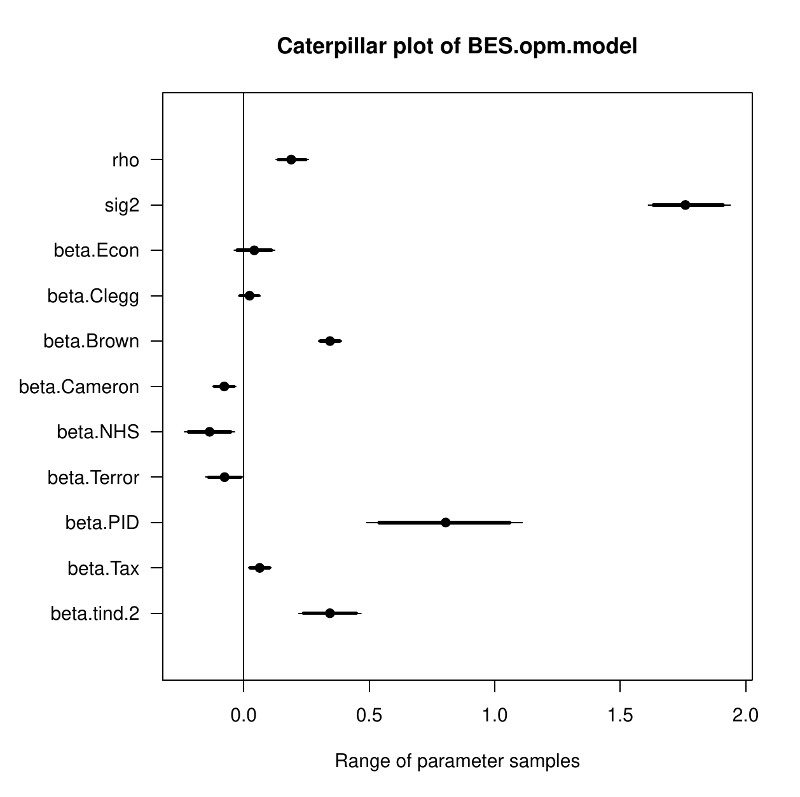
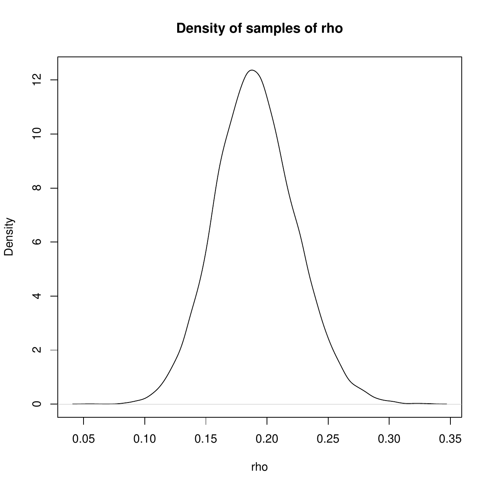
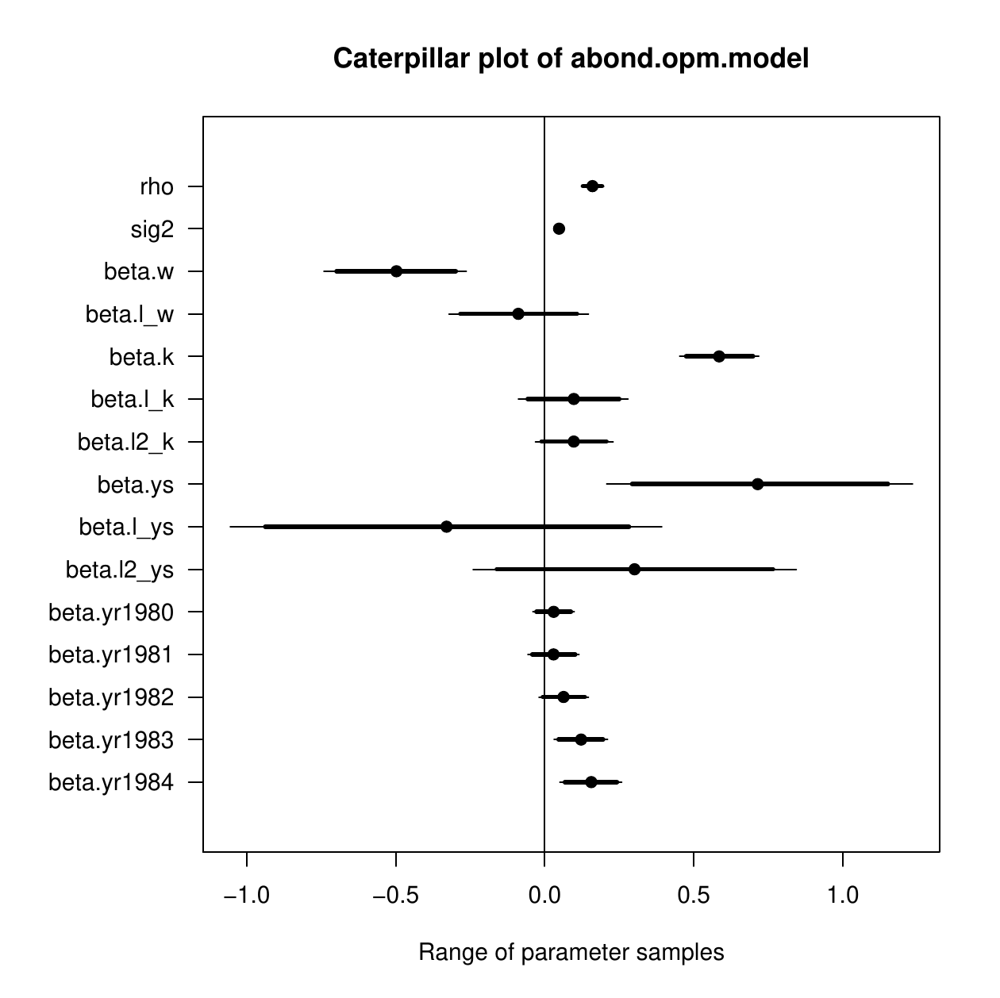
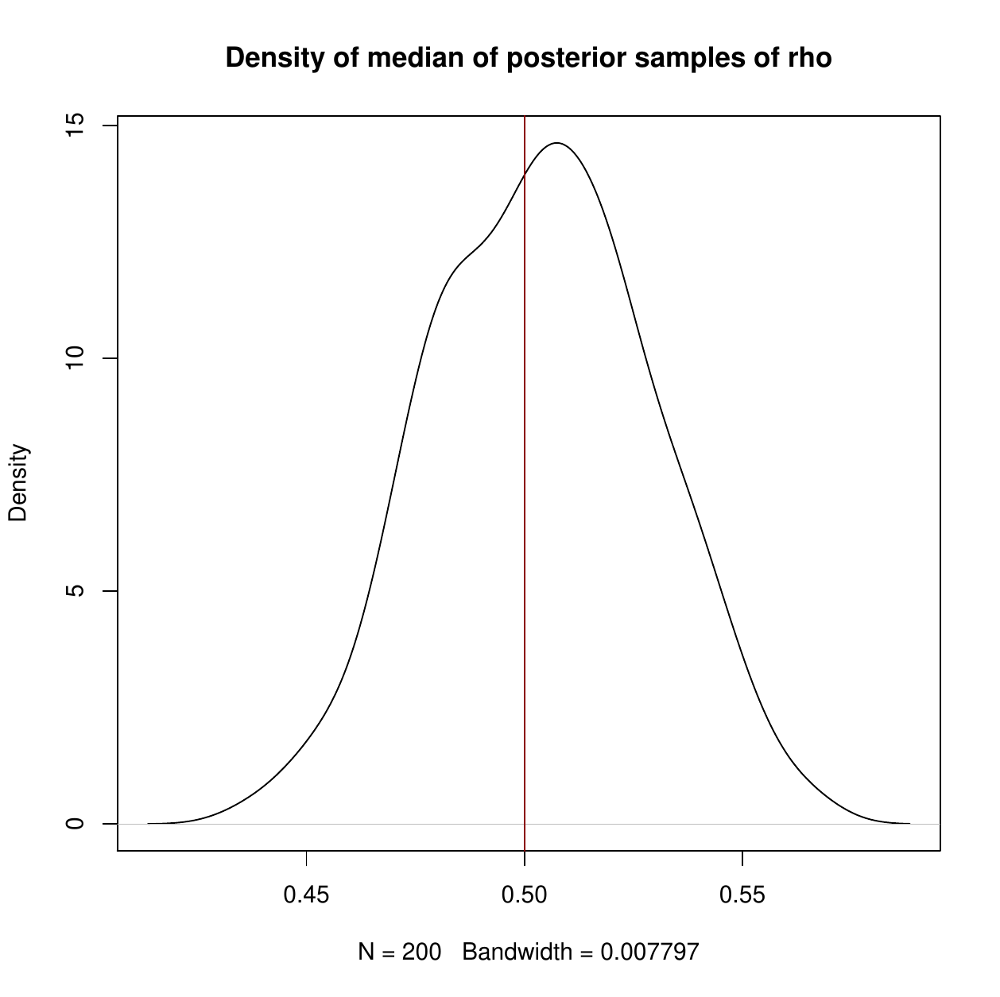
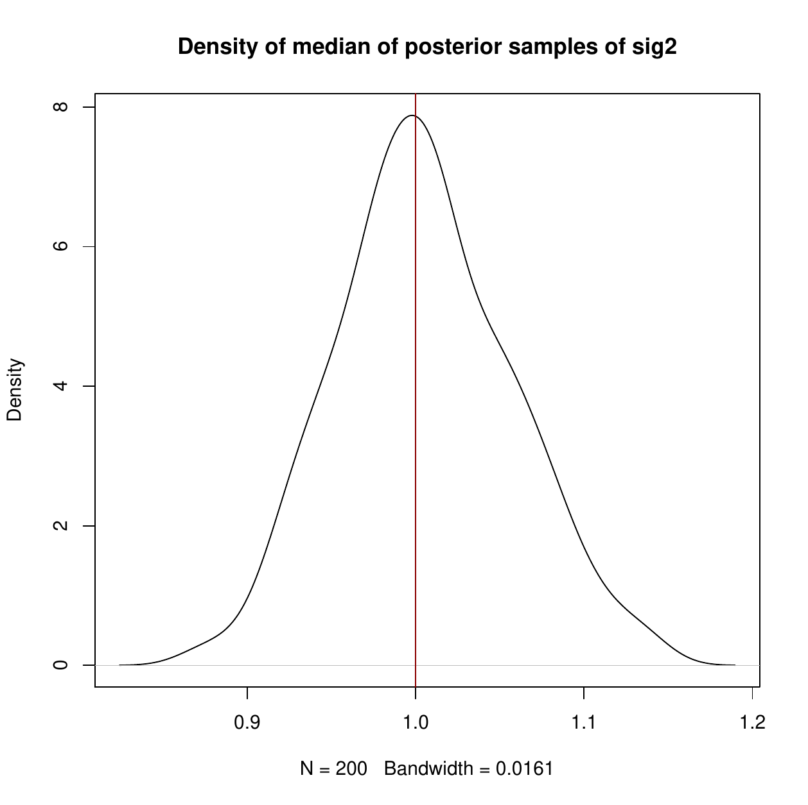
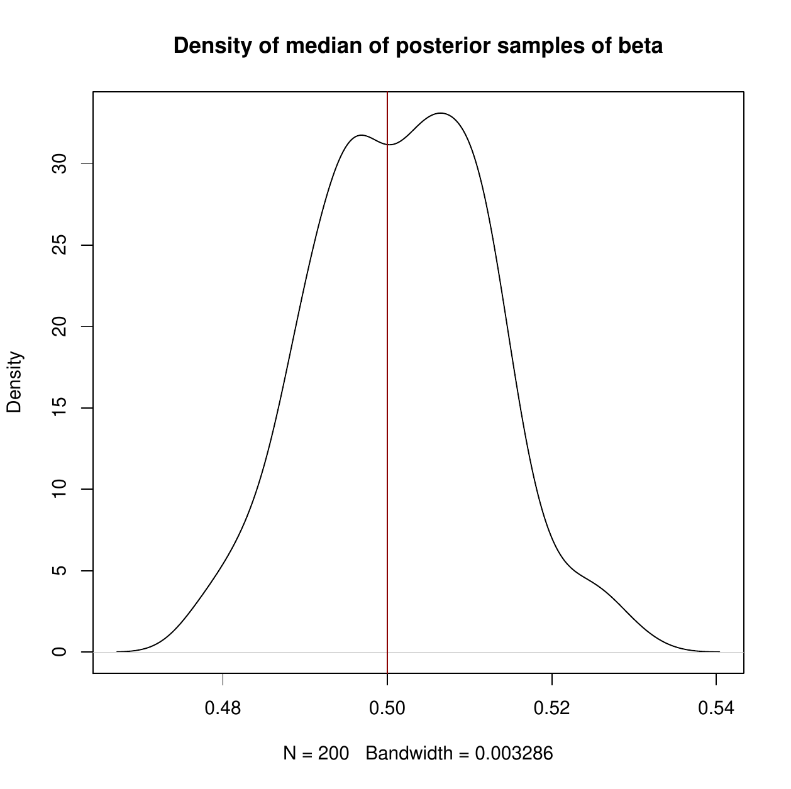

::: article
# Introduction

Panel data includes observations on $N$ cases repeated over multiple,
$T > 1$, time points (waves). A dynamic panel model is one that includes
one or more lagged dependent variables. When fixed effects are included
in such models, the OLS estimator is biased when $T$ is fixed (small).
This has become known as Nickell bias [@Nickell1981]. A maximum
likelihood estimation of such a model leads to an incidental parameters
problem [@NeymanScott1948; @Lancaster2000]. Lancaster proposes an
orthogonal reparameterization approach to produce a conditional
likelihood estimator that is exact and consistent as
$N \rightarrow \infty$ for $T \geq 2$ [@Lancaster2002].[^1]

This article provides an introduction to the R package
[*OrthoPanels*](https://CRAN.R-project.org/package=OrthoPanels), which
includes the function `opm()`. This function implements the orthogonal
reparameterization approach recommended by [@Lancaster2002] to estimate
dynamic panel models with fixed effects (and optionally: wave specific
intercepts). In this article, we first provide a brief review of the
methods implemented in *OrthoPanels*, and then discuss an empirical
illustration using some of the features of the function `opm()`.
Finally, we conduct some Monte Carlo simulations to demonstrate the
performance of the `opm()` function under different assumptions about
the data generating process.

# Review of methods

Panel models are used when we have observations on $N$ cases repeated
over $T$ time points. These models allow us to account for unobservable
individual effects (unobserved heterogeneity) that can neither be
identified nor controlled with cross-sectional models
[@Finkel2008; @Hsiao2014 pages 4--10]. The most general approach to
accounting for unobservable individual effects, in that it makes the
fewest assumptions, is a fixed effects panel model [@Hsiao2014
pages 47--56].

A dynamic panel model contains one or more lags of the dependent
variable on the right-hand side. A dynamic model is necessary if the
dependent variable is autoregressive [@Arellano2003 page 129]. We would
expect a dependent variable to be autoregressive if we believe that
subsequent to something happening that temporarily changes the value of
the dependent variable (e.g., a temporary shift in an independent
variable), the dependent variable will return partly but not entirely to
its original value before the next observation. The consequence is that
we have a dependent variable in which values that are above/below
average at one observation are more likely than not to be above/below
average at the next observation. This autoregressive relationship
between current and past values of the dependent variable is not due to
an omitted variable that links current and past values and not due to
correlation between the current and past values of the errors. The
autoregressive relationship is due to past values of the dependent
variable having a direct effect on current values [@Finkel2008
page 486]. A simple example of a data generating process that might
require a dynamic model with fixed effects (and wave specific
intercepts) is:
$$\label{eq:1}
y_{it} = \rho y_{it-1} + \beta_1 x_{it} + \tau_t + \mu_{it}   (\#eq:1)$$

$$\mu_{it} = \eta_i + \epsilon_{it}, \epsilon_{it} \thicksim NID(0,\sigma^2)$$

where $i =1,...N$ and $t=1,...,T$; $y_{it}$ is the value of the
dependent variable $y$ for case $i$ at time $t$; $x_{it}$ is the value
of the independent variable $x$ for case $i$ at time $t$; and $\rho$ and
$\beta$ are parameters. The process is first order autoregressive with
one lag of the dependent variable on the right-hand side. For each case,
there is a case-specific fixed effect $\eta_i$, also known as
unobservable individual effects. These represent (over time) average
differences between cases. There may also be over time changes in the
average value of $y_{it}$ across cases, $\tau_t$. These are changes
common to all cases at a particular point in time and include trending
as a special case. The following discussion holds whether or not
$\tau_t$ are included. They are a useful control for dynamics like
trending and global wave effects but need not be included if such
dynamics do not exist in the data.

The estimation of \@ref(eq:1) presents a challenge. The OLS
fixed-effects estimator with a lag dependent variable is biased with a
fixed (small) $T$. In the analysis of econometric panel data this has
become known as Nickell bias. Nickell [-@Nickell1981] provided the
analytical expressions of the bias that had been previously well
documented by Monte Carlo work [@Nerlove1967; @Nerlove1971]. Nickell
showed that if the autoregressive parameter, $\rho$ in \@ref(eq:1), is
positive, the bias will be negative. He also demonstrated that this bias
persists even as $\rho$ goes to zero. As we will see, the bias in the
estimation of the autoregressive parameter has important biasing effects
on the estimation of the short and long-run effects [@Greene2012
pages 422--423] of dynamic variables (e.g., $x_{it}$).

A popular alternative to the OLS estimation is the [@AndersonHsiao1981]
instrumental variable approach and more generally the Arellano and Bond
GMM estimator [-@ArellanoBond1991], and other GMM estimators
[@ArellanoBover1995; @Blundelletal2000]. The downside of these
estimators is that they are inefficient [@Behr2003]. Further, the GMM
approach uses approximate inference methods and requires assumptions
about the appropriateness of past values of the dependent variable (and
possibly independent variables) as instruments. These assumptions may or
may not be valid. Lancaster [-@Lancaster2000] argues the GMM estimator
contains no data or information that is not already contained in the
likelihood for the model. [@HsiaoPesaranTahmiscioglu2002] propose a
transformed-likelihood approach to dealing with the incidental
parameters problem. [@Lancaster2002] proposes a conditional likelihood
estimator (also a type of transformed-likelihood approach) that can
analytically compute the conditional probability distributions, over our
variables of interest, exactly. Such likelihood-based estimators require
no instrumental variable assumptions. We refer to the approach suggested
by Lancaster as orthogonal reparameterization (or OPM for orthogonalized
panel model). This approach can be conceived of as a Bayesian version of
the frequentist, transformed-likelihood approach proposed and tested by
Hsiao, Pesaran and Tahmiscioglu [-@HsiaoPesaranTahmiscioglu2002]. See
[@Pesaran2015 pages 692--695] and [@Hsiao2014 pages 80--135] for a
review of likelihood-based methods developed to estimate linear dynamic
panel models with fixed effects. The transformed-likelihood approach has
been shown to perform better than GMM estimators
[@Hsiao2014; @HsiaoPesaranTahmiscioglu2002], particularly when the
autoregressive parameter is close to $1$. The advantage of the OPM
approach, over the transformed-likelihood estimators proposed by
[@HsiaoPesaranTahmiscioglu2002] is that the latter requires knowing the
appropriate assumptions regarding the initial conditions for $y_{it}$ at
$t=0$ and their relationship with the unobservable individual effects.
This is often not known and if the wrong assumptions are made, the
estimator is no longer consistent [@AndersonHsiao1981; @Hsiao2014
pages 86--98]. This is not a requirement of the OPM approach.

## The orthogonal reparameterization (OPM) approach

The Lancaster likelihood-based estimator proceeds as follows. The
maximum likelihood estimation of model \@ref(eq:1) with a fixed (small)
$T$ leads to an *incidental parameters problem*. Maximum likelihood
estimation is consistent as $N$ increases relative to the number of
parameters estimated. With fixed $T$, the number of fixed-effects
$(\eta_i)$ approaches infinity at the same rate as
$N\rightarrow \infty$. In other words, each time we add a case, we add a
parameter to be estimated. Therefore, $N$ relative to the number of
parameters cannot increase and we cannot rely on asymptotics as
$N\rightarrow \infty$ and the application of maximum likelihood leads to
inconsistent estimates. [@Lancaster2002] suggested a solution to this
particular incidental parameters problem.

The key to this approach is that we are not actually interested in
estimates of the incidental parameters $(\eta_i)$. We are interested in
estimates of the "common parameters" -- in \@ref(eq:1) this is the
effect of dynamic variable $x_{it} \, (\beta_1)$, and $\tau_t$ , $\rho$,
and $\sigma^2$. Therefore, we seek a reparameterization of the
incidental parameters so that the incidental and common parameters are
information orthogonal. This puts us in a position to produce an
$N\rightarrow \infty$ consistent likelihood-based estimate of the
parameters of interest that is independent of the values of the
incidental parameters. Therefore, we continue to have incidental
parameters but not an incidental parameter problem.

A straightforward example of the OPM approach [@Lancaster2002] is as
follows. We wish to estimate a model that includes parameters $\eta_i$,
$\tau_t$, $\rho$ and $\beta_1$ and error variance $\sigma^2$ -- where
$\eta_i$ represents the fixed effects, $\tau_t$ represents wave specific
effects, $\rho$ is the first order autoregressive parameter and
$\beta_1$ represents the effect of dynamic variable $x_{it}$. We denote
the likelihood function for the data for a single case as
$\ell_i (\eta_i , \tau_t , \rho , \beta_1 , \sigma^2)$.

Suppose the fixed effects can be reparameterized so that the likelihood
function for the data for a single case factors as:
$$\label{eq:2}
\ell_i (\eta_i , \tau_t , \rho , \beta_1 , \sigma^2) = \ell_{i1} (\eta_i) \ell_{i2}(\tau_t , \rho , \beta_1 , \sigma^2)   (\#eq:2)$$
Where $\ell_{i1}$ and $\ell_{i2}$ are themselves likelihood functions.
If the parameters $(\eta_i)$ and $(\tau_t , \rho , \beta_1 , \sigma^2)$
are also variation independent, they are orthogonal. If
$\prod{\ell_{i2}}$ is the product of the $\ell_{i2}$ for all
observations, it can then be shown that the application of maximum
likelihood to $\prod{\ell_{i2}}$ produces consistent estimates of
$(\tau_t , \rho , \beta_1 , \sigma^2)$ [@Lancaster2002] as
$N\rightarrow \infty$ for any $T\geq 2$.

Not all likelihoods can be transformed so that the incidental parameters
are orthogonalized. However, a solution with an equivalent intuition may
be available. It may be possible to reparameterize the fixed effects so
that they are information orthogonal. If we denote the log of the
likelihood for the data for observation $i$ as $L_i$, then the fixed
effects are information orthogonal to a parameter (e.g., $\beta_1$) if
the following condition is met:
$$\label{eq:3}
E\left(\frac{\partial^2 L_i}{\partial \eta_i \partial \beta_1} \right) = 0   (\#eq:3)$$
This can be interpreted as meaning that the slope of the log likelihood
with respect to $\eta_i$ is independent of the slope of the log
likelihood with respect to $\beta_1$. If a transformation of the fixed
effects can be found that meets this condition (and the equivalent
condition for the other parameters -- in this case $\tau_t$, $\rho$ and
$\sigma^2$), it may be possible to place priors on the parameters and
integrate out the fixed effects. Specifically, we use flat priors for
the $\eta_i$ and the remaining parameters. This is essentially a
Bayesian estimation technique. This gives us the marginal posterior for
the remaining parameters. [@Lancaster2002] demonstrates how this can be
done for the lagged dependent variable model with fixed effects.

Once we have the marginal posterior for our parameters of interest, we
can use Monte Carlo methods to sample values from the marginal posterior
to produce estimates and credible intervals for the parameters, as
follows. We wish to estimate \@ref(eq:1). To generalize a little, let us
allow for $K$ dynamic variables, so that
$\beta X_{i,t} = \sum_{k=1}^{K}\beta_k x_{i,t,k}$. To simplify the
notation, we express $X_{i,t}$, $y_{i,t}$ and $y_{i,t-1}$ in vector
terms $X_{i}$, $y_{i}$ and $y_{i-}$. As the $\tau_t$ are optional,
depending on the data generating process, we leave them out of the
following discussion. The appropriate reparameterization of the fixed
effects, forming uniform priors on $\rho$, $\beta_1$, $\sigma^2$, and
$\{\eta_i\}$, and integrating out the fixed effects results in the
following posterior density function[^2]:
$$\label{eq:4}
p(\rho,\beta,\sigma^2|data) \varpropto \sigma^{-(N(T-1)-2)} exp\Big\{\frac{N}{T}\sum_{t=1}^{T-1}\left(\frac{T-t}{t}\rho^t\right) - \frac{1}{2\sigma^2}\sum_{i=1}^{N}(y_{i} - \rho y_{i-} - \beta X_{i})' H(y_{i} - \rho y_{i-} - \beta X_{i})\Big\}   (\#eq:4)$$
where $H$ is defined as an operator that subtracts the mean. For
example, if
$$\omega_i = y_{i} - \rho y_{i-} - \beta_1 X_{i}$$
then $H(\omega_i)\equiv\omega_i - \bar{\omega}$.

Sampling from this posterior \@ref(eq:4) gives us estimates
(distributions) for $\rho$, $\beta$ and $\sigma^2$. To do this we begin
by integrating $\beta$ out of \@ref(eq:4). This gives us the following
joint posterior density:

$$\label{eq:5} 
\begin{split}
p(\rho,\sigma^2|data)\varpropto \sigma^{-(N(T-1)-K-2)} exp\Big\{\frac{N}{T}\sum_{t=1}^{T-1}\left(\frac{T-t}{t}\rho^t\right)\Big\} \\
 exp\Bigg\{-\frac{1}{2\sigma^2}\left(\left(\sum_{i=1}^{N}(X_{i})' H(y_{i}-\rho y_{i-})\right)^{'}\left(\sum_{i=1}^{N}(X_{i})'H(X_{i})\right)^{-1} \left(\sum_{i=1}^{N}(X_{i})'H(y_{i}-\rho y_{i-})\right)\right)\Bigg\}
\end{split}   (\#eq:5)$$

Next, we integrate out $\sigma^2$ from \@ref(eq:5) giving us the
marginal posterior density:

$$\label{eq:6}
p(\rho|data) \varpropto \frac{exp\left \{ \frac{N}{T}\sum_{t=1}^{T-1} \left(\frac{T-t}{t}\rho^t\right)\right \}}{\left((y_{i}-\rho y_{i-})'H(y_{i}-\rho y_{i-})-\left(\sum_{i=1}^{N}(X_{i})'H(y_{i}-\rho y_{i-})\right)^{'} \left(\sum_{i=1}^{N}(X_{i})'H(X_{i}) \right)^{-1} \left(\sum_{i=1}^{N}(X_{i})'H(y_{i}-\rho y_{i-})\right)\right)^{\left(\frac{N(T-1)-K}{2}\right)}}   (\#eq:6)$$

We can now proceed to sample triplet values $(\rho,\beta,1/\sigma^{2})$
by: first sampling $\rho$ from \@ref(eq:6); then, given $\rho$, sample
$1/\sigma^2$ from \@ref(eq:5); then given $\rho$ and $1/\sigma^2$,
sample $\beta$ from \@ref(eq:4). When we sample values of $1/\sigma^2$
from \@ref(eq:5) given $\rho$, we are sampling from a gamma
distribution. When we sample values of $\beta$ from \@ref(eq:4) given
$\rho$ and $1/\sigma^2$, we are sampling from a multivariate normal. The
medians of the sampled values give us our parameter estimates and the
2.5 and 97.5 percentiles give us our 95 percent credible intervals.

The limitation of this approach is that it must be worked out for each
family of models. For example, the necessary reparameterization will
differ for a panel probit model. @Lancaster2000 provides
reparameterizations for Poisson count models, static linear panel models
and dynamic (stationary and nonstationary) linear panel models.
Estimates of dynamic, binary models by this approach are still in their
early days [@HonoreKyriazidou2000; @ArellanoBonhomme2009]. The approach
relies on the Bayesian idea of integrating out the fixed effects to give
us the marginal posterior distribution for the remaining parameters --
although, this has many similarities to the frequentist idea of a
conditional likelihood [@CoxReid1987]. For a review and comparison of
these approaches, see [@Lancaster2000].

# The *OrthoPanels* package: empirical example

In this section, we demonstrate the use of the *OrthoPanels* package
with an empirical example.[^3] The data we will use is from the 2010
British Election Study, using 3 waves of panel survey data with 1845
respondents. Our dependent variable is government approval. The wording
of the survey question that produced the variable is: "On a scale that
runs from 0 to 10, where 0 means strongly dislike and 10 means strongly
like, how do you feel about the Labour Party?" Response categories were
from 0 'Strongly dislike' to 10 'Strongly like', and 'Don't Know'.
Independent variables $(x_{it})$ included in the model are:

1.  Evaluations of the leaders of the Conservative, Liberal Democrat and
    Labour parties, measured using the question: "On a scale that runs
    from 0 to 10, where 0 means strongly dislike and 10 means strongly
    like, how do you feel about (David Cameron/Nick Clegg/Gordon
    Brown)?" '0$<$Strongly dislike'; '10$>$Strongly like'; 'Don't Know'.

2.  A standard retrospective assessment of the national economic
    situation, or 'sociotropic' evaluation, using the question: "How do
    you think the general economic situation in this country has changed
    over the last 12 months? Has it:" Response options are: 'got a lot
    worse' (1); 'got a little worse' (2); 'stayed the same' (3); 'got a
    little better' (4); 'got a lot better' (5); 'Don't Know'.

3.  Two policy evaluation questions. These are evaluations of how the
    government has handled the NHS and terrorism.[^4] For example: "How
    well do you think the present government has handled the National
    Health Service?" 'Very well' (5); 'Fairly well' (4); 'Neither well
    nor badly' (3); 'Fairly badly'' (2); 'Very badly' (1); 'Don't Know'.

4.  A measure of the respondent's ideology based on preference for
    increasing or cutting taxes, using the question: "Using the 0 to 10
    scale below, where the end marked 0 means that government should cut
    taxes a lot and spend much less on health and social services, and
    the end marked 10 means that government should raise taxes a lot and
    spend much more on health and social services, where would you place
    yourself on this scale?" '0$<$Government should cut taxes a lot and
    spend much less on health and social services'; '10$>$Government
    should increase taxes a lot and spend much more on health and social
    services'; 'Don't Know'.

5.  And a measure of whether the respondent identifies with the
    governing Labour party, using the question: "Generally speaking, do
    you think of yourself as Labour, Conservative, Liberal Democrat or
    what?" This is recoded 1 for Labour and 0 otherwise.

For each variable, a 'Don't know' response was identified as missing and
the corresponding case was deleted. Note though that *OrthoPanels* can
accomodate unbalanced panel data under the assumption that the data is
missing at random.

## Data structure

The variables for the model to be estimated can be contained in a frame,
list, or environment and the model can be specified symbolically with a
formula as described below.

The variables for our empirical example are included in the data frame
`BES_panel`. This data frame is included with the *OrthoPanels* package.

``` r
> head(BES_panel)
  n t Econ Clegg Brown Cameron Approve NHS Terror PID Tax
1 1 1    3     0     9       0       7   0      0   1   6
2 2 1    4     0    10       0       8   0      0   1   8
3 3 1    3     0     5       4       7   0      0   0   6
4 4 1    2     0     7       3       4   0      0   1   6
5 5 1    2     0     0       0       0   0      0   0   5
6 6 1    2     0     7       0       8   0      0   1   4
```

In this data frame, `"Econ"` refers to evaluations of the national
economy; `"Clegg"` refers to evaluations of the Liberal Democrat leader;
`"Brown"` refers to evaluations of the Labour leader; `"Cameron"` refers
to evaluations of the Conservative leader; `"Approval"` refers to
government approval; `"NHS"` refers to evaluations on how the government
has handled the NHS; `"Terror"` refers to evaluations on how the
government has handled terrorism; `"PID"` refers to whether the
individual identifies as Labour; and `"Tax"` refers to the respondent's
ideology based on their preference for cutting taxes. In addition to the
variables, the data frame contains the vectors `"n"` and `"t"`
indicating the case number and wave for each observation. If the
independent and dependent variables are contained in 3- and 2-dimension
arrays, these vectors are unnecessary because the index is implicit in
the organization of the arrays.

## Interface

We begin by specifying our model using a formula, indicating the data to
be used, and the case and time variables:

``` r
> BES.opm.model<-opm(Approve ~ Econ + Clegg + Brown + Cameron + NHS + Terror + PID + Tax,
data = BES_panel, index = c('n','t'), n.samp = 10000, add.time.indicators = TRUE)
```

The first argument is a formula specifying the model symbolically:
`response `$\sim$` term1 + term2`. This is consistent with the `lm()`
function. It is not necessary to include the lagged dependent variable
or the fixed effects in the model specification. This is done
automatically.

The other arguments are: `data` which specifies the data frame, list or
environment containing the variables in the model; `n.samp` which
specifies the number of Monte Carlo iterations to use to estimate the
parameters; `index` which is a two-element vector containing the names
of the case and time variables, respectively; and `add.time.indicators`
which is a logical argument. If the `add.time.indicators` is `TRUE`, the
model includes dummy variables for each wave (time point). The default
is `FALSE`. The `data` and `index` arguments are optional. If data is
not specified, the variables are taken from the environment from which
`opm()` is called. If index is not specified, the first two vectors are
assumed to be the case and time indices, respectively. An additional
optional argument is `subset`. This is a vector specifying a subset of
observations to be used in the estimation.

The function `opm()` returns an object of class `"opm"` which includes a
list, `samples`, with the following elements: `"rho"`, a vector of
`n.samp` parameter samples of $\rho$; `"v"`, a vector of `n.samp`
parameter samples of $\sigma^2$; and `"beta"`, a `n.samp` by `x`
variable matrix of parameter samples of $\beta$. If included in the
model, the parameters for the time dummies are included in this matrix.
The summary of the object provides us with the median, 68% equal tailed
credible intervals and 95% equal tailed credible intervals for each
parameter.

``` r
> summary(BES.opm.model)
Call:
opm(x = Approve ~ Econ + Clegg + Brown + Cameron + NHS + Terror + 
PID + Tax, data = BES_panel, index = c("n", "t"), n.samp = 10000, 
add.time.indicators = TRUE)

Parameter estimates:
                 <--95CI       <--68CI         med     68CI-->       95CI-->
rho             0.128000    0.15800000    0.189000    0.224000    0.25800000
sig2            1.611477    1.68193076    1.759734    1.846594    1.93906618
beta.Econ      -0.038086    0.00077932    0.041545    0.081118    0.12235574
beta.Clegg     -0.020535    0.00060795    0.022996    0.045020    0.06678845
beta.Brown      0.297306    0.31959250    0.343490    0.367214    0.39072453
beta.Cameron   -0.124476   -0.10195910   -0.077744   -0.054332   -0.03195979
beta.NHS       -0.235810   -0.18692841   -0.136087   -0.085502   -0.03647700
beta.Terror    -0.153162   -0.11566089   -0.077034   -0.037453   -0.00036214
beta.PID        0.488818    0.64660493    0.804710    0.959541    1.10995704
beta.Tax        0.017598    0.04022762    0.063176    0.086574    0.10903010
beta.tind.2     0.217953    0.27900281    0.342908    0.406506    0.46890678
```

The package includes functions that may be of use in exploring the
results. The function `confint()` computes equal tailed credible
intervals for one or more parameters in the fitted opm model. We can
calculate 90% equal tailed credible intervals as follows:

``` r
> confint(BES.opm.model, level = 0.90)
                      5%         95%
rho           0.13800000  0.24700000
sig2          1.63217694  1.90996203
beta.Econ    -0.02625512  0.10794038
beta.Clegg   -0.01312387  0.06009414
beta.Brown    0.30435125  0.38292909
beta.Cameron -0.11665040 -0.03883916
beta.NHS     -0.21928907 -0.05272413
beta.Terror  -0.14110536 -0.01271258
beta.PID      0.53904739  1.05947755
beta.Tax      0.02570175  0.10189246
beta.tind.2   0.23669235  0.4483367
```

The function `caterplot()` creates side-by-side plots of credible
intervals of the opm model parameters. The intervals are displayed as
horizontal lines, with the 90% interval using a thicker line width and
the 95% interval a thinner one. The posterior median is indicated with a
dot.

``` r
caterplot(BES.opm.model)
abline(v=0)
```

{width="100%" alt="graphic without alt text"}

We can use the function `plot()` to obtain the posterior density of each
parameter.

``` r
plot(BES.opm.model, "rho")
```

{width="100%" alt="graphic without alt text"}

In a dynamic model, the $\beta$ coefficients are the immediate effects
of a change in each of the covariates. This is known as the short-run
effect. However, in a dynamic model, the short-run effect is not the
full effect of a change in a covariate. As the future value of the
dependent variable depends on the current value, the effect of a change
in a covariate has a knock on effect into the future. Assuming a
stationary process, the effects asymptotically declined to zero over
time. The cumulation of all these effects is known as the long-run
effect and is estimated as $\beta/(1-\rho)$, where $\rho$ is the
autoregressive parameter [@Wooldridge2013; @Pickup2014]. We can
calculate the median and 95% equal tailed credible intervals for the
long-run effects from the parameter samples. For example, for the first
independent variable (the economy):

``` r
> quantile(BES.opm.model$samples$beta[, 1] / (1 - BES.opm.model$samples$rho),
+   probs = c(0.025, 0.5, 0.975))
       2.5%         50%       97.5% 
-0.04723233  0.05098789  0.15025695 
```

# The `opm()` function: Monte Carlo simulations

To demonstrate the performance of the OPM estimator operationalized by
the `opm()` function, we use it to estimate models from simulated data
with a known data generating process.[^5] We use the following data
generating process to generate our simulated data sets:

$$y_{it} = \rho y_{it-1} + \beta x_{it} + \mu_{it}$$

$$\mu_{it} = \eta_i + \varepsilon_{1it}$$

$$x_{it} = 0.75\eta_i + \varepsilon_{2it}$$

$$\varepsilon_{1it} \thicksim NID(0,1); \quad \varepsilon_{2it} \thicksim NID(0,16)$$

We use $\beta = 0.50$ and we generate data sets with two values for
$\rho$ ($0.5$ and $0.9$). The unobserved fixed values $\eta_i$, are
generated from a uniform distribution: $U(-1,1)$. Note that both the
$y_{it}$ and $x_{it}$ are a function of the fixed effects, with $x_{it}$
containing 75 percent of the fixed effect for $y_{it}$. As a
consequence, it is necessary to account for the $\eta_i$ in our data
model in order to get an unbiased estimate of $\beta$ and $\rho$.[^6]

We generate panel data sets with an $N$ of $1000$ and a $T$ of $2$, $3$,
$4$, and $9$. A $T$ of $2$ means we collected three waves of data but we
lose the first wave in order to have a measure of the lagged dependent
variable in the second wave. This effectively means we have 2 waves of
data for the purposes of estimation. This is as small of a $T$ as we can
get and still estimate a dynamic model. We generate 1000 data sets for
each value of $T$ and $\rho$.

Table 1, panels A through D, report the results of the simulations when
the autoregressive parameter, $\rho$, is $0.9$. This is a 'close to
worst case scenario' in that the autoregressive parameter is very high.
This is when Nickell bias and the incidental parameters problem will be
at their worst. However, the autoregressive parameter is not so high
that we have to begin worrying about issues of near integrated data. The
tables present the results when the number of waves of data available is
3, 4, 5 and 10 respectively (i.e., $T$ of $2$, $3$, $4$, and $9$).

The table reports the average value estimated for the autoregressive
parameter $(\rho)$, the $\beta$ and the long-run effect. This is an
indication of how accurate the estimator is on average. The tables also
include the median value estimated for the long-run effect, for reasons
described later. The tables include the proportion of estimates in which
the true value for each parameter is included in the 95 percent
confidence/credible interval (the coverage probability). This is an
indicator of how useful the estimator is for hypothesis testing.
Finally, tables report the root mean squared error for each parameter.
This is an indication of how far off the true value the estimator will
be on average. If an estimator is on average correct but could, for any
given estimation, produce estimates far off the true value, its
functionality is greatly diminished.

In addition to presenting the results for the `opm()` function (denoted
OPM), the tables also present the results from an OLS fixed effects
estimation and from a GMM estimation
[@BlundellBond1998; @ArellanoBover1995]. The OLS fixed effects results
demonstrate the estimation bias that the OPM estimator is designed to
rectify. It is also a commonly used estimator for this type of panel
data, despite the known bias [@Nickell1981].The GMM approach is probably
the most commonly used alternative and appears to be the next best
performing estimator compared to likelihood-based estimators
[@HsiaoPesaranTahmiscioglu2002]. There are a number of variations on the
GMM approach [@CroissantMillo2008]. We used a difference GMM with a
two-step estimator. We use the available lags of the dependent variable
as instruments. This specification was chosen as it seemed to produce
the best results given our data generating process. We used the
[*plm*](https://CRAN.R-project.org/package=plm) package to produce the
GMM estimates [@CroissantMillo2008]. This is a very versatile package
for estimating panel models within R.

::: {#table1}
  ---------------------------------------------------------------------------------------------------------------------------------------------------------------------------------------------------------
  A (T=2; N=1000; Rho=0.9; Beta=0.5; LR Effect=5)                                                                                                                                           
  ------------------------------------------------- --------------- --------------- --------------- --------------- -------------- -------------- --------------- ------------ ------------ ---------------
  Approach                                              **Rho**        **Beta**      **LR Effect**   **LR Effect**     **Rho**        **Beta**     **LR Effect**    **Rho**      **Beta**    **LR Effect**

                                                     **(Average)**   **(Average)**   **(Average)**   **(Median)**    **(95% CI)**   **(95% CI)**   **(95% CI)**    **(RMSE)**   **(RMSE)**    **(RMSE)**

  OLS, FE                                                0.59            0.42            1.05            1.04             0              0               0            0.31         0.08          3.95

  GMM                                                    0.92             0.5            1.98            2.21            0.97           0.97           0.72           0.18         0.05          36.57

  OPM                                                     0.9             0.5            5.89            5.17            0.93           0.94           0.92           0.03         0.01          2.79

  B (T=3; N=1000; Rho=0.9; Beta=0.5; LR Effect=5)                                                                                                                                           

  Approach                                              **Rho**        **Beta**      **LR Effect**   **LR Effect**     **Rho**        **Beta**     **LR Effect**    **Rho**      **Beta**    **LR Effect**

                                                     **(Average)**   **(Average)**   **(Average)**   **(Median)**    **(95% CI)**   **(95% CI)**   **(95% CI)**    **(RMSE)**   **(RMSE)**    **(RMSE)**

  OLS, FE                                                0.71            0.45            1.54            1.54             0              0               0            0.19         0.05          3.46

  GMM                                                     0.9             0.5            6.17            3.67            0.95           0.96           0.80           0.09         0.02          60.75

  OPM                                                     0.9             0.5            5.29            5.03            0.92           0.94           0.91           0.02        0.007          1.26

  C (T=4; N=1000; Rho=0.9; Beta=0.5; LR Effect=5)                                                                                                                                           

  Approach                                              **Rho**        **Beta**      **LR Effect**   **LR Effect**     **Rho**        **Beta**     **LR Effect**    **Rho**      **Beta**    **LR Effect**

                                                     **(Average)**   **(Average)**   **(Average)**   **(Median)**    **(95% CI)**   **(95% CI)**   **(95% CI)**    **(RMSE)**   **(RMSE)**    **(RMSE)**

  OLS, FE                                                0.76            0.47            1.93            1.92             0              0               0            0.14         0.03          3.07

  GMM                                                     0.9             0.5            50.22           4.46            0.94           0.94           0.85           0.06         0.01         1633.78

  OPM                                                     0.9             0.5            5.09            4.98            0.94           0.94           0.93           0.01        0.005          0.68

  D (T=9; N=1000; Rho=0.9; Beta=0.5; LR Effect=5)                                                                                                                                           

  Approach                                              **Rho**        **Beta**      **LR Effect**   **LR Effect**     **Rho**        **Beta**     **LR Effect**    **Rho**      **Beta**    **LR Effect**

                                                     **(Average)**   **(Average)**   **(Average)**   **(Median)**    **(95% CI)**   **(95% CI)**   **(95% CI)**    **(RMSE)**   **(RMSE)**    **(RMSE)**

  OLS, FE                                                0.84            0.49            3.07            3.07             0             0.02             0            0.06         0.01          1.93

  GMM                                                     0.9             0.5            4.92            4.81            0.92           0.92           0.88           0.02        0.005          0.92

  OPM                                                     0.9             0.5            5.02            5.02            0.95           0.94           0.94          0.005        0.003          0.26

  E (T=2; N=1000; Rho=0.5; Beta=0.5; LR Effect=1)                                                                                                                                           

  Approach                                              **Rho**        **Beta**      **LR Effect**   **LR Effect**     **Rho**        **Beta**     **LR Effect**    **Rho**      **Beta**    **LR Effect**

                                                     **(Average)**   **(Average)**   **(Average)**   **(Median)**    **(95% CI)**   **(95% CI)**   **(95% CI)**    **(RMSE)**   **(RMSE)**    **(RMSE)**

  OLS, FE                                                0.29            0.45            0.63            0.63             0              0               0            0.21         0.05          0.37

  GMM                                                     0.5             0.5            1.01            1.00            0.96           0.95           0.96           0.04         0.01          0.11

  OPM                                                     0.5             0.5            1.01            1.01            0.93           0.94           0.92           0.03         0.01          0.07

  F (T=3; N=1000; Rho=0.5; Beta=0.5; LR Effect=1)                                                                                                                                           

  Approach                                              **Rho**        **Beta**      **LR Effect**   **LR Effect**     **Rho**        **Beta**     **LR Effect**    **Rho**      **Beta**    **LR Effect**

                                                     **(Average)**   **(Average)**   **(Average)**   **(Median)**    **(95% CI)**   **(95% CI)**   **(95% CI)**    **(RMSE)**   **(RMSE)**    **(RMSE)**

  OLS, FE                                                0.37            0.47            0.75            0.75             0            0.008             0            0.13         0.03          0.25

  GMM                                                     0.5             0.5            1.00            1.00            0.94           0.95           0.94           0.02         0.01          0.06

  OPM                                                     0.5             0.5            1.00            1.00            0.92           0.94           0.92           0.02         0.01          0.04
  ---------------------------------------------------------------------------------------------------------------------------------------------------------------------------------------------------------

  : Table 1: Simulation Results
:::

Beginning with a $T$ of 2 (Table [1](#table1), Panel A), we can see just
how badly biased the OLS fixed effects estimates are. With true values
$\rho=0.9$, $\beta=0.5$ and LR effect of $5$. The OLS estimator
produces, on average, values of $\rho=0.59$, $\beta=0.42$ and LR effect
of $1.05$. The bias is substantial for all parameters. Partly as a
result of these very large biases, this approach virtually never
produces 95 percent confidence intervals that include the true values of
the parameters. The root mean squared errors are particularly large for
the long-run effects and $\rho$. Clearly, this approach is not
appropriate under these circumstances.

When we look at the results for the OPM and GMM approaches (again with
$T=2$), both look very good for the average estimates of $\rho$ and
$\beta$. There is essentially no bias for either. The 95 percent
confidence intervals include the true values around 95 percent of the
time and the root mean squared errors are generally small, although the
root mean squared error for rho is $83$ percent smaller for the OPM
approach. When we look at the results for the long-run effects, the two
approaches diverge. Using the average estimate of the long-run effect as
a measure of performance, the OPM estimator overestimates the long-run
effect with a bias of $0.89$, while the GMM estimator underestimates the
long-run effect with a bias of $3.02$. Further, while the 95 percent
confidence intervals of the OPM estimator include the true value about
$92$ percent of the time, the GMM confidence intervals only include the
true value about $72$ percent of the time.

It may seem curious that the GMM estimator is so poor at estimating the
long-run effect, when, on average, it is good at estimating $\rho$ and
$\beta$ -- especially since the long-run effect is simply a function of
$\rho$ and $\beta$: $\beta/(1-\rho)$. The problem occurs because of the
reasonable but slightly large root mean squared error on the estimates
of $\rho$. With the true value of $0.9$ for $\rho$, the root mean
squared error of the GMM estimates means it sometimes produces values
very close to $1$ for $\rho$. The division of $1-\rho$ in the
calculation of the long-run effect means that such values for $\rho$ can
translate into large errors in the estimate of the long-run effect.[^7]
Because of a smaller root mean squared error, the OPM estimator suffers
far less from this problem.

It must be noted then that for the reasons just discussed the mean
estimate is not a very stable measure of the performance of the GMM
estimates of the long-run effect. For the GMM estimator, under these
circumstances, small differences in the estimates of $\rho$ produce
large differences in the average estimate of the long-run effect. A more
stable measure is the median estimated long-run effect. For the GMM
approach this is closer to the true value ($2.21$). However, the median
OPM estimate is much better ($5.17$). Further, while the median GMM
estimate is better than the mean GMM estimate, it does not change the
fact that in any given application of the estimator, a very large error
in the long-run effect can occur. This is the story of the root mean
squared error for the long-run effect. These are moderate for the OPM
estimator, $2.79$, but extremely problematic for the GMM estimator:
$36.57$. This last result is worse than that for the OLS estimator. As
we will see, when the true value of $\rho$ is smaller or $T$ is bigger,
these problems are not so great but when $T$ is very small and $\rho$ is
close to $1$, the OPM estimator has the advantage of avoiding these
large errors to a much greater degree.

As $T$ increases to $3$ and then $4$ (Table [1](#table1), Panels B & C),
the OLS fixed effects estimator continues to exhibit substantial biases
and confidence intervals that are essentially useless for hypothesis
testing. The OPM and GMM approaches continue to produce good estimates
of $\rho$ and $\beta$. As for the long-run effects, the OPM approach
improves quickly, while the GMM approach continues to suffer from large
root mean squared errors. By the time $T$ increases to $9$ (Table
[1](#table1), Panel D), however, both the OPM and GMM approaches are
performing well for all parameters and the OLS approach continues to
perform poorly.

Table [1](#table1), Panels E & F, present the results with a reduced
$\rho$ of $0.5$. With a smaller $\rho$, we would expect less extreme
estimation problems. Unfortunately, the OLS fixed effects estimator
continues to perform badly at very small values of $T$. The GMM and OPM
estimators, on the other hand, perform very well for all parameters. The
only real distinction is that the OPM estimator performs a little
better, in terms of the root mean squared error, than the GMM estimator
in the estimation of the long-run effect when $T$ is at its smallest
possible value of $2$.

Overall, the simulations demonstrate that under the conditions
considered (specifically a low $T$ with a large $N$), the OLS fixed
effects estimator exhibits considerable bias for all parameters. The GMM
estimator is a large improvement on OLS with fixed effects but the OPM
estimator consistently performs as well as or better. The superiority of
the OPM results is in the estimation of the long-run effects when $T$ is
very small and $\rho$ is close to $1$, which appears to be the primary
weakness of the GMM estimator.

::: {#table2}
  ----------------------------------------------- --------------- --------------- --------------- --------------- -------------- -------------- --------------- ------------ ------------ ---------------
                                                      **Rho**        **Beta**      **LR Effect**   **LR Effect**     **Rho**        **Beta**     **LR Effect**    **Rho**      **Beta**    **LR Effect**

                                                   **(Average)**   **(Average)**   **(Average)**   **(Median)**    **(95% CI)**   **(95% CI)**   **(95% CI)**    **(RMSE)**   **(RMSE)**    **(RMSE)**

  (T=3; N=1000; Rho=0.9; Beta=0.5; LR Effect=5)                                                                                                                                           

                                                       0.93            0.51            7.74            7.63            0.06           0.62           0.17           0.03         0.01          2.95

  (T=4; N=1000; Rho=0.9; Beta=0.5; LR Effect=5)                                                                                                                                           

                                                       0.93            0.51            7.45            7.36            0.02           0.48           0.04           0.03         0.01          2.56

  (T=9; N=1000; Rho=0.9; Beta=0.5; LR Effect=5)                                                                                                                                           

                                                       0.91             0.5            -6.99           4.11            0.05           0.06           0.07           0.07         0.03         147.93

  (T=3; N=1000; Rho=0.5; Beta=0.5; LR Effect=1)                                                                                                                                           

                                                       0.53            0.51            1.08            0.52            0.48           0.29           0.28           0.03         0.01          0.09
  ----------------------------------------------- --------------- --------------- --------------- --------------- -------------- -------------- --------------- ------------ ------------ ---------------

  : Table 2: Simulation Results, GMM using lagged IVs and instruments
:::

Beyond the poor estimates for the long-run effect under specific
conditions, we have also indicated that one of the downsides of GMM
estimators is the need to make assumptions about the appropriateness of
instrumental variables. Up to this point, we have been using lagged
levels of the dependent variable as instruments in the GMM estimator. An
extension of this is to use the lagged differences of the dependent
variable as instruments (Arellano and Bover 1995; Blundell and Bond
1998). This is possible once the researcher has a $T>2$. This can, under
the right conditions, improve the performance of the GMM estimator but
it makes assumptions about the suitability of variables as instruments.
If these assumptions are not met, the inclusion of these additional
moment conditions may produce worse results. Table [2](#table2) reports
the results of using these additional moment conditions. We see that for
the data generating processes we have been using in our simulations,
these additional moment conditions do indeed result in poorer estimates.
The additional moment conditions result in greater bias and confidence
intervals that rarely contain the true value. Clearly we do not want to
include these additional moment conditions for our simulated data but
the problem is that we typically do not know if it is appropriate to do
so or not. The orthogonal reparameterization approach, on the other
hand, does not require the researcher to make such decisions ---
decisions which can have a substantial impact on the validity of the
estimation results. This is one further advantage of the OPM estimator.

# Appendix 1

As a second empirical example, we model the dynamics of labour demand of
firm $i$ in the United Kingdom in year $t$ as a function of real product
wages, gross capital stock and industry output. This is done using the
data used by [@ArellanoBond1991]. The variables for our second empirical
example are included in the data frame `abond_panel`. This dataframe is
included with the *OrthoPanels* package.

We estimate the following:

``` r
> abond.opm.model <- opm(n ~ w + l_w + k + l_k + l2_k + ys + l_ys + l2_ys + yr1980 
+ yr1981 + yr1982 + yr1983 + yr1984, data = abond_panel, index = c('id','year'), 
n.samp = 10000, add.time.indicators = FALSE)
```

where `n` is the log of employment in firm $i$ at time $t$; `w` is the
log of the real product wage; `k` is the log of the gross capital stock;
and `ys` is the log of the gross industry output.

``` r
> summary(abond.opm.model)
	Call:
	opm(x = n ~ w + l_w + k + l_k + l2_k + ys + l_ys + l2_ys + yr1980 + 
	yr1981 + yr1982 + yr1983 + yr1984, data = abond_panel, index = c("id", 
	"year"), n.samp = 10000, add.time.indicators = FALSE)
	
Parameter estimates:
               <--95CI      <--68CI         med     68CI-->     95CI-->
rho            0.123000    0.1400000    0.160000    0.179000    0.198000
sig2           0.042789    0.0452270    0.047862    0.050739    0.053676
beta.w        -0.741396   -0.6200462   -0.497854   -0.376953   -0.262932
beta.l_w      -0.321563   -0.2077651   -0.088837    0.030969    0.146837
beta.k         0.452300    0.5184428    0.585200    0.655670    0.718653
beta.l_k      -0.088889    0.0042183    0.097407    0.188744    0.279613
beta.l2_k     -0.031549    0.0319986    0.097301    0.163611    0.229459
beta.ys        0.207566    0.4594758    0.714674    0.971791    1.234787
beta.l_ys     -1.055967   -0.6944647   -0.329579    0.030539    0.392799
beta.l2_ys    -0.240888    0.0202597    0.301264    0.580882    0.844360
beta.yr1980   -0.040064   -0.0050531    0.029723    0.064730    0.099077
beta.yr1981   -0.057071   -0.0135131    0.029364    0.073729    0.115364
beta.yr1982   -0.019645    0.0192744    0.063018    0.106132    0.146820
beta.yr1983    0.031298    0.0759822    0.121946    0.167622    0.211210
beta.yr1984    0.050123    0.1021425    0.156051    0.207324    0.258260
```

We calculate 90% equal tailed credible intervals as follows:

``` r
> confint(abond.opm.model, level = 0.90)
             5%         95%
rho          0.128000000  0.19200000
sig2         0.043604899  0.05267575
beta.w      -0.699216408 -0.29845898
beta.l_w    -0.283471542  0.10825151
beta.k       0.474339992  0.69903010
beta.l_k    -0.057501600  0.25006782
beta.l2_k   -0.010780489  0.20708355
beta.ys      0.293130802  1.15175284
beta.l_ys   -0.938412547  0.28266139
beta.l2_ys  -0.161339807  0.76612707
beta.yr1980 -0.028266743  0.08774348
beta.yr1981 -0.042205375  0.10218775
beta.yr1982 -0.006818364  0.13445195
beta.yr1983  0.045990409  0.19575660
beta.yr1984  0.067247279  0.24236211
```

We create side-by-side plots of credible intervals of the OPM model
parameters. The intervals are displayed as horizontal lines, with the
90% interval using a thicker line width and the 95% interval a thinner
one. The posterior median is indicated with a dot.

``` r
	caterplot(abond.opm.model)
	abline(v=0)
```

{width="100%" alt="graphic without alt text"}

# Appendix 2

Let's investigate the accuracy of `opm()`'s parameter estimates on 200
simulated datasets.

First, let's define the parameters used by the data-generating process:

``` r
rho <- .5
beta <- .5
sig2 <- 1
set.seed(321)
```

The following function generates a synthetic dataset of desired
dimensions ($N$ cases and $T$ time points) and distribution parameters
($(\rho =$`rho`), $(\beta =$`beta`), and $(\sigma^2 =$ `sig2`)):

``` r
generate <- function(N, T, rho, beta, sig2) {
	LT <- T + 50
	f <- runif(N, -1, 1)
	x <- array(.75 * f, dim = c(N, LT)) + rnorm(N * LT, sd = 4) 
	y <- matrix(0, N, LT)
	for (t in 1:LT) {
		yy <- if (t > 1) 
                  y[, t - 1] 
                else
                  ((f + beta * .75 * f)/(1 - rho))
		y[, t] <- rho * yy + f + x[, t] * beta + 
                  rnorm(N, sd = sqrt(sig2))
	}
	data.frame(i = rep(seq(N), LT - 50),
	           t = rep(seq(LT - 50), each = N),
	           x1 = c(x[(50 * N + 1):(LT * N)]),
	           y = c(y[(50 * N + 1):(LT * N)]))
}
```

Now we generate 200 datasets with $N=1000$ cases and $T=3$ time points
(after a 50 wave burn-in):

``` r
N <- 1000
T <- 3
reps <- 200
	
ds <- replicate(n = reps,
                generate(N = N, T = T, rho = rho, beta = beta, sig2 = sig2),
                simplify = FALSE)
```

Now we fit the OPM model to the datasets and save the results:

``` r
library(OrthoPanels) 
library(knitr)

set.seed(421)
opms <- lapply(ds, function(d) {
  opm(y ~ x1, data = d, n.samp = 1000)
})
```

Let's check the sampled parameters:

``` r
true_param <- c(rho = rho, sig2 = sig2, beta = beta)
est_param <- sapply(opms, coef)
resid <- sweep(est_param, 1, true_param)
rmse <- sqrt(rowMeans(resid ^ 2))
kable(rbind(`True` = true_param,
	    `Est` = rowMeans(est_param),
	    `Bias` = rowMeans(resid),
	    `RMSE` = rmse))
```

  ------------------------------------------
                 rho        sig2        beta
  ------ ----------- ----------- -----------
  True     0.5000000   1.0000000   0.5000000

  Est      0.5038800   1.0050657   0.5018072

  Bias     0.0038800   0.0050657   0.0018072

  RMSE     0.0252336   0.0517390   0.0106620
  ------------------------------------------

  : 

Density plot for each parameter, with true value marked with a vertical
line:

``` r
plot(density(sapply(opms, coef)[1,]),
     main = 'Density of median of posterior samples of rho')
abline(v = rho, col = 'darkred')
```

{width="100%" alt="graphic without alt text"}

``` r
plot(density(sapply(opms, coef)[2,]),
     main = 'Density of median of posterior samples of sig2')
abline(v = sig2, col = 'darkred')
```

{width="100%" alt="graphic without alt text"}

``` r
plot(density(sapply(opms, coef)[3,]),
     main = 'Density of median of posterior samples of beta')
abline(v = beta, col = 'darkred')
```

{width="100%" alt="graphic without alt text"}

The proportion of time the 95% credible interval includes the true value
of the parameter:

``` r
cis <- sapply(lapply(opms, confint),
              function(ci) {
                ci[, '2.5%'] <= c(rho, sig2, beta) &
                ci[, '97.5%'] >= c(rho, sig2, beta)
              })
rowSums(cis) / reps
```

  -----------------------
  rho        sig2    beta
  ------- ------- -------
  0.930     0.955   0.925

  -----------------------

  : 
:::

[^1]: Note this means two waves of data used in the estimation and data
    on the dependent variable from a third earlier wave ($T = 0$). This
    is due to the need to have values for the lagged dependent variable
    at $T = 1$.

[^2]: This varies slightly from 3.24 in [@Lancaster2002]. The prior
    density for $\sigma^2$ had not been included.

[^3]: We include a second empirical example in Appendix 1.

[^4]: The terrorism question in 2010 is replaced with a handling of the
    war in Afghanistan question.

[^5]: Example code for running such simulations is provided in the
    vignette included in Appendix 2.

[^6]: When generating the data sets, we set $y_{i0}$ equal to the series
    equilibrium and include a burn-in period of 50 waves.

[^7]: One should always be cautious whenever the estimate of $\rho$ is
    close to $1$. This suggests that either a poor estimation has
    occurred or that the data is (near) integrated and therefore not
    stationary, for the purposes of estimation.
