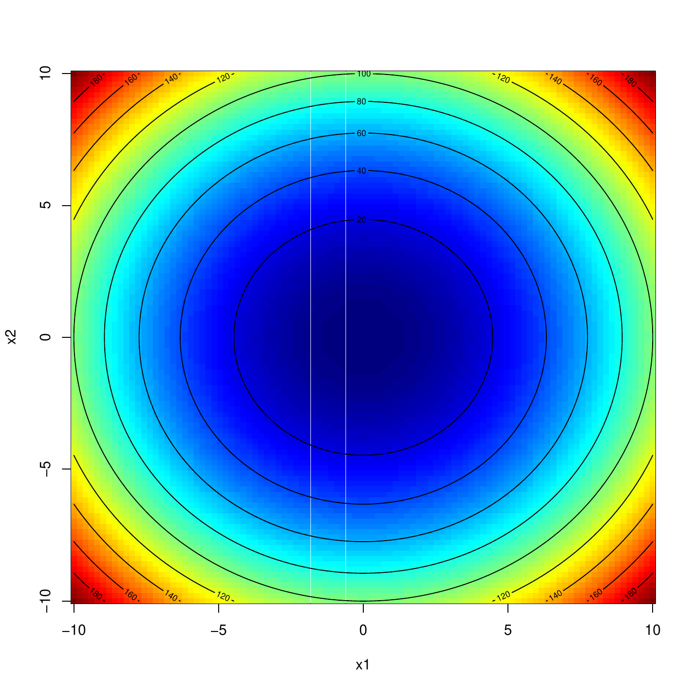
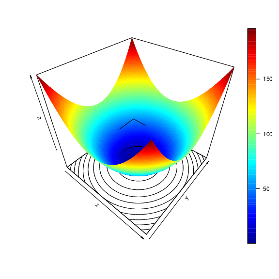

::: article
# Introduction

The task of global optimization is to find the best solution
$\mathbf{x} = \left(x_1, \ldots, x_n\right)^T \in \mathbf{X}$ according
to a set of objective functions $\mathcal{F} = \{f_1, \ldots, f_m\}$. If
input vectors as well as output values of the objective functions are
real-valued, i. e., $f_i : \mathbb{R}^n \to \mathbb{R}$ the optimization
problem is called continuous. Otherwise, i.e., if there is at least one
non-continuous parameter, the problem is termed *mixed*. For $m = 1$,
the optimization problem is termed single-objective and the goal is to
minimize a single objective $f$, i. e.,

$$\begin{aligned}
  \mathbf{x}^{*} = \text{arg\,min}_{\mathbf{x} \in X} f\left(\mathbf{x}\right).
\end{aligned}$$
Clearly, talking about minimization problems is no restriction: we can
maximize $f$ by minimizing $-f$. Based on the structure of the search
space, there may be multiple or even infinitely many global optima,
i. e., $\mathbf{x}^{*} \in \mathbf{X}^{*} \subseteq \mathbf{X}$. We are
faced with a multi-objective optimization problem if there are at least
two objective functions. In this case as a rule no global optimum exists
since the objectives are usually conflicting and there is just a partial
order on the search space; for sure
$\left(1, 4\right)^T \leq \left(3, 7\right)^T$ makes sense, but
$\left(1, 4\right)^T$ and $\left(3, 2\right)^T$ are not comparable. In
the field of multi-objective optimization we are thus interested in a
set

$$\begin{aligned}
  PS = \{\mathbf{x} \in \mathbf{X} \, | \, \nexists \, \tilde{\mathbf{x}} \in \mathbf{X} \, : \, f\left(\tilde{\mathbf{x}}\right) \preceq f\left(\mathbf{x}\right)\} \subseteq \mathbf{X}
\end{aligned}$$

of optimal trade-off solutions termed the Pareto-optimal set, where
$\preceq$ defines the dominance relation. A point $\mathbf{x} \in X$
dominates another point $\tilde{\mathbf{x}} \in X$, i. e.,
$\mathbf{x} \preceq \tilde{\mathbf{x}}$ if

$$\begin{aligned}
  & \forall \, i \in \{1, \ldots, m\} \, : \, f_i(\mathbf{x}) \leq f_i(\tilde{\mathbf{x}})\\
\text{and } & \exists \, i \in \{1, \ldots, m\} \, : \, f_i(\mathbf{x}) < f_i(\tilde{\mathbf{x}}).
\end{aligned}$$

Hence, all trade-off solutions $\mathbf{x}^{*} \in PS$ are
non-dominated. The image of the Pareto-set
$PF = f\left(PS\right) = \left(f_1\left(PS\right), \ldots, f_m\left(PS\right)\right)$
is the *Pareto-front* in the objective space. See @CLV06 for a thorough
introduction to multi-objective optimization.

There exists a plethora of optimization algorithms for single-objective
continuous optimization in R (see the *CRAN Task View on
[*Optimization*](https://CRAN.R-project.org/view=Optimization) and
Mathematical Programming* [@TB14] for a growing list of available
implementations and packages). @R_globalOptTests gives a comprehensive
review of continuous single-objective global optimization in R. In
contrast there are just a few packages, e. g.,
[*emoa*](https://CRAN.R-project.org/package=emoa) [@R_emoa],
[*mco*](https://CRAN.R-project.org/package=mco) [@R_mco],
[*ecr*](https://CRAN.R-project.org/package=ecr) [@R_ecr], with methods
suited to tackle continuous multi-objective optimization problems. These
packages focus on evolutionary multi-objective algorithms (EMOA), which
are very successful in approximating the Pareto-optimal set.

## Benchmarking optimization algorithms

In order to investigate the performance of optimization algorithms or
for comparing of different algorithmic optimization methods in both the
single- and multi-objective case a commonly accepted approach is to test
on a large set of artificial test or benchmark functions. Artificial
test functions exhibit different characteristics that pose various
difficulties for optimization algorithms, e. g., multimodal functions
with more than one local optimum aim to test the algorithms' ability to
escape from local optima. Scalable functions can be used to access the
performance of an algorithm while increasing the dimensionality of the
decision space. In the context of multi-objective problems the geometry
of the Pareto-optimal front (convex, concave, ...) as well as the degree
of multimodality are important characteristics for potential
benchmarking problems. An overview of single-objective test function
characteristics can be found in [@JY13]. A thorough discussion of
multi-objective problem characteristics is given by @HHVW06. @R_flacco
recently published an R package with methods suited to quantify/estimate
characteristics of unknown optimization functions at hand. Since the
optimization community mainly focuses on purely continuous optimization,
benchmarking test sets lack functions with discrete or mixed parameter
spaces.

## Related work

Several packages make benchmark functions available in R. The packages
[*cec2005benchmark*](https://CRAN.R-project.org/package=cec2005benchmark)
[@R_cec2005benchmark] and
[*cec2013*](https://CRAN.R-project.org/package=cec2013) [@R_cec2013] are
simple wrappers for the C implementations of the benchmark functions for
the corresponding CEC 2005/2013 Special Session on Real-Parameter
Optimization and thus very limited. The
[*globalOptTests*](https://CRAN.R-project.org/package=globalOptTests)
[@R_globalOptTests] package interfaces 50 continuous single-objective
functions. Finally the
[*soobench*](https://CRAN.R-project.org/package=soobench) [@R_soobench]
package contains some single-objective benchmark functions and in
addition several useful methods for visualization and logging.

## Contribution

The package [*smoof*](https://CRAN.R-project.org/package=smoof)
[@R_smoof] contains generators for a large and diverse set of both
single-objective and multi-objective optimization test functions.
Single-objective functions are taken from the comprehensive survey by
@JY13 and black-box optimization competitions
[@HFRA09; @R_cec2005benchmark]. Moreover, a flexible function generator
introduced by @W15 is interfaced. Multi-objective test functions are
taken from @DTLZ02 [@ZDT00] and @ZZZSL09. In the current version --
version 1.4 in the moment of writing -- there are $99$ continuous test
function generators available ($72$ single-objective, $24$
multi-objective, and $3$ function family generators). Discontinuous
functions (2) and functions with mixed parameters spaces (1) are
underrepresented at the moment. This is due to the optimization
community mainly focusing on continuous functions with numeric-only
parameter spaces as stated above. However, we plan to extend this
category in upcoming releases.

Both single- and multi-objective smoof functions share a common and
extentable interface, which allows to easily add new test functions.
Finally, the package contains additional helper methods which facilitate
logging in the context of optimization.

# Installation

The *smoof* package is available on CRAN, the Comprehensive R Archive
Network, in version 1.4. To download, install and load the current
release, just type the code below in your current R session.

``` r
> install.packages("smoof")
> library(smoof)
```

If you are interested in toying around with new features take a look at
the public repository at GitHub
(<https://github.com/jakobbossek/smoof>). This is also the place to
complain about problems and missing features / test functions; just drop
some lines to the issue tracker.

# Diving into the *smoof* package {#sec:diving_into_smoof}

In this section we first explain the internal structure of a test
function in the *smoof* package. Later we take a look on how to create
objective functions, the predefined function generators and
visualization. Finally, we present additional helper methods which may
facilitate optimization in R.

## Anatomy of *smoof* functions

The functions `makeSingleObjectiveFunction` and
`makeMultiObjectiveFunction` respectively can be used to create
objective functions. Both functions return a regular R function with its
characteristic properties appended in terms of attributes. The
properties are listed and described in detail below.

name

:   The function name. Mainly used for plots and console output.

id

:   Optional short name. May be useful to index lists of functions.

description

:   Optional description of the function. Default is the empty string.

fn

:   The actual implementation of the function. This must be a function
    of a single argument `x`.

has.simple.signature

:   Logical value indicating whether the function `fn` expects a simple
    vector of values or a named list. This parameter defaults to `TRUE`
    and should be set to `FALSE`, if the function depends on a mixed
    parameter space, i. e., there are both numeric and factor
    parameters.

par.set

:   The set of function parameters of `fn`. *smoof* makes use of the
    [*ParamHelpers*](https://CRAN.R-project.org/package=ParamHelpers)
    [@R_ParamHelpers] package to define parameters.

noisy

:   Is the function noisy? Default is `FALSE`.

minimize

:   Logical value(s) indicating which objectives are to be minimized
    (`TRUE`) or maximized (`FALSE`) respectively. For single objective
    functions a single logical value is expected. For multi-objective
    test functions a logical vector with `n.objectives` components must
    be provided. Default is to minimize all objectives.

vectorized

:   Does the function accept a matrix of parameter values? Default is
    `FALSE`.

constraint.fn

:   Optional function which returns a logical vector indicating which
    non-box-constraints are violated.

tags

:   A character vector of tags. A tag is a kind of label describing a
    property of the test function, e.g., *multimodel* or *separable*.
    Call the `getAvailableTags` function for a list of possible tags and
    see [@JY13] for a description of these. By default, there are no
    tags associated with the test function.

global.opt.params

:   If the global optimum is known, it can be passed here as a vector,
    matrix, list or data.frame.

global.opt.value

:   The function value of the `global.opt.params` argument.

n.objectives

:   The number of objectives.

Since there exists no global optimum in multi-objective optimization,
the arguments `global.opt.params` and `global.opt.value` are exclusive
to the single-objective function generator. Moreover, tagging is
possible for the single-objective case only until now. In contrast, the
property `n.objectives` is set to 1 internally for single-objective
functions and is thus no parameter of `makeSingleObjectiveFunction`.

## Creating *smoof* functions

The best way to describe how to create an objective function in *smoof*
is via example. Assume we want to add the the two-dimensional Sphere
function

$$\begin{aligned}
  f : \mathbb{R}^2 \to \mathbb{R}, \mathbf{x} \mapsto x_1^2 + x_2^2 \text{ with } x_1, x_2 \in [-10, 10]
\end{aligned}$$

to our set of test functions. The unique global optimum is located at
$\mathbf{x}^* = \left(0, 0\right)^T$ with a function value of
$f\left(\mathbf{x}^{*}\right) = 0$. The code below is sufficient to
create the Sphere function with *smoof*.

``` r
> fn <- makeSingleObjectiveFunction(
>   name = "2D-Sphere",
>   fn = function(x) x[1]^2 + x[2]^2,
>   par.set = makeNumericParamSet(
>     len = 2L, id = "x",
>     lower = c(-10, -10), upper = c(10, 10),
>     vector = TRUE
>   ),
>   tags = "unimodal",
>   global.opt.param = c(0, 0),
>   global.opt.value = 0
> )
> print(fn)
Single-objective function
Name: 2D-Sphere
Description: no description
Tags:
Noisy: FALSE
Minimize: TRUE
Constraints: TRUE
Number of parameters: 2
           Type len Def           Constr Req Tunable Trafo
x numericvector   2   - -10,-10 to 10,10   -    TRUE     -
Global optimum objective value of 0.0000 at
  x1 x2
1  0  0
```

Here we pass the mandatory arguments `name`, the actual function
definition `fn` and a parameter set `par.set`. We state, that the
function expects a single numeric vector parameter of length two where
each component should satisfy the box constraints
($x_1, x_2 \in [-10, 10]$). Moreover we let the function know its own
optimal parameters and the corresponding value via the optional
arguments `global.opt.param` and `global.opt.value`. The remaining
arguments fall back to their default values described above.

As another example we construct a mixed parameter space function with
one numeric and one discrete parameter, where the latter can take the
three values $a$, $b$ and $c$ respectively. The function is basically a
shifted single-objective Sphere function, where the shift in the
objective space depends on the discrete value. Since the function is not
purely continuous, we need to pass the calling entity a named list to
the function and thus `has.simple.signature` is set to `FALSE`.

``` r
> fn2 <- makeSingleObjectiveFunction(
>   name = "Shifted-Sphere",
>   fn = function(x) {
>     shift = which(x$disc == letters[1:3]) * 2
>     return(x$num^2 + shift)
>   },
>   par.set = makeParamSet(
>     makeNumericParam("num", lower = -5, upper = 5),
>     makeDiscreteParam("disc", values = letters[1:3])
>   ),
>   has.simple.signature = FALSE
> )
> print(fn2)
Single-objective function
Name: Shifted-Sphere
Description: no description
Tags:
Noisy: FALSE
Minimize: TRUE
Constraints: TRUE
Number of parameters: 2
         Type len Def  Constr Req Tunable Trafo
num   numeric   -   - -5 to 5   -    TRUE     -
disc discrete   -   -   a,b,c   -    TRUE     -

> fn2(list(num = 3, disc = "c"))
[1] 15
```

## Visualization

There are multiple methods for the visualization of 1D or 2D smoof
functions. The generic `plot` method draws a contour plot or level plot
or a combination of both. The following code produces the graphics
depicted in Figure [1](#fig:sphere_fun) (left).

``` r
> plot(fn, render.contours = TRUE, render.levels = TRUE)
```

Here the argument `render.levels` achieves the heatmap effect, whereas
`render.contours` activates the contour lines. Moreover, numeric 2D
functions can be visualized as a 3D graphics by means of the `plot3D`
function (see Fig. [1](#fig:sphere_fun) (right)).

``` r
> plot3D(fn, contour = TRUE)
```

<figure id="fig:sphere_fun">
<p></p>
<figcaption>Figure 1: Contour plot (left) and 3D plot (right) of the
two-dimensional Sphere function.</figcaption>
</figure>

If you prefer the visually appealing graphics of
[*ggplot2*](https://CRAN.R-project.org/package=ggplot2) [@R_ggplot2] you
can make use of `autoplot`, which returns a `ggplot2` object. The
returned `ggplot` object can be easily modified with additional
geometric objects, statistical transformations and layers. For instance,
let us visualize the mixed parameter function `fn2` which was introduced
in the previous subsection. Here we activate ggplot2 facetting via
`use.facets = TRUE`, flip the default facet direction and adapt the
limits of the objective axis by hand. Figure
[2](#fig:shifted_sphere_fun) shows the resulting plot.

``` r
library(ggplot2)
pl <- autoplot(fn2, use.facets = TRUE) # basic call
pl + ylim(c(0, 35)) + facet_grid(. ~ disc) # (one column per discrete value)
```

{#fig:shifted_sphere_fun
width="100%" alt="graphic without alt text"}

In particular, due to the possibility to subsequently modify the
`ggplot` objects returned by the `autoplot` function it can be used
effectively in other packages to, e. g., visualize an optimization
process. For instance the *ecr* package makes extensive use of *smoof*
functions and the *ggplot2* plots.

## Getter methods

Accessing the describing attributes of a *smoof* function is essential
and can be simply realized by `attr("attrName", fn)` or alternatively
via a set of helper functions. The latter approach is highly
recommended. By way of example the following listing shows just a few of
the available helpers.

``` r
> getGlobalOptimum(fn)$param
  x1 x2
1  0  0
> getGlobalOptimum(fn)$value
[1] 0
> getGlobalOptimum(fn)$is.minimum
[1] TRUE
> getNumberOfParameters(fn)
[1] 2
> getNumberOfObjectives(fn)
[1] 1
> getLowerBoxConstraints(fn)
  x1  x2
 -10 -10
```

# Predefined test function generators {#sec:predefined_test_functions}

Extending *smoof* with custom objective functions is nice to have, but
the main benefit in using this package is the large set of
preimplemented functions typically used in the optimization literature.
At the moment of writing there are in total 72 single objective
functions and 24 multi-objective function generators available. Moreover
there are interfaces to some more specialized benchmark sets and problem
generators which will be mentioned in the next section.

## Generators for single-objective test functions

To apply some optimization routines to say the Sphere function you do
not need to define it by hand. Instead you can just call the
corresponding generator function, which has the form `makeFUNFunction`
where `FUN` may be replaced with one of the function names. Hence, the
Sphere function can be generated by calling
`makeSphereFunction(dimensions = 2L)`, where the integer `dimensions`
argument defines the dimension of the search space for scalable
objective functions, i. e., functions which are defined for arbitrary
parameter space dimensions $n \geq 2$. All $72$ single-objective
functions with their associated tags are listed in Table
[1](#tab:smoof_so_functions). The tags are based on the test function
survey in [@JY13]. Six functions with very different landscapes are
visualized in Figure [3](#fig:smoof_example_so_functions).

{#fig:smoof_example_so_functions
width="100%" alt="graphic without alt text"}

Beside these functions there exist two additional single-objective
generators, which interface special test function sets or function
generators.

BBOB

:   The $24$ Black-Box Optimization Benchmark (BBOB) 2009 [@HFRA09]
    functions can be created with the
    `makeBBOBFunction(fid, iid, dimension)` generator, where `fid`
    $\in \{1, \ldots, 24\}$ is the function identifier, `iid` is the
    instance identifier and `dimension` the familiar argument for
    specifying the parameter space dimension.

MPM2

:   The problem generator *multiple peaks model 2* [@W15] is accessible
    via the function `makeMPM2Function`. This problem generator produces
    multimodal problem instances by combining several randomly
    distributed peaks [@W15]. The number of peaks can be set via the
    `n.peaks` argument. Further arguments are the problem `dimension`,
    an initial `seed` for the random numbers generator and the
    `topology`, which accepts the values `random` or `funnel`
    respectively. For details see the technical report of the multiple
    peaks model 2 @W15.

::: {#tab:smoof_so_functions}
  ----------------------------- -------------------------------------------------------------------------
  Function                      Tags

  Ackley                        continuous, multimodal, differentiable, non-separable, scalable

  Adjiman                       continuous, differentiable, non-separable, non-scalable, multimodal

  Alpine N. 1                   continuous, non-differentiable, separable, scalable, multimodal

  Alpine N. 2                   continuous, differentiable, separable, scalable, multimodal

  Aluffi-Pentini                continuous, differentiable, non-separable, non-scalable, unimodal

  Bartels Conn                  continuous, non-differentiable, non-separable, non-scalable, multimodal

  Beale                         continuous, differentiable, non-separable, non-scalable, unimodal

  Bent-Cigar                    continuous, differentiable, non-separable, scalable, unimodal

  Bird                          continuous, differentiable, non-separable, non-scalable, multimodal

  BiSphere                      multi-objective

  Bohachevsky N. 1              continuous, differentiable, separable, scalable, multimodal

  Booth                         continuous, differentiable, non-separable, non-scalable, unimodal

  BraninRCOS                    continuous, differentiable, non-separable, non-scalable, multimodal

  Brent                         continuous, differentiable, non-separable, non-scalable, unimodal

  Brown                         continuous, differentiable, non-separable, scalable, unimodal

  Bukin N. 2                    continuous, differentiable, non-separable, non-scalable, multimodal

  Bukin N. 4                    continuous, non-differentiable, separable, non-scalable, multimodal

  Bukin N. 6                    continuous, non-differentiable, non-separable, non-scalable, multimodal

  Carrom Table                  continuous, differentiable, non-separable, non-scalable, multimodal

  Chichinadze                   continuous, differentiable, separable, non-scalable, multimodal

  Chung Reynolds                unimodal, continuous, differentiable, scalable

  Complex                       continuous, differentiable, non-separable, non-scalable, multimodal

  Cosine Mixture                discontinuous, non-differentiable, separable, scalable, multimodal

  Cross-In-Tray                 continuous, non-separable, non-scalable, multimodal

  Cube                          continuous, differentiable, non-separable, non-scalable, unimodal

  Deckkers-Aarts                continuous, differentiable, non-separable, non-scalable, multimodal

  Deflected Corrugated Spring   continuous, differentiable, non-separable, scalable, multimodal

  Dixon-Price                   continuous, differentiable, non-separable, scalable, unimodal

  Double-Sum                    convex, unimodal, differentiable, separable, scalable, continuous

  Eason                         continuous, differentiable, separable, non-scalable, multimodal

  Egg Crate                     continuous, separable, non-scalable

  Egg Holder                    continuous, differentiable, non-separable, multimodal

  El-Attar-Vidyasagar-Dutta     continuous, differentiable, non-separable, non-scalable, unimodal

  Engvall                       continuous, differentiable, non-separable, non-scalable, unimodal

  Exponential                   continuous, differentiable, non-separable, scalable

  Freudenstein Roth             continuous, differentiable, non-separable, non-scalable, multimodal

  Generelized Drop-Wave         multimodal, non-separable, continuous, differentiable, scalable

  Giunta                        continuous, differentiable, separable, multimodal

  Goldstein-Price               continuous, differentiable, non-separable, non-scalable, multimodal

  Griewank                      continuous, differentiable, non-separable, scalable, multimodal

  Hansen                        continuous, differentiable, separable, non-scalable, multimodal

  Himmelblau                    continuous, differentiable, non-separable, non-scalable, multimodal

  Holder Table N. 1             continuous, differentiable, separable, non-scalable, multimodal

  Holder Table N. 2             continuous, differentiable, separable, non-scalable, multimodal

  Hosaki                        continuous, differentiable, non-separable, non-scalable, multimodal

  Hyper-Ellipsoid               unimodal, convex, continuous, scalable

  Jennrich-Sampson              continuous, differentiable, non-separable, non-scalable, unimodal

  Judge                         continuous, differentiable, non-separable, non-scalable, multimodal

  Keane                         continuous, differentiable, non-separable, non-scalable, multimodal

  Kearfott                      continuous, differentiable, non-separable, non-scalable, multimodal

  Leon                          continuous, differentiable, non-separable, non-scalable, unimodal

  Matyas                        continuous, differentiable, non-separable, non-scalable, unimodal

  McCormick                     continuous, differentiable, non-separable, non-scalable, multimodal

  Michalewicz                   continuous, multimodal, scalable

  Periodic                      continuous, differentiable, non-separable, non-scalable, multimodal

  Double-Sum                    continuous, differentiable, separable, scalable, unimodal

  Price N. 1                    continuous, non-differentiable, separable, non-scalable, multimodal

  Price N. 2                    continuous, differentiable, non-separable, non-scalable, multimodal

  Price N. 4                    continuous, differentiable, non-separable, non-scalable, multimodal

  Rastrigin                     multimodal, continuous, separable, scalable

  Rosenbrock                    continuous, differentiable, non-separable, scalable, multimodal

  Schaffer N. 2                 continuous, differentiable, non-separable, non-scalable, unimodal

  Schaffer N. 4                 continuous, differentiable, non-separable, non-scalable, unimodal

  Schwefel                      continuous, multimodal, scalable

  Shubert                       continuous, differentiable, non-scalable, multimodal

  Six-Hump Camel Back           continuous, differentiable, non-separable, non-scalable, multimodal

  Sphere                        unimodal, separable, convex, continuous, differentiable, scalable

  Styblinkski-Tang              continuous, differentiable, non-separable, non-scalable, multimodal

  Sum of Different Squares      unimodal, continuous, scalable

  Swiler2014                    discontinuous, mixed, multimodal

  Three-Hump Camel              continuous, differentiable, non-separable, non-scalable, multimodal

  Trecanni                      continuous, differentiable, separable, non-scalable, unimodal

  Zettl                         continuous, differentiable, non-separable, non-scalable, unimodal
  ----------------------------- -------------------------------------------------------------------------

  : Table 1: All single objective functions currently available in
  *smoof* with their corresponding tags.
:::

## Generators for multi-objective test functions

Evolutionary algorithms play a crucial role in solving multi-objective
optimization tasks. The relative performance of *mutli-objective
evolutionary algorithms* (MOEAs) is, as in the single-objective case,
mainly studied experimentally by systematic comparison of performance
indicators on test instances. In the past decades several test sets for
multi-objective optimization were proposed mainly by the evolutionary
computation community. The *smoof* package offers generators for the
DTLZ function family by Deb et al. [@DTLZ02], the ZDT function family by
Zitzler et al. [@ZDT00] and the multi-objective optimization test
instances UF1, ..., UF10 of the CEC 2009 special session and competition
[@ZZZSL09].

The DTLZ generators are named `makeDTLZXFunction` with X =
$1, \ldots, 7$. All DTLZ generators need the search space dimension $n$
(argument `dimensions`) and the objective space dimension $p$ (argument
`n.objectives`) with $n \geq p$ to be passed. DTLZ4 may be passed an
additional argument `alpha` with default value 100, which is recommended
by @DTLZ02. The following lines of code generate the DTLZ2 function and
visualize its Pareto-front by running the NSGA-II EMOA implemented in
the *mco* package with a population size of 100 for 100 generations (see
Figure [4](#fig:dtlz2_front)).

``` r
> fn = makeDTLZ2Function(dimensions = 2L, n.objectives = 2L)
> visualizeParetoOptimalFront(fn, show.only.front = TRUE)
```

ZDT and UF functions can be generated in a similar manner by utilizing
`makeZDTXFunction` with X = $1, \ldots, 5$ or `makeUFFunction`.

{#fig:dtlz2_front width="100%" alt="graphic without alt text"}

# Optimization helpers {#sec:optimization_helpers}

In this section we present some additional helper methods which are
available in *smoof*.

## Filtering and building of test sets

In a benchmark study we most often need not just a single test function,
but a set of test functions with certain properties. Say we want to
benchmark an algorithm on all multimodal smoof functions. Instead of
scouring the smoof documentation for suitable test functions we can make
use of the `filterFunctionsByTags` helper function. This function has
only a single mandatory argument, namely a character vector of `tags`.
Hence, to get an overview of all multimodal functions we can write the
following:

``` r
> fn.names <- filterFunctionsByTags(tags = "multimodal")
> head(fn.names)
[1] "Ackley"       "Adjiman"      "Alpine N. 1"  "Alpine N. 2"  "Bartels Conn"
[6] "Bird"
> print(length(fn.names))
[1] 46
```

The above shows there are 46 multimodal functions. The next step is to
generate the actual smoof functions. We could do this by hand, but this
would be tedious work. Instead we utilize the `makeFunctionsByName`
helper function which comes in useful in combination with filtering. It
can be passed a vector of generator names (like the ones returned by
`filterFunctionsByTags`) and additional arguments which are passed down
to the generators itself. E. g., to initialize all two-dimensional
multimodal functions, we can apply the following function call.

``` r
> fns <- makeFunctionsByName(fn.names, dimensions = 2)
> all(sapply(fns, isSmoofFunction))
[1] TRUE
> print(length(fns))
[1] 46
> print(fns[[1L]])
Single-objective function
Name: 2-d Ackley Function
Description: no description
Tags: single-objective, continuous, multimodal, differentiable, non-separable, scalable
Noisy: FALSE
Minimize: TRUE
Constraints: TRUE
Number of parameters: 2
           Type len Def                   Constr Req Tunable Trafo
x numericvector   2   - -32.8,-32.8 to 32.8,32.8   -    TRUE     -
Global optimum objective value of 0.0000 at
  x1 x2
1  0  0
```

## Wrapping functions

The *smoof* package ships with some handy wrappers. These are functions
which expect a *smoof* function and possibly some further arguments and
return a *wrapped* *smoof* function, which behaves as the original and
does some secret logging additionally. We can wrap a *smoof* function
within a *counting wrapper* (function `addCountingWrapper`) to count the
number of function evaluations. This is of particular interest, if we
compare stochastic optimization algorithms and the implementations under
consideration do not return the number of function evaluations carried
out during the optimization process. Moreover, we might want to log each
function value along the optimization process. This can be achieved by
means of a *logging wrapper*. The corresponding function is
`addLoggingWrapper`. By default it logs just the test function values
(argument `logg.y` is `TRUE` by default). Optionally the logging of the
decision space might be activated by setting the `logg.x` argument to
`TRUE`. The following listing illustrates both wrappers by examplary
optimizing the Branin RCOS function with the Nelder-Mead Simplex
algorithm.

``` r
> set.seed(123)
> fn <- makeBraninFunction()
> fn <- addCountingWrapper(fn)
> fn <- addLoggingWrapper(fn, logg.x = TRUE, logg.y = TRUE)
> par.set <- getParamSet(fn)
> lower <- getLower(par.set); upper = getUpper(par.set)
> res <- optim(c(0, 0), fn = fn, method = "Nelder-Mead")
> res$counts[1L] == getNumberOfEvaluations(fn)
[1] TRUE
> head(getLoggedValues(fn, compact = TRUE))
    x1   x2    y1
1 0.00 0.00 55.60
2 0.10 0.00 53.68
3 0.00 0.10 54.41
4 0.10 0.10 52.53
5 0.15 0.15 51.01
6 0.25 0.05 50.22
```

# Conclusion and future work {#sec:conclusion}

Benchmarking optimization algorithms on a set of artificial test
functions with well-known characteristics is an established means of
evaluating performance in the optimization community. This article
introduces the R package *smoof*, which contains a large collection of
continuous test functions for the single-objective as well as the
multi-objective case. Besides a set of helper functions is introduced
which allows users to log in detail the progress of the optimization
algorithm(s) studied. Future work will lay focus on implementing more
continuous test functions, introducing test functions with mixed
parameter spaces and provide reference Pareto-sets and Pareto-Fronts for
the multi-objective functions. Furthermore the reduction of evaluation
time by rewriting existing functions in C(++) is planned.
:::
