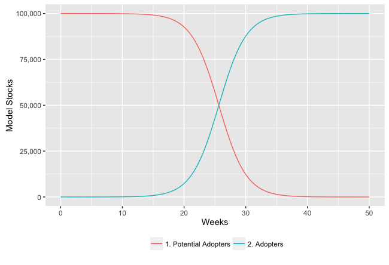

::: article
# Introduction

Diffusion is a fundamental process in physical, biological, social and
economic settings [@RS08]. In the business arena, consumer products
frequently go viral by the word of mouth effect between consumers. In
this scenario, products experience rapid sales growth, which eventually
slows as the number of potential adopters decline. A classic dynamic
model to capture these growth processes is the Bass model
[@bass1969new], which is based on the assumption that the timing of
purchases is related to the number of previous buyers. This model
provided good predictions of the sales peak, and the timing of the peak
when compared to historical data. Providing model-based estimates of
peak timing can assist with production capacity planning and sales
distribution strategies, for example, to ensure that enough product
items are available in time to match future demand. A representation of
the Bass model is shown in Figure [1](#figure:mdiff), and this captures
the scenario whereby newer technologies are not immediately adopted by
all potential buyers, and a diffusion process is set into motion
[@norton1987diffusion]. This version of the Bass model is informed by
standard epidemiological diffusion models[@vynnycky2010introduction],
and so the term *force of persuasion* is analogous to the
epidemiological term *force of infection.*

{#figure:mdiff
width="100%" alt="graphic without alt text"}

The modeling methodology used in this paper is system dynamics
[@sterman2000business; @duggan2016], a method for modeling social
systems, which focuses on how feedback structures (i.e. causal loops)
impact overall system behavior. Feedback is a defining element of system
dynamics [@lane2006], where a feedback loop is a chain of circular
causal links represented in a model. There are two types of feedback
which impact a variable: *negative feedback* which opposes the direction
of change in a loop variable (for example, a theromstat controller that
regulates heat in a room), whereas *positive feedback* amplifies a
variable's value, as in the case of the *contagion effect* in infectious
disease spread. At a technical level, system dynamics models are solved
using integration, where integrals are referred to as stocks, and
derivatives are modeled as flows. System dynamics diagrams are
intuitive, as they present a dynamic system in terms of the stocks
(containers), and flows (valves), which control the rate at which stocks
fill and drain over time.

# Bass diffusion model

The Bass diffusion model has two integrals: *Potential Adopters*
\@ref(eq:eq1), which model individuals in the population that have yet
to acquire a product, and *Adopters* \@ref(eq:eq2), which represent
people who have purchased a product, and are in a position to influence
others to initiate a purchase. For this paper, the initial values of
these stocks are $99,999$ and $1$ respectively, giving a total
population size of $100,000$. These initial values will also be
maintained across the metapopulation model, which provides a useful
basis for comparing the outputs of both models.

$$\label{eq1}
Potential Adopters = \int_{0}^{t} -AR\hspace{.2cm} dt   (\#eq:eq1)$$

$$\label{eq2}
Adopters= \int_{0}^{t} AR \hspace{.2cm}dt   (\#eq:eq2)$$

The flow equation $AR$ \@ref(eq:eq8) captures a number of concepts.
First, there is the idea of the effective per capita contact rate, known
by the parameter $\beta$ \@ref(eq:eq3), which is based on:

-   The contact rate \@ref(eq:eq4) between members of the population,
    which is an estimate of how often people interact.

-   The infectivity \@ref(eq:eq5) of these interactions, which is a way
    of modeling how likely it is for an individual to be convinced to
    purchase, based on an interaction with an adopter.

-   The total population \@ref(eq:eq6), which is the denominator of the
    equation.

$$\label{eq3}
\beta = \frac{Contact Rate \times Infectivity}{Population}   (\#eq:eq3)$$

$$\label{eq4}
Contact Rate=  3   (\#eq:eq4)$$

$$\label{eq5}
Infectivity =  0.15   (\#eq:eq5)$$

$$\label{eq6}
Population=100,000   (\#eq:eq6)$$

Given the value for $\beta$, it is then possible to calculate the force
of persuasion $\rho$, which defines the proportion of potential adopters
that will convert at each time period. This equation \@ref(eq:eq7) is
similar to the epidemiological term known as the *attack rate*, which
determines how many susceptible people become infected per time period
in classic infectious disease models [@anderson1992infectious].

$$\label{eq7}
\rho=\beta \times Adopters   (\#eq:eq7)$$

With the value for $\rho$ evaluated, the adoption rate is simply the
product of this value with the number of potential adopters in the
population, as shown in \@ref(eq:eq8).

$$\label{eq8}
AR= \rho \times Potential Adopters   (\#eq:eq8)$$

These equations have three properties that add to the robustness of the
model, These are:

-   if there are no contacts in the population, $\beta$ will equal 0,
    and no adoption will occur;

-   if infectivity is zero, $\beta$ will also equal 0, which will stop
    any adoption;

-   if there are no adopters, then the force of persuasion will be zero,
    and no adoptions will occur.

Equations \@ref(eq:eq1)-\@ref(eq:eq8) can be implemented using the
[*deSolve*](https://CRAN.R-project.org/package=deSolve) package
[@soetaert2010solving; @deSolvePK], which solves initial value problems
written as ordinary differential equations (ODE), differential algebraic
equations (DAE), and partial differential equations (PDE). For modeling
diffusion processes, the R package EpiDynamics [@epiD] was also
considered, however it does not currently provide functionality to solve
two-compartment SI models, which forms the basis of the Bass model. The
R package [*EpiModel*](https://CRAN.R-project.org/package=EpiModel)
[@epiModel] also contains an API that is flexible to formulate a number
deterministic compartmental models. For our scenario, the ODE solver in
*deSolve* is used, where the differential equations are encapsulated in
a function.

The initial segment of code[^1] loads the packages, sets the simulation
start time, finish time, and time step, and constructs the appropriate
time vector that is needed by *deSolve*. Following that, the two
integrals (stocks) are created, along with their initial values, and
auxiliary parameters initialised within a vector. In naming variables,
Hungarian Notation [@li2005effectively] is used, to distinguish between
stocks (s), flows (f) and exogenous parameters (a), known in system
dynamics as auxiliaries.

``` r
library(deSolve)

START   <- 0; FINISH <- 50; STEP <- 0.01;
simtime <- seq(START, FINISH, by=STEP)

stocks  <- c(sPotentialAdopters=99999,sAdopters=1)
auxs    <- c(aTotalPopulation=100000, aContact.Rate=3, aInfectivity=0.15)
```

Next the function containing the model equations is constructed. This is
called by the *deSolve* framework for every solution step of the ODE,
and the parameters passed in include:

-   The current simulation time,

-   A vector containing all integrals (stocks) and their values,

-   A vector containing the parameters used in the stock and flow model.

The R code for the function is shown below, and the corresponding model
equations are also referred to.

``` r
model <- function(time, stocks, auxs){
  with(as.list(c(stocks, auxs)),{ 
    aBeta   <- aContact.Rate * aInfectivity/ aTotalPopulation    # Eqn (3)
    aRho    <- aBeta * sAdopters                                 # Eqn (7)
    fAR     <- sPotentialAdopters * aRho                         # Eqn (8)
    dPA_dt  <- -fAR                                              # Eqn (1)
    dA_dt   <- fAR                                               # Eqn (2)

    return (list(c(dPA_dt, dA_dt),
                 AR=fAR, Rho=aRho))   
  })
}
```

To run the simulation, the function `ode()` is called with five
parameters, including the vector of stocks, the simulation time vector,
the callback model function, any exogenous parameters (none in this
case), and the numerical integration algorithm to use (Euler's method is
deployed, as this is commonly used as an integration method for social
systems [@sterman2000business]). The results from `ode()` are then
wrapped in a data frame, in order to make use of `ggplot()`.

``` r
o<-data.frame(ode(y=stocks, times=simtime, func = model, 
                  parms=auxs, method="euler"))
```

Figure [2](#figure:bass) shows the classic behavior of the Bass model,
as the dynamics of the adopter exhibit s-shaped growth as the customer
base saturates to its maximum possible value over time.

{#figure:bass
width="100%" alt="graphic without alt text"}

In summary, the aggregate model is useful to capture the overall
dynamics of the diffusion process. However, for spatial diffusion models
a revised equation structure is needed, and one such model based on the
dynamics of infectious disease transmission - is now described.

# Metapopulation diffusion model

Metapopulation structures are a powerful feature in dynamic modeling, as
they facilitate the investigation of finer-grained behaviours and
dynamics than can be achieved through an aggregate model. The
metapopulation concept is to subdivide the entire population into
distinct *subpopulations*, each with independent dynamics, and combine
this with limited interaction between each subpopulation
[@keeling2008modeling]. The approach is appropriate if there are
significant variations in model parameters across the population. For
example, in disease dynamics, empirical studies show non-random mixing
in populations, including data on the transmission of tuberculosis
[@borgdorff1999transmission], and contact patterns across Europe show
highly assortative mixing patterns with age [@mossong2008social]. A
similar argument can be made for product adoption models, and for this
scenario, a regional spatial structure is proposed as the main mechanism
for subdividing the model. Figure [3](#figure:spatial) shows a
hypothetical regional structure, where the population centers (colours
reflect population density) are in the middle of the region, and models
an unbalanced regional development which is a feature of many countries.

{#figure:spatial width="100%" alt="graphic without alt text"}

Out of an overall population of 100,000, the proportions in each region
are captured in Table [1](#table:tab_01).

::: {#table:tab_01}
  ------------------------------------------------------
   R1    R2   R3    R4   R5    R6   R7   R8    R9   R10
  ----- ---- ----- ---- ----- ---- ---- ----- ---- -----
   10%   1%   21%   8%   17%   4%   5%   25%   3%   6%

  ------------------------------------------------------

  : Table 1: Population proportions by region
:::

At a structural level, the diffusion model has 20 stocks, based on the
stock and flow structure in Figure [1](#figure:mdiff). The integral
equations \@ref(eq:eq1) and \@ref(eq:eq2) are replicated for each
region, and each region has its own adoption rate \@ref(eq:eq8). This
adoption rate is formulated as the product of each region's force of
persuasion and the number of adopters, as specified in \@ref(eq:eq9).

$$\label{eq9}
AR_i= \rho_i \times Potential Adopters_i   (\#eq:eq9)$$

The force of persuasion $\rho_i$ reflects the spatial properties of the
model, and is a weighted sum of the per capita effective contact rates
from region $j$ to region $i$, multiplied by the number of adopters
($A_j$) in region $j$ \@ref(eq:eq10). This structure is based on
standard epidemiological transmission equations between cohorts, where
the $j^{th}$ cohort is infectious (an adopter), and the $i^{th}$ cohort
is susceptible (a potential adopter).

$$\label{eq10}
\rho_i= \sum\limits_{j=1}^N \beta_{ij}.A_j   (\#eq:eq10)$$

Equation \@ref(eq:eq10) can also be conveniently expressed in matrix
form, as shown in \@ref(eq:eq11).

$$\label{eq11}
  \begin{pmatrix}
    \rho_1\\
    \rho_2\\
    \vdots \\
    \rho_N
  \end{pmatrix}=
  \begin{pmatrix}
    \beta_{11}&\beta_{12}&\dots&\beta_{1N}\\
    \beta_{21}&\beta_{22}&\dots&\beta_{2N}\\
    \vdots & \vdots &\ddots&\vdots           \\
    \beta_{N1}&\beta_{N2}&\dots&\beta_{NN}\\
  \end{pmatrix}
  \begin{pmatrix}
    A_1\\
    A_2\\
    \vdots\\
    A_N
  \end{pmatrix}   (\#eq:eq11)$$

The $\beta$ component, originally introduced in \@ref(eq:eq3), is the
effective contact rate per capita, and therefore the square matrix
component of \@ref(eq:eq11) can be further factored into \@ref(eq:eq12)
which shows the transmission calculations between each region. The
denominator is the same for each matrix row, and is the population of
each region containing the potential adopters.

$$\label{eq12}
  \beta_{ij} = e_{ij} / N_i   (\#eq:eq12)$$

The effective contact values ($e$) are based on the contact rates
between the different sectors. The contact rates are calculated from the
normal contact rate for a region ($n$), multiplied by a distancing
weighting measure using a power law function [@brockmann2006scaling],
useful for individual-based models [@mungovan2011influence; @liu2012co],
given that these structures have also been successfully implemented in
models of infectious disease [@meyer2014power]. This equation is shown
in \@ref(eq:eq13), and the distance is the Euclidean distance function
that uses the grid coordinates as a reference \@ref(eq:eq14), given the
points ($x_1$,$y_1$) and ($x_2$,$y_2$ ).

$$\label{eq13}
c_{ij} = n_j \cdot (d_{ij} + 1)^{-\alpha}   (\#eq:eq13)$$

$$\label{eq14}
d_{ij}= \sqrt{(x_2-x_1)^2+(y_2-y_1)^2}   (\#eq:eq14)$$

To provide flexibility for experimentation, the parameter $\alpha$
\@ref(eq:eq15) provides scope to moderate the contact rates between the
different regions. With $\alpha$ =0, the contact rates do not change
from the original region to other regions, whereas higher values will
cause contact rates to decrease as the distance between regions
increases.

$$\label{eq15}
 \alpha \geq 0   (\#eq:eq15)$$

The effective contact rates ($e$), which model the word of mouth effect
from region to region is shown in \@ref(eq:eq16), which is the product
of the contact rates ($c$) and infectivity ($f$), which models the
probability of transmission. This equation provides the necessary
information to process the matrix specified in \@ref(eq:eq11).

$$\label{eq16}
e_{ij} = c_{ij} . f_j   (\#eq:eq16)$$

Tables [2](#table:tab_02)-[5](#table:tab_05) show sample parameter
values for the model. In Table [2](#table:tab_02), sample normal contact
rates per area are shown, with R5 and R8 having the highest values,
given that these have the highest population proportions.
Table [3](#table:tab_03) summarises arbitrary infectivity values, which
do not vary significantly from region to region, as an individual's
ability to persuade others is not assumed to be dependent on the overall
population density. Table [4](#table:tab_04) shows the distance values
calculated between each region, where the coordinates are based on the
row/column location of a region, shown earlier in
Figure [3](#figure:spatial). Table [5](#table:tab_05) then shows the
final contact rates, using \@ref(eq:eq13), with $\alpha=1.0$, which
shows that the contact rate falls as the distance between regions
increases, according to the power law function.

::: {#table:tab_02}
  ------------------------------------------------------------------------
    R1     R2     R3      R4     R5      R6     R7     R8      R9    R10
  ------ ------ ------- ------ ------- ------ ------ ------- ------ ------
   4.58   0.56   10.12   4.61   10.00   1.64   2.53   14.46   1.53   2.95

  ------------------------------------------------------------------------

  : Table 2: Sample normal contact rates ($n$) per area, weighted by
  population density
:::

::: {#table:tab_03}
  ---------------------------------------------------------------------
    R1     R2     R3     R4     R5     R6     R7     R8     R9    R10
  ------ ------ ------ ------ ------ ------ ------ ------ ------ ------
   0.05   0.03   0.04   0.03   0.01   0.05   0.02   0.01   0.02   0.05

  ---------------------------------------------------------------------

  : Table 3: Sample infectivity probabilities ($f$), by region (uniform
  random numbers)
:::

::: {#table:tab_04}
  ---------------------------------------------------------------------------
          R1     R2     R3     R4     R5     R6     R7     R8     R9    R10
  ----- ------ ------ ------ ------ ------ ------ ------ ------ ------ ------
   R1    0.00   1.00   2.00   3.00   4.00   1.00   1.41   2.24   3.16   4.12

   R2    1.00   0.00   1.00   2.00   3.00   1.41   1.00   1.41   2.24   3.16

   R3    2.00   1.00   0.00   1.00   2.00   2.24   1.41   1.00   1.41   2.24

   R4    3.00   2.00   1.00   0.00   1.00   3.16   2.24   1.41   1.00   1.41

   R5    4.00   3.00   2.00   1.00   0.00   4.12   3.16   2.24   1.41   1.00

   R6    1.00   1.41   2.24   3.16   4.12   0.00   1.00   2.00   3.00   4.00

   R7    1.41   1.00   1.41   2.24   3.16   1.00   0.00   1.00   2.00   3.00

   R8    2.24   1.41   1.00   1.41   2.24   2.00   1.00   0.00   1.00   2.00

   R9    3.16   2.24   1.41   1.00   1.41   3.00   2.00   1.00   0.00   1.00

   R10   4.12   3.16   2.24   1.41   1.00   4.00   3.00   2.00   1.00   0.00
  ---------------------------------------------------------------------------

  : Table 4: Regional distance matrix based on Euclidean distance
:::

::: {#table:tab_05}
  ------------------------------------------------------------------------------
          R1     R2     R3      R4     R5      R6     R7     R8      R9    R10
  ----- ------ ------ ------- ------ ------- ------ ------ ------- ------ ------
   R1    4.58   0.28   3.37    1.15   2.00    0.82   1.05   4.47    0.37   0.58

   R2    2.29   0.56   5.06    1.54   2.50    0.68   1.26   5.99    0.47   0.71

   R3    1.53   0.28   10.12   2.31   3.33    0.51   1.05   7.23    0.63   0.91

   R4    1.14   0.19   5.06    4.61   5.00    0.39   0.78   5.99    0.77   1.22

   R5    0.92   0.14   3.37    2.31   10.00   0.32   0.61   4.47    0.63   1.47

   R6    2.29   0.23   3.13    1.11   1.95    1.64   1.26   4.82    0.38   0.59

   R7    1.90   0.28   4.19    1.43   2.40    0.82   2.53   7.23    0.51   0.74

   R8    1.41   0.23   5.06    1.91   3.09    0.55   1.26   14.46   0.77   0.98

   R9    1.10   0.17   4.19    2.31   4.14    0.41   0.84   7.23    1.53   1.47

   R10   0.89   0.13   3.13    1.91   5.00    0.33   0.63   4.82    0.77   2.95
  ------------------------------------------------------------------------------

  : Table 5: Final contact rates ($c$) from region to region, with
  $\alpha$ = 1.00
:::

# The metapopulation Bass diffusion model in R

The R implementation for the metapopulation Bass model is now presented.
First, the relevant libraries are attached, and these include utilities
to support plotting
([*ggplot2*](https://CRAN.R-project.org/package=ggplot2) and
[*scales*](https://CRAN.R-project.org/package=scales)), preparation of
data (reshape2 and dplyr), and for performing numerical integration
(*deSolve*).

``` r
library(deSolve)
library(ggplot2)
library(scales)
library(reshape2)
library(dplyr)
```

Initially, a data frame is used to specify the model topology, although
spatial data stored in GIS files could also be used as part of the
implementation [@Bivand2013 pp. 1--16].

``` r

TotalPopulation<-100000
name.reg<-c("R1","R2","R3","R4","R5",
            "R6","R7","R8","R9","R10")
row.reg<-c(1,1,1,1,1,2,2,2,2,2)
col.reg<-c(1,2,3,4,5,1,2,3,4,5)
pop.reg<-c(0.10,0.01,0.21,0.08,0.17,
           0.04,0.05,0.25,0.03,0.06)
           
sp<-data.frame(Regions=name.reg,
               Row=row.reg,
               Col=col.reg,
               Pop=pop.reg*TotalPopulation)
               
```

Before running the simulation, the $NxN$ matrix from equation
\@ref(eq:eq11) needs be be calculated, based on equations
\@ref(eq:eq12), \@ref(eq:eq13), \@ref(eq:eq14), \@ref(eq:eq15) and
\@ref(eq:eq16). The normal contact rate is drawn from a random uniform
distribution based on the population proportion in each sector, where
areas of higher density will have great interaction rates. The values
for infectivity (a measure of the persuasiveness of an adopter) are also
drawn from a uniform distribution, and the distance matrix is developed
by calling the R function $dist()$. The value for $\alpha$ is
arbitrarily chosen at 1.00.

``` r
normal.contacts<-runif(10,pop.reg*40,pop.reg*60)
infectivity<-runif(10,0.01,0.025)
names(infectivity)<-c("R1","R2","R3","R4","R5","R6","R7","R8","R9","R10")
ALPHA<-1.00
dm <- as.matrix(dist(sp[c("Col","Row")]))
```

In order to create the $\beta$ matrix, a modified contact rate is
calculated based on equation \@ref(eq:eq16), and this is then
transformed to an effective contact matrix by multiplying by the
infectivity vector. The $\beta$ matrix is then evaluated by simply
dividing the effective contacts by the population of each sector, as
specified earlier in equation \@ref(eq:eq12).

``` r

cr <- t(normal.contacts*(dm+1)^-ALPHA)
ec <- t(t(cr)*infectivity)

beta <- ec/sp$Pop
```

With the contact information defined, the simulation model logic can
then be implemented as part of the *deSolve* package. The key advantage
here is that *deSolve* supports vectorization, and therefore the
simulation model is scalable, as it uses matrix algebra to implement
\@ref(eq:eq11). Before defining the callback model function, the
important simulation parameters are specified, including the start time,
finish time, integration time step, the number of regions and the number
of integrals (stocks) per region. The simulation time vector is defined,
as well as a vector of integrals (20 in all), along with their initial
values. For the initial conditions, the initial *customer zero* adopter
is seeded in region eight (an arbitrary choice).

``` r
START<-0; FINISH<-50; STEP<-0.01;
NUM_REGIONS<-10; NUM_STOCKS_PER_REGION <-2

simtime <- seq(START, FINISH, by=STEP)

stocks <- c(PA_R1=sp$Pop[1],   PA_R2=sp$Pop[2],   PA_R3=sp$Pop[3],   
            PA_R4=sp$Pop[4],   PA_R5=sp$Pop[5],   PA_R6=sp$Pop[6], 
            PA_R7=sp$Pop[7],   PA_R8=sp$Pop[8]-1, PA_R9=sp$Pop[9], 
            PA_R10=sp$Pop[10], AD_R1=0,           AD_R2=0,         
            AD_R3=0,           AD_R4=0,           AD_R5=0, 
            AD_R6=0,           AD_R7=0,           AD_R8=1,           
            AD_R9=0,           AD_R10=0
```

In the model function, the stocks vector is converted into a $10 x 2$
matrix, where all the **potential adopter** stocks are in the first
column, and the **adopter** stocks reside in the second column. Matrix
algebra is used to calculate the force of persuasion \@ref(eq:eq12), and
from this the adoption rates for each sector are calculated
\@ref(eq:eq9), followed by the derivatives. Additional information such
as the individual adoption rates, the total population, the total
potential adopters and the total adopters are also returned from the
function. A powerful feature of this function is that it is eminently
scalable, and would work (assuming availability of sufficient computer
memory) on much larger matrices and models.

``` r
model <- function(time, stocks, auxs){
  with(as.list(stocks),{ 
    states<-matrix(stocks,
                   nrow=NUM_REGIONS,
                   ncol=NUM_STOCKS_PER_REGION)
    
    PotentialAdopters <- states[,1]                  
    Adopters          <- states[,2]
    
    Rho               <- beta %*% Adopters           # Eqn (11)
    AR                <- Rho * PotentialAdopters     # Eqn (9)
    
    dPA_dt            <- -AR                         # Based on Eqn(1)
    dAD_dt            <- AR                          # Based on Eqn(2)
    
    TotalPopulation        <- sum(stocks)
    TotalPotentialAdopters <- sum(PotentialAdopters)
    TotalAdopters          <- sum(Adopters)
    
    return (list(c(dPA_dt, dAD_dt),AR_R=AR,
                 TP=TotalPopulation,
                 TPA=TotalPotentialAdopters,
                 TAD=TotalAdopters))  
  })
}
```

Once the model function has been specified, the *deSolve* package is
called via the `ode()` function call, as descibed earlier. To prepare
the data for visualization, it is filtered to focus on only the
simulation data from discrete time steps (0, 1, 2, \..., 50), and this
is melted into a three column data frame. The `grepl()` function is
inside the `filter()` function to extract variables, and these are
printed using the function `ggplot()`.

``` r
o<-data.frame(ode(y=stocks, times=simtime, func = model, 
                  parms=NULL, method="euler"))
                  
o1<-o[seq(from=1, to=length(simtime),by=1/STEP),]

tidy<-melt(o1,id.vars = "time")
names(tidy)<-c("Time","Variable","Value")

ar<-filter(tidy,grepl("AR_",Variable))
ad<-filter(tidy,grepl("AD_",Variable))

p1<-ggplot(ar,aes(x=Time,y=Value,color=Variable)) + 
           geom_line() + geom_point()+
           ylab("Adoption Rate") + xlab("Time (Weeks)")
           
p2<-ggplot(ad,aes(x=Time,y=Value,color=Variable,group=Variable)) + 
  geom_line() +
  geom_point()+
  ylab("Adopters") +
  xlab("Time (Weeks)")
```

The simulation output is displayed in Figures [4](#figure:AR) and
[5](#figure:AD). The first of these figures shows the adoption rate
($AR$) values, which follow the classic bell-shaped contagion-like
curve, as word of mouth spreads through the population with a
correponding increase in the \"attack rate\" or force of persuasion. As
the number of potential adopters decline, so to does the adoption rate.
The differences in peak times, although relatively small, are still
clear on the diagram, which demonstrates the value of being able to
model across spatial regions, and observe how the \"epidemic\", which is
captured in the model equations, spreads across the different regions.
The second plot captures the market saturation for each region, as
potential adopters convert to adopters via the word of mouth diffusion
process.

{#figure:AR width="100%" alt="graphic without alt text"}

{#figure:AD width="100%" alt="graphic without alt text"}

While the model is based on hypothetical data, including the regional
structure, the contact rates and infectivity, its underlying structure
is robust and can be adapted for many spatial interaction processes. The
simulation engine of the model is concise and can be used across a
number of contexts, and real-world data can be conveniently used within
the model, once it is prepared and respresented in matrix format.

# Discussion

This paper shows how R can be used to model metapopulation integral
models of product diffusion. For this class of problems, there are a
number of advantages in considering R as a solution:

-   R provides matrix support, and matrix equations such as the force of
    persuasion can be easily implemented.

-   The package *deSolve* fully supports vectorisation, which means that
    the equation writing process is simplified, and the equation
    structures developed are scalable without having to alter the
    underlying model structure.

-   R also provides excellent statistical analysis support, and model
    analysis techniques such as statistical screening
    [@ford2005statistical] can be conveniently scripted using R
    @duggan2016 [chapter 7].

Further extensions to the work would be to apply optimization techniques
in order to fit product diffusion models to product sales data across
regions, and therefore obtain more realistic simulations of the peak
time [@vynnycky2008analyses]. These model extensions could also
accomodate age cohort dynamics for market-based models, for example,
those captured in epidemiological models such as influenza transmission
[@keeling2008modeling; @vynnycky2010introduction].
:::

[^1]: See supplemental material included with the paper
