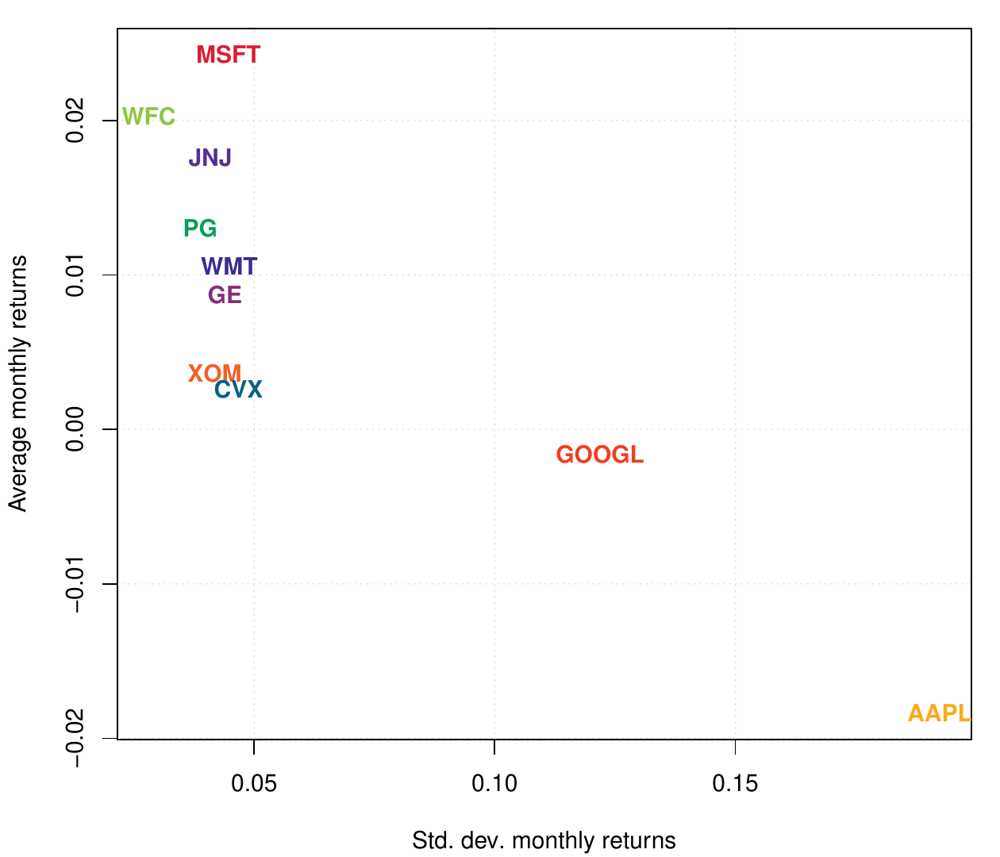
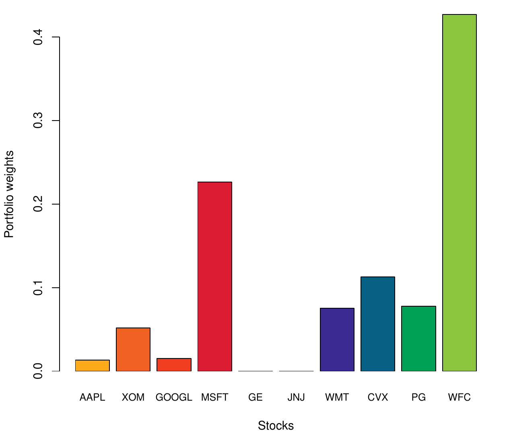
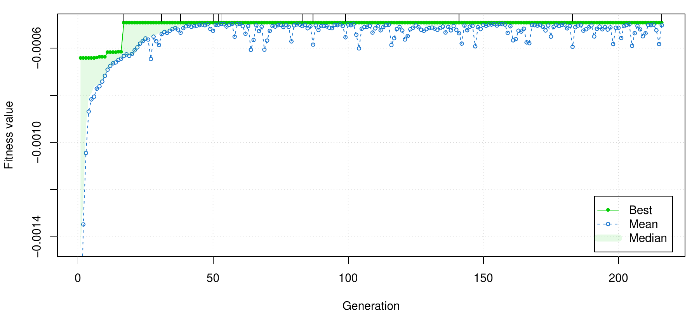
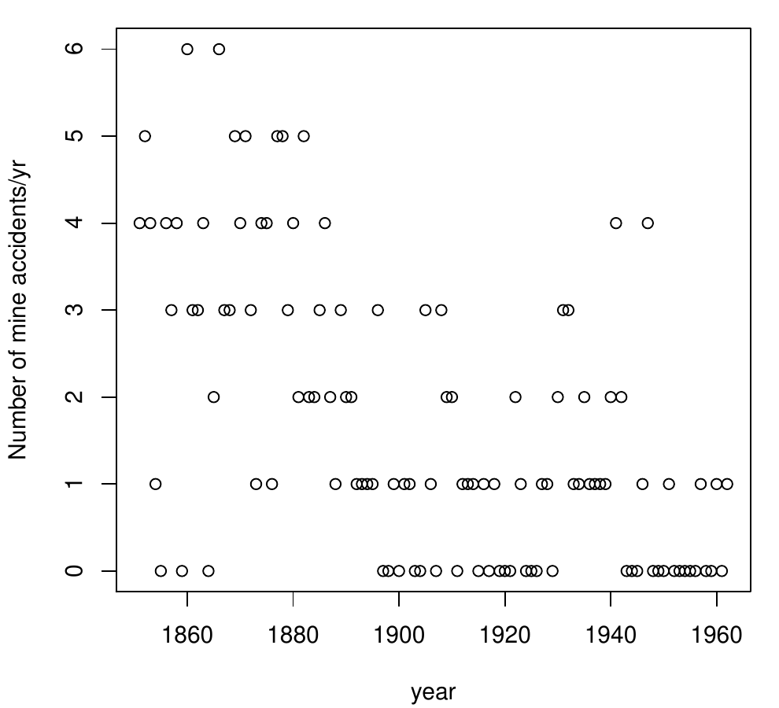
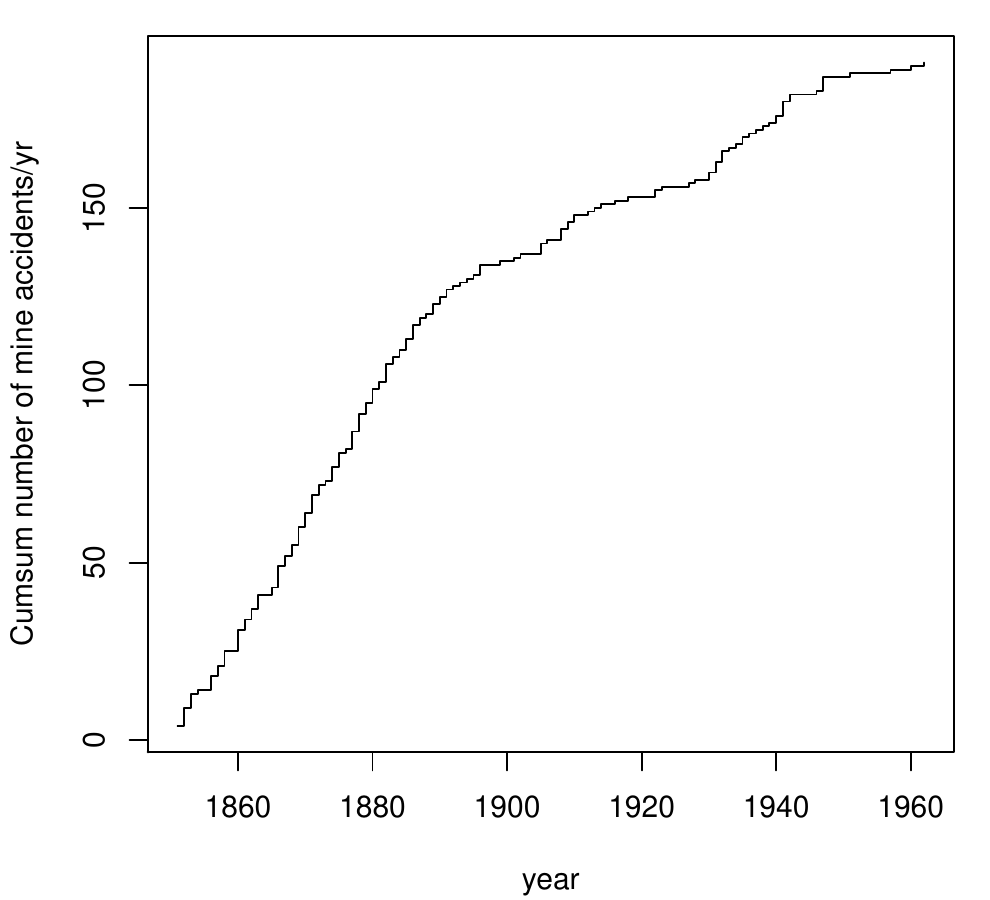
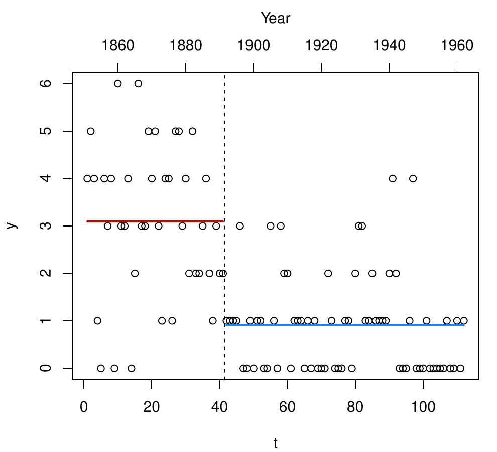
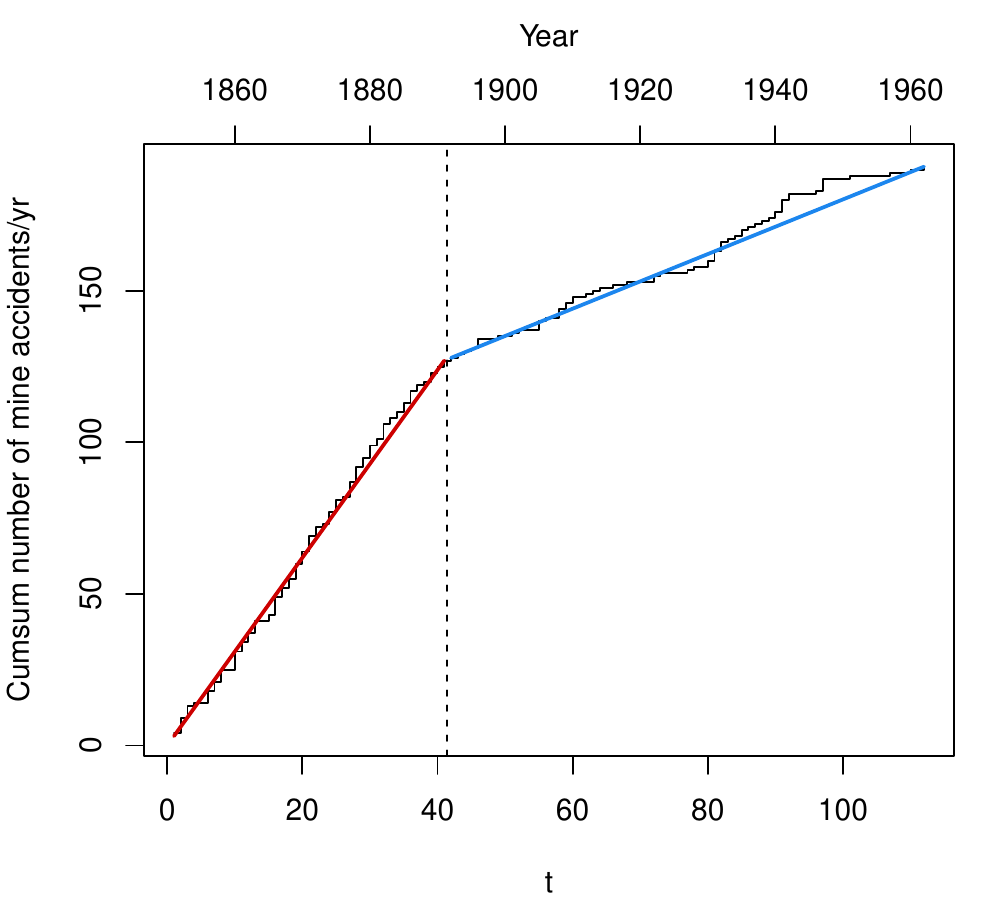
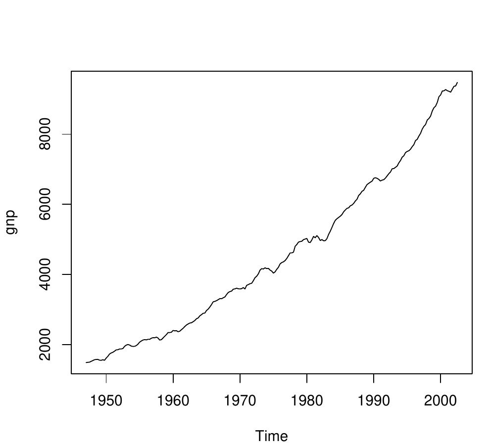
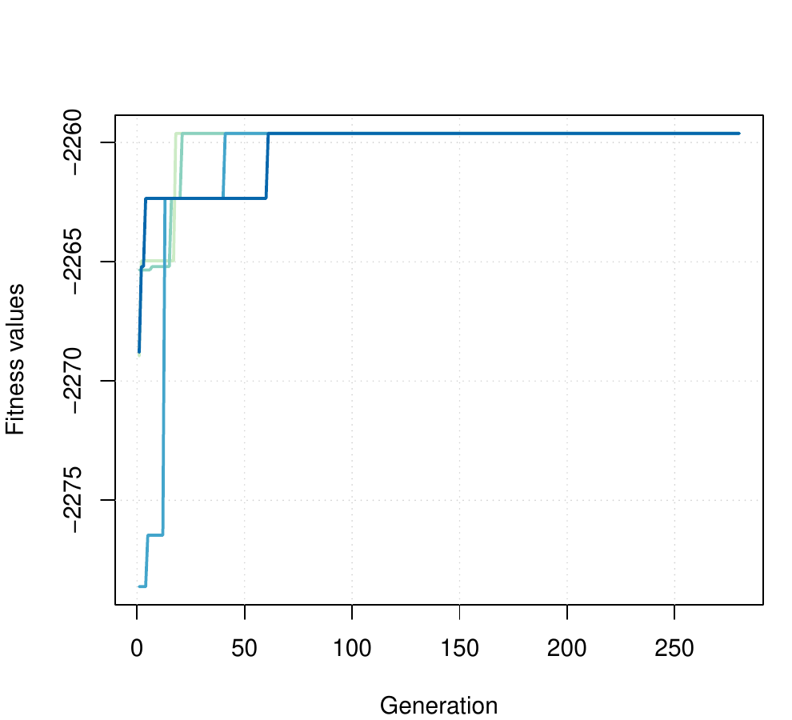

::: article
# Introduction

Optimisation problems of both practical and theoretical importance deal
with the search of an optimal configuration for a set of variables to
achieve some specified goals. Potential solutions may be encoded with
real-valued, discrete, binary or permutation decision variables
depending on the problem to be solved. Direct search or derivative-free
methods, gradient-based and Newton-type methods, all encompass
traditional local optimisation algorithms for real-valued functions
([@Chong:Zak:2013]; [@Givens:Hoeting:2013 Chap. 2]). In contrast,
discrete and combinatorial optimisation problems involve decision
variables expressed using integers or binary values and consist in
searching for the best solution from a set of discrete elements
([@Papadimitriou:Steiglitz:1998]; [@Givens:Hoeting:2013 Chap. 3]).

A large number of heuristics and metaheuristics algorithms have been
proposed for solving complex optimisation tasks. Specific (ad-hoc)
heuristic techniques are able to identify solutions in a reasonably
short amount of time, but the solutions obtained are generally not
guaranteed to be optimal or accurate. On the contrary, metaheuristics
offer a tradeoff between exact and heuristics methods, in the sense that
they are generic techniques that offer good solutions, often the global
optimum value sought, in a moderate execution time by efficiently and
effectively exploring the search space [@Luke:2013]. This class of
algorithms typically implements some form of stochastic optimisation and
includes: Evolutionary Algorithm [EA;
@Back:Fogel:Michalewicz:2000:vol1; @Back:Fogel:Michalewicz:2000:vol2],
Iterated Local Search [ILS; @Lourenco:Stutzle:2003], Simulated Annealing
[SA; @Kirkpatrick:Gelatt:Vecchi:1983], Differential Evolution [DE;
@Storn:Price:1997], Particle Swarm Optimisation [PSO;
@Kennedy:Eberhart:1995], Tabu Search [TS; @Glover:Laguna:2013], Ant
Colony Optimisation [ACO; @Dorigo:Stutzle:2004], and Covariance Matrix
Adaptation Evolution Strategy [CMA-ES; @Hansen:2006].

EAs are stochastic iterative algorithms in which a population of
individuals evolve by emulating natural selection
[@Eiben:Smith:2003; @DeJong:2006; @Simon:2013]. Each individual of the
population represents a tentative solution to the problem. The quality
of the proposed solution is expressed by the value of a fitness function
assigned to each individual. This value is then used by EAs to guide the
search and improve the fitness of the population. Compared to other
metaheuristics algorithms, EAs are able to balance between exploration
of new areas of the search space and exploitation of good solutions. The
trade-off between exploration and exploitation is controlled by some
tuning parameters, such as the population size, the genetics operators
(i.e. selection, crossover, and mutation), and the probability of
applying them. Genetic Algorithms (GAs) are search and optimisation
procedures that are motivated by the principles of natural genetics and
natural selection. GAs are the \"earliest, most well-known, and most
widely-used EAs\" [@Simon:2013 p. 35].

R offers several tools for solving optimisation problems. A
comprehensive listing of available packages is contained in the CRAN
task view on
"[*Optimization*](https://CRAN.R-project.org/view=Optimization) and
Mathematical Programming" [@CRANTaskView:Optimization]. An extensive
treatment of optimisation techniques applied to problems that arise in
statistics and how to solve them using R is provided by @Nash:2014. A
gentle introduction to metaheuristics optimisation methods in R is
contained in @Cortez:2014. Some R packages implementing evolutionary
optimisation algorithms are:
[*rgenoud*](https://CRAN.R-project.org/package=rgenoud),
[*Rmalschains*](https://CRAN.R-project.org/package=Rmalschains),
[*DEoptim*](https://CRAN.R-project.org/package=DEoptim),
[*GenSA*](https://CRAN.R-project.org/package=GenSA),
[*pso*](https://CRAN.R-project.org/package=pso),
[*cmaes*](https://CRAN.R-project.org/package=cmaes),
[*tabuSearch*](https://CRAN.R-project.org/package=tabuSearch).

The R package [*GA*](https://CRAN.R-project.org/package=GA) is a
flexible general-purpose set of tools for optimisation using genetic
algorithms and it is fully described in @Scrucca:2013. Real-valued,
integer, binary and permutation GAs are implemented, whether constrained
or not. Discrete or combinatorial optimisation problems, where the
search space is made of a finite or countably infinite set of potential
solutions, can be easily treated by adopting a binary or permutation
representation. Several genetic operators for selection, crossover, and
mutation are available, and more can be defined by experienced R users.

This paper describes some recent additions to the *GA* package. The
first improvement involves the option to use hybrid GAs. Although for
many objective functions GAs are able to work in an efficient way and
find the area of the global optimum, they are not especially fast at
finding the optimum when in a locally quadratic region. Hybrid GAs
combine the power of GAs with the speed of a local optimiser, allowing
researchers to find a global solution more efficiently than with the
conventional evolutionary algorithms. Because GAs can be easily and
conveniently executed in parallel machines, the second area of
improvement is that associated with parallel computing. Two approaches,
the master-slave and islands models, have been implemented and are fully
described. Several examples, using both real-world data examples and
benchmark functions, are presented and discussed.

# GA package

In the following we assume that the reader has already installed the
latest version ($\ge 3.0$) of the package from CRAN with

``` r
> install.packages("GA")
```

and the package is loaded into an R session using the usual command

``` r
> library(GA)
```

# Hybrid genetic algorithms {#sec:hga}

EAs are very good at identifying near-optimal regions of the search
space (*exploration*), but they can take a relatively long time to
locate the exact local optimum in the region of interest
(*exploitation*). Traditionally, exploitation is done through selection,
whilst exploration is performed by search operators, such as mutation
and crossover [@Eiben:Schippers:1998]. However, exploitation can also be
pursued by controlling crossover and mutation, e.g. by reducing the
mutation probability as the search progresses. Balancing between
exploration and exploitation is vital for successful application of EAs
[@Crepinsek:etal:2013].

A further possibility for improving exploitation is to try to
incorporate efficient local search algorithms into EAs. There are
different ways in which local searches or problem-specific information
can be integrated in EAs [see @Eiben:Smith:2003 Chap. 10]. For instance,
a local search may be started from the best solution found by a GA after
a certain number of iterations, so that, once a promising region is
identified, the convergence to the global optimum can be sped up. These
evolutionary methods have been named in various ways, such as *hybrid
GAs*, *memetic GAs*, and *genetic local search algorithms*. Some have
argued that the inclusion of a local search in GAs implies the use of a
form of Lamarckian evolution. This fact has been criticised from a
biological point of view, but \"despite the theoretical objections,
hybrid genetic algorithms typically do well at optimization tasks"
[@Whitley:1994 p. 82].

In case of real-valued optimisation problems, the *GA* package provides
a simple to use implementation of hybrid GAs by setting the argument
`optim = TRUE` in a `ga()` function call. This allows to perform local
searches using the base R function `optim()`, which makes available
general-purpose optimisation methods, such as Nelder--Mead, quasi-Newton
with and without box constraints, and conjugate-gradient algorithms.

Having set `optim = TRUE`, the local search method to be used and other
parameters can be controlled with the optional argument `optimArgs`.
This must be a list with the following structure and defaults:

``` r
optimArgs = list(method = "L-BFGS-B", 
                 poptim = 0.05,
                 pressel = 0.5,
                 control = list(fnscale = -1, maxit = 100))
```

where

  ----------- ------------------------------------------------------------------------------------------------------------------------------------------------------------------------------------------------------------------------------------------------------------------------------------
  `method`    The method to be used among those available in `optim` function. By default, the BFGS algorithm with box constraints is used, where the bounds are those provided in the `ga()` function call. Further methods are available as described in the Details section in `help(optim)`.

  `poptim`    A value in the range $(0,1)$ which gives the the probability of applying the local search at each iteration.

  `pressel`   A value in the range $(0,1)$ which specifies the pressure selection.

  `control`   A list of parameters for fine tuning the `optim` algorithm. See `help(optim)` for details.
  ----------- ------------------------------------------------------------------------------------------------------------------------------------------------------------------------------------------------------------------------------------------------------------------------------------

  : 

In the implementation available in *GA*, the local search is applied
stochastically during the GA iterations with probability `poptim`
$\in [0,1]$; by default, once every $1/0.05 = 20$ iterations on average.
The local search algorithm is started from a random selected solution
drawn with probability proportional to fitness and with the selection
process controlled by the parameter `pressel` $\in [0,1]$. Let $f_i$ be
the fitness value associated with the $i$th solution for $i=1,\ldots,n$,
where $n$ is the `popSize`, and let $r_i$ be the corresponding rank in
non increasing order. Then, for a given `pressel` the probability of
selection is computed as
$p_i = \mathtt{pressel} \times (1 - \mathtt{pressel})^{r_i - 1}$, and
then normalised as $p_i = p_i/\sum_{i=1}^n p_i$.
Figure [1](#fig1:HGA_pressel) shows the probability of selection as a
function of the fitness value for different levels of selection
pressure. The values on the $y$-axis are computed using the function
`optimProbsel()`, which is used in the *GA* package for computing the
probability of selection for each individual of the genetic population.
When the pressure is set at 0, the same probability of selection is
assigned to all solutions. Larger probabilities are assigned to larger
$f_i$ values as the pressure value increases. In the extreme case of
pressure selection equal to 1, only the largest $f_i$ receives a
probability of selection equal to 1, whereas the others have no chance
of being selected. Thus, smaller values of `pressel` tend to assign
equal probabilities to all the solutions, and larger values tend to
assign larger values to those solutions having better fitness.

{#fig1:HGA_pressel width="100%" alt="graphic without alt text"}

Note that when a `ga()` function call is issued with `optim = TRUE`, a
local search is always applied at the end of GA evolution, i.e. after
the last iteration and even in case of `poptim = 0`, but starting from
the solution with the highest fitness value. The rationale for this is
to allow for local optimisation as a final improvement step.

## Portfolio selection

In portfolio selection the goal is to find the optimal portfolio, i.e.
the portfolio that provides the highest return and lowest risk. This is
achieved by choosing the optimal set of proportions of various financial
assets [@Ruppert:Matteson:2015 Chap. 16]. In this section an example of
mean--variance efficient portfolio selection [@Gilli:etal:2011 Chap. 13]
is illustrated.

Suppose we have selected 10 stocks from which to build a portfolio. We
want to determine how much of each stock to include in our portfolio.
The *expected return rate* of our portfolio is
$$E(R) = \sum_{i=1}^{10} w_i E(R_i),$$
where $E(R_i)$ is the expected return rate on asset $i$, and $w_i$ is
the fraction of the portfolio value due to asset $i$. Note that the
portfolio weights $w_i$ must satisfy the constraints $w_i \ge 0$, and
$\sum_{i=1}^{10} w_i = 1$. At the same time, we want to minimise the
*variance of portfolio returns* given by
$$\sigma^2_p = w' \Sigma w,$$
where $\Sigma$ is the covariance matrix of stocks returns, and
$w' = (w_1, \ldots, w_{10})$, under the constraint that the portfolio
must have a minimum expected return of 1%, i.e $E(R) \ge 0.01$. Provided
that only linear constraints are included, the problem of mean-variance
portfolio selection is typically solved by quadratic programming.
However, GAs provide a general approach to portfolio selection that can
be used for problems with both linear and nonlinear constraints
[@Gilli:Schumann:2012].

Consider the following stocks with monthly return rates obtained by
Yahoo finance using the
[*quantmod*](https://CRAN.R-project.org/package=quantmod) package:

``` r
> library(quantmod)
> myStocks <- c("AAPL", "XOM", "GOOGL", "MSFT", "GE", "JNJ", "WMT", "CVX", "PG", "WFC")
> getSymbols(myStocks, src = "yahoo")
> returns <- lapply(myStocks, function(s) 
                              monthlyReturn(eval(parse(text = s)),
                                            subset = "2013::2014"))
> returns <- do.call(cbind,returns)
> colnames(returns) <- myStocks
```

The monthly return rates for the portfolio stocks are shown in
Figure [2](#fig1:portfolio) and obtained with the code:

``` r
> library(timeSeries)
> plot(as.timeSeries(returns), at = "chic", minor.ticks="month", 
       mar.multi = c(0.2, 5.1, 0.2, 1.1), oma.multi = c(4, 0, 4, 0),
       col = .colorwheelPalette(10), cex.lab = 0.8, cex.axis = 0.8)
> title("Portfolio Returns")
```

{#fig1:portfolio width="100%" alt="graphic without alt text"}

Summary statistics for the portfolio stocks are computed as:

``` r
> nStocks <- ncol(returns) # number of portfolio assets
> R <- colMeans(returns)   # average monthly returns
> S <- cov(returns)        # covariance matrix of monthly returns
> s <- sqrt(diag(S))       # volatility of monthly returns
> plot(s, R, type = "n", panel.first = grid(),
       xlab = "Std. dev. monthly returns", ylab = "Average monthly returns")
> text(s, R, names(R), col = .colorwheelPalette(10), font = 2)
```

The last two commands draw a graph of the average vs standard deviation
for the monthly returns (see Figure [3](#fig2-4:portfolio)a). From this
graph we can see that there exists a high degree of heterogenity among
stocks, with AAPL having the largest standard deviation and negative
average return, whereas some stocks have small volatility and high
returns, such as WFC and MSFT. Clearly, the latter are good candidate
for inclusion in the portfolio. The exact amount of each stock also
depends on the correlation among stocks through the variance of
portfolio returns $\sigma^2_p$, and so we need to formalise our
objective function under the given constraints.

<figure id="fig2-4:portfolio">
<table>
<caption> </caption>
<tbody>
<tr class="odd">
<td style="text-align: center;"></td>
<td style="text-align: center;"></td>
</tr>
<tr class="even">
<td style="text-align: center;">(a)</td>
<td style="text-align: center;">(b)</td>
</tr>
</tbody>
</table>
<table>
<caption> </caption>
<tbody>
<tr class="odd">
<td style="text-align: center;"></td>
</tr>
<tr class="even">
<td style="text-align: center;">(c)</td>
</tr>
</tbody>
</table>
<figcaption>Figure 3: (a) Plot of average monthly returns vs the
standard deviation for the selected stocks. (b) Portfolio stocks
composition estimated by HGA. (c) Trace of HGA iterations.</figcaption>
</figure>

In order to compute the GA fitness function, we define the following
functions:

``` r
> weights <- function(w)      # normalised weights
  { drop(w/sum(w)) }
> ExpReturn <- function(w)    # expected return
  { sum(weights(w)*R) }
> VarPortfolio <- function(w) # objective function
  { 
    w <- weights(w)
    drop(w %*% S %*% w) 
  }
```

We may define the fitness function to be maximised as the (negative)
variance of the portfolio penalised by an amount which is function of
the distance between the expected return of the portfolio and the target
value:

``` r
> fitness <- function(w)      # fitness function
  {
    ER <- ExpReturn(w)-0.01
    penalty <- if(ER < 0) 100*ER^2 else 0
    -(VarPortfolio(w) + penalty)
  }
```

A hybrid GA with local search can be obtained with the following call:

``` r
> GA <- ga(type = "real-valued", fitness = fitness, 
           min = rep(0, nStocks), max = rep(1, nStocks), names = myStocks, 
           maxiter = 1000, run = 200, optim = TRUE)
> summary(GA)
+-----------------------------------+
|         Genetic Algorithm         |
+-----------------------------------+

GA settings: 
Type                  =  real-valued 
Population size       =  50 
Number of generations =  1000 
Elitism               =  2 
Crossover probability =  0.8 
Mutation probability  =  0.1 
Search domain = 
    AAPL XOM GOOGL MSFT GE JNJ WMT CVX PG WFC
Min    0   0     0    0  0   0   0   0  0   0
Max    1   1     1    1  1   1   1   1  1   1

GA results: 
Iterations             = 216 
Fitness function value = -0.00049345 
Solution = 
         AAPL     XOM    GOOGL    MSFT GE JNJ     WMT     CVX      PG     WFC
[1,] 0.030918 0.11534 0.034683 0.52062  0   0 0.17201 0.26144 0.18096 0.98719
> plot(GA)
```

The last command produces the graph on Figure [3](#fig2-4:portfolio)c,
which shows the trace of best, mean, and median values during the HGA
iterations. We also added some vertical dashes at the top of the graph
to indicate when the local search occurred. It is interesting to note
that the inclusion of a local search greatly speeds up the termination
of the GA search, which converges after 216 iterations. Without
including the local optimisation step, a fitness function value within a
1% from the maximum value found above is attained after $1,633$
iterations, whereas the same maximum fitness value cannot be achieved
even after $100,000$ iterations.

The estimated portfolio weights and the corresponding expected return
and variance are computed as:

``` r
> (w <- weights(GA@solution))
    AAPL      XOM    GOOGL     MSFT       GE      JNJ      WMT      CVX 
0.013424 0.050081 0.015059 0.226047 0.000000 0.000000 0.074685 0.113512 
      PG      WFC 
0.078572 0.428621 
> ExpReturn(w)
[1] 0.016178
> VarPortfolio(w)
[1] 0.00049345
> barplot(w, xlab = "Stocks", ylab = "Portfolio weights", 
          cex.names = 0.7, col = .colorwheelPalette(10))
```

The last command draws a barchart of the optimal portfolio selected, and
it is shown in Figure [3](#fig2-4:portfolio)b.

## Poisson change-point model

In the study of stochastic processes a common problem is to determine
whether or not the functioning of a process has been modified over time.
Change-point models assume that such a change is occurring at some point
in time in a relatively abrupt manner [@Lindsey:2004].

In a single change-point model the distribution of a response variable
$Y_t$ at time $t$ is altered at the unknown point in time $\tau$, so we
can write
$$\label{eq:change-point}
Y_t \sim 
\begin{cases}
f(y_t; \theta_1) & t < \tau \\
f(y_t; \theta_2) & t \ge \tau
\end{cases}   (\#eq:change-point)$$
where $f(\cdot)$ is some given parametric distribution depending on
$\theta_k$ for $k = \{1,2\}$, and $\tau$ is an unknown parameter giving
the change-point time. Some or all of the elements of the vector of
parameters $\theta_k$ in model \@ref(eq:change-point) may change over
time. In more complex settings, the distribution function itself may be
different before and after the change point.

Given a sample $\{y_t; t=1,\ldots,T\}$ of observations over time, the
log-likelihood function of the change-point problem is
$$\label{eq:change-point-loglik}
\ell(\theta_1, \theta_2, \tau; y_1, \ldots, y_T) = 
\sum_{t < \tau} \log f(y_t; \theta_1) +  
\sum_{t \ge \tau} \log f(y_t; \theta_2)   (\#eq:change-point-loglik)$$
Further, for a Poisson change-point model we assume that
$f(y_t; \theta_k)$ is the Poisson distribution with mean parameter
$\theta_k$. Maximisation of \@ref(eq:change-point-loglik) can also be
seen as a discrete optimisation problem.

Consider the British coal-mining disasters dataset which provides the
annual counts of disasters (having at least 10 deaths) from 1851 to 1962
[@Jarrett:1979; @Raftery:Akman:1986]. The data from Table 1 of
@Carlin:Gelfand:Smith:1992 are the following:

``` r
> data <- data.frame(
    y = c(4, 5, 4, 1, 0, 4, 3, 4, 0, 6, 3, 3, 4, 0, 2, 6, 3, 3, 5, 4, 5, 3, 1, 
          4, 4, 1, 5, 5, 3, 4, 2, 5, 2, 2, 3, 4, 2, 1, 3, 2, 2, 1, 1, 1, 1, 3, 
          0, 0, 1, 0, 1, 1, 0, 0, 3, 1, 0, 3, 2, 2, 0, 1, 1, 1, 0, 1, 0, 1, 0, 
          0, 0, 2, 1, 0, 0, 0, 1, 1, 0, 2, 3, 3, 1, 1, 2, 1, 1, 1, 1, 2, 4, 2, 
          0, 0, 0, 1, 4, 0, 0, 0, 1, 0, 0, 0, 0, 0, 1, 0, 0, 1, 0, 1),
    year = 1851:1962,
    t = 1:112)
```

Graphs of annual counts and cumulative sums over time are shown in
Figure [4](#fig1:coalmine). These can be obtained using the following
code:

``` r
> plot(y ~ year, data = data, ylab = "Number of mine accidents/yr")
> plot(cumsum(y) ~ year, data = data, type = "s",
       ylab = "Cumsum number of mine accidents/yr")
```

Both graphs seem to suggest a two-regime behaviour for the number of
coal-mining disasters.

<figure id="fig1:coalmine">
<table>
<caption> </caption>
<tbody>
<tr class="odd">
<td style="text-align: center;"></td>
<td style="text-align: center;"></td>
</tr>
<tr class="even">
<td style="text-align: center;">(a)</td>
<td style="text-align: center;">(b)</td>
</tr>
</tbody>
</table>
<figcaption>Figure 4: Plots of the number of yearly coal-mining
accidents (a) and cumulative sum of mine accidents (b) from 1851 to 1962
in Great Britain.</figcaption>
</figure>

We start the analysis by fitting a no change-point model, i.e. assuming
a homogeneous Poisson process with constant mean. Clearly, in this
simple case the MLE of the Poisson parameter is the sample mean of
counts. However, for illustrative purposes we write down the
log-likelihood and we maximise it with a hybrid GA.

``` r
> loglik1 <- function(th, data)
 { 
   mu <- exp(th)  # Poisson mean
   sum(dpois(data$y, mu, log = TRUE))
 }
> GA1 <- ga(type = "real-valued", 
            fitness = loglik1, data = data,
            min = log(1e-5), max = log(6), names = "th",
            maxiter = 200, run = 50, 
            optim = TRUE)
> exp(GA1@solution[1,])
1.7054
> mean(data$y)
[1] 1.7054
```

For the change-point model in \@ref(eq:change-point), the mean function
can be expressed as
$$\mu_t = \exp\left\{ \theta_1 + (\theta_2 - \theta_1) I(t \ge \tau) \right\},$$
where $\tau$ is the time of change-point, $\theta_1$ is the mean of the
first regime, i.e. when $t < \tau$, $\theta_2$ is the mean of the second
regime, i.e. when $t \ge \tau$, and $I(\cdot)$ denotes the indicator
function (which is equal to 1 if its argument is true and 0 otherwise).
In R the above mean function and the log-likelihood from
\@ref(eq:change-point-loglik) can be written as

``` r
> meanFun <- function(th, t)
  { 
    tau <- th[3]             # change-point parameter
    th <- th[1:2]            # mean-related parameters
    X <- cbind(1, t >= tau)  # design matrix
    exp(drop(X %*% th))
  }
> loglik2 <- function(th, data)
  { 
    mu <- meanFun(th, data$t)  # vector of Poisson means 
    sum(dpois(data$y, mu, log = TRUE))
  }
```

The vector `th` contains the three parameters that have to be estimated
from the sample dataset `data`. Note that, for convenience, it is
defined as $(\theta_1, \theta^*_2, \tau)'$, where
$\theta^*_2 = (\theta_2 - \theta_1)$ is the differential mean effect of
second regime.

Direct maximisation of the log-likelihood in `loglik2()` by iterative
derivative-based methods is not viable due to lack of differentiability
with respect to $\tau$. However, hybrid GAs can be efficiently used in
this case as follows:

``` r
> GA2 <- ga(type = "real-valued", 
            fitness = loglik2, data = data,
            min = c(log(1e-5), log(1e-5), min(data$t)), 
            max = c(log(6), log(6), max(data$t)+1),
            names = c("th1", "th2", "tau"),
            maxiter = 1000, run = 200, 
            optim = TRUE)
> summary(GA2)
+-----------------------------------+
|         Genetic Algorithm         |
+-----------------------------------+

GA settings: 
Type                  =  real-valued 
Population size       =  50 
Number of generations =  1000 
Elitism               =  2 
Crossover probability =  0.8 
Mutation probability  =  0.1 
Search domain = 
         th1      th2 tau
Min -11.5129 -11.5129   1
Max   1.7918   1.7918 113

GA results: 
Iterations             = 318 
Fitness function value = -168.86 
Solution = 
        th1     th2    tau
[1,] 1.1306 -1.2344 41.446
> (mean <- exp(cumsum(GA2@solution[1,1:2]))) # mean function parameters
    th1     th2 
3.09756 0.90141 
> (tau <- GA2@solution[1,3])                 # change-point
   tau 
41.446
```

Note that both the estimated change-point and the means are quite close
to those reported by @Raftery:Akman:1986, and
@Carlin:Gelfand:Smith:1992, using Bayesian methodology.

The two estimated models can be compared using a model selection
criterion, such as the Bayesian information criterion [BIC;
@Schwartz:1978], defined as
$$\mathrm{BIC}= 2 \ell(\widehat{\theta};y) - \nu\log(n)$$
where $\ell(\widehat{\theta}; y)$ is the log-likelihood evaluated at the
MLE $\widehat{\theta}$, $n$ is the number of observations, and $\nu$ is
the number of estimated parameters. Using this definition, larger values
of BIC are preferable.

``` r
> (tab <- data.frame(
    loglik = c(GA1@fitnessValue, GA2@fitnessValue),
    df = c(ncol(GA1@solution), ncol(GA2@solution)),
    BIC = c(2*GA1@fitnessValue - log(nrow(data))*ncol(GA1@solution),
            2*GA2@fitnessValue - log(nrow(data))*ncol(GA2@solution))))

   loglik df     BIC
1 -203.86  1 -412.43
2 -168.86  3 -351.88
```

A comparison of BIC values clearly indicates a preference for the
change-point model. We may summarise the estimated model by drawing a
graph of observed counts over time with the estimated means before and
after the change-point:

``` r
> mu <- meanFun(GA2@solution, data$t)
> col <- c("red3", "dodgerblue2")
> with(data, 
  { plot(t, y)
    abline(v = tau, lty = 2)
    lines(t[t < tau], mu[t < tau], col = col[1], lwd = 2)
    lines(t[t >= tau], mu[t >= tau], col = col[2], lwd = 2)
    par(new=TRUE)
    plot(year, cumsum(y), type = "n", axes = FALSE, xlab = NA, ylab = NA)
    axis(side = 3); mtext("Year", side = 3, line = 2.5)
  })
```

and a graph of observed cumulative counts and the estimated cumulative
mean counts:

``` r
> with(data, 
  { plot(t, cumsum(y), type = "s", ylab = "Cumsum number of mine accidents/yr")
    abline(v = tau, lty = 2)
    lines(t[t < tau], cumsum(mu)[t < tau], col = col[1], lwd = 2)
    lines(t[t >= tau], cumsum(mu)[t >= tau], col = col[2], lwd = 2)
    par(new=TRUE)
    plot(year, cumsum(y), type = "n", axes = FALSE, xlab = NA, ylab = NA)
    axis(side = 3); mtext("Year", side = 3, line = 2.5)
  })
```

Both graphs are reported in Figure [5](#fig2:coalmine). The latter plot
is particularly illuminating of the good fit achieved by the selected
model.

<figure id="fig2:coalmine">
<table>
<caption> </caption>
<tbody>
<tr class="odd">
<td style="text-align: center;"></td>
<td style="text-align: center;"></td>
</tr>
<tr class="even">
<td style="text-align: center;">(a)</td>
<td style="text-align: center;">(b)</td>
</tr>
</tbody>
</table>
<figcaption>Figure 5: Summary plots for the change-point model fitted to
the British coal-mining accidents dataset: (a) plot of observed counts
over time with the estimated means before and after the estimated
change-point (vertical dashed line); (b) plot of observed cumulative
counts (step function) and the cumulative estimated mean
counts.</figcaption>
</figure>

# Parallel genetic algorithms {#sec:PGA}

Parallel computing in its essence involves the simultaneous use of
multiple computing resources to solve a computational problem. This is
viable when a task can be divided into several parts that can be solved
simultaneously and independently, either on a single multi-core
processors machine or on a cluster of multiple computers.

Support for parallel computing in Ris available since 2011 (version
2.14.0) through the base package *parallel*. This provides parallel
facilities previously contained in packages *multicore* and *snow*.
Several approaches to parallel computing are available in
R[@McCallum:Weston:2011], and an extensive and updated list of
R packages is reported in the CRAN Task View on *High-Performance and
Parallel Computing with R* [@CRAN:HighPerfParComp
[*HighPerformanceComputing*](https://CRAN.R-project.org/view=HighPerformanceComputing)].

GAs are regarded as "embarrassingly parallel" problems, meaning that
they require a large number of independent calculations with negligible
synchronisation and communication costs. Thus, GAs are particularly
suitable for parallel computing, and it is not surprising that such idea
has been often exploited to speed up computations (see for instance
@Whitley:1994 in the statistical literature).

@Luque:2011 identify several types of parallel GAs. In the master-slaves
approach there is a single population, as in sequential GAs, but the
evaluation of fitness is distributed among several processors
(*slaves*). The *master* process is responsible for the distribution of
the fitness function evaluation tasks performed by the slaves, and for
applying genetic operators such as selection, crossover, and mutation
(see Figure [6](#fig:GPGA)). Since the latter operations involve the
entire population, it is also known as global parallel GAs (GPGA). This
approach is generally efficient when the computational time involving
the evaluation of the fitness function is more expensive than the
communication overhead between processors.

Another approach is the case of distributed multiple-population GAs,
where the population is partitioned into several subpopulations and
assigned to separated islands. Independent GAs are executed in each
island, and only occasionally sparse exchanges of individuals are
performed among these islands (see Figure [7](#fig:ISLPGA)). This
process, called migration, introduces some diversity into the
subpopulations, thus preventing the search from getting stuck in local
optima. In principle islands can evolve sequentially, but increased
computational efficiency is obtained by running GAs in each island in
parallel. This approach is known as coarse-grained GAs or island
parallel GAs (ISLPGA).

{#fig:GPGA width="100%" alt="graphic without alt text"}

{#fig:ISLPGA width="100%" alt="graphic without alt text"}

By default, searches performed with the *GA* package occur sequentially.
In some cases, particularly when the evaluation of the fitness function
is time consuming, parallelisation of the search algorithm may be able
to speed up computing time. Starting with version 2.0, the *GA* package
provides facilities for using parallel computing in genetic algorithms
following the GPGA approach. Recently, with version 3.0, the ISLPGA
model has also been implemented in the *GA* package. The following
subsections describes usage of both approaches.

Parallel computing in the *GA* package requires the following packages
to be installed: *parallel* (available in base R),
[*doParallel*](https://CRAN.R-project.org/package=doParallel),
[*foreach*](https://CRAN.R-project.org/package=foreach), and
[*iterators*](https://CRAN.R-project.org/package=iterators). Moreover,
[*doRNG*](https://CRAN.R-project.org/package=doRNG) is needed for
reproducibility of results.

## Global parallel implementation

The GPGA approach to parallel computing in *GA* can be easily obtained
by manipulating the optional argument `parallel` in the `ga()` function
call. This argument accepts several different values. A logical value
may be used to specify if parallel computing should be used (`TRUE`) or
not (`FALSE`, default) for evaluating the fitness function. A numeric
value can also be supplied, in which case it gives the number of
cores/processors to employ; by default, all the available cores, as
provided by `detectCores()`, are used.

Two types of parallel functionalities are available depending on system
OS: on Windows only *snow* type functionality is present, whereas on
POSIX operating systems, such as Unix, GNU/Linux, and Mac OSX, both
*snow* and *multicore* (default) functionalities are available. In the
latter case, a string can be used as the argument to `parallel` to set
out which parallelisation tool should be used.

A final option is available if a researcher plans to use a cluster of
multiple machines. In this case, `ga()` can be executed in parallel
using all, or a subset of, the cores available to each machine assigned
to the cluster. However, this option requires more work from the user,
who needs to set up and register a parallel back end. The resulting
cluster object should then be passed as input for the `parallel`
argument.

## Islands parallel implementation

The ISLPGA approach to parallel computing in *GA* has been implemented
in the `gaisl()` function. This function accepts the same input
arguments as the `ga()` function [see @Scrucca:2013 Section 3], with the
following additional arguments:

  --------------------- -------------------------------------------------------------------------------------------------------------------------------------------------------------------------------------------
  `numIslands`          An integer value which specifies the number of islands to use in the genetic evolution (by default is set to $4$).

  `migrationRate`       A value in the range $(0,1)$ which gives the proportion of individuals that undergo migration between islands in every exchange (by default equal to $0.10$).

  `migrationInterval`   An integer value specifying the number of iterations at which exchange of individuals takes place. This interval between migrations is called an *epoch*, and it is set at 10 by default.
  --------------------- -------------------------------------------------------------------------------------------------------------------------------------------------------------------------------------------

  : 

The implemented ISLPGA uses a simple *ring topology*, in which each
island is connected unidirectionally with another island, hence forming
a single continuous pathway (see Figure [7](#fig:ISLPGA)). Thus, at each
exchange step the top individuals, selected according to the specified
`migrationRate`, substitute random individuals (with the exception of
the elitist ones) in the connected island.

By default, the function `gaisl()` uses `parallel = TRUE`, i.e. the
islands algorithm is run in parallel, but other values can also be
provided as described in the previous subsection. Note that it is
possible to specify a number of islands larger than the number of
available cores. In such a case, the parallel algorithm will be run
using blocks of islands, with the block size depending on the maximal
number of cores available or the number of processors as specified by
the user.

It has been noted that using parallel islands GAs often leads to, not
only faster algorithms, but also superior numerical performance even
when the algorithms run on a single processor. This because each island
can search in very different regions of the whole search space, thus
enhancing the exploratory attitude of evolutionary algorithms.

## Simulation study

In this Section results from a simulation study are presented and
discussed. The main goal is to compare the performance of sequential GAs
with the two forms of parallel algorithms implemented in the *GA*
package, namely GPGA and ISLPGA, for varying number of cores and
different fitness computing times. A fictitious fitness function is used
to allow for controlling the computing time required at each evaluation.
This is achieved by including the argument `pause` which suspend the
execution for a specified time interval (in seconds):

``` r
> fitness <- function(x, pause = 0.1)
  {
    Sys.sleep(pause)
    x*runif(1)
  }
```

The simulation design parameters used are the following:

``` r
> ncores <- c(1, 2, 4, 8, 16)    # number of cores/processors
> pause  <- c(0.01, 0.1, 1, 2)   # pause during fitness evaluation
> nrep   <- 10                   # number of simulation replications
```

Thus, `ncores` specifies that up to 16 cores or CPU processors are used
in the parallel GAs solutions for increasing time spent on fitness
evaluation as specified by `pause` (in seconds). Each combination of
design parameters is replicated `nrep = 10` times and results are then
averaged.

GAs are run under the GPGA approach using `popSize = 50` and maxiter =
100. For ISLPGA runs the `numIslands` argument is set at the specified
number of cores, with `popSize = 160` and `maxiter = 100`. The increased
population size allows to work with at least 10 individuals on each
island when `numIslands` is set at the maximum number of cores. In both
cases, the remaining arguments in `ga()` or `gaisl()` function are set
at their defaults. Note that run times cannot be compared between the
two approaches because they use different population sizes.

The study was performed on a 16 cores IntelXeonCPU E5-2630 running at
2.40GHz and with 128GB of RAM. The R code used in the simulation study
is provided in the accompanying supplemental material.

{#fig1:PGA
width="100%" alt="graphic without alt text"}

{#fig1:ISLPGA
width="100%" alt="graphic without alt text"}

Graphs in the left panel of Figures [8](#fig1:PGA) and [9](#fig1:ISLPGA)
show the average execution times needed for varying number of cores and
different fitness computing times. As expected, increasing the number of
cores allows to run GAs faster, but the improvement is not linear, in
particular for the GPGA approach.

By using a machine with $P$ cores/processors, we would like to obtain an
increase in calculation speed of $P$ times. However, this is typically
not the case because in the implementation of a parallel algorithm there
are some inherent non-parallelisable parts and communication costs
between tasks [@Nakano:2012]. The speedup achieved using $P$ processors
is computed as $s_P = t_1/t_P$, where $t_i$ is the execution time spent
using $i$ cores. Graphs in the right panel of Figures [8](#fig1:PGA) and
[9](#fig1:ISLPGA) show the speedup obtained in our simulation study. For
the GPGA approach the speedup is quite good but it is always sub-linear,
in particular for the less demanding fitness evaluation time and when
the number of cores increases. On the other hand, the ISLPGA
implementation shows a very good speedup (nearly linear).

Amdahl's law [@Amdahl:1967] is often used in parallel computing to
predict the theoretical maximum speedup when using multiple processors.
According to this, if $f$ is the fraction of non-parallelisable task,
i.e. the part of the algorithm that is strictly serial, and $P$ is the
number of processors in use, then the speedup obtained on a parallel
computing platform follows the equation
$$\label{eq:AmdahlLaw}
S_P = \frac{1}{f + (1-f)/P} .   (\#eq:AmdahlLaw)$$
In the limit, the above ratio converges to $S_{\max} = 1/f$, which
represents the maximum speedup attainable in theory, i.e. by a machine
with an infinite number of processors. Figures [10](#fig2:PGA) and
[11](#fig2:ISLPGA) show the observed speedup factors $S_P$ and the
estimated Amdahl's law curves fitted by nonlinear least squares. In all
the cases, Amdahl's law appears to well approximate the observed
behaviour. The horizontal dashed lines are drawn at the maximum speedup
$S_{\max}$, which is computed based on the estimated fraction of
non-parallelisable task $f$ (see also Table [2](#tab1:ISLPGA)). As the
time required for evaluating the fitness function increases, the maximum
speedup attainable also increases. As noted earlier, the ISLPGA approach
shows an improved efficiency compared to the simple GPGA.

::: {#tab1:ISLPGA}
  ------------ -------- -------- -------- -------- -- -------- -------- -------- --------
                   GPGA                                 ISLPGA                   

                   0.01      0.1        1        2        0.01      0.1        1        2

  $f$            0.0695   0.0209   0.0122   0.0114      0.0069   0.0036   0.0031   0.0025

  $S_{\max}$      14.38    47.76    81.88    87.88      145.29   278.57   327.12   408.58
  ------------ -------- -------- -------- -------- -- -------- -------- -------- --------

  : Table 2: Fraction of non-parallelisable task $(f)$ estimated by
  nonlinear least squares using the Amdahl's law \@ref(eq:AmdahlLaw),
  and corresponding theoretical speedup $(S_{\max})$ for the GPGA and
  ISLPGA approaches.
:::

{#fig2:PGA width="100%" alt="graphic without alt text"}

{#fig2:ISLPGA width="100%" alt="graphic without alt text"}

## ARIMA order selection

Autoregressive moving average (ARMA) models are a broad class of
parametric models for stationary time series popularised by
@Box:Jenkins:1976. They provide a parsimonious description of a
stationary stochastic process in terms of two polynomials, one for the
auto-regression and the second for the moving average. Nonstationay time
series can be modelled by including an initial differencing step
("integrated" part of the model). This leads to autoregressive
integrated moving average (ARIMA) models, a popular modelling approach
in real-world processes.

ARIMA models can be fitted by MLE after identifying the order $(p,d,q)$
for the autoregressive, integrated, and moving average components,
respectively. This is typically achieved by preliminary inspection of
the autocovariance function (ACF) and partial autocovariance function
(PACF). Model selection criteria, such as the Akaike information
criterion (AIC), the corrected AIC (AICc), and the Bayesian information
criterion (BIC), are also used for order selection.

The function `auto.arima()` in package
[*forecast*](https://CRAN.R-project.org/package=forecast)
[@Rpkg:forecast; @Hyndman:Khandakar:2008] provides an automatic
algorithm which combines unit root tests, minimisation of the AICc in a
stepwise greedy search, and MLE, to select the order of an ARIMA model.
Here, an island parallel GAs approach is used for order selection.

Consider the quarterly U.S. GNP from 1947(1) to 2002(3) expressed in
billions of chained 1996 dollars and seasonally adjusted. The data are
available on package [*astsa*](https://CRAN.R-project.org/package=astsa)
and described in @Shumway:Stoffer:2013.

``` r
> data(gnp, package="astsa")
> plot(gnp)
```

The plot of the time series obtained with the last command is shown in
Figure [12](#fig1-2:usgnp)a.

<figure id="fig1-2:usgnp">
<table>
<caption> </caption>
<tbody>
<tr class="odd">
<td style="text-align: center;"></td>
<td style="text-align: center;"></td>
</tr>
<tr class="even">
<td style="text-align: center;">(a)</td>
<td style="text-align: center;">(b)</td>
</tr>
</tbody>
</table>
<figcaption>Figure 12: (a) Plot of quarterly U.S. GNP from 1947(1) to
2002(3). (b) Trace of island parallel GAs search for ARIMA order
selection.</figcaption>
</figure>

The selection of the "optimal" ARIMA$(p,d,q)$ model can be pursued by
using binary GAs to maximise the BIC. The decision variables to be
optimised are expressed in binary digits using the following function:

``` r
> decode <- function(string, bitOrders)
  {
    string <- split(string, rep.int(seq.int(bitOrders), times = bitOrders)) 
    orders <- sapply(string, function(x) { binary2decimal(gray2binary(x)) })
    return(unname(orders))
  }
```

For example, using 3 bits for encoding $p$ and $q$, and 2 bits for $d$,
an ARIMA(3,1,1) model can be expressed with the binary string
$(0,1,0,\;0,1,\;0,0,1)$:

``` r
> decode(c(0,1,0, 0,1, 0,0,1), bitOrders = c(3,2,3))
[1] 3 1 1
```

Note that the `decode()` function assumes that the input binary string
is expressed using Gray encoding, which ensures that consecutive values
have the same Hamming distance [@Hamming:1950].

The fitness function to be used in the GA search is defined as follows:

``` r
> fitness <- function(string, data, bitOrders)
  {
    orders <- decode(string, bitOrders)
    mod <- try(Arima(data, order = orders, include.constant = TRUE, method = "ML"),
               silent = TRUE)
    if(inherits(mod, "try-error")) NA else -mod$bic
  }
```

Note that the objective function is defined as (minus) the BIC for the
specified ARIMA model, with the latter fitted using the `Arima()`
function available in the R package *forecast*. If a different criterion
for model selection is preferred, for instance the Akaike information
criterion (AIC), only the last line of the above `fitness()` function
needs to be modified.

An island binary parallel GA is then used to search for the best ARIMA
model, using a migration interval of 20 generations, and the default
migration rate of 0.1:

``` r
> GA <- gaisl(type = "binary", nBits = 8,
              fitness = fitness, data = gnp, bitOrders = c(3,2,3),
              maxiter = 1000, run = 100, popSize = 50,
              numIslands = 4, migrationInterval = 20)
> plot(GA)
> summary(GA)
+-----------------------------------+
|         Genetic Algorithm         |
|           Islands Model           |
+-----------------------------------+

GA settings: 
Type                  =  binary 
Number of islands     =  4 
Islands pop. size     =  12 
Migration rate        =  0.1 
Migration interval    =  20 
Elitism               =  1 
Crossover probability =  0.8 
Mutation probability  =  0.1 

GA results: 
Iterations              = 280 
Epochs                  = 14
Fitness function values = -2259.615 -2259.615 -2259.615 -2259.615 
Solutions = 
     x1 x2 x3 x4 x5 x6 x7 x8
[1,]  0  1  1  1  1  0  0  1
[2,]  0  1  1  1  1  0  0  1
[3,]  0  1  1  1  1  0  0  1
[4,]  0  1  1  1  1  0  0  1
```

Figure [12](#fig1-2:usgnp)b shows the trace of the ISLPGA search for
each of the four islands used. All the islands converge to the same
final solution, as also shown by the summary output above. The selected
model is an ARIMA(2,2,1), which can be fitted using:

``` r
> (orders <- decode(GA@solution[1,], c(3,2,3)))
[1] 2 2 1
> mod <- Arima(gnp, order = orders, include.constant = TRUE, method = "ML")
> mod
Series: gnp 
ARIMA(2,2,1)                    

Coefficients:
         ar1     ar2      ma1
      0.2799  0.1592  -0.9735
s.e.  0.0682  0.0682   0.0143

sigma^2 estimated as 1451:  log likelihood=-1119.01
AIC=2246.02   AICc=2246.21   BIC=2259.62
```

It is interesting to compare the above solution with that obtained with
the automatic procedure implemented in `auto.arima()` using the same
criterion:

``` r
> mod1 <- auto.arima(gnp, ic = "bic")
> print(mod1)
Series: gnp 
ARIMA(1,2,1)                    

Coefficients:
         ar1      ma1
      0.3243  -0.9671
s.e.  0.0665   0.0162

sigma^2 estimated as 1486:  log likelihood=-1121.71
AIC=2249.43   AICc=2249.54   BIC=2259.62
> mod1$bic
[1] 2259.622
> mod$bic
[1] 2259.615
```

The model returned by `auto.arima()` is an ARIMA(1,2,1), so a simpler
model where an AR(1) component is chosen instead of an AR(2). The BIC
values are almost equivalent, with a slightly smaller value for the
ARIMA(2,2,1) model identified by ISLPGA. However, by looking at some
diagnostic plots it seems that a second-order AR component is really
needed to account for autocorrelation at several lags as indicated by
the Ljung-Box test of autocorrelation (see Figure [13](#fig3:usgnp); the
code used to produce the plots is available in the supplementary
material).

{#fig3:usgnp width="100%" alt="graphic without alt text"}

## Benchmark function optimisation {#sec:benchopt}

@Mullen:2014 compared several optimisation algorithms using 48 benchmark
functions available in the
[*globalOptTests*](https://CRAN.R-project.org/package=globalOptTests)
package. *GA* was one of the several R packages investigated in such a
comparison. However, with the settings used in this study, its overall
performance was not particularly brilliant, ranking 14th out of 18
methods, thus leaving plenty of room for improvements. For instance, the
Griewank function was one of the most problematic cases, and it is
defined as
$$f(x_1, \ldots, x_d) = 1 + \frac{1}{4000} \sum_{i=1}^d x^2_i - \prod_{i=1}^d \cos(x_i/\sqrt{i}).$$
This a multimodal, non-separable function, with several local optima
within the search region. For any dimensionality $d$, it has one global
minimum of zero located at the point $(0, \ldots, 0)$.

We replicated the simulation study in @Mullen:2014 using the standard
sequential GA (`GA`), the parallel island GA with 4 islands (`GAISL`),
the hybrid GA with local search (`HGA`), and the island GA with local
search (`HGAISL`). Results for the Griewank function based on 100
replications are shown in Figure [14](#fig1:GriewankBenchmark). The use
of hybrid GAs, particularly in combination with the islands evolution,
clearly yields more accurate solutions and with less dispersion. The
same behavior has been observed in many other benchmark functions
available in the *globalOptTests* package.

{#fig1:GriewankBenchmark
width="100%" alt="graphic without alt text"}

# Summary

*GA* is a flexible R package for solving optimisation problems with
genetic algorithms. This paper presents some improvements recenquadrtly
added to the package. We have discussed the implementation of hybrid
GAs, which employ local searches during the evolution of a GA to improve
accuracy and efficiency. Further speedup can also be achieved by
parallel computing. This has been implemented following two different
approaches. In the first one, the so-called master-slave approach, the
fitness function is evaluated in parallel, either on a single multi-core
machine or on a cluster of multiple computers. In the second approach,
called islands model, the evolution takes place independently on several
sub-populations assigned to different islands, with occasional migration
of solutions between islands. Both enhancements often lead to
high-quality solutions more efficiently.

Future plans include the possibility to improve the overall performance
by rewriting some key functions in C++ using the
[*Rcpp*](https://CRAN.R-project.org/package=Rcpp) package. In
particular, coding of genetic operators in C++ should provide sensible
benefits in terms of computational speedup. Another interesting option
to perform local search is the inclusion of Hooke-Jeeves direct search
algorithm as described in @Satman:2015. Finally, the package
[*memoise*](https://CRAN.R-project.org/package=memoise) enables to store
the results of an expensive fitness function call and returns the cached
result when the same input arguments occur again. This strategy could be
conveniently employed in the case of binary and permutation GAs.

# Acknowledgements {#acknowledgements .unnumbered}

The author acknowledge the CINECA award under the ISCRA initiative
(<http://www.hpc.cineca.it/services/iscra>) for the availability of high
performance computing resources and support.
:::
