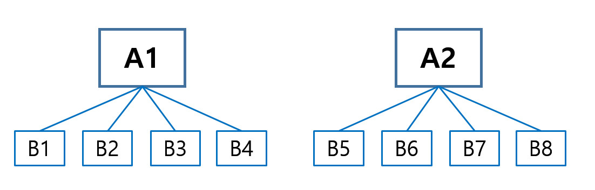
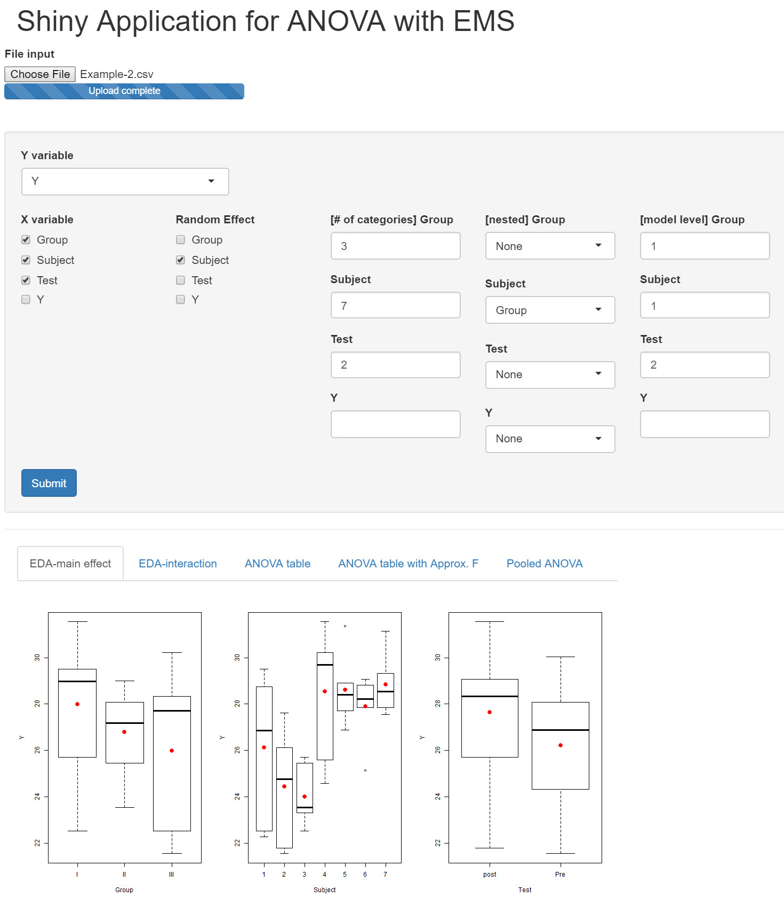

::: article
# Introduction

The analysis of variance (ANOVA) is a well-known method that can be used
to analyze data obtained with different experimental designs. Its use
mainly depends on the primary design of the experiment, and the main
testing method for the analysis of variance is the F test. If all
factors are fixed effects and there is no specific design of the
experiment, that is, the experimental design is a factorial design, then
the usual way to calculate the F statistic is to use the mean squares of
the corresponding source of variation as the numerator and the mean
squares of errors as the denominator. However, if some variables exhibit
random effects or some variables are nested in the other variables, it
is not easy to find the appropriate F statistic. This depends on the
expected mean square (EMS), and the denominator of the F statistic is
determined by the EMS of the corresponding source of variation.
Therefore, we first have to calculate the expected mean squares for the
ANOVA and then find the exact F statistic for the test using the EMS,
especially when data comes from a special experimental design. Even
though the EMS is very important to finding the exact F statistic in the
ANOVA, few tools show this EMS and most of the tools that have been
developed provide only the result of the ANOVA without any further
explanation. Therefore, users cannot figure out how to calculate the
test statistics and only know the final result.

Several packages can be used to handle models with various experimental
designs. The `lm` function in `R` can handle factorial design with fixed
effects without taking the special experimental design or the random
effects into account. The `lme` function in the
[*nlme*](https://CRAN.R-project.org/package=nlme) [@nlme] package
handles the mixed effect model, and in this function, the user can
specify the factors with a random effect. However this function mainly
focuses on the grouped data and on estimating the variance components
instead of testing the corresponding factor. Also, it does not provide
the EMS of each source in the ANOVA table.

Another `R` package that can be used in the analysis of factorial
experiments is [*afex*](https://CRAN.R-project.org/package=afex)
[@afex]. This package provides the function `ems` to calculate EMS for
the factorial designs. They adapted the Cornfield-Tukey algorithm
[@cornfield1956average] to derive the expected values of the mean
squares. The *afex* package also provides the `mixed` function to
calculate p-values for various ANOVA tables considering the
corresponding EMS to find the exact F statistic. However, the `ems`
function provides the general information on the factorial design, and
the result for `ems` only shows the coefficients of variances. It is
provided in a $p \times p$ table form instead of the EMS formula for
each source in the ANOVA table, where $p$ is the number of sources, and
the elements of this table represent the coefficient of variance in the
formula of the EMS. It is not easy to find the corresponding F statistic
with this result, and this EMS does not match the analysis of variance
for real data due to the use of the number of levels in each factor with
characters instead of the real number of levels, so users need to match
this character with their own number of levels.

In this paper, we provide a tool to show how to calculate test
statistics as well as the final result. We focus on the classical
analysis of variance method, based on the F test using EMS, exclusively
for balanced designs. We develop a new R package
[*EMSaov*](https://CRAN.R-project.org/package=EMSaov) to provide users
with the analysis of variance table with EMS for various types of
experimental design. With the ANOVA table combined with EMS, users can
easily understand how to calculate the F statistics, especially the
denominator of the F statistic, and then figure out the result of the
analysis. We also provide an application for novice users based on Shiny
([*shiny*](https://CRAN.R-project.org/package=shiny)). First, we explain
the general concepts of the analysis of variance and the special types
of experimental designs. Then we introduce *EMSaov*, our newly developed
R package, with its implementation, and explain the usage of functions
in *EMSaov* in detail. We also introduce the web interface of *EMSaov*,
followed by the conclusion.

# Analysis of variance

## Fixed, random, and mixed models

::: center
::: {#tab:1}
  ------------- -------------- ------------------------------------- -------------------------------------------------------- ----------------------------------------------------
                               Fixed model                           Random model                                             Mixed model

     Source           Df       (A,B:fixed)                           (A,B:random)                                             (A:fixed, B:random)

       $A$          $a-1$      $\sigma_\varepsilon^2 + nb\phi_A$     $\sigma_\varepsilon^2 + n\sigma_{AB}^2 + nb\sigma^2_A$   $\sigma_\varepsilon^2 + n\sigma_{AB}^2 + nb\phi_A$

       $B$          $b-1$      $\sigma_\varepsilon^2 + na\phi_B$     $\sigma_\varepsilon^2 + n\sigma_{AB}^2 + na\sigma^2_B$   $\sigma_\varepsilon^2 + na\sigma^2_B$

      $AB$       $(a-1)(b-1)$  $\sigma_\varepsilon^2 + n\phi_{AB}$   $\sigma_\varepsilon^2 + n\sigma_{AB}^2$                  $\sigma_\varepsilon^2 + n\sigma_{AB}^2$

   $Residuals$    $ab(n-1)$    $\sigma_\varepsilon^2$                $\sigma_\varepsilon^2$                                   $\sigma_\varepsilon^2$
  ------------- -------------- ------------------------------------- -------------------------------------------------------- ----------------------------------------------------

  : Table 1: Expected mean squares for the three different types of
  models
:::
:::

There are two ways to select the levels of factors for various factorial
experimental designs. One is to select the appropriate levels as fixed
values, and the other is to choose at random from many possible levels.
[@bennett1954statistical] discuss a case in which the chosen levels are
obtained from a finite set of possible levels. When all levels are
fixed, the statistical model for the experiment is referred to as a
fixed model, and when all levels are chosen as random levels, the model
is referred to as a random model. When two or more factors are involved
and some factors are chosen as fixed levels and the others are chosen as
random levels, the model is referred to as a mixed model. There is no
difference between the fixed model and the random model during data
analysis for a single-factor experiment. However, the EMS for each
factor should be different from that of a fixed model if there is more
than one factor, some factors exhibit random effects, and the other
factors are fixed effects. We thus have to be careful when generating an
F statistic to test the significance of each factor.

Consider the two-factor factorial experiment with factors A and B. The
corresponding experimental model with a completely randomized design is
$$\begin{aligned}
  Y_{ijk} = \mu + A_i + B_j + AB_{ij} +\varepsilon_{ijk}
\end{aligned}$$
where $\mu$ is a common effect, $A_i$ represents the effect of the $i$th
level of factor A, and $B_j$ represents the effect of the $j$th level of
factor B, $AB_{ij}$ is the interaction effect of factors A and B, and
$\varepsilon_{ijk}$ represents the random error in the $k$th observation
on the $i$th level of A and $j$th level of B, $i=1,\cdots, a$,
$j=1,\cdots, b$, and $k=1,\cdots, n$.

::: center
::: {#tab:2}
  ------------- ----------- ---------------- ---------------- ---------------------
                              Fixed model      Random model        Mixed model

     Source       Mean Sq     (A,B:fixed)      (A,B:random)    (A:fixed, B:random)

       $A$        $MS_A$      $MS_A/MS_E$     $MS_A/MS_{AB}$     $MS_A/MS_{AB}$

       $B$        $MS_B$      $MS_B/MS_E$     $MS_B/MS_{AB}$       $MS_B/MS_E$

      $AB$       $MS_{AB}$   $MS_{AB}/MS_E$   $MS_{AB}/MS_E$     $MS_{AB}/MS_E$

   $Residuals$    $MS_E$                                      
  ------------- ----------- ---------------- ---------------- ---------------------

  : Table 2: F statistics in ANOVA table for the three different models
:::
:::

In this model, we assume that $\mu$ is a fixed constant, and
$\varepsilon_{ijk}$ is a random variable that follows
$N(0,\sigma_{\varepsilon}^2)$. We can assume three cases: the fixed
model, the random model, and the mixed model. In a mixed model, we treat
factor A as a fixed effect and factor B as a random effect. The main
test method for the analysis of variance is an F test. The usual way to
calculate the F statistic is to use the mean squares of the
corresponding source as the numerator and the mean square error as the
denominator. However, if some variables exhibit random effects, it is
not easy to find the appropriate denominator for the F statistic. In
fact, this depends on the expected mean square (EMS), so we have to
calculate the expected mean square for the analysis of variance of the
data.

The expected mean squares are different among the three models, and they
are represented in Table [1](#tab:1). For all three models, the mean
squares error ($MS_E$) is used as the denominator to test the
interaction effect between A and B. For factor A, $MS_E$ is used in the
fixed model but $MS_{AB}$ is used in the other two models. For factor B,
$MS_{AB}$ is used in the random model, but $MS_E$ is used in the other
two models. The appropriate test statistics for each factor are
summarized in Table [2](#tab:2).

## EMS rule

As we can see in the review on generating the F statistics for the three
different models, the expected mean squares are very important. The
previous examples consist of very simple factorial models with only two
factors. For complex experimental designs, particularly when using
models involving random or mixed effects with nested factors, it is
frequently helpful to have a formal procedure to generate the expected
mean squares, that is the EMS rules [@montgomery2008design]. The EMS
rules are simple and convenient procedures that determine the expected
mean squares, and these are also appropriate for manually calculating
the expected mean squares for any nested, repeated-measures, or
split-plot design. We follow the EMS rules in [@montgomery2008design] to
generate the expected mean squares in the ANOVA table with various
experimental designs.

## Nested and nested-factorial design

In the case of experiments with two or more factors without any
restriction in the randomization, most experimental designs can be
categorized in one of three ways: crossed design, nested design, or
nested-factorial design. In this *EMSaov* package, we didn't consider
the unbalanced design and the fractional factorial design. The crossed
design considers every possible combination of the levels of factors in
the model. However, when the levels of one factor are not identical but
similar to different levels of another factor, it is referred to as a
nested design.

{#Fig:1
width="100%" alt="graphic without alt text"}

In the nested design, when the levels of factor B are nested under the
levels of factor A, the levels of factor B belonging to the first level
of factor A are not the same as the levels of factor B in the second
level of factor A, as shown in Figure [1](#Fig:1). One of the features
of this model is the lack of interaction effect between the two factors
that are nested, so when the analysis of variance is carried out, the
interaction term $AB$ should be pooled to the nested factor $B(A)$. The
ANOVA table for this design is shown in Table [3](#tab:3). Thus, the
nested design can be extended to a more complex nested design, for
example, to a model with another nested factor C under the existing
nested factor B. It can also be combined with factorial design - a model
with another factor C that is nested in both A and B, while factors A
and B are crossed.

::: {#tab:3}
  -----------------------------------------------------------------------------------------------------------------------------------
     Source         Df      Sum Sq        Mean Sq       EMS                                                        F statistic
  ------------- ----------- ------------- ------------- ---------------------------------------------------------- ------------------
       $A$         $a-1$    $SS_A$        $MS_A$        $\sigma^2_\varepsilon + b\sigma^2_{B(A)} + ab\sigma^2_A$   $MS_A/MS_{B(A)}$

     $B(A)$      $a(b-1)$   $SS_{B(A)}$   $MS_{B(A)}$   $\sigma^2_\varepsilon + b\sigma^2_{B(A)}$                  $MS_{B(A)}/MS_E$

   $Residuals$   $ab(n-1)$  $SS_E$        $MS_E$        $\sigma^2_\varepsilon$                                     
  -----------------------------------------------------------------------------------------------------------------------------------

  : Table 3: ANOVA table for the nested design
:::

## Split-plot design

The split-plot design is used when it may not be possible to completely
randomize the order of experimentation. In this case, we assume for one
factor to be a block. Since a factor treated as a block is restricted
during randomization, the effects of the corresponding factor are
confounded with the blocks, and it is thus difficult to determine the
pure significance of this effect. On the other hand, there is no loss of
information for the other factors that are not treated as a block
because it is completely randomized under these factors. In this design,
two levels of randomization are applied to assign the experimental units
to the treatment. The first level of randomization is applied to the
whole plot and is used to assign the experimental units to the levels of
treatment factor A. The whole plot is split into a split-plot, and the
second level of randomization is used to assign the experimental units
of the subplot to levels of the treatment factor B. Since the split-plot
design has two levels of experimental units, the whole plot and the
subplot portions have separate experimental errors. Therefore, the F
tests must be run only within the whole plot or within the split plot,
and the mean squares in the whole plot should not be compared with the
mean squares in the split plot, regardless of the EMS value. We handle
this split-plot design as a hierarchical design with respect to the
levels of model. The first level of model is the whole plot, and the
second level of model is the split plot. These levels of model can then
be extended to 3, 4, or more levels.

## Approximate F test

In factorial experiments with three or more factors involving a random
or mixed model, sometimes there is no exact test statistic for certain
effects in the model. We have to calculate a new F statistic if there is
no denominator that differs from the expected value of the numerator
only by the specific component being tested. Therefore,
[@satterthwaite1946approximate] proposed a test procedure that uses
linear combinations of the original mean squares to form the F
statistic, for example,
$$\begin{aligned}
MS_{num} = MS_{num,1} + \cdots + MS_{num,{r_n}} \\
MS_{den} = MS_{den,1} + \cdots + MS_{den,{r_d}} \nonumber
\end{aligned}$$
where $MS_{num,1}, \cdots, MS_{num,{r_n}}$ and
$MS_{den,1}, \cdots, MS_{den,{r_d}}$ are selected from $MS$ values in
ANOVA table such that
$E\left( MS_{num}\right) - E\left( MS_{den}\right)$ is equal to the
effect considered in the null hypothesis.

Then,
$$\begin{aligned}
ApproxF = \frac{MS_{num}}{MS_{den}} \sim F_{df_{num},df_{den}}
\end{aligned}$$
where
$$\begin{aligned}
df_{num} = \frac{\left(MS_{num,1} + \cdots + MS_{num,{r_n}}\right)^2}{(MS_{num,1})^2 /df_{num,1} + \cdots + (MS_{num,{r_n}})^2 /df_{num,{r_n}}} \\
df_{den} = \frac{\left(MS_{den,1} + \cdots + MS_{den,{r_d}}\right)^2}{(MS_{den,1})^2 /df_{den,1} + \cdots + (MS_{den,{r_d}})^2 /df_{den,{r_d}}}
\end{aligned}$$

In $df_{num}$ and $df_{den}$, $df_{num,i}$ and $df_{den,j}$ are the
degrees of freedom associated with the mean square $MS_{num,i}$ and
$MS_{den,j}$, respectively, where $i=1, \cdots, r_n$ and
$j=1, \cdots, r_d$

# Implementation of EMSaov package

The *EMSaov* package includes `EMSanova`, `PooledANOVA`, and `ApproxF`
as main functions and `EMSaovApp` as a function for the Shiny
application. `EMSanova` generates the analysis of variance (ANOVA) table
with the expected mean squares (EMS) and the corrected F tests
considered with the EMS. Several arguments are needed for this function
(Table [4](#tab:4)). We use the `formula` argument to specify the
response variable and factors in the ANOVA table with `data`, nested
factors (`nested`), and types of factors (`type`). Sometimes, we cannot
find the appropriate denominator for the F statistic, and we have to use
the approximate F test. The function `ApproxF` is developed to
approximate the results of the F test. The `ApproxF` function takes
`SS.table` and `approx.name` as arguments. `SS.table` is the result from
EMS.anova, and `approx.name` designates the source of variation in
`SS.table` to calculate the approximate F values for the test. To show
how to use these functions in the *EMSaov* package, we use the three
sets of example data in [@hicks1982fundamental].

## Example 1: Mixed effect model with approximate F test

`film` data in *EMSaov* corresponds to the mixed effect model (Example
10.3 in [@hicks1982fundamental]). There are three factors: Gate,
Operator, and Day. The experiment consists of measuring the dry-film
thickness of varnish in millimeters for three different gate setting (1,
2, and 3) twice with operators A, B, and C, for two days.

::: {#tab:4}
  -----------------------------------------------------------------------------
     argument     
  --------------- -------------------------------------------------------------
     `formula`    model formula

      `data`      data frame for ANOVA

      `type`      the list of factor types.

                  It designates whether each factor is random or not.

                  use `"F"` for the fixed effect, `"R"` for the random effect

     `nested`     the list of the nested effects

      `level`     the list of the model level

     `n.table`    numbers of levels in each factor

   `approximate`  calculate approximate F test when it is `TRUE`
  -----------------------------------------------------------------------------

  : Table 4: Arguments of `EMSanova` function
:::

In `film`, \"thickness\" is the dependent variable, and \"Gate\",
\"Operator\", and \"Day\" are the factors that we want to consider. We
use `thickness `$\thicksim$` Gate + Operator + Day` as a formula. In the
`EMSanova` function, we use the formula format just for specifying the
factors in the model. To specify the types of factors and whether the
factors are nested or not, we need to use the other arguments. If the
user specifies
`formula = thickness `$\thicksim$` Gate + Operator + Day`, `type`,
`nested`, `level` , and `n.table` should follow the order of \"Gate\",
\"Operator\" and \"Day\". In this example, \"Gate\" is treated as a
fixed effect and \"Operator\" and \"Day\" are treated as random effects.
Therefore, `type = c("F","R","R")`.

``` r
> data(film)
> anova.result <- EMSanova(thickness ~ Gate + Operator + Day, data = film,
+                        type = c("F", "R", "R"))
> anova.result
                  Df          SS          MS  Fvalue Pvalue Sig
Gate               2 1.573172222 0.786586111
Operator           2 0.112072222 0.056036111 18.7656 0.0506   .
Gate:Operator      4 0.042844444 0.010711111  4.3229 0.0926   .
Day                1 0.001002778 0.001002778  0.3358 0.6208
Gate:Day           2 0.011338889 0.005669444  2.2881 0.2175
Operator:Day       2 0.005972222 0.002986111   9.188 0.0018  **
Gate:Operator:Day  4 0.009911111 0.002477778  7.6239  9e-04 ***
Residuals         18 0.005850000 0.000325000
                                                                       EMS
Gate              Error+2Gate:Operator:Day+6Gate:Day+4Gate:Operator+12Gate
Operator                                    Error+6Operator:Day+12Operator
Gate:Operator                      Error+2Gate:Operator:Day+4Gate:Operator
Day                                              Error+6Operator:Day+18Day
Gate:Day                                Error+2Gate:Operator:Day+6Gate:Day
Operator:Day                                           Error+6Operator:Day
Gate:Operator:Day                                 Error+2Gate:Operator:Day
Residuals                                                            Error
```

For the factor \"Gate\", the EMS of the denominator should be \"Error +
2Gate:Operator:Day + 6Gate:Day + 4Gate:Operator\", but it is not so in
this table. Therefore, we cannot find the exact denominator for the F
test and need to use the approximate F test. The factor \"Gate\" is in
the first row in the result of `EMSanova` and `approx.name` should be
\"Gate\" for the `ApproxF` function.

``` r
> ApproxF(SS.table = anova.result, approx.name = "Gate")
$Appr.F
[1] 48.17076

$df1
[1] 2.01261

$df2
[1] 5.995597

$Appr.Pvalue
[1] 0.0002010433
```

The approximate F value for the test of the factor \"Gate\" is 48.17076
with p-value 0.0002. Therefore, we can conclude that there are
significant differences among the levels of the factor \"Gate\" at the
significance level 0.05.

If we want to combine \"Gate:Day\" and \"Residuals\", and treat them as
a combined residual for the further analysis, we can define `del.ID` as
`c("Gate:Day","Residuals")` and use the `PooledANOVA` function. The
first argument for `PooledANOVA` is the output from `EMSanova`.

``` r
> del.ID <- c("Gate:Day", "Residuals")
> PooledANOVA(anova.result, del.ID)
                  Df     SS     MS  Fvalue Pvalue Sig
Gate               2 1.5732 0.7866 73.4365  7e-04 ***
Operator           2 0.1121 0.0560 18.7656 0.0506   .
Gate:Operator      4 0.0428 0.0107  4.3229 0.0926   .
Day                1 0.0010 0.0010  0.3358 0.6208
Operator:Day       2 0.0060 0.0030  3.4745 0.0507   .
Gate:Operator:Day  4 0.0099 0.0025   2.883 0.0491   *
Residuals         20 0.0172 0.0009
                                                             EMS
Gate              Error+2Gate:Operator:Day+4Gate:Operator+12Gate
Operator                          Error+6Operator:Day+12Operator
Gate:Operator            Error+2Gate:Operator:Day+4Gate:Operator
Day                                    Error+6Operator:Day+18Day
Operator:Day                                 Error+6Operator:Day
Gate:Operator:Day                       Error+2Gate:Operator:Day
Residuals                                                  Error
```

## Example 2: Nested-factorial model

For the nested model, we need to specify `nested`, which indicates the
parent factor of the nested factor. We use the `baseball` data (Example
11.4 in [@hicks1982fundamental]) to illustrate the use of the `EMSanova`
function with the nested-factorial model. It has three factors where the
subjects are nested within groups.

In this example,
`formula = velocity `$\thicksim$` Group + Subject + test`. The factors
\"Group\" and \"test\" are treated as fixed effects, and the factor
\"Subject\" is treated as a random effect with the argument for fixed
and random effects being `type = c("F", "R", "F")`. We use
`nested = c(NA, "Group", NA)` to indicate the factor \"Subject\", nested
in the factor \"Group\". The fixed effect \"test\" is measured twice
with \"Pre\" and \"Post\" in each subject, which means that there are
two levels in this model. The first level consists of \"Group\" and
\"Subject\" and the second level consists of \"test\". This model level
can thus be represented with `level=c(1,1,2)`.

``` r
> data(baseball)
> anova.result <- EMSanova(velocity ~ Group + Subject + test,
+                          data = baseball,
+                          type = c("F", "R", "F"),
+                          nested = c(NA, "Group", NA),
+                          level = c(1, 1, 2))
> anova.result
               Df         SS         MS   Fvalue  Pvalue Sig Model.Level
Group           2  28.139200 14.0696000   1.0426  0.3729               1
Subject(Group) 18 242.905914 13.4947730  115.517 <0.0001 ***           1
test            1  21.257486 21.2574857 181.9669 <0.0001 ***           2
Group:test      2  12.381943  6.1909714  52.9955 <0.0001 ***           2
Residuals      18   2.102771  0.1168206                                2
                                         EMS
Group          Error+2Subject(Group)+14Group
Subject(Group)         Error+2Subject(Group)
test                            Error+21test
Group:test                 Error+7Group:test
Residuals                              Error
```

## Example 3: Split-split plot design

The example `rubber` is the split-split plot design with 4 replicates
(Example 13.3 in [@hicks1982fundamental]). Three different laboratories
(Lap), three different temperatures (Temp), and three types of rubber
mix (Mix) were involved in each replicate (Rep). \"Rep\" and \"Lap\"
consist of the whole plot, \"Temp\" is added in the split-plot, and
\"Mix\" is added in the split-split plot.

This design can be treated as a three-level model with \"Rep\" and
\"Lap\" in the first level, \"Temp\" in the second level, and \"Mix\" in
the third level. For the `EMSanova`, we set
`formula = Y `$\thicksim$` Rep + Mix + Lap + Temp)`,
`type = c("R", "F", "F", "F")` and `level = c(1, 3, 1, 2)`.

``` r
> data(rubber)
> anova.result <- EMSanova(cure ~ Rep + Mix + Lap + Temp,
+                          data = rubber,
+                          type = c("R", "F", "F", "F"),
+                          level = c(1, 3, 1, 2))
> anova.result
             Df          SS           MS    Fvalue  Pvalue Sig Model.Level
Rep           3    5.581019    1.8603395    2.2311  0.1105               1
Lap           2   51.496852   25.7484259    4.9395  0.0539   .           1
Rep:Lap       6   31.276481    5.2127469    6.2517   5e-04 ***           1
Temp          2 2978.564630 1489.2823148 2167.7859 <0.0001 ***           2
Rep:Temp      6    4.122037    0.6870062    0.8239  0.5626               2
Lap:Temp      4    5.603148    1.4007870    0.5948  0.6732               2
Rep:Lap:Temp 12   28.261296    2.3551080    2.8245  0.0146   *           2
Mix           2  149.217963   74.6089815   53.0128   2e-04 ***           3
Rep:Mix       6    8.444259    1.4073765    1.6879  0.1672               3
Lap:Mix       4    4.894815    1.2237037    1.4772  0.2697               3
Rep:Lap:Mix  12    9.940741    0.8283951    0.9935  0.4828               3
Temp:Mix      4   47.853704   11.9634259   15.6467   1e-04 ***           3
Rep:Temp:Mix 12    9.175185    0.7645988     0.917  0.5454               3
Lap:Temp:Mix  8   10.688519    1.3360648    1.6024  0.1765               3
Residuals    24   20.011481    0.8338117                                 3
                                        EMS
Rep                             Error+27Rep
Lap                    Error+9Rep:Lap+36Lap
Rep:Lap                      Error+9Rep:Lap
Temp                 Error+9Rep:Temp+36Temp
Rep:Temp                    Error+9Rep:Temp
Lap:Temp     Error+3Rep:Lap:Temp+12Lap:Temp
Rep:Lap:Temp            Error+3Rep:Lap:Temp
Mix                    Error+9Rep:Mix+36Mix
Rep:Mix                      Error+9Rep:Mix
Lap:Mix        Error+3Rep:Lap:Mix+12Lap:Mix
Rep:Lap:Mix              Error+3Rep:Lap:Mix
Temp:Mix     Error+3Rep:Temp:Mix+12Temp:Mix
Rep:Temp:Mix            Error+3Rep:Temp:Mix
Lap:Temp:Mix            Error+4Lap:Temp:Mix
Residuals                             Error
```

{#figure:GUI7
width="100%" alt="graphic without alt text"}

# `EMSaovApp`: Web interface for ANOVA with EMS

{#figure:GUI8 width="100%" alt="graphic without alt text"}

{#figure:GUI5 width="100%" alt="graphic without alt text"}

{#figure:GUI6 width="100%" alt="graphic without alt text"}

Even though we provide three functions to produce the appropriate
analysis of variance for many different types of experimental designs,
this is not so easy for a novice user of R. For convenience, we provide
a Shiny-based application with a graphical user interface (GUI) to
obtain the ANOVA of data from various experimental designs. Figure
[2](#figure:GUI7) shows the main GUI for `EMSaovApp` with Example 2. The
first part of the GUI can be used to read data in the csv format. The
middle part has various input windows to select the dependent variable,
the factors in the ANOVA table, the number of categories in each factor,
the specification of the nested factor, and the level of the model. In
this example, \"Y\" is selected as the dependent variable (Y variable)
and the \"Group\", \"Subject\", and \"Test\" factors are selected. Among
the selected factors, \"Subject\" is treated as the random effect and
the others are treated as fixed effects. Therefore \"Subject\" is
checked in the \"Random Effect\" part. The \"Subject\" factor is nested
in \"Group\", and the \"test\" factor is in the second level of the
model. This information should thus be specified in this part. The
number of categories for each factor is automatically calculated from
the original data, but the user can change them in this GUI.

The bottom part has five tabs, including \"EDA-main effect\",
\"EDA-interaction\", \"ANOVA table\", \"ANOVA table with Approx.F\", and
\"Pooled ANOVA\". The \"EDA-main effect\" tab shows parallel box plots
for each factor (Figure [2](#figure:GUI7)). \"Subject\" and \"Test\"
show significant differences among the levels in each factor, and the
\"EDA-interaction\" tab shows the interaction plots to help see whether
the interaction effect between the two factors is significant or not.
`EMSaovApp` automatically generates interaction plots for all pairs of
selected factors. In Figure [3](#figure:GUI8), the interaction effect
between \"Group\" and \"Test\" is highly significant. Even though the
interaction effect between \"Group\" and \"Subject\" and the interaction
effect between \"Subject\" and \"Test\" are provided, \"Subject\" is
nested in \"Group\" and these interaction effects are not of interest.
Figure [4](#figure:GUI5) show the result of the tab \"ANOVA table with
Approx. F\" with data from Example 1. In this example, we can combine
the three-way interaction to the residuals by checking the corresponding
items in the \"Pooled ANOVA\" tab (Figure [5](#figure:GUI6)).

# Discussion

We have introduced *EMSaov*, an R package for ANOVA with various types
of experimental design. We should have information on the EMS to
determine the denominator of the F statistics in ANOVA. *EMSaov* is one
of few packages for ANOVA with EMS that can handle fixed or random
effects, nested factors, or model with multi-level design. Future
updates to *EMSaov* include the permutation tests for each source of
variation to cover the situation where data does not follow the normal
assumption.
:::
