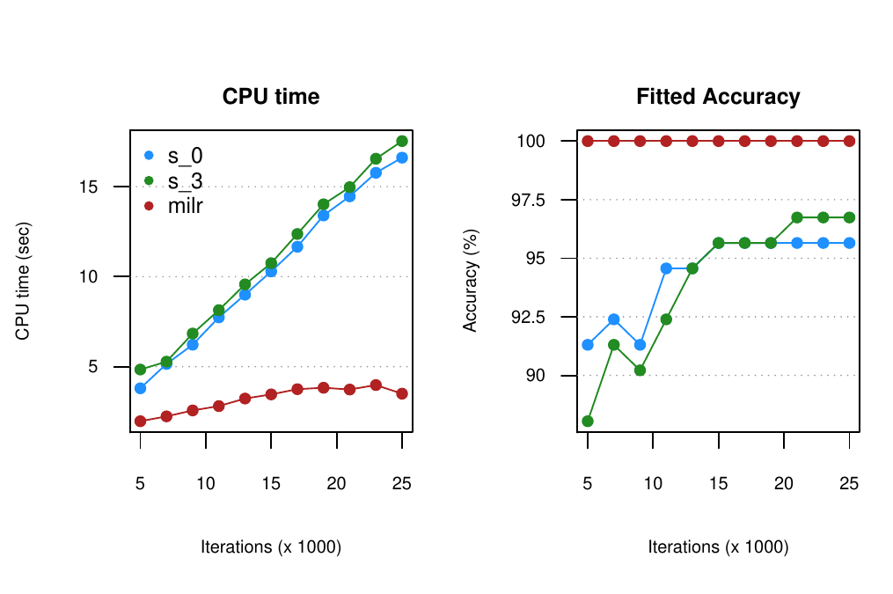

::: article
# Introduction

Multiple-instance learning (MIL) is used to model the class labels which
are associated with bags of observations instead of the individual
observations. This technique has been widely used in solving many
different real-world problems. In the early stage of the MIL
application, @dietterich1997solving studied the drug-activity prediction
problem. A molecule is classified as a good drug if it is able to bind
strongly to a binding site on the target molecule. The problem is: one
molecule can adopt multiple shapes called the conformations and only one
or a few conformations can bind the target molecule well. They described
a molecule by a bag of its many possible conformations whose binding
strength remains unknown. An important application of MIL is the image
and text categorization, such as in @maron1998multiple
[@andrews2002support; @zhang2007local; @zhou2009multi; @li2011text; @Kotzias2015],
to name a few. An image (bag) possessing at least one particular pattern
(instance) is categorized into one class; otherwise, it is categorized
into another class. For example, @maron1998multiple treated the natural
scene images as bags, and, each bag is categorized as the scene of
waterfall if at least one of its subimages is the waterfall. Whereas,
@zhou2009multi studied the categorization of collections (bags) of posts
(instances) from different newsgroups corpus. A collection is a positive
bag if it contains 3% posts from a target corpus category and the
remaining 97% posts, as well as all posts in the negative bags, belong
to the other corpus categories. MIL is also used in medical researches.
The UCSB breast cancer study [@Kandemir2014image] is such a case.
Patients (bags) were diagnosed as having or not having cancer by
doctors; however, the computer, initially, had no knowledge of which
patterns (instances) were associated with the disease. Furthermore, in
manufacturing processes [@milr_paper], a product (bag) is defective as
long as one or more of its components (instances) are defective. In
practice, at the initial stage, we only know that a product is
defective, and we have no idea which component is responsible for the
defect.

Several approaches have been offered to analyze datasets with multiple
instances, e.g., @maron1998learning
[@ray2005supervised; @xu2004logistic; @zhang2001dd]. From our point of
view, the statuses of these components are missing variables, and thus,
the Expectation-Maximization (EM) algorithm
[@2016-128-dempster1977maximum] can play a role in multiple-instance
learning. By now the toolboxes or libraries available for implementing
MIL methods are developed by other computer softwares. For example,
@MILL2008 and @MIL2016 are implemented in MATLAB software, but neither
of them carries the methods based on logistic regression model.
@settles.nips08 provided the Java codes including the method introduced
in @ray2005supervised. Thus, for R users, we are first to develop a
MIL-related package based on logistic regression modelling which is
called multiple-instance logistic regression (MILR). In this package, we
first apply the logistic regression defined in @ray2005supervised and
@xu2004logistic, and then, we use the EM algorithm to obtain maximum
likelihood estimates of the regression coefficients. In addition, the
popular lasso penalty [@2016-128-tibshirani1996regression] is applied to
the likelihood function so that parameter estimation and variable
selection can be performed simultaneously. This feature is especially
desirable when the number of covariates is relatively large.

To fix ideas, we firstly define the notations and introduce the
construction of the likelihood function. Suppose that the dataset
consists of $n$ bags and that there are $m_i$ instances in the $i$th bag
for $i=1,\dots, n$. Let $Z_i$ denote the status of the $i$th bag, and
let $Y_{ij}$ be the status of the $j$th instance in the $i$th bag along
with $x_{ij} \in \Re^p$ as the corresponding covariates. We assume that
the $Y_{ij}$ follow independent Bernoulli distributions with defect
rates of $p_{ij}$, where $p_{ij}=g\left(\beta_0+x_{ij}^T\beta\right)$
and $g(x) = 1/\left(1+e^{-x}\right)$. We also assume that the $Z_i$
follow independent Bernoulli distributions with defect rates of $\pi_i$.
Therefore, the bag-level likelihood function is

$$\label{eq:L}
L\left(\beta_0,\beta\right)=\prod_{i=1}^n\pi_i^{z_i}\left(1-\pi_i\right)^{1-z_i}.   (\#eq:L)$$

To associate the bag-level defect rate $\pi_i$ with the instance-level
defect rates $p_{ij}$, several methods have been proposed. The bag-level
status is defined as $Z_i=I\left(\sum_{j=1}^{m_i}Y_{ij}>0\right)$. If
the independence assumption among the $Y_{ij}$ holds, the bag-level
defect rate is $\pi_i=1-\prod_{j=1}^{m_i}(1-p_{ij})$. On the other hand,
if the independence assumption might not be held, @xu2004logistic and
@ray2005supervised proposed the softmax function to associate $\pi_i$ to
$p_{ij}$, as follows:

$$\label{eq:softmax}
s_i\left(\alpha\right)=\sum_{j=1}^{m_i}p_{ij}\exp{\left\{\alpha p_{ij}\right\}} \Big/ \sum_{j=1}^{m_i}\exp{\left\{\alpha p_{ij}\right\}},   (\#eq:softmax)$$

where $\alpha$ is a pre-specified nonnegative value. @xu2004logistic
used $\alpha=0$, therein modeling $\pi_i$ by taking the average of
$p_{ij}$, $j=1,\ldots,m_i$, whereas @ray2005supervised suggested
$\alpha=3$. We observe that the likelihood (\@ref(eq:L)) applying
neither the $\pi_i$ function nor the $s_i(\alpha)$ function results in
effective estimators.

Below, we begin by establishing the E-steps and M-steps required for the
EM algorithm and then attach the lasso penalty for the estimation and
feature selection. Several computation strategies applied are the same
as those addressed in @2016-128-friedman2010regularization. Finally, we
demonstrate the functions provided in the
[*milr*](https://CRAN.R-project.org/package=milr) package via
simulations and on a real dataset.

# The multiple-instance logistic regression

## EM algorithm

If the instance-level statuses, $y_{ij}$, are observable, the complete
data likelihood is
$$\prod_{i=1}^n\prod_{j=1}^{m_i}p_{ij}^{y_{ij}}q_{ij}^{1-y_{ij}}~,$$
where $q_{ij}=1-p_{ij}$. An ordinary approach, such as the Newton
method, can be used to solve this maximal likelihood estimate (MLE).
However, considering multiple-instance data, we can only observe the
statuses of the bags, $Z_i=I\left(\sum_{j=1}^{m_j}Y_{ij}>0\right)$, and
not the statuses of the instances $Y_{ij}$. As a result, we apply the EM
algorithm to obtain the MLEs of the parameters by treating the
instance-level labels as the missing data.

In the E-step, two conditional distributions of the missing data given
the bag-level statuses $Z_i$ are
$$Pr\left(Y_{i1}=0,\ldots,Y_{im_i}=0\mid Z_i=0\right)=1$$
and
$$Pr\left(Y_{ij}=y_{ij}, \quad j=1,\dots, m_i \mid Z_i=1\right) =
    \frac{
      \prod_{j=1}^{m_i}p_{ij}^{y_{ij}}q_{ij}^{1-y_{ij}}\times
        I\left(\sum_{j=1}^{m_i}y_{ij}>0\right)
      }{1-\prod_{l=1}^{m_i}q_{il}}.$$
Thus, the conditional expectations are

$$E\left(Y_{ij}\mid Z_i=0\right)=0
\quad \mbox{ and } \quad
E\left(Y_{ij}\mid Z_i=1\right)=\frac{p_{ij}}{1-\prod_{l=1}^{m_i}q_{il}}\equiv\gamma_{ij}.$$

The $Q$ function at step $t$ is
$Q\left(\beta_0,\beta\mid\beta_0^t,\beta^t\right) = \sum_{i=1}^nQ_i\left(\beta_0,\beta\mid\beta_0^t,\beta^t\right)$,
where $Q_i$ is the conditional expectation of the complete
log-likelihood for the $i$th bag given $Z_i$, which is defined as

$$\begin{aligned}
Q_i\left(\beta_0,\beta\mid\beta_0^t,\beta^t\right)
 & = E\left(\sum_{j=1}^{m_i}y_{ij}\log{\left(p_{ij}\right)}+\left(1-y_{ij}\right)\log{\left(q_{ij}\right)} ~\Bigg|~ Z_i=z_i,\beta_0^t,\beta^t\right) \\
 & = \sum_{j=1}^{m_i}z_i\gamma_{ij}^t\left(\beta_0+x_{ij}^T\beta\right)-\log{\left(1+e^{\beta_0+x_{ij}^T\beta}\right)}.
\end{aligned}$$

Note that all the $p_{ij}$, $q_{ij}$, and $\gamma_{ij}$ are functions of
$\beta_0$ and $\beta$, and thus, we define these functions by
substituting $\beta_0$ and $\beta$ by their current estimates
$\beta_0^t$ and $\beta^t$ to obtain $p_{ij}^t$, $q_{ij}^t$, and
$\gamma_{ij}^t$, respectively.

In the M-step, we maximize this $Q$ function with respect to
$\left(\beta_0, \beta\right)$. Since the maximization of the nonlinear
$Q$ function is computationally expensive, following
@2016-128-friedman2010regularization, the quadratic approximation to $Q$
is applied. Taking the second-order Taylor expansion about $\beta_0^t$
and $\beta^t$, we have
$Q\left(\beta_0,\beta\mid\beta_0^t,\beta^t\right) =Q_Q\left(\beta_0,\beta\mid \beta_0^t,\beta^t\right) + C + R_2\left(\beta_0,\beta\mid\beta_0^t,\beta^t\right)$,
where $C$ is a constant in terms of $\beta_0$ and $\beta$,
$R_2\left(\beta_0,\beta\mid\beta_0^t,\beta^t\right)$ is the remainder
term of the expansion and
$$Q_Q\left(\beta_0,\beta\mid \beta_0^t,\beta^t\right) =
  -\frac{1}{2}\sum_{i=1}^n\sum_{j=1}^{m_i}w_{ij}^t\left[u_{ij}^t-\beta_0-x_{ij}^T\beta\right]^2,$$
where
$u_{ij}^t=\beta_0+x_{ij}^T\beta^t+\left(z_i\gamma^t_{ij}-p_{ij}^t\right)\Big/\left(p_{ij}^tq_{ij}^t\right)$
and $w_{ij}^t=p_{ij}^tq_{ij}^t$. In the *milr* package, instead of
maximizing $Q\left(\beta_0,\beta\mid\beta_0^t,\beta^t\right)$, we
maximize its quadratic approximation,
$Q_Q\left(\beta_0,\beta\mid\beta_0^t,\beta^t\right)$. Since the
objective function is quadratic, the roots of
$\partial Q_Q / \partial \beta_0$ and $\partial Q_Q / \partial \beta$
have closed-form representations.

## Variable selection with lasso penalty

We adopt the lasso method [@2016-128-tibshirani1996regression] to
identify active features in this MILR framework. The key is to add the
$L_1$ penalty into the objective function in the M-step so that the EM
algorithm is capable of performing estimation and variable selection
simultaneously. To this end, we rewrite the objective function as

$$\label{eq:lasso}
\underset{\beta_0,\beta}{\min}\left\{-Q_Q\left(\beta_0,\beta\mid \beta_0^t,\beta^t\right)+\lambda\sum_{k=1}^p\left|\beta_k\right|\right\}.   (\#eq:lasso)$$

Note that the intercept term $\beta_0$ is always kept in the model;
thus, we do not place a penalty on $\beta_0$. In addition, $\lambda$ is
the tuning parameter, and we will introduce how to determine this
parameter later. We applied the shooting algorithm
[@fu1998penalized; @milr_paper] to update
$\left(\beta^t_0,\beta^t\right)$.

# Implementation

The *milr* package contains a data generator, `DGP`, which is used to
generate the multiple-instance data for the simulation studies, and two
estimation approaches, `milr` and `softmax`, which are the main tools
for modeling the multiple-instance data. In this section, we introduce
the usage and default setups of these functions.

## Data generator

The function `DGP` is the generator for the multiple-instance-type data
under the MILR framework.

To use the `DGP` function, the user needs to specify an integer `n` as
the number of bags, a vector `m` of length $n$ as the number of
instances in each bag, and a vector `beta` of length $p$, with the
desired number of covariates, and the regression coefficients, $\beta$,
as in `DGP(n, m, beta)`. Note that one can set `m` as an integer for
generating the data with an equal instance size `m` for each bag. Thus,
the total number of observations is $N=\sum_{i=1}^n m_i$. The `DGP`
simulates the labels of bags through the following steps:

1.  Generate $p$ mutually independent covariates of length $N$ from the
    standard normal distribution as an $N\times p$ matrix, $X$.

2.  Generate the binary response, $Y_{ij}$, for the $j$th instance of
    the $i$th bag from the Bernoulli distribution with
    $$p_{ij}=1\big/\left(1+\exp{\left\{-x_{ij}^T\beta\right\}}\right)$$
    where $x_{ij}$ is the $p$-component vector in the row of $X$
    representing the $j$th instance of the $i$th bag.

3.  Calculate the observed response for the $i$th bag by
    $Z_i=I\left(\sum_{j=1}^{m_i}Y_{ij}>0\right)$.

4.  Return the indices of the bags, the covariate matrix $X$ and the
    bag-level statuses $Z$.

## The milr and softmax apporaches

In the *milr* package, we provide two approaches to model the
multiple-instance data: the proposed `milr` [@milr_paper] and the
`softmax` approach [@xu2004logistic]. To implement these two approaches,
we assume that the number of observations and covariates are $N$ and
$p$, respectively. The input data for both `milr` and `softmax` are
separated into three parts: the bag-level statuses, `y`, as a vector of
length $N$; the $N\times p$ design matrix, `x`; and `bag`, the vector of
indices of length $N$, representing the indices of the bag to which each
instance belongs.

``` r
  milr(y, x, bag, lambda, numLambda, lambdaCriterion, nfold, maxit)
  softmax(y, x, bag, alpha, ...)
```

For the `milr` function, specifying `lambda` in different ways controls
whether and how the lasso penalty participates in parameter estimation.
The default value of `lambda` is $0$. With this value, the ordinary MLE
is applied, i.e., no penalty term is considered. This is the suggested
choice when the number of covariates $p$ is small. When $p$ is large or
when variable selection is desired, users can specify a $\lambda$ vector
of length $\kappa$; otherwise, by letting `lambda = -1`, the program
automatically provides a $\lambda$ vector of length
$\kappa=\mbox{\texttt{numLambda}}$ as the tuning set. Following
@2016-128-friedman2010regularization, the theoretical maximal value of
$\lambda$ in (\@ref(eq:lasso)) is

$$\label{eq:lammax}
\lambda_{max}=\left[\prod_{i=1}^n\left(m_i-1\right)\right]^{\frac{1}{2}}\left[\prod_{i=1}^nm_i^{1-2z_i}\right]^{\frac{1}{2}}.   (\#eq:lammax)$$

The automatically specified sequence of $\lambda$ values ranges from
$\lambda_{min}=\lambda_{max}/1000$ to $\lambda_{max}$ in ascending
order.

The default setting for choosing the optimal $\lambda$ among these
$\lambda$ values is the Bayesian information criterion (BIC),
$-2\log{(likelihood)} + p^*\times\log{(n)}$, where $p^*$ is the number
of nonzero regression coefficients. Alternatively, the user can use the
options `lambdaCriterion = "deviance"` and `nfold = K` with an integer
`K` to obtain the best $\lambda$ that minimizes the predictive deviance
through "bag-wise" $K$-fold cross validation. The last option, `maxit`,
indicates the maximal number of iterations of the EM algorithm; its
default value is $500$.

For the `softmax` function, the option `alpha` is a nonnegative real
number for the $\alpha$ value in (\@ref(eq:softmax)). The maximum
likelihood estimators of the regression coefficients are obtained by the
generic function `optim`. Note that no variable selection approach is
implemented for this method.

Two generic accessory functions, `coef` and `fitted`, can be used to
extract the regression coefficients and the fitted bag-level labels
returned by `milr` and `softmax`. We also provide the significance test
based on Wald's test for the `milr` estimations without the lasso
penalty through the `summary` function. In addition, to predict the
bag-level statuses for the new data set, the `predict` function can be
used by assigning three items: `object` is the fitted model obtained by
`milr` or `softmax`, `newdata` is the covariate matrix, and
`bag_newdata` is the bag indices of the new dataset. Finally, the MIL
model can be used to predict the bag-level labels and the
instances-level labels. The option `type` in `fitted` and `predicted`
functions controls the type of output labels. The default option is
`type = "bag"` which results the bag-level prediction. Otherwise, by
setting `type = "instance"`, the instances-level labels will be
presented.

``` r
  fitted(object, type)
  predict(object, newdata, bag_newdata, type)
```

# Examples

We illustrate the usage of the *milr* package via simulated and real
examples.

## Estimation and variable selection

We demonstrate how to apply the `milr` function for model estimation and
variable selection. We simulate data with $n=50$ bags, each containing
$m=3$ instances and regression coefficients
$\beta = (-2, -1, 1, 2, 0.5, 0, 0, 0, 0, 0)$. Specifically, the first
four covariates are important.

``` r
library(magrittr)
library(milr)
set.seed(99)
# set the size of dataset
numOfBag <- 50
numOfInstsInBag <- 3
# set true coefficients: beta_0, beta_1, beta_2, beta_3
trueCoefs <- c(-2, -2, -1, 1, 2, 0.5, 0, 0, 0, 0, 0)
trainData <- DGP(numOfBag, numOfInstsInBag, trueCoefs)
trainData$X %<>% set_colnames(paste0("X", 1:ncol(.)))
tapply(trainData$Z, trainData$ID, function(x) sum(x) > 0) %>% as.numeric
```

``` r
##  [1] 1 1 1 1 1 1 0 0 1 0 1 1 0 0 1 1 0 1 1 1 1 0 0 0 1 0 1 0 1 0 1 0 1 0 0
## [36] 1 1 0 0 0 1 1 0 0 0 1 1 0 1 1
```

Since the number of covariates is small, we then use the `milr` function
to estimate the model parameters with `lambda = 0`. One can apply
`summary` to produce results including estimates of the regression
coefficients and their corresponding standard error, testing statistics
and the P-values under Wald's test. The regression coefficients are
returned by the function `coef`.

``` r
# fit milr model
milrFit_EST <- milr(trainData$Z, trainData$X, trainData$ID, lambda = 0)
# call the Wald's test result
summary(milrFit_EST)
```

``` r
## Log-Likelihood: -14.005.
```

``` r
## Estimates:
```

``` r
##           Estimate  Std.Err Z value   Pr(>z)
## intercept -3.28671  1.16695 -2.8165 0.004855 **
## X1        -2.45529  0.92227 -2.6622 0.007762 **
## X2        -1.26351  0.67621 -1.8685 0.061689 .
## X3         0.94016  0.75173  1.2507 0.211054
## X4         3.84173  1.47862  2.5982 0.009372 **
## X5         0.22000  0.66579  0.3304 0.741073
## X6        -1.00740  0.73288 -1.3746 0.169262
## X7        -0.53063  0.59871 -0.8863 0.375463
## X8         0.25334  0.71596  0.3538 0.723451
## X9        -1.92753  0.92437 -2.0852 0.037047 *
## X10        0.12249  0.63054  0.1943 0.845972
## ---
## Signif. codes:  0 '***' 0.001 '**' 0.01 '*' 0.05 '.' 0.1 ' ' 1
```

``` r
# call the regression coefficients
coef(milrFit_EST)
```

``` r
##  intercept         X1         X2         X3         X4         X5
## -3.2867082 -2.4552903 -1.2635149  0.9401636  3.8417318  0.2199982
##         X6         X7         X8         X9        X10
## -1.0074012 -0.5306309  0.2533409 -1.9275338  0.1224893
```

The generic function `table` builds a contingency table of the counts
for comparing the true bag-level statuses and the fitted bag-level
statuses (obtained by the option `type = "bag"`) and the `predict`
function is used to predict the labels of each bag with corresponding
covariate $X$. On the other hand, The fitted and predicted
instance-level statuses can also be found by setting `type = "instance"`
in the `fitted` and `predict` functions.

``` r
fitted(milrFit_EST, type = "bag")
```

``` r
##  1  2  3  4  5  6  7  8  9 10 11 12 13 14 15 16 17 18 19 20 21 22 23 24 25
##  1  1  0  1  1  1  0  1  1  0  1  1  0  0  1  1  0  1  1  1  1  0  0  1  0
## 26 27 28 29 30 31 32 33 34 35 36 37 38 39 40 41 42 43 44 45 46 47 48 49 50
##  0  1  0  1  0  1  1  1  0  0  1  1  0  0  0  1  1  1  0  0  0  1  0  1  1
```

``` r
%#fitted(milrFit_EST, type = "instance") # instance-level fitted labels
table(DATA = tapply(trainData$Z, trainData$ID, function(x) sum(x) > 0) %>% as.numeric,
      FITTED = fitted(milrFit_EST, type = "bag"))
```

``` r
##     FITTED
## DATA  0  1
##    0 18  4
##    1  3 25
```

``` r
# predict for testing data
testData <- DGP(numOfBag, numOfInstsInBag, trueCoefs)
testData$X %<>% set_colnames(paste0("X", 1:ncol(.)))
pred_EST <- predict(milrFit_EST, testData$X, testData$ID, type = "bag")
#predict(milrFit_EST, testData$X, testData$ID,
#        type = "instance") # instance-level prediction
table(DATA = tapply(testData$Z, testData$ID, function(x) sum(x) > 0) %>% as.numeric,
      PRED = pred_EST)
```

``` r
##     PRED
## DATA  0  1
##    0 13  6
##    1  8 23
```

Next, the $n < p$ cases are considered. We generate a data set with
$n=50$ bags, each with 3 instances and $p=100$ covariates. Among these
covariates, only the first five of them, $X_1,\ldots,X_5$, are active
and their nonzero coefficients are the same as the previous example.
First, we manually specify 50 $\lambda$ values manually from 0.01 to 50.
The `milr` function chooses the best tuning parameter which results in
the smallest BIC. For this dataset, the chosen model is a constant
model.

``` r
set.seed(99)
# Set the new coefficient vector (large p)
trueCoefs_Lp <- c(-2, -2, -1, 1, 2, 0.5, rep(0, 95))
# Generate the new training data with large p
trainData_Lp <- DGP(numOfBag, numOfInstsInBag, trueCoefs_Lp)
trainData_Lp$X %<>% set_colnames(paste0("X", 1:ncol(.)))
# variable selection by user-defined tuning set
lambdaSet <- exp(seq(log(0.01), log(50), length = 50))
milrFit_VS <- milr(trainData_Lp$Z, trainData_Lp$X, trainData_Lp$ID,
                   lambda = lambdaSet)
# grep the active factors and their corresponding coefficients
coef(milrFit_VS) %>% .[abs(.) > 0]
```

``` r
##  intercept
## -0.9020893
```

Second, we try the auto-tuning feature implemented in `milr` by
assigning `lambda = -1`. The total number of tuning $\lambda$ values is
indicated by setting `nlambda`. The following example shows the result
of the best model chosen among 50 $\lambda$ values. The slice `lambda`
shows the auto-tuned $\lambda$ candidates and the slice `BIC` returns
the corresponding value of BIC for every candidate $\lambda$ value.
Again, the chosen model is a constant model.

``` r
# variable selection using auto-tuning
milrFit_auto_VS <- milr(trainData_Lp$Z, trainData_Lp$X, trainData_Lp$ID,
                        lambda = -1, numLambda = 50)
# the auto-selected lambda values
milrFit_auto_VS$lambda
```

``` r
##  [1]  0.08041559  0.09259014  0.10660786  0.12274780  0.14133125
##  [6]  0.16272815  0.18736444  0.21573056  0.24839117  0.28599645
## [11]  0.32929500  0.37914875  0.43655012  0.50264180  0.57873946
## [16]  0.66635795  0.76724148  0.88339831  1.01714075  1.17113118
## [21]  1.34843505  1.55258192  1.78763568  2.05827549  2.36988893
## [26]  2.72867921  3.14178869  3.61744105  4.16510498  4.79568271
## [31]  5.52172701  6.35769107  7.32021625  8.42846331  9.70449388
## [36] 11.17370961 12.86535784 14.81311383 17.05575111 19.63791336
## [41] 22.61100310 26.03420494 29.97566379 34.51384138 39.73907818
## [46] 45.75539179 52.68254760 60.65844293 69.84185212 80.41558721
```

``` r
# the values of BIC under each lambda value
milrFit_auto_VS$BIC
```

``` r
##  [1] 196.54069 184.90606 161.51628 157.75005 118.76827 118.95214 115.27610
##  [8] 115.55212 115.87195 112.32892 112.75439 113.24620 113.81466 114.48027
## [15] 119.19304 116.18877 121.15644 114.54700 112.02964 110.31200 103.92031
## [22] 101.90760  88.78977  83.57070  82.69910  82.13240  78.00261  74.25620
## [29]  74.19599  78.98716  77.39963  75.33387  78.16814  69.25384  69.25384
## [36]  69.25384  69.25384  69.25384  69.25384  69.25384  69.25384  69.25384
## [43]  69.25384  69.25384  69.25384  69.25384  69.25384  69.25384  69.25384
## [50]  69.25384
```

``` r
# grep the active factors and their corresponding coefficients
coef(milrFit_auto_VS) %>% .[abs(.) > 0]
```

``` r
##  intercept
## -0.9020893
```

Instead of using BIC, a better way to choose the proper $lambda$ is
using the cross validation by setting `lambdaCriterion = "deviance"`.
The following example shows the best model chosen by minimizing the
predictive deviance via "bag-wise" 10-fold cross validation. The results
of the predictive deviance for every candidate $\lambda$ can be found in
the slice `cv`. Twenty-nine covariates were identified including the
first four true active covariates, $X_1,\ldots,X_4$.

``` r
# variable selection using auto-tuning with cross validation
milrFit_auto_CV <- milr(trainData_Lp$Z, trainData_Lp$X, trainData_Lp$ID,
                        lambda = -1, numLambda = 50,
                        lambdaCriterion = "deviance", nfold = 10)
# the values of predictive deviance under each lambda value
milrFit_auto_CV$cv
```

``` r
##  [1] 10.013948  3.754961  3.132322  2.933881  2.433803  2.346058  2.752407
##  [8]  3.248528  3.858600  4.392568  4.781208  5.249175  5.727995  6.030227
## [15]  6.393522  6.432488  6.379543  6.339838  6.317661  6.329531  5.551296
## [22]  5.222904  5.113070  5.006837  5.078377  5.106067  5.242165  5.579102
## [29]  5.786248  6.178347  6.414204  6.648448  6.659413  6.573462  6.547737
## [36]  6.547737  6.547737  6.547737  6.547737  6.547737  6.547737  6.547737
## [43]  6.547737  6.547737  6.547737  6.547737  6.547737  6.547737  6.547737
## [50]  6.547737
```

``` r
# grep the active factors and their corresponding coefficients
coef(milrFit_auto_CV) %>% .[abs(.) > 0]
```

``` r
##    intercept           X1           X2           X3           X4
## -2.446119887 -0.362833108 -1.479388087  0.541861054  0.535400264
##           X7          X11          X14          X15          X17
##  1.448461978  0.334921736  0.004238594 -0.755908930  0.017708059
##          X18          X25          X26          X30          X32
## -0.586349577 -0.244962971  0.343205919  1.315468844 -0.845118964
##          X33          X37          X48          X58          X61
##  0.370261921 -0.493144745 -0.523001848 -0.044975426  0.208521105
##          X62          X71          X72          X74          X76
##  0.409946699  1.369814722  0.484713157  0.683531448  1.542186462
##          X77          X79          X85          X95         X100
## -0.656669320 -1.685794976 -0.369189815 -0.912145167 -0.135461219
```

According to another simulation study which is not shown in this paper,
in contrast to cross-validation, BIC does not perform well for variable
selection in terms of multiple-instance logistic regressions. However,
it can be an alternative when performing cross-validation is too time
consuming.

## Real case study

Hereafter, we denote the proposed method with the lasso penalty by
MILR-LASSO for brevity. In the following, we demonstrate the usage of
MILR-LASSO and the `softmax` approach on a real dataset, called MUSK1.
The MUSK1 data set consists of 92 molecules (bags) of which 47 are
classified as having a musky smell and 45 are classified to be
non-musks. The molecules are musky if at least one of their conformers
(instances) were responsible for the musky smell. However, knowledge
about which conformers are responsible for the musky smell is unknown.
There are 166 features that describe the shape, or conformation, of the
molecules. The goal is to predict whether a new molecules is musk or
non-musk. This dataset is one of the popular benchmark datasets in the
field of multiple-instance learning research and one can download the
dataset from the following weblink.

``` r
dataName <- "MIL-Data-2002-Musk-Corel-Trec9.tgz"
dataUrl <- "http://www.cs.columbia.edu/~andrews/mil/data/"
```

We use the `untar` function to decompress the downloaded *.tgz* file and
extract the `MUSK1` dataset. Then, with the following data
preprocessing, we reassemble the `MUSK1` dataset in a `"data.frame"`
format. The first 2 columns of the `MUSK1` dataset are the bag indices
and the bag-level labels of each observation. Starting with the third
column, there are $p=166$ covariates involved in the `MUSK1` dataset.

``` r
filePath <- file.path(getwd(), dataName)
# Download MIL data sets from the url
download.file(paste0(dataUrl, dataName), filePath)
# Extract MUSK1 data file
untar(filePath, files = "MilData/Musk/musk1norm.svm")
# Read and Preprocess MUSK1
library(reshape2)
tmp <- read.table(file.path(getwd(), "MilData/Musk/musk1norm.svm"),
                  sep = " ", colClasses = "character")
MUSK1 <- colsplit(tmp[,1], ":", names = c("obs", "bag", "label"))[,2:3]
MUSK1 <- cbind(MUSK1, Reduce(cbind,
    lapply(2:ncol(tmp),
        function(i) colsplit(tmp[,i], ":", names = paste0(c("num", "x"), i-1))[,2]
    )))
MUSK1$bag <- MUSK1$bag + 1
MUSK1$label <- (MUSK1$label + 1)/2
MUSK1[,3:ncol(MUSK1)] <- scale(MUSK1[,3:ncol(MUSK1)])
Y <- tapply(MUSK1$label, MUSK1$bag, function(x) sum(x) > 0) %>% as.numeric
nc <- ncol(MUSK1)
```

To fit an MIL model without variable selection, the *milr* package
provides two functions. The first is the `milr` function with
`lambda = 0`. The second approach is the `softmax` function with a
specific value of `alpha`. Here, we apply the approaches that have been
introduced in @xu2004logistic and @ray2005supervised, called the $s(0)$
(`alpha=0`) and $s(3)$ (`alpha=3`) methods, respectively. The
optimization method in `softmax` is chosen as the default settings of
the generic function `optim`, that is, the *Nelder-Mead* method.

As suggested by one reviewer, it is relevant to compare the
computational efficiencies and convergence rates of the `milr` and
`softmax` functions implemented in this package. Note that, the `milr`
approach is written in C++ and so is the objective function in
`softmax`, and, we only consider their performance affected by their
common tuning parameter, `maxit`, the total number of iterations. For
each approach, the total number of iterations are set from 5,000 to
25,000, and, the computation task was performed by a laptop with Intel
Core M-5Y71 CPU 1.4 GHz and 8GB RAM. Moreover, the performance in model
fitting is assessed based on the classification accuracy. We use the
generic function `table` to produce the contingency tables and calculate
the classification accuracy values accordingly.

The left panel of Figure 1 shows the computational cost of each approach
along with the increment of the total number of iterations. As expected,
the computational cost increases with the number of iterations linearly
for both functions. However, the slope for the `milr` function is much
flatter than the slope for the `softmax` function. A further result of
MILR not shown here suggests that, for this dataset, the coefficient
estimate of the MILR approach converges between 15,000 and 16,000
iterations. The resulting accuracy of each model is shown in the right
panel of Figure 1 which indicates that the MILR approach requires fewer
iterations to achieve the best fit.

``` r
# set the iterations from 5000 to 25000
itSet <- seq(5000, 25000, 2000)
runtime <- matrix(0, length(itSet), 3)
runacc <- matrix(0, length(itSet), 3)
for (it in 1:length(itSet)) {
    # record the computation time
    runtime[it,1] <- system.time(
        softmaxFit_0 <- softmax(MUSK1$label, MUSK1[,3:nc], MUSK1$bag, alpha = 0,
                                control = list(maxit = itSet[it]))
    )[3]
    runtime[it,2] <- system.time(
        softmaxFit_3 <- softmax(MUSK1$label, MUSK1[,3:nc], MUSK1$bag, alpha = 3,
                                control = list(maxit = itSet[it]))
    )[3]
    runtime[it,3] <- system.time(
      # use a very small lambda so that milr can do the estimation
      # without evaluating the Hessian matrix
        milrFit <- milr(MUSK1$label, MUSK1[,3:nc], MUSK1$bag, lambda = 1e-7,
                        maxit = itSet[it])
    )[3]
    # calculate the accuracy
    tmp <- table(DATA = Y, FIT_s0 = fitted(softmaxFit_0, type = "bag"))
    runacc[it,1] <- sum(diag(tmp))/sum(tmp)
    tmp <- table(DATA = Y, FIT_s3 = fitted(softmaxFit_3, type = "bag"))
    runacc[it,2] <- sum(diag(tmp))/sum(tmp)
    tmp <- table(DATA = Y, FIT_MILR = fitted(milrFit, type = "bag"))
    runacc[it,3] <- sum(diag(tmp))/sum(tmp)
}
```

<figure id="fig:PLOTCPUTIME">

<figcaption>Figure 1: Computational efficiency of softmax methods and
milr approach.</figcaption>
</figure>

For variable selection, we apply the MILR-LASSO approach. First, the
tuning parameter set is chosen automatically by setting $\lambda = -1$,
and the best $\lambda$ value is obtained by minimizing the predictive
deviance with 10-fold cross validation among `nlambda = 100` candidates.
In total it costs about 130 seconds to choose the optimal $\lambda$
value and there are 19 active covariates detected by the MILR-LASSO
approach. Using these active covariates, the reduced MILR model performs
89.13% classification accuracy.

``` r
# MILR-LASSO
milrSV <- milr(MUSK1$label, MUSK1[,3:nc], MUSK1$bag,
               lambda = -1, numLambda = 100,
               lambdaCriterion = "deviance", maxit = 16000)
sv_ind <- which(coef(milrSV)[-1] != 0) + 2
# show the detected active covariates
names(MUSK1)[sv_ind]
```

``` r
##  [1] "V31"  "V36"  "V37"  "V76"  "V83"  "V105" "V106" "V108" "V109" "V116"
## [11] "V118" "V124" "V126" "V129" "V132" "V136" "V147" "V162" "V163"
```

``` r
# use a very small lambda so that milr can do the estimation
# without evaluating the Hessian matrix
milrREFit <- milr(MUSK1$label, MUSK1[,sv_ind], MUSK1$bag,
                  lambda = 1e-7, maxit = 16000)
table(DATA = Y, FIT_MILR = fitted(milrREFit, type = "bag"))
```

``` r
##     FIT_MILR
## DATA  0  1
##    0 39  6
##    1  4 43
```

Following the discussion above, we use 10-fold cross validation and
compare the prediction accuracy among four MIL models which are $s(0)$,
$s(3)$, the MILR model with all covariates, and, the MILR model fitted
by the selected covariates via MILR-LASSO. The resulting prediction
accuracies are 83.70%, 77.17%, 75.00% and 81.52%, respectively.

``` r
predY <- matrix(0, length(Y), 4); colnames(predY) <- c("s0", "s3", "milr", "milr_sv")
set.seed(99)
folds <- 10; foldSize <- floor(length(Y)/folds)
foldBag <- c(rep(1:folds, foldSize), sample(1:folds, length(Y) - folds*foldSize))
foldBag <- sample(foldBag, length(foldBag))
foldIns <- rep(foldBag, table(MUSK1$bag))
for (i in 1:folds) {
  # prepare training and testing sets
  ind <- which(foldIns == i)
  training <- MUSK1[-ind,]; testing <- MUSK1[ind,]
  # train models
  fit_s0 <- softmax(training$label, training[,3:nc], training$bag,
                    alpha = 0, control = list(maxit = 25000))
  fit_s3 <- softmax(training$label, training[,3:nc], training$bag,
                    alpha = 3, control = list(maxit = 25000))
  # milr, use a very small lambda so that milr do the estimation
  #       without evaluating the Hessian matrix
  fit_milr <- milr(training$label, training[,3:nc], training$bag,
                   lambda = 1e-7, maxit = 16000)
  fit_milr_sv <- milr(training$label, training[,sv_ind], training$bag,
                      lambda = 1e-7, maxit = 16000)
  # store the predicted labels
  ind2 <- which(foldBag == i)
  # predict function returns bag response in default
  predY[ind2,1] <- predict(fit_s0, as.matrix(testing[,3:nc]), testing$bag)
  predY[ind2,2] <- predict(fit_s3, as.matrix(testing[,3:nc]), testing$bag)
  predY[ind2,3] <- predict(fit_milr, as.matrix(testing[,3:nc]), testing$bag)
  predY[ind2,4] <- predict(fit_milr_sv, as.matrix(testing[,sv_ind]), testing$bag)
}
```

``` r
table(DATA = Y, PRED_s0 = predY[,1])
```

``` r
##     PRED_s0
## DATA  0  1
##    0 36  9
##    1  6 41
```

``` r
table(DATA = Y, PRED_s3 = predY[,2])
```

``` r
##     PRED_s3
## DATA  0  1
##    0 28 17
##    1  4 43
```

``` r
table(DATA = Y, PRED_MILR = predY[,3])
```

``` r
##     PRED_MILR
## DATA  0  1
##    0 32 13
##    1 10 37
```

``` r
table(DATA = Y, PRED_MILR_SV = predY[,4])
```

``` r
##     PRED_MILR_SV
## DATA  0  1
##    0 35 10
##    1  7 40
```

# Summary

This article introduces the usage of the R package *milr* for analyzing
multiple-instance data under the framework of logistic regression. In
particular, the package contains two approaches: summarizing the mean
responses within each bag using the softmax function
[@xu2004logistic; @ray2005supervised] and treating the instance-level
statuses as hidden information as well as applying the EM algorithm for
estimation [@milr_paper]. In addition, to estimate the MILR model, a
lasso-type variable selection technique is incorporated into the latter
approach. The limitations of the developed approaches are as follows.
First, we ignore the potential dependency among instance statuses within
one bag. Random effects can be incorporated into the proposed logistic
regression to represent the dependency. Second, according to our
preliminary simulation study, not shown in this paper, the maximum
likelihood estimator might be biased when the number of instances in a
bag is large, say, $m_i=100$ or more. Bias reduction methods, such as
@firth1993bias and @quenouille1956notes, can be applied to alleviate
this bias. These attempts are deferred to our future work.
:::
