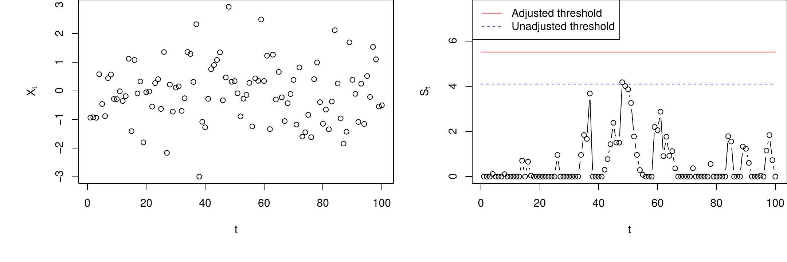
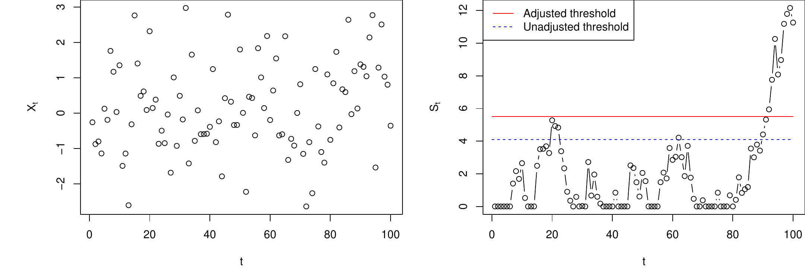

::: article
# Introduction {#sec:intro}

Control charts for statistical process monitoring are commonly used in a
variety of different areas like industrial process control, medicine,
finance, insurance, environmental science etc. See for instance
[@Stoumbos2000SoS], [@Woodall2006Tuo], [@Frisen2008FS],
[@SequentialAnalysis_26_2], and [@SequentialAnalysis_26_3] for an
overview.

A challenge in most practical applications of control charts is that the
in-control state of the process to be monitored needs to be estimated.
This introduces estimation error which needs to be accounted for. A
common convention in many applications has been to assume the in-control
distribution to be known and ignore the estimation error [e.g.
@Grigg2004oor; @Bottle2008Iin; @Biswas2008rCi; @Fouladirad2008Otu; @Gandy2010ram].
However, there is an increasing awareness that the estimation error
might have a detrimental effect on the performance of control charts and
many authors have addressed this for various specific charts [e.g.
@jones2002statistical; @jones2004rld; @Albers2004AEC; @Albers2005Ncf; @Albers2005EPF; @jensen2006epe; @Champ2007PoM; @Chatterjee2009Dcs; @Capizzi2009Bdo; @Zhang2011TSX; @Saleh2015DDS; @Zhang2015TEE].

[@Gandy2013gcp] presented a bootstrap based method for adjusting for
estimation error which applies to a wide variety of control charts and
different performance measures. The method can in particular be used to
give a guaranteed conditional in-control performance of the chart. A
typical application is to calculate an adjusted signal limit of a chart
to guarantee with high probability that the in-control average run
length or hitting probability is not below/above a specified value.
Theoretical properties and conditions needed for the method to apply are
worked out in [@Gandy2013gcp]. A similar bootstrap approach was also
briefly mentioned in [@Jones2012AEE] in a study of risk-adjusted CUSUM
charts.

We have developed an R package called
[*spcadjust*](https://CRAN.R-project.org/package=spcadjust)
[@Gandy2016pkg] which implements the bootstrap method for a number of
different charts, with different performance measures and both
parametric and non-parametric bootstrapping procedures. The package
covers the most common set-ups for Shewhart, CUSUM and EWMA charts,
including risk-adjusted charts. Moreover, it is easy for the user to add
further charts, data models and estimation procedures.

There exist several other R packages for control charts. The
[*surveillance*](https://CRAN.R-project.org/package=surveillance)
package [@Salmon2016mct] provides a variety of methods for monitoring,
simulation and visualization of temporal and spatio-temporal data. The
packages [*spc*](https://CRAN.R-project.org/package=spc)
[@Knoth2016spc], [*qcc*](https://CRAN.R-project.org/package=qcc)
[@Scrucca2004qcc], [*IQCC*](https://CRAN.R-project.org/package=IQCC)
[@Barbosa2014iqcc] and [*qcr*](https://CRAN.R-project.org/package=qcr)
[@Flores2016qcr] provide functions for calculating various performance
measures, signal limits, graphical displays etc. for a selection of
classical control charts. The
[*edcc*](https://CRAN.R-project.org/package=edcc) package [@Zhu2013edcc]
has functions for economic design of control charts, while the
[*MSQC*](https://CRAN.R-project.org/package=MSQC) package
[@SantosFernandez2013msqc] provides a tool kit for multivariate process
monitoring. However, none of these packages include methods for taking
into account the impact of estimation error on the performance of the
charts, which is the main novelty of the *spcadjust* package.

In the next section, we give a brief introduction to the problem and
describe the bootstrap approach for adjusting for estimation error. In
the two sections thereafter we first illustrate basic use of the
*spcadjust* package, then we describe details of the package and
illustrate more advanced use. In the last section, a real data example
is provided.

Stable versions of the package *spcadjust* are available on CRAN.
Development versions are available in an open git repository
(<https://bitbucket.org/agandy/spcadjust/>). We welcome contributions to
the functionality of the package.

# Adjusting for estimation error in control charts {#sec:adjusting}

Control charts are a set of statistical techniques for monitoring a
stream of data over time. A typical application is to monitor whether a
stream of measurements follows a certain distribution, often called the
in-control distribution, over time. If the distribution of the
measurements deviates from the in-control distribution in a certain way
the control chart should quickly detect this. In more advanced
situations, regression adjustments are needed, and the monitoring is
based on detecting deviations from the regression model.

In most common control charts like Shewhart, CUSUM and EWMA charts, a
function of the observations is plotted for each new observation and a
signal is given if this function crosses a certain threshold. Both the
parameters of the function and the threshold are in most cases
calculated according to estimates of the in-control distribution. This
implies that estimation error will affect the performance of the control
charts. For instance, measurement errors might lead to control charts
that give false alarms far too often.

We first give a motivating example, and then our bootstrap method for
handling estimation error is described.

## Motivating example {#sec:motivatingexample}

We consider an example with a CUSUM chart for monitoring changes in the
mean of a stream of normally distributed data. Assume first that we know
that the stream consists of independent observations $X_1,X_2,\dots$
following a $N(\mu,\sigma)$ distribution in the in-control situation,
and that we want to quickly detect if there is a change in the mean to
the out-of-control situation $\mu+\Delta$. A standard CUSUM chart for
this would be to plot $S_t$ versus $t$ where
$$\label{eq:CUSUMnormal}
 S_t=\max\left(0,S_{t-1}+\frac{X_t-\mu-\Delta/2}{\sigma}\right), 
 \quad S_0=0,   (\#eq:CUSUMnormal)$$
where the chart signals once $S_t>c$. The threshold $c$ is calculated to
give a certain performance of the chart if no change occurs. Often, $c$
is chosen to give a pre-specified in-control mean number of steps until
a false alarm (often called average run length, ARL). Thus the CUSUM
chart and the threshold $c$ should be calculated using the true
$N(\mu,\sigma)$ in-control distribution.

However, in practice, the true in-control distribution $N(\mu,\sigma)$
is usually unknown, but estimated based on $n$ past in-control
observations $X_{-n},\dots,X_{-1}$. For example, we can estimate the
in-control mean by $\hat \mu = \frac{1}{n}\sum_{i=-n}^{-1} X_i$ and the
in-control variance by
$\hat \sigma^2=\frac{1}{n-1}\sum_{i=-n}^{-1} (X_i-\hat \mu)^2$. The
CUSUM chart is then given by
$$S_t=\max\left(0,S_{t-1}+\frac{X_t-\hat \mu-\Delta/2}{\hat \sigma}\right),
\quad S_0=0,$$
which signals when $S_t>\hat{c}$ where $\hat c$ is calculated using the
estimated in-control distribution $N(\hat\mu,\hat\sigma)$.

Since the future in-control data come from the true in-control
distribution $N(\mu,\sigma)$ rather than the estimated distribution
$N(\hat\mu,\hat\sigma)$, the performance of the chart might be
substantially wrong, leading to more (or less) false alarms than
expected.

<figure id="fig:CUSUMMotExample">


<figcaption>Figure 1: CUSUM charts for the motivating example. Top row:
in-control data. Bottom row: data which switch to out-of-control from
observation 81. The left figures show the observed data streams, the
right the resulting CUSUM charts which were run with the estimated
parameters. Adjusted and unadjusted thresholds are
indicated.</figcaption>
</figure>

A typical application of our bootstrap method described in the next
subsections will be to calculate an adjustment to the naive threshold
estimate $\hat c$ such that a certain in control behavior of the chart
can be guaranteed with high probability.

As an illustration we generated $n=100$ past data from a $N(0,1)$
distribution giving estimates $\hat\mu=-0.028$, $\hat\sigma=\,0.921$. We
want to monitor for an increase in the mean of the distribution by
$\Delta=1$ and achieve an in-control ARL of $500$.

Assuming (incorrectly) that the estimated parameters are the true
parameters this would lead to a threshold of $\hat
c=\,4.1$. Our bootstrap method leads to an adjusted threshold of $5.5$,
calculated such that the ARL of $500$ is achieved with a probability of
$90$%.

The result of running the CUSUM chart with these estimated parameters on
a stream of $N(0,1)$ in-control data is illustrated in the top row of
Figure [1](#fig:CUSUMMotExample). There is a false alarm with the
unadjusted threshold, but not with the adjusted threshold.

In the bottom row of Figure [1](#fig:CUSUMMotExample) the same CUSUM
chart is run on data which are out of control from observation 81 and
onwards. There is only a slight delay in the detection of the
out-of-control situation with the adjusted threshold. Also, there are
two false alarms in the first 80 observations with the unadjusted
threshold.

## Homogeneous observations {#sec:homogeneousobservations}

In this section we describe our bootstrap procedure for situations with
homogeneous observations. Assume that in-control we have a stream of
independent observations $X_1,X_2,\dots$, following a distribution $P$.
A control chart is used to detect when observations are no longer coming
from $P$, also called an out of control situation, for instance a shift
in mean or variance.

To run such a chart, certain parameters, $\xi$, calculated from $P$ are
usually needed. However, in most applications the exact distribution $P$
is unknown, we only have an estimate of the distribution, and thus have
to run the chart with estimated parameters. In the example in the
previous section, the parameters needed to run the chart are
$\xi=(\mu,\sigma)$ and the unknown in-control distribution $P$ is
$N(\mu,\sigma)$.

Common performance measures for control charts are the ARL and the
hitting probability of the chart within a certain number of steps. These
depend both on the unknown $P$ as well as on the parameters $\xi$.
Indeed, let $\tau$ denote the time (observation number) at which a chart
gives a signal, e.g. the first time a CUSUM chart has a value above $c$.
The distribution of this stopping time $\tau$ depends on $P$ and $\xi$.
We can express the ARL as $ARL(P;\xi)=\mathbb{E}(\tau( \xi))$, where the
expectation is with respect to $P$. The probability of signaling within
$m$ time steps (for some finite $m>0$) can be expressed as
${hit}(P;\xi)=P(\tau( \xi)\leq m)$.

The signal limit $c$ is chosen to achieve a certain in-control
performance of the chart. For charts which signal when a threshold $c$
is crossed we can express this as follows.

-   $c_{ARL}(P;\xi)=\inf\{c>0:ARL(P;\xi)\geq\gamma\}$ for some
    $\gamma>0$, i.e. the threshold needed to give an in-control $ARL$ of
    $\gamma$.

-   $c_{hit}(P;\xi)=\inf\{c>0:hit(P;\xi)\leq\beta\}$ for some
    $0<\beta<1$, which is the threshold needed to give a false alarm
    probability of $\beta$.

Again, both $c_{ARL}$ and $c_{hit}$ depend on $P$ and $\xi$.

Let $\hat P$ and $\hat \xi=\xi(\hat P)$ denote the estimated
distribution and estimated parameters, estimated from past in-control
data $X_{-n},\dots,X_{-1}$. Since we have to run the chart with $\hat
\xi$ while future in-control data follow $P$ ideally we should use the
threshold $c_{ARL}(P;\hat \xi)$ or $c_{hit}(P;\hat \xi)$. These are
unknown since $P$ is unknown. Instead in practice
$c_{ARL}(\hat P;\hat \xi)$ or $c_{hit}(\hat P;\hat \xi)$ is often used,
but this may lead to performance substantially off from the nominal
performance.

The suggestion in [@Gandy2013gcp] is to calculate, by bootstrapping, an
adjusted threshold which with high probability will guarantee that the
in-control performance is not worse than the nominal value. For instance
to calculate an adjustment to $c_{ARL}(\hat P;\hat \xi)$ which with a
probability $1-\alpha$ guarantees that the true in-control $ARL$ is at
least as large as the nominal value.

To make a unified presentation of the bootstrap we let $q$ be a common
notation for quantities of interest like $c_{ARL}$ and $c_{hit}$, or
simple transformations such as $\log(c_{ARL})$ and $\log(c_{hit})$.
Further let $p_\alpha$ be a constant such that

$$P\left(q(\hat P;\hat\xi) - q(P;\hat\xi) >p_\alpha\right)=1-\alpha,$$
which implies the following bound on the quantity of interest
$$P\left(q(P;\hat\xi)< q(\hat P;\hat\xi)-p_{\alpha}\right)= 1-\alpha.$$
Since $P$ is unknown we cannot calculate $p_{\alpha}$, but an
approximation can be obtain by bootstrapping. Let $\hat P^\ast$ denote a
parametric or non-parametric bootstrap replicate of the estimated
in-control distribution $\hat P$, based on the same sample size $n$ as
$\hat P$, and let $\hat\xi^\ast=\xi(\hat P^\ast)$. Then we can
approximate $p_\alpha$ by $p^\ast_\alpha$ where
$$P\left(q(\hat P^\ast;\hat\xi^\ast)-q(\hat P;\hat\xi^\ast)>
  p^\ast_\alpha|\hat P\right)=1-\alpha.$$
Then an approximate upper bound which guarantees a certain performance
with an approximate probability of $1-\alpha$ is
$q(\hat P;\hat\xi)-p^\ast_{\alpha}$. We can also think of
$$\left(-\infty,q(\hat P;\hat\xi)-p^\ast_\alpha\right)$$
as a sort of one-sided (approximate) confidence interval for
$q(P;\hat\xi)$. The bootstrap distribution has to be approximated by
simulations, easily performed by generating $B$ bootstrap samples from
$\hat P$ and calculating $q(\hat P^\ast;\hat\xi^\ast)-q(\hat
P;\hat\xi^\ast)$ for each bootstrap sample. For further details,
including theoretical properties, we refer to [@Gandy2013gcp].

If we return to the example in the previous section and consider the
threshold needed to get a certain in-control $ARL$ value $\gamma$, we
adapt the above procedure with either $q=c_{ARL}$ or $q=\log (c_{ARL})$.
The latter is recommended as the log-transform usually improves the
precision [@Gandy2013gcp]. Then $B$ bootstrap samples of size $n$ are
generated from $\hat P$ and from these we calculate $\hat
P^{\ast}_1,\dots,\hat P^{\ast}_B$ and $\hat \xi^{\ast}_1,\dots,\hat
\xi^{\ast}_B$. With $q=\log (c_{ARL})$ we then calculate
$p_{\alpha}^{\ast}$ as the $1-\alpha$ empirical quantile of
$\log c_{ARL}(\hat
P^{\ast}_b;\hat\xi^{\ast}_b)-\log c_{ARL}(\hat P;\hat\xi^{\ast}_b)$,
$b=1,\dots,B$, and obtain the adjusted threshold $\exp(\log
c_{ARL}(\hat P;\hat\xi)-p_{\alpha}^{\ast})=c_{ARL}(\hat P;\hat\xi)\exp(-p_{\alpha}^{\ast})$.
With this adjusted threshold there is an approximate $1-\alpha$
probability that the actual $ARL$ of the charts is at least $\gamma$.

## Risk-adjusted charts {#sec:riskadjusted}

In many applications of control charts the units being monitored are
heterogeneous, for instance when monitoring data from human beings. To
make reasonable monitoring systems in such situations the explainable
part of the difference between units should be accounted for by
regression models. Charts based on regression models are often called
risk-adjusted, an overview of some such charts is found in
[@Grigg2004oor].

For risk-adjusted charts the regression model has to be estimated based
on past data, and the impact of estimation error thus has to be taken
into account. The bootstrap procedure outlined in the previous section
also applies to risk adjusted charts. Let the stream of observations now
be denoted $(Y_1,X_1),$ $(Y_2,X_2)$, $\ldots$, where $Y_i$ is a response
variable and $X_i$ a corresponding vector of covariates. Further let $P$
denote the joint distribution of $(Y_i,X_i)$. For regression models we
recommend to use a non-parametric bootstrap. Let $\hat P$ be the
empirical distribution which puts weight $1/n$ on each of the $n$ past
observations $(Y_{-n},X_{-n}),\dots,(Y_{-1},X_{-1})$. Then by resampling
from this $\hat P$ the bootstrap procedure also applies to a wide
variety of risk adjusted charts [@Gandy2013gcp].

As an example consider a CUSUM chart for a linear regression model.
Suppose that in-control $\mathbb{E}(Y_i|X_i)=X_i\beta$ (where the first
component of $X_i$ is 1) and we want to detect a change in the mean
response to $\mathbb{E}(Y_i|X_i)=\Delta+X_i\beta$ for some $\Delta>0$. For
linear regression models it is natural to base the monitoring on the
residuals of the model [@Horvath2004Mci]. A CUSUM to monitor changes in
the mean can for instance be defined by
$$S_t=\max\left(0, S_{t-1}+Y_t-X_t \beta - \Delta/2\right), \quad S_0=0,$$
which signals when $S_t\geq c$. In practice since $\beta$ and the
distribution of the residuals, $P_{\epsilon}$, are estimated the CUSUM
is run with $\hat \beta$ and a threshold calculated e.g. as
$c_{ARL}(\hat P_{\epsilon};\hat\beta)$. This might lead to an ARL far
off from the nominal [@Gandy2013gcp].

To account for the estimation error we can use the bootstrap procedure
from the previous section with e.g. $q=\log (c_{ARL})$ and
non-parametric bootstrapping as outlined above to calculate the adjusted
threshold $\exp(\log c_{ARL}(\hat
P_{\epsilon};\hat\beta)-p_{\alpha}^{\ast})=c_{ARL}(\hat
P_{\epsilon};\hat\beta)\exp(-p_{\alpha}^{\ast})$. Using this adjusted
threshold there is an approximate $1-\alpha$ probability that the actual
$ARL$ of the charts is at least as large as desired. Further
risk-adjusted charts are discussed in Section [*EWMA chart with linear
regression model*](sec:riskadjustedEWMA) and Section [*Application to
cardiac surgery data*](sec:dataexample).

## Other adjustments {#sec:otheradjustments}

So far we have focused on how to adjust the signal limit of the control
chart to achieve a certain performance with a high probability. In
practice that will be a typical application, but it is easy to change
focus to other quantities. For instance, instead of adjusting the
threshold to obtain a certain ARL we could instead fix the threshold and
calculate which ARL we with high probability at least will achieve. For
instance with Shewhart charts it is very common to use $c=3$ standard
deviations as signal limit, and if we with estimated parameters still
choose to stick with this limit we can use the bootstrap approach to
calculate a lower limit of the achieved ARL. In practice this is done by
defining the appropriate $q$-function and then run the general bootstrap
procedure as before. For the Shewhart example with fixed $c$ and focus
on $ARL$ the $q$ would simply be the $ARL$ or $\log(ARL)$. See
[@Gandy2013gcp] for details and Section [*Shewhart chart with estimated
in-control state*](sec:shewhart.estimated.incontrol) for an example.

Another variant which we consider further in Section [*Implementing a
new type of chart*](sec:newchart) is Shewhart charts with non-symmetric
signal limits for skew distributions. For such charts the signal limit
can be defined in terms of the quantiles corresponding to a certain tail
probability $\alpha$. Then we can via the bootstrap find the appropriate
adjustment of this $\alpha$ to achieve a certain performance with high
probability.

# Basic usage of the package {#sec:basics}

In this section we discuss how the package can be used for
pre-implemented chart types and data models. The framework provided in
the package can also easily be extended to work with other charts, data
models and/or estimation procedures as will be explained in
Section [*Details of the package and advanced usage*](sec:details).

An important basic structure of the package is that chart types and data
models are implemented in separate objects and in such a way that they
can be flexibly combined. The implemented chart types are the Shewhart
chart (`SPCShew`), the CUSUM chart (`SPCCUSUM`) and the EWMA chart
(`SPCEWMA`). Table [1](#tab:implementedmodels) lists the implemented
data models.

Calculation of charts and chart properties like thresholds, ARLs and
hitting probabilities are defined with the chart type object. Estimation
of chart parameters, the form and cdf of updates and the bootstrap
procedure are defined in the data model object. With updates we mean the
quantity added to the chart in each step. Parametric bootstraping is
used in the normal model, nonparametric bootstraping in all the other
pre-implemented models.

The parameter $\Delta$ in the updates in some of the data models listed
in Table [1](#tab:implementedmodels) specifies the out-of-control
situation for CUSUM charts, but should be set to the default value
`Delta = 0` for Shewhart and EWMA charts.

::: {#tab:implementedmodels}
  ------------------------------------------------------------------------------------------------------------------------------
  class name                      data model
  ------------------------------- ----------------------------------------------------------------------------------------------
  `"SPCModelNormal"`              normally distributed updates of the form $(X_t-\mu-\Delta/2)/\sigma$

                                  (Sections [*CUSUM chart with estimated in-control state*](sec:cusum.estimated.incontrol) and

                                   [*Shewhart chart with estimated in-control state*](sec:shewhart.estimated.incontrol))

  `"SPCModelNonparCenterScale"`   updates $(X_t-\mu-\Delta/2)/\sigma$, no distributional assumptions

                                  (Section [*CUSUM chart with estimated in-control state*](sec:cusum.estimated.incontrol))

  `"SPCModelNonpar"`              user defined updates, no distributional assumptions

  `"SPCModellm"`                  linear regression model with updates $Y_t-X_t \beta - \Delta/2$

                                  (Sections [*CUSUM chart with linear regression model*](sec:riskadjustedCUSUM) and

                                  [*EWMA chart with linear regression model*](sec:riskadjustedEWMA))

  `"SPCModellogregLikRatio"`      logistic regression model, likelihood ratio updates

                                  (Section [*Application to cardiac surgery data*](sec:dataexample))

  `"SPCModellogregOE"`            logistic regression model, observed minus expected

                                  updates
  ------------------------------------------------------------------------------------------------------------------------------

  : Table 1: Overview of pre-implemented data models.
:::

The main steps for basic usage of the package is to define a chart
object with the `new()` function and to calculate the properties of
interest with the `SPCproperty()` function. A generic description of
these functions is given below.

To define a chart object we need to specify the combination of chart
type and data model as follows:

``` r
chartgeneric <- new("Charttype", model = Datamodel(Delta = x),...)
```

Here `"Charttype"` should be one of `"SPCShew"`, `"SPCCUSUM"` or
`"SPCEWMA"` and `"Datamodel"` should be one of the class names listed in
Table [1](#tab:implementedmodels). Finally `x` should be 0 for Shewhart
and EWMA chart and set to the desired value for CUSUM charts.

The following function invokes the bootstrap procedure and calculate the
property of interest for the chart:

``` r
SPCproperty(data, nrep, property = "specifyproperty",chart = chartgeneric,
            params = list(specifyparameters), covprob=0.9, parallel=1,...)
```

Here `data` are the past observations (usually a vector) and `nrep` is
the number of bootstrap replications. Further, `specifyproperty`
specifies the property of interest, with choices `calARL`, `calhitprob`,
`ARL` and `hitprob`. The two first choices calculate a calibrated
threshold to achieve, with high probability, a desired ARL or a desired
hitting probability . Based on a specified choice of threshold, the two
last choices calculate the smallest ARL or the largest hitting
probability that is attained with high probability. Necessary parameters
are given in `specifyparameters` (depending on the property this
includes the desired ARL, the desired hitting probability or the
threshold). Finally, `covprob`, gives the desired coverage probability
$1-\alpha$ with a default of 90%. The bootstrap can be sped up by
parallel processing by specifying the number of cores to be used via the
`parallel` option.

Further functions and details are explained in the examples below. In
the two first subsections below we consider situations with homogeneous
observations, in the next subsections, we consider situations with
risk-adjusted charts.

## CUSUM chart with estimated in-control state {#sec:cusum.estimated.incontrol}

We now return to the motivating example in Section [*Motivating
example*](sec:motivatingexample). Recall that we want to run a CUSUM
chart of the form (\@ref(eq:CUSUMnormal)) to monitor for a change in the
mean in a stream of normally distributed data. We first define the chart
object by specifying chart type and data model.

``` r
> library(spcadjust)
> chart <- new("SPCCUSUM", model = SPCModelNormal(Delta = 1))
```

Here `"SPCCUSUM"` specifies that it should be a CUSUM chart, and
`SPCModelNormal(Delta = 1)` specifies that it is a model with normally
distributed updates of the form $(X_t-\mu-\Delta/2)/\sigma$ with
$\Delta=1$.

Next we generate $n=100$ past observations and use the function
`xiofdata` to calculate the estimated chart parameters $\hat\xi$.

``` r
> X <-  rnorm(100)
> xihat <- xiofdata(chart, X)
> str(xihat)

List of 3
 $ mu: num -0.0284
 $ sd: num 0.921
 $ m : int 100
```

Now we can use the function `SPCproperty()` to calculate the naive and
adjusted threshold:

``` r
> cal <- SPCproperty(data = X, nrep = 50, property = "calARL",
+             chart = chart, params = list(target = 500), covprob = 0.9,quiet = TRUE)
> cal
90 # CI: A threshold of 5.513 gives an in-control ARL of at least 500. 
Unadjusted result:  4.101 
Based on  50 bootstrap repetitions.
```

Here `property = "calARL"` specifies that the chart should be calibrated
to achieve a certain ARL, this ARL is specified to be 500
(`target = 500`) and the probability of attaining at least this ARL
specified to be 90% (`covprob = 0.9`). The adjusted threshold of 5.5 is
calculated using parametric bootstrapping with `nrep` replications
assuming normality of the observations. For real applications `nrep`
should of course be more than 50. If nonparametric bootstrapping is
preferred the model specification in the definition of the chart should
be replaced by `SPCModelNonparCenterScale()`.

If we rather would like to calibrate the chart according to a certain
hitting probability, for instance a hitting probability of 0.05 within
100 steps, this is achieved by specifying `property = "calhitprob"` and
`params = list(target = 0.05, nsteps = 100)`:

``` r
>  SPCproperty(data = X, nrep = 50, property = "calhitprob",
+              chart = chart, params = list(target = 0.05, nsteps=100), covprob = 0.9, 
+              quiet = TRUE)
90 # CI: A threshold of 7.137 gives an in-control false alarm probability
  of at most 0.05 within 100 steps. 
Unadjusted result:  5.285 
Based on  50 bootstrap repetitions.
```

The function `runchart` is used to run the chart on future data, and the
option `xi` specifies which parameters to use when running the chart:

``` r
> newX <- rnorm(100)
> S <- runchart(chart, newdata = newX, xi = xihat)
```

The following code produces the plots in the first row of
Figure [1](#fig:CUSUMMotExample), using the ARL calibrated threshold
calculated above:

``` r
> par(mfrow = c(1, 2), mar = c(4, 5, 0, 0))
> plot(newX, xlab = "t")
> plot(S, ylab = expression(S[t]), xlab = "t", type = "b", 
+      ylim = range(S, cal@res+2, cal@raw))
> lines(c(0,100), rep(cal@res, 2), col = "red")
> lines(c(0,100), rep(cal@raw, 2), col = "blue", lty = 2)
> legend("topleft", c("Adjusted threshold","Unadjusted threshold"),
+        col = c("red", "blue"), lty = 1:2)
```

## Shewhart chart with estimated in-control state {#sec:shewhart.estimated.incontrol}

Next we consider a two-sided Shewhart chart, assuming that all
observations are normally distributed. The in-control mean and standard
deviation are estimated from $n$ past in-control observations
$X_{-n},\dots,X_{-1}$. For new observations $X_1,X_2,\dots$ a two-sided
Shewhart chart is defined by
$$S_t=\frac{X_t-\hat \mu}{\hat \sigma},$$
which signals when $|S_t|>c$ for some threshold $c$. A common choice for
Shewhart charts is to set $c=3$, corresponding to three standard
deviations if the chart is run with the correct in-control mean and
standard deviation.

We first define the chart by

``` r
> chartShew <- new("SPCShew", model = SPCModelNormal(), twosided = TRUE)
```

and then generate $n=250$ past observations and estimate the chart
parameters:

``` r
> X <-  rnorm(250)
> xihat <- xiofdata(chartShew, X)
> str(xihat)
List of 3
 $ mu: num 0.0251
 $ sd: num 1.05
 $ m : int 250
```

If the Shewhart chart is run with the standard threshold $c=3$, we can
use the bootstrap method to calculate a lower limit for the actual ARL
of the chart by specifying `property = "ARL"` and
`params = list(threshold = 3)`:

``` r
> SPCproperty(data = X, nrep = 50, property = "ARL", chart = chartShew,
+             params = list(threshold = 3), quiet = TRUE)
90 # CI: A threshold of 3 gives an in-control ARL of at least 213.1. 
Unadjusted result:  370.4 
Based on  50 bootstrap repetitions.
```

A two-sided Shewhart chart for normally distributed data with true
parameters and a threshold of $c=3$ will correspond to an ARL of roughly
370. We can thus compute an adjusted threshold that with roughly 90%
probability results in an average run length of at least 370 in control:

``` r
> cal <- SPCproperty(data = X, nrep = 50, property = "calARL", chart = chartShew,
+                    params = list(target = 370), quiet = TRUE)
> cal
90 # CI: A threshold of 3.209 gives an in-control ARL of at least 370. 
Unadjusted result:  3 
Based on  50 bootstrap repetitions.
```

Finally we run the chart with new observations. The simulated new
observations are in-control for the first 100 observations, and then
there is a shift in the mean from observations 101 an onwards. The
corresponding plot is given in Figure [2](#fig:Shewhartexample).

``` r
> newX <- rnorm(150, mean = c(rep(0, 100), rep(2, 50)))
> S <- runchart(chartShew, newdata = newX, xi = xihat)
```

{#fig:Shewhartexample width="100%" alt="graphic without alt text"}

## CUSUM chart with linear regression model {#sec:riskadjustedCUSUM}

The set up is as described in Section [*Risk-adjusted
charts*](sec:riskadjusted), and with estimated regression coefficients
$\hat \beta$ the CUSUM is
$$S_t=\max\left(0,S_{t-1}+Y_t-X_t\hat\beta-\Delta/2 \right), \quad S_0=0.$$

The following generates a data set of past observations from the model
$\mathbb{E}(Y)=2+x_1+x_2+x_3$ with standard normal noise and distribution of the
covariate values as specified below.

``` r
> n <- 500
> Xlinreg <- data.frame(x1 = rbinom(n, 1, 0.4), x2 = runif(n, 0, 1), x3 = rnorm(n))
> Xlinreg$y <- 2 + Xlinreg$x1 + Xlinreg$x2 + Xlinreg$x3 + rnorm(n)
```

Next, we initialize the chart

``` r
> chartlinregCUSUM <- 
+   new("SPCCUSUM", model = SPCModellm(Delta = 1, formula = "y~x1+x2+x3"))
```

where `SPCModellm()` uses non-parametric bootstrapping as explained in
Section [*Risk-adjusted charts*](sec:riskadjusted). The estimated
parameters for running the chart, $\hat \beta$, are:

``` r
> xihat <- xiofdata(chartlinregCUSUM, Xlinreg)
> xihat
Call:
lm(formula = formula, data = P)

Coefficients:
(Intercept)           x1           x2           x3  
     2.0222       1.0360       1.0350       0.9711  
```

Next we find the threshold that with roughly 90% probability results in
an average run length of at least 100 in control.

``` r
> cal <- SPCproperty(data = Xlinreg, nrep = 50, property = "calARL",
+                 chart = chartlinregCUSUM, params = list(target = 100), quiet = TRUE)  
> cal
90 # CI: A threshold of 3.138 gives an in-control ARL of at least 100. 
Unadjusted result:  2.745 
Based on  50 bootstrap repetitions.
```

Finally, we run the chart with new observations that are in-control for
the first 100 observations and then switches to out-of-control. A plot
of the resulting CUSUM is given in Figure [3](#fig:CUSUMlinregexample).

``` r
> n <- 120
> newXlinreg <- data.frame(x1 = rbinom(n, 1, 0.4), x2 = runif(n, 0, 1),
+                          x3 = rnorm(n))
> outind <- c(rep(0, 100), rep(1, n-100))
> newXlinreg$y <- 
+    2 + newXlinreg$x1 + newXlinreg$x2 + newXlinreg$x3 + rnorm(n) + outind
> S <- runchart(chartlinregCUSUM, newdata = newXlinreg, xi = xihat)
```

{#fig:CUSUMlinregexample width="100%" alt="graphic without alt text"}

## EWMA chart with linear regression model {#sec:riskadjustedEWMA}

An EWMA chart based on the residuals of a linear regression model can be
defined by
$$M_t=\lambda (Y_t-X_t\beta)+(1-\lambda) M_{t-1},  \quad M_0=0,$$
where $\lambda$ is a smoothing parameter determining how to weight the
most recent observation versus the past data. We can now set up the
chart, calculate adjusted thresholds and run the chart on the new data
with estimated parameters in the same manner as for the CUSUM chart. The
only differences are that we have to specify `"SPCEWMA"`, `Delta = 0`
and a value of $\lambda$ when the chart is initialized.

``` r
> chartlinregEWMA <- new("SPCEWMA", model = SPCModellm(Delta = 0, 
+                        formula = "y~x1+x2+x3"), lambda = 0.1)  
> calEWMA <- SPCproperty(data = Xlinreg, nrep = 50, property = "calARL",
+                        chart = chartlinregEWMA, params = list(target = 100), quiet = TRUE)  
> calEWMA
90 # CI: A threshold of +/- 0.5337 gives an in-control ARL of at least 100. 
Unadjusted result:  0.496 
Based on  50 bootstrap repetitions.
> xihat <- xiofdata(chartlinregEWMA, Xlinreg)
> M <- runchart(chartlinregEWMA, newdata = newXlinreg, xi = xihat)
```

A plot of the resulting EWMA chart is given in
Figure [4](#fig:EWMAlinregexample).

{#fig:EWMAlinregexample width="100%" alt="graphic without alt text"}

Further usage of risk-adjusted charts will be demonstrated in
Section [*Application to cardiac surgery data*](sec:dataexample) where a
CUSUM for logistic regression will be explained and used.

# Details of the package and advanced usage {#sec:details}

A basic structure of the package is, as explained in the introduction of
Section [*Basic usage of the package*](sec:basics), a definition of two
types of objects. We will now look further into the details of these two
objects and how they can be used to add new charts, new data models and
other estimation procedures.

One object is an S3 class of type `"SPCDataModel"` that implements how
observed data are used to fit the model and how updates for the chart
are being computed. The second object is an S4 class of type
`"SPCchart"` which implements how these updates are converted into
charts and how the charts are being calibrated. The main advantage of
this separation into two different objects is that it reduces the amount
of redundancy in the code.

The package was originally developed with S4 classes only, to take
advantage of the more flexible method dispatch. However, to improve
performance, the data model classes, whose methods are called very
frequently, were switched to S3 classes.

## Bespoke data model

We first focus on how to generate a bespoke data model. For this one
needs to implement a class of type `"SPCDataModel"`. Every element of
the class has to consist of a list of the following functions:
`updates`, `getcdfupdates`, `Pofdata`, `resample`, `xiofP`, which have
to be of a specific form. The arguments generally have the following
meaning: `xi` denotes the parameter vector needed to create updates for
running the chart from observed data, `data` is observed data, `P` is a
data model.

-   `updates(xi,data)`: Returns updates for the chart using the
    parameter `xi` and the observed data `data`.

-   `Pofdata(data)`: Estimates a probability model from the data.

-   `xiofP(P)`: Computes the parameter `xi` needed to compute updates
    from an (estimated) probability model `P`.

-   `resample(P)`: Generates a new data set from the probability model
    `P`.

-   `getcdfupdates(P,xi)`: Returns the cumulative distribution function
    (CDF) of updates with data generated from the probability model `P`
    and updates computed using the parameter `xi`.

In the following we give some examples.

## Robust estimation

Consider again the example discussed in Sections [*Motivating
example*](sec:motivatingexample) and [*CUSUM chart with estimated
in-control state*](sec:cusum.estimated.incontrol) of a CUSUM chart which
assumes a normal distribution of the observations with unknown mean and
standard deviation. We now demonstrate how to change the estimators to
use the median the mean absolute deviation (MAD) instead of using the
mean and the sample standard deviation. Using these robust estimators
could be desirable if there could be outliers present in the past
in-control data.

For this we only need to override one function of the existing data
model `"SPCModelNormal"`, the method `Pofdata` that estimates the
parameters. The format of the input and output for the new `Pofdata`
function needs to be unchanged. The following code first list the old
function and then overrides it with the new.

``` r
> model <- SPCModelNormal(Delta = 1)
> model$Pofdata
function (data) 
{
    list(mu = mean(data), sd = sd(data), m = length(data))
}
> model$Pofdata <- function(data){
+       list(mu = median(data), sd = mad(data), m = length(data))
+ }
```

Properties of this chart can then be computed as before:

``` r
> X <-  rnorm(100)
> chartrobust <- new("SPCCUSUM", model = model)
> SPCproperty(data = X, nrep = 50, property = "calARL",
+             chart = chartrobust, params = list(target = 100), quiet = TRUE)
90 # CI: A threshold of 4.162 gives an in-control ARL of at least 100. 
Unadjusted result:  2.987 
Based on  50 bootstrap repetitions.
```

## Parametric exponential CUSUM chart

In this example we illustrate how to construct a CUSUM chart that
assumes that the observations are coming from an exponential
distribution with unknown rate $\lambda$ in control. Again, only the
data model needs to be defined, but now all functions are needed from
scratch. I.e. we need to define all the functions `updates`, `Pofdata`,
`xiofP`, `resample` and `getcdfupdates`. The basic CUSUM chart class
"SPCCUSUM" will be used without changes.

The updates for a CUSUM chart can in general situations be based on the
log likelihood ratio between an out-of-control model and the in-control
model [@hawkins1998csc]. I.e. the CUSUM can be written
$$S_t=\max\left(0,S_{t-1}+R_t \right), \quad S_0=0,$$
where the update $R_t$ is the log likelihood ratio for observation $t$.
Suppose that we want to detect a change of the rate to $\lambda\Delta$
for some given $\Delta>0$, $\Delta\neq 1$. To define the updates, we
need to compute the log likelihood ratio between the out-of-control and
the in-control model for an observation $X_t$, which gives
$$R_t=\log\left(
  \frac{\lambda\Delta\exp(-\lambda\Delta X_t)}{\lambda\exp(-\lambda X_t)}
\right)
=\log(\Delta)-\lambda(\Delta-1)X_t,$$
defining the function `updates`.

To define the data model the CDF of these updates must also be computed.
This can be done in closed form, but requires distinguishing the case
$\Delta>1$ and $\Delta<1$ and taking into account that the rate
parameter used in the updates typically differs from the true rate
parameter. Let $\hat\lambda$ be the rate parameter used in the updates
(typically an estimated parameter) and $\lambda$ be the true parameter.
Then the cdf (conditional on the value of $\hat\lambda$) is
$$P(\log(\Delta)-\hat\lambda(\Delta-1)X_i\leq x)
= \left\{ \begin{array}{ll}
              1-\exp(-\lambda(x-\log(\Delta))/(\hat\lambda(1-\Delta)) 
              &  \;\; \mbox{for } \Delta<1 \\
              \exp(-\lambda(\log(\Delta)-x)/(\hat\lambda(\Delta-1)) 
              & \;\; \mbox{for } \Delta>1, 
                  \end{array}
          \right.$$
which needs to be implemented in `getcdfupdates`. We decide to use
parametric resampling of the data (`resample`) and we decide to estimate
the parameter $\lambda$ based on the past observations
$X_{-n},\dots,X_{-1}$ using the maximum likelihood estimator
$\hat\lambda=n/\sum_{i=1}^nX_{-i}$.

The following code implements this.

``` r
> SPCModelExponential = function(Delta = 1.25){
+   structure(list(
+     Pofdata = function(data){
+         list(lambda = 1/mean(data), n = length(data))
+     },
+     xiofP = function(P) P,
+     resample = function(P) rexp(P$n, rate = P$lambda),
+     getcdfupdates = function(P, xi) {
+       if (Delta<1)
+         function(x) 
+           pmax(0, 1-exp(-P$lambda*(x-log(Delta))/(xi$lambda*(1-Delta))))
+       else
+          function(x) 
+            pmin(1, exp(-P$lambda*(log(Delta)-x)/(xi$lambda*(Delta-1))))
+     },
+     updates = function(xi, data) log(Delta)-xi$lambda*(Delta-1)*data
+     ), class = "SPCDataModel")
+ }
```

Next, we put this into practice. First we initiate the chart.

``` r
> ExpCUSUMchart <- new("SPCCUSUM", model = SPCModelExponential(Delta = 1.25))
```

The following creates some past observations and compute the threshold
needed to achieve an ARL of 1000.

``` r
> X <- rexp(500)
> cal <- SPCproperty(data = X, nrep = 50, property = "calARL", chart = ExpCUSUMchart,
+             params = list(target = 1000), covprob = 0.9, quiet = TRUE) 
> cal
90 # CI: A threshold of 4.054 gives an in-control ARL of at least 1000. 
Unadjusted result:  3.165 
Based on  50 bootstrap repetitions.
```

Finally, we generate some new data and make a CUSUM plot with thresholds
which is displayed in Figure [5](#fig:expexample).

{#fig:expexample width="100%" alt="graphic without alt text"}

## Implementing a new type of chart {#sec:newchart}

We now discuss the chart model and how to implement new charts. Every
chart is an S4 class derived from the class `"SPCchart"`. It has one
slot, `model`, which contains the data model to be used with the chart.
The main method that needs to be implemented is the method `getq`, which
computes desired properties of a given control chart. It receives two
arguments: which property to report (a string, e.g. `ARL`, `hitprob`,
`calARL`, `calhitprob`) and additional parameters for this property,
e.g. a threshold when computing the ARL (property `ARL`), a threshold
and a number of steps when computing hitting probabilities (property
`hitprob`), a desired ARL when calibrating the threshold (property
`calARL`).

We now give one example of how to implement a new chart. Suppose the
in-control distribution is assumed to have a distribution with
continuous cdf $F$, which does not need to be symmetric. Then we can
define a Shewhart type chart which signals if an observation $X$ is in
the upper $\alpha/2$ or lower $\alpha/2$ quantile for a given threshold
$\alpha>0$, i.e. if
$$X\leq F^{-1}(\alpha/2)=f_{\alpha/2} \text{ or } X\geq F^{-1}(1-\alpha/2)=f_{1-\alpha/2}.$$
This can be termed a Shewhart chart with asymetric control limits
[@Chen2010Comp].

The main work in implementing a chart is implementing functions that
compute properties of the chart (e.g. ARL in control, threshold needed
to give a certain ARL or hitting probabilities within certain steps).
These properties need to be computed given the parameter that is used
for running the chart (`xi`) and given the distribution of the
observations (`P`).

In this example we implement two methods: one for computing the ARL
(`ARL`) and one for computing the $\alpha$ needed to give a certain ARL
(`calARL`). The ARL for the Shewhart chart with asymetric control limits
run with estimated parameters will be
$$\frac{1}{P(X\leq \hat f_{\alpha/2})+P(X\geq \hat f_{1-\alpha/2})}
=\frac{1}{F(\hat f_{\alpha/2})+1-F(\hat f_{1-\alpha/2})},$$
and in the implementation below we make a log transform of this to
increase the accuracy of the bootstrap. To implement the property
`calARL`, the $\alpha$ needed to achieve a certain ARL is found by a
numerical search using the above expression (we have implemented this
with ad hoc choices for the boundaries of the numeric search). A logit
transform is here used in the implementation to improve the bootstrap.

``` r
> setClass("SPCShewAsym", contains = c("SPCchart"))
> setMethod("getq", signature = "SPCShewAsym", function(chart, property, params){
+   if (property == "calARL"){
+     list(
+         q = function(P, xi){
+           pobs <- function(alpha)(
+               getcdfupdates(chart, xi = xi, P = P)(xi$quant(alpha/2))
+               +(1-getcdfupdates(chart, xi = xi, P = P)(xi$quant(1-alpha/2))))  
+           res <- uniroot(function(x) params$target-(1/pobs(x)),
+                          lower = 1e-7,upper = 0.4)$root 
+           as.double(log(res/(1-res)))
+         },
+         trafo = function(x) exp(x)/(1+exp(x)),
+         lowerconf = FALSE,
+         format = function(res)
+         paste("A threshold of alpha=", format(res, digits = 4),
+               " gives an in-control ARL of at least ",
+               params$target, ".", sep = "", collapse = "")        
+         )
+   }else if (property == "ARL"){
+     list(
+       q = function(P, xi){
+         -log(getcdfupdates(chart, xi = xi, P = P)(xi$quant(params$alpha/2))
+              +(1-getcdfupdates(chart, xi = xi, P = P)(xi$quant(1-params$alpha/2)))
+              )}, 
+       trafo = function(x) exp(x),
+       lowerconf = FALSE,
+       format = function(res)
+         paste("A threshold defined by alpha=", params$alpha,
+               " gives an in-control ARL of at least ",
+               format(res, digits = 4), ".", sep = "",collapse = "")
+         )
+   }else stop("property ", property, " not implemented.")
+ })
[1] "getq"
```

Now we want to use this chart for the example of a gamma distribution.
For this we need to implement a basic data model, which uses the
observations directly as updates. We estimate the parameter of the gamma
distribution via the method of moments (`Pofdata`). To run the chart we
need the quantile function to calculate the estimates of the quantiles
$f_{\alpha/2}$ and $f_{1-\alpha/2}$ (this appears in `xiofP`).
Resampling is again parametric resampling under the assumed Gamma
distribution (`resample`).

``` r
> X <- rgamma(100, scale = 3, shape = 2)
> modGammaBasic = structure(
+     list(
+         Pofdata = function(data){
+             list(scale = var(data)/mean(data),
+                  shape = mean(data)^2/var(data),
+                  n = length(data))
+         },
+         xiofP = function(P){
+             res <- P;
+             res$quant <- function(alpha) 
+               qgamma(alpha, shape = P$shape, scale = P$scale);
+             res
+         },
+         resample = function(P) {
+             rgamma(P$n, shape = P$shape, scale = P$scale)
+         },            
+         getcdfupdates = function(P, xi) {
+             function(x) pgamma(x, shape = P$shape, scale = P$scale)
+         },
+         updates = function(xi, data) data
+         ),
+     class = "SPCDataModel")
> chartAsym <- new("SPCShewAsym", model = modGammaBasic)
> SPCproperty(data = X, nrep = 50, chart = chartAsym,
+             property = "ARL", params = list(alpha = 0.01), quiet = TRUE)
90 # CI: A threshold defined by alpha=0.01 gives an in-control ARL of at
  least 34.54. 
Unadjusted result:  100 
Based on  50 bootstrap repetitions.
> SPCproperty(data = X, nrep = 50,
+             property = "calARL", chart = chartAsym,
+             params = list(target = 100), quiet = TRUE)
90 # CI: A threshold of alpha=0.002869 gives an in-control ARL of at least
  100. 
Unadjusted result:  0.009998 
Based on  50 bootstrap repetitions.
```

To show the advantage of the modular setup we now modify the data model
to assume that the data is coming from an exponential distribution, in
other words that the shape parameter of the gamma distribution is 1. We
just need to redefine the function `PofData` to accomplish this.

``` r
> modExp = modGammaBasic
> modExp$Pofdata <- function(data){
+   list(scale = mean(data),
+        shape = 1,
+        n = length(data))
+ }
> chartAsymExp <- new("SPCShewAsym", model = modExp)
> X <- rexp(100)
> SPCproperty(data = X, nrep = 50, chart = chartAsymExp,
+             property = "ARL", params = list(alpha = 0.01), quiet = TRUE)
90 # CI: A threshold defined by alpha=0.01 gives an in-control ARL of at
  least 84.08. 
Unadjusted result:  100 
Based on  50 bootstrap repetitions.
> SPCproperty(data = X, nrep = 50,
+             property = "calARL", chart = chartAsymExp,
+             params = list(target = 100), quiet = TRUE)
90 # CI: A threshold of alpha=0.007553 gives an in-control ARL of at least
  100. 
Unadjusted result:  0.009998 
Based on  50 bootstrap repetitions.
```

# Application to cardiac surgery data {#sec:dataexample}

In this section we illustrate use of the package with an application to
a data set on the outcome of cardiac surgery from a UK centre for
cardiac surgery over the period 1992-1998. These data were first
analysed by [@Steiner2000Msp] and have later been used for illustration
by several authors [e.g. @Sego2009Rmo; @Jones2012AEE; @Zhang2015TEE]. A
random subset of these data with some random noise added is available in
the data frame `cardiacsurgery` in *spcadjust*. In this data frame the
date of surgery, a surgeon number, the time until death if the patient
died during the follow up time and the Parsonnet score of the patient is
given. The Parsonnet score is a well established scoring system in
cardiac surgery which combines a number of risk factors into a risk
score for the patient. The data frame contains 5595 cases.

``` r
> data(cardiacsurgery)
```

Like [@Steiner2000Msp] we will focus on the 30-day post-operative
mortality rate and use a logistic regression model with Parsonnet score
as covariate for taking into account the differences in risk between
patients, and use a CUSUM for monitoring.

## CUSUM for logistic regression models {#sec:CUSUMLogistic}

We first describe the general set up for CUSUM monitoring with logistic
regression models and then return to the cardiac surgery example. Assume
we have $n$ past in-control data
$(Y_{-n},X_{-n}),\ldots,(Y_{-1},X_{-1})$, where $Y_i$ is a binary
response variable and $X_i$ is a corresponding vector of covariates.
Suppose that in control $\mbox{logit}(\mbox{P}(Y_i=1|X_i))=X_i\beta$. A
maximum likelihood estimate $\hat\beta$ is obtained based on the past
data.

For detecting a change to
$\mbox{logit}(\mbox{P}(Y_i=1|X_i))=\Delta+X_i\beta$, a CUSUM chart based
on the cumulative sum of log likelihood ratios of the out-of-control
versus in-control model can be defined by [@Steiner2000Msp]
$$S_t=\max\left(0, S_{t-1}+R_t\right), \quad S_0=0,$$
where
$$\exp(R_t)=\frac{\exp(\Delta+X_t\beta)^{Y_t}/(1+\exp(\Delta+X_t\beta))}{\exp(X_t\beta)^{Y_t}/(1+\exp(X_t\beta))}
=\exp(Y_t\Delta)\frac{1+\exp(X_t\beta)}{1+\exp(\Delta+X_t\beta)}.$$
Like in the linear regression case we apply non-parametric bootstrap as
described in Section [*Risk-adjusted charts*](sec:riskadjusted).

## Cardiac surgery data

The two first years of data, containing 1769 cases, are used for
estimating the parameters of the logistic regression model. The effect
of the Parsonnet score turns out to be non-linear on the logit scale,
applying a square root transform of the score sorts out this. We thus
set up data for estimating the chart parameters (phase I sample) and for
running the chart (phase II sample) as follows:

``` r
>    #Use dead within 30 days as response
> dead30 <- as.numeric(cardiacsurgery$time <= 30)
>    #Use the two first years of data as phase I sample
> phaseone <- cardiacsurgery$date <= 730
> estdata <-data.frame(y = dead30[phaseone],
+                      x = sqrt(cardiacsurgery$Parsonnet[phaseone])) 
>    #Use the five last years of data as phase II sample
> phasetwo <- !phaseone
> rundata <- data.frame(y = dead30[phasetwo],
+                       x = sqrt(cardiacsurgery$Parsonnet[phasetwo]),
+                       z = cardiacsurgery$surgeon[phasetwo],
+                       year = (cardiacsurgery$date[phasetwo]-730)/365) 
```

Next we set up charts for monitoring against roughly a doubling and a
halving of the mortality rate, respectively. With a baseline rate of
6.1% this corresponds to $\Delta=0.75$ and $\Delta=-0.75$.

``` r
> chartlogregd <-
+   new("SPCCUSUM", model = SPCModellogregLikRatio(Delta = 0.75, formula = "y~x")) 
> chartlogregh <-
+   new("SPCCUSUM", model = SPCModellogregLikRatio(Delta = -0.75, formula = "y~x")) 
```

For calculating the thresholds we specify an in control ARL of
$10\,000$, i.e. a false alarm should on average only occur once per
$10\,000$ procedures.

``` r
> cald <- SPCproperty(data = estdata, chart = chartlogregd, property = "calARL",
+                     nrep = 50, params = list(target = 10000, gridpoints = 250), 
+                     parallel = Inf) 
> cald
90 # CI: A threshold of 6.157 gives an in-control ARL of at least 10000. 
Unadjusted result:  5.065 
Based on  50 bootstrap repetitions.
> calh <- SPCproperty(data = estdata, chart = chartlogregh, property = "calARL",
+                     nrep = 50, params = list(target = 10000, gridpoints = 250), 
+                     parallel = Inf) 
> calh
90 # CI: A threshold of 6.271 gives an in-control ARL of at least 10000. 
Unadjusted result:  4.469 
Based on  50 bootstrap repetitions.
```

The option `parallel = Inf` speeds up the bootstrap, but this option
must be skipped if the code is run in an environment which does not
support parallel processing.

{#fig:CUSUMcardiacincrease
width="100%" alt="graphic without alt text"}

{#fig:CUSUMcardiacdecrease
width="100%" alt="graphic without alt text"}

Assuming that the distribution of Parsonnet scores is roughly the same
for the patients each surgeon receives, and that the distribution
remains approximately the same in the remainder of the period as in the
first two years, the thresholds calculated above can be used for running
individual charts for each of the surgeons. Notice that in such a
setting where several charts are run with the same estimated parameters
a threshold adjustment which achieves a guaranteed conditional
performance is particularly relevant [@Gandy2013gcp].

The resulting CUSUM plots for four of the surgeons are shown in
Figures [6](#fig:CUSUMcardiacincrease) and
[7](#fig:CUSUMcardiacdecrease). In
Figures [6](#fig:CUSUMcardiacincrease) the CUSUM for the second surgeon
starts to increase after a while and passes both the unadjusted and the
adjusted threshold. This could e.g. be due to this surgeon starting to
receive more difficult cases, not sufficiently accounted for by the
adjustment for Parsonnet score.

For the monitoring against decreased mortality in
Figures [7](#fig:CUSUMcardiacdecrease) there is a signal for one of the
surgeons, indicating better survival than explained by the adjustment
for Parsonnet score. The CUSUM for the third surgeon crosses the
unadjusted threshold, but not the adjusted and is thus not regarded as a
true signal.
:::
