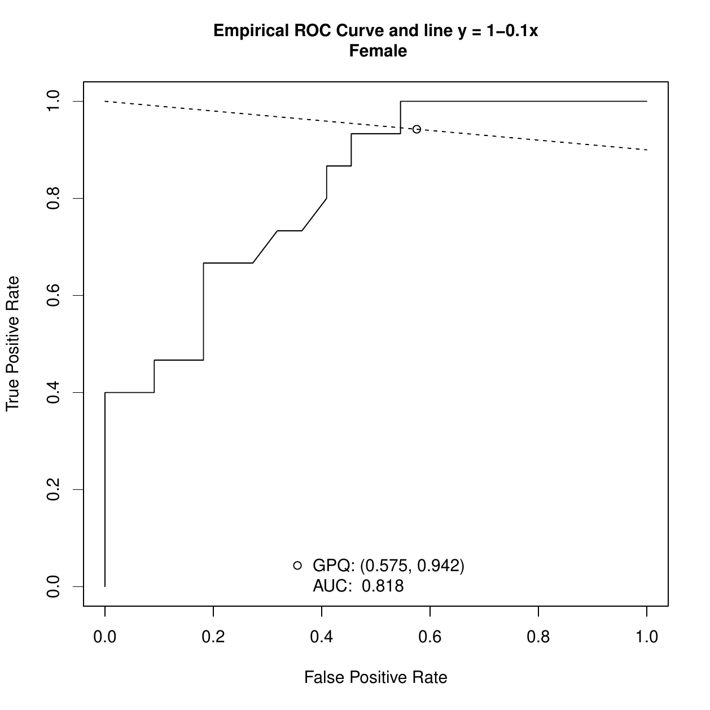
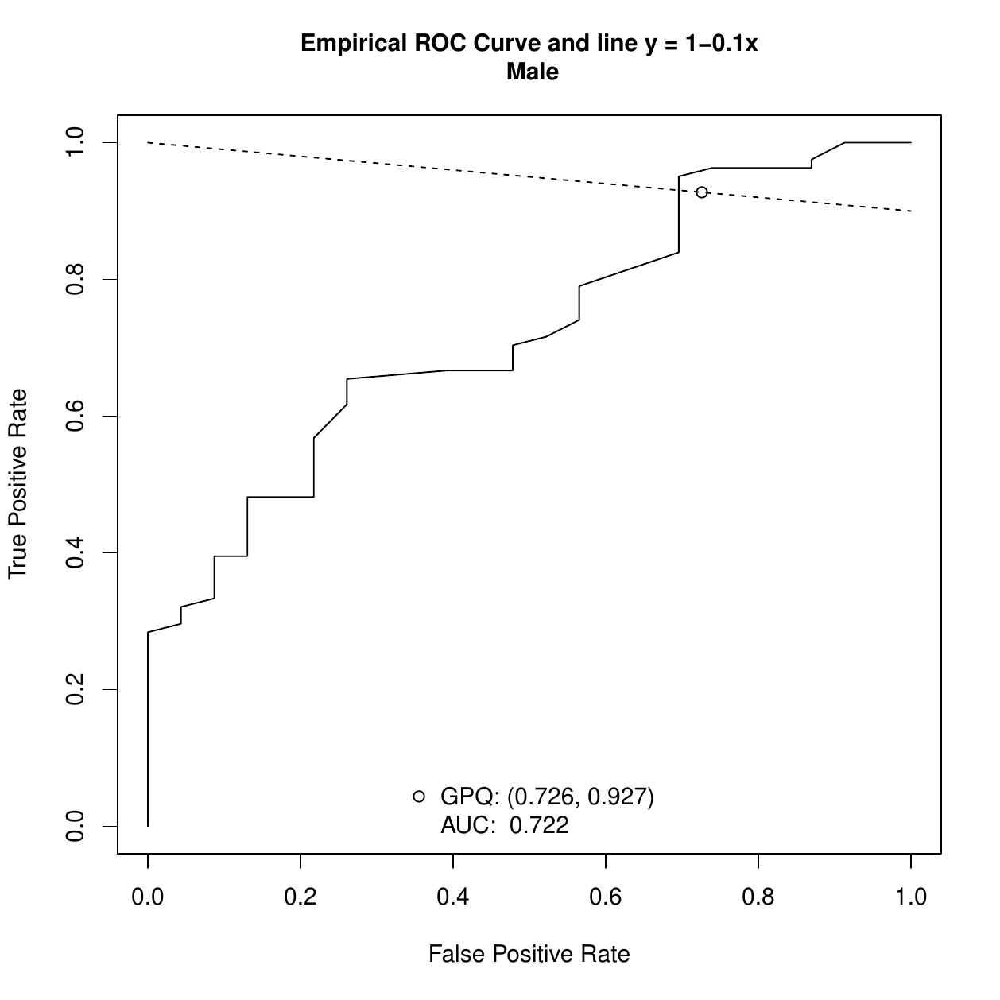

::: article
# Introduction

The classification of cases and controls is a common task in several
fields. For example, it is conducted in the atmospheric sciences
(rainy/non rainy day), finance (good/not good payer), sociology
(good/not good citizen), industry (product of good/poor quality),
computing science (spam/non-spam) or health sciences (healthy/diseased),
among others. However, in this paper we will focus on the latter
example, where we will be interested on the classification of
individuals as healthy or diseased using a continuous biomarker or
diagnostic test that will be based on a cutoff point or discrimination
value $c$. If we suppose, without loss of generality, that high test
values are associated with the disease under study, individuals with a
diagnostic test value equal to or higher than $c$ are classified as
diseased (positive test) and individuals with a value lower than $c$ are
classified as healthy (negative test). The test can classify a diseased
patient incorrectly, that is, a false negative decision, or detect a
patient as diseased when his (or her) true status is healthy (a false
positive misclassification). So, for each cutoff point $c$, it is
necessary to quantify these errors to check the validity of the
diagnostic test in clinical practice. In a similar way, the test can
correctly classify a diseased patient (a true positive decision) or a
healthy patient (a true negative decision). For each cutpoint $c$, the
sensitivity and specificity measures of the accuracy of the diagnostic
test can be defined from these correct decisions. The sensitivity ($Se$)
is the probability of a true positive decision, that is, the probability
of correctly classifying a diseased patient (true positive rate) and the
specificity ($Sp$) is the probability of a true negative decision (true
negative rate), that is, the probability of correctly classifying a
healthy individual. Similarly, the probabilities of the incorrect
classifications are defined as $1-Se$ (false negative rate) and $1-Sp$
(false positive rate).

Considering $Se$ versus $1-Sp$ for all possible values of $c$, a curve
is obtained. This curve is called the Receiver Operating Characteristic
(ROC) curve [@metz:1978; @swetsswets:1979; @swetspickett:1982] and it is
a graphical global measure of the diagnostic accuracy of a continuous
diagnostic test, independent of the cutpoint and the disease prevalence.
In addition, it serves as a guide when selecting optimal cutoffs and as
a measure of the overlapping of the test values between healthy and
diseased populations. Numerical indexes defined from ROC curves are
often used to summarize the accuracy of a diagnostic test. For instance,
the area under the curve (AUC) [@bamber:1975; @swets:1979] is the most
commonly used and it takes values between 0.5 (the AUC value of an
uninformative test, the same as a random prediction) and 1 (the AUC
value of a perfect test that classifies correctly all individuals,
either healthy or diseased). The AUC is equal to the Mann-Whitney $U$
statistic for comparing two distributions. Both of them can be
interpreted as the probability that the diagnostic value of a randomly
chosen diseased individual will be higher than the diagnostic value of a
randomly chosen healthy one [@hanley:1982].

A key question in clinical practice is to find a cutpoint that "best"
discriminates between patients with and without the disease. However,
one cannot talk in absolute terms of a "best choice". This is the reason
why several criteria for selecting optimal cutpoints have been proposed
in the literature depending on the ultimate goal of such selection [see
@youden:1950; @feinstein:1975; @metz:1978; @schafer:1989; @vermontetal:1991; @greiner:1995; @pepe:2003
for example]. One of the best-known methods is based on selecting the
cutpoint that provides the same value for the sensitivity and
specificity. This point is known as the equivalence or symmetry point
[@greiner:1995; @defreitasetal:2004; @adlhochetal:2011]. Graphically, it
corresponds with the operating point on the ROC curve that intersects
the perpendicular to the positive diagonal line, that is, $y = 1-x,$
where $x$ is the false positive rate. The symmetry point can also be
seen as the point that maximizes simultaneously both types of correct
classifications [@riddlestratford:1999; @gallopetal:2003], that is, it
corresponds to the probability of correctly classifying any subject,
whether it is healthy or diseased
[@jimenezvalverde:2012; @jimenezvalverde:2014]. Additionally, the
incorporation of costs for the misclassification rates in the estimation
of optimal cutpoints is crucial for evaluating not only the test
accuracy but also its clinical efficacy, although this aspect is not
taken into account most of the times. So, an interesting generalization
of the equivalence or symmetry point, $c_S,$ that takes into account the
costs associated to the false positive and false negative
misclassifications, $C_{FP}$ and $C_{FN}$, respectively, is the
generalized equivalence point or generalized symmetry point, $c_{GS}$,
that satisfies the following equation:
$$\begin{aligned}
 \label{cGS}
\rho (1-Sp(c_{GS})) = (1-Se(c_{GS})),
\end{aligned}   (\#eq:cGS)$$
where $\rho = \frac{C_{FP}}{C_{FN}}$ is the relative loss (cost) of a
false-positive decision as compared with a false-negative decision [see
@lopezratonetal:2016 for more details]. Similarly to the symmetry point,
this cost-based generalization is obtained by intersecting the ROC curve
and the line $y = 1-\rho x,$ where $x$ is the false positive rate.
Obviously, when $\rho = 1$ in Equation \@ref(eq:cGS), the generalized
symmetry point yields the traditional symmetry point. The reader can see
some medical examples, that have taken into account the
misclassification costs in their ROC analysis, in the review conducted
by [@cantor:1999] where the Cost$/$Benefit (C$/$B) ratio is discussed
(C$/$B$= \frac{1}{\rho}$). Additionally, [@subtil:2015] include some
common values for the C$/$B ratio (C$/$B $= 2, 5, 10, 100$). High values
of C$/$B ratio mean that it is considered more harmful not to treat a
diseased individual than to treat a healthy one.

Two statistical approaches have been recently introduced in the
literature [@lopezratonetal:2016] to obtain point estimates and
confidence intervals for the generalized symmetry point and its
associated sensitivity and specificity measures, a parametric method
based on the Generalized Pivotal Quantity (GPQ) under the assumption of
normality [@weerahandi:1993; @weerahandi:1995; @laietal:2012], and a
nonparametric method based on the Empirical Likelihood (EL) methodology
without any parametric assumptions
[@thomasgrunkemeier:1975; @molaneslopezleton:2011].

The availability of software for estimating optimal cutpoints in a
user-friendly environment is very important and necessary for
facilitating, mainly to the biomedical staff, the selection of optimal
cutpoints in clinical practice. There are several packages in R to carry
out this task, such as
[*PresenceAbsence*](https://CRAN.R-project.org/package=PresenceAbsence)
[@freemanmoisen:2008],
[*DiagnosisMed*](https://CRAN.R-project.org/package=DiagnosisMed)
[@brasil:2010], [*pROC*](https://CRAN.R-project.org/package=pROC)
[@robinetal:2011] and
[*OptimalCutpoints*](https://CRAN.R-project.org/package=OptimalCutpoints)
[@lopezratonrodriguezalvarez:2014; @lopezratonetal:2014]. However, these
packages only consider the classical non-parametric empirical method for
estimating optimal cutpoints and accuracy measures, that is, none of
them take into account recent methodology introduced in ROC analysis
such as the GPQ and EL approaches above-mentioned
[@molaneslopezleton:2011; @laietal:2012].

In this paper we present
[*GsymPoint*](https://CRAN.R-project.org/package=GsymPoint), a package
written in R for estimating the generalized symmetry point
[@lopezratonetal:2015], which is freely available from the Comprehensive
R Archive Network (CRAN) at
<http://CRAN.R-project.org/package=GsymPoint>. Specifically, this
package enables end-users to obtain point estimates and
$100(1-\alpha)\%$ confidence intervals (with $\alpha$ the signification
level) for the cost-based generalization of the symmetry point,
$c_{GS}$, and its associated sensitivity and specificity measures,
$Se(c_{GS})$ and $Sp(c_{GS}),$ by means of the two statistical
approaches pointed out above, the GPQ and EL approaches, that turn out
to be more efficient than the empirical one. Therefore, we take into
account in the estimation process when normality can be assumed, and we
consider one of the most widely used criteria for selecting optimal
cutpoints in clinical practice, the criterion that generalizes the
method where the sensitivity and specificity indexes are the same,
taking into account the misclassification costs, a very important issue
when selecting the optimal cutpoint in a specific clinical setting. In
addition, since the test accuracy can be influenced by specific
characteristics such as the patient's age or gender, or the disease
severity [@pepe:2003], the *GsymPoint* package allows the computation of
the generalized symmetry point for each level of a given categorical
covariate. On one hand, the numerical output of *GsymPoint* includes the
generalized symmetry point and its associated sensitivity and
specificity indexes with their corresponding $100(1-\alpha)\%$
confidence intervals. On the other hand, based on the graphical
interpretation of the generalized symmetry point, the graphical output
shows the empirical ROC curve and the line $y = 1-\rho x$.

The rest of paper is organized as follows. In Section [2](#methods), we
briefly review the two methods included in our *GsymPoint* package for
obtaining point estimates and confidence intervals for the generalized
symmetry point and its sensitivity and specificity measures. In Section
[3](#package), we describe the general use of this package, describing
the most important functions. In Section [4](#illustration), we
illustrate the practical application of the package using three real
biomedical datasets on melanoma, prostate cancer, and coronary artery
disease. Finally, in Section [5](#discussion) we conclude with a
discussion and some interesting future extensions.

# Generalized symmetry point estimating methods {#methods}

In this section we briefly explain the two methods included in the
*GsymPoint* package for estimating and constructing confidence intervals
for the generalized symmetry point $c_{GS}$ and its associated accuracy
measures $Sp(c_{GS})$ and $Se(c_{GS})$. To make inference on these
parameters of interest, we consider two independent samples of
i.i.d. (independently and identically distributed) observations,
$\left\{Y_{0k_0}\right\}_{k_0 = 1}^{n_{0}}$ and
$\left\{Y_{1k_1}\right\}_{k_1 = 1}^{n_{1}}$, taken from the healthy and
diseased populations, $Y_{0}$ and $Y_{1}$, respectively, with sample
sizes $n_{0}$ and $n_{1}$.

## Generalized pivotal quantity method

Generalized confidence intervals refer to a parametric methodology based
on the normality assumption, first introduced by @weerahandi:1993
[@weerahandi:1995] and recently applied in the context of diagnostic
studies to the Youden index by @laietal:2012 and @zhouqin:2013, and to
the generalized symmetry point by @lopezratonetal:2016.

Assuming that the diagnostic test in healthy and diseased populations
$Y_i$ follows a normal distribution with mean $\mu_i$ and standard
deviation $\sigma_i$, for $i = 0,1$, it follows that the ROC curve has
an explicit expression:
$$\begin{aligned}
 \label{ROC-binormal}
ROC(x) = \Phi(a+b\Phi^{-1}(x)),
\end{aligned}   (\#eq:ROC-binormal)$$
where $a = \frac{\mu_1-\mu_0}{\sigma_1},$
$b = \frac{\sigma_0}{\sigma_1}$, $x = 1-Sp(c_{S})$ and $\Phi$ denotes
the standard normal cumulative distribution function (cdf).

Therefore, under the normality assumption, using if necessary a monotone
transformation of Box-Cox type to achieve normality, it follows from
Equations \@ref(eq:cGS)--\@ref(eq:ROC-binormal) that the generalized
symmetry point $c_{GS}$ can be estimated from the following equation:
$$\begin{aligned}
 \label{equation-to-solve}  
\Phi(a+b\Phi^{-1}(x)) = 1-\rho x  \Leftrightarrow \Phi \left(\frac{\Phi^{-1}(1-\rho x)-a}{b}\right)-x = 0,
\end{aligned}   (\#eq:equation-to-solve)$$
replacing $a$ and $b$ by their sample versions
$\tilde{a} = \frac{m_{1}-m_{0}}{s_{1}}$ and
$\tilde{b} = \frac{s_{0}}{s_{1}},$ respectively, where $m_{i}$ and
$s_{i}$ denote the sample mean and sample standard deviation of each
population, for $i = 0, 1$. Once the root of
Equation \@ref(eq:equation-to-solve) is obtained, $\tilde{x}$, then the
parametric point estimates of $c_{GS}$, $Sp(c_{GS})$ and $Se(c_{GS})$
are given by $\tilde{c}_{GS} = m_0+s_0\Phi^{-1}(1-\tilde{x})$,
$\tilde{Sp}(c_{GS}) = 1-\tilde{x}$ and
$\tilde{Se}(c_{GS}) = 1-\rho \tilde{x}$, respectively.

For computing the GPQ-based confidence intervals of $c_{GS},$
$Sp(c_{GS})$ and $Se(c_{GS})$, @lopezratonetal:2016 follow the same
reasoning as in @laietal:2012, based on considering their corresponding
generalized pivotal quantities, that is, substituting $a$ and $b$ into
Equation \@ref(eq:equation-to-solve) with their generalized pivotal
values. For instance, if $R_{c_{GS}}$ denotes the generalized pivotal
quantity for estimating $c_{GS},$ and $R_{c_{GS},\alpha}$ denotes the
$\alpha$th quantile of the distribution of $R_{c_{GS}},$ then the
corresponding $100(1-\alpha)\%$ confidence interval for $c_{GS}$ based
on its generalized pivotal quantity is given by the percentile method,
that is, by $(R_{c_{GS},\alpha/2},R_{c_{GS},1-\alpha/2})$.

## Empirical likelihood method

The empirical likelihood method was firstly introduced by
@thomasgrunkemeier:1975 that proposed the construction of EL-based
confidence intervals for the Kaplan-Meier estimator. Nowadays, this
methodology is an active area of research in several fields due to the
good properties presented by EL-based confidence intervals and regions
[see, for example, @molaneslopezetal:2009 among others]. Moreover, this
methodology has the advantages of easy implementation and not requiring
any particular parametric assumption. In the recent literature,
@molaneslopezleton:2011 proposed a bootstrap-based EL approach to make
inference on the Youden index and its associated optimal cutpoint, and
@lopezratonetal:2016 applied these same bootstrap-based EL ideas for
estimating and constructing confidence intervals for the generalized
symmetry point and its corresponding specificity and sensitivity
measures. The key point in both works is that the optimal cutpoint of
int erest can be seen as specific quantiles of the two populations
involved.

As @lopezratonetal:2016 mention, $c_{GS}$ can be seen as the
$Sp(c_{GS})$-th quantile of the healthy population and the
$\rho(1-Sp(c_{GS}))$-th quantile of the diseased population. Considering
that the value of $Sp(c_{GS})$ is known in advance, they derive the
following log-likelihood function to make inference on the generalized
symmetry point:
$$\begin{aligned}
\ell(c) &= -2\log(L(c)) \\
&= 2n_0\hat{F}_{0,g_{0}}(c)\log\left(\frac{\hat{F}_{0,g_{0}}(c)}{Sp(c_{GS})}\right)+2n_0(1-\hat{F}_{0,g_{0}}(c))\log\left(\frac{1-\hat{F}_{0,g_0}(c)}{1-Sp(c_{GS})}\right)
\nonumber   \\
&+ 2n_1\hat{F}_{1,g_{1}}(c)\log\left(\frac{\hat{F}_{1,g_{1}}(c)}{\rho (1-Sp(c_{GS}))}\right)+2n_1(1-\hat{F}_{1,g_{1}}(c))\log\left(\frac{1-\hat{F}_{1,g_{1}}(c)}{1-\rho (1-Sp(c_{GS}))}\right), \nonumber
\end{aligned}$$
where, for $i = 0,1,$ $\hat{F}_{i,g_{i}}$ is a kernel-type estimate of
the cdf $F_{i}$ given by
$$\label{eqF}
    \hat{F}_{i,g_{i}}(y) = \frac{1}{n_i}\sum_{k_i = 1}^{n_i}\mathbb{K}\left(\frac{y-Y_{ik_i}}{g_{i}}\right),   (\#eq:eqF)$$
with $\mathbb{K}(x) = \int_{-\infty}^{y} K(z)\mathrm{d}z$, $K$ a kernel
function and $g_i$ the corresponding smoothing parameter, for $i = 0,1$.
Therefore, assuming that $Sp(c_{GS})$ is known in advance, a
nonparametric point estimate of $c_{GS}$ could be found by minimizing
$\ell(c)$ over $c$, and a confidence interval for it could be obtained
based on the usual $\chi^2$ limiting distribution of $\ell(c)$. However,
taking into account the fact that $Sp(c_{GS})$ is unknown,
@lopezratonetal:2016 propose to estimate this parameter first by means
of a kernel-based method and then obtain a non-parametric point estimate
of $c_{GS}$ by minimizing the previous log-likelihood function,
$\ell(c)$, but where now the unknown parameter $Sp(c_{GS})$ is replaced
by its estimate. Besides, they introduce a bootstrap-based EL approach
that reproduces this procedure for each pair of resamples taken
independently from the two original samples and construct percentile
based confidence intervals from all the EL-based estimates previously
calculated for those bootstrap resamples.

# The **GsymPoint** package {#package}

In this section we present *GsymPoint*, a package written in R for
estimating the generalized symmetry point [@lopezratonetal:2015], which
is freely available from the Comprehensive R Archive Network (CRAN) at
<http://CRAN.R-project.org/package=GsymPoint>. This package enables
end-users to obtain point estimates and $100(1-\alpha)\%$ confidence
intervals using two recent methodologies introduced in ROC analysis
[@molaneslopezleton:2011; @laietal:2012] for the generalized symmetry
point and its corresponding sensitivity and specificity indexes.
Specifically, the two estimating methods presented in the previous
section, the generalized pivotal quantity method
[@weerahandi:1993; @weerahandi:1995; @laietal:2012; @zhouqin:2013] and
the empirical likelihood method
[@thomasgrunkemeier:1975; @molaneslopezleton:2011] have been
incorporated in a clear and user-friendly way for the end-user. The
*GsymPoint* package only requires a data-entry file where each column
indicates a variable and each row indicates an individual or patient.
This dataset must, at least, contain the variable with the diagnostic
test values, the variable that indicates the true disease status
(diseased or healthy) and the variable with the levels of a categorical
covariate of interest in case the optimal cutpoint has to be computed
for each level of that covariate. The numerical output of *GsymPoint*
package includes the generalized symmetry point and its corresponding
sensitivity and specificity indexes with their associated
$100(1-\alpha)\%$ confidence intervals. In basis on the graphical
interpretation of the generalized symmetry point, the graphical output
shows the intersection point between the empirical ROC curve and the
line $y = 1-\rho x$, that is, an empirical estimate of the operating
point corresponding to the generalized symmetry point. Table
[1](#SummaryFunctionsGsymPointPackage) provides a summary of the most
important functions include d in the package.

::: {#SummaryFunctionsGsymPointPackage}
  -------------------------------------------------------------------------------------------------------------------------------------------------------------------------------------------------------------------------------------------------------------------------------------------------------------------------
  Function                 Description
  ------------------------ ------------------------------------------------------------------------------------------------------------------------------------------------------------------------------------------------------------------------------------------------------------------------------------------------
  `gsym.point()`           Main function that computes the generalized symmetry point and its sensitivity and specificity measures with their corresponding confidence intervals.

  `control.gsym.point()`   Used to set several parameters that control the estimation process of the optimal cutpoint.

  `print()`                Print method for `"gsym.point"` class objects.

  `summary()`              Summary method for `"gsym.point"` class objects.

  `plot()`                 Plot method for `"gsym.point"` class objects that shows in the same graph the empirical ROC curve and the line $y = 1-\rho x.$ The intersection point between them is an empirical estimate of the operating point associated to the optimal cutpoint given by the generalized symmetry point.
  -------------------------------------------------------------------------------------------------------------------------------------------------------------------------------------------------------------------------------------------------------------------------------------------------------------------------

  : Table 1: Most important functions included in the *GsymPoint*
  package.
:::

## The `gsym.point()` function

The main function of the package is the `gsym.point()` function, which
uses the selected method(s) (GPQ, EL or auto, where this last option
automatically selects the most appropriate method based on the normality
assumption) to obtain (parametric and/or nonparametric) confidence
intervals and point estimates for $c_{GS},$ $Sp(c_{GS})$ and
$Se(c_{GS}),$ and creates an object of class `"gsym.point"`. The code to
use the `gsym.point()` function is as follows:

``` r
gsym.point(methods, data, marker, status, tag.healthy, 
           categorical.cov = NULL, control = control.gsym.point(), 
           CFN = 1, CFP = 1, confidence.level = 0.95, 
           trace = FALSE, seed = FALSE, value.seed = 3, verbose = TRUE)
```

The `methods` argument is a character vector to select the estimation
method(s) to be used. The possible options are: `"GPQ"`,`"EL"`,
`c("GPQ","EL")`, `c("EL","GPQ")` or `"auto"`.

The `data` argument is the data frame containing all the needed
variables: the diagnostic marker, the true disease status and, when
necessary, the categorical covariate; the `marker` and `status`
arguments are character strings with the names of the diagnostic test
and the variable that distinguishes healthy from diseased individuals,
respectively. The value codifying healthy individuals in this last
variable `status` is indicated in the `tag.healthy` argument.

The `categorical.cov` argument is a character string with the name of
the categorical covariate according to which $c_{GS}$ is automatically
computed for each of its levels. By default it is `NULL`, that is, no
categorical covariate is considered in the analysis.

The `control` argument indicates the output of the
`control.gsym.point()` function, which controls the whole calculation
process. This function will be explained in detail in the following
subsection.

The `CFN` and `CFP` arguments are the misclassification costs of false
negative and false positive classifications, respectively. The default
value is 1 for both, that is, no misclassification costs are taking into
account by default.

The `confidence.level` argument is the numerical value of the confidence
level $1-\alpha$ considered for the construction of confidence
intervals. By default it is equal to 0.95.

The `trace` argument is a logical value that shows information on the
calculation progress if `TRUE`. By default it is `FALSE`.

The `seed` argument is a logical value, such that if `TRUE`, a seed is
fixed for generating the trials when computing the confidence intervals,
allowing the reproducibility of the results at any other time. The
default value is `FALSE`.

The `value.seed` argument is the numerical value for the fixed seed if
`seed` is `TRUE`. By default it is equal to 3.

The `verbose` argument is a logical value that allows to show extra
information on progress of running. By default it is `TRUE`.

Some of these arguments, `methods`, `data`, `marker`, `status` and
`tag.healthy`, are essential and must be specified in the call to the
`gsym.point()` function because, otherwise, an error is produced. The
other arguments, `categorical.cov`, `control`, `confidence.level`,
`trace`, `seed` and `value.seed`, are optional and, if they are not
specified explicitly in the call, the values by default are taken.

## The `control.gsym.point()` function

It should be noted that there are some extra arguments, specific to each
estimation method. We considered to include all of them in the `control`
argument, which is a list of control values specified by calling to the
`control.gsym.point()` function, designed to replace the default values
yielded by the `control.gsym.point()` function. The arguments of the
`control.gsym.point()` function are presented in Table
[2](#SummaryControlGsymPointPackage).

::: {#SummaryControlGsymPointPackage}
  ---------------------------------------------------------------------------------------------------------------------------------------------------------------
  Argument       Description
  -------------- ------------------------------------------------------------------------------------------------------------------------------------------------
  `B`            The number of simulations in the empirical likelihood (`"EL"`) method. The default value is `499` based on [@carpenter:2000].

  `c_sampling`   The constant needed for resampling in the empirical likelihood (`"EL"`) method. The default value is `0.25`.

  `c_F`          The constant needed for estimating the distribution in the empirical likelihood (`"EL"`) method. The default value is `0.25`.

  `c_``ELq`      The constant needed for estimating the empirical likelihood function in the empirical likelihood (`"EL"`) method. The default value is `0.25`.

  `c_R`          The constant needed for estimating the ROC curve in the empirical likelihood (`"EL"`) method. The default value is `0.25`.

  `I`            The number of replicates in the generalized pivotal quantity (`"GPQ"`) method. The default value is `2500`.
  ---------------------------------------------------------------------------------------------------------------------------------------------------------------

  : Table 2: Arguments of the `control.gsym.point()` function.
:::

## The `summary.gsym.point()` function

Numerical results are printed on the screen, and the output yielded by
the `summary.gsym.point()` function or the `summary()` method always
includes:

-   The matched call to the main function `gsym.point()`.

-   The estimated value of the area under the ROC curve (AUC) based on
    the Mann-Whitney $U$ statistic.

-   Information related to the generalized symmetry point:

    -   The method(s) (`EL` and/or `GPQ`) used for estimating $c_{GS},$
        $Sp(c_{GS})$ and $Se(c_{GS}).$

    -   The point estimates and confidence intervals for $c_{GS},$
        $Sp(c_{GS})$ and $Se(c_{GS}).$

Apart from the matched call, that it is presented only once at the
beginning, all the other information will be shown for each level of the
categorical covariate if this is specified in the call, that is, if the
`categorical.cov` argument in the `gsym.point()` function is not `NULL`.

The call to this function is as follows:

``` r
summary(object, ...)
```

where the `object` argument is a `"gsym.point"` class object as produced
by the `gsym.point()` function and the ellipsis `...` indicate further
arguments passed to or from other methods. None are used in this method.

## The `plot.gsym.point()` function

The graphical output of the *GsymPoint* package is yielded by the
`plot.gsym.point()` function or by the `plot()` method. This function
plots the empirical ROC curve and the line $y = 1-\rho x$. The call to
this function is as follows:

``` r
plot(x, legend = TRUE, ...)
```

where the `x` argument is a `"gsym.point"` class object as produced by
the `gsym.point()` function, the argument `legend` is a logical value
for including the AUC value in the legend when it is `TRUE` (value by
default) and the ellipsis `...` indicate further arguments passed to the
`plot.default()` method.

# Practical application of **GsymPoint** package {#illustration}

This section illustrates the use of the R-based *GsymPoint* package by
means of three real biomedical datasets on melanoma, prostate cancer,
and coronary artery disease.

## Melanoma dataset

Dermatologists use a clinical scoring scheme without dermoscope (CSS) or
a dermoscopic scoring scheme (DSS) to clinically evaluate lesions on the
skin on the basis of several visible features such as asymmetry, border
irregularity, colouration and size. We have considered a dataset on 72
patients with suspicious lesions of being a melanoma
[@venkatramanbegg:1996]. Taking into account that 21 melanomas were
detected through biopsies, our objective here is to evaluate the
capacity of the CSS as a potential non-invasive diagnostic marker for
discriminating between melanomas and non-melanomas using the generalized
symmetry point as the binary classification threshold. In the following,
we illustrate the use of the *GsymPoint* package for estimating that
optimal threshold value. The first step consists on attaching the
*GsymPoint* package and the melanoma dataset as follows:

``` r
> library("GsymPoint") 
> data("melanoma")  
```

With the following instruction, we can get some basic summary statistics
of the variables included in the melanoma dataset:

``` r
> summary(melanoma) 
       X                group       
 Min.   :-5.88100   Min.   :0.0000  
 1st Qu.:-3.22100   1st Qu.:0.0000  
 Median :-1.69550   Median :0.0000  
 Mean   :-1.55642   Mean   :0.2917  
 3rd Qu.: 0.00675   	3rd Qu.:1.0000  
 Max.   : 3.03200   	Max.   :1.0000   
```

To estimate the generalized symmetry point of the CSS marker, we need to
call the `gsym.point()` function. For instance, as specified below.

``` r
> melanoma.cutpoint1 <- gsym.point(methods = "GPQ", data = melanoma, 
+    marker = "X", status = "group", tag.healthy = 0, 
+    categorical.cov = NULL, CFN = 2, CFP = 1, 
+    control = control.gsym.point(), confidence.level = 0.95, 
+    trace = FALSE, seed = TRUE, value.seed = 3, verbose = TRUE)
```

In this call, we have considered that a false negative decision is 2
times more serious than a false positive decision, and so we have set
`CFN = 2` and `CFP = 1` for the misclassification costs. Besides, we
have considered the GPQ method of estimation (`methods = "GPQ"`)
because, according to the Shapiro-Wilk normality test, the CSS values
can be assumed normally distributed in both melanoma and non-melanoma
groups, and under this assumption the GPQ method is more adequate than
the EL method in this case.

The `melanoma.cutpoint1` object produced by this call is a list that
consists of the following components: `"GPQ"`, `"methods"`, `"call"`,
and `"data"`, as can be checked below with the `names` command:

``` r
> names(melanoma.cutpoint1)
[1] "GPQ"     "methods" "call"    "data"
```

The last three components, `"methods"`, `"call"` and `"data"` are,
respectively, a character vector with the value of the argument
`methods` used in the call, the matched call, and the data frame used in
the analysis. The first component, `"GPQ"`, contains the results
provided by the GPQ method regarding the estimation of the generalized
symmetry point. Below, we detail these results:

``` r
> names(melanoma.cutpoint1$GPQ)
[1] "Global"

> names(melanoma.cutpoint1$GPQ$Global)
[1] "optimal.result"  "AUC"             "rho"            
[4] "pvalue.healthy"  "pvalue.diseased"
```

``` r
> melanoma.cutpoint1$GPQ

$Global
$Global$optimal.result
$Global$optimal.result$cutoff
      Value        ll         ul
1 -1.213237 -1.792908 -0.6283236

$Global$optimal.result$Specificity
    Value        ll        ul
1 0.75465 0.6249716 0.8485824

$Global$optimal.result$Sensitivity
     Value        ll        ul
1 0.877325 0.8124858 0.9242912

$Global$AUC
[1] 0.9056956

$Global$rho
[1] 0.5

$Global$pvalue.healthy
[1] 0.4719117

$Global$pvalue.diseased
[1] 0.9084176
```

The `"optimal.result"` component is a list with the point estimates and
$100(1-\alpha)\%$ confidence intervals of the generalized symmetry point
and its associated sensitivity and specificity accuracy measures,
`"AUC"` is the numerical value of the area under the ROC curve, `"rho"`
is the numerical value of the costs ratio
$\rho = \frac{C_{FP}}{C_{FN}}$, `"pvalue.healthy"` is the $p$-value of
the Shapiro-Wilk normality test used to check the normality assumption
of the marker in the healthy population, and `"pvalue.diseased"` is the
$p$-value of the Shapiro-Wilk normality test used to check the normality
assumption in the diseased population.

The end-user can directly access each of these components. For example,
the following instruction only yields the value of the AUC:

``` r
> melanoma.cutpoint1$GPQ$Global$AUC
[1] 0.9056956
```

A numerical summary of the results can be obtained by means of the
`print.gsym.point()` or `summary.gsym.point()` functions, which can be
abbreviated by the `print()` and `summary()` methods, respectively, as
can be seen below:

``` r
> summary(melanoma.cutpoint1)

*************************************************
OPTIMAL CUTOFF: GENERALIZED SYMMETRY POINT
*************************************************

Call:
gsym.point(methods = "GPQ", data = melanoma, marker = "X", status = "group", 
    tag.healthy = 0, categorical.cov = NULL, CFN = 2, CFP = 1, 
    control = control.gsym.point(), confidence.level = 0.95, 
    trace = FALSE, seed = TRUE, value.seed = 3, verbose = TRUE)

According to the Shapiro-Wilk normality test, the marker can be
considered normally distributed in both groups.

Shapiro-Wilk test p-values

                Group 0 Group 1
Original marker  0.4719  0.9084

Area under the ROC curve (AUC):  0.906 

METHOD: GPQ

             Estimate 95% CI lower limit 95% CI upper limit
cutoff      -1.213237         -1.7929079        -0.6283236
Specificity  0.754650          0.6249716          0.8485824
Sensitivity  0.877325          0.8124858          0.9242912
```

As `seed = TRUE` in the previous call, the user can replicate the output
by simply running again the same call.\
In this case, as can be seen above, the output provided by the
`summary.gsym.point()` function shows:

1.  An informative message indicating that the marker can be considered
    normally distributed in both groups, according to the Shapiro-Wilk
    normality test.

2.  The Shapiro-Wilk test $p$-values indicating normality in both
    groups.

3.  The AUC value and information related to the generalized symmetry
    point, that is, the point estimates and the GPQ based
    $100(1-\alpha)\%$ confidence intervals for the generalized symmetry
    point and its corresponding sensitivity and specificity indexes. By
    default, confidence intervals are computed with a default confidence
    level, $1-\alpha,$ equal to 95%, although a different value can be
    set in the `confidence.level` argument of the main `gsym.point()`
    function.

So far, we have considered the GPQ method that, under normality
assumptions, turns out to be more appropriate than the EL method. As you
can see below, if we now replace the GPQ method by the EL method in the
call, the program shows in the first place an informative message on the
normality assumption and the better appropriateness of the GPQ method.

``` r
> melanoma.cutpoint2 <- gsym.point(methods = "EL", data = melanoma, 
+    marker = "X", status = "group", tag.healthy = 0, 
+    categorical.cov = NULL, CFN = 2, CFP = 1, 
+    control = control.gsym.point(), confidence.level = 0.95,
+    trace = FALSE, seed = TRUE, value.seed = 3, verbose = TRUE)

According to the Shapiro-Wilk normality test, the marker can be 
considered normally distributed in both groups.
Therefore the GPQ method would be more suitable for this dataset.

Shapiro-Wilk test p-values

                Group 0 Group 1
Original marker  0.4719  0.9084
```

By means of the `summary()` function, we show below the results obtained
with the EL method. In this case, after reproducing the call used to
create the `melanoma.cutpoint2` object, the same informative message is
shown regarding the better appropriateness of the GPQ method to this
dataset.

``` r
> summary(melanoma.cutpoint2)

*************************************************
OPTIMAL CUTOFF: GENERALIZED SYMMETRY POINT
*************************************************

Call:
gsym.point(methods = "EL", data = melanoma, marker = "X", status = "group", 
    tag.healthy = 0, categorical.cov = NULL, CFN = 2, CFP = 1, 
    control = control.gsym.point(), confidence.level = 0.95, 
    trace = FALSE, seed = TRUE, value.seed = 3, verbose = TRUE)

According to the Shapiro-Wilk normality test, the marker can be
considered normally distributed in both groups.
Therefore the GPQ method would be more suitable for this dataset.

Shapiro-Wilk test p-values

                Group 0 Group 1
Original marker  0.4719  0.9084

Area under the ROC curve (AUC):  0.906 

METHOD: EL

              Estimate 95% CI lower limit 95% CI upper limit
cutoff      -1.2382325         -1.8403497         -0.4565671
Specificity  0.7901833          0.6326184          0.8973174
Sensitivity  0.8950916          0.8163092          0.9486587
```

Since both estimating methods are adequate for this dataset, we could
specify them simultaneously in the call to the `gsym.point()` function
as follows.

``` r
> melanoma.cutpoint3 <- gsym.point(methods = c("EL","GPQ"), 
+    data = melanoma, marker = "X", status = "group", 
+    tag.healthy = 0, categorical.cov = NULL, CFN = 2, CFP = 1, 
+    control = control.gsym.point(), confidence.level = 0.95, 
+    trace = FALSE, seed = TRUE, value.seed = 3, verbose = TRUE)

According to the Shapiro-Wilk normality test, the marker can be 
considered normally distributed in both groups.
Therefore, although the results of both methods will be shown,
the GPQ method would be more suitable for this dataset.

Shapiro-Wilk test p-values

                Group 0 Group 1
Original marker  0.4719  0.9084
```

With the option `methods = "auto"` the program selects in this case the
GPQ method based on the normality assumption satisfied for this dataset.

The graphical output of any of the three objects previously created, can
be obtained by means of the `plot.gsym.point()` function, which can be
abbreviated by the `plot()` method.

![Figure 1: Graphical output for the melanoma dataset.
[]{#graphicaloutputmelanoma
label="graphicaloutputmelanoma"}](Figures/GraphicalOutputGsymPointMelanoma.png){#graphicaloutputmelanoma
width="100%" alt="graphic without alt text"}

For instance, the call below

``` r
> plot(melanoma.cutpoint1)
```

shows the plot of the empirical Receiver Operating Characteristic (ROC)
curve, the line $y = 1-\rho x,$ and the intersection point between them,
that is, an empirical estimate of the operating point associated to the
generalized symmetry point of the CSS marker for discriminating between
patients with and without melanoma. Although this is the default output
(see Figure [1](#graphicaloutputmelanoma)), the end-user can add
specific graphic parameters, such as color, legend, etc.

## Prostate cancer dataset

We have considered here the dataset on prostate cancer analyzed by
@le:2006. In order to design an appropriate treatment strategy for a
patient with prostate cancer, it is important to know first whether
cancer has spread or not to the neighboring lymph nodes. Although a
laparoscopic surgery could confirm the true status of the patient, it is
interesting to find a non-invasive diagnostic method to predict whether
nodal involvement is present or not. In this dataset, 20 patients (of
the total of 55 patients) had nodal involvement, and the level of acid
phosphatase in blood serum (APBS) ($\times 100$) was considered as the
diagnostic marker for predicting nodal involvement. We illustrate below
how to apply the *GsymPoint* package for estimating the generalized
symmetry point of the APBS marker that will be used for discriminating
between individuals with and without nodal involvement.

As shown below, after loading the *Gsympoint* package and the prostate
cancer dataset, we use the `gsym.point()` function to estimate the
generalized symmetry point of the APBS marker and its associated
specificity and sensitivity indexes.

``` r
> library("GsymPoint")
> data("prostate")   
> prostate.cutpoint1 <- gsym.point(methods = "GPQ", data = prostate, 
+    marker = "marker", status = "status", tag.healthy = 0, 
+    categorical.cov = NULL, CFN = 10, CFP = 1, 
+    control = control.gsym.point(I = 1500), confidence.level = 0.95, 
+    trace = FALSE, seed = TRUE, value.seed = 3, verbose = TRUE)
```

Since cancer is a very serious disease which can cause death, a $FN$
result in this biomedical example is much more harmful than a $FP$
result. Specifically, we have considered that a false negative
classification is exactly 10 times more serious than a false positive
classification (`CFN = 10`, `CFP = 1`). Since the Shapiro-Wilk normality
test indicated that both groups could be assumed normally distributed
(after a Box-Cox transformation of the data), the GPQ method is more
adequate than the EL method in this case. For the sake of illustration,
we have changed the default value of the number of replicates associated
to the GPQ method by setting `control = control.gsym.point(I = 1500)` in
the call to the `gsym.point()` function. The default value for this
parameter is `I = 2500`.\
Below we show the numerical results obtained by means of the
`summary.gsym.point()` function, which can be abbreviated by the
`summary()` method:

``` r
> summary(prostate.cutpoint1)  

*************************************************
OPTIMAL CUTOFF: GENERALIZED SYMMETRY POINT
*************************************************

Call:
gsym.point(methods = "GPQ", data = prostate, marker = "marker", 
    status = "status", tag.healthy = 0, categorical.cov = NULL, 
    CFN = 10, CFP = 1, control = control.gsym.point(I = 1500), 
    confidence.level = 0.95, trace = FALSE, seed = TRUE, value.seed = 3, 
    verbose = TRUE)

According to the Shapiro-Wilk normality test, the marker can not
be considered normally distributed in both groups. 
However, after transforming the marker using the Box-Cox 
transformation estimate, the Shapiro-Wilk normality test 
indicates that the transformed marker can be considered 
normally distributed in both groups.

Box-Cox lambda estimate = -1.2494 

Shapiro-Wilk test p-values
                           Group 0 Group 1
Original marker             0.0000  0.0232
Box-Cox transformed marker  0.3641  0.2118

Area under the ROC curve (AUC):  0.725 

METHOD: GPQ

              Estimate 95% CI lower limit 95% CI upper limit
cutoff      51.9522523         46.8013315         57.3009307
Specificity  0.3233012          0.1420636          0.5191686
Sensitivity  0.9323301          0.9142064          0.9519169
```

In this case, the numerical output obtained with the
`summary.gsym.point()` function shows:

1.  An informative message indicating that the original data can not be
    assumed normally distributed in both groups, but the Box-Cox
    transformed data can be considered normally distributed in both
    groups, according to the Shapiro-Wilk normality test.

2.  The estimated value of the Box-Cox power lambda.

3.  The estimated value of the area under the ROC curve (AUC).

4.  Information corresponding to the generalized symmetry point: the
    point estimates and the GPQ based $100(1-\alpha)\%$ confidence
    intervals (where $\alpha$ is the signification level) of the
    generalized symmetry point in the scale of the APBS marker and its
    corresponding sensitivity and specificity measures. By default,
    confidence intervals are computed for a confidence level $1-\alpha$
    of 0.95. However, this value can be changed in the
    `confidence.level` argument of the `main gsym.point()` function.

As can be checked with the command below, the `prostate.cutpoint1`
object yields a list with the following components: `"GPQ"`,
`"methods"`, `"call"`, and `"data"`.

``` r
> names(prostate.cutpoint1)
[1] "GPQ"     "methods" "call"    "data"   
```

The first component, `"GPQ"`, contains the results associated with the
GPQ method.

``` r
> names(prostate.cutpoint1$GPQ)
[1] "Global"

> names(prostate.cutpoint1$GPQ$Global)
[1] "optimal.result"              "AUC"                        
[3] "rho"                         "lambda"                     
[5] "normality.transformed"       "pvalue.healthy"             
[7] "pvalue.diseased"             "pvalue.healthy.transformed" 
[9] "pvalue.diseased.transformed"
```

The `"methods"` component is a character vector with the value of the
argument `methods` used in the call, `"call"` is the matched call, and
`"data"` is the data frame used in the analysis:

``` r
> prostate.cutpoint1$methods
[1] "GPQ"

> prostate.cutpoint1$call
gsym.point(methods = "GPQ", data = prostate, marker = "marker", 
    status = "status", tag.healthy = 0, categorical.cov = NULL, 
    CFN = 10, CFP = 1, control = control.gsym.point(I = 1500), 
    confidence.level = 0.95, trace = FALSE, 
		seed = TRUE, value.seed = 3, verbose = TRUE)
  
> prostate.cutpoint1$data
   marker status
1      40      0
2      40      0
3      46      0

[...] 

51     99      1
52    126      1
53    136      1
```

We list below the elements of the first component, `"GPQ"`, of the
`prostate.cutpoint1` object and show the corresponding R-based commands
that allow end-users to directly access these elements:

1.  `"optimal.result"` is a list with the generalized symmetry point and
    its sensitivity and specificity accuracy measures with the
    corresponding $100(1-\alpha)\%$ confidence intervals.

    ``` r
    > prostate.cutpoint1$GPQ$Global$optimal.result
    $cutoff
         Value       ll       ul
    1 51.95225 46.80133 57.30093

    $Specificity
          Value        ll        ul
    1 0.3233012 0.1420636 0.5191686

    $Sensitivity
          Value        ll        ul
    1 0.9323301 0.9142064 0.9519169
    ```

2.  `"AUC"` is the numerical value of the area under the ROC curve.

    ``` r
    > prostate.cutpoint1$GPQ$Global$AUC
    [1] 0.725
    ```

3.  `"rho"` is the numerical value of $\rho = C_{FP}/C_{FN}$ (in this
    case $\rho = 0.1$).

    ``` r
    > prostate.cutpoint1$GPQ$Global$rho
    [1] 0.1
    ```

4.  `"lambda"` is the numerical value of the power used in the Box-cox
    transformation of the GPQ method.

    ``` r
    > prostate.cutpoint1$GPQ$Global$lambda
    [1] -1.249428
    ```

5.  `"normality.transformed"` is a character string indicating if the
    transformed marker values by the Box-Cox transformation are normally
    distributed (`"yes"`) or not (`"no"`).

    ``` r
    > prostate.cutpoint1$GPQ$Global$normality.transformed
    [1] "yes"
    ```

6.  `"pvalue.healthy"` is the numerical value of the $p$-value obtained
    by the Shapiro-Wilk normality test for checking the normality
    assumption of the marker in the healthy population.

    ``` r
    > prostate.cutpoint1$GPQ$Global$pvalue.healthy
    [1] 3.276498e-07
    ```

7.  `"pvalue.diseased"` is the numerical value of the $p$-value obtained
    by the Shapiro-Wilk normality test for checking the normality
    assumption of the marker in the diseased population.

    ``` r
    > prostate.cutpoint1$GPQ$Global$pvalue.diseased
    [1] 0.02323895
    ```

8.  `"pvalue.healthy.transformed"` is the numerical value of the
    $p$-value obtained by the Shapiro-Wilk normality test for checking
    the normality assumption of the Box-Cox transformed marker in the
    healthy population.

    ``` r
    > prostate.cutpoint1$GPQ$Global$pvalue.healthy.transformed
    [1] 0.3640662
    ```

9.  `"pvalue.diseased.transformed"` is the numerical value of the
    $p$-value obtained by the Shapiro-Wilk normality test for checking
    the normality assumption of the Box-Cox transformed marker in the
    diseased population.

    ``` r
    > prostate.cutpoint1$GPQ$Global$pvalue.diseased.transformed
    [1] 0.2118137
    ```

Similarly to the previous example, if we now consider the EL method
instead of the GPQ method for estimating the generalized symmetry point
and its accuracy measures, an informative message is shown by the
package, advising the user that the GPQ method is more suitable for this
dataset due to the fact that the Box-Cox transformed marker can be
assumed normally distributed in both groups.

``` r
> prostate.cutpoint2 <- gsym.point(methods = "EL", data = prostate, 
+    marker = "marker", status = "status", tag.healthy = 0, 
+    categorical.cov = NULL, CFN = 10, CFP = 1, 
+    control = control.gsym.point(B = 999), confidence.level = 0.95, 
+    trace = FALSE, seed = TRUE, value.seed = 3, verbose = TRUE)

According to the Shapiro-Wilk normality test, the marker can not 
be considered normally distributed in both groups.
However, after transforming the marker using the Box-Cox 
transformation estimate, the Shapiro-Wilk normality test 
indicates that the transformed marker can be considered 
normally distributed in both groups.
Therefore the GPQ method would be more suitable for this dataset.

Box-Cox lambda estimate = -1.2494 

Shapiro-Wilk test p-values
                           Group 0 Group 1
Original marker             0.0000  0.0232
Box-Cox transformed marker  0.3641  0.2118
```

For the sake of illustration, we have set
`control = control.gsym.point(B = 999)` in the previous call to change
the default value of the number of bootstrap replicates `B` required in
the empirical likelihood method. This parameter is `B = 499` by default.

The results obtained with the EL method are the following.

``` r
> summary(prostate.cutpoint2)

*************************************************
OPTIMAL CUTOFF: GENERALIZED SYMMETRY POINT
*************************************************

Call:
gsym.point(methods = "EL", data = prostate, marker = "marker", 
    status = "status", tag.healthy = 0, categorical.cov = NULL, 
    CFN = 10, CFP = 1, control = control.gsym.point(B = 999), 
    confidence.level = 0.95, trace = FALSE, seed = TRUE, value.seed = 3, 
    verbose = TRUE)

According to the Shapiro-Wilk normality test, the marker can not
be considered normally distributed in both groups.
However, after transforming the marker using the Box-Cox
transformation estimate, the Shapiro-Wilk normality test
indicates that the transformed marker can be considered
normally distributed in both groups.
Therefore the GPQ method would be more suitable for this dataset.

Box-Cox lambda estimate = -1.2494 

Shapiro-Wilk test p-values
                           Group 0 Group 1
Original marker             0.0000  0.0232
Box-Cox transformed marker  0.3641  0.2118

Area under the ROC curve (AUC):  0.725 

METHOD: EL

              Estimate 95% CI lower limit 95% CI upper limit
cutoff      49.2249839        45.39058266         58.7032623
Specificity  0.2451690         0.09891113          0.5269153
Sensitivity  0.9245169         0.90989111          0.9526915
```

Figure [2](#graphicaloutputprostate) shows the graphical output
corresponding to any of the two `"gsym.point"` class objects previously
created, `prostate.cutpoint1` and `prostate.cutpoint2`, as generated by
means of the `plot()` method. For instance, the code below produces
Figure [2](#graphicaloutputprostate).

``` r
> plot(prostate.cutpoint1)
```

![Figure 2: Graphical output for the prostate cancer dataset.
[]{#graphicaloutputprostate
label="graphicaloutputprostate"}](Figures/GraphicalOutputGsymPointProstate.png){#graphicaloutputprostate
width="100%" alt="graphic without alt text"}

## Coronary artery disease dataset

We now consider a study conducted on 141 patients (96 with coronary
lesions and 45 with non-stenotic coronaries) admitted to the cardiology
department of a teaching hospital in Galicia (Northwest Spain) for
evaluating chest pain or cardiovascular disease, where the leukocyte
elastase determination was investigated as a potential clinical marker
for the diagnosis of coronary artery disease [@amaroetal:1995]. Since in
this biomedical example there is available information regarding the
gender of the patient (female or male), we will illustrate the practical
application of the *GsymPoint* package to these data taking into account
the covariate gender, that is, the generalized symmetry point will be
computed for each gender in the scale of the elastase concentration to
diagnose coronary artery disease (CAD). From here on, we will refer to
this dataset as elastase.\
First of all, we need to load the *GsymPoint* package and the
corresponding elastase dataset:

``` r
> library("GsymPoint")
> data("elastase")  
```

Now, for computing the generalized symmetry point in the elastase scale
taking into account the categorical covariate gender, we simply have to
include `categorical.cov = "gender"` in the call below.

``` r
> elastase.gender.cutpoint1 <- gsym.point(methods = "GPQ", 
+    data = elastase, marker = "elas", status = "status", 
+    tag.healthy = 0, categorical.cov = "gender", CFN = 10, CFP = 1, 
+    control = control.gsym.point(),  confidence.level = 0.95, 
+    trace = FALSE, seed = TRUE, value.seed = 3, verbose = TRUE)
```

In this case we are interested in having a high sensitivity, that is, a
low number of false negatives. Therefore, the same values as in the
previous prostate cancer dataset were considered for the
misclassification costs, `CFN = 10` and `CFP = 1`, that is, a false
negative result is regarded as 10 times more serious than a false
positive one. Since the elastase concentration in females and males
follow the Box-Cox family in both CAD and non-CAD groups according to
the Shapiro-Wilk normality test, the GPQ method of estimation is more
adequate than the EL method in this case.

The `elastase.gender.cutpoint1` object produced by the previous call is
a list with the following components:

``` r
> names(elastase.gender.cutpoint1)
[1] "GPQ"         "methods"    "levels.cat" "call"      
[5] "data"
```

Similarly to the previous datasets, the `"methods"` component is a
character vector with the value of the argument `methods` used in the
call, `"call"` is the matched call and `"data"` is the data frame used
in the analysis. However, now there is an extra component,
`"levels.cat"`, a character vector indicating the levels of the
categorical covariate (`"Female"` and `"Male"` in this case). Besides,
the first component, `"GPQ"`, that includes the results associated with
the GPQ method is itself a two-component list with `"Female"` and
`"Male"` as can be seen below.

``` r
> names(elastase.gender.cutpoint1$GPQ)
[1] "Female" "Male" 
```

For each level of the categorical covariate, you get a list with nine
components. For instance, for the subgroup of males,
`elastase.gender.cutpoint1$GPQ$Male` contains the following components:

``` r
> names(elastase.gender.cutpoint1$GPQ$Male)
[1] "optimal.result"              "AUC"                        
[3] "rho"                         "lambda"                     
[5] "normality.transformed"       "pvalue.healthy"             
[7] "pvalue.diseased"             "pvalue.healthy.transformed" 
[9] "pvalue.diseased.transformed"
```

The `"optimal.result"` component of `elastase.gender.cutpoint1$GPQ$Male`
is a list with the point estimates and $100(1-\alpha)\%$ confidence
intervals of the generalized symmetry point in the scale of the elastase
concentration and its associated sensitivity and specificity accuracy
measures in the ROC space corresponding to the subgroup of individuals
that are males.

``` r
> elastase.gender.cutpoint1$GPQ$Male$optimal.result
$cutoff
     Value       ll       ul
1 20.72776 18.08961 23.49228

$Specificity
      Value        ll        ul
1 0.2739826 0.1345484 0.4326794

$Sensitivity
      Value        ll        ul
1 0.9273983 0.9134548 0.9432679
```

The `"AUC"` component of `elastase.gender.cutpoint1$GPQ$Male` is the
numerical value of the area under the ROC curve for the subgroup of
individuals that are males.

``` r
> elastase.gender.cutpoint1$GPQ$Male$AUC
[1] 0.7216855
```

The `"rho"` component of `elastase.gender.cutpoint1$GPQ$Male` is the
numerical value of the ratio $\rho = \frac{C_{FP}}{C_{FN}},$ which is
the same for females and males.

``` r
> elastase.gender.cutpoint1$GPQ$Male$rho
[1] 0.1
```

The `"lambda"` component of `elastase.gender.cutpoint1$GPQ$Male` is the
estimated numerical value of the power in the Box-Cox transformation
obtained when considering only the subgroup of individuals that are
males.

``` r
> elastase.gender.cutpoint1$GPQ$Male$lambda
[1] -0.04277911
```

The `"normality.transformed"` component of
`elastase.gender.cutpoint1$GPQ$Male` is a character string indicating if
the Box-Cox transformed marker values in the subgroup of males are
normally distributed (`"yes"`) or not (`"no"`).

``` r
> elastase.gender.cutpoint1$GPQ$Male$normality.transformed
[1] "yes"
```

The `"pvalue.healthy"` component of `elastase.gender.cutpoint1$GPQ$Male`
is the $p$-value of the Shapiro-Wilk normality test used to check the
normality assumption of the marker in the healthy population of males.

``` r
> elastase.gender.cutpoint1$GPQ$Male$pvalue.healthy
[1]  0.5866506
```

The `"pvalue.diseased"` component of
`elastase.gender.cutpoint1$GPQ$Male` is the $p$-value of the
Shapiro-Wilk normality test used to check the normality assumption of
the marker in the diseased population of males.

``` r
> elastase.gender.cutpoint1$GPQ$Male$pvalue.diseased
[1] 5.44323e-09
```

Similarly, the `"pvalue.healthy.transformed"` and
`"pvalue.diseased.transformed"` components are the $p$-values of the
Shapiro-Wilk normality test used to check the normality assumption of
the Box-Cox transformed marker in, respectively, the healthy and
diseased populations of males.

``` r
> elastase.gender.cutpoint1$GPQ$Male$pvalue.healthy.transformed
[1] 0.06656483
> elastase.gender.cutpoint1$GPQ$Male$pvalue.diseased.transformed
[1] 0.2147409
```

A summary of the numerical results is shown bellow. In this case, the
results obtained are shown for each level of the categorical covariate
gender, that is, for females and males. However, similarly to previous
examples, the output shows first the AUC value and then information
related to the generalized symmetry point (point estimates and
$100(1-\alpha)\%$ confidence intervals obtained for each method of
estimation specified in the main `gsym.point()` function). By default,
confidence intervals are computed for a confidence level 1-$\alpha$ of
0.95, but this value can be changed directly in the `confidence.level`
argument of the `gsym.point()` function.

``` r
> summary(elastase.gender.cutpoint1) 

*************************************************
OPTIMAL CUTOFF: GENERALIZED SYMMETRY POINT
*************************************************

Call:
gsym.point(methods = "GPQ", data = elastase, marker = "elas", 
    status = "status", tag.healthy = 0, categorical.cov = "gender", 
    CFN = 10, CFP = 1, control = control.gsym.point(), confidence.level = 0.95, 
    trace = FALSE, seed = TRUE, value.seed = 3, verbose = TRUE)


*************************************************
Female
*************************************************
According to the Shapiro-Wilk normality test, the marker can be 
considered normally distributed in both groups.

Shapiro-Wilk test p-values

                Group 0 Group 1
Original marker  0.0837  0.9077

Area under the ROC curve (AUC):  0.818 

METHOD: GPQ

              Estimate 95% CI lower limit 95% CI upper limit
cutoff      25.0929510         12.3370641         34.0526540
Specificity  0.4246091          0.1460251          0.6618634
Sensitivity  0.9424609          0.9146025          0.9661863


*************************************************
Male
*************************************************
According to the Shapiro-Wilk normality test, the marker can not
be considered normally distributed in both groups.
However, after transforming the marker using the Box-Cox
transformation estimate, the Shapiro-Wilk normality test
indicates that the transformed marker can be considered
normally distributed in both groups.

Box-Cox lambda estimate = -0.0428 

Shapiro-Wilk test p-values
                           Group 0 Group 1
Original marker             0.5867  0.0000
Box-Cox transformed marker  0.0666  0.2147

Area under the ROC curve (AUC):  0.722 

METHOD: GPQ

              Estimate 95% CI lower limit 95% CI upper limit
cutoff      20.7277556         18.0896126         23.4922813
Specificity  0.2739826          0.1345484          0.4326794
Sensitivity  0.9273983          0.9134548          0.9432679
```

If we consider now the EL method in the call to the main `gsym.point()`
function, the *GsymPoint* package will show an informative message
indicating that the GPQ method would be more adequate in this case
because for the two levels of the categorical covariate gender, either
the original marker or the Box-Cox transformed marker in both diseased
and healthy populations can be assumed normally distributed according to
the Shapiro-Wilk normality test:

``` r
> elastase.gender.cutpoint2 <- gsym.point (methods = "EL", data = elastase, 
+    marker = "elas", status = "status", tag.healthy = 0, 
+    categorical.cov = "gender", CFN = 10, CFP = 1, 
+    control = control.gsym.point(), confidence.level = 0.95, 
+    trace = FALSE, seed = TRUE, value.seed = 3, verbose = TRUE)

Female :
According to the Shapiro-Wilk normality test, the marker can be 
considered normally distributed in both groups. 
Therefore the GPQ method would be more suitable for this dataset.

Shapiro-Wilk test p-values

                Group 0 Group 1
Original marker  0.0837  0.9077

Male :
According to the Shapiro-Wilk normality test, the marker can not 
be considered normally distributed in both groups.
However, after transforming the marker using the Box-Cox 
transformation estimate, the Shapiro-Wilk normality test 
indicates that the transformed marker can be considered 
normally distributed in both groups.
Therefore the GPQ method would be more suitable for this dataset.

Box-Cox lambda estimate = -0.0428 

Shapiro-Wilk test p-values
                           Group 0 Group 1
Original marker             0.5867  0.0000
Box-Cox transformed marker  0.0666  0.2147
```

<figure id="CurvesPlotsMalesFemales">

<figcaption>Figure 3: Graphical output for the coronary artery disease
dataset, distinguishing by gender.</figcaption>
</figure>

The graphical results can be obtained by means of the
`plot.gsym.point()` function or merely the `plot()` method. For
instance, the following command

``` r
> plot(elastase.gender.cutpoint1)
```

yields the graphical output shown in Figure
[3](#CurvesPlotsMalesFemales), where the empirical ROC curve of the
elastase concentration is represented separately for females and males,
together with the line $y = 1-\rho x$ and the intersection point
associated to the generalized symmetry point for detecting CAD. This is
the output that appears by default for females and males, respectively.
However, as usual, the end-user can change several graphical parameters,
such as legends, colors, etc.

# Discussion

The selection of optimal cutpoints in the scale of a quantitative
diagnostic test or biomarker that can help in the diagnosis of a disease
is an important issue in the clinical sciences. Depending on the main
objective of such selection, several criteria of optimality have been
proposed in the literature to carry out this task. One of the most
popular in clinical practice is based on selecting the cutoff that
provides the same sensitivity and specificity, known in the literature
as the equivalence or symmetry point
[@greiner:1995; @defreitasetal:2004; @adlhochetal:2011]. However, this
cutpoint is not valid in scenarios where the severity of misclassifying
a diseased patient is not the same as the severity of misclassifying a
healthy patient, which is normally the case in practice. For instance,
in cancer disease, a false negative decision is in general more serious
than a false positive decision. Hence, when selecting an optimal
cutpoint it is very important to take into account the costs of the
different incorrect diagnostic decisions. For this reason, the
generalized symmetry point, a generalization of the symmetry point that
incorporates the costs of the misclassifications is very adequate and
useful in practice [@lopezratonetal:2016]. Although there are several R
packages that implement different criteria for selecting the optimal
cutoff point such as *PresenceAbsence* [@freemanmoisen:2008],
*DiagnosisMed* [@brasil:2010], *pROC* [@robinetal:2011] and
*OptimalCutpoints*
[@lopezratonrodriguezalvarez:2014; @lopezratonetal:2014], up to our
knowledge, none of them includes the criterion based on the generalized
symmetry point nor recent estimation approaches such as the GPQ and EL
methods that provide more efficient estimates than the empirical ones
[@molaneslopezleton:2011; @laietal:2012]. In order to avoid that the use
of the generalized symmetry point is limited in the clinical practice by
the lack of software that implements all necessary computations to
estimate it, we have developed the *Gsympoint* package, a user-friendly
R package that fills this gap. As it has been illustrated in this paper,
the *GsymPoint* package allows the possibility that the generalized
symmetry point is straightforwardly estimated for each level of a
certain categorical covariate that represents an individual
characteristic such as gender, age or disease severity, and that may
influence the discrimination capacity of the diagnostic test
[@pepe:2003]. Possible interesting extensions of the *GsymPoint* package
could be taken into account. For instance, the implementation of this
same methodology to estimate other accuracy measures such as predictive
values or diagnostic likelihood ratios, the incorporation of more
efficient methods for estimating the generalized symmetry point and its
accuracy measures, and the extension of this methodology to other more
complex scenarios where, for instance, the diagnostic test is subject to
the measurement of error, there is presence of partial disease
verification [see @alonzo:2014 and references therein], the disease
status evolves over time and the disease onset time is subject to
censoring [@rotaetal:2015] or there are continuous covariates available
that may affect the diagnostic capacity of the biomarker and that should
be taken into consideration.

# Acknowledgments

This research has been supported by several Grants from the Spanish
Ministry of Science and Innovation. M. López-Ratón and C. Cadarso-Suárez
acknowledge support to MTM2011-15849-E, MTM2011-28285-C02-00,
MTM2014-52975-C2-1-R and MTM2015-69068-REDT. E.M. Molanes-López
acknowledges support to MTM2011-28285-C02-02, ECO2011-25706,
MTM2011-15849-E and MTM2015-69068-REDT. E. Letón acknowledges support to
MTM2011-15849-E, MTM2011-28285-C02-02, PI13/02446 and
MTM2015-69068-REDT.

\

\

\

\
:::
