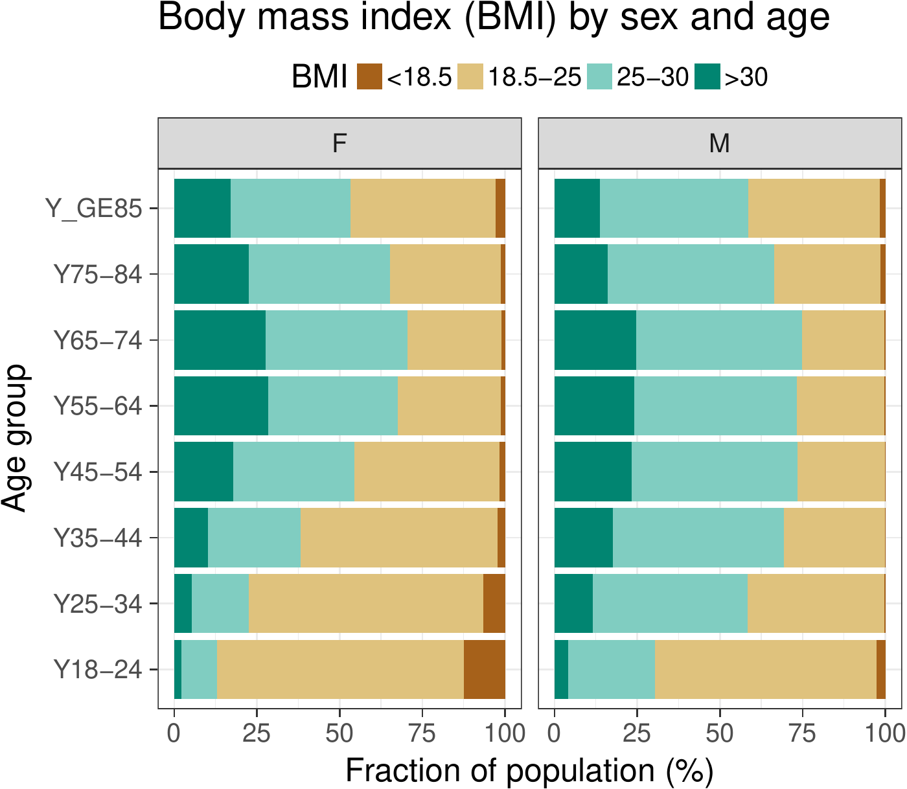
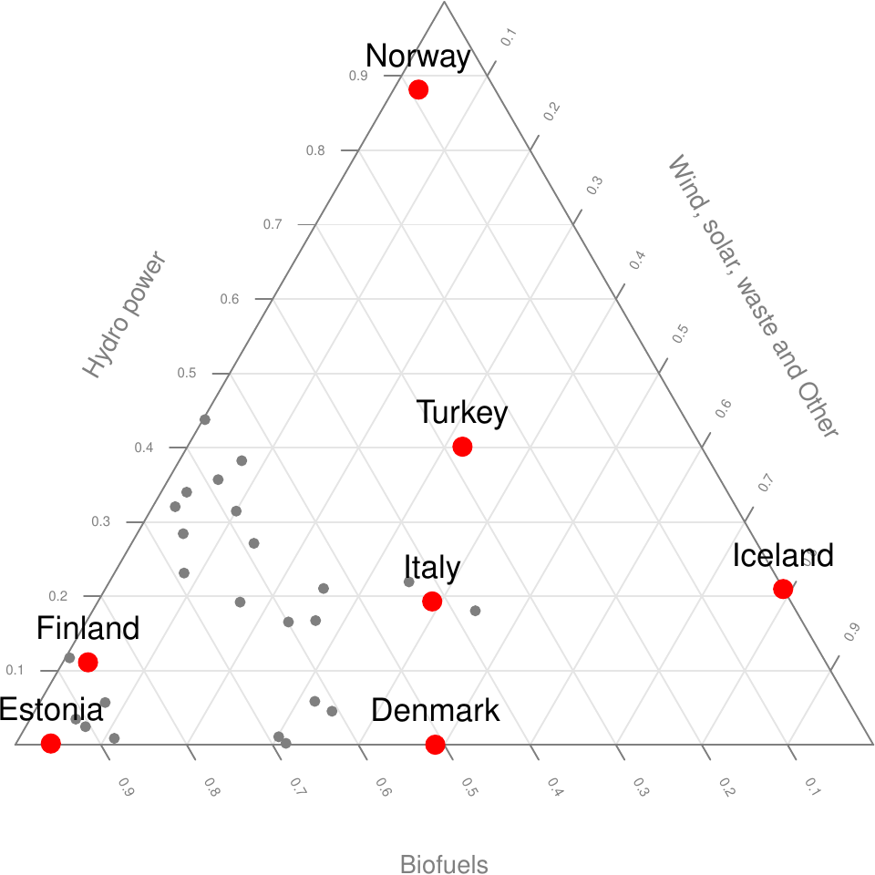
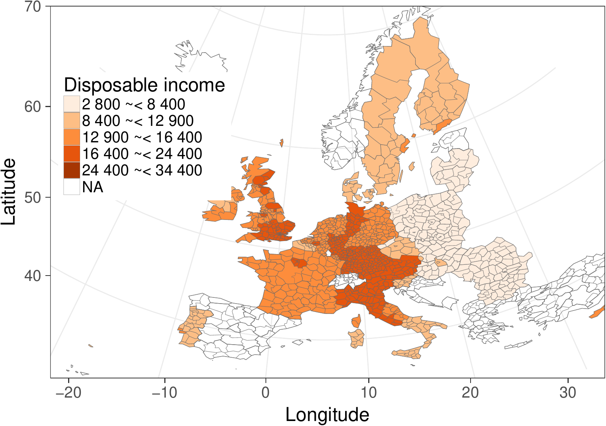

::: article
# Introduction

Eurostat, the statistical office of the European Union, provides a rich
collection of data through its open data service[^1], including
thousands of data sets on European demography, economics, health,
infrastructure, traffic and other topics. The statistics are often
available with fine geographical resolution and include time series
spanning over several years or decades.

Availability of algorithmic tools to access and analyse open data
collections can greatly benefit reproducible research
[@Gandrud13; @Boettiger2015], as complete analytical workflows spanning
from raw data to final publications can be made fully replicable and
transparent. Dedicated software packages help to simplify, standardize,
and automate analysis workflows, greatly facilitating reproducibility,
code sharing, and efficient data analytics. The code for data retrieval
need to be customized to specific data sources to accommodate variations
in raw data formats, access details, and typical use cases so that the
end users can avoid repetitive programming tasks and save time. A number
of packages for governmental and other sources have been designed to
meet these demands, including packages for the Food and Agricultural
Organization (FAO) of the United Nations
([*FAOSTAT*](https://CRAN.R-project.org/package=FAOSTAT); @FAOSTAT),
World Bank ([*WDI*](https://CRAN.R-project.org/package=WDI); @WDI),
national statistics authorities
([*pxweb*](https://CRAN.R-project.org/package=pxweb); @pxweb), Open
Street Map ([*osmar*](https://CRAN.R-project.org/package=osmar);
@2016-108-osmar) and many other sources.

A dedicated R package for the Eurostat open data has been missing. The
[*eurostat*](https://CRAN.R-project.org/package=eurostat) package fills
this gap. It expands the capabilities of our earlier *statfi* [@statfi]
and [*smarterpoland*](https://CRAN.R-project.org/package=smarterpoland)
[@smarterpoland] packages. Since its first CRAN release in 2014, the
*eurostat* package has been developed by several active contributors
based on frequent feedback from the user community. We are now reporting
mature version that has been improved and tested by multiple users, and
applied in several case studies by us and others [@Kenett2016]. The
Eurostat database has three services for programmatic data access: a
bulk download, json/unicode, and SDMX web service; we provide targeted
methods for the first two in the *eurostat* package; generic tools for
the SDMX format are available via the
[*rsdmx*](https://CRAN.R-project.org/package=rsdmx) package [@rsdmx].
The bulk download provides single files, which is convenient and fast
for retrieving major parts of data. More light-weight json methods allow
data subsetting before download and may be preferred in more specific
retrieval tasks but the query size is limited to 50 categories. Finally,
the package can be used to download custom administrative boundaries by
EuroGeographics© that allow seamless visualization of the data on the
European map.

Specific versions of the Eurostat data can be accessed with the
[*datamart*](https://CRAN.R-project.org/package=datamart) [@datamart],
[*quandl*](https://CRAN.R-project.org/package=quandl) [@quandl],
[*pdfetch*](https://CRAN.R-project.org/package=pdfetch) [@pdfetch], and
*rsdmx* packages. Unlike these generic database packages, *eurostat* is
particularly tailored for the Eurostat open data service. It depends on
further R packages including
[*classInt*](https://CRAN.R-project.org/package=classInt) [@classInt],
[*httr*](https://CRAN.R-project.org/package=httr) [@httr],
[*jsonlite*](https://CRAN.R-project.org/package=jsonlite) [@jsonlite],
[*readr*](https://CRAN.R-project.org/package=readr) [@2016-108-readr],
[*sp*](https://CRAN.R-project.org/package=sp) [@2016-108-sp], and
[*stringi*](https://CRAN.R-project.org/package=stringi) [@stringi]. The
following CRAN task views are particularly relevant
[*ReproducibleResearch*](https://CRAN.R-project.org/view=ReproducibleResearch),
[*SocialSciences*](https://CRAN.R-project.org/view=SocialSciences),
[*Spatial*](https://CRAN.R-project.org/view=Spatial),
[*SpatioTemporal*](https://CRAN.R-project.org/view=SpatioTemporal),
[*TimeSeries*](https://CRAN.R-project.org/view=TimeSeries),
[*WebTechnologies*](https://CRAN.R-project.org/view=WebTechnologies).
The package is part of rOpenGov [@Lahti13icml] reproducible research
initiative for computational social science and digital humanities.

In summary, the *eurostat* package provides custom tools for Eurostat
open data. Key features such as cache, date formatting, tidy data
principles [@wickham2014], and
[*tibble*](https://CRAN.R-project.org/package=tibble) [@tibble] data
format support seamless integration with other tools for data
manipulation and analysis. This article provides an overview of the core
functionality in the current CRAN release version (3.1.1). A
comprehensive documentation and source code are available via the
package homepage in Github[^2].

# Search and download commands

To install and load the CRAN release version, just type the standard
installation command in R.

``` r
  install.packages("eurostat")
  library("eurostat")
```

The database table of contents is available on-line[^3], or can be
downloaded in R with `get_eurostat_toc()`. A more focused search is
provided by the `search_eurostat()` function.

``` r
  query <- search_eurostat("road accidents", type = "table")
```

This seeks data on road accidents. The `type` argument limits the search
on a selected data set type, one of three hierarchical levels including
\"table\", which resides in \"dataset\", which is in turn stored in a
\"folder\". Values in the `code` column of the `search_eurostat()`
function output provide data identifiers for subsequent download
commands. Alternatively, these identifiers can be browsed at the
Eurostat open data service; check the codes in the Data Navigation Tree
listed after each dataset in parentheses. Let us look at the data
identifier and title for the first entry of the query data.

``` r
  query$code[[1]]
  [1] "tsdtr420"

  query$title[[1]]
  [1] "People killed in road accidents"
```

Let us next retrieve the data set with this identifier.

``` r
  dat <- get_eurostat(id = "tsdtr420", time_format = "num")
```

Here we used the numeric time format as it is more convient for annual
time series than the default date format. The transport statistics
returned by this function call (Table [1](#tab:getdatatable)) could be
filtered before download with the `filters` argument, where the list
names and values refer to Eurostat variable and observation codes,
respectively. To retrieve transport statistics for specific countries,
for instance, use the get_eurostat function.

``` r
  countries <- c("UK", "SK", "FR", "PL", "ES", "PT")
  t1 <- get_eurostat("tsdtr420", filters = list(geo = countries)) 
```

::: {#tab:getdatatable}
  ------------------------------------------
      unit   sex   geo        time    values
  --- ------ ----- ----- --------- ---------
    1 NR     T     AT      1999.00   1079.00

    2 NR     T     BE      1999.00   1397.00

    3 NR     T     CZ      1999.00   1455.00

    4 NR     T     DE      1999.00   7772.00

    5 NR     T     DK      1999.00    514.00

    6 NR     T     EL      1999.00   2116.00
  ------------------------------------------

  : Table 1: First entries of the road accident data set retrieved with
  `get_eurostat(id = "tsdtr420", time_format = "num")`.
:::

::: {#tab:getdatatable2}
  -------------------------------------------------------------------------------------------
      unit     sex     geo                                                     time    values
  --- -------- ------- -------------------------------------------------- --------- ---------
    1 Number   Total   Austria                                              1999.00   1079.00

    2 Number   Total   Belgium                                              1999.00   1397.00

    3 Number   Total   Czech Republic                                       1999.00   1455.00

    4 Number   Total   Germany (until 1990 former territory of the FRG)     1999.00   7772.00

    5 Number   Total   Denmark                                              1999.00    514.00

    6 Number   Total   Greece                                               1999.00   2116.00
  -------------------------------------------------------------------------------------------

  : Table 2: The `get_eurostat()` output (Table [1](#tab:getdatatable))
  converted into human-readable labels with `label_eurostat()`.
:::

A subsequent visualization reveals a decreasing trend of road accidents
over time in Figure [1](#fig:transport).

``` r
ggplot(t1, aes(x = time, y = values, color = geo, group = geo, shape = geo)) +
  geom_point(size = 4) + geom_line() + theme_bw() +
  ggtitle("Road accidents") + xlab("Year") + ylab("Victims (n)") +
  theme(legend.position = "none") +
  ggrepel::geom_label_repel(data = t1 %>% group_by(geo) %>% na.omit() %>%
  filter(time %in% c(min(time), max(time))), aes(fill = geo, label = geo), color = "white")
```

{#fig:transport
width="100%" alt="graphic without alt text"}

# Utilities

Many entries in Table [1](#tab:getdatatable) are not readily
interpretable, but a simple call `label_eurostat(dat)` can be used to
convert the original identifier codes into human-readable labels
(Table [2](#tab:getdatatable2)) based on translations in the Eurostat
database. Labels are available in English, French and German languages.

The Eurostat database includes a variety of demographic and health
indicators. We see, for instance, that overweight varies remarkably
across different age groups (Figure [2](#fig:bmi)A). Sometimes the data
sets require more complicated pre-processing. Let's consider, for
instance, the distribution of renewable energy sources in different
European countries. In order to summarise such data one needs to first
aggregate a multitude of possible energy sources into a smaller number
of coherent groups. Then one can use standard R tools to process the
data, chop country names, filter countries depending on production
levels, normalize the within country production. After a series of
transformations (see Appendix for the source code) we can finally plot
the data to discover that countries vary a lot in terms of renewable
energy sources (Figure [2](#fig:bmi)B). Three-dimensional data sets such
as this can be conveniently visualized as triangular maps by using the
[*plotrix*](https://CRAN.R-project.org/package=plotrix) [@plotrix]
package.

The data sets are stored in cache by default to avoid repeated downloads
of identical data and to speed up the analysis. Storing an exact copy of
the retrieved raw data on the hard disk will also support
reproducibility when the source database is constantly updated.

<figure id="fig:bmi">
<p></p>
<figcaption>Figure 2: <span><strong>A</strong></span> The body-mass
index (BMI) in different age groups in Poland (Eurostat table
<code>hlth_ehis_de1</code>). <span><strong>B</strong></span> Production
of renewable energy in various countries in 2013 (Eurostat table
<code>ten00081</code>). See the Appendix for the source
code.</figcaption>
</figure>

# Geospatial information

## Map visualizations

The indicators in the Eurostat open data service are typically available
as annual time series grouped by country, and sometimes at more refined
temporal or geographic levels. Eurostat provides complementary
geospatial data on the corresponding administrative statistical units to
support visualizations at the appropriate geographic resolution. The
geospatial data sets are available as standard shapefiles[^4]. Let us
look at disposable income of private households (data identifier
tgs00026[^5]). This is provided at the geographic NUTS2 regions, the
intermediate territorial units in the Eurostat regional classifications,
roughly corresponding to provinces or states in each country[^6]
(Figure [3](#fig:mapexample)). The map can be generated with the
following code chunk.

``` r
  # Load the required libraries
  library(eurostat)
  library(dplyr)
  library(ggplot2)

  # Download and manipulate tabular data
  get_eurostat("tgs00026", time_format = "raw") %>% 
    # Subset to year 2005 and NUTS-3 level
    dplyr::filter(time == 2005, nchar(as.character(geo)) == 4) %>%

    # Classify the values the variable
    dplyr::mutate(cat = cut_to_classes(values)) %>%

    # Merge Eurostat data with geodata from Cisco
    merge_eurostat_geodata(data = ., geocolumn = "geo", resolution = "60",
                         output_class = "df", all_regions = TRUE) %>% 

  # Plot the map
  ggplot(data = ., aes(long, lat, group = group)) +
    geom_polygon(aes(fill = cat), colour = alpha("white", 1/2), size = .2) +
    scale_fill_manual(values = RColorBrewer::brewer.pal(n = 5, name = "Oranges")) +
    labs(title = "Disposable household income") +
    coord_map(project = "orthographic", xlim = c(-22, 34), ylim = c(35, 70)) +
    theme_minimal() +
    guides(fill = guide_legend(title = "EUR per Year",
           title.position = "top", title.hjust = 0))
```

This demonstrates how the Eurostat statistics and geospatial data,
retrieved with the eurostat package, can be combined with other
utilities, in this case the
[*maptools*](https://CRAN.R-project.org/package=maptools) [@maptools],
[*rgdal*](https://CRAN.R-project.org/package=rgdal) [@rgdal],
[*rgeos*](https://CRAN.R-project.org/package=rgeos) [@rgeos],
[*scales*](https://CRAN.R-project.org/package=scales) [@scales], and
[*stringr*](https://CRAN.R-project.org/package=stringr) [@stringr] R
packages.

<figure id="fig:mapexample">

<figcaption>Figure 3: Disposable income of private households across
NUTS2-level national regions in European countries. The household income
statistics provided by Eurostat and the administrative boundaries by
EuroGeographics© were obtained via the Eurostat open data service with
the <em>eurostat</em> R package.</figcaption>
</figure>

## Standard country groupings

To facilitate the analysis and visualization of standard European
country groups, the *eurostat* package includes ready-made country code
lists. The list of EFTA countries (Table [3](#tab:efta)), for instance,
is retrieved with the data command.

``` r
  data(efta_countries)
```

::: {#tab:efta}
  --------------------------
      code   name
  --- ------ ---------------
    1 IS     Iceland

    2 LI     Liechtenstein

    3 NO     Norway

    4 CH     Switzerland
  --------------------------

  : Table 3: The EFTA country listing from the eurostat R package.
:::

Similar lists are available for Euro area (ea_countries), EU
(eu_countries) and the EU candidate countries (eu_candidate_countries).
These auxiliary data sets facilitate smooth selection of specific
country groups for a closer analysis. The full name and a two-letter
identifier are provided for each country according to the Eurostat
database. The country codes follow the ISO 3166-1 alpha-2 standard,
except that GB and GR are replaced by UK (United Kingdom) and EL
(Greece) in the Eurostat database, respectively. Linking these country
codes with external data sets can be facilitated by conversions between
different country coding standards with the
[*countrycode*](https://CRAN.R-project.org/package=countrycode) package
[@countrycode].

# Discussion

By combining programmatic access to data with custom analysis and
visualization tools it is possible to facilitate a seamless automation
of the complete analytical workflow from raw data to statistical
summaries and final publication. The package supports automated and
transparent data retrieval from institutional data repositories,
featuring options such as search, subsetting and cache. Moreover, it
provides several custom functions to facilitate the Eurostat data
analysis and visualization. These tools can be used by researchers and
statisticians in academia, government, and industry, and their
applicability has been demonstrated in recent, independent publications
[@Kenett2016].

The *eurostat* R package provides a convenient set of tools to access
open data from Eurostat, together with a comprehensive documentation and
open source code via the package homepage. The documentation includes
simple examples for individual functions, a generic package tutorial,
and more advanced case studies on data processing and visualization. The
package follows best practices in open source software development,
taking advantage of version control, automated unit tests, continuous
integration, and collaborative development [@PerezRiverol2016].

The source code can be freely used, modified and distributed under a
modified BSD-2-clause license[^7]. We value feedback from the user
community, and the package has already benefited greatly from the user
bug reports and feature requests, which can be systematically provided
through the Github issue tracker[^8]; advanced users can also implement
and contribute new features by making pull requests. Indeed, these
collaborative features have been actively used during the package
development. We are committed to active maintenance and development of
the package, and hope that this will encourage further feedback and
contributions from the user community.

# Acknowledgements {#acknowledgements .unnumbered}

We are grateful to all package contributors, including François Briatte,
Joona Lehtomäki, Oliver Reiter, and Wietse Dol, and to Eurostat for
maintaining the open data service. This work is in no way officially
related to or endorsed by Eurostat. The work has been partially funded
by Academy of Finland (decisions 295741, 307127 to LL), and is part of
rOpenGov[^9].

# Appendix

The full source code for this manuscript is available at the package
homepage[^10]. Source code for the obesity example
(Figure [2](#fig:bmi)A) is as follows.

``` r
  library(dplyr)
  tmp1 <- get_eurostat("hlth_ehis_de1", time_format = "raw")
  tmp1 %>%
    dplyr::filter(isced97 == "TOTAL" ,
         sex != "T", age != "TOTAL", geo == "PL") %>%
    mutate(BMI = factor(bmi, 
                        levels=c("LT18P5","18P5-25","25-30","GE30"), 
                        labels=c("<18.5", "18.5-25", "25-30",">30"))) %>%
    arrange(BMI) %>%
    
    ggplot(aes(y = values, x = age, fill = BMI)) + geom_bar(stat = "identity") +
      facet_wrap(~sex) + coord_flip() +
      theme(legend.position = "top") +
      ggtitle("Body mass index (BMI) by sex and age") +
      xlab("% of population") + scale_fill_brewer(type = "div")
```

Source code for the renewable energy example (Figure [2](#fig:bmi)B).

``` r
  # All sources of renewable energy are to be grouped into three sets
  dict <- c("Solid biofuels (excluding charcoal)" = "Biofuels",
         "Biogasoline" = "Biofuels",
         "Other liquid biofuels" = "Biofuels",
         "Biodiesels" = "Biofuels",
         "Biogas" = "Biofuels",
         "Hydro power" = "Hydro power",
         "Tide, Wave and Ocean" = "Hydro power",
         "Solar thermal" = "Wind, solar, waste and Other",
         "Geothermal Energy" = "Wind, solar, waste and Other",
         "Solar photovoltaic" = "Wind, solar, waste and Other",
         "Municipal waste (renewable)" = "Wind, solar, waste and Other",
         "Wind power" = "Wind, solar, waste and Other",
         "Bio jet kerosene" = "Wind, solar, waste and Other")
  # Some cleaning of the data is required
  energy3 <- get_eurostat("ten00081") %>%
    label_eurostat(dat) %>% 
    filter(time == "2013-01-01",
        product != "Renewable energies") %>%
    mutate(nproduct = dict[as.character(product)], # just three categories
        geo = gsub(geo, pattern=" \\(.*", replacement="")) %>%
    select(nproduct, geo, values) %>% 
    group_by(nproduct, geo) %>%
    summarise(svalue = sum(values)) %>%
    group_by(geo) %>%
    mutate(tvalue = sum(svalue), svalue = svalue/sum(svalue)) %>%
    filter(tvalue > 1000) %>% 
    spread(nproduct, svalue)
  
  # Triangle plot
  positions <- plotrix::triax.plot(as.matrix(energy3[, c(3,5,4)]),
    show.grid = TRUE, label.points = FALSE, point.labels = energy3$geo,
    col.axis = "gray50", col.grid = "gray90",
    pch = 19, cex.axis = 1.1, cex.ticks = 0.7, col = "grey50")

  ind <- which(energy3$geo %in%  c("Norway", "Iceland","Denmark","Estonia", "Turkey", "Italy", "Finland"))
  df <- data.frame(positions$xypos, geo = energy3$geo)
    points(df$x[ind], df$y[ind], cex = 2, col = "red", pch = 19)
    text(df$x[ind], df$y[ind], df$geo[ind], adj = c(0.5,-1), cex = 1.5)
```
:::

[^1]: <http://ec.europa.eu/eurostat/data/database>

[^2]: <http://ropengov.github.io/eurostat>

[^3]: <http://ec.europa.eu/eurostat/data/database>

[^4]: <http://ec.europa.eu/eurostat/web/gisco/geodata/reference-data/administrative-units-statistical-units>

[^5]: <http://ec.europa.eu/eurostat/en/web/products-datasets/-/TGS00026>

[^6]: <http://ec.europa.eu/eurostat/web/nuts/overview>

[^7]: <https://opensource.org/licenses/BSD-2-Clause>

[^8]: <https://github.com/rOpenGov/eurostat/issues>

[^9]: <https://github.ropengov.io>

[^10]: <http://ropengov.github.io/eurostat>
