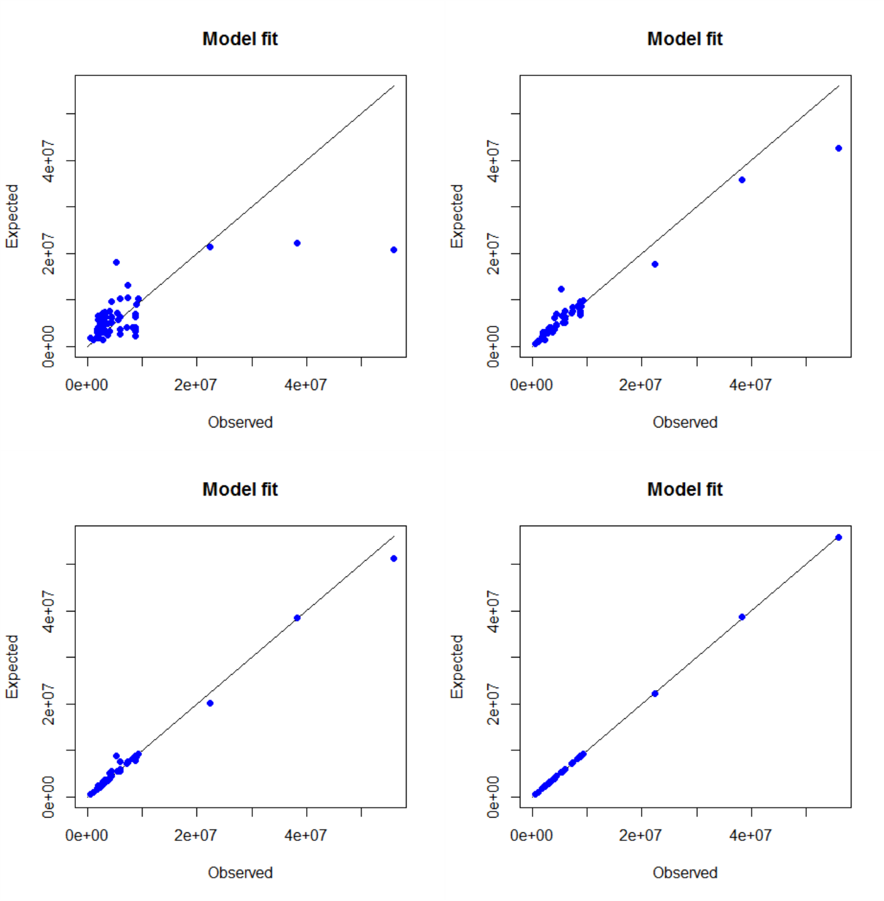

::: article
# Introduction

A market area (also called trading area, service area or catchment area)
is a part of the earth's surface where the actual or potential customers
of a supply location come from. This supply location can be any kind of
location which provides goods and/or services and generates a
geographically segmented market. In retailing, a supply location can be
a single store, a retail agglomeration (planned or unplanned shopping
centre) or even an entire city [@berman:2013; @loffler:1998].

The market area of a store/location can be regarded as the spatial
equivalent to its sum of all customers and/or sales. The total
customers/sales of a supply location can be determined by summing the
customer flows/expenditures from each geographic region in its market
area [@huff:2008; @rodrigue:2006]. For practical reasons, a market area
can also be divided by zones of market penetration and/or
distance/travel time [@berman:2013].

Market areas of retail locations result from the consumer spatial
shopping behaviour, more precisely, their store choice. Thus, a market
area is influenced by many factors such as the transport costs
(e.g. distance, travel time) between customers and locations and, of
course, the characteristics of the competitors (e.g. perceived
\"attraction\", pricing, image or the opportunity for multi-purpose and
comparison shopping). Mostly, the market areas of competing supply
locations overlap, which means that they are in spatial competition
[@rodrigue:2006; @wieland:2015].

Traditionally, market area analysis includes the delineation and
segmentation of market areas and can be divided into inductive-empirical
and deductive-theoretical approaches. The first type consists of
constructing market areas based on empirical observations such as
point-of-sale (POS) surveys (customer spotting), while in the latter
approach this work is done by using mathematical market area models
[@loffler:1998]. Modern market area analyses are mostly a combination of
both, especially when using econometric market area models which are
fitted by empirical data [@wieland:2015].

Market area models can be used in retail location analysis to find new
locations, to evaluate the existing outlets or to assess the impact of
changes in the competitive landscape [@berman:2013; @huff:2008]. Market
area analyses are also subject of governmental spatial planning in
Germany [@wolf:2012]. The econometric models can also be utilized to
identify variables influencing consumer decisions and market areas and
to check hypotheses about these relations, which means to find out what
affects store choice [@wieland:2015]. The usage of market area models
can also be transferred to other service locations, such as health
services [@jia:2015].

This paper presents two market area models, the *Huff Model* and the
*Multiplicative Competitive Interaction (MCI) Model*, and their
implementation into R by the authors' package
[*MCI*](https://CRAN.R-project.org/package=MCI) [@MCI]. Yet, only the
basic Huff Model formula is integrated in R by the packages
[*SpatialPosition*](https://CRAN.R-project.org/package=SpatialPosition)
[@SpatialPosition], which can be used especially for graphical
visualization, and *huff-tools* [@pavlis:2014], which combines the basic
formulation with GIS functions. In contrast, the emphases of the *MCI*
package lie on 1) fitting the MCI Model and the Huff Model via OLS
(ordinary least squares) regression and nonlinear techniques,
respectively, and 2) the steps of processing and transforming empirical
data to be usable in the models (especially working with interaction
matrices).

# Market area models: theory and application

Almost all market area models have in common that they are based on an
attraction/utility function including transport costs and further
characteristics of the supply locations which are subjects of a
trade-off by the consumers. The dependent variable of these models is
the store choice and/or the choice probability and/or the market shares
of the stores/locations [@wieland:2015].

The first retail market area models [@reilly:1929; @converse:1949] were
deterministic, which means that each customer origin is assigned
completely to one supply location while overlapping market areas are not
envisaged. Furthermore only two supply locations can be processed and
the explaining variables of the models are not founded theoretically.
These gaps were filled by @huff:1962 [@huff:1963; @huff:1964] by
introducing his probabilistic market area model. An important content
enhancement and, at the same time, an econometric transformation of the
Huff Model was introduced in the form of the Multiplicative Competitive
Interaction Model by @nakanishi:1974 [@nakanishi:1982].

## The Huff Model

### Theoretical background and formulation

The basis of the Huff Model is the following multiplicative utility
function with two explanatory variables representing two determinants of
store choice [@huff:1975]:
$$\ U_{ij}=A_{j}^{\gamma}d_{ij}^{-\lambda},$$
where $U_{ij}$ is the utility of the supply location $j$ for the
customers at origin $i$, $A_{j}$ reflects the attraction of supply
location $j$ and $d_{ij}$ contains the transport costs customers from
$i$ have to take to reach $j$. The exponents $\gamma$ and $\lambda$ are
weighting parameters.

The attraction is translated as the size of the location due to the
increasing probability for a \"successful\" shopping trip on condition
of consumer uncertainty (the greater the locations' offer, the more
likely is to get the desired goods). The size is operationalized by the
sales area of the locations. But, as the consumers' decision costs
normally rise with an increasing number of offered goods, the marginal
utility of the locations' offer decreases which is reflected by a
degressive weighting of size ($0 < \gamma < 1$). The indicator for the
transport costs is the travel time from $i$ to $j$, reflecting the time
consumed by a shopping trip. To integrate the opportunity costs and the
perceived disutility of traveling, the travel time is weighted
negatively and progressively ($|\lambda| > 1$) [@huff:1962].

The parameter $\lambda$ also reflects the range of the offered goods
dependent on the shopping frequency: the more high-order the good/less
frequently purchased, the less is the disutility of transport costs
[@guessefeldt:2002]. But this distance decay function of the power type
can also be replaced by an exponential or a logistic function
[@kanhaeusser:2007]. As suggested by @huff:1962, also the attraction
function can be logistic to better reflect the effect of decreasing
marginal utility of size.

Derived from the behavioral scientific Luce choice axiom [@luce:1959],
the consumer decision in the Huff Model is regarded as probabilistic.
The probability to choose the alternative $j$ from a set of alternatives
($j=1,...,n$) is the quotient of its utility $U_{ij}$ and the sum of the
utilities of all alternatives [@huff:1962]:
$$p_{ij}= {\frac{ U_{ij}}{\sum_{j=1}^{n} U_{ij}}}={\frac{ A_{j}^{\gamma}d_{ij}^{-\lambda}}{\sum_{j=1}^{n}A_{j}^{\gamma}d_{ij}^{-\lambda}}},$$
where $p_{ij}$ is the probability that the customers from origin $i$
travel to location $j$, what can be called interaction probability,
where: $\sum_{j=1}^n{p_{ij} = 1}$ and $0 < p_{ij} < 1$. These
probabilites can be interpreted as market shares of location $j$ in
origin $i$, what can be called local market shares. These shares
implicitly represent a final state of consumer preference patterns in a
spatial equilibrium [@huff:1975]. Thus, in the Huff Model, the revenues
of a retail store/location $j$ depend on its own attraction, the
attraction of all competitors and the transport costs between all
locations and the customer origins.

The expected customer/expenditure flows from $i$ to $j$ are estimated by
multiplying the local market shares with the local market potential
[@huff:1962]:
$$E_{ij}=p_{ij}C_{i},$$
where $E_{ij}$ is the number of expected customer/purchasing power flows
from origin $i$ to location $j$ and $C_{i}$ is the total market
potential (number of potential customers or purchasing power) in $i$.

The complete market area of location $j$ is the sum of all regional
customer or purchasing power flows, while the former represents the
total number of customers and the latter equals the total sales of the
location, e.g. within a year [@huff:1964]:
$$T_{j}=\sum_{i=1}^m{E_{ij}},$$
where $T_{j}$ is the market area of $j$ containing $m$ submarkets,
normally measured in persons or money.

### Empirical usage

While working with the Huff Model, the first step is to delineate the
study area itself and to record the focused origins and locations. The
explanatory variables must be observed empirically by mapping the
regarded stores/locations ($A_{j}$) and calculating travel times
($d_{ij}$), respectively [@huff:1962].

All data is stored into a special kind of linear table that is called
interaction matrix and is the basis for all further calculation steps
(see Table  [1](#figure:huffmatrix)). The interaction matrix contains
one row for each (potential) spatial interaction between the origins,
$i$ (where $i = 1,...,m$), and the locations, $j$ (where $j = 1,...,n$),
so the number of rows sums up to $m*n$. For every row, the utilities and
probabilities are calculated using the formulas mentioned above
[@wieland:2015].

::: {#figure:huffmatrix}
  ----------------------------------------------------------------------------------------------------------------------------------------------------------------------------
   $\mathbf{i}$   $\mathbf{j}$   $\mathbf{d_{ij}}$   $\mathbf{A_{j}}$   $\mathbf{U_{ij}}$   $\mathbf{\sum U_{ij}}$   $\mathbf{p_{ij}}$   $\mathbf{C_{i}}$   $\mathbf{E_{ij}}$
  -------------- -------------- ------------------- ------------------ ------------------- ------------------------ ------------------- ------------------ -------------------
     $i_{1}$        $j_{1}$      $d_{i_{1}j_{1}}$      $A_{j_{1}}$      $U_{i_{1}j_{1}}$       $\sum U_{i_{1}}$      $p_{i_{1}j_{1}}$      $C_{i_{1}}$      $E_{i_{1}j_{1}}$

     $i_{1}$        $j_{2}$      $d_{i_{1}j_{2}}$      $A_{j_{2}}$      $U_{i_{1}j_{2}}$       $\sum U_{i_{1}}$      $p_{i_{1}j_{2}}$      $C_{i_{1}}$      $E_{i_{1}j_{2}}$

     $i_{1}$        $j_{3}$      $d_{i_{1}j_{3}}$      $A_{j_{3}}$      $U_{i_{1}j_{3}}$       $\sum U_{i_{1}}$      $p_{i_{1}j_{3}}$      $C_{i_{1}}$      $E_{i_{1}j_{3}}$

     $i_{2}$        $j_{1}$      $d_{i_{2}j_{1}}$      $A_{j_{1}}$      $U_{i_{2}j_{1}}$       $\sum U_{i_{2}}$      $p_{i_{2}j_{1}}$      $C_{i_{2}}$      $E_{i_{2}j_{1}}$

     $i_{2}$        $j_{2}$      $d_{i_{2}j_{2}}$      $A_{j_{2}}$      $U_{i_{2}j_{2}}$       $\sum U_{i_{2}}$      $p_{i_{2}j_{2}}$      $C_{i_{2}}$      $E_{i_{2}j_{2}}$

      $...$          $...$             $...$              $...$               $...$                 $...$                  $...$              $...$               $...$

     $i_{m}$        $j_{n}$      $d_{i_{m}j_{n}}$      $A_{j_{n}}$      $U_{i_{m}j_{n}}$       $\sum U_{i_{m}}$      $p_{i_{m}j_{n}}$      $C_{i_{m}}$      $E_{i_{m}j_{n}}$
  ----------------------------------------------------------------------------------------------------------------------------------------------------------------------------

  : Table 1: Huff interaction matrix (schematic).
:::

Many approaches were developed to estimate the weighting coefficients by
nonlinear iterative techniques. @huff:1962 showed a way to estimate
$\lambda$ with a fitting algorithm comparing expected and observed
market shares by correlation coefficients while keeping $\gamma$
constantly equal to one. But, if $p_{ij}$, the dependent variable in the
Huff Model, was observed, probably the best way to estimate the
parameters is the econometric transformation of the model which was
achieved by the Multiplicative Competitive Interaction Model by
@nakanishi:1974 (see the next section).

In many cases, no empirical market shares are available but only
observed total sales of stores or locations, $T_{j}$. Thus, many studies
focus the model fitting by nonlinear optimization algorithms based on
empirical total values
[@baecker:2015; @debeule:2014; @guessefeldt:2002; @marinov:2012; @orpana:2003; @klein:1988; @yingru:2012].
In the following, a new optimization algorithm of this type is
introduced which is based on the idea of the local optimization of
attraction approach by @guessefeldt:2002 (which is the only one with an
explicit theoretical fundament) and features of other mentioned
procedures.

### A new optimization algorithm for the Huff Model

Consider a location system with $j$ supply locations (where
$j = 1,...,n$), where $T_{j_{obs}}$ defines the real (observed) annual
sales of $j$. @guessefeldt:2002 argues that every store or location has
its own unknown revenue function and the sales (=revenues) depend on its
own attraction (=input) and each competitors' behaviour. The attraction
variable in the Huff Model, $A_{j}$, is a proxy variable for size
(e.g. sales area) reflecting the extent of offers which is the input in
the unknown revenue function. But this non-adjusted attraction measure
does not reflect the \"real\" attraction because every competitor
modifies the input in his revenue function (e.g. via marketing efforts)
without any change in the size variable.

Thus, the expected sales using non-adjusted attractions in the Huff
Model, $T_{j_{exp}}$, do not correspond to the observed sales what can
be measured on the local level (which means a single store/location) by
the absolute percentage error:
$$APE_{j} = \frac{| T_{j_{exp}} - T_{j_{obs}} |}{T_{j_{obs}}},$$
where $T_{j_{exp}}$ is the expected total sales of supply location $j$
(Huff Model result), $T_{j_{obs}}$ is the observed total sales and
$APE_{j}$ is the absolute percentage error for supply location $j$.

Since the algorithm by @guessefeldt:2002 addresses the local level,
there is no fit measure for the global level (which means the model fit
for the *complete* location system). The global model fit can be
evaluated in different ways, where three fit measures were already used
in the context of optimizing the Huff Model: the mean absolute
percentage error ($MAPE$) and a $Pseudo R^2$ measure, both used by
@debeule:2014, and the global error ($GE$) used by @klein:1988:
$$MAPE=\frac{1}{N} \sum_{n=1}^N{\frac{| T_{j_{exp}} - T_{j_{obs}} |}{T_{j_{obs}}}},$$
where $T_{j_{exp}}$ is the expected total sales of location $j$ (Huff
Model result), $T_{j_{obs}}$ is the observed total sales and $N$ is the
number of objects.
$$PseudoR^2=\frac{ var\left(T_{j_{obs}} \right) - var \left( \varepsilon_{j} \right) } { var\left(T_{j_{obs}}\right) },$$
where $T_{j_{obs}}$ is the observed total sales and $\varepsilon_{j}$ is
the residuum, $T_{j_{obs}}-T_{j_{exp}}$.
$$GE=\frac{ \sum{|\varepsilon_{j}|} }  { \sum{T_{j_{obs}}} },$$
where $T_{j_{obs}}$ is the observed total sales and $\varepsilon_{j}$ is
the residuum, $T_{j_{obs}}-T_{j_{exp}}$.

Since the real sales are known and on condition that the location
attraction and the sales are related to each other, the attraction
$A_{j}$ can be described as a function of the sales [@guessefeldt:2002]:
$$A_{j}=a+b T_{j},$$
where $A_{j}$ is the predicted attraction of location $j$, $T_{j}$ is
the total sales of $j$, $a$ is the intercept and $b$ is the slope of the
attraction function. As every supply location has its own revenue
function (each competitor has an individual factor use), the attraction
function is also different for each store/location.

On condition that an interval is known, this function can be
parametrized by calculating the slope using the difference quotient and
the intercept, thereafter [@guessefeldt:2002]. Unlike in the mentioned
approach, this function *must* pass the origin because in the Huff Model
with its multiplicative utility function (Formula 1), an attraction
equal to zero ($A_{j}=0$) must result in an utility equal to zero
($U_{ij}=0$) which results in local market shares equal to zero
($p_{ij}=0$, Formula 2). Thus, the total sales (Formulae 3 and 4) must
be equal to zero ($T_{j}=0$), too. This is a logical consequence from
the theoretical basement of the Huff Model but is also part of the
principle of logical consistency of market shares in marketing research
[@cooper:2010].

Thus, formula 9 has no intercept ($a=0$) which means a directly
proportional relation between sales and attraction. But, as the revenue
function differs by each supply location, the attraction function must
also be parametrized for each store/location. The slope in the
attraction function of location $j$ can be calculated via:
$$b_{j} = \frac{A_{j}-A_{j_{0}}}{T_{j_{exp}}-T_{j_{0}}} = \frac{A_{j}}{T_{j_{exp}}},$$
where $b_{j}$ is the slope of the attraction function for $j$, $A_{j}$
is the non-adjusted attraction of location $j$ (such as sales area),
$T_{j_{exp}}$ is the total expected sales of $j$ predicted by the Huff
Model, $A_{j_{0}}$ is the attraction when the sales are equal to zero
and $T_{j_{0}}$ represents the sales when the attraction is equal to
zero, both equal to zero ($A_{j}=0 \Leftrightarrow T_{j}=0$). The
adjusted attraction of supply location $j$ can be calculated via:
$$A_{j_{adj}} = b_{j} T_{j_{obs}},$$
where $A_{j_{adj}}$ is the adjusted attraction of $j$, $b_{j}$ is the
slope of the attraction function for $j$ and $T_{j_{obs}}$ represents
the real (observed) sales of $j$.

The relations mentioned above can be brought together in an optimization
algorithm for the Huff Model with respect to a location system with $j$
locations ($j=1,...,n$) containing the following 8 steps:

1.  Set a tolerance value, $tol_{APE}$, to define which difference
    between the real and the expected sales of location $j$ is accepted,
    e.g. $tol_{APE} = 5$, which means an accepted deviation of +/- 5
    percent. Define a transport costs weighting function (power,
    exponential or logistic) and the weighting parameter(s) $\lambda$
    for formula 2.

2.  Calculate the market areas for the location system and the total
    sales of the $n$ locations using formulae 2 to 4 with $\gamma=1$ and
    the transport costs weighting as defined in step 1.

3.  Calculate the absolute percentage error between the expected and the
    observed total sales of location $j$ ($APE_{j}$) by formula 5. If
    the error $APE_{j}$ is smaller than the tolerance $tol_{APE}$, no
    further local optimization for location $j$ is needed, so you can
    repeat step 3 with location $j+1$. If $APE_{j} > tol_{APE}$, go to
    step 4.

4.  Calculate the slope of the attraction function by formula 10.
    Calculate the adjusted attraction via formula 11.

5.  Save the adjusted attraction of location $j$, $A_{j_{adj}}$, in the
    actual Huff interaction matrix and repeat the procedure beginning at
    step 2 with the next location, $j+1$.

6.  Repeat steps 2 to 5 for all locations $(j=1,...,n)$.

7.  After the last location $j=n$ was processed, calculate the global
    fit measures for the complete location system by formulae 6 to 8.

8.  Repeat steps 2 to 7 for the complete location system until the local
    optima and/or the global optimum is sufficiently approximated. The
    former can be evaluated by the tolerance value (step 3) for every
    $j$ location, while the latter can be controlled by the global fit
    measures (step 7).

## The Multiplicative Competitive Interaction (MCI) Model

### Theoretical background and formulation

The Multiplicative Competitive Interaction Model (in short: MCI Model)
is based on the Huff Model but also belongs to the model family of
market share models which were developed in marketing science. Thus, it
can be regarded as a crossover of these two model families
[@cliquet:2013]. The fundamental theorem behind market share models is
the following simple relationship between the competitors'
characteristics and their market shares [@cooper:2010]:
$$MS_{j} = \frac{A_{j}}{\sum_{j=1}^n{A_{j}}},$$
where $MS_{j}$ is the market share of competitor $j$ and $A_{j}$ is the
attraction of $j$. This leads to two characteristics of market shares
which are summarized as logical-consistency requirements for market
shares: $0 < MS_{j} < 1$, and $\sum_{j=1}^n{MS_{j}=1}$, respectively
[@cooper:2010]. This market share logic is obviously related to the
probabilistic concept of the Huff Model when the term \"market shares\"
is replaced by \"choice probabilities\", \"interaction probabilities\"
or \"local market shares\" and the construct \"attraction\" is replaced
by the construct \"utility\" [@wieland:2015].

Derived from the Huff Model, the MCI Model is explicitly formulated to
regard a market which is segmented into $i$ submarkets ($i=1,...,m$) and
which is served by $j$ suppliers ($j=1,...,n$). The attraction function
is multiplicative and consists of $h$ ($h=1,...,H$) explanatory
variables which are weighted exponentially to reflect their sensitivity
[@nakanishi:1974]:
$$p_{ij}= {\frac{ \prod_{h=1}^H{A_{h_{j}}^{\gamma_{h}}}}{\sum_{j=1}^{n}\prod_{h=1}^H{A_{h_{j}}^{\gamma_{h}}}}},$$
where $p_{ij}$ is the probability that the customers from submarket $i$
choose supplier $j$, $A_{h_{j}}$ is the value of the $h$-th variable
describing the object $j$, $\gamma_{h}$ is the weighting parameter for
the sensitivity of $p_{ij}$ with respect to the variable $h$. The next
steps (customer or expenditure flows, total market area) can be taken
analogously to the Huff Model (Formulae 3 and 4).

The market can be subdivided in any kind of submarkets (e.g. customer
groups, time periods, geographic areas). When the market is segmented
geographically, it is a matter of a Spatial MCI Model, especially when
integrating transport costs as an explanatory variable
[@cliquet:2013; @huff:2008]. The MCI Model can also be regarded as a
generalization of the Huff Model, while the Huff Model can be considered
as a special case of multiplicative competitive interaction model.

### The log-centering transformation

The models mentioned above are deterministic (no random variation) and
nonlinear models which cannot be estimated directly by common
econometric techniques but by iterative algorithms (see the former
section) which do not allow statements about the statistical
significance of the explanatory variables and other inference
statistics. The main breakthrough of the MCI Model is the transformation
of the nonlinear structure into a linear stochastic model which can be
estimated via OLS (Ordinary Least Squares) regression [@huff:2008].

This requires a re-arrangement of the model to be linear in parameters
which is achieved by a multi-step transformation of the variables using
geometric means and logarithms for standardization and linearization
called the log-centering transformation [@nakanishi:1974]:
$$\log \left(\frac{p_{ij}}{\widetilde{p_{i}}}\right)= \sum_{h=1}^H{\gamma_{h}} \log \left( \frac{A_{h_{j}}}{\widetilde{A_{h_{j}}}} \right) + \log \left( \frac{\varepsilon_{ij}}{\widetilde{\varepsilon_{i}}} \right),$$
where $\widetilde{p_{i}}$ and $\widetilde{A_{h_{j}}}$ are the geometric
means of $p_{ij}$ and $A_{h_{j}}$, respectively, and
$\widetilde{\varepsilon_{i}}$ is the geometric mean of the disturbance
term (residuum) $\varepsilon_{ij}$ which is added to the original model
to be stochastic. The geometric means of $p_{ij}$ and any
submarket-related explanatory variable (such as travel time, $d_{ij}$)
are calculated on the submarket level. As in the original model, the
transformation does not include an intercept (regression through the
origin) to match the logical-consistency requirements for market shares
[@nakanishi:1982].

Once the variables are transformed, the model function is linear in its
parameters and can be processed as a multiple linear regression model to
be estimated by OLS regression [@rawlings:1998]. Thus, the model allows
to test hypotheses about the influence of store/location characteristics
(such as sales area, pricing) and transport costs (such as travel time,
distance) on the local market shares in the submarkets (customer
origins) by interpreting the regression coefficients and their inference
statistics [@nakanishi:1974; @nakanishi:1982; @huff:2008].

After an estimation of the parameters, they can be included as exponents
in the original nonlinear model (Formula 13) to be utilized for market
share/market area predictions [@nakanishi:1982; @huff:2008]. It is also
possible to integrate dummy variables reflecting qualitative information
(such as brands or store chains) or an intercept (if necessary). Since
the former causes problems in the multiplicative attraction/utility
function (multiplication by zero) and the latter is contrary to the
logical consistency requirement, a different retransformation of the
model called the inverse log-centering transformation is required
[@nakanishi:1982]:
$$\hat{y}_{ij} = \sum_{h=1}^H{\hat{\gamma}_{h}} \log \left(\frac{A_{h_{j}}}{\widetilde{A_{h_{j}}}}\right),$$

$$\hat{p}_{ij} =  \frac{ e^{\hat{y}_{ij}}}{\sum_{j=1}^{n} e^{\hat{y}_{ij}}},$$
where $\hat{y}_{ij}$ is the transformed attraction/utility function and
$\hat{p}_{ij}$ is the expected response variable, the interaction
probabilities/market shares of the supplier $j$ in the submarket $i$.
Thus, in that cases, the variables are processed as they were
transformed in formula 14.

### Empirical usage

In the first step, a MCI Model analysis requires the formulation of
hypotheses and/or research questions addressing the influence of the $H$
explanatory variables on the market shares based on theoretical
considerations. The Huff Model can be regarded as a theoretical base
since @huff:1962 assumes size and transport costs as explanatory
variables which can be tested by the MCI Model
[@kubis:2007; @suarez:2015]. But the number of additional influences
tested is nearly unlimited and ranges from further store/location
attributes like age or price level [@huff:2008; @tihi:2012] to the
surrounding coupling and competition potential [@wieland:2015] to
consumer-related subjective variables [@cliquet:2013; @gonzalez:2000].

Since the delineation of the study area and the identification of the
relevant competing locations have an enormous impact on the results,
these definitions should be made corresponding to the LIFO (little in
from outside) and LOFI (little out from inside) principles [@huff:2008].
This means that the majority of shopping interactions should take place
within the study area.

The supplier characteristics can be obtained by mapping the relevant
stores/locations and additional research. The market shares, $p_{ij}$,
cannot be observed directly but have to be calculated based on
empirically observed shopping interactions (shopping trips and/or
expenditures) which are collected on the individual or household level.
In a representative household survey (or, if not possible, a
point-of-sale survey), every respondent is asked for the destination(s)
of the last shopping trip(s) at the $j$ location(s) and/or the
associated expenditures [@huff:2008; @wieland:2015].

To calculate the local market shares of shopping trips and/or
expenditures, the individual data must be aggregated on the submarket
level:
$$p_{ij} =  \frac{O_{ij}}{\sum_{j=1}^{n} O_{ij}},$$
where $p_{ij}$ is the empirical market share of supplier $j$ in
submarket $i$ and $O_{ij}$ equals the observed frequencies/expenditures
of the customers in $i$ with respect to supplier $j$.
$\sum_{j=1}^{n} O_{ij}$ is the empirical equivalent to the total
customer/purchasing power potential in $i$, $C_{i}$, in the Huff Model
(formula 3). As in the Huff Model, the empirical market shares,
$p_{ij}$, and the observed explanatory variables ($A_{1}, ..., A_{H}$,
$d_{ij}$) are stored in an interaction matrix (see Table
 [2](#figure:mcimatrix)).

::: {#figure:mcimatrix}
  ----------------------------------------------------------------------------------------------------------------------------------------------------------------------------------
   $\mathbf{i}$   $\mathbf{j}$   $\mathbf{p_{ij}}$   $\mathbf{A_{1_{j}}}$   $\mathbf{A_{2_{j}}}$   $\mathbf{A_{3_{j}}}$   $\mathbf{...}$   $\mathbf{A_{H_{j}}}$   $\mathbf{d_{ij}}$
  -------------- -------------- ------------------- ---------------------- ---------------------- ---------------------- ---------------- ---------------------- -------------------
     $i_{1}$        $j_{1}$      $p_{i_{1}j_{1}}$        $A_{1_{1}}$            $A_{2_{1}}$            $A_{3_{1}}$            $...$            $A_{H_{1}}$        $d_{i_{1}j_{1}}$

     $i_{1}$        $j_{2}$      $p_{i_{1}j_{2}}$        $A_{1_{2}}$            $A_{2_{2}}$            $A_{3_{2}}$            $...$            $A_{H_{2}}$        $d_{i_{1}j_{2}}$

     $i_{1}$        $j_{3}$      $p_{i_{1}j_{3}}$        $A_{1_{3}}$            $A_{2_{3}}$            $A_{3_{3}}$            $...$            $A_{H_{3}}$        $d_{i_{1}j_{3}}$

     $i_{2}$        $j_{1}$      $p_{i_{2}j_{1}}$        $A_{1_{1}}$            $A_{2_{1}}$            $A_{3_{1}}$            $...$            $A_{H_{1}}$        $d_{i_{2}j_{1}}$

     $i_{2}$        $j_{2}$      $p_{i_{2}j_{2}}$        $A_{1_{2}}$            $A_{2_{2}}$            $A_{3_{2}}$            $...$            $A_{H_{2}}$        $d_{i_{2}j_{2}}$

      $...$          $...$             $...$                $...$                  $...$                  $...$               $...$               $...$                 $...$

     $i_{m}$        $j_{n}$      $p_{i_{m}j_{n}}$        $A_{1_{n}}$            $A_{2_{n}}$            $A_{3_{n}}$            $...$            $A_{H_{n}}$        $d_{i_{m}j_{n}}$
  ----------------------------------------------------------------------------------------------------------------------------------------------------------------------------------

  : Table 2: MCI interaction matrix (schematic).
:::

Mostly, the observed variables cannot be processed directly: the
log-centering transformation requires every variable to be ratio-scaled,
non-negative and greater than zero. Thus, also market shares equal to
zero, $p_{ij}=0$, what may occur, are invalid. A simple way to correct
the raw data accepting a small bias is to increase the variable by a
small constant [@kubis:2007; @wieland:2015] and/or to aggregate the
submarkets [@colome:2002; @tihi:2012]. Anyway, the raw data should be
adjusted by removing singular instances and outliers to fulfil the
LIFO/LOFI requirements mentioned above [@huff:2008; @wieland:2015].

Interval scaled variables (e.g. consumer judgements in rating scales)
which may contain negative values can be transformed by the zeta-squared
transformation [@cooper:1983]:
$$z_{h_{ij}}=\frac{X_{h_{ij}}-\overline{X_{h_{i}}}}{\rho_{h_{i}}},$$

$$\zeta_{h_{ij}}^2=\Bigg\{{\begin{array}{ll}\left(1+z_{h_{ij}}^2\right) $if  $ z_{h_{ij}} \geq 0 \\ \left(\frac{1}{1+ z_{h_{ij}}^2}\right) $if  $ z_{h_{ij}} \leq 0 \end{array}},$$
where $z_{h_{ij}}$ is the z-standardized score of $X_{h_{ij}}$ and
$\zeta_{h_{ij}}^2$ is the zeta-squared value resulting from
$z_{h_{ij}}$.

Nominal scaled variables (e.g. store chains, brands) cannot be processed
directly in the MCI Model but can be transformed into dummy variables
which are ignored in the log-centering transformation.

All in all, an econometric market share/market area analysis using the
MCI Model on condition of existing research questions and hypotheses
contains the following 8 steps:

1.  Define the study area and divide it into $i$ submarkets (here:
    customer origins).

2.  Obtain the relevant variables: shopping trips and/or expenditures on
    the individual/household level ($O_{ij}$), $H$ characteristics of
    the $j$ regarded suppliers and the transport costs, $d_{ij}$.

3.  *If necessary*, correct or transform the variables to match the
    requirements of the log-centering transformation: if some $O_{ij}$
    or other variables are equal to zero, add a constant, aggregate the
    submarkets in the study area and remove outliers, respectively. If
    there are interval scaled variables, transform them by formulae 18
    and 19. If there are nominal variables, transform them to dummy
    variables.

4.  Calculate the market shares, $p_{ij}$, by formula 17.

5.  Store the submarkets, suppliers, local market shares and the $H$
    explanatory variables in an interaction matrix (see Table
     [2](#figure:mcimatrix)).

6.  Apply the log-centering transformation (formula 14) to the
    previously created interaction matrix.

7.  Apply the OLS regression to the log-centering transformed
    interaction matrix with $\log (\frac{p_{ij}}{\widetilde{p_{i}}})$ as
    dependent variable treating the model like any other multiple linear
    regression model: determine the estimators, compute fit measures and
    inference statistics for the hypothesis tests.

8.  Interpret the model results. For market share predictions, insert
    the estimated parameters in the nonlinear model using formula 13 or
    formulae 15 and 16.

# R implementation

As outlined in the former section, market area analysis for retail and
service locations requires a mixture of descriptive and inference
statistics, iterative optimization and, of course, a lot of processing
and preparation of empirical data which may be even more complex (or, at
least, more time-consuming) than the models themselves. Except the Huff
Model basis formulation which is implemented in R by the packages
*SpatialPosition* and *huff-tools* none of the mentioned models were
integrated in R yet. The former mentioned package is focused on
graphical visualization and other spatial interaction models while the
latter combines the basic Huff formula with GIS-related functions. The
Multiplicative Competitive Interaction Model and the related procedures
of data handling are just as little integrated in R as the OLS and
nonlinear fitting procedures for the Huff Model and the MCI Model,
respectively. The motivation of the presented package *MCI* is to fill
this gap.

## The MCI package

The Huff Model and the Multiplicative Competitive Interaction (MCI)
Model are implemented in the *MCI* package which is focused on:

1.  Fitting the mentioned models by empirically observed data using the
    MCI linearization (log-centering transformation) combined with OLS
    regression (functions `mci.fit()`, `mci.transmat()` and
    `mci.transvar()`) and the Huff Model optimization algorithm
    described above (functions `huff.attrac()` and `huff.fit()`).

2.  The steps of data preparation and processing to make empirical data
    usable in these models, especially the creation and processing of
    interaction matrices used in MCI analyses which is subject of the
    function `ijmatrix.create()`.

The *MCI* package also provides tools that can be used for descriptive
analyses of empirical or estimated market areas, such as zoning (see the
function `shares.segm()`) and, of course, the basic Huff and MCI
formulations (see the functions `mci.shares()` and `huff.shares()`,
respectively). The correction of variables to match the MCI requirements
can be done by the functions `var.correct()` and `var.asdummy()`.

The input of the most functions is required to be a `"data.frame"` where
the first function argument is the dataset name, followed by a set of
variable names (columns) each one in double quotation marks and further
function arguments. Also, the output of nearly every function is a
`"data.frame"`, except the `mci.fit()` function which returns an object
of type `"lm"` and `model.fit()` which returns a `"list"`. Three
functions (`huff.decay()`, `model.fit()` and `shares.total()`) also
provide an optional graphical output.

The package does not import any other packages (except some already
implemented functions from *stats* and *graphics*, of course) and does
not contain any non-R scripts.

The data used in the following examples is distributed over several
datasets to demonstrate the several data sources and the components of a
market area analysis, respectively. In fact, there is no need to split
the working data like this, but, of course, it is recommended since the
voluminous data may lead to confusion.

## Examples

### Analyzing market areas of single locations

The first example deals with a more descriptive analysis of empirical
market areas obtained by a POS survey (customer spotting technique). The
package-included example dataset `shopping1` is a survey conducted at
two supply locations in the east of Karlsruhe, Germany, in May 2016.

The dataset contains 434 surveyed individuals at both locations,
including 410 cases from the main survey and 24 cases from the pretest.
Amongst other things, the respondents were asked about their place of
residence, their shopping preferences in general (last shopping trip
with respect to different goods) and their on-site shopping behaviour
(duration of stay, expenditures). The customers' origin is stored in the
column `resid_code`. The variable `POS` indicates the location: `"POS1"`
is a town centre and thus, an evolved retail agglomeration, while
`"POS2"` is an out-of-town planned shopping centre.

It should be noted that a POS survey mostly does not fulfill the
requirements of statistical representativity: besides that shopping
behaviour differs by weekdays, time periods and, of course, weather,
independent from the size and heterogeneity of the sample, the
statistical population is unknown.

``` r
library(MCI)
data(shopping1)
# The survey dataset
data(shopping2)
# Dataset with distances and travel times
```

The first step is to filter the dataset since only the interviews are
needed which were conducted at both supply locations simultaneously. We
subset the relevant data and store it into a new working data frame
(`shopping1_adj`) which we use to create an interaction matrix of type
`"data.frame"` called `ijmatrix` using the function `ijmatrix.create()`:

``` r
shopping1_adj <- shopping1[(shopping1$weekday != 3) & (shopping1$holiday != 1) 
& (shopping1$survey != "pretest"),]
# Removing every case from tuesday, holidays and the ones belonging to the pretest

ijmatrix <- ijmatrix.create(shopping1_adj, "resid_code", "POS", "POS_expen")
# Creates an interaction matrix based on the observed frequencies (automatically)
# and the POS expenditures (Variable "POS_expen" separately stated)

ijmatrix
     interaction resid_code  POS freq_ij_abs freq_i_total  p_ij_obs
1    resid1-POS1     resid1 POS1          91          113 0.8053097
2    resid1-POS2     resid1 POS2          22          113 0.1946903
3   resid10-POS1    resid10 POS1           3            7 0.4285714              
...
    freq_ij_abs_POS_expen freq_i_total_POS_expen p_ij_obs_POS_expen
1                 2318.25                3245.25         0.71435174
2                  927.00                3245.25         0.28564826
3                   30.00                 328.00         0.09146341
...
```

The resulting data frame (rows 1-3 are displayed) contains the
interaction (from each origin to each destination) in the first column
(`interaction`) and each origin and destination in the columns
`resid_code` and `POS`, respectively, both adopted from the column names
in the input dataset. The absolute number of respondents and the total
value of expenditures from the origins, $i$, at the destinations, $j$,
is stored in `freq_ij_abs` and `freq_ij_abs_POS_expen`, respectively.
The `freq_i_total*` columns contain the total number/sum of observed
customers/expenditures from each origin, while the `p_ij_obs*` are the
local market shares of customers and expenditures, $p_{ij}$,
respectively. The names are set automatically based on the original
variable names (e.g. `POS_expen`).

The next step is the zoning of the empirical market areas by driving
time using the function `shares.segm()` and the travel time stored in
the `shopping2` dataset. The routes were calculated in R using the
package [*ggmap*](https://CRAN.R-project.org/package=ggmap)
[@kahle:2013]. We want to know how much of the customers and
expenditures come from origins with a maximal travel time of 10, 20, 30
and more than 30 minutes:

``` r
ijmatrix_dist <- merge(ijmatrix, shopping2, by.x = "interaction", by.y = "route",
                       all.x = TRUE)
# Adding the distances and travel times

visit <- shares.segm(ijmatrix_dist, "resid_code", "POS", "d_time", "freq_ij_abs", 
                     0, 10, 20, 30)
# Segmentation by travel time using the number of customers/visitors
# Parameters: interaction matrix (data frame), columns with origins and destinations, 
# variable to divide in classes, absolute frequencies/expenditures, class segments

expen <- shares.segm(ijmatrix_dist, "resid_code", "POS", "d_time", 
                     "freq_ij_abs_POS_expen", 0, 10, 20, 30)
# Segmentation by travel time using the POS expenditures

visit
  d_time_class POS1_abs  POS1_rel POS2_abs  POS2_rel
1         0-10      108 72.483221       58 40.277778
2        10-20       24 16.107383       62 43.055556
3        20-30       10  6.711409       12  8.333333
4        Other        7  4.697987       12  8.333333

expen
  d_time_class POS1_abs  POS1_rel POS2_abs  POS2_rel
1         0-10  2858.25 76.418689   2900.0 34.354491
2        10-20   541.00 14.464274   4052.4 48.006255
3        20-30   283.00  7.566339    478.0  5.662568
4        Other    58.00  1.550698   1011.0 11.976686
```

The `"data.frame"` output of the used function contains the segment
classes, named based on the input variable name (`d_time_class`),
e.g. `d_time_class="0-10"` represents the zone up to 10 minutes of
travel time. The further columns contain the sums and the percentage
shares for each location, respectively, both named based on the original
values (e.g. `POS1_abs`, `POS1_rel`).

We see that, at `"POS1"` (town centre) $108$ surveyed customers come
from an origin up to 10 minutes of driving time what corresponds to
$72.48\%$ of all customers. At `POS2` (out-of-town planned shopping
centre), only $40.28\%$ of the visitors are generated from places of
residence where to drive less or equal to 10 minutes. The difference is
more clear when looking at the expenditures: at the town centre,
$76.42\%$ of the observed expenditures are spent by customers from
origins of the first driving time class, while the share in the
corresponding class at the shopping centre is $34.35\%$.

Since the survey was only conducted at these two supply locations but
not at other possible competitive locations, it would not make any sense
to use these empirical market areas in an econometric market area model.
But, of course, it is possible to analyze the distance decay on the
level of single locations.

Before fitting and plotting distance decay functions, some corrections
of the data have to be made and, since we don't have local market
shares, the dependent variable reflecting the intensity of interaction
(surveyed visitors per 1,000 inhabitants) has to be calculated:

``` r
ijmatrix_dist$freq_ij_abs_cor <- var.correct(ijmatrix_dist$freq_ij_abs, 
                                             corr.mode = "inc", incby = 0.1)
# Correcting the absolute values (frequencies) by increasing by 0.1

data(shopping3)
ijmatrix_alldata <- merge(ijmatrix_dist, shopping3)
# Adding the information about the origins (places of residence) stored in shopping3

ijmatrix_alldata$visitper1000 <- (ijmatrix_alldata$freq_ij_abs_cor /
                                  ijmatrix_alldata$resid_pop2015) * 1000
# Calculating the dependent variable
# visitper1000: surveyed customers per 1,000 inhabitants of the origin

ijmatrix_alldata <- ijmatrix_alldata[(!is.na(ijmatrix_alldata$visitper1000)) 
& (!is.na(ijmatrix_alldata$d_time)),]
# Removing NAs (data for some outlier origins and routes not available)

POS1 <- ijmatrix_alldata[ijmatrix_alldata$POS == "POS1",]
# Dataset for POS1 (town centre)
POS2 <- ijmatrix_alldata[ijmatrix_alldata$POS == "POS2",]
# Dataset for POS2 (out-of-town shopping centre)
```

A fit of distance decay functions can be done with the package function
`huff.decay()` which compares four types of possible distance decay
functions (linear, power, exponential, logistic). For both locations,
`"POS1"` and `"POS2"`, we test the influence of distance in km (`d_km`)
and travel time in minutes (`d_time`) on the dependent variable
(`visitper1000`):

``` r
huff.decay(POS1, "d_km", "visitper1000")
   Model type Intercept p Intercept   Slope p Slope R-Squared Adj. R-squared
1      Linear    0.7354       2e-04 -0.0455  0.0038     0.216         0.1936
2       Power    1.9121      0.4434 -1.5267   2e-04     0.333         0.3139
3 Exponential    0.2788      0.0222 -0.1353  0.0044    0.2092         0.1866
4    Logistic    1.6999      0.0164  0.1823  0.0026    0.2311         0.2092

huff.decay(POS1, "d_time", "visitper1000")
   Model type Intercept p Intercept   Slope p Slope R-Squared Adj. R-squared
1      Linear    1.2112           0 -0.0585   1e-04    0.3516         0.3331
2       Power   34.6019      0.0289 -2.2968   3e-04    0.3211         0.3017
3 Exponential     0.691      0.6322 -0.1432  0.0027      0.23          0.208
4    Logistic    0.2659      0.7795  0.2058   6e-04    0.2893         0.2689

huff.decay(POS2, "d_km", "visitper1000")
   Model type Intercept p Intercept   Slope p Slope R-Squared Adj. R-squared
1      Linear    0.6734           0 -0.0316   7e-04    0.2812         0.2606
2       Power    5.7372      0.0348 -1.5978       0    0.3863         0.3688
3 Exponential    0.9161      0.8318 -0.1605       0    0.4086         0.3917
4    Logistic   -0.4868      0.4212  0.2043   1e-04    0.3444         0.3256

huff.decay(POS2, "d_time", "visitper1000")
   Model type Intercept p Intercept   Slope p Slope R-Squared Adj. R-squared
1      Linear    0.9353           0 -0.0411   1e-04    0.3706         0.3526
2       Power  213.9932       7e-04 -2.7363       0    0.4213         0.4048
3 Exponential    2.3946        0.14  -0.184       0    0.4191         0.4025
4    Logistic   -1.8572       0.031  0.2441       0    0.3835         0.3659
```

The `huff.decay()` function returns a `"data.frame"` containing a
summary of the regression results and a plot of the four estimated
functions and the observed values (see Figure  [1](#figure:Decay)). The
output shows the model estimators (`Intercept` and `Slope`), their
p-values (`p Intercept`, `p Slope`) and the goodness of fit measures
(`R-Squared`, `Adj. R-Squared`) for every model type.

{#figure:Decay width="100%" alt="graphic without alt text"}

Note that the nonlinear models are not fitted via nonlinear regression
but by linearization and retransformation, thereafter, since the usually
used distance decay functions mentioned above are intrinsically linear
[@rawlings:1998]. Internally, the linearized models are fitted via
`lm()`. It is important to say that the usage of logarithmic
transformations has, apart from many advantages of linearization, also
serious drawbacks: with respect to gravity models, @santos:2006 point
out that OLS fitting of log-transformed data produces significant biases
depending on heteroscedasticity. The same issue is also addressed by
@manning:2001.

@huff:1962 assumed that a power function fits best to describe the
distance decay. Since other types of distance decay functions are
possible, @kanhaeusser:2007 uses the explained variance as a criterion
for choosing the best function type. Note that, strictly speaking, the
$R^2$ values of the models can not be compared directly since they rest
on different dependent variables. In the practical application, the
choice for the preferred function type should be based on examining the
model results *and* the plot as a case-by-case decision. With respect to
$R^2$ the best distance decay functions for the two locations are:
$$\hat{I}_{ij_{POS1}}=1.91 \ d\_km_{ij}^{-1.53},$$

$$\hat{I}_{ij_{POS1}}=1.21-0.06 \ d\_time_{ij},$$

$$\hat{I}_{ij_{POS2}}=0.92 \ e^{-0.16 \ d\_km_{ij}},$$

$$\hat{I}_{ij_{POS2}}=213.99 \ d\_time_{ij}^{-2.74},$$
where $\hat{I}_{ij_{POS1}}$ and $\hat{I}_{ij_{POS2}}$ is the expected
value of interaction intensity from $i$ to $j$ (visitors per 1,000
inhabitants) for the supply locations POS1 and POS2, respectively,
$d\_km_{ij}$ is the distance from $i$ to $j$ in km, $d\_time_{ij}$ is
the travel time from $i$ to $j$ and $e$ is Euler's number
$\approx 2.71828$.

As expected, the distance/travel time influences the interaction
intensity significantly and, as @huff:1962 states, mostly exponentially.
In the second case, the regression regarding POS1 with the travel time,
surprisingly, the best fit can be achieved by a linear function. But,
all in all, the model fits can be regarded as rather poor, since the
highest $R^2$ is equal to $0.42$ in the fourth function (POS2 with
travel time). Of course, that is because the distance/travel time is
just one important determinant of store choice, while the attraction and
other attributes of the retail locations are not considered here.

### Econometric market area analysis using the MCI Model

Since, in the Huff Model, the store choices are explained by sales area
and travel time, we want to test these hypotheses empirically with
respect to grocery shopping trips. First, we have to calculate the
dependent variable (market shares) and to link it to the explanatory
variables in an interaction matrix, then we need to apply the
log-centering transformation and, finally, we have to fit the MCI Model.

As in the former example, we use the `shopping1` dataset which also
contains questions about the general shopping behaviour. The respondents
were asked about the destination of their last grocery shopping trip
(`gro_purchase_code`) and the related expenditures
(`gro_purchase_expen`).

We have to clean our working dataset from respondents living outside our
study area, since we want to analyze the shopping patterns of the
grocery shoppers in the eastern districts of Karlsruhe:

``` r
data(shopping1)
# Survey dataset
data(shopping3)
# Dataset containing information about the city districts
data(shopping4)
# Dataset containing the grocery stores
shopping1_KAeast <- shopping1[shopping1$resid_code %in% 
                              shopping3$resid_code[shopping3$KA_east == 1],]
# Extracting only inhabitants of the eastern districts of Karlsruhe
```

From the adjusted dataset, we create an interaction matrix using the
function `ijmatrix.create()` with default values (no further adjusting
except ignoring `NA` values). The calculation includes the shopping trip
frequency that is counted automatically and the expenditures that must
be specified separately by stating the variable containing the
individual trip expenditures, `gro_purchase_expen`. The interaction
matrix is stored in a new `"data.frame"`, `ijmatrix`.

``` r
ijmatrix <- ijmatrix.create(shopping1_KAeast, "resid_code", "gro_purchase_code", 
                            "gro_purchase_expen")

ijmatrix
        interaction resid_code  gro_purchase_code freq_ij_abs freq_i_total    p_ij_obs
1      resid1-ALDI1     resid1              ALDI1          10          186 0.053763441
2     resid1-ALDI11     resid1             ALDI11           0          186 0.000000000
3      resid1-ALDI2     resid1              ALDI2           0          186 0.000000000
...
    freq_ij_abs_gro_purchase_expen freq_i_total_gro_purchase_expen 
1                            420.0                          5270.0                
2                              0.0                          5270.0                
3                              0.0                          5270.0                
...
      p_ij_obs_gro_purchase_expen
1                    0.0796963947
2                    0.0000000000
3                    0.0000000000
...
```

The interaction matrix (rows 1-3 are displayed) shows the interaction
(origin-destination) in the first column `interaction` and the origins
and destinations in the columns `resid_code` and `gro_purchase_code`,
respectively, adopted from the column names in the input dataset
`shopping1_KAeast`. The absolute number of respondents and the total
value of expenditures from the origins, $i$, at the destinations, $j$,
is stored in `freq_ij_abs` and `freq_ij_abs_POS_expen`, respectively.
The names are set automatically based on the original variable names
(e.g. `POS_expen`). The `freq_i_total*` columns contain the total
number/sum of observed customers/expenditures from each origin, while
the `p_ij_obs*` are the local market shares of customers and
expenditures, $p_{ij}$, respectively.

Next, we calculate the total customers and expenditures and the
corresponding over-all market shares, respectively, using the function
`shares.total()`:

``` r
shares.total(ijmatrix, "resid_code", "gro_purchase_code", "p_ij_obs", 
             "freq_i_total")
# Total values for the shopping trips

     suppliers_single sum_E_j     share_j
1               ALDI1      11 0.039426523
2              ALDI11       1 0.003584229
3               ALDI2       3 0.010752688
4               ALDI4       1 0.003584229
...

shares.total(ijmatrix, "resid_code", "gro_purchase_code", 
             "p_ij_obs_gro_purchase_expen", "freq_i_total_gro_purchase_expen")
# Total values for the shopping expenditures

     suppliers_single sum_E_j      share_j
1               ALDI1   470.0 0.0492378608
2              ALDI11    60.0 0.0062856844
3               ALDI2    87.0 0.0091142423
4               ALDI4    80.0 0.0083809125
...
```

The resulting tables (rows 1-4 are displayed) contain 42 suppliers: in
the first row, the store `"ALDI1"` has a share of about $3.94\%$ of the
obtained shopping trips and about $4.92\%$ of the related expenditures.
Obviously, the survey contains several singular instances and outliers:
as can be seen in the second and third row of the interaction matrix,
there are observed market shares equal to zero. The table with the total
market areas show several stores only observed once (e.g. `"ALDI11"`).

Thus, this interaction matrix cannot be processed in the MCI Model since
it would not pass the log-centering transformation. Consequently, the
data has to be "cleaned" distinctly by creating a corrected and
simplified interaction matrix. Only stores obtained more than twice are
incorporated and the absolute values are increased by a small constant
of 0.1 before calculating the shares.

``` r
ijmatrix_adj <- ijmatrix.create(shopping1_KAeast, "resid_code", 
                                "gro_purchase_code", "gro_purchase_expen", 
                                remSing = TRUE, remSing.val = 1, 
                                remSingSupp.val = 2, correctVar = TRUE, 
                                correctVar.val = 0.1)
# Removing singular instances/outliers (remSing = TRUE) incorporating
# only suppliers which are at least obtained three times (remSingSupp.val = 2)
# Correcting the values (correctVar = TRUE) 
# by adding 0.1 to the absolute values (correctVar.val = 0.1)
```

There are still some observations that have to be excluded because, in
the survey, any kind of grocery shopping trip was inquired, including
non-relevant stores and shopping channels (such as bakeries, health food
shops and even the local weekly market). There has been some incomplete
answers as well (`gro_purchase_code="X_INCOMPLETE_STORE"`.) Thus, the
interaction matrix has to be adjusted again:

``` r
ijmatrix_adj <- ijmatrix_adj[(ijmatrix_adj$gro_purchase_code != "REFORMHAUSBOESER") & 
                             (ijmatrix_adj$gro_purchase_code != "WMARKT_DURLACH") & 
                             (ijmatrix_adj$gro_purchase_code != "X_INCOMPLETE_STORE"),]
# Remove non-regarded observations
```

Now, the interaction matrix (rows 1-3 are displayed) consists of 11
customer origins and 11 suppliers (121 rows). Structured as mentioned
above, there are no zero values anymore and the absolute values
(`freq_ij_abs` and `freq_ij_abs_POS_expen`) are increased by 0.1:

``` r
ijmatrix_adj
     interaction resid_code  gro_purchase_code freq_ij_abs freq_i_total
1   resid1-ALDI1     resid1              ALDI1        10.1        172.4
2   resid1-ALDI2     resid1              ALDI2         0.1        172.4
3   resid1-CAP1      resid1               CAP1        18.1        172.4
...
        p_ij_obs freq_ij_abs_gro_purchase_expen freq_i_total_gro_purchase_expen
1   0.0585846868                          420.1                          4745.4
2   0.0005800464                            0.1                          4745.4
3   0.1049883991                          224.1                          4745.4
...
    p_ij_obs_gro_purchase_expen
1                  8.852784e-02
2                  2.107304e-05
3                  4.722468e-02
...
```

In the next step, we have to add the travel times stored in the dataset
`shopping2` (the route calculation was made in R using the *ggmap*
package) and the grocery store characteristics (sales area in sqm and
store chain, collected in June 2016 subsequent to the survey) from the
`shopping4` dataset:

``` r
ijmatrix_dist <- merge (ijmatrix_adj, shopping2, by.x="interaction",  by.y="route")
# Include the distances and travel times (shopping2)

ijmatrix_alldata <- merge (ijmatrix_dist, shopping4, by.x = "gro_purchase_code",  
                           by.y = "location_code")
# Adding the store information (shopping4)
```

The next step is to apply the necessary log-centering transformation to
the interaction matrix. The function `mci.transmat()` processes this
transformation with a given number of MCI variables. The functions
output is a `"data.frame"` containing the transformed variables (ready
for OLS regression):

``` r
ijmatrix_transf <- mci.transmat(ijmatrix_alldata, "resid_code", "gro_purchase_code", 
                                "p_ij_obs", "d_time", "salesarea_qm")

ijmatrix_transf
    resid_code gro_purchase_code p_ij_obs_t     d_time_t salesarea_qm_t
1       resid1             ALDI1  0.5586409  0.060847455   -0.193400118
14      resid1             ALDI2 -1.4456805 -0.008788473   -0.193400118
23      resid1              CAP1  0.8119981 -0.091762709   -0.545582636
...
109    resid29             REWE1 -0.1893441 -0.060611802   -0.001514591
119    resid29            TREFF1 -0.1893441 -0.027694956   -0.169919022
6       resid3             ALDI1 -0.2768831  0.058442499   -0.193400118
...
```

In the transformed interaction matrix (2 x 3 rows are displayed), the
column names of the origins (`resid_code`) and destinations
(`gro_purchase_code`) are adopted from the columns in the input dataset.
The metric MCI variables are marked with a `"_t"` to indicate that they
were transformed (e.g. `d_time_t` is the log-centering transformation of
`d_time` which contains the travel time, $d_{ij}$). The transformed
interaction matrix is in alphabetical order with respect to the origins
(first) and the locations (second). If stated, the function recognizes
dummy variables which are, of course, not transformed.

To combine transformation and fitting in one step, we use the function
`mci.fit()` whose parameters are equal to those in `mci.transmat()`
except that the column containing the market shares must be stated as
the first variable. The default is a no-intercept model (to be set by
the logical argument `origin` with default `TRUE`). The function returns
an object of type `"lm"` which can be accessed via `summary()`:

``` r
mci_trips <- mci.fit(ijmatrix_alldata, "resid_code", "gro_purchase_code", "p_ij_obs", 
                     "d_time", "salesarea_qm")
# shares: "p_ij_obs", explanatory variables: "d_time", "salesarea_qm"

summary(mci_trips)

Call:
lm(formula = mci_formula, data = mciworkfile)

Residuals:
     Min       1Q   Median       3Q      Max 
-1.27457 -0.28725 -0.02391  0.32163  1.29351 

Coefficients:
               Estimate Std. Error t value Pr(>|t|)    
d_time_t        -1.2443     0.2319  -5.367 4.02e-07 ***
salesarea_qm_t   0.9413     0.1158   8.132 4.59e-13 ***
---
Signif. codes:  0 ‘***’ 0.001 ‘**’ 0.01 ‘*’ 0.05 ‘.’ 0.1 ‘ ’ 1

Residual standard error: 0.4458 on 119 degrees of freedom
Multiple R-squared:  0.4603,	Adjusted R-squared:  0.4512 
F-statistic: 50.74 on 2 and 119 DF,  p-value: < 2.2e-16
```

The output can be interpreted like any other linear model fitted by
`lm()`. The results show a strong significant influence of the
explanatory variables (travel time and sales area) on the observed local
market shares (both $p < 0.001$). As the estimators are exponents in the
original nonlinear model, the impact of travel time can be regarded as
negative superlinear ($\lambda=-1.2443$) while the effect of the sales
area is positive sublinear ($\gamma=0.9413$). Thus, the model fit
corresponds to the theoretical underpinning of the utility function in
the Huff Model [@huff:1962].

For the interpretation of the explained variance it is noteworthy that
the common formulation of $R^2$ is only designed for models that include
an intercept. For no-intercept models, in R, the function `summary()`
returns a modified $R^2$ which reflects the explained variance of the
no-intercept model but can *not* be compared to the related fit measure
in a model including an intercept. Apart from this, the model fit seems
to be in need of improvement ($R^2=0.4458$ and $Adj. R^2=0.4512$,
respectively).

But the market shares with respect to customer flows are not to be
confused with market shares of expenditures: especially in grocery
shopping, there are different kinds of shopping trips, such as less
frequent major trips with high efforts and expenditures and more
frequent and fast fill-in trips with low expenditures [@reutterer:2009].
Thus, the MCI analysis is repeated with the shares of expenditures
(`p_ij_obs_gro_purchase_expen`) as dependent variable:

``` r
mci_expen <- mci.fit(ijmatrix_alldata, "resid_code", "gro_purchase_code",  
                     "p_ij_obs_gro_purchase_expen", "d_time", "salesarea_qm")

summary(mci_expen)

Call:
lm(formula = mci_formula, data = mciworkfile)

Residuals:
     Min       1Q   Median       3Q      Max 
-2.07495 -0.61794 -0.07452  0.70263  2.60085 

Coefficients:
               Estimate Std. Error t value Pr(>|t|)    
d_time_t        -2.3788     0.4517  -5.267 6.26e-07 ***
salesarea_qm_t   2.0409     0.2255   9.051 3.30e-15 ***
---
Signif. codes:  0 ‘***’ 0.001 ‘**’ 0.01 ‘*’ 0.05 ‘.’ 0.1 ‘ ’ 1

Residual standard error: 0.8683 on 119 degrees of freedom
Multiple R-squared:  0.4954,	Adjusted R-squared:  0.487 
F-statistic: 58.43 on 2 and 119 DF,  p-value: < 2.2e-16
```

As in the first model, both predictors are highly significant, but, in
contrast, the impact of size (sales area) is also superlinear. The model
fit is a little better than in the first model, what may also be
explained by a smaller bias based on the variable correction above: due
to their dimensions, the increase of the absolute values by 0.1 has a
smaller impact on the expenditures than on the shopping trips.

The utility/attraction function (or, more precisely, its deterministic
component) with respect to the shopping trips (first model) can be
written as:
$$U_{ij_{trips}}=salesarea\_qm_{j}^{0.9413} d\_time_{ij}^{-1.2443},$$
where $U_{ij_{trips}}$ is the utility/attraction of grocery store $j$
for the customers in submarket/origin $i$, derived from the shares of
empirically obtained shopping trips, $salesarea\_qm_{j}$ is the sales
area of store $j$ and $d\_time_{ij}$ is the travel time from $i$ to $j$.

In consequence, the utility function is included in the Huff/MCI
probability function. Thus, the local market shares of shopping trips
can be estimated by:

$$\hat{p}_{ij_{trips}}=\frac{salesarea\_qm_{j}^{0.9413} d\_time_{ij}^{-1.2443}}{\sum_{j=1}^{n}salesarea\_qm_{j}^{0.9413} d\_time_{ij}^{-1.2443}},$$
where $\hat{p}_{ij_{trips}}$ is the expected market share of shopping
trips of the grocery store $j$ in the submarket $i$.

Analogously, the utility/attraction function and the market
share/probability function of the expenditures (second model) are:
$$U_{ij_{expen}}=salesarea\_qm_{j}^{2.0409} d\_time_{ij}^{-2.3788},$$

$$\hat{p}_{ij_{expen}}=\frac{salesarea\_qm_{j}^{2.0409} d\_time_{ij}^{-2.3788}}{\sum_{j=1}^{n}salesarea\_qm_{j}^{2.0409} d\_time_{ij}^{-2.3788}},$$
where $\hat{p}_{ij_{expen}}$ is the expected market share of
expenditures of the grocery store $j$ in the submarket $i$.

A market share prediction can be done using the functions `mci.shares()`
and `huff.shares()`. These functions can be used similarly but differ in
the formulation of the utility/attraction function: according to the
Huff Model, `huff.shares()` allows only two explanatory variables
(attraction/size and transport costs) but three types of weighting
function for each variable (power, exponential, logistic). The function
`mci.shares()` is able to process any number of variables but only using
the power function from the MCI Model either retransformed or
transformed (inverse log-centering transformation).

We predict market shares using the function `mci.shares()` and the
estimations from the second model (expenditures). The variables and
their weightings are function arguments which have to be stated one
after another (`variable1, weighting1, variable2, weighting2`, \...).
The estimated interaction matrix containing the predicted shares is
stored in a new dataset, `expen`:

``` r
expen <- mci.shares(ijmatrix_alldata, "resid_code", "gro_purchase_code", 
                    "salesarea_qm", 2.0409, "d_time", -2.3788)
# MCI market share prediction with two variables
# salesarea_qm (weighting power function with exponent equal to 2.0409)
# d_time (weighting power function with exponent equal to -2.3788)

expen
    gro_purchase_code    interaction resid_code 
1               ALDI1   resid1-ALDI1     resid1
14              ALDI2   resid1-ALDI2     resid1
23               CAP1    resid1-CAP1     resid1
...
    d_time salesarea_qm storetype_dc store_chain
1      5.4          900            1        Aldi
14     4.6          900            1        Aldi
23     3.8          400            0       Edeka
...
            U_ij sum_U_ij         p_ij
1   1.936847e+04  9682538 2.000350e-03
14  2.836255e+04  9682538 2.929247e-03
23  8.537978e+03  9682538 8.817913e-04
...
```

The interaction matrix (rows 1-3 are displayed) contains the submarkets
(`resid_code`), the suppliers (`gro_purchase_code`), the interaction
between them (`interaction`), the explanatory variables (`d_time`,
`salesarea_qm`) and the steps of calculation, named according to the
Huff Model (`U_ij`, `sum_U_ij`) and resulting in the local market shares
stored in the last column (`p_ij`). The sum of `p_ij` is equal to the
sum of submarkets, since, on the submarket level, the local market
shares sum up to one.

Before using the MCI Model for further market share predictions, the
validity of the model should be improved since store choices are, of
course, not only influenced by size and transport costs. Especially in
grocery retailing, there is a great heterogeneity between the store
formats (supermarket, discounter etc.) and the store chains, such as
concerning the image or price level of a chain. These more qualitative
differences should be reflected in a grocery store market area model.
According to @wieland:2015, the model above is extended with dummy
variables reflecting the grocery store chain.

The chains are already stored in the interaction matrix (column
`store_chain`, adopted from `shopping4`). As they are nominal scaled
variables in `character` format, they have to be converted to dummy
variables using the function `var.asdummy()` which returns a new
`"data.frame"` containing corresponding dummy variables (`0`, `1`) named
automatically based on the original characteristics and marked with
`"_DUMMY"`. Since they are in the same order, they can be directly
attached:

``` r
chain <- var.asdummy(ijmatrix_alldata$store_chain)
# Converting the character vector (column store_chain) to dummy variables
# and storing in a new data frame

chain
  Aldi_DUMMY Edeka_DUMMY Lidl_DUMMY Netto_DUMMY Real_DUMMY Rewe_DUMMY Treff 3000_DUMMY
1          1           0          0           0          0          0                0
2          1           0          0           0          0          0                0
...
66         0           1          0           0          0          0                0
67         0           0          1           0          0          0                0
...

ijmatrix_alldata <- cbind(ijmatrix_alldata, chain)
# Add dummy dataset to interaction matrix
```

In the next step, we repeat the fitting of the second MCI Model
(expenditures) including the new dummy variables. Since one dummy is
explained by the content of all the others, the last dummy is not used:

``` r
mci_expen2 <- mci.fit(ijmatrix_alldata, "resid_code", "gro_purchase_code", 
                      "p_ij_obs_gro_purchase_expen", "d_time", "salesarea_qm", 
                      "Aldi_DUMMY", "Edeka_DUMMY", "Lidl_DUMMY", "Netto_DUMMY", 
                      "Real_DUMMY", "Rewe_DUMMY")
# Same model as above with additional dummy variables

summary(mci_expen2)
Call:
lm(formula = mci_formula, data = mciworkfile)

Residuals:
    Min      1Q  Median      3Q     Max 
-2.1601 -0.4338 -0.1041  0.2561  2.5342 

Coefficients:
               Estimate Std. Error t value Pr(>|t|)    
d_time_t       -2.56243    0.41753  -6.137 1.28e-08 ***
salesarea_qm_t  1.31622    0.30754   4.280 3.94e-05 ***
Aldi_DUMMY     -0.05658    0.17995  -0.314 0.753763    
Edeka_DUMMY     0.11873    0.12051   0.985 0.326637    
Lidl_DUMMY     -0.59177    0.24441  -2.421 0.017060 *  
Netto_DUMMY    -0.19785    0.25719  -0.769 0.443330    
Real_DUMMY      1.32882    0.33093   4.015 0.000107 ***
Rewe_DUMMY     -0.38429    0.24012  -1.600 0.112299    
---
Signif. codes:  0 ‘***’ 0.001 ‘**’ 0.01 ‘*’ 0.05 ‘.’ 0.1 ‘ ’ 1

Residual standard error: 0.7955 on 113 degrees of freedom
Multiple R-squared:  0.5978,	Adjusted R-squared:  0.5694 
F-statistic:    21 on 8 and 113 DF,  p-value: < 2.2e-16
```

The independent variables `d_time_t` and `salesarea_qm_t` are still
statistically significant (both $p < 0.001$) but especially the latter
estimator has strikingly decreased. Two dummy variables are also
significant: `Lidl_DUMMY` ($p < 0.05$) and `Real_DUMMY` ($p < 0.001$).
Regarding $R^2$ and $Adj. R^2$, the model validity could be improved
compared to the former model.

As this new model includes dummies, it would not make any sense to
insert the estimated parameters in the multiplicative MCI function: if
one dummy variable is equal to zero, the complete term is equal to zero.
Thus, in this case, it is necessary to use the inverse log-centering
transformation which leads to the following transformed
utility/attraction function:
$$\begin{split}
\hat{y}_{ij_{expen}} = -2.56243 \log \left(\frac{d\_time\_t_{ij}}{\widetilde{d\_time\_t_{i}}}\right) + 1.31622 \log \left(\frac{salesarea\_qm\_t_{j}}{\widetilde{salesarea\_qm\_t_{j}}}\right) \\
- 0.59177 Lidl\_DUMMY_{j} + 1.32882 Real\_DUMMY_{j},
\end{split}$$
where $\hat{y}_{ij_{expen}}$ is the log-centering transformed
utility/attraction of store $j$ for the customers in $i$,
$\widetilde{d\_time\_t_{i}}$ and $\widetilde{salesarea\_qm\_t_{j}}$ are
the geometric means of $d\_time\_t_{ij}$ and $salesarea\_qm\_t_{j}$,
respectively, and $Lidl\_DUMMY_{j}$ and $Real\_DUMMY_{j}$ are dummy
variables reflecting if the store chain of $j$ is Lidl or Real,
respectively. Now, the local market shares are defined by:
$$\hat{p}_{ij_{expen}} =  \frac{ e^{\hat{y}_{ij_{expen}}}} {\sum_{j=1}^{n} e^{\hat{y}_{ij_{expen}}}},$$
where $\hat{p}_{ij_{expen}}$ is the expected market share of store $j$
in $i$ and $e$ is Euler's number $\approx 2.71828$.

We repeat the market shares prediction including the dummies and their
weights. The inverse log-centering transformation, which is required
here, can be used in the function `mci.shares()` by stating the function
parameter `mcitrans` to `"ilc"` (default: `"lc"`). In the next step, the
total expenditures for each grocery store and the corresponding over-all
shares are computed by the function `shares.total()`:

``` r
expen2 <- mci.shares(ijmatrix_alldata, "resid_code", "gro_purchase_code", 
                     "salesarea_qm", 1.31622, "d_time", -2.56243, "Lidl_DUMMY", -0.59177, 
                     "Real_DUMMY", 1.32882, mcitrans = "ilc")
# MCI market share prediction with four variables 
# (ratio-scaled variables are log-centering transformed)
# salesarea_qm (multiplicative weighting with factor equal to 1.31622)
# d_time (multiplicative weighting with factor equal to -2.56243)
# Lidl_DUMMY (multiplicative weighting with factor equal to -0.59177)
# Real_DUMMY (multiplicative weighting with factor equal to 1.32882)

shares.total(expen2, "resid_code", "gro_purchase_code", "p_ij", 
             "freq_ij_abs_gro_purchase_expen")
# Expected total sales and shares based on the observed local
# market potential (sum of all obtained expenditures for each origin)

   suppliers_single     sum_E_j     share_j
1             ALDI1   16.029089 0.008058517
2             ALDI2    2.157771 0.001084805
3              CAP1    7.101650 0.003570307
4            EDEKA1  790.385662 0.397361072
5            EDEKA2   34.432270 0.017310592
6            EDEKA3   25.098495 0.012618099
7             LIDL1   40.925354 0.020574946
8            NETTO1    2.063759 0.001037541
9             REAL1 1019.935563 0.512765741
10            REWE1   35.451053 0.017822778
11           TREFF1   15.506130 0.007795602
```

The result of `shares.total` is a `"data.frame"` containing the
suppliers (`suppliers_single`), the total values (`sum_E_j`) and the
corresponding over-all market shares `share_j`, where the sum of all
`share_j` is equal to one. Here, the stores with the biggest shares of
customer expenditures are `"REAL1"` ($51.28\%$) and `"EDEKA1"`
($39.74\%$).

Now, we analyze the impact of a change in the competitive environment:
the biggest grocery store in the study area is Real
(`gro_purchase_code = "REAL1"`). On condition that the sales area of
this store is increased by 10 % (because of an increase of offered
goods), how will, ceteris paribus, the purchasing power flows with
respect to this supplier and to all other stores change? First, we
update the regarded variable in the existing interaction matrix:

``` r
ijmatrix_alldata[ijmatrix_alldata$gro_purchase_code == "REAL1",]$salesarea_qm <- 8525
# Replacing the sales area of REAL1 with a new value: 8525 sqm (increase of 10 %)
```

Now, we only have to repeat the MCI market share prediction above:

``` r
expen2_new <- mci.shares(ijmatrix_alldata, "resid_code", 
                         "gro_purchase_code", "salesarea_qm", 1.31622, 
                         "d_time", -2.56243, 
                         "Lidl_DUMMY", -0.59177, "Real_DUMMY", 1.32882, 
                         mcitrans = "ilc")

shares.total(expen2_new, "resid_code", "gro_purchase_code", "p_ij",
             "freq_ij_abs_gro_purchase_expen")

   suppliers_single     sum_E_j     share_j
1             ALDI1   15.787692 0.007886640
2             ALDI2    2.097968 0.001048026
3              CAP1    6.995287 0.003494451
4            EDEKA1  778.019361 0.388654556
5            EDEKA2   33.873811 0.016921444
6            EDEKA3   24.365708 0.012171732
7             LIDL1   40.262537 0.020112891
8            NETTO1    2.032720 0.001015432
9             REAL1 1048.206517 0.523624808
10            REWE1   34.910285 0.017439208
11           TREFF1   15.275568 0.007630811
```

The results in the total sales/shares table show an impact of the
trading-up in the regarded hypermarket: the over-all share of Real
increases from $51.28\%$ to $52.36\%$. The other stores are affected
differently: the over-all share of `EDEKA1` decreases from $39.74\%$ to
$38.87\%$. Since this model does not consider any kind of agglomeration
economies, the market shares of the competitors decrease dependent on
their proximity to the hypermarket and the spatial distribution of
customers.

It should be noticed that the survey in the `shopping1` dataset is *not*
statistically representative, since it is a POS survey not regarding
customers shopping at other supply locations. Thus, the analyses and
results shown here should not be overinterpreted but regarded as an
example how to use the MCI-related functions in the *MCI* package.

### Huff Model optimization

The final example deals with the problem of fitting the Huff Model on
condition that no empirically observed store choices, market shares and
market areas, respectively, are available. The aim of the analysis is to
estimate the market areas of the grocery stores in Freiburg, Germany,
based on their total annual sales and their \"attraction\" (size).

The dataset `Freiburg1` contains the preliminary stage of a Huff
interaction matrix, containing the origins (statistical districts of
Freiburg, column `district`), codes representing the grocery stores
(`store`), the sales area of these stores in sqm (`salesarea`) and the
street distances between the origins and the stores (`distance`). The
grocery stores and their characteristics were obtained in spring 2015
[@wieland:2015b], while the street distances were calculated via network
analysis in GRASS [@GRASS] using OpenStreetMap vector data.

``` r
data(Freiburg1)
# Distance matrix and sales area
```

First, we try to approximate the market areas using a conventional Huff
Model calculation using the function `huff.shares()`. This function is
similar to the `mci.shares()` function and allows two explanatory
variables (size, transport costs) which can be weighted by given
parameters in a power, exponential or logistic function. The function
type (power) and the exponents are set corresponding to the default
parameters of the Huff Model: $\gamma=1$ and $\lambda=-2$
[@guessefeldt:2002]:

``` r
huff_mat <- huff.shares (Freiburg1, "district", "store", "salesarea", "distance")
# Market area estimation using the Huff Model with standard parameters
# (gamma = 1, lambda = -2)
```

In the next step, the total annual sales of the grocery stores are
computed based on the estimated interaction probabilities/local market
shares and the grocery purchasing power potential on the district level
in EUR (calculated based on the local population size and the national
average expenditures for groceries), stored in the dataset `Freiburg2`:

``` r
data(Freiburg2)
# Grocery purchasing power on the city district level

huff_mat_pp <- merge (huff_mat, Freiburg2)
# Adding the purchasing power data for the city districts

huff_total <- shares.total (huff_mat_pp, "district", "store", "p_ij", "ppower")
# Total expected sales and shares

huff_total
   suppliers_single  sum_E_j     share_j
1                 1  4057591 0.010759819
2                10  5809861 0.015406444
3                11  1289847 0.003420383
4                12  7103210 0.018836115
5                13  3476313 0.009218400
...
```

The new dataset `huff_total` contains the expected total annual sales in
EUR (`sum_E_j`) and the corresponding over-all market shares
(`share_j`). Since the "real" annual sales are known (calculated by
chain-based average retail space productivity, stored in the dataset
`Freiburg3`), we compare the expected values to the observed values
using the help function `model.fit()`:

``` r
data(Freiburg3)
# Annual sales of the grocery stores

huff_total_control <- merge(huff_total, Freiburg3, by.x = "suppliers_single", 
                            by.y = "store")

model.fit(huff_total_control$annualsales, huff_total_control$sum_E_j, plotVal = TRUE)
$resids_sq_sum
[1] 2.125162e+15

$pseudorsq
[1] 0.5128422

$globerr
[1] 0.5210329

$mape
[1] 0.6383766
```

The function `model.fit()` returns a `"list"` with four entries
containing the following goodness-of-fit measures: the sum of the
squared residuals (`resids_sq_sum`), a Pseudo-$R^2$ measure
(`pseudorsq`), the global error (`globerr`) and the MAPE (`mape`), as
described in the Huff Model section. Note that these fit measures are
closely related to each other. Optionally, the function returns a plot
to compare the observed and expected values graphically (see the plot in
Figure  [2](#figure:Modelfit), top left).

Obviously, the fit in this Huff Model market area estimation using the
default values is quite poor as can be seen from the fit measures and,
of course, from the plot. E.g. the sales of the most high-selling
grocery store is extremely underestimated. From this, one can conclude
that also the estimated market shares/market areas will not reflect the
reality to some extent.

Thus, we have to use the optimization algorithm as discussed in the Huff
Model section. The function `huff.attrac()` provides one iteration of
this algorithm, requiring the interaction matrix, the local market
potential and the total values (e.g. sales) of the suppliers. The
tolerance value to accept a difference of individual total sales or not
is set equal to 5, while the function output contains the estimated
total values (Internally, `huff.attrac()` uses the function
`shares.total()`). We apply the function to the three datasets
(`Freiburg1`, `Freiburg2` and `Freiburg3`):

``` r
huff_total_opt1 <- huff.attrac(Freiburg1, "district", "store", "salesarea", "distance", 
                               lambda = -2, dtype= "pow", lambda2 = NULL, 
                               Freiburg2, "district", "ppower", 
                               Freiburg3, "store", "annualsales", 
                               tolerance = 5, output = "total")
# One-time optimization (one iteration) with an accepted difference of +/- 5 %
# Output of total sales/shares
```

Note that this calculation includes a great many calculation steps while
working with 63 stores and 42 statistical districts. In a test
environment (computer with CPU: Intel Core i3-2100, RAM: 4.00 GB, OS:
Windows 7 64bit), the command above takes about 43 seconds.

``` r
huff_total_opt1
   suppliers_single  sum_E_j     share_j total_obs        diff attrac_new_opt
1                 1  7097226 0.018820246   7210720   113494.39     1329.26622
2                10  5043058 0.013373057   5600000   556941.50     1400.00000
3                11  1136322 0.003013270   1000000  -136321.73      193.82148
4                12  2849360 0.007555862   2776000   -73360.04      271.22161
...
```

Since the option `output` was set to `"total"`, the `huff.attrac()`
function returns a `"data.frame"` (rows 1-4 are displayed) that contains
a comparison between the observed (`total_obs`) and the expected total
values (`sum_E_j`) as well as the corresponding difference (`diff`) and
the estimated new attractions (`attrac_new_opt`). If `output` is set to
`"matrix"`, the function returns an interaction matrix equal to the
output of `mci.shares()` or `huff.shares()`.

Next, the validity analysis of the new model using `model.fit()` is
repeated as described above:

``` r
model.fit(huff_total_opt1$total_obs, huff_total_opt1$sum_E_j, plotVal = TRUE)
# total_obs = observed total values, originally from dataset Freiburg3
# sum_E_j = expected total values

$resids_sq_sum
[1] 2.901841e+14

$pseudorsq
[1] 0.9334801

$globerr
[1] 0.1564878

$mape
[1] 0.1620126
```

The goodness-of-fit measures and the plot (see the plot in Figure
 [2](#figure:Modelfit), top right) reveal a much better fit: the
Pseudo-$R^2$ increases from $0.51$ to $0.93$ while the error measures
decrease accordingly.

To extend this optimization algorithm to a given number of iterations,
the *MCI* package provides the function `huff.fit()`. First, we run two
iterations decreasing the tolerance value equal to one which means a
more strict check. Since this optimization takes some time, we enable
the printing of status messages. The output of the function `huff.fit()`
is equal to the output of `huff.attrac()` and can be processed in the
same way. As above, the estimated total sales are compared to the
observed sales using `model.fit()`:

``` r
huff_total_opt2 <- huff.fit(Freiburg1, "district", "store", "salesarea", "distance", 
                            lambda = -2, dtype= "pow", lambda2 = NULL, 
                            Freiburg2, "district", "ppower", 
                            Freiburg3, "store", "annualsales", 
                            tolerance = 1, iterations = 2, output = "total", 
                            show_proc = TRUE)
# 2 iterations of the optimization algorithm with an accepted difference of +/- 1 %
# Output of total sales/shares, stored in dataset huff_total_opt2

# printing of status messages:
Iteration 1 of 2 ... 
Processing location 1 ... 
...

model.fit(huff_total_opt2$total_obs, huff_total_opt2$sum_E_j, plotVal = TRUE)
# total_obs = observed total values, originally from dataset Freiburg3
# sum_E_j = expected total values

$resids_sq_sum
[1] 4.806282e+13

$pseudorsq
[1] 0.9889824

$globerr
[1] 0.05946104

$mape
[1] 0.0618133
```

To run the algorithm twice with a smaller tolerance leads to a much
better fit: while Pseudo-$R^2$ increases from $0.93$ to $0.98$, the
global error and the MAPE reduce from about $15$ and $16\%$ to about
$6\%$, respectively. This improvement is also obvious when looking at
the plot (Figure  [2](#figure:Modelfit), bottom left).

In the test environment mentioned above, this `huff.fit` operation takes
about one and a half minute (89 seconds). Consequently, to extend the
procedure to more iterations means also an increase of calculating time.
We repeat the algorithm with 10 iterations and compare the results once
more:

``` r
huff_total_opt10 <- huff.fit(Freiburg1, "district", "store", "salesarea", "distance", 
                            lambda = -2, dtype= "pow", lambda2 = NULL, 
                            Freiburg2, "district", "ppower", 
                            Freiburg3, "store", "annualsales", 
                            tolerance = 1, iterations = 10, output = "total", 
                            show_proc = TRUE)
# 10 iterations of the optimization algorithm with an accepted difference of +/- 1 %
# Output of total sales/shares, stored in dataset huff_total_opt10
# with printing of status messages 

model.fit(huff_total_opt10$total_obs, huff_total_opt10$sum_E_j, plotVal = TRUE)

$resids_sq_sum
[1] 185646134781

$pseudorsq
[1] 0.9999574

$globerr
[1] 0.004508996

$mape
[1] 0.004405252
```

This operation is, of course, very time-consuming: in the test
environment mentioned above, ten iterations of the algorithm took about
five minutes (308 seconds), while the time of an iteration decreases
since the local fits (for each store/locations) also gets better with
each iteration. The final result is a nearly perfect fit with a MAPE of
about $0.4\%$ and a global error of about $0.5\%$ while the Pseudo-$R^2$
approaches the maximum ($0.99$). The expected annual sales are highly
accurate as can be seen in the corresponding plot (Figure
 [2](#figure:Modelfit), bottom right).

The function `huff.fit()` allows an evaluation of the iterations by
returning the corresponding global fit measures for each step
(Internally, `huff.fit()` uses the `model.fit()` function). We set the
function parameter `output = "diag"` to make the function return a
`"data.frame"` containing the iteration statistics:

``` r
huff.fit(Freiburg1, "district", "store", "salesarea", "distance", lambda = -2, 
         dtype= "pow", lambda2 = NULL, 
         Freiburg2, "district", "ppower", 
         Freiburg3, "store", "annualsales", 
         tolerance = 1, iterations = 10, output = "diag", show_proc = TRUE)

   iterations_count resids_sq_sum pseudorsq     globerr        mape
1                 1  2.886177e+14 0.9338392 0.155826392 0.162228371
2                 2  4.806282e+13 0.9889824 0.059461039 0.061813302
3                 3  9.936652e+12 0.9977222 0.031229899 0.032170472
4                 4  2.318130e+12 0.9994686 0.018162793 0.019737125
5                 5  6.378060e+11 0.9998538 0.010563610 0.011844831
6                 6  5.567110e+11 0.9998724 0.007654992 0.007507305
7                 7  1.776295e+11 0.9999593 0.005357527 0.005444095
8                 8  1.778885e+11 0.9999592 0.004689937 0.004669445
9                 9  1.828774e+11 0.9999581 0.004587815 0.004541543
10               10  1.856461e+11 0.9999574 0.004508996 0.004405252
```

Obviously, all goodness-of-fit measures show an improvement of the model
fit with each iteration. But there is no noticeable improvement after
the eighth iteration. All in all, the accuracy of the results are
determined by the error tolerance (parameter `tolerance`) and the number
of iterations (parameter `iterations`) which are stated by the user who
has to trade off accuracy against computing time.

{#figure:Modelfit
width="100%" alt="graphic without alt text"}

# Conclusions and limitations

Model-based market area analysis for retail and service locations
includes 1) theoretical considerations, 2) collection of empirical data
regarding the locations and the customers, 3) data processing and, in
some cases, data transformation, 4) fitting of the used models and 5)
the market area prediction itself. While the first two aspects can not
be offered by a statistical software, the presented package *MCI*
provides several functions to process the other mentioned steps by
implementing the Huff Model and the Multiplicative Competitive
Interaction (MCI) Model into R.

The focus of the package is 1) on model fitting via OLS regression (MCI
Model) or iterative optimization (Huff Model) and 2) on data
preparation, while both aspects are closely related (especially in the
MCI Model). As a consequence, some other related substeps are not
considered.

Though the package is designed to allow a data exchange with a GIS
(e.g. `ijmatrix.crosstab()` to prepare an interaction matrix for a map
visualization), it does not provide any GIS functions. Thus, the
GIS-related steps of market area analysis have to be borrowed from other
packages: especially distance or travel time calculations are needed
what can be done using GIS-orientated packages like *ggmap* which
utilizes the Google API for routing (and was used in the example dataset
`shopping2`), [*osmar*](https://CRAN.R-project.org/package=osmar)
[@osmar] and [*osrm*](https://CRAN.R-project.org/package=osrm) [@osrm]
providing similar functions with respect to OpenStreetMap, or the
*huff-tools* package mentioned above.

In econometric market area analyses using the MCI Model, also further
diagnostics of the model are recommended, especially with respect to the
possible violations of the OLS-related assumptions, such as
heteroscedasticity or multicollinearity. A discussion of specific
problems and opportunities regarding logarithmic transformations can be
found in @santos:2006 and @manning:2001. The violation of OLS
assumptions and possible solutions have beed addressed in MCI studies
several times [@nakanishi:1974; @kubis:2007; @tihi:2012; @wieland:2015],
but there are no corresponding extensions implemented in *MCI* yet.
Other packages may be helpful for this analyses: since the implemented
functions return `"data.frame"` (`mci.transmat()`) and `"lm"` objects
(`mci.fit()`), respectively, this data can be processed e.g. in
[*car*](https://CRAN.R-project.org/package=car) [@fox:2011] for further
diagnostics.

Another remaining step not yet provided by the presented package is the
combination of the MCI Model with the Geographically Weighted Regression
(GWR) which has been already used to identify spatial nonstationarity in
the estimated parameters [@suarez:2015; @wieland:2015]. The GWR is
implemented in R by the package
[*spgwr*](https://CRAN.R-project.org/package=spgwr) [@spgwr].

# Acknowledgements

The author would like to thank the two anonymous reviewers for providing
useful feedback that helped to improve the paper.
:::
