# Introduction

Clustering data is a fundamental task in a wide range of applications
and finite mixture models are widely used for this purpose
[@McLachlan:00; @Marin:05; @Fruhwirth:06]. In this paper our attention
is focused on clustering binary datasets. A variety of studies aims at
identifying patterns in binary data including, but not limited to,
voting data [@ilin2012unsupervised], text classification [@juan2002use],
handwritten digit recognition [@al2003databases], medical research
[@BIOM:BIOM762], animal classification @li2005general and genetics
[@abel1993autologistic].

Throughout this paper the term cluster is used as a synonym of mixture
component. Finite mixture models can be estimated under a frequentist
approach using the Expectation-Maximization (EM) algorithm
[@Dempster:77]. However, the likelihood surface of a mixture model can
exhibit many local maxima and it is well known that the EM algorithm may
fail to converge to the main mode if it is initialized from a point
close to a minor mode. Moreover, under a frequentist approach, the
selection of the number of clusters is not straightforward: a mixture
model for each possible value of number of clusters is fitted and then
the optimal one is selected according to penalized likelihood criteria
such as the Bayesian information criterion [@Schwarz:78] or the
integrated complete likelihood criterion [@Biernacki:2000]. The reader
is also referred to @lindsay1995mixture [@bohning2000computer] for
non-parametric likelihood estimation of a mixture model.

On the other hand, the Bayesian framework allows to put a prior
distribution on both the number of clusters as well as the model
parameters and then (approximately) sample from the joint posterior
distribution using Markov chain Monte Carlo (MCMC) algorithms
[@Richardson:97; @stephens2000; @Nobile2007; @white2016bayesian].
However this does not mean that the Bayesian approach is not
problematic. In general, vanilla MCMC algorithms may require a very
large number of iterations to discover the high posterior density areas
and/or sufficiently explore the posterior surface due to the existence
of minor modes. Second, identifiability issues arise due to the label
switching phenomenon [@redner1984mixture] which complicate the inference
procedure.

The [*BayesBinMix*](https://CRAN.R-project.org/package=BayesBinMix)
package explicitly takes care of the previously mentioned problems for
the problem of clustering multivariate binary data:

1.  Allows missing values in the observed data,

2.  Performs MCMC sampling for estimating the posterior distribution of
    the number of clusters and model parameters,

3.  Produces a rapidly mixing MCMC sample by running parallel heated
    chains which can switch states,

4.  Post-processes the generated MCMC sample and produces meaningful
    posterior mean estimates using state of the art algorithms to deal
    with label switching.

The rest of the paper is organised as follows. The mixture model is
presented in Section [2](#sec:model). Its prior assumptions and the
corresponding hierarchical model is introduced in Section
[3](#sec:prior). The basic MCMC scheme is detailed in Section
[4.1](#sec:sampler). Section [4.2](#sec:labelSwitching) deals with
post-processing the generated MCMC sample in order to overcome
identifiability issues due to the label switching problem. Finally, the
basic sampler is embedded in a Metropolis-coupled MCMC algorithm as
described in Section [4.3](#sec:mc3). The main function of the package
is described in Section [5](#sec:cmFunction). Simulated and real
datasets are analyzed in Sections [6.1](#sec:sim) and
[6.2](#sec:realdata), respectively.

# Model {#sec:model}

Let $\boldsymbol x =(x_1,\ldots,x_n)$ denote a random sample of
multivariate binary data, where $x_i = (x_{i1},\ldots,x_{id})$; $d > 1$,
for $i = 1,\ldots,n$. Assume that the observed data has been generated
from a mixture of independent Bernoulli distributions, that is,
$$\begin{aligned}
\nonumber
x_i&\sim\sum_{k=1}^{K} p_k\prod_{j = 1}^{d}f\left(x_{ij};\theta_{kj}\right)\\
& =  \sum_{k=1}^{K} p_k\prod_{j = 1}^{d}\theta_{kj}^{x_{ij}}\left(1-\theta_{kj}\right)^{1-x_{ij}}\mathbb{I}_{\{0,1\}}(x_{ij})\label{eq:mixture},
\end{aligned}   (\#eq:mixture)$$
independently for $i = 1,\ldots,n$, where $\theta_{kj}\in\Theta=(0,1)$
denotes the probability of success for the $k$-th cluster and $j$-th
response for $k = 1,\ldots,K$; $j = 1,\ldots,d$, $\boldsymbol p = (p_1,\
\ldots,p_K)\in\mathcal P_{K-1}=\{p_k;k = 1,\ldots,K-1: 0\leqslant p_k \leqslant 1;0\leqslant p_K = 1-\sum_{k=1}^{K-1}p_k\}$
corresponds to the vector of mixture weights and $\mathbb{I}_{A}(\cdot)$
denotes the indicator function of a (measurable) subset $A$.

It is straightforward to prove that the variance-covariance matrix of a
mixture of independent Bernoulli distributions is not diagonal (see
e.g. [@bishop]), which is the case for a collection of independent
Bernoulli distributions. Therefore, the mixture model exhibits richer
covariance structure thus it can prove useful to discover correlations
in heterogeneous multivariate binary data.

The observed likelihood of the model is written as
$$\label{eq:observedL}
L_K( \boldsymbol p, \boldsymbol\theta; \boldsymbol x) = \prod_{i=1}^{n}\sum_{k=1}^{K} p_k\prod_{j = 1}^{d}\theta_{kj}^{x_{ij}}\left(1-\theta_{kj}\right)^{1-x_{ij}}, \quad ( \boldsymbol p, \boldsymbol\theta)\in\mathcal P_{K-1}\times\Theta^{Kd}   (\#eq:observedL)$$
where $\boldsymbol x\in \mathcal X^{n} = \{0,1\}^{nd}$. For any fixed
value of $K$, Equation \@ref(eq:observedL) can be further decomposed by
considering that observation $i$ has been generated from the $z_i$-th
mixture component, that is,
$$\label{eq:XgivenZ}
x_i|z_i = k \sim \prod_{j=1}^{d}f\left(x_{ij};\theta_{kj}\right),\quad{\mbox{independent for } i = 1,\ldots,n}.   (\#eq:XgivenZ)$$

Note that the allocation variables
$z_i\in\mathcal Z_K = \{1,\ldots,K\}$; $i = 1,\ldots,n$ are unobserved,
so they are treated as missing data. Assume that
$$\label{eq:priorZ}
P\left(z_i = k| \boldsymbol p,K\right) = p_k,\quad k = 1,\ldots,K   (\#eq:priorZ)$$
and furthermore that $(x_i,z_i)$ are independent for $i = 1,\ldots,n$.
Data augmentation [@tanner] considers jointly the complete data
$\{(x_i,z_i);i=1,\ldots,n\}$ and it is a standard technique exploited
both by the Expectation-Maximization algorithm [@Dempster:77] as well as
the Gibbs sampler [@gelfand]. The complete likelihood is defined as
$$\begin{aligned}
\nonumber
L_K^{c}\left( \boldsymbol p, \boldsymbol\theta; \boldsymbol x,  \boldsymbol z\right) &= \prod_{i=1}^{n}p_{z_i}\prod_{j=1}^{d}\theta_{z_{i}j}^{x_{ij}}\left(1-\theta_{z_{i}j}\right)^{1-x_{ij}}\\
\end{aligned}$$

$$\begin{aligned}
&=\prod_{k=1}^{K}p_k^{n_k}\prod_{j=1}^{d}\theta_{kj}^{s_{kj}}\left(1-\theta_{kj}\right)^{n_k - s_{kj}},\quad ( \boldsymbol p, \boldsymbol\theta)\in\mathcal P_{K-1}\times\Theta^{Kd}\label{eq:completeL}
\end{aligned}   (\#eq:completeL)$$
where $n_k = \sum_{i=1}^{n}\mathbb I(z_i = k)$ and
$s_{kj} = \sum_{i=1}^{n}\mathbb I(z_i = k)x_{ij}$, $k =1,\ldots,K$;
$j = 1,\ldots,d$, for a given
$( \boldsymbol x,  \boldsymbol z)\in \mathcal X^{n}\times\mathcal Z^{n}_K$.

# Prior assumptions {#sec:prior}

Note that the quantities
$\boldsymbol p, \boldsymbol\theta, \boldsymbol z$ are defined
conditionally on $K$. For convenience we will assume that
$K\in\mathcal K = \{1,\ldots,K_{\mbox{max}}\}$, where $K_{\mbox{max}}$
denotes an upper bound on the number of clusters. Hence, under a
model-based clustering point of view, the vector
$$(K, \boldsymbol p, \boldsymbol\theta, \boldsymbol z)\in\mathcal A := \mathcal K\times\mathcal P_{K-1}\times\Theta^{Kd}\times\mathcal Z_K^{n}$$
summarizes all unknown parameters that we wish to infer.

The following prior assumptions are imposed
$$\begin{aligned}
\label{eq:priorK}
K &\sim \mbox{Discrete}\{1,\ldots,K_{\mbox{max}}\}\\
\end{aligned}   (\#eq:priorK)$$

$$\begin{aligned}
\label{eq:priorP}
 \boldsymbol p|K &\sim \mbox{Dirichlet}(\gamma_1,\ldots,\gamma_K)\\
\end{aligned}   (\#eq:priorP)$$

$$\begin{aligned}
\label{eq:priorTheta}
 \boldsymbol\theta_{kj}|K &\sim \mbox{Beta}(\alpha,\beta),
\end{aligned}   (\#eq:priorTheta)$$
independent for $k = 1,\ldots,K;j=1,\ldots,d$. The discrete distribution
in Equation \@ref(eq:priorK) can be either a Uniform or a Poisson
distribution with mean $\lambda = 1$ truncated on the set
$\{1,\ldots,K_{\mbox{max}}\}$. Equations \@ref(eq:priorP) and
\@ref(eq:priorTheta) correspond to typical prior distributions for the
mixture weights and success probabilities, that furthermore enjoy
conjugacy properties. Typically, we set
$\gamma_1=\ldots=\gamma_K = \gamma > 0$ so that the prior assumptions do
not impose any particular information that separates the mixture
components between them, which is also a recommended practice in mixture
modelling.

{#fig:dag
width="100%" alt="graphic without alt text"}

According to Equations \@ref(eq:priorZ), \@ref(eq:completeL),
\@ref(eq:priorK), \@ref(eq:priorP) and \@ref(eq:priorTheta), the joint
probability density function of the model is

$$\label{eq:model}
f\left( \boldsymbol x, K,  \boldsymbol z,  \boldsymbol p,  \boldsymbol\theta\right) = f\left( \boldsymbol x|K, \boldsymbol z,  \boldsymbol\theta\right)f\left( \boldsymbol z|K, \boldsymbol p\right)f\left( \boldsymbol p|K\right)f\left( \boldsymbol\theta|K\right)f\left(K\right),   (\#eq:model)$$
and its graphical representation is shown in Figure [1](#fig:dag).

# Inference {#sec:inference}

## Allocation sampler {#sec:sampler}

Let
$C_K = \frac{\Gamma(\sum_{k=1}^{K}\gamma_k)}{\prod_{k=1}^{K}\Gamma(\gamma_k)}
\left\{\frac{\Gamma(\alpha+\beta)}{\Gamma(\alpha)\Gamma(\beta)}\right\}^{Kd}$.
From Equation \@ref(eq:model) the joint posterior distribution of
$(K, \boldsymbol p, \boldsymbol\theta, \boldsymbol z)$ can be expressed
as:
$$\label{eq:posterior}
f( \boldsymbol\theta, \boldsymbol z,  \boldsymbol p,K| \boldsymbol x) \propto C_K f(K)\prod_{k=1}^{K}\left\{p_k^{n_k + \gamma_k - 1}\prod_{j=1}^{d}\theta_{kj}^{\alpha+s_{kj}-1}(1-\theta_{kj})^{\beta+n_k-s_{kj} - 1}\right\}\mathbb{I}_{\mathcal A}(K, \boldsymbol p, \boldsymbol\theta, \boldsymbol z).   (\#eq:posterior)$$
From the last expression it is straightforward to derive the full
conditional distributions of the component specific parameters and
latent allocation variables as follows:
$$\begin{aligned}
 \boldsymbol p|K, \boldsymbol z &\sim \mbox{Dirichlet}\left(\gamma_1 + n_1,\ldots,\gamma_K+n_K\right)\label{eq:conditionalP}\\
\end{aligned}   (\#eq:conditionalP)$$

$$\begin{aligned}
\theta_{kj}|K, \boldsymbol z, \boldsymbol x &\sim \mbox{Beta}\left(\alpha + s_{kj},\beta + n_k - s_{kj}\right)\label{eq:conditionalTheta}\\
\end{aligned}   (\#eq:conditionalTheta)$$

$$\begin{aligned}
\mathrm{P}\left(z_i = k|K, \boldsymbol x_i, \boldsymbol p,  \boldsymbol\theta\right) &\propto p_k\prod_{j=1}^{d}\theta_{kj}^{x_{ij}}\left(1-\theta_{kj}\right)^{1-x_{ij}},\quad k=1,\ldots,K,\nonumber
\end{aligned}$$
independent for $i = 1,\ldots,n$; $k = 1,\ldots,K$; $j = 1,\ldots,d$.

A general framework for updating the number of mixture components ($K$)
is given by trans-dimensional MCMC approaches, such as the reversible
jump MCMC [@Green:95; @Richardson:97; @papRJ] or the Birth-Death MCMC
[@stephens2000] methodologies. However, the conjugate prior assumptions
used for the component specific parameters
($\boldsymbol p, \boldsymbol\theta$) allow us to use simpler techniques
by integrating those parameters out from the model and perform collapsed
sampling [@liu1994collapsed] on the space of $(K, \boldsymbol z)$. We
use the allocation sampler [@Nobile2007] which introduced this sampling
scheme for parametric families such that conjugate prior distributions
exist and also applied it in the specific context of mixtures of normal
distributions. This approach was recently followed by @white2016bayesian
which also allowed for variable selection.

Let $\mathcal A_0 = \Theta^{Kd}\times\mathcal P_{K-1}$ and
$\mathcal A_1 = \mathcal K\times\{1,\ldots,K\}^n$. Integrating out
$( \boldsymbol\theta, \boldsymbol p)$ from \@ref(eq:posterior) we obtain
$$\begin{aligned}
f\left(K, \boldsymbol z| \boldsymbol x\right) &= \int\limits_{\mathcal A_0}f( \boldsymbol z,  \boldsymbol\theta, \boldsymbol p,K| \boldsymbol x)\mathrm{d} \boldsymbol\theta\mathrm{d} \boldsymbol p\\
&\propto  C_K f(K)\mathbb{I}_{\mathcal{A}_1}(K, \boldsymbol z)\int\limits_{\mathcal A_0}\prod_{k=1}^{K}p_k^{n_k + \gamma_k - 1}\prod_{j=1}^{d}\theta_{kj}^{\alpha+s_{kj}-1}\left(1-\theta_{kj}\right)^{\beta+n_k-s_{kj} - 1}\mathrm{d} \boldsymbol\theta\mathrm{d} \boldsymbol p \nonumber\\
&\propto C_K f(K)\frac{\prod_{k=1}^{K}\Gamma\left(n_k+\gamma_k\right)}{\Gamma\left(n+\sum_{k=1}^{K}\gamma_{k}\right)}
\prod_{k=1}^{K}\prod_{j=1}^{d}\frac{\Gamma\left(\alpha+s_{kj}\right)\Gamma\left(\beta+n_k-s_{kj}\right)}{\Gamma\left(\alpha+\beta+n_k\right)}\mathbb{I}_{\mathcal{A}_1}(K, \boldsymbol z). \label{eq:collapsedPosterior}
\end{aligned}   (\#eq:collapsedPosterior)$$
Let now
$\boldsymbol z_{[-i]} = \{z_1,\ldots,z_{i-1},z_{i+1},\ldots,z_n\}$ and
also define the following quantities, for $i = 1,\ldots,n$:
$$\begin{aligned}
n_k^{[i]} &= \sum_{h\neq i}\mathbb{I}(z_h=k), k = 1,\ldots,K\\
s_{kj}^{[i]} &= \sum_{h\neq i}\mathbb{I}(z_h=k)x_{hj}, k = 1,\ldots,K; j = 1,\ldots,d\\
A_1^{[i]}&=\{j=1,\ldots,d:x_{ij}=1\}\\
A_0^{[i]}&=\{j=1,\ldots,d:x_{ij}=0\}.
\end{aligned}$$

From Equation \@ref(eq:collapsedPosterior), the (collapsed) conditional
posterior distribution of $z_i$ is
$$\label{eq:zfull}
\mathrm{P}\left(z_{i}=k| \boldsymbol z_{[-i]},K, \boldsymbol x\right)\propto\frac{n_k^{[i]}+\gamma_k}{\left(\alpha+\beta+n_k^{[i]}\right)^{d}}\prod_{j\in A_1^{[i]}}\left(\alpha+s_{kj}^{[i]}\right)\prod_{j\in A_0^{[i]}}\left(\beta+n_k-s_{kj}^{[i]}\right),   (\#eq:zfull)$$
$k = 1,\ldots,K$; $i = 1,\ldots,n$.

It is well known that draws from the conditional distributions in
Equation \@ref(eq:zfull) exhibit strong serial correlation, slowing down
the convergence of the MCMC sampler. The mixing can be improved by
proposing simultaneous updates of blocks of $\boldsymbol z|K$, by
incorporating proper Metropolis-Hastings moves on $\boldsymbol z|K$.
Following [@Nobile2007], we also propose jumps to configurations that
massively update the allocation vector as follows:

1.  **Move 1:** select two mixture components and propose a random
    reallocation of the assigned observations.

2.  **Move 2:** select two mixture components and propose to move a
    randomly selected subset of observations from the 1st to the 2nd
    one.

3.  **Move 3:** select two mixture components and propose a reallocation
    of the assigned observations according to the full conditional
    probabilities given the already processed ones.

Each move is accepted according to the corresponding Metropolis-Hastings
acceptance probability, see @Nobile2007 for details.

The final step of the allocation sampler is to update the number of
clusters ($K$). According to @Nobile2007, this is achieved by performing
a Metropolis-Hastings type move, namely a pair of absorption/ejection
moves which decrease/increase $K$, respectively. Assume that the current
state of chain is $\{K, \boldsymbol z\}$. The following pseudocode
describes the Absorption/Ejection step:

1.  Attemp ejection with probability $p^{e}_K$, where $p^{e}_K = 1/2$,
    $K = 2,\ldots,K_{\max}-1$, $p_1^{e}=1$ and $p_{K_{\max}}^{e}=0$.
    Otherwise, an absorption move is attempted.

2.  Suppose that an ejection is attempted. The candidate state is
    $\{K', \boldsymbol z'\}$ with $K' = K+1$.

    1.  Propose reallocation of observations assigned to the ejecting
        component between itself and the ejected component according to
        the $\mbox{Beta}(\tilde\alpha,\tilde\alpha)$ distribution.

    2.  Accept the candidate state with probability $\min\{1,R\}$ where
        $$\label{eq:ejectionRatio}
        R = R(\tilde\alpha) = \frac{f\left(K', \boldsymbol z'| \boldsymbol x\right)}{f\left(K, \boldsymbol z| \boldsymbol x\right)}\frac{\mathrm{P}(\{K', \boldsymbol z'\}\rightarrow\{K, \boldsymbol z\})}{\mathrm{P}\left(\{K, \boldsymbol z\}\rightarrow\{K', \boldsymbol z'\}\right)}   (\#eq:ejectionRatio)$$

3.  If an absorption is attempted:

    1.  all observations allocated to the absorbed component are
        reallocated to the absorbing component.

    2.  the candidate state is accepted with probability
        $\min\{1,1/R(\tilde\alpha)\}$.

The parameter $\tilde\alpha$ is chosen in a way that ensures that the
probability of ejecting an empty component is sufficiently large. For
full details the reader is referred to @Nobile2007.

The allocation sampler for mixtures of multivariate Bernoulli
distributions is summarized in the following algorithm.

#### Algorithm 1 (Allocation sampler for Bernoulli mixtures)

Given an initial state $\{K^{(0)}, \boldsymbol z^{(0)}\}\in\mathcal A_1$
iterate the following steps for $t = 1,2,\ldots$

1.  For $i = 1,\ldots,n$

    1.  Compute $n_k^{[i]} = \sum_{h\neq i}\mathbb I(z_{h}=k)$,
        $s_{kj}^{[i]} = \sum_{h\neq i}\mathbb I(z_{h}=k)x_{hj}$,
        $k = 1,\ldots,K^{(t)}$; $j = 1,\ldots,d$.

    2.  Update $z_i^{(t)}| \boldsymbol z_{[-i]},\cdots$ according to
        Equation \@ref(eq:zfull).

2.  Propose Metropolis-Hastings moves $M_1$, $M_2$ and $M_3$ to update
    $\boldsymbol z^{(t)}$.

3.  Propose an Absorption/Ejection move to update
    $\{K^{(t)}, \boldsymbol z^{(t)}\}$.

Note in step *1.(a)*:

$$z_h = 
\begin{cases}
z_{h}^{(t)}, & h < i\\
z_{h}^{(t-1)}, & h > i.
\end{cases}$$

Finally, we mention that after the last step of Algorithm 1 we can also
simulate the component-specific parameters $\boldsymbol p$ and
$\boldsymbol\theta$ from their full conditional posterior distributions
given in \@ref(eq:conditionalP) and \@ref(eq:conditionalTheta),
respectively. Although this is not demanded in case that the user is
only interested in inferring $K, \boldsymbol z| \boldsymbol x$, it will
produce an (approximate) MCMC sample from the full posterior
distribution of
$K, \boldsymbol p,  \boldsymbol\theta, \boldsymbol z| \boldsymbol x$. If
the observed data contains missing entries an extra step is implemented
in order to simulate the corresponding values. For this purpose we use
the full conditional distribution derived from Equation
\@ref(eq:XgivenZ), taking only into account the subset of
$\{1,\ldots,d\}$ that contains missing values for a given
$i = 1,\ldots,n$.

## Label switching issue and identifiability {#sec:labelSwitching}

Label switching [@redner1984mixture] is a well known identifiability
problem occurring in MCMC outputs of mixture models, arising from the
symmetry of the likelihood with respect to permutations of components'
labels. A set of sufficient conditions under a general framework of
missing data models that lead to label switching and its consequences is
given in @Papastamoulis2013. If an MCMC sample exhibits label switching,
the standard practice of estimating the posterior means and other
parametric functions by ergodic averages becomes meaningless. In order
to deal with this identifiability problem we have considered two
versions of ECR algorithm
[@Papastamoulis:10; @papastamoulis2014handling; @rodriguez] as well as
the KL algorithm [@stephens2000dealing]. These algorithms are quite
efficient and in most cases exhibit almost identical results, but ECR is
significantly faster and computationally lightweight compared to KL. The
implementation was performed in the R package
[*label.switching*](https://CRAN.R-project.org/package=label.switching)
[@papastamoulis2016label].

Note here that in the case that $d = 1$, Equation \@ref(eq:mixture)
collapses to a single Bernoulli distribution. Hence, there are two types
of identifiability issues in mixture models: the first one is related to
the fact that the model is identifiable only up to a permutation of the
parameters (label switching). The second one is strict
non-identifiability which relates to the fact that for a mixture of
discrete distributions (such as the multivariate Bernoulli) totally
different parameter values can correspond to the same distribution. We
are not dealing with this second source of identifiability problems
since it has been empirically demonstrated that estimation can still
produce meaningful results in practice [@carreira2000practical]. In
addition, @allman2009identifiability showed that finite mixtures of
Bernoulli products are in fact generically identifiable despite their
lack of strict identifiability.

## Metropolis-coupled MCMC sampler {#sec:mc3}

There are various strategies for improving MCMC sampling, see
e.g. chapter 6 in @Gilks96. In this study, the Metropolis-coupled MCMC
($\mbox{MC}^{3}$) [@geyer1991; @geyer1995; @Altekar12022004] strategy is
adopted. An $\mbox{MC}^{3}$ sampler runs $m$ chains with different
posterior distributions $f_i(\xi); i=1,\ldots,m$. The target posterior
distribution corresponds to $i=1$, that is, $f_1(\xi) = f(\xi)$, while
the rest of them are chosen in a way that the mixing is improved. This
is typically achieved by considering heated versions of the original
target, that is, $f_i(\xi) = f(\xi)^{h_i}$ where $h_1 = 1$ and
$0<h_i < 1$ for $i = 2,\ldots,m$ represents the heat value of the chain.
Note that when raising the posterior distribution to a power $0<h_i<1$
makes the modified posterior surface flatter, thus, easier to explore
compared to $f(\xi)$. Only the chain that corresponds to the target
posterior distribution is used for the posterior inference, however,
after each iteration a proposal attempts to swap the states of two
randomly chosen chains. This improves the mixing of the chain since it
is possible that an accepted swap between the cold and a heated chain
will make the former move to another mode.

Let $\xi^{(t)}_i$ denote the state of chain $i$ at iteration $t$ and
that a swap between chains $i$ and $j$ is proposed. Note that in our
setup $\xi = (K, \boldsymbol z)$ and $f$ is given in
\@ref(eq:collapsedPosterior) (up to a normalizing constant). The
proposed move is accepted with probability
$$\min\left\{1,\frac{f_i\left(\xi_j^{(t)}\right)f_j\left(\xi_i^{(t)}\right)}{f_i\left(\xi_i^{(t)}\right)f_j\left(\xi_j^{(t)}\right)}\right\}=
\min\left\{1,\frac{f\left(\xi_j^{(t)}\right)^{h_i}f\left(\xi_i^{(t)}\right)^{h_j}}{f\left(\xi_i^{(t)}\right)^{h_i}f\left(\xi_j^{(t)}\right)^{h_j}}\right\}.$$
Figure [2](#fig:asVSmc3) sketches the difference in convergence speed
between the standard allocation sampler and an $\mbox{MC}^3$ sampler
which are used to infer the same posterior distribution of the number of
clusters. Although a single MCMC cycle of $\mbox{MC}^3$ is more
expensive than a cycle of the allocation sampler, it is evident that the
$\mbox{MC}^3$ sampler can recover the true number of clusters
($K_{\mbox{true}} = 10$) in a remarkably smaller number of iterations
than the standard allocation sampler. In addition, the standard
allocation sampler rarely switches between the symmetric modes of the
posterior distribution, a fact which typically indicates poor mixing of
MCMC samplers in mixture models [@Marin:05]. On the contrary, the
$\mbox{MC}^3$ sampler produces a chain where label switching occurs in a
rate proportional to the swap acceptance rate.

In order to take full advantage of computing power in modern-day
computers, our $\mbox{MC}^3$ sampler utilizes parallel computing in
multiple cores. This is achieved by running each chain in parallel using
the R packages [*foreach*](https://CRAN.R-project.org/package=foreach)
[@foreach] and
[*doParallel*](https://CRAN.R-project.org/package=doParallel)
[@doparallel]. Every 10-th iteration a swap is proposed between a pair
of chains.

 with $K_{\mbox{true}} = 10$. Each run was initialized
from $K = 1$ and every 10th iteration is displayed (labeled as MCMC
cycle on the $x$ axis) until most chains start to explore $K = 10$.
Left: standard allocation sampler , right: $\mbox{MC}^{3}$ sampler
(using 4 heated chains).](diagrams/asVSmc3.png){#fig:asVSmc3
width="100%" alt="graphic without alt text"}

# Using package *BayesBinMix* {#sec:cmFunction}

The main function of the *BayesBinMix* package is `coupledMetropolis`,
with its arguments shown in Table [1](#tab:input). This function takes
as input a binary data array (possibly containing missing values) and
runs the allocation sampler for a series of heated chains which run in
parallel while swaps between pairs of chains are proposed. In the case
that the most probable number of mixture components is larger than 1,
the label switching algorithms are applied.

::: {#tab:input}
  -------------------------------------------------------------------------------------------------------------------------------------------------------------------------------------------------------------------------------------------------------------------------------------------------------------------------------------------------------------
  Argument          Description
  ----------------- -------------------------------------------------------------------------------------------------------------------------------------------------------------------------------------------------------------------------------------------------------------------------------------------------------------------------------------------
  `Kmax`            Maximum number of clusters (integer, at least equal to two).

  `nChains`         Number of parallel (heated) chains.

  `heats`           `nChains`-dimensional vector specifying the temperature of each chain: the 1st entry should always be equal to 1 and the rest of them lie on the set:$(0,1]$.

  `binaryData`      The observed binary data (array). Missing values are allowed as long as the corresponding entries are denoted as `NA`.

  `outPrefix`       The name of the produced output folder. An error is thrown if the directory exists.

  `ClusterPrior`    Character string specifying the prior distribution of the number of clusters. Available options: `poisson` or `uniform`. It defaults to the (truncated) Poisson distribution.

  `m`               The number of MCMC cycles. At the end of each cycle a swap between a pair of heated chains is attempted. Each cycle consists of 10 iterations.

  `alpha`           First shape parameter of the Beta prior distribution (strictly positive). Defaults to 1.

  `beta`            Second shape parameter of the Beta prior distribution (strictly positive). Defaults to 1.

  `gamma`           `Kmax`-dimensional vector (positive) corresponding to the parameters of the Dirichlet prior of the mixture weights. Default value: `rep(1,Kmax)`.

  `z.true`          An optional vector of cluster assignments considered as the ground-truth clustering of the observations. It is only used to obtain a final permutation of the labels (after the label switching algorithms) in order to maximise the similarity between the resulting estimates and the real cluster assignments. Useful for simulations.

  `ejectionAlpha`   Probability of ejecting an empty component. Defaults to 0.2.

  `burn`            Optional integer denoting the number of MCMC cycles that will be discarded as burn-in period.
  -------------------------------------------------------------------------------------------------------------------------------------------------------------------------------------------------------------------------------------------------------------------------------------------------------------------------------------------------------------

  : Table 1: Arguments of the `coupledMetropolis()` function.
:::

As the function runs it prints some basic information on the screen such
as the progress of the sampler as well as the acceptance rate of
proposed swaps between chains. The output which is returned to the user
mainly consists of `"mcmc"` objects, a class imported from the
[*coda*](https://CRAN.R-project.org/package=coda) package [@coda]. More
specifically, the `coupledMetropolis()` function returns the objects
detailed in Table [2](#tab:output). We note that this is just a subset
of the full output of the sampler which consists of several additional
quantities, such as the raw MCMC values corresponding to the whole set
of generated values of $K$. Usually this information is not necessary to
the average user, thus, it is saved to a separate set of files in the
folder specified by `outPrefix`.

::: {#tab:output}
  ----------------------------------------------------------------------------------------------------------------------------------------------------------------------------------------------------------------------------------------------------------------------------------------------------------------------------------------------------------------------------------------------------------
  Object                              Description
  ----------------------------------- ----------------------------------------------------------------------------------------------------------------------------------------------------------------------------------------------------------------------------------------------------------------------------------------------------------------------------------------------------------------------
  `K.mcmc`                            Object of class `"mcmc"` (see *coda* package) containing the simulated values (after burn-in) of the number of clusters for the cold chain.

  `parameters.ecr.mcmc`               Object of class `"mcmc"` containing the simulated values (after burn-in) of $\theta_{kj}$ (probability of success per cluster $k$ and feature $j$) and $\pi_k$ (weight of cluster $k$) for $k = 1,\ldots,K_{\mbox{map}}$; $j = 1,\ldots,d$, where $K_{\mbox{map}}$ denotes the most probable number of clusters. The output is reordered according to ECR algorithm.

  `allocations.ecr.mcmc`              Object of class `"mcmc"` containing the simulated values (after burn-in) of $z_{i}$ (allocation variables) for $i = 1,\ldots,n$, given $K = K_{\mbox{map}}$. The output is reordered according to ECR algorithm.

  `classificationProbabilities.ecr`   Data frame of the reordered classification probabilities per observation after reordering the most probable number of clusters with the ECR algorithm.

  `clusterMembershipPerMethod`        Data frame of the most probable allocation of each observation after reordering the MCMC sample which corresponds to the most probable number of clusters according to ECR, STEPHENS and ECR-ITERATIVE-1 methods.

  `K.allChains`                       `m`$\times$`nChains` matrix containing the simulated values of the number of clusters ($K$) per chain.

  `chainInfo`                         Number of parallel chains, cycles, burn-in period and acceptance rate of swap moves.
  ----------------------------------------------------------------------------------------------------------------------------------------------------------------------------------------------------------------------------------------------------------------------------------------------------------------------------------------------------------------------------------------------------------

  : Table 2: Output returned to the user of the `coupledMetropolis()`
  function.
:::

# Examples

In this section the usage of *BayesBinMix* package is described and
various benchmarks are presented. At first we demonstrate a typical
implementation on a single simulated dataset and inspect the simulated
parameter values and estimates. Then we perform an extensive study on
the number of estimated clusters and compare our findings to the
[*FlexMix*](https://CRAN.R-project.org/package=FlexMix) package
[@flexmix1; @flexmix2; @flexmix3]. An application to a real dataset is
provided next.

## Simulation study {#sec:sim}

At first, a single simulated dataset is used in order to give a brief
overview of the implementation. We simulated $n = 200$ observations from
the multivariate Bernoulli mixture model \@ref(eq:mixture). The true
number of clusters is set to $K = 6$ and the dimensionality of the
multivariate distribution is equal to $d = 100$. The mixture weights are
drawn from a Dirichlet $\mathcal D(1,1,1,1,1,1)$ distribution resulting
in $(50, 46, 30, 36, 12, 26)$ generated observations from each cluster.
For each cluster, true values for the probability of success were
generated from a Uniform distribution, that is,
$\theta_{kj}\sim \mathcal U(0,1)$, independently for $k = 1,\ldots,K$;
$j = 1,\ldots,d$. Furthermore, we introduce some missing values to the
generated data: each row is allowed to contain missing values with
probability $0.2$: for such a row the total number of missing entries is
drawn from the binomial distribution $B(100,0.3)$. Finally, the observed
data is saved to the $200\times 100$ array `x` which contains a total of
1038 missing values corresponding to 34 rows.

We will run 4 parallel chains with the following temperatures:
$(1,0.8,0.6,0.4)$. Observe that the first chain should correspond to the
actual posterior distribution, so its temperature equals to $1$. Now
apply the `coupledMetropolis()` function as follows.

``` r
> library('BayesBinMix')
> nChains <- 4
> heats <- seq(1, 0.4, length = nChains)

# using the truncated Poisson prior distribution on the number of clusters
> cm1 < - coupledMetropolis(Kmax = 20, nChains = nChains, heats = heats, 
		binaryData = x, outPrefix = "bbm-poisson", ClusterPrior = "poisson", 
		m = 1100, z.true = z.true, burn = 100)

# using the uniform prior distribution on the number of clusters
> cm2 <- coupledMetropolis(Kmax = 20, nChains = nChains, heats = heats, 
		binaryData = x, outPrefix = "bbm-uniform", ClusterPrior = "uniform", 
		m = 1100, z.true = z.true, burn = 100)
```

Note that we have called the function twice using either the truncated
Poisson or the Uniform prior on the set $\{1,\ldots,20\}$. The total
number of MCMC cycles corresponds to $m = 1100$ and the first $100$
cycles will be discarded as burn-in period. Recall that each cycle
contains 10 usual MCMC iterations, so this is equivalent to keeping
every 10th iteration of a chain with 11,000 iterations. Since we are
interested to compare against the true values used to generate the data,
we also supply `z.true` which contains the true allocation of each
observation. It is only used for making the inferred clusters agree to
the labelling of the true values and it has no impact on the MCMC or
label switching algorithms.

### Printing, summarizing and plotting the output

In this section we illustrate summaries of the basic output returned to
the user, using only the run which corresponds to the Poisson prior
distribution (`cm1`). The `print()` method of the package returns a
basic summary of the fitted model:

``` r
> print(cm1)

* Run information: 
      Number of parallel heated chains: 4 
      Swap acceptance rate: 63.5% 
      Total number of iterations: 11000 
      Burn-in period: 1000 
      Thinning: 10. 

* Estimated posterior distribution of the number of clusters: 

    6     7     8 
0.971 0.026 0.003 

* Most probable model: K = 6 with P(K = 6|data) = 0.971 

* Estimated number of observations per cluster conditionally on K = 6 (3 label switching
  algorithms): 
  STEPHENS ECR ECR.ITERATIVE.1
1       50  50              50
2       46  46              46
3       30  30              30
4       36  36              36
5       12  12              12
6       26  26              26

* Posterior mean of probability of success per feature and cluster (ECR algorithm): 
         cluster_1 cluster_2 cluster_3 cluster_4  cluster_5 cluster_6
theta_1 0.33364058 0.8465393 0.7023264 0.3340989 0.08364937 0.8933767
theta_2 0.71919239 0.6653526 0.3227822 0.3982836 0.22369486 0.5936094
theta_3 0.49869339 0.2285653 0.3605507 0.3570447 0.07206039 0.1883581
theta_4 0.22360156 0.9148123 0.3359406 0.7889224 0.15476900 0.5924109
theta_5 0.01867034 0.8296381 0.8107050 0.1121773 0.78051586 0.1442368
   <+ 95 more rows> 
```

Next we present summaries of the marginal posterior distributions of the
(reordered) MCMC sample of parameters conditionally on the selected
number of clusters. The reordered MCMC sample of $\theta_{kj}$ and $p_k$
(after burn-in) is returned to the `"mcmc"` object
`parameters.ecr.mcmc`. Hence we can use the `summary()` method of the
*coda* package, which prints empirical means, standard deviations, as
well the quantiles for each variable. This is done with the following
command.

``` r
> summary(cm1$parameters.ecr.mcmc)

1. Empirical mean and standard deviation for each variable,
   plus standard error of the mean:

               Mean      SD  Naive SE Time-series SE
theta.1.1   0.33364 0.06504 0.0020874      0.0020874
...         ...     ...     ...            ...
theta.6.1   0.89338 0.05552 0.0017816      0.0017816
   <+ 99 blocks of 6 rows>
p.1         0.24663 0.02869 0.0009208      0.0009208
...         ...     ...     ...            ...
p.6         0.13270 0.02276 0.0007304      0.0007304

2. Quantiles for each variable:

                 2.5%      25%     50%     75%   97.5%
theta.1.1   0.2115064 0.289971 0.32896 0.37502 0.46542
...         ...       ...      ...     ...     ...
theta.6.1   0.7676282 0.859599 0.90175 0.93405 0.97556
   <+ 99 blocks of 6 rows>
p.1         0.1950401 0.225938 0.24436 0.26611 0.31012
...         ...       ...      ...     ...     ...
p.6         0.0905194 0.117203 0.13206 0.14795 0.17993
```

{#fig:plotMethod width="100%" alt="graphic without alt text"}

The user can also visualize the output with a trace of the sampled
values and a density estimate for each variable in the chain using the
`plot()` method of the *coda* package. For illustration, the following
example plots the trace and histogram for $\theta_{kj}$ and $p_k$ for
cluster $k = 2$ and feature $j=1$. The produced plot is shown in Figure
[3](#fig:plotMethod).

``` r
mat <- matrix(c(1:4), byrow = TRUE, ncol = 2)
layout(mat, widths = rep(c(2, 1), 2), heights = rep(1, 4))
mcmcSubset <- cm1$parameters.ecr.mcmc[ , c("theta.2.1", "p.2")]
plot(mcmcSubset, auto.layout = FALSE, ask = FALSE, col = "gray40")
```

The reader is also referred to the *coda* package which provides various
other functions for calculating and plotting MCMC diagnostics.

### Further inspection of the output

Figures [4](#fig:bbm1).(a) and [4](#fig:bbm1).(b) illustrate the sampled
values of $K$ per chain according to the Poisson and uniform prior
distribution, respectively. This information is returned to the user as
an `m`$\times$`nChains` array named `K.allChains`. The actual posterior
distribution corresponds to the blue line. Note that as the temperature
increases the posterior distribution of $K$ has larger variability. In
both cases, the most probable state corresponds to $K = 6$ clusters,
that is, the true value.

<figure id="fig:bbm1">
<table>
<caption> </caption>
<tbody>
<tr class="odd">
<td style="text-align: center;">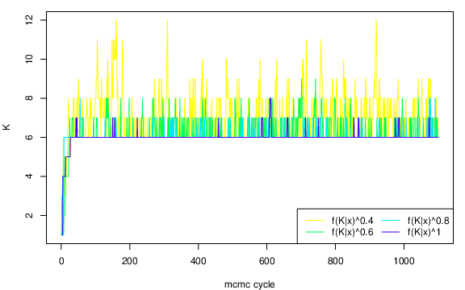</td>
<td style="text-align: center;">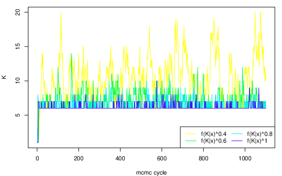</td>
</tr>
<tr class="even">
<td style="text-align: center;">(a)</td>
<td style="text-align: center;">(b)</td>
</tr>
<tr class="odd">
<td style="text-align: center;">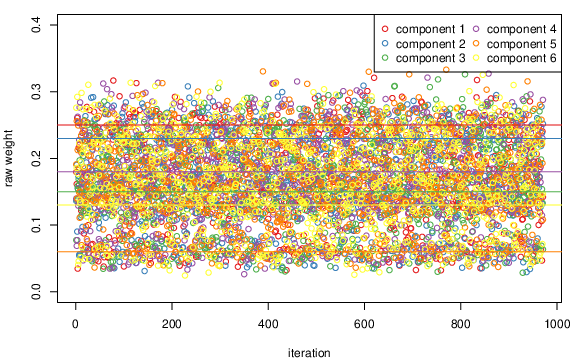</td>
<td style="text-align: center;">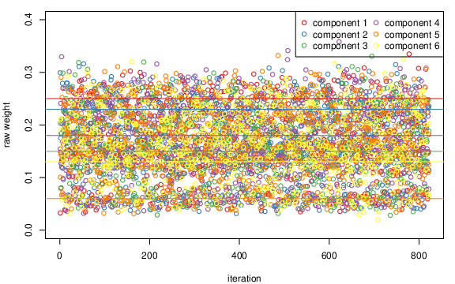</td>
</tr>
<tr class="even">
<td style="text-align: center;">(c)</td>
<td style="text-align: center;">(d)</td>
</tr>
<tr class="odd">
<td style="text-align: center;">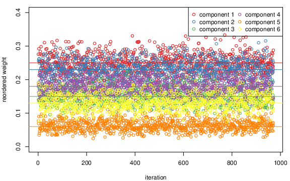</td>
<td style="text-align: center;">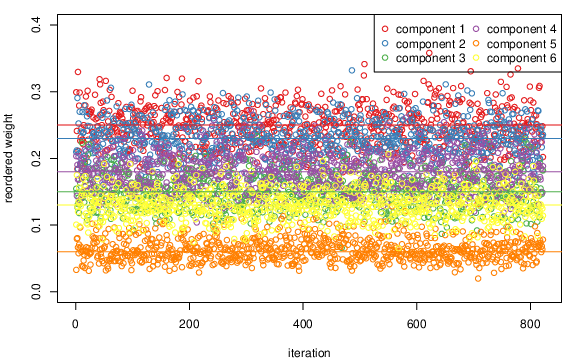</td>
</tr>
<tr class="even">
<td style="text-align: center;">(e)</td>
<td style="text-align: center;">(f)</td>
</tr>
<tr class="odd">
<td style="text-align: center;">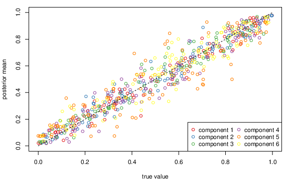</td>
<td style="text-align: center;">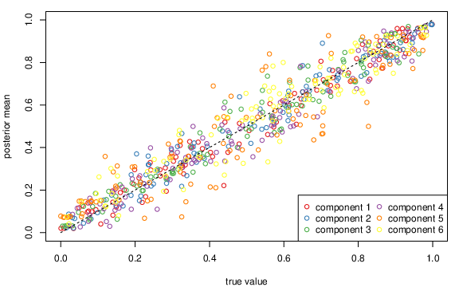</td>
</tr>
<tr class="even">
<td style="text-align: center;">(g)</td>
<td style="text-align: center;">(h)</td>
</tr>
</tbody>
</table>
<figcaption>Figure 4: Results for simulated data with <span
class="math inline"><em>K</em><sub>true</sub> = 6</span> using the
Poisson (left) or uniform (right) prior distribution on the number of
clusters (<span class="math inline"><em>K</em></span>). (a) and (b):
generated values of <span class="math inline"><em>K</em></span> per
heated chain. (c) and (d): raw output of <span
class="math inline"><em>p</em><sub>1</sub>, …, <em>p</em><sub><em>K</em></sub></span>
conditionally on <span class="math inline"><em>K</em> = 6</span>. (e)
and (f): reordered sample according to ECR algorithm. Horizontal lines
indicate true values of relative number of observations per cluster. (g)
and (h): posterior mean estimates of Bernoulli parameters per cluster
versus true values.</figcaption>
</figure>

Next we inspect the MCMC output conditionally on the event that the
number of clusters equals $6$ and compare to the true parameter values.
At first, we can inspect the raw MCMC output, which is not identifiable
due to the label switching problem. Thus, this information is not
directly returned to the user, however it is saved to the file
`rawMCMC.mapK.6.txt` in the output directory specified by the `output`
argument. For illustration we plot the raw values of mixture weights. As
shown in Figures [4](#fig:bbm1).(c) and [4](#fig:bbm1).(d), the sample
is mixing very well to the symmetric posterior areas, since in every
iteration labels are changing. The corresponding reordered values
(according to the ECR algorithm) are returned to the user as an `"mcmc"`
object named `parameters.ecr.mcmc`, shown in Figures [4](#fig:bbm1).(e)
and [4](#fig:bbm1).(f). Note that the high posterior density areas are
quite close to the true values of relative frequencies of generated
observations per cluster (indicated by horizontal lines). Finally,
Figures [4](#fig:bbm1).(g) and [4](#fig:bbm1).(h) display the posterior
mean estimates (arising from the reordered MCMC sample) versus the true
values of $\theta_{kj}$, $k = 1,\ldots,6$; $j = 1,\ldots,100$.

<figure id="fig:bbm_flexmix">
<table>
<caption> </caption>
<tbody>
<tr class="odd">
<td style="text-align: center;">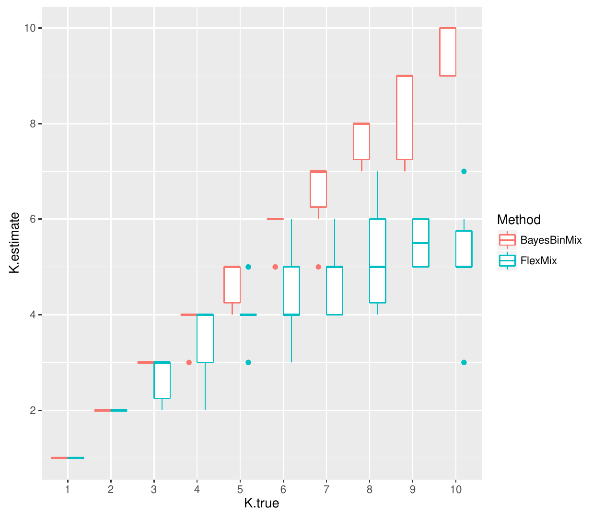</td>
<td style="text-align: center;">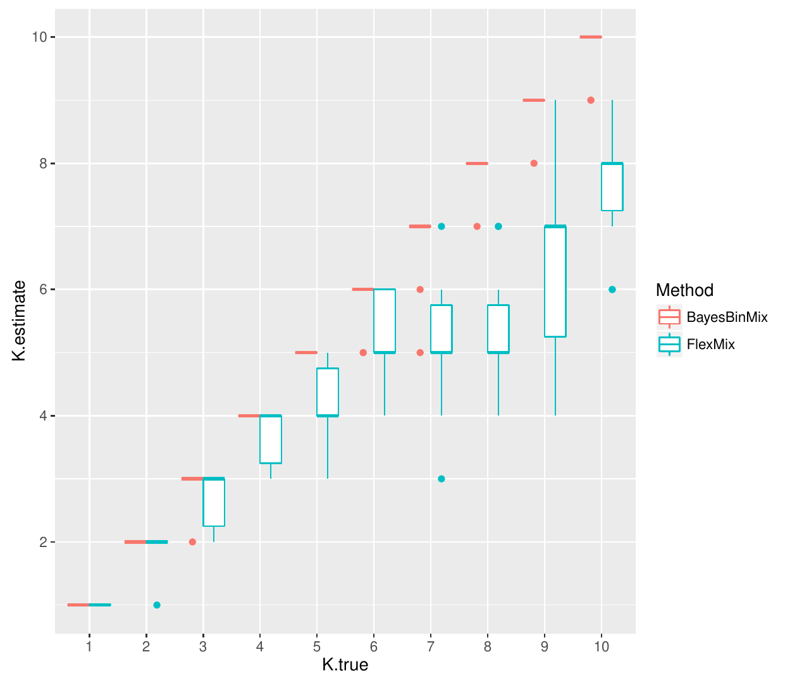</td>
</tr>
<tr class="even">
<td style="text-align: center;">(a) <span
class="math inline"><em>n</em> = 200</span></td>
<td style="text-align: center;">(b) <span
class="math inline"><em>n</em> = 300</span></td>
</tr>
<tr class="odd">
<td style="text-align: center;">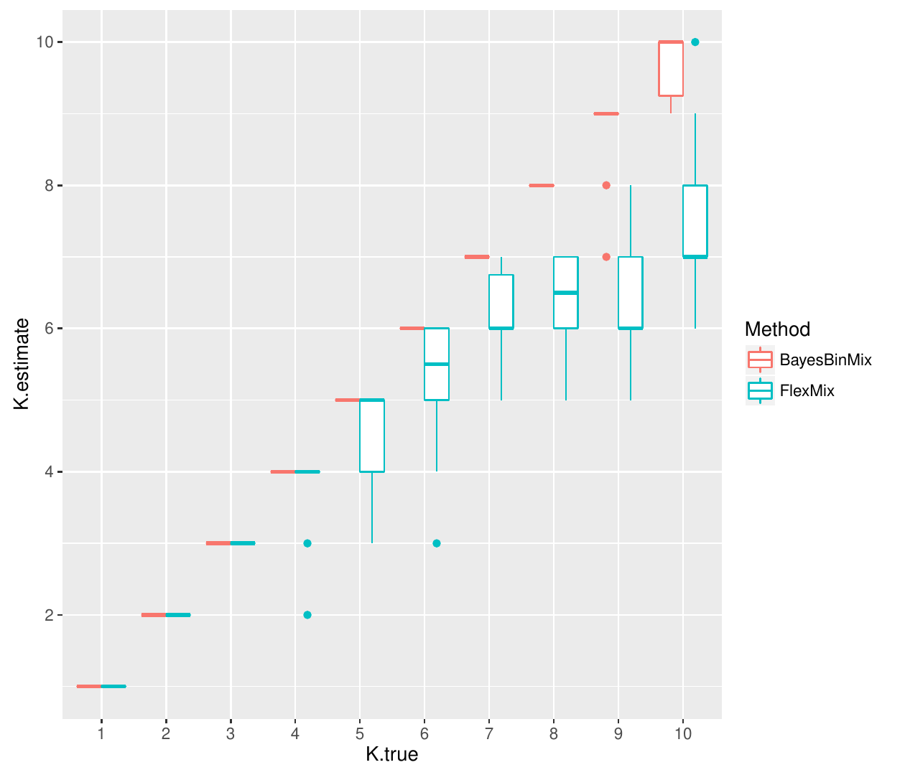</td>
<td style="text-align: center;">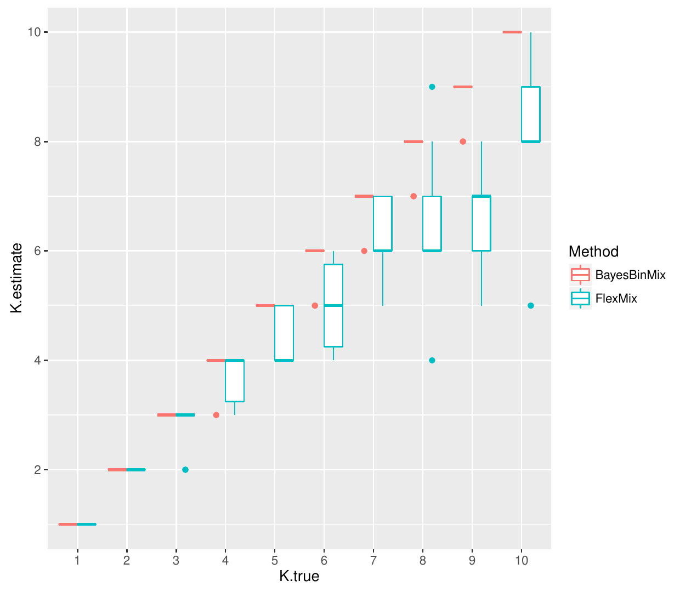</td>
</tr>
<tr class="even">
<td style="text-align: center;">(c) <span
class="math inline"><em>n</em> = 400</span></td>
<td style="text-align: center;">(d) <span
class="math inline"><em>n</em> = 500</span></td>
</tr>
</tbody>
</table>
<figcaption>Figure 5: Model selection comparison between
<em>BayesBinMix</em> and <em>FlexMix</em>. The x axis corresponds to the
true number of clusters and the y axis to the estimated value. Each
boxplot corresponds to 10 simulated datasets from a mixture of Bernoulli
distributions.</figcaption>
</figure>

### Model selection study

Next we are dealing with model selection issues, that is, selecting the
appropriate number of clusters. For this reason we compare *BayesBinMix*
with the EM-algorithm implementation provided in *FlexMix*. Under a
frequentist framework, the selection of the number of mixture components
is feasible using penalized likelihood criteria, such as the BIC
[@Schwarz:78] or ICL [@Biernacki:2000], after fitting a mixture model
for each possible value of $K$. We used the ICL criterion since it has
been shown to be more robust than BIC, see
e.g. @papastamoulis2016estimation. We considered that the true number of
clusters ranges in the set $\{1,2,\ldots,10\}$ and for each case we
simulated 10 datasets using the same data generation procedure as
previously but without introducing any missing values due to the fact
that *FlexMix* does not handle missing data. The number of observations
varies in the set $n\in\{200,300,400,500\}$. For each simulated data the
general call is the following.

``` r
> library("BayesBinMix")
> library("flexmix")
> nChains <- 8
> heats <- seq(1,0.4,length = nChains)
> cm <- coupledMetropolis(Kmax = 20, nChains = nChains, heats =  heats, binaryData = x,
		          outPrefix = "sampler", ClusterPrior = "poisson", m = 330, burn = 30)
# now run flexmix for binary data clustering
> ex <- initFlexmix(x ~ 1, k = 1:20, model = FLXMCmvbinary(), 
	            control = list(minprior = 0), nrep = 10)
```

Note that for both algorithms the number of clusters varies in the set
$\{1,\ldots,20\}$. Eight heated chains are considered for the MCMC
scheme, while each run of the EM algorithm is initialised using
`nrep = 10` different starting points in *FlexMix*. Here we used a total
of only `m = 330` MCMC cycles in order to show that reliable estimates
can be obtained using small number of iterations. Figure
[5](#fig:bbm_flexmix) displays the most probable number of mixture
components estimated by *BayesBinMix* and the selected number of
clusters using *FlexMix*, for each possible value of the true number of
clusters used to simulate the data. Observe that when the number of
clusters is less than 5 both methods are able to estimate the true
number of mixture components. However, *FlexMix* tends to underestimate
the number of clusters when $K \geqslant 5$, while *BayesBinMix* is able
to recover the true value in most cases.

## Real data {#sec:realdata}

We consider the zoo database available at the UC Irvine Machine Learning
Repository [@Lichman:2013]. The database contains 101 animals, each of
which has 15 boolean attributes and 1 discrete attribute (`legs`). The
partition of animals into a total of 7 classes (mammal, bird, reptile,
fish, amphibian, insect and invertebrate) can be considered as the
ground-truth clustering of the data, provided in the vector
`z.ground_truth`. Following @li2005general, the discrete variable `legs`
is transformed into six binary features, which correspond to 0, 2, 4, 5,
6 and 8 legs, respectively. Also we eliminate one of the two entries
corresponding to `frog`, as suggested by @li2005general. In total we
consider an $100\times 21$ binary array `x` as the input data.

Recall that the Bernoulli mixture in Equation \@ref(eq:mixture) assumes
that each cluster consists of a product of independent Bernoulli
distributions. Here this assumption is not valid due to the fact that
the six new binary variables arising from `legs` are not independent:
they should sum to $1$. Nevertheless, it is interesting to see how our
method performs in cases that the data is not generated by the assumed
model.

We test our method considering both prior assumptions on the number of
clusters, as well as different hyper-parameters on the prior
distribution of $\theta_{kj}$ in Equation \@ref(eq:priorTheta): we
consider $\alpha = \beta = 1$ (default values) as well as
$\alpha = \beta = 0.5$. Note that the second choice corresponds to the
Jeffreys prior [@jeffreys] for a Bernoulli trial. Figure [6](#fig:zoo)
displays the estimated posterior distribution of the number of clusters
$K$ when $K\in\{1,\ldots,20\}$. This is done with the following
commands.

<figure id="fig:zoo">
<table>
<caption> </caption>
<tbody>
<tr class="odd">
<td style="text-align: center;">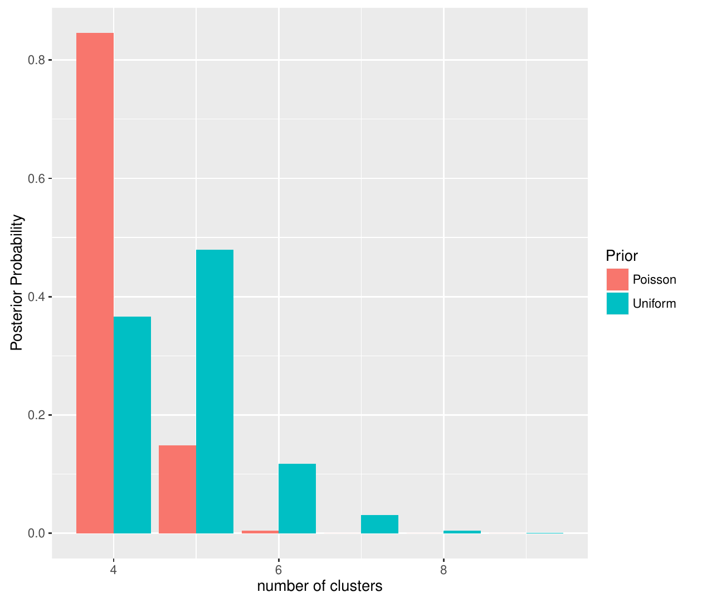</td>
<td style="text-align: center;">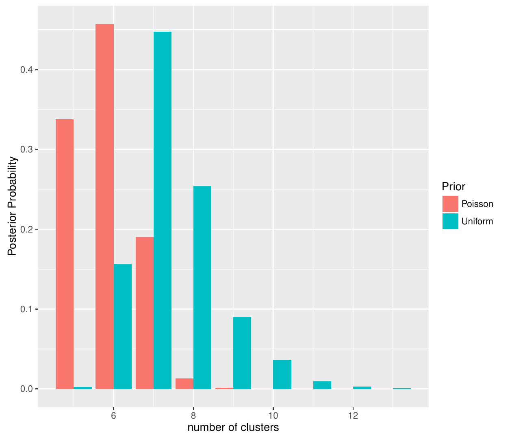</td>
</tr>
<tr class="even">
<td style="text-align: center;">(a) <span
class="math inline"><em>α</em> = <em>β</em> = 1</span> (Uniform)</td>
<td style="text-align: center;">(b) <span
class="math inline"><em>α</em> = <em>β</em> = 0.5</span> (Jeffreys)</td>
</tr>
</tbody>
</table>
<figcaption>Figure 6: Zoo dataset: Estimated posterior distribution of
the number of clusters when using different parameters <span
class="math inline">(<em>α</em>,<em>β</em>)</span> on the beta prior of
<span
class="math inline"><em>θ</em><sub><em>k</em><em>j</em></sub></span>.
Both choices of the prior on the number of clusters are considered:
truncated Poisson (red) and uniform (green).</figcaption>
</figure>

``` r
# read data
> xOriginal <- read.table("zoo.data", sep = ",")
> x <- xOriginal[ , -c(1, 14, 18)]
> x <- x[-27, ] # delete 2nd frog
# now transform v14 into six binary variables
> v14 <- xOriginal[-27, 14]
> newV14 <- array(data = 0, dim = c(100, 6))
> for(i in 1:100){
+        if( v14[i] == 0 ){ newV14[i,1] = 1 }
+        if( v14[i] == 2 ){ newV14[i,2] = 1 }
+        if( v14[i] == 4 ){ newV14[i,3] = 1 }
+        if( v14[i] == 5 ){ newV14[i,4] = 1 }
+        if( v14[i] == 6 ){ newV14[i,5] = 1 }
+        if( v14[i] == 8 ){ newV14[i,6] = 1 }
+ }
> x <- as.matrix(cbind(x, newV14))

# apply BayesBinMix using 8 heated chains
> library("BayesBinMix")
> nChains <- 8
> heats <- seq(1, 0.6, length = nChains)

# K ~ P{1,...,20}, theta_{kj} ~ Beta(1, 1)
> c1 <- coupledMetropolis(Kmax = 20, nChains = nChains, heats =
                          heats, binaryData = x,
+	                  outPrefix = "poisson-uniform", ClusterPrior = "poisson", 
+	                  m = 4400, burn = 400, z.true = z.ground_truth)

# K ~ U{1,...,20}, theta_{kj} ~ Beta(1, 1)
> c2 <- coupledMetropolis(Kmax = 20, nChains = nChains, heats =  heats, binaryData = x,
+	                  outPrefix = "uniform-uniform", ClusterPrior = "uniform", 
+	                  m = 4400, burn = 400, z.true = z.ground_truth)

# K ~ P{1,...,20}, theta_{kj} ~ Beta(0.5, 0.5)
> c3 <- coupledMetropolis(Kmax = 20, nChains = nChains, heats =  heats, binaryData = x,
+	                  outPrefix = "poisson-jeffreys", ClusterPrior = "poisson", 
+	                  m = 4400, burn = 400, z.true = z.ground_truth)

# K ~ U{1,...,20}, theta_{kj} ~ Beta(0.5, 0.5)
> c4 <- coupledMetropolis(Kmax = 20, nChains = nChains, heats =  heats, binaryData = x,
+	                  outPrefix = "uniform-jeffreys", ClusterPrior = "uniform", 
+	                  m = 4400, burn = 400, z.true = z.ground_truth)
```

{#fig:zoo_clusters
width="100%" alt="graphic without alt text"}

Next, we compare the estimated clusters (for the most probable value of
$K$) with the classification of the data into 7 classes (given in the
vector `z.ground_truth`). For this reason we provide the rand index
(adjusted or not) based on the confusion matrix between the estimated
and ground-truth clusters, using the package
[*flexclust*](https://CRAN.R-project.org/package=flexclust)
[@flexclust].

``` r
> library("flexclust")
> z <- array(data = NA, dim = c(100, 4))
> z[ , 1] <- c1$clusterMembershipPerMethod$ECR
> z[ , 2] <- c2$clusterMembershipPerMethod$ECR
> z[ , 3] <- c3$clusterMembershipPerMethod$ECR
> z[ , 4] <- c4$clusterMembershipPerMethod$ECR
> rand.index <- array(data = NA, dim = c(4, 3))
> rownames(rand.index) <- c("poisson-uniform", "uniform-uniform",
			    "poisson-jeffreys", "uniform-jeffreys")
> colnames(rand.index) <- c("K_map", "rand_index", "adjusted_rand_index")
> findMode <- function(x){ as.numeric( names(sort(-table(x$K.mcmc)))[1] ) }
> rand.index[ , 1] <- c( findMode(c1), findMode(c2), findMode(c3), findMode(c4) )
> for(i in 1:4){
+ 	rand.index[i, 2] <- randIndex(table(z[ , i], z.ground_truth), correct = FALSE)
+ 	rand.index[i, 3] <- randIndex(table(z[ , i], z.ground_truth))
+ }
> rand.index
                 K_map rand_index adjusted_rand_index
poisson-uniform      4  0.9230303           0.7959666
uniform-uniform      5  0.9408081           0.8389208
poisson-jeffreys     6  0.9505051           0.8621216
uniform-jeffreys     7  0.9490909           0.8525556
```

Note that both rand indices (raw and adjusted) are larger for `z[, 3]`,
that is, the six-component mixture model that corresponds to the Poisson
prior on $K$ and the Jeffreys prior on $\theta_{kj}$. A detailed view on
the estimated clusters for this particular model is shown in Figure
[7](#fig:zoo_clusters). We conclude that the estimated groups are
characterized by animals belonging to the same taxonomy with very small
deviations from the true clusters. Interestingly, in the case that an
animal is wrongly assigned to a cluster, notice that the estimated
grouping might still make sense: e.g.  the sea mammals dolphin, porpoise
and seal are assigned to the fourth cluster which is mainly occupied by
the group "fish".

{#fig:times width="100%" alt="graphic without alt text"}

# Summary and remarks

The *BayesBinMix* package for fitting mixtures of Bernoulli
distributions with an unknown number of components has been presented.
The pipeline consists of a fully Bayesian treatment for the clustering
of multivariate binary data: it allows the joint estimation of the
number of clusters and model parameters, deals with identifiability
issues as well as produces a rapidly mixing chain. Using a simulation
study we concluded that the method outperforms the EM algorithm in terms
of estimating the number of clusters and at the same time produces
accurate estimates of the underlying model parameters. In the real
dataset we explored the flexibility provided by using different prior
assumptions and concluded that the estimated clusters are strongly
relevant to the natural grouping of the data.

For the prior distribution on the number of clusters our experience
suggests that the truncated Poisson distribution performs better than
the uniform (see also @Nobile2007). Regarding the prior distribution on
the Bernoulli parameters we recommend to try both the uniform
distribution (default choice) as well as the Jeffreys prior, especially
when the sample size is small. An important parameter is the number of
heated chains which run in parallel, as well as the temperature of each
chain. We suggest to run at least `nChains = 4` heated chains. The
`heat` parameter for each presented example achieved an acceptance ratio
of proposed swaps between pairs of chains between $10\%$ and $70\%$. The
default choice for the temperature vector is
`heats = seq(1, 0.3, length = nChains)`, however we advise to try
different values in case that the swap acceptance ratio is too small
(e.g.  $<2\%$) or too large (e.g. $>90\%$). Finally, we recommend
running the algorithm using at least `m = 1100` and `burn = 100` for
total number of MCMC cycles and burn-in period, respectively. For these
particular values of `nChains` and `m`, Figure [8](#fig:times) displays
the wall clock time demanded by the `coupledMetropolis()` function.

# Acknowledgements

Research was funded by MRC award MR/M02010X/1. The authors would like to
thank Rebecca Howard and Dr. Lijing Lin (University of Manchester) for
using the software and reporting bugs to earlier versions. We also thank
an anonymous reviewer and Roger Bivand, Editor of the R Journal, for
their valuable comments and suggestions that considerably improved the
package and the presentation of our findings.

