# Introduction

There are many kinds of networks, and networks are extensively studied
across many disciplines [@watts2004ars]. For instance, social network
analysis is a longstanding and prominent sub-field of sociology, and the
study of biological networks, such as protein-protein interaction
networks or metabolic networks, is a notable sub-field of biology
[@prell2011social; @junker2008analysis]. In addition, the ubiquity of
social media platforms, like Facebook, Twitter, and LinkedIn, has
brought the concepts of networks out of academia and into the
mainstream. Though these disciplines and the many others that study
networks are themselves very different and specialized, they can all
benefit from good network visualization tools.

Many R packages already exist to manipulate network objects, such as
[*igraph*](https://CRAN.R-project.org/package=igraph) by @igraph,
[*sna*](https://CRAN.R-project.org/package=sna) by @sna, and
[*network*](https://CRAN.R-project.org/package=network) by @network
[@network.jss see also]. Each one of these packages were developed with
a focus of analyzing network data and not necessarily for rendering
visualizations of networks. Though these packages do have network
visualization capabilities, visualization was not intended as their
primary purpose. This is by no means a critique or an inherently
negative aspect of these packages: they are all hugely important tools
for network analysis that we have relied on heavily in our own work. We
have found, however, that visualizing network data in these packages
requires a lot of extra work if one is accustomed to working with more
common data structures such as vectors, data frames, or arrays. The
visualization tools in these packages require detailed knowledge of each
one of them and their syntax in order to build meaningful network
visualizations with them. This is obviously not a problem if the user is
very familiar with network structures and has already spent time working
with network data. If, however, the user is new to network data or is
more comfortable working with the aforementioned common data structures,
they could find the learning curve for these packages burdensome.

The packages described in this paper have, by contrast, have one primary
purpose: to create beautiful network visualizations by providing a
wrapper of existing network layout capabilities (see for example the
[*statnet*](https://CRAN.R-project.org/package=statnet) suite of
packages by @statnet) to the popular
[*ggplot2*](https://CRAN.R-project.org/package=ggplot2) package
[@ggplot2]. And so, our focus here is not on adding to the analysis of
network data or to the field of graph drawing, [cf.  @graphdrawing] but
rather it is on implementing existing graph drawing capabilities in the
*ggplot2* framework, using the common data frame structure. The
*ggplot2* package is hugely popular, and many other packages and tools
interface with it in order to better visualize a wide variety of data
types. By creating a *ggplot2* implementation, we hope to place network
visualization within a large, active community of data visualization
enthusiasts, bringing new eyes and potentially new innovations to the
field of network visualization. With our approaches, we have two primary
audiences in mind. The first audience is made up of frequent users of
network structures and those who are fluent in the language of packages
such as *network* or *igraph*. This audience will find that two of our
three approaches (`ggnet2` and
[*ggnetwork*](https://CRAN.R-project.org/package=ggnetwork)) directly
incorporate the network structures and functions with which they are
familiar with into the less familiar visualization paradigm of *ggplot2*
[@ggnetwork]. The second audience, targeted by
[*geomnet*](https://CRAN.R-project.org/package=geomnet), consists of
those users who are not familiar with network structures, but are
familiar with data manipulation and tidying, and who happen to find
themselves examining some data that can be expressed as a network
[@geomnet]. For this audience, we do the heavy network lifting
internally, while also relying on their familiarity with *ggplot2*
externally.

The *ggplot2* package was designed as an implementation of the 'grammar
of graphics' proposed by @wilkinson:1999, and it has become extremely
popular among R users. [^1]

Because the syntax implemented in the *ggplot2* package is extendable to
different kinds of visualizations, many packages have built additional
functionality on top of the *ggplot2* framework. Examples include the
[*ggmap*](https://CRAN.R-project.org/package=ggmap) package by @ggmap
for spatial visualization, the
[*ggfortify*](https://CRAN.R-project.org/package=ggfortify) package for
visualizing statistical models (see @ggfortify, @ggfortify2), the
package [*GGally*](https://CRAN.R-project.org/package=GGally) by
@ggally, which encompasses various complementary visualization
techniques to *ggplot2*, and the
[*ggbio*](https://www.bioconductor.org/packages/release/bioc/html/ggbio.html)
and
[*ggtree*](https://www.bioconductor.org/packages/release/bioc/html/ggtree.html)
Bioconductor packages by @ggbio and @ggtree, which both provide
visualizations for biological data. These packages have expanded the
utility of *ggplot2*, likely resulting in an increase of its user base.
We hope to appeal to this user base and potentially add to it by
applying the benefits of the grammar of graphics implemented in
*ggplot2* to network visualization.

Our efforts rely upon recent changes to *ggplot2*, which allow users to
more easily extend the package through additional geometries or `geoms`.
[^2]

In the remainder of this paper, we present three different approaches to
network visualization through *ggplot2* wrappers. The first is a
function, `ggnet2` from the *GGally* package, that acts as a wrapper
around a network object to create a *ggplot2* graph. The second is a
package, *geomnet*, that combines all network pieces (nodes, edges, and
labels) into a single `geom` and is intended to look the most like other
*ggplot2* `geom`s in use. The final is another package, *ggnetwork*,
that performs some data manipulation and aliases other `geom`s in order
to layer the different network aspects one on top of the other. The
section [2](#sec:background) introduces the basic terminology of
networks and illustrates their ubiquity in natural and social life. The
next section [3](#sec:implementations) then discusses the structure and
capabilities of each of the three approaches that we offer. The
section [4](#sec:examples) extends that discussion through several
examples ranging from simple to complex networks, for which we provide
the code corresponding to each approach alongside its graphical result.
We follow with some considerations of runtime behavior in plotting
networks in the section [5](#sec:speed) before closing with a
discussion.

# Brief introduction to networks {#sec:background}

In its essence, a network is simply a set of vertices connected in pairs
by a set of edges [@newman]. Throughout this paper, we also use the term
node to refer to vertices, as well as the terms ties or relationships to
refer to edges, depending on context. The two sets of graphical objects
that make up a network visualization, points and segments between them,
have been used to examine a huge variety and quantity of information
across many different fields of study. For instance, networks of
scientific collaboration, a food web of marine animals, and American
college football games are all covered in a paper on community detection
in networks by @football. Additionally, @networkfailures study node
failure in interdependent networks like power grids. Social networks
such as links between television and film actors found on
<http://www.imdb.com/> and neural networks, like the completely mapped
neural network of the *C. elegans* worm are also extensively studied
[@smallworld].

These examples show that networks can vary widely in scope and
complexity: the smallest connected network is simply one edge between
two vertices, while one of the most commonly used and most complex
networks, the world wide web, has billions of vertices (Web pages) and
billions of edges (hyperlinks) connecting them. Additionally, the edges
in a network can be directed or undirected: directed edges represent an
ordering of vertices, like a relationship extending from one vertex to
another, where switching the direction would change the structure of the
network. The World Wide Web is an example of a directed network because
hyperlinks connect one Web page to another, but not necessarily the
other way around. Undirected edges are simply connections between
vertices where order does not matter. Co-authorship networks are
examples of undirected networks, where nodes are authors and they are
connected by an edge if they have written an academic publication
together.

As a reference example, we turn to a specific instance of a social
network. A social network is a network that everyone is a part of in one
way or another, whether through friends, family, or other human
interactions. We do not necessarily refer here to social media like
Facebook or LinkedIn, but rather to the connections we form with other
people. To demonstrate the functionality of our tools for plotting
networks, we have chosen an example of a social network from the popular
television show *Mad Men*. This network, which was compiled by @madmen
and made available in
[*gcookbook*](https://CRAN.R-project.org/package=gcookbook)
[@gcookbook], consists of 52 vertices and 87 edges. Each vertex
represents a character on the show, and there is an edge between every
two characters who have had a romantic relationship.

{#fig.cap:madmen width="100%" alt="graphic without alt text"}

Figure [1](#fig.cap:madmen) is a visualization of this network. In the
plot, we can see one central character who has many more relationships
than any other character. This vertex represents the main character of
the show, Don Draper, who is quite the "ladies' man.\" Networks like
this one, no matter how simple or complex, are everywhere, and we hope
to provide the curious reader with a straightforward way to visualize
any network they choose.

Coloring the vertices or edges in a graph is a quick way to visualize
grouping and helps with pattern or cluster detection. The vertices in a
network and the edges between them compose the structure of a network,
and being able to visually discover patterns among them is a key part of
network analysis. Viewing multiple layouts of the same network can also
help reveal patterns or clusters that would not be discovered when only
viewing one layout or analyzing only its underlying adjacency matrix.

# Three implementations of network visualizations {#sec:implementations}

We present two basic approaches to using the *ggplot2* framework for
network visualization. First, we implement network visualizations by
providing a wrapper function, `ggnet2` for the user to visualize a
network using *ggplot2* elements [@ggally]. Second, we implement network
visualizations using layering in *ggplot2*. For the second approach, we
have two ways of creating a network visualization. The first, *geomnet*,
wraps all network structures, including vertices, edges, and vertex
labels into a single `geom`. The second, *ggnetwork*, implements each of
these structural components in an independent `geom` and layers them to
create the visualization [@ggnetwork]. In each package, our goal is to
provide users with a way to map network properties to aesthetic
properties of graphs that is familiar to them and straightforward to
implement. Each package has a slightly different approach to accomplish
this goal, and we will discuss all of these approaches in this section.
For each implementation, we also provide the code necessary to create
Figure [1](#fig.cap:madmen), and describe the arguments used. We
conclude the section with a side-by-side comparison of the features
available in all three implementations in Table [1](#tab:comparison).

## ggnet2

The `ggnet2` function is a part of the *GGally* package, a suite of
functions developed to extend the plotting capabilities of *ggplot2*
[@ggally]. A detailed description of the `ggnet2` function is available
from within the package as a vignette. Some example code to recreate
Figure [1](#fig.cap:madmen) using `ggnet2` is presented below.

``` r
library(GGally)
library(network)
# make the data available
data(madmen, package = 'geomnet')
# data step for both ggnet2 and ggnetwork
# create undirected network
mm.net <- network(madmen$edges[, 1:2], directed = FALSE)
mm.net # glance at network object
##  Network attributes:
##   vertices = 45 
##   directed = FALSE 
##   hyper = FALSE 
##   loops = FALSE 
##   multiple = FALSE 
##   bipartite = FALSE 
##   total edges= 39 
##     missing edges= 0 
##     non-missing edges= 39 
## 
##  Vertex attribute names: 
##     vertex.names 
## 
## No edge attributes
# create node attribute (gender)
rownames(madmen$vertices) <- madmen$vertices$label
mm.net %v% "gender" <- as.character(
  madmen$vertices[ network.vertex.names(mm.net), "Gender"]
)
# gender color palette
mm.col <- c("female" = "#ff69b4", "male" = "#0099ff")
# create plot for ggnet2
set.seed(10052016)
ggnet2(mm.net, color = mm.col[ mm.net %v% "gender" ],
       labelon = TRUE, label.color = mm.col[ mm.net %v% "gender" ],
       size = 2, vjust = -0.6, mode = "kamadakawai", label.size = 3)

```

The `ggnet2` function offers a large range of network visualization
functionality in a single function call. Although its result is a
*ggplot2* object that can be further styled with *ggplot2* scales and
themes, the syntax of the `ggnet2` function is designed to be easily
understood by the users, who may not be familiar with *ggplot2* objects.
The aesthetics relating to the nodes are controlled by arguments such as
`node.alpha` or `node.color`, while those relating to the edges are
controlled by arguments starting with `edge`. Additionally, as seen in
the code above, the usual *ggplot2* arguments like `color` can be used
without the prefix to map node attributes to aesthetic values. The
arguments with the `node.` prefix are aliased versions for readability
of the code. Thus, while `ggnet2` applies the grammar of graphics to
network objects, the function itself still works very much like the
plotting functions of the *igraph* and *network* packages: a long series
of arguments is used to control every possible aspect of how the network
should be visualized.

The `ggnet2` function takes a single network object as input. This
initial object might be an object of class `"network"` from the
*network* package (with the exception of hypergraphs or multiplex
graphs), or any data structure that can be coerced to an object of that
class via functions in the *network* package, such as an incidence
matrix, an adjacency matrix, or an edge list. Additionally, if the
[*intergraph*](https://CRAN.R-project.org/package=intergraph) package
[@intergraph] is installed, the function also accepts a network object
of class `"igraph"`. Internally, the function converts the network
object to two data frames: one for edges and another one for nodes. It
then passes them to *ggplot2*. Each of the two data frames contain the
information required by *ggplot2* to plot segments and points
respectively, such as a shape for the points (nodes) and a line type for
the segments (edges). The final result returned to the user is a plot
with a minimum of two layers, or more if there are edge and/or node
labels.

The `mode` argument of `ggnet2` controls how the nodes of the network
are to be positioned in the plot returned by the function. This argument
can take any of the layout values supported by the `gplot.layout`
function of the *sna* package, and defaults to `fruchtermanreingold`,
which places the nodes through the force-directed layout algorithm by
@fruchterman_reingold. In the example presented above, the Kamada-Kawai
layout is used by adding `mode = "kamadakawai"` to the function call.
Many other possible layouts and their parameters can also be passed to
`ggnet2` through the `layout.par` argument. For a list of possible
layouts and their arguments, see `?sna::gplot.layout`.

Other arguments passed to the `ggnet2` function offer extensive control
over the aesthetics of the plot that it returns, including the addition
of edge and/or node labels and their respective aesthetics. Arguments
such as `node.shape` or `edge.lty`, which control the shape of the nodes
and the line type of the edges, respectively, can take a single global
value, a vector of global values, or the name of an edge or vertex
attribute to be used as an aesthetic mapping. This feature is used to
change the size of the nodes and the node labels by including `size = 2`
and `label.size = 3` in the function call.

This last functionality builds on one of the strengths of the
`"network"` class, which can store information on network edges and
nodes as attributes that are then accessible to the user through the
`%e%` and `%v%` operators respectively. [^3] Usage examples of these
operators can be seen above. The attribute of gender is assigned to
nodes, which in turn is accessed to color the nodes and node labels by
gender. If the `ggnet2` function is given the
`node.alpha = "importance"` argument, it will interpret it as an attempt
to map the vertex attribute called `importance` to the transparency
level of the nodes. This works exactly like the command
`net %v% "importance"`, which returns the vertex attribute `importance`
of the `"network"` object `net`. This functionality allows the `ggnet2`
function to work in a similar fashion to *ggplot2* mappings of
aesthetics within the `aes` operator.

The `ggnet2` function also provides a few network-specific options, such
as sizing the nodes as a function of their unweighted degree, or using
the primary and secondary modes of a bipartite network as an aesthetic
mapping for the nodes.

All in all, the `ggnet2` function combines two different kinds of
processes: it translates a network object into a data frame suitable for
plotting with *ggplot2*, and it applies network-related aesthetic
operations to that data frame, such as coloring the edges in function of
the color of the nodes that they connect.

## geomnet

``` r
# also loads ggplot2
library(geomnet)

# data step: join the edge and node data with a fortify call
MMnet <- fortify(as.edgedf(madmen$edges), madmen$vertices)
# create plot
set.seed(10052016)
ggplot(data = MMnet, aes(from_id = from_id, to_id = to_id)) +
  geom_net(aes(colour = Gender), layout.alg = "kamadakawai", 
           size = 2, labelon = TRUE, vjust = -0.6, ecolour = "grey60",
           directed =FALSE, fontsize = 3, ealpha = 0.5) +
  scale_colour_manual(values = c("#FF69B4", "#0099ff")) +
  xlim(c(-0.05, 1.05)) +
  theme_net() +
  theme(legend.position = "bottom")
```

### Data structure

The package *geomnet* implements network visualization in a single
*ggplot2* layer. A stable version is available on CRAN, with a
development version available at <https://github.com/sctyner/geomnet>.
The package has two main functions: `stat_net`, which performs all of
the calculations, and `geom_net`, which renders the plot. It also
contains the secondary functions `geom_circle` and `theme_net`, which
assist, respectively, in drawing self-referencing edges and removing
axes and other background elements from the plots. The approach in
*geomnet* is similar to the implementation of other, native *ggplot2*
geoms, such as `geom_smooth`. When using `geom_smooth`, the user does
not need to know about any of the internals of the loess function, and
similarly, when using `geomnet`, the user is not expected to know about
the internals of the layout algorithm, just the name of the algorithm
they'd like to use. On the other hand, if users are comfortable with
network analysis, the entire body of layout methods provided by the
*sna* package is available to them through the parameters `layout.alg`
and `layout.par`.

In network analysis there are usually two sources of information: one
data set consisting of a description of the nodes, represented as the
vertices in the network and vertex attributes, and another data set
detailing the relationship between these nodes, i.e. it consists of the
edge list and any additional edge attributes. The minimum amount of
information needed is a vector of all vertex labels and a two column
data frame that encodes the edge list of the network. In order for this
geometry to work, these two data sets need to be combined into a single
data frame. For this, we implemented several new `fortify` methods for
producing the correct data structure from different S3 objects that
encode network information. Supported classes are `"network"` from the
*sna* and *network* packages, `"igraph"` from the *igraph* package,
`"adjmat"`, and `"edgedf"`. The last two are new classes introduced in
*geomnet* that are identical to the `"matrix"` and `"data.frame"`
classes, respectively. We created these new classes and the functions
`as.adjmat()` and `as.edgedf()` so that network data in adjacency matrix
and edgelist (data frame) formats can have their own fortify functions,
separate from the very generic `"matrix"` and `"data.frame"` classes.
These fortify functions combine the edge and the node information using
a full join. A full join is used because generally, there will be some
vertices that are sinks in the network because they only show up in the
'to' column, and so we accommodate for these by adding artificial edges
in the data set that have missing information for the 'to' column. The
user may also pass two data frames to the function,
e.g. `data = edge_data` and `vertices = vertex_data`, but we recommend
using the `fortify` methods whenever possible.

A usage example of the `fortify.edgedf` method is presented in the code
above with the creation of the `MMnet` data set. Two dataframes,
`madmen$edges` and `madmen$vertices` are joined to create the required
data. The first few rows of these data sets and their merged result are
below.

``` r
head(as.edgedf(madmen$edges), 3)
##        from_id         to_id
## 1 Betty Draper Henry Francis
## 2 Betty Draper    Random guy
## 3   Don Draper       Allison
head(madmen$vertices, 3)
##                     label Gender
## Betty Draper Betty Draper female
## Don Draper     Don Draper   male
## Harry Crane   Harry Crane   male
head(fortify(as.edgedf(madmen$edges), madmen$vertices), 3)
##        from_id         to_id Gender
## 1 Betty Draper Henry Francis female
## 2 Betty Draper    Random guy female
## 3   Don Draper       Allison   male

```

The formal requirements of `stat_net` are two columns, called `from_id`
and `to_id`. During this routine, columns `x, y` and `xend, yend` are
calculated and used as a required input for `geom_net`.

Other variables may also be included for each edge, such as the edge
weight, in-degree, out-degree or grouping variable.

### Parameters and aesthetics

Parameters that are currently implemented in `geom_net` are:

-   **layout:** the `layout.alg` parameter takes a character value
    corresponding to the possible network layouts in the *sna* package
    that are available within the `gplot.layout.*()` family of
    functions. The default layout algorithm used is the Kamada-Kawai
    layout, a force-directed layout for undirected networks
    [@kamadakawai].

    In *sna*, for each layout there is a corresponding set of possible
    layout parameters, `layout.par`, which can be passed as a list to
    `geom_net`. If the user wishes to create small multiples using
    *ggplot2* `facets`, they can use `fiteach`, a logical value
    specifying whether the same layout should be used for all panels
    (default) or each panel's data should be fit separately. Finally,
    the `singletons` parameter is a logical value that dictates whether
    or not to include nodes with zero indegree and zero outdegree in the
    visualization. The default is set to `TRUE`, and if set to `FALSE`
    nodes will only appear in panels where they have indegree or
    outdegree of at least one.

-   **vertices:** any of *ggplot2*'s aesthetics relating to points:
    `colour`, `size`, `shape`, `alpha`, `x`, and `y` are available and
    used for specifying the appearance of nodes in the network. For
    example `aes(colour = Gender)` is used above to color the nodes and
    node labels according to the gender of each character.

-   **edges:** for edges we distinguish between two different sets of
    aesthetics: aesthetics that only relate to line attributes, such as
    `linewidth` and `linetype`, and aesthetics that are also used by the
    point `geom`. The former can be used in the same way as they are
    used in `geom_segment`, while the latter, like `alpha` or `colour`,
    for instance, are used for vertices unless separately specified.
    Instead, use the parameters `ecolour` or `ealpha`, which are only
    applied to the edges. If the `group` variable is specified, a new
    variable, called `samegroup` is added during the layout process.
    This variable is `TRUE`, if an edge is between two vertices of the
    same group, and `FALSE` otherwise. If `samegroup` is `TRUE`, the
    corresponding edge will be colored using the same color as the
    vertices it connects. If the edge is between vertices of a different
    group, the default grey shade is used for the edge.

    The parameter `curvature` is set to zero by default, but if
    specified, leads to curved edges using the newly implemented
    *ggplot2* geom `geom_curve` instead of the regular `geom_segment`.
    Note that the edge specific aesthetics that overwrite node
    aesthetics are currently considered as 'as.is' values: they do not
    get a legend and are not scaled within the ggplot2 framework. This
    is done to avoid any clashes between node and edge scales.

    **self-referencing vertices:** some networks contain self
    references, i.e. an edge has the same vertex id in its from and to
    columns. If the parameter `selfloops` is set to `TRUE`, a circle is
    drawn using the new `geom_circle` next to the vertex to represent
    this self reference.

-   **arrow:** whenever the parameter `directed` is set from its default
    state to `TRUE`, arrows are drawn from the 'from' to the 'to' node,
    with tips pointing towards the 'to' node. By default, arrows have an
    absolute size of 10 points. The entire structure of the arrow can be
    changed by passing an `arrow` object from the
    [*grid*](https://CRAN.R-project.org/package=grid) package to the
    `arrow` argument. If the user doesn't wish to change the whole arrow
    object, the parameters `arrowsize` and `arrowgap` are also
    available. The `arrowsize` argument is of a positive numeric value
    that is used as a multiple of the original arrow size,
    i.e. `arrowsize = 2` shows arrow tips at twice their original size.
    The parameter `arrowgap` can be used to avoid overplotting of the
    arrow tips by the nodes, `arrowgap` specifies a proportion by which
    the edge should be shrunk with default of 0.05. A value of 0.5 will
    result in edges drawn only half way from the 'from' node to the 'to'
    node.

-   **labels:** the `labelon` argument is a logical parameter, which
    when set to `TRUE` will label the nodes with their IDs, as is in
    Figure [1](#fig.cap:madmen). The `aes` option `label` can also be
    used to label nodes, in which case the nodes are labeled with the
    value corresponding to their respective values of the provided
    variable. If `colour` is specified for the nodes, the same values
    are used for the labels, unless `labelcolour` is specified. If
    `fontsize` is specified, it changes the label size to that value in
    points. Other parameter values, such as `vjust` and `hjust` help in
    adjusting labels relative to the nodes. The parameters work in the
    same fashion as in native *ggplot2* `geom`s. Additionally, the label
    can be drawn by using `geom_text` (the default) or using the new
    `geom_label` in *ggplot2* by adding `labelgeom = "label"` to the
    arguments in `geom_net`. Finally, with the help of the package
    [*ggrepel*](https://CRAN.R-project.org/package=ggrepel) by @ggrepel
    we have implemented the logical `repel` argument, which when true,
    uses `geom_text_repel` or `geom_label_repel` to plot the labels
    instead of `geom_text` or `geom_label`, respectively. Using `repel`
    can be extremely useful when the networks are dense or the labels
    are long, as in Figure [1](#fig.cap:madmen), helping to solve a
    common problem with many network visualizations.

## ggnetwork

*ggnetwork* is a small R package that mimics the behavior of `geomnet`
by defining several geoms to achieve similar results.

``` r
# create plot for ggnetwork. uses same data created for ggnet2 function
library(ggnetwork)
set.seed(10052016)
ggplot(data = ggnetwork(mm.net, layout = "kamadakawai"), 
       aes(x, y, xend = xend, yend = yend)) +
  geom_edges(color = "grey50") + # draw edge layer
  geom_nodes(aes(colour = gender), size = 2) + # draw node layer
  geom_nodetext(aes(colour = gender, label = vertex.names),
                size = 3, vjust = -0.6) + # draw node label layer
  scale_colour_manual(values = mm.col) +
  xlim(c(-0.05, 1.05)) +
  theme_blank() +
  theme(legend.position = "bottom")

```

The approach taken by the *ggnetwork* package is to alias some of the
native geoms of the *ggplot2* package. An aliased geom is simply a
variant of an already existing one. The *ggplot2* package contains
several examples of aliased geoms, such as `geom_histogram`, which is a
variant of `geom_bar` see [see @ggplot2 p. 67, Table 4.6].

Following that logic, the *ggnetwork* package adds four aliased
geometries to *ggplot2*:

-   `geom_nodes`, an alias to `geom_point`;

-   `geom_edges`, an alias to either `geom_segment` or `geom_curve`;

-   `geom_nodetext`, an alias to `geom_text`; and

-   `geom_edgetext`, an alias to `geom_label`.

The four geoms are used to plot nodes, edges, node labels and edge
labels, respectively. Two of the geoms that they alias, `geom_curve` and
`geom_label`, are part of the new geometries introduced in *ggplot2*
version 2.1.0. All four geoms behave exactly like those that they alias,
and take exactly the same arguments. The only exception to that rule is
the special case of `geom_edges`, which accepts both the arguments of
`geom_segment` and those of `geom_curve`; if its `curvature` argument is
set to anything but `0` (the default), then `geom_edges` behaves exactly
like `geom_curve`; otherwise, it behaves exactly like `geom_segment`.
Three of the four availble aliased `geom`s are used above to create the
visualization of the Mad Men relationship network.

Just like the `ggnet2` function, the *ggnetwork* package takes a single
network object as input. This can be an object of class `"network"`,
some data structure coercible to that class, or an object of class
`"igraph"` when the *intergraph* package is installed. This object is
passed to the 'workhorse' function of the package, which is also called
`ggnetwork` to create a data frame, and then to the `data` argument of
`ggplot()`.

Internally, the `ggnetwork` function starts by computing the `x` and `y`
coordinates of all nodes in the network with respect to its `layout`
argument, which defaults to the Fruchterman-Reingold layout algorithm
[@fruchterman_reingold]. It then extracts the edge list of the network,
to which it adds the coordinates of the sender and receiver nodes as
well as all edge-level attributes. The result is a data frame with as
many rows as there are edges in the network, and where the `x`, `y`,
`xend` and `yend` hold the coordinates of the network edges.

At that stage, the `ggnetwork` function, like the *geomnet* package,
performs a left-join of that augmented edge list with the vertex-level
attributes of the 'from' nodes. It also adds one self-loop per node, in
order to ensure that every node is plotted even when their degree is
zero---that is, even if the node is not connected to any other node of
the network, and is therefore absent from the edge list. The data frame
created by this process contains one row per edge as well as one
additional row per node, and features all edge-level and vertex-level
attributes initially present in the network. [^4]

The `ggnetwork` function also accepts the arguments `arrow.gap` and
`by`. Like in *geomnet*, `arrow.gap` slightly shortens the edges of
directed networks in order to avoid overplotting edge arrows and nodes.
The argument `by` is intended for use with plot facets. Passing an edge
attribute as a grouping variable to the `by` argument will cause
`ggnetwork` to return a data frame in which each node appears as many
times as there are unique values of that edge attribute, using the same
coordinates for all occurrences. When that same edge attribute is also
passed to either `facet_wrap` or `facet_grid`, each edge of the network
will show in only one panel of the plot, and all nodes will appear in
each of the panels at the same position. This makes the panels of the
plot comparable to each other, and allows the user to visualize the
network structure as a function of a specific edge attribute, like a
temporal attribute.

::: {#tab:comparison}
  --------------------------------- ------------------------------------------------------------------------------------------------------------------------------------------------------ ---------------------------------------------------------------------------------------------------------------------------------------------- ---------------------------------------------------------------------
                                                                                                           `ggnet2`                                                                                                                                          `geom_net`                                                                                      `geom_nodes`, `geom_edges`, etc

  Functionality                                                                                           (*GGally*)                                                                                                                                        (*geomnet*)                                                                                               (*ggnetwork*)

  Data                               object of class `"network"` or object easily converted to that class (i.e. incidence or adjacency matrices, edge list) or object of class `"igraph"`   a fortified `"network"`, `"igraph"`, `"edgedf"`, or `"adjmat"` object OR one edge data frame and one node data frame to be merged internally                            same as `ggnet2`

  Naming conventions                                                      `node._`, `edge._`, `label._`, `edge.label._` for `alpha`, `color`, etc.                                                                             arguments identical to *ggplot2* with exception of `ecolor`, `ealpha`                                                                same as *ggplot2*

  Layout package & default                                                                       *sna*, Fruchterman-Reingold                                                                                                                            *sna*, Kamada-Kawai                                                                                    *sna*, Fruchterman-Reingold

  Aesthetic mappings to variables                                               all `alpha`, `color`, `shape`, `size` for nodes, edges, labels                                                                       `colour`, `size`, `shape`, `x`, `y`, `linetype`, `linewidth`, `label`, `group`, `fontsize`                                                     same as *ggplot2*

  Arrows                                                                                    `directed = TRUE`, `arrow.size`, `gap`                                                                                                      `arrowsize`, `gap`, `arrow = arrow()` like *ggplot2*                                               specify arrows in `geom_edge` like in codegeom_segment, `arrow.gap`

  Theme or palette changes                                   done in the function with arguments like `_.legend`, `_.palette`, etc. and adding *ggplot2* elements                                                                                    adding *ggplot2* elements                                                                                  adding *ggplot2* elements

  Creating small multiples                                                         created separately, use `grid.arrange` from *gridExtra*                                                                                     add `group` argument to `fortify()` and use `facet_*()` from *ggplot2*                                       use `by` argument in `ggnetwork()` and `facet_*()` from *ggplot2*

  Edge labelling?                                                                                            Yes                                                                                                                                                 No                                                                                                        Yes

  Draw self-loops?                                                                                            No                                                                                                                                                Yes                                                                                                        No
  --------------------------------- ------------------------------------------------------------------------------------------------------------------------------------------------------ ---------------------------------------------------------------------------------------------------------------------------------------------- ---------------------------------------------------------------------

  : Table 1: Comparing the three different package side-by-side.
:::

# Examples {#sec:examples}

In this section, we demonstrate some of the current capabilities of
`ggnet2`, *geomnet*, and *ggnetwork* in a series of side by side
examples. While the output is nearly identical for each method of
network visualization, the code and implementations differ across the
three methods. For each of these examples, we present the code necessary
to produce the network visualization in each of the three packages, and
discuss each application in detail.

For the following examples we will be loading all three packages under
comparison. In practice, only one of these packages would be needed to
visualize a network in the *ggplot2* framework:

``` r
library(ggplot2)
library(GGally)
library(geomnet)
library(ggnetwork)

```

## Blood donation

We begin with a very simple example that most should be familiar with:
blood donation. In this directed network, there are eight vertices and
27 edges. The vertices represent the eight different blood types in
humans that are most important for donation: the ABO blood types A, B,
AB, and O, combined with the RhD positive (+) and negative (-) types.
The edges are directed: a person whose blood type is that of a *from*
vertex can to donate blood to a person whose blood type is that of a
corresponding *to* vertex. This network is shown in
Figure [2](#fig.cap:blood). The code to produce each one of the networks
is shown above Figure [2](#fig.cap:blood). We take advantage of each
approach's ability to assign identity values to the aesthetic values.
The color is changed to a dark red, the size of the nodes is changed to
be large enough to accomodate the blood type label, which we also change
the color of, and we use the directed and arrow arguments of each
implementation to show the precise blood donation relationships.
Additionally, we change the node layout to circle, and the placement of
the labels with the `hjust` and `vjust` options.

``` r
# make data accessible
data(blood, package = "geomnet")

# plot with ggnet2 (Figure 5a)
set.seed(12252016)
ggnet2(network(blood$edges[, 1:2], directed=TRUE), 
       mode = "circle", size = 15, label = TRUE, 
       arrow.size = 10, arrow.gap = 0.05, vjust = 0.5,
       node.color = "darkred", label.color = "grey80")

```

``` r
head(blood$edges,3) # glance at the data
##   from  to group_to
## 1  AB- AB+     same
## 2  AB- AB-     same
## 3  AB+ AB+     same
# plot with geomnet (Figure 5b)
set.seed(12252016)
ggplot(data = blood$edges, aes(from_id = from, to_id = to)) +
  geom_net(colour = "darkred", layout.alg = "circle", labelon = TRUE, size = 15,
           directed = TRUE, vjust = 0.5, labelcolour = "grey80",
           arrowsize = 1.5, linewidth = 0.5, arrowgap = 0.05,
           selfloops = TRUE, ecolour = "grey40") + 
  theme_net() 

```

``` r
# plot with ggnetwork (Figure 5c)
set.seed(12252016)
ggplot(ggnetwork(network(blood$edges[, 1:2]),
                 layout = "circle", arrow.gap = 0.05),
       aes(x, y, xend = xend, yend = yend)) +
  geom_edges(color = "grey50",
             arrow = arrow(length = unit(10, "pt"), type = "closed")) +
  geom_nodes(size = 15, color = "darkred") +
  geom_nodetext(aes(label = vertex.names), color = "grey80") +
  theme_blank()

```

In this example every vertex has a self-reference, as blood between two
people of matching ABO and RhD type can always be exchanged. The
*geomnet* approach shows these self-references as circles looping back
to the vertex, which is controlled by using the parameter setting
`selfloops = TRUE`.

<figure id="fig.cap:blood">
<table>
<caption> </caption>
<tbody>
<tr class="odd">
<td style="text-align: center;">(a) {ggnet2</td>
<td style="text-align: center;">(b) <span>geomnet</span></td>
<td style="text-align: center;">(c) <span>ggnetwork</span></td>
</tr>
<tr class="even">
<td style="text-align: center;">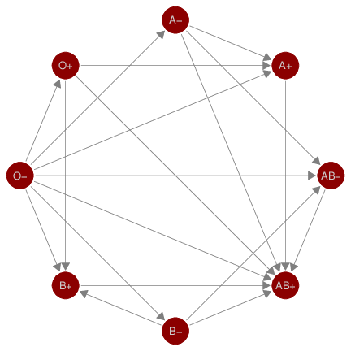</td>
<td style="text-align: center;">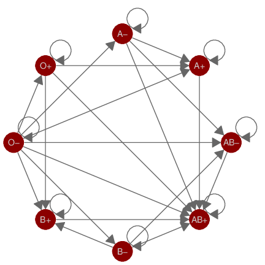</td>
<td style="text-align: center;">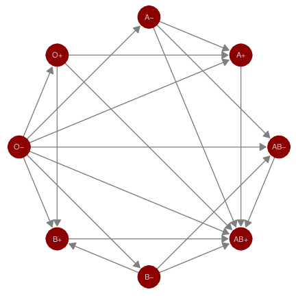</td>
</tr>
</tbody>
</table>
<figcaption>Figure 2: Network of blood donation possibilities in humans
by ABO and RhD blood types.</figcaption>
</figure>

`colour` and `size` aesthetics in Figure [2](#fig.cap:blood) are set to
identity values to change the size and color of all vertices. We have
also used the `layout` and `label` arguments to change the default
Kamada-Kawai layout to a circle layout and to print labels for each of
the blood types. The circle layout places blood types of the same ABO
type next to each other and spreads the vertices out far enough to
distinguish between the various "in\" and "out\" types. We can tell
clearly from this plot that the O-type is the universal donor: it has an
out-degree of seven and an in-degree of zero. Additionally, we can see
that the AB+ type is the universal recipient, with an in-degree of seven
and an out-degree of zero. Anyone looking at this plot can quickly
determine which type(s) of blood they can receive and which type(s) can
receive their blood.

## Email network

<figure id="fig.cap:email">
<div class="sourceCode" id="cb1"><pre class="sourceCode r"><code class="sourceCode r"><span id="cb1-1"><a href="#cb1-1" aria-hidden="true" tabindex="-1"></a><span class="co"># make data accessible</span></span>
<span id="cb1-2"><a href="#cb1-2" aria-hidden="true" tabindex="-1"></a><span class="fu">data</span>(email, <span class="at">package =</span> <span class="st">&#39;geomnet&#39;</span>)</span>
<span id="cb1-3"><a href="#cb1-3" aria-hidden="true" tabindex="-1"></a></span>
<span id="cb1-4"><a href="#cb1-4" aria-hidden="true" tabindex="-1"></a><span class="co"># create node attribute data</span></span>
<span id="cb1-5"><a href="#cb1-5" aria-hidden="true" tabindex="-1"></a>em.cet <span class="ot">&lt;-</span> <span class="fu">as.character</span>(</span>
<span id="cb1-6"><a href="#cb1-6" aria-hidden="true" tabindex="-1"></a>  email<span class="sc">$</span>nodes<span class="sc">$</span>CurrentEmploymentType)</span>
<span id="cb1-7"><a href="#cb1-7" aria-hidden="true" tabindex="-1"></a><span class="fu">names</span>(em.cet) <span class="ot">=</span> email<span class="sc">$</span>nodes<span class="sc">$</span>label</span>
<span id="cb1-8"><a href="#cb1-8" aria-hidden="true" tabindex="-1"></a></span>
<span id="cb1-9"><a href="#cb1-9" aria-hidden="true" tabindex="-1"></a><span class="co"># remove the emails sent to all employees</span></span>
<span id="cb1-10"><a href="#cb1-10" aria-hidden="true" tabindex="-1"></a>edges <span class="ot">&lt;-</span> <span class="fu">subset</span>(email<span class="sc">$</span>edges, nrecipients <span class="sc">&lt;</span> <span class="dv">54</span>)</span>
<span id="cb1-11"><a href="#cb1-11" aria-hidden="true" tabindex="-1"></a><span class="co"># create network</span></span>
<span id="cb1-12"><a href="#cb1-12" aria-hidden="true" tabindex="-1"></a>em.net <span class="ot">&lt;-</span> edges[, <span class="fu">c</span>(<span class="st">&quot;From&quot;</span>, <span class="st">&quot;to&quot;</span>) ]</span>
<span id="cb1-13"><a href="#cb1-13" aria-hidden="true" tabindex="-1"></a>em.net <span class="ot">&lt;-</span> <span class="fu">network</span>(em.net, <span class="at">directed =</span> <span class="cn">TRUE</span>)</span>
<span id="cb1-14"><a href="#cb1-14" aria-hidden="true" tabindex="-1"></a><span class="co"># create employee type node attribute</span></span>
<span id="cb1-15"><a href="#cb1-15" aria-hidden="true" tabindex="-1"></a>em.net <span class="sc">%v%</span> <span class="st">&quot;curr_empl_type&quot;</span> <span class="ot">&lt;-</span></span>
<span id="cb1-16"><a href="#cb1-16" aria-hidden="true" tabindex="-1"></a>  em.cet[ <span class="fu">network.vertex.names</span>(em.net) ]</span>
<span id="cb1-17"><a href="#cb1-17" aria-hidden="true" tabindex="-1"></a><span class="fu">set.seed</span>(<span class="dv">10312016</span>)</span>
<span id="cb1-18"><a href="#cb1-18" aria-hidden="true" tabindex="-1"></a><span class="fu">ggnet2</span>(em.net, <span class="at">color =</span> <span class="st">&quot;curr_empl_type&quot;</span>,</span>
<span id="cb1-19"><a href="#cb1-19" aria-hidden="true" tabindex="-1"></a>       <span class="at">size =</span> <span class="dv">4</span>, <span class="at">palette =</span> <span class="st">&quot;Set1&quot;</span>, <span class="at">arrow.gap =</span> <span class="fl">0.02</span>,</span>
<span id="cb1-20"><a href="#cb1-20" aria-hidden="true" tabindex="-1"></a>       <span class="at">arrow.size =</span> <span class="dv">5</span>, <span class="at">edge.alpha =</span> <span class="fl">0.25</span>, </span>
<span id="cb1-21"><a href="#cb1-21" aria-hidden="true" tabindex="-1"></a>       <span class="at">mode =</span> <span class="st">&quot;fruchtermanreingold&quot;</span>,</span>
<span id="cb1-22"><a href="#cb1-22" aria-hidden="true" tabindex="-1"></a>       <span class="at">edge.color =</span> <span class="fu">c</span>(<span class="st">&quot;color&quot;</span>, <span class="st">&quot;grey50&quot;</span>),</span>
<span id="cb1-23"><a href="#cb1-23" aria-hidden="true" tabindex="-1"></a>       <span class="at">color.legend =</span> <span class="st">&quot;Employment Type&quot;</span>) <span class="sc">+</span></span>
<span id="cb1-24"><a href="#cb1-24" aria-hidden="true" tabindex="-1"></a>  <span class="fu">theme</span>(<span class="at">legend.position =</span> <span class="st">&quot;bottom&quot;</span>)<span class="er">}</span></span></code></pre></div>
<table>
<caption> </caption>
<tbody>
<tr class="odd">
<td style="text-align: center;">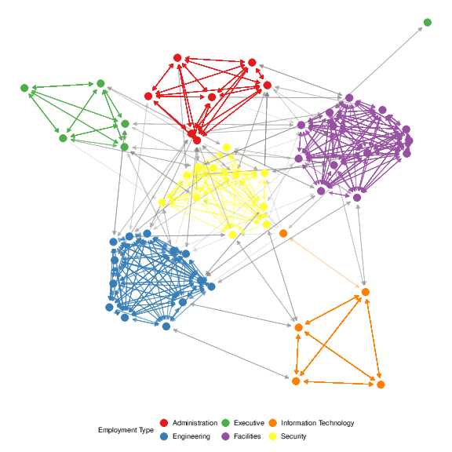</td>
</tr>
<tr class="even">
<td style="text-align: center;">(a) <span>ggnet2</span></td>
</tr>
</tbody>
</table>
<div class="sourceCode" id="cb2"><pre class="sourceCode r"><code class="sourceCode r"><span id="cb2-1"><a href="#cb2-1" aria-hidden="true" tabindex="-1"></a><span class="co"># data step for the geomnet plot</span></span>
<span id="cb2-2"><a href="#cb2-2" aria-hidden="true" tabindex="-1"></a>email<span class="sc">$</span>edges <span class="ot">&lt;-</span> email<span class="sc">$</span>edges[, <span class="fu">c</span>(<span class="dv">1</span>,<span class="dv">5</span>,<span class="dv">2</span><span class="sc">:</span><span class="dv">4</span>,<span class="dv">6</span><span class="sc">:</span><span class="dv">9</span>)]</span>
<span id="cb2-3"><a href="#cb2-3" aria-hidden="true" tabindex="-1"></a>emailnet <span class="ot">&lt;-</span> <span class="fu">fortify</span>(</span>
<span id="cb2-4"><a href="#cb2-4" aria-hidden="true" tabindex="-1"></a>  <span class="fu">as.edgedf</span>(<span class="fu">subset</span>(email<span class="sc">$</span>edges, nrecipients <span class="sc">&lt;</span> <span class="dv">54</span>)),</span>
<span id="cb2-5"><a href="#cb2-5" aria-hidden="true" tabindex="-1"></a>  email<span class="sc">$</span>nodes)</span>
<span id="cb2-6"><a href="#cb2-6" aria-hidden="true" tabindex="-1"></a><span class="fu">set.seed</span>(<span class="dv">10312016</span>)</span>
<span id="cb2-7"><a href="#cb2-7" aria-hidden="true" tabindex="-1"></a><span class="fu">ggplot</span>(<span class="at">data =</span> emailnet,</span>
<span id="cb2-8"><a href="#cb2-8" aria-hidden="true" tabindex="-1"></a>       <span class="fu">aes</span>(<span class="at">from_id =</span> from_id, <span class="at">to_id =</span> to_id)) <span class="sc">+</span></span>
<span id="cb2-9"><a href="#cb2-9" aria-hidden="true" tabindex="-1"></a>  <span class="fu">geom_net</span>(<span class="at">layout.alg =</span> <span class="st">&quot;fruchtermanreingold&quot;</span>,</span>
<span id="cb2-10"><a href="#cb2-10" aria-hidden="true" tabindex="-1"></a>    <span class="fu">aes</span>(<span class="at">colour =</span> CurrentEmploymentType,</span>
<span id="cb2-11"><a href="#cb2-11" aria-hidden="true" tabindex="-1"></a>        <span class="at">group =</span> CurrentEmploymentType,</span>
<span id="cb2-12"><a href="#cb2-12" aria-hidden="true" tabindex="-1"></a>        <span class="at">linewidth =</span> <span class="dv">3</span> <span class="sc">*</span> (...samegroup.. <span class="sc">/</span> <span class="dv">8</span> <span class="sc">+</span> .<span class="dv">125</span>)),</span>
<span id="cb2-13"><a href="#cb2-13" aria-hidden="true" tabindex="-1"></a>    <span class="at">ealpha =</span> <span class="fl">0.25</span>, <span class="at">size =</span> <span class="dv">4</span>, <span class="at">curvature =</span> <span class="fl">0.05</span>,</span>
<span id="cb2-14"><a href="#cb2-14" aria-hidden="true" tabindex="-1"></a>    <span class="at">directed =</span> <span class="cn">TRUE</span>, <span class="at">arrowsize =</span> <span class="fl">0.5</span>) <span class="sc">+</span></span>
<span id="cb2-15"><a href="#cb2-15" aria-hidden="true" tabindex="-1"></a>  <span class="fu">scale_colour_brewer</span>(<span class="st">&quot;Employment Type&quot;</span>, <span class="at">palette =</span> <span class="st">&quot;Set1&quot;</span>) <span class="sc">+</span></span>
<span id="cb2-16"><a href="#cb2-16" aria-hidden="true" tabindex="-1"></a>  <span class="fu">theme_net</span>() <span class="sc">+</span></span>
<span id="cb2-17"><a href="#cb2-17" aria-hidden="true" tabindex="-1"></a>  <span class="fu">theme</span>(<span class="at">legend.position =</span> <span class="st">&quot;bottom&quot;</span>)</span></code></pre></div>
<table>
<caption> </caption>
<tbody>
<tr class="odd">
<td style="text-align: center;">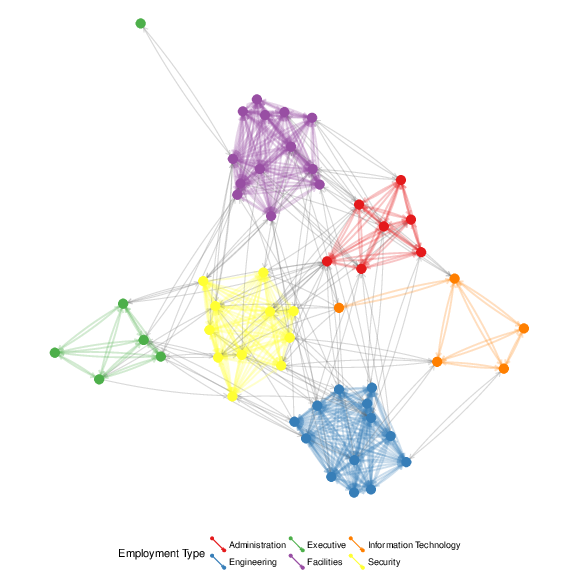</td>
</tr>
<tr class="even">
<td style="text-align: center;">(b) <span>geomnet</span></td>
</tr>
</tbody>
</table>
<div class="sourceCode" id="cb3"><pre class="sourceCode r"><code class="sourceCode r"><span id="cb3-1"><a href="#cb3-1" aria-hidden="true" tabindex="-1"></a><span class="co"># use em.net created in ggnet2step</span></span>
<span id="cb3-2"><a href="#cb3-2" aria-hidden="true" tabindex="-1"></a><span class="fu">set.seed</span>(<span class="dv">10312016</span>)</span>
<span id="cb3-3"><a href="#cb3-3" aria-hidden="true" tabindex="-1"></a><span class="fu">ggplot</span>(<span class="fu">ggnetwork</span>(em.net, <span class="at">arrow.gap =</span> <span class="fl">0.02</span>,</span>
<span id="cb3-4"><a href="#cb3-4" aria-hidden="true" tabindex="-1"></a>              <span class="at">layout =</span> <span class="st">&quot;fruchtermanreingold&quot;</span>),</span>
<span id="cb3-5"><a href="#cb3-5" aria-hidden="true" tabindex="-1"></a>       <span class="fu">aes</span>(x, y, <span class="at">xend =</span> xend, <span class="at">yend =</span> yend)) <span class="sc">+</span></span>
<span id="cb3-6"><a href="#cb3-6" aria-hidden="true" tabindex="-1"></a>  <span class="fu">geom_edges</span>(</span>
<span id="cb3-7"><a href="#cb3-7" aria-hidden="true" tabindex="-1"></a>    <span class="fu">aes</span>(<span class="at">color =</span> curr_empl_type),</span>
<span id="cb3-8"><a href="#cb3-8" aria-hidden="true" tabindex="-1"></a>    <span class="at">alpha =</span> <span class="fl">0.25</span>,</span>
<span id="cb3-9"><a href="#cb3-9" aria-hidden="true" tabindex="-1"></a>    <span class="at">arrow =</span> <span class="fu">arrow</span>(<span class="at">length =</span> <span class="fu">unit</span>(<span class="dv">5</span>, <span class="st">&quot;pt&quot;</span>),</span>
<span id="cb3-10"><a href="#cb3-10" aria-hidden="true" tabindex="-1"></a>                  <span class="at">type =</span> <span class="st">&quot;closed&quot;</span>),</span>
<span id="cb3-11"><a href="#cb3-11" aria-hidden="true" tabindex="-1"></a>    <span class="at">curvature =</span> <span class="fl">0.05</span>) <span class="sc">+</span></span>
<span id="cb3-12"><a href="#cb3-12" aria-hidden="true" tabindex="-1"></a>  <span class="fu">geom_nodes</span>(<span class="fu">aes</span>(<span class="at">color =</span> curr_empl_type),</span>
<span id="cb3-13"><a href="#cb3-13" aria-hidden="true" tabindex="-1"></a>             <span class="at">size =</span> <span class="dv">4</span>) <span class="sc">+</span></span>
<span id="cb3-14"><a href="#cb3-14" aria-hidden="true" tabindex="-1"></a>  <span class="fu">scale_color_brewer</span>(<span class="st">&quot;Employment Type&quot;</span>,</span>
<span id="cb3-15"><a href="#cb3-15" aria-hidden="true" tabindex="-1"></a>                     <span class="at">palette =</span> <span class="st">&quot;Set1&quot;</span>) <span class="sc">+</span></span>
<span id="cb3-16"><a href="#cb3-16" aria-hidden="true" tabindex="-1"></a>  <span class="fu">theme_blank</span>() <span class="sc">+</span></span>
<span id="cb3-17"><a href="#cb3-17" aria-hidden="true" tabindex="-1"></a>  <span class="fu">theme</span>(<span class="at">legend.position =</span> <span class="st">&quot;bottom&quot;</span>)</span></code></pre></div>
<table>
<caption> </caption>
<tbody>
<tr class="odd">
<td style="text-align: center;">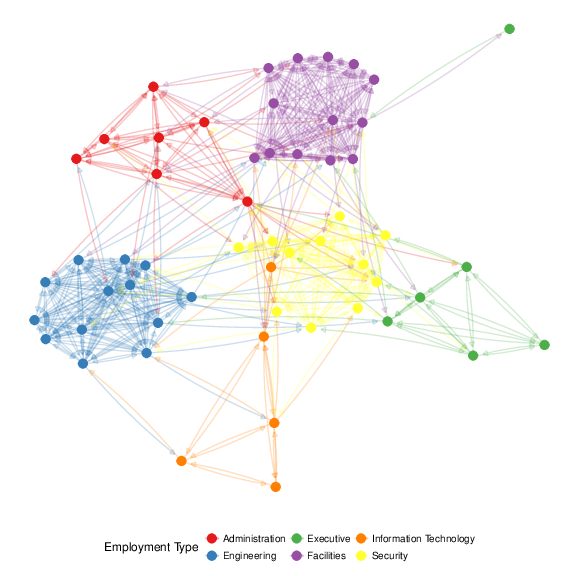</td>
</tr>
<tr class="even">
<td style="text-align: center;">(c) <span>ggnetwork</span></td>
</tr>
</tbody>
</table>
<figcaption>Figure 3: Email network within a company over a two week
period.</figcaption>
</figure>

The email network comes from the 2014 VAST Challenge [@emailnet]. It is
a directed network of emails between company employees with 55 vertices
and 9,063 edges. Each vertex represents an employee of the company, and
each edge represents an email sent from one employee to another. The
arrow of the directed edge points to the recipient of the email. If an
email has multiple recipients, multiple edges, one for each recipient,
are included in the network. The network contains two business weeks of
emails across the entire company. In order to better visualize the
structure of the communication network between employees, emails that
were sent out to all employees are removed. A glimpse of the data
objects used is below.

``` r
em.net # ggnet2 and ggnetwork
##  Network attributes:
##   vertices = 55 
##   directed = TRUE 
##   hyper = FALSE 
##   loops = FALSE 
##   multiple = FALSE 
##   bipartite = FALSE 
##   total edges= 4743 
##     missing edges= 0 
##     non-missing edges= 4743 
## 
##  Vertex attribute names: 
##     curr_empl_type vertex.names 
## 
##  Edge attribute names not shown
emailnet[1,c(1:2,7,21)] # geomnet
##                                 from_id
## 1 Ada.Campo-Corrente@gastech.com.kronos
##                                to_id day
## 1 Ingrid.Barranco@gastech.com.kronos  10
##   CurrentEmploymentType
## 1             Executive

```

Emails taken by themselves form an event network, i.e. edges do not have
any temporal duration. Here, however, we can think of emails as
observable expressions of the underlying, unobservable, relationship
between employees. We can think of this network as a dynamic temporal
network, i.e. this network has the potential to change over time. The
[*ndtv*](https://CRAN.R-project.org/package=ndtv) package by [@ndtv]
allows the analysis of such networks and provides impressive animations
of the underlying dynamics. Here, we are using two static approaches to
visualize the network: first, we aggregate emails across the whole time
frame (shown in Figure [3](#fig.cap:email)), then we aggregate emails by
day and use small multiples to allow a comparison of day-to-day behavior
(shown in Figure [4](#fig:email_facet)).

For all of the email examples, we have colored the vertices by the
variable `CurrentEmploymentType`, which contains the department in the
company of which each employee is a part of. There are six distinct
clusters in this network which almost perfectly correspond to the six
different types of employees in this company: administration,
engineering, executive, facilities, information technology, and
security. Other features in the code include using `alpha` arguments to
change the transparency of the edges, `curvature` argumnets to show
mutual communication as two edges instead of one edge with two
arrowheads, and the addition of *ggplot2* functions like
`scale_colour_brewer` and `theme` to customize the colors of the nodes
and their corresponding legend.

In Figure [3](#fig.cap:email) we can clearly see the varying densities
of communications within departments and the more sparse communication
between employees in different departments. We also see that one of the
executives only communicates with employees in Facilities, while one of
the IT employees frequently communicates with security employees.

A comparison of the results of *ggnet*, *geomnet* and *ggnetwork*
reveals some of the more subtle differences between the implementations:

-   In the `ggnet2` implementation, the opacity of the edges between
    employees in the same cluster is higher than it is for the edges
    between employees in different clusters. This is due to the fact
    that the email network does not make use of edge weights: instead,
    every email between two employees is represented by an edge,
    resulting in edge overplotting. The `edge.alpha` argument has been
    set to a value smaller than one, therefore multiple emails between
    two employees create more opaque edges between them. Multiple emails
    are also taken into account in the *geomnet* package. When there is
    more than one edge connecting two vertices, the `stat_net` function
    adds a weight variable to the edge list, which is passed
    automatically to the layout algorithms and taken into account during
    layout. This is thanks to the *sna* package, which supports the use
    of weights in its edge list. In addition to taking weights into
    account in the layout, we can also make use of them in the
    visualization. *geomnet* allows to access all of the internal
    variables created in the visualization process, such as coordinates
    `..x.., ..y..` and edge weights `..weight..`. Note the use of the
    *ggplot2* notation `..` for internal variables.

-   In the first two layouts of Figure [3](#fig.cap:email), edges
    between employees who share the same employment type are given the
    color of that employment type, while edges between employees
    belonging to different types are plotted in grey. This feature is
    particularly useful to visualize the amount of within-group
    connectedness in a network. By contrast, in the last layout, edges
    are colored according to the sender's employment type, because the
    `ggnetwork` package does not support coloring edges as a function of
    node-level attributes.

-   Finally, in the last two layouts of Figure [3](#fig.cap:email), the
    `curvature` argument has been set to 0.05, resulting in slightly
    curved edges in both plots. This feature, which takes advantage of
    the `geom_curve` geometry released in *ggplot2* 2.1.0, makes it
    possible to visualize which edges correspond to reciprocal
    connections; in an email communication network, as one might expect,
    most edges fall into that category.

To give some insight into how the relations between employees change
over time, we facet the network by day: each panel in
Figure [4](#fig:email_facet) shows email networks associated with each
day of the work week. The code for these visualizations is below. The
different approaches create small multiples in different ways. The
`ggnet2` approach requires that the network be separated, each plot
created individually, then placed together using the `grid.arrange`
function from the
[*gridExtra*](https://CRAN.R-project.org/package=gridExtra) package
[@gridextra]. The *geomnet* approach uses the `facet_*` family of
functions just as they are used in *ggplot2*, and the *ggnetwork*
approach uses the `by` argument in the `ggnetwork` function in
combination with the `facet_*` functions. We present the full code for
each of these approaches below.

<figure id="fig:email_facet">
<table>
<caption> </caption>
<tbody>
<tr class="odd">
<td style="text-align: center;">(a) <span>ggnet2</span></td>
</tr>
<tr class="even">
<td style="text-align: center;">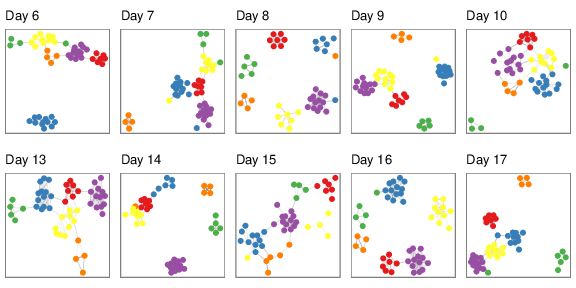</td>
</tr>
<tr class="odd">
<td style="text-align: center;">(b) <span>geomnet</span></td>
</tr>
<tr class="even">
<td style="text-align: center;">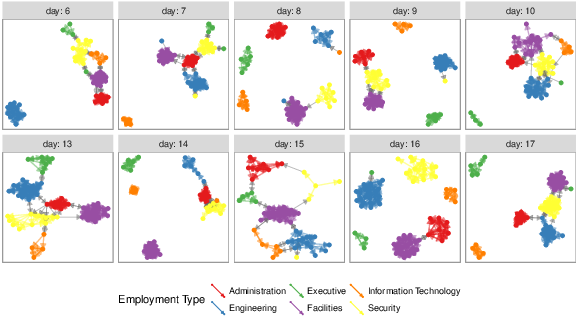</td>
</tr>
<tr class="odd">
<td style="text-align: center;">(c) <span>ggnetwork</span></td>
</tr>
<tr class="even">
<td style="text-align: center;">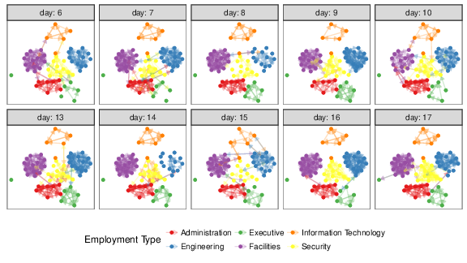</td>
</tr>
</tbody>
</table>
<figcaption>Figure 4: The same email network as in Figure 3 faceted by
day of the week.</figcaption>
</figure>

First, the code for the `ggnet2` approach, which results in
Figure [4](#fig:email_facet)(a):

``` r
# data preparation. first, remove emails sent to all employees
em.day <- subset(email$edges, nrecipients < 54)[, c("From", "to", "day") ]
# for small multiples by day, create one element in a list per day 
# (10 days, 10 elements in the list em.day)
em.day <- lapply(unique(em.day$day),
                 function(x) subset(em.day, day == x)[, 1:2 ])
# make the list of edgelists a list of network objects for plotting with ggnet2
em.day <- lapply(em.day, network, directed = TRUE)
# create vertex (employee type) and network (day) attributes for each element in list
for (i in 1:length(em.day)) {
  em.day[[ i ]] %v% "curr_empl_type" <-
    em.cet[ network.vertex.names(em.day[[ i ]]) ]
  em.day[[ i ]] %n% "day" <- unique(email$edges$day)[ i ]
}

# plot ggnet2
# first, make an empty list containing slots for the 10 days (one plot per day)
g <- list(length(em.day))
set.seed(7042016)
# create a ggnet2 plot for each element in the list of networks
for (i in 1:length(em.day)) {
  g[[ i ]] <- ggnet2(em.day[[ i ]], size = 2, 
                     color = "curr_empl_type",
                     palette = "Set1", arrow.size = 0,
                     arrow.gap = 0.01, edge.alpha = 0.1,
                     legend.position = "none", 
                     mode = "kamadakawai") +
    ggtitle(paste("Day", em.day[[ i ]] %n% "day")) +
    theme(panel.border = element_rect(color = "grey50", fill = NA),
          aspect.ratio = 1)
}
# arrange all of the network plots into one plot window
gridExtra::grid.arrange(grobs = g, nrow = 2)

```

Second, the code for the *geomnet* approach, which results in
Figure [4](#fig:email_facet)(b):

``` r
# data step: use the fortify.edgedf group argument to 
# combine the edge and node data and allow all nodes to 
# show up on all days. Also, remove emails sent to all  
# employees
emailnet <- fortify(as.edgedf(subset(email$edges, nrecipients < 54)), email$nodes, group = "day")

# creating the plot
set.seed(7042016)
ggplot(data = emailnet, aes(from_id = from, to_id = to_id)) +
  geom_net(layout.alg = "kamadakawai", singletons = FALSE,
    aes(colour = CurrentEmploymentType,
        group = CurrentEmploymentType,
        linewidth = 2 * (...samegroup.. / 8 + .125)),
        arrowsize = .5,
        directed = TRUE, fiteach = TRUE, ealpha = 0.5, size = 1.5, na.rm = FALSE) +
  scale_colour_brewer("Employment Type", palette = "Set1") +
  theme_net() +
  facet_wrap(~day, nrow = 2, labeller = "label_both") +
  theme(legend.position = "bottom",
        panel.border = element_rect(fill = NA, colour = "grey60"),
        plot.margin = unit(c(0, 0, 0, 0), "mm"))

```

Finally, the code for the *ggnetwork* approach, which results in
Figure [4](#fig:email_facet)(c):

``` r
# create the network and aesthetics
# first, remove emails sent to all employees
edges <- subset(email$edges, nrecipients < 54)
edges <- edges[, c("From", "to", "day") ]
# Create network class object for plotting with ggnetwork
em.net <- network(edges[, 1:2])
# assign edge attributes (day)
set.edge.attribute(em.net, "day", edges[, 3])
# assign vertex attributes (employee type)
em.net %v% "curr_empl_type" <- em.cet[ network.vertex.names(em.net) ]

# create the plot
set.seed(7042016)
ggplot(ggnetwork(em.net, arrow.gap = 0.02, by = "day", 
                 layout = "kamadakawai"),
       aes(x, y, xend = xend, yend = yend)) +
  geom_edges(
    aes(color = curr_empl_type),
    alpha = 0.25,
    arrow = arrow(length = unit(5, "pt"), type = "closed")) +
  geom_nodes(aes(color = curr_empl_type), size = 1.5) +
  scale_color_brewer("Employment Type", palette = "Set1") +
  facet_wrap(~day, nrow = 2, labeller = "label_both") +
  theme_facet(legend.position = "bottom")

```

Note the two key differences in the visualizations of
Figure [4](#fig:email_facet): whether singletons (isolated nodes) are
plotted (as in the *ggnetwork* method), and whether *one* layout is used
across all panels (as for the `ggnetwork` example) or whether individual
layouts are fit to each of the subsets (as for the `ggnet2` and the
`geomnet` examples). Plotting isolated nodes in *geomnet* is possible by
setting `singletons = TRUE`, and it would be possible in `ggnet2` by
including all nodes in the creation of the list of networks. Using the
same layout for plotting small multiples in `geomnet` is controlled by
the argument `fiteach`. By default, `fiteach = TRUE`, but
`fiteach = FALSE` results in all panels sharing the same layout. Having
the same layout in each panel makes seeing specific differences in ties
between nodes easier, while having a different layout in each panel
emphasizes the overall structural differences between the sub-networks.
It would be interesting to be able to have a hybrid of these two
approaches, but at the moment this is beyond the capability of any of
the methods. Through the faceting it becomes obvious that there are
several days where one or more of the departments does not communicate
with any of the other departments. There are only two days, day 13 and
day 15, without any isolated department communications. Faceting is one
of the major benefits of implementing tools for network visualization in
*ggplot2*. Faceting allows the user to quickly separate dense networks
into smaller sub-networks for easy visual comparison and analyses, a
feature that the other network visualization tools do not have.

## *ggplot2* theme elements

This example comes from the `theme()` help page in the *ggplot2*
documentation [@ggplot2]. It is a directed network which shows the
structure of the inheritance of theme options in the construction of a
*ggplot2* plot. There are 53 vertices and 36 edges in this network. Each
vertex represents one possible theme option. There is an arrow from one
theme option to another if the element represented by the 'to' vertex
inherits its values from the 'from' vertex. For example, the
`axis.ticks.x` option inherits its value from the `axis.ticks` value,
which in turn inherits its value from the `line` option. Thus, setting
the `line` option to a value such as `element_blank()` sets the entire
inheritance tree to `element_blank()`, and no lines appear anywhere on
the plot background.

<figure id="fig.cap:theme">
<div class="sourceCode" id="cb1"><pre class="sourceCode r"><code class="sourceCode r"><span id="cb1-1"><a href="#cb1-1" aria-hidden="true" tabindex="-1"></a><span class="co"># make data accessible</span></span>
<span id="cb1-2"><a href="#cb1-2" aria-hidden="true" tabindex="-1"></a><span class="fu">data</span>(theme_elements, <span class="at">package =</span> <span class="st">&quot;geomnet&quot;</span>)</span>
<span id="cb1-3"><a href="#cb1-3" aria-hidden="true" tabindex="-1"></a></span>
<span id="cb1-4"><a href="#cb1-4" aria-hidden="true" tabindex="-1"></a><span class="co"># create network object</span></span>
<span id="cb1-5"><a href="#cb1-5" aria-hidden="true" tabindex="-1"></a>te.net <span class="ot">&lt;-</span> <span class="fu">network</span>(theme_elements<span class="sc">$</span>edges)</span>
<span id="cb1-6"><a href="#cb1-6" aria-hidden="true" tabindex="-1"></a><span class="co"># assign node attribut (size based on node degree)</span></span>
<span id="cb1-7"><a href="#cb1-7" aria-hidden="true" tabindex="-1"></a>te.net <span class="sc">%v%</span> <span class="st">&quot;size&quot;</span> <span class="ot">&lt;-</span></span>
<span id="cb1-8"><a href="#cb1-8" aria-hidden="true" tabindex="-1"></a>  <span class="fu">sqrt</span>(<span class="dv">10</span> <span class="sc">*</span> (sna<span class="sc">::</span><span class="fu">degree</span>(te.net) <span class="sc">+</span> <span class="dv">1</span>))</span>
<span id="cb1-9"><a href="#cb1-9" aria-hidden="true" tabindex="-1"></a><span class="fu">set.seed</span>(<span class="dv">3272016</span>)</span>
<span id="cb1-10"><a href="#cb1-10" aria-hidden="true" tabindex="-1"></a><span class="fu">ggnet2</span>(te.net, <span class="at">label =</span> <span class="cn">TRUE</span>, <span class="at">color =</span> <span class="st">&quot;white&quot;</span>, </span>
<span id="cb1-11"><a href="#cb1-11" aria-hidden="true" tabindex="-1"></a>       <span class="at">label.size =</span> <span class="st">&quot;size&quot;</span>, <span class="at">layout.exp =</span> <span class="fl">0.15</span>,</span>
<span id="cb1-12"><a href="#cb1-12" aria-hidden="true" tabindex="-1"></a>       <span class="at">mode =</span> <span class="st">&quot;fruchtermanreingold&quot;</span>)</span></code></pre></div>
<table>
<caption> </caption>
<tbody>
<tr class="odd">
<td style="text-align: center;">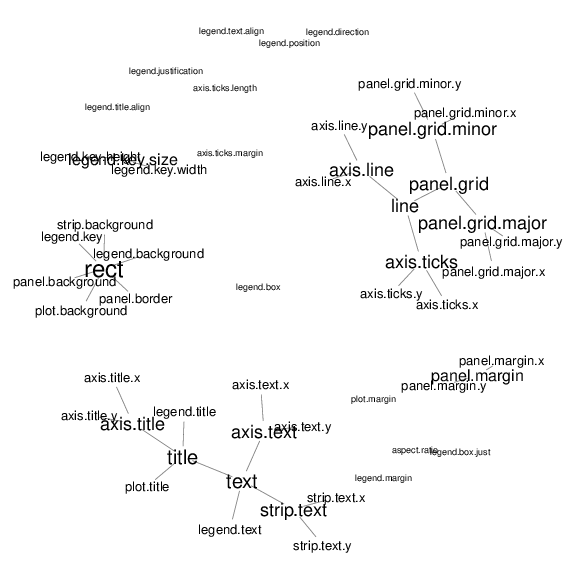</td>
</tr>
<tr class="even">
<td style="text-align: center;">(a) ggnet2</td>
</tr>
</tbody>
</table>
<div class="sourceCode" id="cb2"><pre class="sourceCode r"><code class="sourceCode r"><span id="cb2-1"><a href="#cb2-1" aria-hidden="true" tabindex="-1"></a><span class="co"># data step: merge nodes and edges and</span></span>
<span id="cb2-2"><a href="#cb2-2" aria-hidden="true" tabindex="-1"></a><span class="co"># introduce a degree-out variable</span></span>
<span id="cb2-3"><a href="#cb2-3" aria-hidden="true" tabindex="-1"></a><span class="co"># data step: merge nodes and edges and</span></span>
<span id="cb2-4"><a href="#cb2-4" aria-hidden="true" tabindex="-1"></a><span class="co"># introduce a degree-out variable</span></span>
<span id="cb2-5"><a href="#cb2-5" aria-hidden="true" tabindex="-1"></a>TEnet <span class="ot">&lt;-</span> <span class="fu">fortify</span>(</span>
<span id="cb2-6"><a href="#cb2-6" aria-hidden="true" tabindex="-1"></a>  <span class="fu">as.edgedf</span>(theme_elements<span class="sc">$</span>edges[,<span class="fu">c</span>(<span class="dv">2</span>,<span class="dv">1</span>)]),</span>
<span id="cb2-7"><a href="#cb2-7" aria-hidden="true" tabindex="-1"></a>            theme_elements<span class="sc">$</span>vertices)</span>
<span id="cb2-8"><a href="#cb2-8" aria-hidden="true" tabindex="-1"></a>TEnet <span class="ot">&lt;-</span> TEnet <span class="sc">%&gt;%</span></span>
<span id="cb2-9"><a href="#cb2-9" aria-hidden="true" tabindex="-1"></a>  <span class="fu">group_by</span>(from_id) <span class="sc">%&gt;%</span></span>
<span id="cb2-10"><a href="#cb2-10" aria-hidden="true" tabindex="-1"></a>  <span class="fu">mutate</span>(<span class="at">degree =</span> <span class="fu">sqrt</span>(<span class="dv">10</span> <span class="sc">*</span> <span class="fu">n</span>() <span class="sc">+</span> <span class="dv">1</span>))</span>
<span id="cb2-11"><a href="#cb2-11" aria-hidden="true" tabindex="-1"></a></span>
<span id="cb2-12"><a href="#cb2-12" aria-hidden="true" tabindex="-1"></a><span class="co"># create plot:</span></span>
<span id="cb2-13"><a href="#cb2-13" aria-hidden="true" tabindex="-1"></a><span class="fu">set.seed</span>(<span class="dv">3272016</span>)</span>
<span id="cb2-14"><a href="#cb2-14" aria-hidden="true" tabindex="-1"></a><span class="fu">ggplot</span>(<span class="at">data =</span> TEnet,</span>
<span id="cb2-15"><a href="#cb2-15" aria-hidden="true" tabindex="-1"></a>       <span class="fu">aes</span>(<span class="at">from_id =</span> from_id, <span class="at">to_id =</span> to_id)) <span class="sc">+</span></span>
<span id="cb2-16"><a href="#cb2-16" aria-hidden="true" tabindex="-1"></a>  <span class="fu">geom_net</span>(<span class="at">layout.alg =</span> <span class="st">&quot;fruchtermanreingold&quot;</span>,</span>
<span id="cb2-17"><a href="#cb2-17" aria-hidden="true" tabindex="-1"></a>    <span class="fu">aes</span>(<span class="at">fontsize =</span> degree), <span class="at">directed =</span> <span class="cn">TRUE</span>,</span>
<span id="cb2-18"><a href="#cb2-18" aria-hidden="true" tabindex="-1"></a>    <span class="at">labelon =</span> <span class="cn">TRUE</span>, <span class="at">size =</span> <span class="dv">1</span>, <span class="at">labelcolour =</span> <span class="st">&#39;black&#39;</span>,</span>
<span id="cb2-19"><a href="#cb2-19" aria-hidden="true" tabindex="-1"></a>    <span class="at">ecolour =</span> <span class="st">&quot;grey70&quot;</span>, <span class="at">arrowsize =</span> <span class="fl">0.5</span>,</span>
<span id="cb2-20"><a href="#cb2-20" aria-hidden="true" tabindex="-1"></a>    <span class="at">linewidth =</span> <span class="fl">0.5</span>, <span class="at">repel =</span> <span class="cn">TRUE</span>) <span class="sc">+</span></span>
<span id="cb2-21"><a href="#cb2-21" aria-hidden="true" tabindex="-1"></a>  <span class="fu">theme_net</span>() <span class="sc">+</span></span>
<span id="cb2-22"><a href="#cb2-22" aria-hidden="true" tabindex="-1"></a>  <span class="fu">xlim</span>(<span class="fu">c</span>(<span class="sc">-</span><span class="fl">0.05</span>, <span class="fl">1.05</span>))</span></code></pre></div>
<table>
<caption> </caption>
<tbody>
<tr class="odd">
<td style="text-align: center;">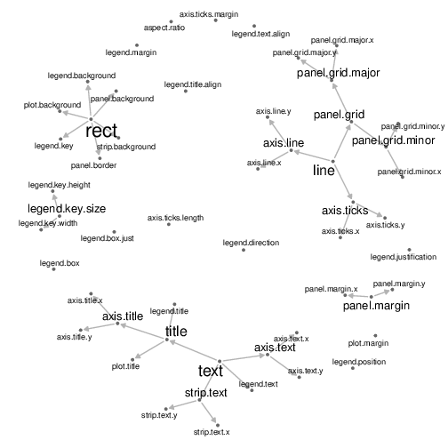</td>
</tr>
<tr class="even">
<td style="text-align: center;">(b) geomnet</td>
</tr>
</tbody>
</table>
<div class="sourceCode" id="cb3"><pre class="sourceCode r"><code class="sourceCode r"><span id="cb3-1"><a href="#cb3-1" aria-hidden="true" tabindex="-1"></a><span class="fu">set.seed</span>(<span class="dv">3272016</span>)</span>
<span id="cb3-2"><a href="#cb3-2" aria-hidden="true" tabindex="-1"></a><span class="co"># use network created in ggnet2 data step</span></span>
<span id="cb3-3"><a href="#cb3-3" aria-hidden="true" tabindex="-1"></a><span class="fu">ggplot</span>(<span class="fu">ggnetwork</span>(te.net, </span>
<span id="cb3-4"><a href="#cb3-4" aria-hidden="true" tabindex="-1"></a>                 <span class="at">layout =</span> <span class="st">&quot;fruchtermanreingold&quot;</span>),</span>
<span id="cb3-5"><a href="#cb3-5" aria-hidden="true" tabindex="-1"></a>       <span class="fu">aes</span>(x, y, <span class="at">xend =</span> xend, <span class="at">yend =</span> yend)) <span class="sc">+</span></span>
<span id="cb3-6"><a href="#cb3-6" aria-hidden="true" tabindex="-1"></a>  <span class="fu">geom_edges</span>() <span class="sc">+</span></span>
<span id="cb3-7"><a href="#cb3-7" aria-hidden="true" tabindex="-1"></a>  <span class="fu">geom_nodes</span>(<span class="at">size =</span> <span class="dv">12</span>, <span class="at">color =</span> <span class="st">&quot;white&quot;</span>) <span class="sc">+</span></span>
<span id="cb3-8"><a href="#cb3-8" aria-hidden="true" tabindex="-1"></a>  <span class="fu">geom_nodetext</span>(</span>
<span id="cb3-9"><a href="#cb3-9" aria-hidden="true" tabindex="-1"></a>    <span class="fu">aes</span>(<span class="at">size =</span> size, <span class="at">label =</span> vertex.names)) <span class="sc">+</span></span>
<span id="cb3-10"><a href="#cb3-10" aria-hidden="true" tabindex="-1"></a>  <span class="fu">scale_size_continuous</span>(<span class="at">range =</span> <span class="fu">c</span>(<span class="dv">4</span>, <span class="dv">8</span>)) <span class="sc">+</span></span>
<span id="cb3-11"><a href="#cb3-11" aria-hidden="true" tabindex="-1"></a>  <span class="fu">guides</span>(<span class="at">size =</span> <span class="cn">FALSE</span>) <span class="sc">+</span></span>
<span id="cb3-12"><a href="#cb3-12" aria-hidden="true" tabindex="-1"></a>  <span class="fu">theme_blank</span>()</span></code></pre></div>
<table>
<caption> </caption>
<tbody>
<tr class="odd">
<td style="text-align: center;">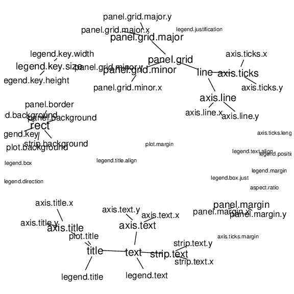</td>
</tr>
<tr class="even">
<td style="text-align: center;">(c) ggnetwork</td>
</tr>
</tbody>
</table>
<figcaption>Figure 5: Inheritance structure of <em>ggplot2</em> theme
elements. This is a recreation of the graph found at <a
href="http://docs.ggplot2.org/current/theme.html"
class="uri">http://docs.ggplot2.org/current/theme.html</a>.</figcaption>
</figure>

Code and plots of the inheritance structure are shown in Figure
[5](#fig.cap:theme). A glimpse of the data is below.

``` r
te.net
##  Network attributes:
##   vertices = 53 
##   directed = TRUE 
##   hyper = FALSE 
##   loops = FALSE 
##   multiple = FALSE 
##   bipartite = FALSE 
##   total edges= 48 
##     missing edges= 0 
##     non-missing edges= 48 
## 
##  Vertex attribute names: 
##     size vertex.names 
## 
## No edge attributes
head(TEnet)
## Source: local data frame [6 x 3]
## Groups: from_id [2]
## 
##   from_id       to_id   degree
##    <fctr>      <fctr>    <dbl>
## 1    text       title 6.403124
## 2    text legend.text 6.403124
## 3    text   axis.text 6.403124
## 4    text  strip.text 6.403124
## 5    line   axis.line 5.567764
## 6    line  axis.ticks 5.567764

```

Note the various ways the packages adjust the side of the labels to
correspond to the outdegree of the nodes, including the use of the
`scale_size_continuous` function in Figure [5](#fig.cap:theme)(c). In
each of these plots, it is easy to quickly determine parent-child
relationships, and to assess which theme elements are unrelated to all
others. Nodes with the most children are the `rect`, `text`, and `line`
elements, so we made their labels larger in order to emphasize their
importance. In each case, the label size is a function of the out degree
of the vertices.

## College football

This next example comes from M.E.J. Newman's network data web page
[@football]. It is an undirected network consisting of all regular
season college football games played between Division I schools in Fall
of 2000. There are 115 vertices and 613 edges: each vertex represents a
school, and an edge represents a game played between two schools. There
is an additional variable in the vertex data frame corresponding to the
conference each team belongs to, and there is an additional variable in
the edge data frame that is equal to one if the game occurred between
teams in the same conference or zero if the game occurred between teams
in different conferences. We take a look at the data used in the plots
below.

``` r
fb.net 
##  Network attributes:
##   vertices = 115 
##   directed = TRUE 
##   hyper = FALSE 
##   loops = FALSE 
##   multiple = FALSE 
##   bipartite = FALSE 
##   total edges= 613 
##     missing edges= 0 
##     non-missing edges= 613 
## 
##  Vertex attribute names: 
##     conf vertex.names 
## 
##  Edge attribute names: 
##     same.conf
head(ftnet)
##    from_id             to_id same.conf         value
## 1 AirForce    NevadaLasVegas         1 Mountain West
## 2    Akron         MiamiOhio         1  Mid-American
## 3    Akron      VirginiaTech         0  Mid-American
## 4    Akron           Buffalo         1  Mid-American
## 5    Akron BowlingGreenState         1  Mid-American
## 6    Akron              Kent         1  Mid-American
##   schools
## 1        
## 2        
## 3        
## 4        
## 5        
## 6
```

The network of football games is given in Figure [6](#fig.cap:football).
Here, the `linetype` aesthetic corresponds to games that occur between
teams in the same conference or different conferences.

<figure id="fig.cap:football">
<div class="sourceCode" id="cb1"><pre class="sourceCode r"><code class="sourceCode r"><span id="cb1-1"><a href="#cb1-1" aria-hidden="true" tabindex="-1"></a><span class="co">#make data accessible</span></span>
<span id="cb1-2"><a href="#cb1-2" aria-hidden="true" tabindex="-1"></a><span class="fu">data</span>(football, <span class="at">package =</span> <span class="st">&#39;geomnet&#39;</span>)</span>
<span id="cb1-3"><a href="#cb1-3" aria-hidden="true" tabindex="-1"></a><span class="fu">rownames</span>(football<span class="sc">$</span>vertices) <span class="ot">&lt;-</span></span>
<span id="cb1-4"><a href="#cb1-4" aria-hidden="true" tabindex="-1"></a>  football<span class="sc">$</span>vertices<span class="sc">$</span>label</span>
<span id="cb1-5"><a href="#cb1-5" aria-hidden="true" tabindex="-1"></a><span class="co"># create network </span></span>
<span id="cb1-6"><a href="#cb1-6" aria-hidden="true" tabindex="-1"></a>fb.net <span class="ot">&lt;-</span> <span class="fu">network</span>(football<span class="sc">$</span>edges[, <span class="dv">1</span><span class="sc">:</span><span class="dv">2</span>],</span>
<span id="cb1-7"><a href="#cb1-7" aria-hidden="true" tabindex="-1"></a>                  <span class="at">directed =</span> <span class="cn">TRUE</span>)</span>
<span id="cb1-8"><a href="#cb1-8" aria-hidden="true" tabindex="-1"></a><span class="co"># create node attribute </span></span>
<span id="cb1-9"><a href="#cb1-9" aria-hidden="true" tabindex="-1"></a><span class="co"># (what conference is team in?)</span></span>
<span id="cb1-10"><a href="#cb1-10" aria-hidden="true" tabindex="-1"></a>fb.net <span class="sc">%v%</span> <span class="st">&quot;conf&quot;</span> <span class="ot">&lt;-</span></span>
<span id="cb1-11"><a href="#cb1-11" aria-hidden="true" tabindex="-1"></a>  football<span class="sc">$</span>vertices[</span>
<span id="cb1-12"><a href="#cb1-12" aria-hidden="true" tabindex="-1"></a>    <span class="fu">network.vertex.names</span>(fb.net), <span class="st">&quot;value&quot;</span></span>
<span id="cb1-13"><a href="#cb1-13" aria-hidden="true" tabindex="-1"></a>    ]</span>
<span id="cb1-14"><a href="#cb1-14" aria-hidden="true" tabindex="-1"></a><span class="co"># create edge attribute </span></span>
<span id="cb1-15"><a href="#cb1-15" aria-hidden="true" tabindex="-1"></a><span class="co"># (between teams in same conference?)</span></span>
<span id="cb1-16"><a href="#cb1-16" aria-hidden="true" tabindex="-1"></a><span class="fu">set.edge.attribute</span>(</span>
<span id="cb1-17"><a href="#cb1-17" aria-hidden="true" tabindex="-1"></a>  fb.net, <span class="st">&quot;same.conf&quot;</span>,</span>
<span id="cb1-18"><a href="#cb1-18" aria-hidden="true" tabindex="-1"></a>  football<span class="sc">$</span>edges<span class="sc">$</span>same.conf)</span>
<span id="cb1-19"><a href="#cb1-19" aria-hidden="true" tabindex="-1"></a><span class="fu">set.seed</span>(<span class="dv">5232011</span>)</span>
<span id="cb1-20"><a href="#cb1-20" aria-hidden="true" tabindex="-1"></a><span class="fu">ggnet2</span>(fb.net, <span class="at">mode =</span> <span class="st">&quot;fruchtermanreingold&quot;</span>,</span>
<span id="cb1-21"><a href="#cb1-21" aria-hidden="true" tabindex="-1"></a>       <span class="at">color =</span> <span class="st">&quot;conf&quot;</span>,  <span class="at">palette =</span> <span class="st">&quot;Paired&quot;</span>,</span>
<span id="cb1-22"><a href="#cb1-22" aria-hidden="true" tabindex="-1"></a>       <span class="at">color.legend =</span> <span class="st">&quot;Conference&quot;</span>,</span>
<span id="cb1-23"><a href="#cb1-23" aria-hidden="true" tabindex="-1"></a>       <span class="at">edge.color =</span> <span class="fu">c</span>(<span class="st">&quot;color&quot;</span>, <span class="st">&quot;grey75&quot;</span>))</span></code></pre></div>
<table>
<caption> </caption>
<tbody>
<tr class="odd">
<td style="text-align: center;">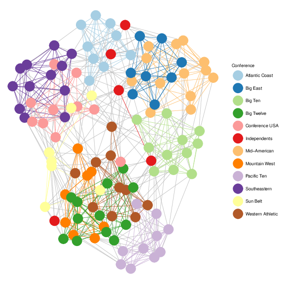</td>
</tr>
<tr class="even">
<td style="text-align: center;">(a) ggnet2</td>
</tr>
</tbody>
</table>
<div class="sourceCode" id="cb2"><pre class="sourceCode r"><code class="sourceCode r"><span id="cb2-1"><a href="#cb2-1" aria-hidden="true" tabindex="-1"></a><span class="co"># data step: merge vertices and edges</span></span>
<span id="cb2-2"><a href="#cb2-2" aria-hidden="true" tabindex="-1"></a><span class="co"># data step: merge vertices and edges</span></span>
<span id="cb2-3"><a href="#cb2-3" aria-hidden="true" tabindex="-1"></a>ftnet <span class="ot">&lt;-</span> <span class="fu">fortify</span>(<span class="fu">as.edgedf</span>(football<span class="sc">$</span>edges), </span>
<span id="cb2-4"><a href="#cb2-4" aria-hidden="true" tabindex="-1"></a>                 football<span class="sc">$</span>vertices)</span>
<span id="cb2-5"><a href="#cb2-5" aria-hidden="true" tabindex="-1"></a></span>
<span id="cb2-6"><a href="#cb2-6" aria-hidden="true" tabindex="-1"></a><span class="co"># create new label variable for independent schools</span></span>
<span id="cb2-7"><a href="#cb2-7" aria-hidden="true" tabindex="-1"></a>ftnet<span class="sc">$</span>schools <span class="ot">&lt;-</span> <span class="fu">ifelse</span>(</span>
<span id="cb2-8"><a href="#cb2-8" aria-hidden="true" tabindex="-1"></a>  ftnet<span class="sc">$</span>value <span class="sc">==</span> <span class="st">&quot;Independents&quot;</span>, ftnet<span class="sc">$</span>from_id, <span class="st">&quot;&quot;</span>)</span>
<span id="cb2-9"><a href="#cb2-9" aria-hidden="true" tabindex="-1"></a></span>
<span id="cb2-10"><a href="#cb2-10" aria-hidden="true" tabindex="-1"></a><span class="co"># create data plot</span></span>
<span id="cb2-11"><a href="#cb2-11" aria-hidden="true" tabindex="-1"></a><span class="fu">set.seed</span>(<span class="dv">5232011</span>)</span>
<span id="cb2-12"><a href="#cb2-12" aria-hidden="true" tabindex="-1"></a><span class="fu">ggplot</span>(<span class="at">data =</span> ftnet,</span>
<span id="cb2-13"><a href="#cb2-13" aria-hidden="true" tabindex="-1"></a>       <span class="fu">aes</span>(<span class="at">from_id =</span> from_id, <span class="at">to_id =</span> to_id)) <span class="sc">+</span></span>
<span id="cb2-14"><a href="#cb2-14" aria-hidden="true" tabindex="-1"></a>  <span class="fu">geom_net</span>(<span class="at">layout.alg =</span> <span class="st">&#39;fruchtermanreingold&#39;</span>,</span>
<span id="cb2-15"><a href="#cb2-15" aria-hidden="true" tabindex="-1"></a>    <span class="fu">aes</span>(<span class="at">colour =</span> value, <span class="at">group =</span> value,</span>
<span id="cb2-16"><a href="#cb2-16" aria-hidden="true" tabindex="-1"></a>        <span class="at">linetype =</span> <span class="fu">factor</span>(same.conf <span class="sc">!=</span> <span class="dv">1</span>),</span>
<span id="cb2-17"><a href="#cb2-17" aria-hidden="true" tabindex="-1"></a>        <span class="at">label =</span> schools),</span>
<span id="cb2-18"><a href="#cb2-18" aria-hidden="true" tabindex="-1"></a>    <span class="at">linewidth =</span> <span class="fl">0.5</span>,</span>
<span id="cb2-19"><a href="#cb2-19" aria-hidden="true" tabindex="-1"></a>    <span class="at">size =</span> <span class="dv">5</span>, <span class="at">vjust =</span> <span class="sc">-</span><span class="fl">0.75</span>, <span class="at">alpha =</span> <span class="fl">0.3</span>) <span class="sc">+</span></span>
<span id="cb2-20"><a href="#cb2-20" aria-hidden="true" tabindex="-1"></a>  <span class="fu">theme_net</span>() <span class="sc">+</span></span>
<span id="cb2-21"><a href="#cb2-21" aria-hidden="true" tabindex="-1"></a>  <span class="fu">theme</span>(<span class="at">legend.position =</span> <span class="st">&quot;bottom&quot;</span>) <span class="sc">+</span></span>
<span id="cb2-22"><a href="#cb2-22" aria-hidden="true" tabindex="-1"></a>  <span class="fu">scale_colour_brewer</span>(<span class="st">&quot;Conference&quot;</span>, <span class="at">palette =</span> <span class="st">&quot;Paired&quot;</span>)  <span class="sc">+</span></span>
<span id="cb2-23"><a href="#cb2-23" aria-hidden="true" tabindex="-1"></a>  <span class="fu">guides</span>(<span class="at">linetype =</span> <span class="cn">FALSE</span>)</span></code></pre></div>
<table>
<caption> </caption>
<tbody>
<tr class="odd">
<td style="text-align: center;">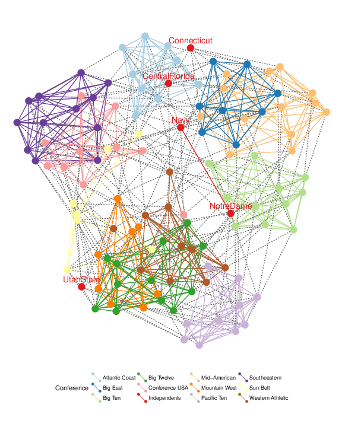</td>
</tr>
<tr class="even">
<td style="text-align: center;">(b) geomnet</td>
</tr>
</tbody>
</table>
<div class="sourceCode" id="cb3"><pre class="sourceCode r"><code class="sourceCode r"><span id="cb3-1"><a href="#cb3-1" aria-hidden="true" tabindex="-1"></a><span class="co"># use network from ggnet2 step</span></span>
<span id="cb3-2"><a href="#cb3-2" aria-hidden="true" tabindex="-1"></a><span class="fu">set.seed</span>(<span class="dv">5232011</span>)</span>
<span id="cb3-3"><a href="#cb3-3" aria-hidden="true" tabindex="-1"></a><span class="fu">ggplot</span>(</span>
<span id="cb3-4"><a href="#cb3-4" aria-hidden="true" tabindex="-1"></a>  <span class="fu">ggnetwork</span>(</span>
<span id="cb3-5"><a href="#cb3-5" aria-hidden="true" tabindex="-1"></a>    fb.net, </span>
<span id="cb3-6"><a href="#cb3-6" aria-hidden="true" tabindex="-1"></a>    <span class="at">layout =</span> <span class="st">&quot;fruchtermanreingold&quot;</span>),</span>
<span id="cb3-7"><a href="#cb3-7" aria-hidden="true" tabindex="-1"></a>  <span class="fu">aes</span>(x, y, <span class="at">xend =</span> xend, <span class="at">yend =</span> yend)) <span class="sc">+</span></span>
<span id="cb3-8"><a href="#cb3-8" aria-hidden="true" tabindex="-1"></a>  <span class="fu">geom_edges</span>(</span>
<span id="cb3-9"><a href="#cb3-9" aria-hidden="true" tabindex="-1"></a>    <span class="fu">aes</span>(<span class="at">linetype =</span> <span class="fu">as.factor</span>(same.conf)),</span>
<span id="cb3-10"><a href="#cb3-10" aria-hidden="true" tabindex="-1"></a>    <span class="at">color =</span> <span class="st">&quot;grey50&quot;</span>) <span class="sc">+</span></span>
<span id="cb3-11"><a href="#cb3-11" aria-hidden="true" tabindex="-1"></a>  <span class="fu">geom_nodes</span>(<span class="fu">aes</span>(<span class="at">color =</span> conf), <span class="at">size =</span> <span class="dv">4</span>) <span class="sc">+</span></span>
<span id="cb3-12"><a href="#cb3-12" aria-hidden="true" tabindex="-1"></a>  <span class="fu">scale_color_brewer</span>(<span class="st">&quot;Conference&quot;</span>,</span>
<span id="cb3-13"><a href="#cb3-13" aria-hidden="true" tabindex="-1"></a>                     <span class="at">palette =</span> <span class="st">&quot;Paired&quot;</span>) <span class="sc">+</span></span>
<span id="cb3-14"><a href="#cb3-14" aria-hidden="true" tabindex="-1"></a>  <span class="fu">scale_linetype_manual</span>(<span class="at">values =</span> <span class="fu">c</span>(<span class="dv">2</span>,<span class="dv">1</span>)) <span class="sc">+</span></span>
<span id="cb3-15"><a href="#cb3-15" aria-hidden="true" tabindex="-1"></a>  <span class="fu">guides</span>(<span class="at">linetype =</span> <span class="cn">FALSE</span>) <span class="sc">+</span></span>
<span id="cb3-16"><a href="#cb3-16" aria-hidden="true" tabindex="-1"></a>  <span class="fu">theme_blank</span>()</span></code></pre></div>
<table>
<caption> </caption>
<tbody>
<tr class="odd">
<td style="text-align: center;">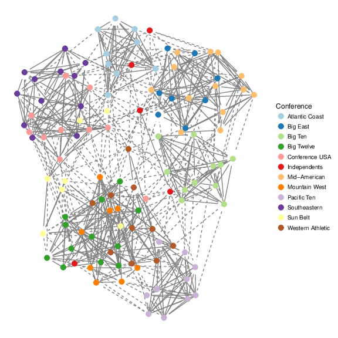</td>
</tr>
<tr class="even">
<td style="text-align: center;">(c) ggnetwork</td>
</tr>
</tbody>
</table>
<figcaption>Figure 6: The network of regular season Division I college
football games in the season of fall 2000. The vertices and their labels
are colored by conference.</figcaption>
</figure>

These lines are dotted and solid, respectively. We have also assigned a
different color to each conference, so that the vertices and their
labels are colored according to their conference. Additionally, in the
first two implementations, the edges between two teams in the same
conference share that conference color, while edges between teams in
different conferences are a default gray color. This coloring and
changing of the line types make the structure of the game network easier
to view. Additionally, we use the `label` aesthetic in Figure
[6](#fig.cap:football)(b) to label only a few schools that are of
interest to us. This is the conference consisting of Navy, Notre Dame,
Utah State, Central Florida, and Connecticut, which is spread out,
whereas most other conferences' teams are all very close to each other
because they play within conference much more than they play out of
conference. At the time, these five schools were all independents and
did not have a home conference. Without the coloring capability, we
would not have been able to pick out that difference as easily.

## Southern women

Bipartite (or 'two-mode') networks are networks with two different kinds
of nodes and where all ties are formed between these two kinds.
Affiliation networks, which represent the ties between individuals and
the groups to which they belong, are examples of such networks [see
@newman p. 53-54 and p. 123-127].

One of the classic examples for a two-mode network is the network of 18
Southern women attending 14 social events as collected by @davis and
published e.g. as part of the
[*tnet*](https://CRAN.R-project.org/package=tnet) package [@tnet]. In
this data, a woman is linked by an edge to an event if she attended it.
One of the questions for these type of networks is gain insight in the
interplay between the two different sets of nodes.

The data for the example of the Southern women is reported as edge list
in form of 'lady $X$ attending event $Y$'. With a bit of data
preparation as detailed below, we can visualize the graph as shown in
Figure [7](#fig:davis). In creating the plots, we use the `shape` and
`colour` aesthetics to map the two different modes to two different
shapes and colours.

``` r
# access the data and rename it for convenience
library(tnet)

data(tnet)
elist <- data.frame(Davis.Southern.women.2mode)
names(elist) <- c("Lady", "Event")

```

The edge list for the Southern women's data consists of women attending
events:

``` r
head(elist,4)
##   Lady Event
## 1    1     1
## 2    1     2
## 3    1     3
## 4    1     4

```

In order to distinguish between nodes from different types, we have to
add an additional identifier element, so that we can tell the 'first'
woman $L1$ apart from the first event, $E1$.

``` r
elist$Lady <- paste("L", elist$Lady, sep="")
elist$Event <- paste("E", elist$Event, sep="")

davis <- elist
names(davis) <- c("from", "to")
davis <- rbind(davis, data.frame(from=davis$to, to=davis$from))
davis$type <- factor(c(rep("Lady", nrow(elist)), rep("Event", nrow(elist))))
```

<figure id="fig:davis">
<div class="sourceCode" id="cb1"><pre class="sourceCode r"><code class="sourceCode r"><span id="cb1-1"><a href="#cb1-1" aria-hidden="true" tabindex="-1"></a><span class="co"># Southern women network in ggnet2</span></span>
<span id="cb1-2"><a href="#cb1-2" aria-hidden="true" tabindex="-1"></a><span class="co"># create affiliation matrix</span></span>
<span id="cb1-3"><a href="#cb1-3" aria-hidden="true" tabindex="-1"></a>bip <span class="ot">=</span> <span class="fu">xtabs</span>(<span class="sc">~</span>Event<span class="sc">+</span>Lady, <span class="at">data=</span>elist)</span>
<span id="cb1-4"><a href="#cb1-4" aria-hidden="true" tabindex="-1"></a></span>
<span id="cb1-5"><a href="#cb1-5" aria-hidden="true" tabindex="-1"></a><span class="co"># weighted bipartite network</span></span>
<span id="cb1-6"><a href="#cb1-6" aria-hidden="true" tabindex="-1"></a>bip <span class="ot">=</span> <span class="fu">network</span>(bip,</span>
<span id="cb1-7"><a href="#cb1-7" aria-hidden="true" tabindex="-1"></a>              <span class="at">matrix.type =</span> <span class="st">&quot;bipartite&quot;</span>,</span>
<span id="cb1-8"><a href="#cb1-8" aria-hidden="true" tabindex="-1"></a>              <span class="at">ignore.eval =</span> <span class="cn">FALSE</span>,</span>
<span id="cb1-9"><a href="#cb1-9" aria-hidden="true" tabindex="-1"></a>              <span class="at">names.eval =</span> <span class="st">&quot;weights&quot;</span>)</span>
<span id="cb1-10"><a href="#cb1-10" aria-hidden="true" tabindex="-1"></a></span>
<span id="cb1-11"><a href="#cb1-11" aria-hidden="true" tabindex="-1"></a><span class="co"># detect and color the mode</span></span>
<span id="cb1-12"><a href="#cb1-12" aria-hidden="true" tabindex="-1"></a><span class="fu">set.seed</span>(<span class="dv">8262013</span>)</span>
<span id="cb1-13"><a href="#cb1-13" aria-hidden="true" tabindex="-1"></a><span class="fu">ggnet2</span>(bip, <span class="at">color =</span> <span class="st">&quot;mode&quot;</span>, <span class="at">palette =</span> <span class="st">&quot;Set2&quot;</span>, </span>
<span id="cb1-14"><a href="#cb1-14" aria-hidden="true" tabindex="-1"></a>       <span class="at">shape =</span> <span class="st">&quot;mode&quot;</span>, <span class="at">mode =</span> <span class="st">&quot;kamadakawai&quot;</span>,</span>
<span id="cb1-15"><a href="#cb1-15" aria-hidden="true" tabindex="-1"></a>       <span class="at">size =</span> <span class="dv">15</span>, <span class="at">label =</span> <span class="cn">TRUE</span>) <span class="sc">+</span></span>
<span id="cb1-16"><a href="#cb1-16" aria-hidden="true" tabindex="-1"></a>  <span class="fu">theme</span>(<span class="at">legend.position=</span><span class="st">&quot;bottom&quot;</span>)</span></code></pre></div>
<table>
<caption> </caption>
<tbody>
<tr class="odd">
<td style="text-align: center;">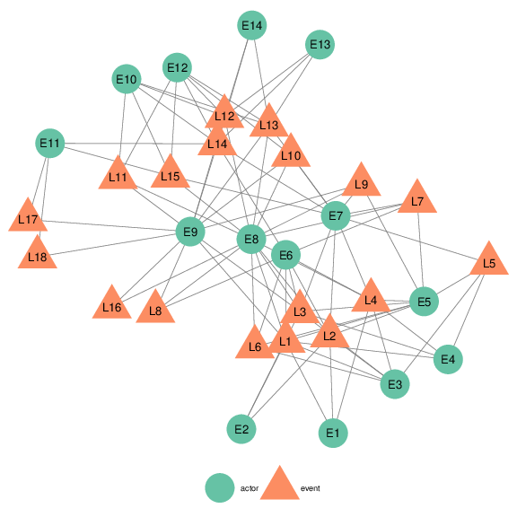</td>
<td style="text-align: center;"></td>
</tr>
<tr class="even">
<td style="text-align: center;">(a) <code>ggnet2</code></td>
<td style="text-align: center;"></td>
</tr>
</tbody>
</table>
<div class="sourceCode" id="cb2"><pre class="sourceCode r"><code class="sourceCode r"><span id="cb2-1"><a href="#cb2-1" aria-hidden="true" tabindex="-1"></a><span class="co"># Southern women network in geomnet</span></span>
<span id="cb2-2"><a href="#cb2-2" aria-hidden="true" tabindex="-1"></a><span class="co"># change labelcolour</span></span>
<span id="cb2-3"><a href="#cb2-3" aria-hidden="true" tabindex="-1"></a>davis<span class="sc">$</span>lcolour <span class="ot">&lt;-</span> </span>
<span id="cb2-4"><a href="#cb2-4" aria-hidden="true" tabindex="-1"></a>  <span class="fu">c</span>(<span class="st">&quot;white&quot;</span>, <span class="st">&quot;black&quot;</span>)[<span class="fu">as.numeric</span>(davis<span class="sc">$</span>type)]</span>
<span id="cb2-5"><a href="#cb2-5" aria-hidden="true" tabindex="-1"></a></span>
<span id="cb2-6"><a href="#cb2-6" aria-hidden="true" tabindex="-1"></a><span class="fu">set.seed</span>(<span class="dv">8262013</span>)</span>
<span id="cb2-7"><a href="#cb2-7" aria-hidden="true" tabindex="-1"></a><span class="fu">ggplot</span>(<span class="at">data =</span> davis) <span class="sc">+</span> </span>
<span id="cb2-8"><a href="#cb2-8" aria-hidden="true" tabindex="-1"></a>  <span class="fu">geom_net</span>(<span class="at">layout.alg =</span> <span class="st">&quot;kamadakawai&quot;</span>,</span>
<span id="cb2-9"><a href="#cb2-9" aria-hidden="true" tabindex="-1"></a>    <span class="fu">aes</span>(<span class="at">from_id =</span> from, <span class="at">to_id =</span> to, </span>
<span id="cb2-10"><a href="#cb2-10" aria-hidden="true" tabindex="-1"></a>        <span class="at">colour =</span> type, <span class="at">shape =</span> type), </span>
<span id="cb2-11"><a href="#cb2-11" aria-hidden="true" tabindex="-1"></a>    <span class="at">size =</span> <span class="dv">15</span>, <span class="at">labelon =</span> <span class="cn">TRUE</span>, <span class="at">ealpha =</span> <span class="fl">0.25</span>,</span>
<span id="cb2-12"><a href="#cb2-12" aria-hidden="true" tabindex="-1"></a>    <span class="at">vjust =</span> <span class="fl">0.5</span>, <span class="at">hjust =</span> <span class="fl">0.5</span>,</span>
<span id="cb2-13"><a href="#cb2-13" aria-hidden="true" tabindex="-1"></a>    <span class="at">labelcolour =</span> davis<span class="sc">$</span>lcolour) <span class="sc">+</span></span>
<span id="cb2-14"><a href="#cb2-14" aria-hidden="true" tabindex="-1"></a>  <span class="fu">theme_net</span>() <span class="sc">+</span> </span>
<span id="cb2-15"><a href="#cb2-15" aria-hidden="true" tabindex="-1"></a>  <span class="fu">scale_colour_brewer</span>(<span class="st">&quot;Type of node&quot;</span>, <span class="at">palette =</span> <span class="st">&quot;Set2&quot;</span>) <span class="sc">+</span></span>
<span id="cb2-16"><a href="#cb2-16" aria-hidden="true" tabindex="-1"></a>  <span class="fu">scale_shape</span>(<span class="st">&quot;Type of node&quot;</span>) <span class="sc">+</span></span>
<span id="cb2-17"><a href="#cb2-17" aria-hidden="true" tabindex="-1"></a>  <span class="fu">theme</span>(<span class="at">legend.position =</span> <span class="st">&quot;bottom&quot;</span>)</span></code></pre></div>
<table>
<caption> </caption>
<tbody>
<tr class="odd">
<td style="text-align: center;">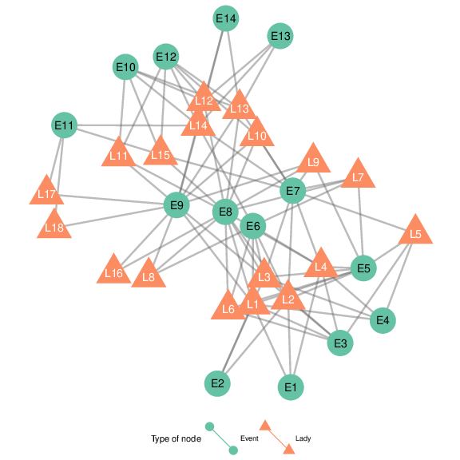</td>
</tr>
<tr class="even">
<td style="text-align: center;">(b) <em>geomnet</em></td>
</tr>
</tbody>
</table>
<div class="sourceCode" id="cb3"><pre class="sourceCode r"><code class="sourceCode r"><span id="cb3-1"><a href="#cb3-1" aria-hidden="true" tabindex="-1"></a><span class="co"># Southern women network in ggnetwork. Use data from ggnet2 step</span></span>
<span id="cb3-2"><a href="#cb3-2" aria-hidden="true" tabindex="-1"></a><span class="co"># assign vertex attributes (Node type and label)</span></span>
<span id="cb3-3"><a href="#cb3-3" aria-hidden="true" tabindex="-1"></a><span class="fu">set.vertex.attribute</span>(bip, <span class="st">&quot;mode&quot;</span>, </span>
<span id="cb3-4"><a href="#cb3-4" aria-hidden="true" tabindex="-1"></a>  <span class="fu">c</span>(<span class="fu">rep</span>(<span class="st">&quot;event&quot;</span>, <span class="dv">14</span>), <span class="fu">rep</span>(<span class="st">&quot;woman&quot;</span>, <span class="dv">18</span>)))</span>
<span id="cb3-5"><a href="#cb3-5" aria-hidden="true" tabindex="-1"></a><span class="fu">set.seed</span>(<span class="dv">8262013</span>)</span>
<span id="cb3-6"><a href="#cb3-6" aria-hidden="true" tabindex="-1"></a><span class="fu">ggplot</span>(<span class="at">data =</span> <span class="fu">ggnetwork</span>(bip, </span>
<span id="cb3-7"><a href="#cb3-7" aria-hidden="true" tabindex="-1"></a>        <span class="at">layout =</span> <span class="st">&quot;kamadakawai&quot;</span>),</span>
<span id="cb3-8"><a href="#cb3-8" aria-hidden="true" tabindex="-1"></a>    <span class="fu">aes</span>(<span class="at">x =</span> x, <span class="at">y =</span> y, <span class="at">xend =</span> xend, <span class="at">yend =</span> yend)) <span class="sc">+</span> </span>
<span id="cb3-9"><a href="#cb3-9" aria-hidden="true" tabindex="-1"></a>  <span class="fu">geom_edges</span>(<span class="at">colour =</span> <span class="st">&quot;grey80&quot;</span>) <span class="sc">+</span></span>
<span id="cb3-10"><a href="#cb3-10" aria-hidden="true" tabindex="-1"></a>  <span class="fu">geom_nodes</span>(<span class="fu">aes</span>(<span class="at">colour =</span> mode, <span class="at">shape =</span> mode), </span>
<span id="cb3-11"><a href="#cb3-11" aria-hidden="true" tabindex="-1"></a>             <span class="at">size =</span> <span class="dv">15</span>) <span class="sc">+</span></span>
<span id="cb3-12"><a href="#cb3-12" aria-hidden="true" tabindex="-1"></a>  <span class="fu">geom_nodetext</span>(<span class="fu">aes</span>(<span class="at">label =</span> vertex.names)) <span class="sc">+</span></span>
<span id="cb3-13"><a href="#cb3-13" aria-hidden="true" tabindex="-1"></a>  <span class="fu">scale_colour_brewer</span>(<span class="at">palette =</span> <span class="st">&quot;Set2&quot;</span>) <span class="sc">+</span></span>
<span id="cb3-14"><a href="#cb3-14" aria-hidden="true" tabindex="-1"></a>  <span class="fu">theme_blank</span>() <span class="sc">+</span> </span>
<span id="cb3-15"><a href="#cb3-15" aria-hidden="true" tabindex="-1"></a>  <span class="fu">theme</span>(<span class="at">legend.position =</span> <span class="st">&quot;bottom&quot;</span>) </span></code></pre></div>
<table>
<caption> </caption>
<tbody>
<tr class="odd">
<td style="text-align: center;">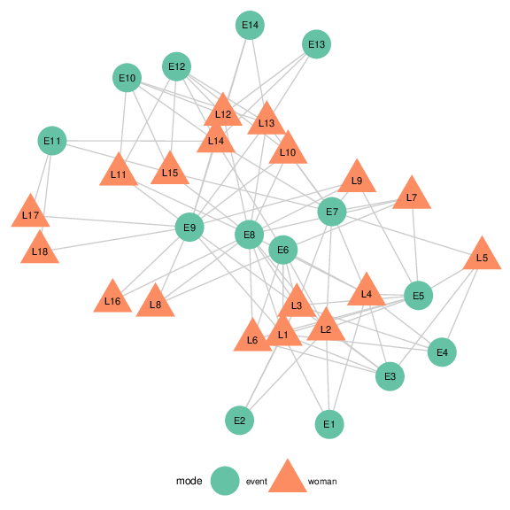</td>
</tr>
<tr class="even">
<td style="text-align: center;">(c) <em>ggnetwork</em></td>
</tr>
</tbody>
</table>
<figcaption>Figure 7: <span id="fig:davis" label="fig:davis"></span>
Graph of the Southern women data. Women are represented as orange
triangles, events as green circles. </figcaption>
</figure>

The two different types of nodes are shown by different shapes and
colors. We see the familiar relationship between events and groups of
women attending these events. Women attending the same events then form
a tighter knit subset, while events are also thought of as more similar,
if they are attended by the same women. This defines the cluster of
events E1 through E5, which are only attended by women 1 through 9,
while events E6 through E9 are attended by (almost) everybody making
them the core group of events.

## Bike sharing in Washington D.C.

The data shows trips taken with bikes from the bike share company
Capital Bikeshare[^5] during the second quarter of 2015. While this bike
sharing company is located in the heart of Washington D.C. the company
offers a set of bike stations just outside of Washington in Rockville,
MD and north of it. Each station is shown as a vertex, and edges between
stations indicate that at least five trips were taken between these two
stations; the wider the line, the more trips have been taken between
stations. In order to reflect distance between stations, we use as an
additional restriction that the fastest trip was at most ten minutes
long. Figure [8](#fig:bikes) shows four renderings of this data. The
first is a geographically true representation of the area overlaid by
lines between bike stations, the other three are networks drawn with
*geomnet*, `ggnet2`, and *ggnetwork*, respectively. The code for these
renderings is shown below:

``` r
# make data accessible
data(bikes, package = 'geomnet')
# data step for geomnet
tripnet <- fortify(as.edgedf(bikes$trips), bikes$stations[,c(2,1,3:5)])
# create variable to identify Metro Stations
tripnet$Metro = FALSE
idx <- grep("Metro", tripnet$from_id)
tripnet$Metro[idx] <- TRUE

```

``` r
# plot the bike sharing network shown in Figure 7b
set.seed(1232016)
ggplot(aes(from_id = from_id, to_id = to_id), data = tripnet) +
  geom_net(aes(linewidth = n / 15, colour = Metro),
           labelon = TRUE, repel = TRUE) +
  theme_net() +
  xlim(c(-0.1, 1.1)) +
  scale_colour_manual("Metro Station", values = c("grey40", "darkorange")) +
  theme(legend.position = "bottom")

```

``` r
# data preparation for ggnet2 and ggnetwork
bikes.net <- network(bikes$trips[, 1:2 ], directed = FALSE)
# create edge attribute (number of trips)
network::set.edge.attribute(bikes.net, "n", bikes$trips[, 3 ] / 15)
# create vertex attribute for Metro Station
bikes.net %v% "station" <-  grepl("Metro", network.vertex.names(bikes.net))
bikes.net %v% "station" <-  1 + as.integer(bikes.net %v% "station")
rownames(bikes$stations) <- bikes$stations$name
# create node attributes (coordinates)
bikes.net %v% "lon" <-
  bikes$stations[ network.vertex.names(bikes.net), "long" ]
bikes.net %v% "lat" <-
  bikes$stations[ network.vertex.names(bikes.net), "lat" ]
bikes.col <- c("grey40", "darkorange")

```

``` r
# Non-geographic placement
set.seed(1232016)
ggnet2(bikes.net, mode = "fruchtermanreingold", size = 4, label = TRUE,
       vjust = -0.5, edge.size = "n", layout.exp = 1.1,
       color = bikes.col[ bikes.net %v% "station" ],
       label.color = bikes.col[ bikes.net %v% "station" ])

```

``` r
# Non-geographic placement. Use data from ggnet2 step.
set.seed(1232016)
ggplot(data = ggnetwork(bikes.net, layout = "fruchtermanreingold"),
         aes(x, y, xend = xend, yend = yend)) +
  geom_edges(aes(size = n), color = "grey40") +
  geom_nodes(aes(color = factor(station)), size = 4) +
  geom_nodetext(aes(label = vertex.names, color = factor(station)),
                vjust = -0.5) +
  scale_size_continuous("Trips", breaks = c(2, 4, 6), labels = c(30, 60, 90)) +
  scale_colour_manual("Metro station", labels = c("FALSE", "TRUE"),
                      values = c("grey40", "darkorange")) +
  theme_blank() +
  theme(legend.position = "bottom", legend.box = "horizontal")

```

<figure id="fig:bikes">
<table>
<caption> </caption>
<tbody>
<tr class="odd">
<td style="text-align: center;">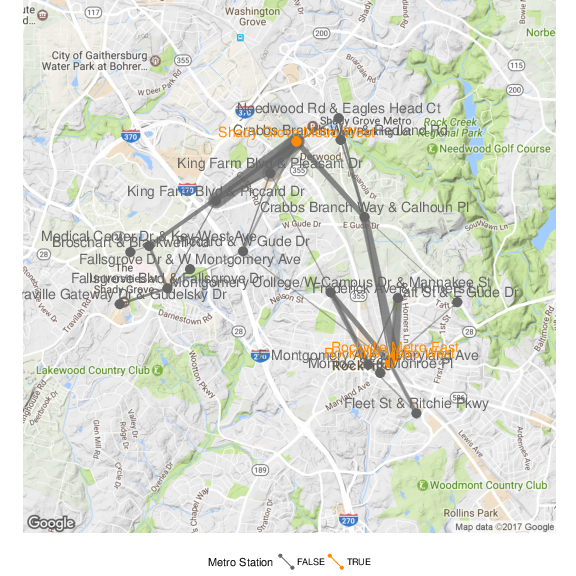</td>
<td style="text-align: center;">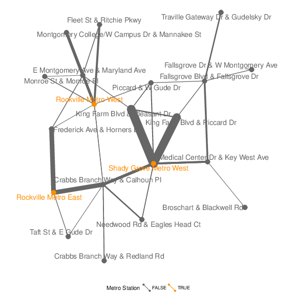</td>
</tr>
<tr class="even">
<td style="text-align: center;">(a) geographic map</td>
<td style="text-align: center;">(b)</td>
</tr>
<tr class="odd">
<td style="text-align: center;">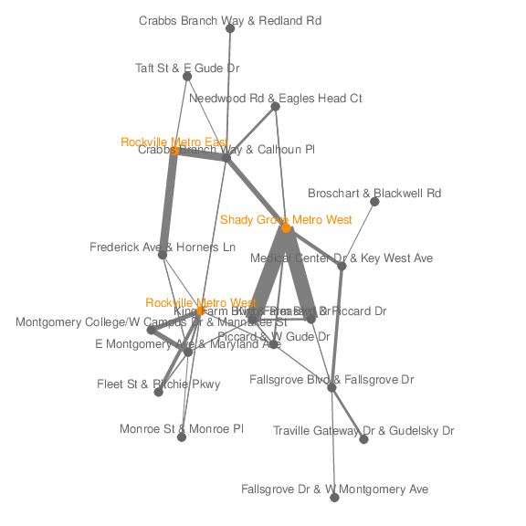</td>
<td style="text-align: center;">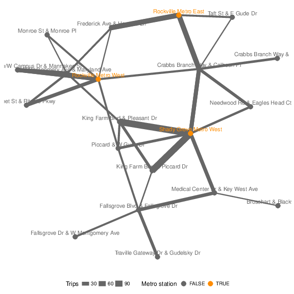</td>
</tr>
<tr class="even">
<td style="text-align: center;">(c) ggnet2</td>
<td style="text-align: center;">(d) ggnetwork</td>
</tr>
</tbody>
</table>
<figcaption>Figure 8: <span id="fig:bikes"
label="fig:bikes"></span>Network of bike trips using a geographically
true representation(top left) overlaid on a satellite map, a
Kamada-Kawai layout in <em>geomnet</em> (top right), a
Fruchterman-Reingold layout in <code>ggnet2</code> (bottom left) and
<em>ggnetwork</em> (bottom right). Metro stations are shown in orange.
In both the Kamada-Kawai and the Fruchterman-Reingold layouts, metro
stations take a much more central position than in the geographically
true representation.</figcaption>
</figure>

To plot the geographically correct bike network layout in *geomnet*, we
use the `layout.alg = NULL` option and provide the latitude and
longitude coordinates of the bike stations from the company's data. A
glance of the data that we used in the examples is shown below.

``` r
bikes.net
##  Network attributes:
##   vertices = 20 
##   directed = FALSE 
##   hyper = FALSE 
##   loops = FALSE 
##   multiple = FALSE 
##   bipartite = FALSE 
##   total edges= 53 
##     missing edges= 0 
##     non-missing edges= 53 
## 
##  Vertex attribute names: 
##     lat lon station vertex.names 
## 
##  Edge attribute names: 
##     n
head(tripnet[,-c(4:5,8)])
##                          from_id
## 1       Broschart & Blackwell Rd
## 2 Crabbs Branch Way & Calhoun Pl
## 3 Crabbs Branch Way & Calhoun Pl
## 4 Crabbs Branch Way & Calhoun Pl
## 5 Crabbs Branch Way & Calhoun Pl
## 6 Crabbs Branch Way & Calhoun Pl
##                            to_id  n      lat      long
## 1                           <NA> NA 39.10210 -77.20032
## 2 Crabbs Branch Way & Redland Rd 11 39.10771 -77.15207
## 3   Needwood Rd & Eagles Head Ct 14 39.10771 -77.15207
## 4           Rockville Metro East 51 39.10771 -77.15207
## 5           Rockville Metro West  8 39.10771 -77.15207
## 6         Shady Grove Metro West 36 39.10771 -77.15207
##   Metro
## 1 FALSE
## 2 FALSE
## 3 FALSE
## 4 FALSE
## 5 FALSE
## 6 FALSE

```

Because all three approaches result in the same picture, we only show
one of these in Figure [8](#fig:bikes)a. The code for creating the map
is given here:

``` r
  library(ggmap)
metro_map <- get_map(location = c(left = -77.22257, bottom = 39.05721, 
                                  right = -77.11271, top = 39.14247))

```

``` r
# geomnet: overlay bike sharing network on geographic map
  ggmap(metro_map) + 
  geom_net(data = tripnet, layout.alg = NULL, labelon = TRUE,
           vjust = -0.5, ealpha = 0.5,
           aes(from_id = from_id,
               to_id = to_id,
               x = long, y = lat,
               linewidth = n / 15,
               colour = Metro)) +
  scale_colour_manual("Metro Station", values = c("grey40", "darkorange")) +
  theme_net() %+replace% theme(aspect.ratio=NULL, legend.position = "bottom") +
  coord_map() 

```

We can also make use of the option `layout.alg = NULL` whenever we do
not want to use an in-built layout algorithm but make use of a
user-defined custom layout. In this case, the coordinates of the layout
have to be created outside of the visualization and $x$ and $y$
coordinates have to be made available instead.

{#fig.cap:yeast width="100%" alt="graphic without alt text"}

# Some considerations of speed {#sec:speed}

In our examples thus far, we have focused on rather small social or
relationship networks and one larger communication network. Now we
present an example of a biological network, which comes from @protein.
It is the complete protein-protein interaction network in the yeast
species *S. cerevisiae*. There are 2,113 proteins that make up the
vertices of this network, with a total of 4480 edges between them. These
edges represent "direct physical interactions\" between any two proteins
[@protein p. 42], resulting in a relatively large network. When these
interactions and their associated proteins are plotted using the
Fruchterman-Reingold layout algorithm, the runtime is extremely long,
about 9.5 minutes for 50,000 iterations through the algorithm. The
resulting layout is shown in Figure [9](#fig.cap:yeast). When testing
the three approaches with the larger network, we decided to use a random
layout to save time. Despite its size, each one of the approaches in the
*ggplot2* framework can be drawn in a few hundred milliseconds.

Another benefit that emerges from using *ggplot2* for network
visualization is the speed at which it can plot fairly large networks.
In order to assess the speed gain procured by our three approaches, we
ran two separate tests, both of which designate *ggplot2*-based
approaches as faster than the plotting functionality offered in the
*network* package. They also show the *ggplot2* approaches to be largely
on par with the speed provided by the *igraph* package. We first
investigate average random layout plotting time of the protein network

shown in Figure [9](#fig.cap:yeast), and then consider average plotting
times of increasingly larger random networks. Note that in all tests,
default package settings were used. The code to create benchmark results
for both of these situations is provided in the vignette of the package
[*ggCompNet*](https://CRAN.R-project.org/package=ggCompNet)
[@ggCompNet]. See the Supplementary Material section at the end of this
paper for more information.

We plotted the protein interaction network of Figure [9](#fig.cap:yeast)
100 times using the *network* and *igraph* packages, and compared their
run times to 100 runs each of the three visualization approaches
introduced in this paper. The results are shown in
Figure [10](#fig:timings). We can see that on average, the *ggplot2*
framework provides a two to three-fold increase in speed over the
network package, and that *geomnet* and *ggnetwork* are faster than
package *igraph*. The three *ggplot2* approaches also have considerably
less variability in time than the *network* package. Despite the large
number of vertices, the protein interaction network has a relatively
small number of edges (4480 out of over 2.2 million theoretically
possible connections resulting in an edge probability of just over
0.0020). Next, we examine networks with a higher edge probability.

![Figure 10: []{#fig:timings label="fig:timings"} Comparison of the
times needed for calculating and rendering the previously discussed
protein interaction network in the three *ggplot2* approaches and the
standard plotting routines of the *network* and *igraph* packages based
on 100 evaluations each. ](figure/compare-1.png){#fig:timings
width="100%" alt="graphic without alt text"}

The second test relies on random undirected networks in which the
probability of an edge between two nodes was set to $p = 0.2$. We
generated 100 of these networks at network sizes from 25 to 250 nodes,
using increments of 25.

{#fig.cap:runtimes-random width="100%" alt="graphic without alt text"}

Figure [11](#fig.cap:runtimes-random) summarizes the results of these
benchmarks using a convenience sample of machines accessible to the
authors, including authors' hardware and additional results from
friends' and colleagues' machines. Network sizes are plotted
horizontally, execution times of 100 runs under each visualization
approach are plotted on the $y$-axis. Each panel shows a different
machine as indicated by the facet label. Note that each panel is scaled
separately to account for differences in the overall speed of these
machines. What these plots indicate is that we have surprisingly large
variability in relative run times across different machines. However,
the results support some general findings. The *network* plotting
routine is by far the slowest across all machines, while the *igraph*
plotting is generally among the fastest. Our three approaches generally
feature in between *igraph* and *network* with `ggnet2` being as fast or
faster than *igraph* plotting, followed by *ggnetwork* and *geomnet*,
which is generally the slowest among the three. These differences become
more pronounced as the size of the network increases.

Although speed was not the main rationale for our inquiry into
*ggplot2*-based approaches to network visualization, a speed-based
comparison shows a clear advantage of these approaches over the plotting
function included in the *network* package, which very quickly becomes
much slower as network size increases.

# Summary and discussion

At first glance, the three visualization approaches may seem nearly
identical. However, each one brings unique strengths to the
visualization of networks. Out of our three approaches, *ggnetwork* is
most flexible and allows for a re-ordering of layers to emphasize one
over the other. The flexibility is useful but does require the user to
specify every single part of the network visualization. The *geomnet*
implementation most closely aligns with the existing *ggplot2* paradigm
because it provides a single layer that can be added to other `ggplot2`
layers. `ggnet2` requires the user to know the least about the *ggplot2*
framework, while resulting in a valid and extensible *ggplot2* object.
Many features of the packages would not have been possible, or would
have at least been difficult to implement, in prior versions of
*ggplot2*. The increased flexibility of the current development version
as well as the added `geom`s `geom_curve` and `geom_label` provided us
with a strong, yet flexible, foundation for network visualization. Our
approaches also benefit from the speed of *ggplot2*, making network
visualization more efficient than the existing framework of *network*
for a lot of the benchmark examples.

All three approaches rely on the package *sna* for layouts. This allows
the user to access the many layout algorithms available for networks,
and in the event that new layouts are implemented in *sna*, our packages
will accommodate them seamlessly. A larger range of layouts is available
through *igraph*, and can be implemented into our packages by setting
the respective layout arguments to `NULL` and passing `x,y` coordinates
calculated from *igraph*. There are some notable differences between the
packages, such as in the parameters used for specific layout algorithms,
e.g. *igraph* allows the use of weights for Fruchterman-Reingold
placement, even though it is unclear from the original article how these
are supposed to affect the layout. In all three approaches, it is
feasible to tap into *igraph*'s functionality in a future version so
that the user does not need to calculate the layout separately.
Additional future work will explore the implementation of other network
data structures, such as the `networkDynamic` class from *statnet*,
which would benefit from the faceting capabilities of our
implementations. This work will likely incorporate the `fortify`
approach of *ggnetwork* and `geomnet::fortify.network()` for converting
network data structures to a *ggplot2*-friendly format.

We have found that none of our approaches is unequivocally the best. We
can, however, provide some guidance as to which approach is best for
which type of user. The main differences between the three methods are
in the way that network information is passed into the functions. For
`ggnet2` and *ggnetwork*, data management and attribute handling is done
through network operators on nodes and edges, while the *geomnet*
approach does not require any knowledge of networks or existing network
analysis packages from the user. This likely affects the user base of
each package. We think that users who are well-versed with networks will
find `ggnet2` and *ggnetwork* more intuitive to use than *geomnet*.
These users might be looking to *ggplot2* as another avenue to create
high-quality visualizations that tap into *ggplot2* advantages such as
facetting and, for *ggnetwork*, layering. Users who are already familiar
with *ggplot2* and some of the other
[*tidyverse*](https://CRAN.R-project.org/package=tidyverse) packages
(see @tidyverse), and who find themselves dealing with network data will
likely be more attracted to the *geomnet* implementation of network
plotting. The data management skills needed for using *geomnet* are
basic: some familiarity with the split-apply-combine paradigm, in the
form of familiarity with
[*plyr*](https://CRAN.R-project.org/package=plyr) or
[*dplyr*](https://CRAN.R-project.org/package=dplyr), would be sufficient
in order to make full use of the features of `geom_net` [@plyr]. All in
all, the three approaches we have presented here provide a wealth of
resources to users of all skill sets who are looking to create beautiful
network visualizations.

On a personal level we discovered that the collaboration on this paper
has helped us to improve upon our initial versions of each of these
packages. For instance, the edge coloring in the `ggnet2` function was
designed so that edges between two vertices in the same group were
colored with that group's vertex color. This inspired an implementation
of it in `geomnet` through the traditional `ggplot2` `group` operator.
During the process of writing the paper the authors collaborated on a
solution for the problem of nodes being plotted on top of arrow tips.
This solution was implemented in the *geomnet* `arrow.gap` parameter,
which allows to re-track the tip of an arrow on a directed edge, and was
also added to *ggnetwork*. In addition, the implementation of a
*ggplot2* `geom` for networks within *geomnet* inspired the creation of
the aliased `geom`s of the *ggnetwork* package.

Finally, curious users may be interested in how these three packages can
fit together and replicate each other, since they are in fact so
similar. Thanks to the flexibility inherent to *ggnetwork*, it is
possible to write wrapper functions around *ggnetwork* functions in
order to recreate the behavior and functionality of `ggnet2` and
*geomnet*. Simple examples of such wrapper functions, called
`ggnetwork2` and `geom_network`, respecively are shown below.

``` r
library(ggnetwork)
# mimics geom_net behavior
geom_network <- function(edge.param, node.param) { 
     edge_ly <- do.call(geom_edges, edge.param) 
     node_ly <- do.call(geom_nodes, node.param) 
     list(edge_ly, node_ly) 
}
# mimics ggnet2 behavoir
ggnetwork2 <- function() { ggplot() + geom_network() }

```

Similarly, *geomnet* can mimic the the behavior of `ggnet2`, as shown
below.

``` r
library(geomnet)
geomnet2 <- function(net) { 
  ggplot(data = fortify(net),
         aes(from_id = from_id, to_id = to_id)) + 
    geom_net()
}

```

Mimicking *ggnetwork* with *geomnet* requires a little bit more work
because the native data input for *geomnet* is a `"data.frame"` object
fortified with *geomnet* methods, not a `"network"` object. Instead, the
internal *ggplot2* function `ggplot_build` allows a plot created with
*geomnet* function calls to be recreated with *ggnetwork*-like syntax.
An example of using a *geomnet* plot to create a similar plot in the
style of *ggnetwork* follows to reproduce Figure [2](#fig.cap:blood)(c).

``` r
library(geomnet)
library(ggnetwork)
library(dplyr)
# a ggnetwork-like creation using a geomnet plot 
data("blood")
# first, create the geomnet plot to access the data later
geomnetplot <- ggplot(data = blood$edges, aes(from_id = from, to_id =
                                                to)) +
                  geom_net(layout.alg = "circle", selfloops = TRUE) + 
                theme_net() 
# get the data
dat <- ggplot_build(geomnetplot)$data[[1]]
# ggnetwork-like construction for re-creating network shown in Figure 5 
ggplot(data = dat, aes(x = x, y = y, xend = xend, yend = yend)) + 
  geom_segment(arrow = arrow(type = 'closed'), colour = 'grey40') + 
  geom_point(size = 10, colour = 'darkred') +
  geom_text(aes(label = from), colour = 'grey80', size = 4) + 
  geom_circle() + 
  theme_blank() + theme(aspect.ratio = 1)
```

**Supplementary Material**

Software:

:   *ggnetwork* 0.5.1 and *geomnet* 0.2.0 were used to create the
    visualizations. `ggnet2` is part of *GGally* 1.3.0.

Reproducibility:

:   All the code used in the examples is available as a vignette in the
    CRAN package *ggCompNet*. There are two vignettes: one for the speed
    comparisons and one for the visualizations provided in the Examples
    section. The package also provide our speed test data for creating
    Figure [11](#fig.cap:runtimes-random). We created this package to
    accompany this paper with the hope that interested users will
    compare these methods on their own systems and against their own
    code. Finally, all of the data we use in the examples, with the
    exception of the bipartite network example, is included as a part of
    the *geomnet* package.

**Acknowledgements**

The authors would like to thank the reviewers for their thoughtful input
to and thorough reviews of our manuscript. We would also like to thank
the editor of The R Journal for his enduring patience.


[^1]: In order to give an indication of how large the user base of
    *ggplot2* is, we looked at its usage statistics from January 1, 2016
    to December 31, 2016 (see <http://cran-logs.rstudio.com/>). Over
    this period, the *ggplot2* package was downloaded over 3.2 million
    times from CRAN, which amounts to almost 9,000 downloads per day.
    Almost 800 R packages import or depend on *ggplot2*.

[^2]: Version 2.1.0, released 1 March 2016. See
    <https://cran.r-project.org/web/packages/ggplot2/news.html> for the
    full list of changes in *ggplot2* 2.1.0, as well as the new package
    vignette, "Extending ggplot2", which explains how the internal
    `ggproto` system of object-oriented programming can be used to
    create new geoms.

[^3]: See @network [p. 22-24]. The equivalent operators in the *igraph*
    package are called `E` and `V`.

[^4]: One limitation of this process is that it requires some reserved
    variable names (`x`, `y`, `xend` and `yend`), which should not also
    be present as edge-level or vertex-level attributes (otherwise the
    function will simply break). Similarly, if an edge attribute and a
    vertex attribute have the same name, like `na`, which the *network*
    package defines as an attribute for both edges and vertices in order
    to flag missing data, `ggnetwork` will rename them to `na.x` (for
    the edge-level attribute) and `na.y` (for the vertex-level
    attribute).

[^5]: <https://secure.capitalbikeshare.com/>
