::: article
# Motivation

In order to make sense of rich data that is increasingly available,
students need computational tools and facility for data management,
exploratory analysis, visualization, and modeling (e.g.,
[@NolanTempleLang:2010; @HortonBaumerWickham:2015; @HortonHardin:2015; @Ridgway:2016]).
To extract useful information from the complex systems that generate
this rich data, students should learn to "think with data" (in the
phrase coined by Diane Lambert of Google): using previous results from
data to drive statistical investigations and to inform the choice of
analysis and presentation possibilities.

Yet many students enter statistics courses with little or no
computational experience. Software such as R that encompass the tools
for thinking with data are sometimes regarded as off-putting and
inaccessible to students. With the *mosaic* package, we have sought to
remove unnecessary difficulty in the use of R by students. Our students
have demonstrated that it is feasible to integrate computing into our
curricula early and often, in a way that provides students with success,
confidence, and room to grow.

# A guiding principle: Less volume, more creativity

The [*mosaic*](https://CRAN.R-project.org/package=mosaic) [@mosaic]
package reflects attempts by each of the authors to make the power of R
accessible and rewarding to students, especially in the context of
undergraduate statistics courses, and, in one case, also in calculus.
One of the guiding principles behind the development of the *mosaic*
package has been "Less volume, more creativity." By "less volume," we
mean reducing the cognitive load involved in using R. By "more
creativity" we mean two things. First, we want to provide access to R
tools in a way that fosters choices and decision making by students.
Such decisions might be about modes of analysis or visualization or
about the variables and covariates to consider when exploring
relationships with data. Second, we want to encourage students to
creatively engage with statistical inference methods via simulation
techniques such as randomization and resampling with data analysis and
presentation.

Our route to "less volume" is to provide a set of three command
templates --- formulas, functions, and extractors --- that standardize
usage across many tasks and that highlight the connections between
graphical summaries, numerical summaries, models, and inference. The
templates themselves are designed to be consistent and concise.
Consistency enables a student to generalize from a specific task to a
wide set of possibilities. Conciseness means avoiding unnecessary
elements so that the essential inputs to a computation are made clear
and organized according a syntax that makes the role of each input
understandable and predictable.

# The importance of multivariate thinking

The importance of giving students experience with multivariable thinking
is a point of emphasis in the newly revised ASA Guidelines for
assessment and instruction in statistics education (GAISE) report
[@GAISEcollege]:

> When students leave an introductory course, they will likely encounter
> situations within their own fields of study in which multiple
> variables relate to one another in intricate ways. We should prepare
> our students for challenging questions that require investigating and
> exploring relationships among more than two variables. (page 16)

> Perhaps the best place to start is to consider how a third variable
> can change our understanding of the relationship between two
> variables. ... Simple approaches (such as stratification) can help to
> discern the true associations. Stratification requires no advanced
> methods, nor even any inference, though some instructors may
> incorporate other related concepts and approaches such as multiple
> regression. These examples can help to introduce students to
> techniques for assessing relationships between more than two
> variables. Including one or more multivariable examples early in an
> introductory statistics course may help to prepare students to deal
> with more than one or two variables at a time... (page 34)

The *mosaic* package helps support these goals by providing a unified
framework within which multivariable graphical and numerical summaries
are easy to create, even for beginners.

# The formula template

Our most important template makes use of a "formula interface" that has
long been used by familiar R functions like `t.test()`, `lm()`, and the
plotting functions in
[*lattice*](https://CRAN.R-project.org/package=lattice) [@lattice]. Our
initial example uses the `Births78` data set, which records the number
of live births in the United States for each day of 1978.

``` r
library(mosaic)
head(Births78, 3)
```

``` r
##         date births dayofyear wday
## 1 1978-01-01   7701         1  Sun
## 2 1978-01-02   7527         2  Mon
## 3 1978-01-03   8825         3 Tues
```

We will use this example to illustrate the difference between using a
consistent interface across graphical and numerical summaries and the
limitations of basic R functions that do *not* use formulas.

We typically introduce the formula template in the context of exploring
the relationship between two variables, e.g.

``` r
goal( y ~ x, data = MyData, ... )    # pseudo-code for the formula template
```

We teach students to read `y ~ x` as "y wiggle x" and to interpret this
in any of several essentially equivalent forms: "`y` broken down by
`x`"; "`y` modeled by `x`"; "`y` explained by `x`"; "`y` depends on
`x`"; or "`y` accounted for by `x`." For graphics, it's reasonable to
read the formula as "`y` vs. `x`", which is exactly the convention used
for coordinate axes. But "`y` vs. `x`" does not as clearly convey the
asymmetry of the other forms.

This template is not original to
[*mosaic*](https://CRAN.R-project.org/package=mosaic). Those familiar
with R will recognize this as the template already used by functions
such as `lm()` and the *lattice* plotting functions. The *mosaic*
package extends this template to numerical summaries and provides some
additional features for plotting and fitting models, thereby bringing
all of these activities into a consistent, unified appraoch.

Our first plot of the `Births78` data might be a scatterplot showing how
the number of births depends on the date. Using our template and the
*lattice* function `xyplot()`, we can create this with the following
simple command by filling in the slots in our formula template.

``` r
library(lattice)
xyplot(births ~ date, data = Births78)
```

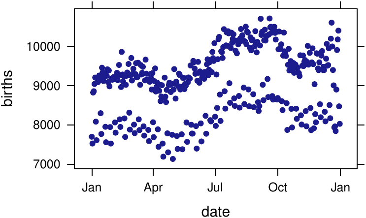{width="45.0%"
alt="graphic without alt text"}

The scatterplot reveals some interesting patterns over the course of the
year. Getting students to make conjectures about possible explanations
can help diagnose how well students understand the information displayed
in the scatterplot. (Students who suggest that there are two parallel
waves because more children are born at certain times of the year reveal
that they are misunderstanding this plot, for example.)

One reasonable conjecture for the two parallel waves is a weekend
effect. We would like our students to be able to explore this conjecture
graphically, numerically, and (eventually) with statistical models. We
might begin by creating side-by-side boxplots. The *lattice* package
makes this as easy as the scatterplot above. We simply replace
`xyplot()` with `bwplot()` because we have a different goal. If we
prefer, we can also reverse the order of the variables in the formula to
flip which axis is used for which purpose.

``` r
bwplot(births ~ wday, data = Births78) 
bwplot(wday ~ births, data = Births78, pch = "|")  # a more common way to show median
```

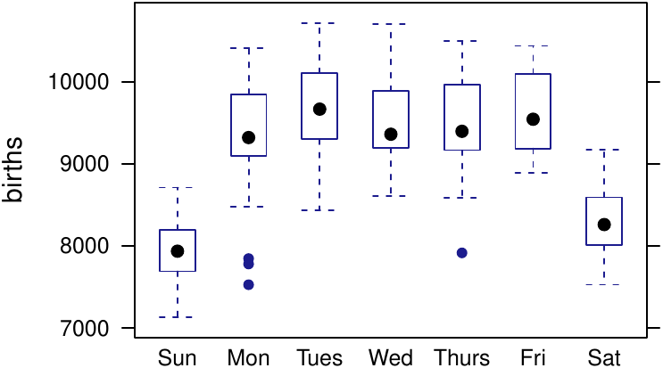{width="45.0%"
alt="graphic without alt text"}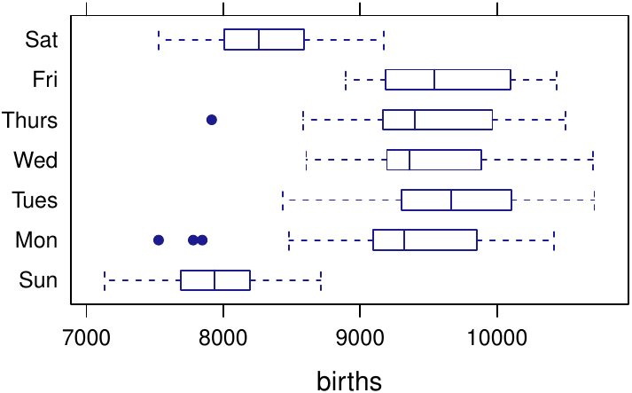{width="45.0%"
alt="graphic without alt text"}

To quantify the differences observed in these plots, we might like to
compute the mean (or median) number of births for each weekday. Basic
statistical calculations can be admirably concise in R. For instance,
the mean number of daily births (over all days) can be calculated with

``` r
mean(Births78$births)    # or use with() instead of $ 
```

``` r
## [1] 9132
```

Unfortunately, this is a dead end when it comes to thinking with data.
How, for instance, does one explore whether there is a day-of-the-week
component to the number of births? Here are a few conventional
approaches in R to such a calculation.

``` r
aggregate(Births78$births, FUN = mean, by = list(Births78$wday))
```

or, equivalently,

``` r
with(Births78, aggregate(births, FUN = mean, by = list(wday)))
```

``` r
##   Group.1    x
## 1     Sun 7951
## 2     Mon 9371
## 3    Tues 9709
## 4     Wed 9498
## 5   Thurs 9484
## 6     Fri 9626
## 7     Sat 8309
```

or, alternatively,

``` r
with(Births78, tapply(births, wday, mean))
```

``` r
##   Sun   Mon  Tues   Wed Thurs   Fri   Sat 
##  7951  9371  9709  9498  9484  9626  8309
```

None of these show any similarity to `mean(Births78$births)` or to the
commands that created the plots that generated our conjecture. All of
them bury `mean()` in the center or at the end of the command and
require additional structure like `aggregate()`, `tapply()`, lists, and
nested parentheses. Even reading the commands is difficult.

The essential elements in each of these calculations are `mean()`,
`Births78`, `births` and `wday`: We want to see how the mean number of
births depends on the day of the week using data from 1978. The *mosaic*
formula template for this calculation mirrors the template used to
create plots in *lattice* and highlights these essential elements:

``` r
library(mosaic)
mean(births ~ wday, data = Births78)
```

``` r
##   Sun   Mon  Tues   Wed Thurs   Fri   Sat 
##  7951  9371  9709  9498  9484  9626  8309
```

This form makes clear that the `mean()` is being calculated and that
`Births78` holds the data. The relationship between the variables is
specified by the formula. Most importantly, it is the same template that
was used to create the plots that preceded it -- we simply replace
`bwplot()` or `xyplot()` with `mean()`.

Using the *mosaic* package, this same template extends to many other
numerical summaries, e.g.,

``` r
median(births ~ wday, data = Births78)
```

``` r
##   Sun   Mon  Tues   Wed Thurs   Fri   Sat 
##  7936  9321  9668  9362  9397  9544  8260
```

``` r
sd(births ~ wday, data = Births78)
```

``` r
##   Sun   Mon  Tues   Wed Thurs   Fri   Sat 
##   410   608   527   461   551   488   390
```

``` r
favstats(births ~ wday, data = Births78)
```

``` r
##    wday  min   Q1 median    Q3   max mean  sd  n missing
## 1   Sun 7135 7691   7936  8196  8711 7951 410 53       0
## 2   Mon 7527 9097   9321  9838 10414 9371 608 52       0
## 3  Tues 8433 9304   9668 10084 10711 9709 527 52       0
## 4   Wed 8606 9196   9362  9880 10703 9498 461 52       0
## 5 Thurs 7915 9171   9397  9958 10499 9484 551 52       0
## 6   Fri 8892 9198   9544 10088 10438 9626 488 52       0
## 7   Sat 7527 8007   8260  8586  9170 8309 390 52       0
```

The *mosaic* package provides formula interfaces for `mean()`,
`median()`, `sd()`, `var()`, `cor()`, `cov()`, `quantile()`, `max()`,
`min()`, `range()`, `IQR()`, `iqr()`, `fivenum()`, `prod()`, and
`sum()`. In each case we have been careful not to break behavior of the
underlying functions from *base* and *stats*.

Model-building functions such as `lm()` and `glm()` also employ the same
template:

``` r
births.model <- lm(births ~ wday, data = Births78)
```

so early experience with graphical and numerical summaries prepares
students for statistical modeling later in the course.

When working with categorical data, tabulation is an important
technique. The `table()` function does not accept formulas and `xtabs()`
uses formulas in a different way. The *mosaic* package provides a
formula-template `tally()` function for counting categorical variables.
We illustrate its use with another data set from
[*mosaicData*](https://CRAN.R-project.org/package=mosaicData)
[@mosaicData]. `Whickham` contains data from a UK study that enrolled
subjects in 1972--74 and conducted a follow-up 20 years later.

``` r
tally(outcome ~ smoker, data = Whickham)
```

``` r
##        smoker
## outcome  No Yes
##   Alive 502 443
##   Dead  230 139
```

``` r
tally(outcome ~ smoker, data = Whickham, margins = TRUE)
```

``` r
##        smoker
## outcome  No Yes
##   Alive 502 443
##   Dead  230 139
##   Total 732 582
```

``` r
tally(outcome ~ smoker, data = Whickham, margins = TRUE, format = "proportion")
```

``` r
##        smoker
## outcome    No   Yes
##   Alive 0.686 0.761
##   Dead  0.314 0.239
##   Total 1.000 1.000
```

Notice that in the final example, conditional proportions are
calculated. The conditional probabilities were computed in a way that
respects the asymmetric meaning of the formula `outcome ~ smoker`: using
`smoker` to account for `outcome`. The probabilities indicate that
smokers were more likely to be alive in the follow-up study. More on
this in a moment.

The formula template can be extended to handle one variable or more than
two variables, but for several reasons we recommend introducing it in
the context of two-variable plots and numerical summaries. We offer this
recommendation because (1) two-variable plots and numerical summaries
are more "impressive" than one-variable plots and less likely to be
something students can as readily do with tools they already know, (2)
working with more than one variable from the start (correctly) suggests
that the most interesting parts of statistics involve more than one
variable [@Wild:RSS:2011], and (3) the formula syntax for a single
variable makes more sense in the context of two-sided formulas than it
does in isolation.

Formulas with a single variable correspond to situations where there is
no "explanatory" variable to be included, for example in simple
numerical summaries or depictions of the distribution of a variable.

``` r
mean( ~ age, data = Whickham)
```

``` r
## [1] 46.9
```

``` r
histogram( ~ age, data = Whickham)
```

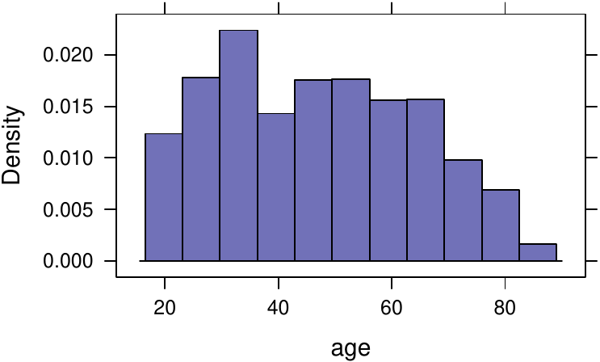{width="45.0%"
alt="graphic without alt text"}

To some instructors, it seems more natural when there is no explanatory
variable for the single variable to be on the left-hand side of `~`. But
the R parser does not support this: a formula must have a right-hand
side. Even if R allowed such formulas, the use of `y ~` would break the
analogy to graphical summaries where a single variable is traditionally
displayed on the $x$-axis, as in the histogram above.

The numerical summary functions provided by *mosaic* also allow formulas
like `age ~ NULL` to signify there is no explanatory variable.

``` r
mean( age ~ NULL, data = Whickham)
```

``` r
## [1] 46.9
```

We don't emphasize this form, however, since it is not supported by the
*lattice* functions.

"Thinking with data" implies the ability to examine relationships among
multiple variables. The formula template accomodates more than one
variable on the right-hand side of the tilde, for instance:

``` r
mean(age ~ smoker + outcome, data = Whickham)
```

``` r
##  No.Alive Yes.Alive   No.Dead  Yes.Dead 
##      40.0      40.1      67.6      59.2
```

The *lattice* package provides a number of ways to include additional
variables in plots. Inclusion of in a formula, for example, specifies a
variable to be used for defining subpanels (or facets).

``` r
histogram( ~ age | smoker, data = Whickham)
```

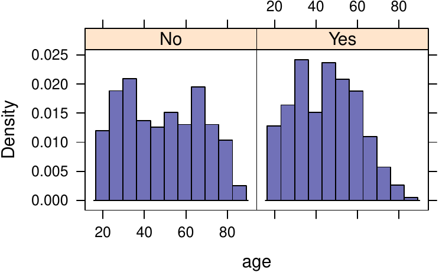{width="45.0%"
alt="graphic without alt text"}

Another option is to overlay multiple layers in a plot; *lattice* does
this via a `groups` argument.

``` r
xyplot(births ~ date, groups = wday, data = Births78, type = "l")
densityplot( ~ births, groups = wday, data = Births78, auto.key = list(columns = 3))
```

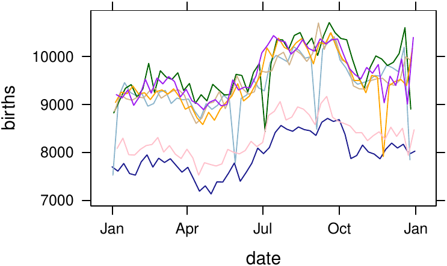{width="45.0%"
alt="graphic without alt text"}
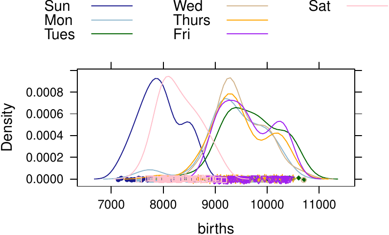{width="45.0%"
alt="graphic without alt text"}

Each of these two plots shows a clear difference in the distribution of
births on the two weekend days compared to the other five days of the
week.

For ease in moving between plots and numerical summaries, *mosaic*
functions such as `mean()` and `tally()` also accept this expanded
syntax.

``` r
mean( ~ age | smoker, data = Whickham)
```

``` r
##   No  Yes 
## 48.7 44.7
```

``` r
mean( ~ births, groups = wday, data = Births78)
```

``` r
##   Sun   Mon  Tues   Wed Thurs   Fri   Sat 
##  7951  9371  9709  9498  9484  9626  8309
```

Notice that the mean age for smokers in the Whickham study is
substantially lower than for the non-smokers, so an accurate comparison
of survival rates must take age into account.

The formula template allows students to think about relationships
between and among two or more variables and to test conjectures using
graphical and numerical summaries. Having learned the formula interface
to graphical and numerical summaries early on, new users are well
prepared for modeling with `lm()`, `glm()`, and various "test" functions
such as `t.test()` when the time comes. More importantly, they begin
early to train their minds to ask questions of the form "How does this
depend on that (and some other things)?".

By emphasizing the formula template, each of the following commands can
be viewed as instances of a common template, rather than as separate
things to learn.

``` r
bwplot(age ~ smoker, data = Whickham)     # standard function in lattice
  mean(age ~ smoker, data = Whickham)     # formula interface added in mosaic
    sd(age ~ smoker, data = Whickham)     # formula interface added in mosaic
    lm(age ~ smoker, data = Whickham)     # standard function in stats
```

Similarly, by adding additional formula interfaces to `t.test()`,
`binom.test()`, and `prop.test()`, and adding some additional plot
types, for one-variable situations we have

``` r
       mean( ~ age, data = Whickham)      # formula interface added in mosaic
         sd( ~ age, data = Whickham)      # formula interface added in mosaic
   favstats( ~ age, data = Whickham)      # new function in mosaic
  histogram( ~ age, data = Whickham)      # standard function in lattice
     t.test( ~ age, data = Whickham)      # formula interface added in mosaic
 binom.test( ~ smoker, data = Whickham)   # formula interface added in mosaic
  prop.test( ~ smoker, data = Whickham)   # formula interface added in mosaic
```

Adding covariates to one- or two- variable graphical or numerical
summaries fits readily into the template as well.

``` r
     mean( ~ age | smoker, data = Whickham)   # formula interface added in mosaic
       sd( ~ age | smoker, data = Whickham)   # formula interface added in mosaic
histogram( ~ age | smoker, data = Whickham)   # standard lattice
   t.test( ~ age | smoker, data = Whickham)   # expanded formula interface in mosaic
```

While specifying the correct formula can produce some challenges for new
users, clearly explaining the roles of each component for plotting, for
numerical summaries, and for model fitting helps demystify the
situation. Instructors have had students create and interpret bivariate
and trivariate graphical displays on the first day of class
[@Wang:2017]. We have also found that explicit, early, low-stakes
assessment of student mastery of the formula interface greatly improves
student performance. A first quiz consisting of a single item (What is
the formula template?) followed by one or two simple pencil-and-paper
quizzes asking students to write the commands to recreate a handful of
numerical and graphical summaries suffices.

# The model-function template

Modeling functions like `lm()` and `glm()` can fit a wide range of
statistical models. But functions like `predict()` are challenging for
new users (primarily because of the user must create a data frame in
order to evaluate the model function on user-specified inputs), and
constructing a useful graphical representation of a data set together
with a logistic regression fit even more so. The *mosaic* functions
`makeFun()`, `plotFun()`, and `plotModel()` make these tasks easier.

In particular, `makeFun()` extracts from a model object created by
`lm()` or `glm()` a function that is a wrapper around `predict()` and
can be used with standard function syntax that is familiar to students
from the way functions are typically described in secondary school and
in calculus. This wrapper around `predict()` is easier for beginners to
use because (1) it returns a function to which inputs can be supplied
without creating a data frame, (2) the resulting function returns values
on the response scale by default, and (3) it back transforms a few
common transformations of the response variable, including `log()` and
`sqrt()` (and allows the user to provide a custom value to the
`transformation` argument to handle other cases).

The functions extracted from models using `makeFun()` (and functions
created in other ways) can be plotted with `plotFun()`. In the example
below, we illustrate the use of `makeFun()` and `plotFun()` to compare
linear and quadratic fits to the same data.

``` r
cars.mod1 <- lm(dist ~ speed, data = cars)
cars.mod2 <- lm(dist ~ poly(speed,2), data = cars)
# extract functions for each model that compute distance from speed
cars.dist1 <- makeFun(cars.mod1)   
cars.dist2 <- makeFun(cars.mod2)
# evaluate these functions as user-specified values of speed
cars.dist2(speed = 15)
```

``` r
##    1 
## 38.7
```

``` r
cars.dist2(speed = 15, interval = "confidence")
```

``` r
##    fit lwr  upr
## 1 38.7  33 44.3
```

``` r
# add plots of these functions to a scatter plot
xyplot(dist ~ speed, data = cars, alpha = 0.4)
plotFun(cars.dist1(speed) ~ speed, add = TRUE, col = 2, lwd = 2)
plotFun(cars.dist2(speed) ~ speed, add = TRUE, col = 3, lwd = 2)
```

::: center
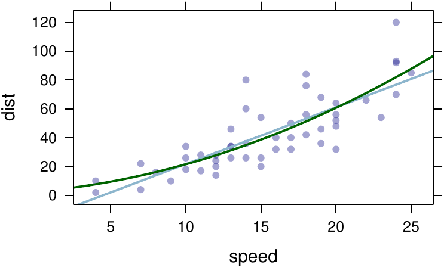{width="45.0%"
alt="graphic without alt text"}
:::

For logistic regression, when the response is coded as a factor, we need
to adjust things slightly when plotting because the model function
returns values between 0 and 1, but 2-level factors are coded as 1 and 2
in R.

``` r
smoker.mod <- glm(outcome ~ smoker + age, data = Whickham, family = binomial)
smoker.fun <- makeFun(smoker.mod)
smoker.fun(age = 60, smoker = "Yes")
```

``` r
##     1 
## 0.507
```

``` r
smoker.fun(age = 60, smoker = "No")
```

``` r
##     1 
## 0.456
```

``` r
xyplot(outcome ~ age, groups = smoker, data = Whickham, jitter.y = TRUE, alpha = 0.1)
plotFun(1 + smoker.fun(age, smoker = "No") ~ age, col = 1, add = TRUE)
plotFun(1 + smoker.fun(age, smoker = "Yes") ~ age, col = 2, add = TRUE)
```

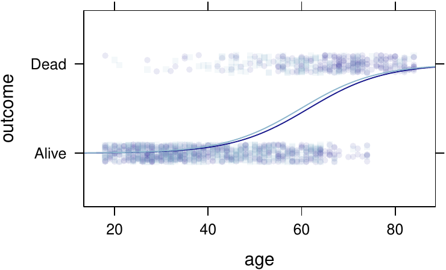{width="45.0%"
alt="graphic without alt text"}

When the response variable in the model is transformed, the
`transformation` argument to `makeFun()` can be used to specify the
back-transformation. For a few common transformations (e.g., `log()` and
`sqrt()`), the value of `transformation` is determined automatically (by
default).

``` r
mtcars.mod <- lm(log(mpg) ~ log(wt) + factor(cyl), data = mtcars)
mileage <- makeFun(mtcars.mod)
xyplot(mpg ~ wt, data = mtcars, groups = cyl)
plotFun(mileage(wt, cyl = 4) ~ wt, add = TRUE, col = 1)
plotFun(mileage(wt, cyl = 6) ~ wt, add = TRUE, col = 2)
plotFun(mileage(wt, cyl = 8) ~ wt, add = TRUE, col = 3)
```

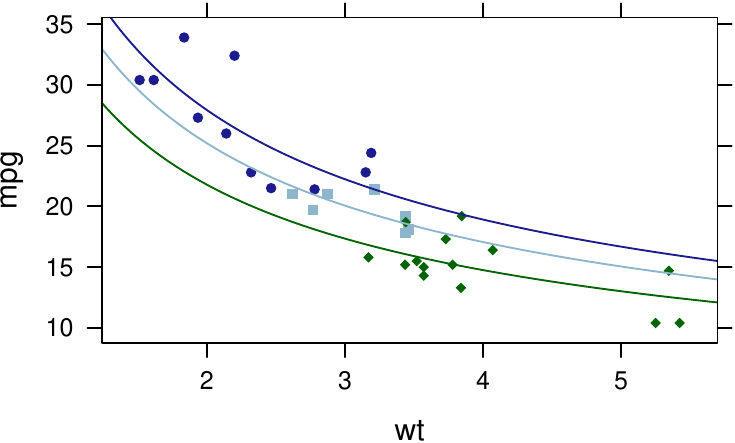{width="45.0%"
alt="graphic without alt text"}

For models with two quantitative predictors, `plotFun()` can create a
contour plot. The following model explores how the average SAT score
depends on the amount of money spent on education (in thousands of
dollars per student) by a US State and the precent of students in that
state who take the SAT exam.

``` r
SAT.mod <- lm(sat ~ expend * frac, data = SAT)
msummary(SAT.mod)
```

``` r
##             Estimate Std. Error t value Pr(>|t|)    
## (Intercept) 1057.121     42.040   25.15  < 2e-16 ***
## expend         0.629      7.846    0.08    0.936    
## frac          -4.232      0.818   -5.18  4.9e-06 ***
## expend:frac    0.237      0.135    1.75    0.087 .  
## 
## Residual standard error: 31.8 on 46 degrees of freedom
## Multiple R-squared:  0.831,  Adjusted R-squared:  0.82 
## F-statistic: 75.2 on 3 and 46 DF,  p-value: <2e-16
```

``` r
sat.pred <- makeFun(SAT.mod)
plotFun(sat.pred(expend, frac) ~ expend + frac,
       expend.lim=c(3.6,9.7), frac.lim=c(0,83))
```

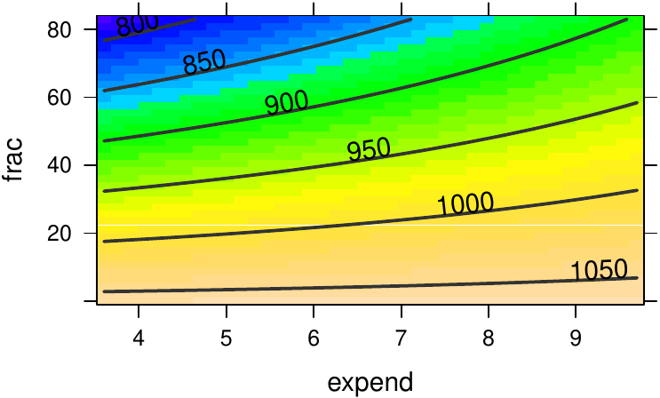{width="45.0%"
alt="graphic without alt text"}

The `msummary()` function provides a terser summary of the model object
than `summary()`. The plot shows that this model predicts performance on
the exam to increase with increased expenditure and decreased
participation in the exam. (In states with lower participation rates
there is a selection bias toward stronger students who are seeking
admission into out-of-state colleges and universities.) Furthermore, the
effect of increased spending appears to be greater when a larger percent
of the students take the exam. Interestingly, a simpler linear model
that includes only expenditure as a predictor has a negative slope.

For many simple models, creating a plot can be even simpler using
`plotModel()`, which also eliminates the need to manually adjust
logistic regression plots when the response is a factor. For models with
multiple predictors, we can supply a formula to indicate which predictor
we prefer to have on the x-axis.

``` r
plotModel(cars.mod2)
plotModel(smoker.mod, outcome ~ age, jitter.y = TRUE)
```

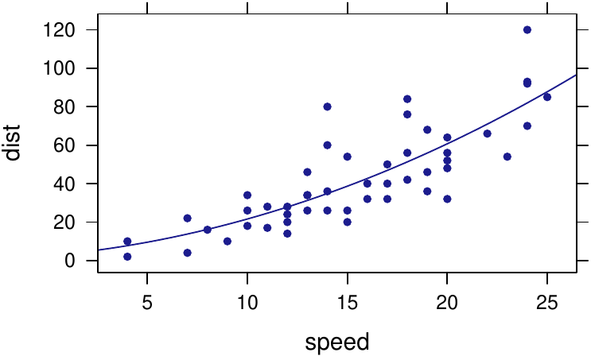{width="45.0%"
alt="graphic without alt text"}
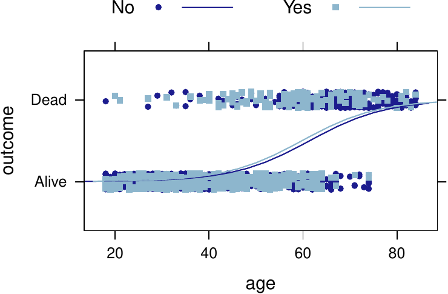{width="45.0%"
alt="graphic without alt text"}

The `plotModel()` function can also simplify visualization of more
complex models.

``` r
mtcars.mod2 <- lm(mpg ~ log(wt) + factor(cyl) + factor(am), data = mtcars)
plotModel(mtcars.mod2, mpg ~ wt | factor(am))
```

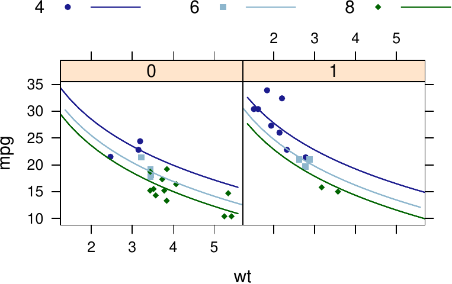{width="45.0%"
alt="graphic without alt text"}

# The extractor template

The use of `makeFun()` to create a function from a model illustrates
another important template, the extractor template:

``` r
object <- { some computation }
extractor(object)              # extract some information from object
```

R has many such extractors which summarize, display, or extract partial
information from an object. The `print()`, `plot()`, and `summary()`
functions are examples of extractors that can be applied to many types
of objects. Other extractors, like `coef()`, `resid()`, and `fitted()`
are designed to work with a much smaller set of objects. The *mosaic*
package defines several extractors including those listed in
Table [1](#table:extractors).

::: {#table:extractors}
  ------------------------------------------------------------------------
  Extractor      Purpose
  -------------- ---------------------------------------------------------
  `makeFun()`    Extract a fitted function from a model.

  `rsquared()`   Extract $r^2$ from a linear model.

  `stat()`       Extract the test statistic from a hypothesis test.

  `pval()`       Extract the p-value from a hypothesis test.

  `confint()`    Extract the confidence interval from a hypothesis test.

  `mplot()`      Create a plot from an object.
  ------------------------------------------------------------------------

  : Table 1: Extractors defined in the *mosaic* package.
:::

``` r
confint(t.test( ~ age, data = Whickham))      # works for any "htest" object
```

``` r
##   mean of x lower upper level
## 1      46.9    46  47.9  0.95
```

``` r
pval(t.test(age ~ smoker, data = Whickham))    # works for any "htest" object
```

``` r
##  p.value 
## 2.06e-05
```

``` r
stat(t.test(age ~ smoker, data = Whickham))    # works for any "htest" object
```

``` r
##    t 
## 4.27
```

``` r
rsquared(lm(age ~ smoker, data = Whickham))
```

``` r
## [1] 0.0131
```

## The `mplot()` function {#mplot}

Like `plot()`, `mplot()` has many uses depending on the kind of input it
receives. The two primary uses cases are creating diagnostic plots for
lm and glm objects, and interactively creating data visualizations using
the variables in a data frame.

Given a model object as its first argument, `mplot()` provides similar
diagnostic plots to those produced via `plot()` but with two primary
differences: the user may select to use either *lattice* or
[*ggplot2*](https://CRAN.R-project.org/package=ggplot2)
[@2015-87-ggplot2] graphics instead of base graphics, and an additional
plot type is provided to visualize the confidence intervals for the
coefficients of a regression model.

``` r
mod <- lm(length ~ width * sex, data = KidsFeet)
mplot(mod, system = "lattice", which = 1:7)
```

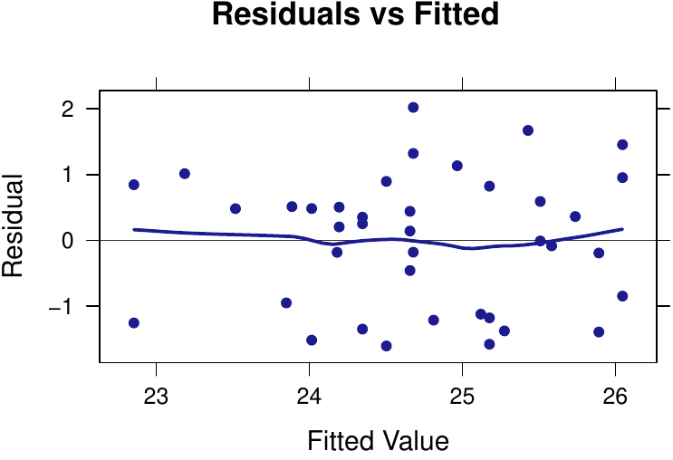{width="45.0%"
alt="graphic without alt text"}
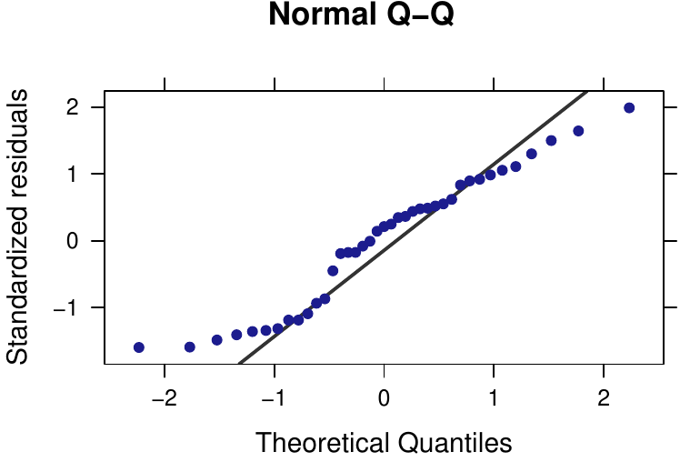{width="45.0%"
alt="graphic without alt text"}

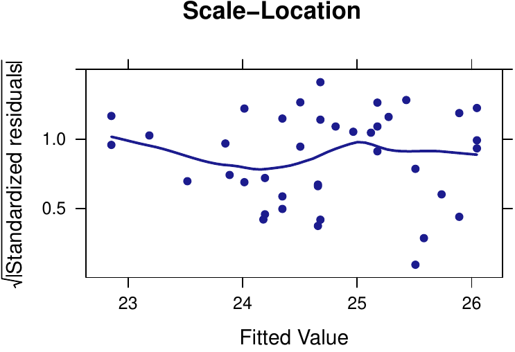{width="45.0%"
alt="graphic without alt text"}
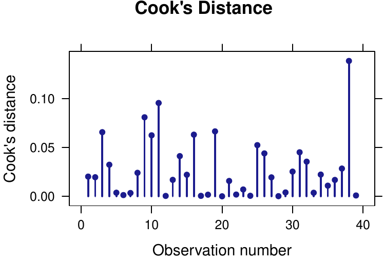{width="45.0%"
alt="graphic without alt text"}

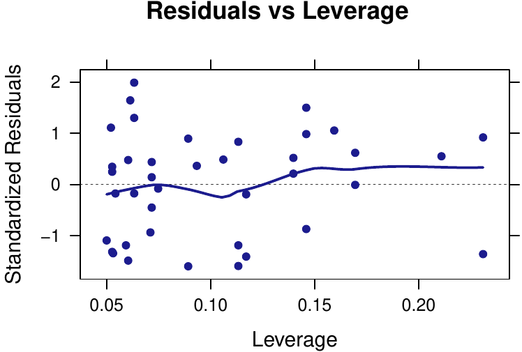{width="45.0%"
alt="graphic without alt text"}
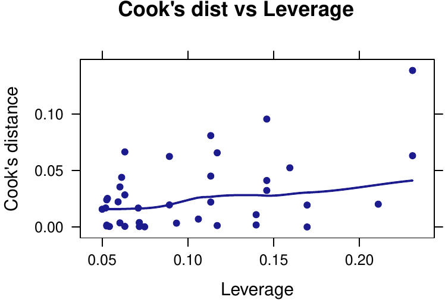{width="45.0%"
alt="graphic without alt text"}

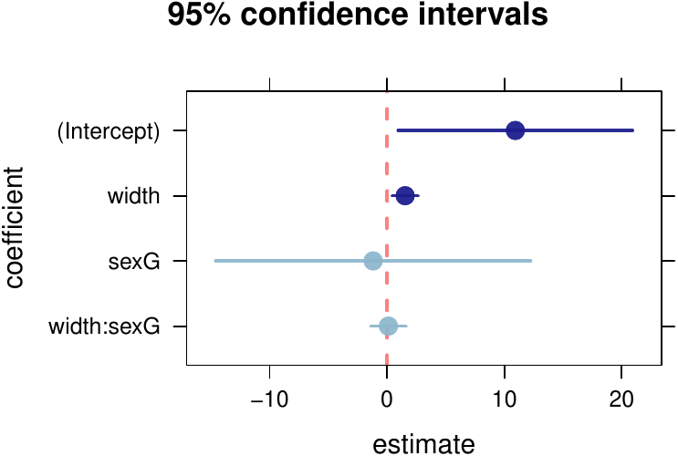{width="45.0%"
alt="graphic without alt text"}

We can also use `mplot()` to visually represent the results of
`TukeyHSD()`, which has been modified so that it can be applied directly
to objects produced by `lm()`.

``` r
mplot(TukeyHSD(lm(births ~ wday, data = Births78)), order = "pval")
```

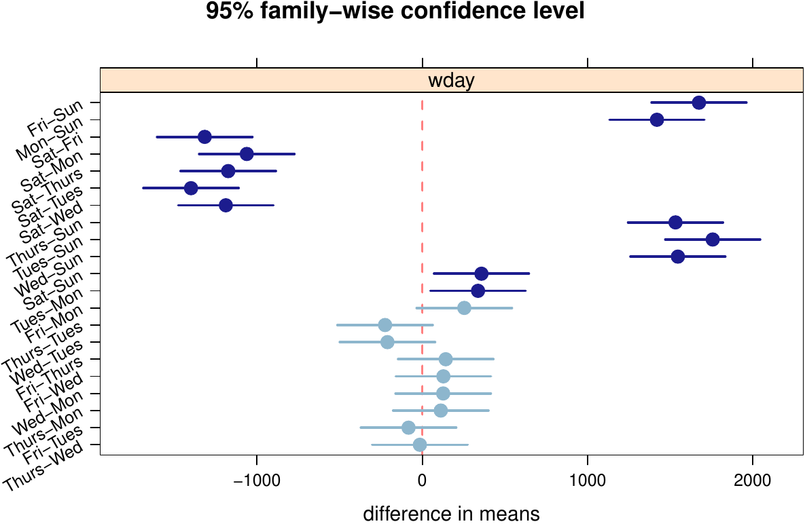{width="45.0%"
alt="graphic without alt text"}

The resulting plots are formatted in a way that makes them usable in a
wider range of scenarios than are those produced using `plot()`.

A second use for `mplot()` is to create *lattice* and
[*ggplot2*](https://CRAN.R-project.org/package=ggplot2) plots
interactively within RStudio. Issuing the following command in RStudio
will bring up a plot that can be modified by making choices in the
accompanying menu.

``` r
mplot(KidsFeet)
```

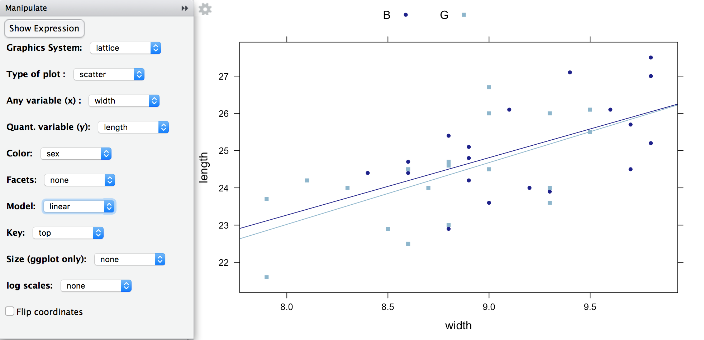{width="60.0%" alt="graphic without alt text"}

The menu allows the user to choose either *lattice* or *ggplot2*
graphics, to select the type of plot and the variables used, and to
control a few of the most commonly used features that modify a plot
(faceting, color, legends, log-scaling, fitting a linear model or LOESS
smoother). The "Show Expression" button exports the command used to
create the plot into the console. From there it can be edited or copied
and pasted into an R Markdown document. This can be very useful for new
users working to master the syntax for a particular graphical system.

# Randomization and resampling

Resampling approaches have become increasingly important in statistical
education [@Tintle:TAS:2015; @Hesterberg:2015]. The *mosaic* package
provides simplified functionality to support teaching inference based on
randomization tests and bootstrap methods. Our goal was to focus
attention on the important parts of these techniques (e.g., where
randomness enters in and how to use the resulting distribution) while
hiding some of the technical details involved in creating loops and
accumulating values.

## A first example

As a first example, we often introduce (a version of) the story of the
lady tasting tea. (See [@Salsburg:2002] for the details of this famous
story.) But here we will test a coin to see whether it is a "fair coin".
Suppose we flip the coin 20 times and observe only 6 heads, how
suspicious should we be that the coin is not fair? The statistical
punchline for either the lady tasting tea or testing a coin is that we
want to compute the p-value for a binomial test via simulations rather
than using formulas for the binomial distribution or normal
approximations. But we want to do this on the first day of class, and
without using any of the jargon of the preceding sentence.

Because students do not know about sampling distributions or random
variables yet, but do understand the idea of a coin toss, we have
provided `rflip()` to simulate tossing a coin one or several times:

``` r
rflip()
```

``` r
## 
## Flipping 1 coin [ Prob(Heads) = 0.5 ] ...
## 
## H
## 
## Number of Heads: 1 [Proportion Heads: 1]
```

``` r
rflip(20)
```

``` r
## 
## Flipping 20 coins [ Prob(Heads) = 0.5 ] ...
## 
## H T T T H T H H H H H T T H H T T H H T
## 
## Number of Heads: 11 [Proportion Heads: 0.55]
```

To test a null hypothesis of a fair coin, we need to simulate flipping
20 coins many times, recording for each simulation the number of heads
that were observed. The `do()` function allows us to do just that using
the following template

``` r
do(n) * {stuff to do}             # pseudo-code
```

where `{stuff to do}` is typically a single R command, but may be
something more complicated. We teach this syntax by reading it aloud:
"Do n times ..." For example, we can flip 20 coins three times as
follows.

``` r
do(3) * rflip(20)   # do 3 times flip 20 coins
```

``` r
##    n heads tails prop
## 1 20    10    10 0.50
## 2 20     8    12 0.40
## 3 20    15     5 0.75
```

Notice that `do()` (technically `cull_for_do()`) has been clever about
what information is stored for each group of 20 coin tosses and that the
results are returned in a data frame.

It is now a simple matter to do this many more times and use numerical
or graphical summaries to investigate how unusual it is to get so few
heads if the coin is indeed a fair coin.

``` r
Sims <- do (1000) * rflip(20)
histogram( ~ heads, data = Sims, width = 1, groups = heads <= 6)
tally ( ~ (heads <= 6), data = Sims)
```

``` r
## (heads <= 6)
##  TRUE FALSE 
##    54   946
```

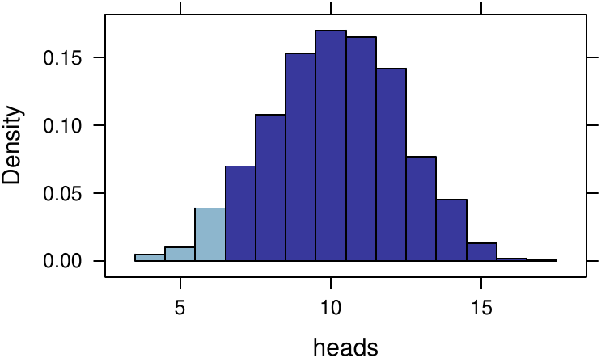{width="45.0%"
alt="graphic without alt text"}

Readers familiar with *lattice* will notice that the *mosaic* package
adds some additional arguments to the `histogram()` function. Among
these are `width` and `center` which can be used to control the width
and position of the bins and are much easier for new users to master
than the `breaks` argument supplied by *lattice*.

## The `sample()`, `resample()`, and `shuffle()` functions {#sample-resample-and-shuffle}

To facilitate randomization and bootstrapping, *mosaic* extends
`sample()` to operate on data frames. The `shuffle()` function is an
alternative name for `sample()`, and `resample()` is `sample()` with
`replace = TRUE`. With these in hand, all of the tests and confidence
intervals seen in a traditional first course in statistics can be
performed using a common outline:

1.  Do it to your data

2.  Do it to a randomized version of your data

3.  Do it to lots of randomized versions of your data.

For example, we can use randomization in place of the two-sample t test
to obtain an empirical p-value.

``` r
D <- diffmean(age ~ smoker, data = Whickham); D 
```

``` r
## diffmean 
##    -4.02
```

``` r
do(1) * diffmean(age ~ shuffle(smoker), data = Whickham)
```

``` r
##   diffmean
## 1    -1.69
```

``` r
Null.dist <- do(5000) * diffmean(age ~ shuffle(smoker), data = Whickham)
histogram( ~ diffmean, data = Null.dist, v = D, xlim = c(-5,5))
prop( ~ (diffmean < D), data = Null.dist)
```

``` r
## TRUE 
##    0
```

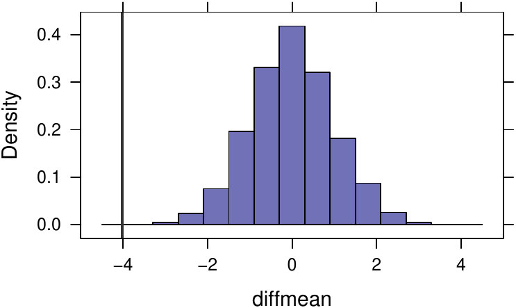{width="45.0%"
alt="graphic without alt text"}

None of the 5000 replications led to a difference in means as large as
the one in the original data.

It should be noted that although this is typically not done in
simulation-based introductory statistics texts, one might prefer to
calculate p-values by including the observed data in the randomization
distribution. This avoids an empirical p-value of 0 and guarantees that
the actual type I error rate will not exceed the nominal type I error
rate. This amounts to adding one to the numerator and denominator. The
`prop1()` function automates this for us.

``` r
prop1( ~ (diffmean < D), data = Null.dist)
```

``` r
##  TRUE 
## 2e-04
```

``` r
1/5001
```

``` r
## [1] 2e-04
```

For more precise estimation of small p-values, additional replications
should be used.

The example above introduces three additional *mosaic* functions. The
`prop()` and `prop1()` functions compute the proportion of logical
vector that is (by default) `TRUE` or of a factor that is (by default)
in the first level; `diffmean()` is similar to `diff(mean())`, but
labels the result differently (`diffprop()` works similarly for
differences in proportions).

If we are interested in a confidence interval for the difference in
group means, we can use `resample()` and `do()` to generate a bootstrap
distribution in one of two ways.

``` r
Boot1 <- do(1000) * diffmean(age ~ smoker, data = resample(Whickham))
Boot2 <- do(1000) * diffmean(age ~ smoker, data = resample(Whickham, groups = smoker))
```

In the second example, the resampling happens within the smoker groups
so that the marginal counts for each group remain fixed. This can be
especially important if one of the groups is small, because otherwise
some resamples might not include any observations of that group.

``` r
favstats(age ~ smoker, data = Whickham)
```

``` r
##   smoker min Q1 median Q3 max mean   sd   n missing
## 1     No  18 32     48 65  84 48.7 18.8 732       0
## 2    Yes  18 32     45 57  84 44.7 15.3 582       0
```

``` r
favstats(age ~ smoker, data = resample(Whickham))
```

``` r
##   smoker min Q1 median Q3 max mean   sd   n missing
## 1     No  18 32     48 65  84 48.6 18.8 752       0
## 2    Yes  18 32     45 56  83 44.8 15.0 562       0
```

``` r
favstats(age ~ smoker, data = resample(Whickham, groups = smoker))  # fix margins
```

``` r
##   smoker min Q1 median Q3 max mean   sd   n missing
## 1     No  18 33   49.0 66  84 49.3 18.9 732       0
## 2    Yes  18 31   44.5 56  82 44.3 15.4 582       0
```

Using either bootstrap distribution, two simple confidence intervals can
be computed. We typically introduce percentile confidence intervals
first (but note that these can have poor performance for small sample
sizes). A percentile confidence interval is calculated by determining
the range of a central portion of the bootstrap distribution, which can
be automated using `cdata()`. Visually inspecting the bootstrap
distribution for skew and bias is an important step to make sure the
percentile interval is not being applied in a situation where it may
perform poorly.

``` r
histogram( ~ diffmean, data = Boot2, v = D)
qqmath( ~ diffmean, data = Boot2)
```

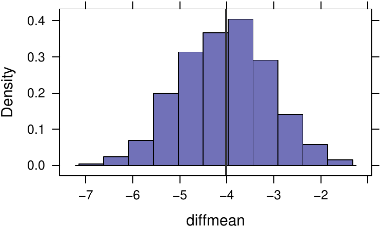{width="45.0%"
alt="graphic without alt text"}
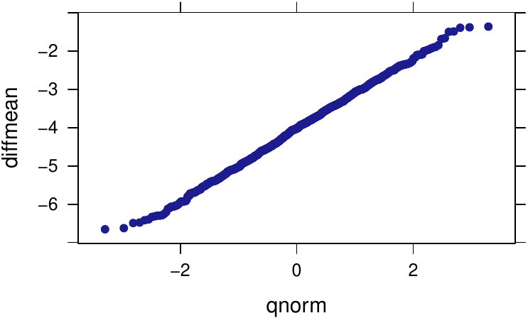{width="45.0%"
alt="graphic without alt text"}

``` r
cdata( ~ diffmean, p = 0.95, data = Boot2) 
```

``` r
##       low        hi central.p 
##     -5.93     -2.30      0.95
```

Alternatively, we can compute a confidence interval based on a bootstrap
estimate of the standard error.

``` r
SE <- sd( ~ diffmean, data = Boot2); SE
```

``` r
## [1] 0.941
```

``` r
D + c(-1,1) * 2 * SE
```

``` r
## [1] -5.90 -2.14
```

The primary pedagogical value of the bootstrap standard error approach
is its close connection to the standard formula-based confidence
interval methods. How to replace the constant 2 with an appropriate
value to create more accurate intervals or to allow for different
confidence levels is a matter of some subtlety [@Hesterberg:2015]. The
simplest method is to use quantiles of a normal distribution, but the
resulting intervals will typically undercover. Replacing the normal
distribution with an appropriate t-distribution will widen intervals and
can improve coverage, but the t-distribution is only correct in a few
cases -- such as when estimating the mean of a normal population -- and
can perform badly when the population is skewed.

Calculating simple confidence intervals can be further automated using
an extension to `confint()`.

``` r
confint(Boot2, method = c("percentile", "stderr"))
```

``` r
##       name lower upper level     method estimate margin.of.error   df
## 1 diffmean -5.93  -2.3  0.95 percentile    -4.02              NA   NA
## 2 diffmean -5.89  -2.2  0.95     stderr    -4.02            1.85 1313
```

## Additional examples

One of the package vignettes [@mosaic-resources:2016] contains a list of
*mosaic*-related resources. Included in the list are links to companion
volumes for several textbooks, including two simulation-based texts
[@Lock5; @Tintle:2016] and several traditional textbooks
[@DeVeauxVellemanBock:2015; @IPS:2014; @IntroStats:2014; @Sleuth:2013].
Each of these companion volumes demonstrates how to use R and the
*mosaic* package to recreate the analyses for the examples in the text.

## Vignettes

The *mosaic* package includes several vignettes that provide additional
material on using the package and on the "less volume, more creativity"
approach.

A particularly useful vignette is a one-page list of commands that are
more than sufficient for a first course, originally presented as part of
a roundtable discussion at the Joint Statistics Meetings.
[@Pruim:MinimalR:2011]

## RMarkdown

"Thinking with data" goes hand-in-hand with communicating those
thoughts. The R Markdown system provides valuable facilities for
reliable and reproducible reporting of computational ideas and results.
See [@Baumer:RMarkdown:2014] for a discussion of how R Markdown can be
used in statistics courses.

The *mosaic* package contains three templates for creating R Markdown
documents in RStudio. Each ensures that the *mosaic* package is
attached, sets the default theme for *lattice* graphics to
`theme.mosaic()`, chooses a somewhat smaller default size for graphics,
and includes a comment reminding users to attach any packages they
intend to use. The "fancy" template demonstrates several features of R
Markdown, and the "plain" templates allow users to start with a clean
slate.

## Workarounds for unfortunate name collisions

The *mosaic* package depends on *lattice* and *ggplot2* so that plots
can be made using either system whenever the *mosaic* package is
attached. It also depends on
[*dplyr*](https://CRAN.R-project.org/package=dplyr) [@2015-87-dplyr],
but for a different reason. The functions in *dplyr* implement a "less
volume, more creativity" approach to data transformation and we
encourage its use alongside *mosaic*. Unfortunately, there are several
function names -- most notably `do()` and `tally()` -- that exist in
both packages. After the release of *dplyr* we modified the functions in
*mosaic* so that the two packages can coexist amicably as long as
*mosaic* comes before *dplyr* in the search path.

# Discussion

## Advantages of the mosaic approach

One of the keys to successfully empowering students to think with data
is providing them both a conceptual framework that allows them to know
what to look for and how to interpret what they find, and a
computational toolbox that allows them to do the looking. The approach
made possible with the *mosaic* package simplifies the transition from
thinking to computing by reducing the number of computational templates
students learn so that cognitive effort can be spent elsewhere, and by
having those templates reflect, support, and deepen the underlying
thinking [@Grolemund:ISR:2014].

Because of the connection between conceptual understanding and these
computational tools, the use of R can also help reveal misunderstandings
that might otherwise go unnoticed. For example, if a student attempts to
use `t.test()` or to create a histogram using a categorical variable,
the student will receive error or warning messages that are an
indication that either the student does not understand the current data
set or still has confusion regarding what it means for a variable to be
categorical or continuous and which operations are suited for each kind
of variable. We encourage students to make sure they can answer two
important questions before attempting to issue a command in R:

1.  What do I want the computer to do for me?

2.  What does it need to know in order to do that?

If these two questions can be answered clearly and correctly, then the
student's primary issue is one of creating the correct R code. If they
cannot, then the problem lies elsewhere. In our experience, students who
can consistently answer these two questions have relatively little
trouble translating the answers into R code using the commands we teach.

R has the capability to support the increasing complexity of the data
and analyses students encounter in subsequent courses and research
projects. Eventually, students will need to learn more about the
structure of R as a language, the types of objects it supports, and
alternative ways of approaching the same task. But early on, it is more
important that students can successfully and independently exercise
computational and statistical creativity.

## Challenges of using R in introductory courses

Using R is not without some challenges. The first challenge is to get
all of the students up and running. The use of an RStudio server allows
an institution or instructor to install and configure R and its packages
and students to work within a web browser, essentially eliminating the
start-up costs for the students. Otherwise, instructors must assist
students as they navigate installation of R and whichever additional
packages are required.

Once students have access to R, the *mosaic* package reduces, but does
not eliminate, the amount of syntax students need to learn. It is
important to emphasize the similarity among commands within a template,
to remind students that R is case sensitive, to show them how to take
advantage of shortcuts like tab completion and code history navigation,
and to explicitly teach students how to interpret some of the most
common R error messages. This goes a long way toward smoothing the
transition to a command line interface that is not as forgiving as
Google search (which may be many students' only other experience with
computerized response to things they type).

In our experience, the most commonly occurring struggles for students
using *mosaic* are

1.  General anxiety over typing commands.

    Although students are very familiar with using computers and
    computerized devices like smart phones, many of them have little
    experience typing commands that require following syntax rules. The
    "less volume, more creativity\" approach helps with this, by
    reducing the cognitive burden. But it remains important to highlight
    repeatedly the similarities among commands. Students should also be
    taught how to interpret the most common error messages R produces so
    that they can quickly, easily, and comfortably recover from
    inevitable typing errors. Even if a class does not typically meet in
    a computer laboratory or take advantage of student laptops, it can
    be useful to arrange some sessions early in the course where
    students are using RStudio while someone is there to quickly help
    them when they get stuck. Avoiding frustration in students' early
    experience with R goes a long way in overcoming anxiety.

    As a bonus instructional method, the authors make frequent typing
    mistakes in front of the class. While we could not avoid this if we
    tried, it does serve to demonstrate both how to recover from errors
    and that nothing drastic has happened when an error message is
    displayed.

    One big advantage of the command line interface is that it is much
    easier to help students by email or in a discussion forum. Encourage
    students to copy both their commands and the error messages or
    output that were produced. Even better, have them share their work
    in the form of an R Markdown file. We find students are much more
    capable of doing this than they are of correctly describing the
    chain of events they initiated in a menu-driven system. (It is also
    much easier to give detailed instructions and examples.)

2.  Confusion over the tilde (`~`).

    The tilde is a small symbol, easily overlooked on the screen or on
    paper (or mistaken for `-`), so students will sometimes omit it, or
    put it where it doesn't belong. As a visual aid, we recommend
    surrounding the `~` with a space on either side, even in 1-sided
    formulas.

    A similar thing occurs with explicitly naming the `data` argument,
    which is not required for the *lattice* functions, but is for
    several other functions. Teaching the forms that work in all
    contexts is easier than teaching which contexts allow which forms.

3.  Difficulty in setting up the R environment

    This is all but eliminated when using an RStudio server, but in
    situations where instructors prefer a local R installation for each
    student, there are often a few issues involved in getting all
    students up and running. Installation of R and RStudio is
    straightforward, but one should make sure that students all have the
    latest version of each. To use the *mosaic* package, a number of
    additional packages must be installed. We recommend beginning with

``` r
update.packages()
```

or the equivalent operation from the RStudio "Packages" tab to make sure
all packages currently on the system are up to date. In most cases,

``` r
install.packages("mosaic")
```

(again, this can also be done via the "Packages" tab in RStudio) will
take care of the rest. But occasionally some package will not install
correctly on a particular student's computer. Installing that package
directly rather than as part of the dependencies of *mosaic* often
solves this problem or at least provides a useful diagnostic regarding
what the problem might be.

## Impact

In 2016, the available CRAN logs indicate that *mosaic* was downloaded
to approximately 96,000 unique IP addresses. Strong peaks over January
and September suggest that much of this demand comes from university
courses.

## Efficiency Issues

For applications where speed is of utmost importance, the *mosaic*
wrappers may not be the optimal approach. For the numerical summary
functions, the *mosaic* versions cannot be faster than their
counterparts in *base* or *stats* (because eventually they call the
underlying functions) and may be noticeably slower in contexts where
they are called many times. In particular, using the formula interface
requires parsing the formula and creating a new object to contain the
data described by the formula. On the other hand, for aggregated
numerical summaries, the loss in performance may represent a small price
to pay for the simplified syntax.

Similarly, using `do()` comes at a price, although here the increased
computation time has more to do with the extra work involved in culling
the objects and reformatting the results. The looping itself is as fast
as using `replicate()` -- indeed the underlying code is very similar --
and can be faster when the
[*parallel*](https://CRAN.R-project.org/package=parallel) package is
attached; even on a laptop with a single quad-core processor, the
speed-up is noticeable.

## Lattice vs. ggplot2 {#lattice-vs-ggplot2}

Early on, we chose to adopt *lattice* graphics because of its
compatibility with the formula template. This provides a simple,
consistent means of creating the plots our students need. One weakness
of the *lattice* system is the difficulty of creating complex plots by
overlaying mutliple simpler layers. Beginners are not in a position to
create the panel (and pre-panel) functions that *lattice* requires for
this. Recently, we have begun work on a new package (*ggformula*,
currently avilable via github) that provides a formula interface for
creating *ggplot2* plots. This package could replace *lattice* for users
who desire some of the features of *ggplot2* but want to keep a
consistent formula interface. Initial use with our students suggests
that this works at least as well as *lattice* and much better if plots
with multiple layers and data sources are required.

## Be selective

Over the years we have been developing the *mosaic* package, it has
grown to the point that it now contains much more than a minimally
sufficient set of commands for an introductory course. While we have
attempted to give some sense of the scope of the package in this
article, we advise instructors to use things selectively, keeping in
mind their students and the goals for the course. What may represent
just the right tool in one setting may be too much in another. Of
course, the same advice holds for using functions from other packages as
well. The instructor's temptation is often to do too much, forgetting
the cognitive burden this can place on students. Less volume and more
creativity will at times pull in opposite directions, and a skilled
instructor must determine the appropriate balance for each setting.

# Acknowledgments

Partial support for this work was provided by the National Science
Foundation DUE 0920350 (Project MOSAIC). We thank Johanna Hardin, Colin
Rundel, Xiaofei (Susan) Wang, and the reviewers for helpful comments and
all of the users of the *mosaic* package who have provided feedback on
their experience and offered suggestions for improvement.

# Appendix: Additional features of the mosaic package

Table [2](#tbl:otherstuff) lists some additional functions in the
*mosaic* package not highlighted above.

::: {#tbl:otherstuff}
  ------------------------------------------------------------------------------------------------------------------------------------------------------------------------------------------------------------------------------------------------------------
  Function                            Uses
  ----------------------------------- ------------------------------------------------------------------------------------------------------------------------------------------------------------------------------------------------------------------------
  `CIsim()`                           Demonstrate coverage rates of confidence intervals.

  `statTally()`                       Investigate test statistics and their empirical distributions.

  `panel.lmbands()`                   Add confidence and prediction bands to scatter plots.

  `ladd()`                            Simplified layering in *lattice* plots.

  `xchisq.test()`                     An extension to `chisq.test()` that prints a table including observed and expected counts, contribution to the chi-squared statistic and residuals.

  `zscore()`                          Convert a numeric vector into z-scores by subtracting the mean and dividing by the standard deviation.

  `col.mosaic()`                      A *lattice* theme with colors that work better in project images than the *lattice* defaults.

  `dot()`, `project()`, `vlength()`   Functions from linear algebra.

  `ediff()`                           Like `diff()`, but the returned vector is padded with `NA`s so that the length is the same as the input vector.

  `SAD()`, `MAD()`                    all pairs sum and mean of absolute differences

  `rgeo()`                            randomly sample latitude, longitude pairs uniformly over the globe

  `googleMap()`                       show google maps in a browser. Together with `rgeo()`, this can be used to view maps of randomly selected points on the globe. See [@RoadlessAmerica] for an example of how this can be used for a classroom activity.
  ------------------------------------------------------------------------------------------------------------------------------------------------------------------------------------------------------------------------------------------------------------

  : Table 2: Some additional functions in the *mosaic* package.
:::

## Handling missing data

When there are missing values, the numerical summary functions in *base*
and *stats* return results that may surprise new users.

``` r
mean( ~ dayslink, data = HELPmiss)
```

``` r
## [1] NA
```

While there are workarounds using options to functions to drop values
that are missing before performing the computation, these may be
intimidating to new users.

``` r
mean( ~ dayslink, data = HELPmiss, na.rm = TRUE)
```

``` r
## [1] 257
```

We offer two other solutions to this situation. Our favorite is the
`favstats()` function which computes a set of useful numerical summaries
on the non-missing values and also reports the number of missing values.

``` r
favstats( ~ dayslink, data = HELPmiss)
```

``` r
##  min Q1 median  Q3 max mean  sd   n missing
##    2 75    363 365 456  257 151 447      23
```

The second solution is to change the default behavior of `na.rm` using
`options()`. This will, of course, only affect the *mosaic* versions of
these functions.

``` r
options(na.rm = TRUE)
mean( ~ dayslink, data = HELPmiss)
```

``` r

## [1] 257
```

``` r
with(HELPmiss, base::mean(dayslink))
```

``` r
## [1] NA
```

Users also have the option of changing the default for `na.rm` back if
they like.

``` r
options(na.rm = NULL)
mean( ~ dayslink, data = HELPmiss)
```

``` r
## [1] NA
```

## Inspecting a data frame

Summaries of all variables in a data frame can be obtained using
`inspect()`. For quantitative variables, the results of `favstats()` are
displayed. Other summaries are provided for categorical and time
variables.

``` r
inspect(Births78)
```

``` r
## 
## categorical variables:  
##   name   class levels   n missing                                  distribution
## 1 wday ordered      7 365       0 Sun (14.5%), Mon (14.2%), Tues (14.2%) ...   
## 
## quantitative variables:  
##        name   class  min   Q1 median   Q3   max mean  sd   n missing
## 1    births integer 7135 8554   9218 9705 10711 9132 818 365       0
## 2 dayofyear integer    1   92    183  274   365  183 106 365       0
## 
## time variables:  
##   name   class      first       last min_diff max_diff   n missing
## 1 date POSIXct 1978-01-01 1978-12-31        1        1 365       0
```

## Additional high-level lattice plots

The *mosaic* package provides several new high-level *lattice* plots,
including `bargraph()`, `dotPlot()`, `freqpolygon()`, `ashplot()`,
`xqqmath()`, and `plotPoints()`.

``` r
bargraph( ~ smoker, data = Whickham, main = "bargraph()")
dotPlot( ~ age, data = Whickham, width = 1, main = "dotPlot()")
```

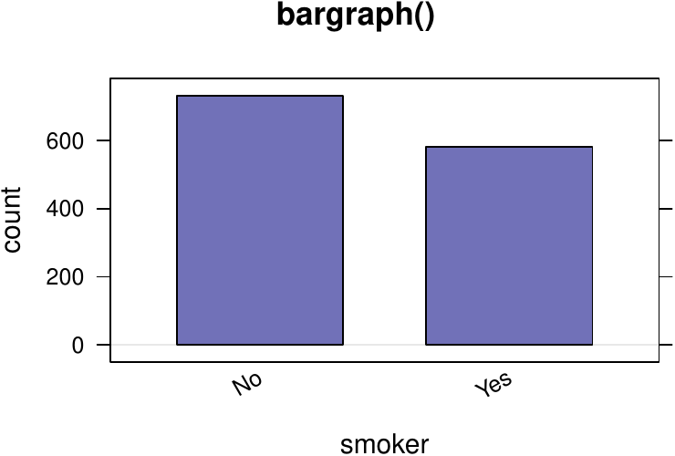{width="45.0%"
alt="graphic without alt text"}
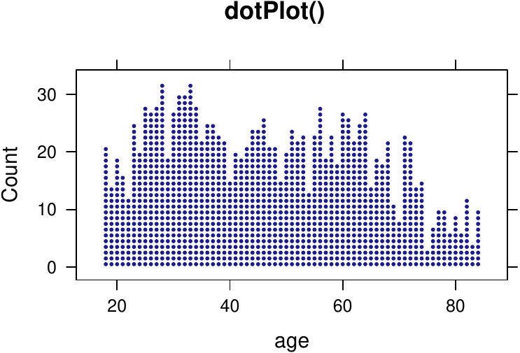{width="45.0%"
alt="graphic without alt text"}

``` r
freqpolygon( ~ age, data = Whickham, width = 5, main = "freqpolygon()")
ashplot( ~ age, data = Whickham, width = 5, main = "ashplot()")
```

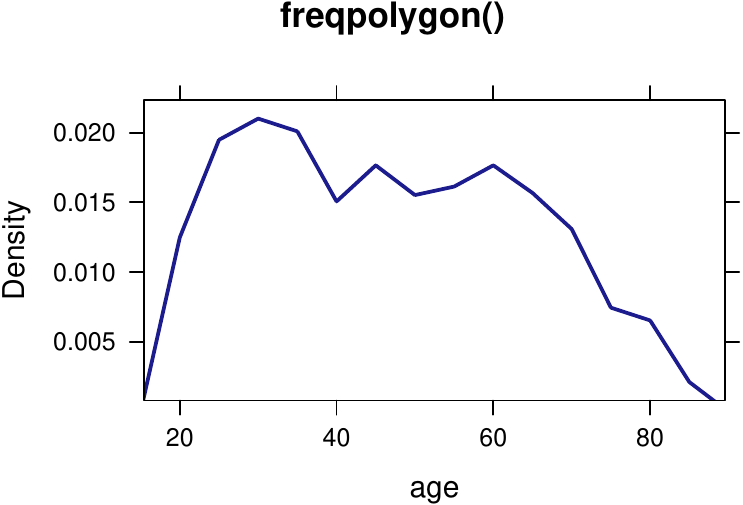{width="45.0%"
alt="graphic without alt text"}
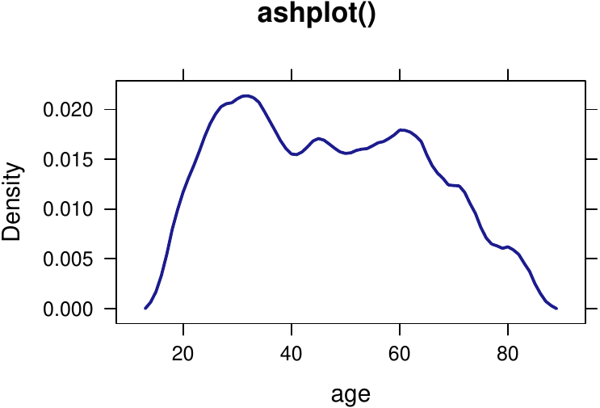{width="45.0%"
alt="graphic without alt text"}

``` r
xqqmath( ~ age, data = Whickham, main = "xqqmath()")
plotPoints(length ~ width, data = KidsFeet, main = "plotPoints()")
```

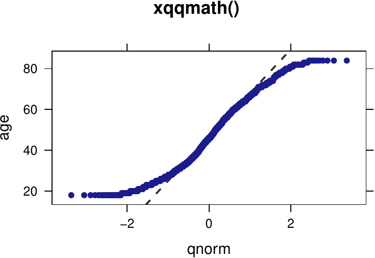{width="45.0%"
alt="graphic without alt text"}
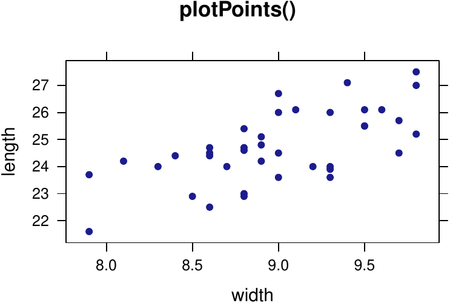{width="45.0%"
alt="graphic without alt text"}

The `bargraph()` function eliminates the need to first summarize the
data before constructing a plot with `barplot()` and makes creating
these plots from raw data simpler. The dot plots produced by `dotPlot()`
are quite different from the Cleveland-style dot plots produced by
`dotplot()`. The former are essentially histograms made of stacked dots
and can be seen in many introductory statistics texts. They are also
useful for producing plots from which students can quickly estimate
p-values by counting dots in the tail of a randomization distribution.
Frequency polygons and ASH plots (average shifted histograms) are less
common, but share many features in common with density plots and are
easier to explain to students. The main motivation for `plotPoints()` is
the ability to use it to create additional layers on an existing plot
with the option `add = TRUE`, otherwise `xyplot()` would suffice.

## Visualizing distributions of random variables

A number of functions make it simple to visualize random variables. The
`plotDist()` function creates displays for any distribution for which
standard d-, p-, and q- functions exist.

``` r
plotDist("norm", mean = 100, sd = 10) 
plotDist("binom", size = 100, prob = 0.3)
```

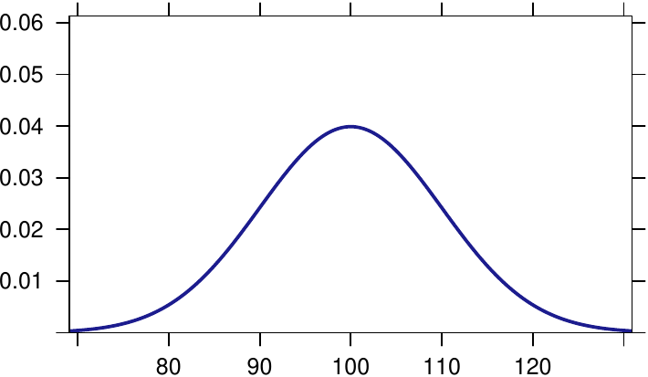{width="45.0%"
alt="graphic without alt text"}
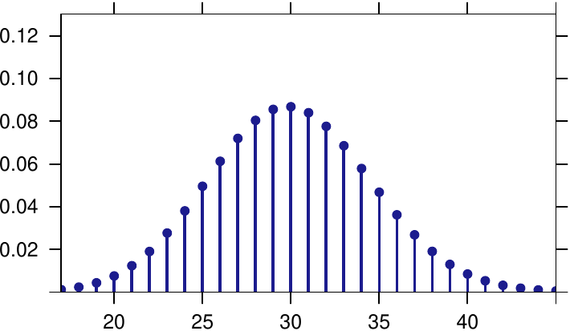{width="45.0%"
alt="graphic without alt text"}

Tail probabilities can be highlighted using the `groups` argument in a
way that is analogous to the lattice plots above.

``` r
plotDist("chisq", df = 4, groups = x > 9, type = "h") 
```

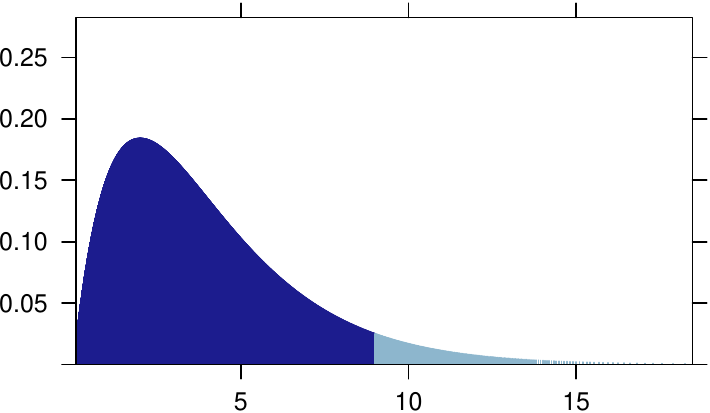{width="45.0%"
alt="graphic without alt text"}

Using the `kind` argument, we can obtain other kinds of plots, including
cdfs and probability histograms.

``` r
plotDist("norm", mean = 100, sd = 10, kind = "cdf") 
plotDist("binom", size = 100, prob = 0.3, kind = "histogram") 
```

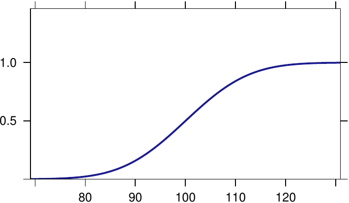{width="45.0%"
alt="graphic without alt text"}
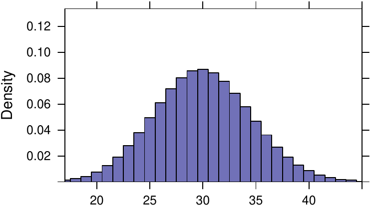{width="45.0%"
alt="graphic without alt text"}

Any of these plots can be overlaid onto another plot using `add = TRUE`

``` r
favstats( ~ age, data = Whickham)
```

``` r
##  min Q1 median Q3 max mean   sd    n missing
##   18 32     46 61  84 46.9 17.4 1314       0
```

``` r
histogram( ~ age, data = Whickham, main = 'histogram() with added plotDist()')
plotDist("norm", params = list(mean = 46.9, sd = 17.4), add = TRUE) 
```

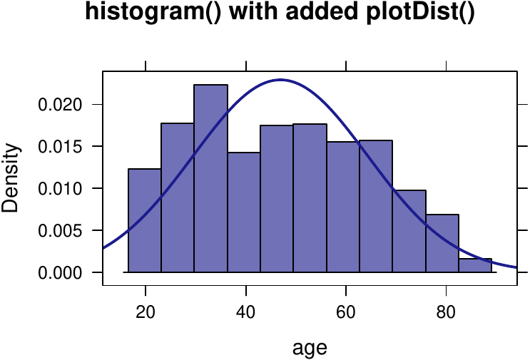{width="45.0%"
alt="graphic without alt text"}

or by using additional features of the `histogram()` function provided
in the *mosaic* package:

``` r
histogram( ~ age, data = Whickham, fit = "normal", 
           main = 'histogram() with fit = "normal"')
```

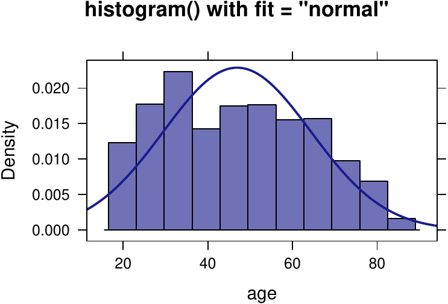{width="45.0%"
alt="graphic without alt text"}

Several other families of distributions can be added to a histogram in a
similar way. The `fitdistr()` function from the
[*MASS*](https://CRAN.R-project.org/package=MASS) [@MASS] is used to
estimate the parameters of the distribution.

For several distributions, we provide augmented versions of the
distribution and quantile functions that assist students in
understanding what values are returned by functions like `pnorm()` and
`qnorm()`.

``` r
xpnorm(-2:2, main = "standard normal")
```

``` r
## 
## If X ~ N(0, 1), then 
## 
##  P(X <= -2) = P(Z <= -2) = 0.02275
##      P(X <= -1) = P(Z <= -1) = 0.15866
##      P(X <=  0) = P(Z <=  0) = 0.50000
##      P(X <=  1) = P(Z <=  1) = 0.84134
##      P(X <=  2) = P(Z <=  2) = 0.97725
##  P(X >  -2) = P(Z >  -2) = 0.97725
##      P(X >  -1) = P(Z >  -1) = 0.84134
##      P(X >   0) = P(Z >   0) = 0.50000
##      P(X >   1) = P(Z >   1) = 0.15866
##      P(X >   2) = P(Z >   2) = 0.02275
```

``` r
## [1] 0.0228 0.1587 0.5000 0.8413 0.9772
```

``` r
xqt(0.975, df = 20, main = "t-distribution with df = 20")
```

``` r
##         95% 
## 0.000 0.597
```

``` r
## [1] 2.09
```

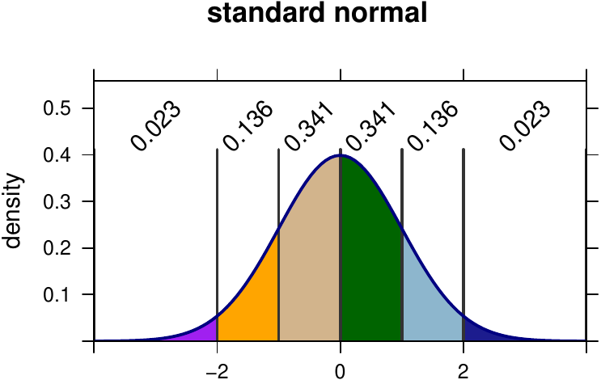{width="45.0%"
alt="graphic without alt text"}
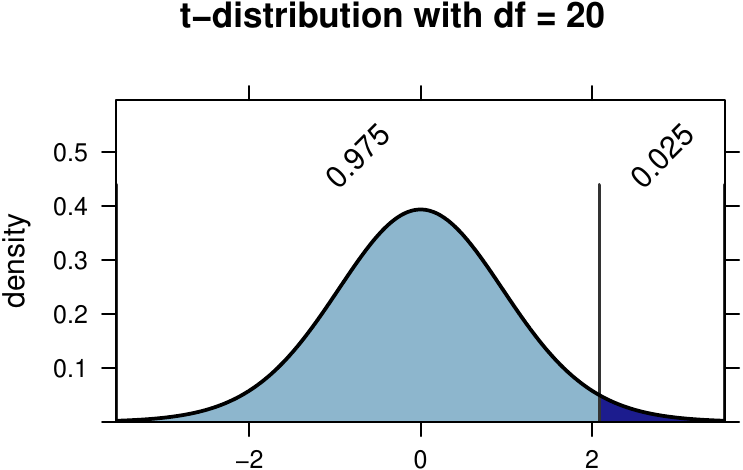{width="45.0%"
alt="graphic without alt text"}

## Basic choropleth maps

The `mUSMap()` and `mWorldMap()` functions provide simple ways to
construct choropleth maps of states in the US or countries in the world,
and `makeMap()` allows users to provide their own map data.

``` r
USArrests <- USArrests %>% mutate(state = row.names(USArrests))
mUSMap(USArrests, key = "state", fill = "UrbanPop")
```

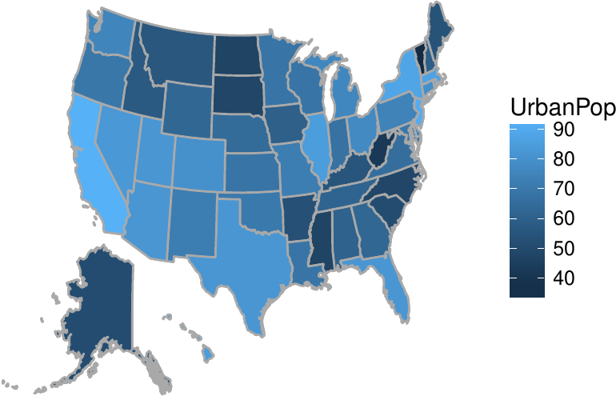{width="45.0%"
alt="graphic without alt text"}

## The `do()` function vs. the `replicate()` function {#do-vs.replicate}

The usual alternative to `do()` is `replicate()`. For simple situations,
`replicate()` can also be easy to use. Each of these stores its results
in a vector rather than in a data frame but is otherwise very similar to
the corresponding results using `do()`, although the first stores less
information.

``` r
replicate(3, rflip(20)) 
```

``` r
## [1]  9 13 11
```

``` r
replicate(3, diffmean(age ~ smoker, data = resample(Whickham)))
```

``` r
## diffmean diffmean diffmean 
##    -2.04    -4.56    -5.33
```

Where `do()` really shines is for simulations based on models. The
results returned by `do()` are stored in a data frame and include the
components of the model most likely to be of interest.

``` r
do(3) * lm(shuffle(height) ~ sex + mother, data = Galton)
```

``` r
##   Intercept   sexM  mother sigma r.squared      F numdf dendf .row .index
## 1      64.1 0.0356 0.04086  3.59  0.000708 0.3168     2   895    1      1
## 2      66.4 0.0869 0.00543  3.59  0.000156 0.0699     2   895    1      2
## 3      62.2 0.0175 0.07175  3.58  0.002132 0.9562     2   895    1      3
```

Resampling from a linear model performs residual resampling:

``` r
Galton.mod <- lm(height ~ sex + mother, data = Galton)
do(3) * lm(height ~ sex + mother, data = resample(Galton.mod))
```

``` r
##   Intercept sexM mother sigma r.squared   F numdf dendf .row .index
## 1      41.2 5.01  0.358  2.44     0.534 513     2   895    1      1
## 2      41.1 5.26  0.357  2.40     0.563 577     2   895    1      2
## 3      41.7 5.07  0.351  2.37     0.553 554     2   895    1      3
```

In contrast, `replicate()` returns an object that is inscrutable and
unusable for most beginners.

``` r
replicate(3, lm(shuffle(height) ~ sex + mother, data = Galton))
```

``` r
##               [,1]        [,2]        [,3]       
## coefficients  Numeric,3   Numeric,3   Numeric,3  
## residuals     Numeric,898 Numeric,898 Numeric,898
## effects       Numeric,898 Numeric,898 Numeric,898
## rank          3           3           3          
## fitted.values Numeric,898 Numeric,898 Numeric,898
## assign        Integer,3   Integer,3   Integer,3  
## qr            List,5      List,5      List,5     
## df.residual   895         895         895        
## contrasts     List,1      List,1      List,1     
## xlevels       List,1      List,1      List,1     
## call          Expression  Expression  Expression 
## terms         Expression  Expression  Expression 
## model         List,3      List,3      List,3
```

With some additional work, this can be improved somewhat, although less
information is being recorded and the matrix should probably be
transposed (and perhaps converted to a data frame).

``` r
replicate(3, coef(lm(shuffle(height) ~ sex + mother, data = Galton)))
```

``` r
##               [,1]    [,2]    [,3]
## (Intercept) 67.774 70.4448 70.2286
## sexM        -0.226  0.0372 -0.0206
## mother      -0.014 -0.0578 -0.0539
```
:::
