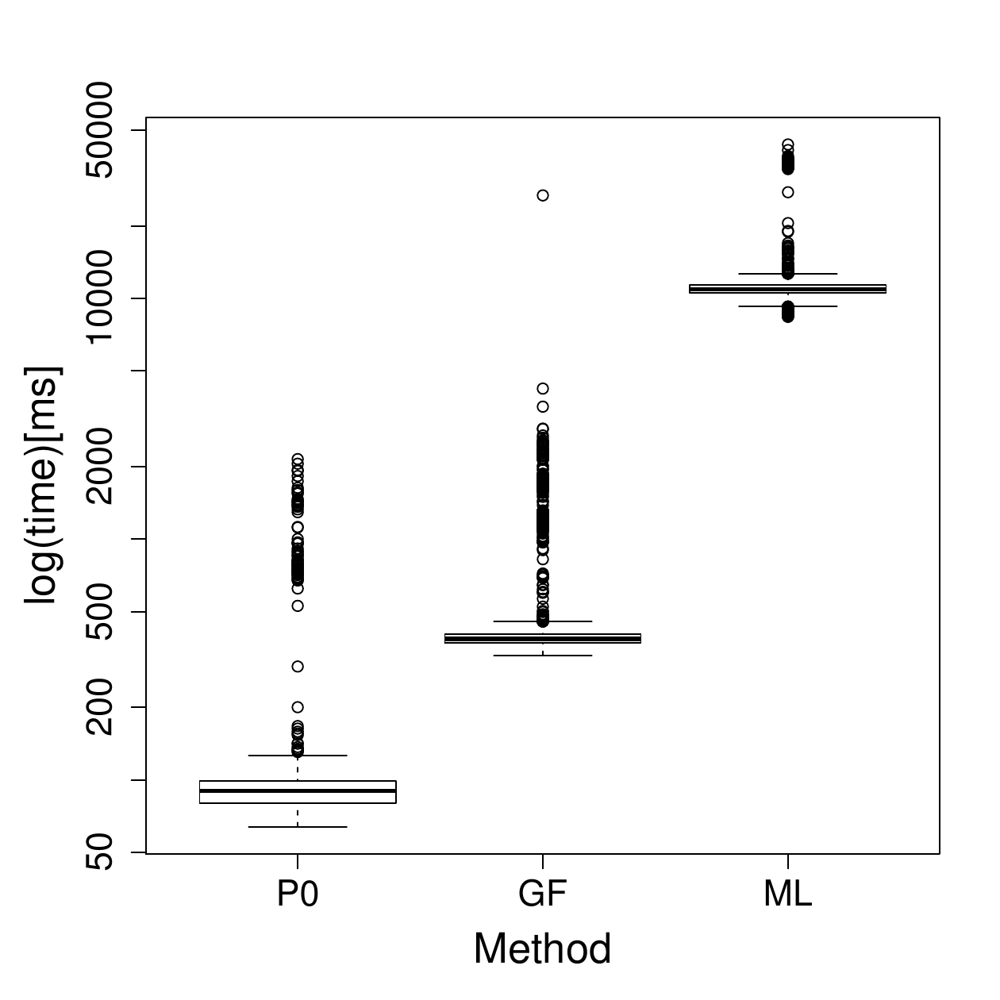
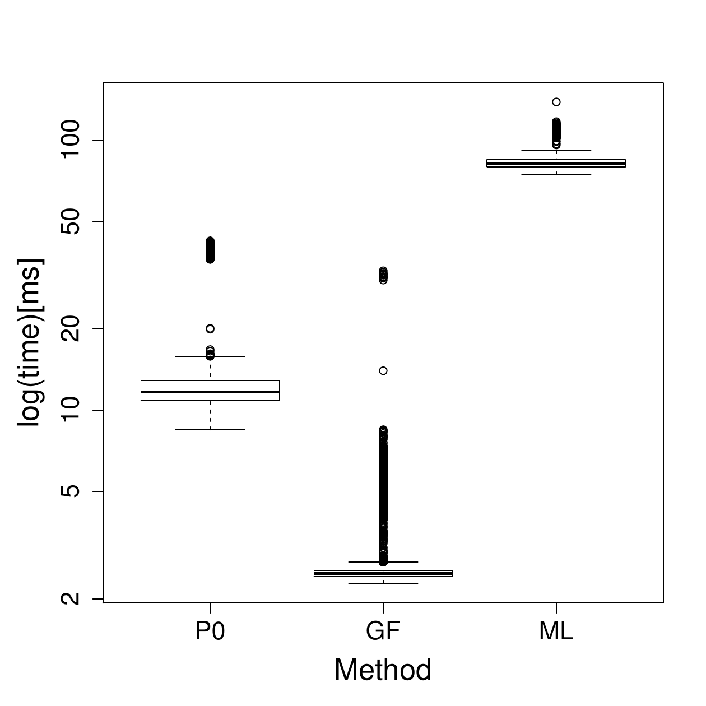

::: article
# Introduction

Mutation models are probabilistic descriptions of the growth of a
population of cells, where mutations occur randomly during the process.
Data are samples of integers, interpreted as final numbers of mutant
cells. These numbers may be coupled with final numbers of cells (mutant
and non mutant). The frequent appearance in the data of very large
mutant counts, usually called "jackpots", evidences heavy-tailed
probability distributions. The parameter of interest is the mutation
probability for a mutant cell to appear upon any given cell division,
denoted by $\pi$. In practice, $\pi$ is typically of order
$10^{-9}$--$10^{-11}$. Computing robust estimates for $\pi$ is of
crucial importance in medical applications, like cancer tumor relapse or
multidrug resistance of *Mycobacterium Tuberculosis* for instance.

Any mutation model can be interpreted as the result of the three
following ingredients:

-   a random number of mutations occurring with small probability among
    a large number of cell divisions. Due to the law of small numbers,
    the number of mutations approximately follows a Poisson
    distribution. The expectation of that distribution, denoted by
    $\alpha$, is the product of the mutation probability $\pi$ with the
    total number of divisions;

-   from each mutation, a clone of mutant cells growing for a random
    time. Due to exponential growth, most mutations occur close to the
    end of the experiment, and the developing time of a random clone has
    exponential distribution. The rate of that distribution, denoted by
    $\rho$, is the relative fitness, i.e. the ratio of the growth rate
    of normal cells to that of mutants;

-   the number of mutant cells that any clone developing for a given
    time will produce. The distribution of this number depends on the
    distribution of division times of mutants.

Using the theory of continuous time branching processes
[@BellmanHarris52; @AthreyaNey72], and under specific modeling
assumptions, it can be proved that the asymptotic distribution of the
final number of mutants has an explicit form. A first mutation model
with explicit distribution is the well known Luria-Delbrück model
[@LuriaDelbruck43]. Other mathematical models were introduced by
@LeaCoulson49, followed by @Armitage52 and @Bartlett78. In these models,
division times of mutant cells were supposed to be exponentially
distributed. Thus a clone develops according to a Yule process, and its
size at a given time follows a geometric distribution. The distribution
of final mutant counts is also explicit when division times are supposed
to be constant. This latter model is called Haldane model by @Sarkar91;
an explicit form of the asymptotic distribution is given in @Ycart13.
General division times have been studied by @Ycart13, but no explicit
distribution is available apart from the exponential and constant
division times.

The first estimation method was given by @LuriaDelbruck43. It is based
on the simple relation between the probability of null counts in the
sample, and the mutation probability, and it is called P0 method. Of
course, if the sample does not contain null counts, the method cannot be
applied. Apart from the P0 method, all other methods couple the
estimation of $\pi$ or $\alpha$, with the estimation of $\rho$. When the
distribution of final numbers has an explicit form, the Maximum
Likelihood (ML) is an obvious optimal choice [@Maetal92; @Zheng05].
However, because of the jackpots, likelihood computation can be
numerically unstable. There are several ways to reduce tail effects
[@Wilcox12 Sec. 2.2], among which "Winsorization" consists in truncating
the sample beyond some maximal value. Another estimation method (GF)
uses the probability generating function (PGF)
[@RemillardTheodorescu00; @HamonYcart12]. The estimators of $\alpha$ and
$\rho$ obtained with the GF method proved to be close to optimal
efficiency, with a broad range of calculability, a good numerical
stability, and a negligible computing time. For the three methods, P0,
ML, and GF, the estimators of $\alpha$ and $\rho$ are asymptotically
normal. Thus confidence intervals and p-values for hypothesis testing
can be computed, for one sample and two sample tests.

The problem with classical mutation models, is that they are based on
quite unrealistic assumptions: constant final number of cells
[@Angerer01_1; @Komarovaetal07; @YcartVeziris14], no cell deaths
(@Angerer01_1 [Sec. 3.1]; @Dewanjietal05 [@Komarovaetal07; @Ycart14]),
fully efficient plating [@Stewartetal90; @Stewart91; @Angerer01_2], or,
as mentioned above, exponential distribution of division times. Using a
model for estimation, when the data have been generated by another one,
necessarily induces a bias on estimates. For instance, if cell deaths
are neglected, mutation probability will be underestimated.

Several informatic tools have already been developed for fluctuation
analysis [@Zheng02; @Halletal09; @Gilletetal15]. These tools are quite
user-friendly. However, they do not take into account all the possible
model assumptions mentioned above. The
[*flan*](https://CRAN.R-project.org/package=flan) package described
here, is dedicated to mutation models, and parameter estimation with the
three methods P0, ML, and GF. It includes a set of functions for the
distribution of mutant cell counts (`dflan`, `pflan`, `qflan`, `rflan`)
and a graphic function (`draw.clone`). They treat general models, with
fluctuating final numbers, cell deaths, and other division time
distributions than exponential and constant. The general estimation
function is `mutestim`. It returns estimates for the parameters
$\alpha$, $\pi$ and $\rho$, with the three estimation methods, constant
or exponential division times, and cell deaths. As a wrapper, a
hypothesis testing function (`flan.test`) is provided. In order to make
the package user-friendly, the functions have been designed to resemble
classical R functions, like `t.test` or `rnorm`.

The paper is organized as follows. Section [2](#sec:model) is devoted to
the probabilistic setting: the hypotheses of the different models are
described, and the asymptotic results are explained. In
Section [3](#sec:estimation), the three estimation methods are exposed,
and the biases described above are discussed. A comparison of the three
methods in terms of mean squared errors is provided. The user interface
and the [*Rcpp*](https://CRAN.R-project.org/package=Rcpp)
[@Eddelbuettel13] implementation is treated in
Section [4](#sec:implementation); examples of execution are shown in
Section [5](#sec:usage).

# Mutation models {#sec:model}

In this section, probabilistic mutation models are described. The basic
modeling hypotheses are the following:

-   at time $0$ a homogeneous culture of $n_0$ normal cells is given;

-   the lifetime of any normal cell is a random variable with
    distribution function $F$;

-   upon completion of the generation time of a normal cell:

    -   with probability $\pi$ one normal and one mutant cell are
        produced;

    -   with probability $1-\pi$ two normal cells are produced;

-   the lifetime of any mutant cell is a random variable with
    distribution function $G$;

-   upon completion of the lifetime of a mutant cell:

    -   with probability $\delta$ the cell dies out;

    -   with probability $1-\delta$ two mutant cells are produced;

-   all random variables and events (division times, mutations, and
    deaths) are mutually independent.

Consider that the initial number $n_0$ tends to infinity, the mutation
probability $\pi=\pi_{n_0}$ tends to $0$, and the time $t=t_{n_0}$ at
which mutants are counted tends to infinity. The scale of time is
supposed to be adjusted so that the exponential growth rate of mutants
is $1$; thus the exponential growth rate of normal cells is $\rho$. See
@AthreyaNey72 [Chap. IV Sec. 4] or @HamonYcart12 for the definition of
the growth rate (also called "Malthusian parameter"). The expected
number of mutations before $t_{n_0}$ is proportional to
$n_0\pi_{n_0}\mathrm{e}^{\rho t_{n_0}}$, and the asymptotics are assumed
to be such that this number converges as $n_0$ tends to infinity to
$\alpha$, positive and finite.

Under the above hypotheses, as $n_0$ tends to $+\infty$, the final
number of mutants converges in law to the distribution with PGF:
$$\label{eq:LDAPGF}
      g(z) = \exp\left(-\alpha(1-h(z))\right)\,,   (\#eq:LDAPGF)$$
with
$$\label{eq:CPGF}
      h(z) = \int_0^\infty\psi(z,t)\rho\mathrm{e}^{-\rho t}\mathrm{d}t\,,   (\#eq:CPGF)$$
where $\psi(z,t)$ is the PGF of the number of cells at time $t$ in a
mutant clone, starting from a single cell at time 0. Observe that it
depends on the lifetime distribution of normal cells $F$ only through
$\rho$. The above result is deduced from the theory of continous time
branching processes [@HamonYcart12]). The expressions \@ref(eq:LDAPGF)
and \@ref(eq:CPGF) translate the three ingredients described in the
introduction:

1.  the Poisson distribution with intensity $\alpha$ models the total
    number of mutations which occur during the process;

2.  the exponential distribution with rate $\rho$ is that of the time
    during which a random clone develops;

3.  the distribution with PGF $\psi(\cdot, t)$ is that of the number of
    cells in a random clone developing during a time interval of length
    $t$. The PGF $\psi$ is the solution of a Bellman-Harris equation
    [@BellmanHarris52] in terms of $\delta$ and $G$.

Hence the expressions of $h$ as an exponential mixture, and of $g$ as a
Poisson compound. In practice, the plating process can be less than 100%
efficient. In that case, a random number of mutants will not be counted:
if only a proportion $\zeta$ of the final population is plated, then
each cell will be observed with probability $\zeta$. Denote by
$M_\text{tot}$ and $M$ the total and the observed numbers of mutants.
Given $M_\text{tot}=m$, $M$ follows the binomial distribution with
parameters $m$ and $\zeta$. Thus, the PGF $g$ of $M$ is given by:
$$\begin{aligned}
\label{eq:LDAPGF_pef}
      g(z) &= \mathbb{E}\left[\mathbb{E}\left[z^M\,|\,M_\text{tot}\right]\right] \nonumber \\
      						   &= \exp\left(-\alpha\left(1-h(1-\zeta+\zeta z)\right)\right)\,.
      
\end{aligned}   (\#eq:LDAPGF-pef)$$
The PGF \@ref(eq:LDAPGF-pef) defines a parametrized family of
distributions, denoted hereafter by $MM(\alpha,\rho,\delta,\zeta,G)$
(Mutation Model). This is a family of heavy-tailed distributions, with
tail exponent $\rho$: the higher the fitness, the heavier the tail. This
directly influences the number and the amount of jackpots.

At this point, the PGF $\psi$ can be given as an explicit expression
only for two particular lifetime distributions of mutants: exponential,
and Dirac (constant lifetimes). The corresponding mutation models will
be denoted respectively by $LD(\alpha,\rho,\delta,\zeta)$
(Luria-Delbrück), and $H(\alpha,\rho,\delta,\zeta)$ (Haldane). The
functions `dflan`, `pflan`, and `qflan` compute densities,
probabilities, quantiles of $LD$ and $H$ distributions (with $\zeta=1$).

Assuming that a consistent estimator of $\alpha$ has been defined, the
problem in practice is to compute reliable estimates of the mutation
probability, $\pi$. The simplest approach assumes that the final number
of cells, denoted by $N$, is constant. An estimate of $\pi$ is then
obtained by dividing the estimate of $\alpha$ by $N$. However, even
under close experimental monitoring, assuming that the final number of
cells is a constant is quite unrealistic. Thus, $N$ must be viewed as a
random variable with a certain probability distribution function $K$ on
$[0,+\infty)$. By analogy with \@ref(eq:LDAPGF), the conditional PGF of
the number of mutants given $N=n$, can be given by the following
expression:
$$g\left(z\,|\,N=n\right)=\exp\left(-\pi n(1-h(z))\right)\,.$$
Or else, the conditional distribution of the number of mutants given
$N=n$ is the distribution $MM(\pi n,\rho,\delta,\zeta,G)$. The
distribution function $K$ is supposed to be known and its Laplace
transform is denoted by $\mathcal{L}$:
$$\mathcal{L}(z) = \mathbb{E}\left[\,\mathrm{e}^{-z N}\,\right] = \int_0^\infty \mathrm{e}^{-zn}\mathrm{d}K(n)\,,$$
Thus the PGF of the final number of mutants is given by:
$$\begin{aligned}
 \label{eq:LDPPGF}
      g(z) &= \int_0^\infty g\left(z\,|\,N=n\right)\mathrm{d}K(n) \nonumber \\[2ex]
      &=\mathcal{L}\left(\pi(1-h(z))\right)\,.
    
\end{aligned}   (\#eq:LDPPGF)$$
Remark that if $N$ is constant, \@ref(eq:LDPPGF) reduces to
\@ref(eq:LDAPGF) with $\alpha=\pi N$. In general, the PGF
\@ref(eq:LDPPGF) defines a new parametrized family of mutation
distributions, denoted herafter by $MMFN(\pi,\rho,\delta,\zeta,G,K)$
(Mutation Models with Fluctuating Numbers of cells).

The two particular cases for the distribution $G$X previously mentioned
above (exponential and Dirac) will be denoted by
$LDFN(\alpha,\rho,\delta,\zeta,K)$ (Luria-Delbrück with Fluctuating
Number of cells) and $HFN(\alpha,\rho,\delta,\zeta,K)$ (Haldane with
Fluctuating Number of cells). As will be shown in
Section [3](#sec:estimation), estimating $\pi$ by the ratio of an
estimate of $\alpha$ by the expectation of $N$ induces a negative bias.

The function `rflan` outputs samples of pairs (mutant counts--final
counts) following $MMFN$ distributions where $G$ is an exponential,
Dirac, log-normal or gamma distribution, and $K$ is a log-normal or
Dirac distribution.

# Statistical inference {#sec:estimation}

Here the three estimation methods P0, ML and GF are described. The main
features and the limitations of each method are discussed. The three
methods compute estimates of $\alpha$ and $\rho$, under the $LD$ and $H$
models. When couples (mutant counts--final numbers) are given, estimates
of $\pi$ and $\rho$ are calculated under the $LDFN$ or $HFN$ models.

Even if the probabilities and their derivatives with respect to $\delta$
for $LD$ and $H$ distributions can be computed, the variations of the
whole distribution as a function of $\delta$ are too small to enable
estimation in practice (see @Ycart14 for more details). Thus, the
parameter $\delta$ is supposed to be known for the three methods.

In the rest of this section, the three estimators are described, their
performances compared in terms of MSE, and the possible sources of
biases discussed.

## Estimators

#### P0 estimator:

The first method was introduced by @LuriaDelbruck43 when $\delta=0$. In
that case, the probability of null counts in the sample is
$\mathrm{e}^{-\alpha}$. Hence $\alpha$ can be estimated taking the
negative logarithm of the relative frequency of zeros among mutant
counts. Hence the method cannot be applied if the sample does not
contain null counts.

If $\delta>0$, the probability of null counts in the sample depends also
on $\delta$. Assuming $\delta<1/2$, a fixed point of the PGF
$\psi(\cdot,t)$ is the extinction probability of a mutant clone
[@AthreyaNey72 Theorem 1, Chap.I]:
$$\delta_*=\frac{\delta}{1-\delta}\,.$$
By definition, $\delta_*$ is also a fixed point of the PGF
\@ref(eq:CPGF). Then the probability of null counts in the sample is
$\mathrm{e}^{-\alpha(1-\delta_*)}$. A consistent and asymptotically
normal estimator of $\alpha$ is given by:
$$\label{eq:mutP0}
	      \hat{\alpha}_0=\frac{-\log\left(\hat{g}(\delta_*)\right)}{1-\delta_*}\,,   (\#eq:mutP0)$$
where $\hat{g}$ denotes the empirical PGF of the final number of
mutants.

Consider now that $\zeta<1$. Ignoring the inefficient plating will
induce a negative bias. A correction has been proposed by @Stewartetal90
[eq. (41)]. However, it can be used only under model $LD(m,1,0)$.
Indeed, the general expression of the probability of null counts
is $\mathrm{e}^{-\alpha(1-h(1-\zeta))}$, which depends on the
fitness $\rho$. It is still possible to extend the estimator
\@ref(eq:mutP0) to the case where $\zeta<1$:
$$\label{eq:mutP0pef}
		  \hat{\alpha}_0=\frac{-\log\left(\hat{g}\left(\delta_*^{(\zeta)}\right)\right)}{1-\delta_*}\,,   (\#eq:mutP0pef)$$
with
$$\delta_*^{(\zeta)}=\frac{\delta_*-(1-\zeta)}{\zeta}\,.$$
We remark that \@ref(eq:mutP0pef) makes sense only if
$|\delta_*^{(\zeta)}|\leqslant1$. In particular, if $\delta=0$, the
plating efficiency $\zeta$ has to be greater than $0.5$. Therefore, the

Notice that the P0 method does not directly yield an estimator of
$\rho$. If an estimate is desired, the ML method can be used for $\rho$
only, setting $\alpha=\hat{\alpha}_0$.

#### ML estimators:

Since algorithms
[@EmbrechtsHawkes82; @Zheng05; @HamonYcart12; @YcartVeziris14] enable
the computation of the probabilities of the $LD$ and $H$ models, the ML
method seems to be an obvious choice. It can be used on two kinds of
samples:

1.  sample of mutant counts: In that case, the likelihood is computed
    with the probabilities of the model $LD$ or $H$. The parameter of
    interest is $\alpha$.

2.  sample of pairs of (mutant counts--final numbers): In that case, the
    likelihood is computed with the probabilities of the model $LDFN$ or
    $HFN$. The parameter of interest is $\pi$.

In both cases, $\rho$ can also be estimated.

However, when the sample maximum is large, sums of products of small
terms must be computed [@HamonYcart12]. The procedure can be very long
and numerically unstable. Thus, the ML estimators can fail for large
$\alpha$ and small $\rho$. In practice, this instability problem is
avoided using Winsorization [@Wilcox12 Sec. 2.2], which consists in
replacing any value of the sample that exceeds a certain bound by the
bound itself. The bound is 1024 by default, and it could be necessary to
increase it. All information above the bound is lost, and in an extreme
case where the sample minimum is greater than the bound, irrelevant
results will be returned.

In theory, it is also possible to be explicit about the probabilities of
the $LD$ model when $\zeta<1$. However, these computations have not been
done for the $H$ model. Thus the plating process is assumed to be fully
efficient when the ML method is used.

#### GF estimators:

The GF method uses the PGF to estimate the parameter of a compound
Poisson distribution [@RemillardTheodorescu00; @HamonYcart12]. Let
$0<z_1<z_2<1$ and $z_3$ in $(0\,{;}\,1)$. The estimators of $\alpha$ and
$\rho$ are the following:
$$\hat{\alpha}_{GF}(z_3)
      = \frac{\log\left(\hat{g}(z_3)\right)}{h_{\hat{\rho}_{GF}(z_1,z_2)}(z_3)-1}\quad
\mbox{and}
\quad\hat{\rho}_{GF}(z_1,z_2)=f^{-1}_{z_1,z_2}(\hat{y})\,,$$
where $\hat{g}$ denotes the empirical PGF of the final number of
mutants, $h_x$ is the PGF \@ref(eq:CPGF) with $\rho=x$, and:
$$\label{eq:func_GF}
		f_{z_1,z_2}(x) =
      \frac{h_x(z_1)-1}{h_x(z_2)-1}\quad\mbox{and}\quad\hat{y} =
      \frac{\log\left(\hat{g}(z_1)\right)}{\log\left(\hat{g}(z_2)\right)}\,.   (\#eq:func-GF)$$
From @RemillardTheodorescu00, it can be proved that the couple of
estimators $\left(\hat{\alpha}_{GF},\hat{\rho}_{GF}\right)$ is strongly
consistent and asymptotically normal, with explicit asymptotic variance
[@HamonYcart12].

The GF estimators depend on the three arbitrary values of $z_1$, $z_2$,
$z_3$. Those tuning parameters are set to $z_1=0.1$, $z_2=0.9$, and
$z_3=0.8$. For more details about the choice of those values, see
@HamonYcart12.

In practice, the GF estimators are quite comparable in precision to ML
estimators, with a much broader range of calculability, a better
numerical stability, and a negligible computing time, even in the case
where the ML method fails. For that reason, we have chosen to initialize
the ML optimization by GF estimates, to improve both numerical stability
and computing time.

The only practical limitation of this method is the following. A zero of
the monotone function $f_{z_1,z_2}(\rho)-\hat{y}$ must be computed. An
upper bound for the domain of research must be given, which can be a
problem if the sample does not contain jackpots. However in that case, a
mutation model is not adapted.

According to \@ref(eq:LDAPGF-pef), the GF estimators or $\alpha$ and
$\rho$ can be extended to the case where $\zeta \leqslant1$ as follows:
$$\hat{\alpha}_{GF}(z_3)
      = \frac{\log\left(\hat{g}(z_3)\right)}{h_{\hat{\rho}_{GF}(z_1,z_2)}(1-\zeta+\zeta z_3)-1}\quad
\mbox{and}
\quad\hat{\rho}_{GF}(z_1,z_2)=f^{-1}_{1-\zeta+\zeta z_1,1-\zeta+\zeta z_2}(\hat{y})\,,$$
where $f_{z_1,z_2}$ and $\hat{y}$ are still given by \@ref(eq:func-GF).
By the same reasoning as @HamonYcart12, strong consistency and
asymptotic normality of the couple
$\left(\hat{\alpha}_{GF},\hat{\rho}_{GF}\right)$ can be proved.

The function `mutestim` computes estimates and their respective standard
deviations for $\alpha$, $\pi$ and $\rho$ according to the type of
input. Moreover, the estimators mentioned here are asymptotically
normal. Thus, one and two sample tests can be performed, using the
function `flan.test`. The null hypothesis will be either fixed
theoretical values of $\alpha$, $\pi$, $\rho$ in the one sample case, or
a difference of the same in the two sample case.

## Comparison of the three estimators

The Figures [1](#fig:zonemethLD) and [2](#fig:zonemethH) (drawn using
[*ggplot2*](https://CRAN.R-project.org/package=ggplot2)) show "maps of
usage" of the estimation methods under the $LD$ and $H$ models. The
methods are compared in terms of the relative MSE of
$\left(\hat{\alpha},\hat{\rho}\right)$ defined as:
$$\label{eq:MSE}
	  \sqrt{\left(1-\frac{\hat{\alpha}}{\alpha}\right)^2+\left(1-\frac{\hat{\rho}}{\rho}\right)^2}\,.   (\#eq:MSE)$$
The RGB code is used: red for GF, green for P0, blue for ML. Twenty
values of $\alpha$ between $0.5$ and 10, and as many values of $\rho$
from $0.2$ to $5$, were chosen. Thus 400 couples were considered. For
each of them, the following procedure was applied:

1.  draw $10^4$ samples of size 100 of the $LD(\alpha,\rho,0,1)$;

2.  for each sample, compute ML, GF and P0 estimates of $(\alpha,\rho)$
    under $LD$ model;

3.  from the $10^4$ estimates, compute the relative MSEs of each method;

4.  assign a RGB color according to the MSEs. For each method:

    -   if the MSE is less than 0.05, assign 1 to the corresponding RGB
        component;

    -   if the MSE is greater than 1, assign 0 to the corresponding RGB
        component;

    -   else, assign 1 minus the MSE to the corresponding RGB component.

The above experience is also performed considering $H$ model instead of
$LD$. The maps have been drawn with a $\log_5$-scale for $\rho$
(y-axis).

![Figure 1: **Map of usage of the estimation methods under $\mathbf{LD}$
model.** The map compares the three methods according to their relative
MSE \@ref(eq:MSE). For each of 400 couples of parameters
$\alpha=0.5\,\dots\,10$ (x-axis) and $\rho=0.2\,\dots\,5$ (y-axis,
$\log_5$-scale), $10^4$ samples of size 100 of the $LD(\alpha,\rho,0,1)$
distribution were simulated. The estimates of $(\alpha,\rho)$ were
calculated with the three methods. Each method is represented by a
color: red for GF, green for P0, blue for
ML.](MixDoubleLDd0n100comp0.95.png){#fig:zonemethLD width="100%" alt="graphic without alt text"}

The map can be roughly divided into four distinct parts:

-   For $(\alpha,\rho)\in(0.5\,{;}\,3)\times(0.2\,{;}\,2.5)$, the color
    is essentially grey: the three methods are more or less equivalent.

-   For $(\alpha,\rho)\in(3\,{;}\,10)\times(0.2\,{;}\,3.5)$, the color
    is magenta: the ML and GF methods are equivalent. The P0 method
    provides estimates with large MSEs or cannot be used because of the
    absence of null counts.

-   For small values of $\rho$, the color is mainly red: The GF method
    is the only method with an acceptable MSE. Small values of $\rho$
    induce large jackpots. Moreover, the number of jackpots increases
    with $\alpha$. Because of the Winsorization, the ML and P0 method
    (which uses ML to estimate $\rho$) provide estimates with very large
    MSEs.

-   For $\rho$ large, the color is darker and tends to black: the three
    methods provide estimates with large MSEs, specially for
    $\rho\in(3.5\,{;}\,5)$, where jackpots are very small or absent. In
    those cases, estimating $\rho$ with the GF method is not possible in
    practice (see previous sub-section). Consequently, the GF method
    will provide a biased estimate for $\alpha$. The ML method, which
    uses the GF estimates to initialize the optimization of the
    log-likelihood, also provides biased estimates. The P0 method can
    provide good estimates of $\alpha$ whatever the value of $\rho$,
    which explains the presence of green areas at the top of the map. In
    a case where no jackpots are present in the sample it should be
    considered that a (heavy tailed) mutation model is not adapted.

![Figure 2: **Map of usage of the estimation methods under $\mathbf{H}$
model.** The map compares the three methods according to their relative
MSE \@ref(eq:MSE). For each of 400 couples of parameters
$\alpha=0.5\,\dots\,10$ (x-axis) and $\rho=0.2\,\dots\,5$ (y-axis,
$\log_5$-scale), $10^4$ samples of size 100 of the $H(\alpha,\rho,0,1)$
distribution were simulated. The estimates of $(\alpha,\rho)$ were
calculated with the three methods. Each method is represented by a
color: red for GF, green for P0, blue for
ML.](MixDoubleHd0n100comp0.95.png){#fig:zonemethH width="100%" alt="graphic without alt text"}

Figure [2](#fig:zonemethH) is quite similar to
Figure [1](#fig:zonemethLD). There are still two remarkable differences:

-   For $\rho$ small and $m\leqslant2$, the three methods seem to be
    more equivalent under $H$ model than under $LD$ model.

-   For $\rho$ large, GF method seems to provide better estimates under
    $H$ model than under $LD$ model.

The three methods should also be compared in terms of computational
time. An illustration on real data will be given in
section [5](#sec:usage). The slowest method is ML, for the reasons
discussed in the previous section. It is even slower when the estimates
are calculated under Haldane models $H$ or $HFN$, when $\delta$ is
positive, or if the initialization of $\rho$ with the GF method fails.
The GF method computes estimates of $\alpha$ and $\rho$ (when possible)
in negligible time. The P0 method outputs estimates of $\alpha$ in
negligible time, but estimates of $\rho$ are as slow as with ML.

## Bias evidence

If the model used for the estimation does not correspond to the
theoretical model, the estimates can be biased. Four different sources
of bias are considered:

1.  the final counts are random in the data, constant for the estimation
    model;

2.  cell deaths occur in the data, not in the estimation model;

3.  the lifetime distribution is different in the data and the
    estimation model;

4.  the plating process is less than 100% efficient.

In each case, simulation experiments have been made along the following
lines:

1.  draw $10^4$ samples of size 100, under one model;

2.  for each sample, compute estimates using another model and the true
    one if available;

3.  compare the empirical distributions of $\hat{\theta}/\theta$, where
    $\hat{\theta}$ is estimator and $\theta$ the true value.

For each figure, red lines mark unit, blue lines mark relative biases of
0.9 and 1.1. According to Figures [1](#fig:zonemethLD)
and [2](#fig:zonemethH), the GF method is at least equivalent in terms
of the relative MSE \@ref(eq:MSE) to the ML and P0 methods. Moreover, it
is also the best in terms of computational time. Therefore, the bias
evidences will be mainly illustrated with GF method.

#### Fluctuation of final counts:

When $N$ is constant, the estimate of $\pi$ is derived by dividing the
estimate of $\alpha$ by $N$. As mentioned in previous section, if $N$ is
a random variable, the relation between $\alpha$ and $\pi$ can be
explicit if the distribution $K$ is known. However, this is not the case
in practice. Usually, estimates of the expectation and variance of $N$
are available at best. Assume that only the first two moments $\mu$ and
$\sigma^2$ of $N$ are known. Then a first order approximation of the
Laplace transform $\mathcal{L}$ can be used to reduce the bias. This
method is explained in @YcartVeziris14 for the P0 method. It has been
adapted to ML and GF estimates. Figure [3](#fig:bpcvfn) shows the
influence of the coefficient of variation $C=\sigma/\mu$ on the ML
estimate of $\pi$. The estimates were calculated with three different
approaches:

-   divide ML estimates of $\alpha$ by the empirical mean of $N$ and
    ignore fluctuations of $N$ (left boxplots);

-   directly compute ML with the sample of pairs (mutant counts--final
    counts) (center boxplots);

-   derive from ML estimates of $\alpha$, taking into account of the
    empirical fluctuations of $N$ (right boxplots).

![Figure 3: **ML estimates of $\pi$ ignoring fluctuations of final
numbers or not.** Red horizontal lines mark unit. Blue horizontal lines
mark relative bias of 0.9 and 1.1. For each of the 12 sets of parameters
$\pi=(0.5/\mu,2/\mu,4/\mu,8/\mu)$ (columns), and $C=(0.2,0.4,0.6)$
(rows), $10^4$ samples of size 100 of the $LDFN(\pi,\rho,0,1,K)$
distribution were simulated, with $\rho=1$ and $K$ being the log-normal
distribution adjusted to mean $\mu=10^9$ and coefficient of variation
$C$. The ML estimates of $\pi$ and $\rho$ were calculated under model
$LD$ or $LDFN$. Each boxplot represents the distribution of the $10^4$
ratio $\hat{\pi}/\pi$ obtained with $LD$ model with $C=0$ (left), $LD$
model with bias reduction (center), $LDFN$ model
(right).](figbpcvfn.png){#fig:bpcvfn width="100%" alt="graphic without alt text"}

According to the visual observations, the bias reduction seems to be
working well when either the product $\pi\mu$ or $C$ are small: most of
the estimates have a relative bias smaller than 10%. However, the
efficiency of the correction decreases as product $\pi\mu$ and $C$
increase. In particular, for larger values of $\pi\mu$, the bias seems
to be smaller without correction. It could be improved with a better
approximation of $\mathcal{L}$, that implies knowing or estimating
higher moments of $N$. Another solution is to improve the estimation of
$C$. Here $C$ was estimated by the ratio of the empirical standard
deviation of the empirical mean, which is known to be a bad method in
terms of MSE [@Breunig01].

#### Cell deaths:

The PGFs \@ref(eq:LDAPGF), \@ref(eq:LDPPGF) and \@ref(eq:CPGF) depend on
$\delta$. Ignoring cell deaths involves a negative bias on the estimate
of $\alpha$. Assuming the exact value is known, this bias is removed.
Figure [4](#fig:bpdeath) shows the influence of the death parameter
$\delta$ on the GF estimate of $\alpha$. The estimates are calculated
with two different approaches:

1.  computing GF estimates of $\alpha$ with $\delta=0$ (left boxplots);

2.  computing GF estimates of $\alpha$ with a theoretical value of
    $\delta$ (right boxplots).

![Figure 4: **GF estimates of $\alpha$ ignoring cell deaths or not.**
Red horizontal lines mark unit. Blue horizontal lines mark relative bias
of 0.9 and 1.1. For each of the 12 sets of parameters
$\alpha=(0.5,2,4,8)$ (columns), and $\delta=(0.05,0.1,0.2)$ (rows),
$10^4$ samples of size 100 of the $LD(\alpha,\rho,\delta,1)$
distribution were simulated, with $\rho=1$. The GF estimates of $\alpha$
and $\rho$ were calculated under $LD$ model. Each boxplot represents the
distribution of the $10^4$ ratio $\hat{\alpha}/\alpha$ of the estimates
obtained without taking account of cells death (left) and with the
theoretical value of $\delta$ (right). ](figbpdeath.png){#fig:bpdeath
width="100%" alt="graphic without alt text"}

The visual results show that the negative bias induced by ignoring cell
deaths increases with the value of $\delta$: the relative bias can
easily exceed 10% for large values of $\delta$. From the theory of
branching processes, the growth process of a mutant clone is
supercritical and $\delta$ has to be smaller than $0.5$. In practice
$\delta$ is smaller than $0.3$. According to the boxplots, the relative
bias induced by ignoring cell deaths can reach $0.80$. These experiments
also illustrate the difficulty in estimating $\delta$. For example, the
boxplots at the top right of the figure seems to show that the value of
the likelihood for $\alpha=4$ and $\delta=0$ is very close to its value
for $\alpha=4$ and $\delta=0.05$.

#### Lifetime distribution:

As mentioned earlier, the PGF $h$ is explicit only for the $LD$ and $H$
distributions, i.e. when lifetimes are either exponential or constant.
This is not the case in practice. If another lifetime distribution is
used to simulate the data, and either $LD$ or $H$ are used to estimate
the parameters, a bias will be induced on $\alpha$ and $\rho$.
Figure [5](#fig:bpdist) illustrates these observations. It shows the
influence of the lifetime distribution on the GF estimates of $\alpha$
and $\rho$. The samples are drawn assuming the lifetimes are
log-normally distributed. The estimates of $\alpha$ and $\rho$ are
calculated under $LD$ (left boxplots) and $H$ models (right boxplots).

![Figure 5: **GF estimates of $\alpha$ and $\rho$ under $LD$ and $H$
models on data drawn with $MM$ model.** Red horizontal lines mark unit.
Blue horizontal lines mark relative bias of 0.9 and 1.1. For each of the
12 sets of parameters $\alpha=(0.5,2,4,8)$ (rows), and
$\rho=(0.8,1,1.2)$ (columns), $10^4$ samples of size 100 of the
$MM(\alpha,\rho,0,1,G)$ distribution were simulated, $G$ being the
log-normal distribution adjusted on Kelly and Rahn's data
[@KellyRahn32]. The GF estimates of $\alpha$ and $\rho$ were calculated
with the two distributions $LD(\alpha,\rho,0,1)$ and
$H(\alpha,\rho,0,1)$. For each couple $(\alpha,\rho)$, the two first
boxplots represent the distribution of the $10^4$ ratio
$\hat{\alpha}/\alpha$ obtained by the $LD$ model (left) and the $H$
model (right); the two last boxplots represent the distribution of the
$10^4$ ratio $\hat{\rho}/\rho$ obtained by the $LD$ model (left) and the
$H$ model (right)](figbpdist.png){#fig:bpdist width="100%" alt="graphic without alt text"}

From the visual observations, the $LD$ and $H$ models can be seen as
extreme values for the lifetime distribution:

-   both models correctly estimate $\alpha$;

-   the $LD$ model overestimates $\rho$ and has a rather large
    dispersion of estimated values. The bias seems to increase as
    $\alpha$ increases;

-   the $H$ model correctly estimates $\rho$.

#### Plating efficiency:

Ignoring the plating efficiency induces a negative bias on $\alpha$ and
a positive bias on $\rho$. In practice, the exact value is known.
Figure [6](#fig:bppef) shows the influence of $\zeta$ on the GF
estimates of $\alpha$. The estimates are calculated with two different
approaches:

1.  computing GF estimates with $\zeta=1$ (left boxplots) ;

2.  applying the correction of @Stewartetal90 [eq. (41)] to GF estimates
    (center boxplots);

3.  computing GF estimates with known value of $\zeta$ (right boxplots).

![Figure 6: **GF estimates of $\alpha$ ignoring plating efficiency or
not.** Red horizontal lines mark unit. Blue horizontal lines mark
relative bias of 0.9 and 1.1. For each of the 12 sets of parameters
$\alpha=(0.5,2,4,8)$ (rows), and $\rho=(0.8,1,1.2)$ (columns), $10^4$
samples of size 100 of the $LD(\alpha,\rho,0,\zeta)$ distribution were
simulated, with $\zeta=0.2$ and $\zeta=0.05$. The GF estimates of
$\alpha$ and $\rho$ were calculated under $LD$ model. Each boxplot
represents the distribution of the $10^4$ ratio $\hat{\alpha}/\alpha$
obtained with $\zeta=1$ (left), using the @Stewartetal90 correction
(center), and with the true value of $\zeta$
(right).](figbppef.png){#fig:bppef width="100%" alt="graphic without alt text"}

The visual results illustrate first the fact that the correction of
@Stewartetal90 should not be used when $\rho\neq1$: the induced bias on
$\alpha$ is negative when $\rho>1$, positive when $\rho<1$. However, the
variance of the estimates obtained with these rectification is smaller
than that of the estimates calculated with GF method.

# Implementation details {#sec:implementation}

The available functions are described here; more details are given in
the manual. The behavior of inference functions for inputs which are out
of practical limitations is described. Some details about the *Rcpp*
implementation are also provided.

## User interface

The *flan* package can be split into two distinct parts: the
distribution of the final number of mutants and statistical inference.
The functions `dflan`, `pflan`, `qflan` compute densities, probabilities
and quantiles of $LD$ and $H$ distributions. The function `rflan`
outputs samples of pairs (mutant counts--final counts) following $LDFN$,
$HFN$, or $MMFN$ where $G$ has a log-normal or gamma distribution and
$K$ has a log-normal or Dirac distribution. $K$ is adjusted to the mean
and coefficient of variation provided by the user. Those functions have
been designed on the principle of the classical distribution functions
of R. A graphic function `draw.clone` is also provided. Using a binary
tree, it represents the growth of a clone starting from a single normal
cell with mutation occurrences until a finite time. The function
`mutestim` computes estimates of $\alpha$ or $\pi$ and $\rho$, using
$LD$ or $H$ models. The three estimation methods are available.
Fluctuations of final numbers and cells death are included. The function
returns estimate(s) of the parameter(s) of interest and the standard
deviations. The function `flan.test` uses asymptotic normality to
perform one or two-sample hypothesis testing. It has been designed on
the principle of the classical hypothesis testing functions of R, such
as `t.test`. As mentioned in Section [3](#sec:estimation), there are
practical limitations for each estimation method. If the inputs of the
`mutestim` function do not respect those limitations, it will output
errors or warning messages:

-   If $\delta=0$, the P0 method can not be used if the sample does not
    contain any null counts. In that case, the `mutestim` function will
    throw an error with a message.

-   For now, an inefficient plating (i.e. $\zeta < 1$) can be taken into
    account only with the GF method. If another method is specified, the
    `mutestim` function will return a warning message and set $\zeta$ at
    1.

-   Issues of the Winzorization parameter $w$ (default is $1024$) of ML
    method:

    1.  If the minimum of the sample is larger than $w$, then the sample
        of mutant counts will be constant.

    2.  If $w$ is too large, then the optimization process can be very
        long.

-   The GF method does not have limitations of usage, even for extreme
    cases where the ML estimators fail, i.e. samples with theoretical
    large $\alpha$ and small $\rho$. However, estimating $\rho$ requires
    solving the zero equation discussed in Section [3](#sec:estimation),
    which is theoretically solvable on $\mathbb{R}^+$. In practice the
    interval of research is bounded. Thus, if the sample does not
    contain any jackpot, which means that $\rho$ is very large, the zero
    equation may not have any solution on the interval. In that case,
    the function will return a warning message, and set the estimate of
    $\rho$ at 1, and the estimate of the standard deviation at 0. In the
    `mutestim` function, the domain of research is $[0.01\,{;}\,100]$.

-   Moreover, the initialization of the ML method is done with GF
    method. Then the domain of optimization is
    $[0.1\times\hat{\theta}_{GF}\,{;}\,10\times\hat{\theta}_{GF}]$,
    where $\hat{\theta}_{GF}$ is the GF estimate(s) of the parameter(s)
    of interest. Then, if the GF method does not succeed to estimate
    $\rho$, there is no chance to estimate it with ML. A warning message
    is returned if the initialization of the estimate of $\rho$ with GF
    fails.

The function `flan.test` is a wrapper function of `mutestim`. It will
ouput the same errors or warning messages if its inputs do not respect
the practical limitations.

## Implementation

Since most functions involve loops that are more expensive in R than in
C, *flan* has been implemented with *Rcpp* modules. This paradigm
provides an easy way to expose C++ functions and classes to R. There are
four main classes in the C++ implementation:

-   `FLAN_Sim`: random generation for $MM$ and $MMFN$ distributions. One
    of its members is a variable of the following type;

-   `FLAN_SimClone`: random generation for clone size distribution
    according to the lifetimes distribution;

-   `FLAN_MutationModel`: computation of the descriptive functions
    (probabilities, PGF,\...) for $LD$ and $H$ distributions. One of its
    members is a variable of the following type;

-   `FLAN_Clone`: computation of the descriptive functions for clone
    size distribution according to the lifetimes distribution.

The *Rcpp* interface enables also to import into the C++ code any R
function. In particular, it is interesting to import the R functions
which are already implemented in C. Thus no external C/C++ library is
required. The installation remains basic, and the size of the installed
package is reduced. For example, the computations of $LD$ distributions
involve numeric integrations. The C libraries **integration** and
**alglib** compute integrals with an accuracy close to machine
precision. We could use those libraries but the R function `integrate`
is actually implemented in C. The R function can then be directly called
into the C++ code. However, such imports increase the computational time
and memory consumption. This is thus unsatisfactory. Another solution
uses the package [*RcppGSL*](https://CRAN.R-project.org/package=RcppGSL)
[@Eddelbuettel13 chap. 11], which creates an interface between *Rcpp*
and the C library gsl. Several integration methods are thus available.
Since it only requires that gsl is correctly installed, this solution is
a good compromise between easy setup and computational cost.

Computing the probabilities for the $H$ distribution with $\delta>0$
involves squaring high degree polynomials. Such polynomials are easily
treated by the package
[*polynom*](https://CRAN.R-project.org/package=polynom). However its
implementation raises memory issues, because of the degree of the
polynomials involved. A more efficient way is to use the Fast Fourier
Transform. It is provided by the C library fftw3, which can raise some
installation issues. The R function `fft` could be directly called into
the C++ code. For the same reasons as for the `integrate` function, it
is more adequate to use the package
[*RcppArmadillo*](https://CRAN.R-project.org/package=RcppArmadillo)
(@Eddelbuettel13 [chap.10] ; @EddelbuettelSanderson14). This package
links *Rcpp* to the C++ library armadillo, which is dedicated to linear
algebra. In particular, it includes a performant Fast Fourier Transform.

Finally, likelihood optimizations in the ML and P0 methods are done with
a bounded BFGS optimizer. The package
[*lbfgsb3*](https://CRAN.R-project.org/package=lbfgsb3) provides the
eponymous function which is implemented in Fortran. It is much faster
than the basic R function `optim`.

# Examples of usage {#sec:usage}

Some examples on the real data included in *flan* are provided.

Practical limitations, influence of bias sources and comparison of the
estimation methods in terms of computational time are illustrated.
Consider first the eleventh sample of mutant counts of the `werhoff`
data [@WerngrenHoffner03]:

``` r
werhoff$samples$W11$mc
##  [1] 0 0 1 1 1 1 1 1 1 2 2 2 2 2 2 2 2 3 3 4 4 4 4 5 5 
```

This sample does not contain any jackpot, then the theoretical fitness
in a mutation model, should be very large. If the GF method is used, it
will output a warning message and set the fitness at $\rho=1$, as
customarily done in the litterature [@Foster06]:

``` r
W <- werhoff$samples$W11$mc

# Compute GF estimates of mutations number and fitness}
mutestim(mc = W, method = "GF")
			
## Warning in mutestim(mc = W, method = "GF"): Impossible to estimate 
## 'fitness' with 'GF'-method: 'fitness' is set to default value 1 and
## only mutations number is estimated.

## $mutations
## [1] 0.8792917
## 
## $sd.mutations
## [1] 0.260549
## 
## $fitness
## [1] 1
## 
## $sd.fitness
## [1] 0
```

Notice that Table 1 of [@WerngrenHoffner03] shows mutants counts and
mean final numbers of cells for 1 mL of solution. However, the total
volume of the culture is 5 mL. In other words, a plating efficiency of
20% has been applied. The fact is the fitness parameter can not be
estimated, even taking into account the plating efficiency:

``` r
# Volume of each sample: 1 mL 
# Total volume of each culture: 5 mL 
# i.e. plating efficiency of 0.2
pef <- 0.2

# Compute GF estimates of mutation probability and fitness
# taking into account the plating efficiency
mutestim(mc = W, plateff = pef, method = "GF")

## Warning in mutestim(mc = W, plateff = pef, method = "GF"): Impossible to estimate 'fitness' with
## 'GF'-method: 'fitness' is set to default value 1 and only mutations number is estimated.

## $mutations
## [1] 2.804244
## 
## $sd.mutations
## [1] 0.74011
## 
## $fitness
## [1] 1
## 
## $sd.fitness
## [1] 0
```

Using the P0 method is a way to realize that setting $\rho=1$ by default
can be misleading. Since this method does not depend on the lifetime
distribution, the estimate of $\alpha$ will not depend on the value of
$\rho$.

``` r
# Compute P0 estimate of mutations number
mutestim(mc = W, fitness = 1, method = "P0")

## $mutations
## [1] 2.525729
##
## $sd.mutations
## [1] 0.678233
```

The P0 estimate of $\alpha$ is very different from the GF estimate (when
$\zeta=1$). Consider now the sample of @David70 [Tab. 2], which includes
rifampin-resistant bacteria counts.

``` r
david$D11

## $mc
##  [1] 4 0 1 0 1 0 0 0 0 0
## 
## $fn
##  [1] 1.3e+09 9.2e+08 1.3e+09 2.5e+09 1.3e+09 1.6e+09 1.3e+09 2.5e+09
##  [9] 2.5e+09 2.0e+09
```

Since the $4$ value can be seen as a jackpot, the GF method can be used
to estimate $\alpha$ and $\rho$. Now let us compute the ML estimates of
$\pi$ and $\rho$ taking into account or not of the final counts, under
the $LD$ model.

``` r
D <- david$D11
Dmfn <- mean(D$fn)

# Compute ML estimates and confidence intervals of mutation probability and 
# fitness with empirical mean and null coefficient of variation
ft <- flan.test(mc = D$mc, mfn = Dmfn)
ft$estimate

## mutation probability              fitness 
##         2.067641e-10         2.214676e+00

ft$conf.int

##      mutation probability  fitness
## bInf         0.000000e+00 0.000000
## bSup         4.423916e-10 8.109577
## attr(,"conf.level")
## [1] 0.95

# Compute ML estimates and confidence intervals of mutation probability and
# fitness with empirical mean and empirical coefficient of variation
ft <- flan.test(mc = D$mc, mfn = Dmfn, cvfn = sd(D$fn)/Dmfn)
ft$estimate

## mutation probability              fitness 
##         2.092720e-10         2.214676e+00

ft$conf.int

##      mutation probability  fitness
## bInf         0.000000e+00 0.000000
## bSup         4.506155e-10 8.109577
## attr(,"conf.level")
## [1] 0.95

# Compute ML estimates and confidence intervals of mutation probability and
# fitness with couples (mc,fn)
ft <- flan.test(mc = D$mc, fn = D$fn)
ft$estimate

## mutation probability              fitness 
##         1.977135e-10         2.048984e+00

ft$conf.int

##      mutation probability  fitness
## bInf         0.000000e+00 0.000000
## bSup         4.078591e-10 7.127426
## attr(,"conf.level")
## [1] 0.95
```

The sample of final counts is denoted by $D_{11}^{(FN)}$. The empirical
mean of the final counts is denoted by $\overline{\mu}$, the empirical
coefficient of variation by $\overline{C}$. Table [1](#tab:exDavid)
displays the ML estimates of $\pi$ and $\rho$, in the same way as for
Figure [3](#fig:bpcvfn). Their 95% confidence intervals are provided.
Comparing the second row to the fourth, one can see that neglecting
final number fluctuations induces a bias of order $5\%$ on $\pi$, $10\%$
on $\rho$. From the third row, it turns out that the correction taking
into account $\overline{C}$, has not improved the estimate of $\pi$.
Notice also that due to the small size sample, the confidence intervals
are quite large.

::: {#tab:exDavid}
  ----------------------------------------------------------------------------------------------------------------------------------------------------------------------------------
                                                      Estimates of $\pi$       Confidence intervals (95%) of $\pi$       Estimates of $\rho$   Confidence intervals (95%) of $\rho$
  ------------------------------------------------- ---------------------- -------------------------------------------- --------------------- --------------------------------------
        ML using $\mu=\overline{\mu}$, $C=0$         $2.07\times10^{-10}$   $\left[0\,{;}\,4.22\times 10^{-10}\right]$         $2.21$              $\left[0\,{;}\,8.11\right]$

   ML using $\mu=\overline{\mu}$, $C=\overline{C}$   $2.09\times10^{-10}$   $\left[0\,{;}\,4.51\times 10^{-10}\right]$         $2.21$              $\left[0\,{;}\,8.11\right]$

              ML using $D_{11}^{(FN)}$               $1.98\times10^{-10}$   $\left[0\,{;}\,4.08\times 10^{-10}\right]$         $2.05$              $\left[0\,{;}\,7.13\right]$
  ----------------------------------------------------------------------------------------------------------------------------------------------------------------------------------

  : Table 1: **ML estimates of $\mathbf{\pi}$ and $\mathbf\rho$ of data
  set from [@David70 Tab. 2] ignoring fluctuations of final numbers or
  not.** Each row shows the ML estimates of $\pi$ and $\rho$ and their
  95% confidence intervals, deducing from $LD$ model with $C=0$ (first
  row), $C=\overline{C}$ (second row), and directly with $LDFN$ model
  (third row).
:::

Consider finally the data from @Boeetal94 [Tab. 4]. The author studied
mutations of *Escherichia coli* from sensitivity to nalidixic acid
resistance. 23 samples of resistant bacteria counts are provided. As in
the original paper, the 23 samples are concatenated as one. The three
estimation methods are compared in terms of computational time on the
resulting sample of size 1104. The package **microbenchmark** is used,
evaluating $10^4$ times each method on the sample. The methods are
compared when only $\alpha$ is estimated ($\rho=1$), and when the couple
$(\alpha{,}\rho)$ is estimated. In both cases the estimates are computed
under the model $LD$ with $\delta=0$ and $\zeta=1$.

``` r
B <- unlist(boeal)       # Concatenation of the 23 samples
require(microbenchmark)  

# Comparing the methods in terms of computational performance
# (mutations number only)
microbenchmark(P0 = mutestim(mc = B, fitness = 1, method = "P0"), 
               GF = mutestim(mc = B, fitness = 1, method = "GF"), 
               ML = mutestim(mc = B, fitness = 1, method = "ML"), 
               unit = "ms", times = 1e4)

## Unit: milliseconds
##  expr       min        lq      mean    median        uq       max neval
##    P0  0.063696  0.0800720  0.09701435  0.0899955  0.0986275  2.149537 10000
##    GF 0.327989  0.3694555  0.41309310  0.3850380  0.4035050 26.774004 10000
##    ML 8.381844 10.5333670 12.23137063 10.9118690 11.3860045 43.592177 10000

# Comparing the methods in terms of computational performance}
microbenchmark(P0 = mutestim(mc = B, method = "P0"), 
               GF = mutestim(mc = B, method = "GF"), 
               ML = mutestim(mc = B, method = "ML"), 
               unit = "ms", times = 1e4)
               
## Unit: milliseconds
##  expr       min        lq      mean    median        uq       max neval
##    P0  8.451605 11.004419 12.832827 11.848562 13.082066  43.00397 10000
##    GF  2.274944  2.419663  2.688851  2.481529  2.549597  33.19333 10000
##    ML 73.704656 79.581238 83.841150 81.802464 84.323398 120.65768 10000
```

The results are shown on Figure [7](#fig:exBoeal), as boxplots of timing
distributions. Times are in milliseconds and plotted on log-scale.

<figure id="fig:exBoeal">
<table>
<caption> </caption>
<tbody>
<tr class="odd">
<td style="text-align: center;">Estimates of <span
class="math inline"><em>α</em></span> setting <span
class="math inline"><em>ρ</em> = 1</span></td>
<td style="text-align: center;">Estimates of the couple <span
class="math inline">(<em>α</em>,<em>ρ</em>)</span></td>
</tr>
<tr class="even">
<td style="text-align: center;"></td>
<td style="text-align: center;"></td>
</tr>
</tbody>
</table>
<figcaption>Figure 7: <strong>Computational time of the three methods on
data from <span class="citation" data-cites="Boeetal94">Boe et al.
(1994, Tab. 4)</span>.</strong> Data consist in the 23 samples of
<code>boeal</code> concatenated as one. For each method, the estimates
of <span class="math inline"><em>α</em></span> setting <span
class="math inline"><em>ρ</em> = 1</span> (left boxplots) or of <span
class="math inline"><em>α</em></span> and <span
class="math inline"><em>ρ</em></span> (right boxplots) have been
computed under model <span
class="math inline"><em>L</em><em>D</em></span>. The timings have been
returned with <strong>microbenchmark</strong>, evaluating <span
class="math inline">10<sup>4</sup></span> times each method. Times are
in milliseconds and plotted on log-scale. </figcaption>
</figure>

As mentioned earlier, the ML method is the slowest. The GF method seems
to be quite faster than the P0 method. However, the estimates of $\rho$
of the P0 method is calculated maximizing the likelihood. This step is
more costly in term of computational time. If only $\alpha$ has to be
estimated, the P0 method is faster than the GF method.

\

\

\

\
:::
