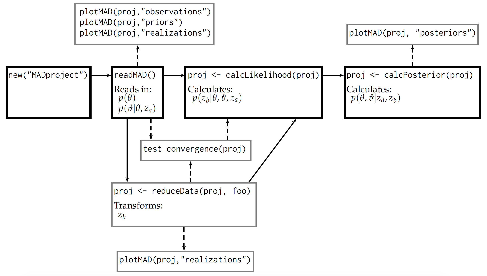

::: article
# Introduction

The field of geostatistics originated in the 1950s with the pioneering
work of @Krige1951 and @Matheron1962 who tried to estimate the
characteristics of subsurface properties with the limited measurements
typically available in this field. This scarcity, caused by the high
explorations costs, is exacerbated by the strong heterogeneity that many
such subsurface properties exhibit. Both these factors combined make it
impossible to describe any subsurface process with certainty, therefore
necessitating the application of statistical tools. Today, geostatistics
is used in many fields of earth science such as geology [@Hohn1999],
hydrogeology [@Kitanidis2008], plus hydrology and soil science
[@Goovaerts1999]. To meet this demand, many software packages have been
developed that provide practitioners and scientists alike with the much
needed tools to apply geostatistics. In R, the best collection of such
tools is arguably found in the
[*gstat*](https://CRAN.R-project.org/package=gstat) package [@gstat]
developed and maintained by Pebesma and colleagues. With *gstat*, it is
possible to estimate (Kriging) and simulate (Gaussian process
generation) heterogenous fields in one, two or three dimensions,
therefore providing necessary tools for geostatistical analysis.

Any such statistical analysis should draw on all available data that are
connected to the variable of interest to infer, i.e. to learn about, its
spatial distribution as much as possible. Examples for such spatially
distributed variables in earth sciences would be, e.g.  the hydraulic
conductivity of an aquifer, evapotranspiration rates of different land
surface areas, and soil moisture. In classical statistics, such
information may consist of measurements of the variable itself or
so-called local variables. Here, local means that a point-by-point
relationship between both variables exists. However, many data are
non-local, which means they are connected to the variable of interest
via a complicated forward model. For instance, hydraulic conductivity
may be connected by a solute transport model to break-through curves of
said solutes and soil moisture may be connected by a hydraulic catchment
model to river discharge. To learn about the input from the output of
such forward models means to invert them, hence the name inversion for
such techniques.

The Method of Anchored Distributions (MAD) provides a Bayesian framework
for the geostatistical inversion of spatially heterogeneous variables.
MAD solves the aforementioned problem by converting non-local data into
equivalent local data using the tools of Bayesian inference. The result
of such a conversion is the consistent representation of all data (local
and non-local) as local data only, which is then amendable to further
geostatistical analysis [@rubin2010]. So far, applications of MAD have
been focused on hydrogeology [@Murakami2010; @Chen2012; @Hesse2015] as
well as soil science [@Over2015]. However, given the explanations above,
MAD is in no way limited to these fields and can be employed wherever
non-local data need to be incorporated into a geostatistical framework.
This generality also extends to the spatial model being inferred. While
there are R packages utilizing Bayesian inference for spatial models
such as [*spBayes*](https://CRAN.R-project.org/package=spBayes)
[@spBayes], [*spTimer*](https://CRAN.R-project.org/package=spTimer)
[@spTimer], and *INLA* [@r-inla software available from
<http://www.r-inla.org/>], these packages have several constraints
compared to *anchoredDistr*. First, each method assumes a Gaussian
process for the spatial variability. MAD has no inherent distributional
assumptions, which allows its application to a wide variety of scenarios
where, for example, Gaussian fields are not justified. In addition,
these packages are either geared toward large data sets (*spBayes* and
*spTimer*) or applied to only local data (*spBayes*, *spTimer*, and
*INLA*) while MAD focuses on addressing uncertainty due to sparse data
sets by incorporating non-local data. Finally, MAD employs a
non-parameteric likelihood estimation, which allows for great
flexibility, in particular for non-linear forward models. The presented
R package
[*anchoredDistr*](https://CRAN.R-project.org/package=anchoredDistr)
provides an interface to the C# implementation of MAD. It allows
post-processing of calculating likelihood and posterior distributions as
well as visualization of the data.

# The Method of Anchored Distributions

Equation \@ref(eq:bayes) displays the general procedure of Bayesian
inference where $\theta$ represents the parameters of the variable being
inferred (e.g. hydraulic conductivity) and $z$ represents the data
informing the inference:
$$\label{eq:bayes}
   p \left( \theta | z \right) \propto p\left(  \theta \right) p\left( z | \theta \right).   (\#eq:bayes)$$

An important element of MAD is a strict classification of all data into
local $z_a$ and non-local data $z_b$, with the latter being the target
of inversion. MAD employs Bayesian inference in the realm of
geostatistics by expanding the supported parameters into $\theta$ for
global parameters (describing overall trend and spatial correlation) and
$\vartheta$ for local parameters. Since MAD is a Bayesian scheme, these
$\theta$ and $\vartheta$ both have probability distributions. As
mentioned above, MAD turns non-local data into equivalent local data
$\vartheta$ by inverting the forward model that connects both. The
non-local data therefore become anchored in space, hence the name Method
of Anchored Distributions. Equation \@ref(eq:mad) displays the general
form of MAD:
$$\label{eq:mad}
   p \left( \theta, \vartheta | z_a, z_b \right) \propto p\left(  \theta \right) p\left(  \vartheta | \theta, z_a \right)  p\left( z_b | \theta, \vartheta, z_a \right).   (\#eq:mad)$$

Open-source software implementations for applying the entirety of MAD
are available both with a graphical interface and a command-line
interface to guide users through connecting their forward models and
random field generators and to execute the ensemble of forward
simulations [@osorio-murillo2015]. This software (available at
<http://mad.codeplex.com>) was inspired by the claim that inverse
modeling will be widely applied in hydrogeology only if user-friendly
software tools are available [@Carrera2005].

The package *anchoredDistr* described here focuses on extending the
post-processing capabilities of MAD software, particularly the
calculation of the likelihood distribution
$p\left( z_b | \theta, \vartheta, z_a \right)$ and the posterior
distribution $p\left( \theta, \vartheta | , z_b, z_a \right)$ after the
ensemble of forward model simulations is already complete. The MAD#
software has basic post-processing capabilities, but does not offer the
degree of flexibility as R for the post-processing analysis. For
example, when handling $z_b$ in the form of time series, dimension
reduction techniques are necessary for calculating the likelihood
values. By having the R package *anchoredDistr*, users have the support
to attach whichever applicable technique for their data.

# General workflow

In the current version of *anchoredDistr*, which only handles the
post-processing of a MAD application, it is assumed that prior
distributions of local and global parameters,
$p\left(\vartheta | \theta, z_a \right)$ and $p\left(\theta\right)$
respectively, have already been defined and sampled and that forward
model simulations based on those samples have been executed either
within the MAD# software or by other means of batch execution. If the
MAD# software is used, this data is stored by MAD# in databases
(extensions .xresult for project metadata and .xdata for each sample).
The package *anchoredDistr* primarily consists of methods for the S4
class \"`MADproject`\" that extract and analyze data from these
databases, i.e. handling information regarding the samples from the
prior distributions and the resulting ensemble of simulated $z_b$ data.
If MAD# is not used, the information can be formatted into a
\"`MADproject`\" manually. The usage of *anchoredDistr* will generally
follow the workflow below (also see Figure [1](#fig:workflow)):

1.  Create `"MADproject"` object with `new()` function (passing slot
    information if manually filling data)

2.  Read data from MAD# databases, if being used, into `"MADproject"`
    object with `readMAD()`

3.  View the observations and realizations with `plotMAD()`

4.  Apply any necessary dimension reduction techniques to $z_b$ with
    `reduceData()`

5.  Test the convergence of the likelihood distribution with respect to
    the number of realizations with `testConvergence()` (return to MAD
    software to run additional realizations if unsatisfactory)

6.  Calculate likelihood and posterior distributions with
    `calcLikelihood()` and `calcPosterior()`, respectively

7.  View the posterior distribution with `plotMAD()`.

<figure id="fig:workflow">

<figcaption>Figure 1: Schematic of utilizing <em>anchoredDistr</em> for
MAD post-processing if the MAD# is used. Solid arrow lines indicate the
fundamental workflow while dashed arrow lines are optional.</figcaption>
</figure>

To install the *anchoredDistr* package, the release version is available
from CRAN:

``` r
  install.packages("anchoredDistr")
  library(anchoredDistr)
```

Alternatively, the development version can be obtained by using the
[*devtools*](https://CRAN.R-project.org/package=devtools) package
[@devtools] to download the necessary files from GitHub:

``` r
  library(devtools)
  install_github("hsavoy/anchoredDistr")
  library(anchoredDistr)
```

Other packages used by *anchoredDistr* include
[*RSQLite*](https://CRAN.R-project.org/package=RSQLite) [@RSQlite] for
reading from MAD databases,
[*np*](https://CRAN.R-project.org/package=np) [@np] for estimating
non-parametric density distributions,
[*plyr*](https://CRAN.R-project.org/package=plyr) [@plyr] and
[*dplyr*](https://CRAN.R-project.org/package=dplyr) [@dplyr] for
efficient data manipulation, and
[*ggplot2*](https://CRAN.R-project.org/package=ggplot2) [@ggplot2] for
plotting. The methods included in *anchoredDistr* are listed in
Table [1](#tab:methods) and two examples utilizing these methods are
provided next.

::: {#tab:methods}
  ---------------------------------------------------------------------------
  Method                Description
  --------------------- -----------------------------------------------------
  `readMAD()`           Reads data from databases generated by MAD software

  `reduceData()`        Applies dimension reduction to $z_b$ time series

  `testConvergence()`   Tests for convergence of likelihood values for

                        increasing number of realizations

  `calcLikelihood()`    Calculates the likelihood values for the samples

  `calcPosterior()`     Calculates the posterior values for the samples

  `plotMAD()`           Plots the observations, realizations, reduced data,

                        and/or posteriors
  ---------------------------------------------------------------------------

  : Table 1: The methods for the `"MADproject"` S4 class provided by
  *anchoredDistr*.
:::

# Example 1: aquifer characterization with steady-state hydraulic head from multiple wells

## Scenario setup

In this first example, we will use the tutorial example available from
the MAD website <http://mad.codeplex.com>. Within the *anchoredDistr*
package, this tutorial example is available as MAD# databases, as well
as a `"MADproject"` object accessed by `data(tutorial)`. The variable of
interest is transmissivity $T$, an aquifer property that represents how
much water can be transmitted horizontally through an aquifer. We will
use the one-dimensional heterogenous field of the decimal log transform
of $T$ (see Figure [2](#fig:baseline1)) as our baseline field from which
we can generate virtual measurements and validate our resulting
posterior distributions. The field was generated as a Gaussian process
by the *gstat* package in R with a mean $\mu_{\log_{10} T}=-2$ and an
exponential covariance function with a variance
$\sigma^2_{\log_{10}T}=0.4$ and length scale $l_{\log_{10}T} =3$ m.
Within the scope of this example, we assume these global parameter
values to be known. Furthermore, we assume that we have local data in
the form of measurements of $T$ at three different locations. In
addition, non-local data are available in the form of head measurements
(indication of water pressure) at the same locations. The forward model
used to solve the groundwater flow equation and relate $T$ to head is
the software MODFLOW-96 [@Harbaugh1996], part of the open source MODFLOW
series that is the industry standard for groundwater modeling. To
convert the non-local data into equivalent local data of $T$, we will
place four anchors at selected unmeasured locations. The number of
anchors needs to be justified by the data content of the measurements
such that the complexity of the model does not become disproportionate
to the information available. The locations of these anchors reflect
locations where there is no other local data available but there is
non-local data nearby for conversion (see @Yang2012 for more discussion
on anchor placement). The locations of the measurements and anchors are
depicted in Figure [2](#fig:baseline1). The prior distributions for
these anchors are based on simple kriging with the local data $z_a$ for
conditioning and the known Gaussian process for the covariance function:
$$\label{eq:anchor_priors}
   p\left(  \vartheta_i | \theta, z_a \right) = \mathcal{N}\left( \mu=\hat{Z}\left( y_i \right), \sigma^2=Var\left( Z\left( y_i \right) - \hat{Z}\left( y_i \right) \right) \right) ,   (\#eq:anchor-priors)$$
where $Z$ generally represents $\log_{10} T$, $y_i$ is the
$y$-coordinate of the $i^{th}$ anchor, $\hat{Z}\left( y_i \right)$ is
the kriging estimate at the $i^{th}$ anchor , and
$Var\left( Z\left( y_i \right) - \hat{Z}\left( y_i \right) \right)$ is
the kriging variance at the $i^{th}$ anchor. The goal of the example is
to compare the posterior distributions of the four anchors resulting
from the inversion to their prior distributions which will indicate the
information gain from the inclusion of the non-local data $z_b$.

{#fig:baseline1 width="100%" alt="graphic without alt text"}

## Reading and viewing data

In the first step, a `"MADproject"` object is created with the `new()`
function. Three arguments must be provided to read the MAD databases:
`madname` (the name of the MAD project, e.g. the filename for the .xmad
database), `resultname` (the name of the result from MAD, e.g. the
result folder name), and `xpath` (the path to where the .xresult
database and result folder are located). These three arguments ensure
the MAD databases can be read by the method `readMAD()`, which will read
in the prior distribution samples for the global and local parameters
plus the observations and forward model predictions for the $z_b$. Note
that *anchoredDistr* could be used independently of the MAD software, if
desired, as long as the slots filled in by `readMAD()` (see
Table [2](#tab:slots)) are provided manually (see next example). To
create a `"MADproject"` object for this tutorial example, the code below
will read the MAD# databases stored in the *anchoredDistr* package
files.

``` r
  tutorial <- new("MADproject", madname="Tutorial", resultname="example1",
              xpath=paste0(system.file("extdata", package = "anchoredDistr"),"/"))
  tutorial <- readMAD(tutorial, 1:3)
```

::: {#tab:slots}
  -----------------------------------------------------------------------------------------------
  Slot             Description                                              Source
  ---------------- -------------------------------------------------------- ---------------------
  `madname`        MAD project name                                         user provided

  `resultname`     MAD result name                                          user provided

  `xpath`          Path to .xresult database                                user provided

  `numLocations`   Number of $z_b$ locations                                `readMAD()`

  `numTimesteps`   Number of time steps measured at each $z_b$ locations    `readMAD()`

  `numSamples`     Number of samples drawn from prior distributions         `readMAD()`

  `numAnchors`     Number of local parameters / anchors placed in field     `readMAD()`

  `numTheta`       Number of random global parameters to infer              `readMAD()`

  `truevalues`     True values for the parameters to infer, if known        `readMAD()`

  `observations`   Observed values of the $z_b$ locations and time steps    `readMAD()`

  `realizations`   Simulated values of the $z_b$ locations and time steps   `readMAD()`

  `priors`         Samples from the prior distributions of each parameter   `readMAD()`

  `likelihoods`    Likelihood values for each sample                        `calcLikelihoods()`

  `posteriors`     Posterior values for each sample of each parameter       `calcPosteriors()`
  -----------------------------------------------------------------------------------------------

  : Table 2: The slots for the `"MADproject"` S4 class provided by
  *anchoredDistr*.
:::

The prior distributions can be viewed by calling the `plotMAD()`
function with the `"MADproject"` object and the string \"priors\" (see
below). Figure [3](#fig:priors1) shows the prior distributions for the
four anchors in Example 1. The distributions roughly follow a Gaussian
distribution due to the baseline field being a Gaussian field and the
prior distributions based on the kriging mean and variance at these four
locations from the $z_a$ data and the known spatial random function. The
x-axis labels are pulled from the `"MADproject"` object's `priors` slot,
which contains the random parameter names as provided in the MAD
software.

``` r
  plotMAD(tutorial, "priors")
```

{#fig:priors1
width="100%" alt="graphic without alt text"}

## Calculating likelihoods and posteriors

After the information contained in the MAD databases has been read into
the `"MADproject"` object, the likelihood and posterior distributions
can be calculated by `calcLikelihood()` and `calcPosterior()`,
respectively. The method `calcLikelihood()` uses non-parametric kernel
density estimation (from the package *np*) to estimate the probability
density of measured inversion data from the probability density function
of inversion data simulated from the realizations per sample. The method
`calcPosterior()` multiplies the resulting likelihood distribution
across the samples and the provided prior distribution to calculate the
posterior.

First, we can call the `testConvergence()` method to visually inspect if
we have enough realizations for the likelihood values of samples to
converge (this method calls the `calcLikelihood()` internally to perform
this test). Figure [4](#fig:convergence1) depicts this qualitative
convergence test for Example 1 by plotting the likelihood values of a
sample with increasing number of realizations. In order to prevent
cluttering, the default number of samples to display is set to seven
samples randomly selected from those available in the project.
Convergence is achieved when the likelihood stabilizes with increasing
realizations. For this example, it appears that the log likelihood of
the samples have started to stabilize by 50 realizations, but more
realizations may be warranted.

The posterior distributions for each random parameter can be seen by
calling `plotMAD()` with the `"MADproject"` object and the string
\"posteriors\". Figure [5](#fig:posteriors1) shows the posteriors for
Example 1 along with the prior distribution and the true values for each
of the four anchors. The posterior distributions for Anchors 2 and 3,
which were surrounded by $z_b$ measurements, show an increase in
probability near the true value, indicating a successful information
transfer from the non-local $z_b$ into equivalent local data.

``` r
  testConvergence(tutorial)
  tutorial <- calcLikelihood(tutorial)
  tutorial <- calcPosterior(tutorial)
  plotMAD(tutorial, "posteriors")
```

{#fig:convergence1 width="100%" alt="graphic without alt text"}

{#fig:posteriors1 width="100%" alt="graphic without alt text"}

# Example 2: aquifer characterization with one pumping drawdown curve

## Scenario setup

The second example depicts a different aquifer characterization scenario
for a two-dimensional field where the natural log transform of hydraulic
conductivity ($K$) is assumed to be an isotropic Gaussian field with
variance $\sigma^2_{\ln K} = 1$ and length scale $l_{\ln K} = 10$m but
unknown mean $\mu_{\ln K}$ (Figure [6](#fig:baseline2)). There are no
anchors placed in this example, leaving the mean as the only parameter
to infer. Unlike Example 1, Example 2 is therefore a demonstration of
how MAD can be employed as a regular Bayesian inversion scheme, too. The
prior distribution for global parameters ideally come from previous
knowledge of similar sites, e.g. the distribution of mean $\ln K$
observed at other aquifers with the same geological setting. For this
example, we will compare three equally spaced samples for $\ln K$ to
represent a uniform prior distribution for the mean. The data include
four local data $z_a$ ($K$) at four different locations and one
non-local data series $z_b$ (hydraulic head drawdown) at a single
location (see Figure [6](#fig:baseline2)). The $z_b$ location provides
100 time steps, i.e. data points, of drawdown measurements
(Figure [7](#fig:observations2)). The forward model used to solve the
groundwater flow equation and relate $K$ to drawdown is OpenGeoSys
[@Kolditz2012], an open source software that simulates a variety of
subsurface processes. This second example uses a different forward model
than the first example to showcase the MAD software's modular design,
which does not assume or rely on specific forward models. The
observation, realizations, and prior sample data for this example is
provided within the package as external data that can be created with
`new()` as shown below, as well as a pre-made `"MADproject"` object
accessed with `data(pumping)`.

``` r
  load(system.file("extdata", "pumpingInput.RData", package = "anchoredDistr"))
  pumping <- new("MADproject",
             numLocations = 1,
             numTimesteps = 100,
             numSamples   = 50,
             numAnchors = 0,
             numTheta = 1,
             observations = obs,
             realizations = realizations,
             priors = priors)
```

{#fig:baseline2 width="100%" alt="graphic without alt text"}

When the `pumping` dataset is initially loaded, we can view the
observation of $z_b$, i.e. drawdown time series
(Figure [7](#fig:observations2)), the prior distribution of the three
samples (Figure [8](#fig:priors2)), and the interquartile range of the
time series simulated by the forward model for the samples
(Figure [9](#fig:realizations2)).

``` r
  plotMAD(pumping, "observations")
  plotMAD(pumping, "priors")
  plotMAD(pumping, "realizations")
```

{#fig:observations2 width="100%" alt="graphic without alt text"}

{#fig:priors2 width="100%" alt="graphic without alt text"}

{#fig:realizations2
width="100%" alt="graphic without alt text"}

## Applying dimension reduction to time series

Even though we have the time series of drawdown, we cannot use these 100
individual values to calculate the likelihood because they are
correlated and the multivariate likelihood distribution would be
100-dimensional. Such dimensionality would require an unrealistic number
of realizations to resolve, known as \"the curse of dimensionality.\" To
overcome this obstacle, dimension reduction is needed and the method to
use depends on the type of non-local data $z_b$. For this example, we
will simply use the `min()` function to collect the minimum head value
in the time series since the observed head reduces and converges to a
stable head value with time (Figure [7](#fig:observations2)). The
*anchoredDistr* package can handle any non-parameterized function, such
as `min()`, or a parameterized function if initial values for each
parameter are given and the `nls()` function [@stats] can perform the
fitting (see the package vignette for an example). The `reduceData()`
function is used to perform the dimension reduction on the time series:

``` r
  pumping.min <- reduceData(pumping, min)
  plotMAD(pumping.min, "realizations")
```

The `reduceData()` function returns a `"MADproject"` object with a
`realizations` slot with reduced dimensions. The reduced data can be
viewed by calling `plotMAD()` with the string \"realizations\". The plot
shows the distributions of each parameter for each sample. In this case,
Figure [10](#fig:reduced2) shows the minimum head value distribution for
the three samples, which will be used to calculate the three likelihood
samples.

{#fig:reduced2 width="100%" alt="graphic without alt text"}

{#fig:posteriors2 width="100%" alt="graphic without alt text"}

With this new `"MADproject"` object, `calcLikelihoods()` and
`calcPosteriors()` can be called. In Figure [11](#fig:posteriors2), the
posterior distributions are shown for the three samples along with the
true value of $-10$. The posterior distribution assigns greater
probability toward the true value.

``` r
  pumping.min <- calcLikelihood(pumping.min)
  pumping.min <- calcPosterior(pumping.min)
  plotMAD(pumping.min, "posteriors")
```

# Summary

The examples given above show how the *anchoredDistr* package allows
flexible post-processing of results by virtue of the MAD software such
that users can apply their own post-processing analyses, such as
dimension-reduction techniques. The first example shown here is
available as external and internal datasets in the *anchoredDistr*
package. The second example is also included in *anchoredDistr* and is
further detailed in the package vignette. The release version of the
*anchoredDistr* package is hosted on CRAN and the development version is
hosted on GitHub, which can be accessed by calling
`devtools::install_github("hsavoy/anchoredDistr")` or by downloading
from <http://hsavoy.github.io/anchoredDistr>.

# Acknowledgements

This work was supported by the National Science Foundation under grant
EAR-1011336, \"The Method of Anchored Distributions (MAD): Principles
and Implementation as a Community Resource.\" Any opinions, findings and
conclusions or recommendations expressed in this material are those of
the authors and do not necessarily reflect the views of the National
Science Foundation.
:::
