::: article
# Introduction

The estimation of the parameters of a continuous-time Markov chain (see,
e.g., @Norris98 or @Ethier05; also referred to as Markov process) when
only discrete time observations are available is a widespread problem in
the statistical literature. Dating back to @Elfving37, this issue is
also known as the embedding problem for discrete-time Markov chains. The
problem occurs in the modeling of dynamical systems when due to various
reasons such as a difficult measurement procedure only discrete-time
observations are available. This is the case in a wide range of
applications, e.g., in the analysis of gene sequence data (see, e.g.,
@Hobolth09, @Verbyla13 or @Chen14), for causal inference in epidemiology
(see, e.g., @Zhang12), for describing the dynamics of open quantum
systems (see, e.g., @Cubitt12), or in rating based credit risk modeling
(see, e.g., @Dorfleitner13, @Yavin14 or @Hughes16) to name only a few.

In the following, an explicit statement of the missing data setting
shall be given and the notation used in this manuscript shall be
introduced: Consider that realizations of a continuous-time Markov
chain, i.e., paths of states $s\in\left\{ 1,\ldots, S\right\}$, which
change at times $\tau_1,\ldots,\tau_K$ are given. For a single path,
this is exemplarily illustrated in figure [1](#TPC).

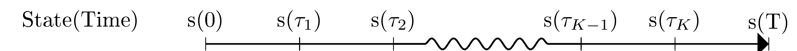{#TPC
width="100%" alt="graphic without alt text"}

In the missing data situation described in this paper, these paths are
however not completely observed, but only at points in time $0$ and $T$.
The available observations are thus the states $s(0)$ and $s(T)$ and
these states are assumed to be observed without error. The cumulative
discrete-time data over all paths can be summarized into conditional
transition matrices with absolute transition frequencies
$\mathbf{N}_{T|0}$ or relative transition frequencies $\mathbf{P}_{T|0}$
(in the following, the abbreviate notations $\mathbf{N}_{T}$ and
$\mathbf{P}_{T}$ will be used). The continuous-time state changes
$s(\tau_k), k\in \left\{1,\ldots,K\right\}$ are latent variables.

A continuous-time Markov chain has the parameter set
$$\mathbf{Q}=\{q_{ij}\}_{1\leq i\leq I,1\leq j\leq J, I=J=S}: q_{ii}\leq 0, q_{ij, i \neq j} \geq 0, \sum_{j=1}^J q_{ij}=0,$$
which is called generator matrix, transition rate matrix or intensity
matrix. The problem is now to estimate the parameters $\mathbf{Q}$ from
the partial observations at times $0$ and $T$. This allows to derive a
matrix of conditional discrete-time state change predictions
$\mathbf{P}_{T_a}$ for arbitrary time intervals $[0,T_a]$ of length
$T_a$ by employing the matrix exponential function
$$\mathbf{P}_{T_a}=\exp(\mathbf{Q}T_a).$$

Besides the R package [*msm*](https://CRAN.R-project.org/package=msm),
see @jackson2011multi, which only provides functions for direct
likelihood optimization, there is no other publicly accessible
implementation available which allows for estimating the parameters of a
continuous-time Markov chain given that data have been only observed on
a discrete-time basis. Against this background, this paper introduces
the R package [*ctmcd*](https://CRAN.R-project.org/package=ctmcd), a
continuously extended, improved and documented implementation based of
what started as supplementary R code to @Pfeuffer16. The functions of
the package are explained and illustrated by Standard and Poor's
corporate rating transition data. The outline of the paper is as
follows: first, three matrix logarithm adjustment approaches are
explained. Second, likelihood inference is illustrated for an instance
of the expectation-maximization algorithm. Third, the implementation of
a Gibbs sampler is presented to facilitate Bayesian inference. Numerical
properties of the different approaches are evaluated and examples for
more complex applications of the methods are shown. Finally, the results
of the paper are summarized.

# Matrix logarithm adjustment approaches

A basic approach to estimate generator matrices from discrete-time
observations is to inversely use the matrix exponential relationship
between conditional discrete time transition matrices $\mathbf{P}_{T}$
(the cumulative discrete-time state change data) and the parameters
$\mathbf{Q}$, i.e., to employ a matrix logarithm function, which leads
to the estimate
$$\mathbf{Q}_{c}=\log(\mathbf{P}_{T})=\sum_{k=1}^\infty \frac{(-1)^{k+1}}{k}(\mathbf{P}_{T}-\mathbf{I})^k.$$
Besides finite truncation of this Taylor series, the matrix logarithm
can, e.g., also be calculated by an eigendecomposition, which is the
default setting in *ctmcd*.

However, the matrix logarithm approach has two shortcomings. First, the
matrix logarithm is not a bijective function. As, e.g., shown by
@speakman1967two, a transition matrix can have more than one valid
generator. However, for a certain subset of discrete-time transition
matrices, it can be shown that there exists only a single unique
generator, for details on criteria (for discrete-time transition
matrices) under which this is the case, see, e.g., @Cuthbert72,
@Cuthbert73, @Singer76 or @Israel01. Second, the method requires that
the derived matrix $\mathbf{Q}_c$ actually meets the above outlined
parameter constraints for Markov generator matrices, concretely that off
diagonal elements are non-negative, which is not necessarily the case.
Therefore, in the following we shall discuss techniques for adjusting
logarithms of the discrete time data matrices $\mathbf{P}_{T}$, so that
proper generator matrices can be derived.

## Diagonal and weighted adjustment

In this context, @Israel01 introduce two approaches. On the one hand,
**diagonal adjustment (DA)** works by forcing negative off-diagonal
elements of $\mathbf{Q}_c$ to zero
$$q_{ij,i\neq j}=0|q_{ij,c}<0$$
and adjusting the diagonal elements
$$q_{ii}=-\sum_{j=1}^J q_{ij}$$
to ensure that $\sum_{j=1}^J q_{ij}=0$. In *ctmcd* such an estimate can
be performed by passing `method="DA"` to `gm()`, the generic generator
matrix estimation function of the package. The method requires the
specification of a discrete time transition matrix `tm`, which in the
case of matrix logarithm adjustment approaches is a matrix of
**relative** transition frequencies, which refers to the matrix
$\mathbf{P}_{T}$ introduced above, as input data.

In order to illustrate the methods, we employ @SP00 global corporate
credit ratings data. The rating categories in this data set have the
commonly known symbols $AAA$, $AA$, $A$, $BBB$, $BB$, $B$, $C$ and $D$.
These abbreviations represent states of decreasing credit quality
whereas category $D$ stands for the event of credit default, which means
that if rated $D$ the obligor cannot or does not have the willingness to
meet its financial obligations any more. The data is provided as
`tm_abs` a matrix of discrete-time absolute transition frequencies from
the first to the last day of the fiscal year 2000. We have to take into
account that the default category $D$ has to be considered as an
absorbing state, because once an obligor has defaulted it can not escape
this state any more. Following the intuitive ordering of decreasing
credit quality described above, in this example the default state will
refer to row $8$. Thus, in order to convert the data into the required
format, we have to create a matrix of relative transition frequencies
`tm_rel` by standardizing the row entries to sum to $1$ and adding a
unit row vector as row $8$ with the last entry of this row being $1$.
Subsequently, we can apply the diagonal adjustment approach by
specifying `tm=tm_rel` and the time horizon of this discrete-time matrix
as `te=1`, because `tm_abs` and `tm_rel` refer to credit rating changes
for a single year time interval (fiscal year 2000).

``` r
  data(tm_abs)
  tm_rel <- rbind((tm_abs / rowSums(tm_abs))[1:7,], c(rep(0, 7), 1))
  gmda <- gm(tm=tm_rel, te=1, method="DA")
```

On the other hand, @Israel01 also describe the **weighted adjustment
(WA)** of the non-negative off-diagonal entries as an alternative, i.e.,
off diagonal elements are adjusted by
$$q_{ij, i\neq j}=q_{ij,c}+\frac{|q_{ij,c}|}{\sum_{j\neq i}|q_{ij,c}|}\sum_{j\neq i} q_{ij,c}1(q_{ij,c}<0)|q_{ij,c} \geq 0,$$

where the cut off jump probability mass is redistributed among the
remaining positive off diagonal elements according to their absolute
values. In analogy to diagonal adjustment, a weighted adjustment
estimate can be derived by using `method="WA"` as follows:

``` r
  gmwa <- gm(tm=tm_rel, te=1, method="WA")
```

## Quasi-optimization

The third matrix logarithm adjustment approach is the
**quasi-optimization (QO)** procedure of @Kreinin01. This method finds a
generator $\mathbf{Q}$ from the set of all possible generator matrices
$\mathbf{Q^\prime}$ by solving the minimization problem
$$\mathbf{Q} = \arg \min_{\mathbf{Q}^\prime} \sum_{i=1}^I \sum_{j=1}^J (q^\prime_{ij}-q_{ij,c})^2,$$
which means that the algorithm chooses a generator matrix which is
closest to the matrix logarithm in terms of sum of squared deviations.

``` r
  gmqo <- gm(tm=tm_rel, te=1, method="QO")
```

By specifying `method="QO"`, we can then get a quasi-optimization
approach result for our data. Despite the possibility to just show the
parameter estimates for the different methods in the console using,
e.g., `print(gmDA)` or simply calling `gmDA()`, *ctmcd* also provides a
matrix plot function `plotM()` that especially allows the visualization
of generator matrix estimates and can be easily accessed by the generic
`plot()` function:

``` r
  plot(gmda)
  plot(gmwa)
  plot(gmqo)
```

The results can be seen in figure [2](#figure:MatLog).

<figure id="figure:MatLog">
<p>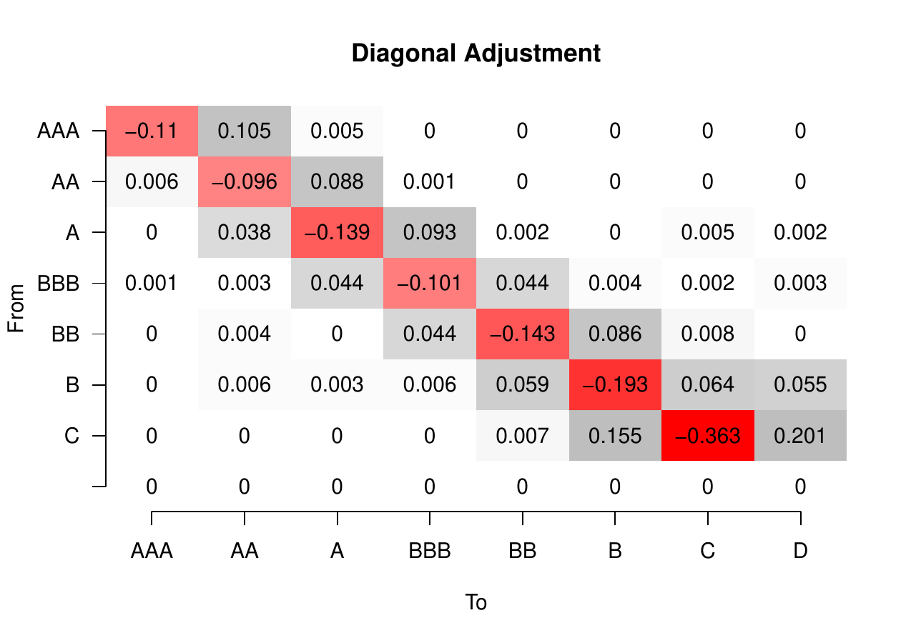</p>
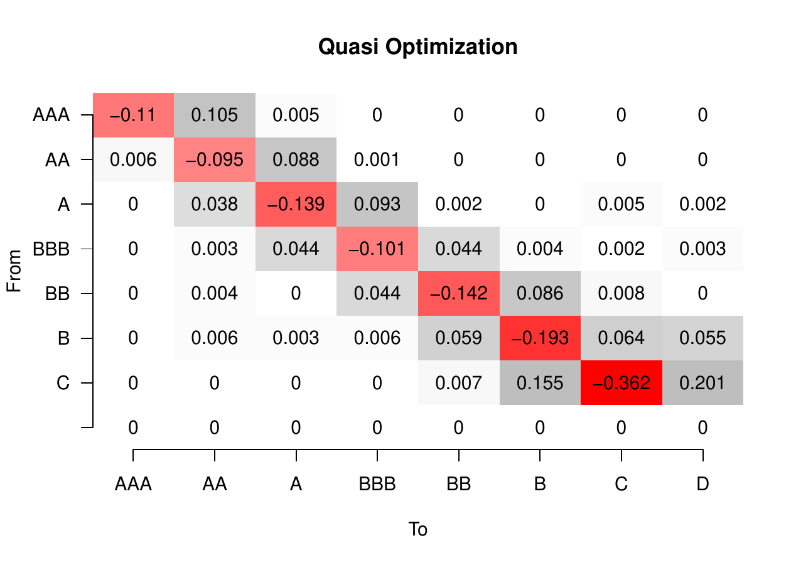
<figcaption>Figure 2: Matrix Logarithm Adjustment
Approaches</figcaption>
</figure>

# Likelihood inference

Given that complete continuous-time data is available, the likelihood
function for a generator matrix is given by
$$L(\mathbf{Q})=\prod_{i=1}^I \prod_{j\neq i} q_{ij}^{N_{ij}(T)}\exp(-q_{ij}R_i(T)),$$
where $N_{ij}(T)$ denotes the number of transitions from $i$ to $j$
within time $T$ and $R_i(T)$ for the cumulative sojourn times in state
$i$ before a state change occurs. A maximum likelihood estimate for a
single off-diagonal element of $\mathbf{Q}$ can then be derived by
$$q_{ij,ML}=\frac{N_{ij}(T)}{R_i(T)},$$
for more information see, e.g., @Inamura06.

## Expectation-maximization algorithm

The difficulty is now that when data is only observed at times $0$ and
$T$, the expressions $N_{ij}(T)$ and $R_i(T)$ are not known. In order to
derive a maximum likelihood estimate given this partially accessible
observations setting, @Bladt05 derive an instance of the
**expectation-maximization** (**EM**) **algorithm**. The missing data is
then iteratively imputed by conditional expectations given the current
parameter set. This requires a complicated computation of the integrals
in
$$\begin{aligned}
 E(R_i(T)|\mathbf{Q}_l,s(0),s(T))=&\frac{n_{s(0)s(T)}\mathbf{u}_{s(0)}^T\left(\int_0^T \exp(\mathbf{Q}_lt)\mathbf{u}_i\mathbf{u}_j^T\exp(\mathbf{Q}_l(T-t))dt\right)\mathbf{u}_{s(T)}}{\mathbf{u}_{s(0)}^T\exp(\mathbf{Q}_lT)\mathbf{u}_{s(T)}} \\
\text{and} \quad E(N_{ij}(T)|\mathbf{Q}_l,s(0),s(T))=&\frac{n_{s(0)s(T)}q_{ij,l}\mathbf{u}_{s(0)}^T\left(\int_0^T \exp(\mathbf{Q}_lt)\mathbf{u}_i\mathbf{u}_j^T\exp(\mathbf{Q}_l(T-t))dt\right)\mathbf{u}_{s(T)}}{\mathbf{u}_{s(0)}^T\exp(\mathbf{Q}_lT)\mathbf{u}_{s(T)}},
\end{aligned}$$

where $n$ refers to an element of the discrete-time absolute transition
frequency matrix $\mathbf{N}_{T}$, $\mathbf{u}_k$ denotes a unit vector
with entry $1$ at position $k$ and $l$ points to the current iteration
step of the EM algorithm. The computation of the integrals is carried
out following the matrix exponential approach described in @VanLoan78
and @Inamura06. In order to perform an estimate based on the EM
algorithm an initial generator matrix guess has to be chosen, which has
to be a proper generator matrix. In the following example, this will be
the matrix `gm0`, which is an arbitrarily chosen generator matrix where
all off diagonal entries are $1$ and state $8$ is determined as an
absorbing state.

``` r
gm0 <- matrix(1, 8, 8)
diag(gm0) <- 0
diag(gm0) <- -rowSums(gm0)
gm0[8,] <- 0
```

The maximum likelihood estimate can then be obtained by using the `gm()`
function, providing a matrix of absolute numbers of state changes (in
the credit rating example i.e., `tm=tm_abs`), specifying the method
argument by `method="EM"` and setting an initial guess (here:
`gmguess=gm0`).

``` r
gmem <- gm(tm=tm_abs, te=1, method="EM", gmguess=gm0)
plot(gmem)
plot(gmem$ll, main="Expectation Maximization Algorithm\nLog Likelihood Path",
     xlab="Iteration", ylab="Log-Likelihood")
```

The result of this estimate can be seen in figure [3](#figure:EM)
together with a plot of the log-likelihood path of the single EM
algorithm iteration steps.

## Direct likelihood optimization

The function being actually optimized by the EM algorithm is the
marginal likelihood
$$L(\mathbf{Q}|\mathbf{N}_{T})= \prod_{i=1}^I \prod_{j=1}^J(\exp(\mathbf{Q}\cdot T))_{ij}^{n_{T};ij}.$$
Besides the EM algorithm, also other numerical optimization methods can
be employed to perform the maximization of this function. The R-package
*msm*, which is actually built for estimating Markov models with
covariates, so called multi-state models, contains simplex optimization
(`opt.method="optim"`), Newton optimization (`opt.method="nlm"`), a
bounded optimization by a quadratic approximation approach
(`opt.method="bobyqa"`) introduced by @powell2009bobyqa and a Fisher
scoring technique by @kalbfleisch1985analysis (`opt.method="fisher"`).
In order to benchmark the EM algorithm, the different techniques shall
be compared using the derived maxima and the time needed to perform the
estimation.

``` r
### Data transformation for msm function
mig <- NULL
id <- 0
for(i in 1:7) {
  for(j in 1:8) {
    if(tm_abs[i,j] > 0) {
      for(n in 1:tm_abs[i,j]) {
        id <- id + 1
        mig <- rbind(mig, c(id, 0, i), c(id, 1, j))
      }
    }
  }
}
mig_df <- data.frame(id=mig[,1], time=mig[,2], state=mig[,3])

### Comparing estimates
gmem <- gm(tm_abs, te=1, method="EM", eps=1e-7, gmguess=gm0)
ctmcdlogLik(gmem$par, tm_abs, 1)

q0 <- rbind(matrix(1, 7, 8), 0)
msm_est1 <- msm(state ~ time, id, data=mig_df, qmat=q0,
                opt.method="optim", gen.inits=TRUE)
ctmcdlogLik(qmatrix.msm(msm_est)[[1]], tm_abs, 1)
msm_est2 <- msm(state ~ time, id, data=mig_df, qmat=q0,
                opt.method="nlm", gen.inits=TRUE)
ctmcdlogLik(qmatrix.msm(msm_est)[[1]], tm_abs, 1)
msm_est3 <- msm(state ~ time, id, data=mig_df, qmat=q0,
                opt.method="nlm", gen.inits=TRUE)
ctmcdlogLik(qmatrix.msm(msm_est)[[1]], tm_abs, 1)

msm_est4 <- msm(state ~ time, id, data=mig_df, qmat=q0,
                opt.method="fisher", gen.inits=TRUE)
```

The marginal likelihood function for a given generator matrix,
discrete-time interval $T$ and corresponding discrete-time transition
frequencies $\mathbf{N}_{T}$ can be computed by the function
`ctmcdlogLik()`. Optimization with the previously employed remote
initial value `gm0` fails for all *msm* optimization methods, with the
closer built-in parameter initialization `gen.inits=TRUE`, we obtain the
results presented in table [1](#lo). Optimization also fails for the
method of @kalbfleisch1985analysis. However, it is already mentioned in
the helpfiles for the `msm()` function, that optimization using this
approach lacks stability. Thus, the advantages of the EM algorithm in
this specific data setting where no covariates are included in the
calculation are its numerical performance and its stability.

::: {#lo}
  --------------------------------------------------------------------
         Method            EM         optim        nlm       bobyqa
  -------------------- ----------- ----------- ----------- -----------
     Log-Likelihood     -3194.255   -3194.255   -3194.255   -3194.259

   Time Elapsed \[s\]     0.46        4.65        28.33      167.52
  --------------------------------------------------------------------

  : Table 1: Likelihood Optimization - Numerical Comparison
:::

## Confidence intervals

The package *ctmcd* also provides a function for deriving a confidence
interval based on the asymptotic normality of the maximum likelihood
estimate. As however in a partially observed data setting the maximum
likelihood estimate is based on the likelihood function of the complete
observations $\{ N_{ij}(T),R_i(T) \}_{1 \leq i \leq I,1\leq j \leq J}$
given that only part of them, $\mathbf{N}_{T}$ are actually available,
the Fisher information matrix has to be adjusted for the missing
information in order to derive proper standard error estimates.
Following @Oakes99, a Fisher information matrix estimate for the
observed data $\mathbf{I}_{\mathbf{N}_{T}}$ can be obtained by
$$\mathbf{I}_{\mathbf{N}_{T}}=\mathbf{I}_{\{ N_{ij}(T),R_i(T) \}_{1 \leq i \leq I,1\leq j \leq J}}-\mathbf{I}_{\{ N_{ij}(T),R_i(T) \}_{1 \leq i \leq I,1\leq j \leq J}|\mathbf{N}_{T}}.$$

<figure id="figure:EM">
<p>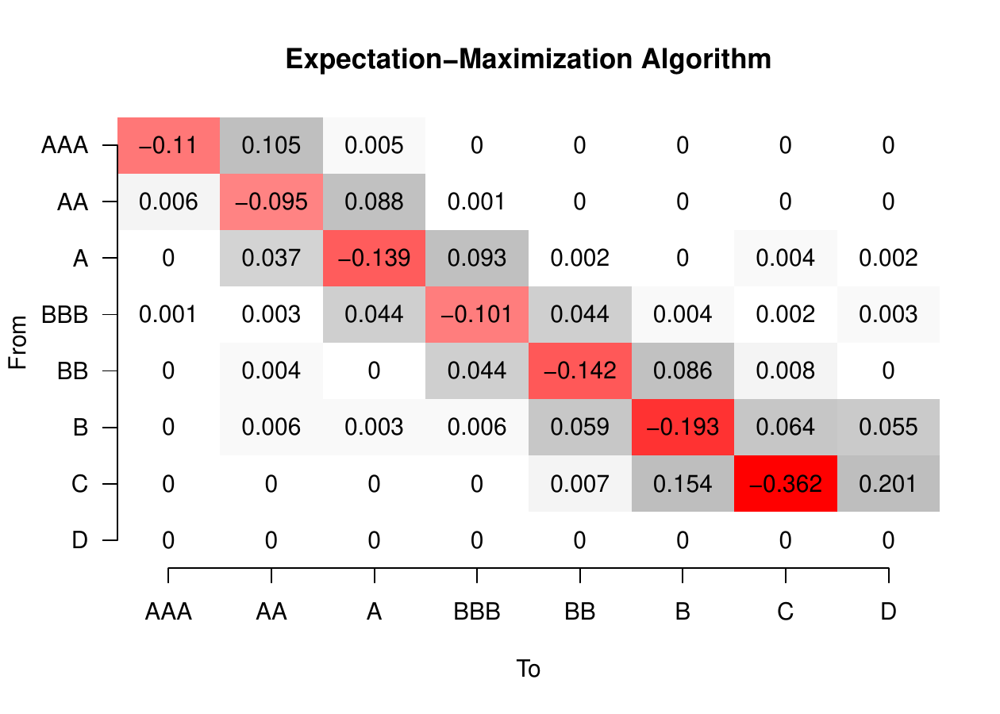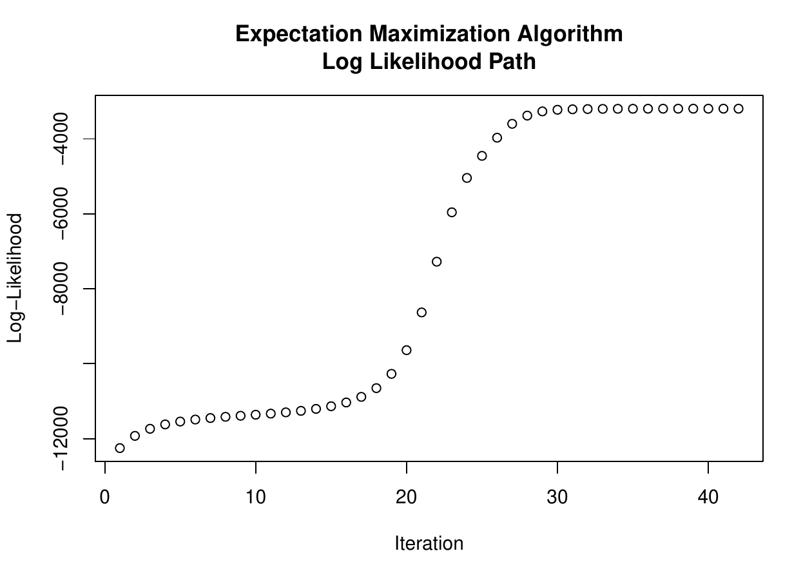</p>
<figcaption>Figure 3: Maximum-Likelihood Estimation.</figcaption>
</figure>

@Bladt09 then concretize this expression for a generator matrix
estimation framework and derive
$$\begin{aligned}
 I_{\mathbf{N}_{T},(i-1)I+j,(i-1)I+j}=&\frac{1}{q_{ij}^2} E(N_{ij}(T)|\mathbf{Q}_l,s(0),s(T))-\frac{1}{q_{ij}^2} \frac{\partial}{\partial q_{ij}} E(N_{ij}(T)|\mathbf{Q}_l,s(0),s(T))\\+&\frac{\partial}{\partial q_{ij}} E(R_{i}(T)|\mathbf{Q}_l,s(0),s(T))\\
\text{and} \quad I_{\mathbf{N}_{T},(i-1)I+j,(i^\prime-1)I+j^\prime}=&-\frac{1}{q_{ij}^2} \frac{\partial}{\partial q_{i^\prime j^\prime }} E(N_{ij}(T)|\mathbf{Q}_l,s(0),s(T))+\frac{\partial}{\partial q_{i^\prime j^\prime }} E(R_{i}(T)|\mathbf{Q}_l,s(0),s(T))
\end{aligned}$$

as diagonal and off-diagonal $(i,j)\neq (i^\prime, j^\prime)$ elements
of the observed Fisher information matrix $\mathbf{I}_{\mathbf{N}_{T}}$.
The confidence interval then has the common form
$$q_{ij}\pm z_{1-\frac{\alpha}{2}} se(q_{ij}),$$
where $z_{1-\frac{\alpha}{2}}$ denotes the $1-\frac{\alpha}{2}$ quantile
of the standard normal distribution. The method is implemented as a
function `ciEM()`, which can be easily accessed using the generic
`gmci()` command, which takes as arguments an EM algorithm estimate
object and a significance level `alpha`.

``` r
ciem <- gmci(gmem, alpha=.05)
plot(ciem)
```

By default, the derivatives for the information matrix are calculated
using the analytical expressions of @dosReis17 (`cimethod="SdR"`),
numerical derivatives as suggested in @Bladt09 can be accessed by
`cimethod="BS"`.\
The matrix plot function can also be applied to `"gmci"` interval
estimate objects, see, e.g., figure [4](#figure:EMCI). One can see in
this example that interval estimates are not provided for all generator
matrix entries. This is due to the fact that the numerical evaluation of
the above described expressions for deriving the Fisher information
matrix and inverting it becomes unstable when the parameter estimates
are small. Thus a lower limit `eps` can or has to be specified so that
for generator matrix elements smaller than `eps`, no interval estimates
are obtained. By default `eps=1e-04`.

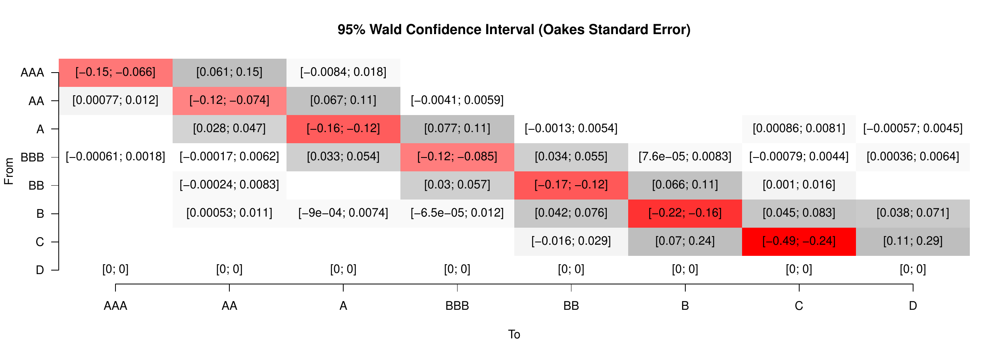{#figure:EMCI width="100%" alt="graphic without alt text"}

# Bayesian inference

## Gibbs sampler

@Bladt05 show that the Gamma distribution $\Gamma(\phi,\psi)$
constitutes a conjugate prior for the off diagonal elements of the
generator matrix under the continuous-time Markov chain likelihood
function. The posterior distribution can then be derived as
$$\begin{aligned}
f(\mathbf{Q}|\{s(0),s(T)\})\propto& L(\mathbf{Q}|\{s(0),s(T)\})\prod_{i=1}^I\prod_{j \neq i} q_{ij}^{\phi_{ij}-1}\exp(-q_{ij}\psi_{i})\\\propto&\prod_{i=1}^I\prod_{j \neq i} q_{ij}^{N_{ij}(T)+\phi_{ij}-1}\exp(-q_{ij}(R_i(T)+\psi_{i})).
\end{aligned}$$
Based on these expressions, they describe a Gibbs sampling algorithm
(GS) which in analogy to the EM algorithm iteratively simulates the
missing data $N_{ij}(T)$ and $R_i(T)$ given the current parameter
estimate and subsequently draws new parameter estimates given the
imputed data. In order to use the method, the prior parameters have to
be specified as a `"list"` object named `prior`. Thereby, the first
element of the list has to be an $I \times J$ matrix of the Gamma
parameters $\phi_{ij}$ and the second element a vector of length $I$
with the parameters $\psi_i$. Consider, e.g.,

``` r
  pr <- list()
  pr[[1]] <- matrix(1, 8, 8)
  pr[[1]][8,] <- 0
  pr[[2]] <- c(rep(5, 7), Inf)
```

as a simple example, where $\phi_{ij}=1$, $\psi_i=5$ and there is an
absorbing state $8$, which can be specified by determining
$\phi_{\cdot,8}=0$ and $\psi_{8}=\infty$. As for the EM algorithm we
need to provide a matrix of *absolute*, rather than relative, transition
frequencies as input data (in our example `tm=tm_abs`). Furthermore, the
length of the burn-in period must be chosen (here: `burnin=1000`).
Convergence of the algorithm is evaluated by the approach of
@heidelberger1981spectral, which is implemented in the R package
[*coda*](https://CRAN.R-project.org/package=coda), see @plummer2006coda.
The advantage of this method is that it can be applied to single chains;
a shortcoming is that, as for similar methods, evaluation with multiple
parameters is time consuming. Thus, besides specifying a p-value for the
convergence test by the argument `conv_pvalue`, one can also set a
frequency criterion `conv_freq` for how often with an equidistant number
of trials convergence shall be checked. By default, `conv_pvalue=0.05`
and `conv_freq=10`. One should notice that as the method of
@heidelberger1981spectral is a two sample location test for comparing
the stability of the parameter estimates at the beginning and the end of
the Markov chain, the hypotheses are set so that an increasing p-value
implies a stricter convergence criterion. Another stopping rule is the
maximum number of iterations `niter`, which by default is set as
`niter=1e04`. If convergence according to the method of
@heidelberger1981spectral is not given before the maximum number of
iterations is reached, a warning is displayed.

Setting the `method` argument to the value `"GS"` will then lead the
generic generator matrix estimation method to provide a posterior mean
estimate

``` r
  gmgs <- gm(tm=tm_abs, te=1, method="GS", prior=pr, burnin=1000)
  plot(gmgs)
```

The result can be seen in figure [5](#figure:GS).

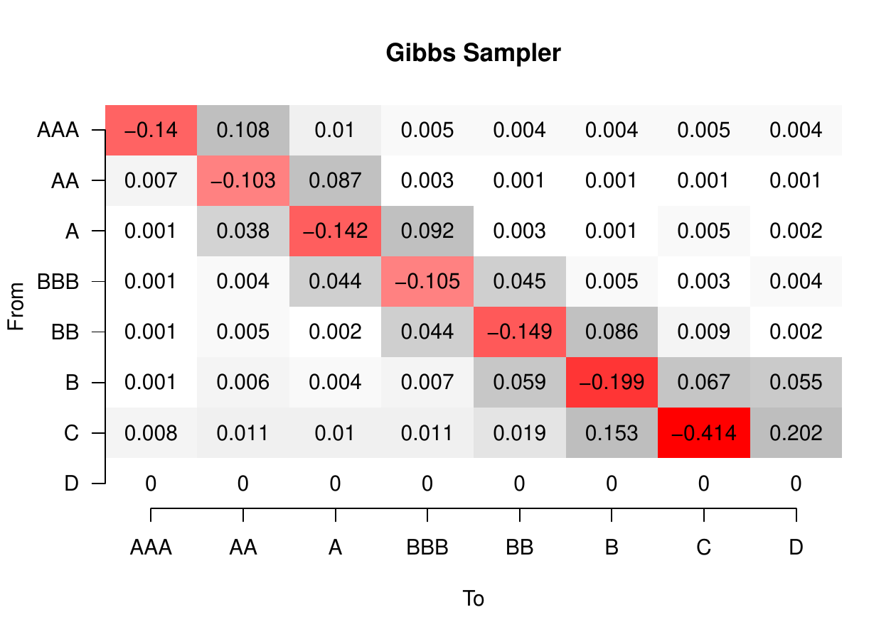{#figure:GS width="90.0%" alt="graphic without alt text"}

## Endpoint-conditioned path sampling

Central to the Gibbs sampling algorithm is the sampling of realizations
from the missing data full conditional distribution given the current
parameters and the discrete time observations. This yields the sample
paths from a continuous-time Markov chain with generator matrix estimate
$\mathbf{Q}_l$ given initial and end states $s(0)$ and $s(T)$. In the
package, two methods for deriving these sampling paths are provided, on
the one hand the modified rejection sampling approach of @Nielsen02
which can be accessed by `sampl_method="ModRej"`, on the other hand the
uniformization sampling scheme of @Fearnhead06, which is set as default
method and can be manually employed by setting `sampl_method="Unif"`. As
the simulation of trajectories of the process is in practice often very
time consuming, the method is implemented in C++ based on the source
code of @Fintzi16 which itself is built upon the supplementary R code of
@Hobolth08. Figure [6](#figure:ECctmc) shows the time (in seconds)
needed for sampling 10000 trajectories for each of the two methods and
any combination of initial and endstates.

``` r
speedmat_modrej <- matrix(0, 8, 8)
speedmat_unif <- matrix(0, 8, 8)
tpm <- expm(gmgs$par)
for(i in 1:7){
  for(j in 1:8){
    elem <- matrix(0, 8, 8)
    elem[i,j] <- 1e5
    t0 <- proc.time()
    rNijTRiT_ModRej(elem, 1, gmgs$par)
    speedmat_modrej[i,j] <- (proc.time() - t0)[3]
    t0 <- proc.time()
    rNijTRiT_Unif(elem, 1, gmgs$par,tpm)
    speedmat_unif[i,j] <- (proc.time() - t0)[3]
  }
}

plotM(speedmat_modrej,
      main="Time for Simulation of 100,000 Paths\nModified Rejection Sampling",
      xnames=rownames(tm_abs), ynames=colnames(tm_abs))
plotM(speedmat_unif,
      main="Time for Simulation of 100,000 Paths\nUniformization Sampling",
      xnames=rownames(tm_abs), ynames=colnames(tm_abs))
```

<figure id="figure:ECctmc">
<p>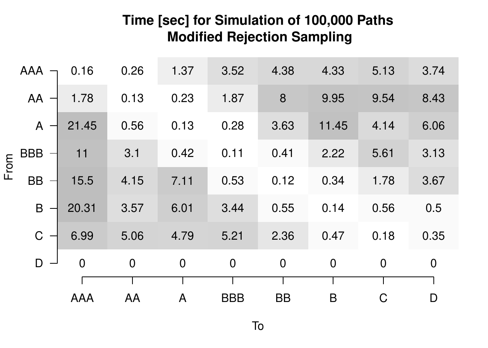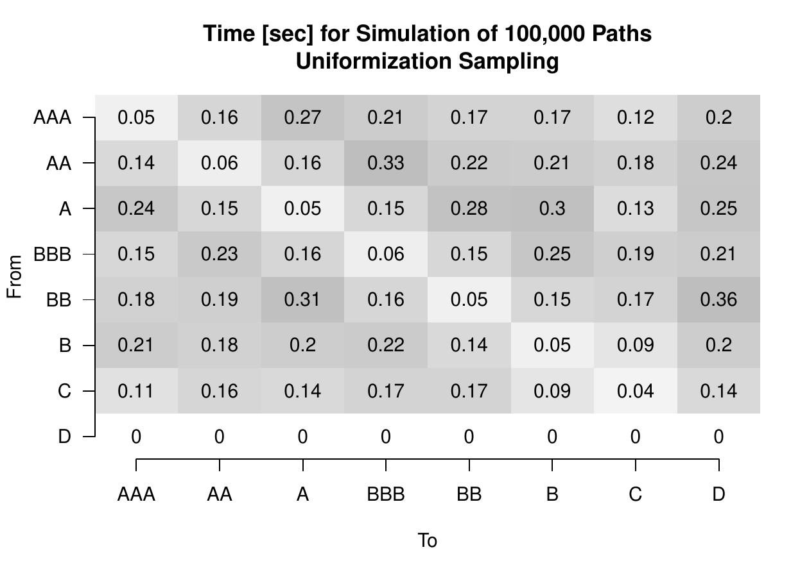</p>
<figcaption>Figure 6: Endpoint-Conditioned Trajectory
Sampling</figcaption>
</figure>

Although in this example, the uniformization sampling approach clearly
outperforms modified rejection sampling, it has to be mentioned that the
computing time for deriving discrete time state transitions in the
uniformization approach (which is carried out by using the matrix
exponential) is not included, because it is only calculated once in each
Gibbs sampling iteration step. Moreover, rejection rates of the approach
of @Nielsen02 might be lower if trajectories are sampled for a whole row
of a transition matrix and not single initial and end state combinations
because then more than one possible path ending can be accepted in a
single draw. Therefore, to provide the option to combine the individual
strengths of both approaches, it is possible to set
`sampl_method="Comb"` and provide a matrix with entries of either `"M"`
or `"U"` for the optional argument `combmat`, specifying which algorithm
shall be used for simulating trajectories for the specific start and
endpoint combination. Moreover, it is possible to include an own
external sampling algorithm implementation by specifying `method="Ext"`
and an argument `sampl_func` with a sampling function of the format

``` r
  sf <- function(tmabs, te, gmest) {
    ### Derive Expected Holding Times (RiT) and Number of State Transitions (NijT)
    return(list(RiT=..., NijT=...))
  }
```

Thereby, the matrix of absolute transition frequencies `tmabs`, the time
interval for the discrete-time transitions `te` and the current
parameter estimate of the Gibbs sampler `gmest` are input variables to
this function and a vector of cumulative simulated holding times `RiT`
and a matrix of continuous-time state changes `NijT` needs to be
returned.

## Parallelization

As the numerical performance of the Gibbs sampling algorithm is severely
dependent on the performance of the endpoint conditioned path sampling
algorithm, we would like to briefly point out that the whole method can
also be run in parallel. This can be achieved by setting up a number of
`nco` independent chains with `N/nco` iterations each, whereas `N`
denotes the total number of iterations and `nco` the number of parallel
threads. As long as the initial states of the chain are forgotten, the
single generator matrix draws can be seen as independent realizations.
Thus, a burnin period must be considered in every thread and
`conv_pvalue` has to be set to $1$ in order to ensure that the
predetermined number of iterations is reached. Without loss of
generality we use the packages
[*foreach*](https://CRAN.R-project.org/package=foreach) [@foreach] and
[*doParallel*](https://CRAN.R-project.org/package=doParallel)
[@doParallel] to provide with a simple example.

``` r
library(foreach)
library(doParallel)
N <- 1e5
nco <- detectCores()
cl <- makeCluster(nco)
registerDoParallel(cl)
gspar=foreach(i=1:nco, .packages=c("ctmcd", "expm")) %dopar%
  gm(tm=tm_abs, te=1, method="GS", burnin=1000, prior=pr,
     conv_pvalue=1, niter=N / nco)
stopCluster(cl)

### Derive Estimate
parlist <- lapply(gspar, function(x) x$par)
parest <- Reduce('+', parlist) / nco
```

In this multiple chain setting, convergence can be analyzed by the
potential scale reduction factor diagnostic of @Gelman92. The potential
scale reduction factor describes by what fraction the variance of the
draws in the chain can be reduced if the chain is extended to an
infinite length. Convergence is assumed when the factor is close to $1$.
Rules of thumb on how close its value should be are, e.g., $1.2$, see
@bolker2008ecological or $1.1$, see @gelman2011inference. With the
absorbing default state and diagonal elements being only a linear
combination of the parameters in the single rows, chains for $49$
parameters have to be evaluated. This can be conducted by employing the
multivariate extension of the originally univariate factor, which has
been introduced by @Brooks98.

``` r
### Check Convergence
library(coda)
chainlist <- as.mcmc.list(lapply(gspar, function(x) {
    as.mcmc(do.call(rbind, lapply(x$draws, as.vector)))
}))
parchainlist <- lapply(chainlist,
                       function(x) x[,as.vector(parest) > 0])
gelman.diag(parchainlist)
```

Employing the implementation of this diagnostic in the *coda* package,
we derive a multivariate potential scale reduction factor of $1.01$ in
this example. Thus, convergence may be assumed.

## Credibility intervals

After having discussed various aspects of point estimation, an example
for Bayesian interval estimation shall be presented as well. @Bladt09
show that equal-tailed credibility intervals can be easily obtained from
samples of the joint posterior distribution by empirical quantiles
$$[q_{ij,\lceil L\frac{\alpha}{2}\rceil},q_{ij,\lceil L\frac{1-\alpha}{2}\rceil}].$$
Calling `gmci()`, the generic function for generator matrix interval
estimates, and specifying that an interval based on a Gibbs sampling
object (here: `gmgs`) shall be derived will automatically call the
`ciGS()` subroutine and yield an equal-tailed credibility interval as
outlined above. Setting a confidence level `alpha=0.05` will then yield
the estimate which can be seen in figure [7](#figure:GSCI).

``` r
cigs <- gmci(gm=gmgs, alpha=0.05)
plot(cigs)
```

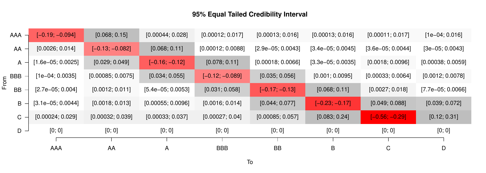{#figure:GSCI width="100%" alt="graphic without alt text"}

# Comparison of Approaches

The approaches `"DA"`, `"WA"`, `"EM"` and `"GS"` are suitable for state
spaces of size $2$ or greater. However, with a state space of size $2$,
the approaches diagonal adjustment and weighted adjustment will always
yield the same result as there is only one possible rearrangement of
off-diagonal elements in this case. Method `"QO"` requires a state space
of at least size $3$ as two off diagonal elements for each row of a
generator matrix are required to perform the implemented sorting scheme.

Figure [8](#figure:SC) shows how the methods scale concerning numerical
performance. The simulation study shows examples for the average time in
seconds to perform an estimate with each of the methods outlined in this
manuscript. Thereby, the EM algorithm and the Gibbs sampler are run for
100 iterations each and the data on which the estimates are performed is
generated by distributing 1000 and respectively, 10000 discrete-time
transitions over a single unit time horizon uniformly over matrices of
dimension $2\times2$ to $10\times10$. The estimation procedures are
repeated 1000 times and the mean execution times are summarized in the
graphics below. One can recognize that the matrix logarithm adjustment
approaches require by far less computation time than the EM algorithm
and the Gibbs sampler and that with increasing dimension of the state
space, computing time is increasing as well. Moreover, one can also
identify that the matrix logarithm adjustment approaches and the EM
algorithm are - in contrast to the Gibbs sampler - almost only dependent
on the size of the state space and not the number of discrete-time
transitions in the sample.

<figure id="figure:SC">
<p>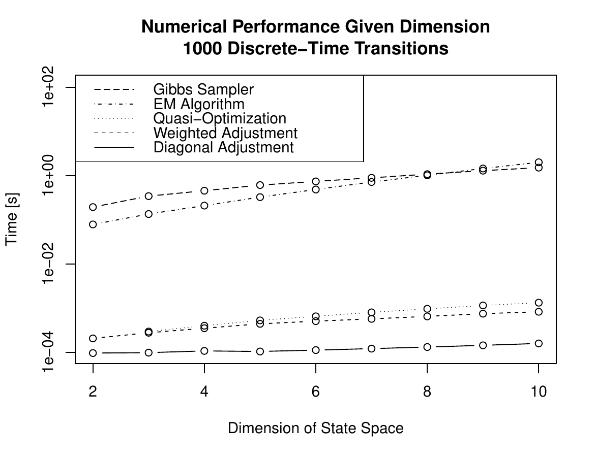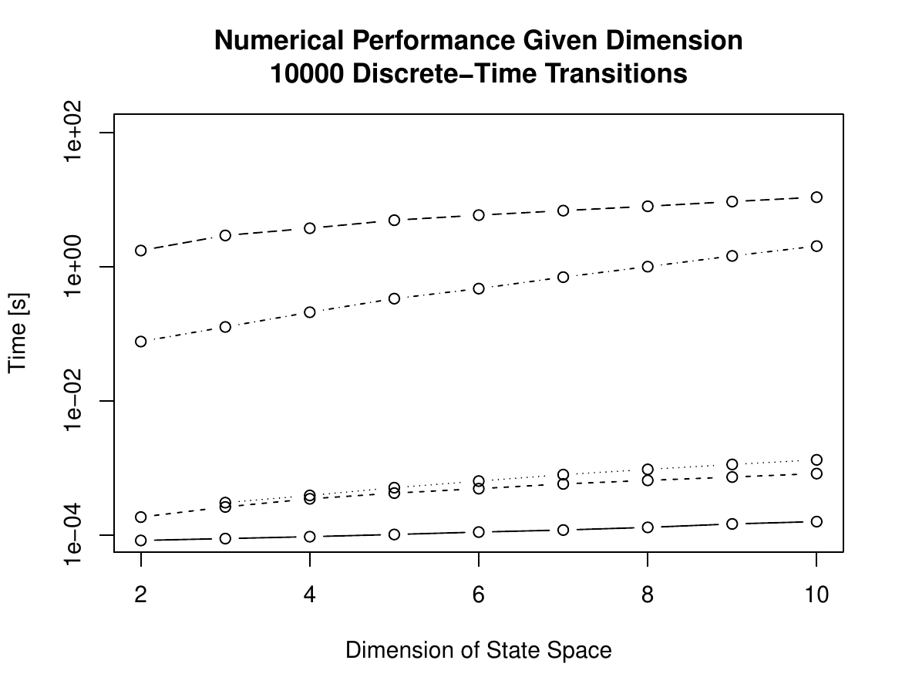</p>
<figcaption>Figure 8: Speed Comparison</figcaption>
</figure>

# Profiles of Discrete-Time Transitions into Absorbing States

Based on the derived parameter estimates, predictions about
discrete-time transitions into absorbing states of the Markov chain can
be made and moreover, systemized as a function of the length of the
discrete time interval. In the credit rating example shown in this
paper, such functions are discrete time probabilities of default of a
given initial rating category depending on the time horizon (in years)
and shall be called probability of default profiles in the following.
Thereby, an advantage of the Bayesian approach is that in contrast to
the other methods outlined, interval estimates for such profiles can be
easily derived. This involves the computation of empirical quantiles
$p_{t_a,ij,\frac{\alpha}{2}}$ and $p_{t_a,ij,1-\frac{\alpha}{2}}$ of all
elements of the discrete time transition matrix estimates
$$(\mathbf{P}_{t_a,1},\ldots , \mathbf{P}_{t_a,L})=(\exp(\mathbf{Q}_1t_a),\ldots,\exp(\mathbf{Q}_L t_a))$$
given the single Gibbs sampling generator matrix draws
$\mathbf{Q}_1,\ldots , \mathbf{Q}_L$, see @Bladt09.

For the seven possible initial states in the credit rating example,
probability-of-default profiles can then be obtained using the following
code, the results are shown in figure [9](#figure:Profile).

``` r
tmax <- 20
for(cat in 1:7){
  absStvec <- sapply(1:tmax, function(t) expm(gmgs$par * t)[cat,8])
  quantMat <- matrix(0, 4, tmax + 1)
  for(t in 1:tmax){
    dtdraws <- lapply(gmgs$draws, function(x) expm(t * x))
    drawvec <- sapply(1:length(gmgs$draws), function(x) dtdraws[[x]][cat,8])
    quantMat[,t + 1] <- quantile(drawvec, c(.025, .05, .95, .975))
  }
  plot(0:tmax, c(0, absStvec), t="l", lwd=3, ylim=c(0, max(quantMat)),
       main=paste0("Absorbing State Profiles\nInitial Rating Category ",
                   rownames(tm_abs)[cat]),
       xlab="Time [Years]", ylab="Probability of Default")
  for(i in 1:4)
    lines(0:tmax, quantMat[i,], lty=c(3, 2, 2, 3)[i])
  legend("topleft", lty=c(3, 2, 1), c("95%", "90%", "Median"))
}
```

<figure id="figure:Profile">
<p>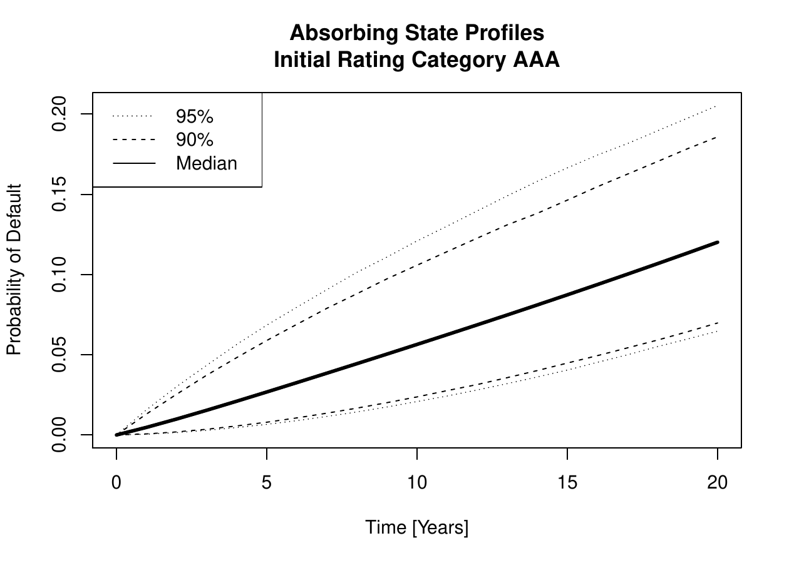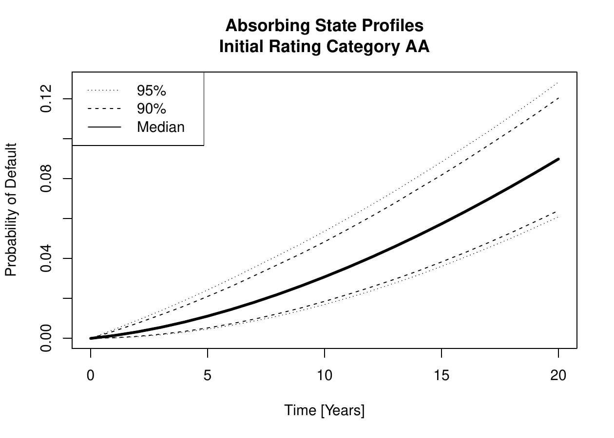</p>
<p>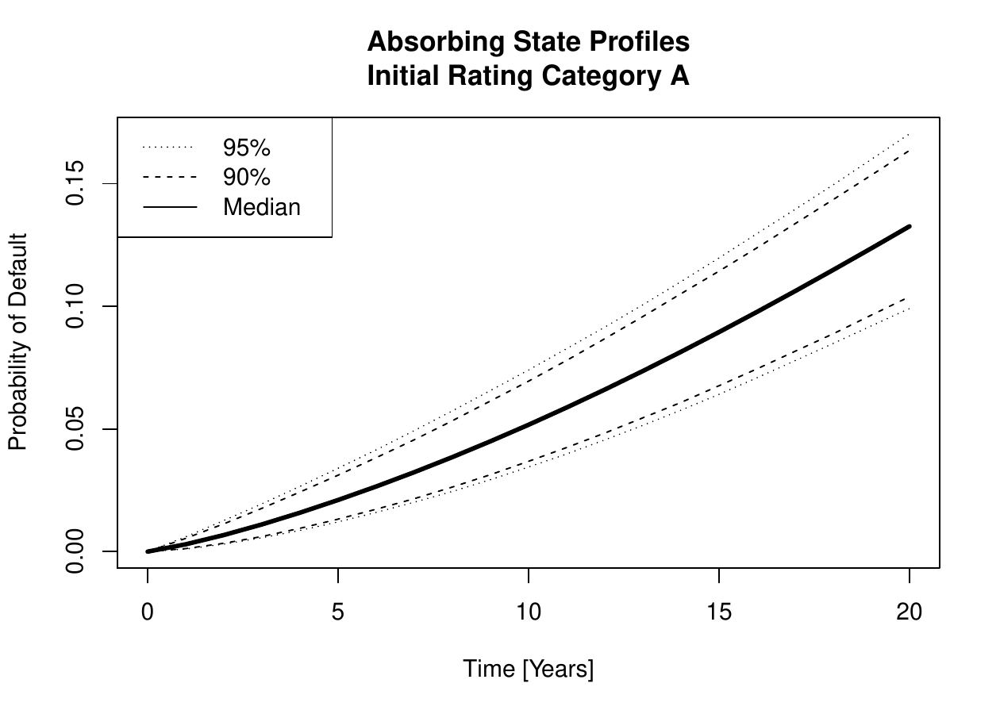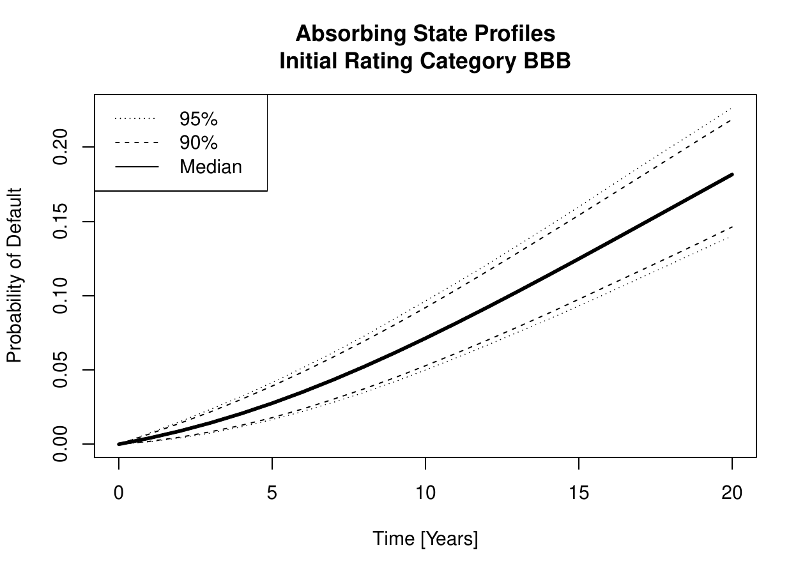</p>
<p>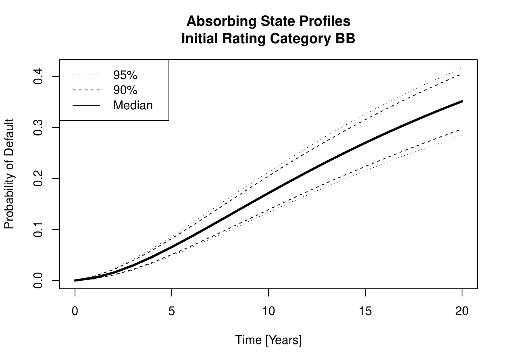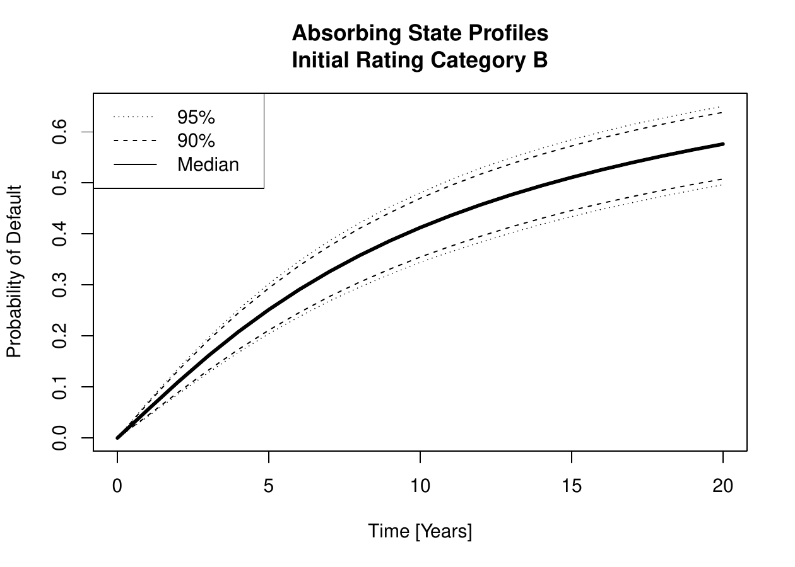</p>
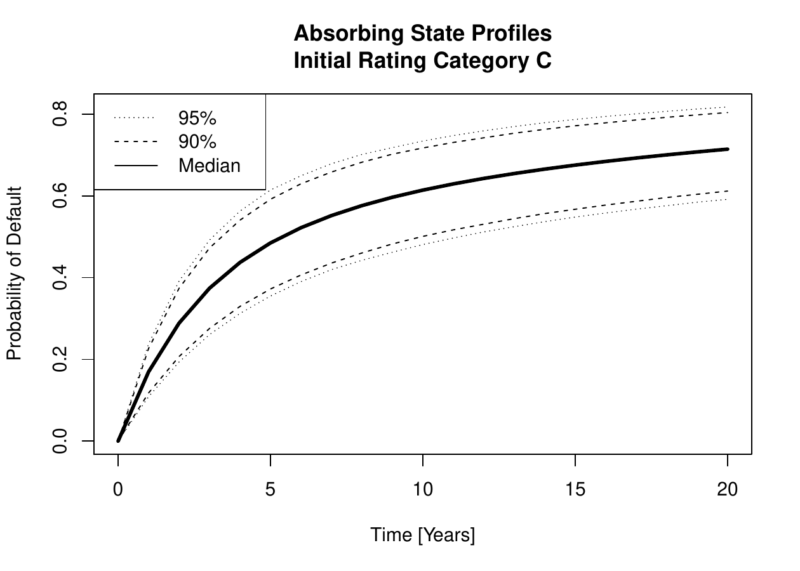
<figcaption>Figure 9: Probability-of-Default Profiles</figcaption>
</figure>

Complementary to the solid line, which represents the posterior mean
estimate based discrete-time probability of default predictions,
pointwise credibility intervals for $\alpha=0.05$ and $\alpha=0.1$ are
computed here. As expected, one can recognize that with increasing time
horizon, the width of the intervals is increasing as well. Furthermore,
the width of intervals increases with decreasing number of observations
in the specific category. This can be seen, e.g., for the profile with
pointwise intervals of initial rating category \"AAA\".

# Summary

The problem of estimating the parameters of a continuous-time Markov
chain from discrete-time data occurs in a wide range of applications and
especially plays an important role in gene sequence data analysis and
rating based credit risk modeling. This paper introduces and illustrates
the *ctmcd* package, which provides an implementation of different
approaches to derive such estimates. It supports matrix logarithm-based
methods with diagonal and weighted adjustment as well as a
quasi-optimization procedure. Moreover, maximum likelihood estimation is
implemented by an instance of the EM algorithm and Bayesian estimates
can be derived by a Gibbs sampling procedure. For the latter two
approaches also interval estimates can be obtained. The Bayesian
approach can be used to derive pointwise credibility intervals of
discrete-time transition probabilities and systematic profiles of
discrete-time transition probabilities into absorbing states given the
corresponding time horizon. Above all, a matrix plot function is
provided and can be used to visualize both point and interval estimates.

# Acknowledgements

The author thanks two anonymous referees for their thorough review and
highly appreciates the comments and suggestions which significantly
contributed to increasing the quality of the R package *ctmcd* and this
manuscript.
:::
