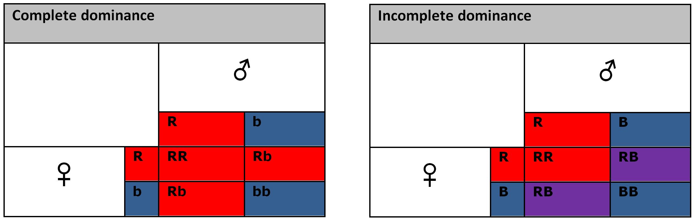

::: article
# Introduction

Recent advances in information technology provide tools for gathering an
immense amount of data on various scopes. Investigators have
increasingly improved tools to collect data describing different areas
of research. The need to efficiently manage, analyze and extract the
important features from high dimensional data is also growing with the
different exploration areas benefiting from these technologies.

The DNA microarray technology is widely used for exploring the
differential gene expression. The method is very established and offers
a very good opportunity to develop new methods for selecting features in
real high dimensional data. The vast amount of microarray data that is
freely available along with the results obtained by employing other
exploratory techniques, belonging to statistics or artificial
intelligence, provide a unique opportunity to evaluate the performance
of newly developed techniques.

The Genetic Algorithms (GAs) were extensively used to select features in
various high dimensional data, for different research goals. The GA
designs evolved and were adapted with particular exploration interests
since they were introduced [@Holland]. Different GA designs were
specifically adapted to address optimizations or diverse feature
selection [@Xue:2016] assignments.

The literature on GAs is comprehensive and covers various aspects of
interest. The fundamentals of GAs, including the schema theorem, are
covered in very instructive introductory books [@Mitchell] and
[@Goldberg]. Other authors propose exhaustive investigations in the GAs'
behavior [@Berard:2003] and properties [@Rudolph:1994]. The genetic
operators and their impact on evolution, with emphasis on mathematical
details [@Doerr:2015] were extensively examined. The genetic algorithms
model the naturally occurring evolution and are designed to solve
particular problems. In consequence, the theoretical foundations are yet
to catch up with the practically applied algorithms. Nevertheless, the
theory of genetic algorithms is emerging [@Droste:2002].

The project R offers a great environment for developing methods for high
dimensional data analysis. The variety of techniques already implemented
by numerous contributors and the availability of the methods, source
code, countless data, and results as well as the very forthcoming
community make it the environment of choice for implementing our method.
Moreover, the Bioconductor project [@Huber:2015] available in R, offers
a wide range of methods and tools for analyzing microarray data, as well
as real data sets to experiment with and compare the results. Our
package [*dGAselID*](https://CRAN.R-project.org/package=dGAselID) was
developed to be cohesive with Bioconductor. The `"ExpressionSet class"`
used in Bioconductor was adopted as standard for our package; any data
formatted accordingly can be analyzed with our method.

Different GA implementations are available as contributors' packages in
R. Implementations of GAs for both floating-point and binary chromosomes
are included in the
[*genalg*](https://CRAN.R-project.org/package=genalg) [@Willighagen]
package. The [*GA*](https://CRAN.R-project.org/package=GA)
[@Scrucca:2016], [*nsga2R*](https://CRAN.R-project.org/package=nsga2R)
[@Tsou], and [*gaoptim*](https://CRAN.R-project.org/package=gaoptim)
[@Tenorio] packages are dedicated to optimizations using GAs. A GA
designed for determining training populations [@Akdemir:2015] is offered
in the [*STPGA*](https://CRAN.R-project.org/package=STPGA) package. The
package [*kofnGA*](https://CRAN.R-project.org/package=kofnGA)
[@Wolters:2015] aims to select a fixed-size set of integers. Variable
selection applications of GAs are proposed in the
[*mogavs*](https://CRAN.R-project.org/package=mogavs) [@Pajala] and
[*gaselect*](https://CRAN.R-project.org/package=gaselect) [@Kepplinger]
packages for regression and high-dimensional data respectively.

# Algorithm

Haploid GAs were previously employed to address feature selection in
microarray studies [@Melita:2008]. In this type of data, the number of
samples is significantly lower than the number of features and the
utilization of cross validation techniques is necessary for reliable
results. The diploid GAs offer better performance than the haploid
implementations for selecting features in a cross validation scenario in
general, and for microarray data [@Melita:2016] in particular.

The GA implementation in the *dGAselID* package uses a diploid
representation. All the features in the data form a genome, and each
feature retains a specific locus in the genome, the position in the
original data. Every individual in the population will consist of two
such genomes.

The fitness evaluation function is a supervised classifier. Any
implementation of supervised classifier available in
[*MLInterfaces*](https://www.bioconductor.org/packages/release/bioc/html/MLInterfaces.html)
package [@Carey] is a possible choice for fitness evaluation function in
*dGAselID*. The fitness value is the accuracy of the given classifier in
discerning between samples belonging to different classes.

Every feature in the data, inputted according to the format in the
`"ExpressionSet class"`, is represented by a gene in the genome. Every
gene has two alleles, represented as `0` and `1`. The allele `1` codes
for the corresponding feature to be present in the classifier. The
allele `0` cyphers for discarding the gene from the classifier. A genome
with a limited number of alleles = `1`, codes for the supervised
classifier working on a subset of features from the data. The number of
desired features is user selectable at the initialization of the
algorithm.

Our implementation offers the possibility to divide the genomes into a
variable number of chromosomes. The number of chromosomes to split the
genomes in is user selectable. The value `1` for the number of
chromosomes will result in the genome being treated as a single
chromosome, like in the classical GA implementation. The default value
in the *dGAselID* is `22`. In this case, the genome is parted into 22
chromosomes, the total of human autosomes. The chromosomes will have
variable length, with different number of genes, following the dispersal
found in the human autosomes, as illustrated in the Table  [1](#tab:1).
The number of genes found on each chromosome will follow the spread
found in the human autosomes with different values for the number of
chromosomes. We chose the default value `22` to emphasize the foundation
of our evolutionary approach. Different values will serve diverse
practical applications. This parameter is particularly important when
variables belong to several previously known categories, as with the
custom microarray chips. When no such information is known, an
appropriate value can be empirically determined.

::: {#tab:1}
  ----------------------------------
  Chromosome No.   No. of features
  ---------------- -----------------
  1                9.17%

  2                7.64%

  3                5.81%

  4                4.89%

  5                5.19%

  6                5.81%

  7                5.50%

  8                4.28%

  9                4.28%

  10               4.28%

  11               6.11%

  12               4.89%

  13               2.44%

  14               3.66%

  15               3.66%

  16               3.97%

  17               4.89%

  18               1.83%

  19               5.19%

  20               2.75%

  21               1.22%

  22               2.44%
  ----------------------------------

  : Table 1: Default distribution of features on chromosomes.
:::

The initial population is randomly generated from a discrete uniform
distribution. The user can specify the number of genomes in the
population, the number of activated genes in each genome and the number
of chromosomes to split the genomes in. The population will encompass
individuals, with each individual consisting of two sets of haploid
chromosomes, randomly assigned.

In a diploid GA it is mandatory to determine how different alleles on
heterozygous chromosomes influence the phenotype. The dominance schemes
typically used in genetic algorithms are built upon the Complete
Dominance model, described in biology by Gregor Mendel in 1865. In this
model, one of the alleles, called dominant, produces effects into
phenotype and masks the existence of the other allele in genotype. The
alternative that does not affect the phenotype is called recessive
allele. The Complete Dominance model describes only a few of the
interactions between alleles in nature. Various models were later
developed to describe different interactions between alleles. In
Incomplete Dominance model, the phenotype of an individual is considered
to be in between the phenotypes resulting from each of the inherited
alleles. Both alleles influence the phenotype and the existence of none
is masked in genotype. The main difference between the two models is
illustrated in Figure [1](#figure:1). We can suppose that a gene that
codes for the color of an organism has two alleles; one of them produces
a red individual and the alternative shapes a blue entity. With the
Complete Dominance model, one of the alleles is dominant and masks the
presence of the other. In our example, the allele that codes for the red
color is dominant and is noted with capital letter (R). Every diploid
organism that inherits at least one allele R will be a red entity. Only
if a diploid organism inherits two copies of the recessive allele (b),
the phenotype will be influenced by it, resulting in a blue individual.
The interaction described by the Incomplete Dominance model results in
three different phenotypes. In this case, an individual can be red, blue
or purple. Both alleles affect the phenotype and are noted with capital
letters (R and B).

{#figure:1
width="100%" alt="graphic without alt text"}

The Incomplete Dominance inheritance is an alternative to genotype to
phenotype dominance schemes [@Melita:2016] in genetic algorithms and is
the approach adopted in our algorithm. Moreover, this method does not
require an explicit scheme for genotype-phenotype mapping. The fitness
of each individual is consequently evaluated as the mean accuracy of the
two classifiers, each set of haploid chromosomes in the individual. With
this approach it is possible to maintain a better variability in the
late generations, as features from the poorly performing genotypes will
be present in later generations when compared to the classical
technique. Exploitation of the Incomplete Dominance model is optional.
The value `"ID2"` for the parameter `ID` enables the Incomplete
Dominance model, while the value `"ID1"` turns it off. In evaluating the
fitness of an individual, any supervised classifier available in
[*MLInterfaces*](https://www.bioconductor.org/packages/release/bioc/html/MLInterfaces.html)
package can be selected. The package offers a unified way to call
supervised classifiers on data formatted according to
`"ExpressionSet class"` specifications with several options (`svmI`,
`ldaI`, `rdaI`, `knnI`, `knn.cvI`, `randomForrestI`, `dldaI`, `nnetI`,
`qdaI`, `naiveBayesI`, etc). The cross-validation techniques implemented
in *MLInterfaces* are also available for fitness evaluation in our
package, and are accessible through the `trainTest` parameter. The
default value `"LOG"` for the `trainTest` parameter enables the
leave-out-group cross-validation, while specifying `"LOO"`, the user can
opt for the leave-one-out cross-validation. Moreover, is if possible to
shape the data into training and testing sets. A value of the form `x:y`
for the `trainTest` parameter identifies the samples with indexes from
`x` to `y` as training examples while all the others are used as testing
set.

In the next step, the individuals are ranked according to their fitness.
Our implementation offers the option of applying an elitist selection
over the ranked individuals. The default value for elitism is NA, but a
user can decide on the desired value for elitism, keeping the chosen
number of best performing genotypes in the population.

Crossovers are applied next, between the two haploid sets of chromosomes
in each individual. Two-point crossovers were preferred to the
single-point alternative which preferentially affects the string ends.
The two-point crossover follows the classical implementation. One
two-point crossover is applied between homologous chromosomes, in each
individual. A parameter to explicitly specify the chance for a crossover
to occur is not implemented in our algorithm. The number of chromosomes
implicitly affects the number of crossovers.

Another approach to crossover, modeled after the Random Assortment of
Chromosomes in meiosis is also available. The Random Assortment of
Chromosomes Crossover [@Holban:2016] takes advantage of splitting the
genomes in a number of chromosomes with variable size. When selected,
two-point crossovers are performed between homologous chromosomes. After
the crossovers are applied, the chromosomes are randomly assorted and
distributed to one of the chromosomes set in each individual. This
process, models the events that occur during meiosis I in eukaryotes.
The user can choose at the initialization of the algorithm if the
chromosomes will be randomly assorted through the `randomAssortment`
parameter. The default value is `TRUE`. This operator is especially
important when selecting a small number of features from a very large
poll. In this case, the two-point crossover frequently recombines
strings containing only zeros, with no effect on the very long
genotypes. The Random Assortment operator offers a significant advantage
in these situations. The distinctions between these approaches to
recombination are highlighted in Figure [2](#figure:2), a part of the R
output using the code:

``` r
> library(dGAselID)
> set.seed(1357)
> c1<-rep(0, 10)
> c2<-rep(1, 10)
> individual<-rbind(c1, c2)
> individual

> chrConf01<-rep(1, 10)
> chrConf01

> #Two-point crossover on genotypes with 1 chromosome
> Crossover(individual [1, ], individual [2, ], chrConf01)

> chrConf03<-c(rep(1, 4), rep(2, 3), rep(3, 3))
> chrConf03

> #Two-point crossovers on genotypes with 3 chromosomes
> cr3<-Crossover(individual [1, ], individual [2, ], chrConf03)
> cr3

> #Random Assortment on the recombined genotypes with 3 chromosomes
> RandomAssortment(cr3, chrConf03)
```

{#figure:2 width="100%" alt="graphic without alt text"}

Subsequently, the haploid sets of chromosomes with a higher fitness are
kept and the others are discarded from each individual and mutations are
applied with a chance that is specified by the user when initializing
the algorithm. These haploid sets and the genotypes obtained thru
crossovers are then assembled and a new generation of randomly generated
individuals is created. Six different operators for mutation are
available in the package. They can be used solitarily or in any
combination, to support exploration with the genetic algorithm. The
classical point mutation is implemented. However, when selecting a small
number of features from a large poll with a genetic algorithm, the point
mutation has the tendency to progressively increase the number of
activated genes in genotypes, with every generation. To address this
drawback, we implemented several mutation mechanisms inspired from
genetics. These operators take advantage of the genotypes being
partitioned on different chromosomes. The alternatives to point mutation
available in the *dGAselID* package are:

1.  Nonsense Mutation,

2.  Frameshift Mutation,

3.  Large Segment Deletion,

4.  Whole Chromosome Deletion,

5.  Transposons.

The **Nonsense Mutation operator** annuls all the genes on a chromosome
following a randomly selected locus (treated as a stop codon). The other
chromosomes in the genotype are not influenced by the nonsense mutation.
The **Frameshift Mutation operator** randomly selects a locus on an
arbitrarily selected chromosome. The gene at the selected locus is
deleted and all the following chain is shifted with one position to the
left. The last locus on the implicated chromosome is subsequently
annulled to conserve its length. Other chromosomes in the genotype are
not altered by the mutation. The **Large Segment Deletion operator**
annuls all the genes in a randomly generated interval on an arbitrarily
selected chromosome. The **Whole Chromosome Deletion operator** acts in
a similar fashion, but on the whole chromosome rather than an interval.
The **Transposons operator** randomly selects a chromosome, a gene on
that chromosome and a distance for relocation. The elected gene is then
transferred at a locus indicated by the generated distance. All the
mutation operators occur with chances specified by designated
parameters. The mutated genotypes are verified to have at least 4 active
genes and the invalid mutations are not inherited, to prevent errors
during the subsequent fitness evaluations. The following code
demonstrates the mutation operators. The R output is partially presented
in Figure [3](#figure:3).

``` r
> library(ALL)
> data(ALL)
> 
> demoALL<-ALL[1:12, 1:8]
> 
> set.seed(1234)
> population<-InitialPopulation(demoALL, 4, 9)
> individuals<-Individuals(population)
> individuals
>
> set.seed(123)
> pointMutation(individuals, 4)
> 
> chrConf<-splitChromosomes(demoALL, 2)
> chrConf
> individuals
> 
> set.seed(123)
> nonSenseMutation(individuals, chrConf, 20)
> 
> set.seed(123)
> frameShiftMutation(individuals, chrConf, 20)
> 
> set.seed(123)
> largeSegmentDeletion(individuals, chrConf, 20)
> 
> set.seed(123)
> wholeChromosomeDeletion(individuals, chrConf, 20)
> 
> set.seed(123)
> transposon(individuals, chrConf, 20)
```

{#figure:3 width="100%" alt="graphic without alt text"}

Iteration with the new generation follows. The number of generations is
established at the initialization of the algorithm.

# Working with the *dGAselID* package

The *dGAselID* package is structured around the `dGAselID()` function.
This function manages the initial parameters for the algorithm and,
depending on the user selected options, sets the stage for the
experiment. The `dGAselID()` function calls other functions for the
different steps and options in the algorithm. The arguments accepted by
`dGAselID()` along with short descriptions are presented in Table
 [2](#tab:2). The other functions, for different operators used during
the genetic algorithm search, are summarized in Table  [3](#tab:3).

Graphical representations of the evolution are available with the
built-in functions in real-time. The maximum and average accuracy,
accompanied by the most frequently selected genes can be displayed after
each generation, offering a very intuitive image of the evolution.
Evidence about the number of individuals in the current population,
crossovers or the number of mutations are displayed for each generation.

The algorithm retains various data about the evolution for further
analysis. For each gene, the frequency of selection across generations
is recorded, along with other characteristics of the evolution. The
output data format with a hypothetical result is shown below, together
with a description of the recorded variables in the Table  [4](#tab:4).

``` r
> ## Not run:
> names(result)	#hypothetical result
[1] "DGenes"          "dGenes"          "MaximumAccuracy" "MeanAccuracy"   
[5] "MinAccuracy"     "BestIndividuals"
> ## End(Not run)
```

::: {#tab:2}
  -------------------------------------------------------------------------------------------------
  Argument                         Description
  -------------------------------- ----------------------------------------------------------------
  `x`                              The dataset in `"ExpressionSet class"` format

  `response`                       The response variable

  `method`                         Supervised classifier for fitness evaluation

  `trainTest`                      Specifies the training set or the cross-validation method

  `startGenes`                     Number of alleles=`1` in the starting genomes

  `populationSize`                 Initial populations size

  `iterations`                     Number of generations

  `noChr`                          The number of desired chromosomes

  `elitism`                        Elitism in percentages

  `ID`                             Dominance

  `pMutationChance`                Chance for a point mutation to occur

  `nSMutationChance`               Chance for a Nonsense Mutation to occur

  `fSMutationChance`               Chance for a Frameshift Mutation to occur

  `lSDeletionChance`               Chance for a Large Segment Deletion to occur

  `wChrDeletionChance`             Chance for a Whole Chromosome Deletion to occur

  `transposonChance`               Chance for a Transposon mutation to occur

  `randomAssortment`               Random Assortment of chromosomes for recombinations

  `embryonicSelection`             Remove chromosomes with fitness \< specified value

  `EveryGeneInInitialPopulation`   Request for every gene to be present in the initial population

  `nnetSize`                       For `nnetI`

  `nnetDecay`                      For `nnetI`

  `rdaAlpha`                       For `rdaI`

  `rdaDelta`                       For `rdaI`
  -------------------------------------------------------------------------------------------------

  : Table 2: Parameters accepted by the `dGAselID()` function.
:::

::: {#tab:3}
  ----------------------------------------------------------------------------------------
  Function                      Description
  ----------------------------- ----------------------------------------------------------
  `dGAselID()`                  Main function

  `AnalyzeResults()`            Ranks individuals according to their fitness and records

                                the results

  `Crossover()`                 Operator for the two-point crossover

  `Elitism()`                   Performs elitism for the desired threshold

  `EmbryonicSelection()`        Deletes individuals with a fitness below a specified

                                threshold

  `EvaluationFunction()`        Evaluates the individuals' finesses

                                after each iteration

  `frameShiftMutation()`        Operator for the Frameshift Mutation

  `Individuals()`               Generates individuals from haploid chromosome sets

  `InitialPopulation()`         Generates the initial random haploid chromosome sets

  `largeSegmentDeletion()`      Operator for the Large Segment Deletion mutation

  `nonSenseMutation()`          Operator for the Nonsense Mutation

  `PlotGenAlg()`                Plots the evolution after each generation

  `pointMutation()`             Operator for the point mutation

  `RandomAssortment()`          Performs the Random Assortment of chromosomes

  `RandomizePop()`              Creates the random population for the next generation

  `splitChromosomes()`          Divides the genotypes in a set with the desired number

                                of chromosomes

  `transposon()`                Operator for the Transposon mutation

  `wholeChromosomeDeletion()`   Operator for the Whole Chromosome Deletion mutation
  ----------------------------------------------------------------------------------------

  : Table 3: Functions in the dGAselID package.
:::

::: {#tab:4}
  ---------------------------------------------------------------------------
  Variable            Description
  ------------------- -------------------------------------------------------
  `DGenes`            The occurrences in selected genotypes for every gene

  `dGenes`            The occurrences in discarded genotypes for every gene

  `MaximumAccuracy`   Maximum accuracy in every generation

  `MeanAccuracy`      Average accuracy in every generation

  `MinAccuracy`       Minimum accuracy in every generation

  `BestIndividuals`   Best individual in every generation
  ---------------------------------------------------------------------------

  : Table 4: `dGAselID()` output.
:::

# Example

We illustrate the functionality of the *dGAselID* package with the
[*ALL*](https://www.bioconductor.org/packages/release/bioc/html/ALL.html)
dataset [@Li], a very known set of real DNA microarray data, available
in Bioconductor. We are searching for the differentially expressed genes
that could characterize the patients suffering from acute lymphoblastic
leukemia but have different BCR/ABL classification, negative or
positive. For this example, we use a subset of the original ALL data,
non-specifically and specifically filtered to 628 features and 79
samples, from the 12625 features and 128 patients in the complete data
set. The data was filtered using the capabilities offered in the
[*genefilter*](https://www.bioconductor.org/packages/release/bioc/html/genefilter.html)
package [@Gentleman:2016]. The algorithm works as well on the original
data set, but the filtered data is searched faster. However, our
experiments with real data show that more reliable results are obtained
with full featured data.

The code for constructing the dataset used in the following examples is
presented below:

``` r
> library(genefilter)
> library(ALL)
> data(ALL)
> bALL = ALL[, substr(ALL$BT,1,1) == "B"]
> smallALL = bALL[, bALL$mol.biol %in% c("BCR/ABL", "NEG")]
> smallALL$mol.biol = factor(smallALL$mol.biol)
> smallALL$BT = factor(smallALL$BT)
> f1 <- pOverA(0.25, log2(100))
> f2 <- function(x) (IQR(x) > 0.5)
> f3 <- ttest(smallALL$mol.biol, p = 0.1)
> ff <- filterfun(f1, f2, f3)
> selectedsmallALL <- genefilter(exprs(smallALL), ff)
> smallALL = smallALL[selectedsmallALL, ]
```

An example of function call is:

``` r
> set.seed(149)
> resNoID<-dGAselID(smallALL, "mol.biol", trainTest = 1:79, startGenes = 12,
+ populationSize = 200,  iterations = 300, noChr = 5, pMutationChance = 0.0075,
+ elitism = 4)
```

The choice for evaluation function was `knn.cvI` from the *MLInterfaces*
package, with the parameters `k=3` and `l=2`. This is the default
`method` in the package. The evaluation function used in this example,
`knn.cvI`, is a kNN classifier with the leave-one-out cross validation
embedded. For this reason, the requirement for the `trainTest` parameter
is special, addresses all the instances in the data, `1:79`. For any
other supervised classifier, the `trainTest` parameter shapes the
training and testing subsets in the same fashion as the `trainInd`
parameter in *MLInterfaces*. When cross-validation is required, the
`trainTest` parameter specifies the desired method as `"LOO"` or
`"LOG"`, and is equivalent to `xvalSpec("LOO")` or `xvalSpec("LOG")`
respectively, in *MLInterfaces* package. An illustration of the
evolution is presented in Figure [4](#figure:4). The figure pictures a
juncture during the search, including the information provided by the
verbose mode and graphical representations of the evolution, as they
appear in real-time on the computer screen. The evolutions of the
Maximum Accuracy, Average Accuracy and the most frequently selected
genes are presented after each generation.

{#figure:4 width="100%" alt="graphic without alt text"}

After the desired number of generations, the evolution of the Maximum
Accuracy and Average Accuracy in every generation and the most
frequently selected genes can be displayed with the included functions.
The Figure [5](#figure:5) represents the most frequently selected genes
after the specified number of generations, 300 in our example. Their
characteristics can be acquired with methods already implemented in
Bioconductor. The 10 most selected genes are presented and could be
obtained using
[*hgu95av2.db*](https://www.bioconductor.org/packages/release/bioc/html/hgu95av2.db.html)
[@Carlson:2016] with the code below. The selected genes can be studied
and evaluated with all the methods available in Bioconductor. For
reliable and interpretable results, an adequate number of replications
are mandatory in such an experiment, due to the stochastic makeup of the
genetic algorithms. The evolution of the maximum accuracy and the
average accuracy can be plotted as illustrated in the
Figure [6](#figure:6) and Figure [7](#figure:7), respectively.

{#figure:5 width="100%" alt="graphic without alt text"}

{#figure:6 width="100%" alt="graphic without alt text"}

{#figure:7 width="100%" alt="graphic without alt text"}

``` r
> library(hgu95av2.db)
> DGenes<-resNoID$DGenes
> selectedD<-colnames(DGenes)[order(DGenes, decreasing = TRUE)]
> mget(selectedD, hgu95av2GENENAME, ifnotfound=NA)[1:10]
$`1635_at`
[1] "ABL proto-oncogene 1, non-receptor tyrosine kinase"

$`39730_at`
[1] "ABL proto-oncogene 1, non-receptor tyrosine kinase"

$`39070_at`
[1] "fascin actin-bundling protein 1"

$`34362_at`
[1] "solute carrier family 2 member 5"

$`39338_at`
[1] "S100 calcium binding protein A10"

$`40091_at`
[1] "B-cell CLL/lymphoma 6"

$`1135_at`
[1] "G protein-coupled receptor kinase 5"

$`38385_at`
[1] "destrin, actin depolymerizing factor"

$`40396_at`
[1] "purinergic receptor P2X 5"

$`38069_at`
[1] "chloride voltage-gated channel 7"
```

Other graphical representation tools offered in R are readily available
for further investigation. An image of the evolution for the best
individual in every generation can be depicted as in
Figure [8](#figure:8). The tendency to increment the number of active
genes in the genotypes with the successive generations, induced by the
point mutation, becomes apparent. In contrast, the transposon mutation
does not convey this inconvenience, as illustrated in
Figure [9](#figure:9). The graphical representations are accessible with
the code:

``` r
> bestsNoID<-resNoID$BestIndividuals
> dev.off()
> image(1:ncol(bestsNoID), 1:nrow(bestsNoID), t(bestsNoID),
+ xlim = c(0, ncol(bestsNoID)), ylim = c(0, nrow(bestsNoID)), col = c("white", "red"),
+ cex.axis = 0.7, cex.lab = 0.8, cex.main = 1.2, lty = 1, lwd = 2, las= 2, xaxs = "r",
+ yaxs = "r", pty = "m", ylab = "Generation no.", xlab = "Gene no.", 
+ main = "Best Individuals with the Point Mutation")
  
> set.seed(149)
> restransp<-dGAselID(smallALL, "mol.biol", trainTest = 1:79, startGenes = 12,
+ populationSize = 200, iterations = 300, noChr = 5, pMutationChance = 0,
+ transposonChance = 2, elitism= 4)

> beststransp<-restransp$BestIndividuals
> dev.off()
> image(1:ncol(beststransp), 1:nrow(beststransp), t(beststransp),
+ xlim = c(0, ncol(beststransp)), ylim = c(0, nrow(beststransp)),
+ col = c("white", "red"), cex.axis = 0.7, cex.lab = 0.8, cex.main = 1.2, lty = 1,
+ lwd = 2, las = 2, xaxs = "r", yaxs = "r", pty = "m", ylab = "Generation no.", 
+ xlab = "Gene no.", main = "Best Individuals with the Transposon Mutation")
```

{#figure:8 width="100%" alt="graphic without alt text"}

{#figure:9 width="100%" alt="graphic without alt text"}

An illustrative comparison between the classical and the Incomplete
Dominance implementations is accessible with the subsequent code. The
two approaches can be assessed in terms of evolutions of the maximum and
average fitness, as depicted in Figure [10](#figure:10) and
Figure [11](#figure:11), respectively. The
[*scales*](https://CRAN.R-project.org/package=scales) package
[@Wickham:2016] is very useful for the direct visual comparison. The
most frequently selected features are compared in
Figure [12](#figure:12). It is noticeable that the Incomplete Dominance
approach favors exploration, while still evolving very solidly. This
behavior is desirable when selecting features with a genetic algorithm.
The same tendency is perceptible when examining Figure [12](#figure:12),
where the number of significant features is higher with the Incomplete
Dominance method. Multiple replications of an experiment are mandatory
to draw reliable conclusions. This example is presented for illustration
purpose only.

{#figure:10 width="100%" alt="graphic without alt text"}

{#figure:11 width="100%" alt="graphic without alt text"}

{#figure:12 width="100%" alt="graphic without alt text"}

``` r
> library(scales)
> set.seed(149)
> resID<-dGAselID(smallALL, "mol.biol", trainTest = 1:79, startGenes = 12,
+ populationSize = 200, iterations = 300, noChr = 5, pMutationChance = 0.0075,
+ elitism = 4, ID = "ID2")

> dev.off()
> par("xlog"=FALSE)
> plot(resNoID$MaximumAccuracy, type = "o", col = alpha("red", 0.5), pch = 1,
+ cex.axis = 1.2, cex.lab = 1.2, cex.main = 1.2, lty = 3, lwd = 0.5,
+ xlab = "Generation no.", ylab = "Maximum Accuracy", main = "Maximum Accuracy")
> points(resID$MaximumAccuracy, type = "o", col = alpha("darkblue", 0.5), pch = 1,
+ lty = 3, lwd = 0.5)
> legend(120, 0.92, c("Classical", "Incomplete Dominance"), cex = 1.2,
+ col = c("red", "darkblue"), merge = FALSE, bg = "gray90", lty = c(1, 1, 1))

> plot(resNoID$MeanAccuracy, type = "o", col = alpha("red", 0.5), pch = 1, lwd = 0.5,
+ cex.axis = 1.2, cex.lab = 1.2, cex.main = 1.2, xlab = "Generation no.",
+ ylab = "Mean Accuracy", main = "Mean Accuracy")
> points(resID$MeanAccuracy, type = "o", col = alpha("darkblue", 0.5), pch = 1, 
+ lty = 3, lwd = 0.5)
> legend(120, 0.8, c("Classical", "Incomplete Dominance"), cex = 1.2,
+ col = c("red", "darkblue"), merge = FALSE, bg = "gray90", lty = c(1, 1, 1))

> DGenes1<-resNoID$DGenes[sort(resNoID$DGenes, decreasing = TRUE,
+ index.return = TRUE)$ix]
> DGenes2<-resID$DGenes[sort(resID$DGenes, decreasing = TRUE, index.return = TRUE
+ )$ix]
> significant1<-DGenes1[sort(resNoID$DGenes, decreasing = TRUE, index.return = TRUE
+ )$ix] > floor(5*max(DGenes1)/100)
> significant2<-DGenes2[sort(resID$DGenes, decreasing = TRUE, index.return = TRUE
+ )$ix] > floor(5*max(DGenes2)/100)
> barplot(DGenes1[significant1], main = "Genes inheritance", xlab = "Gene",
+ ylab = "Occurrences", col = alpha("red", 0.5), beside = FALSE, add = FALSE)
> barplot(DGenes2[significant2], main = "Genes inheritance", xlab = "Gene",
+ ylab = "Occurrences", col = alpha("darkblue", 0.5), beside = FALSE, add = TRUE)
> legend(50, 900, c("Classical", "Incomplete Dominance"), cex = 1.2, col = c("red",
+ "darkblue"), merge = FALSE, bg = "gray90", lty = c(1, 1, 1))
```

# Conclusions

The *dGAselID* package provides a creative approach to feature selection
in high dimensional data. The package utilizes the data format used in
Bioconductor and is readily operational for microarray data analysis.
The algorithm is flexible for high dimensional data other than
microarray, when data is provided according to the
`"ExpressionSet class"` specifications. In our experience, the diploid
implementation offers advantages over the haploid GA, especially when
cross-validation techniques are engaged. The Incomplete Dominance
approach allows for a diploid framework, bypassing the requirement to
specify a dominance scheme. Also, the Incomplete Dominance inheritance
models an evolution process present in nature, tested by billions of
years of evolution. Moreover, the diploid structure is a foundation for
crossover and mutation operators that model the natural processes and
provide improvements in performance over the classical versions. In our
tests, the Random Assortment of Chromosomes provides an important
performance advantage, in many situations.

# Future development

The main disadvantages of the algorithm presented in *dGAselID* package
are the necessity to replicate an experiment several times for reliable
results, given the fortuity in generating the initial population, and
the tendency of the GA to converge in local optima. Following the
conduit in evolutionary computation, we will reconsider the principles
of evolution and accurately model operators for crossover and mutation
to offer a better tension between exploration and exploitation.
:::
