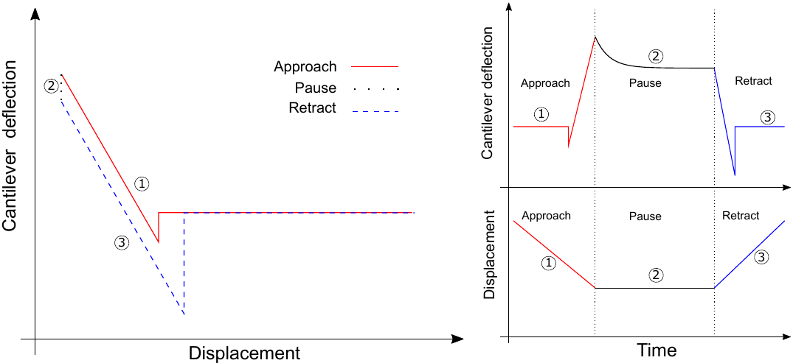

::: article
# Introduction

In the last thirty years, atomic force microscopy (AFM) has become a
necessary surface analytical tool for life and materials
scientists [@Muller2008; @Kainz2014]. AFM offers the possibility to
investigate molecular topographies and dynamical processes at (sub)
nanometer scale as a function of
time [@Hansma1996; @Ortega-Vinuesa1998; @Kuznetsov2010; @eletalopez2010].

In addition, the AFM is a mechanical machine being able to measure
forces between molecules, particles or
surfaces [@Hinterdorfer1996; @Butt2005; @Borkovec2012]. It can also be
used to measure mechanical properties of biomaterials, either indenting
or stretching
them [@Rief1997; @Marszalek1999; @Alcaraz2003; @Best200387; @Kasas2008; @Garcia-Manyes2010; @Benitez2014; @Melzak2015].

One problem that the researcher faces while performing force-distance
(F-d) curves is the handling and the interpretation of the amount of
data. For example, for determining the unbinding force between two
molecules, hundreds of curves might be needed. Therefore, adaptive and
flexible software routines are necessary to export, analyze and organize
the measured data before starting the physical data interpretation.
Several authors have addressed this type of problem before, proposing
algorithms to F-d curve
signals [@MRT2013; @Kasas2000; @Andreopoulos2011; @Crick2007; @Lin2007].
However, these works focused mostly on contact point detection, adhesion
energy quantification, or unfolding events. Here we present a set of
functions bundled in a package of R statistical software that offer a
compact analysis of the whole F-d curve.

## Force -- distance curve parts

In force-distance experiments, an AFM-tip or a colloidal probe
(see @Ducker1991) is extended towards and retracted from the sample at
speeds that may vary between a few nm/s and dozens of $\mu$m/s. While
performing the F-d experiment, the deflection of the cantilever is
quantified as a function of the displacement of the
piezo-scanner [@Moreno-Flores2013]. Thus, the force sensed by the
cantilever is calculated by multiplying its deflection by its spring
constant (Hooke's law), which must be evaluated in every experiment. A
general F-d curve (or force-time curve) can be divided in three parts:
move towards the sample, contact with the sample and separation from the
sample. Every part of the curve contains valuable and different
information about the sample of study. The first one delivers
information about repulsive, attractive or structural forces between the
tip/colloidal probe and the sample (e.g. electrostatic, van der Waals,
hydration, entropic, etc.). The second part of the curve corresponds to
the so-called contact regime, that is, when the cantilever is touching
(compressing) the sample. This part of the curve provides information
about the mechanical properties of the sample (i.e. Young's modulus,
relaxation time and viscosity of cells or hydrogels). Finally, the
separation curve contains information about adhesion or rupture forces
(i.e. ligand-receptor interactions), the existence of tethers, and
possible molecular unfolding events (i.e. mechanical unfolding of
polymers).

However, the operating way of the piezo-electric does not follow this
segmentation. The piezo-electric distinguishes three movements:
approach, pause and retract (see Figure [1](#fig:F-d-curve)). In this
way, the F-d raw data that can be acquired from the AFM is structured in
these three parts. Indeed, it does not know where the contact point is
located (zero distance between tip and sample).

<figure id="fig:F-d-curve">

<figcaption>Figure 1: F-d curve. Left: Schematic representation of a
typical Force-distance curve. Right (above and below): Schematic
representation of a typical Force-time at constant height.</figcaption>
</figure>

Therefore, it is necessary to extract all above mentioned physically
relevant information from the F-d raw data as it is given by the device.

# The *afmToolkit* package {#sec:installation}

In this article we introduce the
[*afmToolkit*](https://CRAN.R-project.org/package=afmToolkit) package
whose aim is to automate certain operations and calculations that are
normally done routinely on the F-d curves.

Package *afmToolkit* is available in CRAN and can be installed via the
command `install.package`. Nevertheless, the development version of the
package of *afmToolkit* is also stored in the github platform
([github.com](github.com){.uri}) and it can be installed directly from
the `R` console using the `install_github` function from package
[*devtools*](https://CRAN.R-project.org/package=devtools) [@devtools-2017-36].

``` r
> install.packages("devtools") % chktex 8
> library("devtools")  % chktex 8
> install_github("rbensua/afmToolkit")
> library(afmToolkit)
```

The package depends on the
[*ggplot2*](https://CRAN.R-project.org/package=ggplot2)
package [@ggplot2-2017-36] and uses functions from the non-standard
packages
[*minpack.lm*](https://CRAN.R-project.org/package=minpack.lm), [@minpack.lm],
[*gridExtra*](https://CRAN.R-project.org/package=gridExtra) [@gridExtra],
[*scales*](https://CRAN.R-project.org/package=scales) [@scales] and
[*dplyr*](https://CRAN.R-project.org/package=dplyr) [@dplyr-2017-36].

## The `"afmdata"` class

The basic data structure for AFM F-d curves analysis with the
*afmToolkit* package is the `"afmdata"` class. It is an S3 class
consisting on a list having at least the fields `data` and `params` (see
Figure [2](#fig:afmdata)).

{#fig:afmdata width="100%" alt="graphic without alt text"}

The field `data` is a data frame containing the data itself. The columns
are `Z`, for the distance, `Force` and `segment`, being the later a
factor with levels `approach`, `pause` and/or `retract`, denoting which
part of the force -- distance curve each data belongs to. In some cases
also a `Time` column could be present.

Eventually the number of columns of the `data` data frame may be
increased, as different analysis are performed. For example, once the
baseline correction is done, a new column `ForceCorrected` is added.

The `params` field is a list containing different parameters gathering
information about the experiment (e.g. the cantilever spring constant,
the ID of the curve, etc.).

As further analyses are performed, the results are added as new fields
to the `"afmdata"` list. Therefore, the `"afmdata"` list will eventually
contain, in a single data structure, the whole F-d curve relevant
information.

## Importing data

Although the `"afmdata"` class definition function is flexible enough to
create an `"afmdata"` structure from a data frame directly, it is
usually more convenient, in order to speed up the work flow, to import
the data from a file obtained directly from the AFM device used.

At the moment, there are only available two functions for importing F-d
curves: `afmReadJPK` and `afmReadVeeco`, which import NanoWizard JPK and
Veeco (Bruker) data files, respectively, provided they had previously
been exported as ASCII files.

#### Importing data from JPK^TM^ ASCII files:

In the first case, a full AFM experiment is stored in a single text file
in which the different segments of the experiment (approach, contact or
pause, and retract) are separated by a header (see
Figure [3](#fig:asciifile)-Left).

{#fig:asciifile width="100%" alt="graphic without alt text"}

The function finds out how many headers the file contains (up to three
headers), which columns contain the relevant information: distance,
force and time (if available), and it also looks for the spring constant
in the header and stores it in the `params` field. The ID (curvename) of
the experiment will be the name of the ASCII file (by default).

The *afmToolkit* has two JPK text example files: `force-save-JPK-2h.txt`
and `force-save-JPK-3h.txt`, with two and three segments, respectively.
Let's see an example.

``` r
> data <- afmReadJPK("force-save-JPK-2h.txt.gz",
                      path = path.package("afmToolkit"))
JPK file force-save-JPK-2h.txt loaded. 2 headers found.
```

Once it is loaded we can check the structure of the new `"afmdata"`
variable created.

``` r
> str(data)

List of 2
 $ data  :'data.frame':	1227 obs. of  4 variables:
  ..$ Z      : num [1:1227] 6.48e-06 6.48e-06 6.48e-06 6.48e-06 ...
  ..$ Force  : num [1:1227] -1.71e-08 -1.70e-08 -1.71e-08 -1.71 ...
  ..$ Time   : num [1:1227] 0.000244 0.000732 0.001221 0.001709 ...
  ..$ Segment: Factor w/ 2 levels "approach","retract": 1 1 1 1 ...
 $ params:List of 2
  ..$ SpringConstant: num 0.16
  ..$ curvename     : chr "force-save-JPK-2h.txt"
 - attr(*, "class")= chr "afmdata"
```

From the output we can see that there are two fields in the `"afmdata"`
structure: the `data` field, and the `params` field.

We can easily plot the whole experiment using the available plotting
S3-method `plot.afmdata`, which makes use of the *ggplot2* package.

``` r
> plot(data)
```

The result is depicted in Figure [4](#fig:plotafm).

{#fig:plotafm width="100%" alt="graphic without alt text"}

Note that the `afmReadJPK` function automatically determines the number
of segments from the number of headers present in the ASCII file.
However it does not find out from the headers which segment is each one
of them. That is, if `afmReadJPK` finds only one header, it will assume
that the file contains only an approach segment. If two headers are
detected, it will be assumed that the first one is the approach and the
second is the retract segment. Finally, if three headers are found, they
will be assigned to the approach, pause and retract, respectively. At
this moment no more than three segments per file are supported.

#### Importing data from Veeco^TM^ ASCII files:

A Veeco ASCII file is, in comparison, simpler than the JPK file. It
contains a single header with the details of the parameters of the AFM
experiment and the data from each part of the experiment (approach or
extend, and retract) are stored on separated columns (see
Figure [3](#fig:asciifile)-right).

The `afmReadVeeco` function reads the data file and creates an
`"afmdata"` structure separating the different parts of the experiment
obtained from their corresponding columns in the file.

The syntax for importing a Veeco file is very similar to the one of the
JPK file.

``` r
> dataVeeco <- afmReadVeeco("veeco_file.txt",
                             path = path.package("afmToolkit"))
Veeco file veeco_file.txt loaded.
```

## Contact point and detach point determination

#### Contact point:

The first, and probably the most important step in the AFM F-d curve
analysis is the determination of the contact point. We define such point
as the location in the approach segment of the F-d curve where the
deflection of the cantilever is, for the first time, significantly
higher than the baseline average slope. It should be noted that we are
using here the term "contact point" in a broad sense, since there is no
necessity for a real contact between the tip and the sample to take
place, but we are rather considering the contact point as the point at
which the interactions between the sample and the tip start to appear.
Such interactions could be caused by an actual contact between tip and
sample, or they could be the response to a repulsive force or even a
"jump to contact" attractive interaction.

Lots of different approaches to the determination of the contact point
have already been made
[@Lin2007; @Lin2007b; @Rudoy2010; @MRT2013; @Gavara2016]. Function
`afmContactPoint` estimates the contact point using the algorithm
described in @MRT2013. This method computes, from the F-d signal, a new
$\delta$ signal which is, roughly speaking, the lagged difference
between two values of the slopes of the best lines fitted by a local
linear regression on a rolling window of some predetermined width. High
absolute values of $\delta$ are related to abrupt changes in either the
original F-d curve or its slope. From the $\delta$ signal, the contact
point is obtained using two given thresholds which are multiples of the
$\delta$ signal noise (i.e. standard deviation) in the first part of the
curve (i.e. non-contact part). See @MRT2013 for specific details on the
algorithm.

For example, for the two segments example shown above, we could take the
following parameters:

-   width: Width of the window, given in number of points, in which the
    local regression is performed. We shall set `width = 20`.

-   mul1: Value of the first multiplier used to determine the first
    threshold. It should be small enough to detect the contact point
    accurately (even zero is a possible value). In this case we will set
    `mul1 = 1`.

-   mul2: Value of the second multiplier used to determine the second
    threshold. Its value should be large enough to distinguish the
    contact point from the regular noise of the signal but no so large
    that the contact point remains undetected. We will set this value as
    `mul2 = 10`.

The rest of the parameter will remain in their default values. Then the
following command will detect the contact point and plot it together
with the approach segment of the F-d curve.

``` r
> width <- 20
> mul1 <- 1
> mul2 <- 10
> data <- afmContactPoint(data, width, mul1, mul2)
> plot(data, segment = "approach") +
  geom_vline(xintercept = data$CP$CP, lty = 2)
```

Figure [5](#fig:CPDP)-Left shows the approach segment of the curve
together with the contact point estimation (dashed vertical line). Note
that the contact point is the first point in the approach curve (from
right to left) in which the curve starts to deviate from the baseline.
When there is an attraction force (like in the example) this contact
point is overestimated and, in order to be sure that we are starting the
contact regime in which the tip is indeed contacting the sample, we
should calculate the *zero force point* (see below).

{#fig:CPDP width="100%" alt="graphic without alt text"}

#### Detach point:

The detach point is the point in the retract segment where the tip
finally leaves the sample. It is computed exactly in the same way that
the contact point, but the computations are performed to the retract
part and the curve is traced backwards. The input parameters of function
`afmDetachPoint` are the same than for function `afmContactPoint`. Let
us continue with our example:

``` r
> data <- afmDetachPoint(data, width = 20, mul1 = 1, mul2 = 10)
> plot(data, segment = "retract") +
    geom_vline(xintercept = data$DP$DP, lty = 2)
```

The estimation of the detach point can be seen in
Figure [5](#fig:CPDP)-Right.

## Baseline correction

Once the contact and detach points are found, the baseline calibration
can be carried out. Theoretically, when the tip is far from the sample,
the deflection of the cantilever and therefore the measured force should
be zero. Nevertheless, in most cases there is an offset, or even a drift
that keeps this part of the curve away from the zero value. In order to
fix this behaviour, a baseline correction is done. Such correction is
usually done manually, by selecting the part of the curve which we know
to be away from the sample and then substract to the whole F-d curve,
the least squares fitted line to such selected segment of the curve.

Since we already determined the contact and detach points, we know
exactly when the tip is away from the sample. Function
`afmBaselineCorrection` will perform this calibration automatically.
This function will add a new column called `ForceCorrected` to the
`data` data frame field of the `"afmdata"` class.

``` r
> data <- afmBaselineCorrection(data)
> plot(data)
```

Once the baseline correction is done, futher analyses will only use the
Corrected Force column of the `data` field. For example, the
`plot(data)` command will plot the `"afmdata"` F-d curve with the
calibration already done, as can be observed in
Figure [6](#fig:baseline) where it can be seen that when the tip is away
from the sample, the force is actually zero.

{#fig:baseline
width="100%" alt="graphic without alt text"}

## Zero force point

As we mentioned above, function `afmContactPoint` finds the first point
in the approach segment for which the slope of the curve is
significantly different from the baseline. This usually coincides with
what would be considered the contact point by "eye inspection".
Nevertheless, when there is an attraction force prior to the contact
regime, the point found with function `afmContactPoint` is an
overestimation of the real contact point since it does not distinguish
between attraction and repulsions. Therefore, a new function,
`afmZeroPointSlope`, can be used to find the point after the minimum
which is the intersection between the curve and the baseline (zero force
line).

With the following commands we can obtain the zero force point and the
slope of the F-d curve after that point. The results will be added to
the `data` structure in new field named `Slope`. We finally plot the
curve and both in Figure [7](#fig:zeroFP), the contact point (dashed red
line) and the zero force point (blue dotted line).

{#fig:zeroFP
width="100%" alt="graphic without alt text"}

``` r
> data <- afmZeroPointSlope(data, segment = "approach")
> plot(data, segment = "approach") +
    geom_vline(xintercept = data$CP$CP, col = "red", lty = 2) +
    geom_vline(xintercept = data$Slope$Z0Point, col = "blue", lty = 3)
```

## Young's modulus estimation

One of the most important parameters for determining the mechanical
properties of a sample is the Young's modulus. Obtaining the Young's
modulus from an AFM F-d curve is not straightforward and depends on
several factors. Namely, the spring constant of the cantilever, the
contact area, which largely depends on the tip's geometry and the
Poisson ratio, which depends on the compressibility of the sample. The
typical AFM tip geometries are: spherical (colloidal probes), pyramidal
and conical.

Function `afmYoungModulus` computes the Young's modulus of the sample
from the approach segment fo the force-distance curve. Before it is
called, be aware that the spring constant should be available in the
`params` field of the `"afmdata"` structure and both, the baseline
correction and the zero force point should have been obtained.

Currently, only the two most used geometries are available for this
function: the four-sided pyramidal tip and the paraboloid tip. The
former uses the classical Snedon formulae:

$$\label{eq:Snedon}
F = \frac{E}{1-\nu^2}\frac{\tan\alpha}{\sqrt{2}}\delta^2,   (\#eq:Snedon)$$
being $E$ the Young's modulus, $\nu$ the Poisson ratio, $\alpha$ the
pyramid face angle and $\delta$ the indentation of the tip into the
sample. Parameters $\nu$ and $\alpha$ should be provided ($\nu = 0.5$ is
the default value) and first we will need to determine the tip's
indentation.

The latter uses the Hertz model given by

$$F = \frac{4\sqrt{R}}{3}\frac{E}{1-\nu^2}\delta^{3/2}.$$

The indentation can be obtained substracting to the piezo displacement,
$Z$, the zero force point, $Z_0$ and the deflection of the cantilever,
$$\delta = Z - Z_0 - \frac{F}{\kappa},$$
where $\kappa$ is the cantilever's spring constant. Function
`afmIndentation` computes the indentation and adds it as a new column to
the `data` field of the `"afmdata"` structure. Once the indentation is
calculated, function `afmYoungModulus` computes the Young's modulus by
fitting a straight line to $F$ vs $\delta^2$. From the slope of the line
fitted and (\@ref(eq:Snedon)), $E$ can be obtained and it is added to
the `params` field of the `"afmdata"` variable.

For the example data, using a pyramidal tip with $\alpha =
22\,\deg$ considering an incompressible sample ($\nu = 0.5$), we have

``` r
> data <- afmIndentation(data) # First compute the indentation
> data <- afmYoungModulus(data, thickness = , 5e-9,
                          params = list(alpha = 22))
> data$YoungModulus$YoungModulus
[1] 59730377
```

We have, therefore, obtained a Young's modulus of $E = 59.73$ MPa.

## Exponential decay fit

Another important type of experiment used to obtain viscoelastic
mechanical properties of the sample is the Force relaxation -- Creep
experiment. In these experiments, after reaching the sample, the tip
remains in contact for a predetermined elapsed time. In the Force
relaxation experiment, the height of the AFM's piezo is held constant,
and in presence of a viscoelastic material, an exponential decay in the
force should be observed. On the other hand, in a Creep experiment, the
force remains constant and, as a consequence, it is the height of the
tip what shows an exponential decay behaviour.

The presence of the exponential decays in force and/or in height, can be
explained in terms of the classical linear viscoelastic theory, where
combinations of Maxwell and Voight elements (springs and dahspots) are
used. However they will not be discussed here and we refer the reader
to @Riande99 for a general discussion of linear viscoleasticity
and @Moreno-Flores2010a [@Moreno-Flores2010] for more specific models
used in nanoindentation AFM experiments in cell mechanics problems.

Plainly speaking, each different viscoelastic material in the sample is
characterized by a different relaxation time. Thus, the response Force
vs Time or Z vs Time could be represented by a Prony series of the form
(following the notation of @Moreno-Flores2010a):
$$F(t) = a_0+\sum_{k = 1}^n a_k e^{t/\tau_k},$$
for the Force relaxation experiment, and
$$Z(t) = c_0+\sum_{k = 1}^n c_k e^{x_k t},$$
for the creep experiment.

The afmToolkit can determine the parameters of the above mentioned Prony
series for both types of experiments by fitting the sum of exponential
to the data via a nonlinear least squares Levenberg-Mardquart algorithm
provided by the *minpack.lm* package [@minpack.lm]. Presently, only
either one or two exponentials in the Prony series can be considered.
This can be explained because in typical AFM experiments, there is
usually either an homogenenous material or, for cell mechanics problems,
at least two materials -- cell membrane and cell cytoskeleton -- are
considered.

An important issue when performing nonlinear least square fits is the
election of the initial values for the parameters. Often there is an
extremely high sensitivity to such values, so it is critical to make
good initial guesses. For a general single exponential decay function
$y(t) = a_0+a_1\exp(-t/\tau_1)$, we find that $a_0$ is the horizontal
asymptote, $a_0+a_1$ is the value at $t = 0$ and $\tau_1$ should be of
the same order of magnitude of the total time. In case there is a
two-exponential decay function $y(t) =
a_0+a_1\exp(-t/\tau_1)+a_2\exp(-t/\tau_2)$, $a_0$ is again the
horizontal asymptote, but now $a_0+a_1+a_2$ is the initial value $y(0)$,
so a good initial guess could be setting both parameters $a_1$ and $a_2$
with the same values (i.e. $a_1=a_2=(y(0)-a_0)/2$). For the initial
values of the decay times (or frequencies), a usually good guess is to
set one of them, say $\tau_1$, of the same order of magnitude as the
total time, and then set the second one an order of magnitude smaller
(i.e. $\tau_2 = \tau_1/10$).

Let us see an example. We will need a data file with three segments:
approach, contact and retract.

``` r
> data <- afmReadJPK("force-save-JPK-3h.txt",
                   path = path.package("afmToolkit"))
JPK file force-save-JPK-3h.txt loaded. 3 headers found.
```

Once the data is loaded, we will proceed with the contact and detach
point determination, baseline correction and the zero force point
estimation.

``` r
> data <- afmContactPoint(data, width, mul1, mul2)
> data <- afmDetachPoint(data, width , mul1, mul2)
> data <- afmBaselineCorrection(data)
> data <- afmZeroPointSlope(data, segment = "approach")
```

We may now plot the Force vs Time curve in the contact segment:

``` r
> plot(data, segment = "pause" , vs = "Time")
```

In Figure [8](#fig:forcedecay) it is shown the Force vs. Time curve
together with the values of the magnitudes that will be used to make the
initial guesses for the parameters.

Taking into account the values depicted in Figure [8](#fig:forcedecay),
we shall see two options for the starting values of the fit parameters,
one for the single exponential fit and other for the two exponentials
fit.

{#fig:forcedecay width="100%" alt="graphic without alt text"}

``` r
> data1 <- afmExpDecay(data, nexp = 1, tmax = 7.5,type = "CH",
                      start = c(a0 = 8.2e-7, a1 = 3.35e-7, tau1 = 5))
> data <- afmExpDecay(data, nexp = 2, tmax = 7.5,type = "CH",
                      start = c(a0 = 8.2e-7, a1 = 1.675e-7,
                      a2 = 1.675e-7, tau1 = 5, tau2 = 0.1))
```

The output of this function is another afmdata class variable with an
extra `Expfit` field, which is a list with two fields: `expdecayModel`
and `expdecayFit`, being the former the `nls` class structure resulting
from the `nlsLM` function from package *minpack.lm*, and the latter a
numerical vector containing the exponentially decaying forces estimated
by the fit.

Therefore, the standard `summary` function can be used to extract the
relevant information of the fits:

``` r
> summary(data1$ExpFit$expdecayModel)
> summary(data$ExpFit$expdecayModel)
```

The fits are shown in Figure [9](#fig:exponentialFits). It is seen that
in this case, the double exponential clearly beats the single
exponential fit, but in order to be sure we can check the goodness of
fit data. From the fit summaries shown in Table [1](#tab:fitresults) we
may assert that the double exponential fit performs a better prediction
than the single exponential fit -- the Residual standard error is an
order of magnitude smaller -- while keeping all the parameters
statistically significant, i.e. the standard error of all coefficient
are at least one order of magnitude smaller than the value estimated.

{#fig:exponentialFits width="100%" alt="graphic without alt text"}

::: {#tab:fitresults}
  --------------------------------------------------------------------------------------------------------
                                    Single exponential                                   
  ---------------------------------------------------- ---------- ------------ --------- -----------------
                                                         Estimate   Std. Error   t value   Pr ($>$$|$t$|$)

                                                 $a_0$    8.5e-07      2.3e-10   3.6e+03                 0

                                                 $a_1$    1.8e-07      4.3e-10   4.1e+02                 0

                                              $\tau_1$        1.6       0.0095   1.7e+02                 0

    Residual standard error: 1.232e-08 on 14333 d.o.f.                                   

                                                                                         

                                    Double exponential                                   

                                                         Estimate   Std. Error   t value   Pr ($>$$|$t$|$)

                                                 $a_0$    8.3e-07      3.6e-10   2.3e+03                 0

                                                 $a_1$    1.5e-07      3.5e-10   4.3e+02                 0

                                                 $a_2$    1.4e-07        1e-09   1.3e+02                 0

                                              $\tau_1$        2.6        0.021   1.2e+02                 0

                                              $\tau_2$       0.13       0.0018        71                 0

    Residual standard error: 8.196e-09 on 14331 d.o.f.                                   
  --------------------------------------------------------------------------------------------------------

  : Table 1: Comparison of the single and double exponential fits.
:::

## Adhesion energy

When the cantilever retracts from the sample several events can take
place, depending on the type of experiment. One of the most important
effects that may occur is the adhesion phenomena. In a force
spectroscopy experiment, the adhesion event is usually reflected in the
F-d curve as an hysteresis loop, in which, as a result of the presence
of non-conservative forces, the retract curve is below the approach
curve.

The adhesion energy can be estimated as the area between the retract
force-distance curve and the $Z$-axis from the zero-force point -- in
which it is considered that the tip starts to detach from the sample --
to the point at which there is a jump-from-contact event.

Sometimes, after this jump-from-contact event, some other important
phenomena, like tether formation, can take place before the tip fully
detaches from the sample and the F-d curve finally enters in the
off-contact region.

We can compute these energies by means of the `afmAdhesionEnergy`
function. This function uses an algorithm similar to the contact point
estimation method implemented in the `afmContactPoint` and
`afmDetachPoint` functions. It has as inputs the `width` of the rolling
window in which a best line fit is computed and a multiplier `mul` that
will be used to determine the jumps in the F-d curve that determine the
different adhesion events.

Following the example of the three segment F-d curve, we could easily
find the adhesion energies with the commands

``` r
> data <- afmAdhesionEnergy(data, width = 10, mul = 15)
> data$AdhEner$Points
[1]  68.0 124.5 347.0
> data$AdhEner$Energies
         E1adh        E2adh       Etotal
1 1.142784e-14 1.171835e-15 1.259942e-14
```

The `afmAdhesionEnergy` function appends to the afmdata class `data`
input another field named `AdhEner`, which is a list with two fields:
`Points` and `Energies`. The `Points` field is a vector of length 3
containing the indices of the F-d curve where the three events take
place: the zero-force point (left end), the jump-from contact event
(middle) and the full-detach event point (right end). The `Energies`
field is also a vector of three components containing the adhesion
energy, `E1adh`, computed from the zero-force point to the
jump-from-contact point, the remaining energy, `E2adh`, computed from
the jump-from-contact point to the full-detach event point, and the
total energy `Etotal` which is the sum of these two. Therefore, in this
example, the total adhesion energy is around $1.26\,10^{-14}$ J.

## Summarizing an `"afmdata"` class

After all these analyses have been done to an F-d curve stored in an
`"afmdata"` class, function `summary` can display the most relevant
information about the curve in both, numerical and visual ways.

In order to illustrate a full example, we will first compute the Young's
modulus of the three segments F-d curve example.

``` r
> data <- afmIndentation(data)
> data <- afmYoungModulus(data, thickness = 5e-8,
                          params = list(alpha = 22))
```

Now that all analyses are performed, let us see how the `summary`
function shows us all relevant information.

``` r
> summary(data)
         Estimate   Std. Error    t value Pr(>|t|)
a0   8.295849e-07 3.445595e-10 2407.66801        0
a1   1.497522e-07 3.367846e-10  444.65288        0
a2   1.358410e-07 1.012757e-09  134.12989        0
tau1 2.779792e+00 2.169182e-02  128.14933        0
tau2 1.334409e-01 1.836281e-03   72.66913        0
  # of segments Spring Constant Contact Point Young's Modulus
1             3         52.9146  6.982701e-06       249153289
Zero force pt. Type of Experiment
   6.99318e-06    Constant Height
```

The graphical information provided is depicted in
Figure [10](#fig:summary). Thus, from the plots one can easily know the
number of segments of the F-d curve, the goodness of the exponential
decay fit, the value of the Young's modulus obtained with an Hertz's
contact model and a pyramidal tip, among other useful information.

{#fig:summary width="100%" alt="graphic without alt text"}

# A sample R afmToolkit session for batch processing {#sec:tutorial}

Up to now, we have shown the capabilities of the *afmToolkit* package
for dealing with one F-d curve. However, the usual workflow in AFM force
spectroscopy experiments is to repeat the measures a number of times
that can be very large (even hundreds of repetitions). Therefore it is
absolutely necessary algorithms and methods allowing us to batch-process
all the curves at once.

The *afmToolokit* package can deal with a set of F-d curves stored as
`"afmdata"` class variables and bundled together in one special data
class called `"afmexperiment"`.

An `"afmexperiment"` data class is a list of `"afmdata"` variables.
Almost every function in the *afmToolkit* package first checks for the
input data class. If the input is of `"afmdata"` class, it performs the
analysis for one curve, but if it is an `"afmexperiment"` class
variable, it loops for every `"afmdata"` curve in the list, executing
the function to each individual F-d curve.

Next, we will show as an example, how would it be to deal with several
F-d curves at once. First we will use the `afmReadJPKFolder` function in
order to read all JPK files contained in some folder.

``` r
> dataFolder <- paste(path.package("afmToolkit"),"afmexperiment",sep = "/")
> data <- afmReadJPKFolder(dataFolder)
JPK file force-save-1.txt loaded. 2 headers found.
JPK file force-save-2.txt loaded. 2 headers found.
JPK file force-save-3.txt loaded. 2 headers found.
JPK file force-save-4.txt loaded. 2 headers found.
```

This function will create the `"afmexperiment"` data variable:

``` r
> class(data)
[1] "afmexperiment"
```

As an illustrative example we can make use of the `batchExperiment` data
set available in *afmToolkit*. This data set consists on an
`"afmexperiment"` data class containing 14 F-d curves in `"afmdata"`
format.

``` r
> data(batchExperiment)
```

The 14 curves correspond to two different experiments: the first one is
a sample covered with Polyallylamine hydrochloride ("PAH") (6 curves)
while the second one is covered with Chitosan ("CHI") (8 curves). Such
factor is specified in the `params` field of the `"afmdata"` structure.
For example:

``` r
> str(batchExperiment[[1]]$params)
List of 3
 $ SpringConstant: num 0.102
 $ curvename     : chr "force-save-2016.07.27-16.41.34.558.txt"
 $ type          : chr "PAH"
```

Now, the standard analysis procedure would be:

1.  **Preprocessing the curves**: Contact and detach points detection,
    Baseline correction, Zero force point determination and indentation
    calculus.

    ``` r
    > width <- 50
    > mul1 <- 1
    > mul2 <- 10
    > batchExperiment <- afmContactPoint(batchExperiment, width=width,
                                           mul1 = mul1, mul2 = mul2)
    > batchExperiment <- afmDetachPoint(batchExperiment, width=width,
                                          mul1 = mul1, mul2 = mul2)
    > batchExperiment <- afmBaselineCorrection(batchExperiment)
    > batchExperiment <- afmZeroPointSlope(batchExperiment,
                                            segment = "approach")
    > batchExperiment <- afmIndentation(batchExperiment)
    ```

2.  **Curve analysis.**

    ``` r
    > batchExperiment <- afmYoungModulus(batchExperiment,
                              thickness = 2.5e-7,
                              geometry = "paraboloid",
                              params = list(R = 1e-8))
    > batchExperiment <- afmExpDecay(batchExperiment, nexp = 2,
                              type = "CH", plt = FALSE, tmax = 5)
    > batchExperiment <- afmAdhesionEnergy(batchExperiment,
                              width = 5, mul = 15)
    ```

    After some warning messages due to the `afmExpDecay` function
    telling us that we did not provide some initial values for the
    Levenberg-Mardquart algorithm, we will find that now our
    `"afmexperiment"` structure is a list of 14 `"afmdata"` class
    variables, each one with 8 fields:

    ``` r
    > head(summary(batchExperiment))
                                           Length Class   Mode
    force-save-2016.07.27-16.56.36.140.txt 8      afmdata list
    force-save-2016.07.27-16.57.00.672.txt 8      afmdata list
    force-save-2016.07.27-16.57.25.194.txt 8      afmdata list
    ...
    ```

3.  **Extracting the results:** Once all the analyses are performed, we
    need to extract the information from the `"afmexperiment"` list and
    store it in spreadsheet-like data frames, since they are more
    suitable formats for further analysis or plotting.

    To that aim we use the `afmExtract` function.

    ``` r
    >  parameters <- afmExtract(batchExperiment,
                                params = list("YM", "AE", "ED"),
                                opt.param = "type")
    ```

    The parameter `params` is a list with the parameters we want to
    extract (`YM` stands for "Young's Modulus", `AE` for "Adhesion
    Energies" and `ED` for "Exponential decay"). The parameter
    `opt.param` is an optional parameter with additional information
    that we may want to store in our data frames (like factors
    describing the experiments). In this case we set
    `opt.param = "type"` so we include the information relative to the
    type of experiment ("PAH" or "CHI").

    The result of the `afmExtract` function is a list with two data
    frames. The first one storing the Young's Modulus and the Adhesion
    Energies, and the second one containing the exponential decay
    results (coefficients and standard errors).

4.  **Plotting the results.** Plotting the parameters is now
    straightforward, provided the *dplyr* package for data frame
    manipulation is installed and loaded:

    ``` r
    > library(dplyr)
    > parameters[[1]] %>% ggplot(aes(x = type, y = YM)) +
          geom_boxplot() + ylab("Young's Modulus (Pa)")

    > parameters[[1]] %>% ggplot(aes(x = type, y = Etotal)) +
          geom_boxplot() + ylab("Total Adhesion Energy (J)")

    > parameters[[2]] %>% ggplot(aes(x = type, y = Estimate)) +
          geom_boxplot() + facet_wrap(~parameter, scales = "free")
    ```

    Young's Modulus results are depicted in Figure [11](#fig:Batch)
    (left plot), total Adhesion Energy results in
    Figure [11](#fig:Batch) (right plot), and the different parameter
    estimates for the exponential decays are shown in
    Figure [12](#fig:expbatch).

{#fig:Batch width="100%" alt="graphic without alt text"}

{#fig:expbatch width="100%" alt="graphic without alt text"}

# Conclusions

The R programming language has became in the recent years the *"lingua
franca"* of statistics and data science. The number of users contributed
packages has increased exponentially reaching more 10000 packages.
However, although there are several packages for AFM image processing at
CRAN, up to our knowledge, this is the first R package for force
spectroscopy analysis.

Our goal has been to create a set of functions for the automatic
analysis of force-distance curves while being flexible enough to be
easily extended by adding algorithms that allow easier analysis in more
and more different types of AFM experiments.

For example, in the scope of event detection, the use of wavelets has
proven to be very effective in determining protein folding events
[@garcia2016] or in the detection of jumps in the retract segment of the
curve, that may be associated with the formation of tethers
[@benitez2017]. Thus, new directions in the development of this
*afmToolkit* could be the inclusion of peak detectors.

We sincerely hope that this package will be found useful by the force -
spectroscopy scientists and we are willing to recieve feedback from the
users.

# Acknowledgements

The authors would like to thank Julia Miholich for the testing and
bug-finding and Alberto Cencerrado, Jagoba Iturri and Xavi Garcı́a for
making the measurements.
:::
