::: article
# Introduction

In simple linear regression, it is both straightforward and extremely
useful to plot the regression line. The plot tells you everything you
need to know about the model and what it predicts. It is common to
superimpose this line over a scatter plot of the two variables. A
further refinement is the addition of a confidence band. Thus, in one
plot, the analyst can immediately assess the empirical relationship
between $x$ and $y$ in addition to the relationship estimated by the
model and the uncertainty in that estimate, and also assess how well the
two agree and whether assumptions may be violated.

Multiple regression models address a more complicated question: what is
the relationship between an explanatory variable and the outcome as the
other explanatory variables are held constant? This relationship is just
as important to visualize as the relationship in simple linear
regression, but doing so is not nearly as common in statistical
practice.

As models get more complicated, it becomes more difficult to construct
these sorts of plots. With multiple variables, we cannot simply plot the
observed data, as this does not hold the other variables constant.
Interactions among variables, transformations, and non-linear
relationships all add extra barriers, making it time-consuming for the
analyst to construct these plots. This is unfortunate, however -- as
models grow more complex, there is an even greater need to represent
them with clear illustrations.

In this paper, we aim to eliminate the hurdle of implementation through
the development of a simple interface for visualizing regression models
arising from a wide class of models: linear models, generalized linear
models, robust regression models, additive models, proportional hazards
models, and more. We implement this interface in R and provide it as the
package [*visreg*](https://CRAN.R-project.org/package=visreg), publicly
available from the Comprehensive R Archive Network. The purpose of the
package is to automate the work involved in plotting regression
functions, so that after fitting one of the above types of models, the
analyst can construct attractive and illustrative plots with simple,
one-line function calls. In particular, *visreg* offers several tools
for the visualization of models containing interactions, which are among
the easiest to misinterpret and the hardest to explain.

It is worth noting that there are two distinct goals involved in
plotting regression models: illustrating the fitted model visually and
diagnosing violations of model assumptions through examination of
residuals. The approach taken by *visreg* is to construct a single plot
that simultaneously addresses both goals. This is not a new idea.
Indeed, this project was inspired by the work of Trevor Hastie, Robert
Tibshirani, and Simon Wood, who have convincingly demonstrated the
utility of these types of plots in the context of generalized additive
models [@Hastie1990; @Wood2006].

In particular, *visreg* offers partial residuals, which can be defined
for any regression model and are easily superimposed on visualization
plots. Partial residuals are widely useful in detecting many types of
problems, although several authors have pointed out that they are not
without limitations [@Mallows1986; @Cook1993]. Various extensions and
modifications of partial residuals have been proposed, and there is an
extensive literature on regression diagnostics
[@Belsley1980; @Cook1982]; indeed, many diagnostics are specific to the
type of model [e.g., @Pregibon1981; @Grambsch1994; @Loy2013]. Partial
residuals are a useful, easily generalized idea that can applied to
virtually any type of model although it is certainly worth being aware
of other types of diagnostics that are specific to the modeling
framework in question.

There are a number of R packages that offer functions for visualizing
regression models, including
[*rms*](https://CRAN.R-project.org/package=rms) [@Harrell2015],
[*rockchalk*](https://CRAN.R-project.org/package=rockchalk)
[@rockchalk], [*car*](https://CRAN.R-project.org/package=car)
[@Fox2011], [*effects*](https://CRAN.R-project.org/package=effects)
[@Fox2003], and, in base R, the `termplot` function. The primary
advantage of *visreg* over these alternatives is that each of them is
specific to visualizing a certain class of model, usually `lm` or `glm`.
*visreg*, by virtue of its object-oriented approach, works with any
model that provides a `predict` method -- meaning that it can be used
with hundreds of different R packages as well as user-defined model
classes. We also feel that *visreg* offers a simpler interface and
produces nicer-looking plots, but admit that beauty is in the eye of the
beholder. Nevertheless, there are situations in which each of these
packages are very useful and offer some features that others do not,
such as greater flexibility for other types of residuals (*car*) and
better support for visualizing three-way interactions (*effects*).

Each type of model has different mathematical details. All models,
however, describe how the response is expected to vary as a function of
the explanatory variables. In R, this is implemented for an extensive
catalog of models that provide an associated `predict` method. Although
there are no explicit rules forcing programmers to write `predict`
methods for a given class in a consistent manner, there is a widely
agreed-upon convention to follow the general syntax of `predict.lm`. It
is this abstraction upon which *visreg* is based: the use of
object-oriented programming to provide a single tool with a consistent
interface for the convenient visualization of a wide array of models.

There are thousands of R packages, many of which provide an
implementation of some type of model. It is impossible for any
programmer or team of programmers to write an R package that is familiar
with the details of all of them. However, the encapsulation and
abstraction offered by an object-oriented programming language allow for
an elegant solution to this problem. By passing a fitted model object to
*visreg*, we can call the `predict` method provided by that model class
to obtain appropriate predictions and standard errors without needing to
know any of the details concerning how those calculations work for that
type of model; the same applies to construction of residuals through the
`residual` method.

The only other R package that we are aware of that provides this kind of
object-oriented flexibility is
[*plotmo*](https://CRAN.R-project.org/package=plotmo) by Stephen
Milborrow. The *visreg* and *plotmo* projects were each started
independently around the year 2011 and have developed into mature,
widely used packages for model visualization. The organization and
syntax of the packages is quite different, but both are based on the
idea of using the generic `predict` and `residuals` methods provided by
a model class to offer a single interface capable of visualizing
virtually any type of model. The primary difference between the two
packages is that *plotmo* separates the visualization of models and the
plotting of residuals, constructed using the `plotmo()` and `plotres()`
functions, respectively, while as mentioned earlier, *visreg* combines
the two into a single plot (*plotmo* offers an option to superimpose the
unadjusted response onto a plot, but this is very different from
plotting partial residuals). Furthermore, as one would expect, each
package offers a few options that the other does not. For example,
*plotmo* offers the ability to construct partial dependence plots
[@Hastie2009], while *visreg* offers options for contrast plots and what
we call "cross-sectional" plots (Figs. [6](#Fig:in1a),
[7](#Fig:in1a-gg), and [8](#Fig:in1b)). Broadly speaking, *plotmo* is
somewhat more oriented towards machine learning-type models, while
*visreg* is more oriented towards regression models, though both
packages can be used for either purpose. In particular, *plotmo*
supports the `X, y` syntax used by packages like `glmnet`, which is more
popular among machine learning packages, while *visreg* focuses
exclusively on models that use a formula-based interface.

The outline of the paper is as follows. In "Conditional and contrast
plots", we explicitly define the relevant mathematical details for what
appears in *visreg*'s plots. The remainder of the article is devoted to
illustrating the interface and results produced by the software in three
extensions of simple linear regression: multiple (additive) linear
regression models, models that possess interactions, and finally, other
sorts of models, such as generalized linear models, proportional hazards
models, random effect models, random forests, etc.

# Conditional and contrast plots

We begin by considering regression models, where all types of *visreg*
plots are well-developed and clearly defined. At the end of this
section, we describe how these ideas can be extended generically to any
model capable of making predictions.

In a regression model, the relationship between the outcome and the
explanatory variables is expressed in terms of a linear predictor
$\eta$:
$$\begin{aligned}
\label{eq:linear-predictor}\boldsymbol{\eta}=\mathbf{X}\boldsymbol{\beta}=\sum_j \mathbf{x}_j\beta_j,
\end{aligned}   (\#eq:linear-predictor)$$
where $\mathbf{x}_j$ is the $j$th column of the design matrix
$\mathbf{X}$. For the sake of clarity, we focus in this section on
linear regression, in which the expected value of the outcome
$\mathbb{E}(Y_i)$ equals $\eta_i$; extensions to other, nonlinear models
are discussed in "Other models". In the absence of interactions (see
"Linear models with interactions"), the relationship between $X_j$ and
$Y$ is neatly summarized by $\beta_j$, which expresses the amount by
which the expected value of $Y$ changes given a one-unit change in
$X_j$.

Partial residuals are a natural multiple regression analog to plotting
the observed $x$ and $y$ in simple linear regression. Partial residuals
were developed by @Ezekiel1924, rediscovered by @Larsen1972, and have
been discussed in numerous papers and textbooks ever since
[@Wood1973; @Atkinson1982; @Kutner2004]. Letting $\mathbf{r}$ denote the
vector of residuals for a given model fit, the partial residuals
belonging to variable $j$ are defined as
$$\begin{aligned}
\label{eq:partial}\mathbf{r}_j 
 &= \mathbf{y}- \mathbf{X}_{-j}\widehat{\boldsymbol{\beta}}_{-j}\\
 &= \mathbf{r}+ \mathbf{x}_j\widehat{\boldsymbol{\beta}}_j,
\end{aligned}   (\#eq:partial)$$
where the $-j$ subscript refers to the portion of $\mathbf{X}$ or
$\boldsymbol{\beta}$ that remains after the $j$th column/element is
removed.

The reason partial residuals are a natural extension to the multiple
regression setting is that the slope of the simple linear regression of
$\mathbf{r}_j$ on $\mathbf{x}_j$ is equal to the value
$\widehat{\boldsymbol{\beta}}_j$ that we obtain from the multiple
regression model [@Larsen1972].

Thus, it would seem straightforward to visualize the relationship
between $X_j$ and $Y$ by plotting a line with slope $\beta_j$ through
the partial residuals. Clearly, however, we may add any constant to the
line and to $\mathbf{r}_j$ and the above result would still hold. Nor is
it obvious how the confidence bands should be calculated.

We consider asking two subtly different questions about the relationship
between $X_j$ and $Y$:

-   What is the relationship between $\mathbb{E}(Y)$ and $X_j$ given
    $\mathbf{x}_{-j}=\mathbf{x}_{-j}^*$?

-   How do changes in $X_j$ relative to a reference value $x_j^*$ affect
    $\mathbb{E}(Y)$?

The biggest difference between the two questions is that the first
requires specification of some $\mathbf{x}_{-j}^*$, whereas the second
does not. The reward for specifying $\mathbf{x}_{-j}^*$ is that specific
values for the predicted $\mathbb{E}(Y)$ may be plotted on the scale of
the original variable $Y$; the latter type of plot can address only
relative changes. Here, we refer to the first type of plot as a
*conditional plot*, and the second type as a *contrast plot*. As we will
see, the two questions produce regression lines with identical slopes,
but with different intercepts and confidence bands. It is worth noting
that these are not the only possible questions; other possibilities,
such as "What is the marginal relationship between $X_j$ and $Y$,
integrating over $\mathbf{X}_{-j}$?" exist, although we do not explore
them here.

For a contrast plot, we consider the effect of changing $X_j$ away from
an arbitrary point $x_j^*$; the choice of $x_j^*$ thereby determines the
intercept, as the line by definition passes through $(x_j^*,0)$. The
equation of this line is $y=(x-x_j^*)\widehat{\beta}_j$. For a
continuous $X_j$, we set $x_j^*$ equal to $\bar{x}_j$. The confidence
interval at the point $x_j=x$ is based on
$$\begin{aligned}
V(x)=\mathbb{V}\left\{\hat{\eta}(x)-\hat{\eta}(x_j^*)\right\}=(x-x_j^*)^2\mathbb{V}(\widehat{\beta}_j).
\end{aligned}$$
When $X_j$ is categorical, we plot differences between each level of the
factor and the reference category (see Figure [3](#Fig:cat) for an
example); in this case, we are literally plotting contrasts in the
classical ANOVA sense of the term (hence the name). Our usage of the
term "contrast" for continuous variables is somewhat looser, but still
logical in the sense that it estimates the contrast between a value of
$X_j$ and the reference value.

For a conditional plot, on the other hand, all explanatory variables are
fully specified by $x$ and $\mathbf{x}_{-j}^*$. Let $\lambda(x)^T$
denote the row of the design matrix that would be constructed from
$x_j=x$ and $\mathbf{x}_{-j}^*$. Then the equation of the line is
$y=\lambda(x)^T\widehat{\boldsymbol{\beta}}$ and the confidence interval
at $x$ is based on
$$\begin{aligned}
V(x)=\mathbb{V}\left\{\lambda(x)^T\widehat{\boldsymbol{\beta}}\right\}=\lambda(x)^T\mathbb{V}(\widehat{\boldsymbol{\beta}})\lambda(x).
\end{aligned}$$

In both conditional and contrast plots, the confidence interval at $x$
is then formed around the estimate in the usual manner by adding and
subtracting $t_{n-p,1-\alpha/2}\sqrt{V(x)}$, where $t_{n-p,1-\alpha/2}$
is $1-\alpha/2$ quantile of the $t$ distribution with $n-p$ degrees of
freedom. Examples of contrast plots and conditional plots are given in
Figures [2](#Fig:type) and [3](#Fig:cat). Both plots depict the same
relationship between wind and ozone level as estimated by the same model
(details given in the following section). Note the difference, however,
in the vertical scale and confidence bands. In particular, the
confidence interval for the contrast plot has zero width at $x_j^*$; all
other things remaining the same, if we do not change $X_j$, we can say
with certainty that $\mathbb{E}(Y)$ will not change either. There is
still uncertainty, however, regarding the actual value of
$\mathbb{E}(Y)$, which is illustrated in the fact that the confidence
interval of the conditional plot has positive width everywhere.

This description of confidence intervals focuses on Wald-type confidence
intervals of the form of estimate $\pm$ multiple of the standard error,
constructed on the scale of the linear predictor. This is the most
common type of interval provided by modeling packages in R, and the only
one for which a widely agreed-upon, object-oriented consensus has
emerged in terms of what the `predict` method returns. For this reason,
this is usually the only type of interval available for plotting by
*visreg*. However, it should be noted that these intervals are common
for their convenience, not due to superiority; it is typically the case
that more accurate confidence intervals exist [see, for example,
@Efron1987; @Withers2012]. In principle, one could plot other types of
intervals, but *visreg* does not calculate intervals itself so much as
plot the intervals that the modeling package returns. Thus, unless the
modeling package provides methods for calculating other types of
intervals, *visreg* is restricted to plotting Wald intervals.

Contrast plots can only be constructed for regression-based models, as
they explicitly require an additive decomposition in terms of a design
matrix and coefficients. Conditional plots, however, can be constructed
for any model that produces predictions. Denote this prediction
$f(\mathbf{x})$, where $\mathbf{x}$ is a vector of predictors for the
model. Writing this as a one-dimensional function of predictor $j$ with
the remaining predictors fixed at $\mathbf{x}_{-j}^*$, let us express
this prediction as $f(x|\mathbf{x}_{-j}^*)$. In a conditional plot, the
partial residuals for predictor $j$ are
$$\begin{aligned}
\mathbf{r}_j&=\mathbf{r}+ x_j\widehat{\beta}_j + \mathbf{x}_{-j}^*\widehat{\boldsymbol{\beta}}_{-j}\\
        &=\mathbf{r}+ f(x|\mathbf{x}_{-j}^*),
\end{aligned}$$
which offers a clear procedure for constructing the equivalent of
partial residual for general prediction models. Note that this
construction requires the model class to implement a `residuals` method.
If a model class lacks a `residuals` method, *visreg* will still produce
a plot, but must omit the partial residuals; see "Non-regression models"
for additional details. Likewise, *visreg* requires the `predict` method
for the model class to return standard errors in order to plot
confidence intervals; see "Hierarchical and random effect models" for an
example in which standard errors are not returned.

It is worth mentioning that *visreg* is only concerned with confidence
bands for the conditional mean $\mathbb{E}(Y|\mathbf{X})$, not
"prediction intervals" that have a specified probability of containing a
future outcome $Y$ observed for a certain value of $\mathbf{X}$. Unlike
standard errors for the mean, very few model classes in R offer methods
for calculating such intervals -- indeed, such intervals are often not
well-defined outside of classical linear models.

# Additive linear models

We are now ready to describe the basic framework and usage of *visreg*.
In this section, we will fit various models to a data set involving the
relationship between air quality (in terms of ozone concentration) and
various aspects of weather in the standard R data set `airquality`.

## Basic framework

The basic interface to the package is the function *visreg*, which
requires only one argument: the fitted model object. So, for example,
the following code produces Figure [1](#Fig:basic):

``` r
  fit <- lm(Ozone ~ Solar.R + Wind + Temp, data=airquality)
  visreg(fit)
```

<figure id="Fig:basic">
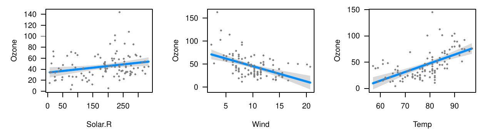
<figcaption>Figure 1: Basic output of <em>visreg</em> for an additive
linear model: conditional plots for each explanatory variable.<span
id="Fig:basic" label="Fig:basic"></span></figcaption>
</figure>

By default, *visreg* provides conditional plots for each of the
explanatory variables in the model. For the conditioning, the other
variables in $\mathbf{x}_{-j}^*$ are set to their median for numeric
variables and to the most common category for factors. All of these
options can be modified by passing additional arguments to visreg. For
example, contrast plots can be obtained with the `type` argument; the
following code produces Figure [2](#Fig:type).

``` r
  visreg(fit, "Wind", type="contrast")
  visreg(fit, "Wind", type="conditional")
```

The second argument specifies the explanatory variable to be visualized;
note that the right plot in Figure [2](#Fig:type) is the same as the
middle plot in Figure [1](#Fig:basic).

<figure id="Fig:type">
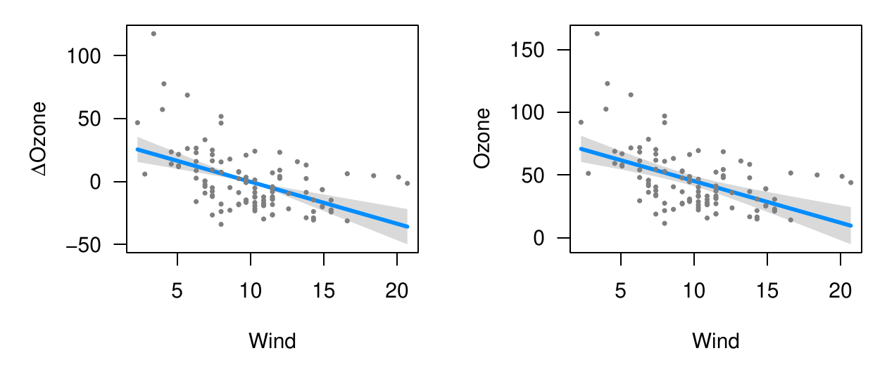
<figcaption>Figure 2: The estimated relationship between wind and ozone
concentration in the same model, as illustrated by two different types
of plots. Left: Contrast plot. Right: Conditional plot.<span
id="Fig:type" label="Fig:type"></span></figcaption>
</figure>

In addition to continuous explanatory variables, *visreg* also allows
the easy visualization of differences between the levels of categorical
variables (factors). The following block of code creates a factor called
`Heat` by discretizing `Temp`, and then visualizes its relationship with
`Ozone`, producing the plot in Figure [3](#Fig:cat).

``` r
  airquality$Heat <- cut(airquality$Temp, 3, labels=c("Cool", "Mild", "Hot"))
  fit.heat <- lm(Ozone ~ Solar.R + Wind + Heat, data=airquality)
  visreg(fit.heat, "Heat", type="contrast")
  visreg(fit.heat, "Heat", type="conditional")
```

<figure id="Fig:cat">
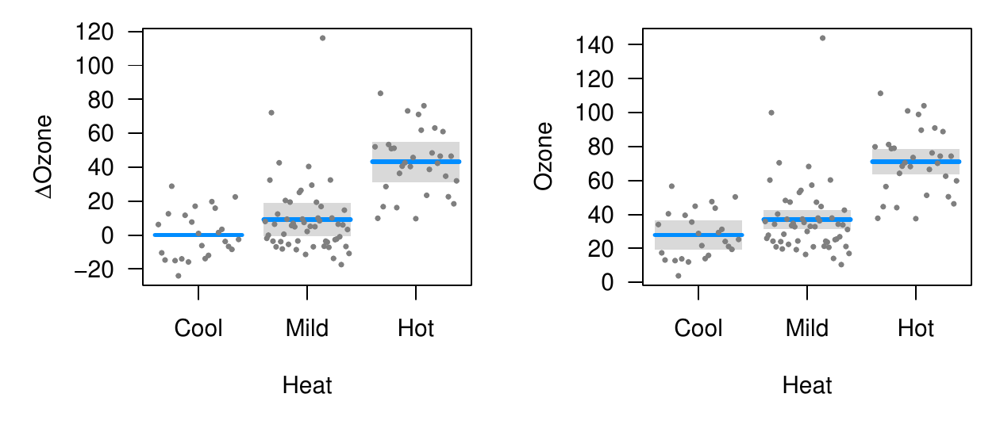
<figcaption>Figure 3: Visualization of a regression function involving a
categorical explanatory variable. Left: Contrast plot. Right:
Conditional plot.<span id="Fig:cat" label="Fig:cat"></span></figcaption>
</figure>

Again, note that the confidence interval for the contrast plot has zero
width for the reference category. There is no uncertainty about how the
expected value of ozone will change if we remain at the same level of
`Heat`; it is zero by definition. On the other hand, the width of the
confidence interval for `Mild` heat is wider for the contrast plot than
it is for the conditional plot. There is less uncertainty about the
expected value of ozone on a mild day than there is about the difference
in expected values between mild and cool days.

## Transformations

Often in modeling, we introduce transformations of explanatory
variables, transformations of the response variable, or both. The
*visreg* package automatically handles these transformations when
visualizing the regression model.

Linear models assume a linear relationship between the explanatory
variables and the outcome. A common way of extending the linear model is
to introduce transformations of the original explanatory variables. For
example, to allow the effect of wind on ozone to be nonlinear, we may
introduce a quadratic term for wind into the model:

``` r
  fit1 <- lm(Ozone ~ Solar.R + Wind + I(Wind^2) + Temp, data=airquality)
```

Transformations of the response are also common. For example, ozone
levels must be positive. However, as Figure [1](#Fig:basic) illustrates,
a standard linear model allows the estimated relationship and its
confidence band to fall below 0. One way of remedying this is to model
the log of ozone concentrations instead of the ozone concentrations
directly:

``` r
  fit2 <- lm(log(Ozone) ~ Solar.R + Wind + Temp, data=airquality)
```

And of course, these elements may be combined:

``` r
  fit3 <- lm(log(Ozone) ~ Solar.R + Wind + I(Wind^2) + Temp, data=airquality)
```

Visualization is particularly important in these models, as it is
difficult to determine the exact nature of the relationship between
explanatory variable and response simply by looking at the regression
coefficients when that relationship is nonlinear. The *visreg* package
provides a convenient way to view such relationships. Transformations
involving explanatory variables are handled automatically, while
transformations involving the response require the user to provide the
inverse transformation. The following code produces
Figure [4](#Fig:trans).

``` r
  visreg(fit1, "Wind")
  visreg(fit2, "Wind", trans=exp, ylab="Ozone", partial=TRUE)
  visreg(fit3, "Wind", trans=exp, ylab="Ozone", partial=TRUE)
```

By default, *visreg* suppresses partial residuals when `trans` is
specified, as this can provide a distorted view of outliers (a mild
outlier can become an extreme outlier once a transformation has been
applied, and vice versa), but we include them here by explicitly
specifying `partial=TRUE`.

<figure id="Fig:trans">
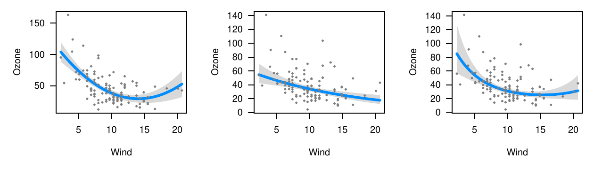
<figcaption>Figure 4: Plots of the modeled relationship between wind and
ozone concentration, as estimated by different models. Left: The model
contains a transformation of wind. Middle: The model contains a
transformation of ozone concentration. Right: The model contains
transformations of both wind and ozone.<span id="Fig:trans"
label="Fig:trans"></span></figcaption>
</figure>

## Conditioning

As noted in "Basic framework", the default behavior of *visreg* when
constructing a conditional plot is to fill in $\mathbf{x}_{-j}^*$ with
the median for continuous variables and the most common category for
categorical variables. This behavior can be modified using the `cond`
argument. Note that this has no bearing on contrast plots in additive
models, which do not require a full specification of
$\mathbf{x}_{-j}^*$.

The `cond` argument must be provided as a named list. Each element of
that list specifies the value for an element of $\mathbf{x}_{-j}^*$; any
elements left unspecified are filled in with the median/most common
category. We revisit our initial model from "Basic framework" with this
code, which produces Figure [5](#Fig:cond).

``` r
  visreg(fit, "Wind", cond=list(Temp=50))
  visreg(fit, "Wind")
  visreg(fit, "Wind", cond=list(Temp=100))
```

<figure id="Fig:cond">
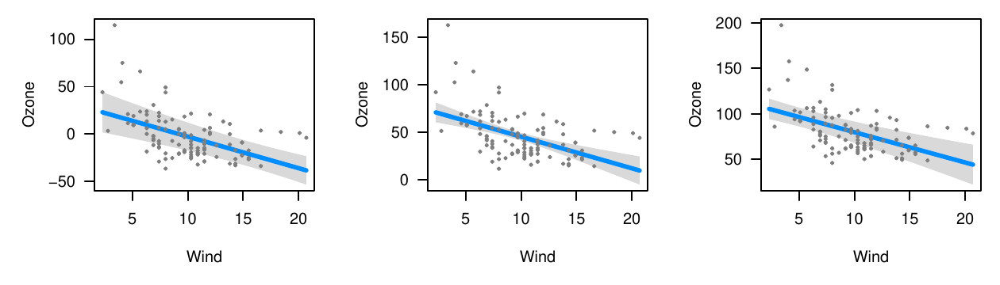
<figcaption>Figure 5: Estimated relationship between wind and ozone
concentration, conditioning on different values of temperature. Left:
Temperature=<span class="math inline">50 <sup>∘</sup>F</span>. Middle:
The median temperature, <span
class="math inline">79 <sup>∘</sup>F</span> (default). Right:
Temperature=<span class="math inline">100 <sup>∘</sup>F</span>.<span
id="Fig:cond" label="Fig:cond"></span></figcaption>
</figure>

We make several observations concerning Figure [5](#Fig:cond): i) The
values on the vertical axis differ; as we condition on higher
temperatures, the expected ozone concentration goes up since the
regression coefficient for temperature is positive. ii) The slope of the
line, the distance from the line to each residual, and the range of the
residuals is the same in all three plots; conditioning on different
values of temperature merely adds a constant to the regression line and
the partial residuals. iii) The width of the confidence band *does*
change, however: the data set has few observations at very high and very
low temperatures, so the standard errors are much larger for the plots
on the right and left than for the plot in the middle. iv) The shape of
the confidence band also changes. In the middle plot, the confidence
band is narrowest in the middle and wider at the ends. In the left plot
(conditioning on low temperature), however, the confidence band is
narrowest for high wind levels. This arises because there is a negative
correlation between wind and temperature ($\hat{\rho}=-0.46$), and thus,
more cold windy days in the data set than cold calm days. The opposite
phenomenon happens in the right plot, where the relative absence of hot
windy days causes the confidence band to be wider for high winds than
for low winds.

Recall that this model had three explanatory variables; in the above
example, *visreg* calculated the conditional response by filling in
solar radiation with its median value, as it was not specified otherwise
in the `cond` argument.

# Linear models with interactions

Visualization is also very important for models with interactions -- as
with polynomial terms, in these models the relationship between an
explanatory variable and the response depends on multiple regression
coefficients, and a model's fit is more readily understood with a visual
representation than by looking at a table of regression coefficients.

For models with interactions, we must simultaneously visualize the
effect of two explanatory variables. The *visreg* package offers two
methods for doing this: cross-sectional plots, which plot
one-dimensional relationships between the response and one predictor for
several values of another predictor, and surface plots, which attempt to
provide a picture of the regression surface over both dimensions
simultaneously.

## Cross-sectional plots

To begin, let's fit a model that involves an interaction between a
continuous term and a categorical term, using our derived variable Heat
from "Basic framework":

``` r
  fit <- lm(Ozone ~ Solar.R + Wind * Heat, data=airquality)
```

The *visreg* package creates cross-sectional plots using, by default,
the [*lattice*](https://CRAN.R-project.org/package=lattice) package
[@Sarkar2008]. To request a cross-sectional plot, the user specifies a
`by` variable, as in the following code which produces
Figure [6](#Fig:in1a).

``` r
  visreg(fit, "Wind", by="Heat")
```

<figure id="Fig:in1a">
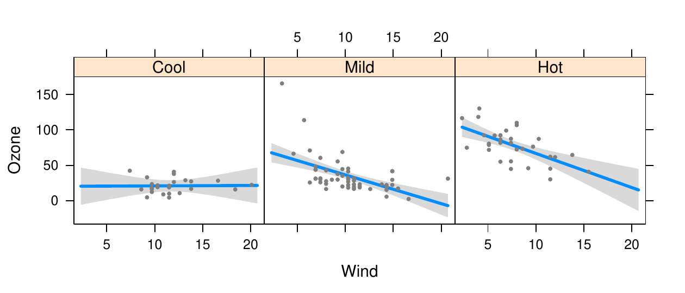
<figcaption>Figure 6: Cross-sectional plots depicting the fit of a model
with an interaction between a continuous term (Wind) and a categorical
term (Heat), with the continuous term on the horizontal axis.<span
id="Fig:in1a" label="Fig:in1a"></span></figcaption>
</figure>

Alternatively, one can use
[*ggplot2*](https://CRAN.R-project.org/package=ggplot2) [@Wickham2009]
as the plotting engine using the option `gg=TRUE`, as in the following
code which produces Figure [7](#Fig:in1a-gg).

``` r
  visreg(fit, "Wind", by="Heat", gg=TRUE)
```

<figure id="Fig:in1a-gg">
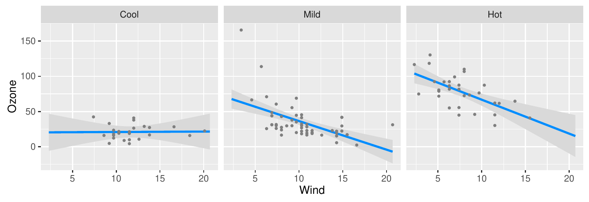
<figcaption>Figure 7: Same as Figure 6, but using <em>ggplot2</em> as the
plotting engine.<span id="Fig:in1a-gg"
label="Fig:in1a-gg"></span></figcaption>
</figure>

The cross-sectional plots in either Figure [6](#Fig:in1a) or
[7](#Fig:in1a-gg) allow us to see that the relationship between wind and
ozone concentration appears to become more pronounced depending on how
hot the day is. On cool days, wind has no effect on ozone concentration.
Wind has a moderate effect on ozone concentrations on mild days, and an
even larger effect on hot days.

Note that *visreg* handles the partial residuals properly -- the partial
residuals for observations collected on cool days appear only in the
left panel, and so on. As with the earlier plots, this ensures that the
least squares line drawn through the residuals on the plot will yield
the same slope as that estimated by the full model fit. Furthermore,
this allows us to see potentially influential observations like the one
in the middle panel, which has very low wind and very high ozone
concentration. Finally, the proper handling of partial residuals also
allows us to observe the lack of hot windy days and cool days with no
wind that we commented on in "Conditioning". Note that the confidence
intervals in these regions are comparatively wide.

Alternatively, we may wish to overlay these cross-sections. This allows
for a more direct comparison between the different regression lines,
although it often becomes difficult to include partial residuals and
confidence bands without crowding the figure. The visreg package allows
an `overlay` option for creating these plots:

``` r
  visreg(fit, "Wind", by="Heat", overlay=TRUE, partial=FALSE)
```

The above code produces Figure [8](#Fig:in1b), where the plotting of
partial residuals has been turned off for the sake of clarity
(similarly, `band=FALSE` can be specified to turn off the confidence
bands). If `partial=TRUE`, the partial residuals are colored according
to the existing scheme.

![Figure 8: Cross-sectional plot depicting the fit of a model with an
interaction between a continuous term (Wind) and a categorical term
(Heat), where the regression lines for each category are
overlaid.[]{#Fig:in1b label="Fig:in1b"}](in1b.png){#Fig:in1b
width="100%" alt="graphic without alt text"}

The above examples featured a continuous variable along the horizontal
axis and a categorical variable as the `by` variable. However, *visreg*
allows each of these variables to be either continuous or categorical.
For example, let us try plotting the same model, but reversing the roles
of Heat and Wind (Figure [9](#Fig:in1c)).

``` r
  visreg(fit, "Heat", by="Wind")
```

The model is the same, but the emphasis of the plot is now on heat
instead of wind. Figure [9](#Fig:in1c) illustrates that heat has a
pronounced effect on ozone concentration when the day is not windy, but
a relatively insignificant effect on ozone for windy days.

<figure id="Fig:in1c">
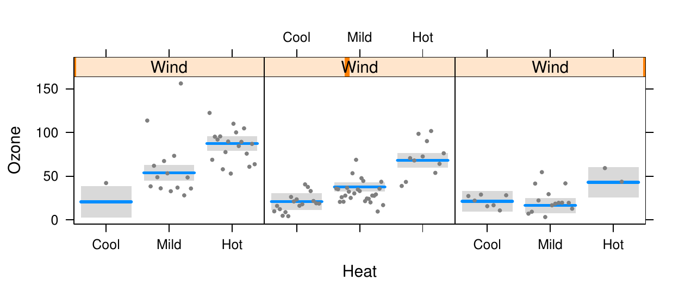
<figcaption>Figure 9: Cross-sectional plots depicting the fit of a model
with an interaction between a continuous term (Wind) and a categorical
term (Heat), with the categorical term on the horizontal axis.<span
id="Fig:in1c" label="Fig:in1c"></span></figcaption>
</figure>

In contrast to Figure [6](#Fig:in1a), where it was natural to construct
a panel for each level of the categorical variable,
Figure [8](#Fig:in1b) requires arbitrary decisions concerning how many
cross-sections to take, and where to place them. The default behavior of
*visreg* is to take cross-sections at the 10th, 50th, and 90th
percentiles of the by variable, although both the number of points and
their location can be modified using the `breaks` option. Again, each
residual appears only once, in the panel it is closest to. However, the
least squares estimates are no longer equivalent to drawing a line
through the partial residuals due to the continuous manner in which
information is pooled across the panels.

We have been focusing here on conditional plots, but contrast plots can
be made as well by specifying `type="contrast"`. It is worth noting that
for a model containing an interaction, a basic call to *visreg* (*i.e.*,
without a `by` argument) amounts to plotting a main effect in the
presence of an interaction. Because this has the potential to be
misleading, *visreg* by default prints a message warning the user of
this and reminding him or her of the levels of the other variables at
which the plot is constructed. For example, since `"Mild"` is the most
common level of `Heat`, `visreg(fit, "Wind")` will produce the middle
panel of Figure [6](#Fig:in1a). The left and right panels, respectively,
could be produced by passing `Heat="Cool"` and `Heat="Hot"` to the
`cond` argument.

## Surface plots

Another approach to visualizing models with interactions is plotting the
regression surface using contour or perspective plots. Suppose we fit a
complicated model involving a multiplicative interaction between
two-degree-of-freedom natural spline terms for wind and temperature (the
function `ns` is from the
[*splines*](https://CRAN.R-project.org/package=splines) package):

``` r
  fit <- lm(Ozone ~ Solar.R +ns(Wind, df=2)*ns(Temp, df=2), data=airquality)
```

Putting aside the question of whether or not this is a good model for
analyzing these data, our purpose here is to show that it is difficult
to grasp the fit of the model by looking at the regression coefficients
directly, but easy to do so using *visreg*. In addition to the tools for
creating cross-sectional plots described in the "Cross-sectional plots",
the *visreg* package provides the function `visreg2d`, which can be used
to produce two-dimensional contour and perspective plots. The following
code produces Figure [10](#Fig:surf):

``` r
  visreg2d(fit, "Wind", "Temp", plot.type="image")
  visreg2d(fit, "Wind", "Temp", plot.type="persp")
```

<figure id="Fig:surf">
<p><span>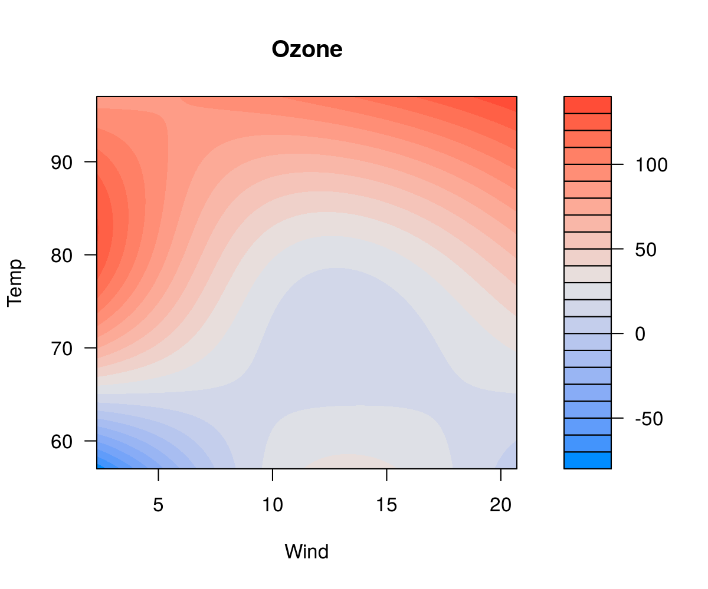</span><span>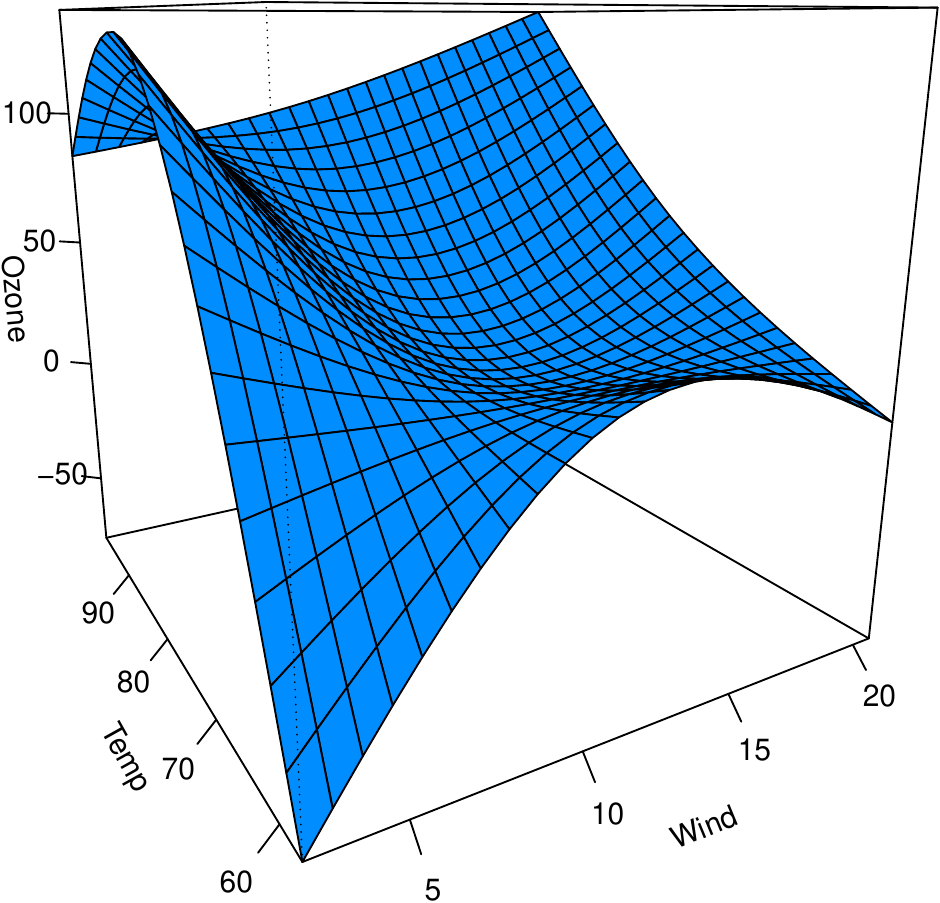</span></p>
<figcaption>Figure 10: Representations of the regression surface as a
function of wind and temperature. Left: Filled contour plot. Right:
Perspective plot.<span id="Fig:surf"
label="Fig:surf"></span></figcaption>
</figure>

The advantage of these kinds of plots compared with those in
"Cross-sectional plots" are that they allow us to visualize the effect
of simultaneously varying two factors. The disadvantage is that there is
no convenient way of superimposing either residuals or confidence
intervals. These plots are most useful when both variables are
continuous, as one is not forced to take cross-sections over a
continuous variable. The `visreg2d` function still functions correctly
when one or both of its arguments is a categorical variable, although in
our opinion, the cross-section plots of "Cross-sectional plots" are more
useful in these settings.

In addition to the static perspective plot presented above, `visreg2d`
can also create interactive perspective plots using the
[*rgl*](https://CRAN.R-project.org/package=rgl) package [@rgl], which
allow the user to rotate, tilt, and spin the regression surface. This
makes it considerably easier to comprehend its three-dimensional shape.
Such plots can be constructed with the code:

``` r
  visreg2d(fit, x="Wind", y="Temp", plot.type="rgl")
```

Visualization of higher-order interactions, such as three-way or
four-way interactions, becomes increasingly difficult. To some extent,
*visreg* facilitates visualization of such models through the use of the
`cond` argument. For example, code such as the following could be used
to visualize a three-way interaction:

``` r
  fit <- lm(Ozone ~ Solar.R * Wind * Temp, data=airquality)
  visreg2d(fit, "Wind", "Temp", cond=list(Solar.R=100))
  visreg2d(fit, "Wind", "Temp", cond=list(Solar.R=300))
```

# Other models

As mentioned at the outset, the goal in creating the *visreg* package
was to implement visualization in an object-oriented manner, so that it
works with as many classes of models from different functions and
packages as possible. All that it requires is functioning `model.frame`
and `predict` methods for the fitted model object (plotting of partial
residuals requires a `residuals` method as well). Thus, the *visreg*
package and all its options work not only with linear model objects
produced by `lm`, but with generalized linear models produced by `glm`,
proportional hazards models produced by `coxph` [@survival], robust
linear models produced by `rlm` [from
[*MASS*](https://CRAN.R-project.org/package=MASS): @Venables2002],
negative binomial models produced by `glm.nb` (from *MASS*), generalized
additive models produced by `gam` [from
[*mgcv*](https://CRAN.R-project.org/package=mgcv): @mgcv], local
regression models produced by `loess` and
[*locfit*](https://CRAN.R-project.org/package=locfit) [@locfit], and
many more. Indeed, the type of object does not even need to be part of
an R package; user-defined model classes can also be visualized with
*visreg*, provided that they are compatible with `model.frame` and
`predict`. In this section, we briefly illustrate the use of *visreg*
with some of the above types of models.

## Generalized linear models

We begin with a logistic regression model applied to a study
investigating risk factors associated with low birth weight
[@Hosmer2000]. The following code produces Figure [11](#Fig:logistic).

``` r
  data("birthwt", package="MASS")
  fit <- glm(low ~ age + race + smoke + lwt, data=birthwt, family="binomial")
  visreg(fit, "lwt", xlab="Mother's weight", ylab="Log odds (low birthweight)")
  visreg(fit, "lwt", scale="response", rug=2, xlab="Mother's weight",
         ylab="P(low birthweight)")
```

<figure id="Fig:logistic">
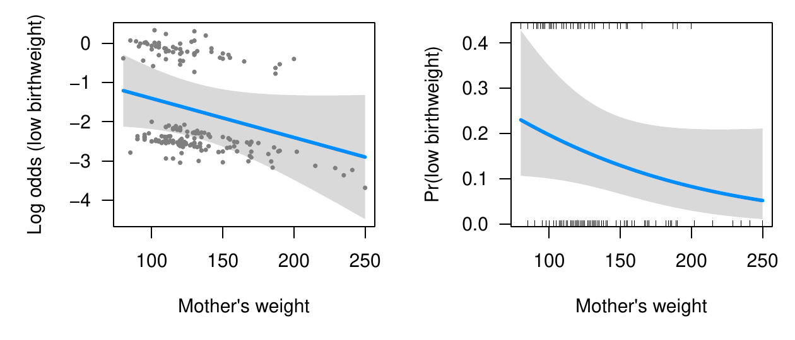
<figcaption>Figure 11: Visualization of a logistic regression model.
Left: Log odds scale. Right: Probability scale.<span id="Fig:logistic"
label="Fig:logistic"></span></figcaption>
</figure>

On the left side of Figure [11](#Fig:logistic), the model is plotted on
the scale of the linear predictor (the default scale in *visreg*), where
the model is indeed linear. The confidence intervals in the figure are
Wald confidence intervals based on standard errors returned by
`predict.glm`. The partial residuals are calculated based on
Equation \@ref(eq:partial), with $\mathbf{r}$ the deviance residuals
(the default residuals returned by `residuals.glm`). The plot on the
right is simply a transformed version of the plot on the left, where an
inverse logistic transformation has been applied to the regression line
and confidence bands (this is handled automatically by the
`scale="response"` option).

Note that for the plot on the right, we have opted to plot a rug as
opposed to the partial residuals. The *visreg* package provides two
types of rug annotations. With `rug=TRUE` or `rug=1`, a standard rug
along the bottom of the plot is provided. With `rug=2`, separate rugs
are drawn on the top for observations with positive residuals and on the
bottom for observations with negative residuals (for logistic
regression, this corresponds to $Y=1$ and $Y=0$, respectively).

In practice, we have found plots like those on the left useful for
visualizing the model fit and observing potential departures from model
assumptions such as outliers and influential points, and plots like
those on the right very useful for communicating modeling results to
non-statisticians.

## Other regression models

Here, we provide a brief demonstration applying *visreg* to some other
types of models (note that these are models for which the *effects*
package is incompatible): a proportional hazards model, a robust
regression model, and a local regression model. The left side of
Figure [12](#Fig:other) presents a visualization of the following
proportional hazards model:

``` r
  require("survival")
  fit <- coxph(Surv(futime, fustat) ~ age + rx, data=ovarian)
  visreg(fit, "age", ylab="log(Hazard ratio)")
```

Note that in proportional hazards models, baseline hazard functions are
not explicitly estimated, and therefore the meaning behind a conditional
plot is questionable. For this reason, contrast plots are (arguably)
more appropriate. A similar phenomenon occurs with logistic regression
applied to case-control studies, in which an intercept is estimated, but
is the estimate is biased by the study design.

<figure id="Fig:other">
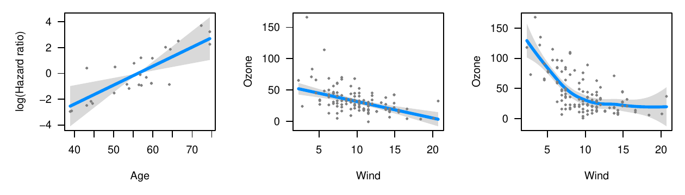
<figcaption>Figure 12: Visualizations of proportional hazards (left),
robust regression (middle), and loess (right) models.<span
id="Fig:other" label="Fig:other"></span></figcaption>
</figure>

The middle of Figure [12](#Fig:other) presents a visualization of the
following robust regression model (using `rlm` from the *MASS* package):

``` r
  fit <- rlm(Ozone ~ Solar.R + Wind * Heat, data=airquality)
  visreg(fit, "Wind", ylab="Ozone")
```

Note that the design matrix for the robust regression model is the same
as that from "Cross-sectional plots", and that the plot in the middle of
Figure [12](#Fig:other) is analogous to the middle panel from
Figure [6](#Fig:in1a). Note, however, that the robust regression model
produces a different fit, due in part to the reduced impact of the
potential outlier mentioned in "Cross-sectional plots". Specifically,
the fit produced by the robust regression model is flatter and does not
predict negative ozone concentrations for high wind levels as the linear
regression model does.

Finally, we apply *visreg* to a local regression model fit with `loess`,
producing a much more useful visualization of the model than the default
`plot` method for `loess`. This plot appears on the right side of
Figure [12](#Fig:other).

``` r
  fit <- loess(Ozone ~ Wind, airquality)
  visreg(fit, "Wind", ylab="Ozone")
```

All of the features and options we mentioned earlier; in particular
cross-section and surface plots work in the same way for nonlinear
models as they do for linear models.

Computationally, the extension of *visreg* to nonlinear models is
straightforward due to its object-oriented implementation, but it is
worth making some comments about partial residuals for nonlinear models.
In particular, it is no longer the case that the regression line through
the partial residuals produces a line with the same slope as that
produced by the model. Viewing nonlinear models as reweighted least
squares models, the observations have different weights and these
weights are not reflected in the partial residuals plotted by *visreg*.
This phenomenon has been commented on by many authors, with a variety of
proposals for alternative types of reweighted partial residuals that may
be better at detecting outliers and influential observations
[@Pregibon1981; @Landwehr1984; @OHaraHines1993].

## Non-regression models

Moving even further from linear models, *visreg* is also compatible with
modeling frameworks that are not even regression-based, such as random
forests and support vector machines. Such methods are often thought of
as "black boxes", but *visreg* offers a convenient way to visualize the
resulting fit and possibly gain some insight into the model. The
following code fits each of the aforementioned models to the airquality
data using the
[*randomForest*](https://CRAN.R-project.org/package=randomForest)
[@randomForest] and [*e1071*](https://CRAN.R-project.org/package=e1071)
[@e1071] packages, and plots the resulting estimated association between
ozone and temperature (Figure [13](#Fig:blackbox1)). Some of these
packages do not automatically handle missing data, so we first create a
complete-case data set `aq`:

``` r
  aq <- na.omit(airquality)
  fit1 <- randomForest(Ozone ~ Solar.R + Wind + Temp, data=aq)
  fit2 <- svm(Ozone ~ Solar.R + Wind + Temp, data=aq)
  visreg(fit1, "Temp", ylab="Ozone", ylim=c(0, 150))
  visreg(fit2, "Temp", ylab="Ozone", ylim=c(0, 150))
```

<figure id="Fig:blackbox1">
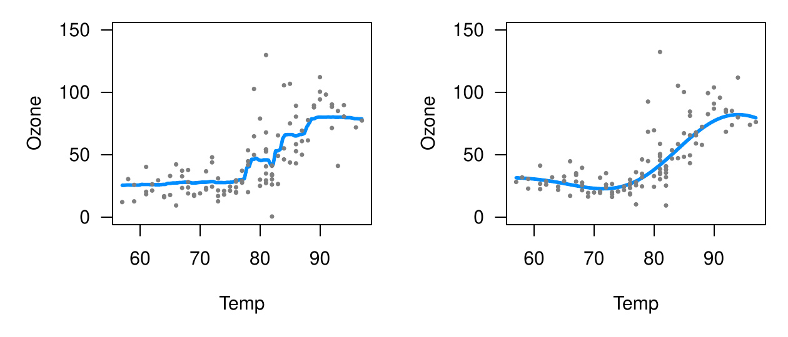
<figcaption>Figure 13: Left: Random forest. Right: Support vector
machine.<span id="Fig:blackbox1"
label="Fig:blackbox1"></span></figcaption>
</figure>

Both of the results in Figure [13](#Fig:blackbox1) appear reasonable
with the default settings employed, although neither of these models is
able to provide confidence bands for fitted values, so no shaded bands
appear. A useful feature of plotting the model's predictions, however,
is that it illustrates the effect of changing those settings. For
example, consider the application of gradient boosting machines to this
same data using the [*gbm*](https://CRAN.R-project.org/package=gbm)
package [@gbm]. First, it is worth noting that the *gbm* package does
not offer a `residuals` method. This would normally cause *visreg* to
omit plotting the partial residuals. However, we can supply our own
user-defined `residuals` method, which enables visreg to produce the
plots in Figure [14](#Fig:blackbox2).

``` r
  residuals.gbm <- function(fit) fit$data$y - fit$fit
  fit3 <- gbm(Ozone ~ Solar.R + Wind + Temp, data=aq)
  fit4 <- gbm(Ozone ~ Solar.R + Wind + Temp, data=aq, n.trees=5000)
  visreg(fit3, "Temp", ylab="Ozone", ylim=c(0, 150))
  visreg(fit4, "Temp", ylab="Ozone", ylim=c(0, 150))
```

<figure id="Fig:blackbox2">
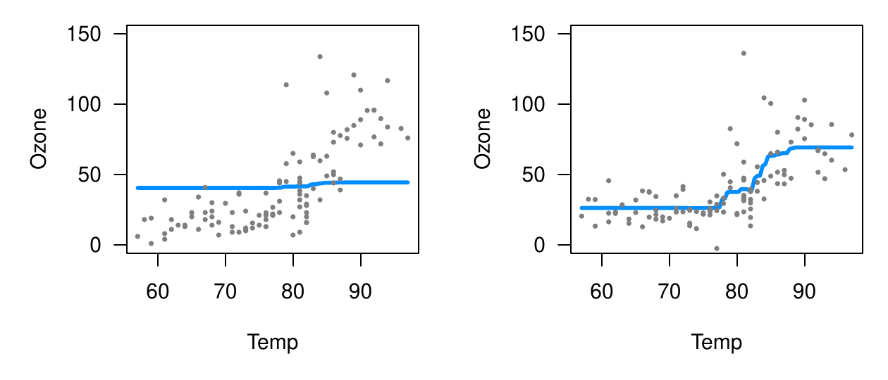
<figcaption>Figure 14: Visualizations of gradient boosting machine.
Left: Default setting (100 trees) Right: 5,000 trees.<span
id="Fig:blackbox2" label="Fig:blackbox2"></span></figcaption>
</figure>

Note that the default settings for *gbm* do not produce a very good fit
here. In particular, the default number of trees (100) is too low to
capture the relationship between temperature and ozone. By increasing
the number of trees (to 5,000), we obtain a much more reasonable fit.

## Hierarchical and random effect models

The ability of *visreg* to visualizing mixed effect models is hindered
by the fact that incorporating uncertainty about random effects into
predictions is difficult from a frequentist perspective and most R
packages for such models do not offer confidence intervals for such
estimates. Nevertheless, *visreg* is still useful for visualizing the
effects of fixed effects in such models using contrast plots, as well as
plotting effects without confidence intervals.

As an illustration, we consider a study involving the protein content of
cows' milk in the weeks following calving [@Diggle2002]. Consider the
following random-intercept, random-slope model, fit using the
[*lme4*](https://CRAN.R-project.org/package=lme4) package [@lme4], which
also contains a fixed effect for the type of diet each cow was fed.

``` r
  data(Milk, package="nlme")
  fit <- lmer(protein ~ Diet + Time + (Time|Cow), Milk)
```

In the *lme4* package, the `predict` method does not return standard
errors. This means that any conditional plots constructed by visreg will
lack confidence intervals, like those in Figures [13](#Fig:blackbox1)
and [14](#Fig:blackbox2). This is another example of a situation where a
contrast plot is useful: by considering the effect of changing diet
while other terms remain constant, the random effects drop out of the
model and standard errors/confidence intervals are straightforward, as
illustrated in Figure [15](#Fig:re1). The following code also
illustrates how to change graphical options, as there is considerable
overplotting of the partial residuals under the default settings.

``` r
  visreg(fit, "Diet", type="contrast", ylab=expression(Delta*'Protein'),
         points.par=list(col="#55555540", cex=0.25))
```

<figure id="Fig:re1">
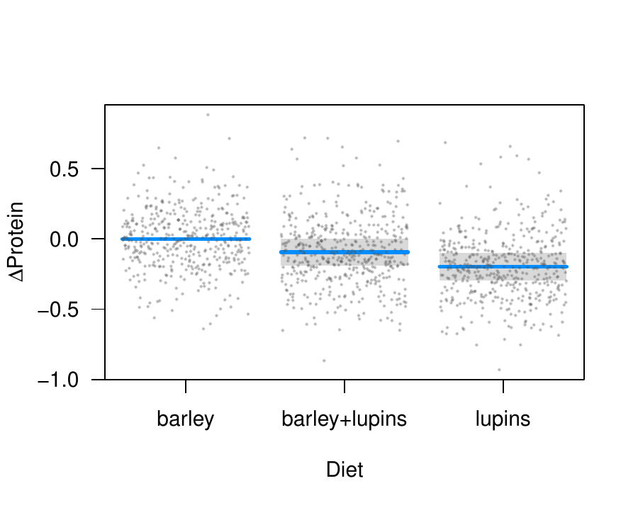
<figcaption>Figure 15: Contrast plot illustrating the fixed effect of
diet in the <code>Milk</code> example.<span id="Fig:re1"
label="Fig:re1"></span></figcaption>
</figure>

The *visreg* package can also be used to plot random effects, although
as mentioned earlier, the plots will not include intervals. Below, we
provide code to plot the modeled relationship between protein content
and time. Two aspects of the code are worth pointing out. First, note
that according to the object-oriented design of *visreg*, the `predict`
method supplied by *lme4* will used. It has its own option, `re.form`,
to control how random effects are used in the prediction, and this must
be passed through *visreg* accordingly. Second, for the sake of space we
subset the plot to ten cows rather than all 79. This can be accomplished
by returning, then subsetting, the raw *visreg* object prior to
plotting. Returning the data frames, estimates, confidence intervals,
and residuals used in the construction of its plots like this allows
users to write their own extensions and modifications of *visreg* plots.

``` r
  v <- visreg(fit, "Time", by="Cow", re.form=~(Time|Cow), plot=FALSE)
  subCow <- sample(Milk$Cow, 10)
  vv <- subset(v, Cow %in% subCow)
  plot(vv, ylab="Protein", layout=c(10,1))
```

<figure id="re2">
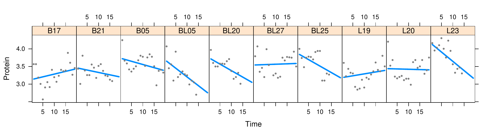
<figcaption>Figure 16: Subject-specific conditional plots for ten
randomly chosen cows from the <code>Milk</code> example illustrating the
change in protein content over time.<span id="re2"
label="re2"></span></figcaption>
</figure>

# Conclusion

Partial residuals and how useful they are in detecting influential
observations and departures from model assumptions depends on the model.
Other types of plots, such as added variable plots [@Atkinson1985], are
also helpful for visualizing regression models and their fit. We feel
that the approach provided by *visreg* is reasonable and the best that
can be expected from an object-oriented tool that can be applied
generically to a wide variety of models, although we certainly
acknowledge that other types of plots and visualizations may offer
useful additional information for certain types of models.

The *visreg* package provides a very useful set of tools for
simultaneously visualizing the estimated relationship between an
explanatory variables and the outcome, the variability of that estimate,
and the observations from which the estimates derive. These tools have a
simple interface and are readily applied in an object-oriented manner to
wide variety of models. We have found the development of this package to
provide a convenient and versatile tool to assist with regression
modeling, both for model exploration and for communicating modeling
results.

More information about *visreg*, illustrating its various options with
numerous examples can be found at <http://pbreheny.github.io/visreg>.
:::
