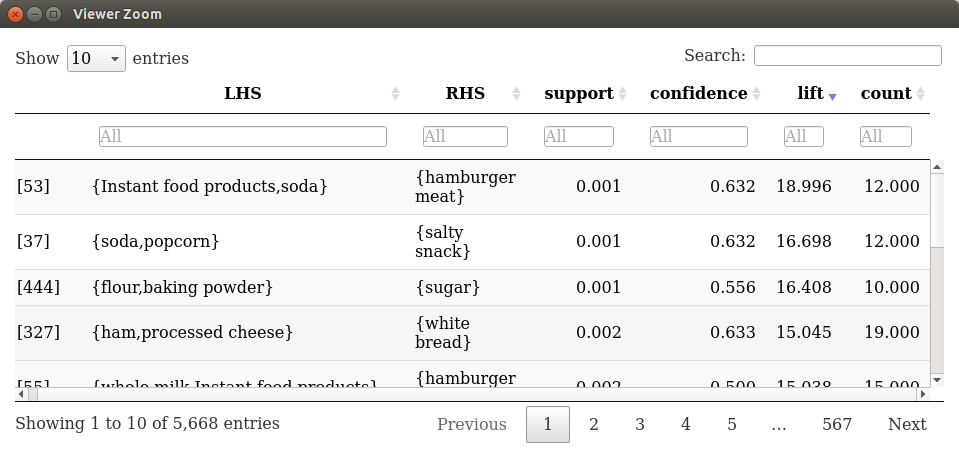
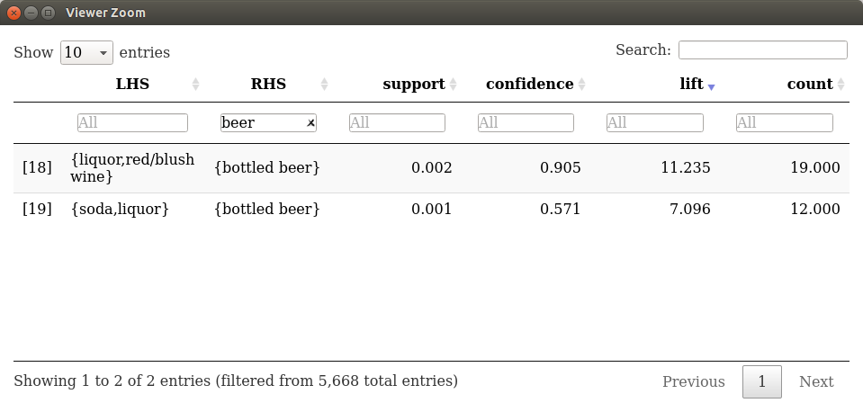
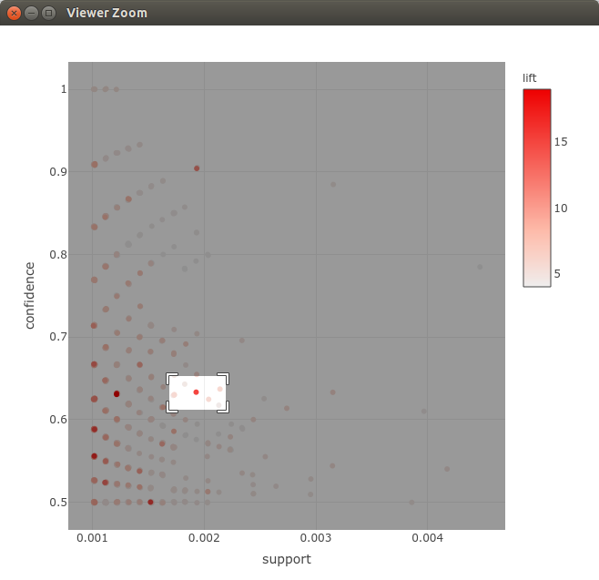
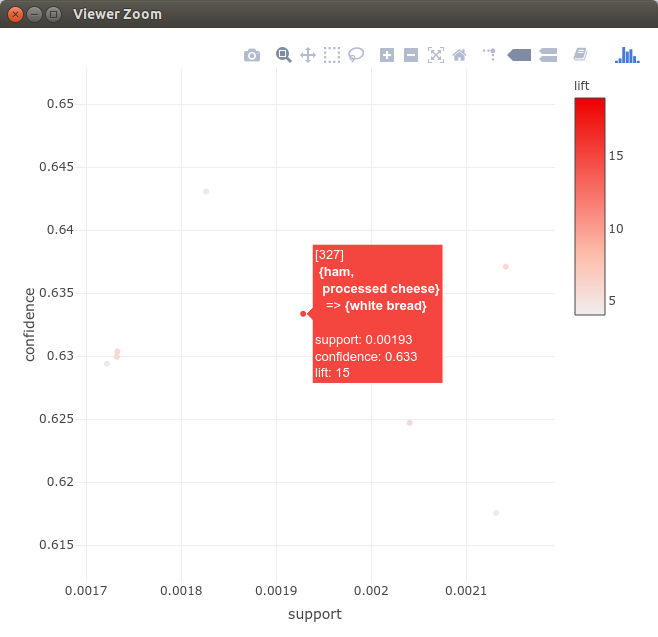
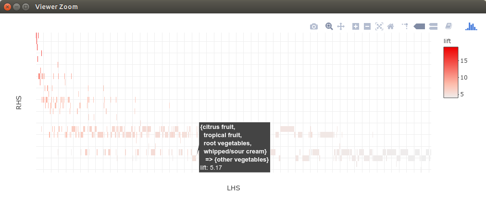
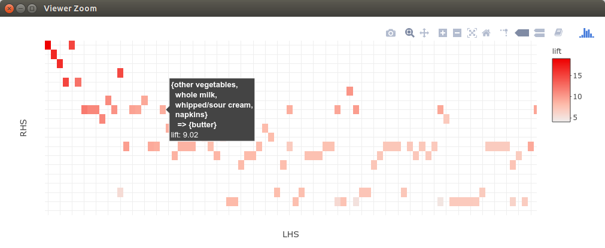
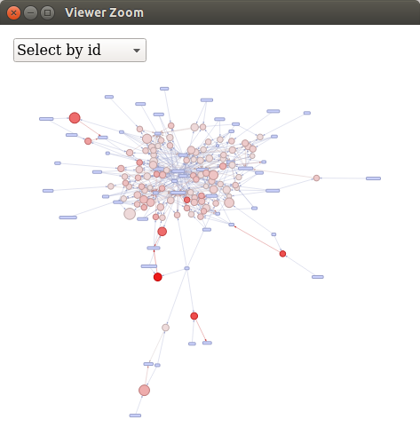
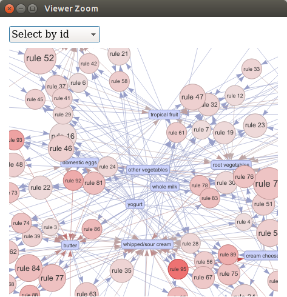
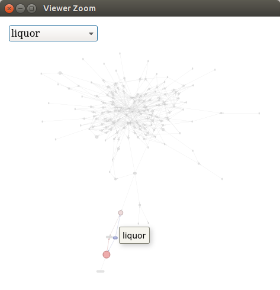
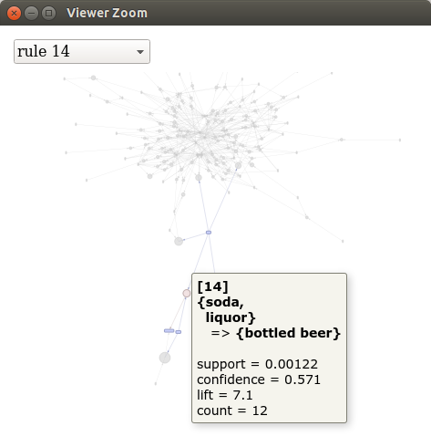

::: article
# Introduction

Many organizations generate a significant amount of transaction data on
a daily basis. For example, a department store like "Macy's" stores
customer shopping information originating from point-of-sale systems and
online shopping on a large scale. Association rule
mining [@arules:Agrawal+Imielinski+Swami:1993; @Tan:2005] is one of the
major techniques to detect and extract useful information from
large-scale transaction data. Rules found in the data are of the form
'if customers purchase in a transaction products A and B then they are
more likely also to purchase product C in the same transaction.' This
approach can be easily extended to non-retail settings by replacing
products with web pages, movies, different answers to a questionnaire,
etc. A well-known practical problem with association rule mining is that
it tends to create a significant number of potentially interesting
rules. Analysts are often overwhelmed by the sheer number of rules and
need tools to support exploring large sets of rules efficiently.

Visualization has a long history of making large data sets better
accessible and is successfully used to communicate both abstract and
concrete ideas in many areas like education, engineering, and
science [@arulesViz:Prangsmal:2009]. According to
[@arulesViz:Chen:2008], the application of visualization falls into two
phases. First, the exploration phase where the analysts will use
graphics that are mostly incompatible for presentation purposes but make
it easy to find interesting and important features of the data. The
amount of interaction needed during exploration is very high and
includes filtering, zooming, and rearranging data. After key findings
are discovered in the data, these results must be presented in a way
suitable for presentation for a larger audience. In this second phase,
it is important that the analyst can manipulate the presentation to
highlight the findings. Many researchers applied visualization
techniques like scatter plots, matrix visualizations, graphs, mosaic
plots and parallel coordinates plots to help analyze association rules
(see [@arulesViz:Bruzzese:2008] for a recent overview paper).

This paper introduces the recently added implementations of interactive
versions of several popular visualization techniques in the R-package
[*arulesViz*](https://CRAN.R-project.org/package=arulesViz) [@hahsler:arulesViz:2017]
and demonstrates how to use the package's simple unified interface.
Choosing an appropriate visualization and interpreting the results needs
some experience. To give the user some guidance, this paper discusses
three major groups of interactive visualizations including scatter
plots, matrix visualization and graph-based visualization. With
examples, the paper shows how the results of different visualizations
can be interpreted to gain more insight into the found set of
association rules.

The rest of the paper is organized as follows. We start with definitions
used in association rule mining and a discussion of different
visualization methods for association rules. Then, we introduce the
unified interface in package *arulesViz*. We demonstrate with small
examples how to create and interpret different interactive
visualizations. We conclude the paper with a short discussion of how the
plots can be used to explore a set of association rules.

# Association rules

Mining association rules was fist introduced
by [@arules:Agrawal+Imielinski+Swami:1993] and, following the notation
used by [@arules:Agrawal+Imielinski+Swami:1993],
[@arulesViz:Hahsler:2005] and [@Tan:2005], can formally be defined as:

Let $\mathcal{D} = \{t_1, t_2, \ldots, t_m\}$ be a set of transactions
called the *database*, and let $I = \{i_1, i_2,\ldots,i_n\}$ be the set
of all *items* considered in the database. Each transaction
in $\mathcal{D}$ has a unique transaction ID and contains a subset of
the items in $I$. A *rule* is defined as an expression $X \Rightarrow Y$
where $X, Y
\subseteq I$ and $X \cap Y = \emptyset$. The sets of items (for short
*itemsets*) $X$ and $Y$ are called *antecedent* (left-hand-side or LHS)
and *consequent* (right-hand-side or RHS) of the rule. Often rules are
restricted to only a single item in the consequent.

*Association rules* are rules which surpass a user-specified minimum
support and minimum confidence threshold. The *support*,
$\mathrm{supp}(X)$, of an itemset $X$ is a measure of importance defined
as the proportion of transactions in the data set which contain the
itemset. The *confidence* of a rule is defined as
$\mathrm{conf}(X\Rightarrow Y) = \mathrm{supp}(X \cup Y) / \mathrm{supp}(X)$,
measuring how likely it is to see $Y$ in a transaction containing $X$.
An association rule $X\Rightarrow Y$ needs to satisfy
$$\mathrm{supp}(X\cup Y) \ge \sigma \quad \text{and} \quad \mathrm{conf}(X\Rightarrow Y) \ge \delta,$$
where $\sigma$ and $\delta$ are the minimum support and minimum
confidence thresholds, respectively.

Another popular measure for association rules used throughout this paper
is *lift* [@arules:Brin+Motwani+Ullman+Tsur:1997]. The lift of a rule is
defined as
$$\mathrm{lift}(X \Rightarrow Y) = \mathrm{supp}(X\cup Y)/\left(\mathrm{supp}(X)\, \mathrm{supp}(Y)\right)$$
and can be interpreted as the deviation of the support of the whole rule
from the support expected under independence given the supports of both
sides of the rule. Greater lift values ($\gg 1$) indicate stronger
associations. Measures like support, confidence, and lift are called
interest measures because they help with focusing on potentially more
interesting rules. For a more detailed treatment of association rules
and interest measures, we refer the reader to the introduction
paper [@arulesViz:Hahsler:2005] for
package [*arules*](https://CRAN.R-project.org/package=arules) [@arulesViz:Hahsler:2010]
and the literature referred to there.

Association rules are typically generated in a two-step process. First,
minimum support is used to produce the set of all *frequent itemsets*
for the data set. Frequent itemsets are itemsets which satisfy the
minimum support constraint. Then, in a second step, each frequent
itemset is used to generate all possible candidate rules from it, and
all rules which do not satisfy the minimum confidence constraint are
removed. Analyzing this process, we can see that in the worst case we
will generate $2^n-n-1$ frequent itemsets with more than two items from
a database with $n$ distinct items. Since each frequent itemset will in
the worst case generate at least two rules, we will end up with a set of
rules in the order of $O(2^n)$. Typically, increasing minimum support is
used to keep the number of association rules found at a manageable size.
However, this also removes potentially interesting rules with less
support. Therefore, the need to deal with large sets of association
rules is unavoidable when applying association rule mining in a real
setting. Here we discuss interactive visualization as a potential means
to analyze large sets of association rules.

# Visualizing association rules

Many researchers applied existing visualization techniques to sets of
association rules. Several popular techniques are discussed in the
overview by [@arulesViz:Bruzzese:2008] and implemented in
*arulesViz* [@hahsler:arulesViz:2017]. Here we focus on interactive
visualizations falling into one of the three most important groups
scatter plots, matrix visualization, and graph-based visualization. The
main components of the three groups of visualization are shown in
Figure [1](#fig:visgroups). Scatter plots focus on interest measures,
and rules with similar values for these measures are placed close to
each other. Matrix visualizations focus on visualizing rules that have
the same antecedent or consequent by placing them in the same column or
row, repectively. The graph-based visualization shows how rules share
individual items. The properties of interactive visualizations in these
groups implemented in *arulesViz* are summarized in
Table [1](#tab:methods). The table includes information on the maximum
size of the rule set that can be effectively visualized, the number of
measures of interestingness that are visualized, the primary focus of
the visualization, and the interactive features that are currently
available. Additional static and interactive visualizations are
available in package *arulesViz* and we refer the reader to the
package's manual for these.

![Figure 1: The main components of association rule visualization using
(a) a scatter plot, (b) matrix visualization, and (c) graph-based
visualization. Rules are shown in color. Color shading can be used to
indicate the value of an additional interest measure of the rule (e.g.,
lift).[]{#fig:visgroups
label="fig:visgroups"}](visgroups.png){#fig:visgroups width="100%" alt="graphic without alt text"}

::: {#tab:methods}
  --------------------------------------------------------------------------------------------------------------------------------
  **Technique**          **Method (*arulesViz*)**   **Set size**   **Measures**       **Focus**       **Interactive features**  
  --------------------- -------------------------- -------------- -------------- ------------------- -------------------------- --
  Scatter plot               "`scatterplot`"           1,000s           3         Interest measures       hover, zoom, pan      

  Two-Key plot               "`two-key plot`"          1,000s       2 + order        Rule length          hover, zoom, pan      

  Matrix-based                  "`matrix`"           $< 1,000$          1             RHS & LHS           hover, zoom, pan      

  Grouped matrix            "`grouped matrix`"        100,000s          2             RHS & LHS         drill down, inspect     

  Graph-based                   "`graph`"               100s            2               Items         hover, zoom, pan, brush   

  Graph-b. (external)           "`graph`"              1,000s           2               Items              tool dependent       
  --------------------------------------------------------------------------------------------------------------------------------

  : Table 1: Interactive visualization methods based on scatter plots,
  matrix visualization and graphs available in *arulesViz*
:::

.[]{#tab:methods label="tab:methods"}

Visualization starts with a set of association rules formalized here as
the set

$$\mathcal{R} = \{
    \langle X_1,Y_1,\boldsymbol{\theta}_1\rangle, \ldots,
    \langle X_i,Y_i,\boldsymbol{\theta}_i\rangle, \ldots, 
    \langle X_n,Y_n,\boldsymbol{\theta}_n\rangle\},$$
where $X_i$ is the rule antecedent, $Y_i$ is the rule consequent and
$\boldsymbol{\theta}_i$ is a vector with available measures of
interestingness (e.g., support, confidence, lift) for the $i$-th rule,
$i = 1,\ldots,n$.

A straightforward visualization of association rules is to produce a
scatter plot with two interest measures on the axes (see
Figure [1](#fig:visgroups)(a)). Such a presentation can be found already
in an early paper by [@arulesViz:Bayardo:1999] when they discuss
*sc-optimal rules.* Scatter plots focus solely on the measures of
interestingness $\boldsymbol{\theta}_i$ by choosing two measures (often
support and confidence) for the x and y-axis, respectively. A third
measure (often lift) can be added to the plot using color.
[@arulesViz:Unwin:2001] introduced a special version of a scatter plot
called the *Two-key plot.* Here support and confidence are used for the
x and y-axis and the color of the points is used to indicate "order,"
which is defined as the number of items contained in the rule. Scatter
plots can be used for large sets of association rules and give an
impression of the distribution of rules concerning large and small
values for the chosen interest measures. However, it completely ignores
the items in rules and the fact that rules share items. This leads to
the issue that two almost identical rules, differing only by a single
item, can be located in very different areas on the plot. Standard
interactive features for scatter plots can be used. This includes
zooming into the plot, panning, and hovering over points to obtain
information about the rule it represents. The number of rules that can
be effectively visualized and interactively explored (with zooming in)
is theoretically not limited, however, for practical purposes it depends
mainly on the capability of the display system to render the needed
amount of points in an acceptable amount of time. Also overplotting
becomes a problem for large rule sets. This typically limits the rule
set size to no more than several 1,000 rules.

While the scatter plot focuses on the similarity of rules regarding
measures of interestingness like support and confidence, matrix-based
visualization for association rules organizes rules in a matrix using
distinct antecedent and consequent itemsets as the columns and rows,
respectively. The matrix $\mathbf{M}$ is created by identifying the set
of $A$ unique antecedents and $C$ unique consequents in $\mathcal{R}$.
An $A \times C$ matrix $\mathbf{M} = (m_{ac})$, $a = 1,\ldots,A$ and
$c = 1,\ldots,C$, is created with one column for each unique antecedent
and one row for each unique consequent. The matrix is populated by
setting $m_{ac} = \theta_{i,m}$ where $i = 1,\ldots,n$ is the rule
index, $m$ is a chosen interest measure (e.g., lift), and $a$ and $c$
correspond to the position of $X_i$ and $Y_i$ in the matrix. The matrix
is displayed using matrix shading, i.e., a color-shaded square at the
intersection of the antecedent column and the consequent row of a given
rule [@arulesViz:Ong:2002]. The basic layout is shown in
Figure [1](#fig:visgroups)(b). If no rule is available for an
antecedent/consequent combination, which can easily happen because of
the minimum support constraint, then the value in the matrix is
undefined and the intersection area in the plot is left blank. Note that
association rules in *arules* and most other tools restrict the
consequent to a single item, but the size of the antecedent itemset is
not restricted. This means that the number of rows in $\mathbf{M}$ is
typically much smaller than the number of columns. The order of the rows
and columns of the visualized matrix can have a profound impact on the
effectiveness of the visualization in guiding the analyst in exploring
the rule set. [@arulesViz:Ong:2002] suggest to reorder antecedents by
increasing support and the consequents by increasing confidence. Two
other options are to organize the itemsets by similarity by placing
antecedents with similar items close together, or by organizing them so
more interesting rules can be easily identified (e.g., placing the rules
with highest lift in the top-left corner of the matrix by simply
ordering rows and columns by decreasing average lift). Matrix-based
visualization is limited in the number of rules it can visualize
effectively since large sets of rules typically also have large sets of
unique antecedents resulting in a huge matrix which makes exploration
more challenging using repeated zooming in and out. This is somewhat
mitigated by reordering the matrix, but we still recommend to use less
than 1,000 rules.

The grouped matrix-based visualization [@hahsler:Hahsler2016c] enhances
matrix-based visualization by organizing the large set of different
antecedents (columns) into a small set of groups via clustering. For
grouping, the set of antecedents is split into a set of $k$ groups
$\mathcal{S} = \{S_1, S_2,\ldots,S_k\}$ while minimizing the
within-cluster sum of squares
$$\mathrm{argmin}_\mathcal{S} \sum_{i = 1}^k \sum_{\mathbf{m}_j \in S_i} ||\mathbf{m}_j-\boldsymbol{\mu}_i||^2,$$
where $\mathbf{m}_j$, $j = 1,\ldots,A$, is a column vector representing
all rules with the same antecedent and $\boldsymbol{\mu}_i$ is the
center (mean) of the vectors in $S_i$. We use the $k$-means algorithm
by [@Hartigan:1979] and restart it ten times with randomly initialized
centers to find a suitable solution. Before clustering, the missing
values for antecedent/confidence combinations that do not pass the
minimum support, or minimum confidence threshold are replaced by a
neutral element (e.g., 1 for lift). The result is a smaller matrix with
groups of antecedents as columns. Similar to the regular matrix-based
visualization. the matrix is again sorted such that more interesting
groups are moved to the top left corner and grouped rules are presented
using a balloon plot. For interactive exploration, drilling-down into a
group can be easily done by selecting only the rules in the group and
applying the same clustering procedure again. Note that the standard
matrix visualization is a special case of the grouped visualization with
$k = A$.

Graph-based
techniques [@arulesViz:Klemettinen:1994; @arulesViz:Rainsford:2000; @arulesViz:Buono:2005; @arulesViz:Ertek:2006]
concentrate on the relationship between individual items reflecting
their membership in different association rules. Association rules are
visualized using two different types of vertices to represent the set of
items $I$ (or the subset that is used in the rule set) and the set of
rules $\mathcal{R}$, respectively. The edges indicate the relationship
in rules. An example is shown in Figure [1](#fig:visgroups)(c). Interest
measures are typically added to the plot as labels, by color or width of
the arrows displaying the edges, or by the size and color of the
vertices. For visualization, standard graph drawing algorithms (e.g.,
force-directed layout algorithms) are used to create the layout.
Standard interactive features available for graph visualization (e.g.,
zooming and panning) can be used. Graph-based visualization offers a
very appealing representation of rules but they tend to become cluttered
and thus are only viable for small rule sets (typically 100 or less).
External tools for network visualization allow more advanced
visualization, with tool-dependent interactive features like grouping
nodes which may make this visualization useful for even larger rule
sets.

In the following, we will present how these visualizations and
interactive features can be created and used to analyze association
rules with *arulesViz*.

# Data preparation and unified interface of arulesViz {#sec:prep}

The package *arulesViz* [@hahsler:arulesViz:2017] is part of the
*arules* package ecosystem for handling and mining association
rules [@hahsler:Hahsler2011d]. Considerable effort has been put into
providing a straightforward and consistent interface, which allows the
user to explore different visualization options easily. Before we start
with the visualization, we need to mine some association rules.
Throughout this paper, we use a small demo data set called "Groceries"
which is included in *arules*. We use this data set so the reader can
easily reproduce the presented results. We first load the package and
the data set.

``` r
library("arulesViz")
data("Groceries")
```

Groceries contains sales data from a small grocery store with 9835
transactions and a moderate number of 169 items (product groups). It is
easy to mine association rules using the Apriori algorithm implemented
in *arules*. Since the data set is very sparse with each transaction
only containing a small fraction of the 169 product groups, we use a
very low minimum support threshold of 0.1% of the transactions. To
create more rules, we also reduce the minimum confidence threshold from
the default value of 80% to 50%.

``` r
rules <- apriori(Groceries, parameter = list(support = 0.001, confidence = 0.5))
rules

set of 5668 rules 
```

The result is a set of 5668 association rules. Many real applications
may include thousands of items and rule sets with millions of rules, but
even inspecting all 5668 rules in this example manually is cumbersome.
Common practice is to examine only the top rules according to a measure
of interestingness which can be done in *arules* using the functions
`sort()` and `inspect()`. To make inspection easier, *arulesViz*
provides a interactive inspect method which creates a data table using
package [*DT*](https://CRAN.R-project.org/package=DT) [@arulesViz:Xie:2016].

``` r
inspectDT(rules)
```

<figure id="fig:DT">
<table>
<caption> </caption>
<tbody>
<tr class="odd">
<td
style="text-align: center;"></td>
</tr>
<tr class="even">
<td style="text-align: center;">(a)</td>
</tr>
<tr class="odd">
<td style="text-align: center;"></td>
</tr>
<tr class="even">
<td style="text-align: center;">(b)</td>
</tr>
</tbody>
</table>
<figcaption>Figure 2: Interactive data table for the mined rule set.
Table (a) shows the rules sorted by lift. The top three rules represent
typical barbecue needs including hamburger meat, movie snacks, and
baking ingredients, respectively. Table (b) shows the rules filtered
with only rules with beer in the consequent (RHS). We see that other
alcoholic beverages in the LHS produce high-lift rules.<span id="fig:DT"
label="fig:DT"></span></figcaption>
</figure>

Figure [2](#fig:DT) shows the result of this interactive inspection
method which allows the user to sort rules given different interest
measures, specify ranges for measures, and provides filters for items.
In the example in Figure [2](#fig:DT)(a) we sort the rules by lift. We
can see that the result is a set of product groups we would expect to be
highly correlated. The first three rules represent typical barbecue
needs including hamburger meat, movie snacks, and baking ingredients,
respectively. In Figure [2](#fig:DT)(b), we selected only the rules with
'beer' in the rules consequent (RHS). The rules show very strong
relationship (a high lift value) with liquor, soda, and wine, but a
rather low support of only 0.2% and 0.1%, respectively.

While interactive inspection of rules using a table is very useful for
experts who know what they are looking for, visualization and especially
interactive visualization can help to understand the found rules better.
Different visualization methods are quite distinct regarding
presentation, but in *arulesViz* much work has been spent on creating a
single, simple and consistent interface that allows the user to analyze
a rule set quickly using different methods. The main interface is the
`plot()` method is defined as

``` r
plot(x, method = NULL, measure = "support", shading = "lift", engine = "default", 
    data = NULL, control = NULL, ...)
```

where

-   `x` is the set of rules to be visualized,

-   `method` is the visualization method (some are given in
    Table [1](#tab:methods) and more can be found in the manual page
    included in *arulesViz*),

-   `measure` and `shading` contain the interest measures used by the
    plot,

-   `engine` was introduced in a recent release to let the user choose
    between different rendering engines (e.g., using R's grid static
    graphics, grid-based interactive features or HTML widgets),

-   `data` can contain the transaction data set used to mine the rules
    (only necessary for some methods),

-   `control` is a list with visualization-specific control arguments to
    customize the plot. Using the the control argument `verbose = TRUE`
    will show all available arguments and the default values for the
    chosen method and engine. For convenience additional arguments are
    appended to the control list.

In the following sections, we will introduce the main interactive
visualization methods implemented in *arulesViz* with simple examples.
Static and additional methods are described in the package
documentation.

# Scatter plot {#sec:scatter}

A scatter plot for association rules uses two interest measures, one on
each of the axes. The default plot for association rules in *arulesViz*
is a scatter plot using support and confidence on the axes. The measure
defined by shading (default: lift) is visualized by the color of the
points. A color key is provided to the right of the plot.

``` r
plot(rules)
```

![Figure 3: Default scatter plot showing support, confidence, and lift
of rules. The plot mainly gives an overview of the distribution of
support and confidence in the rule set. There are a few high-confidence
rules in the top left corner, and high-lift rules are located close to
the minimum support threshold (left corner of the
plot).[]{#fig:scatterplot1
label="fig:scatterplot1"}](arulesViz-scatterplot1.png){#fig:scatterplot1
width="100%" alt="graphic without alt text"}

The resulting plot for the rules mined in the previous section is shown
in Figure [3](#fig:scatterplot1). We can see that rules with high lift
have typically a relatively low support. [@arulesViz:Bayardo:1999] argue
that the most interesting rules (sc-optimal rules) reside on the
support/confidence border. This can be clearly seen by high-lift rules
residing close to the bottom-left corner of the plot which represents
the minimum support cut-off. Since support and confidence are the
results of counting, rules often share the same support and confidence
value, leading to considerable overplotting. The plot function
automatically adds some jitter in this case. Any measure stored in the
quality slot of the set of rules can be used for the axes (vector of
length 2 for parameter `measure`) or for color shading (`shading`). The
following measures are available for our set of rules.

``` r
head(quality(rules))

  support confidence lift
1 0.00112      0.733 2.87
2 0.00122      0.522 2.84
3 0.00132      0.591 2.31
4 0.00132      0.565 2.21
5 0.00132      0.520 2.04
6 0.00366      0.643 2.52
```

These are the default measures generated by the Apriori implementation
used in *arules*. To add other measures, we refer the reader to the
function `interestMeasure()` included in *arules*.

The default plot is a static visualization providing limited utility for
exploration since the individual rules cannot be identified directly in
the plot. *arulesViz* offers a JavaScript-based scatter plot
visualization using
[*plotly*](https://CRAN.R-project.org/package=plotly) [@arulesViz:plotly:2016]
which is capable of creating an interactive HTML widget. This
visualization can be selected by setting the engine parameter to
`"htmlwidget"`, and it supports identifying rules by hovering over a
point, zooming in and out, and panning.

``` r
plot(rules, engine = "htmlwidget")

Warning message:
      plot: Too many rules supplied. Only plotting the best 1000 rules using measure 
      lift (change parameter max if needed)
```

<figure id="fig:plotly">
<table>
<caption> </caption>
<tbody>
<tr class="odd">
<td style="text-align: center;"></td>
</tr>
<tr class="even">
<td style="text-align: center;">(a)</td>
</tr>
<tr class="odd">
<td style="text-align: center;"></td>
</tr>
<tr class="even">
<td style="text-align: center;">(b)</td>
</tr>
</tbody>
</table>
<figcaption>Figure 4: Interactive scatter plot producing a HTML widget.
This plot only visualizes the 1000 rules with the highest lift. Plot (a)
shows how the area around high-lift rules is selected for zooming in.
Plot (b) showed the selected region and hovering over the high-lift rule
reveals that it contains ingredients to make sandwiches.<span
id="fig:plotly" label="fig:plotly"></span></figcaption>
</figure>

Note that HTML widgets are rendered by the client which gets very slow
with many points. This is why the number of rules visualized is by
default restricted to the 1,000 rules with the highest value for the
measure of interestingness specified in `shading` (default is lift). The
call above creates a warning message to notify the user that not all
rules are included in the plot. The user can change the limit for the
restriction using the control parameter `max`. For example, `max = Inf`
visualizes all rules. Figure [4](#fig:plotly) shows an example of the
interactive use of the plot. In Figure [4](#fig:plotly)(a), we zoom into
a region of average confidence that contains some high-lift rules (dark
red). Figure [4](#fig:plotly)(b) shows the zoomed-in view where rules
can be inspected by hovering over the corresponding point. The selected
rule has high support and contains the ingredients necessary to make ham
and cheese sandwiches. The number in brackets (\[327\]) is the index in
the rule set. Note that the tight groups of rules with low support and a
confidence around 0.63 represent rules with the same confidence and
support. They are just spread out slightly using jitter to reduce
overplotting.

# Matrix-based visualization {#sec:matrix-based}

Matrix-based visualization creates a matrix with unique antecedent and
consequent itemsets forming the columns and rows, respectively. The
matrix contains the values for a interest measure selected by the
analyst and is visualized using matrix shading. The order of rows and
columns is arbitrary, however, to improve the ability to analyze the
data, we suggest in *arulesViz* to reorder the matrix such that the row
averages decrease from top to bottom and the column averages decrease
from left to right. This pushes the rules with higher values of
interestingness to the top-left position in the plot. Here we plot the
rules using the method matrix and render it using an HTML widget.

``` r
plot(rules, method = "matrix", engine = "htmlwidget")

Warning message:
      plot: Too many rules supplied. Only plotting the best 1000 rules using
      lift (change parameter max if needed)
```

<figure id="fig:matrix1">
<table>
<caption> </caption>
<tbody>
<tr class="odd">
<td style="text-align: center;"></td>
</tr>
<tr class="even">
<td style="text-align: center;">(a)</td>
</tr>
<tr class="odd">
<td style="text-align: center;"></td>
</tr>
<tr class="even">
<td style="text-align: center;">(b)</td>
</tr>
</tbody>
</table>
<figcaption>Figure 5: Interactive matrix-based visualization where the
matrix is ordered such that the rules with the largest lift values are
located close to the top-left corner. Only the 1000 rules with the
highest lift are visualized. Hovering over a rule close to the bottom in
plot (a) shows that the row contains many rules with the consequent
“root vegetables.” Plot (b) is zoomed into the top-left corner. The
highlighted rule has the consequent “butter”. There are many entries in
the row indicating that many strong rules are resulting in butter. <span
id="fig:matrix1" label="fig:matrix1"></span></figcaption>
</figure>

The warning message shows again that only the top 1,000 rules are
included in the visualization for performance reasons. The resulting
plot is shown in Figure [5](#fig:matrix1). Rows represent rules with the
same consequent. A rule from the row with the consequent "root
vegetables" is highlighted in Figure [5](#fig:matrix1)(a). There are
many rules with this consequent and the lift is still relatively high,
since only the 1,000 rules with the highest lift are visualized. The
plot guides the analyst to the rules with the highest lift by placing
them in the top-left corner. Figure [5](#fig:matrix1)(b) shows the plot
zoomed into the top-left corner. A rule is inspected and contains
"butter". The many other entries in the same row indicate that butter is
part of many strong rules. Other rows can easily be inspected by
hovering over a rule in that row.

Matrix-based visualization is limited in the number of rules it can
visualize effectively since large sets of rules typically also have
large sets of unique antecedents. This would require the analyst to
repeatedly zoom in and out. Grouped matrix-based visualization
[@hahsler:Hahsler2016c] enhances matrix-based visualization by grouping
antecedents of rules via clustering and sorting rules by
"interestingness" to handle a larger number of rules. Grouped rules are
presented as an aggregate in a matrix that is visualized as a balloon
plot.

``` r
plot(rules, method = "grouped matrix", engine = "interactive")
```

This plot can easily visualize larger sets of rules. The resulting
visualization of the set of $5668$ rules mined earlier is shown in
Figure [6](#fig:clusterplot1). The visualization is very similar to the
regular matrix visualization, but the columns represent groups of
antecedents. The plot is again organized such that the most interesting
rules according to lift (the default measure of interestingness) are
shown in the top-left corner. The highest interest group consists of 3
rules which contain "Instant food products, " and "soda" and an
additional item in the antecedent and the consequent is "hamburger
meat." The balloon size represents support and the color indicates lift.
We also see below all RHS items, that the plot suppresses 15 consequent
items representing rules with low lift values to create a less
convoluted plot. The number of items shown for the antecedent groups and
how many consequent items, if any, are suppressed can be specified by
the user.

![Figure 6: Grouped matrix-based visualization. The highest interest
group (top-left hand corner) consists of 3 rules which contain"Instant
food product", "soda" and an additional item in the antecedent and all
rules have the consequent "hamburger meat." []{#fig:clusterplot1
label="fig:clusterplot1"}](groupedmatrix1.png){#fig:clusterplot1
width="100%" alt="graphic without alt text"}

The interactive features of the grouped matrix visualization allow the
user to identify the rules making up groups and also to zoom into and
out of groups. The visualization is currently only implemented using
interactive features of the
[*grid*](https://CRAN.R-project.org/package=grid) graphics system
(`engine = "interactive"`), and a HTML widget version is planned for the
future.

# Graph-based visualization

Graph-based techniques concentrate on the relationship between
individual items in the rule set. *arulesViz* offers an interactive
visualization based on
package [*visNetwork*](https://CRAN.R-project.org/package=visNetwork) [@Almende:2017].

``` r
plot(rules, method = "graph", engine = "htmlwidget")

Warning message:
      plot: Too many rules supplied. Only plotting the best 100 rules using 
      lift (change control parameter max if needed)
```

<figure id="fig:graph1">
<table>
<caption> </caption>
<tbody>
<tr class="odd">
<td style="text-align: center;"></td>
<td style="text-align: center;"></td>
</tr>
<tr class="even">
<td style="text-align: center;">(a)</td>
<td style="text-align: center;">(b)</td>
</tr>
<tr class="odd">
<td style="text-align: center;"></td>
<td style="text-align: center;"></td>
</tr>
<tr class="even">
<td style="text-align: center;">(c)</td>
<td style="text-align: center;">(d)</td>
</tr>
</tbody>
</table>
<figcaption>Figure 7: Graph-based visualization with items and rules as
vertices. Plot (a) shows the initial view of the complete graph. Plot
(b) uses zooming in to show the center of the graph, revealing the most
frequent items (including “other vegetables” and “milk”). Plot (c) shows
how to use the pull-down menu in the top-left corner to find the item
“liquor” in the graph. Plot (d) inspects a single rule that is connected
to “liquor.” <span id="fig:graph1"
label="fig:graph1"></span></figcaption>
</figure>

Graph-based visualization tend to become cluttered and thus are only
viable for very small sets of rules. The warning message informs the
user that only the top 100 rules are included in the visualization.
Figure [7](#fig:graph1)(a) shows the initial view with the graph
centered. The force-directed layout used in the visualization moves
items which are included in many rules and rules which share many items
towards the center of the plot. Items which are in very few rules are
pushed to the periphery of the plot. It is interesting to note that
high-lift rules are also on the outside of the plot. This is due to the
fact that rules with high lift levels typically appear at the minimum
support/confidence boundary and low-support items are part of fewer
rules and thus are pushed to the periphery of the graph. The
visualization suppresses labels when they become too small to be
readable. Figure [7](#fig:graph1)(b) uses zooming in to show the center
of the graph. The items in the center ("other vegetables", "whole milk"
and "yogurt") are the most frequently bought items and are thus part of
many rules. These items are often not very interesting because domain
experts typically are aware of how the most common items relate to each
other. Figure [7](#fig:graph1)(c) shows how the pull-down menu in the
top-left corner can be used to analyze how a given item relates in the
rule set with other items. In the example, the item "liquor" is selected
and the visualization highlights the two rules the item is part of.
Figure [7](#fig:graph1)(d) inspects one of the rules. A useful strategy
is to inspect all high-lift rules and the outside area of the graph to
find interesting rules. For some data sets, the rules also form two or
more weakly or even unconnected components indicating that the items in
the groups have only little affect on each other.

A big restriction of graph-based visualization for association rules is
that they are only useful for a very small set of rules. To explore
large sets of rules with graphs, the analyst needs to be supported by
advanced interactive features like filtering, grouping, and coloring
nodes. Such features are available in interactive visualization and
exploration platforms for networks and graphs like
*Gephi* [@arules:Bastian:2009]. *arulesViz* can export graphs for sets
of association rules in the GraphML format or as a Graphviz dot-file to
be explored in tools like Gephi. For example, the complete rule set can
be exported by

``` r
saveAsGraph(rules, file = "rules.graphml")
```

This file can be imported directly into most tools for analysis.

# Conclusion {#sec:conclusion}

While each of the three basic groups of visualizations reveal similar
information, they focus on different properties of the analyzed rule set
and some can visualize larger rule sets than others effectively. A
single visualization by itself is typically not sufficient to understand
all aspects of a rule set, but repeated use of different methods can
lead the analyst to deeper insight into the data. Analysis typically
starts with creating a scatter plot to inspect the rules with extreme
values for support, confidence and lift. The advantage is that this
visualization can deal with relatively large rule sets. Alternatively,
an interactive table can also be used for this task. A grouped matrix
plot can then be used to inspect the rules and group of rules. Finally,
graph-based visualization can be employed to get a deeper understanding
of a smaller set of rules and items. This visualization is especially
useful to present found results because it is easy to understand for
non-analysts. *arulesViz* makes this process easier by providing a
simple and unified `plot` method, where different visualizations can be
explored by just changing the method argument. Many methods also can
create JavaScript-based HTML widgets [@Vaidyanathan:2017] which can be
saved as HTML files, included in web-based applications using
shiny [@arulesViz:shiny:2016], or used in interactive documents created
with R markdown [@arules:rmarkdown:2016].
:::
