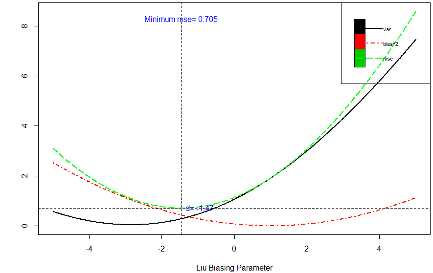
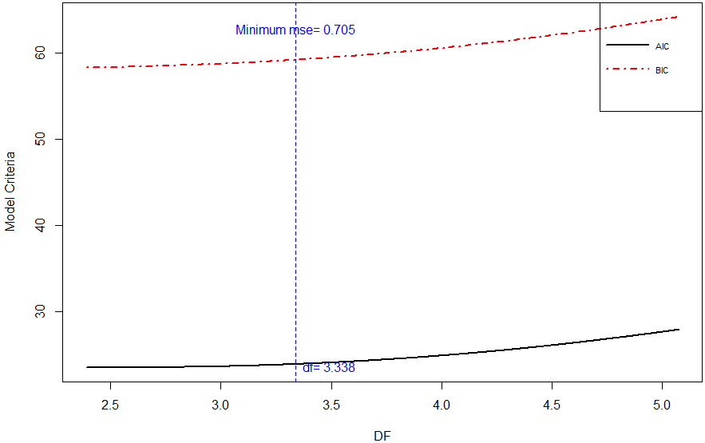

::: article
# Introduction

For data collected either from a designed experiment or from an
observational study, the ordinary least square (OLS) method does not
provide precise estimates of the effect of any explanatory variable
(regressor) when regressors are interdependent (collinear with each
other). Consider a multiple linear regression (MLR) model,
$$y=X\beta + \varepsilon,$$
where $y$ is an $n \times 1$ vector of observations on dependent
variable, $X$ is known design matrix of order $n \times p$, $\beta$ is a
$p \times 1$ vector of unknown parameters, and $\varepsilon$ is an
$n \times 1$ vector of random errors with mean zero and variance
$\sigma^2 I_n$, where $I_n$ is an identity matrix of order $n$.

The OLS estimator (OLSE) of $\beta$ is given by
$$\hat{\beta}= (X'X)^{-1}X'y,$$
which depends on the characteristics of the matrix $X'X$. If $X'X$ is
ill-conditioned (near dependencies among various regressors of $X'X$
exist) or $det(X'X)\approx0$, then the OLS estimates are sensitive to a
number of errors, such as non-significant or imprecise regression
coefficients [@Kmenta1980] with wrong sign and non-uniform eigenvalues
spectrum. Moreover, the OLS method, for example, can yield a high
variance of estimates, large standard errors, and wide confidence
intervals.

::: {#softcomp}
  ------------------------------------------------------------------------------------------------------------------------------------------------------------------------------------------------------------------------------------------------
                                                                  [*lrmest*](https://CRAN.R-project.org/package=lrmest) (1)   [*ltsbase*](https://CRAN.R-project.org/package=ltsbase) (2)   [*liureg*](https://CRAN.R-project.org/package=liureg)
  --------------------------------------------- ---------------- ----------------------------------------------------------- ------------------------------------------------------------- -------------------------------------------------------
  *Standardization of regressors*                                                                                                                                                          

                                                                                        $\checkmark$                                                 $\checkmark$                                               $\checkmark$

  *Estimation and testing of Liu coefficient*                                                                                                                                              

                                                Estimation                              $\checkmark$                                                 $\checkmark$                                               $\checkmark$

                                                Testing                                 $\checkmark$                                                                                                            $\checkmark$

                                                SE of coeff.                            $\checkmark$                                                                                                            $\checkmark$

  *Liu related statistics*                                                                                                                                                                 

                                                $R^2$                                   $\checkmark$                                                                                                            $\checkmark$

                                                Adj-$R^2$                                                                                                                                                       $\checkmark$

                                                Variance                                                                                                                                                        $\checkmark$

                                                Bias${}^2$                                                                                                                                                      $\checkmark$

                                                MSE                                                                                                                                                             $\checkmark$

                                                F-test                                                                                                                                                          $\checkmark$

                                                $\sigma^2$                                                                                                                                                      $\checkmark$

                                                C${}_L$                                                                                                                                                         $\checkmark$

                                                Effective df                                                                                                                                                    $\checkmark$

                                                Hat matrix                                                                                                                                                      $\checkmark$

                                                Var-Cov matrix                                                                                                                                                  $\checkmark$

                                                VIF                                                                                                                                                             $\checkmark$

                                                Residuals                                                                                            $\checkmark$                                               $\checkmark$

                                                Fitted values                                                                                        $\checkmark$                                               $\checkmark$

                                                Predict values                                                                                                                                                  $\checkmark$

  *Liu model selection*                                                                                                                                                                    

                                                GCV                                                                                                                                                             $\checkmark$

                                                AIC&BIC                                                                                                                                                         $\checkmark$

                                                PRESS                                                                                                                                                           $\checkmark$

  *Liu related graphs*                                                                                                                                                                     

                                                Liu trace                                                                                                                                                       $\checkmark$

                                                Bias, Var, MSE                                                                                       $\checkmark$                                               $\checkmark$

                                                AIC, BIC                                                                                                                                                        $\checkmark$
  ------------------------------------------------------------------------------------------------------------------------------------------------------------------------------------------------------------------------------------------------

  : Table 1: Comparison of Liu related R packages (1
  [@DissanayakeWijekoonR-Core2013]; 2 [@KanAlpuYazici2013] )
:::

Researchers may be tempted to eliminate regressor(s) causing problems by
consciously removing regressor from the model or by using some screening
method such as stepwise and best subset regression etc. However, these
methods may destroy the usefulness of the model by removing relevant
regressor(s) from the model. To control variance and instability of the
OLS estimates, one may regularize the coefficients, with some
regularization methods such as the ridge regression (RR), Lasso
regression and Liu regression (LR) methods etc., as alternative to the
OLS. Computationally, the RR ($\hat{\beta}_r=(X'X+kI)^{-1}X'y$)
suppresses the effects of collinearity and reduces the apparent
magnitude of the correlation among regressors in order to obtain more
stable estimates of the coefficients than the OLS estimates and it also
improves the accuracy of prediction [see
@HoerlKennard1970; @MontgomeryPeck1982; @Myers1986; @Rawlings1998; @SeberLee2003; @Tripp1983
etc.]. However, the ridge coefficient is a complicated function of $k$
when some popular methods (such as given in [@GolubWahbaHeath1979],
[@Mallows1973] and [@McLeodXu2014] etc.) are used for (optimal)
selection of $k$. Different applications can yield values for $k$ which
are too small to correct the problem of the ill-conditioned product,
$X'X$. In such cases, the RR may still be unstable. Similarly, the
choice of $k$ belongs to the researcher, there being no consensus
regarding how to select optimal $k$. As such, other innovative methods
were needed to deal with collinear data. [@Liu1993] proposed another
biased estimator to mitigate the collinearity effect on regressors. They
also discussed some of the properties and methods for suitable selection
of biasing parameter used in LR. For further detail, see Section \"Liu
regression estimator.\"

We have developed the *liureg* [@ImdadullahAslam2017] package to provide
the functionality of Liu related computations. The package provides the
most complete suite of tools for the LR available in R.
Table [1](#softcomp) provides a comparison with other alternatives. For
package development and R documentation, we followed
[@Hadley2015; @Leisch2008; @Team2015]. The *ridge* package by
[@CuleDeIorio2012],
[*lmridge*](https://CRAN.R-project.org/package=lmridge) by
[@ImdadullahAslam2016a] and `lm.ridge` from the
[*MASS*](https://CRAN.R-project.org/package=MASS) by
[@VenablesRipley2002] also provided guidance in coding.

In the available literature, there are only two R packages capable of
estimating and/or testing of the Liu coefficients. The R packages
mentioned in Table [1](#softcomp) are compared with our *liureg*
package. The *lrmest* package [@DissanayakeWijekoonR-Core2013] computes
different estimates such as the OLS, ordinary ridge regression (ORR),
Liu estimator (LE), LE type-1, 2, 3, adjusted Liu estimator (ALTE), and
their type-1, 2, 3 etc. Moreover, *lrmest* provides scalar mean square
error (MSE), prediction residual error sum of squares (PRESS) values of
some of the estimators. The testing of ridge coefficient is performed
only on scalar `k`, however, for a vector of `d`, the function `liu()`
of *lrmest* package returns only MSE along with value of the biasing
parameter used. The *ltsbase* package [@KanAlpuYazici2013] computes
ridge and Liu estimates based on the least trimmed squares (LTS) method.
The MSE value from four regression models can be compared graphically if
the argument `plot=TRUE` is passed to the `ltsbase()` function. There
are three main functions, (i) `ltsbase()` computes the minimum MSE
values for six methods: OLS, ridge, ridge based on LTS, LTS, Liu, and
Liu based on LTS method for sequences of biasing parameters ranging from
0 to 1, (ii) the `ltsbaseDefault()` function returns the fitted values
and residuals of the model having minimum MSE, and (iii) the
`ltsbaseSummary()` function returns the regression coefficients and the
biasing parameter for the best MSE among the four regression models.

It is important to note that the *ltsbase* package displays these
statistics for models having minimum MSE (bias and variance are not
displayed in their output), while our package, *liureg*, computes these
and all other statistics not only for scalar but also for vector biasing
parameter.

This paper outlines the collinearity detection methods available in the
existing literature and uses the
[*mctest*](https://CRAN.R-project.org/package=mctest)
[@ImdadullahAslam2016] package through an illustrative example. To
overcome the issues of the collinearity effect on regressors a thorough
introduction to Liu regression, properties of the Liu estimator,
different methods for the selecting values of $d$, and testing of the
Liu coefficients is presented. Finally, estimation of the Liu
coefficients, methods of selecting a biasing parameter, testing of the
Liu coefficients, and different Liu related statistics are implemented
in R within the *liureg* package.

# Collinearity detection

Diagnosing collinearity is important to many researchers. It consists of
two related but separate elements: (1) detecting the existence of
collinear relationship among regressors and (2) assessing the extent to
which this relationship has degraded the parameter estimates. There are
many diagnostic measures used for detection of collinearity in the
existing literature provided by various authors
[@BelsleyKuhWelsch1980; @CurtoPinto2011; @FarrarGlauber1967; @FoxWeisberg2011; @GunstMason1977; @Klein1962; @Koutsoyiannis1977; @KovacsPetresToth.2005; @Marquardt1970; @Theil1971].
These diagnostic methods assist in determining whether and where some
corrective action is necessary [@BelsleyKuhWelsch1980]. Widely used, and
the most suggested diagnostics, are the value of pair-wise correlations,
the variance inflation factor (VIF)/ tolerance (TOL) [@Marquardt1970],
the eigenvalues and eigenvectors [@Kendall1957], the CN & CI
[@BelsleyKuhWelsch1980; @ChatterjeeHadi2006; @Maddala1988], Leamer's
method [@Greene2002], Klein's rule [@Klein1962], the tests proposed by
Farrar and Glauber [@FarrarGlauber1967], the Red indicator
[@KovacsPetresToth.2005], the corrected VIF [@CurtoPinto2011], and
Theil's measures [@Theil1971], (see also [@ImdadullahAslamAltaf2016]).
All of these diagnostic measures are implemented in a the R package
*mctest* [@ImdadullahAslam2016]. Below, we use the Hald dataset
[@Hald1952], for testing collinearity among regressors. We then use the
*liureg* package to compute the Liu regression coefficients for
different Liu related statistics and methods of selection of Liu biasing
parameter is performed. For optimal choice of biasing parameter,a
graphical representation of the Liu coefficients is considered, along
with a bias variance trade-off plot. In additino, model selection
criteria is also performed. The Hald data are about heat generated
during setting of 13 cement mixtures of 4 basic ingredients and used by
[@HoerlKennardBaldwin1975]. Each ingredient percentage appears to be
rounded down to a full integer. The data set is included in both the
*mctest* and *liureg* packages.

## Collinearity detection: An example

``` r
R > data(Hald)
R > x <- Hald[, -1]
R > y <- Hald[,  1]
R > mctest (x, y)

Call:
omcdiag(x = x, y = y, Inter = TRUE, detr = detr, red = red, conf = conf, 
	theil = theil, cn = cn)
	
Overall Multicollinearity Diagnostics
		
MC Results detection
Determinant |X'X|:         0.0011         1
Farrar Chi-Square:        59.8700         1
Red Indicator:             0.5414         1
Sum of Lambda Inverse:   622.3006         1
Theil's Method:            0.9981         1
Condition Number:        249.5783         1
		
1 --> COLLINEARITY is detected 
0 --> COLLINEARITY is not detected by the test
		
===================================
Eigenvalues with INTERCEPT
                 Intercept     X1     X2      X3       X4
Eigenvalues:        4.1197 0.5539 0.2887  0.0376   0.0001
Condition Indices:  1.0000 2.7272 3.7775 10.4621 249.5783
```

The results from all overall collinearity diagnostic measures indicate
the existence of collinearity among regressor(s). These results do not
tell which regressor(s) are reasons of collinearity. The individual
collinearity diagnostic measures can be obtained though:

``` r
> mctest(x = x, y, all = TRUE, type = "i")

Call:
imcdiag(x = x, y = y, method = method, corr = FALSE, vif = vif, 
      tol = tol, conf = conf, cvif = cvif, leamer = leamer, all = all)
All Individual Multicollinearity Diagnostics in 0 or 1 

   VIF TOL Wi Fi Leamer CVIF Klein
X1   1   1  1  1      0    0     0
X2   1   1  1  1      1    0     1
X3   1   1  1  1      0    0     0
X4   1   1  1  1      1    0     1

1 --> COLLINEARITY is detected 
0 --> COLLINEARITY in not detected by the test

X1 , X2 , X3 , X4 , coefficient(s) are non-significant may be due to multicollinearity

R-square of y on all x: 0.9824 

* use method argument to check which regressors may be the reason of collinearity
```

The results from most of the individual collinearity diagnostics suggest
that all of the regressors are the reason for collinearity among
regressors. The last line of the `imcdiag()` function's output suggests
that method argument should be used to check which regressors may be the
reason of collinearity among different regressors. This finding suggest
that one should use regularization method such as LR.

# Liu regression estimator {#liureg}

To deal with multicollinear data, [@Liu1993] formulated a new class of
biased estimators that has combined benefits of ORR by
[@HoerlKennard1970] and the Stein type estimator [@Stein1956],
$\hat{\beta}_S=c\hat{\beta}$, where $c$ is parameter $0<c<1$ to avoid
their disadvantages. The Liu estimator (LE) can be defined as,
$$\begin{aligned}
\label{equliu}
	\hat{\beta}_d & = (X'X+I_p)^{-1}(X'y+d\hat{\beta}_{ols}),\\
	&=(X'X+I_p)^{-1}(X'X+dI_p)\hat{\beta}_{ols},\nonumber\\
	&=F_d\hat{\beta}_{ols},\nonumber
\end{aligned}   (\#eq:equliu)$$
where $d$ is the Liu parameter also known as the biasing (tuning or
shrinkage) parameter and lies between 0 and 1 (i.e., $0\le d\le1$),
$I_p$ is the identity matrix of order $p\times p$, and $\hat{\beta}$ is
OLSE.

and other statistical areas, the LE has produced a number of new
techniques and ideas, see for example
[@AkdenizKaciranlar2001; @HubertWijekoon2006; @JahuferChen2009; @JahuferChen2011; @JahuferChen2012; @KacciranlarSakalhogluAkdenizEtAl1999; @KacciranlarSakalhoglu2001; @TorigoeUjiie2006].

However, [@Liu2011] and [@DruilhetMom2008] have made statements that the
biasing parameter $d$ may lie outside the range given by [@Liu1993],
that is, it may be less than 0 or greater than 1. The LE is a linear
transformation of the OLSE, $\hat{\beta}_d=\hat{\beta}_{ols}$.

the main interest of LE lies in the suitable selection of $d$ for which
MSE is minimum and that the efficiency of estimators improves, as
compared to other values of $d$. The $\hat{\beta}_d$ is named as the LE
by [@AkdenizKaciranlar1995] and [@Gruber1998]. [@Liu1993], in
applications to econometrics and engineering, provided some important
methods for the selection of $d$ and also provided numerical examples
using an iterative minimum MSE method to get the smallest possible value
to overcome the problem of collinearity in an effective manner.

## Reparameterization

The design matrix $X_{n\times p}$ and response variable $y_{n\times 1}$
should be standardized, scaled or centered first such that information
matrix $X'X$ is in the correlation form and vector $X'y$ is in the form
of the correlation among regressors and the response variable. Consider
the regression model, $y=\beta_0\,1 +\widetilde{X}\beta_1+\varepsilon$,
where $\widetilde{X}$ is centered and $1=c(1,1,\cdots,1)'$. The value
for $\beta_0$ can be estimated by using $\overline{y}$. Let
$\lambda_1\ge \lambda_2 \ge\cdots\ge \lambda_p\ge0$, be the ordered
eigenvalues of the matrix $\widetilde{X}'\widetilde{X}$ and
$q_1,q_2,\cdots, q_p$ be the eigenvectors corresponding to their
eigenvalues, such that $Q=(q_1,q_2,\cdots,q_p)$ is an orthogonal matrix
of $\widetilde{X}'\widetilde{X}$ and

$$\Lambda=\begin{pmatrix}\lambda_1&&\\&\ddots&\\&&\lambda_p\end{pmatrix},$$
therefore, the model can be rewritten in canonical form as
$y=\beta_0\,1+Z\alpha+\varepsilon$, where $Z=\widetilde{X}Q$ and
$\alpha=Q'\beta_1$. Note that,
$\Lambda=Z'Z=Q'\widetilde{X}'\widetilde{X}Q$. The estimate of $\alpha$
is $\hat{\alpha}=\Lambda^{-1}Z'y$. Similarly, Eq. \@ref(eq:equliu) can
be written in canonical form as,
$$\begin{aligned}
\hat{\alpha}_d=(\Lambda+I_p)^{-1}(Z'y+d\hat{\alpha}).\nonumber
\end{aligned}$$
The corresponding estimates of $\hat{\beta}_1$ and $\hat{\beta}_d$ can
be obtained by following the relations $\hat{\beta}_1=Q\hat{\alpha}$ and
$\hat{\beta}_d=Q\hat{\alpha}_d$, respectively. For simplification of
notations, $\widetilde{X}$ and $\hat{\alpha}$ will be represented as $X$
and $\beta$, respectively.

The fitted values of the LE can be found using Eq. \@ref(eq:equliu),
$$\begin{aligned}
\hat{y}_d &=X\hat{\beta}_d, \nonumber\\ 
&= X(X'X+I_p)^{-1}(X'y+d)\hat{\beta},\nonumber\\
&=H_d\,y,\nonumber
\end{aligned}$$
where, $H_d$ is LE the matrix [@Liu1993; @WalkerBirch1988]. It is
worthwhile to note that $H_d$ is not idempotent because it is not a
projection matrix, therefore it is called quasi-projection matrix.

As $\hat{\beta}_d$ is computed on centered variables, they need to be
converted back to the original scale:
$$\hat{\beta}=\left(\frac{\hat{\beta}_{dj}}{S_{xj}}\right),$$
where $S_{xj}$ is the scaling method of regressors.

The intercept term for the LE ($\hat{\beta}_{0d}$) can be estimated
using the following relation:
$$\begin{aligned}
\label{beta0}
\hat{\beta}_{0d}&=\overline{y}-(\hat{\beta}_{1d},\cdots,\hat{\beta}_{pd})\overline{x}_j'\,\,\,\nonumber\\
&=\overline{y}-\sum\limits_{j=1}^p \overline{x}_j \hat{\beta}_{jd}.
\end{aligned}   (\#eq:beta0)$$

## Properties of the Liu estimator

Like the linear RR, the Liu regression is also the most popular method
among biased methods, because of its relation to OLS. Its statistical
properties have been studied by
[@AkdenizKaciranlar1995; @AkdenizKaciranlar2001], [@ArslanBillor2000],
[@KacciranlarSakalhoglu2001], [@KacciranlarSakalhogluAkdenizEtAl1999]
and [@SakalhogluKacciranlarAkdeniz2001] among many others. Due to
comprehensive properties of the LE, researchers have been attracted
towards this area of research.

For $d=1, \hat{\beta}_d=\beta_{ols}$. In which case, LE is the shrinkage
estimator, though biased, but has lower MSE than OLS. That is,
$MSE(\hat{\beta}_d)<MSE(\hat{\beta}_{ols})$ [see
@SakalhogluKacciranlarAkdeniz2001 etc.].

Let $X_j$ denote the $j$th column of $X(j=1,2,\cdots,p)$, where
$X_j=(x_{1j},x_{2j},\cdots, x_{nj})'$. As already discussed, the
regressors are centered, thus, the intercept will be zero and can
thereby be removed from the model. However, it can be estimated from
relation given in Eq. \@ref(eq:beta0). Table [2](#lprop), lists the Liu
properties that are implemented in our *liureg* package.

::: {#lprop}
  -------------------------------------------------------------------------------------------------------------------------------------------------------------------------------------------------
   **Sr.#**  **Property**               **Formula**
  ---------- -------------------------- -----------------------------------------------------------------------------------------------------------------------------------------------------------
     1\)     Linear transformation      The LE is a linear transformation of the OLSE ($\hat{\beta}_d=F_d\hat{\beta}$)

     2\)     Wide range $d$             Wide range of $d$ have smaller MSE than the OLS

     3\)     Optimal $d$                An optimal $d$ always exists that gives minimum MSE

     4\)     Mean                       $E(\hat{\beta}_d)=F_d\beta$, where $F_d=(X'X+I_p)^{-1}(X'X+dI_p)$

     5\)     Bias                       $Bias=Q'(F_d-I_p)\beta$

     6\)     Var-Cov matrix             $Cov(\hat{\beta}_d)=\sigma^2F_d (X'X)^{-1}F_d'$

     7\)     MSE                        $\begin{aligned}MSE(\hat{\beta}_d) &=\sigma^2F_d(X'X)^{-1}F_d+(F_d-I_p) \beta\beta'(F_d-I_p)'\\
                                        &=\sigma^2 \sum\limits_{j=1}^p \frac{(\lambda_j+d)^2} {\lambda_j(\lambda_j+1)^2} +(d-1)^2\sum\limits_{j=1}^p \frac{\beta^2}{(\lambda+1)^2} \end{aligned}$

     8\)     Effective DF (EDF)         $EDF=trace[XF_d(X'X)^{-1}X']$

     9\)     Larger regression coeff.   $\hat{\beta}_d'\hat{\beta}_d\ge \hat{\beta}_{ols}'\hat{\beta}_{ols}$

     10\)    Inflated RSS               $\sum(y-X\hat{\beta}_d)^2$
  -------------------------------------------------------------------------------------------------------------------------------------------------------------------------------------------------

  : Table 2: Properties of Liu estimator.
:::

Theoretically and practically, LR is used to propose new methods for the
choice of the biasing parameter $d$ to investigate the properties of LR,
since the biasing parameter plays a key role while the optimal choice of
$d$ is the main issue in this context. In the literature, many methods
for the selection of an appropriate biasing parameter $d$ have been
studied by [@AkdenizOozkale2005], [@ArslanBillor2000],
[@AkdenizStyanWerner2006], [@OozkaleKacciranlar2007], and [@Liu1993].

## Methods of selecting values of $d$

The existing methods to select biasing parameter in the LR may not fully
address the problem of ill-conditioning when there exists severe
multicollinearity, while the appropriate selection of biasing parameter
$d$ also remains a problem of interest. The parameter $d$ should be
selected when there are improvements in the estimates (have stable
estimates) or prediction is improved.

The optimal value of $d$ is one which gives minimum MSE. There is one
optimal $d$ for any problem by the analogy with the estimate of $k$ in
RR, a wide range of $d$ ($-\infty<d<1$) can give smaller MSE as compared
to that of the OLS. For collinear data, a small change in $d$ varies the
LR coefficients rapidly. Therefore, a disciplined way of selecting the
shrinkage parameter is required that minimizes the MSE. The biasing
parameter $d$ depends on the true regression coefficients ($\beta$) and
the variance of the residuals $\sigma^2$, unfortunately these are
unknown, but they can be estimated from the sample data.

We classified estimation methods as (i) Subjective or (ii) Objective

### Subjective methods

In these methods, the selection of $d$ is subjective or of judgmental
nature and provides graphical evidence of the effect of collinearity on
the regression coefficient estimates and also accounts for variation by
the LE as compared to the OLSE. In these methods, the reasonable choice
of $d$ is done using the Liu trace and the plotting of bias, variance,
and MSE. Like ridge trace, the Liu trace is also a graphical
representation of the regression coefficients, $\hat{\beta}_d$, as a
function of $d$ over the interval $(-\infty, \infty)$. Similarly, the
plotting of bias, variance, and MSE from the LE may also be helpful in
selecting an appropriate value of $d$. At the cost of bias, optimal $d$
can be selected at which MSE is minimum. All these graphs can be used
for selection of optimal (but judgmental) value of $d$ from the
horizontal axis to assess the effect of collinearity on each of the
coefficients. These graphical representations do not provide a unique
solution, rather they render a vaguely defined class of acceptable
solutions. However, these traces are still useful graphical
representations to check for some optimal $d$.

### Objective methods

Objective methods, to some extent, are similar to judgmental methods for
selection of biasing parameter $d$, but they require some calculations
to obtain these biasing parameters. Table [3](#lmethods) lists widely
used methods to estimate the biasing parameter $d$ already available in
the existing literature. Table [3](#lmethods) also lists other
statistics that can be used for the selection of the biasing parameter
$d$.

::: {#lmethods}
  ----------------------------------------------------------------------------------------------------------------------------------------------------------------------------------------------------------------------------------------------------------------------------------------------------------------------------------------------------------------------------------------------------------------------------------------------------------------------------------
  **Sr.#**   **Formula**                                                                                                                                                                                                                                                                                                                                                                                                                                   **Reference**
  ---------- --------------------------------------------------------------------------------------------------------------------------------------------------------------------------------------------------------------------------------------------------------------------------------------------------------------------------------------------------------------------------------------------------------------------------------------------- -------------------------
  1\)        $d_{opt}=\frac{\sum\limits_{j=1}^p\left[\frac{\alpha_j^2-\sigma^2}{(\lambda_j+1)^2}\right]} {\sum\limits_{j=1} ^p\left[\frac{\sigma^2+\lambda_j \alpha_j^2}{\lambda_j(\lambda_j+1)^2}\right]}$                                                                                                                                                                                                                                                [@Liu1993]

  2\)        $\hat{d}=1-\hat{\sigma}^2 \left[\frac{\sum\limits_{j=1}^p \frac{1}{\lambda_j(\lambda_j+1)}} {\sum\limits_{j=1}^p \frac{\hat{\alpha}_j^2}{(\lambda_j+1)^2} }\right]$                                                                                                                                                                                                                                                                           [@Liu1993]

  3\)        $\begin{aligned}[t]\hat{d}_{imp} &= \frac{\sum\limits_{i=1}^n \frac{\widetilde{e}}{1-g_{ii}} \left(\frac{\widetilde{e_i}} {1-h_{1-ii}}-\frac{\hat{e}_i}{1-h_{ii}}\right)}{\sum\limits_{i=1}^n \left(\frac{\widetilde{e}} {1-g_{ii}}- \frac{\hat{e}_i}{1-h_{ii}}\right)^2},\\ & \text{where, } \hat{e}=y_i-x'_i(X'X-x_i x'_i)^{-1}(X'y-x_i y_i),\\                                                                                             [@Liu2011]
              &\widetilde{e}=y_i-x'_i(X'X+I_p-x_i x'_i)^{-1}(X'y-x_i y_i),\\ &G=X(X'X+I_p)^{-1}X', \text{and }\,H\cong X(X'X)^{-1}X' \end{aligned}$                                                                                                                                                                                                                                                                                                        

  4\)        $\begin{aligned}[t]&PRESS_d=\sum\limits_{i=1}^n (\hat{e}_{d(i)})^2,\\&\quad \text{where }\hat{e}_{d_{(i)}}=\frac{\hat{e}_{e_i}}{1-h_{1-ii}}-\frac{\hat{e}_i}{(1-h_{1-ii})(1-h_{ii})}(h_{1-ii}-\widetilde{h}_{d-ii}),\\&\quad \hat{e}_{d_i}=y_i-\hat{y}_{d_i},\\ &\quad \widetilde{H}_{d-ii} \text{ diagonal elements from Liu hat matrix},\\&\quad h_{ii}=x_i'(X'X)^{-1}x_i,\\&\quad \text{and } h_{1-ii}=x_i'(X'X+I)^{-1}x_i\end{aligned}$   @OozkaleKacciranlar2007

  5\)        $\begin{aligned}[t]C_L&=\frac{SSR_d}{\hat{\sigma}^2}+2\, trace(\widetilde{H}_d)-(n-2),\\ & \text{where, } \widetilde{H}_d \text{ is hat matrix of LE}\end{aligned}$                                                                                                                                                                                                                                                                           [@Mallows1973]

  6\)        $GCV=\frac{SSR_d}{(n-[1+trace(\widetilde{H}_d)])^2}$                                                                                                                                                                                                                                                                                                                                                                                          [@Liu1993]

  7\)        $\begin{aligned}[t]AIC&=n\,log(RSS)+2df,\\ BIC&=n\,log(RSS)+df\,log(n), \text{where } df=trace(H_d)\end{aligned}$                                                                                                                                                                                                                                                                                                                             
  ----------------------------------------------------------------------------------------------------------------------------------------------------------------------------------------------------------------------------------------------------------------------------------------------------------------------------------------------------------------------------------------------------------------------------------------------------------------------------------

  : Table 3: Different available methods to estimate $d$.
:::

## Testing of the Liu coefficients

Testing of the Liu coefficients is performed by following [@Aslam2014]
and [@HalawaElBassiouni2000]. For testing $H_0: \beta_{dj}=0$ against
$\beta_{dj}\ne0$, the non-exact *t*-statistics defined by
[@HalawaElBassiouni2000] are,
$$T_{dj}=\frac{\hat{\beta}_{dj}}{SE(\hat{\beta}_{dj})},$$
where $\hat{\beta}_{dj}$ is the $j$th Liu coefficient estimate and
$SE(\hat{\beta}_{dj})$ is an estimate of standard error, which is the
square root of the $j$th diagonal element of the covariance matrix of LE
(see property \# 6 in Table [2](#lprop)).

The statistics $T_{dj}$ are assumed to follow Student's *t* distribution
with ($n-p$) df [@HalawaElBassiouni2000]. [@HastieTibshirani1990] and
[@CuleDeIorio2012] suggest using the df from ($n-trace(H_d)$). For large
sample size, the asymptotic distribution of this statistic is normal
[@HalawaElBassiouni2000].

For testing overall significance of vector of LE ($\hat{\beta}_d$) with
$E(\hat{\beta}_d)=F_d\, \beta$ and $Cov(\hat{\beta}_d)$, the
*F*-statistic is,
$$F=\frac{1}{p}(\hat{\beta}_d-F_d \beta)'(Cov(\hat{\beta}_d))^{-1}(\hat{\beta}_d-F_d \beta)$$

The standard error of $\hat{\beta}_d$ is computed by considering the
variance of the estimator, given in Eq. \@ref(eq:beta0), and then taking
the square root of this variance, that is:
$$\begin{aligned}
S.E(\hat{\beta}_{0d})=\sqrt{Var(\overline{y}) +\overline{X}_j^2 \, diag[Cov(\hat{\beta}_d)]}
\end{aligned}$$

# The R package *liureg*

Our R package *liureg* contains functions related to fitting of the LR
model and provides a simple way of obtaining the estimates of LR
coefficients, testing the Liu coefficients, and the computation of
different Liu related statistics, which prove helpful for selection of
optimal biasing parameter $d$. The package computes different Liu
related measures available for the selection of biasing parameter $d$,
and computes value of different biasing parameters proposed by some
researchers in the literature.

The `liureg` objects contain a set of standard methods such as
`print()`, `summary()`, `plot()`, and `predict()`. Therefore, inferences
can be made easily using the `summary` method for assessing the
estimates of regression coefficients, their standard errors, *t*-values
and their respective *p*-values. The default function `liu` which calls
`liuest()` to perform required computations and estimation for given
values of non-stochastic biasing parameter $d$. The syntax of default
function is,

`liu(formula, data, scaling=("centered", "sc", "scaled"), d, ...)`

The four arguments of `liu()` function are described in
Table [4](#liuarg).

::: {#liuarg}
  ------------------------------------------------------------------------------------------------------------------------------------------------------------------------------------------------------------------------------------------------------------------------------------------------------------------------------------------------------------------------
  **Argument**   **Description**
  -------------- ---------------------------------------------------------------------------------------------------------------------------------------------------------------------------------------------------------------------------------------------------------------------------------------------------------------------------------------------------------
  `formula`      Symbolic representation for LR model of the form, response $\sim$ predictors.

  `data`         Contains the variables that have to be used in LR model.

  `d`            The biasing parameter, may be a scalar or vector. If a $d$ value is not provided, $d=1$ will be used as the default value, i.e., the OLS results will be produced.

  `scaling`      The methods for scaling of predictors. The `centered` option, centers the predictors, suggested by [@Liu1993], and uses the default scaling option; the `sc` option scales the predictors in correlation form as described in [@Belsley1991; @DraperSmith1998]; and the `scaled` option standardizes the predictors having zero mean and unit variance.
  ------------------------------------------------------------------------------------------------------------------------------------------------------------------------------------------------------------------------------------------------------------------------------------------------------------------------------------------------------------------------

  : Table 4: Description of `liu()` function arguments.
:::

The `liu()` function returns an object of class `"liu"`. The functions
`summary()`, `dest()`, and `lstats()` etc., are used to compute and
print a summary of the LR results, list of biasing parameter by
[@Liu1993; @Liu2011] and Liu related statistics such as estimated
squared bias, $R^2$ and variance etc., after bias is introduced in
regression model. An object of class `"liu"` is a list, the components
of which are described in Table [5](#liuobj).

::: {#liuobj}
  --------------------------------------------------------------------------
  **Object**   **Description**
  ------------ -------------------------------------------------------------
  coef         A named vector of fitted Liu coefficients.

  lfit         Matrix of Liu fitted values for each biasing parameter $d$.

  mf           Actual data used.

  xm           A vector of means of design matrix $X$.

  y            The centered response variable.

  xscale       The scales used to standardize the predictors.

  xs           The scaled matrix of the predictors.

  scaling      The method of scaling used to standardize the predictors.

  d            The LR biasing parameter(s).

  Inter        Whether an intercept is included in the model or not.

  call         The matched call.

  terms        The `terms` object used.
  --------------------------------------------------------------------------

  : Table 5: Components of the `"liu"` class.
:::

Table [6](#liufunc) lists the functions and methods available in
*liureg* package.

::: {#liufunc}
  -----------------------------------------------------------------------------------------------------------------------------------------------------------------------------------------------------------------------------------------------------------------------------
  **Functions**                               **Description**
  ------------------------------------------- ---------------------------------------------------------------------------------------------------------------------------------------------------------------------------------------------------------------------------------
  *Liu coefficient estimation and testing*    

  `liuest()`                                  The main model fitting function for implementation of LR models in R.

  `coef()`                                    Display de-scaled Liu coefficients.

  `liu()`                                     Generic function and default method that calls `liuest()` and returns an object of S3 class `"liu"` with different set of methods to standard generics. It has a print method for display of Liu de-scaled coefficients.

  `summary()`                                 Standard LR output (coefficient estimates, scaled coefficient estimates, standard errors, *t*-value and *p*-values); returns an object of class `"summary.liu"` containing the relative summary statistics. Has a print method.

  *Residuals, fitted values and prediction*   

  `predict()`                                 Produces predicted value(s) by evaluating `liuest()` in the frame `newdata`.

  `fitted()`                                  Displays Liu fitted values for observed data.

  `residuals()`                               Displays Liu residuals values.

  `press()`                                   Generic function that computes prediction residuals error sum of squares (PRESS) for Liu coefficients.

  *Methods to estimate $d$*                   

  `dest()`                                    Displays various $d$ (biasing parameter) values from different authors available in literature and have a print method.

  *Liu statistics*                            

  `vcov()`                                    Displays associated Var-Cov matrix with matching Liu parameter $d$ values.

  `hatl()`                                    Generic function that displays hat matrix from LR.

  `infoliu()`                                 Generic function that compute information criteria AIC and BIC.

  `lstats()`                                  Generic function that displays different statistics of LR such as MSE, squared bias, $R^2$ etc. Has a print method.

  *Liu plots*                                 

  `plot()`                                    Liu coefficient trace plot against biasing parameter $d$.

  `plot.biasliu()`                            Bias, variance, and MSE plot as a function of $d$.

  `plot.infoliu()`                            Plot of AIC and BIC against $d$.
  -----------------------------------------------------------------------------------------------------------------------------------------------------------------------------------------------------------------------------------------------------------------------------

  : Table 6: Functions and methods in *liureg* package.
:::

## The Liu package implementation in R

The use of *liureg* is explained through examples using the Hald
dataset.

``` r
> library(liureg)
> mod <- liu(y ~ X1 + X2 + X3 + X4, data = as.data.frame(Hald), 
+  scaling = "centered", d = seq(0, 1, 0.01) )
```

The output of linear LR from `liu()` function is assigned to an object
`mod`. The first argument of the function is `formula`, which is used to
specify the required LR model for the data provided as second argument.
The `print` method for `mod`, an object of class `"liu"`, will display
the de-scaled coefficients. The output (de-scaled coefficients) from the
above command is only for a few selected biasing parameter values.

``` r
	
Call:
liu.default(formula = y ~ ., data = as.data.frame(Hald), d = c(0, 
0.01, 0.49, 0.5, 0.9, 1))

       Intercept      X1      X2       X3       X4
d=0     75.01755 1.41348 0.38190 -0.03582 -0.27032
d=0.01  74.89142 1.41486 0.38318 -0.03445 -0.26905
d=0.49  68.83758 1.48092 0.44475  0.03167 -0.20845
d=0.5   68.71146 1.48229 0.44603  0.03304 -0.20719
d=0.9   63.66659 1.53734 0.49734  0.08814 -0.15669
d=1     62.40537 1.55110 0.51017  0.10191 -0.14406
```

To obtain Liu scaled coefficients `mod$coef` can be used:

``` r
> mod$coef

           d=0      d=0.01      d=0.49       d=0.5       d=0.9        d=1
X1  1.41348287  1.41485907  1.48091656  1.48229276  1.53734067  1.5511026
X2  0.38189878  0.38318147  0.44475049  0.44603318  0.49734070  0.5101676
X3 -0.03582438 -0.03444704  0.03166517  0.03304251  0.08813603  0.1019094
X4 -0.27031652 -0.26905396 -0.20845133 -0.20718877 -0.15668658 -0.1440610
```

Objects of class `"liu"` contain components such as `lfit`, `d`, and
`coef` etc. For a fitted Liu model, the generic method `summary` is used
to investigate the Liu coefficients. The parameter estimates of the Liu
model are summarized using a matrix of 5 columns, namely *estimates*,
*estimates(Sc)*, *StdErr (Sc)*, *t-values (Sc)*, and *P(\>|t|)*. The
following results are shown only for `d=-1.47218` which produces a
minimum MSE as compared to others values specified in the argument.

``` r
> summary(mod)

Call:
liu.default(formula = y ~ ., data = as.data.frame(Hald), d = -1.47218)

Coefficients for Liu parameter d= -1.47218 
          Estimate Estimate (Sc) StdErr (Sc) t-val (Sc) Pr(>|t|)    
Intercept  93.5849       93.5849     15.6226      5.990 2.09e-09 ***    
X1          1.2109        1.2109      0.2711      4.466 7.97e-06 ***
X2          0.1931        0.1931      0.2595      0.744   0.4568    
X3         -0.2386       -0.2386      0.2671     -0.893   0.3717    
X4         -0.4562       -0.4562      0.2507     -1.820   0.0688 .  
---
Signif. codes:  0 ‘***’ 0.001 ‘**’ 0.01 ‘*’ 0.05 ‘.’ 0.1 ‘ ’ 1

Liu Summary
           R2     adj-R2 F     AIC   BIC   MSE   
d=-1.47218 0.9819 0.8372 127.8 23.95 59.18 0.7047
```

The `summary()` function also displays Liu related $R^2$,
adjusted-$R^2$, *F*-test, AIC, BIC, and minimum MSE at certain $d$ given
in `liu()`.

The `dest()` function, which works with Liu fitted models, computes
different biasing parameters developed by researchers, see
Table [3](#lmethods). The list of different $d$ values (5 in number) may
help in deciding the amount of bias needs to be introduced in LR. The
biasing parameters by [@Liu1993; @Liu2011] include $d_{CL}$, $d_{mm}$,
$d_{opt}$, $d_{ILE}$, and GCV for the appropriate selection of $d$.

``` r
> dest(mod)

Liu biasing parameter d
           d values
dmm        -5.91524
dcl        -5.66240
dopt       -1.47218
dILE       -0.83461
min GCV at  1.00000
```

The `lstats()` function can be used to compute different statistics for
a given Liu biasing parameter specified in a call to `liu`. The Liu
statistics are MSE, squared bias, *F*-statistics, Liu variance, degrees
of freedom (df) by [@HastieTibshirani1990], and $R^2$ etc. Following are
results using `lstats()` for some $d=-1.47218, -0.06, 0, 0.1, 0.5, 1$.

``` r
> lstats(mod)

Liu Regression Statistics:

              EDF Sigma2     CL    VAR Bias^2    MSE        F     R2 adj-R2
d=-1.47218 9.4135 5.2173 5.0880 0.2750 0.4297 0.7047 127.8388 0.9819 0.8372
d=-0.06    9.0760 5.2989 5.5077 1.0195 0.0790 1.0985 125.8693 0.9823 0.8406
d=0        9.0677 5.3010 5.5315 1.0625 0.0703 1.1328 125.8194 0.9823 0.8407
d=0.1      9.0548 5.3043 5.5722 1.1362 0.0569 1.1931 125.7427 0.9823 0.8408
d=0.5      9.0169 5.3139 5.7488 1.4561 0.0176 1.4737 125.5157 0.9824 0.8412
d=1        9.0000 5.3182 6.0000 1.9119 0.0000 1.9119 125.4141 0.9824 0.8414

minimum MSE occurred at d= -1.47218 
```

The `lstats()` also displays the value of $d$ which produces minimum MSE
among all provided values of $d$ as argument in `liu()` function.

The residuals, fitted values from the LR, and predicted values of the
response variable $y$ can be computed using the fuctions `residuals()`,
`fitted()`, and `predict()`, respectively. To obtain the Var-Cov and Hat
matrices, the functions `vcov()` and `hatl()` can be used. The df are
computed by following [@HastieTibshirani1990]. The results for Var-Cov
and diagonal elements of the hat matrix from `vcov()` and `hatl()`
functions are given below for $d=-1.47218$.

``` r
> vcov(liu(y ~ ., as.data.frame(Hald), d = -1.47218))

$`d=-1.47218`
           X1         X2         X3         X4
X1 0.07351333 0.04805778 0.06567391 0.04874902
X2 0.04805778 0.06732869 0.05192626 0.06412284
X3 0.06567391 0.05192626 0.07134433 0.05149914
X4 0.04874902 0.06412284 0.05149914 0.06284562

> diag(hatl(liu(y ~ ., as.data.frame(Hald), d = -1.47218)))
         1          2          3          4          5          6          7 
0.43522319 0.22023015 0.21341231 0.18535953 0.27191765 0.04296839 0.28798591
         8          9         10         11         12         13 
0.30622895 0.15028900 0.59103231 0.30392765 0.14087610 0.18778716 
```

Following are possible uses of some functions to compute different Liu
related statistics. For a detailed description of these
functions/commands, see the *liureg* package documentation.

``` r
> hatl(mod)
> halt(mod)[[1]]
> diag(hatl(mod)[[1]])
> vcov(mod)
> residual(mod)
> fitted(mod)
> predict(mod)
> lstats(mod)$lEDF
> lstats(mod)$var
```

For given values of $X$, such as for first five rows of $X$ matrix, the
predicted values for some $d=-1.47218, -0.06, 0, 0.1, 0.5, 1$ will be
computed by `predict()`:

``` r
> predict(mod, newdata = as.data.frame(Hald[1 : 5, -1]))

  d=-1.47218   d=-0.06       d=0     d=0.1     d=0.5       d=1
1   78.27798  78.40208  78.40736  78.41615  78.45130  78.49524
2   73.09404  72.91968  72.91227  72.89992  72.85053  72.78880
3  106.68373 106.27656 106.25926 106.23043 106.11510 105.97094
4   89.54007  89.41842  89.41325  89.40463  89.37017  89.32710
5   95.61470  95.63443  95.63527  95.63667  95.64226  95.64924
```

The model selection criteria's of AIC and BIC can be computed using
`infoliu()` function for each value of $d$ used in argument of `liu()`.
For some $d=-1.47218, -0.06, 0.5, 1$, the AIC and BIC values are:

``` r
> infoliu(liu(y ~ ., as.data.frame(Hald), d = c(-1.47218, -0.06, 0.5, 1)))

                AIC      BIC
d=-1.47218 23.95378 59.18349
d=-0.06    24.43818 59.88178
d=0.5      24.69007 60.21849
d=1        24.94429 60.54843
```

The effect of multicollinearity on the coefficient estimates can be
identified by using different graphical displays such as the Liu trace
(see Figure [1](#plotliutrace)); the plotting of bias, variance, and MSE
against $d$ (see Figure [2](#plotbiasvar)); and plotting the information
criteria against $df$ (Figure [3](#plotaicbic)). These graphical
displays are (subjective) methods for selection of the optimal biasing
parameter $d$.

``` r
> mod <- liu(y ~ ., as.data.frame(Hald), d = seq(-5, 5, .001) )
> plot(mod)
> plot.biasliu(mod)
> plot.infoliu(mod)
```

{#plotliutrace width="100%" alt="graphic without alt text"}

{#plotbiasvar
width="100%" alt="graphic without alt text"}

{#plotaicbic
width="100%" alt="graphic without alt text"}

# Summary

The *liureg* package provides the most complete suite of tools for LR
available in R, comparable to those available as listed in
Table [1](#softcomp). We have implemented functions to compute the Liu
coefficients, the testing of these coefficients, the computation of
different Liu related statistics and the computation of the biasing
parameter for different existing methods by various authors (see
Table [3](#lmethods)). We have greatly increased the Liu related
statistics and different graphical methods for the selection of the
biasing parameter $d$ through the *liureg* package in R.

Up to now, a complete suite of tools for LR was not available for an
open source or paid version of statistical software packages, resulting
in reduced awareness and use of developed Liu related statistics. The
package *liureg* provides a complete open source suite of tools for the
computation of Liu coefficients estimation, testing, and computation of
different statistics. We believe the availability of these tools will
lead to an increased utilization and better Liu related practices.
:::
