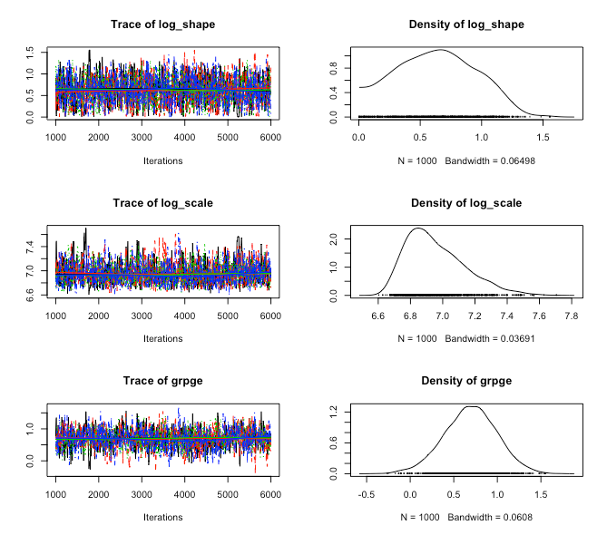

::: article
# Introduction {#sec:intro}

Interval-censoring occurs when observations are not known exactly, but
rather up to an interval. For example, suppose a component of a machine
is inspected at time $c_1$ and $c_2$. The component is observed to be
operational at $c_1$, but broken at $c_2$. In such a case, while the
exact failure time is not known, it is known that the event occurred
inside the interval $(c_1, c_2]$. In some cases, these intervals are
small and the interval-censored aspect of the data can be ignored with
only minor biases. For example, if age is reported in years, it is
likely to be interval-censored due to binning, i.e. reporting \"28 years
old\" typically implies age is in the interval $[28, 29)$. Similarly, if
the intervals are non-overlapping, such as reported income brackets, one
can simply treat the data as ordinal data and use appropriate models.
However, if the data set contains moderate sized overlapping intervals,
then interval-censoring methods should be used for valid inference. Note
that a right censored observation can be represented as $(C, \infty)$,
where $C$ is the censoring time, left censoring can be represented as
$[0, C)$ and an uncensored observation occurring at time $t$ can be
represented as $[t, t]$.

Although interval-censoring is not strictly a survival analysis problem
(for example, the Tobit model [@tobit]), this work focuses on the
survival analysis setting in which the outcome of interest is time to
event. A common assumption in many interval censored models, including
those provided by
[***icenReg***](https://CRAN.R-project.org/package=icenReg), is that the
distribution of the inspection times is independent of the event time of
interest [@independenceAssumption]. This can be framed as each subject
having an event time of interest, $t_i$, and a set of inspections
$c_{i0} = 0 < c_{i1} < ... < c_{ik_i} = \infty$ where the subject is
inspected to determine if the event has occurred. The interval
$[c_{ij}, c_{ij+1})$ such that $t_i \in [c_{ij}, c_{ij+1})$ is then
recorded as the interval for subject $i$. The independence assumption
states that $t_i$ is independent of $c_{ij}$.

The standard univariate estimator is the non-parametric maximum
likelihood estimator (NPMLE) [@npmle], which can be viewed as a
generalization of the Kaplan-Meier curves [@kaplan] that allow for
interval-censoring [@partiallyOpen]. Many of the standard survival
regression models can be extended to the interval-censored such as the
proportional hazards, accelerated failure time (AFT) model and
proportional odds. Semi-parametric models in which the baseline
distribution is fit with the NPMLE are often used to avoid the need to
specify the baseline distribution [@ic_coxph], [@propOdds1]. While it
has been shown that the regression coefficients are asymptotically
normal and bootstrap procedures can be used for inference on the
regression parameters [@ic_coxph_asyp], it is also noted that the
asymptotic distribution of the baseline survival curve is currently an
open question. This implies that while standard errors can be produced
for the regression coefficients, quantifying the uncertainty in
estimated survival probabilities when using the semi-parametric models
is not currently available; even the bootstrap estimator has been shown
to be inconsistent [@badBoot]. It has also been noted that while the
regression coefficients are consistent, a non-trivial upward bias in the
coefficient estimates has been observed [@coxphICM]. Fully parametric
regression survival models can also be used and are fairly
straightforward to implement [@parametric]. In contrast to
semi-parametric models, fully parametric models provide more efficient
inference and allow for quantification of uncertainty of survival
estimates at the cost of requiring assumptions of the family of baseline
distribution, although it has been shown empirically that inference is
fairly robust to mis-specification of the baseline distribution
[@proParametric]. Fully parametric models can be easily extended to the
Bayesian framework [@bayesIC]. For a thorough review of the
non-parametric, semi-parametric and fully-parametric models in the
interval-censoring context, see [@SunBook]. In this work, we focus on
parametric regression models in the Bayesian framework.

In general, interval-censored data is less informative than uncensored
data. As such, incorporating prior information into an analysis using
Bayesian methods can be especially useful. Recent additions to the R
package ***icenReg*** [@icenReg] allow for simplified Bayesian analysis
using standard regression formulas and user written prior functions. In
Section [2](#sec:models), the regression models available in
***icenReg*** are mathematically formulated. In Section [3](#sec:bayes),
the general form of the posterior distribution is presented and the MCMC
sampler is briefly discussed. In Section [4](#sec:coreFxn), the core
Bayesian functions in ***icenReg*** are presented. In Section
[5](#sec:example), an example analysis on a classic dataset is
presented.

# Regression models {#sec:models}

To completely define a parametric survival regression model, one needs
to specify the

-   Baseline distribution

-   Effect of the covariates on the baseline distribution

In ***icenReg***, several classic survival baseline distributions are
included: Weibull, gamma, exponential, log-normal and log-logistic.

At this time, three classic regression models are supported in
***icenReg***: proportional hazards, AFT and proportional odds. In
describing these regression models, we use several standard survival
definitions. Defining $f(t)$ and $F(t)$ to represent the probability
density function and cumulative density function for a given
distribution, the survival distribution is defined as $S(t) = 1 - F(t)$
and the hazard function $h(t) = \frac{f(t)}{S(t)}$. The functions
$h_o(t)$ and $S_o(t)$ represent the baseline hazard and survival
function; i.e. the corresponding functions if all covariates are equal
to 0. The vector $X$ represents a subject's covariates, $\alpha$
represents a vector of parameters defining the baseline distribution and
$\beta$ represents a vector of regression coefficients.

The proportional hazards model can be defined as having the relation

$$h(t | \alpha, \beta, X) = h_o(t | \alpha) \exp(X^T \beta).$$

This definition can be used to interpret a regression coefficient
$\beta_j$ as a one unit increase in $x_j$ is associated with an
$\exp(\beta_j)$ fold increase in the hazard at any time.

The proportional odds model is defined as the relation

$$\frac{S(t | \alpha, \beta, X)}{1 - S(t| \alpha, \beta, X)} = 
\exp(X^T \beta) \frac{S_o(t | \alpha)}{1 - S_o(t | \alpha)}.$$

This definition can be used interpret a regression coefficient $\beta_j$
as a one unit increase in $x_j$ is associated with $\exp(\beta_j)$ fold
increase in the odds of survival at any given time.

The AFT model is defined by the relation

$$S(t | \alpha, \beta, X) = S_o(t \exp(X^T \beta) | \alpha).$$

This definition can be used to interpret a regression coefficient
$\beta_j$ as a one unit increase in $x_j$ is associated with events
occuring $\exp(\beta_j)$ fold faster.

To define the likelihood function, we let $n_1$ be the number of
uncensored subjects, $n_2$ be the number of interval-censored subjects
(note that this can include left and right censored subjects), $t_i$ be
subject $i$'s event time if subject $i$ is uncensored, $\{L_i, R_i\}$ be
the left and right side of the interval containing subject $i$'s event
time if subject was censored and $X_i$ be a vector of subject $i$'s
covariates. Then the likelihood can be written as

$$\displaystyle
\prod_{i = 1}^{n_1} f(t_i | \alpha, \beta, X_i) \times 
\prod_{i = n_1 + 1}^{n_1 + n_2} S(L_i | \alpha, \beta, X_i) - S(R_i | \alpha, \beta, X_i)$$
under the implication that if $n_1$ or $n_2$ are equal to $0$, the
corresponding term of the likelihood function reduces to $1$.

#  Bayesian inference  {#sec:bayes}

To perform Bayesian inference, the prior is multiplied by the likelihood
function to form the posterior distribution. For the Bayesian models
included in ***icenReg***, the posterior distribution is proportional to

$$p(\alpha, \beta) \times
\displaystyle
\prod_{i = 1}^{n_1} f(t_i | \alpha, \beta, X_i) \times 
\prod_{i = n_1 + 1}^{n_1 + n_2} S(L_i | \alpha, \beta, X_i) - S(R_i | \alpha, \beta, X_i)$$

where $p$ is the prior distribution on the $\alpha$ and $\beta$
parameters. Because the posterior is not in closed form for these
models, Markov Chain Monte Carlo (MCMC) methods are used to draw samples
from the posterior distribution.

In ***icenReg***, MCMC sampling is carried out by an adaptive block
updater [@adaptiveBlock]. Default behavior is to first calculate the
maximum likelihood estimator (MLE)[^1], use the MLE point estimates as
initial values and the inverse Fisher's information as an initial
estimate for the posterior covariance. During the burn-in period, the
posterior covariance is updated. A default target acceptance rate of
$0.25$ is used, as suggested in [@gelmanAccept].

Alternatively, the user can specify *not* to use the MLE and Fisher's
information to build the starting proposal distribution. In this case,
the starting proposal covariance matrix will be the identity matrix
multiplied by a user-provided scalar (by default $0.1$), which then has
the option to adaptively learn the covariance matrix. While this is
generally not recommended for efficiency purposes, it may be beneficial
when the prior is strongly informative compared with the likelihood
function. As an extreme example, if all the data were right censored,
the MLE would be degenerate but an informative prior can still lead to
valid Bayesian inference. In such cases, starting at the MLE would cause
the MCMC algorithm to fail.

# Core functionality {#sec:coreFxn}

  ------------------------------------------------------------------------------------------------
  Function Name       Basic Description                                                         
  ------------------- ------------------------------------------------------------------------- --
  `ic_bayes()`        Fit Bayesian interval-censored regression model                           

  `bayesControls()`   Outputs control parameters for MCMC algorithm                             

  `sampleSurv()`      Draws samples *of* the posterior survival distribution                    

  `ic_sample()`       Draws samples *from* the posterior survival distribution                  

  `imputeCens()`      Draw samples *from* the distribution, conditional on censoring interval   

  `survCIs()`         Credible intervals for survival curve                                     

  `plot()`            Plots posterior median survival curve                                     
  ------------------------------------------------------------------------------------------------

  : 

The workhorse for fitting Bayesian regression models is `ic_bayes()`.
The arguments are defined as the following.

``` r
  ic_bayes(formula, data, 
           logPriorFxn = function(x) return(0), 
           model = "ph", dist = "weibull", 
           weights = NULL, controls = bayesControls(),
           useMCores = F) 
```

The `formula` argument declares the likelihood function in the same
manner as other ***icenReg*** model functions, to be demonstrated in the
following section. The `logPriorFxn` argument allows the user to write a
custom prior function that takes in a vector of parameters and returns
the log prior density (or a value equal up to an additive constant). The
order of the values should be the same order as the parameters returned
when a user calls `coef()` on a model. Default behavior is to use a flat
prior. The `model` argument declares the regression model, with choices
`"ph"` (proportional hazards), `"po"` (proportional odds) and `"aft"`
(accelerated failure time). The `dist` defines the baseline
distribution, with options `"exponential"`, `"weibull"`, `"gamma"`,
`"lnorm"` (log-normal) and `"loglogistic"`. The function argument
`controls` accepts a list of control parameters for the MCMC sampler,
see `?bayesControls` for details of options. The argument `useMCores` is
a logical variable indicating whether the multiple chains should be run
in parallel. If set to `TRUE`, a cluster must be registered in advance;
this is demonstrated in Section [5](#sec:example).

The output from `ic_bayes()` provides a list of samples from the
posterior of $\alpha$ and $\beta$. Users are often interested in the
survival probabilities for subjects with different sets of covariates,
which requires a decent amount coding and double checking differing
distribution parameterization. To simplify this process, the
`sampleSurv()` function allows a user to take draws of the posterior
survival distribution for a given set of covariates. The arguments are
defined as

``` r
sampleSurv(fit, newdata = NULL, 
           p = NULL, q = NULL, 
           samples = 100) 
```

The argument `fit` is a fit returned from `ic_bayes()`. The argument
`newdata` is a `"data.frame"` which includes the set of covariates from
which we would like to draw the posterior probabilities from. If
`newdata` is `NULL`, the baseline distribution is used. A user should
either provide a numeric vector `p` of percentiles to sample *or* a
numeric vector `q`, a set of times to sample the cumulative
probabilities at.

The function `ic_sample()` allows a user to take posterior samples of
event times for a given set of covariates. The arguments are defined as

``` r
ic_sample(fit, newdata = NULL, 
          sampleType = "fullSample", 
          samples = 5) 
```

The argument `sampleType` has two options: `"fullSample"`, in which
event times are sampled from the full posterior and `"fixedParSample"`,
in which event times are sampled conditional on the MAP estimates.

In some cases, a user may wish to impute posterior samples of the exact
event times for the response variables in their dataset. This may be for
the purpose of inferring the distribution of the exact event time for a
specific subject, or for passing the data to an analysis tool that does
not account for interval-censoring. This can be done with
`imputeCens()`. The arguments are defined as

``` r
imputeCens(fit, newdata = NULL, 
           imputeType = "fullSample", 
           samples = 5)
```

The arguments are the same as `ic_sample()`, except that the `newdata`
`"data.frame"` must include a pair of columns that contain the lower and
upper bounds of the response variable. If `newdata` is set to `NULL`,
`imputeCens()` will impute all the rows from the original dataset.

The function `survCIs()` returns credible intervals for the survival
distribution, along with the posterior mean and posterior median
estimates. The arguments for `survCIs()` are

``` r
survCIs(fit, newdata = NULL, 
        p = NULL, q = NULL, 
        ci_level = 0.95, 
        MC_samps = 40000) 
```

Finally, the `plot()` function accepts the following arguments

``` r
plot(x, newdata = NULL, 
     plot_legend = T, lgdLocation = "topright",
     cis = T, ci_level = 0.9, 
     ...)
```

In this case, `x` should be a fit from `ic_bayes()`, `newdata` is a
`"data.frame"` with a set of covariates to determine the survival
functions to plot, `plot_legend()` is a logical argument indicating
whether to include a legend with labels provided by the rownames of
`newdata`, `cis` is a logical indicator for whether credible intervals
should be included, `ci_level` is the credible levels for the credible
intervals, and `...` is additional arguments to be passed to the base
`plot()` function. Note that if the `col` argument is supplied, each
color will be matched to the corresponding row of `newdata`. The solid
lines plotted are the posterior median survival probabilities, with
dashed lines representing the upper and lower limits of the credible
interval.

# Example analysis {#sec:example}

To demonstrate the use of Bayesian regression models in ***icenReg***,
we will use the `miceData` dataset included in ***icenReg***
[@miceData]. This dataset examined occurrances of lung cancer in RFM
mice (bred for high rates of cancer) kept in two different environments;
conventional environment (ce) or germ-free environment (ge). At
different ages, mice are sacrificed and examined for lung tumors. If
mouse $i$ is inspected at age $C_i$ and a tumor is found, then time of
onset is recorded as being in the interval $[0, C_i]$. If no tumor is
found, then the time of onset is recorded as being in the interval
$(C_i, \infty)$. Note that this form of data is referred to as current
status data.

We first load the ***icenReg*** library along with
[***foreach***](https://CRAN.R-project.org/package=foreach)
[@foreach-2017-98] and
[***doParallel***](https://CRAN.R-project.org/package=doParallel)
[@doParallel-2017-98], which are required to run MCMC chains in
parallel.

``` r
library(icenReg)
library(foreach)
library(doParallel)
```

We then load and examine the `miceData` dataset.

``` r
data(miceData)
head(miceData)
##   l   u grp
## 1 0 381  ce
## 2 0 477  ce
## 3 0 485  ce
## 4 0 515  ce
## 5 0 539  ce
## 6 0 563  ce
summary(miceData)
##       l             u         grp    
## Min.   :  0   Min.   :381.0   ce:96  
## 1st Qu.:  0   1st Qu.:809.5   ge:48  
## Median :439   Median :  Inf          
## Mean   :343   Mean   :  Inf          
## 3rd Qu.:644   3rd Qu.:  Inf          
## Max.   :986   Max.   :  Inf    
```

The column "l" and "u" represent the lower and upper end of the
intervals containing the onset time for each mouse. We note that there
are 96 mice in the ce group and 48 mice in the ge group. Because current
status data is fairly uninformative per subject, this dataset contains
limited information about the distribution of time to onset.

For the sake of demonstration, suppose that we had expert information
regarding onset of lung cancer. An expert tells us that (a) after two
years in the conventional environment, the expert is 50% certain that
between 10-30% of the mice will have developed lung tumors and (b)
hazard rates are non-decreasing with age. To incorporate (a), we can set
a $Beta(\alpha = 1.5, \beta = 5.5)$ prior onto the probability of an
event occuring before $t = 730$ for the CE group. For (b), we note the
fact that for the Weibull distribution, a shape parameter below $1$
implies a decreasing hazard, while a shape parameter above $1$ implies
an increasing hazard. To enforce a non-decreasing hazard, we will set
zero probability mass to the shape parameter below $1$. We note that
this is an improper prior: we have put a flat prior of the regression
coefficient.

To demonstrate how to incorporate this into `ic_bayes()`, we first look
at the parameters that will be handed to our prior function. This will
be vector of parameters given in the same form and order as returned by
`coef()`, for either a Bayesian model or maximum likelihood model
(`ic_par()`).

``` r
mle_fit <- ic_par(cbind(l, u) ~ grp,
                  model = "ph", 
                  dist  = "weibull",
                  data = miceData)
coef(mle_fit)
## log_shape log_scale     grpge 
## 0.7071843 6.9481420 0.7861709 
```

All the syntax used for defining models for `ic_par()` is shared with
`ic_bayes()`. In the formula, we define the response by calling
`cbind(l, u)`, where `l` and `u` represent the lower and upper ends of
the interval. We see that we will be given the baseline log shape
parameter, baseline log scale and the coefficient for the dummy variable
indicating belonging to the GE group. We then write our log prior
density function as such:

``` r
expertPrior <- function(x){
   # Extracting parameters from input
   shape <- exp(x[1])
   scale <- exp(x[2])
   ge_coef <- x[3]
   
   # ans is log-density of the prior 
   ans <- 0
   # First prior: S(730) ~ beta(1.5, 5.5)
   # Note that we are using a Weibull distribution
   s_730 <- 1 - pweibull(730, shape = shape, scale = scale)
   ans <- ans + dbeta(s_730, 1.5, 5.5, log = TRUE)
   # Second prior: shape >= 1
   if(shape < 1) ans <- -Inf
   return(ans)
}
```

This prior is then provided to the `ic_bayes()` function. We use
***doParallel***'s `registerDoParallel()` to sample from the 4 chains in
parallel.

``` r
myClust <- makeCluster(4)
registerDoParallel(myClust)
bayes_fit <- ic_bayes(cbind(l,u) ~ grp, 
                      data = miceData,
                      model = "ph", dist = "weibull",
                      logPriorFxn = expertPrior,
                      useMCores = TRUE)
stopCluster(myClust)
```

We can examine the results using the `summary()` method.

``` r
summary(bayes_fit)

## Model:  Bayesian Cox PH
## Baseline:  weibull 
## Call: ic_bayes(formula = cbind(l, u) ~ grp, data = miceData, logPriorFxn = expertPrior, 
##     model = "ph", dist = "weibull", useMCores = T)
##  
##  
## Iterations = 1001:5996
## Thinning interval = 5 
## Number of chains = 4 
## Sample size per chain = 1000 
##  
## 1. Empirical mean and standard deviation for each variable,
##    plus standard error of the mean:
##  
##             Mean     SD Naive SE Time-series SE
## log_shape 0.6337 0.3220 0.005092       0.008220
## log_scale 6.9570 0.1829 0.002892       0.005239
## grpge     0.6916 0.3014 0.004765       0.007971
##  
## 2. Quantiles for each variable:
##  
##              2.5%    25%    50%    75% 97.5%
## log_shape 0.04927 0.3860 0.6316 0.8685 1.228
## log_scale 6.68745 6.8180 6.9221 7.0694 7.384
## grpge     0.08428 0.4928 0.6967 0.8965 1.274
##  
## 3. MAP estimates:
## log_shape log_scale     grpge 
##    0.9118    6.8550    0.7530 
```

We can access the raw MCMC samples from the `$mcmcList` field. This is a
`"mcmcList"` object [@coda], and as such all the standard
[***coda***](https://CRAN.R-project.org/package=coda) methods can be
used directly on this object. For example, if we want traceplots and
marginal density estimates of the samples, we can directly call
`plot()`. The results are plotted on Figure [1](#fig:traceplots).

``` r
plot(bayes_fit$mcmcList)
```

{#fig:traceplots
width="100%" alt="graphic without alt text"}

We can examine a plot of the posterior survival distribution using the
`plot()` method. If we do not provide any new data, the baseline
survival distribution will be plotted. This is demonstrated on Figure
[2](#fig:baseline). The solid line is the median posterior survival
probability at any given time, with the dashed lines representing upper
and lower credible intervals for the survival probabilities.

``` r
plot(bayes_fit, 
     main = "Posterior Baseline Survival", 
     col = "blue", 
     lwd = 2)
```

{#fig:baseline width="100%" alt="graphic without alt text"}

More often, we would like to plot the survival distribution for a given
set of covariates, or compare the survival distribution for two
different sets of covariates. This can be done by providing a new data
set with the covariates of interest, as is done in the code below. If
more than one row of data is provided, a legend is added with the row
names of the new data set. The location of the legend can be changed
using the `lgdLocation` argument. To keep the plot from looking overly
cluttered, we will remove the credible bands in this example. The plot
can be seen on Figure [3](#fig:compareCurves).

``` r
plot(bayes_fit, 
     newdata = newdata,
     main = "Comparing Survival Curves",
     col = c("blue", "orange"), 
     lwd = 2, 
     cis = F, 
     lgdLocation = "topright")
```

{#fig:compareCurves width="100%" alt="graphic without alt text"}

Using the `survCIs()` function, we can extract credible intervals for
the survival function with a given set of covariates, along with the
posterior mean and posterior medians.

``` r
survCIs(bayes_fit, 
        newdata = newdata, 
        p = seq(from = 0.1, to = 0.9, by = .2), 
        ci_level = 0.95)
## Model call:
##   ic_bayes(formula = cbind(l, u) ~ grp, data = miceData, logPriorFxn = expertPrior, 
##     model = "ph", dist = "weibull", useMCores = T)
## Credible Level = 0.95 
## Rowname:  Conventional 
##      Percentile estimate (mean) estimate (median)     lower     upper
## [1,]        0.1        308.7645          310.4224  165.6698  450.7731
## [2,]        0.3        598.7705          597.9676  471.6719  736.6549
## [3,]        0.5        876.7032          843.0287  700.4579 1242.3366
## [4,]        0.7       1217.7391         1133.4531  849.1271 2013.4947
## [5,]        0.9       1816.5917         1604.8638 1036.7680 3629.9967
## Rowname:  Germ-free 
##      Percentile estimate (mean) estimate (median)     lower     upper
## [1,]        0.1        217.1181          211.0069  71.82923  402.7130
## [2,]        0.3        403.0740          405.2846 219.64849  579.6520
## [3,]        0.5        574.8200          582.3774 393.62514  723.9960
## [4,]        0.7        780.1581          778.2784 618.57113  957.4698
## [5,]        0.9       1131.2446         1088.8539 899.39371 1573.0770
```

Now suppose we wanted to draw posterior samples of the event time
distribution for each group. For example, we may wish to construct
density plots for event time from each group. This can be done with
`ic_samples()` and is demonstrated in the code below. The generated plot
can be found on Figure [4](#fig:posteriorTimes).

``` r
eventTimeSamples <- ic_sample(bayes_fit, 
                              newdata = newdata,
                              samples = 4000)
ce_dens <- density(eventTimeSamples["Conventional",], 
                   from = 0)
ge_dens <- density(eventTimeSamples["Germ-free",], 
                   from = 0)
plot(ge_dens, 
     main = "Posterior Densities of Event Times",
     col = "orange", 
     xlim = c(0, 4000), 
     lwd = 2)
lines(ce_dens, 
      col = "blue", 
      lwd = 2)
legend("topright", 
       c("Conventional", "Germ-free"), 
       col = c("blue", "orange"), 
       lwd = 1)
```

{#fig:posteriorTimes width="100%" alt="graphic without alt text"}

Finally, we can draw posterior samples of the event time, given that it
occurs within some specified interval, with `imputeCens()`. To
demonstrate, suppose we were interested in the exact event time for mice
in each group that were sacrificed at one year and found to have no
tumors, implying the event time was right censored at $t = 365$. This
can be expressed in the interval censoring format as
$t \in [365, \infty)$. Below, we use `imputeCens()` to draw posterior
samples of event times conditional on being greater than $365$ and plot
the estimate posterior density in Figure [5](#fig:conditionalTimes).

``` r
# Adding event time intervals
newdata$l <- c(365, 365)
newdata$u <- c(Inf, Inf)
imputedTimes <- imputeCens(bayes_fit, 
                           newdata = newdata, 
                           samples = 4000)
 
ce_dens <- density(imputedTimes["Conventional",], 
                   from = 365)
ge_dens <- density(imputedTimes["Germ-free",], 
                   from = 365)
 
plot(ge_dens, 
     main = "Posterior Densities of Event Times\nConditional on Event in First Year",
     col = "orange", 
     xlim = c(300, 3000), 
     ylim = c(0, 0.0015),
     lwd = 2)
lines(ce_dens, 
      col = "blue", 
      lwd = 2)
legend("topleft", 
       c("Conventional", "Germ-free"), 
       col = c("blue", "orange"), 
       lwd = 1)
```

{#fig:conditionalTimes
width="100%" alt="graphic without alt text"}

# Summary

Interval-censoring occurs when event times are not known exactly, but
rather only up to an interval. Naturally, this results in less
informative data than if the event time were observed exactly. The
potentially weakly informative data further motivates using prior
information about the data generating process to provide a more
informative analysis of a given data set. Bayesian methodology provides
a straightforward framework for incorporating such prior information.
The addition of `ic_bayes()` to the ***icenReg*** package allows for
simple, efficient interval-censored regression models with generic user
provided prior distributions and a variety of tools to simplify
analyses.

# Acknowledgements

The ***icenReg*** package uses
[***Rcpp***](https://CRAN.R-project.org/package=Rcpp) [@rcpp] to
interface R objects with C++. Linear algebra at the C++ level is handled
by the Eigen library [@eigen], which is interfaced with
[***RcppEigen***](https://CRAN.R-project.org/package=RcppEigen)
[@rcppEigen].
:::

[^1]: The MLE and *not* the maximum a posterior (MAP) is used, as the
    likelihood and its derivatives are hard coded into ***icenReg***,
    but priors are allowed to be generically supplied by user without
    derivatives.
