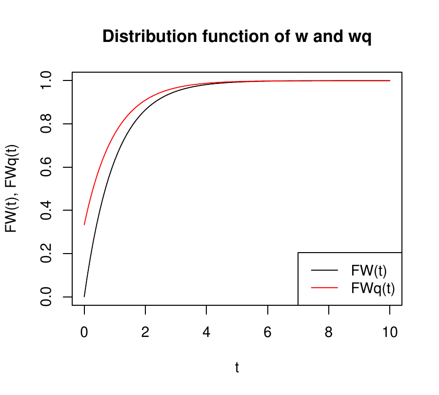
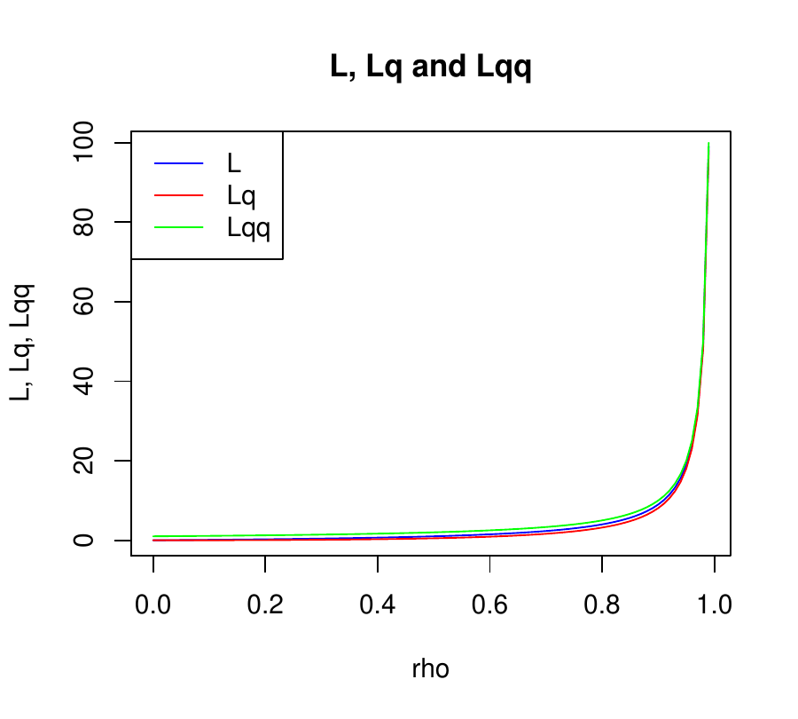
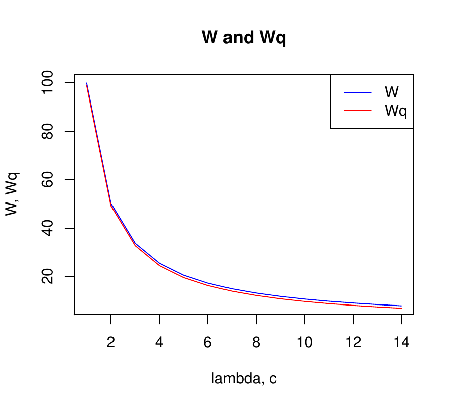
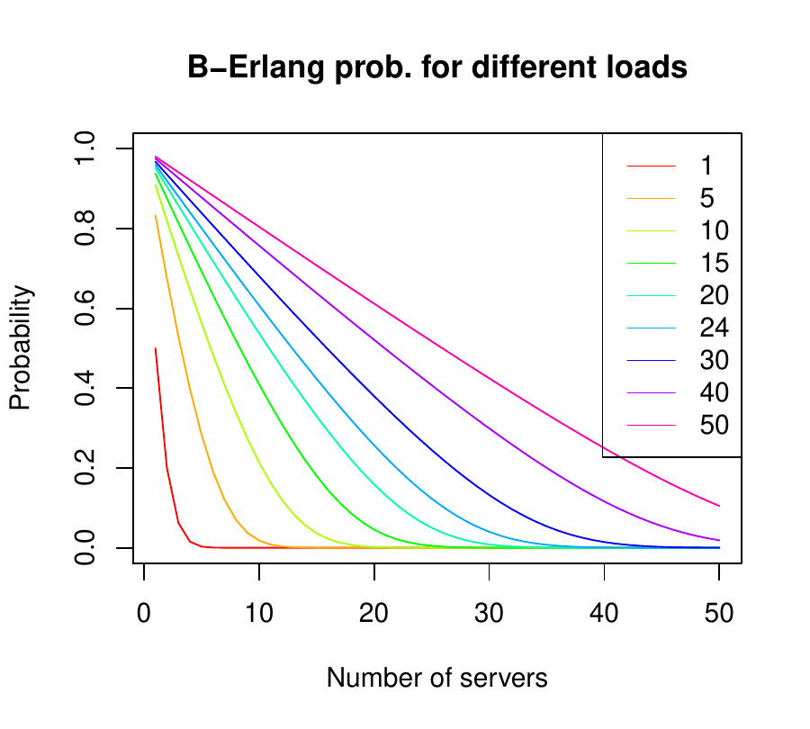

::: article
# Introduction

Queueing theory is a mathematical branch of operations research. A
pioneering work in this field was *The Theory of Probabilities and
Telephone Conversations* by *A. K. Erlang* [@Erlang1909].

Queueing exists when the demand for a service exceeds the available
supply [@Gross1974]. Although the common image of queues is that of
people waiting in line, for example at the supermarket checkout
[@Green2012], queueing models are also used to analyse computer
performance
[@Mitrani1987; @Mitrani1998; @Gelembe80; @Harchol2013; @Puigjaner1995; @Lazowska84; @Kleinrock76],
traffic jams [@Vanderbilt2009] and in many other areas of activity.

Although there are computer programs that are applicable to queueing
theory, to date the statistical computing environment *R* has lacked
specific packages for this purpose.

In 2015 and 2016 respectively,
[*simmer*](https://CRAN.R-project.org/package=simmer) [@simmer] and
[*queuecomputer*](https://CRAN.R-project.org/package=queuecomputer)
[@queuecomputer] were included at *CRAN*. Both apply simulation
techniques to queueing models. Simulation techniques have the great
advantage of flexibility, enabling a system to be represented at the
level of detail desired. The disadvantages are the greater costs
incurred, because many parameters must be defined, a large and complex
program developed (and debugged) and significant computational resources
deployed in order to obtain narrow confidence intervals [@Lazowska84].
[*queueing*](https://CRAN.R-project.org/package=queueing) is a queueing
model solver, which has the advantage of achieving a favourable balance
between accuracy and efficiency [@Lazowska84].

*queueing* provides **R** users with the most widely-used models:
Markovian models, queueing networks and calculators. Although Markovian
models or queueing network models may be viewed as very simple models
with strong assumptions, they have actually been used to accurately
model many real situations, because the accuracy of queueing models is
robust with respect to deviations from prior assumptions [@Lazowska84].

Markovian models include the familiar queues observed in real life at
supermarket and airport checkouts, restaurant queues, etc. The
performance of computer systems can be modelled in a similar way by
assuming that the customers are operating system processes, database
transactions, etc.\
With queueing networks, several classes of customers can be considered,
and therefore sizing, capacity planning and what-if scenarios can be
addressed with robust assumptions [@Lazowska84]. For example, queueing
networks can be observed at airports, where various stages, such as
check-in, passport control and security checks must be completed in turn
before passengers enter the aeroplane.

Finally, calculators are utilities that are used to obtain
probabilities, such as that of a supermarket customer being obstructed,
of a passenger being rejected after arrival, or of a caller being
transferred to hear the operator voice message stating that all phone
lines are busy.

These features of the *queueing* package make it a very valuable tool
for the applied study of queuing theory, in diverse fields of
application, including the following:

-   In education, to facilitate the presentation of class content, for
    learning and practice;

-   In research, to achieve a deeper understanding of the models and
    their principles, using this as a basis for designing more advanced
    models.

-   In health centres, to determine the appropriate size for waiting
    areas and the average time that patients must wait.

-   In database administration, to discover bottlenecks at database
    servers and to accomodate user load.

-   In the design of inbound call-centres, to calculate the optimal
    number of agents required to maintain a given level of service.

# Queueing Package

## Nomenclature

To take into account different forms of queue organisation (limited or
unlimited space, limited or unlimited population, etc.), a nomenclature
of six positions describing the characteristics of the model is usually
used [@Kendall1953]. Its structure is *A/B/C/K/M/Z*, where:

-   A describes the inter-arrival time probability distribution,

-   B describes the service time probability distribution,

-   C is the number of servers or channels,

-   K is the space limit of the service facility in the sense that no
    more than *K* customers can be in the system (*C* in service and
    *K* - *C* waiting in queue),

-   M is the size of the customer population,

-   Z is the queue discipline, i.e how the next customer is chosen from
    the queue when the server completes a service.

When *Z* is *FCFS*, *M* = $\infty$, and *K* = $\infty$, the last three
positions are omitted.

Thus, *M/M/1/$\infty$/$\infty$/FCFS*, abbreviated to *M/M/1*, describes
a model in which the inter-arrival and service times are both
exponential (*M* is obtained from the Markovian property of the
exponential distribution); there is a single server in a facility that
does not impose any restriction on the number of customers; customers
arrive from a population that is considered infinite in the sense that
the arrival of an individual does not modify the probability of the next
arrival; and *FCFS* (*F*irst *Come*, *F*irst *S*erved) is the most
frequent way in which the next customer to be served is chosen from the
queue.

## Package contents

The package built provides a solution for two families of models, and
three commonly-used calculators:

-   **Markovian models**: in which inter-arrival and service times are
    both distributed exponentially
    [@Pazos2003; @Sixto2004; @Gross1974; @Kleinrock75]:

1.  *M/M/1*

2.  *M/M/c*

3.  *M/M/$\infty$*

4.  *M/M/1/K*

5.  *M/M/c/K*

6.  *M/M/c/c*

7.  *M/M/1/K/K*

8.  *M/M/c/K/K*

9.  *M/M/c/K/m*

10. *M/M/$\infty$/K/K*

-   **Operational models** (used mainly in modelling computer
    performance, see @Lazowska84):

1.  *Multiple channel open Jackson networks*

2.  *Multiple channel closed Jackson networks*

3.  *Single channel multiple class open networks*

4.  *Single channel multiple class closed networks*

5.  *Single channel multiple class mixed networks*

-   **Calculators**:

1.  *B-Erlang*

2.  *C-Erlang*

3.  *Engset*

## Structure of *queueing* package {#structure-of-package}

The *queueing* package was developed taking into account the **S3**
special class of functions in **R**. With this type of function,
different queueuing models can be created in the same way, thus
providing the user with a uniform and easy way to create the models. The
model is created using the following steps:

1.  Create the inputs for the model with the **NewInput** function;

2.  Optionally check the inputs with the **CheckInput** function.

3.  Create the model by calling **QueueingModel**

4.  Print a summary of the model using **print**, or a specific model
    performance measure such as **W**.

Although step 2 is optional (as it is applied when the **QueueingModel**
function is called), it is recommended that the inputs should always be
checked, as this makes it easier to understand the data and, thus to
correctly build the model.

The following code is an example of a model using *queueing*. It can be
thought of as cars arriving at a petrol station, following an
exponential distribution at the rate $\lambda$ = 2. The cars are served
exponentially distributed at the rate $\mu = 3$.

This situation is modelled in *queueing* using a single node in which
the customer inter-arrival time and service time both follow an
exponential distribution, at the rates $\lambda$ = 2 and $\mu = 3$
respectively, as shown in Figure [1](#figure:single_node).

{#figure:single_node width="100%" alt="graphic without alt text"}

``` r
# Load the package
library(queueing)

# Create the inputs for the model.
i_mm1 <- NewInput.MM1(lambda=2, mu=3)

# Optionally check the inputs of the model
CheckInput(i_mm1)

# Create the model
o_mm1 <- QueueingModel(i_mm1)

# Print on the screen a summary of the model 
print(summary(o_mm1), digits=2)
```

``` r
#>   lambda mu c  k  m   RO   P0  Lq   Wq X L W Wqq Lqq
#> 1      2  3 1 NA NA 0.67 0.33 1.3 0.67 2 2 1   1   3
```

The output of the model also includes components, as the functions
$F_{W_q}(t)$ and $F_W(t)$, which can be used to view the cumulative
probability distribution of the random variables $w_q$ (time waiting)
and *w* (time in the system: time in queue + time being served),
assuming *FIFO*(*F*ist *I*n, *F*irst *O*ut) or *FCFS*(*F*ist *C*ome,
*F*irst *S*erved) as the queue discipline. Accordingly, $F_{W_q}(t)$ is
the probability of a customer waiting for a time less than or equal to
*t* for service [@Gross1974].

As can be seen in Figure [2](#fig:w_wq), the probability of a customer
having to wait for at least 4 units of time is 1, and this coincides
with the probability of a customer having to spend 4 total units of time
in the system.

``` r
gTitle <- "Distribution function of w and wq"
fw   <- o_mm1$FW
fwq  <- o_mm1$FWq
n    <- 10
ty   <- "l"
ylab <- "FW(t), FWq(t)"
xlab <- "t"
cols <- c("black", "red")
leg  <- c("FW(t)", "FWq(t)")

curve(fw, from=0, to=n, type=ty, ylab=ylab, xlab=xlab, col=cols[1], main=gTitle)
curve(fwq, from=0, to=n, type=ty, col=cols[2], add=T)
legend("bottomright", leg, lty=c(1, 1), col=cols)
```

<figure id="fig:w_wq">

<figcaption>Figure 2: Distribution of random variables w and wq. As can
be seen, from t=4, both variables has probability of 1</figcaption>
</figure>

## Performance metrics comparision

*queueing* provides functions returning the outputs of the model, and
therefore additional **R** functions can be developed to study the
effect of changing model inputs. For example:

-   Change the input parameter $\lambda$ in the model *M/M/1*:

``` r
L_f_aux   <- function(x){L  (QueueingModel(NewInput.MM1(lambda=x, mu=1, n=-1)))}
Lq_f_aux  <- function(x){Lq (QueueingModel(NewInput.MM1(lambda=x, mu=1, n=-1)))}
Lqq_f_aux <- function(x){Lqq(QueueingModel(NewInput.MM1(lambda=x, mu=1, n=-1)))}

L_f   <- function(v){sapply(v, L_f_aux)}
Lq_f  <- function(v){sapply(v, Lq_f_aux)}
Lqq_f <- function(v){sapply(v, Lqq_f_aux)}

gt     <- "L, Lq and Lqq"
ylab   <- "L, Lq, Lqq"
xlab   <- "rho"
n      <- 100
to     <- 0.99
ty     <- "l"
lty    <- c(1, 1, 1)
cols   <- c("blue", "red", "green")
leg    <- c("L", "Lq", "Lqq")

curve(L_f,   from=0, to=to, n=n, ylab=ylab, xlab=xlab, col=cols[1], type=ty, main=gt)
curve(Lq_f,  from=0, to=to, n=n, col=cols[2], add=T, type=ty)
curve(Lqq_f, from=0, to=to, n=n, col=cols[3], add=T, type=ty)
legend("topleft", leg, lty=c(1, 1, 1), col=cols)
```

<figure id="fig:L_Lq_Lqq">

<figcaption>Figure 3: Evolution of the number of customers in system
(L), in queue (Lq) and in queue knowing that queue exists (Lqq). The
three functions exhibit a dramatic increase in the number of customers
as rho tends to 1. Observe that in general, Lqq &gt; L &gt;
Lq</figcaption>
</figure>

As can be seen in Figure [3](#fig:L_Lq_Lqq), the three functions exhibit
a dramatic increase in the number of customers, from $\rho \to 1$.
Observe that $L_{qq}$ \> $L$ \> $L_{q}$. $L$ \> $L_{q}$ because the
number of customers in the system must include the customer currently
receiving the service; the interesting insight here is that $L_{qq}$ \>
$L$, and so merely knowing that there exists a queue raises the number
of customers in the system.

``` r
x <- seq(from=0, to=0.99, by=0.01)
Lqq_f(x) - L_f(x)
```

``` r
#>   [1] 1 1 1 1 1 1 1 1 1 1 1 1 1 1 1 1 1 1 1 1 1 1 1 1 1 1 1 1 1 1 1 1 1 1 1
#>  [36] 1 1 1 1 1 1 1 1 1 1 1 1 1 1 1 1 1 1 1 1 1 1 1 1 1 1 1 1 1 1 1 1 1 1 1
#>  [71] 1 1 1 1 1 1 1 1 1 1 1 1 1 1 1 1 1 1 1 1 1 1 1 1 1 1 1 1 1 1
```

-   The arrival rate changes in line with the number of servers in a
    *M/M/c* model:

``` r
W_f_aux   <- function(x){W  (QueueingModel(NewInput.MMC(lambda=x, mu=1.01, c=x)))}
Wq_f_aux  <- function(x){Wq (QueueingModel(NewInput.MMC(lambda=x, mu=1.01, c=x)))}

W_f   <- function(v){sapply(v, W_f_aux)}
Wq_f  <- function(v){sapply(v, Wq_f_aux)}

gt     <- "W and Wq"
ylab   <- "W, Wq"
xlab   <- "lambda, c"
n      <- 14
ty     <- "l"
leg    <- c("W", "Wq")
lty    <- c(1, 1, 1)
cols   <- c("blue", "red")

curve(W_f, from=1, to=n, n=n, ylab=ylab, xlab=xlab , col=cols[1], type=ty, main=gt)
curve(Wq_f,  from=1, to=n, n=n, col=cols[2], add=T, type=ty)
legend("topright", leg, lty=lty, col=cols)
```

<figure id="fig:w_wq_c">

<figcaption>Figure 4: Evolution of the mean time in queue and in the
system according to lambda and c increase equally. Observe that the time
tends to zero as the number of servers increase</figcaption>
</figure>

Observe in Figure [4](#fig:w_wq_c) that although $\lambda$ and *c*
increase at the same rate, the time tends to zero as the number of
servers increases, meaning that the capacity of the facility increases
faster than the work pending attention.

-   Sometimes it is useful to compare different models, for example to
    measure the impact of duplicating the number of servers or of
    restricting the queue area. *queueing* includes a useful function to
    compare different queueing models, so that the tradeoff between
    performace measures can be seen at a glance.

``` r
o_mm2  <- QueueingModel(NewInput.MMC(lambda=2, mu=3, c=2))
o_mm2k <- QueueingModel(NewInput.MM1K(lambda=2, mu=3, k=5))
CompareQueueingModels(o_mm1, o_mm2, o_mm2k)
```

``` r
#>   lambda mu c  k  m        RO        P0         Lq         Wq        X
#> 1      2  3 1 NA NA 0.6666667 0.3333333 1.33333333 0.66666667 2.000000
#> 2      2  3 2 NA NA 0.3333333 0.5000000 0.08333333 0.04166667 2.000000
#> 3      2  3 1  5 NA 0.6345865 0.3654135 0.78796992 0.41390205 1.903759
#>          L         W       Wqq      Lqq
#> 1 2.000000 1.0000000 1.0000000 3.000000
#> 2 0.750000 0.3750000 0.2500000 1.500000
#> 3 1.422556 0.7472354 0.6717949 2.015385
```

## Queueing Network Models

In addition to the basic Markovian models, *queueing* also offers
several routines with which to build different queueing networks.

Although simple queueing models have been used to correctly model
different situations [@Scherr1967], a queueing network must be used when
several stages or places need to be visited in order to obtain full
service. There are some "special" queueing networks in the simple
models: thus, *M/M/c/K* [@Medhi2003; @Kobayashi1978] and *M/M/c/K/m* are
two examples of closed queueing models.

For models with more than two stations or with different classes of
customers, *queueing* offers single and multiple channel open and closed
Jackson networks, single channel open and closed multiple classes of
customers and single channel mixed networks.

The steps taken to create a queueing network are the same as those for a
single queueing model: the first is to apply the corresponding
*NewInput* function; then, optionally, the *CheckInput* function is
called, to help with the input parameters of the model, and finally the
model is built with the *QueueingModel* function.

The difference between this and the single node model is that there
exist several different functions with which to create the inputs of the
network. For example, for a single-class closed Jackson network, there
are three ways to create the input, as long as the problem has a
probability route or the problem has been defined as operational
[@Denning1978].

For example, imagine the urgent-treatment box of a hospital. Patients
arrive at the rate of 10 patients/hour. A doctor examines each patient
and may provide treatment and then send the patient home, or derive the
patient to a specialist (orthopaedist, cardiologist, etc.), who in turn
may request tests (blood analysis, radiography, etc.), and then send the
patient home or recommend hospitalisation. In the latter case(assuming
there are beds available), treatment will be provided, more checks and
tests may be required and, eventually, the patient will leave (not
always to go home).

In this case, the model used is a single-class Open Jackson network,
with five nodes: general doctor, orthopaedist, cardiologist, checks and
tests box (composed of 15 technicians) and hospitalised (with space for
any number of patients). Except for visiting the general physician, in
no case is a patient allowed to directly enter another node.

The probability route matrix is measured as:

$$\begin{pmatrix}
  0 & 0.3 & 0.2 & 0 & 0  \\
  0 & 0 & 0 & 0.7 & 0.1  \\
  0 & 0 & 0 & 0.8 & 0.15 \\
  0 & 0.3 & 0.7 & 0 & 0  \\
  0 & 0 & 0 & 0.6 & 0.3
\end{pmatrix}$$

The model is built as follows, noting *gd* as general physician, *ort*
as orthopaedist, *car* as cardiologist, *tb* as checks and tests box and
*hos* as hospitalised:

``` r
data <- c(0, 0.3, 0.2, 0, 0, 0, 0, 0, 0.7, 0.1, 0, 0, 0, 0.8, 0.15, 0, 0.4, 0.3, 0, 0.3)
prob <- matrix(data=data, byrow = TRUE, nrow = 5, ncol=5)
gd  <- NewInput.MM1(lambda=10, mu=25, n=0)
ort <- NewInput.MM1(lambda=0,  mu=18, n=0)
car <- NewInput.MM1(lambda=0,  mu=20, n=0)
tb  <- NewInput.MMC(lambda=0, mu=12, c=15, n=0)
hos <- NewInput.MMInf(lambda=0, mu=0.012, n=0)
hospital <- NewInput.OJN(prob=prob, gd, ort, car, tb, hos)
```

The fact that no patient is allowed to visit any doctor other than the
general physician is specified, by setting lambda to zero at the node.

The parameters can be checked using *CheckInput* and the model is built
using *QueueingModel*

``` r
CheckInput(hospital)
m_hospital <- QueueingModel(hospital)
print(summary(m_hospital), digits = 2)
```

``` r
#>       L  W  X     Lk     Wk   Xk     ROk
#> Net 465 47 10     NA     NA   NA      NA
#> Nd1  NA NA NA   0.67  0.067 10.0   0.400
#> Nd2  NA NA NA   1.11  0.111  9.5   0.525
#> Nd3  NA NA NA   0.50  0.050  6.7   0.335
#> Nd4  NA NA NA   1.00  0.100 12.0   0.067
#> Nd5  NA NA NA 462.21 46.221  5.5 462.213
```

As can be seen from the output, results are calculated both for the
complete network and for each node.

*queueing* also allows multiple classes of patients to be created,
although currently only in the operational way [@Denning1978].

At the hospital, the patients arriving at the urgent-treatment box are
usually one of two types: high priority or normal priority.

By appropriately adjusting the input parameters, the problem can now be
modelled as follows:

``` r
classes <- 2
vLambda <- c(2, 10)
nodes   <- 5
vType     <- c("Q", "Q", "Q", "Q", "D")
vHigh   <- c(2, 4, 2, 6, 2)
vNorm   <- c(1, 2, 1, 3, 0.5)
vVisit  <- matrix(data=c(vHigh, vNorm), nrow=2, ncol=5, byrow = TRUE)
sHigh    <- c(1/100, 1/250, 1/300, 1/600, 1/5)
sNorm    <- c(1/90, 1/150, 1/200, 1/300, 1/3)
vService <-matrix(data=c(sHigh, sNorm), nrow=2, ncol=5, byrow = TRUE)

cl_hosp <- NewInput.MCON(classes, vLambda, nodes, vType, vVisit, vService)
```

Some parameters have a different meaning in this model. Although the
order of the classes and nodes is chosen by the modeller, once it is
decided, consistency must be maintained.

-   *classes*: number of classes of patients;

-   *vLambda*: arrival rate of each class, setting high priority first;

-   *nodes*: number of nodes;

-   *vType*: except nodes like hospital (no limit to number of beds
    available), which is "D", the rest are "Q";

-   *vHigh*: average number of visits by each *high priority* patient to
    nodes;

-   *vNorm*: average number of visits by each *normal priority* patient
    to nodes;

-   *vVisit*: recall that order consistency must be preserved;

-   *sHigh*: average service time in each node for *high priority*
    patients;

-   *sNorm*: average service time in each node for *normal priority*
    patients.

As before, the *CheckInput* function should be used before building the
model with *QueueingModel*.

``` r
CheckInput(cl_hosp)
m_cl_hosp <- QueueingModel(cl_hosp)
print(summary(m_cl_hosp), digits = 2)
```

``` r
#>       L    W  X   Lc   Wc Xc    Lk     Wk Xk   ROk   Lck    Wck Xck  ROck
#> Net   3 0.25 12   NA   NA NA    NA     NA NA    NA    NA     NA  NA    NA
#> Cl1  NA   NA NA 0.92 0.46  2    NA     NA NA    NA    NA     NA  NA    NA
#> Cl2  NA   NA NA 2.12 0.21 10    NA     NA NA    NA    NA     NA  NA    NA
#> Nd1  NA   NA NA   NA   NA NA 0.178 0.0148 14 0.151    NA     NA  NA    NA
#> Nd2  NA   NA NA   NA   NA NA 0.198 0.0165 28 0.165    NA     NA  NA    NA
#> Nd3  NA   NA NA   NA   NA NA 0.068 0.0056 14 0.063    NA     NA  NA    NA
#> Nd4  NA   NA NA   NA   NA NA 0.136 0.0114 42 0.120    NA     NA  NA    NA
#> Nd5  NA   NA NA   NA   NA NA 2.467 0.2056  9 2.467    NA     NA  NA    NA
#> CN11 NA   NA NA   NA   NA NA    NA     NA NA    NA 0.047 0.0236   4 0.040
#> CN12 NA   NA NA   NA   NA NA    NA     NA NA    NA 0.038 0.0192   8 0.032
#> CN13 NA   NA NA   NA   NA NA    NA     NA NA    NA 0.014 0.0071   4 0.013
#> CN14 NA   NA NA   NA   NA NA    NA     NA NA    NA 0.023 0.0114  12 0.020
#> CN15 NA   NA NA   NA   NA NA    NA     NA NA    NA 0.800 0.4000   4 0.800
#> CN21 NA   NA NA   NA   NA NA    NA     NA NA    NA 0.131 0.0131  10 0.111
#> CN22 NA   NA NA   NA   NA NA    NA     NA NA    NA 0.160 0.0160  20 0.133
#> CN23 NA   NA NA   NA   NA NA    NA     NA NA    NA 0.053 0.0053  10 0.050
#> CN24 NA   NA NA   NA   NA NA    NA     NA NA    NA 0.114 0.0114  30 0.100
#> CN25 NA   NA NA   NA   NA NA    NA     NA NA    NA 1.667 0.1667   5 1.667
```

In this case, the output has more detailed information than in the
previous model, as the class performance measures are also included.

## Queueing Calculators

The calculators included in *queueing* are frequently used for sizing
call centres, telecomunications systems, etc. 

1.  **Erlang-B**. This function is derived from a *M/M/c/c* model when
    the *c+1* customer arrives when there are *c* already in the system.

2.  **Erlang-C**. This function is frequently used in call centres to
    correctly set the number of agents. It denotes the probability of a
    customer having to queue because all the servers are busy in a
    *M/M/c*.

3.  **Engset**. When the population is finite, that is, when each new
    arrival changes the probability of the next arrival, the *Engset*
    function gives the probability of an arrival having to return to the
    source merely because there is no room availabl. This situation is
    modelled by *M/M/c/c/N* with *c \< N*.

The graphics normally shown in queueing theory books such as
[@Gross1974], page 111, can be easily obtained and improved with the
calculators included:

``` r
servers    <- 1:50
numServers <- length(servers)
rho        <- c(1, 5, 10, 15, 20, 24, 30, 40, 50)
rho_size   <- length(rho)
pRes       <- array(data=0, dim=c(numServers, rho_size))

for (i in 1:numServers)
  for (j in 1:rho_size)
    pRes[i, j] <- B_erlang(i, rho[j])

colrs  <- rainbow(n=rho_size)

xlim  <- c(1, numServers)
ylim  <- c(0, 1)
xlab  <- "Number of servers"
ylab  <- "Probability"
gt    <- "B-Erlang prob. for different loads"
y     <- pRes[, 1]
x     <- servers
col   <- colrs[1]

plot(x=x, y=y, xlim=xlim, ylim=ylim, type="l", col=col, xlab=xlab, ylab=ylab, main=gt)

for (j in 2:rho_size)
  lines(x=1:numServers, y=pRes[, j], col=colrs[j])

leg <- as.character(rho)
tr  <- "topright"
lty <- rep(1, rho_size)
lwd <- rep(0.01, rho_size)

legend(x=tr, legend=leg, lty=lty, lwd=lwd, col=colrs)
```

<figure id="fig:b_erlang">

<figcaption>Figure 5: Probability of not finding an available server as
the number of servers increase</figcaption>
</figure>

# Conclusions

*queueing* is a useful tool for both academic and professional use. In
education, the main models learned in class are presented in detail,
providing numerous performance measures within a versatile tool, helpful
to students and teachers alike. For professionals, the package can be
used both to design and size systems or workloads according to
perfomance requirements, and to explain deviations in systems as they
are evolving.

*queueing* has been developed to make it easy to learn how the
*NewInput*, *CheckInputs* and *QueueingModel* models are built. Both
basic Markovian models and queueing networks can be built using the same
process.

More queue disciplines, together with intermediate and advanced models,
will be included progressively in the package to make it even more
versatile.

# Acknowledgments

This work would not have been possible without the invaluable help of
Yolanda Román Montoya.

*queueing* has its roots in the peerless stochastic processes classes
given by Sixto Ríos Insúa, Alfonso Mateos Caballero, Mª Concepción
Bielza Lozoya and David Ríos Insúa. Although the package is dedicated
especially to the memory of Sixto Ríos Insúa, I am sincerely grateful to
and appreciative of all these outstanding educators.

Finally, I thank everyone who has made contributions and suggestions or
made use of the package.
:::
