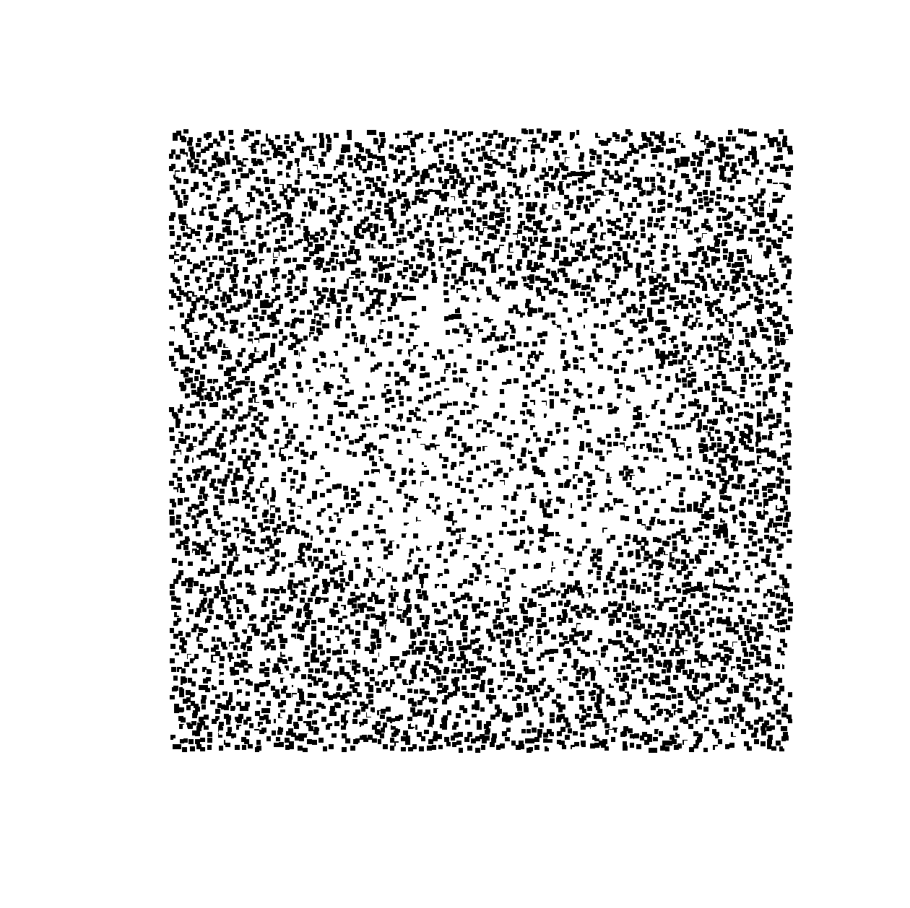
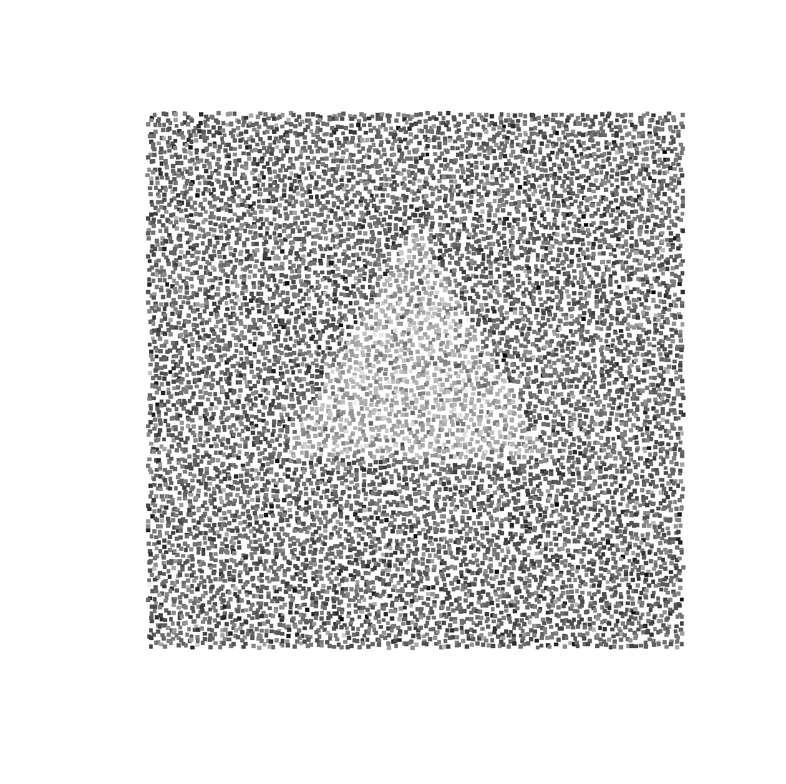
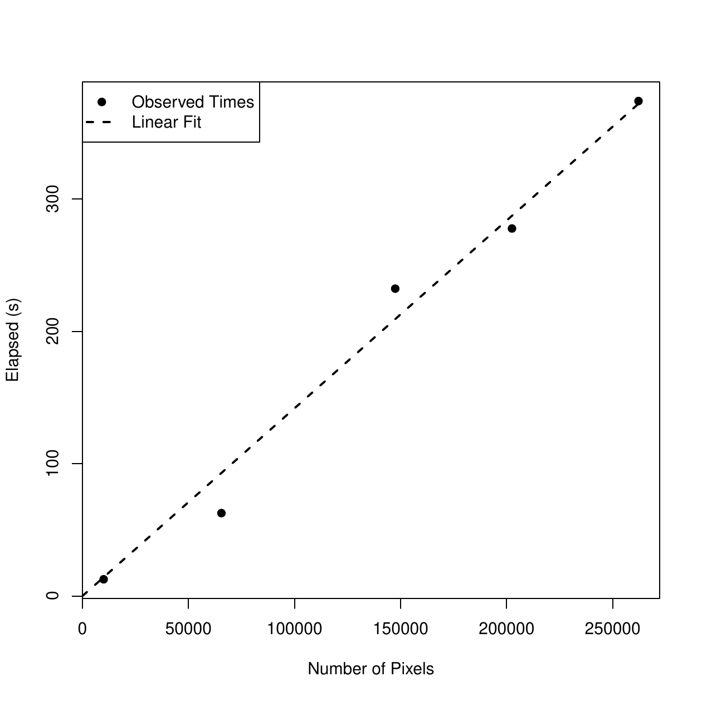
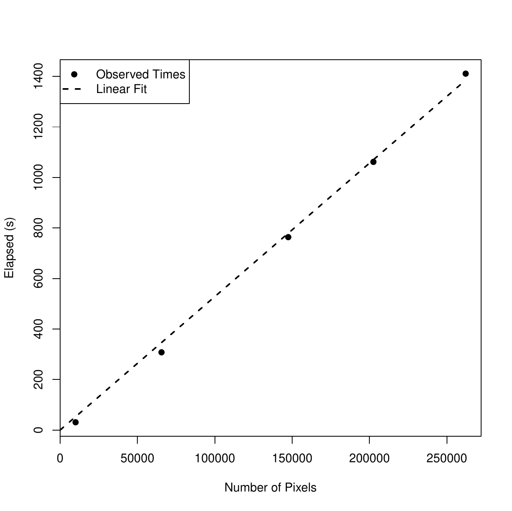
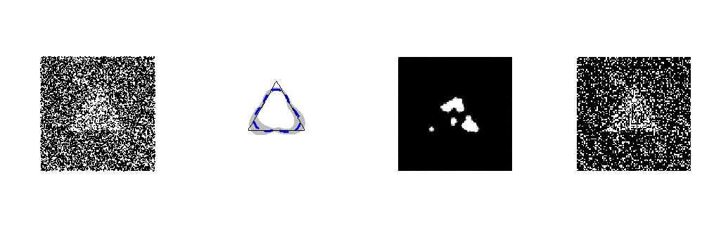
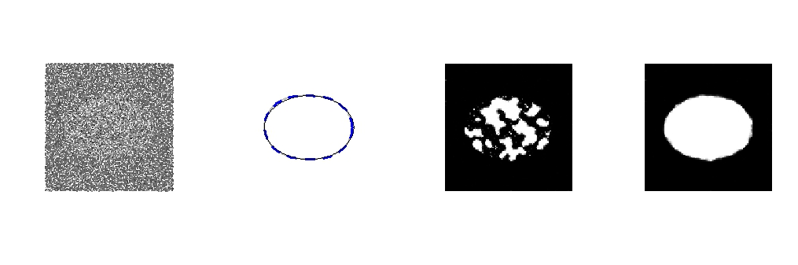
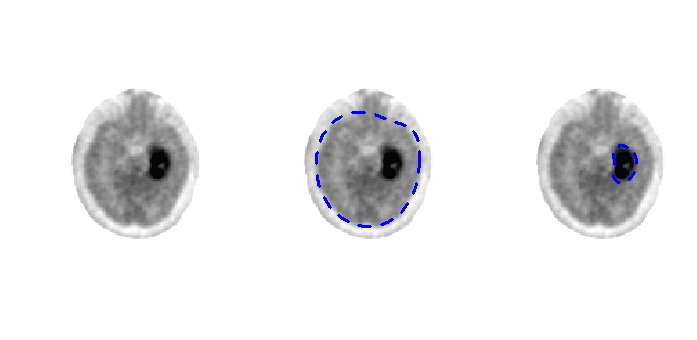
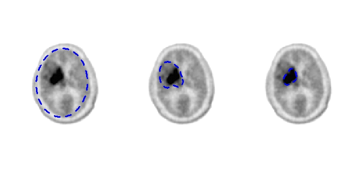

::: article
# Introduction

Boundary estimation is an important problem in image analysis with
wide-ranging applications from identifying tumors in medical
images [@Li.2010], classifying the process of machine wear by analyzing
the boundary between normal and worn materials [@yuan.2016], to
identifying regions of interest in satellite images, such as the
boundary of Scotland's Lake Menteith [@cucala; @marin_book].
Furthermore, boundaries present in epidemiological or ecological data
may reflect the progression of a disease or an invasive species;
see @Waller+Gotway:04, @Lu+Car:05, and @{Fit+:10}.

There is a rich literature on image segmentation for both noise-free and
noisy observations; see the surveys in @Ziou.Tabbone.1998
[@Basu:02; @Maini.Aggarwal.2009; @Bha+Mit:12], and particularly the
Bayesian approaches in @bayes_image_book and @gren_book. Recently,
@Li.Ghosal.2015 developed a flexible nonparametric Bayesian model to
detect image boundaries, which achieved four aims of guaranteed
geometric restriction, (nearly) minimax optimal rate adaptive to the
smoothness level, convenience for joint inference, and computational
efficiency. However, despite the theoretical soundness, the practical
implementation of Li and Ghosal's method is far from trivial, mostly in
the approachability of the proposed nonparametric Bayesian framework and
further improvement in the speed of posterior sampling algorithms, which
becomes critical in attempts to popularize this approach in statistics
and the broader scientific community. In this paper, we present the R
package [*BayesBD*](https://CRAN.R-project.org/package=BayesBD)
[@Syring.Li.BD.2016] which aims to fill this gap. The developed
*BayesBD* package provides support for analyzing binary images and
Gaussian-noised images, which commonly arise in many applications. We
implement various options for posterior calculation including the
Metropolis-Hastings sampler [@MH] and slice sampler [@neal.2003]. To
further speed up the Markov Chain Monte Carlo (MCMC), we take advantage
of the integration via
[*RcppArmadillo*](https://CRAN.R-project.org/package=RcppArmadillo) [@Rcpp; @RcppArmadillo]
of R and the compiled C++ language. We further integrate the *BayesBD*
package with
[*shiny*](https://CRAN.R-project.org/package=shiny) [@shiny] to
facilitate the usage of implemented boundary detection methods in real
applications.

A far as we know, there are no other R packages for image boundary
detection problems achieving the four goals mentioned above. An earlier
version of the *BayesBD* package [@Li.BD.2015] provided
first-of-its-kind tools for analyzing images, but support for
Gaussian-noised images, C++ implementations, more choices of posterior
samplers, and *shiny* integrations were not available until the current
version. For example, the nested loops required for MCMC sampling were
inefficient in R programming. The combination of new programming and
faster sampling algorithms means that a typical simulation example
consisting of $5000$ posterior samples from $10,000$ data points can now
be completed in about one minute.

The rest of the paper is organized as follows. We first introduce the
problem of statistical inference on boundaries of noisy images, the
nonparametric Bayesian models in use, and posterior sampling algorithms.
We then demonstrate how to use the main functions of the package for
data analysis working with both the command line and *shiny*. We next
conduct a comprehensive experiment on the comparison of sampling methods
and coding platforms, scalability of *BayesBD*, and comparisons with
existing packages including *mritc*, *bayesImageS*, and *bayess*. We
illustrate a pair of real data analyses of medical and satellite images.
The paper is concluded by a Summary section.

# Statistical analysis of image boundaries {#S:2}

## Image data

An image observed with noise may be represented by a set of data points
or pixels $(Y_i, X_i)_{i=1}^n$, where the intensities $Y_i$ are observed
at locations $X_i \in \mathcal{X} = [0,1]^2$.
Following [@Li.Ghosal.2015], we assume that there is a closed region
$\Gamma \in \mathcal{X}$ such that the intensities $Y_i$ are distributed
as follows conditionally on whether its location is inside $\Gamma$ or
in the background $\Gamma^c$:
$$\label{eq:setup}
Y_i \sim \left \{
\begin{array}{cc}
f(\cdot; \xi) & X_i \in \Gamma;\\
f(\cdot; \rho) & X_i \in \Gamma^c, 
\end{array} \right.   (\#eq:setup)$$
where $f$ is a given probability mass function or probability density
function of a parametric family up to unknown parameters $(\xi, \rho)$.
For example, Figure [1](#fig:example_data) shows two simulated images
where the parametric family is Bernoulli and Gaussian, respectively.
These images can be reproduced using the functions `par2obs`,
`parnormobs`, and `plotBD` which will be demonstrated in detail later
on.

<figure id="fig:example_data">
<p></p>
<figcaption>Figure 1: Left: a binary image generated using an elliptical
boundary and parameters <span
class="math inline"><em>π</em><sub>1</sub> = 0.65</span> and <span
class="math inline"><em>π</em><sub>2</sub> = 0.35</span>. Right: a
Gaussian-noised image generated using a triangular boundary and
parameters <span class="math inline"><em>μ</em><sub>1</sub> = 1</span>,
<span class="math inline"><em>μ</em><sub>2</sub> =  − 1</span>, and
<span
class="math inline"><em>σ</em><sub>1</sub> = <em>σ</em><sub>2</sub> = 1</span>.
Both images have the size <span class="math inline">100 × 100</span>.
</figcaption>
</figure>

The parameter of interest is the boundary of the closed region
$\gamma := \partial \Gamma$, which is assumed to be closed and smooth,
while $(\xi, \rho)$ are nuisance parameters. We make the following
assumptions about the noisy image:

1.  The pixel locations $X_i$ are sampled either completely randomly,
    i.e., $X_i \stackrel{i.i.d.}{\sim}{\sf Unif}(\mathcal{X} )$ or
    jitteredly randomly, i.e., $\mathcal{X}$ is first partitioned into
    blocks $\mathcal{X}_i$ using an equally-spaced grid and then
    locations are sampled $X_i\sim {\sf Unif}(\mathcal{X}_i)$.

2.  The closed region $\Gamma$ is star-shaped with a known reference
    point $O \in \Gamma$, i.e., the line segment joining $O$ to any
    point in $\Gamma$ is also in $\Gamma$.

3.  The boundary $\gamma$ is an $\alpha-$`<!-- -->`{=html} smooth
    function, i.e., $\gamma \in \mathbb{C}^\alpha(\mathbb{S})$ where
    $$\mathbb{C}^\alpha(\mathbb{S}) := \{f: \mathbb{S}\rightarrow \mathbb{R}^+, |f^{(\alpha_0)}(x) - f^{(\alpha_0)}(y)|\leq L_f\|x-y\|^{\alpha - \alpha_0},\, \forall x,y \in \mathbb{S}\}$$
    , where $\mathbb{S}$ is the unit circle, $\alpha_0$ is the largest
    integer strictly smaller than $\alpha$, $L_f$ is some positive
    constant, and $\|\cdot\|$ is the Euclidean distance.

Assumptions 2 and 3 imply that the region of interest is star-shaped
with a smooth boundary. While these assumptions are crucial to guarantee
desirable asymptotic properties of the estimator implemented in
*BayesBD* and are reasonable in many applications, it is certainly of
great interest to investigate the performance of *BayesBD* when these
assumptions are violated. In what follows, we study numerous examples
that are not uncommon in practice but violate these assumptions to some
extent, to demonstrate the flexibility of *BayesBD* and its capacity to
handle practical images that may be much more complicated than the
two-region setting with assumptions above. These examples include the
triangular boundary in Figure [1](#fig:example_data) which has a
piecewise smooth boundary. and thus violates Assumption 3, and three
real data examples including the image of Lake
Menteith [8](#fig:compare_lake) and two neuroimaging
examples [6](#fig:pet) where multiple regions are present and the region
of interest has non-smooth or even discontinuous boundary.

Letting $\Theta$ be the parameter space of the parametric family $f$,
conditions to separate the inside and outside parameters are needed.
Examples of the parameter space $\Theta^*$ for $(\xi, \rho)$ include but
are not limited to:

-   One-parameter family such as Bernoulli, Poisson, exponential
    distributions, and
    $\Theta^* = \Theta^2 \cap \{(\xi, \rho): \rho < \xi \}$, or
    $\Theta^* = \Theta^2 \cap \{(\xi, \rho): \rho > \xi \}$.

-   Two-parameter family such as Gaussian distributions, and
    $\Theta^* = \Theta^2 \cap \{((\mu_1, \sigma_1), (\mu_2, \sigma_2)): \mu_1 > \mu_2, \sigma_1 = \sigma_2 \}$,
    or
    $\Theta^* = \Theta^2 \cap \{((\mu_1, \sigma_1), (\mu_2, \sigma_2)): \mu_1 > \mu_2, \sigma_1 > \sigma_2 \}$,
    or
    $\Theta^* = \Theta^2 \cap \{((\mu_1, \sigma_1), (\mu_2, \sigma_2)): \mu_1 = \mu_2, \sigma_1 > \sigma_2 \}$.

In practice, the order restriction in 4A or 4B is often naturally
obtained depending on the concrete problem. For instance, in brain
oncology, a tumor often has higher intensity values than its
surroundings in a positron emission tomography scan, while for
astronomical applications objects of interest emit light and will be
brighter. A more general condition for any parametric family can be
referred to Condition (C) in [@Li.Ghosal.2015].

It is worth noticing that although model \@ref(eq:setup) follows a
two-region framework, the method in [@Li.Ghosal.2015] and our developed
*BayesBD* have the flexibility to handle data with multiple regions by
running the two-region method iteratively, which is demonstrated in the
neuroimaging application below.

## A nonparametric Bayesian model for image boundaries

Let $Y = \{Y_i\}_{i = 1}^n$ and $X = \{X_i\}_{i = 1}^n$, then the
likelihood of the image data described in \@ref(eq:setup) is
$$L(Y|X,\theta) = \prod_{i\in I_1}f(Y_i;\xi)\prod_{i \in I_2}f(Y_i;\rho),$$
where $I_1 = \{i:X_i \in \Gamma\}$, $I_2 = \{i:X_i \in \Gamma^c\}$, and
$\theta$ denotes the full parameter $(\xi, \rho, \gamma)$.

We view $\gamma$ as a curve mapping
$[0,2\pi] \rightarrow \mathbb{R}^{+}$ and model it using a randomly
rescaled Gaussian process prior on the circle $\mathbb{S}$:
$\gamma(\omega) \sim \mathsf{GP}(\mu(\omega), G_a(\cdot, \cdot)/\tau)$
where the covariance kernel
$$\begin{aligned}
	G_a(t_1, t_2) &=&  
	\exp({-a^2 \{(\cos 2\pi t_1 - \cos 2 \pi t_2)^2 + (\sin 2\pi t_1 - \sin 2\pi t_2)^2 \} }) \\
	&=& \exp\{- 4a^2 \sin^2(\pi t_1 - \pi t_2) \}
\end{aligned}$$
is the so-called *squared exponential periodic kernel* obtained by
mapping the squared exponential kernel on unit interval $[0, 1]$ to the
circle through
$Q: [0,1] \rightarrow \mathbb{S}, \;\omega \rightarrow (\cos 2 \pi \omega, \sin 2 \pi \omega)$
as in @MacKay:98. The parameters $a$ and $\tau$ control the smoothness
and scale of the kernel, respectively. As shown in @Li.Ghosal.2015, the
covariance kernel has the following closed form decomposition:
$G_a(t,t') = \sum_{k=1}^\infty v_k(a)\psi_k(t)\psi_k(t')$ where
$$v_1(a) = e^{-2a^2}I_0(2a^2); \quad v_{2j}(a) = v_{2j+1}(a) = e^{-2a^2}I_j(2a^2), \; j\geq 1;$$
and $I_n(x)$ denotes the modified Bessel function of the first kind of
order $n$ and $\psi_j(t)$ is the $j$th Fourier basis function in
$\{1, \cos 2\pi t, \sin 2\pi t,...\}$. The above expansion allows us to
write the boundary as a sum of basis functions:
$$\label{eq:decomposition} 
\gamma(\omega) = \mu(\omega) + \sum_{k=1}^\infty z_k\psi_k(\omega),   (\#eq:decomposition)$$
where $z_k \sim {\sf N}(0, v_k(a)/\tau)$. In practice, we truncate this
basis function expansion using the first $L$ functions, i.e.,
$\gamma(\omega)  = \mu(\omega)+\sum_{k=1}^L z_k\psi_k(\omega)$. In the
*BayesBD* package, we use $L = 2J + 1$ with the default $J = 10$, which
seems adequate for accurate approximation of $\gamma(w)$ as shown in
@Li.Ghosal.2015, but users may specify a different value depending on
the application.

We use a Gamma prior distribution Gamma($\alpha_a, \beta_a$) for the
rescaling factor $a$. This random rescaling scheme is critical to obtain
rate adaptive estimates without assuming the smoothness level $\alpha$
in Assumption 3 is known; see, for example,  @van+van:09
and @Li.Ghosal.2015. The default values of hyperparameters are
$\alpha_a = 2$ and $\beta_a = 1$.

We use a constant function as the prior mean function $\mu(\cdot)$, with
value determined by user input or by an initial maximum likelihood
estimation. The other hyperparameter and parameters follow standard
conjugate priors. Specifically, we use a Gamma distribution
Gamma($\alpha_{\tau}, \beta_{\tau}$) prior for $\tau$ with default
values $\alpha_{\tau} = 500$ and $\beta_{\tau} = 1$. Priors for the
nuisance parameters $\xi$ and $\rho$ depend on the parametric family
$f$, which are:

-   For binary images: the parameters are the probabilities
    $(\pi_1, \pi_2) \sim \mathrm{OIB}(\alpha_1, \beta_1, \alpha_1, \beta_1)$,
    where OIB stands for ordered independent Beta distributions.

-   For Gaussian noise: the parameters are the mean and standard
    deviation $(\mu_1, \sigma_1, \mu_2, \sigma_2)$ with prior
    distributions
    $(\mu_1, \mu_2) \sim \mathrm{OIN}(\mu_0, \sigma_0^2, \mu_0, \sigma_0^2)$
    and
    $(\sigma_1^{-2}, \sigma_2^{-2}) \sim \mathrm{OIG}(\alpha_2, \beta_2,  \alpha_2, \beta_2)$,
    where OIN and OIG are ordered independent normal and Gamma
    distributions, respectively.

The orders in OIB, OIN and OIG are provided by users if such information
is available; otherwise, the ordered independent distributions revert to
independent distributions. Our default specifications are chosen to make
the corresponding prior distributions spread out. For example, in the
*BayesBD* package, the default values are $\alpha_1 = \beta_1 = 0$ for
binary images, and $\mu_0 = \bar{Y}, \sigma_0 = 10^3$ and
$\alpha_2 = \beta_2 = 10^{-2}$ for Gaussian noise, where $\bar{Y}$ is
the same mean of all intensities. Under Assumptions 1--4,
 @Li.Ghosal.2015 proved that the nonparametric Bayes approach is
(nearly) rate-optimal in the minimax sense, adaptive to unknown
smoothness level $\alpha$.

## Posterior sampling and estimation of the boundary

Let $z = \{z_i\}_{i = 1}^L$ and
$\Sigma_a = \text{diag}(v_1(a), \ldots, v_L(a))$. We use
Metropolis-Hastings (MH) with the Gibbs sampler [@geman.1984] to sample
the joint distribution of the parameters $(z, \xi, \rho, \tau, a)$,
where the MH step is for the vector parameter $z$. We also allow a slice
sampling with the Gibbs sampler where slice sampling is used for $z$ as
in [@Li.Ghosal.2015]. We give the detailed sampling algorithms for
binary image in Algorithm [1](#algo:sample) and Gaussian-noised images
in Algorithm [2](#algo:sample2). Comparisons between MH and slice
sampling, along with other numerical performances are referred to in the
section on **Performance tests**.

Initialize the parameters: $z = 0$, $\tau = 500$, $a = 1$, and
$\mu(\cdot)$ is taken to be constant, i.e. a circle. Then, initialize
$(\xi, \rho) = (\pi_1, \pi_2)$ by the maximum likelihood estimates given
$\mu(\cdot)$.

1.  At iteration $t+1$, sample
    $z^{(t+1)}|(\pi_1^{(t)}, \pi_2^{(t)},\tau^{(t)},a^{(t)},Y,X)$ one
    entry at a time, using either MH sampling and slice sampling, using
    the following logarithm of the conditional posterior density
    $$N_1 \log\frac{\pi_1^{(t)}(1-\pi_2^{(t)})}{\pi_2^{(t)}(1-\pi_1^{(t)})} + n_1\log\frac{1-\pi_1^{(t)}}{1-\pi_2^{(t)}}-\frac{\tau}{2} (z^{(t)})^\top \Sigma_{a^{(t)}}^{-1}z^{(t)},$$
    where $n_1 = \sum_{i = 1}^n 1(r_i < \gamma_i^{(t)})$ and
    $N_1 = \sum_{i = 1}^n 1(r_i < \gamma_i^{(t)})Y_i$; here
    $(r_i,\omega_i)$ are the polar coordinates of pixel location $X_i$
    and $\gamma_i^{(t)} \:= {\gamma}^{(t)}(\omega_i)$ is the radius of
    the image boundary at iteration $t$ and the $i$th pixel.

2.  Sample
    $\tau^{(t+1)}|z^{(t+1)},a^{(t)}\sim {\sf Gamma}(\alpha^\star,\beta^\star)$
    where $\alpha^\star = \alpha_{\tau} + L/2$ and
    $\beta^\star = \beta_{\tau} + (z^{(t+1)})^\top\Sigma^{-1}_{a^{(t)}}z^{(t+1)}/2$.

3.  Sample
    $(\pi_1, \pi_2)|(z,Y)\sim \sf{}{OIB}$$( \alpha_1+N_1,\beta_1+n_1-N_1,\alpha_1+N_2,\beta_1+n_2-N_2)$,
    where $n_2 = \sum_{i = 1}^n 1(r_i \geq \gamma_i^{(t)})$ and
    $N_2 = \sum_{i = 1}^n 1(r_i \geq \gamma_i^{(t)})Y_i$.

4.  Sample $a^{(t+1)}|(z^{(t+1)}, \tau^{(t+1)})$ by slice sampling using
    the logarithm of the conditional posterior density
    $$-\sum_{k=1}^L \frac{\log v_k(a^{(t)})}{2}-\sum_{k=1}^L\frac{\tau^{(t+1)}z_k^2}{2v_k(a^{(t)})}+(\alpha_a - 1)\log a^{(t)} - \beta_{a}.$$


<figure id="algo:sample">
<figcaption>Algorithm 1: <b>-- Binary images.</b>
</figcaption>
</figure>
Initialize the parameters: $z = 0$, $\tau = 500$, $a = 1$, and
$\mu(\cdot)$ is taken to be constant, i.e. a circle. Then, initialize
$(\xi, \rho) = (\pi_1, \pi_2)$ by the maximum likelihood estimates given
$\mu(\cdot)$.

1.  At iteration $t+1$, sample
    $z^{(t+1)}|(\mu_1^{(t)},\sigma_1^{(t)}, \mu_2^{(t)}, \sigma_2^{(t)},\tau^{(t)},a^{(t)},Y,X)$
    one entry at a time, using either slice sampling or MH sampling,
    using the following logarithm of the conditional posterior density
    $$-n_1(\log \sigma_1^{(t)} - \log \sigma_2^{(t)})-\sum_{i \in I_1}\frac{(Y_i - \mu_1^{(t)})^2}{2(\sigma_1^2)^{(t)}}-\sum_{i \in I_2}\frac{(Y_i - \mu_2^{(t)})^2}{2(\sigma_2^2)^{(t)}}-\frac{\tau (z^{(t)})^\top \Sigma_{a^{(t)}}^{-1}z^{(t)}}{2}.$$

2.  Sample $\tau^{(t+1)}|z^{(t+1)},a^{(t)}$ as in Algorithm 1.

3.  Sample $(\mu_1, \sigma_1, \mu_2, \sigma_2) | (z,Y)$ conjugately.

    -   Sample $(\sigma_1^{-2})^{(t+1)}$ from a Gamma distribution with
        parameters
        $$\alpha = \alpha_2+\frac{n_1}{2}, \hspace{1cm} \beta = \beta_2+\sum_{i \in I_1}\frac{(Y_i - \bar{Y}^{(1)})^2}{2}+\frac{\sigma_0^{-2}n_1}{n_1+\sigma_0^{-2}}\frac{(\bar{Y}^{(1)} - \mu_0)^2}{2},$$
        where $\bar{Y}^{(1)}$ is the sample mean of intensities in
        $I_1$.

    -   sample $\mu_1^{(t+1)}$ from a normal distribution with mean and
        standard deviation
        $$\frac{\sigma_0^{-2}\mu_0}{n_1+\sigma_0^{-2}} + \frac{n_1\bar{y}_1}{n_1+\sigma_0^{-2}}, \hspace{1cm} (n_1+\sigma_0^{-2})^{-1/2}.$$

    -   Sample $(\sigma_2^{-2})^{(t+1)}$ and $\mu_2^{(t+1)}$
        analogously.

    -   If `ordering` information is available, sort
        $(\mu_1^{(t + 1)}, \mu_2^{(t+1)})$ and
        $(\sigma_1^{(t + 1)}, \sigma_2^{(t+1)})$ accordingly.

4.  Sample $a^{(t+1)}|(z^{(t+1)}, \tau^{(t+1)})$ as in Algorithm 1.

<figure id="algo:sample2">
<figcaption>Algorithm 2: <b>-- Gaussian-noised images.</b>
</figcaption>
</figure>
Let $\{{\gamma}_t(\omega)\}_{t = 1}^T$ be the posterior samples after
burn-in where $T$ is the number of posterior samples. We use the
posterior mean as the estimate and construct a variable-width uniform
credible band. Specifically, let
$(\widehat{\gamma}(\omega), \widehat{s}(\omega))$ be the posterior mean
and standard deviation functions derived from $\{{\gamma}_t(\omega)\}$.
For the $t$th MCMC run, we calculate the distance
$u_t = \|(\gamma_t -\widehat{\gamma})/s\|_\infty=\sup_\omega\{ |\gamma_t(\omega) - \widehat{\gamma}(\omega)| /\widehat{s}(\omega) \}$
and obtain the 95th percentile of all the $u_t$'s, denoted as $L_0$.
Then a 95% uniform credible band is given by
$[\widehat{\gamma}(\omega) - L_0 \widehat{s}(\omega), \widehat{\gamma}(\omega) + L_0 \widehat{s}(\omega)]$.

# Analysis of image boundaries using BayesBD from the command line {#S:3}

There are three steps to our Bayesian image boundary analysis: load the
image data into R in the appropriate format, use the functions provided
to sample from the joint posterior of the full parameter
$\theta = (\xi, \rho, \gamma)$, and summarize the posterior samples both
numerically and graphically.

## Generating image data {#sec:simulate.data}

Two functions are included in *BayesBD* to facilitate data simulation
for numerical experiments: `par2obs` for binary images and `parnormobs`
for Gaussian-noised images. Table [1](#tbl:par2obs) describes the
function arguments to `par2obs`, which returns sampled intensities and
pixel locations in both Euclidean and polar coordinates. The function
`parnormobs` is similar, with the replacement of arguments `pi.in` and
`pi.out` by `mu.in`, `mu.out`, `sd.in`, and `sd.out` corresponding to
parameters $\mu_1$, $\mu_2$, $\sigma_1$, and $\sigma_2$, respectively.

As a demonstration, the following code generates a $100 \times 100$
binary image of an ellipse using a jitteredly-random design with a
reference point of (0.5, 0.5):

``` r
> gamma.fun = ellipse(a = 0.35, b = 0.25)
> bin.obs = par2obs(m = 100, pi.in = 0.6, pi.out = 0.4, design = 'J',
+ gamma.fun, center = c(0.5, 0.5))
```

Similarly, the following code generates a $100 \times 100$
Gaussian-noised image with a triangle boundary using a random uniform
design with a reference point of (0.5, 0.5):

``` r
> gamma.fun = triangle2(0.5)
> norm.obs = parnormobs(m = 100, mu.in = 1, mu.out = -1, sd.in = 1, 
+ sd.out = 1, design = 'U', gamma.fun, center = c(0.5, 0.5))
```

The output of either `par2obs` or `parnormobs` is a list containing the
intensities $Y$ in a vector named `intensity`, the vectors `theta.obs`
and `r.obs` containing the polar coordinates of the pixel locations $X$,
and the reference point contained in a vector named `center`. Image data
to be analyzed using *BayesBD* can be in a list of this form, or may be
a `.png` or `.jpg` image file.

::: {#tbl:par2obs}
  --------------------------------------------------------------------------------------
  Argument      Description
  ------------- ------------------------------------------------------------------------
  `m`           Generate $m\times m$ observations over the unit square.

  `pi.in`       The success probability, $P(Y_i = 1)$, if $X_i\in I_1$.

  `pi.out`      The success probability, $P(Y_i = 1)$, if $X_i\in I_2$.

  `design`      Determines how locations $X_i$ are determined: 'D' for deterministic

                (equally-spaced grid) design, 'U' for completely uniformly random,

                or 'J' for jitteredly random design.

                

  `center`      Two-dimensional vector of Euclidean coordinates (x,y) of the reference

                point in $I_1$.

                

                

  `gamma.fun`   A function to generate boundaries, e.g. ellipse or triangle2.
  --------------------------------------------------------------------------------------

  : Table 1: Arguments of the `par2obs` function.
:::

## Analysis and visualization

There are two functions to draw posterior samples following Algorithm 1
and 2 based on images either simulated or provided by users:
`fitBinImage` for binary images, and `fitContImage` for Gaussian-noised
images. These sampling functions take the same arguments, with the
exception of the `ordering` input which is duplicated in `fitContImage`
to allow ordering of the two parameters, i.e., the mean and standard
deviation. The inputs for `fitBinImage` are summarized in
Table [2](#tbl:bayesbd). We have included a function `rectToPolar` to
facilitate formatting the image data for `fitBinImage` and
`fitContImage` by converting the rectangular coordinates of the pixels
to polar coordinates. The initial boundary is a circle with radius
`inimean` and center `center`. The radius `inimean` may be specified by
the user or left blank, in which case it will be estimated using maximum
likelihood.

::: {#tbl:bayesbd}
  ------------- ------------------------------------------------------------------------------------
  `image`       The noisy observation, either a list with elements:

                `intensity`, a vector of intensities;

                `theta.obs` a vector of pixel radian measure from `center`;

                `r.obs` a vector of pixel radius measure from `center`;

                or a string giving the path to a `.png` or `.jpg` file.

  `gamma.fun`   the true boundary, if known, used for plotting.

  `center`      the reference point in Euclidean coordinates.

  `inimean`     A constant specifying the initial boundary $\mu$. Defaults to NULL,

                in which case $\mu$ is estimated automatically using maximum likelihood.

  `nrun`        The number of MCMC runs to keep for estimation.

  `nburn`       The number of initial MCMC runs to discard.

  `J`           The number of eigenfunctions to use in estimation is $2J+1$.

  `ordering`    Indicates which Bernoulli distribution has higher success probability:

                `"I"`, the Bernoulli distribution inside the boundary;

                `"O"`, ther Bernoulli distribution outside the boundary;

                `"N"`, no ordering information is available.

  `mask`        Logical vector (same length as `obs`\$`intensity`) to indicate region of interest.

                Should this data point be included in the analysis? Defaults to NULL

                and uses all data points.

  `slice`       Should slice sampling be used to sample Fourier basis function coefficients?

  `outputAll`   Should all posterior samples be returned?
  ------------- ------------------------------------------------------------------------------------

  : Table 2: Arguments of the `fitBinImage` function.
:::

If argument `outputAll` is `FALSE`, the functions `fitBinImage` and
`fitContImage` produce output vectors `theta`, `estimate`, `upper`, and
`lower` giving a grid of 200 values on $[0,2\pi]$ on which the boundary
$\gamma$ is estimated, along with $95\%$ uniform credible bands. If
argument `outputAll` is `TRUE`, the functions also return posterior
samples of $(\xi, \rho)$ and Fourier basis function coefficients $z$.

Following the examples of data simulation for binary and Gaussian-noised
images in the previous section, we can obtain posterior samples via\

``` r
> bin.samples= fitBinImage(bin.obs, c(.5, .5), NULL, 4000, 1000, 10, "I", NULL, TRUE,                    
+ FALSE)
```

for a binary image and

``` r
> norm.samples = fitContImage(norm.obs, c(.5, .5), NULL, 4000, 1000, 10, "I", "N", NULL,
TRUE, FALSE)
```

for a Gaussian-noised image. For each sampling function, we have set the
center of the image as $(0.5, 0.5)$, instructed the sampler to use a
mean function of $\mu(\cdot) = 0.4$, keep $4000$ samples, burn $1000$
samples, use $L = 2\times 10+1 = 21$ basis functions to model $\gamma$,
use slice sampling for the basis function coefficients, and return only
the plotting results.

Using the function `plotBD` we can easily construct plots of our model
results. There are two arguments to `plotBD`: `fitted.image` is a list
of results from `fitBinImage` or `fitContImage`, and `plot.type` which
indicates whether to plot the image data only, the posterior mean and
credible bands, or the posterior mean overlaid on the image data. Using
the posterior samples we obtained from the Gaussian-noised image above,
we can plot our results with the following code

``` r
> par(mfrow = c(1, 2))
> plotBD(norm.samples, 1)
> plotBD(norm.samples, 2)
```

to produce Figure [2](#plot:plotBD).

{#plot:plotBD width="100%" alt="graphic without alt text"}

# BayesBD *shiny* app

In order to reach a broad audience of users, including those who may not
be familiar with R, we have created a *shiny* app version of *BayesBD*
to implement the boundary detection method. The app has the full
functionality to reproduce the simulations in Section [5](#S:4) and
conduct real data applications using images uploaded by users. The app
is accessible both from the package by running the code `BayesBDshiny()`
in an R session or externally by visiting
<https://syring.shinyapps.io/shiny/>. With the app users can analyze
real data or produce a variety of simulations.

Once the app is open, users are presented with an array of inputs to set
as illustrated in Figure [3](#fig:shiny_disp). In order to analyze real
data, the user should select \"user continuous image\" or \"user binary
image\" from the second drop-down menu. Next, the user inputs the system
path to the `.png` or `.jpg` file. A plot of the image will appear and
the user will be prompted to identify the image center with a mouse
click. The user has some control over the posterior sample size, but we
recommend to first limit the number of available samples in order to
display results quickly. Finally, the user may enter ordering
information for the mean and variance of pixel intensities at the bottom
of the display.

For simulations, we first select either an elliptical or triangular
boundary, or upload an R script with a custom boundary function. Next,
the user instructs the app to either simulate a binary or
Gaussian-noised image, or to use binary or Gaussian data the user has
uploaded. In addition to the boundary function, the user specifies the
reference point. Sample sizes for simulations are kept at
$100 \times 100$ pixels. Finally, the last several inputs allow the user
to customize the intensity parameters $(\xi, \rho)$ for binary and
Gaussian simulations. Once the user has selected all settings, clicking
the \"Update\" button at the bottom of the window will run the posterior
sampling algorithm, which should take less than a minute on a typical
computer for image data of $100 \times 100$ pixels. The \"Download\"
button provides the user with a file indicating which pixels were
contained inside the estimated boundary as determined by the outer edge
of the $95\%$ uniform credible bands.

{#fig:shiny_disp width="100%" alt="graphic without alt text"}

# Performance tests {#S:4}

## Comparison of sampling methods

The main aim of this section is to highlight the speed improvements we
have made in the latest version of *BayesBD*. Our flexibility in
choosing between slice and Metropolis-Hastings (MH) sampling algorithms
gives users the potential to unlock efficiency gains. We highlight these
gains below for both binary and Gaussian-noised simulations, and note
that the faster MH method suffers little in accuracy.

In our performance tests, we consider the following examples, which
correspond to examples B2, B3, and G1 from @Li.Ghosal.2015.

1.  Image is an ellipse centered at $(0.1,0.1)$ and rotated $60^{\circ}$
    counterclockwise. Intensities are binary with $\pi_1 = 0.5$ and
    $\pi_2 = 0.2$.

2.  Image is an equilateral triangle centered at $(0,0)$ with height
    $0.5$. Intensities are binary with $\pi_1 = 0.5$ and $\pi_2 = 0.2$.

3.  Image is an ellipse centered at $(0.1,0.1)$ and rotated $60^{\circ}$
    counterclockwise. Intensities are Gaussian with $\mu_1 = 4$,
    $\sigma_1 = 1.5$, $\mu_2 = 1$, and $\sigma_2 = 1$.

We simulated each case $100$ times using $n = 100 \times 100$
observations per simulation. In each run, we sampled 4000 times from the
posterior after a 1000 sample burn in. The results of our performance
tests comparing slice with MH sampling are summarized in
Table [3](#tbl:sample).

If Metropolis-Hastings sampling is used instead of slice sampling, we
observe a speed up by about a factor of two for binary images, seven for
the Gaussian-noised image. Slice sampling is guaranteed to produce
unique posterior samples, and may give better results than
Metropolis-Hastings samplers, especially when Metropolis-Hastings mixes
poorly and produces many repeated samples. However, slice sampling may
involve a very large number of proposed samples for each accepted
sample, requiring many likelihood evaluations. On the other hand, each
Metropolis Hastings sample requires only two evaluations of the
likelihood.

To measure the accuracy of *BayesBD* we use three metrics: the Lebesgue
error, which is simply the area of the symmetric difference between the
posterior mean boundary and the true boundary; the Dice Similarity
Coefficient(DSC), see @mritc; and Hausdorff distance, see @RadOnc and
@RadOncR. We have included the utility functions `lebesgueError`,
`dsmError`, and `hausdorffError`, which take as input the output of
either `fitBinImage` or `fitContImage` and output the corresponding
error. In the binary image examples considered, the different sampling
algorithms did not affect the accuracy of the posterior mean boundary
estimates when measured by Lebesgue error, i.e., the area of the
symmetric difference between the estimated boundary and the true
boundary. For the Gaussian-noised image, the slice sampling method
produced Lebesgue errors approximately an order of magnitude smaller
than when using Metropolis-Hastings sampling, but the overall size of
the errors was still small in both cases and practically
indistinguishable when plotting results. With our built-in functions, it
is easy to reproduce Example S2 in Table [3](#tbl:sample) with the
following code:

``` r
> gamma.fun = triangle2(0.5)
> for(i in 1:100){
+ 	norm.obs = par2obs(m = 100, pi.in = 0.5, pi.out = 0.2, design = 'J',
+		 			   center = c(0.5, 0.5), gamma.fun)
+ 	norm.samp.MH = fitBinImage(norm.obs, gamma.fun, NULL, NULL, 4000, 1000,
+		 		           10, "I", rep(1, 10000), FALSE, FALSE)
+ 	norm.samp.slice = fitBinImage(norm.obs, gamma.fun, NULL, NULL, 4000, 
+  					   1000, 10, "I", rep(1, 10000), TRUE, FALSE)
+ 	print(c(dsmError(norm.samp.MH), hausdorffError(norm.samp.MH), 	
+ 	        lebesgueError(norm.samp.MH), dsmError(norm.samp.slice), 
+ 		hausdorffError(norm.samp.slice), lebesgueError(norm.samp.slice)))
+ }
```

::: {#tbl:sample}
  ------------------------------------------------------------------------------------
   Example   Sampling Method   Runtime (s)   Lebesgue Error      DSC       Hausdorff
  --------- ----------------- ------------- ---------------- ------------ ------------
     S1            MH              58          0.01(0.01)     0.02(0.00)   0.02(0.00)

                  Slice            100         0.01(0.00)     0.02(0.00)   0.02(0.00)

    \*S2           MH              45          0.02(0.00)     0.09(0.02)   0.09(0.01)

                  Slice            82          0.02(0.00)     0.09(0.01)   0.09(0.01)

     S3            MH              66          0.01(0.01)     0.01(0.01)   0.01(0.01)

                  Slice            488         0.00(0.00)     0.01(0.01)   0.01(0.01)
  ------------------------------------------------------------------------------------

  : Table 3: Average Runtimes (in seconds) and Lebesgue errors (with
  standard deviations) of posterior mean boundary estimates using C++.
:::

## Comparison of coding platforms

Our use of C++ for posterior sampling has led to very significant
efficiency gains over using R alone. Implementation of C++ with R is
streamlined using *Rcpp* and *RcppArmadillo*.

The first implementation of *BayesBD* (version 0.1 in [@Li.BD.2015]) was
entirely written in R. The results in Table [4](#tbl:code) labeled R
code reflect this first version of the package, while those labeled C++
code are from the new version. The main takeaway is that the new code
developed using C++ is at least three times faster in the binary image
examples and over six times faster for the Gaussian-noised image
example, both measured while using slice sampling.

::: {#tbl:code}
  ---------------------------------------
   Example   Coding Method   Runtime (s)
  --------- --------------- -------------
     S1           C++            100

                   R             375

     S2           C++            82

                   R             246

     S3           C++            488

                   R            3327
  ---------------------------------------

  : Table 4: Average run times (in seconds) using slice sampling.
:::

## Scalability of *BayesBD*

The Gaussian process is notorious for scaling poorly as $n$ increases
because it is usually necessary to invert of a large covariance matrix.
By utilizing the analytical decomposition of a GP kernel
in \@ref(eq:decomposition), we eliminates the step of inverting a $n$ by
$n$ covariance matrix and the *BayesBD* package appears to achieve a
linear complexity. We investigate the scalability of *BayesBD* by
plotting the system time against sample size for `fitBinImage` and
`fitContImage` in Figure [4](#fig:complexity) using a triangular
boundary curve and $5000$ MCMC iterations. Both algorithms appear to
scale approximately linearly in number of pixels, which makes sense as
the costliest computations in Steps 1 and 3 in Algorithms 1 and 2 only
involve sums over the $n$ pixels.

<figure id="fig:complexity">
<p></p>
<figcaption>Figure 4: Left: Runtimes of <code>fitBinImage</code>. Right:
Runtimes of <code>fitContImage</code> </figcaption>
</figure>

## Comparison with existing packages

Although no packages besides *BayesBD* provide boundary estimation,
there are several existing packages that can provide image segmentation
or filtering. Below we make some qualitative comparisons between
*BayesBD* and *mritc*, *bayesImageS*, and *bayess*; see @mritc,
@bayesImageS, and @bayess in a later section. Figure [5](#fig:compare)
compares these packages using two simulated images with Bernoulli and
Gaussian noise, respectively. *BayesBD* gives very reasonable estimates
for the true boundaries; *mritc* package fails to deliver a recognizable
smoothed image in either example; and *bayesImageS* was able to produce
a very clear segmentation for the Gaussian-noised ellipse example, but
not for the triangle image with Bernoulli noise.

<figure id="fig:compare">


<figcaption>Figure 5: Left to right: the image, the <em>BayesBD</em>
boundary estimate, the <em>mritc</em> filtered image, and the
<em>bayesImageS</em> filtered image.</figcaption>
</figure>

# Real data application

## Medical imaging

@PET studied the performance of two different tracers used in
conjunction with positron emission tomography (PET) scans in identifying
brain tumors. Figure [6](#fig:pet), reproduced from [@PET], gives an
example of the image data used in diagnosing tumors, and demonstrates
their conclusion that the F-FDOPA tracer provides a more informative PET
scan than the F-FDA tracer. We use the *BayesBD* package to analyze the
F-FDOPA PET scan images in Figure [6](#fig:pet). The tumor imaging data
along with sample code for reproducing the following analysis can be
found in the documentation to the *BayesBD* package.

{#fig:pet width="100%" alt="graphic without alt text"}

We convert the two F-FDOPA PET images in Figure [6](#fig:pet) into
$111\times 111$-pixel images and normalize the intensities to the
interval \[0,10\]. The pixel coordinates are a grid on
$[0,1]\times[0,1]$ and we choose reference points $(0.7,0.5)$ and
$(0.4,0.55)$ for each image, roughly corresponding to the center of the
darkest part of each image. We use the default mean function, choose
$J=10$ for $21$ basis functions, and sample $4000$ times after a $1000$
burn-in using MH sampling.

<figure id="fig:pet_bd">
<table>
<caption> </caption>
<tbody>
<tr class="odd">
<td style="text-align: center;"></td>
<td style="text-align: center;"></td>
</tr>
<tr class="even">
<td style="text-align: center;">A. Glioblastoma</td>
<td style="text-align: center;">B. Grade II oligodendroglioma</td>
</tr>
</tbody>
</table>
<figcaption>Figure 7: F-FDOPA PET images from <span class="citation"
data-cites="PET">Chen et al. (2006)</span> (left) fit twice, and (right)
fit three times to filter the background and find features at increasing
granularity.</figcaption>
</figure>

Figure [7](#fig:pet_bd) displays posterior mean boundary estimates for
the F-FDOPA images in Figure [6](#fig:pet). From the analysis on
glioblastoma (A) in the first two plots, it seems that that we
accurately capture the regions of interest in the F-FDOPA PET images.
Furthermore, it is expected that the Gaussian assumption on the real
data may fail, and this shows that the method implemented in *BayesBD*
is robust to model misspecifications, thus practically useful.

Tumor heterogeneity, which is not unusual in many applications, may make
the boundary detection problem more
challenging [@Heppner:84; @ananda2012automatic]. The *BayesBD* package
allows us to address tumor heterogeneity by a repeated implementation.
We first apply `fitContImage` to the entire image, which includes a
white background not of interest, and produce the estimated boundary.
This step succeeds in separating the brain scan from the white
background. A second run is performed on the subset of the image inside
the outer 95% uniform credible band, producing a nested boundary. In
general, this technique can be used in a multiple region setting where
the data displays more heterogeneity than the simple \"image and
background\" setup in \@ref(eq:setup).

## Satellite imaging

We compared the performance of *BayesBD* with the R packages *mritc* and
*bayess* using an image of Lake Menteith available in the *bayess*
package. *BayesBD* gives a very reasonable estimate for the boundary of
the lake even though it is not smooth. The *mritc* package again does
not provide useful output in this example, but *bayess* produces a
nicely-segmented image; see Figure [8](#fig:compare_lake).

{#fig:compare_lake width="100%" alt="graphic without alt text"}

# Summary {#S:discuss}

*BayesBD* is a new computational platform for image boundary analysis
with many advantages over existing software. The underlying methods in
functions `fitBinImage` and `fitContImage` are based on theoretical
results ensuring their dependability over a range of problems. Our use
of *Rcpp* and *RcppArmadillo* help make *BayesBD* much faster than base
R code and further speed can be gained by our flexible sampling
algorithms. Finally, our integration with *shiny* provides users with an
easy way to utilize our package without having to write R code.

For the latest updates to *BayesBD* and requests, readers are
recommended to check out the package page at CRAN or refer to the Github
page at <https://github.com/nasyring/GSOC-BayesBD>.

# Acknowledgments

This work was partially supported by the Google Summer of Code program.
We thank the Associate Editor and one anonymous referee for
comprehensive and constructive comments that helped to improve the
paper.
:::
