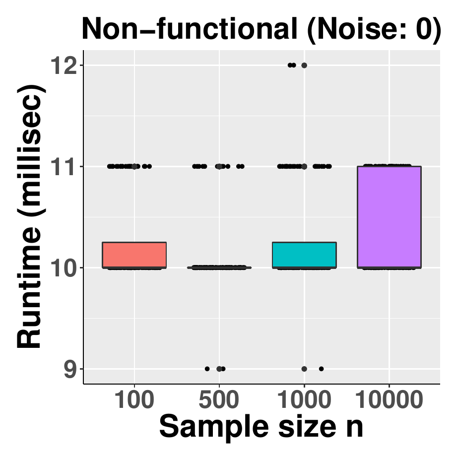

::: article
# Introduction

The demand for pattern discovery methodologies has elevated as massive
automatic data collection takes place in every application domain.
Consequently, an increasingly critical task in data science is to design
effective algorithms to recognize complex meaningful patterns from data.
Nonparametric discrete patterns do not require an analytical form,
allowing them to flexibly represent functional and associative
relationships among random variables. This makes them appealing to
data-driven capture of complex relationships from big data sources.
Indeed, many classical statistical methods can detect associative
patterns between discrete random variables, including the widely used
Pearson's chi-square test [@pearson1900x], Fisher's exact
test [@fisher1922interpretation], $G$-test [@mcdonald2014multiple], and
Barnard's test [@barnard1945new].

However, these methods are not specifically designed for detecting
functional patterns, where a dependent variable is a mathematical
function of other independent variables. Functional relationships are
considered powerful indicators of causality [@simon1966cause]. Recent
methods for detecting discrete functional patterns such as the
functional chi-square test (FunChisq) [@zhang2013deciphering] have
demonstrated their effectiveness in identifying causal molecular
interactions in human breast cancer from both real and simulated protein
abundance data [@Hill:2016fk]. To evaluate such methods, software tools
that can randomly generate diverse functional patterns are necessary.
Such computer programs are unavailable as far as we are aware, in spite
of several R functions for generating other types of random contingency
table. The function `r2dtable` in the base package *stats* creates
random two-way tables with given marginals using Patefield's algorithm
[@patefield1981algorithm] under product-multinomial sampling. The
package [*rTableICC*](https://CRAN.R-project.org/package=rTableICC)
[@demirhanrtableicc] produces random $2 \times 2 \times K$ tables and
$R \times C$ tables based on either intraclass-correlated or
uncorrelated individuals. No utility known to us can generate noisy,
random, and nonparametric discrete patterns that satisfy requirements on
functional relationships between the row and column variables.

To address this gap, we present a new simulator to generate discrete
functional patterns. This simulator is publicly available and
implemented as the R function `simulate_tables` within the R package
[*FunChisq*](https://CRAN.R-project.org/package=FunChisq)
($\ge$`<!-- -->`{=html}2.4.0) [@Zhang:2017fk], which also contains
statistical hypothesis testing methods for non-parametric functional
dependencies using asymptotic chi-square or exact distributions.
Functional chi-squares are asymmetric and functionally optimal, unique
from other related statistics. The simulator can generate associative
two-way contingency tables to depict several types of relationships. A
relationship type can be a combination of statistical dependency and
mathematical functionality. In a dependent relationship, the outcomes of
two random variables are statistically dependent; whereas in an
independent relationship, the outcomes of two random variables are
statistically independent of each other. Dependency can be further
categorized as functional [@bartle1964elements] or non-functional. The
simulator is also capable of generating many-to-one functional patterns
whose inverse is non-functional. To emulate real data often tainted with
noise, our simulator can apply a controllable level of house
noise [@zhang2015chinet] into the contingency tables. This option
enables one to evaluate the robustness of a discrete pattern discovery
algorithm subject to noise. We utilized the simulator to contrast
FunChisq and Pearson's chi-square tests and demonstrate their expected
difference in detecting discrete functional relationships. We also
report the runtime of the simulator as a function of sample size with
and without noise. Finally, we illustrated how to use this computer
program to generate simulated data for weather forecasting, drug
development, molecular biology, and statistical algorithm design. This
discrete data simulator thus can serve as a benchmarking tool for the
development of new statistical methods for pattern discovery in various
scientific fields.

# Generating random contingency tables with required discrete patterns

The simulator randomly samples contingency tables with specified
functional and statistical patterns and also has an option to apply
additional noise on the tables. Let $X \in \{1,\ldots, r\}$ be a
discrete random variable with $r$ levels, and $Y \in \{1,\ldots, c\}$ be
a second discrete random variable with $c$ levels. We use $p_{XY}(i, j)$
to represent the joint probability mass function of $X$ and $Y$, and
$p_X(i)$ and $p_Y(j)$ for the marginal probability mass functions of $X$
and $Y$, respectively. We use the notation $Y=f(X)$ to indicate that $Y$
is some function of $X$, and the notation $X \neq g(Y)$ to indicate that
$X$ is not any function of $Y$. We use the notation $X \perp Y$ to
indicate that $X$ and $Y$ are statistically independent.

We define four pattern types formed by $X$ and $Y$ as follows:

-   Functional---$Y$ is a function of $X$;

-   Many-to-one---$Y$ is a function of $X$, but not vice versa. A
    discrete non-monotonic function is not necessarily many-to-one;

-   Dependent non-functional---$Y$ and $X$ are statistically dependent,
    but not a function of each other;

-   Independent---$Y$ and $X$ are statistically independent.

For all functional patterns, we do not consider the special case where
$X$ or $Y$ can take only one value ($r=1$ or $c=1$), as in constant
functions. We do not include the pattern type where $Y$ is not a
function of $X$ but $X$ is a function of $Y$, as it can be generated
easily by transposing a many-to-one functional pattern. These four
patterns are characterized by the mathematical and statistical relations
between $X$ and $Y$ in Table [1](#tbl:fourpatterns).

::: {#tbl:fourpatterns}
  ------------------------------------------------------------------------------
  Pattern                     Is $Y=f(X)$?   Is $X=g(Y)$?    Is $X \perp Y$?  
  -------------------------- -------------- --------------- ----------------- --
  Functional                      True       True or False        False       

  Many-to-one                     True           False            False       

  Dependent non-functional       False           False            False       

  Independent                    False           False            True        
  ------------------------------------------------------------------------------

  : Table 1: Four pattern types between two random variables $X$ and
  $Y$. Here functional patterns do not include constant functional
  patterns.
:::

The simulator will generate three related tables in order: a noise-free
sampled contingency table, a pattern table, and a noisy contingency
table. All tables are $r \times c$, where $X$ and $Y$ are the row and
column variables, respectively. Here is an explanation of these tables:

-   The sampled contingency table---With given sample size $n$ and row
    and/or column marginal probability mass functions, this table
    satisfies both the functional and statistical requirements. This
    table, being noise free, can be used to simulate noisy versions and
    evaluate the performance of pattern discovery algorithms on their
    statistical effectiveness.

-   The binary pattern table---This table is created by setting all
    non-zero entries in the sampled contingency table to 1. Thus values
    in the pattern table are either 0 or 1. The table strictly satisfies
    the mathematical relationship for a given pattern type requested by
    the user, but it does not meet the statistical requirements. It can
    be used as the ground truth or gold standard for benchmarking how
    well pattern discovery algorithms can uncover the mathematical
    relationships.

-   The noisy contingency table---At a user-specified noise level, this
    table is the noisy version of the sampled contingency table. Due to
    the added noise, this table may no longer strictly satisfy the
    required functional or statistical relationships. This table is the
    main output to be used for the evaluation of a discrete pattern
    discovery algorithm.

Figure [1](#fig:types) illustrates the four pattern types by sampled
contingency tables generated using the simulator. The tables are rotated
so that the horizontal axis represents the row variable $X$.

<figure id="fig:types">
<p></p>
<p></p>
<figcaption>Figure 1: Four pattern types generated by the simulator. The
contingency tables are rotated so that row variable <span
class="math inline"><em>X</em></span> is the horizontal axis. The
original tables are all <span class="math inline">5 × 3</span> with a
sample size of 100. The number in each square is the count in the
corresponding table entry. No noise is applied. The color intensity of
each entry is proportional to the sample count in that
entry.</figcaption>
</figure>

Next, we describe how to generate the sampled contingency tables for
each type of discrete pattern. All pattern types require the common
input of sample size $n$ and table size $r\times c$. They differ in
which marginal probability mass functions, $p_X$, $p_Y$, or both, must
be provided. Let $n_{ij}$ be the count in the entry at row $i$ and
column $j$. We use the notation $n_{i\cdot}$ to indicate the sum of row
$i$ in a contingency table:
$$n_{i\cdot} = \sum_{j=1}^{c} n_{ij}, \quad i=1,\ldots,r$$
and $n_{\cdot j}$ as the sum of column $j$:
$$n_{\cdot j} = \sum_{i=1}^{r} n_{ij}, \quad j=1,\ldots,c$$

## Generating functional tables

Functional patterns can be used to model causal relationships that are
either linear or nonlinear. A contingency table reduces the burden of
assuming a parametric form for the function. In a functional table
representing $Y = f(X)$, every level $X=i$ maps to exactly one outcome
$Y=j$ in the contingency table. The following steps generate a
noise-free sampled table that satisfies all mathematical and statistical
requirements:

1.  *Input*: row marginal probability function $p_X$, sample size
    $n \ge 2$, table size $r \times c$, $r, c\ge 2$.

2.  *Output*: a non-constant functional table.

3.  Randomly generate the row sums $n_{i\cdot}$ ($i=1,\ldots,r$) by the
    multinomial distribution with success probability function $p_{X}$
    and the sample size $n$.

4.  For each row $i$ in the table, initialize the entire row to be 0,
    randomly pick a column $j \in \{1,\ldots,c\}$ with equal
    probability, and set $n_{ij} = n_{i\cdot}$.

5.  Convert the function from constant to non-constant: If the function
    is constant---all nonzero values are on the same column $j$,
    randomly pick a row $i'$ from $\{1,\ldots,r\}$ with equal
    probability and a column $j'$ from $\{1,\ldots,c\} \backslash \{j\}$
    with equal probability. Swap the values of $n_{ij}$ and $n_{i'j'}$.
    This will guarantee function $Y=f(X)$ is a non-constant function.

## Generating many-to-one functional tables

Many-to-one functions are special cases of functional relationships.
They are increasingly relevant as they can expose complex patterns from
data of large sample sizes. Being able to generate such patterns will
facilitate the evaluation of complex pattern discovery methods. The
following two main steps generate this type of patterns:

1.  *Input*: row marginal probability function $p_X$, sample size
    $n \ge 2$, table size $r \times c$, $r\ge 3$, $c\ge 2$.

2.  *Output*: a strictly many-to-one and non-constant functional table.

3.  Generate a non-constant functional table using Step 1 to 3 above.

4.  Convert the function from one-to-one to many-to-one: If the function
    is one-to-one---every column of the table has at most one non-zero
    entry, do the following. Randomly pick a row $i$ from all those rows
    with non-zero totals with equal probability. Let $j$ be the index to
    the only non-zero entry on row $i$. Pick $j'$ from the indices of
    those columns with non-zero totals except $j$ with equal
    probability. Swap the values of $n_{ij}$ and $n_{ij'}$.

## Generating dependent and non-functional tables

In non-functional dependent relationships between $X$ and $Y$, $X$ and
$Y$ are statistically dependent but $Y$ is not a function of $X$ and $X$
is neither a function of $Y$. They are not as strong as functional
patterns in revealing causal relationships, but can reveal strong
associative relationships such as a circular pattern. Their joint
probability function must satisfy
$$\label{eq1}
p_{XY}(i, j) \neq p_{X}(i) \cdot p_{Y}(j) \quad \text{for some } i, j   (\#eq:eq1)$$
As we do not have the above true probability functions, we will directly
estimate them using frequencies in the table. If the above inequality is
satisfied, we call $X$ and $Y$ empirically statistically dependent;
otherwise, $X$ and $Y$ are empirically statistically independent.

**Lemma 1.** Let $p, P, Q, M, N$ be five positive numbers and $q$ be a
nonnegative number, where $P > p$ and $Q > q$. If these numbers satisfy
two equalities
$$\label{eq:pP}
\frac{P}{N} \cdot \frac{M}{N} = \frac{p}{N}   (\#eq:pP)$$
and
$$\label{eq:qQ}
\frac{Q}{N} \cdot \frac{M}{N} = \frac{q}{N}   (\#eq:qQ)$$
and if we are given a number $k$ such that $0 < k \le p$, then the
following two inequalities must be true:

$$\label{eq:p-kP}
\frac{P-k}{N} \cdot \frac{M}{N} > \frac{p-k}{N}   (\#eq:p-kP)$$

and

$$\label{eq:qpluskQ}
\frac{Q+k}{N} \cdot \frac{M}{N} < \frac{q+k}{N}   
(\#eq:qpluskQ)$$

*Proof.* As we are given $P>p$, we have algebraically
$$\frac{P-k}{p-k} = \frac{P-p}{p-k} + 1$$
monotonically increasing as $k$ increases from 0 to $p$. Thus it follows
$$\frac{P-k}{p-k} > \frac{P}{p} = \frac{N}{M}$$
using the equality in Eq. (\@ref(eq:pP)). Multiplying both sides by
$\frac{(p-k)M}{N^2}$, we immediately prove inequality (\@ref(eq:p-kP)).
Similarly, with given $Q > q$ and as $k$ increases from 0, we have a
monotonic decreasing function of $k$
$$\frac{Q+k}{q+k} = \frac{Q-q}{q+k} + 1$$
which implies
$$\frac{Q+k}{q+k} < \frac{Q}{q} = \frac{N}{M}$$
based on Eq. (\@ref(eq:qQ)). Multiplying both sides by
$\frac{(q+k)M}{N^2}$, we immediately prove inequality (\@ref(eq:qpluskQ)).
Q.E.D.

Based on Lemma 1, we design Algorithm 1 to break the statistical
independency. Let $(i,j)$ represent the entry at row $i$ and column $j$.

**Algorithm 1.** Convert an independent non-functional table to a
dependent non-functional table.

1.  *Input*: an independent non-functional table

2.  *Output*: a dependent non-functional table

3.  Randomly pick an entry $(i,j)$ with at least one sample point
    ($n_{ij}>0$).

4.  Randomly select column $j' \neq j$ with equal probability from row
    $i$.

5.  Move all $n_{ij}$ samples from entry $(i,j)$ to $(i,j')$, which
    finally have 0 and $n_{ij} + n_{ij'}$ sample points, respectively.

**Theorem 1.** An empirically statistically independent non-functional
contingency table can be converted to dependent non-functional
contingency table by Algorithm 1. The row marginal probability function
remains the same after the conversion.

*Proof.* Table [2](#tbl:indnf) illustrates that any independent
non-functional table has at least two rows and two columns with non-zero
entries. Non-functionality guarantees at least one row (row $i_1$ in
Table [2](#tbl:indnf)) and one column (column $j_1$ in
Table [2](#tbl:indnf)) each with two non-zero entries. The independent
property ensures that at least another non-zero row (row $i_2$ in
Table [2](#tbl:indnf)) and another non-zero column (column $j_2$ in
Table [2](#tbl:indnf)) has the same distribution of numbers proportional
to row $i_1$ and the column $j_1$, respectively. Additionally, all
non-zero rows are proportional to each other by a constant, and so do
the columns.

::: {#tbl:indnf}
  ----------------------------------------------------------------------
   $\cdots$       $\cdots$       $\cdots$       $\cdots$       $\cdots$
  ---------- ------------------ ---------- ------------------ ----------
   $\cdots$   $n_{i_1j_1} > 0$   $\cdots$   $n_{i_1j_2} > 0$   $\cdots$

   $\cdots$       $\cdots$       $\cdots$       $\cdots$       $\cdots$

   $\cdots$   $n_{i_2j_1} > 0$   $\cdots$   $n_{i_2j_2} > 0$   $\cdots$

   $\cdots$       $\cdots$       $\cdots$       $\cdots$       $\cdots$
  ----------------------------------------------------------------------

  : Table 2: Any independent non-functional table has at least two rows
  and two columns each with at least two non-zero entries.
:::

In the input table to Algorithm 1, entry $(i,j)$ satisfies the empirical
independence equation
$$\frac{n_{i\cdot}}{n} \cdot \frac{n_{\cdot j}}{n} = \frac{n_{ij}}{n}$$
where $n_{i\cdot}$ is the sum of row $i$ and $n_{\cdot j}$ is the sum of
column $j$. After the move, we have by Lemma 1
$$\frac{n_{i\cdot}}{n} \cdot \frac{n_{\cdot j}-n_{ij}}{n} > \frac{0}{n}$$
where $n_{\cdot j}-n_{ij} > 0$ is guaranteed by the property shown in
Table [2](#tbl:indnf). As the left hand side of the inequality is the
product of the new marginal probabilities and the right hand side is the
new joint probability, it implies the loss of statistical independency
in the modified table. Therefore the modified table is now statistically
dependent.

Also by the property shown in Table [2](#tbl:indnf), no matter where
$n_{ij}$ was moved to, we will indeed have another row and another
column with at least two non-zero entries, which will guarantee the
non-functionality of the modified table.

As the samples are moved within the same row $i$, the row sum is
unchanged and thus the row marginal probability function is unchanged in
the modified table.

Therefore, we conclude that the new table must be dependent
non-functional. Q.E.D.

Such tables are only possible when $n \ge 4$. The following steps
generate such tables by distributing samples to rows and then to columns
and converting any resulting functions to non-functions:

1.  *Input*: row marginal probability function $p_X$, sample size
    $n \ge 4$, table size $r \times c$, $r \ge 2$, and $c\ge 2$.

2.  *Output*: a dependent non-functional table.

3.  Randomly generate the row sums $n_{i\cdot}$ ($i=1,\ldots,r$) by the
    multinomial distribution with success probability function $p_{X}$
    and the sample size $n$.

4.  For each row $i$ in the table, initialize the entire row to be 0.
    Sample a value $k$ from $\{1,\ldots,c\}$ with equal probability.
    Randomly pick $k$ columns $j_{1},\ldots,j_{k}$ from $\{1,\ldots,c\}$
    with equal probability. Then randomly determine the values of
    $n_{ij_{1}},\ldots,n_{ij_{k}}$ using the multinomial distribution
    with equal success probability of $1/k$.

5.  If $Y=f(X)$, convert the function to a non-function: If the table
    represents a valid function---each row has at most one non-zero
    entry, do the following. Pick a row $i$ from all rows with at least
    two samples with equal probability. Let $j$ be the index to the only
    non-zero entry in row $i$. Pick $j'$ from
    $\{1,\ldots,c\} \backslash \{j\}$ with equal probability.
    Redistribute the row sample $n_{i\cdot}$ into $n_{ij}$ and $n_{ij'}$
    with equal probability using a binomial distribution.

6.  If $X=g(Y)$, convert the function to a non-function: follow the
    previous step but switch rows and columns. This operation also
    maintains the non-functionality $Y \neq f(X)$ as no non-zero entries
    are eliminated.

7.  If empirically $X \perp Y$, we break the statistical independency by
    converting the table to a dependent non-functional table using
    Algorithm 1.

## Generating independent tables

When $X$ and $Y$ are statistically independent, their joint probability
mass function is
$$p_{XY}(i, j) = p_X(i) \cdot p_Y(j) \quad \text{for all } i \in \{1,\ldots,r\} \text{ and } j \in \{1,\ldots,c\}$$
where $p_X(i)$ and $p_Y(j)$ are marginal probabilities of occurrence for
$X = i$ and $Y = j$, respectively. The tables formed by such $X$ and $Y$
are useful as a negative control, because they represent patterns that
are typically considered uninteresting. To generate an independent
pattern, the input needs both row and column marginal probability mass
functions $p_X$ and $p_Y$. As $X$ and $Y$ are statistically independent,
the numbers of samples in each entry follow a multinomial distribution.
The success probability in the entry at row $i$ and column $j$ is
exactly $p_{XY}(i, j)$. Given the sample size $n$, we randomly generate
samples from the multinomial distribution with $r\times c$ outcomes and
map them to the sampled contingency table.

## The house noise model

It is very common to observe noise in real data; noise may arise due to
a multitude of reasons ranging from data preparation through the
machinery involved in the entire data acquisition process. In
statistical inference, noise needs to be handled to reduce type I and
type II errors. Thus, our simulator also factors in noise to make the
contingency tables resemble those constructed out of real data sets in
order to additionally provide for a test of robustness.

By specifying the noise level parameter in the `simulate_tables`
function, one can apply noise to a contingency table. We use the
discrete house noise model [@zhang2015chinet] that is controlled by the
$noise$ level parameter $\theta$. $\theta$ is a continuous constant
between 0 and 1, where 0 represents no noise and 1 represents maximum
noise level. Let $Y \in \{1, \ldots, c\}$ be a dependent discrete random
variable and $c>1$ be the number of discrete levels of $Y$. Let
$Y' \in \{1, \ldots, c\}$ be a random discrete variable which represents
the noisy version of $Y$. Let $y$ and $y'$ represent values for $Y$ and
$Y'$, respectively. The house noise model is defined through a
probability function of noisy $Y'$ conditioned on truth $Y$ and noise
level ${\theta}$ by
$$p_{Y'|Y}(y'|y,\theta)=\Pr(Y' = y'| Y = y, \theta) = 
	\begin{cases}
		\left[\left(1 - \frac{|y-y'|}{\sum_{d=1}^{c}(|d-y|)} \right) \frac{\theta}{c-1} \right] (1- \theta) + \frac{\theta}{c} & \text{if } y' \neq y \\
		\left(\frac{\theta}{c-1} + 1 - \theta \right) (1- \theta) + \frac{\theta}{c} & \text{if } y' =  y
	\end{cases}$$
The model works on the principle of making its value closer to the true
value rather than being further away. By this model, the probability of
a larger deviation of $Y'$ from $Y$ is smaller than that of a smaller
deviation. At ${\theta} = 0$, we have $Y'=Y$ and it is thus noise free;
at ${\theta} = 1$, the conditional probability function becomes
uniformly distributed and the noise completely destroys the underlying
patterns.

We implemented the model as an R function `add.house.noise` to apply
noise to an input contingency table and return a noisy contingency table
as the output. The syntax of the function is as follows:

``` r
	add.house.noise(tables, u, margin = 1)
```

where `tables` is a list of input contingency tables and `u` is the
noise level between 0 and 1. The noise can be applied along rows
(`margin=1`), columns (`margin=2`), or both rows and columns
(`margin=0`). In `simulate_tables`, the noise is always applied along
the rows, which can be interpreted as applying noise to the dependent
variable $Y$ if the column variable is a function of the row variable
$X$. The house noise model can be used independently of function
`simulate_tables`.

# Performance evaluation

To affirm each table type generated by the simulator indeed has the
required characteristics, we compared two hypothesis testing methods:
the `fun.chisq.test` [@zhang2013deciphering] in the R package *FunChisq*
and `chisq.test` in the R package *stats*.

We first simulated 1000 randomly generated tables for each of the four
types at the noise level of 0.1. The numbers of rows and columns of the
tables were randomly selected from 3 to 10. The sample size of each
table was randomly drawn from 10 to 1000 and must be at least the table
size.

Next we applied the two tests on the tables.The log $p$-value
distributions of both tests are shown in Fig. [2](#fig:perf). In
Fig. [2](#fig:perf)a, the FunChisq test tends to yield smaller
$p$-values compared to Pearson's chi-square on functional patterns. In
Fig. [2](#fig:perf)b, both tests are approximately equal on dependent
non-functional patterns. The $p$-values remarkably increased in
comparison to functional patterns but are still showing significance due
to statistical dependency in the pattern. Taken together, the FunChisq
test has a higher sensitivity of functional over non-functional patterns
than Pearson's chi-square test, as expected.

In Fig. [2](#fig:perf)c, the FunChisq test was performed first on noisy
many-to-one functional patterns and second on the transposed table.
There is an increase in the $p$-value by the latter which explains that
the transposed noisy many-to-one tables are no longer functional. We did
not show Pearson's chi-square $p$-values because they are equal on
transposed contingency tables. Indeed, one expects to see such a
difference in the distribution of FunChisq statistics when comparing
functional tables versus their transposed non-functional tables, as
FunChisq, unlike Pearson's chi squares, is asymmetric when testing
functional dependency.

In Fig. [2](#fig:perf)d the log $p$-value distributions of both FunChisq
and Pearson's chi-squares are nearly identical and the $p$-values are
very close to 1, because both tests follow the same $\chi^2$
distribution under the null hypothesis when using independent patterns.

These results confirm that our simulator was indeed able to generate
functional, non-functional, many-to-one, and independent patterns.

<figure id="fig:perf">

<table>
<caption> </caption>
<tbody>
<tr class="odd">
<td style="text-align: center;"><strong><span
class="sans-serif">a</span></strong></td>
<td style="text-align: center;"><strong><span
class="sans-serif">b</span></strong></td>
</tr>
<tr class="even">
<td style="text-align: center;"></td>
<td style="text-align: center;"></td>
</tr>
<tr class="odd">
<td style="text-align: center;"><strong><span
class="sans-serif">c</span></strong></td>
<td style="text-align: center;"><strong><span
class="sans-serif">d</span></strong></td>
</tr>
<tr class="even">
<td style="text-align: center;"></td>
<td style="text-align: center;"></td>
</tr>
</tbody>
</table>
<figcaption>Figure 2: The FunChisq test is more sensitive to functional
patterns than Pearson’s chi-square test, while being equally sensitive
to non-functional patterns. The distributions of log <span
class="math inline"><em>p</em></span>-values for all four table types
using the two tests at a noise level of 0.1 are shown. The means of the
distributions are indicated by the vertical lines. (a) Noisy functional
patterns. (b) Noisy dependent non-functional patterns. (c) Noisy
many-to-one functional patterns. The FunChisq test was applied on both
the original table and the transposed table, indicated by inverse
FunChisq. (d) Noisy independent patterns.</figcaption>
</figure>

We further benchmarked the runtime of the simulator over four table
types, four sample sizes (100, 500, 1000, and 10000), and two noise
levels (0 and 0.5) at a fixed table size of 5$\times$`<!-- -->`{=html}5.
This gives a total of 32 configurations. For each configuration, we
repeated the simulation 100 times to account for random variations. We
ran the simulation on iMac (27-inch, Mid 2010) with 2.93 GHz Intel Core
i7 processor and 16 GB 1333 MHz DDR3 RAM. Figure [3](#fig:runtime) shows
the runtime of generating noise-free and noisy versions of all four
pattern types. It is apparent from the figure that table type, sample
size, and noise application can all influence the runtime of table
generation. Dependent non-functional tables took the most time because
they are subject to more mathematical requirements. Applying noise
incurred additional time for all table types. Sample size has an
observable effect on the runtime when noise is applied.

<figure id="fig:runtime">

<table>
<caption> </caption>
<tbody>
<tr class="odd">
<td style="text-align: center;"><strong><span
class="sans-serif">a</span></strong></td>
<td style="text-align: center;"><strong><span
class="sans-serif">c</span></strong></td>
<td style="text-align: center;"><strong><span
class="sans-serif">e</span></strong></td>
<td style="text-align: center;"><strong><span
class="sans-serif">g</span></strong></td>
</tr>
<tr class="even">
<td style="text-align: center;"></td>
<td style="text-align: center;"></td>
<td style="text-align: center;"></td>
<td style="text-align: center;"></td>
</tr>
<tr class="odd">
<td style="text-align: center;"><strong><span
class="sans-serif">b</span></strong></td>
<td style="text-align: center;"><strong><span
class="sans-serif">d</span></strong></td>
<td style="text-align: center;"><strong><span
class="sans-serif">f</span></strong></td>
<td style="text-align: center;"><strong><span
class="sans-serif">h</span></strong></td>
</tr>
<tr class="even">
<td style="text-align: center;"></td>
<td style="text-align: center;"></td>
<td style="text-align: center;"></td>
<td style="text-align: center;"></td>
</tr>
</tbody>
</table>
<figcaption>Figure 3: The empirical runtime of generating a contingency
table as a function of sample size over four table types and two noise
levels. We fix the table size to be 5<span
class="math inline">×</span>5. The runtime is measured in milliseconds
and the box plots are colored by sample sizes. The runtime differs in
sample size, table type, and whether noise was applied, as shown in (a)
noise-free and (b) noisy functional patterns, (c) noise-free and (d)
noisy dependent non-functional patterns, (e) noise-free and (f) noisy
many-to-one functional patterns, and (g) noise-free and (h) noisy
independent patterns. </figcaption>
</figure>

# Installation and examples of discrete pattern generation

Here we demonstrate the usage of the simulator by providing examples of
all four pattern types including the description of important
parameters. The R package *FunChisq* ($\ge$ 2.4.0) contains the function
`simulate_tables` that implements the simulator. The package is publicly
available from the Comprehensive R Archive Network (CRAN). The package
can be installed and loaded by

``` r
	install.packages("FunChisq")
	library("FunChisq")
```

The signature of the function `simulate_tables` is given below:

``` r
	simulate_tables(n=100, nrow=3, ncol=3, type=c("functional", "many.to.one", 
	    "independent", "dependent.non.functional"), noise=0.0, n.tables=1, 
            row.marginal=rep(1/nrow, nrow), col.marginal=rep(1/ncol, ncol))
```

The arguments are

-   `n`---an integer specifying the sample size to be distributed in the
    table. For `"functional"` and `"many.to.one"` tables, `n` must be no
    less than `nrow`. For `"independent"` tables, `n` must be no less
    than `nrow`\*`ncol`. For `"dependent.non.functional"` tables, `n`
    must be greater than `nrow`.

-   `nrow`---an integer specifying the number of rows of output tables.
    The value must be no less than 2. For `"many.to.one"` tables, `nrow`
    must be no less than 3.

-   `ncol`---an integer value specifying the number of columns in
    desired table. The value for `ncol` must be no less than 2.

-   `type`---a character string to specify the type of pattern
    underlying the table. The options are `"functional"` (default),
    `"many.to.one"`, `"independent"`, and `"dependent.non.functional"`.

-   `noise`---a numeric value between 0 and 1 specifying the factor of
    noise to be added to the table using the house noise
    model [@zhang2015chinet]. The house noise is applied along the rows
    of the table. See `add.house.noise` for details.

-   `n.tables`---an integer value specifying the number of tables to be
    generated.

-   `row.marginal`---a numeric vector of length at least 2 specifying
    row marginal probabilities. For `"many.to.one"` tables, the length
    of `row.marginal` vector must be no less than 3.

-   `col.marginal`---a numeric vector specifying column marginal
    probabilities. It is only applicable in generating independent
    tables.

The return value of the function `simulate_tables` is a list containing
the following components:

-   `pattern.list`---a list of tables containing 0-1 binary patterns.
    Each table is created by setting all non-zero entries in the
    corresponding sampled contingency table from `sample.list` to 1.
    Each table strictly satisfies the functional relationship for a
    given pattern `type` requested. This table does not meet the
    statistical requirements. As each table represents the truth
    regarding the mathematical relationship between the row and column
    variables, they can be used as the ground truth or gold standard for
    benchmarking.

-   `sample.list`---a list of tables satisfying both the functional and
    statistical requirements. These tables are noise free.

-   `noise.list`---a list of tables after applying noise to the
    corresponding tables in `sample.list`. Each table is the noisy
    version of the sampled contingency table. Due to the added noise,
    each table may no longer strictly satisfy the required functional or
    statistical relationships. These tables are the main output to be
    used for the evaluation of a discrete pattern discovery algorithm.

-   `pvalue.list`---a list of $p$-values reporting the statistical
    significance of the generated tables for the required type. When the
    pattern type specifies a functional relationship, the $p$-values are
    computed by the FunChisq test; otherwise, the Pearson's chi-square
    test of independence is used to calculate the $p$-value.

**Example 1. A functional table.** A scientist working at a weather
forecasting agency came up with a novel method that can be trained for
each geographical area to predict the amount of rainfall in that area
given a month. While the agency is busy collecting real data for the
last 10 years, the scientist wants to test his method and train the
method to learn the following hypothesis: 'The amount of rainfall in an
area is a function of time, expressed in months'. Using different
probability distributions for each month (`row.marginal`) the scientist
can simulate contingency tables with $X$ being month with 12 levels and
$Y$ being the amount of rainfall with 3 levels 'Scant', 'Medium' and
'Heavy'. We assume that the amount of rainfall is equally likely in a
given month. Noise can be added to imitate imperfect real-world
scenario. The following code generates 12$\times$`<!-- -->`{=html}3
functional contingency tables with 100 samples using multinomial
distribution at the noise level of of 0.1:

``` r
   simulate_tables(nrow=12, ncol=3, type='functional', n=100, n.tables=1, 
                   row.marginal = c(0.116, 0.109, 0.049, 0.142, 0.083, 
                   0.070, 0.140, 0.151, 0.037, 0.032, 0.050, 0.015), noise=0.1)
## Output:                                            
##   pattern.table                     sampled.table                    noise.table       
       C1 C2 C3                           C1  C2  C3                     C1 C2 C3
## R1   0  1  0                        R1  0   5   0                  R1  0  5  0
## R2   0  0  1                        R2  0   0   17                 R2  0  1  16
## R3   0  0  1                        R3  0   0   3                  R3  0  0  3
## R4   0  1  0                        R4  0   15  0                  R4  0  14 1
## R5   0  1  0                        R5  0   3   0                  R5  1  2  0
## R6   0  0  1                        R6  0   0   5                  R6  1  0  4
## R7   1  0  0                        R7  22  0   0                  R7  20 1  1
## R8   0  1  0                        R8  0   15  0                  R8  1  13 1
## R9   0  0  1                        R9  0   0   4                  R9  0  1  3
## R10  1  0  0                        R10 5   0   0                  R10 5  0  0
## R11  0  0  1                        R11 0   0   3                  R11 0  0  3
## R12  0  0  1                        R12 0   0   3                  R12 0  0  3
                                  
```

The scientist can also tune parameters and generate 100 or more such
tables representing data for 100 or more years.

**Example 2. A many-to-one functional table.** This type of table is a
special case of functional table. It can be used to model the
relationship between the effectiveness $Y$ and the dosage $X$ of a drug.
When the dosage of the drug is too low or too high, it becomes
ineffective. The following code generates 4$\times$`<!-- -->`{=html}5,
noisy, many-to-one contingency tables with 100 samples distributed using
multinomial distribution. The row marginals used are 0.1, 0.3, 0.2, 0.4.
Noise factor of 0.5 is added to the sampled table.

``` r
   simulate_tables(nrow=4, ncol=5, type='many.to.one', n=100, n.tables=1, noise=0.5)
## Output:     
##   pattern.table                     sampled.table                    noise.table       
##    C1 C2 C3 C4 C5                     C1 C2 C3 C4 C5                    C1 C2 C3 C4 C5
## R1  0  0  0  1  0                  R1  0  0  0  19 0                 R1  2  4  0  11 2
## R2  0  1  0  0  0                  R2  0  32 0  0  0                 R2  5  12 7  3  5
## R3  0  1  0  0  0                  R3  0  31 0  0  0                 R3  5  10 4  7  5
## R4  0  0  1  0  0                  R4  0  0  18 0  0                 R4  2  3  7  4  2
```

**Example 3. An independent table.** This type of table is useful in
generating null distribution or bootstrapping. To measure the
statistical significance or probability of getting a certain empirical
score reported by a method, one needs to randomly sample from an
independent and identically distributed population. The following code
generates 4$\times$`<!-- -->`{=html}5 contingency tables with 100
samples distributed using multinomial distribution, where row and column
variables are statistically independent. The row marginal probabilities
are 0.1, 0.3, 0.2, 0.4 and column marginal probabilities are 0.3, 0.2,
0.1, 0.3, 0.1. No noise is applied.

``` r
 simulate_tables(nrow=4, ncol=5, type='independent', n=100, n.tables=1, noise=0.0,
                 row.marginal=c(0.1,0.3,0.2,0.4), col.marginal=c(0.3,0.2,0.1,0.3,0.1))
## Output:
##    pattern.table                     sampled.table                    noise.table       
##    C1 C2 C3 C4 C5                     C1 C2 C3 C4 C5                    C1 C2 C3 C4 C5
## R1  1  1  1  1  1                  R1  4  3  2  4  1                 R1  4  3  2  4  1 
## R2  1  1  1  1  1                  R2  8  4  1  5  3                 R2  8  4  1  5  3
## R2  1  1  1  1  1                  R3  6  3  1  6  5                 R3  6  3  1  6  5 
## R2  1  1  1  1  1                  R4  16 8  5  7  8                 R4  16 8  5  7  8  
```

**Example 4. A dependent non-functional table.** Two genes $X$ and $Y$
may be regulated by a common transcription factor. Here $X$ and $Y$ are
categorized as low, medium and high. The two variables are dependent but
not a function of each other. We simulate this type of data using
dependent non-functional table type. The following code generates
3$\times$`<!-- -->`{=html}3, noise free, non-functional contingency
tables with 100 samples distributed using multinomial distribution. The
row marginals used are 0.3, 0.5, 0.2.

``` r
   simulate_tables(nrow=3, ncol=3, type='dependent.non.functional', n=100, n.tables=1,
                   row.marginal=c(0.3,0.5,0.2), noise=0.1)
## Output:
##   pattern.table                     sampled.table                       noise.table       
##    C1 C2 C3                           C1  C2  C3                          C1  C2  C3 
## R1  1  1  0                        R1  12  11  0                       R1  8   13  2  
## R2  0  0  1                        R2  0   0   49                      R2  3   1   45  
## R3  1  1  1                        R3  7   10  11                      R3  9   9   10  
                                    
```

# Discussion

We have just introduced a new simulator which conveniently generates
random noisy $r{\times}c$ contingency tables exhibiting four contrasting
pattern types including functional, many-to-one functional, dependent
non-functional, and independent. These contingency tables are
advantageous for methods which are designed to discover patterns among
discrete random variables.

Although other methods for constructing random contingency tables are
available [@demirhanrtableicc], the generation of functional tables is
innovative. Having diverse functional tables meets a need to detect
causal relationships from functional dependencies without using a
parametric form.

For practical reasons, if the row marginal is non-zero, we will generate
at least one sample for that row. Currently the simulator utilizes row
marginal probabilities for the generation of dependent contingency
tables; in the future we may provide an option to use the column
marginal probabilities instead, to match some experimental design where
the distribution of the effect variable is predefined, such as in
case-control studies of cancer.

The generated dependent non-functional patterns may span a wide range of
statistical dependency from being very weak to very strong. The
$p$-values associated with these patterns can be used to filter out
tables of weak statistical dependency.

Beyond generating tables of bivariate patterns between the row and
column variables, one may consider the row variable as a combination of
multiple discrete variables. Therefore one can immediately extend the
procedures to generate contingency tables representing multivariate
patterns.

In summary, we described algorithms and implemented a simulator to
construct contingency tables of desired mathematical and statistical
properties, and illustrated the use of this function with several
examples. We validated the generation of all table types by the FunChisq
and Pearson's chi-square tests. We evaluated the runtime of the function
in generating various noisy patterns. This function offers a previously
overlooked utility to generate diverse functional patterns to evaluate
discrete pattern discovery methods increasingly important in data
science research.

# Acknowledgment

This work is supported by US NSF Advances in Biological Informatics
Grant DBI 1661331.
:::
