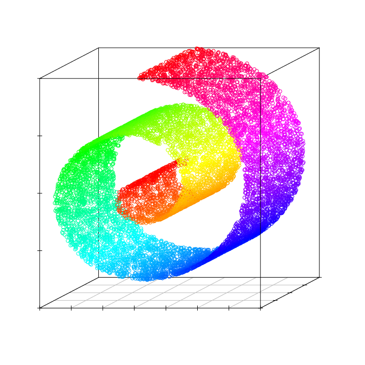
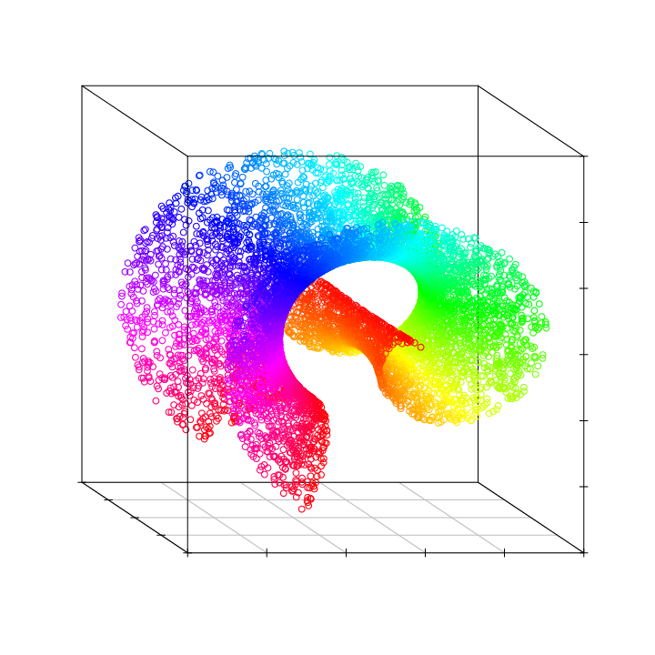
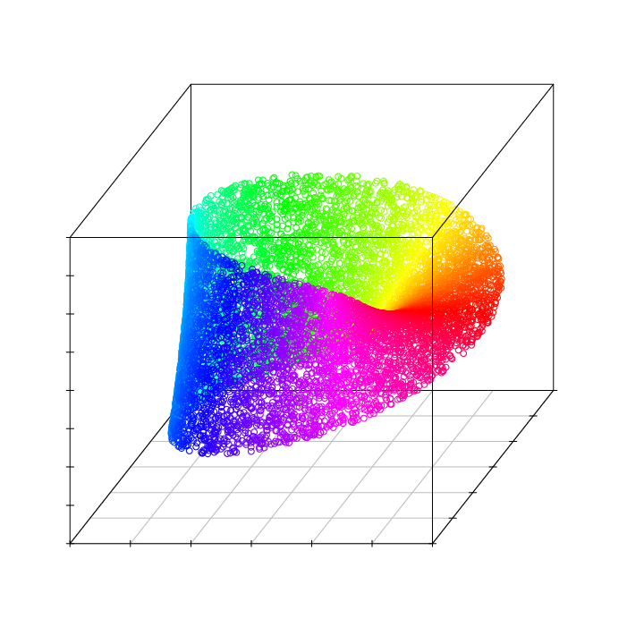
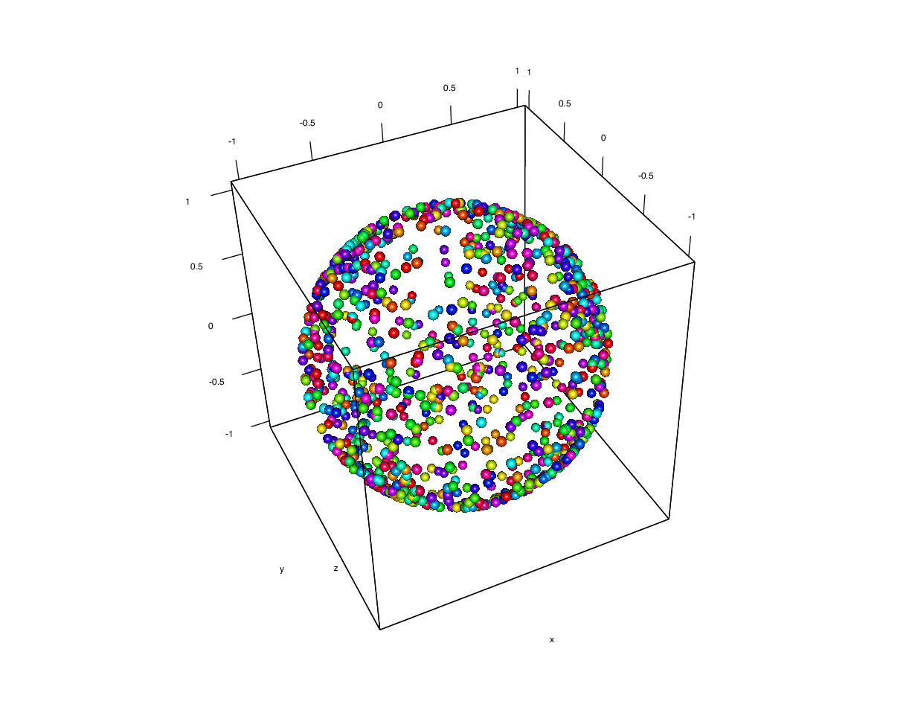
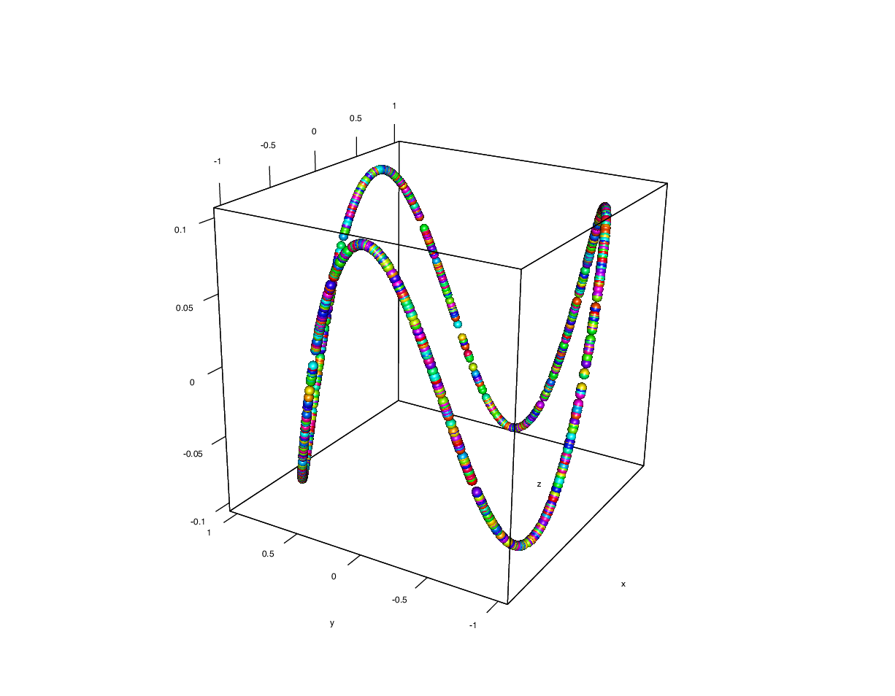
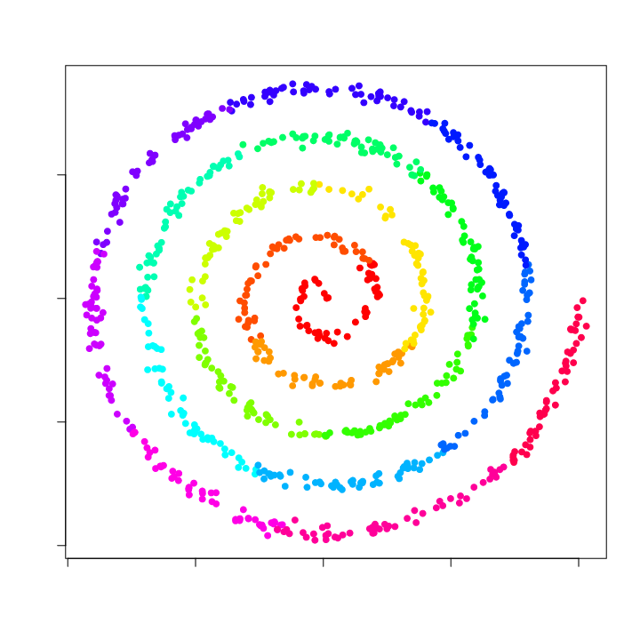
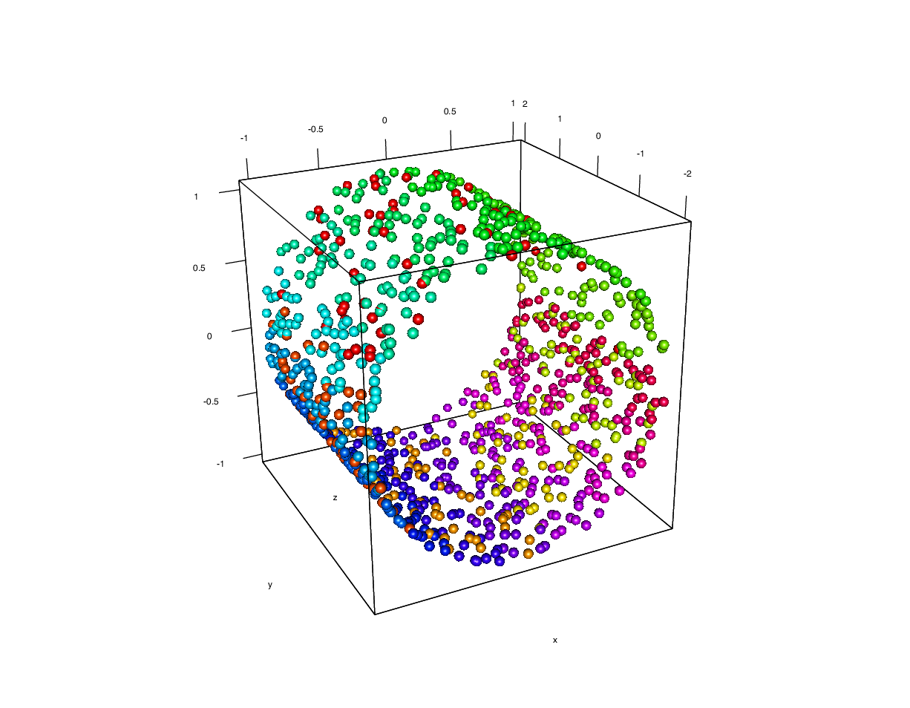
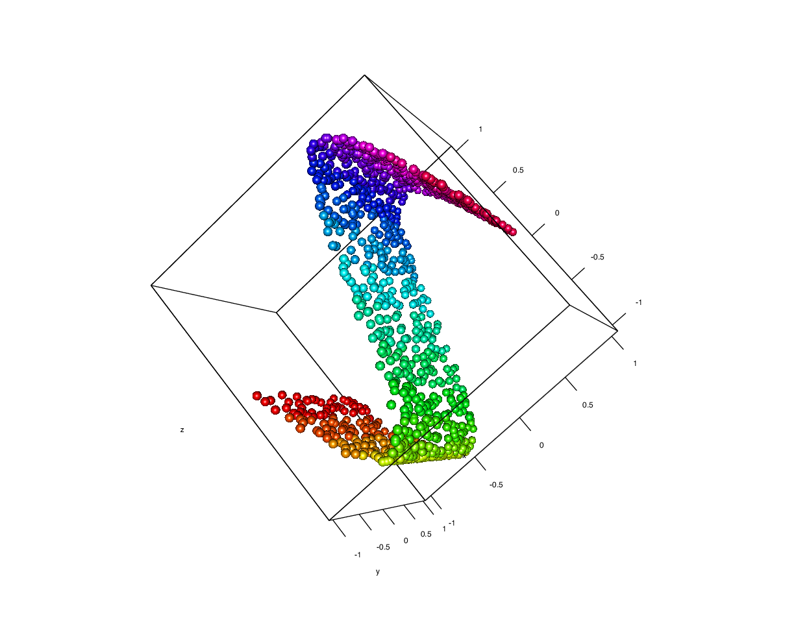
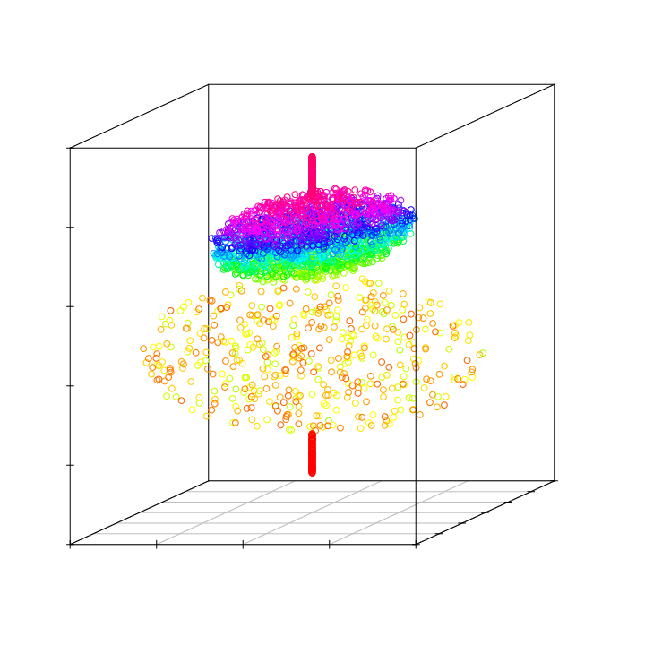

# Introduction

An assumption that the intrinsic dimension is low even when the apparent
dimension is high---that the data distribution is constrained onto a low
dimensional manifold---is the basis of many machine learning and data
analysis methods, such as dimension reduction and
visualization [@r.cook01:_dimen_reduc_and_visual_in; @Kokiopoulou2006_1475/LTS].
Without good estimates of the intrinsic dimension, dimensionality
reduction is no more than a risky bet, insofar as one does not know to
what extent the dimensionality can be reduced. We may overlook important
information by projecting the original data on too small dimensional
subspace. By analyzing high-dimensional data unnecessarily, computation
resources and time can be wasted. When we use visualization techniques
to gain insights about data, it is essential to understand whether the
data at hand can be safely visualized at low dimensions, and to what
extent the original information will be preserved via the visualization
method. Several methods for intrinsic dimension estimation (IDE) have
been proposed, and they can be roughly divided into two categories:

-   projection-based methods and

-   distance-based methods.

The former category of IDE methods basically involve two steps. First,
the given dataset is partitioned. Then, in each partition, principal
component analysis (PCA) or another procedure for finding a dominant
subspace is performed. This approach is generally easy to implement and
suitable for exploratory data
analysis [@1309587; @Verveer:1995:EID:200846.200859; @DBLP:journals/neco/KambhatlaL97; @279292].
However, the estimated dimension is heavily influenced by how the data
space is partitioned. Moreover, it is also unknown how the threshold for
the eigenvalue obtained by PCA should be determined. This class of
methods is useful for explanatory analysis with human interaction and
trial-and-error iteration. However, it is unsuitable for plugging into a
pipeline for automated data analysis, and we do not consider this sort
of method in this paper.

The package [*ider*](https://CRAN.R-project.org/package=ider) implements
various methods for estimating the intrinsic dimension from a set of
observed data using a distance-based
approach [@4766873; @Grassberger1983189; @DBLP:conf/nips/Kegl02; @NIPS2005_94; @DBLP:conf/icml/HeinA05; @1497775; @DBLP:conf/uai/GuptaH10; @6319815; @Hino2017IDE].
The implemented algorithms work with either a data matrix or a distance
matrix. There are a large number of distance-based IDE methods. Among
them, methods based on the fractal dimension [@Mandelbrot77a] are well
studied in the fields of both mathematics and physics. The proposed
package [*ider*](https://CRAN.R-project.org/package=ider) implements the
following fractal dimension-based methods:

::: description
`corint`: the correlation integral [@Grassberger1983189]

`convU`: the kernel-version of the correlation
integral [@DBLP:conf/icml/HeinA05]

`packG,packT`: capacity dimension-based methods with packing number
estimation (a greedy method [@DBLP:conf/nips/Kegl02] and a tree-based
method [@6319815])

`mada`: first-order local dimension
estimation [@DBLP:conf/icml/FarahmandSA07]

`side`: second-order local dimension estimation [@Hino2017IDE]
:::

There are several other distance-based methods, such as one based on a
maximum-likelihood estimate of the Poisson distribution [@NIPS2005_94],
which approximates the distance distribution from an inspection point to
other points in a given dataset. This method is implemented in our
package as a function `lbmle`. A similar but different approach
utilizing the nearest-neighbor information has also been implemented as
a function `nni` [@4766873].

The proposed package also provides a data-generating function `gendata`
that generates several famous artificial datasets often used as
benchmarks for IDE and manifold learning.

# Fractal dimensions

In fractal analysis, the Euclidean concept of a dimension is replaced
with the notion of a fractal dimension, which characterizes how the
given shape or datasets occupy their ambient space. There are many
different definitions of the fractal dimension, from both mathematical
and physical perspectives. Well-known fractal dimensions include the
correlation dimension and the capacity dimension. There are already some
R packages for estimating the fractal dimension, such as
[*fractal*](https://CRAN.R-project.org/package=fractal),
[*nonlinearTseries*](https://CRAN.R-project.org/package=nonlinearTseries),
and [*tseriesChaos*](https://CRAN.R-project.org/package=tseriesChaos).
In [*fractal*](https://CRAN.R-project.org/package=fractal) and
[*nonlinearTseries*](https://CRAN.R-project.org/package=nonlinearTseries),
the correlation dimension and its generalization estimators are
implemented, and in
[*tseriesChaos*](https://CRAN.R-project.org/package=tseriesChaos), the
method of false nearest neighbors [@PhysRevA.45.3403] is implemented.
These packages focus on estimates of the embedded dimension of a time
series in order to characterize its chaotic property. To complement the
above-mentioned packages, we implemented several fractal dimension
estimators for vector-valued observations.

# Global dimensions

## Correlation dimension

For a set of observed data $\mathcal{D} = \{x_{i}\}_{i=1}^{n}$, the
correlation integral is defined as
$$\label{eq:Vol2}
 V_{2}( \varepsilon) = 
\lim_{n \rightarrow \infty}\frac{2}{n(n-1)} \sum_{i<j}^{n} 
I(\|x_{i} -  x_{j}\| < \varepsilon)   (\#eq:Vol2)$$
using a sufficiently small $\varepsilon> 0$. In Eq. \@ref(eq:Vol2),
$I(u)$ is the indicator function which returns one when the statement
$u$ is true and zero if the statement is false. The correlation integral
$V_{2}(\varepsilon)$ is the ratio of pairs whose distance is below
$\varepsilon$, and this number grows as a length for a one-dimensional
object, as a surface for a two-dimensional object, as a volume for a
three-dimensional object, and so forth. So, it is natural to assume that
$V_{2}(\varepsilon)$ grows proportional to the intrinsic dimension, and
the intrinsic dimension associated with $V_{2}(\varepsilon)$ is defined
as the correlation dimension. To be precise, using the correlation
integral, the correlation dimension is defined as
$$\label{eq:cordim}
p_{cor} = \lim_{\varepsilon\rightarrow 0}
\frac{\log V_{2}(\varepsilon)}{\log \varepsilon}.   (\#eq:cordim)$$
Intuitively, the number of sample pairs with a distance smaller than
$\varepsilon$ should increase in proportion to $\varepsilon^{p}$, where
$p$ is the intrinsic dimension. The correlation dimension exploits this
property, i.e., $V_{2}(\varepsilon) \propto \varepsilon^{p}$, to define
the intrinsic dimension $p_{cor}$. [@Grassberger1983189] proposed the
use of the empirical (finite sample) estimates
$\hat{V}_{2}(\varepsilon_{k})
= \frac{2}{n(n-1)} \sum_{i<j}^{n} 
I(\|x_{i} -  x_{j}\| < \varepsilon_k),\; k=1,2$ of the correlation
integral $V_{2}(\varepsilon)$ with two different radii,
$\varepsilon_{1}$ and $\varepsilon_{2}$, in order to estimate the
correlation dimension \@ref(eq:cordim) as follows:
$$\label{eq:corEst}
 \hat{p}_{cor}(\varepsilon_1,\varepsilon_2) = 
\frac{\log \hat{V}_{2}(\varepsilon_{2})  - \log \hat{V}_{2}(\varepsilon_{1})
}
{
\log \varepsilon_{2} - \log \varepsilon_{1}
}.   (\#eq:corEst)$$
[@DBLP:conf/icml/HeinA05] proposed the use of a U-statistic with the
form
$$\hat{V}_{2,h} = \frac{2}{n(n-1)}
\sum_{i < j}^{n} \kappa_{h}(\|x_i - x_j\|^{2})$$
using a kernel function $\kappa_{h}$ with bandwidth $h$ to count the
number of samples, and replaced the correlation integral by
$\hat{V}_{2,h}$. The convergence of this U-statistic with
$n \rightarrow \infty$, by an argument similar to kernel bandwidth
selection [@citeulike:2226990], requires that $h \rightarrow 0$ and
$n h ^{p} \rightarrow \infty$. These conditions are used in
[@DBLP:conf/icml/HeinA05] to derive a formula for estimating the global
intrinsic dimension $p$.

In the [*ider*](https://CRAN.R-project.org/package=ider) package, the
classical correlation dimension estimator proposed in
 @Grassberger1983189 is performed using the function `corint` as
follows.

``` r
> set.seed(123)
> x <- gendata(DataName='SwissRoll', n=300)
> estcorint <- corint(x=x, k1=5, k2=10)
> print(estcorint)
> [1] 1.963088
```

where $k1$ and $k2$ respectively correspond to $\varepsilon_{1}$ and
$\varepsilon_{2}$ in Eq. \@ref(eq:corEst). Indeed, it is easy and safe
to specify an integer $k$ for the $k$-th nearest neighbor rather than
the radius $\varepsilon$, because there is no guarantee that there is a
data point in $\varepsilon$-ball in general. In the above example, we
used the function `gendata` to generate the famous 'SwissRoll' data with
an ambient dimension of three and an intrinsic dimension of two. As
observed, the correlation integral method by @Grassberger1983189 works
well for this dataset. The kernel-based correlation dimension estimator
is performed by using the function `convU` as follows:

``` r
> set.seed(123)
> x <- gendata(DataName='SwissRoll', n=300)
> estconvU <- convU(x=x, maxDim=5)
> print(estconvU) 
> [1] 2
```

The method proposed by @DBLP:conf/icml/HeinA05 attempts to find the
possible intrinsic dimension one-by-one up to `maxDim`. Consequently,
the estimated dimension can only be a natural number. All IDE functions
in [*ider*](https://CRAN.R-project.org/package=ider) support both
vector-valued data matrices and distance matrices as the input data.
This is useful in cases where we exclusively obtain a distance matrix,
and in cases where the original data object cannot be represented by a
finite and fixed dimensional vector. This is also useful when we treat
very high-dimensional data, such that retaining its distance matrix
saves memory storage. To indicate that the input is a distance matrix,
we set the parameter `DM` to `TRUE` as follows:

``` r
> set.seed(123)
> x <- gendata(DataName='SwissRoll', n=300)
> estcorint <- corint(x=dist(x), DM=TRUE, k1=5, k2=10)
> print(estcorint) 
> [1] 1.963088
```

The distance matrix can be either a `matrix` object or `dist` object.

## Capacity dimension

Let $\mathcal{X}$ be a given metric space with distance metric
$d: \mathcal{X} \times \mathcal{X} \to \mathbb{R}_{+}$. The
$\varepsilon$-covering number $N(\varepsilon)$ of a set
$\mathcal{S} \subset \mathcal{X}$ is the minimum number of open balls
$b(z;\varepsilon) = \{x \in \mathcal{X} | d(x,z) < \varepsilon\}$ whose
union is a covering of $\mathcal{S}$. The capacity
dimension [@HENTSCHEL1983435] or box-counting dimension is defined by
$$p_{cap}
= 
- \lim_{\varepsilon\rightarrow 0 } \frac{\log N(\varepsilon)}{\log \varepsilon}.$$
The intuition behind the definition of capacity dimension is the
following. Assuming a three-dimensional space divided in small cubic
boxes with a fixed edge length $\varepsilon$, the box-counting dimension
is related to the proportion of occupied boxes. For a growing
one-dimensional object placed in this compartmentalized space, the
number of occupied boxes grows proportionally to the object length.
Similarly, for a growing two-dimensional object, the number of occupied
boxes grows proportionally to the object surface, and for a growing
three-dimensional object, the number grows proportionally to the volume.
Considering the situation that the size of the object remains unchanged
but the edge length $\varepsilon$ of the boxes decreases justify the
definition of $p_{cap}$.

The problem of estimating $p_{cap}$ is reduced to the problem of
estimating $N(\varepsilon)$, but finding the covering number is
computationally intractable. @DBLP:conf/nips/Kegl02 proposed the
replacement of the covering number $N(\varepsilon)$ with the
$\varepsilon$-packing number $M(\varepsilon)$. Given a metric space
$\mathcal{X}$ with distance $d$, a set $V \subset \mathcal{X}$ is said
to be $\varepsilon$-separated if $d(x,y) \geq \varepsilon$ for all
$x,y \in V, x\neq y$. The $\varepsilon$-packing number $M(\varepsilon)$
is defined by the maximum cardinality of an $\varepsilon$-separated
subset of the data space $\mathcal{X}$, and it is known that the
inequalities $N(\varepsilon) \leq M(\varepsilon) \leq N(\varepsilon/2)$
hold. Considering the fact that the capacity dimension is defined as the
limit $\varepsilon\rightarrow 0$, the following holds:
$$p_{cap} = - \lim_{\varepsilon\rightarrow 0 } \frac{\log
  M(\varepsilon)}{\log \varepsilon}.$$
The capacity dimension based on the packing number is estimated using
the estimates of the packing number at two different radii,
$\varepsilon_{1}$ and $\varepsilon_{2}$, as
$$\hat{p}_{cap} = 
-
\frac{\log \hat{M}(\varepsilon_{2})  - \log \hat{M}(\varepsilon_{1})
}
{
\log \varepsilon_{2} - \log \varepsilon_{1}
}.$$
The $\varepsilon$-packing number $M(\varepsilon)$ has been estimated
using a greedy algorithm [@DBLP:conf/nips/Kegl02] and by using a
hierarchical clustering algorithm [@6319815].

In the [*ider*](https://CRAN.R-project.org/package=ider) package, the
capacity dimension estimation is based on the packing number with greedy
approximation, and it is performed using the function `pack` as

``` r
> set.seed(123)
> x <- gendata(DataName='SwissRoll', n=300)
> estpackG <- pack(x=x, greedy=TRUE)  ## estimate the packing number by greedy method
> print(estpackG)
> [1] 2.289935
```

whereas the hierarchical clustering-based method is performed as

``` r
> estpackC <- pack(x=x, greedy=FALSE) ## estimate the packing number by cluttering
> print(estpackC)
> [1] 2.393657
```

Packing-number-based methods require two radii $\varepsilon_{1}$ and
$\varepsilon_{2}$, which are specified by arguments $k_{1}$ and $k_{2}$,
respectively. If one of these arguments is NULL, both can be determined
by a $0.25$ and $0.75$ quantile of distance from all pairs of data
points.

# Local dimensions

The former two fractal dimensions, viz., the correlation dimension and
capacity dimension, are designed to estimate a global intrinsic
dimension. Any global IDE method can be converted into a local method by
running the global method on a neighborhood of a point. However, we
introduce two inherently local fractal dimension estimators. The
relationship between global and local fractal dimensions are shown
in [@Hino2017IDE].

Let $\mu$ be an absolutely continuous probability measure on a metric
space $\mathcal{X}$, and let the corresponding probability density
function (pdf) be $f(x)$. Consider the problem of estimating the value
of the pdf at a point $z \in \mathcal{X} \subseteq \mathbb{R}^{p}$ using
a set of observations $\mathcal{D} =  \{x_{i}\}_{i=1}^{n}$.

### First-order method

Let the $p$-dimensional hyper-ball of radius $\varepsilon$ centered at
$z$ be $b(z;\varepsilon) =
\{x \in \mathbb{R}^{p}| d(z,x)  <
\varepsilon\}$. The probability mass of the ball $b(z;\varepsilon)$ is
defined as
$$\Pr(X \in b(z;\varepsilon)) 
= 
\int_{x \in b(z;\varepsilon)}
 \mathrm{d}\mu(x)
=
\int_{x \in b(z;\varepsilon)}
f(x) \mathrm{d}\nu(x),$$
where $\nu$ is the uniform measure in $p$-dimensional Euclidean space.
We assume that for a sufficiently small radius $\varepsilon > 0$, the
value of the pdf $f(z)$ is approximately a constant within the ball
$b(z;\varepsilon)$. Under this assumption, using the Taylor series
expansion of the probability mass, we obtain
$$\begin{aligned}
\Pr(X \in b(z;\varepsilon))  =&
\int_{x \in b(z;\varepsilon)}
\Big\{
f(z)
+
(x - z)^{\top}
\nabla f(z)
+
O(\varepsilon^{2})
\Big\} \mathrm{d}\nu(x)\\
=&
|b(z;\varepsilon)|
\left(
f(z) + O(\varepsilon^2)
\right)
= c_{p}\varepsilon^{p} f(z) + O(\varepsilon^{p+2}),
\end{aligned}$$
where
$\int_{x \in b(z;\varepsilon)} \mathrm{d}\nu(x) = |b(z;\varepsilon)|$.
The volume of a ball with a uniform measure is
$|b(z;\varepsilon)| = c_{p} \varepsilon^{p}$, where
$c_{p} = \pi^{p/2}/ \Gamma(p/2 + 1)$, and $\Gamma(\; \cdot \;)$ is the
gamma function. In this expansion, the integration is performed within
the $\varepsilon$-ball; hence $x-z$ is of the same order as
$\varepsilon$. The term with the first derivative of the density
function vanishes owing to symmetry. When we fix the number of samples
$k$ falling within the ball $b(z;\varepsilon)$ instead of the radius
$\varepsilon$, the radius $\varepsilon$ is determined by the distance
between the inspection point $z$ and its $k$-th nearest neighbor. In
this paper, $\varepsilon_k$ denotes the radius determined by $k$.
Inversely, when we fix the radius $\varepsilon$, the number of samples
falling within the $\varepsilon$-ball centered at an inspection point is
determined and denoted by $k_{\varepsilon}$.
In [@DBLP:conf/icml/FarahmandSA07], $\Pr(X \in b(z;\varepsilon))$ is
approximated by the ratio of $b(z;\varepsilon)$ and the sample size $n$
as follows:
$$\Pr(X \in b(z;\varepsilon)) \simeq \frac{k_{\varepsilon}}{n} \simeq c_{p} 
\varepsilon^{p} f(z).$$
Then, for different radii $\varepsilon_{1},\varepsilon_{2}$, the
logarithm of the above approximation formula derives the following:
$$\begin{aligned}
 \log \frac{k_{\varepsilon_1}}{n} =&\log c_p f(z) + p \log
  \varepsilon_{1},\\
 \log \frac{k_{\varepsilon_2}}{n} =&\log c_p f(z) + p \log \varepsilon_{2}.
\end{aligned}$$
Solving this system of equations with respect to the dimension yields
the estimate of the local fractal dimension:
$$\hat{p}_{mada} = \frac{\log k_{\varepsilon_{2}} - \log
  k_{\varepsilon_{1}}}{\log \varepsilon_{2} - \log \varepsilon_{1}}.$$
The convergence rate of this estimator is independent of the ambient
dimension, but it depends on the intrinsic dimension. Hence,
$\hat{p}_{mada}$ is called the manifold adaptive dimension estimator
in [@DBLP:conf/icml/FarahmandSA07]. This estimator is simple and easy to
implement, and it provides a finite sample error bound. We explain the
usage of this first-order local IDE method in package
[*ider*](https://CRAN.R-project.org/package=ider). To demonstrate the
ability of a local estimate, we use a dataset "lbdl" (i.e.,
line-disc-ball-line), which comprises sub-datasets with one, two, and
three dimensions embedded in three-dimensional space. Using this
dataset, the example of the use of a first-order local IDE called `mada`
is shown below:

``` r
> set.seed(123)
> tmp <- gendata(DataName='ldbl', n=300)
> x <- tmp$x
> estmada <- mada(x=x, local=TRUE)
> estmada[c(which(tmp$tDim==1)[1], which(tmp$tDim==2)[1], which(tmp$tDim==3)[1])]
> 1.113473 2.545525 2.207250
```

This sample code estimates the local intrinsic dimensions of every point
in the dataset $x$, and shows the estimates at the points with true
intrinsic dimensions of one, two, and three.

### Second-order method

In [@Hino2017IDE], accurate local IDE methods based on a higher-order
expansion of the probability mass function and Poisson regression
modeling are proposed. By using the second-order Taylor series expansion
for $\Pr(X \in b(z;\varepsilon))$, we obtain the following proposition:

#### Proposition 1: {#prop:main}

The probability mass $\Pr(X \in b(z;\varepsilon))$ of the
$\varepsilon$-ball centered at $z$ is expressed in the form
$$\begin{aligned}
\Pr(X \in b(z;\varepsilon))  = c_{p} f(z)\varepsilon^{p} + \frac{p}{4(p/2+1)}c_{p} \mathrm{tr}\nabla^{2}f(z)
\varepsilon^{p+2} + O(\varepsilon^{p+4}).
\end{aligned}$$

The proof for this is detailed in [@Hino2017IDE]. However, there is no
need to know the exact form of the second-order expansion. By
approximating the probability mass $\Pr(X \in b(z;\varepsilon))$
empirically with the ratio $k_{\varepsilon}/n$, i.e., the ratio of the
number of samples falling into the $\varepsilon$-ball to the whole
sample size, we obtain the following relationship:
$$\frac{k_{\varepsilon}}{n} = 
c_{p} f(z)\varepsilon^{p} + \frac{p}{4(p/2+1)}c_{p} \mathrm{tr}\nabla^{2}f(z)
\varepsilon^{p+2}$$
by ignoring the higher-order term with respect to $\varepsilon$.
Furthermore, by multiplying both sides of each equation by $n$, and
letting the coefficients of $\varepsilon^p$ and $\varepsilon^{p+2}$ be
$\beta_1$ and $\beta_2$, respectively, we obtain
$$\label{eq:regFunc}
 k_{\varepsilon} = \beta_{1} \varepsilon^{p} + \beta_{2} \varepsilon^{p+2}.   (\#eq:regFunc)$$
To estimate the intrinsic dimension using the second-order Taylor series
expansion, we fit a generalized linear model (GLM; [@GLM2002]) to
Eq. \@ref(eq:regFunc), which expresses the counting nature of the
left-hand side of the equation.

Let the intrinsic dimension at the inspection point $z$ be
$p\; (p=1,\dots,\mathrm{maxDim})$, where $\mathrm{maxDim}$ is the
pre-determined upper limit of the intrinsic dimension. We express
realizations of a vector-valued random variable
$x_{\varepsilon,p} \in \mathbb{R}^{2}$, which is composed of
$\varepsilon^{p}$ and $\varepsilon^{p+2}$, where $\varepsilon$ is the
distance from the inspection point, by
$$x_{\varepsilon,p} \in 
\left\{
\begin{pmatrix}\varepsilon^{p}_{1}\\ \varepsilon^{p+2}_{1}\end{pmatrix},
\begin{pmatrix}\varepsilon^{p}_{2}\\ \varepsilon^{p+2}_{2}\end{pmatrix},
\dots
\right\}.$$
We also introduce realizations of a random variable
$y_{\varepsilon} = k_{\varepsilon}
\in \{1,2,\dots \}$, which is the number of samples included in the ball
$b(z;\varepsilon)$. Specifically, we consider a pair of random variables
$(Y,X_{p})$ and fix a radius $\varepsilon$ corresponding to a *trial*
that results in realizations $(y_{\varepsilon},x_{\varepsilon,p})$.
Because the realization $y_{\varepsilon}$ is the number of samples
within the $\varepsilon$-ball, and assuming that the number of
observation $n$ is sufficiently large, we assume that the error
structure of $Y$ is a Poisson distribution. Then, we can formulate the
relationship between the distance from the inspection point
$\varepsilon$ and the number of samples falling within the
$\varepsilon$-ball using a generalized linear model with a Poisson error
structure and linear link function as follows:
$$\label{eq:glm}
 E[y] = x^{\top}\beta.   (\#eq:glm)$$
A set of $m$ different radii is denoted as $\mathcal{E}$, i.e.,
$\{\varepsilon_{1},\dots,\varepsilon_{m}\} \in \mathcal{E}$. We maximize
the log-likelihood of the Poisson distribution with the observation
$\{(y_{\varepsilon},x_{\varepsilon,p})\}_{\varepsilon \in \mathcal{E}}$
with respect to the coefficient vector $\beta \in \mathbb{R}^{2}$. In
this work, we simply consider the $m$-th nearest neighbor with
$m = \min \{\lceil n/5 \rceil, 100 \}$, and let the Euclidean distance
from the inspection point $z$ to its $m$-th nearest point $x_{(m)}$ be
$d(z,x_{(m)})$. Then, we uniformly sample $m$ radii $\mathcal{E} = 
\{\varepsilon_1,\varepsilon_2,\dots,\varepsilon_m\}$ from a uniform
distribution in $[0,d(z,x_{(m)})]$. Let the observation vector and
design matrix, which are composed of realizations of $Y$ and $X$, be
$$\begin{aligned}
\label{eq:obsY}
 \mathbf{y} =& (y_{\varepsilon_{1}},y_{\varepsilon_{2}},
 \dots,y_{\varepsilon_{m}})^{\top}
\in \mathbb{R}^{m}
\\ \notag
\end{aligned}   (\#eq:obsY)$$

$$\begin{aligned}
\mathbf{X}_{p} =& 
(x_{\varepsilon_{1},p},x_{\varepsilon_{2},p},\dots,x_{\varepsilon_{m},p})^{\top}  \\
\label{eq:obsX}
\end{aligned}   (\#eq:obsX)$$

$$\begin{aligned}
=&
\begin{pmatrix}
 \varepsilon^{p}_{1}&  \varepsilon^{p}_{2}& \dots & \varepsilon^{p}_{m}\\
 \varepsilon^{p+2}_{1}&\varepsilon^{p+2}_{2}&\dots & \varepsilon^{p+2}_{m}
\end{pmatrix}^{\top}
\in \mathbb{R}^{m \times 2}.
\end{aligned}$$
We consider a generalized linear model [@GLM2002] with the linear
predictor $\mathbf{X}_{p} \beta$ and identity link
$$E[\mathbf{y}] = \mathbf{X}_{p} \beta,$$
and the log-likelihood function of the Poisson distribution:
$$\begin{aligned}
\label{eq:lk}
 L(\{\mathbf{y},\mathbf{X}_{p}\};\beta) =& 
\log \prod_{\varepsilon \in \mathcal{E}}\frac{
e^{-x_{\varepsilon,p}^{\top}\beta} (x_{\varepsilon,p}^{\top}\beta)^{y_{\varepsilon}}
}{
y_{\varepsilon}!
}.
\end{aligned}   (\#eq:lk)$$
By assuming that the intrinsic dimension is $p$, the optimal IDE is
estimated on the basis of the goodness of fit of the data to the
regression model \@ref(eq:regFunc). We use the
log-likelihood \@ref(eq:lk) to measure this goodness of fit. Note that
the number of parameters is always two, even when we change the assumed
IDE $p$; hence, the problem of over-fitting by maximizing the likelihood
is avoided in our setting.

In the package [*ider*](https://CRAN.R-project.org/package=ider), two
IDE algorithms are implemented based on the maximization of
Eq. \@ref(eq:lk). The first method simply assumes distinct intrinsic
dimensions and maximizes the log-likelihood \@ref(eq:lk) with respect to
$\beta$ with fixed $p$. Let the ambient dimension or maximum possible
dimension of the observation be $\mathrm{maxDim}$. We assume that the
intrinsic dimension is $p=1,2,\dots, \mathrm{maxDim}$, and for every
$p$, we fit the regression model \@ref(eq:regFunc) by maximizing the
log-likelihood \@ref(eq:lk) with respect to $\beta$, and employ the
dimension $p$ that maximizes the likelihood:
$$\hat{p}_{s1} = \mathop{\rm arg~max}\limits_{p \in \{1,\dots,\mathrm{maxDim}\}} \; \max_{\beta \in \mathbb{R}^{2}} L(\{\mathbf{y},\mathbf{X}_{p}\};\beta).$$

The second method treats the log-likelihood \@ref(eq:lk) as a function
of both the regression coefficients $\beta \in \mathbb{R}^{2}$ and the
intrinsic dimension $p \in \mathbb{R}_{+}$. Given a set of observations,
we can maximize the log-likelihood function with respect to
$(p, \beta_1,\beta_2)$. Because it is difficult to obtain a closed-form
solution for the maximizer of the likelihood \@ref(eq:lk), we
numerically maximize the likelihood to obtain the estimate as
$$\hat{p}_{s2} = \mathop{\rm arg~max}\limits_{p \in \mathbb{R}_{+}} \; \max_{\beta \in
  \mathbb{R}^{2}}
L(\{\mathbf{y},\mathbf{X}_{p}\};\beta)$$
by using the quasi-Newton (BFGS) method. The initial point for the
variables $(p,\beta_{1},\beta_{2})$ is set to the estimate obtained
using the first method explained above.

In the [*ider*](https://CRAN.R-project.org/package=ider) package, a
second-order local IDE with discrete dimensions is performed using the
function `side` (Second-order Intrinsic Dimension Estimator) as follows:

``` r
> set.seed(123)
> tmp <- gendata(DataName='ldbl', n=300)
> x <- tmp$x
> idx <- c(sample(which(tmp$tDim==1)[1:10], 3), sample(which(tmp$tDim==2)[1:30], 3))
> estside <- side(x=x[1:100,], local=TRUE, method='disc')
> print(estside[idx]) ## estimated discrete local intrinsic dimensions by side
[1] 1 1 1 3 1 2
```

An example of the same, using the method 'cont' is as follows:

``` r
> estside <- side(x=x[1:100,], local=TRUE, method='cont')
> print(estside[idx]) ## estimated continuous local intrinsic dimensions by side
[1] 1.020254 1.338089 1.000000 2.126269 3.360426 2.074643
```

It is seen that the obtained estimates are not natural numbers.

The local dimension estimate is easily aggregated to a global estimate
by taking an average, median, or voting of local estimates, and this is
realized when we set the argument `local = TRUE` in `mada` or `side`.
The functions `mada` and `side` have an argument `comb` to specify how
the local estimates are combined. When `comb=’average’`, the local
estimates are averaged as a global IDE. Likewise, when `comb=’median’`,
the median of the local estimates is adopted; and when `comb=’vote’`,
the voting of local estimates is adopted as a global IDE. Note that the
combination method `vote` should be used only with `method=’disc’`.

``` r
> set.seed(123)
> x <- gendata(DataName='SwissRoll', n=300)
> estmada <- mada(x=x, local=FALSE, comb='median')
> estmada
[1] 1.754866
> estside <- side(x=x, local=FALSE, comb='median', method='disc')
> estside
[1] 2
```

# Other distance-based approaches

The package [*ider*](https://CRAN.R-project.org/package=ider) supports
two other distance-based dimension-estimation methods, namely `lbmle`
and `nni`.

## Maximum likelihood estimation

@NIPS2005_94 derived the maximum likelihood estimator of the dimension
$p$ from i.i.d. observations $\mathcal{D} = \{x_{i}\}_{i=1}^{n}$. Let
$f$ be a pdf of the data points smoothly embedded in a $p$-dimensional
space, i.e., a space with intrinsic dimension, and assume that when a
point $x$ is fixed, the value of pdf $f(x)$ is constant in a small ball
$b(x;\varepsilon)$. Consider the point process
$$\{N(t,x), \; 0 \leq t \leq \varepsilon\}, \quad N(t,x) = \sum_{i=1}^{n} \mathbf{1} \{x_{i} \in b(x;t)\},$$
which counts the observations within distance $t$ from the inspection
point $x$. This point process is approximated using a homogeneous
Poisson process, with rate
$$\lambda(t) = c_{p} f(x) p t^{p-1}.$$
The log-likelihood of the observed process $N(t)$ is written as
$$L(p,\log f(x) ) = \int_{0}^{\varepsilon} \log \lambda(t) \mathrm{d}N(t) - \int_{0}^{\varepsilon} \lambda(t) \mathrm{d}t.$$
Solving the likelihood equation, the maximum likelihood estimate of the
intrinsic dimension around $x$ is
$$\hat{p}_{\varepsilon}(x) = 
\left\{
\frac{1}{N(\varepsilon,x)}
\sum_{j=1}^{N(\varepsilon,x)} \log \frac{\varepsilon}{\varepsilon_{j}(x)}
\right\}^{-1},$$
or, more conveniently in practice,
$$\hat{p}_{k}(x) = 
\left\{
\frac{1}{k-1}
\sum_{j=1}^{k-1}
\log
\frac{\varepsilon_{k}(x)}{\varepsilon_{j}(x)}
\right\}^{-1},$$
where $\varepsilon_{j}(x)$ denotes the distance between the inspection
point $x$ to its $j$-th nearest point. Then, choosing two indices,
$k_{1}$ and $k_{2}$, the maximum likelihood estimate $\hat{p}_{ml}$ of
the intrinsic dimension is obtained as follows:
$$\hat{p}_{ml} = \frac{1}{k_{2} - k_{1} + 1}
\sum_{k=k_{1}}^{k_{2}} \hat{q}_{k}, \qquad
\hat{q}_{k} =
\frac{1}{n}
\sum_{i=1}^{n} \hat{p}_{k}(x_{i}).$$
In the [*ider*](https://CRAN.R-project.org/package=ider) package, the
maximum likelihood estimation is obtained by using the function `lbmle`:

``` r
> set.seed(123)
> x <- gendata(DataName='SwissRoll', n=300)
> estmle <- lbmle(x=x, k1=3, k2=5, BC=FALSE)
> print(estmle)
[1] 3.174426
```

It was pointed out by MacKay and Ghahramani that the above MLE contains
a certain bias [^1]. With the function `lbmle`, however, we can
calculate the bias-corrected estimate by setting the argument `BC`,
which stands for \"bias-correction\", to `TRUE`:

``` r
> set.seed(123)
> x <- gendata(DataName='SwissRoll', n=300)
> estmle <- lbmle(x=x, k1=3, k2=5, BC=TRUE)
> print(estmle)
[1] 2.032756
```

## Near-neighbor information

@4766873 proposed an IDE method based on the analysis of the
distribution of distances from one point to its nearest neighbors.
@4766873 derived that the distribution of the distance from a point $x$
to its $k$-th nearest neighbor $\epsilon_{k,x}$ is, based on the Poisson
approximation, given by the following probability density function
$$f_{k,x}(\epsilon_{k,x}) = n f(x) c_{p} 
 \frac{
\{ nf(x) c_{p} \}^{k-1}
 }{
 \Gamma(k)
 }
 \exp(- n f(x) c_{p} \epsilon_{k,x}^{p}).$$
The expected value of the sample average of distance to the $k$-th
nearest neighbor over the given dataset is

$$\label{eq:nii1}
E[ \bar{\epsilon}_{k}] = \frac{1}{n} \sum_{i=1}^{n} E [\epsilon_{k,x_{i}}] = 
\frac{1}{G_{k,p}} k^{1/p} A_{n},  
(\#eq:nii1)$$

where
$$G_{k,p} = 
\frac{
k^{1/p} \Gamma(k)
}{
\Gamma(k+1/p)
}, \quad
A_{n} = \frac{1}{n}
\sum_{i=1}^{n} 
\{
n f(x_{i}) c_{p}
\}^{-1/p}.$$
Note that $A_{n}$ is sample-dependent but independent of $k$. Let
$\hat{p}_0$ be the first rough estimate of the intrinsic dimension.
Taking logarithm of eq. \@ref(eq:nii1) yields

$$\label{eq:nii2}
\log G_{k,\hat{p}_{0}} + \log \bar{\epsilon}_{k} = 
\frac{1}{p} \log k + \log A_{n},   (\#eq:nii2)$$

where $E [\epsilon_{k}]$ is replaced with the sample average
$\bar{\epsilon}_{k}$. From $k_{1}$ to $k_{2}$, we calculate the left
hand side of eq. \@ref(eq:nii2) for each $k$, and treat them as the
realizations of the *response variable*. Linear regression of
$\log k, \; k \in [k_1, k_2]$ on those response variable yields the
updated estimate $\hat{p}_1$ of the intrinsic dimension. Replacing
$\hat{p}_0$ in $G_{k,p}$ with the updated $\hat{p}_1$ and repeat the
procedure until the gap between the new and the old estimates $\hat{p}$
is smaller than certain threshold.

The estimator is implemented as a function `nni` in
[*ider*](https://CRAN.R-project.org/package=ider) and used as follows:

``` r
> set.seed(123)
> x <- gendata(DataName='SwissRoll', n=300)
> estnni <- nni(x=x)
> print(estnni)
[1] 2.147266
```

The function `nni` has parameters $k1$ and $k2$, which are the same in
`lbmle`. This method is based on an iterative estimate of IDE, and the
function `nni` has a parameter `eps` to specify the threshold for
stopping the iteration, which is set at $0.01$ by default.

# Data-generating function

The [*ider*](https://CRAN.R-project.org/package=ider) package is
equipped with a data-generating function `gendata`. It can generate nine
different artificial datasets, which are manifolds of dimension $p$
embedded in ambient space of dimension $( \geq p)$. The dataset is
specified by setting the argument `DataName` to one of the following:

`SwissRoll`

:   SwissRoll data, a 2D manifold in 3D space.

`NDSwissRoll`

:   Non-deformable SwissRoll data, a 2D manifold in 3D space.

`Moebius`

:   Moebius strip, a 2D manifold in 3D space.

`SphericalShell`

:   Spherical Shell, $p$-dimensional manifold in $(p+1)$-dimensional
    space.

`Sinusoidal`

:   Sinusoidal data, a 1D manifold in 3D space.

`Spiral`

:   Spiral-shaped data, a 1D manifold in 2D space.

`Cylinder`

:   Cylinder-shaped data, a 2D manifold in 3D space.

`SShape`

:   S-shaped data, a 2D manifold in 3D space.

`ldbl`

:   Four subspaces, line - disc - filled ball - line, in this order,
    along the $z$-axis, embedded in 3D space.

The final dataset `lbdl` is used to see the ability of local dimension
estimations. The dataset comprises four sub-manifolds: line-shape (1D),
disc (2D), filled ball (3D), and line-shape again, and these four
sub-manifolds are concatenated in this order.

The parameter `n` of the function `gendata` specifies the number of
samples in a dataset. All but the `SphericalShell` dataset have fixed
ambient and intrinsic dimensions. For the `SphericalShell` dataset, an
arbitrary integer can be set as the ambient dimension by setting the
argument `p`.

The realizations of each dataset are shown in Fig. [1](#fig:samples).

<figure id="fig:samples">
<table>
<caption> </caption>
<tbody>
<tr class="odd">
<td style="text-align: center;"></td>
<td style="text-align: center;"></td>
<td style="text-align: center;"></td>
</tr>
<tr class="even">
<td style="text-align: center;">(a) <code>SwissRoll</code></td>
<td style="text-align: center;">(b) <code>NDSwissRoll</code></td>
<td style="text-align: center;">(c) <code>Moebius</code></td>
</tr>
<tr class="odd">
<td style="text-align: center;"></td>
<td style="text-align: center;"></td>
<td style="text-align: center;"></td>
</tr>
<tr class="even">
<td style="text-align: center;">(d) <code>SphericalShell</code></td>
<td style="text-align: center;">(e) <code>Sinusoidal</code></td>
<td style="text-align: center;">(f) <code>Spiral</code></td>
</tr>
<tr class="odd">
<td style="text-align: center;"></td>
<td style="text-align: center;"></td>
<td style="text-align: center;"></td>
</tr>
<tr class="even">
<td style="text-align: center;">(g) <code>Cylinder</code></td>
<td style="text-align: center;">(h) <code>SShape</code></td>
<td style="text-align: center;">(i) <code>ldbl</code></td>
</tr>
</tbody>
</table>
<figcaption>Figure 1: Samples of datasets generated by
<code>gendata</code>. <span id="fig:samples"
label="fig:samples"></span></figcaption>
</figure>

# Example: estimating the degree of freedom of hand motion

The aim of this paper is to introduce the package
[*ider*](https://CRAN.R-project.org/package=ider) and explain the
standard usage of its implemented functions. Exhaustive experiments
comparing IDE methods in various settings can be found in
[@Hino2017IDE]. In this paper, as a simple example of the application of
the IDE methods to realistic problems, we consider estimating the
intrinsic dimension of a set of images. We used the CMU Hand Rotation
dataset[^2], which was also used in [@DBLP:conf/nips/Kegl02]
and [@NIPS2005_94]. Examples of the hand images are shown in
Fig. [2](#fig:hand).

<figure id="fig:hand">
<table>
<caption> </caption>
<tbody>
<tr class="odd">
<td style="text-align: center;"></td>
<td style="text-align: center;"></td>
<td style="text-align: center;"></td>
<td style="text-align: center;"></td>
<td style="text-align: center;"></td>
</tr>
</tbody>
</table>
<figcaption>Figure 2: Example images in the Hand Rotation dataset. <span
id="fig:hand" label="fig:hand"></span></figcaption>
</figure>

The original CMU Hand Rotation dataset is composed of 481 images of
$512 \times 480$ pixels. In the package
[*ider*](https://CRAN.R-project.org/package=ider), the distance matrix
of these images is included:

``` r
> data(handD)
> str(handD)
Class 'dist'  atomic [1:115440] 4.96 8.27 8.33 8.31 8.12 ...
  ..- attr(*, "Labels")= chr [1:481] "dimg" "dimg" "dimg" "dimg" ...
  ..- attr(*, "Size")= int 481
  ..- attr(*, "call")= language as.dist.default(m = handD)
  ..- attr(*, "Diag")= logi FALSE
  ..- attr(*, "Upper")= logi FALSE
 > dim(as.matrix(handD))
 [1] 481 481
```

Because the object `handD` is a distance matrix, when we apply IDE
methods to this data, we must set the argument `DM` to `TRUE`:

``` r
>lbmle(x=handD, DM=TRUE, k1=3, k2=5, BC=TRUE, p=NULL)
[1] 4.433915
>corint(x=handD, DM=TRUE, k1=3, k2=10)
[1] 2.529079
> pack(x=handD, DM=TRUE, greedy=TRUE)
[1] 3.314233
> pack(x=handD, DM=TRUE, greedy=FALSE)
[1] 2.122698
> nni(handD, DM=TRUE)
[1] 2.646178
> side(x=handD, DM=TRUE, local=FALSE, method='disc', comb='median')
[1] 3
> side(x=handD, DM=TRUE, local=FALSE, method='cont', comb='median')
[1] 2
```

These results suggest that even the extrinsic dimension of the image is
very high ($512 \times 480 = 245760$), whereas the intrinsic dimension
is quite low, and there are only a few between 2 to 4.5.

# Computational cost

We measured computational costs of dimension estimation methods for
`SwissRoll` dataset, where the number of observations $n$ were varied
from $500$ to $3000$ by $500$. Datasets of size $n$ are repeatedly
generated $100$ times. The experiments are performed on an iMac with Mac
OS X, 2.6GHz Intel Core i7 processor, with 16GB memory. The results are
shown in Fig. [3](#fig:ccost) by boxplots.

![Figure 3: Computational costs and number of observations.[]{#fig:ccost
label="fig:ccost"} ](./figs/CompCostSpiral.png){#fig:ccost width="100%" alt="graphic without alt text"}

It is seen that the computational costs of `packT` and `side` grow
almost quadratically. Among various methods, `lbmle` and `nni` are
computationally very efficient. When we apply `packT` or `side` to large
scale dataset, it is advised to subsample the original dataset.

# Summary and future directions

In this paper, we introduced an R package,
[*ider*](https://CRAN.R-project.org/package=ider), that implements
several IDE algorithms for vector-valued observation or distance
matrices. Different IDE methods capture different aspects of the data
distribution in low-dimensional subspace, and the estimated dimension
varies. Our goal in developing
[*ider*](https://CRAN.R-project.org/package=ider) is to provide a
systematic method for selecting or comparing different methods for
analyzing a given dataset. In practice, it is not expected that there is
a ground-truth intrinsic dimension. In such cases, one possible approach
is to apply all of the IDE methods provided in
[*ider*](https://CRAN.R-project.org/package=ider). In doing so, we can
check whether the estimates agree with one another. If a consensus on
the estimate cannot be reached, the reason why will be of interest, and
this can help to characterize the nature of the data distribution.

It is worth noting that there is another approach to IDE based on the
minimum spanning tree. In [@Costa04geodesicentropic], a method for
estimating the
$f$-divergence [@ali_66_general; @Csiszar:2004:ITS:1166379.1166380]
based on the total edge length of the minimum spanning tree of the
observed objects has been proposed, and the authors used this method to
estimate the intrinsic dimension [@Costa2006; @5233815]. This kind of
IDE method, and some of the projection-based methods, shall be included
in a future version of the package
[*ider*](https://CRAN.R-project.org/package=ider). Furthermore, as we
included representative fractal dimension estimation methods, the
related methods based on them are not covered in the current version of
[*ider*](https://CRAN.R-project.org/package=ider). For example, the
correlation dimension by @Grassberger1983189 is known to have finite
sample bias, and bias correction method based on simulated data is
proposed in [@1039212]. Also, the maximum likelihood and other
approaches for correlation dimension estimation are summarized
in [@DBLP:journals/pr/Camastra03]. We will update the package with
implementations of these variations of the methods already included in
current [*ider*](https://CRAN.R-project.org/package=ider).

Finally, another important future work is improving computational
efficiency. IDE methods based on packing number and second-order
expansion of probability mass function are not computationally
efficient. Implementation using
[*Rcpp*](https://CRAN.R-project.org/package=Rcpp) or parallelization
would be an effective means for realizing the fast computation, and we
will now be working on a parallel implementation.

# Acknowledge {#acknowledge .unnumbered}

The author would like to express their special thanks to the editor, the
associate editor and anonymous reviewers whose comments led to valuable
improvements of the manuscript. Part of this research was supported by
JSPS KAKENHI Grant Numbers 16H02842, 25120011, 16K16108, and 17H01793.


[^1]: <http://www.inference.phy.cam.ac.uk/mackay/dimension/>

[^2]: http://vasc.ri.cmu.edu/idb/html/motion/hand/index.html
