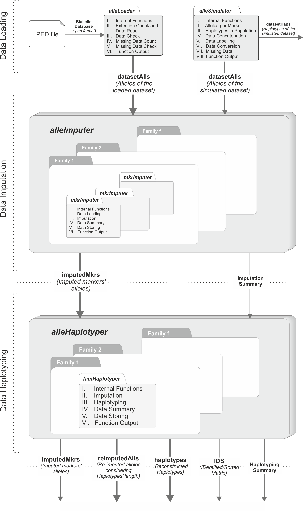
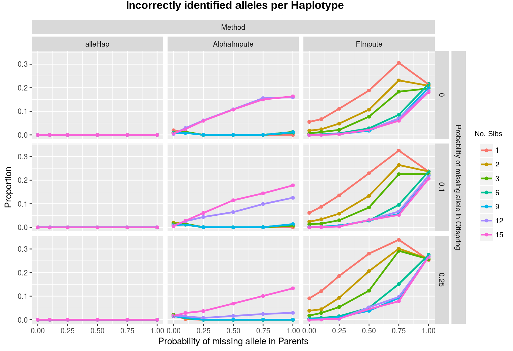
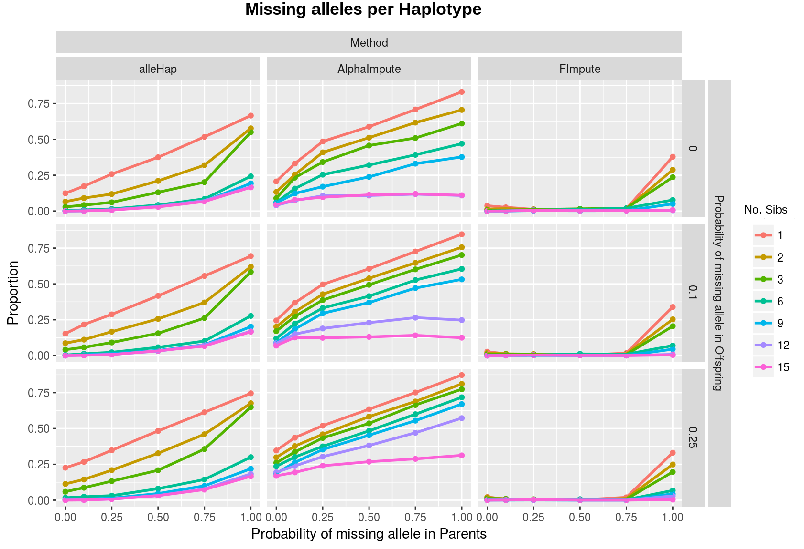
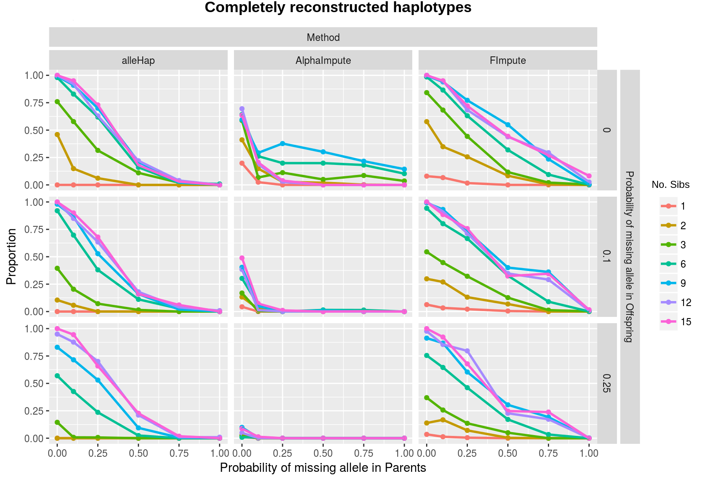
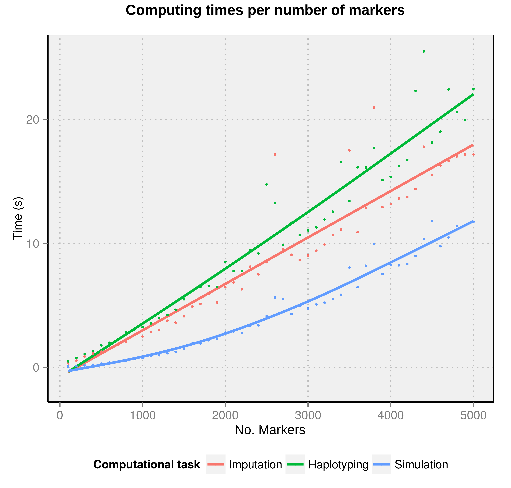

::: article
# Introduction

The knowledge about human genetic variation has been growing
exponentially over the last decade. Collaborative efforts of
international projects such as HapMap [@hapmap:05] and 1000 Genomes
[@1000G:12] have contributed to improving the discovery about human
genetic diversity.

Genotype imputation and haplotype reconstruction have achieved an
important role in *Genome-Wide Association Studies* (GWAS) during recent
years. Estimation methods are frequently used to infer missing genotypes
as well as haplotypes from databases containing related and/or unrelated
subjects. The majority of these analyses have been developed using
several statistical methods [@Brown:11] which are able to impute
genotypes as well as perform haplotype phasing (also known as haplotype
estimation) of the corresponding genomic regions.

Most of the currently available computer programs such as
IMPUTE2 [@howie:10], MINIMAC3 [@minimac:15], BEAGLE [@browning:11], and
others, or R packages such as:
[*haplo.ccs*](https://CRAN.R-project.org/package=haplo.ccs) [@haplo.ccs:12],
[*haplo.stats*](https://CRAN.R-project.org/package=haplo.stats) [@haplo.stats:16],
[*hsphase*](https://CRAN.R-project.org/package=hsphase) [@hsphase:14],
[*linkim*](https://CRAN.R-project.org/package=linkim) [@linkim:14],
[*rrBLUP*](https://CRAN.R-project.org/package=rrBLUP) [@rrBLUP:11], and
[*synbreed*](https://CRAN.R-project.org/package=synbreed) [@synbreed:12]
carry out genotype imputation or haplotype reconstruction using
probabilistic methods to achieve their objectives when deterministic
methods are insufficient to get them without errors. These methods are
usually focused on population data and in the case of pedigree data,
families normally are comprised by duos (parent-child) or trios
(parents-child) [@Brown:09]. Studies focused on more than two offspring
for each line of descent are uncommon. In these cases, the above
programs do not take full advantage of the information contained in the
global family structure to improve the process of imputation and
construction of haplotypes. The program HAPLORE [@haplore:15], developed
in  C++, takes a similar approach as *alleHap* for haplotype
reconstruction in pedigrees, but can not be easily integrated into an
environment where R packages are extensively used.

On the other hand, certain genomic regions are very stable against
recombination but at the same time they may have a considerable amount
of mutations. For this reason, in some well-studied regions, such as the
*Human Leukocyte Antigen* (HLA) loci [@Mack:13], located in the extended
*Major Histocompatibility Complex* (MHC) [@Bakker:06], an alphanumeric
nomenclature is needed to facilitate later analysis. At this juncture,
the available typing techniques usually are not able to determine the
allele phase and therefore the constitution of the appropriate
haplotypes is not possible.

This paper presents new improvements and a detailed description for the
R package [*alleHap*](https://CRAN.R-project.org/package=alleHap)
[@alleHap:14]. Our program is capable of imputing missing alleles and
identifying haplotypes from non-recombinant regions considering the
mechanism of heredity and the genetic information present in parents and
offspring. The algorithm is deterministic in the sense that haplotypes
are identified from the existing genotypes guaranteeing compatibility
between parents and children. When a haplotype can not be identified
(due to genotyping errors, or recombination events in the genetic
region), the procedure does not infer more haplotypes in the
corresponding family members. The following sections will describe the
implemented methods as well as some functional examples.

# Basics

The algorithms in *alleHap* are based on a preliminary analysis of all
possible combinations that may exist in the genotype of a marker,
considering that each member of the family should unequivocally have
inherited two alleles, one from each parent. The analysis is based on
the differentiation of seven cases, as described in [@BerWof:07]. Each
case is characterized by the number of different alleles present in the
family and the way these alleles are distributed among parents that
determine the set of possible genotypes in children.

Table [1](#table:IDSConf) shows these cases when there are no missing
genotypes. For example, in case 1 both parents are *a$|$a* and so the
only possible child is *a$|$a*; in case 2 if a parent is *a$|$a* and the
other is *b$|$b* the only possible child is *a$|$b*. Note that in both
cases it is possible for a child to determine from which parent comes
each allele. The rest of the cases can be easily understood in the same
way. Note that in case 5 if a child is *a$|$b* it is not possible to
know from whom comes each allele. The notation $|$ indicates that the
source of each allele can be assigned without error, and the notation
$/$ implies that origin is unknown.

To determine the haplotypes, *alleHap* creates an IDentified/Sorted
(IDS) matrix from the genotypes of each family. For example, in a child,
the genotype $a/b$ of a marker is *phased* if it can be unequivocally
determined that the first allele comes from the father and the second
from the mother. In this way, the sequence of first (second) alleles of
phased markers is the haplotype inherited from the father (or mother).
So, when a marker in a child can be phased this way its IDS value is 1;
in other case its value is 0. In parents, genotypes can be phased if
there exists at least one child with all its genotypes phased *reference
child*. Then, for every marker, the alleles of a parent genotype are
sorted in such a way that first allele coincides with the corresponding
allele inherited from that parent in the reference child. When this
sorting is achieved, the IDS value in the parent is 1; in other case its
value is 0.

An example of the IDS matrix values (right) and the corresponding phased
genotypes (left) is shown in Table [1](#table:IDSConf). Note that when
the genotype $a/b$ is phased we denote it by $a|b$; the first child in
each group is considered to be the reference child for phasing the
parents. In this case the IDS values of parents have been deduced
considering as *reference child* the first one of the family.

::: {#table:IDSConf}
  ----------------------------------------------------------------------------------------------------------------------
               **Phased Data**                                                   **IDS Matrix**                      
  ----------- ----------------- ------- ------- ------- ------- ------- ------- ---------------- --- --- --- --- --- ---
    Marker            1            2       3       4       5       6       7           1          2   3   4   5   6   7

    Parents         a$|$a        a$|$a   a$|$a   a$|$a   a$|$b   a$|$b   a$|$b         1          1   1   1   1   1   1

                    a$|$a        b$|$b   a$|$b   b$|$c   a$|$b   a$|$c   c$|$d         1          1   1   1   1   1   1

   Offspring        a$|$a        a$|$b   a$|$a   a$|$b   a$|$a   a$|$a   a$|$c         1          1   1   1   1   1   1

                                         a$|$b   a$|$c   b$|$b   a$|$b   a$|$d                        1   1   1   1   1

                                                          a/b    a$|$c   b$|$c                                0   1   1

                                                                 b$|$c   b$|$d                                    1   1
  ----------------------------------------------------------------------------------------------------------------------

  : Table 1: Phased genotypes and IDS matrix.
:::

Sometimes, missing values may occur. These can be located either in
parents or children. An example of this is depicted in
Table [2](#table:IDSConfMiss), where missing values have been denoted as
NA (Not Available).

::: {#table:IDSConfMiss}
  ----------------------------------------------------------------------------------------------------------------------
               **Phased Data**                                                   **IDS Matrix**                      
  ----------- ----------------- ------- ------- ------- ------- ------- ------- ---------------- --- --- --- --- --- ---
    Marker            1            2       3       4       5       6       7           1          2   3   4   5   6   7

    Parents         a$|$a        a$|$a   a$|$a   a$|$a    NA      NA      NA           1          1   1   1   0   0   0

                     NA           NA      NA     b$|$c   a$|$b   a$|$b   a$|$b         0          0   0   1   1   1   1

   Offspring        a$|$a        a$|$b   a$|$a    NA     a$|$a   a$|$a   a$|$c         1          1   1   0   1   1   1

                                         a$|$b   a$|$c   b$|$b    a/b    a$|$d                        1   1   1   0   1

                                                          a/b    a$|$c   b$|$c                                0   1   1

                                                                 b$|$c   b$|$d                                    1   1
  ----------------------------------------------------------------------------------------------------------------------

  : Table 2: Phased genotypes and IDS matrix containing missing data.
:::

An identification of the homozygous genotypes for each family is also
necessary for the proper operation of *alleHap*. This identification is
done in the Homozygosity matrix (HMZ). This matrix has as many rows as
members in the family and as many columns as markers. The term
$HMZ_{i,j}$ is 0 if the subject $i$ is heterozygous in the marker $j$,
and 1 if he/she is heterozygous. An example of some unphased genotypes
(left) and their corresponding HMZ values is shown in
Table [3](#table:biAllHMZConf).

::: {#table:biAllHMZConf}
  -------------------------------------------------------------------------------------------------------------------
              **Unphased Data**                                       **Homozygosity Info.**                      
  ---------- ------------------- ----- ----- ----- ----- ----- ----- ------------------------ --- --- --- --- --- ---
    Marker            1            2     3     4     5     6     7              1              2   3   4   5   6   7

   Parents           a/a          a/a   a/a   a/a   a/b   a/b   a/b             1              1   1   1   0   0   0

                     a/a          b/b   a/b   b/c   a/b   a/c   c/d             1              1   0   0   0   0   0

   Offsring          a/a          a/b   a/a   a/b   a/a   a/a   a/c             1              0   1   1   1   0   0

                                        a/b   a/c   b/b   a/b   a/d                                0   1   1   0   0

                                                    a/b   a/c   b/c                                        0   0   0

                                                          b/c   b/d                                            0   0
  -------------------------------------------------------------------------------------------------------------------

  : Table 3: Biallelic unphased genotypes and HMZ matrix.
:::

# Formats {#input_format}

The *alleHap* package only works with PED files, although it can be
easily adapted to similar formats (with similar structure) to later be
loaded into the program.

## PED files

A PED file [@Plink:07] is a white-space (space or tab) delimited file
where the first six columns are mandatory and the rest of columns are
the genotype: `Family ID` (identifier of each family), `Individual ID`
(identifier of each member of the family), `Paternal ID` (identifier of
the paternal ancestor), `Maternal ID` (identifier of the maternal
ancestor), `Sex` (genre of each individual: 1=*male*, 2=*female*,
other=*unknown*), `Phenotype` (quantitative trait or affection status of
each individual: $-9$=*missing*, $1$=*unaffected*, $2$=*affected*), and
the `genotype` of each individual (in biallelic or coded format).

The identifiers are alphanumeric: the combination of family and
individual ID should uniquely identify a person. **PED files must have
one and only one phenotype in the sixth column**. The phenotype can be
either a quantitative trait or an affection status column. Genotypes
(seventh column onwards) should also be white-space delimited; they can
be any character (e.g. 1, 2, 3, 4 or A, C, G, T or anything else) except
$0$, $-9$, $-99$. All markers should be biallelic and must have two
alleles specified [@Plink:07]. Note that *alleHap* **does not use the
phenotypic information** that is located in these columns.

## NA values

The missing or `NA` values may be placed either in the first six columns
or also in genotype columns. In the last case, when some values are
missing, both alleles should be $0$, $-9$, $-99$ or `NA`. For example, a
family composed of five individuals typed along three markers can be
represented in the following way:

``` r
 famID  indID patID matID sex phenot Mk1_1 Mk1_2 Mk2_1 Mk2_2 Mk3_1 Mk3_2
 FAM001     1     0     0   1      1     1     2    NA    NA     1     2
 FAM001     2     0     0   2      2     3     4     1     2     3     4
 FAM001     3     1     2   1      2     1     3     1     2     1     3
 FAM001     4     1     2   2      1    NA    NA     1     1     2     4
 FAM001     5     1     2   1      2     1     4     1     1     2     4
```

# Workflow

The workflow of *alleHap* comprises three stages: data loading, data
imputation, and data haplotyping. Optionally if simulated data are to be
used, a \"pre-stage\" data simulation must be done. The next subsections
will describe each of them.

<figure id="fig:Package_Description_New-fixed">

<figcaption>Figure 1: Graphical description of the package’s
workflow.</figcaption>
</figure>

## Data simulation {#data_simulation}

This \"pre-stage\" is implemented by an R function called
`alleSimulator` that simulates genotypic data for parent-offspring
pedigrees taking into account many different factors such as: number of
families to generate, number of markers (allele pairs), maximum number
of different alleles per marker in the population, type of alleles
(numeric or character), number of unique haplotypes in the population,
probability of parent/offspring missing genotypes, proportion of missing
genotypes (genotyping errors) per individual, probability of being
affected by disease, and recombination rate.

To perform the data simulation, this function goes through the following
steps:

1.  **Internal functions**: In this step all the necessary functions to
    simulate the data are loaded. These functions are: `labelMrk` (which
    creates the 'A', 'C', 'G', or 'T' character labels),
    `simHapSelection` (which selects $h$ different haplotypes between
    the total number of possible haplotypes), `simOffspring` (which
    generates $n$ offspring by selecting randomly one haplotype from
    each parent), `simOneFamily` (which simulates one family from a
    population containing the haplotypes `’popHaplos’`) and
    `simRecombHap` (which simulates the recombination of haplotypes).

2.  **Alleles per marker**: The second step is the simulation of the
    number of different alleles per marker for the entire population (if
    the user does not supply them). The user can specify whether the
    alleles are letters (coded as `A`, `C`, `G`, or `T`) or if they are
    coded numerically. When the alleles are letters, only two possible
    different values are assigned to each marker; otherwise, between two
    and nine different values are randomly allotted.

3.  **Haplotypes in population**: If there are many markers or alleles
    per marker, the number of possible haplotypes can be very large. By
    default, the number of possible different haplotypes generated by
    the function is limited to 1200, although the user can modify this
    value with the argument `nHaplos`.

4.  **Data concatenation**: In this step, the non-genetic information of
    all families and previously simulated data are concatenated.

5.  **Data Labeling**: The fifth step is the labeling of the previous
    concatenated data (`famID`, `indID`, `patID`, `matID`, `sex`,
    `phen`, `markers`, `recombNr`, `ParentalHap`, `MaternalHap`).

6.  **Data conversion**: This step performs the conversion of previously
    generated data into a more suitable data type which will lead to a
    more efficient processing.

7.  **Missing data generation**: The seventh step is the insertion of
    missing values in the previous generated dataset (only when users
    require it). The missing values may be generated taking into account
    four different factors: *missParProb* (probability of parents'
    missing genotype), *missOffProb* (probability of offspring' missing
    genotype), *ungenotPars* (proportion of ungenotyped parents) and
    *ungenotOffs* (proportion of ungenotyped offspring).

8.  **Function output**: The last step is the creation of a list
    containing two different data frames, for genotypes and haplotypes
    respectively. This may be useful to compare simulated haplotypes
    with later reconstructed haplotypes.

The following examples show how `alleSimulator` works:

#### *alleSimulator Example 1:*

*Simulation of a family containing parental missing data.*

``` r
> simulatedFam1 <- alleSimulator(1, 2, 3, missParProb=0.3) 
> simulatedFam1[[1]] # Alleles (genotypes) of the 1st simulated family

  famID indID patID matID sex phen Mk1_1 Mk1_2 Mk2_1 Mk2_2 Mk3_1 Mk3_2
1 FAM01     1     0     0   1    1     T     T     C     C  <NA>  <NA>
2 FAM01     2     0     0   2    1  <NA>  <NA>     T     C     C     G
3 FAM01     3     1     2   2    1     T     T     C     T     G     C
4 FAM01     4     1     2   1    1     T     T     C     T     C     C

> simulatedFam1[[2]] # 1st simulated family haplotypes (without missing values)
  
  famID indID patID matID sex phen Paternal_Hap Maternal_Hap
1 FAM01     1     0     0   1    1        T-C-G        T-C-C
2 FAM01     2     0     0   2    1        T-T-C        T-C-G
3 FAM01     3     1     2   2    1        T-C-G        T-T-C
4 FAM01     4     1     2   1    1        T-C-C        T-T-C
```

#### *alleSimulator Example 2:*

*Simulation of a family containing offspring missing data.*

``` r
> simulatedFam2 <- alleSimulator(1, 2, 3, missOffProb=0.3)
> simulatedFam2[[1]] # Alleles (genotypes) of the 2nd simulated family
  famID indID patID matID sex phen Mk1_1 Mk1_2 Mk2_1 Mk2_2 Mk3_1 Mk3_2
1 FAM01     1     0     0   1    1     T     T     C     T     C     C
2 FAM01     2     0     0   2    2     T     C     C     C     C     T
3 FAM01     3     1     2   2    1     T     T     C     T  <NA>  <NA>
4 FAM01     4     1     2   2    1     T     T     C     C  <NA>  <NA>

> simulatedFam2[[2]] # 2nd simulated family haplotypes (without missing values)

  famID indID patID matID sex phen Paternal_Hap Maternal_Hap
1 FAM01     1     0     0   1    1        T-C-C        T-T-C
2 FAM01     2     0     0   2    2        T-C-C        C-C-T
3 FAM01     3     1     2   2    1        T-C-C        T-T-C
4 FAM01     4     1     2   2    1        T-C-C        T-C-C
```

## Data loading {#data_loading}

Before the data loading process, since *alleHap* can handle large
amounts of missing data, users should check what kind of missing values
will be loaded. If those values are different from \"$-9$\" or
\"$-99$\", the parameter `"missingValues"` of `alleLoader` has to be
updated with the corresponding value. Per example, if the file to be
loaded has been codified with zeros as missing values,
`missingValues = 0` must be specified.

Data loading may be used with either simulated or actual genetic data.
This stage has been implemented in the `alleLoader` function for `.ped`
files, the default input format. This function tries to read family data
from an R data frame or from an external file, to later pass it into the
`alleImputer` and/or `alleHaplotyper` functions. For this purpose this
function goes through these five steps:

1.  **Loading of the internal function `recodeNA`**: This auxiliary
    function recodes pre-specified missing data as NA values.

2.  **Extention check and data read**: In this step, the extension file
    is checked and if it has a `.ped` extension the dataset is loaded
    into R as a data frame. Should this not occur, the message *\"The
    file must have a .ped extension\"* is returned and the data will not
    be loaded. Then, if the file extension is appropriate, data is
    loaded and missing values (by default `-9` or `-99`) are recoded as
    NAs (users may supply other codings values).

3.  **Data check**: The third step counts the number of families,
    individuals, parents, children, males, females and markers of the
    dataset, as well as, it checks the ranges of `Paternal IDs`,
    `Maternal IDs`, `genotypes` and `phenotype` values.

4.  **Missing data count**: This step counts the missing/unknown data
    which may exist in either genetic data or subjects' identifiers.

5.  **Function output**: In the final step, the dataset is returned as
    an R data frame, with the same structure as a PED file, with the
    variables renamed and the missing values correctly identified and
    coded. If `dataSummary = TRUE` a summary of previous data counting,
    ranges, and missing values is printed to the screen.

The intended datasets must conform to the specifications of a PED file:
in each row the first six variables correspond to `family ID`,
`subject ID`, `paternal ID`, `maternal ID`, `sex`, and affection status
(`phenotype`). The rest of the variables are the observed genotypes in
each marker, where each marker comprises two other variables.

The following examples depict how `alleLoader` should be used:

#### *alleLoader Example 1:*

*Loading of a dataset in PED format with alphabetical alleles (A, C, G,
or T).*

``` r
> example1 <- file.path(find.package("alleHap"), "examples", "example1.ped")
> example1Alls <- alleLoader(example1)  # Loaded alleles of example 1

===========================================
===== alleHap package: version x.y.z ======
===========================================

Data have been successfully loaded from: 
/home/nmr/R/x86_64-pc-linux-gnu-library/3.2/alleHap/examples/example1.ped

===== DATA COUNTING ======
Number of families: 50
Number of individuals: 227
Number of founders: 100
Number of children: 127
Number of males: 118
Number of females: 109
Number of markers: 12
===========================

======== DATA RANGES =========
Family IDs: [1,...,50]
Individual IDs: [1,...,8]
Paternal IDs: [0,1]
Maternal IDs: [0,2]
Sex values: [1,2]
Phenotype values: [1,2]
==============================

========= MISSING DATA =========
Missing founders: 0
Missing ID numbers: 0
Missing paternal IDs: 0
Missing maternal IDs: 0
Missing sex: 0
Missing phenotypes: 0
Missing alleles: 0
Markers with missing values: 0
================================

> example1Alls[1:9, 1:12]  # Alleles of the first 9 subjects

  famID indID patID matID sex phen Mk1_1 Mk1_2 Mk2_1 Mk2_2 Mk3_1 Mk3_2
1     1     1     0     0   1    1     T     T     C     T     A     A
2     1     2     0     0   2    1     A     T     C     G     C     C
3     1     3     1     2   1    2     A     T     G     T     A     C
4     1     4     1     2   2    1     A     T     C     G     A     C
5     1     5     1     2   2    1     A     T     C     G     A     C
6     2     1     0     0   1    1     A     T     A     G     A     G
7     2     2     0     0   2    1     G     T     A     C     A     G
8     2     3     1     2   2    1     G     T     A     C     A     G
9     2     4     1     2   1    1     A     G     C     G     G     G
```

#### *alleLoader Example 2:*

*Loading of a dataset in PED format with numerical alleles*

``` r
> example2 <- file.path(find.package("alleHap"), "examples", "example2.ped")
> example2Alls <- alleLoader(example2, dataSummary=FALSE)  # Example 2
> example2Alls[1:6,]  # Alleles of the first 6 subjects

  famID indID patID matID sex phen Mk1_1 Mk1_2 Mk2_1 Mk2_2 Mk3_1 Mk3_2
1  1036     1     0     0   1    1   101  1601   101   102   501   502
2  1036     2     0     0   2    1   301   401   301   501   201   301
3  1036     3     1     2   1    2   301  1601   102   501   201   502
4  1036     4     1     2   1    2   301  1601   102   501   201   502
5  1239     1     0     0   1    1    NA    NA    NA    NA    NA    NA
6  1239     2     0     0   2    1    NA    NA    NA    NA    NA    NA
```

## Allele imputation marker by marker {#data_imputation}

At this stage, the imputation of missing alleles in previously
loaded/simulated datasets is performed. For this purpose, first a simple
quality control of data is conducted and second a \"marker by marker\"
allele imputation is carried out in those cases where possible. Both
procedures are implemented in the `alleImputer` function where the
corresponding operation can be reduced to the following steps:

1.  **Internal functions**: In this step all the necessary functions to
    impute the data are loaded. The most important ones are:

    -   `mkrImputer`, which performs the imputation in one marker. This
        function first receives as input data the alleles of that marker
        in one family, and then applies the quality control and makes
        imputation when possible, attending to the family structure as
        shown in Table [1](#table:IDSConf). In the most simple cases,
        missing alleles in children are imputed only if a parent is
        homozygous. Missing alleles in a parent are imputed when a child
        is homozygous, or when the other parent has no missing values
        and alleles not present in that parent are found in some
        children.

    -   `famImputer`, which applies `mkrImputer` sequentially to impute
        all the markers in a family.

    -   `famsImputer`, which applies `famImputer` to all the families of
        the given data frame, returning a dataset with the same format
        and dimensions as the input data (with imputed values in those
        alleles where imputation has been possible).

2.  **Data loading**: The second step tries to read genotypic data and
    the families information into a fully compatible format employing
    the `alleLoader` function. If this process is successful, data are
    stored in an R data frame with the same structure as a PED file.

3.  **Imputation**: This is the most important step of the `alleImputer`
    function. First, marker by marker and then family by family, the
    imputation of the corresponding missing alleles is performed by the
    `mkrImputer` function in two stages: children imputation first and
    then parent imputation, as has been described.

4.  **Data summary**: Once the imputation is done, a summary of the
    imputed data is collected. This summary contains information about
    the imputation process, i.e., number of imputed alleles, detected
    incidences (number of canceled markers due to problems detected in
    the quality control process), imputation rate (quotient of the
    imputed alleles to the number of originally missing alleles) and
    time consumed in the process.

5.  **Data storing**: In this step, the imputed data are stored in the
    same path where the PED file was located. The generated new file
    will have the same name and extension as the original, ending as
    `imputed.ped`.

6.  **Function output**: In this final step, if `dataSummary = TRUE` the
    imputation summary is printed out. Imputed data is directly returned
    as an R data frame (with the same structure and dimensions as the
    input dataset). Incidence messages are shown if they are detected at
    the `quality control` phase.

The following examples show how `alleImputer` works:

#### *alleImputer Example 1:*

*Deterministic imputation for familial data containing parental missing
values.*

``` r
## Simulation of a family containing parental missing data
> simulatedFam1 <- alleSimulator(1, 2, 3, missParProb=0.6)
> simulatedFam1[[1]]  # Simulated alleles

  famID indID patID matID sex phen Mk1_1 Mk1_2 Mk2_1 Mk2_2 Mk3_1 Mk3_2
1 FAM01     1     0     0   1    1     A     G  <NA>  <NA>     A     G
2 FAM01     2     0     0   2    1  <NA>  <NA>  <NA>  <NA>  <NA>  <NA>
3 FAM01     3     1     2   1    1     G     G     G     G     G     G
4 FAM01     4     1     2   2    2     A     A     T     T     A     A

## Genotype imputation of previous simulated data
> imputedFam1 <- alleImputer(simulatedFam1[[1]], dataSummary=FALSE)  
> imputedFam1['imputedMkrs'] # Imputed alleles (markers)

  famID indID patID matID sex phen Mk1_1 Mk1_2 Mk2_1 Mk2_2 Mk3_1 Mk3_2
1 FAM01     1     0     0   1    1     A     G     G     T     A     G
2 FAM01     2     0     0   2    1     G     A     G     T     G     A
3 FAM01     3     1     2   1    1     G     G     G     G     G     G
4 FAM01     4     1     2   2    2     A     A     T     T     A     A
```

#### *alleImputer Example 2:*

*Deterministic imputation for familial data containing offspring missing
values.*

``` r
## Simulation of two families containing offspring missing data
> simulatedFam2 <- alleSimulator(2, 2, 3, missOffProb=0.6)
> simulatedFam2[[1]]  # Simulated alleles

  famID indID patID matID sex phen Mk1_1 Mk1_2 Mk2_1 Mk2_2 Mk3_1 Mk3_2
1 FAM01     1     0     0   1    1     A     A     C     T     C     C
2 FAM01     2     0     0   2    1     A     G     T     T     C     C
3 FAM01     3     1     2   2    1     A     G  <NA>  <NA>  <NA>  <NA>
4 FAM01     4     1     2   1    1     A     G     T     T     C     C
5 FAM02     1     0     0   1    1     G     G     C     T     T     T
6 FAM02     2     0     0   2    2     A     G     C     C     T     T
7 FAM02     3     1     2   2    1     A     G     C     C  <NA>  <NA>
8 FAM02     4     1     2   2    1  <NA>  <NA>     C     T  <NA>  <NA>

## Genotype imputation of previous simulated data
> imputedFam2 <- alleImputer(simulatedFam2[[1]], dataSummary=FALSE)
> imputedFam2['imputedMkrs'] # Imputed alleles (markers)

  famID indID patID matID sex phen Mk1_1 Mk1_2 Mk2_1 Mk2_2 Mk3_1 Mk3_2
1 FAM01     1     0     0   1    1     A     A     C     T     C     C
2 FAM01     2     0     0   2    1     A     G     T     T     C     C
3 FAM01     3     1     2   2    1     A     G  <NA>     T     C     C
4 FAM01     4     1     2   1    1     A     G     T     T     C     C
5 FAM02     1     0     0   1    1     G     G     C     T     T     T
6 FAM02     2     0     0   2    2     A     G     C     C     T     T
7 FAM02     3     1     2   2    1     A     G     C     C     T     T
8 FAM02     4     1     2   2    1     G  <NA>     C     T     T     T
```

It must be taken into account that the `alleImputer` function makes the
imputation for each marker without \"looking\" at the rest of the
markers in the subject/family. Imputation results obtained with
`alleImputer` improve when the rest of the markers come into
consideration assuming that there is no recombination. This task is
addressed by the function `alleHaplotyper`.

## Data haplotyping {#data_haplotyping}

At this stage, the corresponding haplotypes of the pedigree database are
generated. To accomplish this, based on the user's knowledge of the
genomic region to be analysed, it is necessary to slice the data into
non-recombinant chunks in order to perform the haplotype reconstruction
in each one of them.

Depending on the existence of missing alleles in parents or/and
children, we have considered four haplotyping scenarios. In the first
one, there are no completely missing markers in parents, and children
may be complete without missing alleles or may have full or partially
missing data. In the second one, all of the parental markers may be
entirely missing, and there are at least three children in the family
without missing alleles. The third scenario is a mixture of the previous
two: some markers have completely missing alleles in parents but are
complete (without missing alleles) in at least three children; some
markers have non-missing alleles in parents, with some missing values in
children; and some markers may have no missing values in parents nor
children. In the fourth scenario, parents have completely missing
markers, and non-missing markers are available in only two children; in
this scenario, deterministic reconstruction of the haplotypes is
possible only in a small number of cases under some specific conditions.

Several algorithms have been developed in *alleHap* for the
reconstruction of haplotypes and the imputation of missing alleles in
each one of these scenarios.

The function `alleHaplotyper` identifies the adequate scenario in each
case and applies the corresponding algorithm for imputing and
haplotyping. The user does not have to worry about deciding what
scenario corresponds to each family in the database, since the function
takes care of it.

Users may choose among several icons in order to specify the
non-identified and missing values in the haplotypes. It is also possible
to define the character that will be used as a separator between the
alleles for the corresponding haplotypes. By default, the
non-identified/missing allele symbol is '?', and haplotypes will be
joined without any separator symbol between their correspondig alleles.

The `alleHaplotyper` function constructs the haplotypes \"family by
family\" taking into account the initially known genotypes as well as
the genotypes already imputed by the function `alleImputer`, along with
the matrix `IDS`. In order to generate the haplotypes, this function
performs six successive steps:

1.  **Loading of internal functions**: In this step, several functions
    are loaded, the most important ones being:

    -   `famHaplotyper`, which carries out the haplotype reconstruction
        for each family data as follows:

        1.  Receives as input data the matrix of imputed data returned
            by `alleImputer` for **one** family.

        2.  Applies the adequate algorithm depending on the specific
            scenario of each family (according to the amount of
            genotypic information available).

        3.  Returns: *a)* a matrix equal to the input matrix, but with
            the new imputed alleles, *b)* a matrix with the same
            dimensions as the previous one filled with 0's an 1's. The
            value 0 indicates a non-phased allele, and the value 1
            represents a phased allele, and *c)* another matrix with two
            columns corresponding to the haplotypes found in each member
            of the family.

    -   `famsHaplotyper`, which applies `famHaplotyper` sequentially to
        all the families in the dataset.

    -   `summarizeData`, which generates a summary of the haplotyping
        process.

2.  **Allele imputation marker by marker in each family**: This step
    calls the `alleImputer` function which performs the imputation
    marker by marker and then, family by family.

3.  **Haplotyping**: This part is the most important of the
    `alleHaplotyper` function since it tries to solve the haplotypes
    when possible. The process is the following: once each family
    genotype has been imputed marker by marker, those markers containing
    two unique heterozygous alleles (both in parents and offspring) are
    excluded from the process. Then, a set of IDentified/Sorted (IDS)
    matrices is generated per family (one per subject), organized in an
    R array. Later, the internal function `famHaplotyper` tries to solve
    the haplotypes of each family, comparing the information between
    parents and children in an iterative and reciprocal way. When there
    are not genetic data in both parents, and there are two or more
    \"unique\" offspring (not twins or triplets), the internal functions
    `makeHapsFromThreeChildren` and `makeHapsFromTwoChildren` try to
    solve the remaining data. Finally, the HoMoZygosity (HMZ) matrix is
    updated, and the excluded markers are again included. *Even if both
    parental alleles are missing in each marker, it is possible in some
    cases to reconstruct all the family haplotypes, identifying the
    corresponding children's haplotypes, although **in certain cases
    their parental provenance will be unknown***.

4.  **Data summary**: Once the data haplotyping is done, a data summary
    is collected, containing a *re-imputation*rate (after the
    haplotyping process), the proportions of phased and non-phased
    alleles, the proportion of full, partial and empty reconstructed
    haplotypes, and the time employed in the process.

5.  **Data storing**: In this step, the *re-imputed* data are stored in
    the same path where the PED file was located, when data have been
    read from an external file. Two new files will be generated with the
    same name and extension as the original, but ending as
    `re-imputed.ped` and `haplotypes.txt`, for the re-imputed genotypes
    and the reconstructed haplotypes, respectively.

6.  **Function output**: In this final step, a summary of the generated
    data may be printed out, if `dataSummary=TRUE`. All the results can
    be directly returned, whether `invisibleOutput=FALSE`.

    The list of results contains: `imputedMkrs` (with the preliminary
    imputed marker alleles), `IDS` (including the resulting
    IDentified/Sorted matrix), `reImputedAlls` (including the re-imputed
    alleles) and `haplotypes` (storing the reconstructed haplotypes),
    and `haplotypingSummary` (showing a summary of the haplotyping
    process). Incidence messages can also be shown if they are detected.
    These may be caused by haplotype recombination (detected on
    children), genotyping errors, or inheritance from non-declared
    parents.

The following example depicts how `alleHaplotyper` works:

#### *alleHaplotyper Example 1:*

*Haplotype reconstruction of a simulated family with parental missing
data.*

``` r
## Simulation of a family containing parental missing data
> simulatedFam1 <- alleSimulator(1, 9, 8, missParProb=0.9, missOffProb=0.3)

## Haplotype reconstruction of previous simulated data
> fam1List <- alleHaplotyper(simulatedFam1[[1]], dataSummary=FALSE)
> simulatedFam1[[1]]     # Original data

   famID indID patID matID sex phen Mk1_1 Mk1_2 Mk2_1 Mk2_2 Mk3_1 Mk3_2
1  FAM01     1     0     0   1    2  <NA>  <NA>  <NA>  <NA>  <NA>  <NA>
2  FAM01     2     0     0   2    1  <NA>  <NA>  <NA>  <NA>  <NA>  <NA>
3  FAM01     3     1     2   1    1     A     G     C     C  <NA>  <NA>
4  FAM01     4     1     2   2    1  <NA>  <NA>  <NA>  <NA>     A     G
5  FAM01     5     1     2   2    1     G     G     C     T     A     G
6  FAM01     6     1     2   1    2     G     G  <NA>  <NA>     A     G
7  FAM01     7     1     2   2    1  <NA>  <NA>  <NA>  <NA>     G     G
8  FAM01     8     1     2   1    1  <NA>  <NA>     C     C     G     G
9  FAM01     9     1     2   1    1  <NA>  <NA>     C     C     G     G
10 FAM01    10     1     2   2    1  <NA>  <NA>     C     C     G     G
11 FAM01    11     1     2   1    1     A     G     C     C  <NA>  <NA>

   Mk4_1 Mk4_2 Mk5_1 Mk5_2 Mk6_1 Mk6_2 Mk7_1 Mk7_2 Mk8_1 Mk8_2
1   <NA>  <NA>  <NA>  <NA>  <NA>  <NA>  <NA>  <NA>  <NA>  <NA>
2   <NA>  <NA>  <NA>  <NA>  <NA>  <NA>     T     T  <NA>  <NA>
3      C     T  <NA>  <NA>     T     T  <NA>  <NA>     C     T
4   <NA>  <NA>     C     G     C     C  <NA>  <NA>     C     T
5      C     T     C     G     C     C     C     T     C     T
6      C     T  <NA>  <NA>     C     C     C     T     C     T
7      C     C     G     G     C     T     T     T     T     T
8   <NA>  <NA>     C     G     T     T     T     T  <NA>  <NA>
9      C     T     C     G     T     T     T     T     C     T
10     C     T  <NA>  <NA>  <NA>  <NA>  <NA>  <NA>     C     T
11  <NA>  <NA>     G     G  <NA>  <NA>     T     T  <NA>  <NA>

> fam1List['reImputedAlls']    # Re-imputed alleles 

   famID indID patID matID sex phen Mk1_1 Mk1_2 Mk2_1 Mk2_2 Mk3_1 Mk3_2
1  FAM01     1     0     0   1    2     A     G     C     T     G     A
2  FAM01     2     0     0   2    1     G     G     C     C     G     G
3  FAM01     3     1     2   1    1     A     G     C     C     G     G
4  FAM01     4     1     2   2    1     G     G     T     C     A     G
5  FAM01     5     1     2   2    1     G     G     T     C     A     G
6  FAM01     6     1     2   1    2     G     G     T     C     A     G
7  FAM01     7     1     2   2    1     A     G     C     C     G     G
8  FAM01     8     1     2   1    1     A     G     C     C     G     G
9  FAM01     9     1     2   1    1     A     G     C     C     G     G
10 FAM01    10     1     2   2    1     A     G     C     C     G     G
11 FAM01    11     1     2   1    1     A     G     C     C     G     G

   Mk4_1 Mk4_2 Mk5_1 Mk5_2 Mk6_1 Mk6_2 Mk7_1 Mk7_2 Mk8_1 Mk8_2
1      C     T     G     C     T     C     T     C     T     C
2      T     C     C     G     T     C     T     T     C     T
3      C     T     G     C     T     T     T     T     T     C
4      T     C     C     G     C     C     C     T     C     T
5      T     C     C     G     C     C     C     T     C     T
6      T     C     C     G     C     C     C     T     C     T
7      C     C     G     G     T     C     T     T     T     T
8      C     T     G     C     T     T     T     T     T     C
9      C     T     G     C     T     T     T     T     T     C
10     C     T     G     C     T     T     T     T     T     C
11     C     C     G     G     T     C     T     T     T     T

> fam1List['haplotypes']  # Reconstructed haplotypes

famID indID patID matID sex phen     hap1     hap2
1  FAM01     1     0     0   1    2 ACGCGTTT GTATCCCC
2  FAM01     2     0     0   2    1 GCGTCTTC GCGCGCTT
3  FAM01     3     1     2   1    1 ACGCGTTT GCGTCTTC
4  FAM01     4     1     2   2    1 GTATCCCC GCGCGCTT
5  FAM01     5     1     2   2    1 GTATCCCC GCGCGCTT
6  FAM01     6     1     2   1    2 GTATCCCC GCGCGCTT
7  FAM01     7     1     2   2    1 ACGCGTTT GCGCGCTT
8  FAM01     8     1     2   1    1 ACGCGTTT GCGTCTTC
9  FAM01     9     1     2   1    1 ACGCGTTT GCGTCTTC
10 FAM01    10     1     2   2    1 ACGCGTTT GCGTCTTC
11 FAM01    11     1     2   1    1 ACGCGTTT GCGCGCTT

> fam1List['haplotypingSummary']  # Haplotyping Summary

  nAlls pPhasAlls pNonPhasAlls nHaps pFullHaps pEmptyHaps
1   176         1            0    22         1          0
  pPartialHaps newImputedAlleles reImputationRate haplotypingTime
1            0                55                1           0.357
```

#### *alleHaplotyper Example 2:*

*Haplotype reconstruction of a family containing parental and offspring
missing data from a PED file.*

``` r
## PED file path
> family2path <- file.path(find.package("alleHap"), "examples", "example3.ped") 

## Loading of the ped file placed in previous path
> family2Alls <- alleLoader(family2path, dataSummary=FALSE) 

## Haplotype reconstruction of previous loaded data
> family2List <- alleHaplotyper(family2Alls, dataSummary=FALSE)
> family2Alls  # Original data 

  famID indID patID matID sex phen Mk1_1 Mk1_2 Mk2_1 Mk2_2 Mk3_1 Mk3_2
1     1     1     0     0   2    1     C     T  <NA>  <NA>  <NA>  <NA>
2     1     2     0     0   2    1  <NA>  <NA>  <NA>  <NA>  <NA>  <NA>
3     1     3     1     2   1    2     C     C     A     G     A     T
4     1     4     1     2   1    2     C     T     A     C  <NA>  <NA>
5     1     5     1     2   1    2     C     T     A     G     C     T
6     1     6     1     2   1    2     C     T     A     G     C     T
7     1     7     1     2   2    1  <NA>  <NA>  <NA>  <NA>     C     G

  Mk4_1 Mk4_2 Mk5_1 Mk5_2 Mk6_1 Mk6_2 Mk7_1 Mk7_2 Mk8_1 Mk8_2
1  <NA>  <NA>  <NA>  <NA>     A     C  <NA>  <NA>  <NA>  <NA>
2  <NA>  <NA>  <NA>  <NA>  <NA>  <NA>  <NA>  <NA>  <NA>  <NA>
3     A     A     G     T     A     C     A     C     A     G
4     A     T     C     G     C     C     C     T     C     G
5  <NA>  <NA>     G     T     A     C     A     C     A     A
6     A     A     G     T     A     C     A     C     A     A
7     A     T     C     G  <NA>  <NA>     C     T  <NA>  <NA>

> family2List['reImputedAlls']  # Re-imputed alleles 

  famID indID patID matID sex phen Mk1_1 Mk1_2 Mk2_1 Mk2_2 Mk3_1 Mk3_2
1     1     1     0     0   2    1     C     T     G     C     T     G
2     1     2     0     0   2    1     C     T     A     A     A     C
3     1     3     1     2   1    2     C     C     G     A     T     A
4     1     4     1     2   1    2     T     C     C     A     G     A
5     1     5     1     2   1    2     C     T     G     A     T     C
6     1     6     1     2   1    2     C     T     G     A     T     C
7     1     7     1     2   2    1     T     T     C     A     G     C

  Mk4_1 Mk4_2 Mk5_1 Mk5_2 Mk6_1 Mk6_2 Mk7_1 Mk7_2 Mk8_1 Mk8_2
1     A     T     T     C     A     C     A     T     A     C
2     A     A     G     G     C     C     C     C     G     A
3     A     A     T     G     A     C     A     C     A     G
4     T     A     C     G     C     C     T     C     C     G
5     A     A     T     G     A     C     A     C     A     A
6     A     A     T     G     A     C     A     C     A     A
7     T     A     C     G     C     C     T     C     C     A

> family2List['haplotypes']  # Reconstructed haplotypes

  famID indID patID matID sex phen     hap1     hap2
1     1     1     0     0   2    1 CGTATAAA TCGTCCTC
2     1     2     0     0   2    1 CAAAGCCG TACAGCCA
3     1     3     1     2   1    2 CGTATAAA CAAAGCCG
4     1     4     1     2   1    2 TCGTCCTC CAAAGCCG
5     1     5     1     2   1    2 CGTATAAA TACAGCCA
6     1     6     1     2   1    2 CGTATAAA TACAGCCA
7     1     7     1     2   2    1 TCGTCCTC TACAGCCA

> fam1List['haplotypingSummary']  # Haplotyping Summary

  nAlls pPhasAlls pNonPhasAlls nHaps pFullHaps pEmptyHaps
1   112         1            0    14         1          0
  pPartialHaps newImputedAlleles reImputationRate haplotypingTime
1            0                34                1           0.098
```

# Accuracy

## Initial considerations

The *alleHap* package was originally thought to determine haplotypes
from nuclear families, i.e. both parents and their offspring (several
children). The program can reconstruct haplotypes even when the
genotypes of both parents (or only one) are completely missing. However,
it does not fit well with the typical situation of cattle breeding in
which a single progenitor (male) has had offspring with many females; or
vice versa when there is a female that has had offspring of several
males.

Although in future versions of *alleHap* this functionality will be
included, the following simulations have been developed using the
standard context of nuclear families containing the same parents and a
variable number of descendants.

We established the foregoing to compare the accuracy and performance of
*alleHap* versus other software we have selected
AlphaImpute [@hickey:12] and FImpute [@sargolzaei:14] programs, since
both programs have similar characteristics to *alleHap*, namely both
consider pedigree information for inferring haplotypes and imputing
missing data. As such, the following comparisons have been performed
regarding the proportion of genotyping errors, missing values, and
phasing (haplotyping) errors for the three programs.

## Simulation parameters

Data for nuclear families ranging from one to 15 children and 50 alleles
per haplotype have been simulated. In each case, haplotypes have been
generated for missing values in the children's alleles, 0.10 (10% of the
children's alleles are missing) and 0.25 (25% of genotypes in children
are missing ). Likewise, families with missing rates for parental
alleles from 0% (fully genotyped) to 100% (completely ungenotyped) were
simulated. In order not to slow down the simulations, only 100 families
were simulated for each case.

### Incorrectly identified alleles per haplotype

Figure [2](#fig:incorrectly_identified_alleles_per_haplotype) shows the
proportion of incorrectly identified alleles in each haplotype. As it
can be appreciated, when using *alleHap* the ratio is always zero. In
those cases when an allele can not be unequivocally identified it is
left as a missing value. However, both AlphaImpute and FImpute have
algorithms that use HMM and the information of the rest of the families
to impute probabilistically.

When using AlphaImpute, it can be seen that when there is a low
proportion of children and parents with missing genotypes, the rate of
imputation errors is low (practically null when the parents are
completely genotyped). However, as the rate of alleles of lost parents
increases, the proportion of alleles wrongly accused also increases.
This effect is greater the higher the number of children per family,
which indicates that with more data AlphaImpute tends to impute more,
but returning higher number of imputation errors.

With FImpute, it is observed that even when there are not missing
alleles in parents or children, the program tends to erroneously impute
a proportion of alleles (it does so in cases of heterozygous SNPs in
which it is not possible to deterministically decide which haplotype
belongs to each allele). The imputation error rate decreases as there
are available larger families. In any case, the imputation error rates
reach between 20% and 25% when parents have all alleles missing.

<figure id="fig:incorrectly_identified_alleles_per_haplotype">

<figcaption>Figure 2: Proportiton of incorrectly identified alleles per
haplotype.</figcaption>
</figure>

### Missing alleles per haplotype

In Figure [3](#fig:missing_alleles_per_haplotype) it can be seen that
the proportion of non-imputed alleles that remain after the application
of the algorithm tends to be lower in *alleHap* than in AlphaImpute for
all conditions. In addition, the greater the number of children
available and the lower the rate of missing alleles in both parents and
children, the lower the proportion of alleles remaining unallocated.

For FImpute, if the rate of missing alleles in parents is less than 75%,
in the cases we have explored (missing allele rate in children up to
25%), there are practically no alleles left unallocated, that is almost
all the alleles are imputed. However, as mentioned previously, FImpute
has a high imputation error rate, which increases precisely with the
rate of missing alleles in parents/children, and decreases with the
number of families.

So, regarding the rate of missing alleles per haplotype, it could be
said that *alleHap* is advantageous with respect to AlphaImpute, since
it produces a smaller proportion of alleles that are finally left not
imputed, and does not generate imputation errors. On the other hand,
FImpute has an allele imputation rate higher than *alleHap*, but at the
cost of making many more imputation errors.

<figure id="fig:missing_alleles_per_haplotype">

<figcaption>Figure 3: Proportion of missing alleles per
haplotype.</figcaption>
</figure>

### Completely reconstructed haplotypes after imputation and haplotyping

In Figure [4](#fig:completely_reconstructed_haplotypes) it is shown the
proportion of haplotypes that were completely and correctly created with
each method. It can be seen that for a large number of families with a
low rate of missing alleles (under 10%), *alleHap* is able to completely
and correctly reconstruct more than 90% of haplotypes.

Obviously, as the rate of missing alleles in parents and offspring
increases, *alleHap*'s haplotyping rate decreases (if 50% of the
parental alleles are missing, *alleHap* is able to completely and
correctly reconstruct 25% of haplotypes, provided that large families
are available).

When the allele missing rate in parents or children exceeds 10%,
complete haplotype reconstruction rates are (in comparison to *alleHap*)
generally lower with AlphaImpute and somewhat higher with FImpute.
However, it should be noted that the completely reconstructed haplotypes
by *alleHap* do not have any incorrectly allocated alleles.

In the case of FImpute, for an entirely reconstructed haplotype, we can
not know whether reconstruction has been good (no errors), or if there
have been misidentified alleles (could have a high proportion of
misidentified alleles).

<figure id="fig:completely_reconstructed_haplotypes">

<figcaption>Figure 4: Proportion of fully reconstructed haplotypes after
imputation and haplotyping.</figcaption>
</figure>

# Performance

## Initial considerations

Since our package was mainly created for primase accuracy, i.e., the
univocal treatment of family-based allelic databases, and not for
processing large genomic data, it does not make much sense to perform a
comparison on equal terms with programs that were implemented and
compiled in other, faster languages.

In any case, we have carried out a benchmarking where the *alleHap*
computing times were measured, evaluating the performance of the
simulation, imputation, and haplotyping processes depending on two main
factors: number of individuals and number of markers.

## Computing times regarding the number of individuals

The simulations depending on the ***number of individuals*** had the
following parameters: from 1 to 8000 individuals (two children per
family), 3 markers (three allele pairs), two different alleles per
marker, non-numerical alleles (A, C, G, or T), 25% of parental missing
genotypes, 25% of children's missing genotypes, and 1200 different
haplotypes in the population.

{#fig:computation_times_number_individuals
width="100%" alt="graphic without alt text"}

In Figure [5](#fig:computation_times_number_individuals), it can be seen
how haplotyping and imputation times grow linearly as the number of
individuals increases while simulation times hardly grow. Therefore, it
can be said that *alleHap* consumes very little time when using a small
number of markers, even for a considerabe number of individuals.

## Computing times regarding the number of markers

The simulations depending on the ***number of markers*** were developed
using the following factors: from 1 to 5000 markers (from one allele
pair to five thousand), one family (four individuals), two different
alleles per marker, non-numerical alleles (A,C,G or T), 25% of parental
missing genotypes, 25% of children's missing genotypes, and 1200
different haplotypes in the population.

<figure id="fig:computation_times_number_markers">

<figcaption>Figure 6: Computing times for simulation, imputation, and
haplotyping, depending on the number of markers.</figcaption>
</figure>

Figure [5](#fig:computation_times_number_individuals) shows how
simulation times grow in a non-linear way as the number of markers
increase, while imputation and reconstruction times remain linear (even
considering a large number of markers). Note that for this analysis
only, it has been taken into account a family (containing four
individuals), although it is presumable that for a larger number of
indivuals this growth will also continue in linear manner.

# Summary

We have developed an improved version of the R package *alleHap* for the
imputation of alleles and the reconstruction of haplotypes in
non-recombinant genomic regions using pedigree databases. The procedure
is entirely deterministic and uses the information contained in the
family structure to guide the process of imputation and reconstruction
of haplotypes, without resorting to a reference panel. The package has
two main functions `alleImputer` and `alleHaplotyper`.

The first one, `alleImputer`, makes allele imputation marker by marker,
taking into account the alleles present in parents and siblings and
considering that each individual (due to meiosis) should unequivocally
have two alleles per marker, one inherited from each parent.

The function `alleHaplotyper` first calls `alleImputer` for an initial
imputation of missing alleles and then, considering that there is no
recombination (by comparing parental genotypes with children) determines
the compatible haplotypes with the family structure. When an
inconsistency is detected, `alleHaplotyper` reports an error message
specifying if such inconsistency can be due to a possible recombination
or to a genotyping error. Besides, the procedure of construction of
haplotypes allows the imputation of those alleles that were not
previously imputed by `alleImputer`. The function `alleHaplotyper` has
been entirely rewritten with respect to previous versions of the
package. Also the function `alleImputer` has been modified to include a
new quality control procedure and to improve the presentation of a
summary of results.

Genotypic information can be read from an R data frame or from a PED
file by the function `alleLoader` designed specifically with this aim.

The package also includes the function `alleSimulator` for the
simulation of pedigrees. This function handles many arguments, such as
number of families, markers, alleles per marker, probability and
proportion of missing genotypes, recombination rate, etc., and it
generates an R data frame with two lists, one with the structure of a
`.ped` file, and other with the haplotypes generated for each member of
the simulated families. We have used `alleSimulator` for testing the
performance of the other functions, with satisfactory results regarding
imputation rate, haplotyping rate, and time of execution, even when
handling large amounts of genetic data.

Future improvements of the package include the possibility of
considering extended pedigrees (including grandparents, grandchildren,
and other relatives) and to make inferences on haplotypes and missing
alleles when these can not be deterministically derived.

# Appendix

## Genotype combinations

An example of the genotype combinations that may exist in a nuclear
family (considering that each member should unequivocally have inherited
two alleles) is depicted in Figure [7](#fig:01).

{#fig:01 width="100%" alt="graphic without alt text"}

Genetic information can be arranged so that an allele may correspond to
a single nucleotide (A, C, G, T) or a genomic nucleotide sequence. It
has to be taken into account that the allele nomenclature in both cases
would comprise different alphanumeric values chosen for a given purpose.

## Used notation {#used_notation}

As it has been described in the ***Basics*** section, our theoretical
analysis is based on the differentiation of seven configurations, each
one grouped considering the number of unique (or different) alleles per
family. Thus, in order to clarify the genotype identification and to
simplify posterior computations, when $K$ markers are observed, the
following notation has been used for describing the alleles in the
$i^{th}$ subject of a family (being $i=1$ for the father, $i=2$ for the
mother and $i>2$ for the offspring):

$$\mathbf{A_{i}}=
\begin{bmatrix}
A_{11i} & A_{12i} & \dots & A_{1Ki}  \\
A_{21i} & A_{22i} & \dots & A_{2Ki}
\end{bmatrix}$$

Each column $k$ of this matrix represents a marker, being
$\left(A_{1ki},A_{2ki}\right)$ the pair of alleles identified in that
marker. Either allele (or both) may be missing, and would then be
denoted as *Not Available* (NA).

Associated to the previous matrix, we can define inheritance
identifiers, which we have renamed as *IDentified/Sorted* (IDS) for all
subjects, being $IDS_{hki}$ the corresponding identifier of marker $k$
in the individual $i$. The resulting matrix containing the $IDS_{hki}$
values can be defined as:

$$\mathbf{IDS_{i}}=
\begin{bmatrix}
IDS_{11i} & IDS_{12i} & \dots & IDS_{1Ki} \\
IDS_{21i} & IDS_{22i} & \dots & IDS_{2Ki}
\end{bmatrix}$$

If all terms in the matrix $IDS_{i}$ are 0, the phase of each allele is
unknown. In turn, when all terms are equal to 1, the alleles are phased
and the rows of the matrix *$A_{i}$* can be read as the haplotypes of
the $i^{th}$ subject of the family. In this way, being $h=1, 2$, we
have:

$$IDS_{hki}=
\begin{cases}
0 & \textrm{if allele }A_{hki} \textrm{ does not belong to } \\
& \textrm{haplotype }h \textrm{, or is missing} \\
1 & \textrm{if allele }A_{hki}\textrm{ belongs to haplotype } h
\end{cases}$$

When familial genotypes are read, the matrices $IDS_{i}$ are initially
equal to 0 for all members, as the genotype phase is unknown.

At the data haplotyping stage, the main objective is to order the
$A_{hki}$ alleles in each marker of every subject in such a way that the
$IDS_{i}$ matrices may contain as values equal to 1 as possible. When
the $h$ row in $IDS_{i}$ is completely (or partially) filled with ones,
the corresponding $h^{th}$ row in the $A_{i}$ matrix can be
deterministically phased.

In the same way as described above, a vector of *Homozygosity* (HMZ)
identifiers per individual was defined. Therefore, $HMZ_{ik}=1$ if
individual $i$ is homozygous in marker $k$ (i.e. identical alleles), and
$HMZ_{ik}=0$ if the subject is heterozygous. Consequently, considering a
given individual of family, the $HMZ$ vector is defined as:

$$\mathbf{HMZ_{i}}=
\begin{bmatrix}
HMZ_{i1} & HMZ_{i2} & \dots & HMZ_{ik} \\
\end{bmatrix}$$

## Data imputation {#app_data_imputation}

As long as one child was genotyped, in certain cases it is possible for
an unequivocal imputation of missing genotypes both in parents and
children. For this purpose, first is conducted a \"marker by marker\"
*Quality Control* (QC) of the genetic data and second, imputation is
performed, in those cases where possible. The QC rules which has been
considered are the following:

1.  There cannot be more than two different homozygous children in a
    family.

2.  If there are two different homozygous children in the family, there
    cannot be a different allele in any other family member.

3.  Considering all the individuals in the family, there can be at most
    four different alleles in a marker.

4.  If a family has four different alleles in a marker, no child can be
    homozygous.

5.  If there are three of more unique heterozygous children, they cannot
    share a common allele.

6.  There cannot be more than four genotypically different children per
    marker and family.

7.  If a child has the same alleles as one of his/her parent, there can
    only be at most three different alleles in the family.

8.  When parental alleles are not missing:

    1.  Each child must have at least a common allele with each parent.

    2.  A child can not have an allele not present in any of the
        parents.

In the above, when referring to families with more than one child, it
has been considered that children have different genotypes each other.
This is because of two or more children share the same genotype in all
the markers. For the purposes of genotype identification, he/she will
count as an only child (since will not provide different or new
information).

Throughout this procedure, a *\"marker by marker\"* allele imputation is
performed as follows:

1.  Imputation of children's genotypes: It is identified which allele
    has been inherited from the father and which from the mother. If a
    parent has a homozygous genotype, the corresponding allele is
    imputed in all children with missing alleles (which do not already
    have this allele). Moreover, if both parents are homozygous, all
    children with missing alleles are readily imputed.

2.  Imputation of parental genotypes: Given a reference child, it is
    determined which allele has been transmitted to such child:

    1.  If a child has a homozygous genotype, the allele is imputed in
        that parent that do not already have this allele.

    2.  If a parent has missing alleles and the other not, and there are
        heterozygous children, the alleles present in those children
        (which are not located in the non-missing parent) are imputed to
        the parent with missing alleles.

Assuming that genotypic markers are part of the same haplotype, i.e.,
there is no recombination between markers, we have considered that when
missing data occurs in a subject's marker, missingness affects both
alleles (i.e. each marker is fully missing for the given subject); but
if the subject is a child and a parent is homozygous at the same marker
(say G/G), only one allele will be imputed in such a child by
`alleImputer` function. Thus, the child's genotype would be G/NA (where
NA stands for missing value). The same would occur if a fully missing
marker is located in a parent and there is a homozygous child in that
marker.

## Data haplotying {#app_data_haplotyping}

The haplotyping procedure begins by considering only the offspring,
trying to identify/sort the alleles in each marker in such a way that
the allele in the first row of the matrix, $A_{i}$, be the one inherited
from the father (see ***Used notation*** section), and the allele in the
second row be the inherited from the mother. So, if all the markers are
sorted this way, the first row of the matrix $A_{i}$ would inherit the
first haplotype from the father and the second one from the mother. Once
these haplotypes have been found in children, they can be readily
identified in parents. What complicates this idea and makes difficult
its direct application is the fact that in some cases both parents and a
child can share the same genotype (say G/T for the three subjects), and
therefore it is not possible to know which allele has been inherited
from which parent. Thus, we considered these four scenarios for the
haplotyping procedure:

-   Scenario 1: There are no fully missing markers in parents.

-   Scenario 2: There are missing markers in parents.

-   Scenario 3: Mixture of the previous scenarios.

-   Scenario 4: There are missing markers in parents and only two fully
    genotyped children.

In the first one there are no fully missing markers in parents, and
children may be completely without missing alleles or may have full or
partially missing data. In the second one we have taken into account
that all of the parental markers are fully missing and there are at
least three children in the family without missing alleles. The third
scenario is a mixture of the previous two: some markers have parents
with fully missing alleles and at least three complete children (without
missing alleles). Some markers have non-missing alleles in parents, with
some missing values in children, and some markers may have no missing
values in parents nor in children. Finally, in the fourth scenario we
show the conditions in which alleles can be deterministically phased
with only two children, when parents have completely missing markers.

Furthermore there may be missing alleles in parents or children that
prevent the determination the provenance of some alleles in some
markers. In particular, if both parents have all the alleles missing in
a marker it is impossible to determine the provenance of the alleles of
that marker in the children, at least if there are less than three
children in the family. When Scenario 2 occurs the family has three or
more children, if there are no missing alleles in at least three
children, deterministic phasing can be carried out even when parents are
fully missing. Also, in Scenario 4, for the particular case of having
only two children, if parental alleles are available in some markers and
in the other markers are fully missing, it is possible (under certain
conditions) to determine the alleles' phase in those missing markers.
:::
