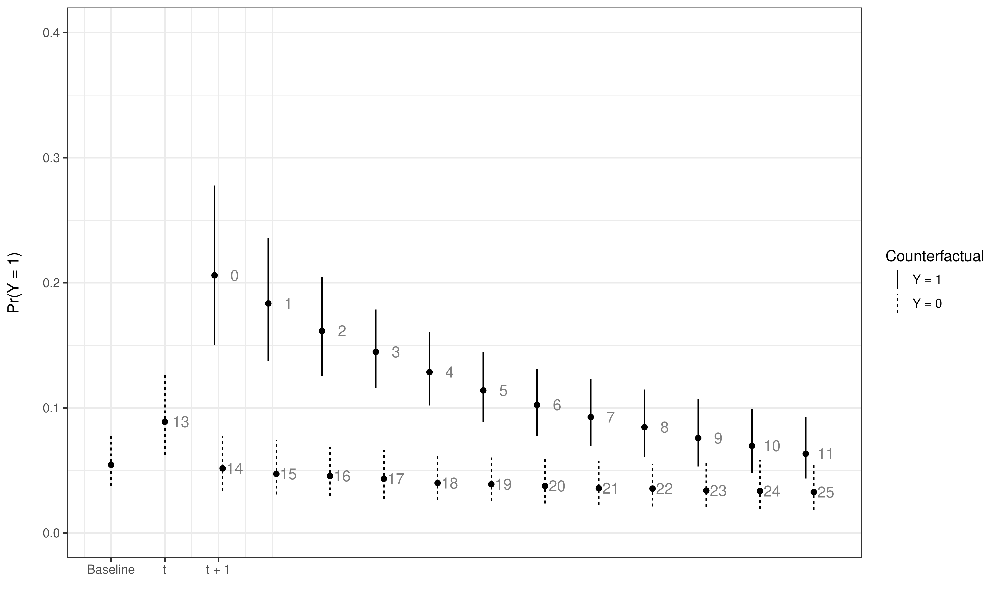
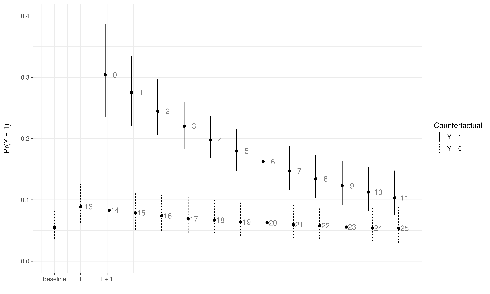
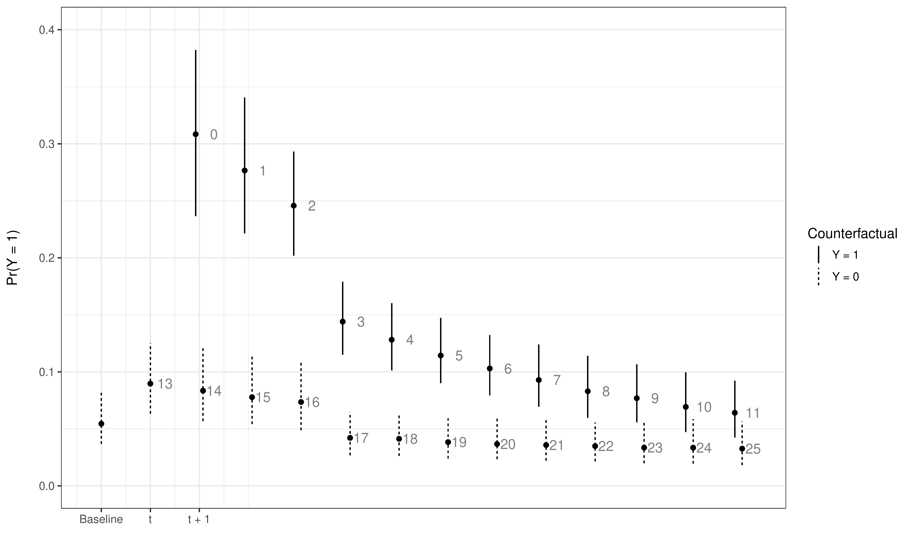
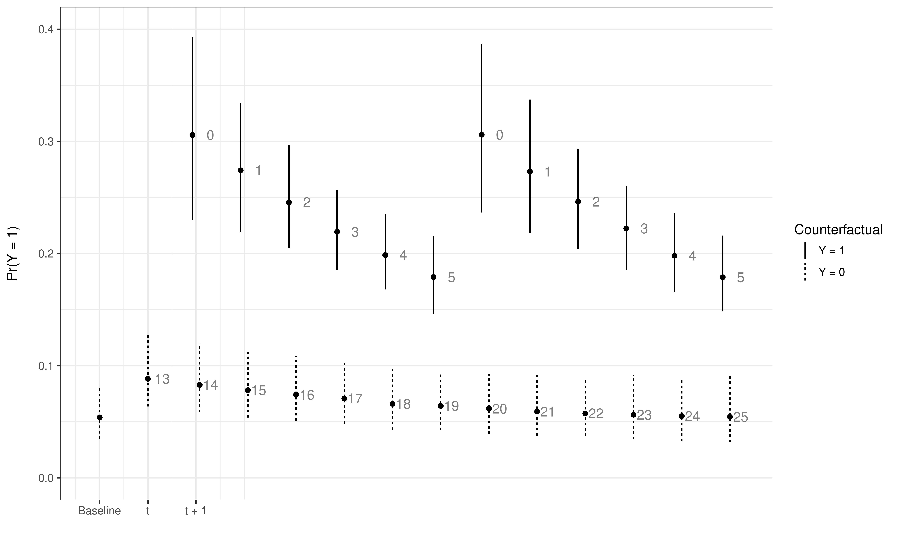

::: article
# Introduction

Scholars from a wide variety of academic disciplines study phenomena
with binary outcomes. This includes the study of war or peace
[@BeckKatzTucker1998], civil war or stability [@collier2003], wildlife
habitat selection [@keating2004], automobile accident severity
[@alghamdi2002], banking decisions [@maddala1982], labor force
participation [@mroz1987], individual decisions about drinking water
sources [@gelman2004], conflicts over water resources
[@gleditsch2006conflicts], and education policy [@bailey2016], just to
name a diverse few.

The desire to generalize produces the incentive for scholars to
incorporate information both over time and across units, which results
in time-series cross-sectional data. While helpful from an inferential
standpoint, modeling processes that vary across time and space increase
the number of potential estimation and interpretation problems facing
scholars.

One problem that is unique to scholars examining binary time-series
cross-sectional (BTSCS) data is the role of temporal dependence, or the
notion that the probability of the occurrence of the event (i.e., the
dependent variable) depends in part on how much time has passed since
the previous occurrence. Whenever scholars estimate BTSCS models where
there are omitted (or potentially unobservable) variables that are also
correlated with time, there is a substantial risk of incorrect standard
errors and highly misleading results [@BeckKatzTucker1998].

@BeckKatzTucker1998 [-@BeckKatzTucker1998 1261] offered a
ground-breaking solution to this inferential obstacle by noting that
"BTSCS data are grouped duration data", which implies that one can
borrow techniques from duration analysis to properly model the influence
of time since the previous event at some time $t$. This discovery led to
a drastic increase in the number of scholars, political scientists in
particular, employing duration modeling techniques with BTSCS data.
Notable alternatives include dummy variables representing each value of
$t$, splines, and cubic polynomials
[@BeckKatzTucker1998; @CarterSignorino2010]. Put simply, these
approaches assume that, for possibly un-modeled reasons, the probability
of the event occurring at time $t$ is a function of how much time has
elapsed since the event previously occurred.

At the same time, another movement has produced meaningful improvements
in the interpretation of dynamic models in the social sciences. Over the
last decade or so, scholars have improved our understanding of the
various short- and long-term effects that arise from dynamic models.
These long-term effects can take the form of long-range multipliers in
autoregressive distributed lag models [@deBoefKeele2008] or dynamic
simulations in models with lagged dependent variables
[@WilliamsWhitten2012]. In addition to providing a more complete picture
of the inferences of key theoretical variables, one reason for the
explosion in scholarly attention is the emphasis on providing
appropriate measures of uncertainty with easy-to-implement software
packages [e.g.
@WilliamsWhitten2011; @GandrudWilliamsWhitten2016; @R-Zelig].

To this end, this article introduces the R [@CiteR] package
[*pltesim*](https://CRAN.R-project.org/package=pltesim), which utilizes
simulation methods to depict **p**robabilistic **l**ong-**t**erm
**e**ffects in binary models with temporal dependence (PLTE). The
package is available from the Comprehensive R Archive Network (CRAN).
The package follows the methodology introduced in [@Williams2016]. In
the remainder of the paper, we will first discuss the methodological
principles at work, then the process *pltesim* uses to calculate
probabilistic long-term effects, and finally an example with various
visualization approaches.

# Long-term effects in models with temporal dependence

Probabilistic long-term effects are the product of the intersection of
two methodological trends: controlling for unmodeled duration dependence
by including temporal dependence variables and interpreting short- and
long-term effects of explanatory variables in autoregressive models. For
example, if one is interested in the effects of $X$ on the probability
of $Y$ at time $t$, and one controls for temporal dependence in any of
the ways stated above, then $X$ will have both a short-term effect
(interpreted in the traditional manner based on the link function) and a
long-term effect. However, contrary to the calculation of long-term
effects in dynamic models of continuous dependent variables
[@deBoefKeele2008], the long-term effects in BTSCS models are
probabilistic. As @Williams2016 [-@Williams2016 247] notes, "modifying
the values of any of the independent variables at time $t$ potentially
influences the predicted probabilities of the outcome in future time
periods by forcing *time since previous event* to revert back to 0,
which itself affects the probability of observing the event".

Calculating probabilistic long-term effects involves a two-step process.
The first step finds the change in the predicted probability of the
outcome, given a change in the independent variable ($X_K$), and a
particular configuration of values of the other independent variables
(or simulation scenario, $\mathbf{X}_C$). More formally,
$\Delta \mathrm{Pr}(\hat{y} = 1|\mathbf{X}_{C}, \Delta X_K)$. A
long-term effect occurs (by changing the values of the temporal
dependence variables at future observations) if the observed outcome,
$\hat{y} = 1|\mathbf{X}_C$ changes as a result of the change in $X_K$.
The problem is that since this is a counterfactual, we never observe the
actual outcome (just its probability). The change in the predicted
probability of the event is typically the quantity of interest, and
often is the point of emphasis when researchers interpret their results.
In the calculation of PLTE, this quantity has a secondary interpretation
as the likelihood of a variable having a PLTE. This is the change in the
probability that $\hat{y} = 1|\mathbf{X}_C$, which also reflects the
change in the probability that the time since previous event variables
are reset to 0 at time $t+1$.[^1]

The second step is to calculate the long-term effect (LTE). Assume that
we have modeled temporal dependence in a simple fashion, with $time$
representing a counter based on how many time periods have elapsed since
the last event. The long-term effect, then, is the difference in the
probability of the event occurring at time $t + 1$ to $t + k$, given
that an event occurred at time $t$, compared to the probability, given
that the event did not occur at time $t$. Put another way, the LTE is a
sequence of moving differences in the probability for two points along
the hazard rate: one that assumes the event occurred at time $t$ and one
that does not. If we use the notation that we establish above, we first
set up a simulation scenario ($\mathbf{X}_C$) containing the values of
the independent variables (typically this would be the mean or median
values) including *time* ($\bar{t}$). We then compare the probabilities
of the event for this scenario---assuming that the *time* variable
increases at each time period---to the scenario where the event occurred
at time $t$ and the value of time resets to 0 at time $t+1$. The
long-term effect at time $t+1$ is the following (L. K. Williams 2016,
248):

$$\textrm{LTE}_{\mathbf{X_C}}^{t+1}=\textrm{Pr}(\hat{y}=1|\mathbf{X_{C}},time=0)-\textrm{Pr}(\hat{y}=1|\mathbf{X_{C}},time=\bar{t}).$$

Then the LTE is calculated at time $t + 2$ by updating the values of
$time$ in both scenarios:

$$\textrm{LTE}_{\mathbf{X_C}}^{t+2}=\textrm{Pr}(\hat{y}=1|\mathbf{X_{C}},time=1)-\textrm{Pr}(\hat{y}=1|\mathbf{X_{C}},time=\bar{t}+1).$$

And so on, up to a value of $k$, which represents the maximum or some
other intuitive value of *time*. It is important to note that
*time*---in addition to all the other temporal dependence variables
derived from *time* such as splines or cubic polynomials---must be
updated at each time period.

These probabilistic long-term effects can be modified so that they
reflect a wide variety of quantities of interest. For example, scholars
can easily depict the PLTE of a short-term change in $X_K$ (such as a
one-unit change) or more lasting or permanent shocks in $X_K$. Figures
can also depict the possibility of compounded effects, or the fact that
having an event occur in one counterfactual increases the probability of
future events. Finally, PLTE can provide interesting illustrations of
the lasting effects of $X_K$ in models that explicitly model
non-proportional hazards, such as when time is interacted with $X_K$. In
the next section we provide an overview of the process of estimating
PLTE using *pltesim*.

# *pltesim* Process

*pltesim* is the only tool we know of that makes it easy to calculate
and visualize probabilistic long-term effects in binary models with
temporal dependence. *pltesim* has four steps:

1.  Find the parameter estimates. Currently *pltesim* works with binary
    outcome models, e.g. logit. So use a binary response with the `glm`
    function included with the default R installation.

2.  Create a counterfactual scenario in a `data.frame` class object.
    This should have a row with the fitted counterfactual values and
    columns with names matching variables in your fitted model. All
    variables without values will be treated as having values of 0 in
    the counterfactual.

3.  Simulate the long-term effects with *pltesim*'s `plte_builder`
    function.

4.  Plot the results with *pltesim*'s `plte_plot` function.

In the next section we use simulated data from [@Williams2016] to
illustrate these steps.

# Examples

The following examples replicate panels from Figure 1 in @Williams2016
[-@Williams2016 249]. We start by loading the necessary packages:

``` r
library(pltesim)
library(ggplot2)
```

Notice that [*ggplot2*](https://CRAN.R-project.org/package=ggplot2) is
loaded. It will be used later in this section to customize the plots
created by *pltesim*.

The simulated data we will use in these examples is packaged with
*pltesim*. It is called `negative_year`. The name refers to the
simulated data having negative duration dependence. It has the following
form:

``` r
data("negative_year", package = "pltesim")

head(negative_year)
```

``` r
#>   group year y           x
#> 1     1 1991 0 -1.04320703
#> 2     1 1992 0  0.56581828
#> 3     1 1993 0 -1.21016176
#> 4     1 1994 0  0.07632362
#> 5     1 1995 0 -0.40669992
#> 6     1 1996 1  0.44269959
```

where `y` is the binary response, `x` is the non-*time* independent
variable, `year` is the *time* variable, and `group` identifies each
section of the panel.

Before finding the parameter estimates from this data, we need to create
a standardized *time* variable that is in terms of time periods from the
last spell (or the beginning of the observation period if
left-censored), rather than years. *pltesim* includes the `btscs`
function to accomplish this:[^2]

``` r
neg_set <- pltesim::btscs(df = negative_year, event = "y", t_var = "year",
                 cs_unit = "group")
```

where `df` specifies the data frame. `event` is the binary response
variable where `1` indicates an event, `0` otherwise. `t_var` specifies
the time variable, `cs_unit` specifies the cross-sectional unit. The
resulting data frame has the form:

``` r
head(neg_set, n = 10)
```

``` r
#>    group year y           x spell_time
#> 1      1 1991 0 -1.04320703          1
#> 2      1 1992 0  0.56581828          2
#> 3      1 1993 0 -1.21016176          3
#> 4      1 1994 0  0.07632362          4
#> 5      1 1995 0 -0.40669992          5
#> 6      1 1996 1  0.44269959          6
#> 7      2 1991 0 -1.25522659          1
#> 8      2 1992 0  0.29738988          2
#> 9      2 1993 0  1.00741250          3
#> 10     2 1994 0 -0.42211204          4
```

This is the same data frame as before with the addition of a
`spell_time` column containing a counter of time periods within each
spell.

Now estimate the parameters:

``` r
m1 <- glm(y ~ x + spell_time + I(spell_time^2) + I(spell_time^3),
          family = binomial(link = "logit"), data = neg_set)
```

Note the inclusion of the `I` interpretation function to create the
squared and cubed versions of `spell_time`.[^3] Additionally, the `bs`
function from the splines package, included with R, allows similar
inclusion of polynomial splines for *time* using the B-spline basis.

The change in $x$ is specified with:

``` r
x_change <- data.frame(x = 0.5)
```

which can be passed to `plte_builder` along with the fitted model object
(`m1`). The counterfactual must be in the form of a data frame with
column names matching each variable in the model and one row of fitted
values. Variables from the model not included in the fitted value data
frame will be treated as 0.

The counterfactual is passed to `plte_builder` with the `cf` argument.
The fitted model object is specified with `obj`. The time variable is
identified with `obj_tvar`. Information about how long the change in $x$
persists in the simulation is given with `cf_duration`. It is
`permanent` by default. The time period from the last spell over which
to simulate the effects is given with the `t_points` argument.

The first simulation example finds the estimated impact of the
counterfactual lasting for one time period. To do this, the
`plte_builder` function's `cf_duration` argument is set to `"one-time"`.

``` r
sim1 <- plte_builder(obj = m1, obj_tvar = "spell_time",
                     cf_duration = "one-time",
                     cf = x_change, t_points = c(13, 25))
```

Running this code simulates a one period increase in `x` by 0.5 that
occurs at 13 time points from the last spell. By default the central 95
percent interval of 1,000 simulations is returned. The extent of the
returned central interval can be specified with `plte_builder`'s `ci`
argument and the number of simulations can be adjusted with the `nsim`
argument.

We can now plot the results with the `plte_plot` function:

``` r
plte_plot(sim1) +
    scale_y_continuous(limits = c(0, 0.4))
```

<figure id="fig:oneperiod">

<figcaption>Figure 1: Simulated LTE with a one-period change in x by
0.5.</figcaption>
</figure>

The first dot from the left in Figure [1](#fig:oneperiod) (and vertical
dashed line) represents the median simulated baseline probability (and
central 95 percent simulation interval) of the event occurring given the
simulation scenario $\mathrm{Pr}(\hat{y} = 1 | \mathbf{X}_C)$. The
second dot from the left represents the updated probability of the event
occurring given a one-time change in the variable of interest (or
$\mathrm{Pr}(\hat{y} = 1|\mathbf{X}_{C}, \Delta X_K)$). In this case,
the probability of the event occurring at time $t$ given $x = 0.5$ is
about 0.09. The number labels next to the dots represent the values of
$t$ in both scenarios.

One can assess whether the change in $X_K$ produces a statistically
significant change in the probability of an LTE by determining whether
the confidence intervals overlap. In this case, the increase in $X_K$
does not produce a statistically significant change in the probability
for that time period. The remainder of Figure [1](#fig:oneperiod),
however, reveals that the change in $X_K$ has a meaningful impact on the
probability in future periods by changing the probability that the $t$
variable resets to 0. The dashed lines from $t+1$ onwards are the 95
percent central simulation intervals for the probability of the event,
given that the event did not occur at time $t$:
$\mathrm{Pr}(\hat{y} = 1 | \mathbf{X}_C,\: time = 14\ldots25 )$. The
solid lines represent the counterfactual where $\hat{y_t} = 1$. The two
vertical lines at time $t+1$ illustrate how the value of $t$ either
resets to 0 (if $Y_t = 1$) or continues beyond its current value (if
$Y_t = 0$). Of the two scenarios, the counterfactual where the event
does not occur ($Y_t = 0$) is much more likely given its small
probability (0.09). The difference between these two vertical lines is
the visual representation of the LTE from equation 1. The intervals show
that there is a statistically significant LTE from $t+1$ until $t+9$, at
which point the central intervals overlap and there is no statistical
difference between the two probabilities.

Note that because the output of `plte_plot` is a `gg` class *ggplot2*
object, we can modify it using the full set of *ggplot2* functions,
including in this case, the plot's y-axis limits with
`scale_y_continuous`. This modification makes the plot more easily
comparable with the ones that follow in this section.

To examine the effects of changes to $X_K$ that last for the entire
simulation period, we set `cf_duration = "permanent"`. The results are
show in Figure [2](#fig:perm).

``` r
sim2 <- plte_builder(obj = m1, obj_tvar = "spell_time",
                     cf = x_change,
                     cf_duration = "permanent",
                     t_points = c(13, 25))

plte_plot(sim2) +
    scale_y_continuous(limits = c(0, 0.4))
```

<figure id="fig:perm">

<figcaption>Figure 2: Simulated LTE with a permanent change in x to
0.5.</figcaption>
</figure>

Users can also specify changes that last for periods shorter than the
entire simulation period, but longer than one-period by supplying a
numeric value to `cf_duration`. For example, to have the 0.5 increase in
`x` last for 4 time periods use:

``` r
sim3 <- plte_builder(obj = m1, obj_tvar = "spell_time",
                     cf_duration = 4,
                     cf = x_change,
                     t_points = c(13, 25))

plte_plot(sim3) +
    scale_y_continuous(limits = c(0, 0.4))
```

<figure id="fig:fourperiod">

<figcaption>Figure 3: Simulated LTE with a four period increases of x by
0.5.</figcaption>
</figure>

The results are shown in Figure [3](#fig:fourperiod).

Finally, we can use *pltesim* to examine not only the effects of changes
in `x`, but also the compound effect of experiencing multiple events. To
specify multiple events, supply an additional value to `t_points`. For
example, to simulate and visualize the compound effect of an event at
simulated *time* 20 use:

``` r
sim4 <- plte_builder(obj = m1, obj_tvar = "spell_time",
                     cf = x_change,
                     t_points = c(13, 20, 25))
plte_plot(sim4) +
    scale_y_continuous(limits = c(0, 0.4))
```

<figure id="fig:multi">

<figcaption>Figure 4: Simulated LTE with multiple events and a permanent
increases of x by 0.5.</figcaption>
</figure>

We can see in Figure [4](#fig:multi) that in addition to the LTE given
the event at time $t$ (with probability 0.09), there is a compounding
effect that results in an even larger LTE because of the event at time
$t+6$ (with probability of approximately 0.20).

# Conclusion

The goal of *pltesim* is to allow researchers to easily explore and
present the short- and long-term effects of models estimated with
temporal dependence. These variables can have a massive influence on the
outcome of interest and can change the substantive effects of key
theoretical variables. Prominent theories [such as the conflict trap;
see @collier2003] often have expectations that their variables have
long-lasting effects, or that a variable's influence grows with each
recurring event. Yet, up until the introduction of *pltesim*, scholars
have been unable to estimate and graphically depict these theoretically
interesting long-run dynamics from BTSCS models.
:::

[^1]: Two other considerations are important here. First, since these
    quantities are all based on estimates, then scholars interested in
    hypothesis testing must use the appropriate measures of uncertainty.
    Second, the quality of these quantities depends on the model's fit,
    so the interests of transparency requires that scholars provide
    measures of model fit.

[^2]: `btscs` is based on a function by the same name from the R package
    [*DAMisc*](https://CRAN.R-project.org/package=DAMisc) which itself
    is based on the Stata [@citeStata] command implementing the
    procedure in [@BeckKatzTucker1998]. `btscs` was included in
    *pltesim* to (a) allow improvements for handling single period
    spells, (b) match *pltesim*'s syntax for ease of use within one
    workflow, and (c) to reduce *pltesim*'s dependencies. It also starts
    the spell time counter at 1 rather than 0.

[^3]: This will allow `plte_builder` to identify the polynomials given
    just the base `spell_time` variable name.
