::: article
# Introduction {#sect1}

Finite mixture models provide a powerful tool to model heterogeneous
data. Their flexibility, close connection to cluster analysis, and
interpretability make them increasingly appealing to researchers and
practitioners these days. The applications of finite mixture modeling
can be found in all fields, including medicine [@schlattmann09],
transportation [@parkandlord09], dendrochronology
[@michaelandmelnykov16], and environment science [@gillespieandneale06],
just to name a few.

The Bayes decision rule, applied to posterior probabilities obtained in
the course of fitting a mixture model, yields a clustering result. Such
a procedure is called model-based clustering. It assumes the existence
of a one-to-one correspondence between each distribution in the mixture
model and underlying data group.

If all components in the model are Gaussian distributions, the mixture
is called a Gaussian mixture model. Gaussian mixtures are very popular
among practitioners due to their interpretability and simplicity.
However, when there is severe skewness in data, Gaussian mixtures models
do not provide a good fit to the data. As a result, model-based
clustering might produce unsatisfactory results. In such cases, more
flexible mixtures should be adopted. Some existing software packages
that provide such functionality are listed in Table [1](#table.exist).

::: {#table.exist}
  -------------------------------------------------------------------------------------------------------------------------------
  Package                                                                               Mixture components
  ------------------------------------------------------------------------------------- -----------------------------------------
  [*flowClust*](https://CRAN.R-project.org/package=flowClust) [@gottardoetal09]         $t$ mixture with Box-Cox transformation

  [*mixsmsn*](https://CRAN.R-project.org/package=mixsmsn) [@pratesetal13]               scale skew-normal and skew-$t$

  [*EMMIXskew*](https://CRAN.R-project.org/package=EMMIXskew) [@wangetal13]             restricted skew-normal and skew-$t$

  [*EMMIXuskew*](https://CRAN.R-project.org/package=EMMIXuskew) [@leeandmaclachlan14]   unrestricted skew-$t$
  -------------------------------------------------------------------------------------------------------------------------------

  : Table 1: Existing R packages for mixture modeling of skewed data.
:::

Here, [*mixsmsn*](https://CRAN.R-project.org/package=mixsmsn),
[*EMMIXskew*](https://CRAN.R-project.org/package=EMMIXskew), and
[*EMMIXuskew*](https://CRAN.R-project.org/package=EMMIXuskew) packages
are based on skew-normal and skew-$t$ distributions, which are popular
choices for modeling skewed data. On the other hand,
[*flowClust*](https://CRAN.R-project.org/package=flowClust) is the only
package that implements a transformation-based mixture model. It relies
on the celebrated Box-Cox transformation to near-normality applied to
all dimensions within the same mixture component. This leads to extra
$K$ parameters $\lambda_k$ in the resulting mixture. The package is
shown to model flow cytometry data effectively. In many applications,
however, it is reasonable to assume that transformation parameters can
vary not only from component to component but also from variable to
variable. In this paper, we introduce the R package
[*ManlyMix*](https://CRAN.R-project.org/package=ManlyMix)
[@zhuandmelnykov16a], which provides readers with an alternative
approach to modeling and clustering skewed data. Manly mixture models
[@zhuandmelnykov16] are constructed based on the Manly
back-transformation applied to each variable in multivariate Gaussian
components.

The [*ManlyMix*](https://CRAN.R-project.org/package=ManlyMix) package
implements several functions associated with Manly mixture models
including the core function for running the EM algorithm, the forward
and backward model selection procedure for eliminating unnecessary
transformation parameters, and the Manly $K$-means algorithm, which
serves as an extension of the traditional $K$-means. Other capabilities
of the package include computing a Manly mixture overlap, simulating
datasets from a Manly mixture, constructing density or contour plots for
a fitted model, and assessing the variability of estimated parameters.
The highlights of *ManlyMix* include:

-   providing an alternative approach to modeling heterogeneous skewed
    data;

-   calling core functions from C for speed;

-   providing excellent model interpretability through output of
    skewness parameters;

-   preventing overfitting of the data by implementing model selection
    algorithms;

-   offering effective assessment of mixture characteristics through the
    overlap calculation and variability assessment.

This paper is organized in the following way. A brief introduction to
the Expectation-Maximization (EM) algorithm for Manly mixture models as
well as the classification Expectation-Maximization (CEM) algorithm for
Manly $K$-means is provided in the second section. In section \"Package
functionality and illustrative examples\", a comprehensive description
of all functions in *ManlyMix* is given along with the analysis of two
real-life datasets. All features of the package are illustrated in great
detail. Demo examples are constructed in section four for users to
conduct further investigation of *ManlyMix*. In the last section, we
provide a brief summary for the paper.

# Methodological and algorithmic details {#sect2}

## Manly mixture model

Consider a dataset $\boldsymbol{X}_1, \ldots, \boldsymbol{X}_n$ of size
$n$, where $\boldsymbol{X}_i$'s are $p$-variate independent observations
that are identically distributed. The exponential (Manly) transformation
to near normality is defined by
$$\mathcal M(\boldsymbol{X}; \boldsymbol{\lambda}) = \left(\frac{e^{\lambda_{1} X_1} - 1}{\lambda_{1}}, \ldots, \frac{e^{\lambda_{p} X_p} - 1}{\lambda_{p}}\right)^{T},$$
where the distribution of
$\mathcal M(\boldsymbol{X}; \boldsymbol{\lambda}_k)$ can be effectively
approximated by multivariate normal distribution for an appropriate
choice of $\boldsymbol{\lambda}$ [@manly76]. $\mathcal M^{-1}$
represents the Manly back-transformation. This leads to a so-called
Manly mixture model given by
$$\label{eq.manlymix}
  g(\boldsymbol{x}; \boldsymbol{\Psi}) = \sum_{k=1}^K \tau_k \phi(\mathcal M(\boldsymbol{x}; \boldsymbol{\lambda}_k); \boldsymbol{\mu}_k, \boldsymbol{\Sigma}_k) \exp\{\boldsymbol{\lambda}_k^{T} \boldsymbol{x}\},   (\#eq:eq-manlymix)$$
where $K$ is the number of components in the model, $\tau_k$'s are
mixing proportions such that $\sum_{k=1}^K \tau_k = 1$, and
$\boldsymbol{\lambda}_k= \left(\lambda_{k1}, \ldots, \lambda_{kp}\right)^T$
is a $p$-dimensional skewness vector which controls the transformation
of the $k$th component.
$\phi(\cdot; \boldsymbol{\mu}_k, \boldsymbol{\Sigma}_k)$ is the
p-variate normal probability density function. $\boldsymbol{\mu}_k$ and
$\boldsymbol{\Sigma}_k$ are the mean vector and variance-covariance
matrix of the $k$th component after transformation. $\boldsymbol{\Psi}$,
as the entire parameter vector, includes $\tau_k$'s,
$\boldsymbol{\mu}_k$'s and $\boldsymbol{\Sigma}_k$'s.

To find the MLE of the parameter vector $\boldsymbol{\Psi}$, the
Expectation-Maximization (EM) algorithm
[@dempsteretal77; @mclachlanandkrishnan08] needs to be employed. Each
iteration of the EM algorithm consists of two steps, the E-step and
M-step. Let $s$ denote the iteration number. The E-step computes the
posterior probabilities
$$\label{eq.post}
  \pi_{ik}^{(s)} = \frac{\tau_k^{(s-1)} \phi(\mathcal M(\boldsymbol{x}_i; \boldsymbol{\lambda}_k^{(s-1)}); \boldsymbol{\mu}_k^{(s-1)}, \boldsymbol{\Sigma}_k^{(s-1)}) \exp\{(\boldsymbol{\lambda}_k^{(s-1)})^T \boldsymbol{x}_i\}}{\sum_{{k^{\prime}} = 1}^K \tau_{k^\prime}^{(s-1)} \phi(\mathcal M(\boldsymbol{x}_i; \boldsymbol{\lambda}_{k^\prime}^{(s-1)}); \boldsymbol{\mu}_{k^\prime}^{(s-1)}, \boldsymbol{\Sigma}_{k^{\prime}}^{(s-1)}) \exp\{(\boldsymbol{\lambda}_{k^\prime}^{(s-1)})^{T} \boldsymbol{x}_i\}}   (\#eq:eq-post)$$
based on the the parameter vector from the previous step,
$\boldsymbol{\Psi}^{(s-1)}$. The M-step updates the parameters in each
iteration. The closed-form expressions are available for the parameters
$\tau_k^{(s)}$, $\boldsymbol{\mu}_k^{(s)}$,
$\boldsymbol{\Sigma}_k^{(s)}$ and are given by
$$\label{eq.pars}
\begin{split}
\tau_k^{(s)} = \frac{\sum_{i=1}^n \pi_{ik}^{(s)}}{n}, \quad \quad \quad \boldsymbol{\mu}_k^{(s)} = \frac{\sum_{i=1}^n\pi_{ik}^{(s)} \mathcal M(\boldsymbol{x}_i; \boldsymbol{\lambda}_k^{(s)})}{\sum_{i=1}^n\pi_{ik}^{(s)}},\quad \mbox{and}\\
\boldsymbol{\Sigma}_k^{(s)} = \frac{\sum_{i=1}^n\pi_{ik}^{(s)}(\mathcal M(\boldsymbol{x}_i; \boldsymbol{\lambda}_k^{(s)}) - \boldsymbol{\mu}_k^{(s)})(\mathcal M(\boldsymbol{x}_i; \boldsymbol{\lambda}_k^{(s)}) - \boldsymbol{\mu}_k^{(s)})^T}{\sum_{i=1}^n \pi_{ik}^{(s)}}.
\end{split}   (\#eq:eq-pars)$$
For $\boldsymbol{\lambda}_k$, closed-form solution is not available and
Nelder-Mead numerical optimization of the function
$$\label{eq.Qk}
\begin{split}
Q_k(\boldsymbol{\lambda}_k|\boldsymbol{\Psi}^{(s)})(\boldsymbol{\lambda}_k) &= \sum_{i=1}^n \pi_{ik}^{(s)} \biggl\{\log\phi\biggl(\mathcal M(\boldsymbol{x}_i; \boldsymbol{\lambda}_k); \sum_{i=1}^n\pi_{ik}^{(s)} \mathcal M(\boldsymbol{x}_i; \boldsymbol{\lambda}_k) / \sum_{i=1}^n\pi_{ik}^{(s)}, \\
&\sum_{i=1}^n\pi_{ik}^{(s)}\Bigl(\mathcal M(\boldsymbol{x}_i; \boldsymbol{\lambda}_k) - \frac{\sum_{i=1}^n\pi_{ik}^{(s)} \mathcal M(\boldsymbol{x}_i; \boldsymbol{\lambda}_k)}{\sum_{i=1}^n\pi_{ik}^{(s)}}\Bigr)\Bigl(\mathcal M(\boldsymbol{x}_i; \boldsymbol{\lambda}_k) - \frac{\sum_{i=1}^n\pi_{ik}^{(s)} \mathcal M(\boldsymbol{x}_i; \boldsymbol{\lambda}_k)}{\sum_{i=1}^n\pi_{ik}^{(s)}}\Bigr)^T \biggr)\\
& + {\boldsymbol{\lambda}_k}^{T}\boldsymbol{x}_i \biggr\} + const
 \end{split}   (\#eq:eq-Qk)$$
gives us the estimated parameter vector.

The EM algorithm could be started with an initial partition of the data
passed into the M-step. Or the E-step is run first with initial
parameters
$\tau_k^{(0)}, \boldsymbol{\mu}_k^{(0)}, \boldsymbol{\Sigma}_k^{(0)}, \boldsymbol{\lambda}_k^{(0)}$.
The algorithm stops when the convergence criterion is met. In the R
package *ManlyMix*, we monitor the relative difference between
Q-function values from two consecutive steps. If it is smaller than a
user specified tolerance level, $1e-5$ by default, the algorithm stops.
This is a speedier choice due to the fact that Q-function values are
immediately available after numeric optimization of
Equation \@ref(eq:eq-Qk). Such criterion is similar to monitoring the
relative difference between log-likelihood values. Upon convergence, the
Bayes decision rule assigns each observation to its cluster according to
the maximized posterior probabilities from the last E-step. The
estimated label of the $i$th observation is given by
$$\label{eq.mem}
 \hat{Z}_i =\mbox{argmax}_{k} \hat{\pi}_{ik}.   (\#eq:eq-mem)$$

In *ManlyMix*, the function `Manly.EM()` runs the EM algorithm for a
Manly mixture model and returns estimated model parameters, posterior
probabilities, as well as a classification vector. This function is
constructed in C for computational efficiency.

## Pairwise overlap

Pairwise overlap, introduced by @maitraandmelnykov10, is a measure of
the interaction between two mixture components. If we denote
$\omega_{k_1, k_2}$ as the pairwise overlap of components $k_1$ and
$k_2$, it is defined as the sum of two misclassification probabilities
$$\label{eq.overlap}
\omega_{k_1, k_2} = \omega_{k_1|k_2} + \omega_{k_2|k_1},   (\#eq:eq-overlap)$$
where $\omega_{k_1|k_2}$ represents the probability that a random
variable $\boldsymbol{X}$ is mistakenly classified to group $k_1$ while
it came from the component $k_2$. For a Manly mixture,
$\omega_{k_1|k_2}$ can be written as
$$\label{eq.manlyoverlap}
\begin{split}
\omega_{k_1|k_2} = &\Pr\left[\frac{\phi(\mathcal M(\boldsymbol{X}; \boldsymbol{\lambda}_{k_1}); \boldsymbol{\mu}_{k_1}, \boldsymbol{\Sigma}_{k_1}) \exp\{\boldsymbol{\lambda}_{k_1}^{T} \boldsymbol{X}\}}{\phi(\mathcal M(\boldsymbol{X}; \boldsymbol{\lambda}_{k_2}); \boldsymbol{\mu}_{k_2}, \boldsymbol{\Sigma}_{k_2}) \exp\{\boldsymbol{\lambda}_{k_2}^{T}\boldsymbol{X}\}} > \frac{\tau_{k_2}}{\tau_{k_1}} \bigg| \boldsymbol{X} \sim \phi(\mathcal M(\boldsymbol{x}; \boldsymbol{\lambda}_{k_2}); \boldsymbol{\mu}_{k_2}, \boldsymbol{\Sigma}_{k_2}) \exp\{\boldsymbol{\lambda}_{k_2}^{T} \boldsymbol{x}\} \right]\\
= &\Pr\bigg[-\frac{1}{2}(\mathcal M(\mathcal M^{-1}(\boldsymbol{Y}; \boldsymbol{\lambda}_{k_2});\boldsymbol{\lambda}_{k_1})-\boldsymbol{\mu}_{k_1})^T\boldsymbol{\Sigma}^{-1}_{k_1}(\mathcal M(\mathcal M^{-1}(\boldsymbol{Y}; \boldsymbol{\lambda}_{k_2});\boldsymbol{\lambda}_{k_1})-\boldsymbol{\mu}_{k_1})+\boldsymbol{\lambda}_{k_1}^{T}\mathcal M^{-1}(\boldsymbol{Y}; \boldsymbol{\lambda}_{k_2})\\
&+\frac{1}{2}(\boldsymbol{Y}-\boldsymbol{\mu}_{k_2})^T\boldsymbol{\Sigma}^{-1}_{k_2}(\boldsymbol{Y}-\boldsymbol{\mu}_{k_2})-\boldsymbol{\lambda}_{k_2}^{T}\mathcal M^{-1}(\boldsymbol{Y}; \boldsymbol{\lambda}_{k_2})
 > \log \bigg( \frac{\tau_{k_2}|\boldsymbol{\Sigma}_{k_1}|^{1/2}}{\tau_{k_1}|\boldsymbol{\Sigma}_{k_2}|^{1/2}}\bigg) \bigg| \boldsymbol{Y} \sim MVN(\boldsymbol{\mu}_{k_2}, \boldsymbol{\Sigma}_{k_2}) \bigg].
\end{split}   (\#eq:eq-manlyoverlap)$$
In *ManlyMix*, function `Manly.overlap()` estimates $\omega_{k_1|k_2}$
by sampling from corresponding distributions.

## Variability assessment

The variability assessment of parameter estimates from Manly mixture
model can be made by taking the inverse of the empirical observed
information matrix $\boldsymbol{I}_e(\hat{\boldsymbol{\Psi}})$
[@mclachlanandbasford88] given by
$$\label{eq.info}
\boldsymbol{I}_e(\hat{\boldsymbol{\Psi}})=\sum_{i=1}^n \nabla q_i(\hat{\boldsymbol{\Psi}}) \nabla q_i^{T}(\hat{\boldsymbol{\Psi}}),   (\#eq:eq-info)$$
where $q_i(\boldsymbol{\Psi})=\sum_{k=1}^K \pi_{ik}$
$[\log\tau_k+\log\phi(\mathcal M(\boldsymbol{x}_i; \boldsymbol{\lambda}_k); \boldsymbol{\mu}_k, \boldsymbol{\Sigma}_k)$
$+\boldsymbol{\lambda}_k\boldsymbol{x}_i]$ and $\nabla$ stands for the
gradient operator. We take partial derivatives in the gradient vector
$\nabla q_i({\boldsymbol{\Psi}})$ and obtain
$$\frac{\partial{q_i(\boldsymbol{\Psi})}}{\partial \tau_k} = \frac{\pi_{ik}}{\tau_k}-\frac{\pi_{iK}}{\tau_K}, \quad \quad \quad
\frac{\partial{q_i(\boldsymbol{\Psi})}}{\partial \boldsymbol{\mu}_k} = \pi_{ik}\boldsymbol{\Sigma}_k^{-1}\left(\mathcal M(\boldsymbol{x}_i; \boldsymbol{\lambda}_k)-{\boldsymbol{\mu}}_k\right),$$

$$\frac{\partial{q_i({\boldsymbol{\Psi}})}}{\partial\mbox{vech}\{\boldsymbol{\Sigma}_k\}} = \boldsymbol{G}^{T} \mbox{vec}\left\{\frac{\pi_{ik}}{2} \boldsymbol{\Sigma}_k^{-1}\left((\mathcal M(\boldsymbol{x}_i; \boldsymbol{\lambda}_k)-{\boldsymbol{\mu}}_k)(\mathcal M(\boldsymbol{x}_i; \boldsymbol{\lambda}_k)-{\boldsymbol{\mu}}_k)^{T}\boldsymbol{\Sigma}_k^{-1}-\boldsymbol{I}_p\right)\right\},$$

$$\frac{\partial{q_i(\boldsymbol{\Psi})}}{\partial \boldsymbol{\lambda}_k}=-\pi_{ik} \boldsymbol{D}_k \boldsymbol{\Sigma}_k^{-1} \left(\mathcal M(\boldsymbol{x}_i; \boldsymbol{\lambda}_k)-{\boldsymbol{\mu}}_k\right) +\pi_{ik}\boldsymbol{x}_i,$$
where $\boldsymbol{I}_p$ is the identity matrix of size $p$,
$\mbox{vech}\{\cdot\}$ operator extracts the unique elements out of a
symmetric $p \times p$ matrix and constructs a vector of length
$p(p+1)/2$. $\boldsymbol{G}$ is a matrix with zero's and one's that
enables the adoption of unique elements in a symmetric matrix
[@melnykov13c]. $\mbox{vec}\{\cdot\}$ is an operator which lines up all
columns of a matrix one by one to form a vector. Finally,
$$\boldsymbol{D}_k = \mbox{diag}\{(1 + (x_{i1}\lambda_{k1} - 1) e^{\lambda_{k1}x_{i1}})/\lambda_{k1}^2, \ldots, (1 + (x_{ip}\lambda_{kp} - 1) e^{\lambda_{kp}x_{ip}})/\lambda_{kp}^2\}.$$
The estimated covariance matrix can be found as
$\boldsymbol{I}_e^{-1}(\hat{\boldsymbol{\Psi}})$, *i.e.*, by inverting
the information matrix. Function `Manly.var()` in the package calculates
the covariance matrix based on an estimated model provided by function
`Manly.EM()`.

## Forward and backward selection

In the Manly mixture model, there are $K \times p$ skewness parameters
$\lambda_{kj}$ corresponding to $K$ components and $p$ variables. Such a
mixture is called a full Manly mixture model. Oftentimes, some
coordinates are close to being normally distributed and the
corresponding skewness parameters are unnecessary. Forward and backward
selection procedures are adopted to eliminate such parameters and
improve the model efficiency. These algorithms also prevent
model-overfitting and conduct diagnostics with fitted skewness
parameters. If underlying data groups are normally distributed, the
selection procedures produce Gaussian mixture models.

<figure id="Manly.forward">
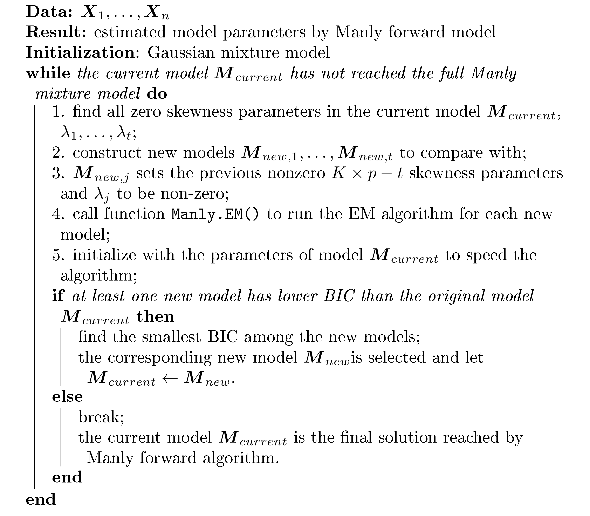
<figcaption>Algorithm 1: Manly forward selection algorithm.</figcaption>
</figure>

<figure id="Manly.backward">
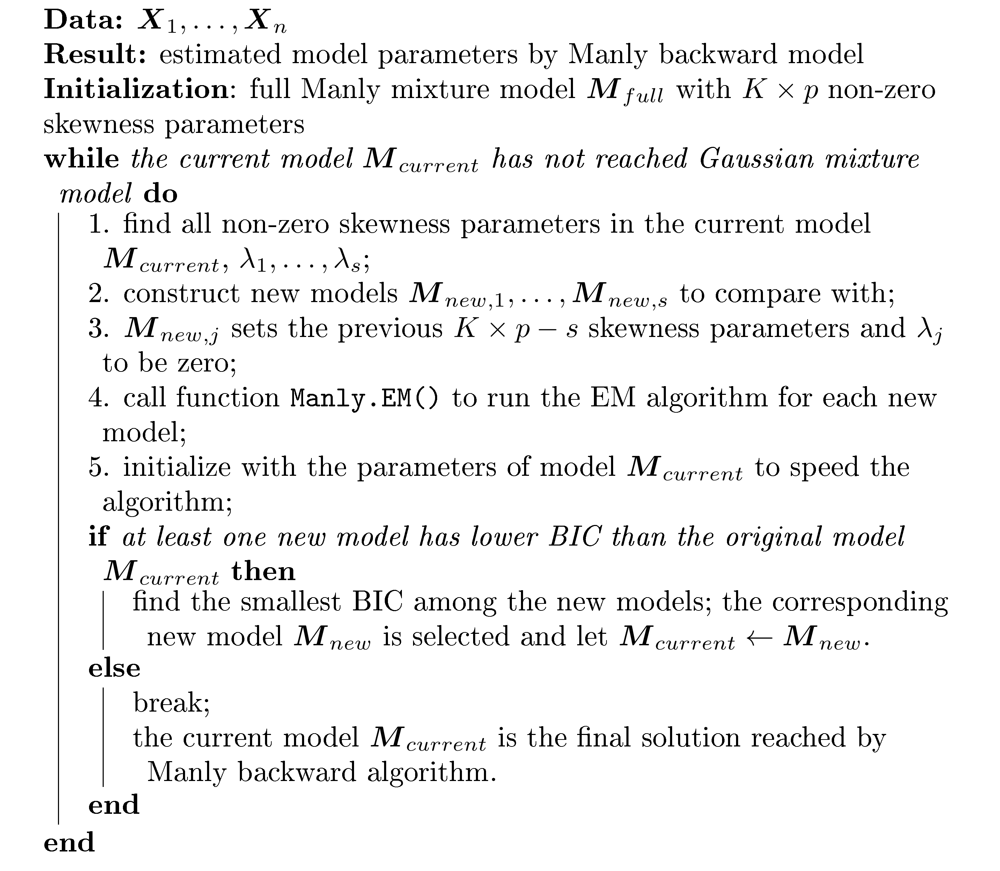
<figcaption>Algorithm 2: Manly backward selection
algorithm.</figcaption>
</figure>

The selection is based on the Bayesian information criterion
(BIC) [@schwarz78], which is the most commonly used criterion in finite
mixture modeling [@mclachlanandpeel00]. The smaller BIC is, the better
fit provided by a mixture is. The forward selection procedure starts
from the Gaussian mixture model and adds one $\lambda_{kj}$ at a time
until no improvement in BIC value can be obtained. The produced model is
called Manly forward model (denoted as Manly F in this paper) with the
details of the method outlined in Algorithm 1. The backward model
selection algorithm given in Algorithm 2 works in the opposite
direction. It starts with the full Manly mixture and drops one skewness
parameter $\lambda_{kj}$ at a time until no lower BIC can be reached.
The obtained model is called the Manly backward model (Manly B). The
selection algorithms are available in *ManlyMix* through setting
`method = "forward"` or `method = "backward"` in the `Manly.select()`
function.

## Manly $K$-means clustering

Manly $K$-means clustering is constructed based on the classification EM
(CEM) algorithm [@celeuxandgovaert92], which is a modification of the EM
algorithm with an additional classification step. This step involves the
Bayesian decision rule (*i.e.*,
$z_i^{(s)} = \mathop{\mathrm{argmax}}_k \pi_{ik}^{(s)}$) introduced
immediately after the E-step.

It can be noticed that the traditional $K$-means algorithm is equivalent
to the CEM algorithm based on the mixture model provided by
$$\label{eq.Kmeans}
g(\boldsymbol{x}; \boldsymbol{\Psi}) = \frac1K \sum_{k=1}^K \phi(\boldsymbol{x}; \boldsymbol{\mu}_k, \sigma^2 \boldsymbol{I}).   (\#eq:eq-Kmeans)$$
The model underlying the traditional $K$-means imposes very restrictive
assumptions of the homoscedasticity and spherical structure of
components. We alleviate these assumptions by allowing each component to
have the covariance matrix $\sigma_k^2\boldsymbol{I}$ and applying Manly
transformation to the data. These changes result in the model given by
$$\label{eq.ManlyKmeans}
g(\boldsymbol{x}; \boldsymbol{\Psi}) = \frac1K \sum_{k=1}^K \phi(\mathcal M(\boldsymbol{x}; \boldsymbol{\lambda}_{k}); \boldsymbol{\mu}_k, \sigma_k^2 \boldsymbol{I}) \exp\{\boldsymbol{\lambda}_k^T\boldsymbol{x}\}.   (\#eq:eq-ManlyKmeans)$$
Following the same procedure as the Manly mixture EM algorithm, each
$\boldsymbol{\lambda}_k$ can be obtained separately by straightforward
numeric optimization of the function $\tilde Q_k$ written as
$$\label{eq.tQ}
\begin{split}
\tilde Q_k(\boldsymbol{\lambda}_k| \boldsymbol{\Psi}^{(s-1)}) = & -\frac{p n_k^{(s)}}{2} \log\left\{\sum_{i=1}^n \xi^{(s)}_{ik}\left(n_k^{(s)}\mathcal M(\boldsymbol{x}_{i}; \boldsymbol{\lambda}_{k}) - \sum_{j=1}^n \xi^{(s)}_{jk}\mathcal M(\boldsymbol{x}_{j}; \boldsymbol{\lambda}_{k})\right)^T \right.\\
& \left. \times \left(n_k^{(s)} \mathcal M(\boldsymbol{x}_{i}; \boldsymbol{\lambda}_{k}) - \sum_{j=1}^n \xi^{(s)}_{jk}\mathcal M(\boldsymbol{x}_{j}; \boldsymbol{\lambda}_{k})\right)\right\} + \boldsymbol{\lambda}_k^T \sum_{i=1}^n \xi_{ik}^{(s)}  \boldsymbol{x}_i + const, 
\end{split}   (\#eq:eq-tQ)$$
where fuzzy classifications $\pi_{ik}^{(s)}$ are replaced by hard
assignments in the form of indicators
$\xi_{ik}^{(s)} = I(z_i^{(s)} = k)$. If $z_i^{(s)} = k$ holds true,
$\xi_{ik}^{(s)}$ takes a value of $1$; otherwise $\xi_{ik}^{(s)}$ is
equal to $0$. The current size of the $k$th cluster is
$n_k^{(s)} = \sum_{i=1}^n \xi_{ik}^{(s)}$.

In this way, each step of the Manly $K$-means algorithm updates the
partition and parameter estimates. The partition update is given by
$$z_i^{(s)} = \mathop{\mathrm{argmin}}_k \left\{||\mathcal M(\boldsymbol{x}_{i}; \boldsymbol{\lambda}_{k}^{(s-1)})- \boldsymbol{\mu}_k^{(s-1)}||^2 / (2 (\sigma_k^2)^{(s-1)}) - (\boldsymbol{\lambda}_k^{(s-1)})^{T}\boldsymbol{x}_i + \frac{p}{2}\log(\sigma^2_k)^{(s-1)}\right\},$$
while the parameters are estimated through the following expressions:
$$\label{eq.parkmeans}
\begin{split}
\boldsymbol{\lambda}_k^{(s)} = \mathop{\mathrm{argmax}}_{\boldsymbol{\lambda}_k} \tilde Q_k^{(s)}(\boldsymbol{\lambda}_k), \quad \quad \quad \boldsymbol{\mu}_k^{(s)} = \sum_{i=1}^n \xi_{ik}^{(s)}\mathcal M(\boldsymbol{x}_{i}; \boldsymbol{\lambda}_{k}^{(s)}) / n_k^{(s)},\quad \mbox{and}\\
(\sigma_k^2)^{(s)} = \sum_{i=1}^n \xi_{ik}^{(s)}(\mathcal M(\boldsymbol{x}_{i}; \boldsymbol{\lambda}_{k}^{(s)}) - \boldsymbol{\mu}_k^{(s)})^T(\mathcal M(\boldsymbol{x}_{i}; \boldsymbol{\lambda}_{k}^{(s)})- \boldsymbol{\mu}_k^{(s)}) / (p n_k^{(s)}).
\end{split}   (\#eq:eq-parkmeans)$$
The Manly $K$-means algorithm is incorporated in the R package
*ManlyMix* through the function `Manly.Kmeans()`. It can be used when
the number of data points in each cluster is about the same and the
transformed clusters are close to being spherical. It shows faster
performance as the inversion of potentially large covariance matrices is
not needed.

# Package functionality and illustrative examples {#sect3}

All functions available in the package *ManlyMix* are listed with brief
descriptions in Table [2](#table.func). In this section, we demonstrate
the utility of each function through a synthetic dataset and the
analysis of two real-life datasets: *Iris* [@anderson35; @fisher36] and
*AIS* [@cookandweisberg94].

::: {#table.func}
  --------------------------------------------------------------------------------------
  Function            Description
  ------------------- ------------------------------------------------------------------
  `Manly.EM()`        Runs the EM algorithm for a Manly mixture model

  `Manly.select()`    Runs forward and backward selection methods for a Manly mixture

                      model

  `Manly.Kmeans()`    Runs the Manly $K$-means clustering

  `Manly.overlap()`   Estimates the overlap values for a Manly mixture

  `Manly.sim()`       Simulates datasets from Manly mixture models

  `Manly.var()`       Performs variability assessment of Manly mixture model parameter

                      estimates and returns confidence intervals

  `Manly.plot()`      Constructs a plot to display model-fitting and clustering

  `ClassAgree()`      Calculates the confusion matrix and number of misclassifications

  `Manly.model()`     Serves as a wrapper function for Manly mixture modeling
  --------------------------------------------------------------------------------------

  : Table 2: Summary of functions implemented in *ManlyMix*.
:::

## Illustrative example 1

In this subsection, a Manly mixture is constructed with user-specified
parameters. The overlap values of this mixture is estimated through
function `Manly.overlap()`. Then function `Manly.sim()` simulates a
dataset from the mixture along with a true membership vector.

**Step a: Mixture specification**

Now we demonstrate the procedure to construct a Manly mixture step by
step. First, the user need to specify the number of components (assigned
to `K`) and variables (assigned to `p`). In this case, we have a
three-component bivariate mixture.

``` r
library(ManlyMix)
K <- 3
p <- 2
set.seed(123)
```

If the mixture probability density function of interest is written as
$$\label{eq.simulation}
\begin{split}
  g(\boldsymbol{x}) = &0.25e^{0.2x_1 + 0.25x_2}\phi\left(\begin{pmatrix} \frac{e^{0.2 x_1} - 1}{0.2}\\ \frac{e^{0.25 x_2} - 1}{0.25} \end{pmatrix}; \begin{pmatrix} 4.5\\ 7 \end{pmatrix}, \begin{pmatrix} 0.4 & 0\\ 0& 0.4 \end{pmatrix}\right) \\
+ &0.3e^{0.5x_1 + 0.35x_2}\phi\left(\begin{pmatrix} \frac{e^{0.5 x_1} - 1}{0.5}\\ \frac{e^{0.35 x_2} - 1}{0.35} \end{pmatrix}; \begin{pmatrix} 4\\ 8 \end{pmatrix}, \begin{pmatrix} 1 & -0.2\\ -0.2& 0.6 \end{pmatrix}\right) \\
 + &0.45e^{0.3x_1 + 0.4x_2}\phi\left(\begin{pmatrix} \frac{0.3e^{x_1} - 1}{0.3}\\ \frac{e^{0.4x_2} - 1}{0.4} \end{pmatrix}; \begin{pmatrix} 5\\ 5.5 \end{pmatrix}, \begin{pmatrix} 2 & -1\\ -1& 2 \end{pmatrix}\right),
\end{split}   (\#eq:eq-simulation)$$
we construct the mixture by assigning the model parameter values to `la`
(matrix input of size $K \times p$), `tau` (vector input of length $K$),
`Mu` (matrix input of size $K \times p$) and `S` (array input of
dimensionality $p \times p \times K$), respectively.

``` r
tau <- c(0.25, 0.3, 0.45)
Mu <- matrix(c(4.5, 4, 5, 7, 8, 5.5),3)
la <- matrix(c(0.2, 0.5, 0.3, 0.25, 0.35, 0.4),3)
S <- array(NA, dim = c(p, p, K))
S[,,1] <- matrix(c(0.4, 0, 0, 0.4), 2)
S[,,2] <- matrix(c(1, -0.2, -0.2, 0.6), 2)
S[,,3] <- matrix(c(2, -1, -1, 2), 2)
```

**Step b: Overlap assessment**

It is desirable to be capable of understanding the degree of interaction
among mixing components to assess clustering complexity. Function
`Manly.overlap()`, employing the measure of pairwise overlap, is
implemented for this purpose. It has the following syntax:

``` r
	Manly.overlap(tau, Mu, S, la, N = 1000)
```

with arguments `la`, `tau`, `Mu`, `S` and `N`. Here, `N` represents the
number of samples simulated from the given mixture for pairwise overlap
estimation. The larger `N` is, the more precise the calculation is. By
default, 1000 samples are employed. Four objects are returned by the
function, including the misclassification probability matrix
`$OmegaMap`, pairwise overlap `$OverlapMap`, average mixture overlap
`$BarOmega`, and maximum mixture overlap `$MaxOmega`. Here, element
`$OmegaMap[k2, k1]` corresponds to $\omega_{k_1|k_2}$ in
Equation \@ref(eq:eq-manlyoverlap). In this case, for example,
$\omega_{3|2} = 0.046$ means that a random variable coming from the
second component has approximate probability of 0.046 to be
misclassified to group 3. $\omega_{3|3} = 0.933$ represents the
probability that a point belonging to group 3 is correctly assigned to
this group. Each row of `$OmegaMap` sums up to 1. Then, pairwise
overlaps $\omega_{k_1,k_2}$ given in Equation \@ref(eq:eq-overlap) are
provided in the `$OverlapMap`. Among all pairwise overlaps
($\omega_{1,2}$, $\omega_{1,3}$ and $\omega_{2,3}$), $\omega_{2,3}$
yields the maximum value of 0.097 and produces `$MaxOmega`. The average
of these three values, on the other hand, results in `$BarOmega` being
`0.08066667`.

``` r
A <- Manly.overlap(tau, Mu, S, la)
print(A)
## $OmegaMap
##       [,1]  [,2]  [,3]
## [1,] 0.909 0.058 0.033
## [2,] 0.038 0.916 0.046
## [3,] 0.016 0.051 0.933
##  
## $OverlapMap
##   Components Overlap
## 1     (1, 2)   0.096
## 2     (1, 3)   0.049
## 3     (2, 3)   0.097
##  
## $BarOmega
## [1] 0.08066667
##  
## $MaxOmega
## [1] 0.097
```

It can be seen that in the considered case, function `Manly.overlap()`
calculates all characteristics based on the input of true model
parameters. If parameters `la`, `tau`, `Mu` and `S` are estimated,
`Manly.overlap()` provides estimates of misclassification probabilities
and overlap values. As for high-dimensional data, we can not readily
visually assess the interaction between data groups, such output helps
approximate the proximity of clusters and discover properties associated
with them.

**Step c: Data generation**

Function `Manly.sim()` simulates Manly mixture datasets based on
user-specified model parameters. It employs the built-in R function
`rmultinom()` for assigning data points to $K$ mixture components
according to the mixing proportion $\tau_k$'s. Then the function
simulates normally distributed data points by function `rnorm()`. The
covariance structures $\boldsymbol{\Sigma}_k$ are applied to the data
points before back-transforming them to Manly distributed components.

The `Manly.sim()` command has the following syntax:

``` r
	Manly.sim(n, la, tau, Mu, S)
```

The user can input `n` as the desired sample size. Here, a dataset of 30
observations is simulated from Equation \@ref(eq:eq-simulation) and data
matrix `$X` as well as its true membership vector `$id` are returned.

``` r
n <- 30
B <- Manly.sim(n, la, tau, Mu, S)
print(B)
## $X
##           [,1]     [,2]
##  [1,] 3.259485 3.882271
##  [2,] 3.247362 4.269247
```

*Part of the output is intentionally omitted.*

``` r
## [30,] 3.310186 2.974554
##  
## $id
##  [1] 1 1 1 1 1 1 1 2 2 2 2 2 2 2 2 2 2 2 2 3 3 3 3 3 3 3 3 3 3 3
```

## Illustrative example 2: *Iris* dataset

The *Iris* dataset [@anderson35; @fisher36] has 150 observations and 4
variables that represent sepal length, sepal width, petal length, and
petal width. Three species, *Iris setosa*, *Iris versicolor*, and *Iris
virginica*, have equal representation, consisting of 50 observations
each. The function `Manly.EM()` fits a Manly mixture to the *Iris*
dataset and 95% confidence intervals of the model MLE are provided by
`Manly.var()`. The Manly F and Manly B models are obtained by
`Manly.select()`. The Manly $K$-means algorithm clusters the dataset
through `Manly.Kmeans()`.

**Step a: Data preparation**

`Manly.EM()` requires input of a matrix object `X`, where rows of `X`
represent $p$-variate observations. If `X` is univariate data with
vector input, it will be automatically transformed into a matrix of just
one column. Thus, `X` has the dimensionality $n \times p$. In this case,
we transform the *Iris* dataset into a matrix of dimensionality
$150 \times 4$ and assign it to `X`.

``` r
library(ManlyMix)
K <- 3
p <- 4
X <- as.matrix(iris[,-5])
```

**Step b: Initialization of the EM algorithm**

Good initialization strategy of the EM algorithm is important to improve
chances of finding a correct result. There are two ways for the user to
initialize the `Manly.EM()` function. One is by means of providing the
initial partition of the data `id` (vector input of length $n$) and
skewness parameters `la`. Here, it needs to be noticed that the
specification of `la` matrix serves as an indicator of whether the
transformation is applied to a specific variable and component or not.
For example, for the *Iris* dataset, assumes that all variables in all
components enjoy normality except for the first variable in the first
component, `la` needs to be set as
`la <- matrix(c(0.1, rep(0, 11)), 3, 4)`, with `0.1` (that can be any
non-zero value) serving as the starting point in Nelder-Mead
optimization. If no `la` is provided, the skewness parameters are all
set equal to $0$ and a Gaussian mixture model will be fitted. The other
way of starting the algorithm is to enter initial model parameters,
including `la`, `tau`, `Mu`, and `S`. The algorithm employs these
parameters to compute the posterior probabilities in the first E-step.

Here, we adopt the first strategy. The initial partition of the *Iris*
data is obtained by running the traditional $K$-means algorithm and
specifying `la` is a matrix of size $3 \times 4$, with all elements set
to a non-zero value of `0.1`.

``` r
set.seed(123)
id.km <- kmeans(X, K)$cluster
la <- matrix(0.1, K, p)
```

**Step c: EM algorithm for Manly mixture modeling**

`Manly.EM()` runs the EM algorithm for modeling based on Manly mixtures
given in Equation \@ref(eq:eq-manlymix). The command has the following
syntax:

``` r
	Manly.EM(X, id = NULL, la = NULL, tau = NULL, Mu = NULL, S = NULL, 
	         tol = 1e-5, max.iter = 1000).
```

The parameters `tol` and `iter` correspond to the stopping rule for the
EM algorithm. `tol` specifies the tolerance level of the EM algorithm.
If the relative difference of the $Q$ function values from two
consecutive steps is smaller than `tol`, the EM algorithm is terminated.
By default, `tol` is set equal to $10^{-5}$. `max.iter` stands for the
maximum number of iterations allowed for the EM algorithm. The default
value of `max.iter` is `1000`. We fit the *Iris* dataset by both
Gaussian mixture (assigned to object `G`) and Manly mixture (assigned to
object `M`).

``` r
G <- Manly.EM(X, id = id.km)
colnames(G$la) <- colnames(X)
print(G$la)
##      Sepal.Length Sepal.Width Petal.Length Petal.Width
## [1,]            0           0            0           0
## [2,]            0           0            0           0
## [3,]            0           0            0           0

M <- Manly.EM(X, id.km, la)
colnames(M$la) <- colnames(X)
print(M$la)
##      Sepal.Length Sepal.Width Petal.Length Petal.Width
## [1,]   -0.1158602  0.05907443   -0.2382086   -4.033529
## [2,]   -0.1254022 -0.65079974   -0.3848938    0.479587
## [3,]   -0.1282339  0.64271380    0.3343054   -1.134275

print(M$id)
## [1] 1 1 1 1 1 1 1 1 1 1 1 1 1 1 1 1 1 1 1 1 1 1 1 1 1 1 1 1 1 1 1 1 1 1 1 1 1
## [38] 1 1 1 1 1 1 1 1 1 1 1 1 1 3 3 3 3 3 3 3 3 3 3 3 3 3 3 3 3 3 3 3 3 3 3 3 3
## [75] 3 3 3 3 3 3 3 3 3 2 3 3 3 3 3 3 3 3 3 3 3 3 3 3 3 3 2 2 2 2 2 2 2 2 2 2 3
## [112] 2 2 2 2 2 2 2 2 3 2 2 2 3 2 2 3 3 2 2 2 2 2 3 2 2 2 2 3 3 2 3 2 2 2 3 3 3
## [149] 2 2
```

The estimated model parameters returned by the function `Manly.EM()`
include `$la` (matrix output of size $K \times p$), `$tau` (vector
output of length $K$), `$Mu` (matrix output of size $K \times p$) and
`$S` (array output of dimensionality $p \times p \times K$). They
correspond to the parameters $\boldsymbol{\lambda}_k$, $\tau_k$,
$\boldsymbol{\mu}_k$ and $\boldsymbol{\Sigma}_k$ in
Equation \@ref(eq:eq-pars) and \@ref(eq:eq-Qk), respectively. In this
example, it can be observed that the returned `$la` for the Gaussian
mixture have all elements fixed at zero, while the Manly mixture has
estimated the skewness parameters for each component and variable. For
example, the skewness parameter associated with the sepal length
variable of the first cluster is estimated to be $-0.1158602$. It can be
observed that most of the estimated parameters are relatively close to
zero, which indicates approximate normality of the *Iris* data.

Some other parameters returned by `Manly.EM()` are the $n \times K$
matrix of posterior probabilities `$gamma` calculated from
Equation \@ref(eq:eq-post) in the last E-step and the membership vector
`$id` assigned by the Bayes decision rule in Equation \@ref(eq:eq-mem).
In this case, the output of `$id` demonstrates the model-based
clustering solution of the *Iris* dataset.

The characteristics of the fitted model are demonstrated in terms of the
model log-likelihood `$ll` and BIC `$bic`. The number of iterations run
by the EM algorithm until convergence is recorded through `$iter`. In
this example, the EM algorithm reaches convergence after 13 iterations
and the model BIC is $618.46$. Finally, a dummy indicator `$flag`
reports the validity of the fitted model, where $0$ represents the
successful convergence of the EM algorithm and $1$ stands for the
failure of convergence. A warning message is given if `$flag` is equal
to $1$. It may happen when one cluster disappears or shrinks so that
some parameter estimates are NA's. Such issue is related to spurious
solutions [@mclachlanandpeel00] where one or more components model a
local pattern in data rather than a systematic one.

**Step d: Variability assessment of Manly mixture model**

Variability assessment of the model parameters allows practitioners to
study the specific nature of the fitted model as well as detected
clustering solutions. We provide the user with function `Manly.var()`,
which calculates the inverse of the empirical observed information
matrix given in Equation \@ref(eq:eq-info) and returns the
variance-covariance matrix of the estimated MLE from `Manly.EM()`
function. It also outputs the confidence intervals of each parameter.

The command has the following syntax:

``` r
	Manly.var(X, model = NULL, conf.CI = NULL)
```

`X` represents the data matrix and `model` is the object of class
`"ManlyMix"`. `conf.CI` is user-specified confidence level, which needs
to take a value between `0` and `1`. Here by setting `model = M`, we
take the MLE of the fitted Manly mixture obtained from step c and
evaluate its variability. The number of unique model parameters is
$K - 1 + 2K \times p + K \times p (p + 1) / 2 = 56$ for the *Iris*
dataset. `conf.CI = 0.95` calculates 95% confidence intervals for these
56 parameters. Thus `Manly.var()` function returns a $56 \times 56$
covariance matrix (assigned to `V`) and 56 confidence intervals
(assigned to `CI`).

``` r
result <- Manly.var(X, model = M, conf.CI = 0.95)
```

In the code output of 95% confidence intervals, the first column
represents the point estimates of the 56 model parameters, while the
second and third columns stand for the lower and upper bounds of
confidence intervals, respectively.

``` r
print(result$CI)
##          Estimates         Lower        Upper
##  [1,]  0.333333333   0.257887628  0.408779039
##  [2,]  0.264119102   0.175676489  0.352561716
##  [3,]  3.794594378  -8.303528084 15.892716840
```

*Part of the output is intentionally omitted.*

``` r
## [54,]  0.642713799  -0.407079526  1.692507125
## [55,]  0.334305435  -0.128841410  0.797452280
## [56,] -1.134275340  -2.079185136 -0.189365544
```

**Step e: Forward and backward selection algorithms**

Step e targets detecting the normally distributed variables in *Iris*.
`Manly.select()` provides the selection algorithm for eliminating
unnecessary skewness parameters in `M$la`. These skewness parameters are
fixed to be equal to zero and the log-likelihood is maximized based on
the rest of parameters. The use of the function is shown below:

``` r
	Manly.select(X, model, method, tol = 1e-5, max.iter = 1000, 
                     silent = FALSE)
```

The argument `model` is the initial model to start the selection
procedure with. `method` is set to either `"forward"` or `"backward"`
for the implementation of Algorithm 1 or Algorithm 2, respectively. The
selection criterion for each step is based on `$bic` values obtained
from all candidate models that are of class `"ManlyMix"`. `silent` is an
argument that controls the code output. By default, `silent` provides
the steps of selection and BIC values for all candidate models. Thus,
the user can monitor the selection procedures. The output can be turned
off by setting `silent = TRUE`. We first discuss the implementation of
the forward selection on the *Iris* dataset. The algorithm is
initialized by the Gaussian mixture model `G` obtained in step c.

``` r
MF <- Manly.select(X, model = G, method = "forward")
## step 1 :
##         current BIC = 580.8389 
##         alternative BICs = 585.6791 585.0607 582.1893 585.7369 585.2193 583.7374
##         585.7081 583.963 579.8978 573.4626 585.8161 585.8407 
## step 2 :
##         current BIC = 573.4626 
##         alternative BICs = 578.3191 577.6844 574.813 578.3719 577.843 576.3611
##         578.3282 576.5866 572.5215 578.4397 578.4643 
## step 3 :
##         current BIC = 572.5215 
##         alternative BICs = 577.378 576.7713 575.8067 577.4308 576.8833 575.3526
##         577.3871 575.6213 577.4799 577.3221 
```

The forward selection takes three steps for the algorithm to find the
best model (assigned to `MF`). In step 3, there is no alternative BIC
value that is smaller than the current model BIC, so the forward
selection algorithm stops searching over non-zero $\lambda_{kj}$'s.
Compared to the Gaussian mixture fit, Manly F model improves by $8$ in
BIC value.

On the contrary, the backward selection starts with the full Manly
mixture `M` and drops one skewness parameter at a time.

``` r
MB <- Manly.select(X, model = M, method = "backward")
## step 1 :
##         current BIC = 618.4553 
##         alternative BICs = 613.5161 612.7184 613.8658 613.448 614.3828 616.6445
##         613.5442 616.3626 617.0157 625.7431 613.1927 610.7879 
## step 2 :
##         current BIC = 610.7879 
##         alternative BICs = 605.9157 605.9075 607.3512 605.8475 606.3851 607.8112
##         605.9437 607.0513 609.9457 618.1426 605.7915 
```

*Part of the output is intentionally omitted.*

``` r
## step 10 :
##         current BIC = 575.3526 
##         alternative BICs = 572.5215 576.3611 582.729 
## step 11 :
##         current BIC = 572.5215 
##         alternative BICs = 573.4626 579.8978 
```

After 11 steps, the backward selection produces the Manly B model, which
enjoys the same BIC value as the Manly F model.

**Step f: Diagnostics**

The skewness parameters of the Manly F and Manly B models are
investigated in the following example. It is observed that the forward
selection adopts only two $\lambda_{kj}$'s in the model. They correspond
to the petal width variable of the first species and the petal length
variable of the third one. For all other components and variables, the
data appear to be nearly normally distributed. The same two skewness
parameters are found by the backward selection. It is worth mentioning,
however, that Manly F and Manly B models can produce different results.

``` r

colnames(MF$la) <- colnames(X)
print(MF$la)
##     Sepal.Length Sepal.Width Petal.Length Petal.Width
## [1,]            0           0    0.0000000       -4.04
## [2,]            0           0    0.0000000        0.00
## [3,]            0           0    0.5615625        0.00
colnames(MB$la) <- colnames(X)
print(MB$la)
##      Sepal.Length Sepal.Width Petal.Length Petal.Width
## [1,]            0           0    0.0000000   -4.034815
## [2,]            0           0    0.0000000    0.000000
## [3,]            0           0    0.5619671    0.000000
```

**Step g: Manly $K$-means algorithm**

The Manly $K$-means algorithm written in
Equation \@ref(eq:eq-ManlyKmeans) is implemented in function
`Manly.Kmeans()`, which has the following syntax:

``` r
	Manly.Kmeans(X, id = NULL, la = NULL, Mu = NULL, S = NULL,
	             initial = "k-means", K = NULL, nstart = 100, 
                     method = "ward.D", tol = 1e-5, max.iter = 1000).
```

`Manly.Kmeans()` has most of the arguments and returned values the same
as those of the function `Manly.EM()`. As the Manly $K$-means algorithm
assumes that all clusters are of the same size, the mixing proportions
`tau` are not needed in this function. `S` is a vector of length $K$
that represents variance within each cluster, as the transformed data
groups are assumed to be spherical. The parameters returned by the
function `$la`, `$Mu`, and `$S` correspond to $\boldsymbol{\lambda}_k$,
$\boldsymbol{\mu}_k$ and $\sigma^2_k$ given in
Equation \@ref(eq:eq-parkmeans). The log-likelihood and BIC values are
not provided since the parameter estimates are not MLE's.
`Manly.Kmeans()` has several initialization choices: (1) by providing
`id` and `la`; (2) by providing `la`, `Mu`, and `S`; (3) by specifying
the number of clusters `K` and letting `initial = "k-means"`; It takes
the default traditional K-means clustering result and passes it into the
CEM algorithm; (4) by specifying the number of clusters `K` and letting
`initial = "hierarchical"`; It adopts the hierarchical clustering
solution as the initial dataset partition. `nstart` is responsible for
controlling the number of random starts tried in initialization choice
(3) with a default value equal to `100`. `method` sets the linkage
method in initialization choice (4) with a default of
`method = "ward.D"`, which represents the Ward's linkage [@ward63].
Here, the initialization choice of `Manly.Kmeans()` is (1), which is the
same as that of `Manly.EM()`.

``` r
MK <- Manly.Kmeans(X, id.km, la)
colnames(MK$la) <- colnames(X)
print(MK$la)
##      Sepal.Length Sepal.Width Petal.Length Petal.Width
## [1,]  -0.37975529  -0.5815382  -0.81530022  -2.5572830
## [2,]  -0.27067058  -0.4103692  -0.31001602  -0.5367999
## [3,]  -0.02896526   0.1138177  -0.05694487   0.2617650

print(MK$S)
## [1] 0.002717844 0.006156015 0.160435910
```

## Illustrative example 3: *AIS* dataset {#ais}

In this subsection, dataset *AIS* [@cookandweisberg94] is studied for
illustrative purposes. The Australian Institute of Sports (AIS) dataset
was first introduced by @cookandweisberg94. It contains information
collected from 202 athletes, among which 100 are females and 102 are
males. There are 13 variables, including the gender, sport kind and 11
numeric measurements of the athletes. We adopt the same variables and
analysis as @leeandmclachlan13a. The goal of the analysis is to cluster
the athletes into two groups: males and females by constructing models
based on three measurements: the body mass index ("BMI"), lean body mass
("LBM"), and the percentage of body fat ("Bfat"). Function
`ClassAgree()` compares the estimated and true partitions. Function
`Manly.plot()` is introduced for visual analysis of Manly mixture fitted
results.

**Step a: model fit**

The *AIS* dataset is analyzed by six mixture models: the traditional
$K$-means (`kmeans()`), Manly $K$-means (`Manly.Kmeans()`), Gaussian
mixture model (`Manly.EM()`), Manly mixture model (`Manly.EM()`), Manly
forward model and Manly backward model (both available through
`Manly.select()`).

``` r
library(ManlyMix)
data("ais"); set.seed(123)
X <- as.matrix(ais[,c(8, 10, 11)])
id <- as.numeric(ais[,1])
n <- dim(X)[1]
p <- dim(X)[2]
K <- max(id) 
Kmeans <- kmeans(X, K)
id.km <- Kmeans$cluster
```

By running the following code, we not only obtain the fitted models, but
also test the package from different aspects. The number of parameters
in the models are 7 ($K$-means), 19 (Gaussian), 25 (Manly), 23 (Manly
F), 22 (Manly B) and 14 (Manly $K$-means). The computing times are
0.001, 0.004, 0.083, 0.8, 1.143, 0.024, respectively. These results are
rather efficient compared to those from other packages (see Appendix).

``` r
MK <- Manly.Kmeans(X, id = id.km, la = matrix(0.1, K, p))
G <- Manly.EM(X, id = id.km, la = matrix(0, K, p))
M <- Manly.EM(X, id = id.km, la = matrix(0.1, K, p))
MF <- Manly.select(X, G, method = "forward", silent = TRUE)
MB <- Manly.select(X, M, method = "backward", silent = TRUE)
```

Now we consider the fitted model parameters to perform a comprehensive
analysis and diagnostics of the *AIS* dataset. From the following
output, it is observed that the Manly F model drops two skewness
parameters from the full Manly mixture model while Manly B drops three.
This yields the conclusion that the "Bfat" variable in the first group
and "LBM" variable in the second one are close to be normal. Through the
one-to-one correspondence between skewness parameters and dataset
variables, *ManlyMix* is proved to be particularly useful for model
variable diagnostics.

``` r
colnames(MF$la) <- colnames(X)
MF$la
##              BMI       Bfat        LBM
## [1,] -0.08671894  0.0000000 0.01002851
## [2,] -0.12882354 -0.1902031 0.00000000

colnames(MB$la) <- colnames(X)
MB$la
##              BMI       Bfat LBM
## [1,] -0.09362427  0.0000000   0
## [2,] -0.12720459 -0.1933216   0
```

BIC values for the four models are $3595.35$ (Gaussian), $3543.00$
(Manly), $3538.42$ (Manly F) and $3533.63$ (Manly B). It shows
considerable improvement in terms of BIC from Manly mixture models. They
provide better fits for the data, among which Manly backward is the best
model selected according to BIC.

**Step b: classification table**

Classification results from the six models are compared using function
`ClassAgree()` in step b. Function `ClassAgree()` adopts input of both
the estimated and true id vectors with the following syntax:

``` r
	ClassAgree(est.id, trueid)
```

`ClassAgree()` permutes the partition labels to achieve the lowest
number of misclassifications. Then, based on the switched labels, it
returns the confusion matrix and number of misclassifications. In the
analysis of the *AIS* dataset, the following output is produced by
`ClassAgree()`.

``` r
ClassAgree(id.km, id)
## $ClassificationTable
##       est.id
## trueid  1  2
##      1 98  2
##      2 12 90
##  
## $MisclassificationNum
## [1] 14

ClassAgree(MK$id, id)
## $ClassificationTable
##       est.id
## trueid  1  2
##      1 95  5
##      2  7 95
##  
## $MisclassificationNum
## [1] 12

ClassAgree(G$id, id)
## $ClassificationTable
##       est.id
## trueid   1   2
##      1 100   0
##      2   8  94
##  
## $MisclassificationNum
## [1] 8

ClassAgree(M$id, id)
## $ClassificationTable
##       est.id
## trueid   1   2
##      1  98   2
##      2   2 100
##  
## $MisclassificationNum
## [1] 4

ClassAgree(MF$id, id)
## $ClassificationTable
##       est.id
## trueid  1  2
##      1 99  1
##      2  3 99
##  
## $MisclassificationNum
## [1] 4

ClassAgree(MB$id, id)
## $ClassificationTable
##       est.id
## trueid  1  2
##      1 99  1
##      2  4 98
##  
## $MisclassificationNum
## [1] 5
```

Rows and columns represent the true and estimated partitions,
respectively. The diagonal and off-diagonal elements in the table
correspond to correct and incorrect classifications, respectively. The
lowest number of misclassifications (4 misclassifications) is obtained
by the Manly mixture and Manly forward models. One worth-mentioning fact
is that these two models enjoy the clustering solution as good as the
unrestricted skew-$t$ mixture, which is reported to be the best model by
@leeandmclachlan13a. The Manly backward model comes second with 5
misclassifications. The remaining three models, traditional $K$-means,
Manly $K$-means and Gaussian mixture model show worse performance.

**Step c: visualization tool**

In order to investigate the behavior of each model, contour plots with
classified data points need to be analyzed. `Manly.plot()` allows
conducting the visual analysis of a dataset fitted by Manly mixture
model. The command has the following syntax:

``` r
	Manly.plot(X, var1 = NULL, var2 = NULL, model = NULL, x.slice = 100, 
	           y.slice = 100, x.mar = 1, y.mar = 1, col = "lightgrey", ...).
```

If both `var1` and `var2` are provided, they represent variables on the
$X$-axis and $Y$-axis of a contour plot, respectively. Argument `model`
is the object of class `"ManlyMix"`. The parameters of `model` object
are used to calculate the density and draw contour lines. The estimated
membership vector `model$id` is reflected through different colors.
`x.slice` and `y.slice` options control the number of grid points for
which a density is calculated. The larger these two values are, the more
grid values are considered. Thus, the contour lines look smoother.
`x.mar` and `y.mar` specify plot margins. The parameter `col` specifies
the color of contour lines with the default color being light grey.
Other variables in the built-in R function `contour()` can also be used
as specified. On the other hand, if only `var1` is provided, a density
plot of this variable is constructed. `x.slice` and `x.mar` have the
same functionality as those in the contour plot. The parameter `col`
stands for density line color with the default being light grey. `...`
allows other arguments from the built-in R function `hist()` to be
passed.

In this case, we conduct the same analysis as that in
@leeandmclachlan13a and adopt the two variables "LBM" and "Bfat" for
constructing contour plots. The margins of the plots are set to be `3`
on the $X$-axis and `13` on the $Y$-axis. The light grey contour lines
have width equal to `3.2`. Labels and axes are suppressed. The function
is first applied to the four fitted models Gaussian mixture, Manly
mixture, Manly F and Manly B in step a.

``` r
Manly.plot(X, var1 = 3, var2 = 2, model = G, x.mar = 3, y.mar = 13, 
           xaxs="i", yaxs="i", xaxt="n", yaxt="n", xlab="", ylab = "", 
           nlevels = 10, drawlabels = FALSE, lwd = 3.2, 
           col = "lightgrey", pch = 19)
Manly.plot(X, var1 = 3, var2 = 2, model = M, x.mar = 3, y.mar = 13, 
           xaxs="i", yaxs="i", xaxt="n", yaxt="n", xlab="", ylab = "", 
           nlevels = 10, drawlabels = FALSE, lwd = 3.2, 
           col = "lightgrey", pch = 19)
Manly.plot(X, var1 = 3, var2 = 2, model = MF, x.mar = 3, y.mar = 13, 
           xaxs="i", yaxs="i", xaxt="n", yaxt="n", xlab="", ylab = "", 
           nlevels = 10, drawlabels = FALSE, lwd = 3.2, 
           col = "lightgrey", pch = 19)
Manly.plot(X, var1 = 3, var2 = 2, model = MB, x.mar = 3, y.mar = 13, 
           xaxs="i", yaxs="i", xaxt="n", yaxt="n", xlab="", ylab = "", 
           nlevels = 10, drawlabels = FALSE, lwd = 3.2, 
           col = "lightgrey", pch = 19)
```

Function `Manly.plot()` enjoys sufficient flexibility to adopt other
parsimonious models. Parameters obtained by traditional $K$-means and
Manly $K$-means can be adjusted according to the object of class
`"ManlyMix"` so that `$id`, `$tau`, `$Mu`, `$la`, `$S` are extracted in
their correct forms.

``` r
Kmeans$id <- id.km
Kmeans$tau <- MK$tau <- rep(1 / K, K)
Kmeans$Mu <- Kmeans$centers
Kmeans$la <- matrix(0, K, p)
Kmeans$S <- array(0, dim = c(p, p, K))
for(k in 1:K) 
  diag(Kmeans$S[,,k]) <- Kmeans$tot.withinss / n / p
s2 <- MK$S
MK$S <- array(0, dim = c(p, p, K))
for(k in 1:K)
  diag(MK$S[,,k]) <- s2[k]
Manly.plot(X, var1 = 3, var2 = 2, model = Kmeans, x.mar = 3, y.mar = 13, 
           xaxs="i", yaxs="i", xaxt="n", yaxt="n", xlab="", ylab = "", 
           nlevels = 4, drawlabels = FALSE, lwd = 3.2, 
           col = "lightgrey", pch = 19)
Manly.plot(X, var1 = 3, var2 = 2, model = MK, x.mar = 3, y.mar = 13, 
           xaxs="i", yaxs="i", xaxt="n", yaxt="n", xlab="", ylab = "", 
           nlevels = 10, drawlabels = FALSE, lwd = 3.2, 
           col = "lightgrey", pch = 19)
```

Figure [1](#fig.ais) combines all output plots from `Manly.plot()`.

<figure id="fig.ais">
<p>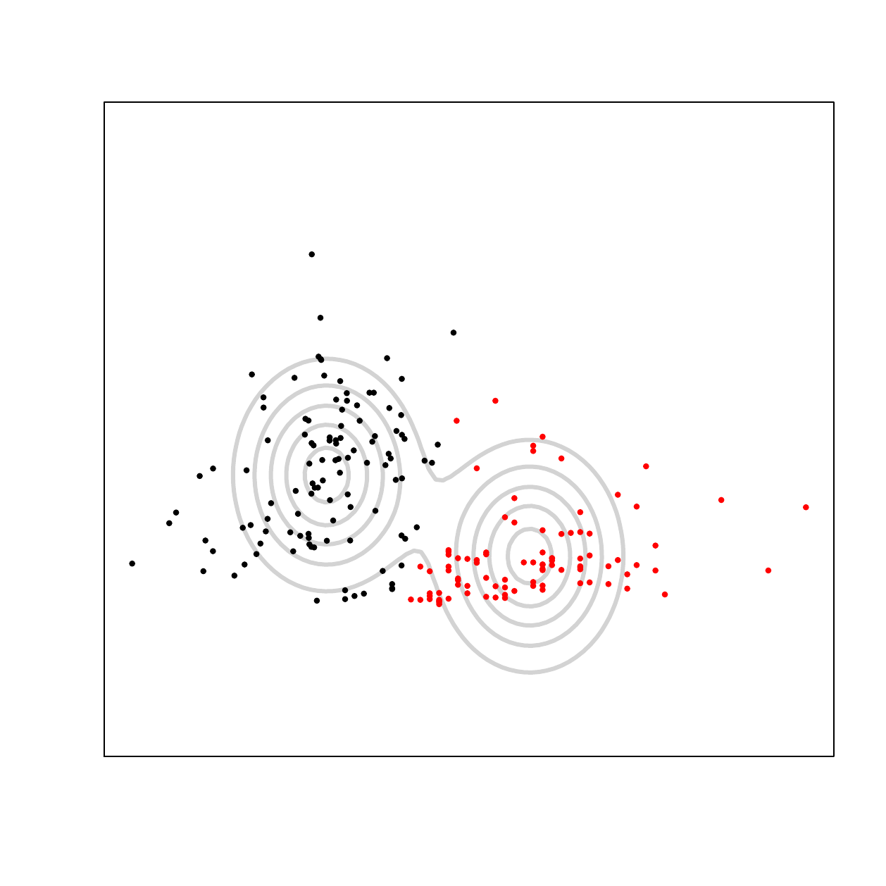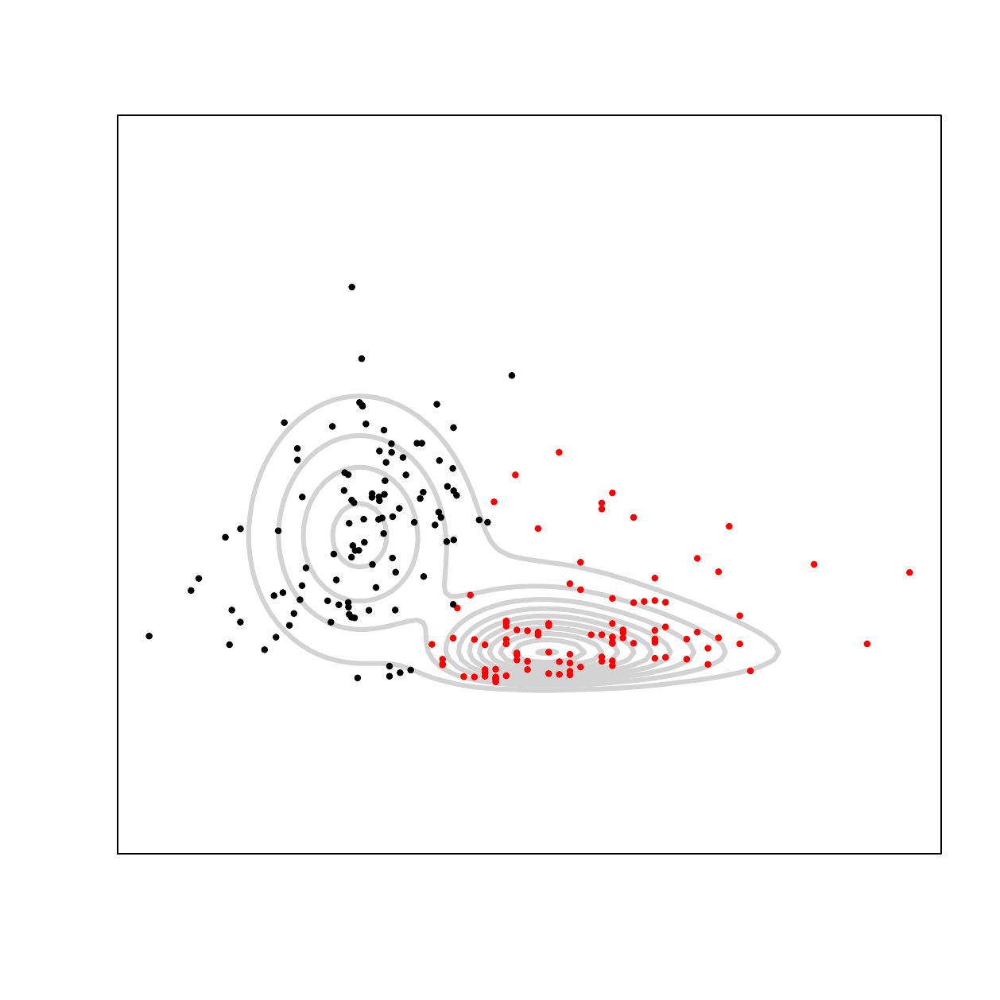</p>
<p>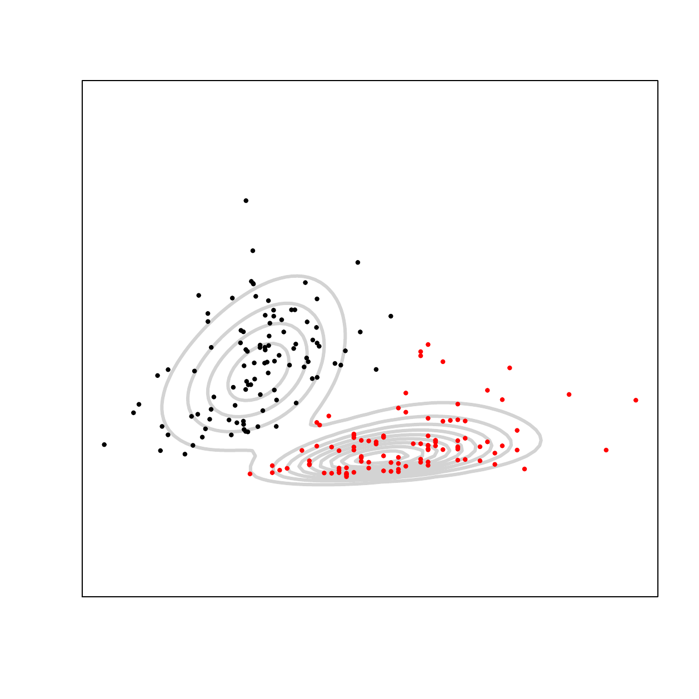</p>
<p>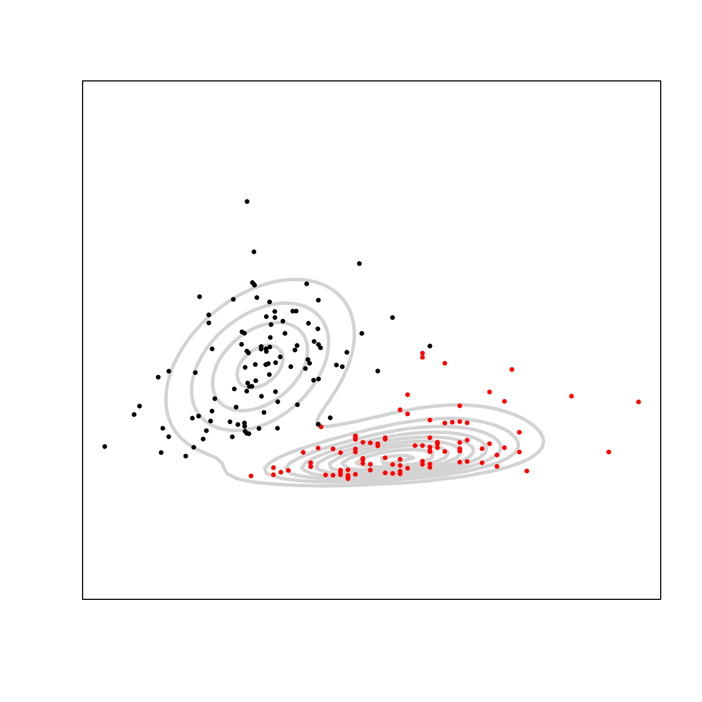</p>
<figcaption>Figure 1: <span><em>AIS</em></span> dataset: fitted contour
plots from function <code>Manly.plot()</code> based on the two variables
“LBM” (X-axis) and “Bfat” (Y-axis). The model locations are: <span
class="math inline"><em>K</em></span>-means (first row left), Manly
<span class="math inline"><em>K</em></span>-means (first row right),
Gaussian mixture (second row left), Manly mixture (second row right),
Manly forward (third row left) and Manly backward (third row
right).</figcaption>
</figure>

It can be observed that the two components have a slight overlap, so the
clustering problem is not over-complicated. However, the red cluster is
highly skewed and has a heavy tail. This imposes difficulties for the
traditional $K$-means, Manly $K$-means, and Gaussian mixture model.
Manly mixture model shows great flexibility and captures the skewness
pattern in both components. Manly forward drops the skewness parameters
associated with variable "Bfat" in the female cluster (black component)
and "LBM" in the male group (red component). Manly backward drops both
skewness parameters that correspond to the female cluster and uses a
black ellipsoid. It also drops the "LBM" variable in the male cluster
(red component). The above results reveal the applicability and
effectiveness of function `Manly.plot()` on real-life datasets.

**Alternative coding d: wrapper function**

Wrapper function `Manly.model()` enables practitioners to run analysis
in a simple and convenient way. The function has the following syntax:

``` r
	Manly.model(X, K = 1:5, Gaussian = FALSE, initial = "k-means", 
	            nstart = 100, method = "ward.D",  short.iter = 5, 
                    select = "none", silent = TRUE, plot = FALSE, 
                    var1 = NULL, var2 = NULL, VarAssess = FALSE, 
                    conf.CI = NULL, overlap = FALSE, N = 1000, tol = 1e-5, 
                    max.iter = 1000, ...).
```

Argument `K` is an integer vector providing the numbers of clusters to
be tested for the data. The default setting tests 1, 2, 3, 4, or 5
clusters. It calls the `Manly.EM()` function to fit all five models. The
one with the lowest BIC value is chosen to be the best model. `Gaussian`
option specifies whether skewness parameters are adopted or not. If
`TRUE`, Gaussian mixtures are fitted. With the default value being
`FALSE`, it runs full Manly mixture models. `initial` specifies the
initialization strategy used. It has three input options: (1)
`initial = "k-means"` is the default initialization strategy, which
passes the traditional $K$-means result into the EM algorithm as the
initial partition. `nstart` is passed into the built-in R function
`kmeans` for specifying the number of random starts (the default
`nstart = 100`); (2) if `initial = "hierarchical"`, the hierarchical
clustering initialization is used. The linkage method is passed by
`method` argument into R function `hclust`. The default is Ward's
linkage; (3) if `initial = "emEM"`, the emEM [@biernackietal03]
initialization is run. Short runs of EM are conducted based on random
starts and the one that corresponds to the highest log-likelihood is
picked for running until convergence. `nstart` controls the number of
random starts. The number of iterations for the short EM is specified by
`short.iter` with a default value set to `5` iterations.

`select` argument has three input values: `"none"`, `"forward"` and
`"backward"`. If `select = "none"`, then the object returned by function
`Manly.EM()` is adopted directly. If `select = "forward"`, the
`Gaussian` option is automatically adjusted to `Gaussian = TRUE`. It
calls function `Manly.select(..., method = "forward")` to improve the
original Gaussian fit. On the other hand, if `select = "backward"`,
`Gaussian` option is automatically set to `Gaussian = FALSE`. The full
Manly mixture is followed by the backward selection
`Manly.select(..., method = "backward")`. `silent` argument controls the
output in function `Manly.select()`. The default setting suppresses the
output. `plot` determines whether `Manly.plot()` function is called or
not. If `plot = TRUE`, then `Manly.plot()` runs and arguments `var1` and
`var2` allow user to specify which variable(s) to plot. Argument
`VarAssess` provides the option of using `Manly.var()` for variability
assessment. Notice here that it only provides assessment for a full
Manly mixture model. `conf.CI` specifies the confidence level of the
confidence intervals returned. The `overlap` option, if specified to be
`TRUE`, adopts the `Manly.overlap()` function and estimates pairwise
overlap values for the returned model. `N` is the number of Monte Carlo
simulations run in `Manly.overlap()`.

Three objects are returned by function `Manly.model()`: `$model`,
`$VarAssess`, and `$Overlap`. `$model` is the final model of class
`"ManlyMix"` by `Manly.EM()` or `Manly.select()`. `$VarAssess` returns
the variance-covariance matrix and confidence intervals by `Manly.var()`
function. `$Overlap` returns the object by `Manly.overlap()`.

For *AIS* dataset, suppose the user wants to obtain the Manly F or Manly
B model and take a look at their contour plots. A compact version of the
code is given by:

``` r
MF <- Manly.model(X, K = 2, initial = "k-means", nstart = 100, 
                  select = "forward", plot = TRUE, var1 = 3, var2 = 2, 
                  x.mar = 3, y.mar = 13, xaxs="i", yaxs="i", 
                  xaxt="n", yaxt="n", xlab="", ylab = "", 
                  nlevels = 4, drawlabels = FALSE, lwd = 3.2, 
                  col = "lightgrey", pch = 19)
MB <- Manly.model(X, K = 2, initial = "k-means", nstart = 100, 
                  select = "backward", plot = TRUE, var1 = 3, var2 = 2, 
                  x.mar = 3, y.mar = 13, xaxs="i", yaxs="i", 
                  xaxt="n", yaxt="n", xlab="", ylab = "", 
                  nlevels = 4, drawlabels = FALSE, lwd = 3.2, 
                  col = "lightgrey", pch = 19)
```

Here, `MF$model` and `MB$model` obtained are the same as those in step
a. The contour plots are generated automatically and can be found in
Figure [1](#fig.ais).

**Alternative coding e: initialization with model parameters**

Functions `Manly.EM()` can take initial model parameters as
initialization of the algorithm. It is especially useful for the emEM
initialization. The practitioner can construct a large number of short
EM runs, select the one with the highest log-likelihood and obtain its
estimated parameters. Then, the EM algorithm initialized by these
parameters is run until convergence. Here is a small example on the
*AIS* dataset. 100 short EM algorithms run for 5 iterations each. As we
can see, the obtained object M is the same as that from step a.

``` r
ll <- -Inf
init <- NULL
nstart <- 100
iter <- 0
repeat {
  	id.km <- kmeans(X, centers = K, iter.max = 1)$cluster
  	temp <- Manly.EM(X, id = id.km, la = matrix(0.1, K, p), max.iter = 5)
  	if(temp$ll > ll) {
  		ll <- temp$ll
  		init <- temp
  	}
  	iter <- iter + 1
  	if(iter == nstart) 
                break
}
M <- Manly.EM(X, tau = init$tau, Mu = init$Mu, S = init$S, la = init$la)
```

## Illustrative example 4: *acidity* dataset {#acidity}

Since one reviewer is interested in seeing a showcase of a univariate
Manly mixture, we illustrate its utility on the *acidity* dataset
[@crawford94]. It provides the acidity measure of 155 lakes in the
Northeastern United States. There are two clusters, but the true
partition is unknown.

**Step a: model fit**

We run the following models: the traditional $K$-means (`kmeans()`),
Manly $K$-means (`Manly.Kmeans()`), Gaussian mixture model
(`Manly.EM()`), Manly mixture model (`Manly.EM()`), Manly forward model,
and Manly backward model (both available through `Manly.select()`).

``` r
library(ManlyMix)
data("acidity"); set.seed(123)
K <- 2
p <- 1
X <- acidity
Kmeans <- kmeans(X, K)
id.km <- Kmeans$cluster
MK <- Manly.Kmeans(X, id = id.km, la = matrix(0.1, K, p))
G <- Manly.EM(X, id = id.km, la = matrix(0, K, p))
M <- Manly.EM(X, id = id.km, la = matrix(0.1, K, p))
MF <- Manly.select(X, G, method = "forward", silent = TRUE)
MB <- Manly.select(X, M, method = "backward", silent = TRUE)
```

The model BIC values for Gaussian, Manly, Manly F and Manly B are
$394.51$, $389.84$, $389.84$ and $389.84$, respectively. There is an
indication of skewness as both the Manly F and Manly B models fail to
drop any skewness parameters. The Manly models improve by $5$ in the BIC
value.

**Step b: visualization tool**

To visually assess the fit provided by all models, we use the command
`Manly.plot()` with univariate input. The fitted density plots
associated with histogram of the data are provided in
Figure [2](#fig.acidity).

``` r
Kmeans$id <- id.km
Kmeans$tau <- MK$tau <- rep(1 / K, K)
Kmeans$Mu <- Kmeans$centers
Kmeans$la <- matrix(0, K, p)
Kmeans$S <- array(0, dim = c(p, p, K))
for(k in 1:K)
    Kmeans$S[,,k] <- Kmeans$tot.withinss / n / p
s2 <- MK$S
MK$S <- array(0, dim = c(p, p, K))
for(k in 1:K)
    MK$S[,,k] <- s2[k]
Manly.plot(X = acidity, model = Kmeans, var1 = 1, main = "", 
           ylim = c(0, 0.75), xlab = "", xaxt = "n", ylab = "", 
           yaxt = "n", x.slice = 200, col = "red")
Manly.plot(X = acidity, model = MK, var1 = 1, main = "", ylim = c(0, 0.75), 
           xlab = "", xaxt = "n", ylab = "", yaxt = "n", 
           x.slice = 200, col = "red")
Manly.plot(X = acidity, model = G, var1 = 1, main = "", ylim = c(0, 0.75), 
           xlab = "", xaxt = "n", ylab = "", yaxt = "n", 
           x.slice = 200, col = "red")
Manly.plot(X = acidity, model = M, var1 = 1, main = "", ylim = c(0, 0.75), 
           xlab = "", xaxt = "n", ylab = "", yaxt = "n",
           x.slice = 200, col = "red")
Manly.plot(X = acidity, model = MF, var1 = 1, main = "", ylim = c(0, 0.75), 
           xlab = "", xaxt = "n", ylab = "", yaxt = "n", 
           x.slice = 200, col = "red")
Manly.plot(X = acidity, model = MB, var1 = 1, main = "", ylim = c(0, 0.75), 
           xlab = "", xaxt = "n", ylab = "", yaxt = "n", 
           x.slice = 200, col = "red")
```

Manly models provide the most reasonable fit of the data. The first
component is slightly skewed to the right and only the Manly models pick
up the high density at its peak. The second component is slightly skewed
to the left. The density fits provided by $K$-means and Manly $K$-means
are insufficient due to the assumption of equal size components.

<figure id="fig.acidity">
<p>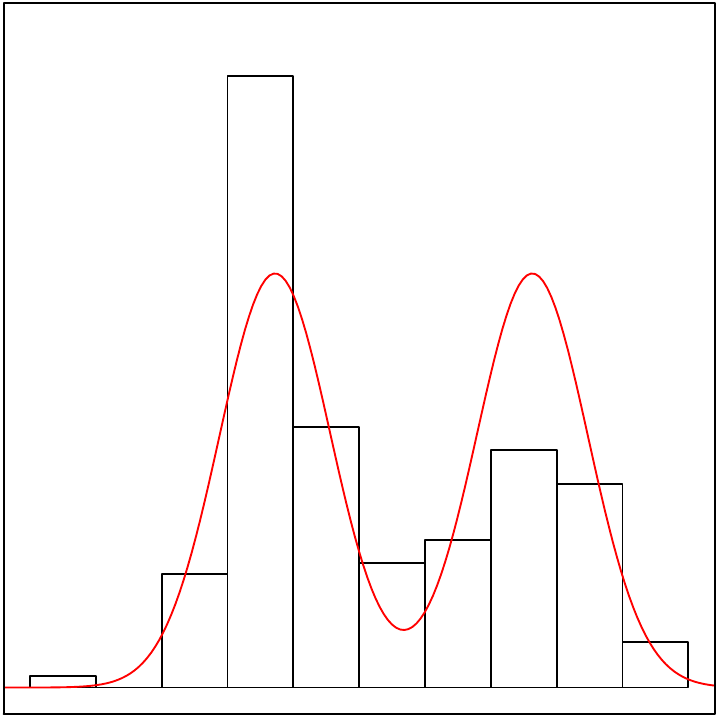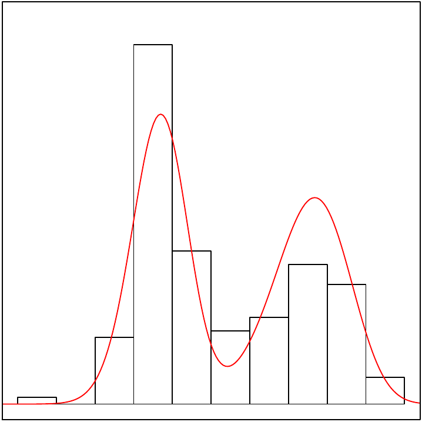</p>
<p>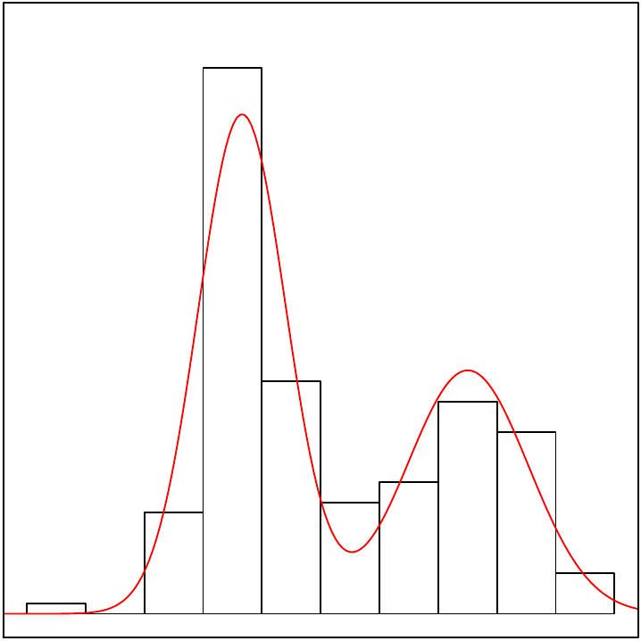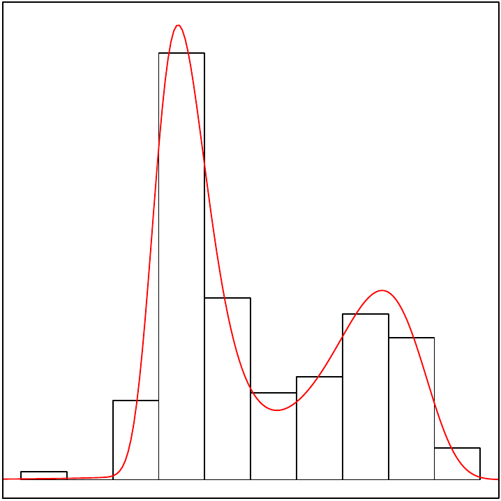</p>
<p>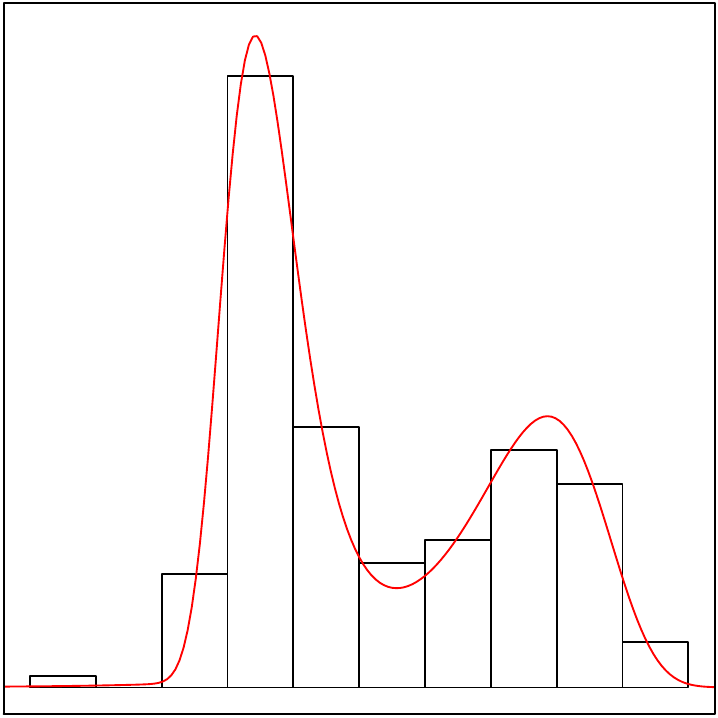</p>
<figcaption>Figure 2: <span><em>acidity</em></span> dataset: fitted
density plots from function <code>Manly.plot()</code>: <span
class="math inline"><em>K</em></span>-means (first row left), Manly
<span class="math inline"><em>K</em></span>-means (first row right),
Gaussian mixture (second row left), Manly mixture (second row right),
Manly forward (third row left) and Manly backward (third row
right).</figcaption>
</figure>

**Alternative coding c: wrapper function**

The wrapper function `Manly.model()` is capable of combining steps a and
b in one command. The following code directly yields the Manly F or
Manly B model:

``` r
MF <- Manly.model(X, K = 2, Gaussian = TRUE, initial = "k-means", 
                  nstart = 100, select = "forward", plot = TRUE, 
                  var1 = 1, main = "", ylim = c(0, 0.75), 
                  xlab = "", xaxt = "n", ylab = "", yaxt = "n", 
                  x.slice = 200, col = "red")
MB <- Manly.model(X, K = 2, Gaussian = FALSE, initial = "k-means", 
                  nstart = 100, select = "backward", plot = TRUE, 
                  var1 = 1, main = "", ylim = c(0, 0.75), 
                  xlab = "", xaxt = "n", ylab = "", yaxt = "n", 
                  x.slice = 200, col = "red")
```

The Manly F and Manly B density plots given in Figure [2](#fig.acidity)
are generated automatically.

# Demo examples {#sect4}

For users who need further information about the package, we have
constructed 16 demo examples listed in Table [3](#table.demo) that
provide a comprehensive demonstration of *ManlyMix* capabilities. Among
the examples, 11 of them are designed to demonstrate the capability and
utility of each function and 5 of them run comprehensive analysis of
classification datasets. Each demo can be accessed by its name and the
users can reproduce themselves.

As an illustration of how these demos can be employed, the code of the
first example can be approached through running the following code in R.

``` r
library(ManlyMix)
demo(EMalgorithm1)
```

::: {#table.demo}
  ------------------------------------------------------------------------------------------
  Function                 Demo example(s)
  ------------------------ -----------------------------------------------------------------
  `Manly.EM()`             `demo(EMalgorithm1)`, `demo(EMalgorithm2)`

  `Manly.select()`         `demo(ForwardSelection)`, `demo(BackwardSelection)`

  `Manly.Kmeans()`         `demo(ManlyKmeans1)`, `demo(ManlyKmeans2)`

  `Manly.overlap()`        `demo(Overlap)`

  `Manly.sim()`            `demo(DataSimulation)`

  `Manly.var()`            `demo(VarAssess)`

  `Manly.plot()`           `demo(DensityPlot)`, `demo(ContourPlot)`

  Comprehensive analysis   `demo(utility)`, `demo(ais)`, `demo(seeds)`, `demo(bankruptcy)`

                           `demo(acidity)`
  ------------------------------------------------------------------------------------------

  : Table 3: Summary of demo examples included in *ManlyMix*.
:::

# Summary {#sect5}

The R package *ManlyMix* is discussed and illustrated in detail. The
provided functions enable practitioners to analyze heterogeneous data
and conduct cluster analysis with Manly mixture models. The algorithms
behind functions are introduced and explained carefully. Illustrative
examples based on challenging real-life datasets are studied to
demonstrate the usefulness and efficiency of the package. Promising
results suggest that *ManlyMix* is not only a powerful package for
clustering and classification, but also a diagnostic tool to investigate
skewness and deviation from normality in data. Demo examples are
provided for each function in *ManlyMix* for the users to study.

# Appendix {#sect6}

The six competitors for mixture modeling of skewed data given in
Table [1](#table.exist) are applied to the *AIS* dataset in
Section [3.3](#ais), including $t$ mixture with Box-Cox transformation
(flowClust), scale skew-normal (SSN) and skew-$t$ (SST) mixtures,
restricted skew-normal (rMSN) and skew-$t$ (rMST) mixtures, and
unrestricted skew-$t$ mixture (uMST). All models are initialized by the
partition obtained by the traditional $K$-means clustering. The
algorithms stop when the stopping criterion meets the tolerance level of
$1e-5$. For more information about the behavior of different models, we
refer the reader to the recent paper by @zhuandmelnykov16, where a
comprehensive simulation study is conducted to compare model
performance.

Table [4](#table.ais2) provides model-based clustering results. The
number of parameters of the models are 20 (flowClust), 25 (SSN), 25
(SST), 25 (rMSN), 27 (rMST), and 27 (uMST). The computing times are
0.012, 1.553, 4.737, 0.024, 0.136, 3547.527, respectively. The BIC
values of the models are 3551.125, 3576.886, 3558.227, 3566.007,
3562.151, 3591.241. flowClust enjoys the lowest BIC value, which is
still higher than that of Manly B. uMST yields the lowest number of
misclassifications, which is as good as the full Manly mixture model and
Manly forward model.

::: {#table.ais2}
  ------- ------------------------- -------- -------------------- -------- -------------------- ---------
           [flowClust]{.underline}            [SSN]{.underline}             [SST]{.underline}   

   Group              1                2              1              2              1               2

     1             **99**              1            **99**           1            **99**            1

     2                8              **94**           7            **95**           5            **97**

             [rMSN]{.underline}               [rMST]{.underline}            [uMST]{.underline}  

   Group              1                2              1              2              1               2

     1             **100**             0            **99**           1            **98**            2

     2                8              **94**           6            **96**           2            **100**
  ------- ------------------------- -------- -------------------- -------- -------------------- ---------

  : Table 4: Classification tables for the *AIS* dataset. Rows and
  columns represent the true and estimated partitions, respectively. The
  bold font highlights correct classifications.
:::

# Acknowledgement {#sect7}

The research is partially funded by the University of Louisville EVPRI
internal research grant from the Office of the Executive Vice President
for Research and Innovation.
:::
