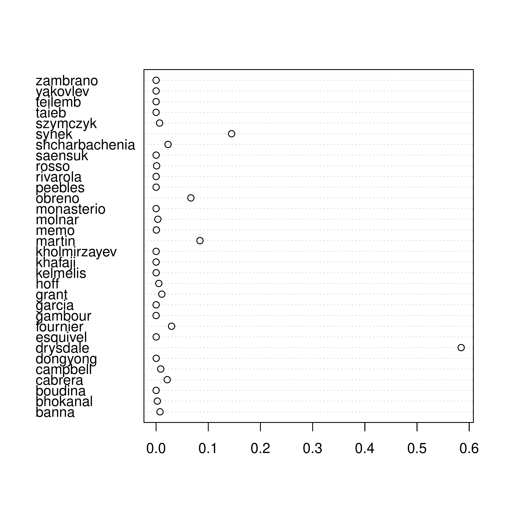
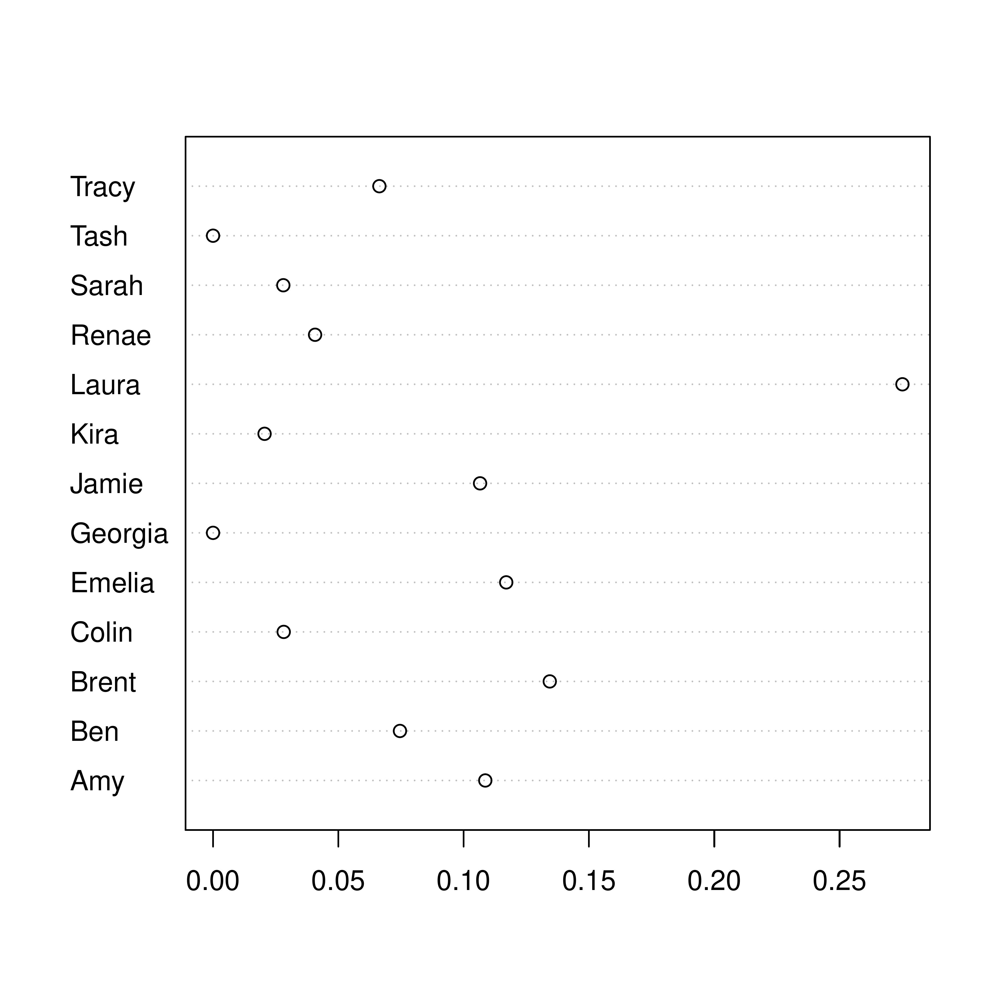

::: article
# Introduction: the Bradley-Terry model

The Bradley-Terry model for datasets involving paired comparisons has
wide uptake in the R community. However, existing functionality[^1] is
restricted to paired comparisons. The canonical problem is to
consider $n$ players who compete against one another; the basic
inference problem is to estimate
numbers $\mathbf{p}=\left({p_1,\ldots,p_n}\right)$, $p_i\geqslant 0$,
$\sum p_i=1$ which correspond to player "strengths". Information about
the $p_i$ may be obtained from the results of paired comparisons between
the players.

Applications are legion. The technique is widely used in a competitive
sport context [@turner2012], in which matches are held between two
opposing individuals or teams. It can also be applied to consumer choice
experiments in which subjects are asked to choose a favourite from among
two choices [@hatzinger2012], in which case the $p_i$ are known as
"worth parameters".

If player $i$ competes against player $j$, and wins with
probability $P_{ij}$ then the likelihood function for $p_1,\ldots p_n$
corresponding to a win for $i$ is $\frac{p_i}{p_i+p_j}$.
As [@turner2012] point out, this may be expressed as

$$\operatorname{logit}\left(P_{ij}\right)=\log p_i-\log p_j$$

and this fact may be used to estimate $\mathbf{p}$ using generalized
linear models. However, consider the case where three competitors, $i$,
$j$, and $k$ compete. The probability that $i$ wins is
then $\frac{p_i}{p_i+p_j+p_k}$ [@luce1959]; but there is no simple way
to translate this likelihood function into a GLM. However, working
directly with the likelihood function for $\mathbf{p}$ has several
advantages which are illustrated below. The resulting likelihood
functions may readily be generalized to accommodate more general order
statistics, as in a race. In addition, likelihood functions may be
specified for partial order statistics; also, observations in which a
*loser* is identified may be given a likelihood function using natural R
idiom in the package.

## Further generalizations

Observing the winner $w$ from a preselected set of
competitors $\mathcal{C}$ has a likelihood function
of $p_w/\sum_{i\in\mathcal{C}} p_i$. But consider a more general
situation in which two disjoint teams $\mathcal{A}$ and $\mathcal{B}$
compete; this would have likelihood $\sum_{i\in\mathcal{A}}
p_i/\sum_{i\in\mathcal{A}\cup\mathcal{B}} p_i$. Such datasets motivate
consideration of likelihood functions $\mathcal{L}\left(\cdot\right)$
with
$$\label{hyper2likelihood}
\mathcal{L}\left(\mathbf{p}\right)=
\prod_{s\in \mathcal{O}}\left({\sum_{i\in s}}p_i\right)^{n_s}   (\#eq:hyper2likelihood)$$
where $\mathcal{O}$ is a set of observations and $s$ a subset
of $\left[n\right]=\left\{1,2,\ldots,n\right\}$; numbers $n_s$ are
integers which may be positive or negative. The approach adopted by
the *hyperdirichlet* package  is to store each of the $2^n$ possible
subsets of $\left[n\right]$ together with an exponent:
$$\label{hyperdirichletlikelihood}
\prod_{s\in 2^{\left[n\right]}}\left({\sum_{i\in s}}p_i\right)^{n_s}.   (\#eq:hyperdirichletlikelihood)$$
but this was noted as being needlessly memory intensive and slow; it is
limited, in practice, to $n\leqslant 9$.

Consider, for example, the following inference problem. Suppose we wish
to make inferences about $p_1,\ldots,p_{20}$, the unknown parameters of
a multinomial distribution with classes $c_1,\ldots,c_{20}$; we demand
that $p_i\geqslant 0$ and $\sum
p_i=1$. If our observation is a *single* trial with result $c_1\cup c_2$
\[that is, the observation was known to be either $c_1$ or $c_2$\], then
a likelihood function might
be $\mathcal{L}_1\left(p_1,\ldots, p_{20}\right)=p_1+p_2$. However,
observe that this very simple example is not accessible to the
*hyperdirichlet* package, which would have to store $2^{20}>10^6$
powers, almost all of which are zero.

The *hyper2* package uses the obvious solution to this problem: work
with equation \@ref(eq:hyper2likelihood), rather than
equation \@ref(eq:hyperdirichletlikelihood) and store only nonzero
powers. However, this requires one to keep track of which subsets
of $\left[n\right]$ have nonzero powers. Suppose we wish to incorporate
subsequent observations into our likelihood function $p_1$. We might
observe two further independent trials, with results $c_1\cup c_2$
and $c_1\cup c_3$ respectively, having a
likelihood $\left(p_1+p_2\right)\left(p_1+p_3\right)$. Then a likelihood
function for all three trials might be $\mathcal{L}_2\left(p_1,\ldots,
p_{20}\right)=\left(p_1+p_2\right)^2\left(p_1+p_3\right)$.

One natural representation for the likelihood
function $\left(p_1+p_2\right)^2\left(p_1+p_3\right)$ would be as a
function mapping subsets of $\left\{1,2,\ldots,20\right\}$ to the real
numbers; in this case we would map the set $\left\{1,2\right\}$ to (the
power) 2, and map $\left\{1,3\right\}$ to 1. However, note that updating
our likelihood function from $\mathcal{L}_1$ to $\mathcal{L}_2$
increments the power of $p_1+p_2$: some mechanism for identifying that
the same sum appears in both marginal likelihood functions is needed.

# The *hyper2* package

One such mechanism is furnished by the `C++` Standard Template Library's
"map" class [@musser2009] to store and retrieve elements. In STL
terminology, a map is an associative container that stores values
indexed by a key, which is used to sort and uniquely identify the
values. In the package, the key is a (STL) `set` of strictly positive
integers $\leqslant n$. The relevant `typedef` statements are:

``` r
typedef set<unsigned int> bracket;
typedef map<bracket, double> hyper2;
```

Thus a `bracket` object is a set of (unsigned) integers---here a sum of
some $p_i$; and a `hyper2` object is a function that maps `bracket`
objects to real numbers---here their power. The following `C++`
pseudocode shows how the aforementioned likelihood function would be
created:

``` r
const bracket b1.insert({1,2});  // b1 = (p1+p2)
const bracket b2.insert({1,3});  // b2 = (p1+p3)

hyper2 L;       // L2 is the likelihood function

// first observation:
L[b1]  = 1;        // L = (p1+p2)

//second observation:
L[b1] += 1;        // L = (p1+p2)^2   # updating of existing map element
L[b2] += 1;        // L = (p1+p2)^2*(p1+p3)^1
```

In the `STL`, a map object stores keys and associated values in whatever
order the software considers to be most propitious. This allows faster
access and modification times but the order in which the maps, and
indeed the elements of a set, are stored is not defined. In the case of
likelihood functions such as Equation \@ref(eq:hyper2likelihood), this
is not an issue because both multiplication and addition are associative
and commutative operations. One side-effect of using this system is that
the order of the bracket-power key-value pairs is not preserved.

## The package in use

::: {#chess}
  ----------------------------------
   Topalov   Anand   Karpov   total
  --------- ------- -------- -------
     22       13       \-      35

     \-       23       12      35

      8       \-       10      18

     30       36       22      88
  ----------------------------------

  : Table 1: Results of 88 chess matches (dataset `chess` in the
  [*aylmer*](https://CRAN.R-project.org/package=aylmer)
  package [@hankin2008a]) between three Grandmasters; entries show
  number of games won up to 2001 (draws are discarded). Topalov beats
  Anand 22-13; Anand beats Karpov 23-12; and Karpov beats Topalov 10-8.
:::

Consider the `Chess` dataset of the *hyperdirchlet* package, in which
matches between three chess players are tabulated (Table [1](#chess)).
The Bradley-Terry model [@bradley1952] is appropriate here [@caron2012],
and the *hyper2* package provides a likelihood function for the
strengths of the players, $p_1,p_2,p_3$ with $p_1+p_2+p_3=1$. A
likelihood function might be
$$\frac{p_1^{30}p_2^{36}p_3^{22}}{
  \left(p_1+p_2\right)^{35}
  \left(p_2+p_3\right)^{35}
  \left(p_1+p_3\right)^{18}
  }.$$

Using the *hyper2* package, the R idiom to create this likelihood
function would be a two-stage process. The first step would be to
implement the numerator, that is the number of games won by each player:

``` r
R> library("hyper2")
R> chess <- hyper2(list(1, 2, 3), c(30, 36, 22))
R> chess
```

``` r
p1^30 * p2^36 * p3^22
```

Thus the `chess` object has the correct number of players (three), and
has the numerator recorded correctly. To specify the denominator, which
indicates the number of matches played by each pair of players, the
package allows the following natural idiom:

``` r
R> chess[c(1, 2)] <- -35
R> chess[c(2, 3)] <- -35
R> chess[c(1, 3)] <- -18
R> chess
```

``` r
p1^30 * (p1 + p2)^-35 * (p1 + p3)^-18 * p2^36 * (p2 + p3)^-35 * p3^22
```

Note how the terms appear in an essentially random order, a side-effect
of the efficient map class. It is sometimes desirable to name the
elements explicitly:

``` r
R> pnames(chess) <- c("Topalov", "Anand", "Karpov")
R> chess
```

``` r
Topalov^30 * (Topalov + Anand)^-35 * (Topalov + Karpov)^-18 * Anand^36
* (Anand + Karpov)^-35 * Karpov^22
```

The package can calculate log-likelihoods:

``` r
R> loglik(chess, c(1/3, 1/3))
```

``` r
[1] -60.99695
```

\[the second argument of function `loglik()` is a vector of length 2,
third element of $\mathbf{p}$ being the "fillup"
value [@aitchison1986]\]; the gradient of the log-likelihood is given by
function `gradient()`:

``` r
R> gradient(chess, c(1/3, 1/3))
```

``` r
[1] 24.0 16.5
```

Such functionality allows the rapid location of the maximum likelihood
estimate for $\mathbf{p}$:

``` r
R> maxp(chess)
```

``` r
  Topalov     Anand    Karpov 
0.4036108 0.3405168 0.2558723 
```

# Men's single sculling in the 2016 Summer Olympic Games

In this section, I will take results from the 2016 Summer Olympic Games
and create a likelihood function for the finishing order in Men's single
sculling. In Olympic sculling, up to six individual competitors race a
small boat called a scull over a course of length 2 km; the object is to
cross the finishing line first. Note that actual timings are irrelevant,
given the model, as the sufficient statistic is the order in which
competitors cross the finishing line. The 2016 Summer Olympics is a case
in point: the gold and silver medallists finished less than 5
milliseconds apart, corresponding to a lead of $\sim 2.5\,\mathrm{cm}$.
Following @luce1959, the probability of competitor $i$ winning in a
field of $j=1,\ldots, n$ is

$$\frac{p_i}{p_1+\cdots +p_n}.$$

However, there is information in the whole of the finishing order, not
just the first across the line. Once the winner has been identified,
then the runner-up may plausibly be considered to be the winner among
the remaining competitors; and so on down the finishing order. Without
loss of generality, if the order of finishing were $1,2,3,4,5,6$, then a
suitable likelihood function would be, following [@plackett1975]:
$$\label{competitors_1_to_6_likelihood}
\frac{p_1}{p_1+p_2+p_3+p_4+p_5+p_6}\cdot
\frac{p_2}{p_2+p_3+p_4+p_5+p_6}\cdot
\frac{p_3}{p_3+p_4+p_5+p_6}\cdot
\frac{p_4}{p_4+p_5+p_6}\cdot
\frac{p_5}{p_5+p_6}\cdot
\frac{p_6}{p_6}   (\#eq:competitors-1-to-6-likelihood)$$
The result of heat 1 may be represented as
$$\mathrm{fournier}\succ
\mathrm{cabrera}\succ
\mathrm{bhokanal}\succ
\mathrm{saensuk}\succ
\mathrm{kelmelis}\succ
\mathrm{teilemb}$$
(a full list of the finishing order for all 25 events is given in the
package as `rowing.txt`). The first step to incorporating the whole
finishing order into a likelihood function is to define a `hyper2`
object which stores the names of the participants:

``` r
R> data("rowing")
R> H <- hyper2(pnames = allrowers)
R> H
```

``` r
(banna + bhokanal + boudina + cabrera + campbell + dongyong + drysdale
+ esquivel + fournier + gambour + garcia + grant + hoff + kelmelis +
khafaji + kholmirzayev + martin + memo + molnar + monasterio + obreno +
peebles + rivarola + rosso + saensuk + shcharbachenia + synek +
szymczyk + taieb + teilemb + yakovlev + zambrano)^0
```

Observe that the resulting likelihood function is uniform, as no
information has as yet been included. Incorporating the information from
Heat 1 into a likelihood function corresponding to
Equation \@ref(eq:competitors-1-to-6-likelihood) is straightforward
using the `order_likelihood()` function:

``` r
R> heat1 <- c("fournier", "cabrera", "bhokanal", "saensuk",
+   "kelmelis", "teilemb")
R> H <- H + order_likelihood(char2num(heat1, allrowers))
R> H
```

``` r
bhokanal * (bhokanal + cabrera + fournier + kelmelis + saensuk +
teilemb)^-1 * (bhokanal + cabrera + kelmelis + saensuk + teilemb)^-1 *
(bhokanal + kelmelis + saensuk + teilemb)^-1 * cabrera * fournier *
kelmelis * (kelmelis + saensuk + teilemb)^-1 * (kelmelis + teilemb)^-1
* saensuk
```

(variable `heat1` shows the finishing order for Heat 1). Again observe
that object `H` includes its terms in no apparent order. Although it
would be possible to incorporate information from subsequent heats in a
similar manner, the package includes a ready-made dataset, `sculls2016`:

``` r
R> head(sculls2016)
```

``` r
banna^4 * (banna + boudina + cabrera + molnar + obreno + rivarola)^-1 *
(banna + boudina + cabrera + molnar + rivarola)^-1 * (banna + boudina +
molnar + rivarola)^-1 * (banna + cabrera + campbell + grant + hoff)^-1
* (banna + cabrera + campbell + grant + hoff + szymczyk)^-1
```

Finding the maximum likelihood estimate for the
parameter $p_\mathrm{banna},\ldots,p_\mathrm{zambrano}$ is
straightforward using the `maxp()` function, provided with the
package (Figure [1](#maxp_sculls2016)). The optimization routine has
access to derivatives which means that the estimate is found very
quickly.

<figure id="maxp_sculls2016">
<div class="sourceCode" id="cb1"><pre class="sourceCode r"><code class="sourceCode r"><span id="cb1-1"><a href="#cb1-1" aria-hidden="true" tabindex="-1"></a>R<span class="sc">&gt;</span> <span class="fu">dotchart</span>(<span class="fu">maxp</span>(sculls2016))</span></code></pre></div>

<figcaption>Figure 1: Maximum likelihood estimate for the strengths of
the 32 competitors<span id="maxp_sculls2016"
label="maxp_sculls2016"></span> in the Men’s singles sculls in the 2016
Summer Olympics.</figcaption>
</figure>

Figure [1](#maxp_sculls2016) shows very clearly that the competitor with
the highest strength is Drysdale, the gold medallist for this event. The
bronze and silver medallists were Synek and Martin respectively, whose
estimated strengths were second and third highest in the field.

# MasterChef Australia

MasterChef Australia is a game show in which amateur cooks compete for a
title [@wikipedia_masterchef2017]. From a statistical perspective the
contest is interesting because the typical show format is to identify
the *weakest* player, who is then eliminated from the competition. Here,
results from MasterChef Australia
Series 6 [@wikipedia_masterchef_australia_series6] will be analysed; an
extended discussion of the data used is given in the package
at `masterchef.Rd`.

We wish to make inferences about the contestents' generalized
Bradley-Terry strengths $p_1,\ldots,p_n$, $\sum p_i=1$. One informative
event was a team challenge in which the contestants were split randomly
into two teams, red and blue:

``` r
R> team_red <- c("Jamie", "Tracy", "Ben", "Amy", "Renae", "Georgia")
R> team_blue <- c("Brent", "Laura", "Emelia", "Colin", "Kira", "Tash")
```

We may represent the fact that the red team won as
$$\label{redteamwon}
\left\{
\mbox{Jamie}+\mbox{Tracy}+\mbox{Ben}+
\mbox{Amy}+\mbox{Renae}+\mbox{Georgia}
\right\}
\succ
\left\{
\mbox{Brent}+\mbox{Laura}+\mbox{Emelia}+
\mbox{Colin}+\mbox{Kira}+\mbox{Tash}
\right\}.   (\#eq:redteamwon)$$

A plausible likelihood function can be generated using the standard
assumption [@hankin2010] that the competitive strength of a team is the
sum of the strengths of its members. The likelihood function for the
observation given in Equation \@ref(eq:redteamwon) would then be
$$\label{redbluelikelihood}
\frac{p_\mathrm{Jamie}+p_\mathrm{Tracy}+p_\mathrm{Ben}+p_\mathrm{Amy}+p_\mathrm{Renae}+p_\mathrm{Georgia}}{
p_\mathrm{Jamie}+p_\mathrm{Tracy}+p_\mathrm{Ben}+p_\mathrm{Amy}+p_\mathrm{Renae}+p_\mathrm{Georgia}+p_\mathrm{Brent}+p_\mathrm{Laura}+p_\mathrm{Emelia}+p_\mathrm{Colin}+p_\mathrm{Kira}+p_\mathrm{Tash}}.   (\#eq:redbluelikelihood)$$

To generate a likelihood function in R, we need to set up a `hyper2`
object with appropriate contestants:

``` r
R> H <- hyper2(pnames = c(
+    "Amy", "Ben", "Brent", "Colin", "Emelia",
+    "Georgia", "Jamie", "Kira", "Laura", "Renae",
+    "Sarah", "Tash", "Tracy"))
R> H
```

``` r
(Amy + Ben + Brent + Colin + Emelia + Georgia + Jamie + Kira + Laura +
Renae + Sarah + Tash + Tracy)^0
```

Object `H` is a uniform likelihood function. The package R idiom for
incorporating likelihood from Equation \@ref(eq:redbluelikelihood) is
straightforward and natural:

``` r
R> H[team_red] <- +1
R> H[c(team_red, team_blue)] <- -1
R> H
```

``` r
(Amy + Ben + Brent + Colin + Emelia + Georgia + Jamie + Kira + Laura +
Renae + Tash + Tracy)^-1 * (Amy + Ben + Georgia + Jamie + Renae +
Tracy)
```

(Sarah did not take part). The above idiom makes it possible to define
likelihoods for observations that have a peculiar probability structure,
and I give two examples below.

One event involved eight competitors who were split randomly into four
teams of two. The show format was specified in advance as follows: The
teams were to be judged, and placed in order. The two top teams were to
be declared safe, and the other two teams sent to an elimination trial
from which an individual winner and loser were identified, the loser
being obliged to leave the competition. The format for this event is
also typical in MasterChef.

The observation was that Laura and Jamie's team won, followed by Emelia
and Amy, then Brent and Tracy. Ben and Renae's team came last:
$$\left\{{\mathrm{Laura}  + \mathrm{Jamie}}\right\}\succ
\left\{{\mathrm{Emelia} + \mathrm{Amy}  }\right\}\succ
\left\{{\mathrm{Brent}   + \mathrm{Tracy}}\right\}\succ
\left\{{\mathrm{Ben}    + \mathrm{Renae}}\right\}.$$

Again assuming that the team strength is the sum of its members'
strengths, a likelihood function for this observation may be obtained by
using the order statistic technique of [@plackett1975]:
$$\begin{aligned}
\label{blueyellowgreenred}
\frac{p_\mathrm{Laura}+p_\mathrm{Jamie}
}{
  p_\mathrm{Laura}  + p_\mathrm{Jamie} + 
  p_\mathrm{Emelia} + p_\mathrm{Amy}   +
  p_\mathrm{Brent}  + p_\mathrm{Tracy} +
  p_\mathrm{Ben}    + p_\mathrm{Renae}
  }\cdot\nonumber\\
\frac{
  p_\mathrm{Emelia} + p_\mathrm{Amy} 
}{
  p_\mathrm{Emelia} + p_\mathrm{Amy}   +
  p_\mathrm{Brent}  + p_\mathrm{Tracy} +
  p_\mathrm{Ben}    + p_\mathrm{Renae}
  }\cdot
\frac{
  p_\mathrm{Brent}  + p_\mathrm{Tracy}
}{  
  p_\mathrm{Brent}  + p_\mathrm{Tracy} +
  p_\mathrm{Ben}    + p_\mathrm{Renae}
  }
\end{aligned}   (\#eq:blueyellowgreenred)$$
and we would like to incorporate information from this observation into
object `H`, which is a likelihood function for the two-team challenge
discussed above. The corresponding package idiom is natural:

``` r
R> blue   <- c("Laura", "Jamie")   
R> yellow <- c("Emelia", "Amy")    
R> green  <- c("Brent", "Tracy")   
R> red    <- c("Ben", "Renae")
```

(the teams were randomly assigned a colour). We may now generate a
likelihood function for the observation that the order of teams was
blue, yellow, green, red, as per Equation \@ref(eq:blueyellowgreenred):

``` r
R> H[blue] <- 1
R> H[c(blue, yellow, green, red)] <- -1
R> H[yellow] <- 1
R> H[c(yellow, green, red)] <- -1
R> H[green] <- 1
R> H[c(green, red)] <- -1
R> H
```

``` r
(Amy + Ben + Brent + Colin + Emelia + Georgia + Jamie + Kira + Laura +
Renae + Tash + Tracy)^-1 * (Amy + Ben + Brent + Emelia + Jamie + Laura
+ Renae + Tracy)^-1 * (Amy + Ben + Brent + Emelia + Renae + Tracy)^-1 *
(Amy + Ben + Georgia + Jamie + Renae + Tracy) * (Amy + Emelia) * (Ben +
Brent + Renae + Tracy)^-1 * (Brent + Tracy) * (Jamie + Laura)
```

We may incorporate subsequent observations relating to the elimination
trial among the four competitors comprising the losing two teams. The
observation was that Laura won, and Renae came last, being eliminated.
We might write
$$\label{renae_eliminated}
\left\{
\mbox{Laura}
\right\}
\succ
\left\{{\mbox{Brent},\mbox{Tracey},\mbox{Ben}}\right\}
\succ
\left\{\mbox{Renae}\right\},   (\#eq:renae-eliminated)$$
which indicates that Laura came first, then Brent/Tracey/Ben in some
order, then Renae came last. For this observation a likelihood function,
following [@critchlow1985], might be
$$\begin{aligned}
  \mathcal{L}\left({p_1,p_2,p_3,p_4,p_5}\right) &=
  \operatorname{Prob}\left({
    p_1\succ p_2\succ p_3\succ p_4\succ p_5
    \cup
    p_1\succ p_2\succ p_4\succ p_3\succ p_5
    \cup\ldots
  }\right)\\ \label{ggolmath}
  &=\operatorname{Prob}\left({\bigcup_{\left[{abc}\right]} p_1\succ p_a\succ p_b\succ p_c\succ p_5
  }\right)\\ \nonumber
  &=    \frac{p_1}{p_1+p_2+p_3+p_4+p_5}\cdot\frac{p_2}{p_2+p_3+p_4+p_5}\cdot\frac{p_3}{p_3+p_4+p_5}\cdot\frac{p_4}{p_4+p_5}\\ \nonumber
  &{\qquad+}\frac{p_1}{p_1+p_2+p_4+p_3+p_5}\cdot\frac{p_2}{p_2+p_4+p_3+p_5}\cdot\frac{p_4}{p_4+p_3+p_5}\cdot\frac{p_3}{p_3+p_5}\\ \nonumber
  &{\qquad{}+}\frac{p_1}{p_1+p_3+p_2+p_4+p_5}\cdot\frac{p_3}{p_3+p_2+p_4+p_5}\cdot\frac{p_2}{p_2+p_4+p_5}\cdot\frac{p_4}{p_4+p_5}\\ \nonumber
  &{\qquad{}+}\cdots
\end{aligned}   (\#eq:ggolmath)$$
where Laura's strength is shown as $p_1$ etc for brevity. The R idiom is
as follows:

``` r
R> L <- ggol(H, 
+    winner     = "Laura",
+    btm4       = c("Brent", "Tracy", "Ben"),
+    eliminated = "Renae")
```

Arguments to `ggol()` are disjoint subsets of the players, the subsets
themselves being passed in competition order from best to worst. Object
`L` includes information from the team challenge (via first argument
`H`) and the elimination results. It is a list of length $3!=6$ objects
of class `hyper2`, each of which gives a @luce1959 likelihood function
for a consistent total ordering of the competitors.

A final example (taken from MasterChef series 8, week 10) is given as a
generalization of the @luce1959 likelihood. The format was as follows.
Eight contestents were split randomly into four teams of two, the top
two teams being declared safe. Note that the likelihood interpretation
differs from the previous team challenge, in which the observation was
an unambiguous team ranking: here, there is only a partial ranking of
the teams and one might expect this observation to be less informative.
Without loss of generality, the result may be represented as
$$\left\{{p_1+p_2,p_3+p_4}\right\}\succ
\left\{{p_5+p_6,p_7+p_8}\right\}$$
and a likelihood function on $p_1,\ldots p_8$ for this observation might
be
$$\begin{aligned}
  \mathcal{L}\left( {p_1,\ldots, p_8} \right) &=
  \operatorname{Prob}\left({
    \left\{ {p_1+p_2} \right\}\succ 
    \left\{ {p_3+p_4} \right\}\succ 
    \left\{ {p_5+p_6} \right\}\succ 
    \left\{ {p_7+p_8} \right\} \cup\vphantom{\bigcup}
  }\right. \nonumber\\
  &\qquad \left.{
    \left\{ {p_1+p_2} \right\}\succ 
    \left\{ {p_3+p_4} \right\}\succ 
    \left\{ {p_7+p_8} \right\}\succ 
    \left\{ {p_5+p_6} \right\}\cup
  }\right.\nonumber\\
  &\qquad \left.{
    \left\{ {p_3+p_4} \right\}\succ 
    \left\{ {p_1+p_2} \right\}\succ 
    \left\{ {p_5+p_6} \right\}\succ 
    \left\{ {p_7+p_8} \right\}\cup
  }\right.\nonumber\\
  &\qquad \left.{
    \left\{ {p_3+p_4} \right\}\succ 
    \left\{ {p_1+p_2} \right\}\succ 
    \left\{ {p_5+p_6} \right\}\succ 
    \left\{ {p_7+p_8} \right\}\vphantom{\bigcup}
  }\right)\\
&=\frac{p_1+p_2}{p_1+p_2+p_3+p_4+p_5+p_6+p_7+p_8}\cdot
  \frac{p_3+p_4}{p_3+p_4+p_5+p_6+p_7+p_8}\cdot\frac{p_5+p_6}{p_5+p_6+p_7+p_8}\nonumber\\
&{}\qquad+\cdots+\nonumber\\
&{}\frac{p_3+p_4}{p_3+p_4+p_1+p_2+p_7+p_8+p_5+p_6}\cdot
  \frac{p_1+p_2}{p_3+p_4+p_7+p_8+p_5+p_6}\cdot\frac{p_7+p_8}{p_7+p_8+p_5+p_6}.\nonumber\\
\nonumber
\end{aligned}$$

## Maximum likelihood estimation

The package provides an overall likelihood function for all informative
judgements in the series on the final 13 players in object
`masterchef_series6`. We may assess a number of related hypotheses using
the package. The first step is to calculate the likelihood for the
hypothesis that all players are of equal strength:

``` r
R> data("masterchef")
R> n <- 13   
R> equal_strengths <- rep(1/n,n-1)
R> like_series(equal_strengths, masterchef_series6)
```

``` r
[1] -78.68654
```

The strengths of the 13 players may be estimated using standard maximum
likelihood techniques. This requires constrained optimization in order
to prevent the search from passing through inadmissible points in
p-space:

``` r
R> UI <- rbind(diag(n-1), -1)  
R> CI <- c(rep(0, n-1), -1)    
R> constrOptim(
+    theta = equal_strengths,
+    f = function(p){-like_series(p, L)}, 
+    ui = UI, ci = CI,
+    grad = NULL)
```

<figure id="masterchef6">
<div class="sourceCode" id="cb1"><pre class="sourceCode r"><code class="sourceCode r"><span id="cb1-1"><a href="#cb1-1" aria-hidden="true" tabindex="-1"></a>R<span class="sc">&gt;</span> pmax_masterchef6</span></code></pre></div>
<div class="sourceCode" id="cb2"><pre class="sourceCode r"><code class="sourceCode r"><span id="cb2-1"><a href="#cb2-1" aria-hidden="true" tabindex="-1"></a>         Amy          Ben        Brent        Colin       Emelia      Georgia </span>
<span id="cb2-2"><a href="#cb2-2" aria-hidden="true" tabindex="-1"></a><span class="fl">1.086182e-01</span> <span class="fl">7.457970e-02</span> <span class="fl">1.343553e-01</span> <span class="fl">2.819606e-02</span> <span class="fl">1.169766e-01</span> <span class="fl">6.850455e-09</span> </span>
<span id="cb2-3"><a href="#cb2-3" aria-hidden="true" tabindex="-1"></a>       Jamie         Kira        Laura        Renae        Sarah         Tash </span>
<span id="cb2-4"><a href="#cb2-4" aria-hidden="true" tabindex="-1"></a><span class="fl">1.065412e-01</span> <span class="fl">2.055794e-02</span> <span class="fl">2.750621e-01</span> <span class="fl">4.070643e-02</span> <span class="fl">2.803893e-02</span> <span class="fl">1.142094e-09</span> </span>
<span id="cb2-5"><a href="#cb2-5" aria-hidden="true" tabindex="-1"></a>       Tracy </span>
<span id="cb2-6"><a href="#cb2-6" aria-hidden="true" tabindex="-1"></a><span class="fl">6.636755e-02</span> </span></code></pre></div>
<div class="sourceCode" id="cb3"><pre class="sourceCode r"><code class="sourceCode r"><span id="cb3-1"><a href="#cb3-1" aria-hidden="true" tabindex="-1"></a>R<span class="sc">&gt;</span> <span class="fu">dotchart</span>(pmax_masterchef6)</span></code></pre></div>

<figcaption>Figure 2: Maximum likelihood estimate for the strengths of
the top 13 competitors<span id="masterchef6" label="masterchef6"></span>
in Series 6 of <em>MasterChef Australia</em>. </figcaption>
</figure>

In the above code, `UI` enforces $p_i\geqslant 0$ and `CI`
enforces $p_1+\cdots +p_{n-1}\leqslant 1$. The resulting maximum
likelihood estimate, `pmax_masterchef6` in the package, is shown
pictorially in Figure [2](#masterchef6). The support at the
precalculated evaluate is

``` r
R> like_series(indep(pmax_masterchef6), masterchef_series6)
```

``` r
[1] -66.19652
```

and this allows us to test the hypothesis of equal player strengths: by
Wilks's theorem [@wilks1938] the quantity $-2\log\Lambda$
(where $\Lambda$ is the likelihood ratio) has an asymptotic null
distribution of $\chi^2_{12}$. This corresponds to a $p$-value of

``` r
R> pchisq(2*(78.7-66.2), df = 12, lower.tail = FALSE)
```

``` r
[1] 0.01482287
```

showing that the observations do constitute evidence for differential
player strengths. Figure [2](#masterchef6) suggests that Laura, the
runner-up, is actually a stronger competitor than the winner, Brent. We
may assess this statistically by finding the maximum likelihood
for ${\mathbf p}$, subject to the constraint
that $p_\mathrm{Laura}\leqslant p_\mathrm{Brent}$:

``` r
R> UI <- rbind(UI, c(0, 0, 1, 0, 0, 0, 0, 0, -1, 0, 0, 0, 0))  
R> CI <- c(CI, 0)
R> ans2 <-
+    constrOptim(
+      theta = equal_strengths,
+      f = function(p){-like_series(p, masterchef_series6)},  
+      grad = NULL,
+      ui = UI, ci = CI)
```

(updated object `UI` represents the constraint that Brent's strength
exceeds that of Laura). In the package, object
`pmax_masterchef6_constrained` is included as the result of the above
optimization, at which point the likelihood is

``` r
R> like_series(indep(pmax_masterchef6_constrained), masterchef_series6)
```

``` r
[1] -67.37642
```

The two estimates differ by about $1.18$, less than the
two-units-of-support criterion of @edwards1992; alternatively, one may
observe that the likelihood ratio is not in the tail region of its
asymptotic distribution ($\chi^2_1$) as the $p$-value is about 0.12.
This shows that there is no strong evidence for Laura's competitive
strength being higher than that of Brent. Similar techniques can be used
to give a profile likelihood function; the resulting support interval
for Laura's strength is $\left[{0.145,0.465}\right]$, which does not
include $\frac{1}{13}\simeq 0.077$, the mean player strength.

However, further work would be needed to make statistically robust
inferences from these findings. Suppose, for example, that all
competitors have equal competitive ability: then all the $p_i$ are
identical, and players are exchangeable. Under these circumstances, one
could run a tournament and identify a winner. One might expect that the
winning player would have the highest $p_i$ as estimated by `pmax()`. It
is not clear at this stage how to interpret likelihood functions for
players conditional on their competition performance. Another issue
would be the applicability of Wilks's theorem [@wilks1938] which states
only that the *asymptotic* distribution of $-2\log\Lambda$ is
chi-squared. Although the likelihood ratio statistic is inherently
meaningful, its sampling distribution is not clear at this stage.

# Conclusions

Several generalizations of Bradley-Terry strengths are appropriate to
describe competitive situations in which order statistics are
sufficient.

The `hyper2` package is introduced, providing a suite of functionality
for generalizations of the partial rank analysis of [@critchlow1985].
The software admits natural R idiom for translating commonly occurring
observations into a likelihood function.

The package is used to calculate maximum likelihood estimates for
generalized Bradley-Terry strengths in two competitive situations:
Olympic rowing, and *MasterChef Australia*. The estimates for the
competitors' strengths are plausible; and several meaningful statistical
hypotheses are assessed quantitatively.
:::

[^1]: In theory, the deprecated *hyperdirichlet* package [@hankin2010]
    provides similar functionality but it is slow and inefficient. It is
    limited to a small number of players and cannot cope with the
    examples considered here, and is superceded by
    [*hyper2*](https://CRAN.R-project.org/package=hyper2), which was
    originally called *hyperdirichlet2*.
