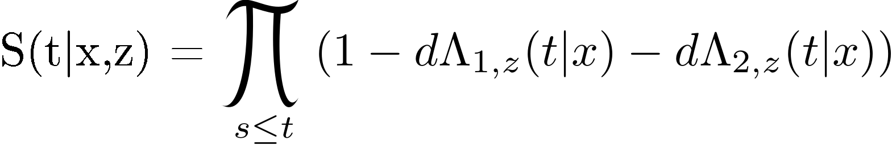

::: article
# Introduction {#sec:org015f31f}

Predictions of hazards and risks based on a Cox regression analysis need
to be fast and memory efficient, especially in large data, in simulation
studies, and for cross-validation or bootstrap loops. The CRAN task view
[*Survival*](https://CRAN.R-project.org/view=Survival) lists many R
packages implementing the Cox regression model and extensions thereof.
Among the most popular routines are the function `coxph()` from the
[***survival***](https://CRAN.R-project.org/package=survival) package
[@PKGsurvival] and the function `cph()` from the
[***rms***](https://CRAN.R-project.org/package=rms) package [@PKGrms].
We present a fast and memory efficient algorithm to extract baseline
hazards and predicted risks with confidence intervals from an object
obtained with either of these functions.

In the presence of competing risks one needs to combine at least two Cox
regression models to predict the absolute risk of an event (cumulative
incidence) conditional on covariates [@benichou1990estimates]. We
present the `CSC()`-function of the R package
[***riskRegression***](https://CRAN.R-project.org/package=riskRegression)
which fits the Cox regression models using either `coxph()` or `cph()`.
We also present a concomitant `predict()` S3 method which computes the
absolute risks of the event of interest for given combinations of
covariate values and time points. Optionally, the `predict()` method
computes asymptotic confidence intervals and confidence bands for the
predicted absolute risks. We review the formula behind the estimators
implemented and illustrate the R interface.

It is possible to obtain the predictions of absolute risks based on
cause-specific Cox regression also with the ***survival*** package or
with the [***mstate***](https://CRAN.R-project.org/package=mstate)
package [@PKGmstate]. However, both require more work from the user.
Finally, it should be noted that there are alternative regression
methods for absolute risks in the presence of competing risks such as
Fine-Gray regression [@FineGray1999] or direct binomial regression
[@gerds2012absolute; @scheike2008predicting].

## Data used for examples {#sec:org31b9328}

For the sole purpose of illustration we use the `Melanoma` data set
which is included in the ***riskRegression*** package. It contains data
from 205 malignant melanoma patients. Among the risk factors for cancer
specific death were patient age and sex and the histological variables
tumor thickness, invasion (levels 0,1,2), and epithelioid cells (no
present vs. present). Within the limitation of the follow-up periods, it
was observed that 57 patients had died from cancer ("status" equals 1)
and 14 had died from other causes ("status" equals 2). The remaining
patients were right censored ("status" equals 0).

``` r
library(riskRegression, verbose = FALSE, quietly = TRUE)
library(survival)
data(Melanoma)
str(Melanoma)
```

``` r
## 'data.frame': 205 obs. of  7 variables:
##  $ time     : int  10 30 35 99 185 204 210 232 232 279 ...
##  $ status   : int  3 3 2 3 1 1 1 3 1 1 ...
##  $ sex      : int  1 1 1 0 1 1 1 0 1 0 ...
##  $ age      : int  76 56 41 71 52 28 77 60 49 68 ...
##  $ year     : int  1972 1968 1977 1968 1965 1971 1972 1974 1968 1971 ...
##  $ thickness: num  6.76 0.65 1.34 2.9 12.08 ...
##  $ ulcer    : int  1 0 0 0 1 1 1 1 1 1 ...
```

# Predicting absolute risks based on cause-specific Cox regression {#sec:orgcc2f35e}

We denote by $T$ the time between a baseline date and the date of an
event and by $D\in\{1,...,K\}$ the cause of the event. We assume that
$\{D=1\}$ is the event of interest. Let $X=(X^{1},
\dots,X^{p})$ be a $p$-dimensional vector of baseline covariates with
arbitrary distribution, and $Z=(Z^1,\dots,Z^{q})$ be the strata
variables, i.e. a set of categorical baseline covariates with finitely
many possible values. Without loss of generality and to ease the
notation we set $q=1$. We use $\{1,\dots,L\}$ for the categories of $Z$.

We consider a setting in which the event time $T$ is right censored at a
random time $C$. We assume that $C$ is conditionally independent of $T$
given $(X,Z)$ and fix a time $\tau$ such that almost surely
$\mathrm P(C>\tau|X,Z)>0$. We denote $\tilde T=\min(T,C)$,
$\tilde D = \Delta D$, and $\Delta=1\{T\le C\}$.

## Cause-specific Cox regression {#sec:orgeebcda8}

Given covariates $(X,Z)$, let $S_0(t|x,z)=P(T>t|X=x,Z=z)$ denote the
event-free survival function and $F_j(t|x,z)=P(T\le t,
D=j|X=x,Z=z)$ the cumulative incidence function for event $j$. The
cause-specific hazard rates are defined as $\lambda_{j,z}(t|x)=\mathrm d
F_j(t|x,z)/S_0(t|x,z)$ [@abgk]. We also denote the cumulative hazard
rates by $\Lambda_{j,z}(t|x)=\int_0^t\lambda_{j,z}(s|x)\mathrm d
s$. The stratified Cox regression model [@Cox] for cause $j$ is given by
$$\label{sHazard}
\lambda_{j,z}(t|x)=
\lambda_{0j,z}(t)\exp(x\beta_j),   (\#eq:sHazard)$$
where $\beta_j={(\beta_j^1,\dots,\beta_j^p)}^\intercal$ is a
$p$-dimensional vector of regression coefficients (the log-hazard
ratios), and $\{\lambda_{0j,z}(t): z=1,\dots,L\}$ a set of unspecified
baseline hazard functions.

## Predicting the absolute risk of an event {#sec:orgde8de43}

The cause-specific Cox regression models can be combined into a
prediction of the absolute risk of an event of type $1$ until time $t$
conditional on the covariates $x,z$. For the case where $K=2$ the
absolute risk formula of [@benichou1990estimates] is given by:
$$\label{absRisk}
F_1 (t|x,z)=\int_0^t S(s-|x,z)\lambda_{1,z}(s|x) \mathrm ds.   (\#eq:absRisk)$$
where $s-$ denotes the right sided limit,
e.g. $\Lambda_{1,z}(s-|x)=lim_{v \rightarrow s,
v<s}\Lambda_{1,z}(v|x)$. The absolute risk accumulates over time the
product between the event-free survival and the hazard of experiencing
the event of interest, both conditional to the baseline covariates and
to the strata variable. The event free survival can be estimated from
the cause-specific hazards using the product integral estimator:

{width="65.0%" alt="graphic without alt text"} 

or the exponential approximation:
$$\label{survivalEXP}
	\widehat{S}(t|x,z)=\exp \bigg[ - \widehat{\Lambda}_{1,z}(t|x) - \widehat{\Lambda}_{2,z}(t|x)\bigg].   (\#eq:survivalEXP)$$
which is asymptotically equivalent to the product-limit estimator if the
distribution of the event times is continuous. Using the product
integral estimator ensures that $S(t|x,z)+F_1(t|x,z)+F_2(t|x,z)$ equals
exactly $1$. This is a desirable property since the sum of the
transition probabilities over all possible transitions should sum to
one.

Formula \@ref(eq:absRisk) generalizes to situations with more than 2
competing risks, i.e., $K>2$. However, in applications with many
competing risks there will sometimes be few events of specific causes,
and it may be hard to fit a Cox regression model for each cause
separately. One possibility when $K>2$ is to combine all causes where
$\tilde D>1$ into a single competing risk for the cause of interest
$\tilde D=1$. While the ***riskRegression*** package allows the use of
more than 2 competing risks, we will illustrate its use considering only
2 competing risks . The package implements formula \@ref(eq:absRisk) in
two steps.

### Step 1: estimation of the cause-specific hazards {#sec:orgef3457e}

The first step is to fit the Cox regression models with the `CSC()`
function in order to estimate $\lambda_{1,z}$ and $\lambda_{2,z}$:

``` r
cfit0 <- CSC(formula = Hist(time,status) ~ age + logthick + epicel + strata(sex),
	     data = Melanoma)
coef(cfit0)
```

``` r
## $`Cause 1`
##           age      logthick epicelpresent 
##    0.01548722    0.68178505   -0.73848649 
##  
## $`Cause 2`
##           age      logthick epicelpresent 
##    0.07680909    0.04750975    0.31497177
```

In the call of `CSC()` the argument `formula` is used to define the
outcome variables with the help of the function `prodlim::Hist()`. The
variable "time" in the data set contains the values of the observed
event time $\tilde T$ and the variable "status" the cause of the event
$\tilde D$. Objects generated with the function `prodlim::Hist()` have a
print method:

``` r
h <- with(Melanoma, prodlim::Hist(time,status))
h
```

``` r
## Right-censored response of a competing.risks model
##  
## No.Observations: 205 
##  
## Pattern:
##          
## Cause     event right.censored
##   1          57              0
##   2          14              0
##   unknown     0            134
```

and a plot method:

``` r
plot(h, arrowLabelStyle = "count",
     stateLabels = c("Radical\noperation", "Cancer\nrelated death", "Death\nother causes"))
```

![Figure 1: []{#fig:1 label="fig:1"} Box-arrow diagram showing the three
states of the competing risk model and the number of observed
transitions in the *Melanoma* data set.](./figure0.png){#fig:1
width="100%" alt="graphic without alt text"}

A nice complement to the regression models is the marginal
Aalen-Johansen estimate of the absolute risk of cancer related death
([2](#fig:AJ)):

``` r
library(prodlim)
plot(prodlim(Hist(time,status)  ~1, data = Melanoma),
     atrisk.at = seq(0,3652.5,365.25), xlim = c(0,3652.5),
     axis1.at = seq(0,3652.5,365.25), axis1.lab = 0:10,
     xlab = "Years", ylab = "Absolute risk", cause = 1)
```

![Figure 2: []{#fig:AJ label="fig:AJ"} Non-parametric estimation of the
absolute risk of cancer related death over time obtained using the
Aalen-Johansen estimator.](./figAJ.png){#fig:AJ width="100%" alt="graphic without alt text"}

The right hand side of the formula in the call of the `CSC()` function:

``` r
Hist(time,status) ~ age + logthick + epicel + strata(sex)
```

defines the covariate(s) $X$ which enter into the linear predictor
$x\beta$ in formula \@ref(eq:sHazard), and the strata variable(s) $Z$
which define the baseline hazard functions $\lambda_{0j,z}$. Strata
variables are specified by wrapping the variable names into the special
function `strata()`, as one would do when using the `coxph()` function.
If only one formula is provided, the `CSC()` function will use the same
baseline covariates and strata variables for all cause-specific Cox
regression models. Instead one may feed a list of formulas into the
argument `formula`, one for each cause:

``` r
cfit1 <- CSC(formula = list(Hist(time,status) ~ age + logthick + epicel + strata(sex),
			    Hist(time,status) ~ age + strata(sex)),
	     data = Melanoma)
coef(cfit1)
```

``` r
## $`Cause 1`
##           age      logthick epicelpresent 
##    0.01548722    0.68178505   -0.73848649 
##  
## $`Cause 2`
##        age 
## 0.07919648
```

Note that the choice of the baseline covariates relative to each cause
made here is not based on clinical or statistical criteria; it was done
to illustrate the software possibilities. The causes are internally
ordered with respect to the levels of the variable "status", if this
variable is a factor, and otherwise with respect to
`sort(as.character(unique(status)))`. The order of the causes is saved
as `cfit1[["causes"]]`. Accordingly, the first formula is used to fit a
Cox regression model to the first cause and the second formula is used
to fit a Cox regression model to the second cause and so on. Internally,
`CSC()` constructs dummy variables, one for each cause, and then calls
the function defined by the argument `fitter` on a suitably constructed
`Surv()` formula. By default the cause-specific Cox models are fitted
with the function `survival::coxph()`. Alternatively, one can set the
argument `fitter` to the name of a different routine, e.g., `cph`.

### Step 2: computation of the absolute risk {#sec:org47432c2}

The object obtained with `CSC()` has class `"CauseSpecificCox"`. The
second step is to call the corresponding `predict()` method. In addition
to the object obtained with `CSC()` this requires three additional
arguments: `newdata`, `times`, `cause`. The argument `newdata` should be
a `"data.frame"` which contains the covariates $X$ and $Z$ in the same
format as the data used to fit `CSC()`. The argument `cause` defines the
cause of interest $D$ and the argument `times` defines a vector of
prediction horizon(s) whose values are used as the upper integration
limit $t$ in formula \@ref(eq:absRisk). The `predict()` method computes
the absolute risks (formula \@ref(eq:absRisk)) for each row in `newdata`
and each value of `times`:

``` r
newdata <- data.frame(age = c(45,67), logthick = c(0.1,0.2), 
                      epicel = c("present","not present"), 
                      sex = c("Female","Male"))
pfit1 <- predict(cfit1, newdata = newdata, cause = 1, times = c(867,3500))
```

By default, the product integral estimator is used to estimate the
event-free survival function. Setting the argument `productLimit` to
`FALSE` when calling the predict function enables to use the exponential
approximation. The predict function returns a structured list of class
`"predictCSC"`. The corresponding `print()` method calls
`as.data.table.predictCSC()` to display the predictions as follows:

``` r
print(pfit1)
```

``` r
##    observation age logthick      epicel    sex times     strata absRisk
## 1:           1  45      0.1     present Female   867 sex=Female   0.021
## 2:           2  67      0.2 not present   Male   867   sex=Male   0.149
## 3:           1  45      0.1     present Female  3500 sex=Female   0.117
## 4:           2  67      0.2 not present   Male  3500   sex=Male   0.428
```

For each row in `newdata` (values are repeated for each prediction
horizon) and each prediction horizon (column `times`) the column
"absRisk" contains the absolute risk of cancer specific mortality (cause
1). Standard errors and confidence intervals for the absolute risk can
be obtained setting the argument `se` to `TRUE`:

``` r
pfit1se <- predict(cfit1, newdata = newdata, cause = 1, times = c(867,3500),
		   se = TRUE, keep.newdata = FALSE)
print(pfit1se)
```

``` r
##    observation times     strata absRisk absRisk.se absRisk.lower absRisk.upper
## 1:           1   867 sex=Female   0.021      0.122       0.00738        0.0478
## 2:           2   867   sex=Male   0.149      0.161       0.07356        0.2502
## 3:           1  3500 sex=Female   0.117      0.151       0.05552        0.2025
## 4:           2  3500   sex=Male   0.428      0.320       0.20416        0.6355
```

Here we have set the argument `keep.newdata` to `FALSE` to not export
the value of the covariates. The structure of the `"predictCSC"` object
is as follows.

``` r
str(pfit1se)
```

``` r
## List of 11
##  $ absRisk               : num [1:2, 1:2] 0.021 0.149 0.117 0.428
##  $ absRisk.se            : num [1:2, 1:2] 0.122 0.161 0.151 0.32
##  $ absRisk.lower         : num [1:2, 1:2] 0.00738 0.07356 0.05552 0.20416
##  $ absRisk.upper         : num [1:2, 1:2] 0.0478 0.2502 0.2025 0.6355
##  $ times                 : num [1:2] 867 3500
##  $ strata                : Factor w/ 2 levels "sex=Female","sex=Male": 1 2
##  $ conf.level            : num 0.95
##  $ se                    : logi TRUE
##  $ band                  : logi FALSE
##  $ nsim.band             : num 10000
##  $ transformation.absRisk:function (x)  
##  - attr(*, "class")= chr "predictCSC"
```

The elements `$absRisk`, `$absRisk.se`, `$absRisk.lower` and
`$absRisk.upper` are matrices where each row corresponds to a row in
`newdata` and each column to a value of the `times` vector. All these
matrices are sorted according to the original orders of the arguments
`newdata` and `times`. To conveniently extract a subset of the results,
one should first call `as.data.table.predictCSC()` to combine these
results into a `"data.table"` object. Here is an example:

``` r
ptable1 <- as.data.table(pfit1se)
ptable1[times == 3500 & observation == 1, 
        .(times,absRisk,absRisk.lower,absRisk.upper)]
```

``` r
##    times   absRisk absRisk.lower absRisk.upper
## 1:  3500 0.1166383    0.05551508     0.2025222
```

In the same way confidence bands can be obtained by setting the argument
`band` to `TRUE`:

``` r
vec.times <- cfit1$eventTimes
pfit1band <- predict(cfit1, newdata = newdata[1], cause = 1,
		     times = vec.times, se = TRUE, band = TRUE)
newdata[1]
```

``` r
##    age logthick  epicel    sex
## 1:  45      0.1 present Female
```

By default 10,000 simulations will be used to estimate the appropriate
quantile for the confidence bands (see explanations in section
[Construction of the confidence bands](#sec:CBrisk)). This default
behavior can be changed by setting the argument `nsim.band` to another
value. The `autoplot()` function can then be used to compare confidence
bands and the confidence intervals:

``` r
figure3 <- autoplot(pfit1band, band = TRUE, ci = TRUE)$plot
figure3 <- figure3 + xlab("Time (days)") + ylab("Absolute risk")
print(figure3)
```

![Figure 3: []{#fig:CIvsCB label="fig:CIvsCB"} Absolute risk over time
for a 45 years old female patient with a tumor thickness of 0.1 mm and
epithelioid cells (blue line). The continuous black lines represent the
confidence bands while the dashed black lines represent the range of the
confidence intervals.](./figure-confidenceBands.png){#fig:CIvsCB
width="100%" alt="graphic without alt text"}

Note that the resulting object is a `"ggplot"` graphic. This can be
useful to personalize the graph, e.g. change the font size of the text.

# Construction of the confidence intervals {#sec:CIrisk}

In this section we describe the asymptotic formula behind the confidence
intervals for the predicted absolute risks and the empirical counterpart
which is implemented in ***riskRegression***. We assume a sample
$(\mathcal{X}_i)_{i \in
\{1,\ldots,n\}}$ of $n$ independent and identically distributed
replications of $\mathcal{X} = (\tilde T,\tilde D,X,Z)$. The estimator
$\hat F_1$ of $F_1$ is obtained by substituting the Cox partial
likelihood estimate $\hat\beta_j$ for $\beta_j$ and the baseline hazard
estimate $\hat\lambda_{0j,z}$ for $\lambda_{0j,z}$ in equations
\@ref(eq:sHazard) and \@ref(eq:absRisk).

The asymptotic confidence intervals for the covariate specific absolute
risks of event 1 before time $t$ are based on the following von Mises
expansion [@vaart98]:
$$\label{iid_absRisk}
\sqrt{n}(\hat{F}_1(t|x,z) - F_1(t|x,z)) = \frac{1}{\sqrt n}\sum_{i=1}^{n} \phi_{F_1}(\mathcal{X}_i;t,x,z) + o_{\mathrm P}(1).   (\#eq:iid-absRisk)$$
where the exponential approximation is used for defining the event free
survival in $F_1(t|x,z)$. Given \@ref(eq:iid-absRisk), for fixed values
$t,x,z$ the central limit theorem implies that $\hat
F_1(t|x,z)$ has an asymptotic normal distribution with asymptotic
variance $V_{F_1}(t,x,z)=\mathrm
E(\phi_{F_1}(\mathcal{X}_i;t,x,z)^2)$. Based on the estimate
$\widehat{\phi}_{F_1}$ of the influence function $\phi_{F_1}$ (both
defined in subsequent subsections) our variance estimate is given by
$$\label{var_absRisk}
\widehat V(t,x,z) ={\frac{1}{n}}\sum_{i=1}^{n}
\widehat{\phi}_{F_1}(\mathcal{X}_i;t,x,z)^2.   (\#eq:var-absRisk)$$
We then construct Wald confidence intervals for $F_1(t|x,z)$ in the
usual way:
$$\left[ F_1(t|x,z) + q_{\alpha/2}\sqrt{\widehat V(t,x,z))}; F_1(t|x,z) + q_{1-\alpha/2} \sqrt{\widehat V(t,x,z)} \right]$$
where $q_{\alpha}$ is the $\alpha$-quantile of the normal distribution.
Since the absolute risk is bounded below by $0$ and above by $1$, the
confidence interval is automatically restricted to this interval.
Alternatively the confidence interval can be computed using a log-log
transformation: first the confidence interval is computed on the log-log
scale:
$$\left[ \log(-\log(F_1(t|x,z)) ) + q_{\alpha/2}\sqrt{\widehat V_{log-log}(t,x,z))}; \log(-\log(F_1(t|x,z)) ) - q_{1-\alpha/2} \sqrt{\widehat V_{log-log}(t,x,z)} \right]$$
where $V_{log-log}$ is the variance of the influence function on the
log-log scale. Then the confidence interval is back transformed using
the link function: $x \mapsto \exp(-\exp(x))$. This ensures that the
confidence interval is bounded below by $0$ and above by $1$. By
default, the confidence intervals are computed using the log-log
transformation. To compute them without using the log-log
transformation, the argument `log.transform` needs to be set to `FALSE`
when calling `predict.CauseSpecificCox()`:

``` r
pfit2se <- predict(cfit1, newdata = newdata, cause = 1, times = c(867,3500),
		   se = TRUE, log.transform = FALSE, keep.newdata = FALSE)
print(pfit2se)
```

``` r
##    observation times     strata absRisk absRisk.se absRisk.lower absRisk.upper
## 1:           1   867 sex=Female   0.021    0.00992       0.00157        0.0404
## 2:           2   867   sex=Male   0.149    0.04586       0.05945        0.2392
## 3:           1  3500 sex=Female   0.117    0.03795       0.04226        0.1910
## 4:           2  3500   sex=Male   0.428    0.11620       0.20021        0.6557
```

Here the column "absRisk.se" contains $V_{log-log}$ (log-log scale)
while the columns "absRisk", "absRisk.lower", and "absRisk.upper" are on
the original scale. The benefit of using a log-log transformation is
studied in the section [Coverage of the confidence interval and the
confidence bands](#sec:coverage).

## Asymptotic formula {#sec:org2b9b969}

The influence function $\phi_{F_1}$ can be expressed as a function of
the influence functions $\phi_{\lambda_1}$ and $\phi_{\lambda_2}$ of the
cause-specific hazard rates:
$$\begin{gathered}
 \label{IF_absRisk}
\phi_{F_1}(\mathcal{X},t,x,z) =  \int_{0}^{t} \exp(-\Lambda_{1,z}(s|x)-\Lambda_{2,z}(s|x)) d\phi_{\Lambda_{1,z}}(\mathcal{X};s,x) \\  
- \int_{0}^{t} \lambda_{1,z}(s|x) \exp(-\Lambda_{1,z}(s|x)-\Lambda_{2,z}(s|x))  \left( \phi_{\Lambda_{1,z}}(\mathcal{X};s,x) + \phi_{\Lambda_{2,z}}(\mathcal{X};s,x) \right) ds. 
\end{gathered}   (\#eq:IF-absRisk)$$
We use the shorthand notations $v^{\otimes 0}=0, v^{\otimes 1}=v,
v^{\otimes 2}=v{v}^\intercal$ and
$$\int f(s,d,v,w)\mathrm d\mathrm P(s,d,v,w) = \int_0^\infty\sum_{d=0}^K\int_{R^p}\sum_{z=1}^L
f(s,d,v,w)\mathrm d\mathrm P(s,d,v,w).$$
We also suppress the dependence on $\tau$ when we in the following adapt
the usual notation for Cox model asymptotic theory to the cause-specific
and stratified case:
$$\begin{aligned}
\mathcal{S}^{(r)}(t,\beta_j,z) &=  \int 1\{t \le s\le \tau,w=z\}\exp (v \beta_j) v^{\otimes r} \mathrm d\mathrm P(s,d,v,w)\\
E(t,\beta_j,z) &= \frac{\mathcal{S}^{(1)}(t,\beta_j,z)}{\mathcal{S}^{(0)}(t,\beta_j,z)}\\
\mathcal{I}(\beta_j) &= \int 1\{d=j\} \left(\frac{\mathcal{S}^{(2)}(s,\beta_l,w)}{\mathcal{S}^{(0)}(s,\beta_j,w)} - E(s,\beta_j,w)^{\otimes 2}\right)\mathrm d\mathrm P(s,d,v,w).
\end{aligned}$$

For fixed cause $j$, time $t$ and strata $z$ the expansions
$\sqrt n (\hat \beta_j -\beta_j) = \frac{1}{\sqrt n} \sum_{i=1}^n
\phi_{\beta_{j}}(\mathcal X_i) + o_{\mathrm P}(1)$ and
$\sqrt n (\hat \Lambda_{0j,z}(t) -\Lambda_{0j,z}(t)) =
\frac{1}{\sqrt n} \sum_{i=1}^n \phi_{\Lambda_{0j,z}}(\mathcal X_i,t)+ o_{\mathrm P}(1)$
are then characterized by the influence functions
$$\begin{aligned}
\phi_{\beta_{j}}(\mathcal X) &=  \mathcal{I}(\beta_j)^{-1}
\biggl(1\{\tilde D=j,\tilde T<\tau\}\left(X - E(\tilde T,\beta_j,Z)\right)  \notag\\
&\quad -  \exp (X \beta_j)  \int 1\{d=j,s\leq\tilde T\} \frac{X - E(s,\beta_j,Z)}{\mathcal{S}^{(0)}(s,\beta_j,Z)}\mathrm dP(s,d,v,w)\biggr)  \label{IF_beta} \\
\end{aligned}   (\#eq:IF-beta)$$

$$\begin{aligned}
\phi_{\Lambda_{0j,z}}(\mathcal X;t) &=  - \phi_{\beta_j}(\mathcal X) \int_0^t  E(s,\beta_j,z)  \lambda_{0j,z}(s) ds \notag \\
& \quad - 1\{Z=z\} \biggl(\exp (X \beta_j) \int_0^{min(t,\tilde T)} \frac{\lambda_{0j,z}(s) }{\mathcal{S}^{(0)}(s,\beta_j,z)} ds
- \frac{1\{\tilde{T} \leq t,\tilde D=j\}}{\mathcal{S}^{(0)}(\tilde{T},\beta_j,Z)} \biggr). \label{IF_cumHazard} 
\end{aligned}   (\#eq:IF-cumHazard)$$

In absence of strata, formula \@ref(eq:IF-beta) is equal to formula 2 of
[@Reid1981] and formula \@ref(eq:IF-cumHazard) equals the one given in
@Gerds2001 [top of page 576; note however that there is a sign mistake
in their first term]. To connect these formulas with formula
\@ref(eq:IF-absRisk) it remains to note that under the Cox regression
model the influence function of the cause-specific hazard rate can be
written as:
$$\label{IF_lambda}
\phi_{\Lambda_{j,z}}(\mathcal{X};t,x) = \exp(x\beta_j) \left( \phi_{\Lambda_{0j,z}}(\mathcal{X};t) 
+ \Lambda_{0j,z}(t)\;  x \; {\phi_{\beta_j}(\mathcal{X})}^\intercal \right).   (\#eq:IF-lambda)$$

## Empirical estimates {#sec:org0132c1a}

The following formulas are obtained with the plug-in principle
substituting the Cox partial likelihood estimates $\hat{\beta}_j$ for
$\beta_j$ and the baseline hazard estimates $\hat{\lambda}_{0j,z}$ for
$\lambda_{0j,z}$ into formulas \@ref(eq:IF-absRisk) -
\@ref(eq:IF-lambda). We denote by
$N^z_j(t)=\sum_{i=1}^n 1\{\tilde T_i \le t, \tilde D_i=j,
Z_i=z\}$ the strata and cause specific counting process, and by
$Y^{z}(t)=\sum_{i=1}^n 1\{T_i \geq t, Z_i=z\}$ the strata specific
"at-risk" process [@abgk]. The empirical estimate of the influence
function of the partial likelihood estimate is given by
$$\begin{aligned}
\widehat{\phi}_{\beta_{j}}(\mathcal X_i) &=  \widehat{\mathcal{I}}(\beta_j)^{-1}
\biggl( \Delta_i \left(X_i - \hat{E}(\tilde T_i,\hat{\beta}_j,Z_i)\right) -  \exp (X_i \hat{\beta}_j)  \int_0^{T_i} \frac{X_i - \hat{E}(s,\hat{\beta}_j,Z_i)}{\widehat{\mathcal{S}^{(0)}}(s,\hat{\beta}_j,Z_i)}\mathrm dN_j(s)\biggr)
\end{aligned}$$
where
$$\begin{aligned}
\widehat{\mathcal{S}^{(r)}}(t,\hat{\beta}_j,z) &=  \int_0^\tau \exp (X_i \hat{\beta}_j) X_i^{\otimes r}\mathrm dN^z_j(t).
\end{aligned}$$
The influence functions for the cumulative baseline hazard and its first
differential are estimated by:
$$\begin{aligned}
\widehat{\phi}_{\Lambda_{0j,z}}(\mathcal X_i;t) &=  - \widehat{\phi}_{\beta_j}(\mathcal X_i) \int_0^t E(s,\hat{\beta}_j,z)  \hat{\lambda}_{0j,z}(s)\mathrm ds \notag \\
& \quad - 1\{Z_i=z\} \biggl( \exp (X_i \hat{\beta}_j) \int_0^{min(t, \tilde T_i)} \frac{\hat{\lambda}_{0j,z}(s) }{\widehat{\mathcal{S}^{(0)}}(s,\hat{\beta}_j,z)} ds
- \frac{1\{\tilde{T}_i \leq t,\tilde D_i=j\}}{\widehat{\mathcal{S}^{(0)}}(\tilde{T}_i,\hat{\beta}_j,Z_i)} \biggr) \label{empiricalIF_Lambda0}\\
\end{aligned}   (\#eq:empiricalIF-Lambda0)$$

$$\begin{aligned}
d\widehat{\phi}_{\Lambda_{0j,z}}(\mathcal X_i;t) &=  - \widehat{\phi}_{\beta_j}(\mathcal X_i) E(t,\hat{\beta}_j,z)  \hat{\lambda}_{0j,z}(t) \notag \\
& \quad - 1\{Z_i=z\} \biggl( \exp (X_i \hat{\beta}_j) 1\{t \leq \tilde T_i\} \frac{\hat{\lambda}_{0j,z}(t) }{\widehat{\mathcal{S}^{(0)}}(t,\hat{\beta}_j,z)}
- \frac{1\{\tilde T_i= t,\tilde D_i=j\}}{\widehat{\mathcal{S}^{(0)}}(\tilde{T_i},\hat{\beta}_j,Z_i)} \biggr). \label{empiricalIF_lambda0}
\end{aligned}   (\#eq:empiricalIF-lambda0)$$
These estimates lead to the following estimates of the influence
functions of the covariate specific cumulative hazard and its derivative
relative to the time:
$$\begin{aligned}
\label{empiricalIF_Lambda}
\hat{\phi}_{\Lambda_{j,z}}(\mathcal{X}_i;t,x) &= \exp(x\hat{\beta}_j) \left( \widehat{\phi}_{\Lambda_{0j,z}}(\mathcal{X}_i;t) 
+ \hat{\Lambda}_{0j,z}(t)\;  x \; {\widehat{\phi}_{\beta_j}(\mathcal{X}_i)}^\intercal \right) \\
\end{aligned}   (\#eq:empiricalIF-Lambda)$$

$$\begin{aligned}
\label{empiricalIF_lambda}
d\hat{\phi}_{\Lambda_{j,z}}(\mathcal{X}_i;t,x) &= \exp(x\hat{\beta}_j) \left( d\widehat{\phi}_{\Lambda_{0j,z}}(\mathcal{X}_i;t) 
+ \hat{\lambda}_{0j,z}(t)\;  x \; {\widehat{\phi}_{\beta_j}(\mathcal{X}_i)}^\intercal \right). 
\end{aligned}   (\#eq:empiricalIF-lambda)$$
Finally, we obtain our estimate of the influence function of the
absolute risk:
$$\begin{aligned}
\label{empiricalIF_risk}
& \widehat{\phi}_{F_1}(\mathcal{X}_i,t,x,z) = \int_0^t \exp(-\hat{\Lambda}_{1,z}(s|x)-\hat{\Lambda}_{2,z}(s|x)) d\widehat{\phi}_{\Lambda_{1,z}}(\mathcal{X}_i;s,x) \\  
& - \int_0^t \hat{\lambda}_{1,z}(s|x) \exp(-\hat{\Lambda}_{1,z}(s|x)-\hat{\Lambda}_{2,z}(s|x)) \biggl(\widehat{\phi}_{\Lambda_{1,z}}(\mathcal{X}_i;s,x) + \widehat{\phi}_{\Lambda_{2,z}}(\mathcal{X}_i;s,x) \biggr)\mathrm ds.
\end{aligned}   (\#eq:empiricalIF-risk)$$

# Construction of the confidence bands {#sec:CBrisk}

A confidence band with confidence level $1-\alpha$ for the absolute risk
$F_1(.|x,z)$ restricted to the time interval $\mathcal{T} =
[\tau_1;\tau_2]$ is a region
$R_{\mathcal{T}}(x,z) = \left[l_{x,z}(t);u_{x,z}(t)\right]_{t\in\mathcal{T}}$
satisfying:
$$\mathrm P( F_1(t|x,z) \in \left[ l_{x,z}(t) ; u_{x,z}(t)\right] | \forall t \in \mathcal{T}) = 1-\alpha.$$

In figure [3](#fig:CIvsCB), $\tau_1=0$ and $\tau_2=3458$, the time at
which the last event occurred. Using the martingale central limit
theorem, [@Cheng1998prediction] have shown that
$\hat{F}_1(t|x,z)-F_1(t|x,z)$ converges weakly to a zero-mean Gaussian
process on $\mathcal{T}$. The asymptotic variance of this process is
$V(t,x,z)$. However the $1-\alpha$ quantile achieving simultaneous
coverage is larger than the $1-\alpha$ quantile of a standard normal
distribution. Since the dependence between the increments of the process
$\hat{F}_1(t|x,z)-F_1(t|x,z)$ makes the derivation of an explicit
expression for the quantile difficult, we used instead a resampling
technique [@scheike2008flexible]. Consider over $t \in \mathcal{T}$ the
normalized process:
$$\psi_{F_1}(\mathcal{X}_i;t,x,z) = \phi_{F_1}(\mathcal{X}_i;t,x,z)/\sqrt{V(t,x,z)}.$$
Denote by $c_{1-\alpha/2}$ the $1-\alpha/2$ quantile of the sample:
$$\sup_{t\in\mathcal{T}}\left| \psi_{F_1}(\mathcal{X}_i;t,x,z) \right|$$
and using the symmetry of the Gaussian distribution,
i.e. $c_{\alpha/2} = - c_{1-\alpha/2}$, a $1-\alpha$ confidence band
over $\mathcal{T}$ is constructed as follows:
$$\begin{aligned}
\left[ F_1(t|x,z) - c_{1-\alpha/2}\sqrt{\widehat V(t,x,z))}; F_1(t|x,z) + c_{1-\alpha/2} \sqrt{\widehat V(t,x,z)} \right].
\end{aligned}$$
Like for the confidence intervals, the confidence bands will be
restricted to the interval \[0;1\] when they are not computed using a
log-log transformation.

# Implementation details {#sec:org3f0d028}

The function `predict.CauseSpecificCox()` calls two important functions,
`predictCox()` that computes the hazard and cumulative hazard for a
fitted Cox model, and `iidCox()` that computes the influence function
for the baseline hazard and regression coefficients. In this section we
first explain how `predictCox()` deals with ties in the event times. We
then show that the function `predictCox()` can also be used to obtain
confidence intervals and bands for covariate specific survival
probabilities in the situation without competing risks. Implementation
details about the function `iidCox()` are postponed to appendix B. These
details may be useful for programmers who need to care about memory
usage.

## Handling of tied event times {#sec:orge4d7c56}

We speak of ties when two or more observations have the same value of
the time variable $\tilde T$. Ties occur for example when time is
recorded on a discrete scale such as months. The ***survival*** package
implements three different methods to deal with ties ("efron",
"breslow", and "exact", see `help(coxph)`) for the partial likelihood
estimator of the log hazard ratios $\beta_j$ [@Therneau2000]. We have
implemented the "efron" and the "breslow" method but not the "exact"
method. For a comparison of these methods and yet another method see
[@Scheike2007]. We now state the formula for the baseline hazard
function under Breslow's [@Breslow] and Efron's method [@Efron] for the
handling of ties. The baseline hazard estimate in strata $z$ given by
the Breslow method is:
$$d\hat\Lambda_{0j,z}^B(t)= \frac{\mathrm dN^z_{j}(t)}{\sum_{i \in Y^{z}(t)} \exp(\beta^t X_i)}.$$
With the Efron method for handling ties the formula is given by:
$$d\hat{\Lambda}_{0j,z}^E(t)=\sum^{\mathrm dN^z_{j}(t)}_{k=1} 
\frac{1}{\sum_{i \in Y^{z}(t)} \exp(\beta^t X_i)-
\frac{k-1}{\mathrm dN^z_{j}(t)}\sum^{\mathrm dN^z_{j}(t)}_{i=1} \exp(\beta^t X_i)}.$$

Both estimators are implemented in the function `predictCox()` which
provides estimates of the baseline hazard, the cumulative baseline
hazard and baseline survival. The `predictCox()` function does not have
an argument to specify whether Breslow method or Efron method should be
used; instead it uses the same method that has been used to estimate the
regression coefficients. In the case of the `coxph()` function, the
default method is Efron:

``` r
f1 <- coxph(Surv(time,status != 0) ~ age + logthick + epicel + strata(sex),
            data = Melanoma, x = TRUE, y = TRUE)
f1$method
```

``` r
## [1] "efron"
```

Therefore the baseline hazard will be estimated using the Efron method
when calling `predictCox()`:

``` r
baseH1 <- predictCox(f1)
as.data.table(baseH1[c("time","cumhazard","strata","survival")])
```

``` r
##      time  cumhazard strata  survival
##   1:   99 0.00623279 Female 0.9937866
##   2:  232 0.01256406 Female 0.9875145
##   3:  279 0.01897728 Female 0.9812017
##   4:  295 0.02555481 Female 0.9747690
##   5:  355 0.03221850 Female 0.9682950
##  ---                                 
## 199: 3909 0.69673810   Male 0.4982078
## 200: 4119 0.69673810   Male 0.4982078
## 201: 4207 0.69673810   Male 0.4982078
## 202: 4310 0.69673810   Male 0.4982078
## 203: 4492 0.69673810   Male 0.4982078
```

The cumulative baseline hazard and baseline survival are displayed in
the columns "cumHazard", and "survival" of the output. This corresponds,
respectively, to $\Lambda_{0j,z}(t)$ and $exp(-\Lambda_{0j,z}(t))$ where
$j$ is 1, $z$ can be found in the column "strata" and $t$ in "time". The
covariate specific cumulative hazard $\Lambda_{j,z}(t|x)$ and survival
$exp(-\Lambda_{j,z}(t|x))$ can be estimated using the same function:

``` r
predictCox(f1, newdata = Melanoma[c(17,101,123),], 
	   times = c(7,3,5)*365.25)
```

``` r
##    observation times strata cumhazard survival
## 1:           1  2557   Male     0.884    0.413
## 2:           2  2557 Female     0.555    0.574
## 3:           3  2557 Female     0.949    0.387
## 4:           1  1096   Male     0.453    0.635
## 5:           2  1096 Female     0.202    0.817
## 6:           3  1096 Female     0.346    0.708
## 7:           1  1826   Male     0.670    0.512
## 8:           2  1826 Female     0.366    0.693
## 9:           3  1826 Female     0.626    0.535
```

## Confidence intervals and confidence bands for survival probabilities {#sec:org465c3fd}

In absence of competing risks, the influence function of a Cox model can
be used to estimate confidence intervals for the survival. This can be
done by setting the argument `se` to `TRUE` when calling the
`predictCox()` function:

``` r
p1 <- predictCox(f1, newdata = Melanoma[3:5,], 
		 times = c(Melanoma$time[5:7],1000),
		 se = TRUE, type="survival")
```

The `predictCox()` function output an object of class `"predictCox"`.
The `print()` method can be used to display the confidence intervals for
the survival computed at different times:

``` r
print(p1)
```

``` r
##     observation times strata survival survival.se survival.lower survival.upper
##  1:           1   185   Male    0.980       0.616          0.935          0.994
##  2:           2   185 Female    0.985       1.014          0.893          0.998
##  3:           3   185   Male    0.947       0.652          0.823          0.985
##  4:           1   204   Male    0.973       0.567          0.921          0.991
##  5:           2   204 Female    0.985       1.014          0.893          0.998
##  6:           3   204   Male    0.929       0.594          0.791          0.977
##  7:           1   210   Male    0.967       0.503          0.913          0.987
##  8:           2   210 Female    0.985       1.014          0.893          0.998
##  9:           3   210   Male    0.912       0.552          0.762          0.969
## 10:           1  1000   Male    0.864       0.321          0.760          0.925
## 11:           2  1000 Female    0.769       0.286          0.631          0.860
## 12:           3  1000   Male    0.673       0.391          0.426          0.832
```

Here the confidence intervals were computed using a log-log
transformation. The argument `log.transform` can be set to `FALSE` to
compute them without using the log-log transformation. Confidence bands
can also be obtained using `predictCox()` by setting the argument `band`
to `TRUE`. As for the `predict.CauseSpecificCox()` function, 10,000
simulations will be used to compute the confidence bands; this can be
changed specifying the argument `nsim.band`. The function
`as.data.table.predictCox()` makes it easy to extract subsets from
`"predictCox"` object:

``` r
p1 <- as.data.table(p1)
p1[times == 185,]
```

``` r
##    observation times strata  survival survival.se survival.lower survival.upper
## 1:           1   185   Male 0.9801395   0.6163925      0.9350597      0.9940246
## 2:           2   185 Female 0.9845660   1.0137483      0.8927600      0.9978695
## 3:           3   185   Male 0.9470887   0.6524116      0.8226132      0.9849795
```

# Coverage of the confidence interval and the confidence bands {#sec:coverage}

To assess the validity of the estimation of the standard error, we
performed a simulation study. The sample size was varied between 50 and
10000. For each sample size, 5000 datasets were simulated using the
`SimCompRisk()` function from the ***riskRegression*** package. The time
of first event typically ranged between $0.001$ and $20$ with a median
around $4$. For each dataset, a Cox model specific to cause 1 and a 2
cause-specific Cox model were fitted considering 2 covariates ($X1$ and
$X2$). The survival, absolute risk, their confidence intervals were
estimated (with or without log-log transformation) at time 1, 1.5, 2, 3,
4, 5, 6, and 7 conditional on $X1=0$ and $X2=1$. The confidence bands
over those 8 times were also computed.

The true absolute risk was defined as the median of the absolute risks
over the 5000 datasets. The coverage of the confidence intervals was
computed as the percentage of times that the true absolute risk was
inside the confidence interval, at a given time. The coverage of the
confidence bands was computed as the percentage of times that the true
absolute risk was inside the confidence bands, simultaneously for all of
the 8 times.

As expected, the coverage of the confidence intervals is improving with
increasing sample size and reaches its nominal level of 95% at around
sample size 1000 (figure [4](#fig:absRisk-coverageCI), left panel).
Using a log-log transformation leads to better small sample properties
and similar large sample properties (figure
[4](#fig:absRisk-coverageCI), right panel). A larger sample size was
necessary for the confidence bands to converge toward the nominal
coverage level (n = 5000, figure [5](#fig:absRisk-coverageBAND) left
panel). Again log-log transformation leads to better small sample
properties. We only displayed here the coverage for the absolute risk
but similar coverage was obtained for the survival function.

![Figure 4: []{#fig:absRisk-coverageCI label="fig:absRisk-coverageCI"}
Coverage of the asymptotic confidence interval of the absolute risk
plotted against the sample size. Each color corresponds to a prediction
time. The figure is only shown for samples size below 2000 since for
larger sample sizes the coverage is always approximately equal to
$0.95$. Left panel: confidence intervals are computed on the original
scale. Right panel: confidence intervals are computed on the log-log
scale and
back-transformed.](./fig-absRisk-coverageCI.png){#fig:absRisk-coverageCI
width="100%" alt="graphic without alt text"}

![Figure 5: []{#fig:absRisk-coverageBAND
label="fig:absRisk-coverageBAND"} Coverage of the asymptotic confidence
band of the absolute risk plotted against the sample size. Left panel:
confidence intervals are computed on the original scale. Right panel:
confidence intervals are computed on the log-log scale and
back-transformed.](./fig-absRisk-coverageBand.png){#fig:absRisk-coverageBAND
width="100%" alt="graphic without alt text"}

# Runtime and memory usage {#sec:performance}

## Baseline hazard {#sec:orge7f77eb}

We compare the performance of `predictCox()` regarding the estimate of
the baseline hazard function with that of the function
`survival::basehaz()`. For this purpose we simulate data with 10
covariates including both continuous and discrete type using the
`sampleData()`.

In our performance study we vary the sample size ranging from 500 to
1,000,000 observations and consider both stratified:

``` r
Surv(time,event) ~ strata(X1) + X2 + X3 + X4 + X5 + X6 + X7 + X8 + X9 + X10
```

and non-stratified Cox regression models:

``` r
Surv(time,event) ~ X1 + X2 + X3 + X4 + X5 + X6 + X7 + X8 + X9 + X10
```

The computation times were estimated using the
[***rbenchmark***](https://CRAN.R-project.org/package=rbenchmark)
package [@PKGrbenchmark] and averaged across 100 simulated data sets.
The memory usage was estimated using the
[***profvis***](https://CRAN.R-project.org/package=profvis) package
[@PKGprofvis] and averaged across 10 simulations. When the execution
time of the function was extremely fast (i.e. \<0.005s), the memory
usage could not be reliably assessed and was set to `NA`.

Memory usage and computation time are displayed on figure
[6](#fig:PredictCoxBasehazspeed) and [7](#fig:PredictCoxBasehazmem).
Both functions lead to a reasonable computation time (\<1 min) even when
considering very large datasets (e.g. \>10,000 observations).
Nevertheless the `predictCox()` function outperforms the `basehaz()`
function by a factor varying between $3$ and $11$ in terms of
computation time. The gain in speed is especially expressed in large
datasets. Memory usage is also lower for `predictCox()` and decreases by
a factor between $1$ and $1.6$ as compared to `basehaz()`.

![Figure 6: []{#fig:PredictCoxBasehazspeed
label="fig:PredictCoxBasehazspeed"} The computation time (in seconds) of
`predictCox()` and `basehaz()` plotted against the sample size for a Cox
model (left panel) and a stratified Cox model (right panel). The x axis
is displayed using a logarithmic scale but its labels refer to the
(untransformed) sample size. The curves represent the median values over
100 simulations while the shaded areas represent the 95% confidence
intervals.](./runtimePredictCoxBasehaz.png){#fig:PredictCoxBasehazspeed
width="100%" alt="graphic without alt text"}

![Figure 7: []{#fig:PredictCoxBasehazmem
label="fig:PredictCoxBasehazmem"} The memory usage (in megabytes) of
`predictCox()` and `basehaz()` plotted against the sample size for a Cox
model (left panel) and a stratified Cox model (right panel). The x axis
is displayed using a logarithmic scale but its labels refer to the
(untransformed) sample size. The curves represent the median values over
100 simulations while the shaded areas represent the 95% confidence
intervals.](./memoryPredictCoxBasehaz.png){#fig:PredictCoxBasehazmem
width="100%" alt="graphic without alt text"}

## Absolute risk {#sec:org68d53c7}

We now compare two implementations for computing the standard errors of
the absolute risk. The default implementation corresponds to setting the
argument `store.iid` to `"full"` when calling
`predict.CauseSpecificCox()` or `predictCox()` while the second is
obtained by setting `store.iid` to `"minimal"`. The two implementations
are described in more detail appendix [B](#appendix:savingIF).

First we compare their computation time and memory consumption when
making only one prediction. As before, we simulated datasets for $K=2$
using the `SimCompRisk()` function with increasing sample size. Then,
the two cause-specific Cox models were fitted to each of the simulated
datasets using `riskRegression::CSC`. Then we measured the computation
time and memory usage necessary to estimate the absolute risk with its
standard error for the first observation at time 4, when using the
argument `store.iid="minimal"` or `store.iid="full"` in
`predict.CauseSpecificCox()`.

The results are show on figure [8](#fig:iidMethod-1obs). While both
implementations lead to a similar computation time, the memory usage for
`store.iid="minimal"` grows linearly while for `store.iid="full"` it
grows approximately in $n^{1.4}$. However, if instead of estimating the
absolute risk with its standard error for one prediction, we estimate it
for all the observations the implementation `store.iid="minimal"`
becomes slower compared to `store.iid="full"` (e.g. $28.5$ minutes
vs. $6$ minutes for n=2000).

![Figure 8: []{#fig:iidMethod-1obs label="fig:iidMethod-1obs"} The
computation time (left panel) and memory usage (right panel) for
computing the absolute risk with its standard error for one observation
plotted against the sample size, setting the argument `store.iid` to
`"full"` or `"minimal"` when calling `predict.CauseSpecificCox()`. The
curves represent the median values over 100 simulations while the shaded
areas represent the 95% confidence
intervals.](./fig-predictRiskSE1obs2.png){#fig:iidMethod-1obs
width="100%" alt="graphic without alt text"}

# Summary {#sec:org4434937}

This paper introduces new features of the ***riskRegression*** package
for prediction of absolute risks from cause-specific Cox regression
models using computationally efficient functions. [1](#tab:fctRR)
summarizes the main functions described in this paper. Confidence
intervals and confidence bands for the absolute risks can be computed
using the `predict()` function and displayed using the `print()` method.
The `predictCox()` function can be applied on `"coxph"` and `"cph"`
objects to predict the survival with its confidence interval or
confidence bands. In both cases, the `autoplot()` function can display
the predicted risk (or survival) over time. When dealing with small to
moderate sample sizes, we advise to compute confidence intervals or
confidence bands using a log-log transformation (argument
`log.transform`).

::: {#tab:fctRR}
  ---------------- ----------------------------------------------------------------------------------------------------------------------------------------
  `CSC()`          Fit cause-specific Cox models

  `predict()`      Predict covariate specific absolute risks for given time horizons

  `iidCox()`       Compute the influence function of the baseline hazard estimator and of the partial likelihood estimator of the regression coefficients

  `predictCox()`   Compute the (cumulative) baseline hazard function and predictions of hazards and survival probabilities in new data

  `autoplot()`     Graphical display of the predicted risk across time
  ---------------- ----------------------------------------------------------------------------------------------------------------------------------------

  : Table 1: Functions implemented in the ***riskRegression*** package
  for making prediction from Cox regression models
:::

# Appendix A Modularity {#appendix:Modularity}

The `CSC()` function requires a routine to estimate the regression
coefficients of the Cox model. By default, `CSC()` calls the `coxph()`
function from the ***survival*** package to do so. This has several
reasons: `coxph()` has been thoroughly tested, is reasonably fast,
widely used and provides flexible modeling options. However in specific
contexts, other routines may be more appropriate, e.g. faster. Also,
developers that have implemented their own routine may be interested in
computing the baseline hazard or the influence function.

To be able to apply the `predictCox()` and `iidCox()` functions on new
classes, one needs to define the methods extracting the necessary
information from the new class. For instance, the
[***mets***](https://CRAN.R-project.org/package=mets) package [@PKGmets]
contains an efficient routine for estimating Cox models. However
`"phreg"` object that are quite different from `"coxph"` objects:

``` r
library(mets, verbose = FALSE)
Melanoma$entry <- 0
f1.phreg <- phreg(Surv(entry, time, status != 0) ~ age + logthick + epicel + 
		      strata(sex), data = Melanoma)
list(coxph=names(f1),
     phreg=names(f1.phreg))
```

``` r
## $coxph
##  [1] "coefficients"      "var"               "loglik"            "score"            
##  [5] "iter"              "linear.predictors" "residuals"         "means"            
##  [9] "concordance"       "method"            "n"                 "nevent"           
## [13] "terms"             "assign"            "wald.test"         "x"                
## [17] "strata"            "y"                 "formula"           "xlevels"          
## [21] "contrasts"         "call"             
##  
## $phreg
##  [1] "coef"        "ploglik"     "gradient"    "hessian"     "U"           "S0"         
##  [7] "nevent"      "ord"         "time"        "jumps"       "jumptimes"   "strata"     
## [13] "entry"       "exit"        "status"      "p"           "X"           "id"         
## [19] "opt"         "call"        "model.frame"
```

Therefore to be able to use the `predictCox()` and `iidCox()` functions
on `"phreg"` one needs to define methods to extract:

The values used to center the covariates

:   (`CoxCenter()` method). Instead of working on $X$, many routines
    estimating the Cox model parameters works on a centered version
    $\tilde X =
      X-\bar{X}$. The `CoxCenter()` method returns $\bar{X}$:

``` r
riskRegression:::coxCenter.coxph(f1)
```

``` r
##        age      logthick epicelpresent 
## 52.4634146     0.6181706     0.4341463
```

The design matrix used to fit the Cox model

:   (`CoxDesign()` method). The first two columns describe the beginning
    and the end of the interval of time when the individual was
    followed. The third contains the event type (0 corresponding to
    censoring and 1 to an observed event, e.g. death). The remaining
    columns contain the design matrix corresponding to the coefficients
    $\beta$ of the Cox model and the strata variable (if any):

``` r
head(riskRegression:::coxDesign.coxph(f1))
```

``` r
##   start stop status age   logthick epicelpresent strata
## 1     0   10      1  76  1.9110229             1      2
## 2     0   30      1  56 -0.4307829             0      2
## 3     0   35      0  41  0.2926696             0      2
## 4     0   99      1  71  1.0647107             0      1
## 5     0  185      1  52  2.4915512             1      2
## 6     0  204      1  28  1.5769147             0      2
```

The formula of the Cox model

:   (`CoxFormula()` method):

``` r
riskRegression:::coxFormula.coxph(f1)
```

``` r
Surv(time, status != 0) ~ age + logthick + epicel + strata(sex)
```

The value of the linear predictor

:   $X\beta$ (`CoxLP()` method). This function has three arguments:
    `object`, `data`, and `center`.

``` r
head(riskRegression:::coxLP.coxph(f1, data = NULL, center = FALSE))
```

``` r
## [1] 2.433793 1.136828 1.168604 2.332216 2.165533 1.559629
```

When setting `data` to `NULL`, the `CoxLP()` method will return the
linear predictor computed on the dataset used to fit the Cox model. The
`center` argument indicates whether the covariates should be centered
before computing the linear predictor.

The number of observations used to fit the Cox model

:   (`CoxN()` method):

``` r
riskRegression:::coxN.coxph(f1)
```

``` r
## [1] 205
```

The character string indicating the strata variable(s) in the formula

:   (`CoxSpecialStrata()` method):

``` r
riskRegression:::coxSpecialStrata.coxph(f1)
```

``` r
## [1] "strata"
```

The variable encoding to which strata belongs each observation

:   (`CoxStrata()` method). This variable must be univariate,
    aggregating all the strata variables.

``` r
head(riskRegression:::coxStrata.coxph(f1, data = NULL, strata.vars = "strata(sex)"))
```

``` r
## [1] Male   Male   Male   Female Male   Male  
## Levels: Female Male
```

Similarly to `CoxLP()`, when setting `data` to `NULL`, the `CoxStrata()`
method will return the strata variable computed on the dataset used to
fit the Cox model.

The variance-covariance matrix of the regression coefficients

:   (`CoxVarCov()` method):

``` r
riskRegression:::coxVarCov.coxph(f1)
```

``` r
##                         age      logthick epicelpresent
## age            6.553939e-05 -0.0002102408 -0.0004363469
## logthick      -2.102408e-04  0.0206977373  0.0076882093
## epicelpresent -4.363469e-04  0.0076882093  0.0692047486
```

Most of the above methods correspond to a very small piece of code that
reformats the information contained in the object, e.g.:

``` r
riskRegression:::coxVarCov.coxph
```

``` r
## function (object) 
## {
##     Sigma <- object$var
##     if (!is.null(Sigma)) {
##         coefName <- names(coef(object))
##         colnames(Sigma) <- coefName
##         rownames(Sigma) <- coefName
##     }
##     return(Sigma)
## }
## <environment: namespace:riskRegression>
```

We refer to the help page of each method for a more precise description
of each method arguments and expected output, as well as examples. Once
all of the methods have been defined for a new object (e.g. `"phreg"`),
`predictCox()` and `iidCox()` can be applied on the new object:

``` r
all.equal(predictCox(f1), predictCox(f1.phreg))
```

``` r
## [1] TRUE
```

``` r
all.equal(iidCox(f1), iidCox(f1.phreg))
```

``` r
## [1] TRUE
```

# Appendix B Saving the influence functions {#sec:orge62d7fc}

[]{#appendix:savingIF label="appendix:savingIF"}

The function `iidCox()` computes the estimates of the influence
functions $\phi_{\beta_j}$, $\phi_{\lambda_{0j}}$, and
$\phi_{\Lambda_{0j}}$ for a given set of covariates and time points:

``` r
f1.iid <- iidCox(f1)
```

The default implementation (`store.iid="full"`) stores the influence
function for the baseline cumulative hazard as a list of matrices, one
for each strata. The size of each matrix is the number of observations
$n$ times the number of unique event times $n_T(z)$ in stratum $z$.
Storing the influence function can be very memory demanding when
considering large datasets. This is why the influence function is only
temporary stored during the execution of the `predict()` method.

When dealing with very large datasets, e.g. following $n=20 000$
patients during $n_T=365$ days, storing the influence function can be
too memory demanding. Instead of computing and storing
$\phi_{\lambda_{0j}}$, an alternative solution is to only store the
necessary quantities to compute $\phi_{\lambda_{0j}}$:
$$\label{IFstoreMin}
\frac{1\{\tilde T_i= t,\tilde D_i=j\}}{\widehat{\mathcal{S}^{(0)}}(\tilde{T_i},\hat{\beta}_j,Z_i)}, \;
E(t,\hat{\beta}_j,z) \hat{\lambda}_{0j,z}(t), \;
\int_0^t E(s,\hat{\beta}_j,z) \hat{\lambda}_{0j,z}(s)\mathrm ds, \;
\frac{\hat{\lambda}_{0j,z}(t) }{\widehat{\mathcal{S}^{(0)}}(t,\hat{\beta}_j,z)}, \;
\int_0^t \frac{\hat{\lambda}_{0j,z}(s) }{\widehat{\mathcal{S}^{(0)}}(s,\hat{\beta}_j,z)} ds.   (\#eq:IFstoreMin)$$
These quantities are lists containing $L$ vectors of length $n$ or
$n_T(z)$. Since in most applications $n$ and $n_T(z)$ are large compared
to $L$ this approach is much more memory efficient. Setting the argument
`store.iid` to `"minimal"` when calling `iidCox` will return the
influence function using this alternative storage method:

``` r
f2.iid <- iidCox(f1, store.iid = "minimal")
```

We can compare the memory cost of the default implementation vs. the
alternative one:

``` r
size.f1.iid <- object.size(f1.iid$IFcumhazard)
size.f2.iid <- object.size(f2.iid$calcIFhazard)
as.numeric(size.f2.iid/size.f1.iid)
```

``` r
## [1] 0.08627399
```

and see that the memory use for storing the influence function of the
cumulative hazard has been divided by more than 10.

Computing the influence function of the absolute risk with the default
implementation only requires to:

-   use $\widehat{\phi}_{\Lambda_{0j,z}}(\mathcal{X}_i;t)$ and
    $d\widehat{\phi}_{\Lambda_{0j,z}}(\mathcal{X}_i;t)$ with formula
    \@ref(eq:empiricalIF-Lambda) and \@ref(eq:empiricalIF-lambda) to
    obtain $\hat{\phi}_{\Lambda_{j,z}}(\mathcal{X}_i;t,x)$ and
    $d\hat{\phi}_{\Lambda_{j,z}}(\mathcal{X}_i;t,x)$.

-   use formula \@ref(eq:empiricalIF-risk) to obain
    $\widehat{\phi}_{F_1}(\mathcal{X}_i,t,x,z)$.

When using the alternative implementation,
$\widehat{\phi}_{\Lambda_{0j,z}}(\mathcal{X}_i;t)$ and
$d\widehat{\phi}_{\Lambda_{0j,z}}(\mathcal{X}_i;t)$ have not been
computed. Therefore an additional step is needed:

-   use \@ref(eq:IFstoreMin) with formula \@ref(eq:empiricalIF-Lambda0)
    and \@ref(eq:empiricalIF-lambda0) to compute
    $\widehat{\phi}_{\Lambda_{0j,z}}(\mathcal{X}_i;t)$ and
    $d\widehat{\phi}_{\Lambda_{0j,z}}(\mathcal{X}_i;t)$.

The two implementations will lead to the same influence function and
therefore the same confidence intervals or confidence bands.

The alternative implementation is performed iterating over the set of
covariates used to make the predictions, avoiding to store the influence
function of the baseline hazard for all event times and strata. It will
also not compute the influence function at unnecessary times and strata.
Thus it should always be more memory efficient and, when asking for a
single prediction, it should also be have a lower computation time.
However, compared to the default implementation where
$\widehat{\phi}_{\Lambda_{0j,z}}(\mathcal{X}_i;t)$ and
$d\widehat{\phi}_{\Lambda_{0j,z}}(\mathcal{X}_i;t)$ are only computed
once, the alternative implementation recomputes these quantities for
each prediction.

Therefore when the prediction is to be made for many different sets of
covariates (i.e. new patients) this may lead to a substantial increase
in computation time. See the subsection [Runtime and memory
usage](#sec:performance) for more details.

To use the implementation for computing the standard errors, confidence
intervals, or confidence bands one must set the argument `store.iid` to
`"minimal"`:

``` r
pfit3se <- predict(cfit1, newdata = newdata, cause = 1, times = c(867,3500),
		   se = TRUE, store.iid = "minimal", keep.newdata = FALSE)
print(pfit3se)
```

``` r
##    observation times     strata absRisk absRisk.se absRisk.lower absRisk.upper
## 1:           1   867 sex=Female   0.021      0.122       0.00738        0.0478
## 2:           2   867   sex=Male   0.149      0.161       0.07356        0.2502
## 3:           1  3500 sex=Female   0.117      0.151       0.05552        0.2025
## 4:           2  3500   sex=Male   0.428      0.320       0.20416        0.6355
```

``` r
range(pfit3se$absRisk.se-pfit1se$absRisk.se)
range(pfit3se$absRisk.upper-pfit1se$absRisk.upper)
range(pfit3se$absRisk.lower-pfit1se$absRisk.lower)
```

``` r
## [1] -2.775558e-17  5.551115e-17
## [1] -5.551115e-17  0.000000e+00
## [1] -5.551115e-17  0.000000e+00
```

This option also applies when computing standard errors, confidence
intervals, or confidence bands for the survival probabilities:

``` r
p2 <- predictCox(f1, newdata = Melanoma[3:5,], 
		 times = c(Melanoma$time[5:7],1000),
		 se = TRUE, store.iid = "minimal", type="survival")
p2 <- as.data.table(p2)
p2[times == 185, survival.lower]-p1[times == 185, survival.lower]
p2[times == 185, survival.upper]-p1[times == 185, survival.upper]
```

``` r
## [1]  0.000000e+00  1.110223e-16 -1.110223e-16
## [1] 0 0 0
```
:::
