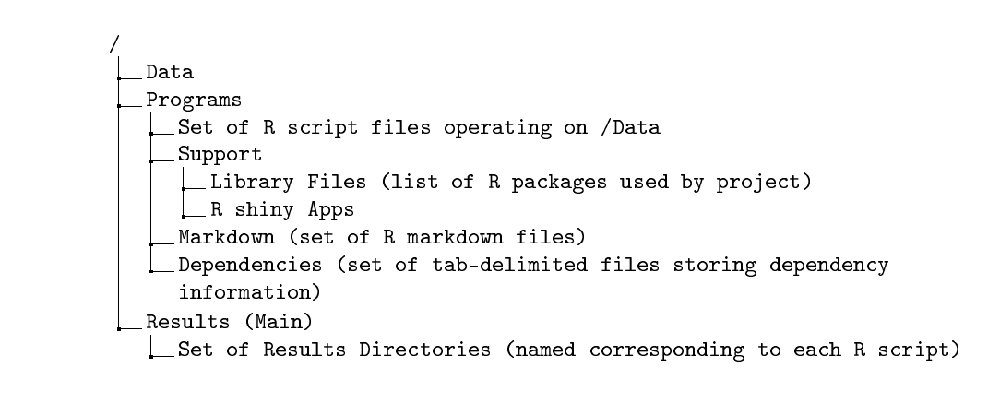

::: article
# Introduction

Reproducibility, accountability and transparency are increasingly
accepted as core principles of science and statistics. While some of the
impetus for the interest in reproducibility has come from high-profile
incidents that reached the sphere of the general public
[@carroll2017science], there is a consensus that reproducibility is
fundamental to scientific communication and to the acceleration of the
scientific process [@wilkinson2016fair]. Furthermore, transparency and
reproducibility are deemed necessary by the American Statistical
Association's Ethical Guidelines for Statistical Practice
[@ethicalGuidelines]. There have been significant strides in improving
the set of available tools for constructing reproducible analyses such
as the concept and implementation of literate computing, version control
systems, and mandates by journals and sponsors that create standards for
submitting data, code, and systems for reproducibility. Also, interest
in data science has expanded the number of researchers and students who
are undertaking data analyses, which underlies the need for tools
manageable for a broad range of user expertise. While there is
commercial software such as SAS (SAS, Cary, NC) and Stata (StataCrop,
College Station, TX, USA) and open-source tools that have systems for
reproducible computations, these may have significant challenges. Both
open-source and commercial tools could encounter a number of barriers
such as 1) the tool is focused on one dimension of the reproducibility
problem rather than offering a complete system, 2) the tool may be hard
to identify, 3) they may have subtle differences in capabilities, making
it hard for users to select among them, 4) documentation or support are
in short supply, and 5) they require degrees of sophistication that
beginners lack.

Before the introduction of R, @becker1988auditing proposed a framework
for auditing data analyses that could replicate and verify calculations
called the AUDIT S-plus [@becker1988new] system. Their auditing system
would not only extract the computing steps required to produce the
analysis, but also would identify the patterns of the creation and use
of particular objects within the directed acyclic graph of computations.
Currently, many R packages facilitate reproducible analyses with
literate programing or by tracking computational results. Some of these
are listed within the CRAN Task View: [*Reproducible
Research*](https://CRAN.R-project.org/view=Reproducible Research)
[@zeileis2005cran]. The
[*knitr*](https://CRAN.R-project.org/package=knitr) [@xie2015dynamic]
and [*rmarkdown*](https://CRAN.R-project.org/package=rmarkdown)
[@rmarkdownPackage; @baumer2014r] packages are widely used and enable
literate programing by weaving R code and results into the same document
in many formats. Tracking computational results with the
[*cacher*](https://CRAN.R-project.org/package=cacher) packgage
[@peng2008caching] can be useful for efficient storage and
reproducibility, and the *rctrack* package [@liu2014r] tracks
computations including random seeds in a read-only format without
modifications of existing R code. The package *RDataTracker*
[@lerner2014collecting] provides a very granular level of tracking R
objects within a script with minimal overhead on the user, and the
*recordr* [@recordr] package tracks dependencies within an R script and
does not require the modification of the code, but this facility is
limited to specific read/write methods (e.g. 
`read.csv, write.csv, ggsave, readLines, writeLines`, etc.). The
*remake* [@remake] package proposes a different model for managing the
complexity of analyses. Rather than instrumenting arbitrary or minimally
modified R code for tracking, *remake* provides a structured approach
for projects in which dependencies are documented explicitly. An
interesting addition is the
[*archivist*](https://CRAN.R-project.org/package=archivist) package
[@archivistPackage] that can store R code and R objects, handle multiple
versions thereof, and has many features that enhance sharing and
browsing results.

Besides R, other open source programming languages and computing
environments are developing reproducibility tools such as Python's
Sumatra [@davison2014sumatra] which stores computations for simulation
or analysis as an electronic lab notebook. These notebooks represent a
type of dynamic document [@becker2014dynamic] that combines data, code,
and results within the same object. Dynamic documents enable a very high
level of transparency, and while technically challenging to implement,
are becoming an increasingly prevalent means of producing and sharing
results. The tool Jupyter [@ragan2014jupyter], originally developed to
be polyglot including languages such as Python, is a web-based
electronic notebook built for literate programming which is extendable
to multiple languages, recently including R. The Jupyter system has many
features such as interactivity, ability to share notebooks, graphical
user interfaces, and the potential for high performance computing. Other
systems such as Traverna [@wolstencroft2013taverna] and Galaxy
[@afgan2016galaxy] are geared toward workflow development and allow
multiple programing languages, web-based sharing and integrate high
performance computing. The development of *compendia* is also important
to reproducibility, @gentleman2007statistical introduced the concept of
a compendium that is comprised of data, code, and the computational
results that also allows the distribution of the software tools. This
goes beyond reproducibility by distributing a large set of general tools
thereby enabling other researchers to use and assess these methodologies
in different contexts.

We present the [*adapr*](https://CRAN.R-project.org/package=adapr)
(Accountable Data Analysis Process in R) package to facilitate
reproducible and accountable computations. The objective is to use a
structured, transparent, and self-contained system that would allow
users to quickly and easily generate reports and manage the complexity
of analyses while minimizing overhead. Unlike other tools such as
Jupyter, Traverna and Galaxy, *adapr* is built in R for R and is geared
toward simplicity for beginning R users with some minimal alterations to
standard R coding. *adapr* is an R package that uses a R *shiny*
[@shinyPackage] graphical user interface to interact with the directed
acyclic graph (DAG) that represents the data analysis. This structured
system would facilitate multiple data analysts in interpreting or
collaborating on projects. Although *adapr* is capable of literate
programming using R Markdown, *adapr* is designed for producing files
(graphics, tables, etc.) that are distinct from the code that produced
them and can be shared within a scientific collaboration. We call these
files accountable units because the system can provide their providence,
meaning the data, code dependencies, date, and authorship. This
functionality is sustained by computing the cryptographic hashes
[@rabin1981fingerprinting] of the result files and storing these
alongside the R code within the version control system Git
[@hamano2005git]. It is important to note that the primary data are not
version tracked, but only the file hashes, this leads to a check of the
identity of the data, but does not allow for reproducing data if
modified so that primary data should be stored in another archive. The
reasons for this are that 1) the analysis should not modify the primary
data, 2) the primary datasets should be stored in a secured version
system or database, and 3) tracking versions of the primary data is most
efficiently done using a database rather that system such as Git.

The idea of accountable units is similar to that of verifiable
computational results (VCRs) proposed by @gavish2011universal. These
authors recognized the difficulties and of ensuring long-term
re-execution of source code, and argued the only way of ensuring this is
to virtualize and store the full computing platform. They further argued
that the source code, the inputs, and output are most important to
evaluating the reasoning behind published results rather than strict
computational reproduction, which can be time-consuming and technically
challenging. There is a bright distinction between collecting a history
of computations compared to retaining and sharing the ability to
reproduce the final results. We have emphasized elsewhere
[@gelfond2014tell] that, beyond reproducibility, the analytical history
is essential to accountable data analyses based upon formal theories of
accountability [@jagadeesan2009towards]. These theories imply that an
evaluator (e.g.  peer reviewer) cannot make a valid assessment of a
communication (e.g.  scientific analysis) unless the evaluator is aware
of a verifiable context and history. Furthermore, the computational time
required to identify a history is that of text search, which most often
can be accomplished much more simply and quickly than attempting to
recompute the analysis. We see *adapr* as fulfilling and assisting in
creating some of the necessary components of VCRs. While *adapr* is not
intended as a tool for instrumenting arbitrarily structured R code to
track computation input/output, this package is aimed at providing a
transparent organizational structure while establishing provenance and
reproducibility assuming the stability of the computing platform.

# Setting up *adapr* and defining a project

The *adapr* package is available from CRAN (Comprehensive R Archive
network, cran.r-project.org) with the latest package version available
on GitHub (github.com) that can be installed with\
`adaprUpdate()`. In order to initially set up *adapr*, there is a helper
function `defaultAdaprSetup()` that will ask a short sequence of
questions (default project directories, preferred username, version
control preference, etc.) and will create the first project `adaprHome`
within the project directory (e.g. by default the computer's `Document`
directory). This setup function must be executed in ordered for *adapr*
to function properly. If RStudio [@rstudio] is used, this setup function
can utilize the RStudio environment to locate system resources such as
*pandoc* automatically. The setup function creates a directory at the
top level of the user directories called `ProjectPaths` with two files
`projectid_2_directory_adapr.csv` and `adapr_options.csv` that are
required to locate projects and configure *adapr*, respectively. The
location of the `ProjectPaths` options directory can be changed from the
default by setting an option within the R Profile using the statement
`options(adaprHomeDir=’myPathToOptions’)`.

An *adapr* project is a set of analyses based on a given collection of
data that is structured as a directed acyclic graph. The project is
contained within a folder (a file directory with the same name as the
project) with all data, R scripts, and results. A new project can be
created with the function `initProject` that can be invoked as
`initProject(’myProject’)`. When a new project is initialized, the
project is created as a single folder within a file system (OS X, Linux
or Windows) with the following structure:

{width="100%" alt="graphic without alt text"}

The fundamental unit of the project is an R script that is linked to
three corresponding elements. The first element is a `Results` folder
with the same name as the R Script that resides within the project's
main `Results` directory. The second is an R markdown file with the same
name (with file extension `.Rmd`) within the Markdown directory. The
third element is a dependency file with the same name as the script
(with the file extension `.txt`) within the `Dependency` directory. The
dependency file contains the read/write history of the R script. When a
project is initialized by default, a `read_data.R` file is created and
executed automatically. This, in turn, creates a results directory
`Results/read_data.R` and an R markdown file `Markdown/read_data.Rmd`
and a corresponding dependency file `Dependency/read_data.txt`.

In addition to the main project directory, each project is associated
with a `Publish` directory that can be used to share selected results
with collaborators. The Publish directory could be a Dropbox, file
server or web server directory.

# Initializing projects and *adapr* R scripts

The function call `projectInit(’myProject’)` in the R console will
create a new project that by default contains a single R script
`read_data.R`. A side effect of this function is to automatically set
current project to the new project. Lastly, the project's settings can
also be changed with the function `relocateProject` by specifying the
project and the new settings. It is also possible to import projects
that were already built by a collaborator. For example,

``` r
relocateProject('importedProjectID',project.path='parentDirectory')
```

imports a new project called `importedProjectID` that is within a
subdirectory of `parentDirectory`.

The *adapr* package contains a sample project called `adaprTest` that
can be loaded into the users file system with the command
`loadAdaprTest()`. To create another R script within that project, one
can execute the following console commands:

``` r
>loadAdaprTest()
>setProject('adaprTest')
>makeScript(r='postProcess.R',description='mixed model analysis',
           project.id=getProject())
```

The `setProject` function specifies the project and the `getProject`
function retrieves the project ID in other functions by default so that
the user does not have to respecify the project. The `makeScript`
function will, by default, automatically open the corresponding script
with the default R file browser. Each script (e.g. `postProcess.R`) is
given a text string description (e.g.  \"mixed model analysis\"), and
also, every file that is read or written within a project has an
associated text string description. Timely descriptions are an important
part of tracking because they facilitate the *gradual accumulation* of
metadata that promotes efficient transparency rather than an automated
code instrumentation, which may not easily generate precise, correct, or
human-interpretable metadata tags. When a program is created with
`makeScript`, the program is executed, creating a script-specific
directory within the parent `Results` directory, R markdown file, and
the dependency file. The *adapr* R scripts have a structured header that
identifies the project and the script, and a footer that writes the
read/write dependencies into a file corresponding to the R script within
the `Program/Dependency` directory. The header and footer that are
automatically created by `makeScript` and are shown below.

``` r

rm(list=ls()) #Clears R workspace
set.seed( 2011 ) # Sets random seed 

library('adapr')

source.file <-'read_data.R'  #Name of file matching filename /Programs directory name
project.id <- 'project_name'  # Name of project
source_info <- create_source_file_dir(source.description='reads data') 
# Source description will be linked to R script

# Library statements here (e.g.\, Library('ggplot2'))

# Begin program body here


# End Program Body
dependency.out <- finalize_dependency()
```

Within the *adapr* script, the key step within the header is the
`create_source_file_dir` function that creates the `source_info` object
of type `list`. The `source_info` object is stored within the R options
and can be retrieved using `getSourceInfo()`. This is used to collect
the read/write information within the body of the R script by wrapping
the read/write commands within three R commands. The first is the `Read`
function:

``` r
Read(file.name = 'data.csv', description = 'Data file', 
          read.fcn = guess.read.fcn(file.name), ...)
```

This command returns the file object read by the function `read.fcn` and
tracks the description and the file hash with \"\...\" passed as
additional arguments to the read function `read.fcn`. Note that in the
usage example below, it is transparent and parsimonious, especially
given that the Read function defaults to reading from the project's data
directory:

``` r
Dataset <- Read('datafile.csv','my first dataset')
```

The argument `read.fcn` could be any function that given a file, returns
an R object, and so, `Read` is not limited to flat files. To facilitate
the identification of a project's data files, the `listDatafiles()`
function call produces a list of files within the data directory.

The second command is the Write function:

``` r
Write(obj = NULL, file.name = 'data.csv', description = 'Result file',
	write.fcn = guess.write.fcn(file.name), date = FALSE, ...)
```

This example writes object 'cars' into the Results directory as a comma
separated value (CSV) file

``` r
Write(cars,'cars.csv','speed and distance')	
```

and this example writes object 'cars' into the Results directory as a R
data object.

``` r
Write(cars,'cars.rda','speed and distance')	
```

This command writes the R object `obj` using the function write.fcn and
tracks the description and the file hash with \"\...\" passed as
additional arguments to `write.fcn`. If the `file.name` argument has a
`.rda` extension then the R object is written to the results directory
as an R data object. The third function used by *adapr* creates graphics
files:

``` r
Graph(file.name = 'ouput.png', description = 'Result file',
	write.fcn = guess.write.fcn(file.name), date = FALSE, ...)
```

This command opens a graphics device for plotting using the function
`write.fcn` and tracks the description and the file hash with \"\...\"
passed as additional arguments to `write.fcn`. The function
`guess.write.fcn` uses the file suffix to determine the type of file to
write (e.g.  pdf, png, etc). The date variable is a logical that
determines whether a date is added to the filename. This function is
followed by graphics command set and closed by a `dev.off()` or
`graphics.off()` statement. Below is an example.

``` r
Graph('histogram.png','hist of random normals')
	hist(rnorm(100))
graphics.off()
```

This code snippet creates a file in the results directory of the R
script called `histogram.png` with a histogram of 100 standard normal
variables.

Another key function is `loadFlex` invoked as the following:

``` r
LoadedObject <- loadFlex('process_data.R/intermediate_result.rda')
```

The `loadFlex` function reads and returns an R data object with the
`.rda` file extension written by another R script within the project.
The `loadFlex` function could also read any intermediate result file
type if the argument `read.fcn` is specified. This function is critical
because it allows the R scripts within a project to build on the results
of other R scripts in a transparent and structured manner. This function
searches through all results for a file name that matches the argument
string to identify the R object to load, and returns the corresponding R
object (assigned to `LoadedObject` in the example). This function must
follow the call
`Write(intermediate,’intermediate_result.rda’, ’normalized data’)`
within another R script (`process_data.R` in the example) to pass
preprocessed data from one R script to another or to collect key results
from multiple R scripts. It is important to note that `loadFlex`
requires prior use of a `Write` function because *adapr* does not, by
default, collect the entire workspace of each R script. The convenience
function call `listBranches()` returns a data frame of all intermediate
results available for loading along with their descriptions.

By transferring and tracking objects from one script to the next,
*adapr* promotes the idea of *modularity*. In this manner, the scripts
can have a specific function rather than one script being burdened with
all analytical tasks. Modularity promotes transparency by allowing a
collaborator or reviewer to quickly identify which scripts are
responsible for which analytic tasks, and allowing a collaborator to
isolate their contribution to a particular task within a script that is
linked to scripts created by others. Lastly, modularizing scripts to
perform specific tasks facilitates transforming scripts into functions
themselves. Modularization makes clear what the inputs (arguments to
`loadFlex`) and outputs (arguments to `Write`) of a particular script
are. R functions that are specific to a project are stored within the
`Programs/support_functions` directory. Any R script within this
directory will be sourced and loaded within the `create_source_file_dir`
function within the *adapr* script header. A function can be created
within this directory by using the function call
`makeFunction(’mySpecialPlot’)` in the R console that will create a file
`Programs/support_funcionts/mySpecialPlot.R` and by default will open
the function's file for editing.

The *adapr* footer contains the critical function call
`finalize_dependency()` that transforms the R script's file input/output
(I/O) stored within the object `getSourceInfo()` and writes this data to
the project's `Dependency` directory in the form of a tab-delimited file
with the same prefix as the R script. The dependency data within the
file includes the R script name, R script description, R script hash, R
script file modification time, R script run time, the project ID, the
target file that is read/written, the direction of dependency (read or
write), the target file description, target file hash, and the target
file modification time. The script header function
`create_source_file_dir` and footer function `finalize_dependency`
execute many side effects that are necessary for tracking and these are
listed in Table [1](#table:headerFooter).

::: {#table:headerFooter}
  ------------------------------------------------------------------------------------------
  Function                   Side effects                                                 
  -------------------------- ------------------------------------------------------------ --
  `create_source_file_dir`   Create directories for Project and Results                   

                             Set project id for R session                                 

                             Initialize the file tracking object `source_info`            

                             Gather file information on all project files                 

                             Initialize Git for project (if using Git)                    

                             Add dependencies files to Git                                

                             Initialize *archivist* repo for script                       

                             Run all R scripts in `support_function` directory            

                             Run all R scripts in script specific                         

                             `support_function/myRscript.R` directory                     

                             Create R markdown file with same                             

                             file prefix (if not already done)                            

                             Create publication file (if not already done)                

  `finalize_dependency`      Pass workspace to R markdown file and render                 

                             Store file modification time and hash for all dependencies   

                             Write dependency information to `Dependency` directory       

                             Add dependency file and R session information to Git         
  ------------------------------------------------------------------------------------------

  : Table 1: Side effects of header and footer functions
:::

For some critical analyses or data objects, it may be useful to store a
version history. This means storing more than one version of the object
itself, not just the code to reproduce the object. This can be done
using the *archivist* package that has been incorporated into *adapr* by
creating an *archivist* archive for each *adapr* script in the R
script's `Result` directory. Using the function call
`arcWrite(myRobj,"my object description")` in the R script file stores
the object within an *archivist* archive. If the R script that wrote the
object was `myRscript.R`, this may be loaded into another R Script by
using the statement
`myObject <- arcRead(’myRscript.R’,’my object description’)` that
assigns the value of that object to `myObject`.

# Literate programing using R Markdown

An R Markdown file is created automatically within the
`Programs/Markdown` directory when an *adapr* R script is first created
and executed. This file has the `.Rmd` suffix and is rendered when the R
script is executed as a side-effect of the footer
`finalize_dependency()` function within the corresponding R script.
Additional R markdown files can be created using the `createMarkdown`
function and rendered within the `Results` directory with the
`renderRmd` function. Executing the R script will pass its workspace to
the markdown file R commands and render these markdown files. By pairing
each R script with a markdown file, *adapr* allows the R script to
perform transformations and analytical tasks that can be more easily
summarized, formatted, and displayed within the R markdown file.

The `.Rmd` file can also be executed by using the \"knit\" button in
RStudio if the file header has the header line
`scriptLoader(project.id,R Script)` executed (this is commented out by
default). Additionally, file input/output can be tracked using the line
`if(checkRmdMode())){dependency.out <- finalize_dependency() } ` as the
final line in the markdown file. These lines are automatically included
in the R markdown files, but are commented out. The RStudio \"knit\"
button can facilitate exploring and debugging; however, it does not
direct the rendered markdown into the results directory, and the
rendered markdown file would go to the `Markdown` directory.

# Managing R packages

By default, projects share a common R library that is specified at
setup. Sometimes users may prefer that project has a project-specific
library, instead of the default R library. This may be useful for
improving consistency in computations, although the larger libraries can
use substantial drive storage. The user may specify library preferences
at initialization by setting the following argument within the
`projectInit` function:
`initProject(’myProject’,project.libraryTF=`*`libOption`*`)`. The
`project.libraryTF` parameter *`libOption`* may be set to one of 3
values (`"TRUE"`,`"FALSE"`, or `"packrat"`). The default value `FALSE`
implies the use of the default library. The value `TRUE` will use the
project specific library located in the `Programs/Support/Library`
directory, and the value `"packrat"` will imply the
[*packrat*](https://CRAN.R-project.org/package=packrat)
[@packratPackage] to manage R packages. The *packrat* package allows the
isolation of the package dependencies for R projects and has many
features including isolation of the computing environment,
cross-platform compatibility and cleaning out unused packages. *adapr*
does not set up or operate *packrat*, and this responsibility is left to
the user. We have found that the RStudio IDE is helpful for the
initialization of *packrat* rather than R console commands.

*adapr* facilitates loading and tracking R packages using the `Library`
function and by tracking the loaded libraries within the R session
information. R packages needed for each R script can be loaded with the
`Library` function within the R script header. This function will
install and/or load the package if it is not installed or loaded. A use
case would be `Library(’ggplot2’,’cran’)` or `Library(’limma’,’bioc’)`.
At the end of the program body, the `finalize_dependency` function
writes the R session information to a file. The `getLibrary()` statement
will read all of these session information files for a project and
collect all of the packages and their versions. This information can be
useful for reproducibility, and these packages can be installed using
the `installLibrary()` function call. The `installLibrary` function has
an argument to install the specific versions, and the packages are
installed from CRAN, MRAN (Microsoft R Application Network,
<https://mran.microsoft.com>), Bioconductor [@biocPackage], or GitHub.
Currently, only the latest compatible version of Biocondunctor packages
will be installed. If the *packrat* package is used for a project, then
it is recommended to use *packrat* functions and the RStudio IDE for
managing package versions. An example of how to use these functions is
shown below: The following series of console commands loads the example
project stored within the *adapr* R package.

``` r
>loadAdaprTest() 
```

This sets the project.

``` r
>setProject('adaprTest')
```

This returns the directory containing the project library.

``` r
>getProjectLibrary() 
```

This returns the project library's package information.

``` r
>getLibrary() 
```

This installs project library.

``` r
>installLibrary() 
```

There are many technical intricacies of tracking R package use within a
project, and there has been significant effort build stable solutions
for package reproducibility such as *packrat* and *switchr*
[@switchrPackage]. These difficulties are not currently completely
handled by *adapr* and is an area of active development.

# Summarizing and visualizing projects

The `reportProject` function and the app can summarize all programs and
results within a single HTML document with descriptions, dependency
information, and links to programs and results. The app can be launched
with within the R console with the function `adaprApp()`. The report
information can be obtained within the Report tab of the app in Figure
[1](#figure:reportTab). After clicking the \"Report\" button, the HTML
project summary is written to the `Results/Tree_controller`.R/
directory. The Report tab shown in figure also is capable of launching
project R Shiny apps that access project data or Results.

{#figure:reportTab width="100%" alt="graphic without alt text"}

# Synchronizing and version control

Two critical parts of accountability and reproducibility are addressed
by the `syncProject` and\
`commitProject` functions as well as within the Synchronize tab of the
app. The `syncProject` function can be called in the R console with
`syncProject()` after a `setProject(’myProject’)` call. It will
synchronize data, scripts, and results for a project. The project is
synchronized if two criteria are met: 1) the file modification times
stored within the R scripts dependency files are the same as the
modification times within the file system, and 2) if the cryptographic
hash (data fingerprint) of the file hash of each file within the project
is consistent with all of the dependency files. The `syncProject`
function called by `syncProject()` detects lack of synchrony and can
execute the corresponding R scripts that are needed to achieve
synchrony. It is possible that the DAG has structures (\"forks\") that
allow the R scripts to be run in parallel because they are not dependent
on one another. We have added experimental functions `parallelSync` and
`monitorParallelSync` that allow parallel execution of the DAG by
different cores. Note that `monitorParallelSync` should be executed in a
separate R session and will indicate which cores are working on which
part of the project DAG. For larger projects, an alternative to
synchronizing the whole project is to only synchronize the results of a
particular R script. This involves only synchronizing the parts of the
DAG that that R script depends upon. This can be done with the
`syncTrunk(’myscript.R’,’myProject’)` function call. This is illustrated
in the code snippet below, and Figure [2](#figure:trunkSync) shows the
results of the last `graphProject()` statement.

``` r
>loadAdaprTest() # Loads the project stored within the adapr R package
>setProject('adaprTest') # Sets the project
>syncProject() # Synchronizes the project
>openScript('read_data.R') # Open R script
```

We could make some minor change in `read_data.R` and then execute the
following to synchronize the project.

``` r
>graphProject() # Shows project DAG with synchronization status
>runScript('read_data.R') # Executes the script in a clean R environment
>syncTrunk('graph_cardata.R') # Executes scripts needed to synchronize 
                                               results from 'graph_cardata.R'
>graphProject() # Shows project DAG with synchronization status
```

{#figure:trunkSync
width="100%" alt="graphic without alt text"}

*adapr* optionally uses the Git version control system, which can be
operated with the\
`commitProject()` function and the Synchonize tab. The Synchronize tab
is shown in Figure [3](#figure:synchronizeTab). Git must be installed
for this feature to work. There are platform independent and free Git
clients available for download (<https://git-scm.com/downloads/guis>).
While *adapr* handles Git tracking and snapshots, it does not currently
revert the current version of the project back to a previous snapshot.
We recommend that reversions be performed using Git directly or through
a Git client, which have more features and visualization capabilities.
The function `commitProject()` and button within the app takes a project
snapshot of all R scripts and adds the synchronization status
(synchronized or not) to the commit message. Because the file names and
*file hashes/fingerprints* are stored within dependency files that are
tracked by the version control system, any data, R script, or result
file can be matched by its hash/fingerprint within the version control
history to determine its provenance. The *adapr* function `Digest` is a
wrapper for functions in the *digest* [@digestPackage] package and is
used the compute the cryptographic hash (not serialized) of a file, and
this file hash can be identified by a Git history search to determine
its provenance within a project. *adapr* uses Git operating functions
that were adapted from those within the *devtools* [@devtools2016] and
*git2r* [@git2rPackage] . If Git is used, *adapr* will automatically
perform a commit after `syncProject`. This allows the user to capture
all result file hashes and to identify which results were obtained in a
synchronized state. It is important to note that *adapr* automatically
adds all R script files into the project's Git repository, but it does
not automatically use formal version control for data or results files
because these files may be too large for the version control system to
efficiently track the changes. If the user would like to store multiple
versions of a result, then we recommend using the `arcWrite` function.
However, by default, the file hash is computed and stored within the
`Dependency` directory for all files that are read or written within the
project so that all relevant files and their provenances can be
identified if a commit was made when the file was read/written. File
histories can be identified within the \"Run Report\" tab that executes
a file hash search and returns the Git commit associated with the file
including the date, author, and file description. The Git history of a
file is also obtained with the `gitProvenance` function with arguments
`project.id` and `filepath` that opens a file selection window and runs
a Git search for the hash of the file within the project.

There is an interactive project map feature within the \"Synchronize\"
tab. The \"Examine Program Graph\" button displays the DAG of all the
project's R scripts colored by their synchronization states. These
scripts can be executed by clicking on the colored point, and their file
I/O can be examined by selecting or \"brushing\" over the colored point.
This reveals the file I/O graphic in an adjacent panel. These files are
labeled by their descriptions and can be opened by clicking on the file
or their file directories may be browsed by selecting or \"brushing\"
over the colored file labels. The graph may alternatively be displayed
using the `graphProject()` function. A limitation is that very large
DAGs or very large input/output lists for an R script can overwhelm the
visual space of these graphics. Future versions will address this issue.

![Figure 3: Synchronize Tab. 1. Examine program graph creates or updates
two interactive plots. 2. Check the synchronization status and
synchronize project by running necessary R scripts. 3. Syncronize
project. A pop-up progress bar will open. 4. Commit message with Git
version control snapshot of project. Commit Project button operates Git.
5. R Script Graph shows dependencies of R scripts. Clicking on button
runs the R scripts. Selecting or brushing button opens panel 6. 6.
Displays the inputs and output of the selected R script. Clicking on the
file label opens the file or selecting opens the file folder.
](Screenshots/sync_tab2.png){#figure:synchronizeTab width="100%" alt="graphic without alt text"}

# Sharing results

Specified result files from the project can be copied to a shared
`Publish` directory using the\
`publishProject(’myProject’)` function. This allows users to share or
update a list a selected results with one command. The `publishProject`
function reads a file within the ` Programs/Support_functions` directory
that contains a list of files that are selected for publication (i.e. 
copied to the project publication directory, which may be a shared
server folder, a web server, or cloud server such as Dropbox).
Publishing can be automated by including the `publishProject` function
within an *adapr* R script. The file that contains paths to the results
that will be published can be opened for editing with the
`browsePubFiles(’myProject’)` function.

# Configuration

The *adapr* package can be updated and configured within the
`setAdaprOptions` and `getAdaprOptions` functions. An option can be set
with the syntax `setAdaprOptions("optionName","optionValue")`. The key
options are summarized in Table [2](#table:optionTable). For example,
the use of Git can be activated by `setAdaprOptions(’git’,’TRUE’)`. Git
itself can be configured using Git commands or within R using the
*adapr* function call `gitConfigure(username,email)`.

::: {#table:optionTable}
  ----------------------------------------------------------------------------------------
  Purpose                             Option Name    Value
  ----------------------------------- -------------- -------------------------------------
  Path to system resources            PATH           Paths separated by system delimiter

  Specify use of Git                  git            TRUE or FALSE

  Default project path                project.path   File path

  Default publication path            publish.path   File path

  Default R library                   library        File path to default library

  Specify use of adapr beta version   adaprBeta      TRUE or FALSE
  ----------------------------------------------------------------------------------------

  : Table 2: List of adapr options
:::

# Convenience functions

We have found that certain project oriented functionality can save time
and effort, and we have compiled a list of functions that we have found
useful in Table [3](#table:convenienceFunctions). These can be used
without specifying the project argument after the
`setProject(’myProject’)` function. The two pages of the function
summary \"cheat sheet\" that is opened with the `adaprSheet()` function
call is shown in Figures [4](#figure:cheatsheet) and
[5](#figure:cheatsheet2).

::: {#table:convenienceFunctions}
  ------------------------------------------------------------------------------------------
  Purpose                                                    Function example
  ---------------------------------------------------------- -------------------------------
  Browse main function cheat sheet for *adapr*               `adaprSheet()`

  Show file usage information for all projects               `fileInfoProjects()`

  Open project directory in file browser                     `showProject()`

  Open project or source results directory in file browser   `showResults()`

  Open project's R script or R markdown file                 `openScript()`

  lists R scripts if not specified                           

  List intermediate result objects                           `listBranches()`

  Plot synchronization status of project scripts             `graphProject()`

  Execute R script within a project                          `runScript(’read_data.R’,`

  optionally create a markdown log                           `’adaprTest’,logRmd=TRUE)`

  Search R scripts for string                                `searchScripts(’lmer’)`

  Copy data file to project data directory                   `importData()`

  Return results directory within R script                   `resultsDir()`

  Return data directory within R script                      `dataDir()`

  Track file reads without using `Read`                      `ReadTrack(’arraydata.idat’,`

                                                             `’read by limma package’)`

  Track file writes without using `Write`                    `WriteTrack(’myFile.docx’,`

                                                             `’From ReporteRs package’)`
  ------------------------------------------------------------------------------------------

  : Table 3: Convenience functions
:::

{#figure:cheatsheet
width="100%" alt="graphic without alt text"}

{#figure:cheatsheet2
width="100%" alt="graphic without alt text"}

# Conclusion

@becker1988auditing have written that \"the complexity of the structure
that represents a realistically large analysis makes a thorough
interactive investigation very challenging. New statistical,
computational, and graphical techniques will be needed.\" Since then,
there have been many strides towards that goal. The *adapr* package is a
demonstration of how scientific reproducibility and accountability can
be accelerated by automatically structuring, tracking, and implementing
analyses. Beginning R programmers may benefit from this approach by not
having to create their own system, and while more experienced analysts
have likely created their own methods for structuring analyses, it is
possible that there are certain features of *adapr* that they could
integrate into their systems. These features include adding a standard
structure to project directories, checking the synchronization status of
the project, selectively synchronizing part of the DAG, linking short
text descriptions to data and results files, creating a HTML summary of
the full project, interactive project maps, and version control
integration with file hash search capability for results and programs.
This integrated version control feature tracks file hashes of data,
programs, and results and can capture the evolution of the analysis, not
just the final results. This points to an important challenge: the
analyses in many scientific articles are extremely intricate and
necessarily become more complex as the data are inevitably explored.
This makes version control system indispensable for unraveling the
history of analysis.

### Limitations

The limitations of *adapr* include the inability to directly track
changes in external databases, file hash computation can be slow for
files that are multiple gigabytes, the requirements for the user to use
*adapr* read/write functions for tracking, and the package management
system is less capable than packages such as *packrat* and *switchr*.
Currently, *adapr* can be used with external database input functions,
but these would not be tracked as inputs with the `Read` function
because they are not within the file system. We are considering options
for tracking external database input for future *adapr* versions. One
workaround for this is to have an R script within the project that
downloads the relevant database queries and writes these objects to the
file system with a `Write` function, and these query results can be read
into another R script and tracked as a dependency using the `loadFlex`
function. The *adapr* package is also limited by its dependency on other
R packages and by the fact that running the Shiny app while programming
would require two R sessions. We have found that using project oriented
functions
(`makeScript, syncProject, commitProject, initProject, setProject,`
etc.) within the console makes for a more fluid experience, but this
requires that the user have an idea of which functions to utilize, which
is why we created the `adaprSheet()` function to give a quick overview.
Also, beginning R users may be just learning the art of programming,
which could make using a structured programming system like *adapr*
difficult if that structure is violated. There are some safeguards built
into *adapr*, but violating the header/footer structure can result in
errors. We have used *adapr* in a class with first-time programmers, and
this has greatly informed our development. For example, the function
`makeScript` originally only created the script within the file system,
but now, it also opens the script with the default R program so that the
students do not have to search for it. The students use a single
function `Library` function instead of two functions `install.packages`
and `library`. Also, we have found that the `runScript` function is very
useful for teaching reproducibility as it lets the students run the
script in a clean environment. Students can also be introduced to R
through the R scripts, and after a few classes, can be introduced to R
markdown. This allows time to get familiar with R, before adding the
additional complexity of R markdown syntax. Because each *adapr* script
is paired with and passes its environment to an R markdown file, the
students can see how R markdown can nicely format the objects that they
have previously created. While a limitation of this work is that the
*adapr* user base is small, one of the key aspects of the system is that
it has been tested on a variety of projects. The *adapr* package and
earlier versions have been tested in over 160 projects. These projects
were conducted by five statisticians in an academic health center (AHC).
The projects included clinical trials, genomic analyses, experimental
data from basic sciences, as well as projects created specifically to
test *adapr*. Figure [6](#figure:allProjects) represents the directed
acyclic graphs with structures related to the complexity of the
projects.

### Other potential benefits

Additional goals of *adapr* include efficiency and transparency. The AHC
environment creates a high demand for statistical analyses as well as
significant pressure to reduce the time-to-completion. We have studied
process of statistical consulting in some detail
[@schmidt2016Improving], and the use of the system has not led to any
significant increase in lead times, but it has subjectively improved the
ease of collaboration among analysts. The use of any structured system
like *adapr* can be highly beneficial when a long dormant project
becomes active again or a project is passed from one analyst to another.
Another advantage of the system is that reports and interactive maps
allow users who are not familiar with R the opportunity to browse the
analysis, which promotes transparency. These maps also help the users,
regardless of experience level, to orient themselves to large or complex
analyses. Structuring projects in directories that are systematically
scanned for activity (e.g.  every 30 minutes) allows automated tracking
of the work patterns within projects (e.g.  file modification times of R
scripts or markdown files within the projects directory). This
facilitates the objective estimation of work-hours that are useful for
reporting, billing, or resource allocation.

Lastly, given that accountability has been recently added as a
requirement for authorship by the International Committee of Medical
Journal Editors [@resnik2015authorship; @authorshipGuidelines],
scientific reviewers or readers may benefit from knowing that an *adapr*
data analysis had a high degree of accountability or reproducibility.
Hence, we suggest adding the statement \"The data analysis was conducted
using an accountable process.\" to the 'Statistical methods' or 'Data
analysis' section of an article that used *adapr*. This designates
that: 1) a documented system was used for the version-controlled
analytic history, 2) the provenance of results can be checked, and 3)
that the analyses and results have descriptions, a documented structure,
and a means of reproduction. Note that version control systems such as
Git store the author's name and email associated with commits so that
these naturally document contributions.

{#figure:allProjects
width="100%" alt="graphic without alt text"}

# Acknowledgement

The authors thank Emily Burnett for her contribution to early versions
of the user interface. The authors would like to thank the editor and
two anonymous reviewers for substantial improvement of this work. The
project described was supported by the National Cancer Institute and the
National Center for Advancing Translational Sciences, National
Institutes of Health, through the grants GM070335, NIA Shock Center
P30AG013319, NIA Pepper Center P30AG044271, CTRC P30 Cancer Center
Support Grant CA054174 and the Clinical and Translational Science Award
(CTSA) UL1 TR001120. The content is solely the responsibility of the
authors and does not necessarily represent the official views of the
NIH.
:::
