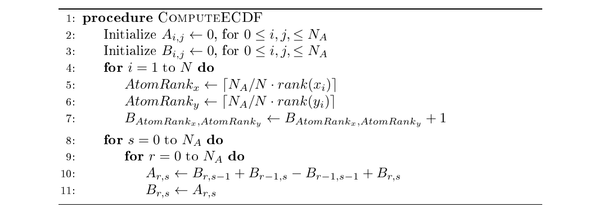
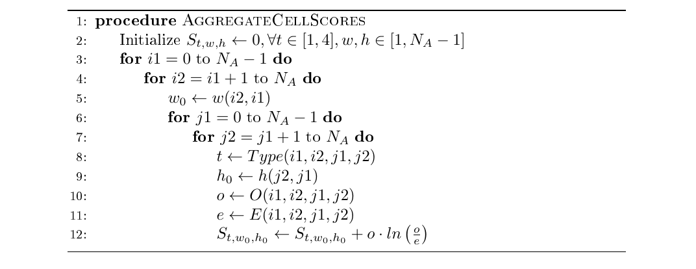
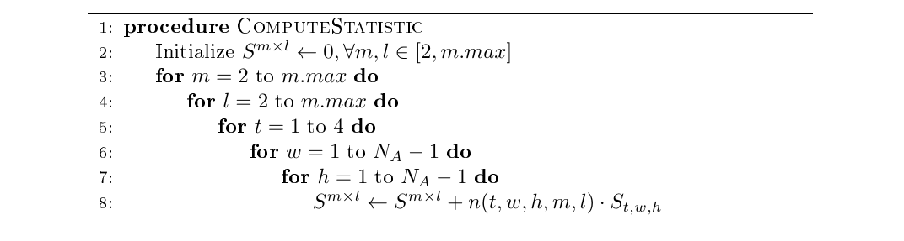

::: article
# Introduction

A common question that arises in the analysis of data is whether two
random variables, $X$ and $Y$, are independent. The null hypothesis is
$$\label{eq-def}
H_0: F_{XY}(x,y) = F_X(x)F_Y(y)\quad  \forall \quad x,y   (\#eq:eq-def)$$
where $F_X$ and $F_Y$ are the marginal cumulative distribution functions
of $X$ and $Y$, and $F_{XY}$ is the joint cumulative distribution
function. The case where $Y$ is categorical and $X$ is continuous is the
$k$-sample problem. An omnibus consistent test will reject the null
hypothesis in \@ref(eq:eq-def) for any dependence between $X$ and $Y$,
with probability increasing to one as the sample size tends to infinity.

In recent years, there has been great interest in developing tests of
independence that are able to identify complex dependencies based on $N$
independent observations from $F_{XY}$. For univariate random variables,
the first omnibus consistent test was based on summation of a score over
all $N$ $2\times 2$ partitions of the sample space where every data
point serves as a partition point [@hoeffding1948non]. This test is
available via the function `hoeffd` from package
[***Hmisc***](https://CRAN.R-project.org/package=Hmisc)
[@package_Hmisc]. Another classic approach is based on the measure of
mutual information following partitioning of the data into a
2-dimensional grid [@paninski2003estimation]. This approach is taken in
the R packages
[***minet***](https://www.bioconductor.org/packages/release/bioc/html/minet.html)
[@meyer2008minet; @package_minet],
[***infotheo***](https://CRAN.R-project.org/package=infotheo)
[@package_infotheo], and
[***entropy***](https://CRAN.R-project.org/package=entropy)
[@hausser2009entropy; @package_entropy] with various extensions to the
partitioning schemes used.

Recently, several nonparametric omnibus consistent tests have been
suggested that have computational complexity at least quadratic in
sample size. @reshef2011detecting, with CRAN package
[***minerva***](https://CRAN.R-project.org/package=minerva)
[@albanese2013minerva; @package_minerva], suggested MIC, which is based
on the maximum of penalized estimated mutual information partitions.
@gretton2008kernel, with CRAN package
[***dHSIC***](https://CRAN.R-project.org/package=dHSIC)
[@pfister2018kernel; @package_dHSIC], suggested HSIC, which is a kernel
test based on the empirical estimate of the Hilbert Schmidt norm of the
cross-covariance operator. @szekely2007measuring [@szekely2009brownian],
with CRAN package
[***energy***](https://CRAN.R-project.org/package=energy)
[@package_energy], suggested dCov, which is based on the joint empirical
characteristic function. Both kernel and characteristic function methods
may be implemented in a scenario where $X$ or $Y$ are multivariate.
@heller2016consistent, with CRAN package
[***HHG***](https://CRAN.R-project.org/package=HHG), suggested tests
which aggregate by maximization or by summation the likelihood ratio
test (LRT) scores over all possible partitions of data, with $m$
partition points for each variable. The suggested tests aggregate over
all partitions of the data of size $m\times m$ (i.e., having $m\times m$
cells) for a range of $m$ values.

For the $k$-sample problem, @szekely2004testing suggested a test based
on joint empirical characteristic function, which they implemented in
package ***energy*** as well. @gretton2012kernel suggested a family of
consistent two sample tests based on kernels. The function `kmmd` from
package [***kernlab***](https://CRAN.R-project.org/package=kernlab)
[@zeileis2004kernlab] implements this family of tests for several kernel
choices. @jiang2015non, with CRAN package
[***dslice***](https://CRAN.R-project.org/package=dslice), suggested the
dynamic slicing test statistic, which aggregates by maximization the
penalized LRT score with a penalty for fine partitions.
@heller2016consistent, with CRAN package ***HHG***, suggested tests
which aggregate by maximization or by summation the LRT scores over all
possible partitions of data.

The potential advantage in power as sample size increases in the
state-of-the-art tests listed above is hindered by the computational
cost. In practice, many of the state-of-the-art tests cannot be applied
when sample sizes are in the thousands. The computational problem is
compounded when multiple tests are to be carried out in the same
analysis, e.g., when the aim is to detect all pairwise associations
among the variables in a dataset.

Modifications to some of the tests listed above can be used for large
sample sizes. For the HSIC test statistic, it was suggested to compute
the quadratic time HSIC test statistic for subsets of the data, and then
aggregate the HSIC test statistics towards the test statistic for the
null hypothesis in \@ref(eq:eq-def)
[@gretton2012kernel; @NIPS2012_4727]. Two approximate HSIC statistics,
the HSIC test statistic and the random fourier feature HSIC, have been
shown to have reduced computational complexity while enjoying power
comparable to the original HSIC statistic [@zhang2018large]. Other
computationally efficient ways to compute HSIC were suggested in
@jitkrittum2016adaptive [@NIPS2016_Interpretable]. The three
computationally efficient adaptations of the HSIC test RFF, FSIC) have
an intrinsic trade-off between power and computational complexity given
by a resolution parameter of the method. The user is able to 'pay in
runtime' for more power. A computationally efficient algorithm for
computing the univariate dCov test statistic in $O(Nlog(N))$ time was
developed in [@huo2016fast]. For the suggested test in
@gretton2012kernel, computationally efficient modifications have been
considered in [@zhao2015fastmmd] and [@chwialkowski2015fast]. A
computationally efficient algorithm for computing the univariate energy
test statistic of @szekely2004testing in $O(Nlog(N))$ time was developed
in @huang2017efficient. @jiang2015non suggested considering only a
subset of partition locations for large sample sizes for their dynamic
slicing test. In our present work, we suggest a similar modification for
the tests in [@heller2016consistent].

This paper describes two main contributions. The first is to provide a
method and software for discovering dependence that has reasonable
computational time for any sample size. Specifically, we modify the
algorithms for the tests of @heller2016consistent , which were shown to
have good power in complex settings, to aggregate only a representative
subset of all partitions of the data, thus achieving a computational
complexity which is sub-quadratic in sample size. The suggested tests
have power competitive with state-of-the-art methods, but can be
computed at a fraction of the time. Second, we extend the algorithms for
the tests of @heller2016consistent to allow partitions with a different
number of partition points on each axis. LRT scores of all partitions of
size $m \times l$ of the sample space are aggregated where $m$ and $l$
are the number of partition points of the $X$ and $Y$ variables,
respectively. This generalization does not increase the computational
complexity, yet it can result in better power for alternatives where the
optimal number of partition points in each axis is different.

The paper is organized as follows. We introduce the atom based $MinP$
statistic and detail our novel contributions in the following two
sections. Then, in "Usage examples", we present the work flow of the
package (function calls and outputs). In "$k$-sample tests" we present
the computationally efficient tests for the K-Sample problem and their
work flow. In "Simulation" we compare the novel tests to other
state-of-the-art tests in terms of power and runtime. Finally, in
"Discussion" we provide some final remarks. Other tests available in
***HHG*** are detailed in Appendix B.

# The atom based test statistics {#sec-atom-statistic}

Suppose we have $N$ sample points, where each sample is a pair $(x,y)$.
We split the plane into $m$ parts along the $X$ axis and into $l$ parts
along the $Y$ axis. (Note that for now, $m$ and $l$ are fixed; later we
will show how we choose the best $m$ and $l$ automatically so that the
user will not need to fix them.) We consider the set of all $m\times l$
partitions of the data, where a split point is possible only once every
$A$ ordered observations in each variable. The indivisible blocks of
observations are called atoms. We assume for simplicity that the number
of atoms $N_A$ is an integer multiple of $A$, $N_A=N/A$. Figure
[1](#figure:Atoms_Scheme) shows an example partition of the sample space
based on atoms.

![Figure 1: A visualization of a single partition of the atoms plane.
The atom size is $A=5$, so only partitions on the dashed black grid
lines are allowed at boundary values $5.5, 10.5, 15.5, \ldots$. For
$m=5$ and $l=4$, a single $5\times 4$ partition is depicted with blue
line boundaries. For $N=50$ sample points (black dots), we have
$N_A = 10$ atoms dividing each axis. The cell coloured in blue, which
has width $w=2$ atoms and height $h=3$ atoms, has $O_c=8$ sample points,
whereas only $E_c = 2\times 3 \times 5^2/50 = 3$ are expected under
$H_0$. ](Atoms_Scheme.png){#figure:Atoms_Scheme width="100%" alt="graphic without alt text"}

A cell $c$ is defined by four integers, marking its left, right, top and
bottom boundaries on an equidistant grid of $N_A \times N_A$ points. A
cell with all four boundaries in the interior of the grid will be
considered a 'center' cell (cell type 1). A cell with either its top or
bottom boundary at the edge of the grid will be considered a 'top' or
'bottom' cell, respectively (cell type 2). A cell with either its left
or right boundary at the edge of the grid will be considered a 'left' or
'right' cell, respectively (cell type 3). A set which has two boundaries
at the edge of the grid (e.g., 'left' and 'top') will be called a
'corner' cell (cell type 4). Let $O_c$ denote the number of samples
observed in a cell, and $E_c$ the expected number of samples when $H_0$
is true. For a cell of width $w$ atoms and height $h$ atoms,
$E_c = \frac w{N_A} \frac h{N_A} N =
whA^2/N$. Let $\mathcal{C}$ be the set of all cells and
$\mathcal{C}\left(w,h,t\right)$ the set of all cells of size $w\times h$
atoms and type $t$, where $t\in \{1,2,3,4\}$. We define the function
$n(t,w,h,m,l)$, returning the number of $m\times l$ partitions a cell of
type $t$ and size $w,h$ participates in:
$$\label{eq:HHG_define_n}
n(t,w,h,m,l) = \left\{\def\arraystretch{1.2}%
\begin{array}{@{}c@{\quad}l@{}}
{N_A- w- 2 \choose m-3} \cdot {N_A- h - 2 \choose l-3} & \text{t=1 (center cell)}\\
{N_A- w - 2 \choose m -3} \cdot {N_A- h - 1 \choose l-2} & \text{t=2 (top/bottom cell)}\\
{N_A- w - 1 \choose m -2} \cdot {N_A- h - 2 \choose l-3} & \text{t=3 (left/right cell)}\\
{N_A- w - 2 \choose m -2} \cdot {N_A- h - 1 \choose l-2} & \text{t=4 (corner cell)}\\
\end{array}\right.   (\#eq:HHG-define-n)$$

Let $\tilde{\Gamma}^{m\times l}$ be the set of all $m\times l$
partitions of the plane, where a split point is possible only between
atoms. For a given $m\times l$ partition size, the aggregated by sum
test statistic is
$$\begin{aligned}
 S^{m\times l}&& =  \sum_{\Gamma \in\tilde{\Gamma}^{m\times l}}\  \sum_{ c\in \Gamma} O_c  \log \left( O_c/E_c \right) 
 = 
\sum_{ c\in \mathcal{C}} \sum_{\Gamma\in\tilde{\Gamma}^{m\times l}} I\left( c \in \Gamma \right) O_c  \log \left( O_c/E_c \right) 
\nonumber \\ && =
\sum_{t=1}^{4}\sum_{w=1}^{\left(N_A+1-m\right)}\sum_{h=1}^{\left(N_A+1-l\right)}\sum_{ c\in \mathcal{C}\left(w,h,t\right)}  O_c  \log \left( O_c/E_c \right)  n\left(t,w,h,m,l\right), \label{eq-SmXl}
\end{aligned}   (\#eq:eq-SmXl)$$
where $I(\cdot)$ is the indicator function. The last equality in
\@ref(eq:eq-SmXl) demonstrates that for computing $S^{m \times l}$, we
can iterate over cells instead of partitions, thus achieving a
computational complexity of $\mathcal{O}\left( {N_A}^4 +NlogN \right)$,
even though the number of possible partitions is
$\vert \tilde{\Gamma}^{m\times l}\vert = {N_A-1 \choose
  m-1}\cdot{N_A-1 \choose l-1}$.

Since the optimal partition size $m\times l$ is unknown, we propose
taking the minimum $p$-value over the plausible range of partition
sizes:
$$\label{eq-minP}
MinP = \min\limits_{2\leq m,l \leq m.max}p_{m\times l},   (\#eq:eq-minP)$$
where $p_{m\times l}$ is the $p$-value of the test statistic
$S^{m\times l}$.

In Appendix A we present the full pseudo-code for the algorithm,
including the case when N is not a multiple of $A$. The pseudo-code also
shows how $\{ S^{m\times l}: m=2, \ldots, m.max, l=2,\ldots, m.max\}$ is
computed at the same computational complexity as a single
$S^{m\times l}$. The atom based test in \@ref(eq:eq-minP) is consistent
as long as $N_A\rightarrow \infty$ and $m.max^2/N\rightarrow 0$ [for a
proof see Appendix C in @brill2016scalable].

# The null distribution of $MinP$ and $p_{m\times l}$ {#sec-atom-nulldist}

In this section, we show how to tabulate the null distribution of our
proposed statistic $MinP$. This tabulation requires tabulating the null
distribution of $S^{m\times l}$. Fortunately, the test statistics in
\@ref(eq:eq-SmXl)-\@ref(eq:eq-minP) are based on the ranked observations
and therefore are distribution free. Consequently, the null
distributions of $\{S_{m\times l}: 2\leq m,l \leq m.max\}$ can be
tabulated off-line (prior to seeing the data) in order to evaluate the
$p$-value of any test statistic that combines
$\{p_{m\times l}: 2\leq m,l \leq m.max\}$.

The tabulation of the null distribution of $S^{m \times l}$ and the
$MinP$ test statistics is described in the schematic diagram in
Figure [2](#figure:MinP_Schematic). The structure of generated null
distributions and stored tabulations of null distributions differs.
While one generates the vector of $S^{m\times l}$ statistics from a
single sample, the package data structure for a null table is
constructed by sorted arrays of the marginal distributions. Given a null
table of size $B$ repetitions, one can compute all marginal $p$-values
for $S^{2\times 2}, S^{2\times 3}, S^{3\times 2}, \ldots,
S^{m.max\times m.max}$ in $O(m.max^2 log(B))$ time once each of the
$m\times l$ statistics is computed from data. Then the $MinP$ statistic
is simply the minimum of all these p-values. An additional $O(log(B))$
search is required for computing the true $p$-value of the achieved
$MinP$ test statistic. Given the null table, calculating the $MinP$
statistic takes altogether $O(N\log N+N_A^4+m.max^2\log B+\log B)$, and
since $m.max\leq N_A$, this is at most $O(N\log N+N_A^4+N_A^2\log B)$.
Since typically $\log B<N_A^2$, the complexity is typically
$O(N\log N+N_A^4)$.

![Figure 2: Schematic for the computation of the $p$-value for the
$MinP$ statistic. In step A, sample $N$ pairs without replacement from
$\{1,\ldots,N\}\times \{1,\ldots,N\}$, $B$ times. In step B, compute all
test statistics for each sample of $N$ pairs, color coded so that we
have $B$ rows and $(M-1)^2$ columns of test statistics. In step C,
compute the within column rank for each test statistic: the rank is in
the subscript for each test statistic, and its $p$-value is solely
determined by the rank and $B$. In step D, compute $MinP$ for each
sample (row) and its rank in the subscript. In step E, each sorted
column along with the sorted $MinP$ column is stored individually for
fast access and computation of
$p$-values.](MinP_schematic.png){#figure:MinP_Schematic width="100%" alt="graphic without alt text"}

In practice, one does not need to maintain all marginal null
distributions at a fixed resolution. Only the lower $p$-values (high
$S^{m\times l}$ scores) are used for rejections. Thus, when one
simulates a large null table such as $B=10^6$, marginal ECDFs can be
maintained at 0.001 increments of the cumulative probability
distribution function for $p$-values bigger than some parameter for
compression $\alpha '$ (e.g., $\alpha ' =0.05$) and at maximum
resolution for lower $p$-values. Using the above parameters as the two
different resolutions and $\alpha '$, a null table of $10^6$ values is
compressed to just over $5\cdot 10^4$ values. This data structure makes
$p$-value computation via the null table simple and efficient, with null
tables sizes being maintainable even for large values of $B$.

In addition, this data structure is utilized as a combination method for
statistics with a nominal false positive rate of $\alpha$. Importantly,
one can utilize this efficient data structure with any set of statistics
and a general combination score which takes into account only marginal
$p$-values. For example, @heller2016consistent propose another type of
combination score for their tests, of the form
$- \sum_{m=2}^{m.max}log\left(p_{m\times m}\right)$. The combination
score makes use of this data structure as well.

# Usage examples {#sec-examples}

## Function calls and input arguments

The test procedure utilizes two function calls. The first function call
carries out the tabulation of the null distributions for both the
$S^{m\times l}$ statistics and the $MinP$ combination statistic. The
second function call computes the $MinP$ test statistic and its
$p$-value, given the look-up tables for the distributions of
$S^{m\times l}$ and $MinP$ (see Table [1](#table:new_functions)).

The arguments for the null distribution tabulation are the sample size,
the maximal partition size considered, and the number of atoms. These
are denoted by the parameters `n`, `mmax`, and `nr.atoms`, respectively.
The default parameters for the test are `mmax = min(10,n)` and
`nr.atoms = min(40,n)`. In Section "Simulations", we discuss these
defaults in terms of power, runtime, and the trade-off between the two.
Other parameters include the type of combination score used ($MinP$ or
Fisher) and the type of data partition used ($m\times m$ or
$m\times l$).

The arguments for computing the MinP test statistic via
`Fast.independence.test` are two vectors of size `n` for the joint
observations of $\left(X,Y\right)$, and a null table object produced by
the function `Fast.independence.test.nulltable`. All test parameters are
kept in the null table object.

::: {#table:new_functions}
  ----------------------------------------------------------------------------
  Function Name                        Description
  ------------------------------------ ---------------------------------------
  `Fast.independence.test.nulltable`   Function creates null table objects for
                                       the atoms based omnibus
                                       distribution-free test of independence
                                       between two univariate random
                                       variables. Input arguments are the
                                       number of atoms, $m.max$, and the type
                                       of partitioning (all $m\times l$ or all
                                       $m\times m$ partitions).

  `Fast.independence.test`             Performs the atoms based
                                       distribution-free test of independence
                                       of two univariate random variables,
                                       which is computationally efficient for
                                       large data sets. Input arguments are
                                       two numeric vectors of data, and
                                       optionally a null table object (if a
                                       null table has not been precomputed,
                                       one is generated on the fly).
  ----------------------------------------------------------------------------

  : Table 1: The novel atom-based tests in the HHG package.
:::

[]{#table:new_functions label="table:new_functions"}

## Output description

The output of the function `Fast.independence.test.nulltable` is a null
table data structure. This data structure contains the sorted marginal
distributions of $S^{m\times l}$ statistics, the sorted distribution of
the $MinP$ test score, and the test parameters as in Figure
[2](#figure:MinP_Schematic).

The output of `Fast.independence.test` is an object of class
`"UnivariateStatistic"` containing the results of both the marginal
$S^{m\times l}$ tests performed on the data, along with the results of
the $MinP$ test. The fields `m.stats` and `pvalues.of.single.m` contain
the test statistics for the tests of fixed partitions size and their
respective P-values, given by \@ref(eq:eq-SmXl). The fields `MinP` and
`MinP.pvalue` contain the data adaptive test statistic and its P-value,
given by \@ref(eq:eq-minP).

## Example code

We begin by computing the a look-up tables of the null distributions.
This is done by calling the first function, with the sample size as a
parameter:

``` r
 	# compute null table, using default m.max,
 	# number of atoms and number of permutations under the null.
 	
 	nt = Fast.independence.test.nulltable(n) 
```

The number of atoms for the procedure and the maximal partition size are
set to their default values. The object `nt` now holds a look-up table
which is specific for the selected test parameters and sample size. We
will use this object to carry out the test using
`Fast.independence.test`:

``` r
	# carry out test, parameters set by null table passed.
	res = Fast.independence.test(x,y,nt) 
	
	# print results and P-value. P-value given under entry 'MinP.pvalue'.
	res 
```

The last line prints the output for the test. The output begins by
describing the test parameters: test statistic chosen, partition sizes
considered, and number of atoms:

``` r
HHG univariate combined independence statistic
Statistics type combined:
sum of ADP-EQP-ML on Likelihood Ratio scores.

Single m statistics are the sum of scores over All Derived Partitions (ADP) of the data.
Statistics are normalized by the number of possible partitions and sample size. 

Minimum partition size: 2  Maximum partition size: 10
Sample size: 1200
Equipartition nr.atoms: 40
```

The output printed shows the $S^{m\times l}$ test statistics along with
their marginal $p$-values:

``` r
Single m (partition size) statistics:
       m=2       m=3      m=4      m=5      m=6      m=7      m=8      m=9      m=10
l=2   0.000548  0.00117  0.00180  0.00244  0.00308  0.00369  0.00429  0.00486  0.00541
l=3   0.001165  0.00244  0.00374  0.00505  0.00633  0.00759  0.00881  0.00998  0.01111
...     ...       ...	  ...      ...      ...      ...      ...      ...      ...	
l=10  0.004584  0.00950  0.01453  0.01962  0.02470  0.02973  0.03468  0.03955  0.04434

Single m (partition size) pvalues:
       m=2     m=3     m=4     m=5     m=6      m=7      m=8      m=9      m=10
l=2   0.199  0.1294  0.0995  0.0597  0.05473  0.04478  0.04478  0.03483  0.03483
l=3   0.134  0.0647  0.0398  0.0299  0.02488  0.01493  0.01493  0.01493  0.01493
...    ...    ...     ...     ...      ...      ...      ...      ...      ...		
l=10  0.174  0.0846  0.0448  0.0249  0.01493  0.00995  0.00995  0.00995  0.00995
```

Finally, the output shows the MinP test statistic score along with it's
$p$-value, which is the $p$-value for the test. The selected partition
size attaining the smallest $p$-value is also shown:

``` r
MinP Statistic - Test statistic is minimum of above single m pvalues:
0.01
Partition size with minimum p-value: 6X6
p-value for MinP test:0.01
```

As stated above, the proposed method is distribution free. As such, the
look-up table generated can be used with any data of the same size, as
we show in the next example.

``` r
	# generate data of size n:
	x.2 = rnorm(n)
	y.2 = x.2 + rnorm(n)
	
	# carry out test using exactly the same null table as before.
	res2 = Fast.independence.test(x.2,y.2,nt) 
```

The main advantage of distribution free tests is that while standard
permutation based tests performed on $M$ null hypotheses with $B$
permutations (in each test) require $M\times B$ independent calculations
of the test statistics, distribution free tests require only $M$ test
statistics and $B$ permutations, $M+B$ in total. This condition makes
them ideal for scenarios where a large number of hypotheses are examined
simultaneously.

For large values of $N_A$ and table size $B$, the computation of the
look-up table can still be cumbersome. The package vignette shows how
this process can be parallelized.

# $k$-sample tests {#sec-k-sample}

A special case of the independence problem is the $k$-sample problem:
independence testing for continuous $X$ and categorical $Y$, where $Y$
has $K$ different categories, $1,\ldots,K$. The null hypothesis can be
formulated as:
$$H_0: F_{X}(x|y=1) = F_X(x|y=2) = \ldots = F_X(x|y=k), \forall x$$

We modify the $MinP$ test statistic in [@heller2016consistent] to
consider only partitions at the atom level. For example, instead of
considering all possible partitions, we consider only partition points
that are found on an equidistant grid of $N_A$ points. Let $p_m$ be the
$p$-value of the test statistic that aggregates by summation or
maximization all the LRT scores with partitions of size $m$ of the real
line, where a split point is possible only every $N_A$ points. The atom
based test statistic is
$$MinP = \min\limits_{2\leq m \leq m.max}\left( p_m \right).$$

The code snippets below show how to analyze an example. The two vectors
`X` and `Y` are of size `1000`. The entries in `Y` are the group labels:
500 zeros and 500 ones.

``` r
	# generate null table 
	nt = hhg.univariate.ks.nulltable(c(500,500), #group structure
				variant = 'KSample-Equipartition', #computationally
				# efficient variant of the K-sample test. 
				mmax = 10, #m.max parameter
				nr.atoms = 30, #number of atoms
				nr.replicates = 10^4) #number of replicates
	
	# run test
	res = hhg.univariate.ks.combined.test(X,Y,nt)  
	
	# Shows Average LRT scores: AVG LRT score of  
	# m = 2,...,10 cell tables
	res 			
```

As with independence tests in which many $k$-sample tests with the same
sample sizes are carried out, the same null table can be used. We
demonstrate this in the next example:

``` r
	# generate sample with the same group structure -
	# normal deviates with a shift between groups.
	X2 = rnorm(length(Y),0,1)+1*Y
	
	# perform test using the same null table.
	res2 = hhg.univariate.ks.combined.test(X2,Y,nt)  
	
	# view results
	res2
```

# Simulations {#sec-sim}

We used simulations to assess the performance of the atom based tests in
terms of both run time and power. Full source code for reproducing the
simulation results, graphs and usage examples is found in the
supplementary material, and at the GitHub repository
(<https://barakbri.github.io/HHG_large_sample_framework/>).

All run times were measured using the CRAN package
[***rbenchmark***](https://CRAN.R-project.org/package=rbenchmark)
[@package_rbenchmark]. Run times were measured separately from power
estimation, as simulation for power estimation has been parallelized via
the [***doRNG***](https://CRAN.R-project.org/package=doRNG) package
[@package_doRNG]. All run time experiments were done serially, without
parallelization.

## The test of independence

In order to assess the power of the $MinP$ test statistics along with
the actual run time required, we present four different scenarios of
dependence between univariate random variables.
Figure [3](#figure:IndScenarios) shows the bivariate relationship along
with a representative noisy sample: two monotone relationships (left
panels), and two non-monotone relationships (right panels).

The presented methods were run with $N=2500$,
$N_A = 5, 10, 15, 30, 45, 60$, and with summation over all $m\times l$
or $m\times m$ partitions. This allows one to assess the affect of $N_A$
on power and run time, along with the possible affect of summation over
tables with a different number of partition points on the two axes.
Reducing the number of atoms $N_A$, allows one to estimate the breakdown
of the method in terms of power.

The parameter $m.max$ was set to the package default ($m.max = 10$),
except for $N_A = 5$ where $m.max$ was constrained by the number of
atoms to $5$. @heller2016consistent and @brill2016scalable show by
various simulation studies that the power of the test is quite robust to
the selection of $m.max$ since it selects the optimal $m,l$ adaptively;
the test considers all partitions of sizes $2\times 2$ to
$m.max \times m.max$ and selects the best partition in the sense that
its $p$-value is minimal.

Methods compared to in the simulation study are dCOV from CRAN package
***energy***, MIC from CRAN package ***minerva***, and HSIC from CRAN
package ***dHSIC***. We note that typically faster competitive methods
are somewhat degenerate variations on these methods and would have much
lower power than the originals.

Figure [4](#figure:IndPowerResults) shows the trade-off between runtime
and power. We see that as the number of atoms increase, the run time
increases but power is almost the same for 30 atoms or more. We set the
default value for the number of atoms in the functions given in Table
[1](#table:new_functions) to be the minimum between sample size and 40,
promising the user a result in reasonable time regardless of sample
size. Even for a small number of atoms such as $N_A = 10$, the MinP test
power is similar to the MinP test with a high number of atoms. For the
smallest number of atoms considered, $N_A = 5$, power may drop for
complex signals which require fine partitions of the data. For the
monotone settings considered, the method maintains competitive power
also for $N_A = 5$.

Figure [5](#figure:PowerResultsByN) shows the power as a function of
sample size. The power of the test for the monotone settings is highest
for dCov with the atoms based test a close second, similar to the best
one achieved by the competitors. For the Circles setting, power for the
$m\times m$ and $m\times l$ variant is similar. The setting is symmetric
in practice, and the $m\times m$ variant enjoys higher power since it
needs to account for fewer possible selections of partition size under
the $MinP$ test statistic. Nevertheless, the loss of power is small when
considering all $m\times l$ partitions of the data. For the Sine
setting, power differs greatly between $m\times l$ and $m\times m$
variants. The setting is not symmetric in $X$ and $Y$. One can see that
the optimal partition of the plane to capture the dependence requires
few partitions of the $Y$ axis but many partitions of the $X$ axis. See
@brill2016scalable for thorough simulations of different types of
bivariate relationships: in the non-symmetric settings, considering
$m\times l$ partitions of the data leads to substantial power gain; in
symmetric settings, considering $m\times l$ partitions of the data leads
to little power loss over considering only $m\times m$ partitions.

This simulation study demonstrated that the presented tests have a power
advantage over competitors in settings where the underlying dependence
is complex, i.e., settings where in multiple regions the joint density
and the product of the marginal densities differ. For those settings, a
fine partition of the sample space is optimal. Competing tests have
tuning parameters, and the choice of tuning parameter can affect the
power of the test. Specifically, tuning parameters in competitor methods
include the degree of the $L_p$ norm in dCOV, the kernel bandwidth in
dHSIC, and the maximum partition size considered in MIC. The low power
achieved by alternative methods in the 'Circles' and 'Sine' settings
could be partially attributed to the use of the package default setting
for the tuning parameters. The MinP procedure does not have a tuning
parameter that can materially affect its performance, since the single
best partition size is chosen in a data adaptive manner. For many other
scenarios demonstrating this, see @heller2016consistent and
@brill2016scalable.

{#figure:IndScenarios width="100%" alt="graphic without alt text"}

![Figure 4: Power and logarithm of run time for $N=2500$. Run times for
each method were computed for a full procedure, including tabulation of
the null hypothesis and parameter selection. Specifically, for **dCov**
and **HSIC**, the number of permutations was a single run of the test
function with 1000 permutations (as computation of kernel distance
matrices is done only once for the original data); for **MinP**, runtime
consists of 1000 computations for the null table and the test statistic
(computation of statistics under the null hypothesis, efficient
tabulation of marginal distributions, and $MinP$, computation of $MinP$
for the tested dataset, which was then used for computing the
$P$-value); for **MIC**, run times consist of 1001 computations of the
test statistic for the dataset tested and distribution under the null.
For a pre-computed null table of size $N=2500$, running times for $MIC$
and $MinP$ would be one thousandth of the time shown above, since these
two tests are distribution free. Power computation is based on 10000
datasets for the MinP procedure and 2000 datasets for alternative tests.
Errors bars show 95% confidence
intervals.](IndPowerResults_N_2500.png){#figure:IndPowerResults
width="100%" alt="graphic without alt text"}

. Based on 10000 datasets for the MinP
procedure, and 2000 datasets for alternative tests. Error bars show 95%
confidence intervals.](IndPower_by_N.png){#figure:PowerResultsByN
width="100%" alt="graphic without alt text"}

Figure [6](#figure:Combined_Time_Chart) shows the run-time as a function
of sample size and atom size. In the left panel, the total time to carry
out a test with 1000 permutations is computed for 4 methods: $MinP$
(including null table construction) with $S^{m\times l}$ test statistic
($N_A=45$), dCov, HSIC, and MIC (including null table construction). We
see that the $O\left(N_A^4\right)$ portion of the computation time of
$MinP$ takes the largest portion of the computation, being greater than
the $O\left(Nlog\left(N\right)\right)$ part. As such, computation time
is constant for all $N$ values considered. For other tests considered,
computation time might be shorter for smaller samples, but the
computational complexity is quadratic (or above) and hence more
computationally demanding than $MinP$ for larger sample sizes. The right
panel presents the run time versus number of atoms for $N=300$ and
$m.max = 10,15$. The relationship is clearly linear on the log scale.
The linear fit shows that the computational complexity is indeed to the
fourth order in terms of $N_A$. Overall, the algorithm has a
computational complexity which is
$\mathcal{O}\left( N\log N + N_A^4\right)$.

![Figure 6: A (Left): Runtime analysis on log scale for different
methods for sample sizes $N = 500, 1000, \dots,
          5000$. B (Right): Runtime comparison on log scale, compared
with number of atoms. Number of atoms varied between 100 and 300.
Computations performed were $S^{m\times l}$ with $mmax=10$ (black) and
$mmax = 15$ (red). Linear fit verifies known computational complexity,
$\mathcal{O}\left( N\log N + N_A^4\right)$. Time measurements were
performed with 100 and 50 repetitions for left and right panels,
respectively.](Combined_Time_Chart.png){#figure:Combined_Time_Chart
width="100%" alt="graphic without alt text"}

## The $k$-sample test {#sec-simulation_study_KS}

In order to assess the power of the $MinP$ test statistics, we present a
simulation study. Methods compared were the energy two sample test,
given by `eqdist.etest` from package ***energy***, and the kernel MMD
test, given by `kmmd` from ***kernlab***.

Let $\sum_{i=1}^Kp_iN(\mu_i, \sigma_i^2)$ denote the mixture
distribution of $K$ Gaussian distributions with means $\mu_i$ and
variances $\sigma_i^2$. We examine the following three settings: the
shifted normal, sampling from $N\left(0,1^{2}\right)$ and from
$N\left(0.075,1^{2}\right)$; the 2 component normal mixture, sampling
from $0.7N\left(0,1^{2}\right) + 0.3N\left(0,8^{2}\right)$ and
$0.7N\left(0.15,1^{2}\right) + 0.3N\left(0,8^{2}\right)$; and the 3
component normal mixture, sampling from
$f\left(X|Y=1\right) = \frac{1}{3}N\left(-4,1\right) + \frac{1}{3}N\left(0,1\right) + \frac{1}{3}N\left(4,1\right)$,
and
$f\left(X|Y=2\right) = \frac{1}{3}N\left(-4,0.8^{2}\right) + \frac{1}{3}N\left(0,0.8^{2}\right) + \frac{1}{3}N\left(4,0.8^{2}\right)$.

::: {#tab-2sample-power}
  --------------------------------------------------------------------------
                            10 Atoms   25 Atoms   50 Atoms   ENERGY     KMMD
  ----------------------- ---------- ---------- ---------- -------- --------
            Normal, Shift       0.65       0.70       0.70     0.72     0.53

    Mixture, 2 Components       0.72       0.75       0.74     0.21     0.36

    Mixture, 3 Components       0.86       0.94       0.94     0.09     0.07

       Run time (seconds)       2.96       3.09       3.23     5.22   146.51
  --------------------------------------------------------------------------

  : Table 2: A power comparison of the $MinP$ test with a different
  number of atoms, the energy test, and the MMD test. For the three data
  generations, the power is given in rows 1-3, as well as the run time
  in row 4. Datasets are samples with two equal groups of size $2500$
  each to a total of $N = 5000$. For each setting, we simulate 10000
  datasets for the MinP procedure and 2000 datasets for alternative
  tests, with 1000 permutations for each test. Run times are measured
  over 100 repetitions.
:::

Table [2](#tab-2sample-power) provides the power result for competitor
tests, along with the $MinP$ test statistic for $N_A =10,25,50$. The
$MinP$ test has excellent power in comparison with energy and MMD, and
the run time is lower. For additional simulations that include many
additional settings, see [@brill2016scalable]. In general, the proposed
$k$-sample test performs best when the difference between the
distributions is complex and specifically when the density plots of the
two distributions intersect multiple times, see [@heller2016consistent]
for details.

# Discussion {#sec-discuss}

We presented computationally fast and powerful novel tests for detecting
complex dependencies among univariate random variables. These tests can
be used in the framework suggested in @HellerMVUV in order to construct
computationally-fast, distribution-free multivariate tests for powerful
identification of complex multivariate relationships. Briefly, one may
reduce tests of independence between multivariate $X$ and $Y$ to
univariate ones by several methods, such as choosing a reference point
in $X$ and $Y$ and testing whether distances between observations and
reference points are associated in $X$ and $Y$, or by choosing a
direction and projecting $X$ and $Y$ on it. @HellerMVUV discuss methods
of aggregation over several reference points. If the univariate tests
utilized are computationally efficient for large sample sizes and
consistent, the resulting multivariate tests will also be consistent and
computationally efficient.

Using our approach for obtaining a look-up table for $MinP$, the null
distribution of any test statistic that combines individual $p$-values
from distribution-free tests can be efficiently tabulated. Steps A to E
depicted in Figure [2](#figure:MinP_Schematic) can be performed with
$S^{m\times l}$ columns replaced by other rank based test statistics
$T_1,\ldots, T_M$, and the $MinP$ can be replaced by any $p$-value
combining function $f(p_1,\ldots, p_M)$. For example, package `coin`
contains various rank based tests to detect shift or scale differences
across distributions. The null distribution tabulation we presented can
be useful for constructing a look-up table for a distribution-free
combined test for shift and scale.

# Appendix A {#sec:AppendixA}

Let $N$ be the number of observations, and $N_A$ be the number of atoms
such that the size of an atom is given by an integer $A=N/N_A$. The
locations of splits between atoms are thus given by $T_{i} = i\cdot A$
for $i\in \left\lbrace 0,1,2,\dots,N_A\right\rbrace$. If $N$ is not a
complete multiple of $N_{A}$, we define the locations of splits between
atoms to be $T_{i} = \left \lfloor{i\cdot N/N_{A}}\right \rfloor$. *Step
I (compute ECDF)*: The empirical CDF can be computed in $O(N^2_A + N)$
time for all possible split locations: $\hat{F}(T_i,T_j)$,
$0\leq i,j, \leqq N_A$. First, execute Algorithm 1 to compute the matrix
$A_{r,s}$.

<figure id="alg:HHG_Alg1">
<p>
<span id="alg:HHG_Alg1" label="alg:HHG_Alg1"></span></p>
<figcaption>Algorithm 1: Compute ECDF at all inter-atoms split
points</figcaption>
</figure>

The empirical cumulative distribution function at the split point given
by ranks $(T_i,T_j)$ is given by $\hat{F}(T_i,T_j) =
A_{i,j}/N$. For a cell of borders
${\big[T_{i1},T_{i2}\big] } \times {\big[T_{j1},T_{j2}\big]}$, the
expected number of observations is given by:
$$E(T_{i1},T_{i2},T_{j1},T_{j2}) = \big(T_{i2} -T_{i1} \big) \cdot\big(T_{j2} -T_{j1} \big)/N$$
Once the empirical CDF has been tabulated, the observed counts of the
cell can be calculated in constant time:
$$O(T_{i1},T_{i2},T_{j1},T_{j2}) = A_{i2,j2} - A_{i1,j2} - A_{i2,j1} + A_{i1,j1}$$
*Step II (Aggregate LRT scores of all cells of given size)*: A cell of
the sample space
${\big[T_{i1},T_{i2}\big] } \times {\big[T_{j1},T_{j2}\big]}$ is given
by its boundaries $i1,i2,j1,j2$. We define a cell to be 'top' or
'bottom' cell if $i2=N$ or $i1 = 0$. A cell is considered 'right' or
'left' if $j2=N$ or $j1 = 0$. If a cell is in both categories, it is
called 'corner'. If a cell is not 'top','bottom','left', or 'right', it
is called a 'center' cell. Let $Type(i1,i2,j1,j2)$ be a function taking
the borders of a cell and returning $1$ for 'center' cells, $2$ for
'top' or 'bottom', $3$ for 'left' or 'right', and $4$ for 'corner'
cells.

We define the width of the cell to be $w(i1,i2) = i2-i1$ and the height
of the cell to be $h(j1,j2) = j2-j1$. For each size and type, we sum up
the scores of that size and type.

Algorithm 2 computes the array $S_{t,w,h}$, which stores the sum of
scores of the form $O\cdot ln\left(\frac{O}{E}\right)$ for all cells of
type $t$, width $w$, and height $h$.

<figure id="alg:HHG_Alg2">
<p>
<span id="alg:HHG_Alg2" label="alg:HHG_Alg2"></span></p>
<figcaption>Algorithm 2: Aggregate contribution to statistic by cell
type and size</figcaption>
</figure>

*Step III (Computing $S^{m\times l}$)*: Next, we aggregate over
$S_{t,w_0,h_0}$, over all cell sizes and types, to compute
$S^{m \times l}$ with $m,l \in [2,m.max]$.

The number of partitions in which a cell is found is given by the number
of possible ways to select additional partitioning locations around that
cell, denoted by $n(t,w,h,m,l)$ \@ref(eq:HHG-define-n). For example, a
'center' cell requires $m-3$ choices of additional X partition points
and $l-3$ additional Y partition points to fully define a $m \times l$
partition. Hence a 'center' cell of size $w$,$h$ is found in
${N_A- w- 2 \choose m-3} \cdot {N_A- h- 2 \choose l-3}$ partitions. Note
that the number of tables in which a cell is found does not depend on
its edge locations but only on its size and type. Thus, the contribution
for $S^{m \times l}$ of all center cells of size $w \times h$ atoms is
given by the sum of their $O\cdot ln\left(\frac{O}{E}\right)$ scores,
multiplied by ${N_A - w - 2 \choose m-3} \cdot {N_A- h- 2 \choose l-3}$.
The differentiation by cell type is needed since a cell bordering the
edge of the sample space requires only one partition point, thus
allowing the selection of an extra partition point.

The final step is given in algorithm 3. Algorithm 3 computes
$S^{m\times l}$ by summing over all values of the array $S_{t,w,h}$ with
weights $n(t,w,h,m,l)$.

<figure id="alg:HHG_Alg3">
<p>
<span id="alg:HHG_Alg3" label="alg:HHG_Alg3"></span></p>
<figcaption>Algorithm 3: Compute <span
class="math inline"><em>S</em><sup><em>m</em> × <em>l</em></sup></span>
for all <span
class="math inline"><em>m</em>, <em>l</em> ∈ [2,<em>m</em>.<em>m</em><em>a</em><em>x</em>]</span>
</figcaption>
</figure>

# Appendix B {#sec:AppendixB}

In Table [3](#table:old_functions) we list the additional available
tests in the HHG package. Specifically, the multivariate tests of
@heller2013consistent and the univariate test of @heller2016consistent.

::: {#table:old_functions}
  -------------------------------------------------------------------------------------------------------------------------------------------------------------------------------------------------------------------------------------------------------------------------------------------------------------------------------------------------------------------------------------------------------------------
  Function Name                             Description
  ----------------------------------------- -------------------------------------------------------------------------------------------------------------------------------------------------------------------------------------------------------------------------------------------------------------------------------------------------------------------------------------------------------------------------
  `hhg.test`                                Implements the multivariate test of independence described in @heller2013consistent, testing for the independence of two random vectors $\vec{X}$ and $\vec{Y}$,of dimensionality $p$ and $q$, respectively.

  `hhg.test.2.sample` `hhg.test.k.sample`   Adaptation of the above procedure to the $k$-sample problem (equality of distributions). Given a multivariate measurement $\vec{X}$ and a group factor variable $\vec{Y}$, test whether the distributions $\vec{X}|Y=1, \vec{X}|Y=2, \ldots, \vec{X}|Y=k$ are equal. This is the nonparametric extension of the MANOVA problem (sensitive not only to shifts in means).

  `hhg.univariate.ind.combined.test`        Univariate test of independence for problem (1), as described in @heller2016consistent.

  `hhg.univariate.ks.combined.test`         Test for univariate equality of distributions (i.e., $X|Y=1
                                                                                                     ~ X|Y=2
                                                                                                     ~\ldots ~
                                                                                                     X|Y=k$), as described in @heller2016consistent. This is the nonparametric extensions of the ANOVA problem, which is sensitive to any difference in distribution (not only to shifts in means).
  -------------------------------------------------------------------------------------------------------------------------------------------------------------------------------------------------------------------------------------------------------------------------------------------------------------------------------------------------------------------------------------------------------------------

  : Table 3: Nonparametric tests previously available in the ***HHG***
  package for small to moderate sample sizes
:::
:::
