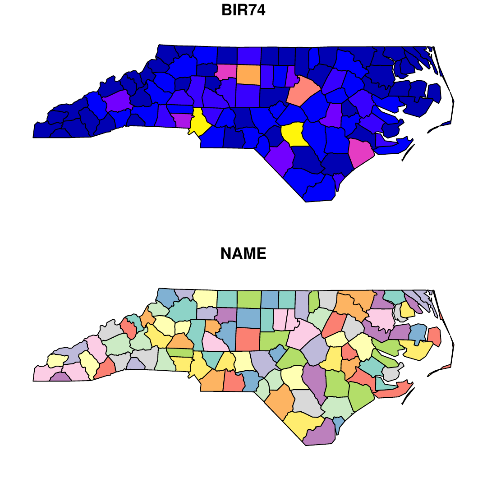
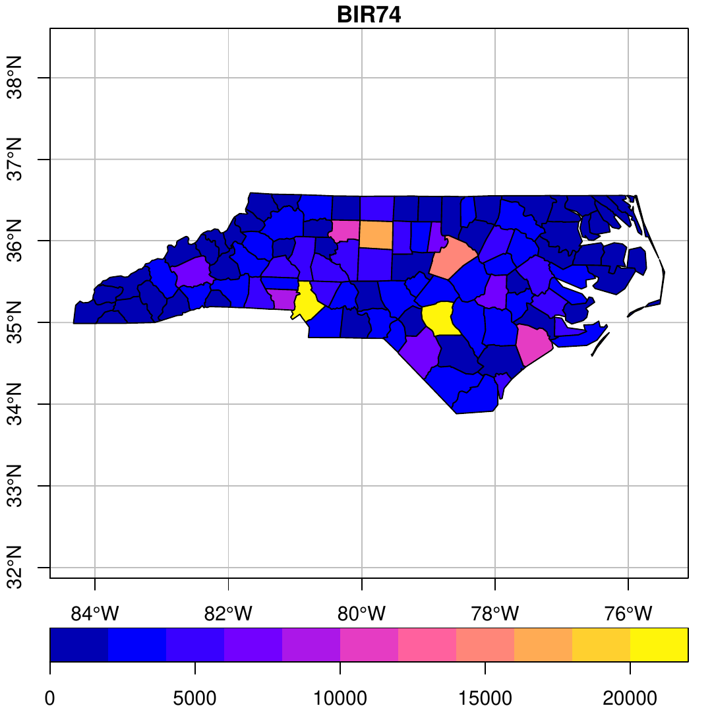
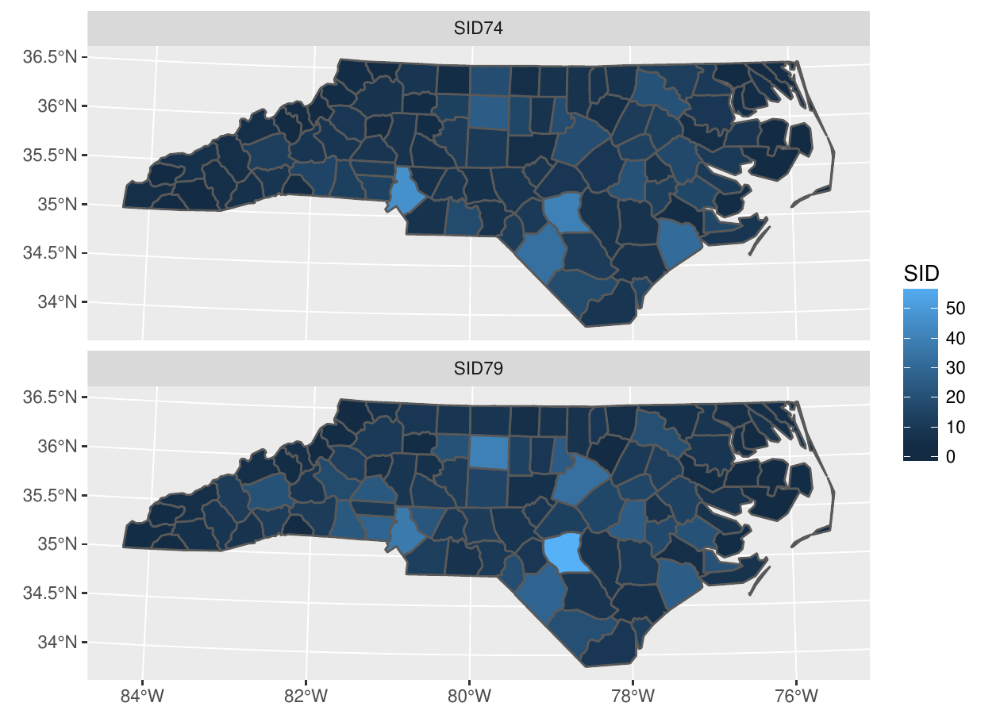
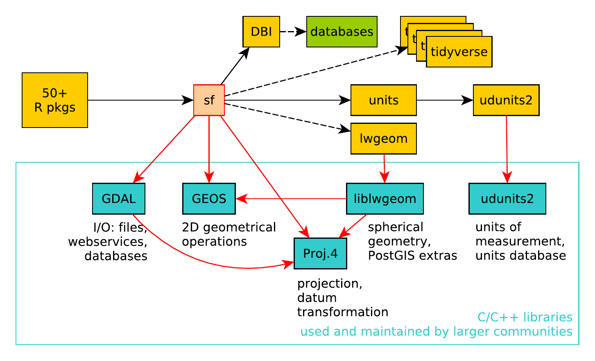

::: article
# What are simple features?

Features can be thought of as "things" or objects that have a spatial
location or extent; they may be physical objects like a building, or
social conventions like a political state. *Feature geometry* refers to
the spatial properties (location or extent) of a feature, and can be
described by a point, a point set, a linestring, a set of linestrings, a
polygon, a set of polygons, or a combination of these. The *simple*
adjective of *simple features* refers to the property that linestrings
and polygons are built from points connected by *straight* line
segments. Features typically also have other properties (temporal
properties, color, name, measured quantity), which are called *feature
attributes*. Not all spatial phenomena are easy to represent by "things
or objects:" continuous phenoma such as water temperature or elevation
are better represented as *functions* mapping from continuous or sampled
space (and time) to values [@scheider], and are often represented by
*raster* data rather than vector (points, lines, polygons) data.

*Simple feature access* [@sfa] is an international standard for
representing and encoding spatial data, dominantly represented by point,
line, and polygon geometries [@iso]. It is widely used e.g. by spatial
databases [@sfa2], GeoJSON [@geojson], GeoSPARQL [@geosparql], and open
source libraries that empower the open source geospatial software
landscape including GDAL [@gdal], GEOS [@geos], and liblwgeom (a PostGIS
component, @postgis).

# The need for a new package

The [***sf***](https://CRAN.R-project.org/package=sf) [@sf] package is
an R package for reading, writing, handling, and manipulating simple
features in R, reimplementing the vector (points, lines, polygons) data
handling functionality of packages
[***sp***](https://CRAN.R-project.org/package=sp)
[@classesmethods; @asdar],
[***rgdal***](https://CRAN.R-project.org/package=rgdal) [@rgdal] and
[***rgeos***](https://CRAN.R-project.org/package=rgeos) [@rgeos].
However, ***sp*** has some 400 direct reverse dependencies, and a few
thousand indirect ones. Why was there a need to write a package with the
potential to replace it?

First of all, at the time of writing ***sp*** (2003) there was no
standard for simple features, and the ESRI shapefile was by far the
dominant file format for exchanging vector data. The lack of a clear
(open) standard for shapefiles, the omnipresence of "bad" or malformed
shapefiles, and the many limitations of the ways it can represent
spatial data adversely affected ***sp***, for instance in the way it
represents holes in polygons, and a lack of discipline to register holes
with their enclosing outer ring. Such ambiguities could influence
plotting of data, or communication with other systems or libraries.

The *simple feature access* standard is now widely adopted, but the
***sp*** package family has to make assumptions and do conversions to
load them into R. This means that you cannot round-trip data, e.g.,
loading data in R, manipulating them, exporting them and getting the
same geometries back. With ***sf***, this is no longer a problem.

A second reason was that external libraries heavily used by R packages
for reading and writing spatial data (GDAL) and for geometrical
operations (GEOS) have developed stronger support for the simple feature
standard.

A third reason was that the package cluster now known as the
[***tidyverse***](https://CRAN.R-project.org/package=tidyverse)
[@tidyverse; @tidydata], which includes popular packages such as
[***dplyr***](https://CRAN.R-project.org/package=dplyr) [@dplyr] and
[***ggplot2***](https://CRAN.R-project.org/package=ggplot2) [@ggplot2],
does not work well with the spatial classes of ***sp***:

-   ***tidyverse*** packages assume objects not only *behave* like
    `data.frame`s (which ***sp*** objects do by providing methods), but
    *are* `data.frame`s in the sense of being a list with equally sized
    column vectors, which ***sp*** does not do.

-   attempts to "tidy" polygon objects for plotting with ***ggplot2***
    ("fortify") by creating `data.frame` objects with records for each
    polygon node (vertex) were neither robust nor efficient.

A simple (S3) way to store geometries in `data.frame` or similar objects
is to put them in a geometry list-column, where each list element
contains the geometry object of the corresponding record, or
`data.frame` "row"; this works well with the ***tidyverse*** package
family.

# Conventions

## Classes

The main classes introduced by package ***sf*** are

`"sf"`:

:   a `data.frame` (or `tbl_df`) with one or more geometry list-columns,
    and an attribute `sf_column` indicating the *active* geometry
    list-column of class `sfc`,

`"sfc"`:

:   a list-column with a set of feature geometries

`"sfg"`:

:   element in a geometry list-column, a feature geometry

`"crs"`:

:   a coordinate reference system, stored as attribute of an `"sfc"`

Except for `"sfg"`, all these classes are implemented as lists. Objects
of class `"sfg"` are subtyped according to their class, classes have the
following storage form:

`POINT`:

:   numeric vector with a single point

`MULTIPOINT`:

:   numeric matrix with zero or more points in rows

`LINESTRING`:

:   numeric matrix with zero or more points in rows

`POLYGON`:

:   list with zero or more numeric matrices (points as rows); polygon
    outer ring is followed by zero or more inner rings (holes)

`MULTILINESTRING`:

:   list with zero or more numeric matrices, points in rows

`MULTIPOLYGON`:

:   list of lists following the `POLYGON` structures

`GEOMETRYCOLLECTION`:

:   list of zero or more of the (classed) structures above

All geometries have an empty form, indicating the missing (or `NA`)
equivalent for a geometry.

## Functions and methods

::: small
::: {#tab:functions}
  ------------------------------------------------------------------------------------------------------------------------------------------------------------------------------------------------------------------------------------------
  Category            Functions
  ------------------- ----------------------------------------------------------------------------------------------------------------------------------------------------------------------------------------------------------------------
  binary predicates   `st_contains`, `st_contains_properly`, `st_covered_by`, `st_covers`, `st_crosses`, `st_disjoint`, `st_equals`, `st_equals_exact`, `st_intersects`, `st_is_within_distance`, `st_within`, `st_touches`, `st_overlaps`

  binary operations   `st_relate`, `st_distance`

  unary operations    `st_dimension`, `st_area`, `st_length`, `st_is_longlat`, `st_is_simple`, `st_is_valid`, `st_jitter`, `st_geohash`, `st_geometry_type`

  miscellaneous       `st_sample`, `st_line_sample`, `st_join`, `st_interpolate_aw`, `st_make_grid`, `st_graticule`, `sf_extSoftVersion`, `rawToHex`, `st_proj_info`

  setters             `st_set_agr`, `st_set_crs`

  constructors        `st_sfc`, `st_sf`, `st_as_sf`, `st_as_sfc`, `st_point`, `st_multipoint`, `st_linestring`, `st_multilinestring`, `st_polygon`, `st_multipolygon`, `st_geometrycollection`, `st_combine`, `st_bind_cols`

  in- & output        `st_read`, `st_read_db`, `st_write`, `st_write_db`, `read_sf`, `write_sf`, `st_drivers`, `st_layers`

  plotting            `st_viewport`, `st_wrap_dateline`, `sf.colors`
  ------------------------------------------------------------------------------------------------------------------------------------------------------------------------------------------------------------------------------------------

  : Table 1: Functions provided by package ***sf***, arranged by
  functional category.
:::
:::

Functions are listed in Table [1](#tab:functions). Some functions or
methods operate on both attributes and geometries, e.g. `aggregate` and
`summarise` compute grouped statistics and group (union) corresponding
geometries, and `st_interpolate_aw` carries out area-weighted
interpolation [@aw]. The function `st_join` joins pairs of tables based
on a geometrical predicate such as `st_intersects`.

::: small
::: {#tab:methods}
  ------------------------------------------------------------------------------------------------------------------------------------------------------------------------------------------------------------------------------------------------------------------------------------------------------------------------------------------------------------------------------------------------------------------------------------------------------------------------------------------------------------------------------------------------------------------------------------------------------------------------------------------------------------------------------------------------------------------------------------------------------------------------------------------------------------------------------------------------------------------------------------------------------------------------------------------------------------------------------------------------------------------------------------------------------------------------------------------------------------------------------------------------------------------------------------------------------------------------------------------------------------------------------------------------------------------------------------------------------------------------------------------------------------------------------------------------------------------------------------------------------------------------------------------------------------------------------------------------------------------------------------------------------------------------------------------------------------------------------------------------------------------------------------------------------------------------------------------------------------------------------------------------------------------------------------------------------------------------------------------------------------------------------------------------------------------------------------------------------------------------------------------------------------------------------------------------------------------
  class   methods
  ------- ----------------------------------------------------------------------------------------------------------------------------------------------------------------------------------------------------------------------------------------------------------------------------------------------------------------------------------------------------------------------------------------------------------------------------------------------------------------------------------------------------------------------------------------------------------------------------------------------------------------------------------------------------------------------------------------------------------------------------------------------------------------------------------------------------------------------------------------------------------------------------------------------------------------------------------------------------------------------------------------------------------------------------------------------------------------------------------------------------------------------------------------------------------------------------------------------------------------------------------------------------------------------------------------------------------------------------------------------------------------------------------------------------------------------------------------------------------------------------------------------------------------------------------------------------------------------------------------------------------------------------------------------------------------------------------------------------------------------------------------------------------------------------------------------------------------------------------------------------------------------------------------------------------------------------------------------------------------------------------------------------------------------------------------------------------------------------------------------------------------------------------------------------------------------------------------------------------
  `sfg`   `as.matrix`, `c`, `coerce`, `format`, `head`, `Ops`, `plot`, `print`, `st_as_binary`, `st_as_grob`, `st_as_text`, `st_transform`, `st_coordinates`, `st_geometry`, [`st_boundary`]{style="color: darkgreen"}, [`st_buffer`]{style="color: darkgreen"}, [`st_centroid`]{style="color: darkgreen"}, [`st_convex_hull`]{style="color: darkgreen"}, [`st_difference`]{style="color: darkgreen"}, [`st_intersection`]{style="color: darkgreen"}, [`st_line_merge`]{style="color: darkgreen"}, [`st_make_valid`]{style="color: darkgreen"}, [`st_node`]{style="color: darkgreen"}, [`st_point_on_surface`]{style="color: darkgreen"}, [`st_polygonize`]{style="color: darkgreen"}, [`st_segmentize`]{style="color: darkgreen"}, [`st_simplify`]{style="color: darkgreen"}, [`st_split`]{style="color: darkgreen"}, [`st_sym_difference`]{style="color: darkgreen"}, [`st_triangulate`]{style="color: darkgreen"}, [`st_union`]{style="color: darkgreen"}, [`st_voronoi`]{style="color: darkgreen"}, [`st_cast`]{style="color: darkred"}, [`st_collection_extract`]{style="color: darkred"}, [`st_is`]{style="color: darkred"}, [`st_zm`]{style="color: darkred"}

  `sfc`   `[`, `[<-`, `as.data.frame`, `c`, `coerce`, `format`, `Ops`, `print`, `rep`, `st_as_binary`, `st_as_text`, `st_bbox`, `st_coordinates`, `st_crs`, `st_crs<-`, `st_geometry`, `st_precision`, `st_set_precision`, `str`, `summary`, `st_transform`, [`st_boundary`]{style="color: darkgreen"}, [`st_buffer`]{style="color: darkgreen"}, [`st_centroid`]{style="color: darkgreen"}, [`st_convex_hull`]{style="color: darkgreen"}, [`st_difference`]{style="color: darkgreen"}, [`st_intersection`]{style="color: darkgreen"}, [`st_line_merge`]{style="color: darkgreen"}, [`st_make_valid`]{style="color: darkgreen"}, [`st_node`]{style="color: darkgreen"}, [`st_point_on_surface`]{style="color: darkgreen"}, [`st_polygonize`]{style="color: darkgreen"}, [`st_segmentize`]{style="color: darkgreen"}, [`st_simplify`]{style="color: darkgreen"}, [`st_split`]{style="color: darkgreen"}, [`st_sym_difference`]{style="color: darkgreen"}, [`st_triangulate`]{style="color: darkgreen"}, [`st_union`]{style="color: darkgreen"}, [`st_voronoi`]{style="color: darkgreen"}, [`st_cast`]{style="color: darkred"}, [`st_collection_extract`]{style="color: darkred"}, [`st_is`]{style="color: darkred"}, [`st_zm`]{style="color: darkred"}, [`obj_sum`]{style="color: darkblue"}, [`type_sum`]{style="color: darkblue"}

  `sf`    `[`, `[[<-`, `$<-`, `aggregate`, `cbind`, `coerce`, `merge`, `plot`, `print`, `rbind`, `st_agr`, `st_agr<-`, `st_bbox`, `st_coordinates`, `st_crs`, `st_crs<-`, `st_geometry`, `st_geometry<-`, `st_precision`, `st_set_precision`, `st_transform`, [`st_boundary`]{style="color: darkgreen"}, [`st_buffer`]{style="color: darkgreen"}, [`st_centroid`]{style="color: darkgreen"}, [`st_convex_hull`]{style="color: darkgreen"}, [`st_difference`]{style="color: darkgreen"}, [`st_intersection`]{style="color: darkgreen"}, [`st_line_merge`]{style="color: darkgreen"}, [`st_make_valid`]{style="color: darkgreen"}, [`st_node`]{style="color: darkgreen"}, [`st_point_on_surface`]{style="color: darkgreen"}, [`st_polygonize`]{style="color: darkgreen"}, [`st_segmentize`]{style="color: darkgreen"}, [`st_simplify`]{style="color: darkgreen"}, [`st_split`]{style="color: darkgreen"}, [`st_sym_difference`]{style="color: darkgreen"}, [`st_triangulate`]{style="color: darkgreen"}, [`st_union`]{style="color: darkgreen"}, [`st_voronoi`]{style="color: darkgreen"}, [`st_cast`]{style="color: darkred"}, [`st_collection_extract`]{style="color: darkred"}, [`st_is`]{style="color: darkred"}, [`st_zm`]{style="color: darkred"}, [`anti_join`]{style="color: darkblue"}, [`arrange`]{style="color: darkblue"}, [`distinct`]{style="color: darkblue"}, [`filter`]{style="color: darkblue"}, [`full_join`]{style="color: darkblue"}, [`gather`]{style="color: darkblue"}, [`group_by`]{style="color: darkblue"}, [`inner_join`]{style="color: darkblue"}, [`left_join`]{style="color: darkblue"}, [`nest`]{style="color: darkblue"}, [`mutate`]{style="color: darkblue"}, [`rename`]{style="color: darkblue"}, [`right_join`]{style="color: darkblue"}, [`sample_frac`]{style="color: darkblue"}, [`sample_n`]{style="color: darkblue"}, [`select`]{style="color: darkblue"}, [`semi_join`]{style="color: darkblue"}, [`separate`]{style="color: darkblue"}, [`slice`]{style="color: darkblue"}, [`spread`]{style="color: darkblue"}, [`summarise`]{style="color: darkblue"}, [`transmute`]{style="color: darkblue"}, [`ungroup`]{style="color: darkblue"}, [`unite`]{style="color: darkblue"}

  `crs`   `$`, `is.na`, `Ops`, `print`, `st_as_text`, `st_crs`
  ------------------------------------------------------------------------------------------------------------------------------------------------------------------------------------------------------------------------------------------------------------------------------------------------------------------------------------------------------------------------------------------------------------------------------------------------------------------------------------------------------------------------------------------------------------------------------------------------------------------------------------------------------------------------------------------------------------------------------------------------------------------------------------------------------------------------------------------------------------------------------------------------------------------------------------------------------------------------------------------------------------------------------------------------------------------------------------------------------------------------------------------------------------------------------------------------------------------------------------------------------------------------------------------------------------------------------------------------------------------------------------------------------------------------------------------------------------------------------------------------------------------------------------------------------------------------------------------------------------------------------------------------------------------------------------------------------------------------------------------------------------------------------------------------------------------------------------------------------------------------------------------------------------------------------------------------------------------------------------------------------------------------------------------------------------------------------------------------------------------------------------------------------------------------------------------------------------------

  : Table 2: Methods for ***sf*** classes: colours indicate [geometry
  operation]{style="color: darkgreen"}, [class
  manipulation]{style="color: darkred"},
  [tidyverse]{style="color: darkblue"}; and Ops refers to (a subset of)
  arithmetical operations.
:::
:::

Generic methods for `sf` objects are listed in Table [2](#tab:methods).
Many of them are for creation, extraction, and conversion, and many of
them are not needed for every-day work. Where possible, methods act
either on a geometry (`sfg`), a geometry set (`sfc`), or a geometry set
with attributes (`sf`), Methods return an object of identical class.
Coordinate reference systems (CRS) carry through all operations, except
for `st_transform`, which transforms coordinates from one reference
system into another, and hence, the CRS changes.

# Serialisations

The simple feature access defines two serialisation standards:
well-known-text (WKT) and well-known-binary (WKB). Well-known text is
the default print form and `sfc` columns can be read from WKT
`character` vectors, using `st_as_sfc`:

``` r
> library(sf)
Linking to GEOS 3.5.1, GDAL 2.1.2, proj.4 4.9.3
> (pt <- st_point(c(0,1)))
POINT (0 1)
> (pol <- st_polygon(list(rbind(c(0,0), c(1,0), c(1,1), c(0,1), c(0,0)))))
POLYGON ((0 0, 1 0, 1 1, 0 1, 0 0))
> st_as_sfc("POINT(0 1)") # returns sfc:
Geometry set for 1 feature 
geometry type:  POINT
dimension:      XY
bbox:           xmin: 0 ymin: 1 xmax: 0 ymax: 1
epsg (SRID):    NA
proj4string:    NA
POINT (0 1)
```

R native simple feature geometries can be written to WKB using
`st_as_binary`:

``` r
> st_as_binary(st_point(c(0,1)))
 [1] 01 01 00 00 00 00 00 00 00 00 00 00 00 00 00 00 00 00 00 f0 3f
> st_as_binary(st_polygon(list(rbind(c(0,0), c(1,0), c(1,1), c(0,1), c(0,0)))))
 [1] 01 03 00 00 00 01 00 00 00 05 00 00 00 00 00 00 00 00 00 00 00 00 00 00 00
[26] 00 00 00 00 00 00 00 00 00 00 f0 3f 00 00 00 00 00 00 00 00 00 00 00 00 00
[51] 00 f0 3f 00 00 00 00 00 00 f0 3f 00 00 00 00 00 00 00 00 00 00 00 00 00 00
[76] f0 3f 00 00 00 00 00 00 00 00 00 00 00 00 00 00 00 00
```

Similarly, binary encoded geometries can be read back using `st_as_sfc`.

All communication to and from the underlying libraries GDAL, GEOS and
liblwgeom, as well as direct reading and writing of geometry BLOBs in
spatial databases, uses binary serialisation and deserialisation,
written in C++. This makes code not only fast but also robust: for all
possible geometry classes, a single interface is used to communicate to
a variety of endpoints.

# Spherical geometry

The GEOS library provides a large set of operations for data in a
two-dimensional space. For unprojected, geographic data the coordinates
are longitude and latitude, and describe points on a sphere (or
ellipsoid), not on a plane. The ***sf*** package allows such data to be
passed to all geometric operations, but will emit a message if this
happens through GEOS, assuming a flat Earth. For the functions
`st_area`, `st_length`, `st_distance`, `st_is_within_distance`, and
`st_segmentize` specialized spherical functions, taken from
[***lwgeom***](https://CRAN.R-project.org/package=lwgeom) [@lwgeom], are
used. The advantage of this package e.g. over
[***geosphere***](https://CRAN.R-project.org/package=geosphere)
[@geosphere] is that it supports simple features for distance
calculations, where geosphere only computes distances between points.
Function st_sample has been modified to work for spherical coordinates
when sampling points on an area over a sphere.

It would be nice to get a (more) complete set of functions working for
spherical geometry. Potential candidate libraries to be used for this
include [***s2***](https://CRAN.R-project.org/package=s2) [@s2],
liblwgeom (part of PostGIS), CGAL [@cgal], and boost.Geometry.

# Tidy tools

During the development of ***sf***, considerable effort was put into
making the new data structures work with the tidyverse. This was done by
providing methods for ***dplyr*** verbs (Table [2](#tab:methods)), and
by helping develop a ***ggplot2*** `geom` function (next section) that
plots maps well.

The [tidy tools
manifesto](https://cran.r-project.org/web/packages/tidyverse/vignettes/manifesto.html)
prescribes four principles, which we will comment on:

1.  **Reuse existing data structures.** We use the simplest R structures
    (numeric vector for point, matrix for point set, list for any other
    set), and fully support two standardized serializations (WKT, WKB)

2.  **Compose simple functions with the pipe.** functions and methods
    were designed such that they can be used easily in pipe-based
    workflows; replacement functions like `st_crs<-` were augmented by
    `st_set_crs` to make this look better.

3.  **Embrace functional programming.** Functions were kept type-safe,
    empty geometries and empty lists are supported, and operation
    overloading was done creatively e.g. by providing `Ops` for scaling
    and shifting a polygon:

    ``` r
    > pol * 2 + pt
    POLYGON ((0 1, 2 1, 2 3, 0 3, 0 1))
    ```

    Functions like `st_join` for a spatial join allow the user to pass a
    join function that is *compatible* with `st_intersects`, making the
    spatial predicate applied for the join completely customisable.

4.  **Design for humans.** with the experience of having (co-)written
    and maintained ***sp*** for a decade, we have tried to keep ***sf***
    simple and lean. Methods were used as much as possible to keep the
    namespace small. All functions and methods start with `st_` (for
    "spacetime", following PostGIS convention) to keep them
    recognizable, and searchable using tab-completion.

# Plotting

Figure [1](#fig:plot) (left) shows the default plot for an `"sf"` object
with more than one attribute: no color keys are given, default colours
depend on whether the variable is numeric (top) or a factor (bottom).
Figure [1](#fig:plot) was obtained by:

``` r
> library(sf)
> nc = read_sf(system.file("gpkg/nc.gpkg", package="sf"))
> plot(nc[, c(9,5)])
```

When we plot a single attribute, a color key is default (unless
`key.pos=NULL`). The following command

``` r
> plot(nc[, 9], key.pos = 1, axes = TRUE, graticule = TRUE)
```

adds axes and a graticule (longitude/latitude grid lines) on the right
side of Figure [1](#fig:plot).

<figure id="fig:plot">
<p></p>
<figcaption>Figure 1: At left: default plot for <code>sf</code> object
with two attributes; on right: plot for a single attribute with color
key, axes and graticule.</figcaption>
</figure>

Figure [2](#fig:ggplot) shows a plot generated by `ggplot2` (version
2.2.1 or later):

``` r
> library(ggplot2)
> library(tidyr)
> library(dplyr)
> nc2 <- nc %>% st_transform(32119) %>% select(SID74, SID79, geom) %>% 
+   gather(VAR, SID, -geom)
> ggplot() + geom_sf(data = nc2, aes(fill = SID)) + facet_wrap( ~ VAR, ncol = 1)
```

<figure id="fig:ggplot">
<div class="center">

</div>
<figcaption>Figure 2: Plot generated with <code>ggplot2::geom_sf</code>,
the now curved graticules follow constant long/lat lines.</figcaption>
</figure>

# Rasters, time series, and units

For some users, starting with ***sf*** feels like closing an old book
(***sp***), and opening a new one. But it is not as if this new book has
a similar content, or size. It is unsure when, or even whether at all,
the hundreds of packages that use ***sp*** classes will be modified to
use the `sf` classes.

The most heard question is where raster data are in this new book:
***sp*** provides simple classes for gridded data,
[***raster***](https://CRAN.R-project.org/package=raster) [@raster]
provides heavy duty classes and a massive number of methods to work with
them, tightly integrated with the ***sp*** vector classes. The current
version of ***raster*** accepts ***sf*** objects in some of its
functions by converting them to (the smaller set of) ***sp*** objects.
At the time of writing this, we can only say that this is an area of
active discussion, exploration and development, and we will be happy to
point interested readers to where the public components of this
discussion are taking place.

Besides raster data, time series for spatial features (e.g. for
monitoring stations) are hard to map onto `sf` objects: one would either
have to put time slices in columns, or add a time column and repeat the
feature geometry for each observation. Raster data, spatial time series,
and raster time series are the focus of the [stars
project](https://github.com/r-spatial/stars).

A new aspect of the package is the ability to retrieve spatial measures
and to set e.g. distance parameters with explicit measurement units
[@units]:

``` r
> st_area(st_transform(nc[1, ], 2264)) # NC state plane, US foot
```

``` r
12244955726 US_survey_foot^2
```

``` r
> st_crs(2264)$units
```

``` r
[1] "us-ft"
```

``` r
> st_area(st_transform(nc[1, ], 2264)) %>% units::set_units(km^2) # convert:
```

``` r
1137.598 km^2
```

which might first confuse, but has the potential to prevent a whole
category of scientific errors.

# Connections to other computer systems and scalability

In many cases, analysing spatial data with R starts with importing data,
or ends with exporting data, from or to a file or database. The ability
to do this is primarily given by the well-known text (WKT) and
well-known binary (WKB) serialisations that are part of the simple
feature standard, and that are supported by ***sf***. Communication with
the GDAL, GEOS, and liblwgeom libraries uses WKB both ways. GDAL
currently has drivers for 93 different spatial vector data connections
(file formats, data bases, web services). Figure [3](#fig:deps) shows
the dependencies of ***sf*** on other R packages and system libraries. A
reason to build upon these libraries is that they are used and
maintained by, and hence reflect concensus of, the large community of
spatial data experts outside R.

<figure id="fig:deps">
<div class="center">

</div>
<figcaption>Figure 3: Dependencies of <strong><em>sf</em></strong> on
other R packages and external system libraries.</figcaption>
</figure>

Besides using GDAL, ***sf*** can directly read and write from and to
spatial databases. This currently works with PostGIS using
***RPostgreSQL***; making this work with ***RPostgres*** and in general
with spatial databases using ***DBI*** is under active development.
Initial experiments indicate that working with massive, out-of-memory
spatial databases in R is possible using the ***dbplyr*** framework.
This not only removes the memory limits of R, but also benefits from the
persistent spatial indexes of these databases.

For planar data, ***sf*** builds its spatial indexes on the fly for
spatial binary predicates (`st_intersects`, `st_contains` etc.) and its
binary operations (`st_intersection`, `st_difference` etc). A [ blog
post](http://r-spatial.org/r/2017/06/22/spatial-index.html) about the
spatial indexes in ***sf*** describes how using indexes makes these
operations feasible for larger in-memory datasets. For spherical data,
indexes e.g. provided by liblwgeom or by [s2](https://s2geometry.io/)
still need to be explored.

# Summary and further reading

We present a new package, ***sf***, for simple features in R, as a
modern alternative for parts of the ***sp***-family of packages. It
provides new foundational classes to handle spatial vector data in R,
and has been received with considerable enthusiasm and uptake. While
implementing ***sf***, several well-proven concepts have been maintained
(separation of geometries and attributes, libraries used), new links
have been made (***dplyr***, ***ggplot2***, spatial databases), and new
concepts have been explored and implemented (units, spatial indexes).

For further reading into the full capabilities of ***sf*** and its
rationale, the reader is refered to the six vignettes that come with the
package.

# Acknowledgments

Writing ***sf*** would not have been possible without all the prior work
and continuous help of Roger Bivand. Package contributers are Ian Cook,
Tim Keitt, Michael Sumner, Robin Lovelace, Hadley Wickham, Jeroen Ooms,
and Etienne Racine. All contributors to GitHub issues are also
acknowledged. Special thanks go to Dirk Eddelbuettel for developing
[***Rcpp***](https://CRAN.R-project.org/package=Rcpp) [@rcpp; @dirk].

Support from the R Consortium has been very important for the
development, visibility and fast adoption of ***sf***, and is gratefully
acknowledged. Anonymous reviewers are acknowledged for helpful comments.
:::
