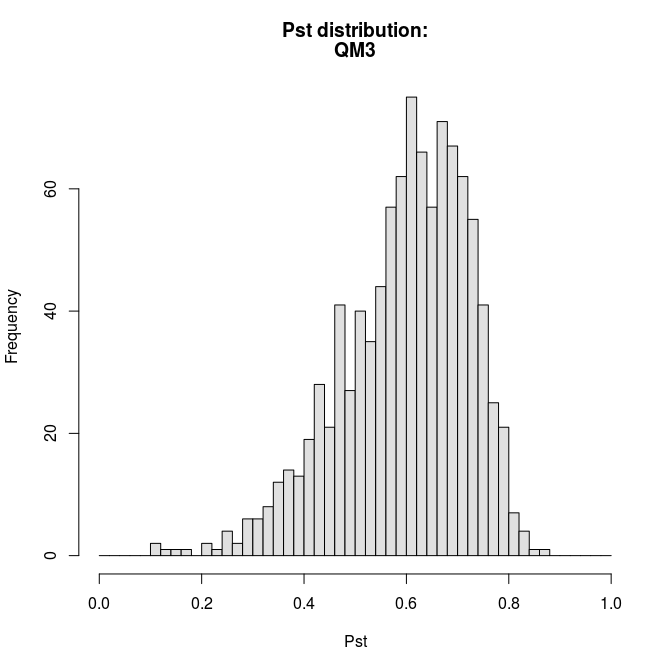

::: article
# Introduction

Understanding the causes governing patterns of morphological variations
in the wild represents a fundamental goal of evolutionary biology. In
particular, the relative importance of selective and neutral processes
behind the observed differentiation remains a crucial question.

Studies comparing differentiation in quantitative traits and neutral
markers have significantly increased over the last ten years [@lein].
Typically, a set of populations is sampled and the degree of genetic
differentiation is estimated for a set of molecular markers with the
Wright's $F_{ST}$ index [@wri]. For its part, the $Q_{ST}$ index [@spi]
assesses the degree of phenotypic differentiation over a set of
quantitative traits. The logic of $F_{ST}$ and $Q_{ST}$ comparison
relies on the assumption that the $F_{ST}$ obtained by the consideration
of neutral markers reflects the divergence only induced by genetic drift
[@rey]. Hence, $F_{ST}$ provides a null expectation and allows
estimation of the degree of population differentiation that would be
reached without selection [@mecr].

As a consequence, the comparison between $F_{ST}$ and $Q_{ST}$ leads to
three possibilities: (i) $Q_{ST} > F_{ST}$ means that quantitative
traits show a higher level of differentiation than what would have been
expected under the influence of genetic drift, such that natural
selection could induce differentiation between populations by favoring
different phenotypes (i.e., heterogeneous selection); (ii)
$Q_{ST} < F_{ST}$ could indicate the influence of natural selection, but
selecting for same optima among populations (i.e., homogeneous
selection); (iii) $Q_{ST}=F_{ST}$ means that no departure from neutral
expectations can be detected and that the degree of differentiation in
quantitative traits could have been obtained only by genetic drift, even
if the contribution of natural selection can neither be excluded nor
estimated.

@spi introduced and defined the $Q_{ST}$ quantity as follows for diploid
species assuming purely additive gene action:
$$\begin{aligned}
Q_{ST}=\frac{\sigma_{A_b}^2}{\sigma_{A_b}^2+2\sigma_{A_w}^2}\,,
\end{aligned}$$
where $\sigma_{A_b}^2$ and $\sigma_{A_w}^2$ are the morphological
additive genetic variance components between and within populations.

In the wild, the estimation of the additive genetic variance components
is challenging as breeding design is impossible. Therefore, $Q_{ST}$ is
often approximated by $P_{ST}$ [@lei], which is directly calculated from
the total phenotypic variance components with no distinction between the
relative contribution of genetic and environmental variations:
$$\begin{aligned}
\label{form}
P_{ST}=\frac{c\sigma_{b}^2}{c\sigma_{b}^2+2h^2\sigma_{w}^2}\quad\text{or}\quad P_{ST}=\frac{\frac{c}{h^2}\sigma_{b}^2}{\frac{c}{h^2}\sigma_{b}^2+2\sigma_{w}^2}\,,
\end{aligned}   (\#eq:form)$$
where $\sigma^2_b$ and $\sigma^2_w$ are the respective phenotypic
variances between and within populations, $c$ is an estimate of the
proportion of the total variance due to additive genetic effects across
populations, and $h^2$ is heritability, the proportion of phenotypic
variance due to additive genetic effects [@bro]. How well $P_{ST}$
approximates $Q_{ST}$ depends on the parameters $c$ and $h^2$, such that
if the values of $c$ and $h^2$ are known, then the phenotypic divergence
quantified by $P_{ST}$ would equal $Q_{ST}$. This implies caution in the
interpretation obtained from $P_{ST}$ [@bro].

A large number of studies have assessed the potential for natural
selection to affect morphological evolution by comparing phenotypic
divergence with neutral genetic divergence via a $P_{ST}$ versus
$F_{ST}$ approach [e.g., @mob; @lima; @he; @shi]. While estimation of
$F_{ST}$ values are included in various R packages such as
[***diveRsity***](https://CRAN.R-project.org/package=diveRsity) [@kee]
or [***hierfstat***](https://CRAN.R-project.org/package=hierfstat)
[@gou], no R package exists to deal with the $P_{ST}$ index. In this
study, we present the ***Pstat*** package to handle large datasets of
quantitative traits and correct quantitative traits taking into account
allometric growth. The package calculates $P_{ST}$ values with their
respective bootstrapped confidence intervals, and offers several options
to select individuals, traits, or populations. We also provide various
plotting tools for the visual evaluation of $P_{ST}$ and $F_{ST}$
values. We will walk through a detailed example to give an overview of
the ***Pstat*** package.

# An example to get familiar with the main functions

After loading the package with `library(Pstat)`, load the sample data
with `data(test)`. This data frame contains $200$ rows, with each row
representing an individual in a population of common wetland plants,
*Juncus effusus* (see @mic and the Dryad Digital Repository,
<https://doi.org/10.5061/dryad.bk5hk>). The data frame contains the name
of the populations (`A`, `B`, `C`, `D`, and `E`) to which each
individual belongs and eleven quantitative measures. An excerpt from the
sample data are presented in Table [1](#tab).

::: {#tab}
  ------------------------------------------------------------------------------------
              Populations      QM1          QM2         QM3        QM4     $\dots$  
  ---------- ------------- ------------ ----------- ----------- --------- --------- --
                   A        0.18487253   0.4001979   0.1694021     42      $\dots$  

      2            B        0.24023500   0.4718000   0.2178500     46      $\dots$  

      3            C        0.23499676   0.4686213   0.2060222     25      $\dots$  

      4            B        0.20495223   0.3746026   0.1846816     51      $\dots$  

      5            C        0.20739220   0.4866461   0.2131618     19      $\dots$  

      6            C        0.22545341   0.3770903   0.1882165     28      $\dots$  

      7            C        0.18371681   0.4992361   0.2167194     25      $\dots$  

   $\ldots$     $\dots$      $\dots$      $\dots$     $\dots$    $\dots$   $\dots$  
  ------------------------------------------------------------------------------------

  : Table 1: Sample from the `test` data frame, containing quantitative
  measures for individual members of *Juncus effusus* [@mic].
:::

[]{#tab label="tab"}

# The data preparation

The package can be used to transform data to eliminate variation
resulting from allometric growth. Users have the choice between three
alternatives:

1.  Residuals of a linear regression, with one of the quantitative
    variables used as the regressor [@curry];

2.  The allometric transformation described in @rei; or

3.  Aitchison's log-ratio transform [@ait].

Among a variety of univariate transformations that aim to separate size
and shape variations, @rei showed that adjustments for size using a
regression and residuals (the first option) and allometric adjustments
to a standard size (the second option) are preferred since they allow
the complete removal of size variations and have minimal impact on the
correlation and covariance structure of the data. Unlike the first two
options, the third transformation offers the benefit of keeping the same
number of variables. We provide examples of each of the three
alternatives below.

## Simple linear adjustments

The first adjustment method provided by ***Pstat*** is a simple linear
regression. Assuming the existence of linear relationships between the
dependent variable and one of the quantitative traits, the `Res`
function returns a new data frame with the residuals of the regression.
The function's arguments are as follows:

-   **data**: the studied data frame to be transformed with as many rows
    as individuals; the first column must contain the population to
    which the individual belongs and the other columns may contain
    quantitative variables.

-   **reg**: the name or the rank of the variable chosen as the
    regressor.

-   **Rp**: the names of the populations to be deleted. Default value:
    `Rp=0`, no population removed.

-   **Ri**: the line numbers of individuals to be deleted. Default
    value: `Ri=0`, no individuals removed.

We present sample output from the `test` data, using one of the
quantitative traits as the regressor. A sample of the transformed data
output by `Res` is presented in Table [2](#Re).

``` r
## Using the explanatory variable QM3 as the regressor
Res(data=test, reg="QM3")
```

::: {#Re}
  --------------------------------------------------------------------------------
              Populations       QM1             QM2            QM4        $\dots$
  ---------- ------------- -------------- --------------- -------------- ---------
                   A        0.0339245264   5.621424e-03     6.23817063    $\dots$

      2            B        0.1001268662   4.497085e-02     8.44522196    $\dots$

      3            C        0.0922422473   4.966613e-02    -12.11705813   $\dots$

      4            B        0.0574228940   -3.014565e-02   14.67271191    $\dots$

      5            C        0.0662351079   6.293798e-02    -18.38127681   $\dots$

      6            C        0.0787149904   -3.001126e-02   -8.45810788    $\dots$

      7            C        0.0433557311   7.315960e-02    -12.51293868   $\dots$

   $\ldots$     $\dots$       $\dots$         $\dots$        $\dots$      $\dots$
  --------------------------------------------------------------------------------

  : Table 2: Sample from the adjusted data frame output by `Res`, using
  `QM3` as the explanatory variable.
:::

[]{#Re label="Re"}

## Reist transformation

In the second adjustment method provided by ***Pstat***, all
morphometric measurements are standardized using the transformation
proposed by @rei.

Let $n$ be the number of individuals and $p$ the number of quantitative
traits such that $\exists\enspace k\in\{1,\dots,p\}$ and the
$k^{\text{th}}$ trait is the explanatory variable. Let us denote this
variable $(x_i)_{1\le i\le n}$ and the other traits as
$j\in\{1,\ldots,p\}\setminus\{k\}$, $(y_{ij})_{1\le i\le n}$. The Reist
transformation is
$$\begin{aligned}
&\forall i\in\{1,\ldots,n\}\enspace\text{ and }\enspace\forall j\in\{1,\ldots,p\}\setminus\{k\}\,,\\
&Y_{ij} = log(y_{ij})- b_j (log(x_{i}) - log(\overline{x}))\,,
\end{aligned}$$
where $Y_{ij}$ is the size adjusted measurement of the $j^{\text{th}}$
trait for the $i^{\text{th}}$ individual, $y_{ij}$ the original
morphometric measurement, $\overline{x}$ the population mean of the
explanatory variable, and $x_i$ the value of the explanatory variable
for the $i^{\text{th}}$ individual. For all
$j\in\{1,\ldots,p\}\setminus\{k\}$, the parameter $b_j$ is estimated for
the quantitative trait $y_j$ (i.e.  $(y_{ij})_{1\le i\le n}$) and
represents the slope of the linear regression of $log(y_j)$ on $log(x)$.

The `ReistTrans` function returns a corrected data frame. Using `QM3` as
the explanatory variable, we present a sample of the transformed data
frame in Table [3](#Rei).

``` r
## Using QM3 as the explanatory variable (identified by column number)
ReistTrans(test, reg=3)
```

::: {#Rei}
  -----------------------------------------------------------------------
              Populations      QM1          QM2         QM4      $\dots$
  ---------- ------------- ------------ ------------ ---------- ---------
                   A        -0.7445410   -0.3859875   1.631722   $\dots$

      2            B        -0.6004703   -0.3462059   1.648348   $\dots$

      3            C        -0.6167708   -0.3421063   1.388608   $\dots$

      4            B        -0.6893556   -0.4255755   1.708186   $\dots$

      5            C        -0.6669355   -0.3300087   1.266323   $\dots$

      6            C        -0.6456670   -0.4250906   1.446049   $\dots$

      7            C        -0.7175846   -0.3210021   1.384003   $\dots$

   $\ldots$     $\dots$      $\dots$      $\dots$     $\dots$    $\dots$
  -----------------------------------------------------------------------

  : Table 3: Sample from the Reist adjusted data frame using `QM3` as
  the explanatory variable.
:::

[]{#Rei label="Rei"}

## Aitchison transformation

The third adjustment method provided by ***Pstat*** performs the
Aitchison log-ratio transformation to account for individual
size-effects [@ait].

Let $n$ be the number of individuals and $p$ the number of morphological
traits. For $j\in\{1,\dots,p\}$, let $(y_{ij})_{1\le i\le n}$ represent
the quantitative variables. The formula formula for the Aitchison
transformation is as follows:
$$\begin{aligned}
&\forall i\in\{1,\dots,n\}\enspace\text{ and }\enspace\forall j\in\{1,\dots,p\}\,,\\
&Y_{ij}=log(y_{ij})-\frac{1}{p}\sum_{k=1}^plog(y_{ik})\,,
\end{aligned}$$
where $Y_{ij}$ is the transformed measure of the $j^{\text{th}}$ trait
for the $i^{\text{th}}$ individual, and $y_{ij}$ is the original value
for the $i^{\text{th}}$ individual and the $j^{\text{th}}$ trait.

The `AitTrans` function returns a corrected data frame. Sample output
are included in Table [4](#Ait).

``` r
AitTrans(test)
```

::: {#Ait}
  -------------------------------------------------------------------------------------
              Populations      QM1         QM2          QM3          QM4       $\dots$
  ---------- ------------- ----------- ------------ ----------- ------------- ---------
                   A        -1.947544   -1.6121417   -1.985498   0.408832854    \...

      2            B        -1.910214   -1.6170919   -1.952692   0.371908012   $\dots$

      3            C        -1.834151   -1.5343910   -1.891299   0.192727037   $\dots$

      4            B        -1.901481   -1.6395625   -1.946710   0.494436831   $\dots$

      5            C        -1.832709   -1.4622885   -1.820792   0.129251912   $\dots$

      6            C        -1.801889   -1.5785008   -1.880288   0.292211929   $\dots$

      7            C        -1.938699   -1.5045418   -1.866950   0.195092172   $\dots$

   $\ldots$     $\dots$      $\dots$     $\dots$      $\dots$      $\dots$     $\dots$
  -------------------------------------------------------------------------------------

  : Table 4: Sample from the Aitchison adjusted data frame.
:::

[]{#Ait label="Ait"}

# Phenotypic differentiation evaluation and confidence intervals

## $P_{ST}$ values

We are interested in determining the phenotypic differentiation across
the five populations for each of the eleven quantitative traits of the
example dataset. The function `Pst` can determine the $P_{ST}$ values of
each trait with the associated bootstrapped confidence intervals
[@boot]. The arguments to `Pst` are as follows:

-   **data**: the input data frame with as many rows as individuals; the
    first column must contain the population label and the others
    quantitative variables.

-   **ci**: if `ci=1`, the confidence intervals are added to $P_{ST}$
    values. Default value: `ci=0`.

-   **csh**: the $\frac{c}{h^2}$ value. Default value: `csh=1`.

-   **va**: a vector containing the names or column numbers of the
    quantitative measures under consideration. If `va=0`, all the
    variables are selected. Default value: `va=0`.

-   **boot**: the number of data frames generated to determine the
    confidence interval with the bootstrap method. Default value:
    `boot=1000`.

-   **Pw**: the names of the two populations considered to obtain
    pairwise $P_{ST}$. Default value: `Pw=0`, no pairwise analysis.

-   **Rp**: the names of the populations to be deleted. Default value:
    `Rp=0`, no populations removed.

-   **Ri**: the line numbers of individuals to be deleted. Default
    value: `Ri=0`, no individuals removed.

-   **pe**: the confidence level of the calculated interval. Default
    value: `pe=0.95`.

Let us apply the `Pst` function to the `test` dataset. The output from
`Pst` will be a data frame:

``` r
## Example 1:  Pairwise Pst values using populations C and D
Pst(test, csh=0.2, Pw=c("C","D"))
[1] "Populations sizes are:"
 C  D 
76 32
   Quant_Varia Pst_Values
 1         QM1  0.1749659
 2         QM2  0.7460913
...        ...        ...
 4        QM10  0.9800028

## Example 2: Pst for the 2nd variable and QM7 with 99% confidence intervals
Pst(test, va=c(2,"QM7"), ci=1, boot=10000, Ri=c(5,117:121), pe=0.99)
[1] "Populations sizes are:"
 A  B  C  D  E 
12 76 72 30  4 
  Quant_Varia Pst_Values 99 %_LowBoundCI 99 %_UpBoundCI
1         QM2  0.8561307       0.7826177      0.9198395
2         QM7  0.8851413       0.7722856      0.9376501
```

## Distribution of $P_{ST}$

The bootstrapped $P_{ST}$ values output from `BootPst` form a
distribution for the selected quantitative trait. In addition to
arguments that are shared with `Pst`, the `BootPst` function has the
following additional arguments specific to the bootstrap procedure:

-   **opt**: if `opt=0`, all the boot values of $P_{ST}$ are returned;
    if `opt="ci"`, the ordered values and the confidence interval are
    returned; and if `opt="hist"`, the ordered values and the
    distribution histogram of $P_{ST}$ are returned. Default value:
    `opt=0`.

-   **va**: the name or column number of the quantitative measure
    considered.

-   **bars**: the maximum number of bars the histogram may have. On the
    x-axis, the interval $[0,1]$ is divided into `bars` parts (there may
    exist unfilled bars). Default value: `bars=20`.

The output from the `BootPst` function is a vector with the bootstrapped
values.

Let us apply the `BootPst` function to `test` dataset:

``` r
## Example 1: Bootstrapped 95% confidence intervals for three populations (B, C, and D).
## Note that populations A and E are dropped
BootPst(test, opt="ci", va="Body_length", Rp=c("A","E"))
[1] "The studied quantitative variable is:"
[1] "Body_length"
[1] "Populations sizes are:"
 B  C  D
76 76 32
[1] "95 % confidence interval determined by 1000 bootstrap values:"
[1] 0.8757057 0.9585423
   [1] 0.7938426 0.8338286 0.8510682 0.8512374 0.8545911 0.8551115 0.8552097
   [8] 0.8637057 0.8641575 0.8644145 0.8659723 0.8671139 0.8671265 0.8676122
   [15] 0.8686147 0.8702277 0.8708352 0.8711419 0.8718030 0.8721783 0.8734932
   ...
   [995] 0.9621794 0.9625852 0.9634700 0.9644283 0.9650500 0.9689611

## Example 2: Histogram for the trait in column 3 (output in Figure 1)
BootPst(test, opt="hist", va=3, bars=50)
[1] "The studied quantitative variable is:"
[1] "QM3"
[1] "Populations sizes are:"
 A  B  C  D  E 
12 76 76 32  4 
[1] "1000 bootstrap values and Pst distribution:"
   [1] 0.1062747 0.1076470 0.1269888 0.1593121 0.1775196 0.2050347 0.2111617
   [8] 0.2327508 0.2401064 0.2487401 0.2588179 0.2589942 0.2623706 0.2722956
   [15] 0.2827915 0.2860497 0.2935858 0.2947525 0.2954878 0.2995198 0.3003267
   ...
   [995] 0.8211326 0.8253874 0.8293417 0.8318546 0.8420100 0.8635299
```

{#fig1
width="100%" alt="graphic without alt text"}

# Variations of $P_{ST}$ values and visual comparison with Wright's $F_{ST}$ index

@bro and @lima offer plots that demonstrate how $F_{ST}$ and $P_{ST}$
depend on the $\frac{c}{h^2}$ ratio. The ***Pstat*** package provides
plotting tools to perform these analyses with the function `TracePst`.
Arguments specific to `TracePst` include:

-   **va**: a vector containing the selected variables names or numbers
    (*i.e.* those of the quantitative measures considered). If `va=0`,
    all the variables are selected. Default value: `va=0`.

-   **ci**: if `ci=1`, the confidence interval of $P_{ST}$ is plotted.
    Default value: `ci=1`.

-   **Fst**: the value of Wright's $F_{ST}$, if available. Default
    value: `Fst=-1`, value of $F_{ST}$ is unavailable.

-   **xm**: x-axis maximum. Default value: `xm=2`.

-   **pts**: the number of points used to plot the curves. Default
    value: `pts=30`.

Let us apply the `TracePst` function to the `test` dataset. The plots
output are in Figure [2](#fig2).

``` r
# Aitchison adjustment method:
trans_test=AitTrans(test)

# Plots illustrating how comparisons between Fst and Pst depends on c/h^2:
TracePst(trans_test, Fst=0.3, xm=3)
[1] "Populations sizes are:"
 A  B  C  D  E 
12 76 76 32  4 
```

{#fig2 width="100%" alt="graphic without alt text"}

# Conclusion

The use of $P_{ST}$ versus $F_{ST}$ comparison has increased rapidly in
the last few years in the field of evolutionary and ecological genetics.
The ***Pstat*** package is the counterpart of existing R packages
dealing with $F$-statistics. It calculates $P_{ST}$ values, and also
provides bootstrapped confidence intervals, several graphical tools, as
well as three ways of transforming data to remove variation resulting
from allometric growth.
:::
