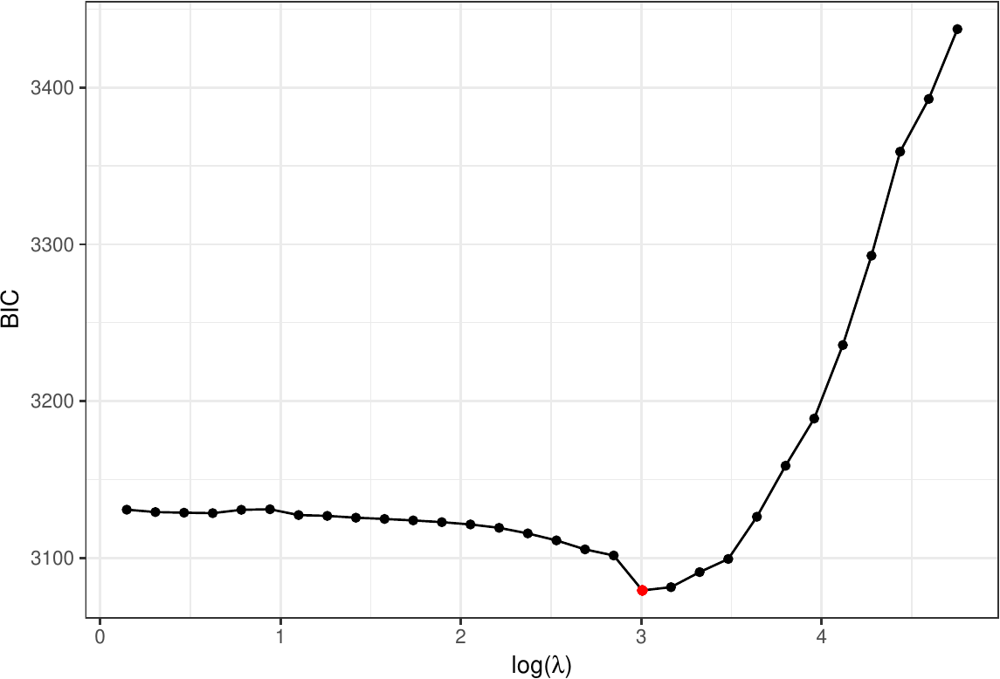
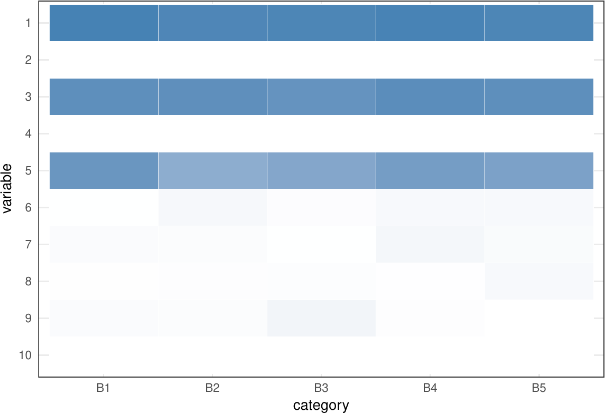
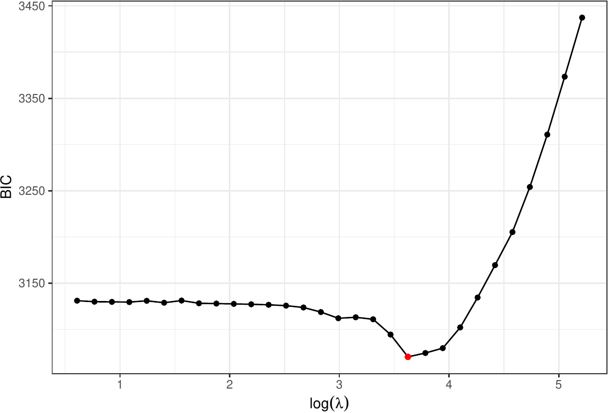
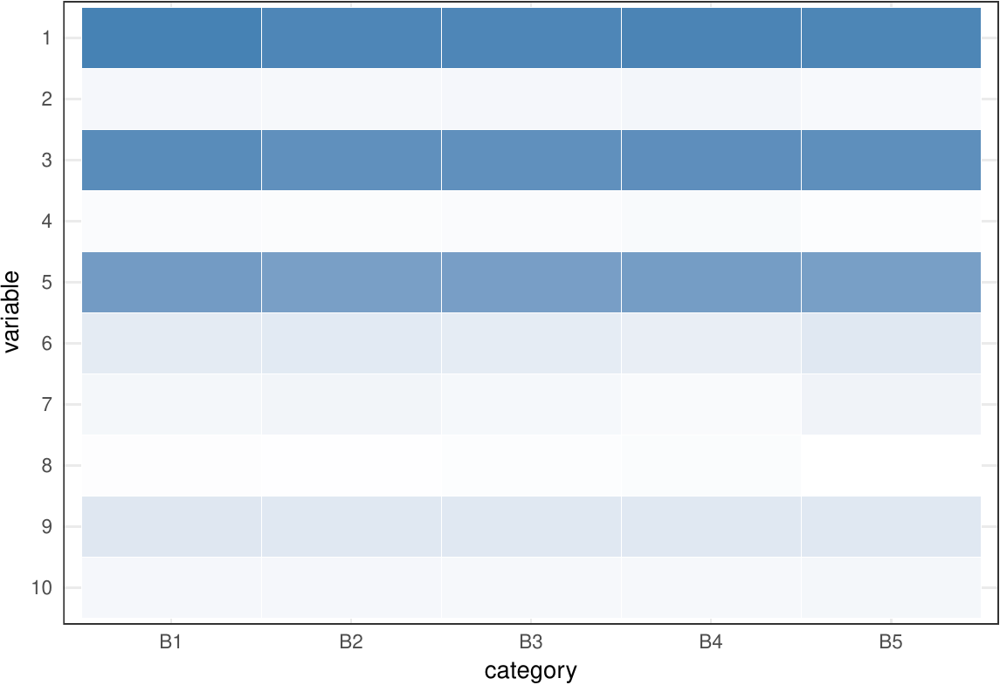
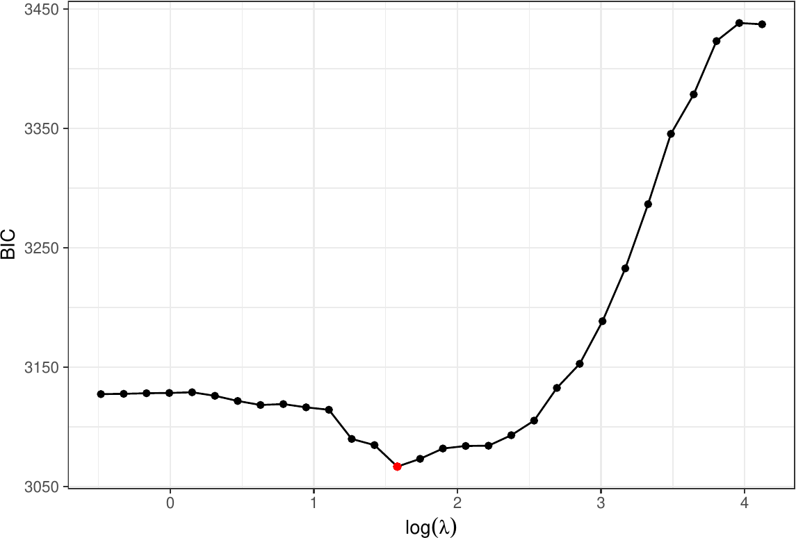
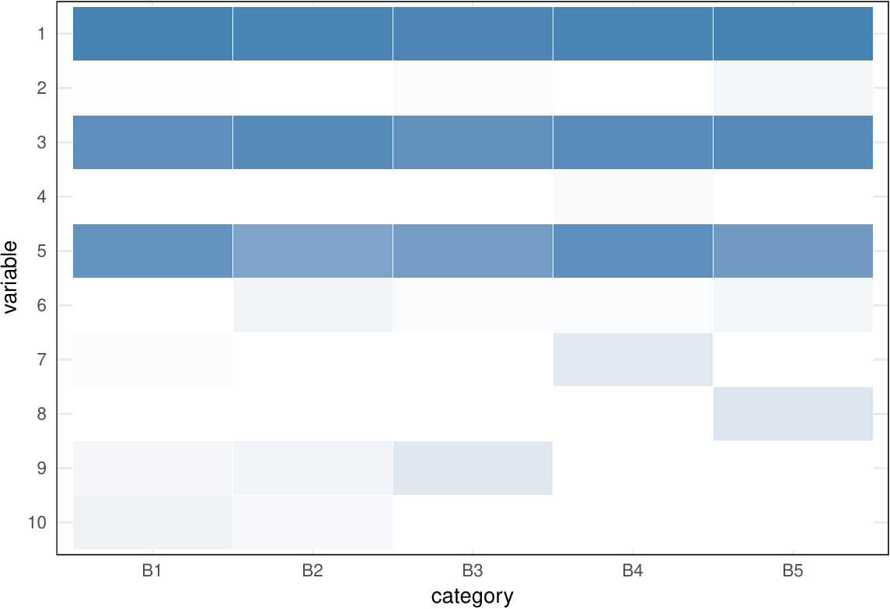

::: article
# Introduction

Multivariate categorical data arises in many fields, including genomics,
image analysis, text mining, and sports statistics. The
multinomial-logit model [@Agresti02Book Chapter 7] has been the most
popular tool for analyzing such data. However, it is limiting due to its
specific mean-variance structure and the strong assumption that the
counts are negatively correlated. Models that address over-dispersion
relative to a multinomial distribution and incorporate positive and/or
negative correlation structures would offer greater flexibility for
analysis of polytomous data.

In this article, we introduce an R package
[***MGLM***](https://CRAN.R-project.org/package=MGLM), short for
multivariate response generalized linear models. The ***MGLM*** package
provides a unified framework for random number generation, distribution
fitting, regression, hypothesis testing, and variable selection for
multivariate response generalized linear models, particularly four
models listed in Table [1](#table:models). These models considerably
broaden the class of generalized linear models (GLM) for analysis of
multivariate categorical data.

***MGLM*** overlaps little with existing packages in R and other
softwares. The standard multinomial-logit model is implemented in
several R packages [@Venables02MASS4] with
[***VGAM***](https://CRAN.R-project.org/package=VGAM)
[@Yee10VGAM; @Yee15VGAM-Book; @Yee17VGAM-Manual] being the most
comprehensive. We include the classical multinomial-logit regression
model in ***MGLM*** not only for completeness, but also to complement it
with various penalty methods for variable selection and regularization.
If invoked by the group penalty, ***MGLM*** is able to perform variable
selection at the predictor level for easier interpretation. This is
different from the elastic net penalized multinomial-logit model
implemented in [***glmnet***](https://CRAN.R-project.org/package=glmnet)
[@FriedmanHastieTibshirani10GLMCD], which does selection at the matrix
entry level. Although ***MGLM*** focuses on regression, it also provides
distribution fitting and random number generation for the models listed
in Table [1](#table:models). ***VGAM*** and
[***dirmult***](https://CRAN.R-project.org/package=dirmult)
[@Tvedebrink10Dirmult] packages can estimate the parameters of the
Dirichlet-multinomial (DM) distribution using Fisher's scoring and
Newton's method respectively. As indicated in the manual
[@Yee17VGAM-Manual], the convergence of Fisher's scoring method may be
slow due to the difficulty in evaluating the expected information
matrix. Further the Newton's method is unstable as the log-likelihood
function may be non-concave. As explained later, ***MGLM*** achieves
both stability and efficiency via a careful algorithmic design. In SAS,
`PROC LOGISTIC` can fit multinomial-logit model. In Matlab, the `mnrfit`
function fits multinomial-logit regression. Alternative link functions
(probit, loglog, complementary loglog) are implemented only for ordinal
responses. Other regression models in Table [1](#table:models) are not
implemented in either SAS or Matlab.

There are some limitations to the ***MGLM***. First, ***MGLM*** only
handles nominal responses; ordinal responses are not incorporated in
current implementation. ***MGLM*** also does not allow covariates to
take a different value for each category, which can be useful in
applications such as modeling consumer choice among a discrete number of
products [@Yee15VGAM-Book Chapter 14]. Lastly, current implementation of
***MGLM*** does not permit parameter constraints.

***MGLM*** provides standard errors for all estimates, reports
significance of regression covariates based on the Wald test (default)
or the likelihood ratio test (LRT), and outputs the AIC (Akaike
information criterion) and BIC (Bayesian information criterion) of the
fitted model to aid model choice by users. Model selection via
regularization is automated by computing the solution path on a grid of
tuning parameter values and then reporting the regularized estimate with
minimal BIC. With large data sets in mind, we pay particular attention
to computational efficiency. For numerical examples in this article, we
report the run times whenever possible. The results are obtained on a
laptop with Intel Core i7 CPU @ 2.9GHz and 16G memory using ***MGLM***
0.1.0 under R 3.4.3.

::: {#table:models}
  ---------------------------------------------------------------------------------------------
  Model                        No. regress. param.          Correlation       ***MGLM*** code
  ---------------------------- ---------------------- ----------------------- -----------------
  Multinomial                  $p(d-1)$                      Negative         `dist=’MN’`

  Dirichlet-multinomial        $pd$                          Negative         `dist=’DM’`

  Negative multinomial         $p(d+1)$ or $pd + 1$          Positive         `dist=’NegMN’`

  Gen. Dirichlet-multinomial   $2p(d-1)$               Negative and positive  `dist=’GDM’`
  ---------------------------------------------------------------------------------------------

  : Table 1: Multivariate generalized linear model implemented in the
  ***MGLM*** package. $d$ is the number of categories and $p$ is the
  number of predictors in the regression model.
:::

# Multivariate generalized linear models (MGLM) {#sec:models}

This section details the models implemented in ***MGLM***. Table
[1](#table:models) summarizes the multivariate models implemented in the
R package. They are multivariate analogs of binomial, beta-binomial, and
negative binomial models. For each model, we specify the probability
mass function of the response vector $\mathbf{y}$, the link function
that relates distribution parameters to covariates, and the
log-likelihood function of a finite sample. We start from the classical
multinomial-logit model.

## Multinomial (MN) model {#sec:MN}

The probability mass function of a $d$ dimensional multinomial sample
$\mathbf{y} = (y_1,\ldots,y_d)^T$ with batch size
$m = \sum_{j=1}^d y_{j}$ and parameter
$\boldsymbol{p} = (p_1,\ldots,p_d)$ is

$$f(\mathbf{y}|\boldsymbol{p}) = \binom{m}{\mathbf{y}} \prod_{j=1}^d p_j^{y_j}.$$

The parameter $\boldsymbol{p}$ is linked to the covariate vector
$\mathbf{x} \in \mathbb{R}^p$ via the multinomial-Poisson transformation
[@Baker94MLogit; @Lang96MLogit]

$$p_j = \frac{e^{\mathbf{x}^T \boldsymbol{\beta}_j}}{\sum_{j'}e^{\mathbf{x}^T \boldsymbol{\beta}_{j'}}}, \quad j=1,\ldots,d,$$

where
$\boldsymbol{\beta}_1,\ldots,\boldsymbol{\beta}_d \in \mathbb{R}^p$ are
the regression coefficients. For identifiability, we constrain
$\boldsymbol{\beta}_d = \boldsymbol{0}$ and only estimate
$\boldsymbol{\beta}_1,\ldots,\boldsymbol{\beta}_{d-1}$, which are
collected in the regression coefficient matrix
$\boldsymbol{B} \in \mathbb{R}^{p \times (d-1)}$. Given independent
observations $(\mathbf{y}_i,\mathbf{x}_i)$, $i=1,\ldots,n$, the
log-likelihood is

$$\ell (\boldsymbol{B}) = \sum_{i=1}^n \sum_{j=1}^d y_{ij} \left( \mathbf{x}_i ^T\boldsymbol{\beta}_j - \ln \sum_{j'=1}^d e^{\mathbf{x}_i^T \boldsymbol{\beta}_{j'}} \right) + \sum_{i=1}^n \ln \binom{m_i}{\mathbf{y}_i}.$$

Because the log-sum-exponential mapping
$(\eta_1,\ldots,\eta_d)^T \mapsto \ln \sum_j e^{\eta_j}$ is convex
[@BoydVandenberghe04Book p72], the log-likelihood function is concave.
This nice feature makes maximum likelihood estimation relatively easy
for multinomial-logit model. Unfortunately, convexity is lost in other
models listed in Table [1](#table:models).

## Dirichlet-multinomial (DM) model {#sec:DM}

The mean-variance structure of the MN model does not allow
over-dispersion, which is common in real data. DM distribution models
the probability parameter $\boldsymbol{p}$ in the MN model by a
Dirichlet distribution. The probability mass of a $d$-category count
vector $\mathbf{y}$ over $m = \sum_j y_j$ trials under DM with parameter
$\boldsymbol{\alpha} = (\alpha_1,\ldots, \alpha_d)$, $\alpha_j>0$ and
proportion vector
$\mathbf{p} \in \Delta_d = \{(p_1,\ldots,p_d): p_j \geq 0, \sum_j p_j =1\}$
is

$$\begin{aligned}
    f(\mathbf{y}|\boldsymbol{\alpha}) &= \int_{\Delta_d} \binom{m}{\mathbf{y}} \prod_j p_j^{y_j} \frac{\Gamma(\sum_j \alpha_j)}{\prod_j \Gamma(\alpha_j)} \prod_j p_j^{\alpha_j-1} \, d \boldsymbol{p} \nonumber   \\
    &= \binom{m}{\mathbf{y}} \prod_{j=1}^{d} \frac{\Gamma(\alpha_j+y_j)}{\Gamma(\alpha_j)} \frac{\Gamma(\sum_j \alpha_j)}{\Gamma(\sum_j \alpha_j + \sum_j y_j)}  \nonumber  \\
    &= \binom{m}{\mathbf{y}} \frac{\prod_{j=1}^d (\alpha_j)_{y_j}}{(\sum_j \alpha_j)_{m}},
\end{aligned}$$

where $(a)_k = a(a+1) \cdots (a+k-1)$ for nonnegative integer $k$
denotes the rising factorial. The last equality is due to the identity
$\Gamma(a+k)/\Gamma(a)=(a)_k$ [@GrahamKnuthPatashnik94book]. Because the
data $y_j$ and parameter $\alpha_j$ are intertwined in the gamma (or
rising factorial) terms and do not factorize, the DM distribution does
*not* belong to the exponential family. To incorporate covariates, the
inverse link function

$$\alpha_j = e^{\mathbf{x}^T \boldsymbol{\beta}_j}, \quad j=1,\ldots,d$$

relates the parameter $\boldsymbol{\alpha} = (\alpha_1,\ldots,\alpha_d)$
of the DM distribution to the covariates $\mathbf{x}$. The
log-likelihood for independent data points
$(\mathbf{y}_i,\mathbf{x}_i)$, $i=1,\ldots,n$, takes the form

$$\ell(\boldsymbol{B}) = \sum_{i=1}^n \sum_{j=1}^d \sum_{k=0}^{y_{ij}-1} \ln \left( e^{\mathbf{x}_i^T\boldsymbol{\beta}_j}+k \right) - \sum_{i=1}^n \sum_{k=0}^{m_i-1} \ln \left( \sum_{j=1}^d e^{\mathbf{x}_i^T\boldsymbol{\beta}_j}+k \right) + \sum_{i=1}^n \ln \binom{m_i}{\mathbf{y}_i}$$

with
$\boldsymbol{B} = (\boldsymbol{\beta}_1,\ldots,\boldsymbol{\beta}_d) \in \mathbb{R}^{p \times d}$
collecting all regression coefficients. The log-likelihood, as a
difference of two convex terms, is not concave in general.

## Negative multinomial (NegMN) model {#sec:NM}

The counts $Y_j$ in both MN and DM models are negatively correlated,
restricting their use for counts with positive correlation. The NegMN
distribution provides a natural model for positively correlated count
data. The probability mass of a count vector $\mathbf{y}$ under a NegMN
distribution with parameter $(p_1,\ldots,p_{d+1},\phi)$,
$\sum_{j=1}^{d+1} p_j=1$, $p_j,\phi>0$, is

$$f(\mathbf{y}|\boldsymbol{p},\phi) = \binom{\phi+m-1}{m} \binom{m}{\mathbf{y}} \prod_{j=1}^d p_j^{y_j} p_{d+1}^\phi = \frac{(\phi)_m}{m!} \binom{m}{\mathbf{y}} \prod_{j=1}^d p_j^{y_j} p_{d+1}^\phi,$$

where $\binom{\phi+m-1}{m} = \frac{(\phi)_m}{m!}$ is the general
binomial coefficient. The parameter $\phi$ and the data $m$ do not
factorize. Therefore, NegMN does *not* belong to the exponential family
when $\phi$ is unknown. We use the inverse link functions

$$p_j = \frac{e^{\mathbf{x}^T \boldsymbol{\alpha}_j}}{1 + \sum_{j=1}^d e^{\mathbf{x}^T \boldsymbol{\alpha}_j}}, 1 \le j \le d, \quad p_{d+1} = \frac{1}{1 + \sum_{j=1}^d e^{\mathbf{x}^T \boldsymbol{\alpha}_j}}, \quad \phi = e^{\mathbf{x}^T \boldsymbol{\beta}}$$

to relate the covariates $\mathbf{x}$ to distribution parameter
$(p_1,\ldots,p_{d+1},\phi)$. Let
$\boldsymbol{B} = (\boldsymbol{\alpha}_1, \ldots, \boldsymbol{\alpha}_d, \boldsymbol{\beta}) \in \mathbb{R}^{p \times (d+1)}$
collect all the regression coefficients. Given $n$ independent data
points $(\mathbf{y}_i,\mathbf{x}_i)$, $i=1,\ldots,n$, the log-likelihood
is

$$\begin{aligned}
    \ell(\boldsymbol{B}) &= \sum_{i=1}^n \sum_{k=0}^{m_i-1} \ln \left(e^{\mathbf{x}_i^T \boldsymbol{\beta}}+k \right) - \sum_{i=1}^n \left( e^{\mathbf{x}_i^T \boldsymbol{\beta}} + m_i \right) \ln \left( \sum_{j=1}^d e^{\mathbf{x}_i^T \boldsymbol{\alpha}_j} + 1 \right) \nonumber \\
    &  \quad + \sum_{i=1}^n \sum_{j=1}^d y_{ij} \mathbf{x}_i^T \boldsymbol{\alpha}_j - \sum_{i=1}^n \sum_{j=1}^d \ln y_{ij}!, 
\end{aligned}$$

which in general is not concave in $\boldsymbol{\alpha}_j$ and
$\boldsymbol{\beta}$.

In some applications the over-dispersion parameter $\phi$ may not depend
on the covariates $\mathbf{x}$. ***MGLM*** offers the option to model
the responses $\mathbf{y}_i$ to share a common dispersion parameter
$\phi$, without linking it to the covariates. In this case, the
log-likelihood is

$$\begin{aligned}
\ell(\boldsymbol{\alpha}_1,\ldots,\boldsymbol{\alpha}_d,\phi)
&= \sum_{i=1}^n \sum_{k=0}^{m_i-1} \ln (\phi+k) - \sum_{i=1}^n (\phi+ m_i) \ln \left( \sum_{j=1}^d e^{\mathbf{x}_i^T \boldsymbol{\alpha}_j} + 1 \right) \nonumber  \\
&  \quad + \sum_{i=1}^n \sum_{j=1}^d y_{ij} \mathbf{x}_i^T \boldsymbol{\alpha}_j - \sum_{i=1}^n \sum_{j=1}^d \ln y_{ij}!. 
\end{aligned}$$

The model size is $p d + 1$ and ***MGLM*** outputs the estimates
$(\hat{\boldsymbol{\alpha}}_1, \ldots, \hat{\boldsymbol{\alpha}}_d, \hat{\phi})$
and their standard errors.

## Generalized Dirichlet-multinomial (GDM) model {#sec:GDM}

In the previous three models, the multivariate counts have either
pairwise negative correlation (MN and DM) or pairwise positive
correlation (NegMN). It is possible to relax these restrictions by
choosing a more flexible mixing distribution for the probability vector
$\boldsymbol{p}$ in MN model. @Connor69GDM suggest a generalization of
the Dirichlet distribution that meets this challenge. The resulting
admixed distribution, called the GDM distribution, provides a flexible
model for multivariate categorical data with a general correlation
structure [@Bouguila08GDM; @ZhouLange10DMMLE].

The probability mass of a count vector $\mathbf{y}$ over
$m = \sum_j y_j$ trials under GDM with parameter
$(\boldsymbol{\alpha},\boldsymbol{\beta}) = (\alpha_1,\ldots,\alpha_{d-1},\beta_1,\ldots,\beta_{d-1})$,
$\alpha_j,\beta_j>0$, is

$$\begin{aligned}
 f(\mathbf{y}|\boldsymbol{\alpha},\boldsymbol{\beta})
& =  \binom{m}{\mathbf{y}} \prod_{j=1}^{d-1} \frac{\Gamma(\alpha_j+y_j)}{\Gamma(\alpha_j)}
\frac{\Gamma(\beta_j+z_{j+1})}{\Gamma(\beta_j)}\frac{\Gamma(\alpha_j+\beta_j)}{\Gamma(\alpha_j+\beta_j+z_j)}    \nonumber   \\
\end{aligned}$$

$$\begin{aligned}
&= \binom{m}{\mathbf{y}} \prod_{j=1}^{d-1} \frac{(\alpha_j)_{y_j} (\beta_j)_{z_{j+1}}}{(\alpha_j+\beta_j)_{z_j}}, \label{eqn:GDM-pdf}
\end{aligned}   (\#eq:eqnGDM-pdf)$$

where $z_j = \sum_{k=j}^d y_k$. Again it is clear that the GDM
distribution does not belong to the exponential family, since the
parameter $\alpha_j, \beta_j$ and data $y_j,z_j$ do not factorize.

We propose the inverse link functions

$$\alpha_j = e^{\mathbf{x}^T \boldsymbol{\alpha}_j}, \quad \beta_j = e^{\mathbf{x}^T \boldsymbol{\beta}_j}, \quad 1 \le j \le d-1,$$

to relate the covariates $\mathbf{x}$ and parameter
$(\alpha_1,\ldots,\alpha_{d-1},\beta_1,\ldots,\beta_{d-1})$ of the GDM
distribution (\@ref(eq:eqnGDM-pdf)). Let
$\boldsymbol{B} = (\boldsymbol{\alpha}_1,\ldots,\boldsymbol{\alpha}_{d-1},\boldsymbol{\beta}_1,\ldots,\boldsymbol{\beta}_{d-1}) \in \mathbb{R}^{p \times 2(d-1)}$
collect all the regression coefficients. Given $n$ independent data
points $(\mathbf{y}_i,\mathbf{x}_i)$, the log-likelihood is

$$\begin{aligned}
    \ell(\boldsymbol{B}) &= \sum_{i=1}^n \sum_{j=1}^{d-1} \left[ \sum_{k=0}^{y_{ij}-1} \ln \left(e^{\mathbf{x}_i^T\boldsymbol{\alpha}_j} + k \right) + \sum_{k=0}^{z_{i,j+1}-1} \ln \left(e^{\mathbf{x}_i^T\boldsymbol{\beta}_j} + k \right) \right. \nonumber \\
    &  \quad \left. - \sum_{k=0}^{z_{ij}-1} \ln \left(e^{\mathbf{x}_i^T \boldsymbol{\alpha}_j} + e^{\mathbf{x}_i^T \boldsymbol{\beta}_j} + k \right) \right]  + \sum_{i=1}^n \ln \binom{m_i}{\mathbf{y}_i}. 
\end{aligned}$$

Again the log-likelihood is not concave in general.

# Which model to use? {#sec:testing}

When there are no covariates, multinomial model is a special case of the
DM models, which in turn is a sub-model of the GDM model. That is,
$\text{MN} \subset \text{DM} \subset \text{GDM}$. The distribution
fitting function `MGLMfit` reports the $p$-value of the LRT for
comparing the fitted model with the most commonly used multinomial
model. NegMN model does not have such a relationship with any of the
other three models. Therefore, no LRT is performed when `dist="NegMN"`
in the distribution fitting function `MGLMfit`.

For regression, there is no nesting structure among the models in Table
[1](#table:models). The regression function `MGLMreg` outputs AIC and
BIC of the fitted model to aid users in choosing an appropriate
regression model for their data.

# Standard errors and testing {#sec:se-testing}

Standard errors for both distribution fitting (`MGLMfit`) and regression
estimates (`MGLMreg`) are calculated based on the observed information
matrix, as it provides a reasonable approximation to the expected
information matrix and is even preferred as argued by
@EfronHInkley78ExpVsObsInfo.

Unlike regression for univariate responses, the ***MGLM*** regression
parameter is a matrix
$\boldsymbol{B} = (\boldsymbol{\beta}_1, \ldots,\boldsymbol{\beta}_{d_e}) \in \mathbb{R}^{p \times d_e}$
with each row $\boldsymbol{B}_{k,\cdot}$ corresponding to the effects of
one predictor. Here $d_e = d-1$ (MN), $d$ (DM), $d+1$ (NegMN), or
$2(d-1)$ (GDM). Therefore, the hypotheses for testing the significance
of the $k$-th covariate are:

$$H_0: \|\boldsymbol{B}_{k,\cdot}^T\|_2=0 \quad \text{vs} \quad H_a: \|\boldsymbol{B}_{k, \cdot}^T\| \neq 0.$$

By default, `MGLMreg` assesses the significance of each predictor by the
Wald test. Let

$$\widehat{\boldsymbol{\Sigma}} = \boldsymbol{I}_{\text{obs}}^{-1}(\widehat{\boldsymbol{B}}) = [ - \nabla^2 \ell(\widehat{\boldsymbol{B}})]^{-1}  \in \mathbb{R}^{pd_e \times pd_e}$$

be the inverse of the observed information matrix at the maximum
likelihood estimate (MLE) $\widehat{\boldsymbol{B}}$. Then the Wald
statistic is computed as

$$W_k = \widehat{\boldsymbol{B}}_{k,\cdot} \widehat{\boldsymbol{\Sigma}}_{k,k}  \widehat{\boldsymbol{B}}_{k,\cdot}^T,$$

where $\widehat{\boldsymbol{\Sigma}}_{k,k}$ is the sub-matrix of
$\widehat{\boldsymbol{\Sigma}}$ obtained by selecting rows and columns
corresponding to the entries of $\boldsymbol{B}_{k,\cdot}$. $W_k$ is
asymptotically distributed as a chi-square distribution with $d_e$
degrees of freedom under the null distribution, yielding the $p$-values
reported by `MGLMreg`. Users can also easily invoke the LRT by calling
`MGLMreg` with option `LRT=TRUE`. LRT requires more computation than
Wald test as it needs to perform MLE on $p$ sub-models.

# Regularization {#sec:regularization}

The number of parameters, $pd_e$, in the multivariate response models
can be unwieldy with a moderate to large number of predictors. When the
sample size $n$ is limited or even smaller than $p d_e$, regularization
is necessary for variable selection, model interpretation, and improving
the risk property of the estimate. In general, the `MGLMsparsereg`
function solves the regularized problem

$$\min_{\boldsymbol{B}} \,\, - \ell(\boldsymbol{B}) + J(\boldsymbol{B}),$$

where $\ell$ is the log-likelihood function and $J$ is a penalty term.
The choice of $J$ depends on specific applications. We implemented three
classes of penalties. Below, ${\cal S}$ is an index set for the set of
predictors subject to regularization, which can be selectively specified
by the users.

In *elementwise regularization* (`penalty=’sweep’`),

$$J(\boldsymbol{B}) = \sum_{k \in {\cal S}} \sum_{j=1}^{d_e} P_\eta(|\beta_{kj}|,\lambda),$$

where $P$ is a scalar penalty function, $\lambda$ is the penalty tuning
constant, and $\eta$ is a parameter indexing member of a penalty family.
Choices of the penalty families include: power family
[@FrankFriedman93Bridge], where
$P_\eta(|x|,\lambda) = \lambda |x|^\eta$, $\eta \in (0,2]$, and in
particular lasso [@Tibshirani96Lasso] ($\eta=1$) and ridge ($\eta=2$);
elastic net [@ZouHastie05Enet], where
$P_\eta(|x|, \lambda) = \lambda [(\eta-1) x^2/2 + (2-\eta) |x|]$,
$\eta \in [1,2]$; SCAD [@FanLi01SCAD], where
$\partial / \partial |x| P_{\eta}(|x|, \lambda) = \lambda \left\{ 1_{\{|x| \le \lambda\}} + (\eta \lambda - |x|)_+ /(\eta-1)\lambda 1_{\{|x| > \lambda\}} \right\}$,
$\eta>2$; and MC+ penalty [@Zhang10MCP], where
$P_{\eta}(|x|, \lambda) = \left\{\lambda|x|-x^2 / (2\eta) \right\} 1_{\{|x|<\eta \lambda\}} + 0.5 \lambda^2 \eta 1_{\{|x| \ge \eta \lambda\}}$.
The special case of elastic net for the multinomial-logit model is also
implemented in the popular ***glmnet*** package by
@FriedmanHastieTibshirani10GLMCD using coordinate descent algorithm.
***MGLM*** implements a generic accelerated proximal gradient method
that applies to the following two penalties too.

In *groupwise regularization* (`penalty=’group’`),

$$J(\boldsymbol{B}) = \lambda \sum_{k \in {\cal S}} \|\boldsymbol{B}_{k,\cdot}\|_2 =  \lambda \sum_{k \in {\cal S}} \left( \sum_{j=1}^{d_e} \beta_{kj}^2 \right)^{1/2}.$$

The group penalty [@YuanLin06GroupLasso; @Meier08GroupLasso] achieves
variable selection at the predictor level and leads to a more
interpretable model.

Shrinkage and sparsity in terms of the rank of $\boldsymbol{B}$ is
achieved by the *nuclear norm* regularization (`penalty=’nuclear’`)

$$J(\boldsymbol{B}) = ||\boldsymbol{B}||_* = \lambda \sum_i \sigma_i(\boldsymbol{B}),$$

where $\sigma_i(\boldsymbol{B})$'s are the singular values of the matrix
$\boldsymbol{B}$. The nuclear norm $||\boldsymbol{B}||_*$ is a suitable
convex relaxation of the rank of a matrix parameter. It encourages low
rank of the parameter matrix estimate and has been successfully employed
in the matrix completion problem [@Mazumder09SVDReg], regression with
matrix covariates [@ZhouLi12MatrixLasso] and predicting at-bat results
in baseball [@PowersHastieTibshirani17Nuclear].

The wrapper function `MGLMtune` facilitates the tuning procedure by
performing the regularized estimation over a grid of 30 (default) tuning
parameter values using warm start and reports the optimal tuning
parameter according to BIC. Users can also supply their own grid points.

# Optimization algorithms and implementation {#sec:algo}

As the DM, NegMN, and GDM distributions do not belong to the exponential
family, the usual iteratively reweighted least squares method for
maximum likelihood estimation of GLM does *not* apply. The main issue
lies in the difficulty of calculating the expected information matrix,
which involves evaluating numerous tail probabilities of the marginal
distribution
[@Paul05DMFisherInfoMat; @ZhouLange10DMMLE; @ZhouZhang12EMvsMM]. On the
other hand, Newton's method suffers from instability since the
log-likelihood functions are non-concave in general.

For distribution fitting, @ZhouLange10DMMLE derive stable algorithms
based on the minorization-maximization (MM) principle
[@Lange00OptTrans]. Similar to the classical expectation-maximization
algorithm, MM algorithm increases the objective value at each iteration
and converges to a stationarity point of objective function under mild
regularity conditions.

For regression models, @ZhangZhouZhouSun17mglm propose an iteratively
reweighted Poisson regression (IRPR) method for maximum likelihood
estimation. Their derivation again hinges upon the MM principle,
resulting in the much desirable stability of the IRPR algorithm which is
critical as the number of parameters is potentially large.

In practice, MM algorithm may suffer from slow convergence especially in
the proximity of the optimum. ***MGLM*** organically combines the MM
algorithm and the Newton's method. At each iteration, it computes both
MM and Newton updates and chooses the one that results in a higher
log-likelihood. Thus, stability is ensured as the log-likelihood always
increases. When sufficiently close to the optimum, Newton's method takes
over and quickly converges to the MLE in just a few iterations.

An added advantage of the MM algorithm is that it separates parameters
and embraces parallel computing [@ZhouLangeSuchard09MM-GPU]. Each
iteration of the IRPR algorithm involves solving $d_e$ independent
Poisson regressions [@ZhangZhouZhouSun17mglm] that can be carried out in
parallel. Building upon the
[***parallel***](https://CRAN.R-project.org/package=parallel) package in
R, the `MGLMreg` regression function supports multi-threading on a
multi-core machine.

For sparse regression in the `MGLMsparsereg` function, we implemented
the accelerated proximal gradient (Nesterov) method
[@ZhangZhouZhouSun17mglm]. Each iteration only involves evaluation of
the gradient of the negative log-likelihood, followed by the
elementwise, groupwise, or singular value thresholding according to the
regularization being used, and thus scales well with the problem size.

# The R package aspect {#sec:examples}

Three main functions of the ***MGLM*** package are `MGLMfit` for fitting
multivariate distributions, `MGLMreg` for fitting multivariate response
regressions, and `MGLMsparsereg` for fitting sparse regressions. The
package adopts `S4` object system. In this section, we demonstrate their
basic usage using a simulated RNA-seq data set. The R vignette included
in the package provides more extensive examples.

The `rnaseq` data that comes with the package is simulated from the
[***isoform***](https://CRAN.R-project.org/package=isoform) package
[@Sun2014isoform; @Sun15IsoDOT] and mimics the real counts generated by
the RNA-seq platforms. The simulation mechanism follows the biological
process and has nothing to do with the models in Table
[1](#table:models).

In this example, $6$ exons are expressed in a gene. Each observation
consists of the expression levels (represented by counts) of each exon
along with covariates `totalReads`, `treatment`, `gender`, and `age` of
an individual. 200 observations are simulated. In the generative model,
exon expression levels are affected by intercept, number of total reads
(on log scale), and treatment. Age and gender are unrelated to the exon
counts.

``` r
R> library("MGLM")
R> data("rnaseq")
R> data <- rnaseq[, 1:6]
R> head(rnaseq, n = 3)
```

``` r
     X1  X2 X3  X4 X5 X6 totalReads treatment gender age
  1 295  65 19 114 54 20   28317494         0      0  57
  2 213 126 12  96 50  4   20015549         0      0  67
  3 322 147 23 245 42 19   35318251         0      1  37
```

``` r
R> dim(rnaseq)
```

``` r
  [1] 200  10
```

## Distribution fitting

We first ignore covariates and demonstrate distribution fitting and
model selection with BIC and LRT. The multi-categorical distribution
fitting is performed by the function `MGLMfit`.

The primary inputs of the function are the multi-categorical count data
in the format of data frame or matrix and the distribution intended to
fit. The user can also use the `weight` argument to specify the weight
of each observation. Initial values of the iterative algorithm can also
be determined by the user using `init` argument. The function also has
`epsilon`, `maxiters`, and `display` to control the convergence
threshold, maximum number of iterations to run, and whether to display
the result from each iteration, respectively.

The outputs are returned in a list of class "MGLMfit", including
parameter estimates, their standard errors, log-likelihood, AIC, BIC,
number of iterations to converge. The inversed information matrices and
gradients are also returned, but are not printed, in order to keep the
printed output concise. When fitting DM and GDM distribution, we also
perform LRT, testing against the null hypothesis of using multinomial
model. $p$-values of the LRTs are returned.

The following snippets fit the DM

``` r
R> system.time (
+    dmFit <- MGLMfit(data, dist = "DM")
+  )
```

``` r
     user  system elapsed 
    0.255   0.007   0.263
```

``` r
R> dmFit
```

``` r
           estimate       SE
  alpha_X1 6.128117 0.327888
  alpha_X2 2.413647 0.139676
  alpha_X3 1.625627 0.099424
  alpha_X4 6.822929 0.362568
  alpha_X5 2.214236 0.129233
  alpha_X6 0.784028 0.051369
  
  Distribution: Dirichlet Multinomial
  Log-likelihood: -4968.666
  BIC: 9969.121
  AIC: 9949.331
  LRT test p value: <0.0001
  Iterations: 6
```

and the GDM model

``` r
R> system.time(
+    gdmFit <- MGLMfit(data, dist = "GDM")
+  )
```

``` r
     user  system elapsed 
    0.380   0.019   0.399
```

``` r
R> gdmFit
```

``` r
            estimate       SE
  alpha_X1  3.741846 0.367088
  alpha_X2  2.400909 0.815431
  alpha_X3  1.558396 0.233136
  alpha_X4  6.988354 1.164764
  alpha_X5 20.689398 0.149279
  beta_X1   8.026379 0.966502
  beta_X2  11.038376 0.725978
  beta_X3   8.961428 0.264520
  beta_X4   2.702723 2.871718
  beta_X5   4.854816 0.648271
  
  Distribution: Generalized Dirichlet Multinomial
  Log-likelihood: -4841.231
  BIC: 9735.446
  AIC: 9702.463
  LRT test p value: <0.0001
  Iterations: 59
```

Both `dmFit` and `gdmFit` give the LRT $p$-value for comparing the
fitted model with the MN model. In this example, both are significantly
better than MN, with $p$-values $\ll 0.05$. To compare DM and GDM, we
can either compare their BICs or perform a formal LRT.

``` r
R> LRT <- -2 * (logLik(dmFit) - logLik(gdmFit))
R> pchisq(LRT, ncol(data) - 2, lower.tail = FALSE)
```

``` r
  [1] 5.817352e-54
```

Both suggest that GDM provides a significantly better fit than DM.

The NegMN model

``` r
R> system.time(
+    negmnFit <- MGLMfit(data, dist = "NegMN")
+  )
```

``` r
     user  system elapsed 
    0.006   0.002   0.009
```

``` r
R> print(negmnFit)
```

``` r
        estimate       SE
  p_X1  0.311486 0.001362
  p_X2  0.106491 0.000850
  p_X3  0.098373 0.000819
  p_X4  0.350496 0.001425
  p_X5  0.094263 0.000803
  p_X6  0.021220 0.000389
  phi  12.232569 1.229253
  
  Distribution: Negative Multinomial
  Log-likelihood: -20673.71
  BIC: 41384.52
  AIC: 41361.43
  LRT test p value: 
  Iterations: 3
```

yields a much larger BIC than those of DM and GDM. LRT does not apply
here, since NegMN is not a sub-model of the other three.

## Regression

The more interesting question is whether the covariates have a
significant relationship to the responses. Regressions are performed
using function `MGLMreg`. First, the regression formula is required by
the `MGLMreg` function. When specifying the regression formula, the
response matrix is on the left hand side and the covariates on the
right, following the convention in `lm` and `glm`. The model is
specified using the `dist` argument. The input argument `data` is
optional. When specified, the formula is built based on the supplied
data frame; otherwise, the function searches through the global
environment for the data elements. Similar to the distribution fitting
function, weights of the observations can be specified by the `weight`
argument, and initial values can be supplied using `init` arguments.
Parallel computing is also implemented in the package. Setting
`parallel=TRUE` and giving the number of cores using the argument `core`
invokes multi-threading. The other arguments used to control the
algorithm convergence and display include `epsilon`, `maxiters`,
`display`, and `LRT`.

The output of `MGLMreg` is a list of class "MGLMreg", containing the
estimated regression coefficients, their standard errors, Wald test
statistics and their corresponding $p$-values for each predictor,
log-likelihood, AIC, BIC, gradient and Hessian matrix at the estimate,
number of iterations, and fitted values.

We fit the four regression models in Table [1](#table:models) with all
$5$ covariates: intercept, number of total reads (on log scale),
treatment, age, and gender.

A few observations can be made from the following output. BIC indicates
the GDM model as the best fit, followed by the DM model. This is
consistent with the distribution fitting results. Note that the
hypothesis testing results in the four models are different. In the MN
model, all covariates are significant; however, this is not true because
age and gender have no effects in the generative model. DM also wrongly
identifies age as a significant predictor. Only the GDM model correctly
identifies true significant predictors.

### MN regression

``` r
R> system.time(
+    mnreg <- MGLMreg(formula = cbind(X1, X2, X3, X4, X5, X6) ~ log(totalReads) + 
+                       treatment + age + gender, data = rnaseq, dist = "MN")
+  )
```

``` r
     user  system elapsed 
    0.142   0.006   0.149
```

``` r
R> print(mnreg)
```

``` r
  Call: MGLMreg(formula = cbind(X1, X2, X3, X4, X5, X6) ~ log(totalReads) + 
      treatment + age + gender, data = rnaseq, dist = "MN")
  
  Coefficients:
              X1        X2        X3        X4        X5
  [1,]  4.942732  5.009649 -3.792216  4.435434  4.027689
  [2,] -0.112845 -0.170222  0.219277 -0.107260 -0.120928
  [3,] -0.022655 -0.043099  2.745277  1.405742  0.092246
  [4,] -0.006187 -0.009709 -0.005907 -0.010945 -0.009599
  [5,]  0.032676  0.100389  0.020663  0.103859  0.009514
  
  Hypothesis test: 
                   wald value    Pr(>wald)
  (Intercept)       144.88789 1.634268e-29
  log(totalReads)    69.92572 1.061922e-13
  treatment       18364.13260 0.000000e+00
  age                79.91023 8.762650e-16
  gender             52.33670 4.601575e-10
  
  Distribution: Multinomial
  Log-likelihood: -7506.393
  BIC: 15145.24
  AIC: 15062.79
  Iterations: 6
```

### DM regression

``` r
R> system.time(
+    dmreg <- MGLMreg(formula = cbind(X1, X2, X3, X4, X5, X6) ~ log(totalReads) + 
+                       treatment + age + gender, data = rnaseq, dist = "DM")
+  )
```

``` r
     user  system elapsed 
    0.182   0.004   0.187
```

``` r
R> print(dmreg)
```

``` r
  Call: MGLMreg(formula = cbind(X1, X2, X3, X4, X5, X6) ~ log(totalReads) + 
      treatment + age + gender, data = rnaseq, dist = "DM")
  
  Coefficients:
              X1        X2        X3        X4        X5        X6
  [1,] -0.895850 -1.096921 -8.997414 -1.736871 -1.774227 -5.646822
  [2,]  0.221988  0.186919  0.536572  0.252679  0.216672  0.347271
  [3,] -0.679291 -0.686881  1.835585  0.707954 -0.546469 -0.543134
  [4,]  0.010245  0.005227  0.009134  0.004252  0.006090  0.011642
  [5,] -0.026177  0.040244 -0.052842  0.023178 -0.058339 -0.039139
  
  Hypothesis test: 
                   wald value Pr(>wald)
  (Intercept)       14.579069  0.023796
  log(totalReads)    8.502549  0.203547
  treatment       1851.437449  0.000000
  age               13.131512  0.040994
  gender             4.133364  0.658634
  
  Distribution: Dirichlet Multinomial
  Log-likelihood: -4386.941
  BIC: 8932.831
  AIC: 8833.882
  Iterations: 9
```

### GDM regression

``` r
R> system.time(
+    gdmreg <- MGLMreg(formula = cbind(X1, X2, X3, X4, X5, X6) ~ log(totalReads) + 
+                        treatment + age + gender, data = rnaseq, dist = "GDM")
+  )
```

``` r
     user  system elapsed 
    0.219   0.003   0.224
```

``` r
R> print(gdmreg)
```

``` r
  Call: MGLMreg(formula = cbind(X1, X2, X3, X4, X5, X6) ~ log(totalReads) + 
      treatment + age + gender, data = rnaseq, dist = "GDM")
  
  Coefficients:
        alpha_X4  alpha_X1  alpha_X2   alpha_X3  alpha_X5   beta_X4
  [1,]  5.987993 -7.056673  0.456088 -10.120738  2.639396  4.661089
  [2,] -0.215099  0.555973  0.039553   0.720358 -0.016121 -0.140896
  [3,] -0.047691 -0.329320  0.979359   0.099958  0.063393  0.628878
  [4,]  0.006661 -0.004343  0.019361   0.008173  0.012397  0.003224
  [5,]  0.233006  0.374838 -0.186420  -0.202417  0.144289  0.212071
         beta_X1   beta_X2   beta_X3   beta_X5
  [1,] -9.789127  7.095061 -9.530008 -1.687615
  [2,]  0.713819 -0.222984  0.743146  0.133985
  [3,]  0.746198 -1.591630 -0.923712 -0.042441
  [4,]  0.000453  0.015945  0.012541  0.019188
  [5,]  0.273256 -0.233121 -0.270428  0.122062
  
  Hypothesis test: 
                  wald value Pr(>wald)
  (Intercept)       15.40109  0.118109
  log(totalReads)   11.04187  0.354265
  treatment       2549.23829  0.000000
  age               16.42846  0.088007
  gender            10.72122  0.379646
  
  Distribution: Generalized Dirichlet Multinomial
  Log-likelihood: -4289.281
  BIC: 8843.479
  AIC: 8678.563
  Iterations: 46
```

### NegMN regression

There are two variants of NegMN regression, depending on whether to link
over-dispersion parameter to covariates. The default setting
`regBeta=FALSE` instructs `MGLMreg` to fit the NegMN regression with all
observations sharing the same over-dispersion parameter value. There are
$pd+1$ parameters.

``` r
R> system.time(
+    negmnreg2 <- MGLMreg(formula = cbind(X1, X2, X3, X4, X5, X6) ~ 
+                           log(totalReads) + treatment + age + gender,  
+                         data = rnaseq, dist = "NegMN", regBeta = FALSE)
+  )
```

``` r
     user  system elapsed 
    0.196   0.004   0.201
```

``` r
R> print(negmnreg2)
```

``` r
  Call: MGLMreg(formula = cbind(X1, X2, X3, X4, X5, X6) ~ log(totalReads) + 
      treatment + age + gender, data = rnaseq, dist = "NegMN", 
      regBeta = FALSE)
  
  Coefficients:
  $alpha
                          X1         X2         X3         X4
  (Intercept)     -13.587385 -13.521818 -22.380101 -14.131348
  log(totalReads)   0.907716   0.850412   1.242922   0.915258
  treatment        -0.753113  -0.773507   2.014641   0.675195
  age               0.002583  -0.000938   0.002916  -0.002141
  gender           -0.060696   0.007022  -0.069502   0.012499
                          X5         X6
  (Intercept)     -14.507698 -18.526425
  log(totalReads)   0.899918   1.020360
  treatment        -0.638296  -0.730410
  age              -0.000824   0.008766
  gender           -0.083681  -0.093397
  
  $phi
      phi 
  31.6062 
  
  
  Hypothesis test: 
                   wald value    Pr(>wald)
  (Intercept)       385.75540 3.223413e-80
  log(totalReads)   368.08485 2.017976e-76
  treatment       18377.52958 0.000000e+00
  age                79.70906 4.103065e-15
  gender             54.84662 4.978098e-10
  
  Distribution: Negative Multinomial
  Log-likelihood: -8746.689
  BIC: 17657.63
  AIC: 17555.38
  Iterations: 35
```

`regBeta=TRUE` instructs `MGLMreg` to link over-dispersion parameter to
covariates and there are $p(d+1)$ regression coefficients. Small
likelihood, larger AIC/BIC and slow convergence reflects the lack of fit
of this model.

``` r
R> system.time(
+      negmnreg <- MGLMreg(formula = cbind(X1, X2, X3, X4, X5, X6) ~ 
+                            log(totalReads) + treatment + age + gender,
+                          data = rnaseq, dist = "NegMN", regBeta = TRUE)
+  )
```

``` r
     user  system elapsed 
    9.866   0.023   9.898
```

``` r
R> print(negmnreg)
```

``` r
  Call: MGLMreg(formula = cbind(X1, X2, X3, X4, X5, X6) ~ log(totalReads) + 
      treatment + age + gender, data = rnaseq, dist = "NegMN", 
      regBeta = TRUE)
  
  Coefficients:
                          X1         X2         X3         X4
  (Intercept)     -17.648355 -17.582555 -26.462109 -18.204282
  log(totalReads)   1.192057   1.134742   1.528500   1.200309
  treatment        -0.877324  -0.897715   1.890375   0.550944
  age              -0.013397  -0.016918  -0.013072  -0.018127
  gender           -0.101456  -0.033730  -0.110253  -0.028252
                          X5         X6       phi
  (Intercept)     -18.569609 -22.587821  7.543157
  log(totalReads)   1.184315   1.304725 -0.285737
  treatment        -0.762503  -0.854624  0.125412
  age              -0.016804  -0.007213  0.015871
  gender           -0.124433  -0.134173  0.041254
  
  Hypothesis test: 
                   wald value    Pr(>wald)
  (Intercept)       291.48017 3.987668e-59
  log(totalReads)   371.39226 3.232075e-76
  treatment       18377.18774 0.000000e+00
  age                81.70350 6.187095e-15
  gender             54.79955 1.633654e-09
  
  Distribution: Negative Multinomial
  Log-likelihood: -8745.162
  BIC: 17675.77
  AIC: 17560.32
  Iterations: 140
```

## Sparse regression

The function `MGLMsparsereg` performs regularized estimation. Similar to
`MGLMreg`, the inputs of the sparse regression function include
`formula`, `data`, `dist`, and the convergence controlling arguments.
The function also requires the tuning parameter `lambda`, and the
penalty type argument `penalty`. The outputs include the coefficient
estimates, log-likelihood, AIC, BIC, degrees of freedom, and the number
of iterations.

We simulate 100 data points from a 5-variate DM model using 10
covariates. Only three of them (1, 3, and 5) have non-zero effects. For
each 5-variate data point, batch size, or the total number of objects
that are put into 5 categories, is drawn from $Bin(200, 0.8)$.

``` r
R> dist <- "DM"
R> n <- 100
R> p <- 10
R> d <- 5
R> set.seed(118)
R> m <- rbinom(n, 200, 0.8)
R> X <- matrix(rnorm(n * p), n, p)
R> alpha <- matrix(0, p, d)
R> alpha[c(1, 3, 5), ] <- 1
R> Alpha <- exp(X %*% alpha)
R> Y <- rdirmn(size = m, alpha = Alpha)
R> length(m)
```

``` r
  [1] 100
```

``` r
R> head(m)
```

``` r
  [1] 167 160 162 159 156 157
```

``` r
R> head(Y)
```

``` r
       [,1] [,2] [,3] [,4] [,5]
  [1,]   24    7  112   15    9
  [2,]   34   33   31   38   24
  [3,]    0    0    0    0  162
  [4,]    7   17   84   29   22
  [5,]    0   33    0  123    0
  [6,]    0    0    3  154    0
```

``` r
R> head(rowSums(Y))
```

``` r
  [1] 167 160 162 159 156 157
```

We demonstrate the regularized estimation by group, nuclear norm, and
element-wise penalization.

### Variable selection by group penalty

With input `lambda=Inf`, `MGLMsparsereg` returns $\lambda_{\max}$, the
maximum value the tuning parameter can take such that not all regression
coefficient estimates are 0.

``` r
R> pen <- "group"
R> ngridpt <- 30
R> spmodelfit <- MGLMsparsereg(formula = Y ~ 0 + X, dist = dist, 
+                       lambda = Inf, penalty = pen)
R> maxlambda <- maxlambda(spmodelfit)
R> lambdas <- exp(seq(from = log(maxlambda), to = log(maxlambda / nrow(Y)), 
+                     length.out = ngridpt))
```

Tuning is performed on 30 grid points. The left panel of Figure
[1](#fig:DM-grouppenalty) displays the BIC trace along the solution
path.

``` r
R> BICs <- rep(0, ngridpt)
R> AICs <- rep(0, ngridpt)
R> LogLs <- rep(0, ngridpt)
R> Dofs <- rep(0, ngridpt)
R> ptm <- proc.time()
R> for (j in 1:ngridpt) {
+    if (j == 1) {
+      B0 <- matrix(0, p, ncol(coef(spmodelfit)))
+    }
+    else B0 <- B_hat
+    select.fit <- MGLMsparsereg(formula = Y ~ 0 + X, dist = dist,
+                                lambda = lambdas[j], penalty = pen, init = B0)
+    B_hat <- coef(select.fit)
+    BICs[j] <- BIC(select.fit)
+    LogLs[j] <- logLik(select.fit)
+    AICs[j] <- AIC(select.fit)
+    Dofs[j] <- dof(select.fit)
+  }
R> proc.time() - ptm
```

``` r
     user  system elapsed 
    4.469   0.026   4.500
```

``` r
R> pen <- "group"
R> ngridpt <- 30
R> spmodelfit <- MGLMsparsereg(formula = Y ~ 0 + X, dist = dist, 
+                       lambda = Inf, penalty = pen)
R> maxlambda <- maxlambda(spmodelfit)
R> lambdas <- exp(seq(from = log(maxlambda), to = log(maxlambda / nrow(Y)), 
+                     length.out = ngridpt))
```

The right panel of Figure [1](#fig:DM-grouppenalty) displays the
regularized estimate $\widehat{\boldsymbol{B}}(\lambda)$ at the tuning
parameter value with minimal BIC.

``` r
R> chosen.lambda <- lambdas[which.min(BICs)]
R> select <- MGLMsparsereg(formula = Y ~ 0 + X, dist = dist, 
+                          lambda = chosen.lambda, penalty = pen)
```

Alternatively, the function `MGLMtune` automates the tuning procedure
and reports the regularized estimate at the optimal tuning parameter
value according to BIC.

``` r
R> selectTune <- MGLMtune(Y ~ 0 + X, dist = dist, penalty = pen, ngridpt = 30,
+                         display = FALSE)
```

The option `ngridpt` sets the number of grid points $n_{\text{grid}}$
and the sequence of tuning parameters is equally spaced on the log scale
within the interval $[\lambda_{\max}/n_{\text{grid}}, \lambda_{\max}]$.

<figure id="fig:DM-grouppenalty">
<table>
<caption> </caption>
<tbody>
<tr class="odd">
<td style="text-align: center;"></td>
<td style="text-align: center;"></td>
</tr>
</tbody>
</table>
<figcaption>Figure 1: Variable selection by the group penalty. Left: BIC
trace. Right: Regularized estimate <span
class="math inline">$\widehat{\boldsymbol{B}}(\lambda)$</span> at the
optimal <span class="math inline"><em>λ</em></span> displayed in gray
scale.</figcaption>
</figure>

### Low rank regression by nuclear norm regularization

Nuclear norm regularization is invoked by setting `penalty="nuclear"`.

``` r
R> system.time (
+    select <- MGLMtune(Y ~ 0 + X, dist = "DM", penalty = "nuclear", 
+                       ngridpt = 30, display = FALSE))
```

``` r
     user  system elapsed 
    4.475   0.037   4.528
```

Figure [2](#fig:DM-nuclear) displays the BIC trace plot and the
regularized estimate at optimal $\lambda$ from the same data by the
nuclear norm penalty.

<figure id="fig:DM-nuclear">
<table>
<caption> </caption>
<tbody>
<tr class="odd">
<td style="text-align: center;"></td>
<td style="text-align: center;"></td>
</tr>
</tbody>
</table>
<figcaption>Figure 2: Low rank regression by the nuclear norm penalty.
Left: BIC trace. Right: Regularized estimate <span
class="math inline">$\widehat{\boldsymbol{B}}(\lambda)$</span> at the
optimal <span class="math inline"><em>λ</em></span> displayed in gray
scale.</figcaption>
</figure>

### Select by entries

``` r
R> system.time (
+    select <- MGLMtune(Y ~ 0 + X, dist = "DM", penalty = "sweep", ngridpt = 30, 
+                       display = FALSE))
```

``` r
     user  system elapsed 
    4.448   0.038   4.504
```

Figure [3](#fig:DM-lasso) displays the BIC trace plot and the
regularized estimate at optimal $\lambda$ from the same data by the
element-wise lasso penalty.

<figure id="fig:DM-lasso">
<table>
<caption> </caption>
<tbody>
<tr class="odd">
<td style="text-align: center;"></td>
<td style="text-align: center;"></td>
</tr>
</tbody>
</table>
<figcaption>Figure 3: Select by parameter matrix entries with L1 norm
penalty. Left: BIC trace. Right: Regularized estimate <span
class="math inline">$\widehat{\boldsymbol{B}}(\lambda)$</span> at the
optimal <span class="math inline"><em>λ</em></span> displayed in gray
scale.</figcaption>
</figure>

# Discussion {#sec:discussion}

This article introduces the ***MGLM*** package for analysis of
multivariate categorical data. Distribution fitting, regression, sparse
regression, and random number generation are implemented in a simple and
unified framework. It timely responds to the current challenge of
multivariate categorical data analysis arising from modern technology
such as RNA-seq. The R package is available on CRAN.

There are several possible extensions that would be useful to the
package. Some of them include:

1.  Alternative parameterization. Some models in Table
    [1](#table:models) admits alternative parameterization. For
    instance, the DM distribution can be re-parameterized as
    $$\theta = \frac{1}{\sum_{j} \alpha_j}, \,\, p_j = \frac{\alpha_j}{\sum_{j'} \alpha_{j'}}, \,\, j=1,\ldots,d.$$
    in terms of the proportion vector
    $\boldsymbol{p} = (p_1,\ldots,p_d) \in \Delta_d$ and the
    overdispersion parameter $\theta > 0$. Appropriate inverse link
    function can be
    $$\begin{aligned}
        p_j &= \frac{e^{\mathbf{x}^T \boldsymbol{\beta}_j}}{ 1 + \sum_{j'=1}^{d-1}e^{\mathbf{x}^T \boldsymbol{\beta}_{j'}}}, \quad j=1,\ldots,d-1, \\
        \theta &= e^{\mathbf{x}^T \boldsymbol{\beta}_d}.
    \end{aligned}$$
    The multinomial-logit model can be treated as a special case with
    $\boldsymbol{\beta}_d = \boldsymbol{0}$. @ZhouLange10DMMLE discuss
    an algorithm for distribution fitting using this parameterization.
    Corresponding estimation algorithm for the regression model needs to
    be devised and implemented. Similar re-parameterization applies to
    the GDM model.

2.  Alternative link function. Current version only implements the `log`
    link function for positive distribution parameter and `logit` link
    for the probability vector. Inclusion of alternative link functions
    such as `probit` and `cloglog` would expand the flexibility of the
    models.

3.  Ordinal categorical responses. Multinomial-logit model can be
    adapted to ordinal categorical responses [@Agresti02Book Chapter 7].
    Parallel developments and implementation for the DM, NegMN, and GDM
    models are worth considering.

4.  Parameter constraints. Current version does not allow constraints
    among regression parameters. `MGLMreg` calls `glm.fit` functions to
    fit weighted Poisson regressions in each iteration; we may call
    functions from [***glmc***](https://CRAN.R-project.org/package=glmc)
    package [@Chaudhuri06glmc] instead to incorporate parameter
    constraints.

5.  The `xij` argument [@Yee15VGAM-Book Chapter 14]. Current version
    assumes the same set of covariates for all categories. Allowing
    covariates to take different values for each category can be useful,
    e.g., for discrete choice modeling in econometrics. The
    corresponding algorithm and implementation are worth exploring.

The ***MGLM*** package for R is continually being developed.

# Acknowledgments {#acknowledgments .unnumbered}

The work is partially supported by NSF grants DMS-1127914, DMS-1310319
and NIH grants HG006139, GM105785 and GM53275.
:::
