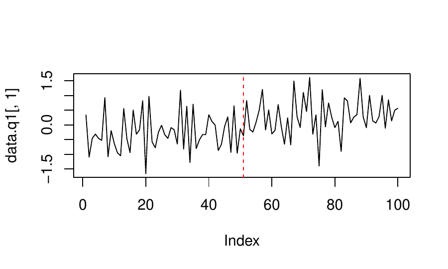

::: article
# Introduction

In this paper an R package to conduct counterfactual analysis by the
Artificial Counterfactual (ArCo) method is introduced. The ArCo
methodology is a flexible and easy-to-implement method to estimate the
causal effects of an intervention on a single treated unit and when a
control group is not readily available. The procedure consists of two
steps where, in the first stage, a counterfactual is estimated on the
basis of a large-dimensional set of variables from a pool of untreated
units ("donors pool"). In the second stage, the average intervention
effect on a vector of variables from the treated unit is estimated. The
method is robust to the presence of confounding effects, such as a
global shock and can be seen as an extension of the Synthetic Control
(SC) approach of @abadie2003economic and @Synth and the panel factor
(PF) model method put forward by @cHhsCskW2012.

Causality and counterfactual analysis are topics of major importance in
Social Sciences, Economics, Medicine, Psychology, etc. Routinely, causal
statements with respect to a given intervention (or treatment) depend on
the construction of counterfactuals, which are estimated from the
outcomes of a similar group of individuals not affected by the
intervention. Nevertheless, reaching final cause-and-effect conclusions
is a very challenging task as a consequence of the difficulties in
finding reliable sources of exogenous variation. In microeconometrics
there have been major advances in the literature and the estimation of
treatment effects is now part of the current toolbox of applied
researchers. On the other hand, when there is not a natural control
group and there is a single treated unit, which is usually the case when
handling, for example, macro (aggregated) data, the econometric tools
have evolved at a slower pace. However, in the recent past, some authors
have proposed new techniques inspired partially by the developments in
microeconometrics that are able, under some assumptions, to estimate
counterfactuals with aggregate data. The ArCo method fits into this
exciting literature. See, for example, @sAgI2016 or @sAgI2016b for
recent reviews.

## Overview

All the econometric analysis conducted with the ArCo method is on the
time dimension and it consists of the following key ingredients: the
definition of the **intervention** and the **intervention time**, the
**units** of interest (treated and untreated units) and the **observed
variables** for each unit. Units are, for example, municipalities,
states, regions, countries, products, firms, stores, etc. The
intervention occurs in one of these units starting in a given point in
time and does not affect the other units. Interventions could be war
out-breaks, terrorist attacks, policy changes, enforcement of new laws,
natural disasters, new prices, among many others. Each unit is described
by at least one variable. For example, if we are dealing with countries
the variables may be GDP and inflation and for companies they could be
profit and revenue. For products the variables could be prices and sold
quantities. All variables are observed along a period of time (days,
months, years, for example).

The ArCo method is a two-step procedure. In the first step, the data
before the occurrence of the intervention is used to estimate a
multivariate time-series regression model relating the variables in the
treated unit (dependent variables) with only the variables belonging to
the untreated peers (explanatory variables). In the second step, the
counterfactual is constructed by extrapolating the estimated model with
data **after the intervention**. The estimated effect is the time-series
average of the difference between the actual data and the
counterfactual. It is important to stress that the model is conditioned
on data from the untreated peers only and the validity of the method is
based on two key assumptions:

1.  The peers are not affected by the intervention;

2.  The data is trend-stationary.

The first assumption is common in the literature and has been also
assumed by @abadie2003economic and @cHhsCskW2012. On the other hand, the
trend-stationarity assumption has been dangerously ignored in the
literature. @cCrMmM2016perils investigate the consequences of applying
the ArCo, SC or PF methods when the data are integrated processes of
order 1. They find that without a cointegrating relationship (spurious
case) the estimator of the effects of the intervention diverges,
resulting in the rejection of the null hypothesis of no effect
regardless of its existence with probability approaching 1. For the case
when one cointegrating relationship exists, the estimator is
$\sqrt{T}$-consistent for the intervention effect albeit with a
non-standard distribution. Nevertheless, even in this case, the test of
no intervention effect is extremely oversized if nonstationarity is
ignored. When there is a drift in the data generating processes, the
estimator for both cases (cointegrated and spurious) either diverges or
is not well defined asymptotically. The authors thus strongly recommend
the use of first-differenced data to avoid spurious results in case of
integrated data. Furthermore, heterogeneous, possibly nonlinear,
**deterministic time trends** are allowed among units. See also
@bFcP2016 for a similar discussion.

High-dimensionality is relevant when the number of parameters to be
estimated is large compared to the actual sample size. This can happen
either when the number of peers and/or the number of variables for each
peer is large or when the sample size is too small. In @cmm2016arco the
authors consider a linear model estimated by the *Least Absolute
Selection and Shrinkage Operator* (LASSO) proposed by @tibshirani1996.
However, in the R package we leave the choice of the conditioning model
to the user. LASSO regressions (and extensions), regression trees and
random forests, boosted trees, neural networks, splines, factor models,
are some possible examples of models to be estimated in the first step.
The results in @cmm2016arco are derived under asymptotic limits on the
time dimension ($T$). However, the authors allow the number of peers
($n$) and the number of observed variables for each peer to grow as a
function of $T$.

## A Glimpse on the Literature and Comparison with Other Methods

The ArCo approach nests the PF method proposed by @cHhsCskW2012 and can
been seen as a generalization of the SC approach in the same lines as
discussed by @nDgI2016 and @bFcP2016. It is also better suited than
Difference-in-Differences (DiD) estimators for comparative case studies
when there is a single treated unit and no similar control group is
available, even after the inclusion of many control variables.
Furthermore, the ArCo approach relaxes the stringent parallel trend
restriction of the DiD methods.

Recently, @lGtM2016 generalize DiD estimators by considering a correctly
specified linear panel model with strictly exogenous regressors and
interactive fixed effects represented as a number of common factors with
heterogeneous loadings. Their theoretical results rely on double
asymptotics when both $T$ and $n$ go to infinity. The authors allow the
common confounding factors to have nonlinear deterministic trends. The
ArCo method differs from @lGtM2016 in several directions. First, as
mentioned before, the model is not assumed to be correctly specified and
there is no need to estimate the common factors. Consistent estimation
of factors needs that both the time-series and the cross-section
dimensions diverge to infinity and can be severely biased in small
samples. The ArCo methodology requires only the time-series dimension to
diverge. Furthermore, the regressors do not need to be strictly
exogenous which is an unrealistic assumption in most applications with
aggregate data. Heterogeneous nonlinear trends are also allowed but
there is no need to estimate them (either explicitly or via common
factors). Finally, as in the DiD case, the ArCo does not either require
the number of treated units to grow or to have a reliable control group
(after conditioning on covariates).

Although, both the ArCo and the SC methods construct a counterfactual as
a function of observed variables from a pool of peers, the two
approaches have important differences. First, the SC method relies on a
convex combination of peers to construct the counterfactual which, as
pointed out by @bFcP2016, biases the estimator. The ArCo solution is a
general, possibly nonlinear, function. Even in the case of linearity,
the method does not impose any restriction on the parameters. For
example, the restriction that weights in the SC methods are all positive
seems a bit too strong. The SC method also requires an unrealistic
identification assumption about the (perfect-)fit of the model in the
pre-intervention period. Furthermore, the weights in the SC method are
usually estimated using time averages of the observed variables for each
peer. Therefore, all the time-series dynamics is removed and the weights
are determined in a pure cross-sectional setting. In addition, the SC
method was designed to evaluate the effects of the intervention on a
single variable. In order to evaluate the effects in a vector of
variables, the method has to be applied several times. The ArCo
methodology can be directly applied to a vector of variables of
interest. In addition, there is no formal inferential procedure for
hypothesis testing in the SC method, whereas in the ArCo methodology, a
simple, uniformly valid and standard test can be applied[^1]. Finally,
as discussed in @bFcPvP2016, the SC method does not provide any guidance
on how to select the variables which determine the optimal weights[^2].

# Framework

This section aims to describe the mathematical notation and the key
definitions of the ArCo methodology in a way that is compatible with the
[***ArCo***](https://CRAN.R-project.org/package=ArCo) [@ArCo] package.
For further details on statistical properties and theoretical results,
see @cmm2016arco and @cCrMmM2016perils. Everything concerning the
technique used to estimate the first-step model is left in a very
general way as the ***ArCo*** package was developed to accept many
different classes of models. Note, however, that the theory and the
inference was developed for LASSO linear regressions.

-   **units:** Indexed by $i=1,\dots,n$. Units are, for example,
    municipalities, states, regions, countries, products, firms, stores,
    etc. The treatment occurs in one of these units and do not affect
    the others.

-   **variables:** For each unit $i$, $i=1,\dots,n$, and for every time
    period $t$, $t=1,\ldots,T$, we observe $q_i\geq1$ variables. If the
    units are, for example, firms, the variables may be sales, income,
    profit, etc. We will refer to these variables as
    $\boldsymbol{z}_{it}=(z_{it}^1,\dots,z_{it}^{q_i})$.

-   **intervention:** The intervention took place only in the treated
    unit at time $T_0=\lambda_0T$ with $\lambda_0 \in (0,1)$.

Assume, without loss of generality, that the treated unit is the first
one ($i=1$). Furthermore, let $\boldsymbol{z}_{1t}^{(0)}$ and
$\boldsymbol{z}_{1t}^{(1)}$ be the outcomes of the first unit under
treatment and without treatment, respectively. Normally, we do not
observe both outcomes simultaneously. Instead, we observe:

$$\boldsymbol{z}_{1t}=D_t\boldsymbol{z}_{1t}^{(0)}+(1-D_t)\boldsymbol{z}_{1t}^{(1)},$$
where $D_t$ assumes value 1 if the unit in under treatment at time $t$
and 0 otherwise.

The goal is to test the hypothesis on the effects of the intervention
being statistically significant for $t \geq T_0$. The interventions are
considered in the form

$$\label{eq2}
\boldsymbol{y}_{t}^{(1)} = \left \{\begin{array}{ll}
      \boldsymbol{y}_{1t}^{(0)}, & t=1,\dots,T_0-1 \\
      \boldsymbol{y}_{1t}^{(0)} + \boldsymbol{\delta}_t, & t=T_0,\ldots,T,
\end{array} \right.   (\#eq:eq2)$$
where
$\boldsymbol{y}_t^{(j)} = \boldsymbol{h}(\boldsymbol{z}_{1t}^{j})\in\mathbb{R}^q$
for $j \in \{0,1\}$, $\boldsymbol{h}(\cdot)$ is a measurable function of
$\boldsymbol{z}_{1t}$ and $\{\boldsymbol{\delta}_t\}_{t=T_0}^T$ is a
deterministic sequence. The function $\boldsymbol{h}(\cdot)$ is very
general and allows interventions on the mean, variance, covariance, etc.
The ArCo method is concerned with the following hypothesis:

$$\mathcal{H}_0: \boldsymbol{\Delta}_T = \frac{1}{T-T_0+1}\sum_{t=T_0}^T \boldsymbol{\delta}_t = 0,$$
where $\boldsymbol{\Delta}_t$ is the average treatment effect over the
treatment period.

We do not observe $\boldsymbol{y}_t^{(0)}$ for $t \geq T_0$. This
quantity is the counterfactual, i.e., what would $\boldsymbol{y}_t$ have
been in the absence of intervention. In order to proceed to the first
step estimation of the ArCo, let
$\boldsymbol{z}_{0t}=(\boldsymbol{z}'_{2t},\ldots,\boldsymbol{z}'_{nt})'$
and
$\boldsymbol{Z}_{0t}=(\boldsymbol{z}'_{0t},\ldots,\boldsymbol{z}'_{0t-p})'$
be the collection of all untreated units up to an arbitrary lag
$p \geq 0$. The dimension of $\boldsymbol{Z}_{0t}$ depends on the number
of units, the number of lags and the number of variables per unit.

Consider the following model for $\boldsymbol{y}_t^{(0)}$

$$\label{eq3}
\boldsymbol{y}_t^{(0)}=\mathcal{M}_t+\boldsymbol{v}_t,   (\#eq:eq3)$$
where $\mathbb{E}(\boldsymbol{v}_t)=\boldsymbol{0}$ and
$\mathcal{M}_t=\mathcal{M}(\boldsymbol{Z}_{0t})$. Note that
$\mathcal{M}$ is a measurable mapping in a sense that it does not need
to be an explicit function. For example, one could assume a regression
tree or a random forest structure for $\mathcal{M}_t$.

The first step of the ArCo method consists on estimating (\@ref(eq:eq3))
using the first $T_0-1$ observations, given that for $t<T_0$ we have
$\boldsymbol{y}_t = \boldsymbol{y}_t^{(0)}$. Set $T_1=T_0-1$ and
$T_2=T-T_0+1$, then one can estimate
$\widehat{\mathcal{M}}_{t,T_1}=\widehat{\mathcal{M}}_{T_1}(\boldsymbol{Z}_{0t})$
and use it to construct the counterfactual

$$\label{eq4}
\widehat{\boldsymbol{y}}_{t}^{(0)} = \left \{\begin{array}{ll}
      \boldsymbol{y}_{t}^{(0)} ,            & t=1,\dots,T_0-1 \\
     \widehat{\mathcal{M}}_{t,T_1},  & t=T_0,\dots,T.
\end{array} \right.   (\#eq:eq4)$$

Finally, the ArCo estimator is defined as

$$\label{eqarcoest}
\widehat{\boldsymbol{\Delta}}_T=\frac{1}{T-T_0+1}\sum_{t=T_0}^T \widehat{\boldsymbol{\delta}}_t,   (\#eq:eqarcoest)$$
where
$\widehat{\boldsymbol{\delta}}_t=\boldsymbol{y}_t-\widehat{\boldsymbol{y}}_t^{(0)}$
and $t=T_0,\dots,T$.

As mentioned in the Introduction, the ArCo methodology is a two-step
estimator where the first step consists on the estimation of
$\mathcal{M}$ on the pre-intervention sample and in the second step we
estimate $\widehat{\boldsymbol{\Delta}}$, which is the average
intervention impact.

## Hypothesis Testing

[@cmm2016arco] shows the conditions and results for the asymptotic
normality of $\widehat{\boldsymbol{\Delta}}_T$ and also, how to
consistently estimate its covariance matrix, given by
$\boldsymbol{\Omega}_T$. Therefore, one can obtain a confidence interval
for a chosen significance level $\alpha$ given by

$$\mathcal{I}_{j,\alpha} =\left[\widehat{\Delta}_{j,T} \pm \frac{\widehat{w}_j}{\sqrt{T}}\Phi^{-1}(1-\alpha/2) \right],$$
for each $j=1,\dots,q$, where
$\widehat{w}_j=\sqrt{\widehat{\Omega}_{jj}}$ and $\Phi^{-1}(\cdot)$ is
the quantile function of a standard normal distribution.

One can also establish a hypothesis test given that
$W_t = T \widehat{\boldsymbol{\Delta}}_T'\widehat{\boldsymbol{\Omega}}_T^{-1}\widehat{\boldsymbol{\Delta}}$
has a chi-square distribution with $q$ degrees of freedom.

The estimation of $\boldsymbol{\Omega}$ may be a challenge not because
of the ArCo itself, but because of the robust estimator we may choose.
The ***ArCo*** package allows the user to choose between the methods
below:

-   Covariance matrix assuming the errors are independent and
    identically distributed;

-   prewhitening using VAR models as in [@andrews1992]. The lag of the
    VAR may be chosen by the user or though information criterion;

-   [@newey1987] (NW) covariance matrix with quadratic spectral,
    truncated, Bartlett, Parzen or Turkey-Hanning kernels; and

-   the combination of NW and prewhitening where the NW covariance
    matrix is calculated on the residuals of the VAR.

## Unknown Intervention Time

In many cases it is reasonable to assume that the intervention time is
unknown. For example, although some new policy has started at a known
time, its effects may have been anticipated due to rational
expectations. Regardless the source of the uncertainty, what we need is
to estimate $\lambda_0$ by adjusting the ArCo estimator to be a function
of $\lambda$, $\widehat{\boldsymbol{\Delta}}_T(\lambda)$.

Set $\Lambda = (\underline{\lambda},\overline{\lambda})$ as a bound for
$\lambda_0$ to avoid finite sample bias close to the boundaries and
define $||\cdot||_p$ as the $\ell_p$ norm, then

$$\widehat{\lambda}_{0,p}=\mathop{\mathrm{arg\,max}}_{\lambda \in \Lambda} J_{T,p}(\lambda), ~~~ J_{T,p}=||\widehat{\boldsymbol{\Delta}}_T(\lambda)||_p.$$

Thus, $\widehat{\lambda}_{0,p}$ is the one that maximizes the $\ell_p$
norm of the ArCo estimator. If $\boldsymbol{\Delta} \neq 0$ then
$\widehat{\lambda}_{0,p}=\lambda_0+o_p(1)$. On the other hand, if
$\boldsymbol{\Delta} = \boldsymbol{0}$ then $\widehat{\lambda}_{0,p}$
converges in probability to any $\lambda \in \Lambda$ with equal
probability.

## Asymptotic Theory and Sample Size

The inferential procedures for the ArCo method are asymptotic. However,
simulation experiments show that the method works well in small samples
[@cmm2016arco]. It is intuitive to think that the only sample size that
matters is the one before the intervention as it is the one used to
estimate the model. However, for a given sample size $T$, it is
desirable to have the intervention as close as possible to $0.5T$
because the average treatment effect, $\boldsymbol{\Delta}$, also
depends on the period after the intervention. In practice, if the number
of variables and units is not very big, 40 to 50 observations should be
enough as we show in the Basque example when we compare the ArCo with
the Synthetic Control approach.

The first step of the ArCo is a time-series estimation. Therefore, all
the data must have the same periodicity (year, quarters, months, etc).
The Synthetic Control kills the time-series dimension of the control
variables because it uses only their average (or other statistic such as
median). This is an important difference between the methods: the ArCo
uses all the time-series information but it requires more data than the
Synthetic Control because all series must be complete (without missing
values) and in the same periodicity.

# Practical Example: the fitArCo Function

The ***ArCo*** package has two datasets that were created using the data
generation process (DGP) from the second simulation example in
[@cmm2016arco] and another dataset from the same article's empirical
example. In this section we walk through the ***ArCo*** package using
these datasets. All examples presented here are entirely reproducible
using the same codes and datasets.

The DGP is given by:

$$z_{it}^{(0)}=0.5\boldsymbol{A_i}z_{it-1}^{(0)}+\varepsilon_{i,t},\,i=1,\ldots,n,\,t=1,\ldots,T,$$
where the error has a factor structure
$\varepsilon_{i,t}=\boldsymbol{\Lambda}_i\boldsymbol{f}_t+\boldsymbol{\eta}_{it}$
with $\boldsymbol{f}_t=[1,(t/T),v_t]$, $z_{it}\in\mathbb{R}^q$,
$\boldsymbol{A_i}(q \times q)$ is a diagonal matrix with elements
between $-1$ and $1$, $\{v_t\}$ is a sequence of independent and
normally (NID) distributed random variables with zero mean and unit
variance, $\{\boldsymbol{\eta}_{it}\}$ is a sequence of NID random
vectors with zero mean and covariance matrix $(0.2)^2I_{nq}$. We set
$T=100$.

## Simple example for one variable

The two generated datasets are `data.q1` (one variable and 20 units) and
`data.q2` (two variables and 6 units). We will start with `data.q1`,
which can be loaded with the following code:

``` r
> library(ArCo)
> data(data.q1)
```

The `data.q1` is a matrix with 100 observations of 20 columns. In the
ArCo context each column is a unit, therefore, we have one variable from
each of the 20 units from the data. The intervention took place at the
first unit at $T_0=51$ by adding a constant of 0.628, which is one
standard deviation from the treated unit before the intervention. The
series in question is plotted in Figure [1](#F:fig1) with a vertical
line at $t=T_0$.

``` r
> plot(data.q1[,1], type="l")
> abline(v=51, col=2, lty=2)
```

{#F:fig1 width="100%" alt="graphic without alt text"}

The main function of the ***ArCo*** package is the function `fitArCo`,
which estimates the ArCo and provides the relevant statistics and
outputs. The data must be supplied in a list of matrices, each matrix
should have $T$ observations of one single variable for all units.
Therefore, if one has $q$ variables, the list must have $q$ matrices.
Since the `data.q1` has only one variable, we will supply the function
with a list with only one matrix.

The user can choose any model to estimate the first step of the ArCo as
long as it is possible to write a compatible estimation function
(argument `fn`) and forecasting function (argument `p.fn`). The
estimation function must receive a matrix of explanatory variables
$\boldsymbol{X}$ and the response variable $\boldsymbol{y}$ in a vector,
and it should return the estimated model; the forecasting function
receives the output from the estimation function and the argument
`newdata`[^3]. For the purposes of this example we will write a `fn` and
a `p.fn` that uses simple Ordinary Least Squares (OLS). The OLS
estimation is the default model of the `fitArCo` function in case the
user does not supply any functions.

``` r
> fn=function(X,y){
+   return(lm(y~X))
+ }
> p.fn=function(model,newdata){
+   b=coef(model)
+   return(cbind(1,newdata) %*% b)
+ }
```

The ArCo can now be estimated:

``` r
> ArCo=fitArCo(data = list(data.q1), fn = fn, p.fn = p.fn, treated.unit = 1, t0 = 51, 
VCOV.type = "nw", VCOV.lag = 3, prewhitening.kernel = TRUE)
> plot(ArCo,display.fitted=TRUE)
> ArCo$delta
                 LB     delta        UB
Variable1 0.4115779 0.5174889 0.6233999
```

{#plot2 width="100%" alt="graphic without alt text"}

The `fitArCo` generates an object of class fitArCo with S3 method for
plot[^4] (Figure [2](#plot2)). Additionally, the user can chose from
several types of robust covariance matrix estimations for
$\boldsymbol{\Delta}_T$ such as [@newey1987] with prewhitening options
from [@andrews1992]. The argument `lag` allows the inclusion of lags in
the model and the argument `Xreg` accounts for exogenous controls.
Finally, the `$delta` returns the $\boldsymbol{\Delta}_T$ and its
confidence bands for a significance level $\alpha$ chosen by the user
and `$p.value` returns the ArCo $p$-value.

## Example for Two Variables and Bootstrap Inference

In this section we show the ArCo with two variables and some additional
features from the fitArCo function such as bootstrap estimation of the
couterfactual confidence bands, which have the advantage that it can be
calculated for any model chosen by the user.

If the argument `boot.cf` is set to TRUE the function will automatically
perform block bootstrap replications of the counterfactual, the number
of replications and the block length are controlled through the
arguments `R` and `l` respectively. The bootstrap procedure uses the
package [***boot***](https://CRAN.R-project.org/package=boot) [@boot]
and is described as follows:

1.  For $t$ \< $T_0$ prepare the data in a way that the vector
    $\boldsymbol{y}_1$ contains the response variable and a matrix
    $\boldsymbol{X}_1$ contains all regressors;

2.  sample $T_0-1-lag$ observations from
    $\{\boldsymbol{y}_1', \boldsymbol{X}_1 \}$ using blocks of length
    $l$ generating the bootstrap sample
    $\{\boldsymbol{y}_1', \boldsymbol{X}_1 \}^r$;

3.  estimate the model on $\{\boldsymbol{y}_1', \boldsymbol{X}_1 \}^r$;

4.  for $t \geq T_0$, compute the forecast with the model estimated on
    step 3 using $\boldsymbol{X}_2$ as the new data;

5.  repeat steps 2-4 $R$ times to obtain the counterfactual bootstrap
    distribution.

The `data.q2` dateset has two variables for 6 units. The number of
observations is 100 and the treatment of adding up one standard
deviation (0.84 for the first variable and 0.511 for the second
variable) took place at $T_0=51$ on the first unit.

The following example estimates the ArCo using LASSO with the
[***glmnet***](https://CRAN.R-project.org/package=glmnet) [@glmnet]. The
function `fn` is `cv.glmnet` the function `p.fn` is `predict`[^5]. The
function `cv.glmnet` chooses the regularization parameter $\lambda$
using cross-validation.

``` r
> data(data.q2)
> library(glmnet)
> set.seed(123)
> ArCo2 = fitArCo(data = data.q2, fn = cv.glmnet, p.fn = predict, treated.unit = 1,
t0 = 51, VCOV.type = "nw", VCOV.lag = 3, prewhitening.kernel = TRUE,boot.cf = TRUE,
R=200,  l=3)
> plot(ArCo2, display.fitted=TRUE ,confidence.bands = TRUE, alpha = 0.05)
> ArCo2$delta
                 LB     delta        UB
Variable1 0.6801909 0.7710389 0.8618870
Variable2 0.4225233 0.5071188 0.5917144
```

{#plot3 width="100%" alt="graphic without alt text"}

Figure [3](#plot3) shows the counterfactual with $95\%$ confidence
bands. The red line shows if the chosen model has an acceptable
performance in-sample. Moreover, the `$delta` shows that the treatment
was different from zero on both variables and the point value of
$\widehat{\boldsymbol{\Delta}}_T$ is close the value used to generate
the data (0.84 and 0.511 for variables 1 and 2 respectively).

## Practical Advice on the Use of the fitArCo Function

A potential issue for the practitioner is the choice of the function
used to estimate the model in the first step of the ArCo (`fn`) method
and the corresponding prediction function (`p.fn`). The default is to
estimate the ArCo using OLS because it is a simple procedure and require
no extra packages. However, the most recommended model approach is to
use LASSO to estimate a linear model due to its good properties in
high-dimensional settings and, more importantly, because most the
asymptotic theory for the ArCo method was developed for LASSO
(high-dimensions) and OLS (low-dimensions). Nevertheless, the user is
free to use any other models such as Random Forest, Boosted Trees,
Neural Networks, Factor Models, etc. In these cases, the user should be
aware that the inference on the average treatment effect may not be
valid and should only be used as an approximation. We recommend doing
some simulation tests under the null hypothesis (no treatment) and under
the alternative hypothesis (treatment different from zero) if the user
chooses to use an estimation approach different from LASSO and OLS[^6].

The `fitArCo` accepts extra arguments to be passed to the `fn` function.
This is not particularly useful for LASSO or OLS, but if the user
chooses models that require tuning (Boosted Trees, Random Forest, etc)
extra arguments may be required.

The `fitArCo` function returns all the inference regarding the average
treatment effect (confidence intervals and $p$-values). We included
several built-in methods in case a robust covariance matrix is required.
We recommend the user to test the first-stage residuals for
autocorrelation and heteroskedasticity. If these features are present in
the residuals the most common solution is to use Newey-West
(`VCOV.type="nw"`) with Quadratic Spectral kernel (default). The optimal
lag for the covariance matrix is calculated automatically but the user
may force it through the argument `VCOV.lag`.

The entire list of what the function `fitArCo` function returns is:

-   **cf:** $T_2 \times q$ matrix of the estimated counterfactual.

-   **fitted.values:** $(T_1-lag) \times q$ matrix with the fitted
    values for the pre-treatment period.

-   **model:** A list with $q$ estimated models, one for each variable.
    Each model is the exact output of the `fn` function.

-   **delta:** The delta statistics for each variable and its confidence
    interval.

-   **p.value:** The ArCo p-value.

-   **data:** The data used.

-   **t0:** The intervention period used.

-   **treated.unit:** The treated unit used.

-   **boot.cf:** A list with the bootstrap result (boot.cf=TRUE) or
    logical FALSE (boot.cf=FALSE). In the first case, each element in
    the list refers to one bootstrap replication of the counterfactual,
    i.e. the list length is R.

-   **call:** The matched call.

# The estimate_t0 Function

We mentioned earlier that in many cases the exact intervention period
might be unknown, but it can be estimated using the maximization of the
norm of $\boldsymbol{\Delta}_T(\lambda)$. This is precisely what the
function `estimate_t0` does. The example below uses the dataset
`data.q2` and LASSO to estimate the model as in the previous example.
The arguments `start` and `end` determine the range of $\lambda$ where
the function should search for $\lambda_0$ and consequently $T_0$. The
value of $T_0$ returned by the function was 53, which is very close to
the 51 used to generate the data. The user can also see the value of the
norm of $\boldsymbol{\Delta}_T$ correspondent to the estimated $T_0$.

``` r
> library(glmnet)
> set.seed(123)
> data("data.q2")
> t0=estimate_t0(data = data.q2, fn = cv.glmnet, p.fn = predict, treated.unit = 1,
start = 0.4, end = 0.9)
> t0$t0
[1] 53
> t0$delta.norm
[1] 0.9209421
```

The natural step that follows is to use the estimated $T_0$ on the
`fitArCo` function. The results will obviously be very similar to the
ones presented on the previous section because the estimated $T_0$ is
nearly the same as the value used to generate the data.

# Application to Real Data

This sections shows the ***ArCo*** package working on two different
examples with real data. The first example is from [@cmm2016arco] and it
shows the effects on inflation of an tax evasion program on the
Brazilian metropolitan area of São Paulo. The second example uses data
from the package [***Synth***](https://CRAN.R-project.org/package=Synth)
[@Synth] to compare the ArCo with the Synthetic Control
[@abadie2003economic; @abadie2010synthetic].

So far we have used OLS and cross-validation LASSO to make the examples
as simple as possible. However, there are some advantages on selecting
the LASSO regularization parameter using information criterion such as
the Bayesian Information Criterion (BIC), which allow us to consistently
estimate the degrees of freedom of the model [@zou2007degrees].
Moreover, choosing by information criterion is faster and avoids further
complications created by cross-validation on time-series. For the next
examples we will define the functions `fn` and `p.fn` to to select the
model using the BIC as follows:

``` r
> fn=function (x, y){
+   n=length(y)
+   model = glmnet(x = x, y = y)
+   coef = coef(model)
+   df = model$df
+   yhat=cbind(1,x)%*%coef
+   residuals = (y- yhat)
+   mse = colMeans(residuals^2)
+   nvar = df + 1
+   bic = n*log(mse)+nvar*log(n)
+   selected= which(bic == min(bic))
+   return(coef[,selected])
+ }
> 
> p.fn=function(model,newdata){
+   return(cbind(1,newdata) %*% model)
+ }
```

## The Effects of an Anti Tax Evasion Program

In October 2007 the government of the Brazilian state of São Paulo
launched an anti tax evasion program called *Nota Fiscal Paulista*
(NFP). It consists of a refund from a state tax on the circulation of
products and services. The NFP acts as an incentive for the consumer to
ask for electronic sales receipt. The receipts give the consumer the
right to participate on monthly lotteries promoted by the government and
the tax rebate if his tax identifier number (CPF) is included in the
receipt.

The NFP program received substantial support from the population. In
January 2008, 413 thousand people were already registered in the program
while in October 2013 this number of participants were more than 15
million.

The problem arises if we assume that there was some degree of tax
evasion occurring before the intervention, and once the consumers start
demanding the receipts, the sellers were forced to pay more tax and
evasion became more difficult. If the sellers have some degree of market
power they might increase prices in order to accommodate the extra tax.
If these assumptions are true one would expect an upward movement on
prices due to an increase on marginal costs. Therefore, the example
presented in this section tries to investigate whether the NFP had and
impact on consumers price in São Paulo.

The first sector to have the NFP was restaurants, therefore the Food
Away from Home component (FAH) of the Consumer Prices Index (CPI) is a
good measure to contemplate the entire program from the start. The
sample is available on the ***ArCo*** package with the name of
`inflationNFP`. It consists of nine Brazilian metropolitan areas
including São Paulo from January 1995 to September 2009. Each
metropolitan area has the interpretation of an ArCo unit. The variables
are the FAH component of the CPI inflation and the monthly GDP growth
for all metropolitan areas. The treatment happened at $T_0=34$,
therefore, we have 33 observations to estimate the first step of the
ArCo and 23 observations to calculate the counterfactual.

``` r
> library(glmnet)
> data("inflationNFP")
> t0=34
> ArCoNFP=fitArCo(inflationNFP,fn,p.fn,1,t0,VCOV.type = "nw",VCOV.lag = 2, 
prewhitening.kernel = TRUE)
> plot(ArCoNFP,plot=1,display.fitted = TRUE)
> ArCoNFP$delta
                       LB         delta          UB
inflationFAH  0.226033437  0.4226199609 0.619206484
GDP          -0.004699182 -0.0006055599 0.003488062
> ArCoNFP$p.value
       Joint inflationFAH          GDP 
1.333664e-04 2.514289e-05 7.718676e-01 
```

{#plot4 width="100%" alt="graphic without alt text"}

The `$delta` shows that in fact there was a significant impact on
inflation caused by the NFP. The impact on the GPD was statistically
zero. The `$p.value` relates to an overall effect considering all
variables, and it also shows that the effects of the NFP were, in
general, different from zero. Figure [4](#plot4) shows that the LASSO
had a good fit in sample, but not too good for us to be concerned with
over-fitting. In nearly all periods the estimated counterfactual was
below the realized value of the inflation after the NFP was introduced.

It is also interesting to see what happened with the CPI. The code below
accumulates the realized inflation and the counterfactual. Figure
[5](#plot5) shows that the accumulated increase on the CPI (FAH) might
have been significantly smaller without the NFP.

``` r
> FAHsp=inflationNFP$inflationFAH[,1]
> real=cumprod(1+FAHsp/100)
> cf=cumprod(1+c(FAHsp[1:(t0-1)],ArCoNFP$cf[,1])/100)
> fitted=cumprod(1+fitted(ArCoNFP)[,1]/100)
> 
> plot(real,type="l",ylab="Y1",xlab="time")
> lines(c(rep(NA,t0-1),tail(cf,length(real)-t0+1)),col=4)
> lines(fitted,col=2)
> abline(v=t0,col=4,lty=2)
> legend("topleft",legend=c("Observed","Fitted","Counterfactual"),col=c(1,2,4),
lty=1,lwd=1,cex=1,seg.len = 1,bty="n")
```

{#plot5 width="100%" alt="graphic without alt text"}

## A Comparison with Synthetic Control

The package ***Synth*** provides a user friendly implementation of the
SC method and some datasets to test it. In this section we compare the
SC and the ArCo by reproducing the exact examples in the `synth`
function from the ***Synth*** package. The first example is with
generate data, the exact code is reproduced below. The variable of
interest is $Y$ and there are three controls. We can only use the
control $X_2$ in the ArCo because $X_1$ and $X_3$ do not have enough
observations. A crucial difference between the ArCo and the SC is that
the second kills the time dimension, and therefore, require less data.
The ArCo uses the entire temporal information and needs all the
time-series to be complete. Therefore, we dropped the variables with
missing values in the ArCo estimation for the next two examples. There
is no built-in NA treatment in the ***ArCo*** package because it is as
particular feature of each time-series problem. If the user is dealing
with data in different periodicities, for example, monthly and
quarterly, he/she could repeat the quarterly data in the months with NA
or collapse the monthly data to quarterly data.

``` r
> # = Exact code reproduced from the first example in the ?synth documentation = #
> library(Synth)
> data("synth.data")
> dataprep.out<-
+   dataprep(
+     foo = synth.data,
+     predictors = c("X1", "X2", "X3"),
+     predictors.op = "mean",
+     dependent = "Y",
+     unit.variable = "unit.num",
+     time.variable = "year",
+     special.predictors = list(
+       list("Y", 1991, "mean"),
+       list("Y", 1985, "mean"),
+       list("Y", 1980, "mean")
+     ),
+     treatment.identifier = 7,
+     controls.identifier = c(29, 2, 13, 17, 32, 38),
+     time.predictors.prior = c(1984:1989),
+     time.optimize.ssr = c(1984:1990),
+     unit.names.variable = "name",
+     time.plot = 1984:1996
+   )
>
> t0 = Sys.time()
> synth.out <- synth(dataprep.out)


X1, X0, Z1, Z0 all come directly from dataprep object.


**************** 
 searching for synthetic control unit  
 

**************** 
**************** 
**************** 

MSPE (LOSS V): 4.399697 

solution.v:
 1e-10 0.00358062 0.2382334 0.3691776 1.218e-07 0.3890082 

solution.w:
 0.2349748 0.007323657 0.02010757 0.1897415 0.4884164 0.05943599 
 
> Sys.time()-t0
Time difference of 14.36551 secs
```

The `synth.data` is a panel with variables for the time and the units.
We can transform it into a list using the function `panel_to_ArCo_list`.
The code below shows the structure of the data, its transformation into
list and runs the ArCo using LASSO selecting the best model using the
BIC.

``` r
> head(synth.data)
  unit.num year                     name     Y        X1   X2   X3
1        2 1980 control.region.northeast 131.8        NA 21.5   NA
2        2 1981 control.region.northeast 128.7 0.2534060 24.1   NA
3        2 1982 control.region.northeast 127.4 0.2512521 23.8   NA
4        2 1983 control.region.northeast 128.0 0.2489048 21.6   NA
5        2 1984 control.region.northeast 123.1 0.2462865 23.9 17.9
6        2 1985 control.region.northeast 125.8 0.2434099 22.9 18.1
> 
> # = Adjust the synth.data panel to be compatible with fitArCo = #
> ArCodata=panel_to_ArCo_list(synth.data,"year","unit.num",c("Y","X2"))
> ArCodata=lapply(ArCodata,function(x)x[as.character(1984:1996),])
>
> # = Run the ArCo = #
> t0 = Sys.time()
> ArCo3=fitArCo(ArCodata,fn,p.fn,treated.unit = 2,t0 = 9)
> Sys.time()-t0
Time difference of 0.01013398 secs
> ArCo3$delta[1,]
       LB     delta        UB 
 7.816165 16.559440 25.302714 
> ArCo3$p.value
       Joint            Y           X2 
0.0006722134 0.0002055471 0.0233194437 
>
> # = Plot the ArCo and the SC = #
> synthcf=dataprep.out$Y0plot%*%synth.out$solution.w
> plot(dataprep.out$Y1plot,type="l",ylim=c(80,180),ylab="Y",xlab="Time")
> lines(synthcf,col=2)
> abline(v=8,col=4,lty=2)
> lines(c(fitted(ArCo3)[,1], ArCo3$cf[,1]),col=4)
> legend("topleft",legend=c("Y","Synth","ArCo"),col=c(1,2,4),cex = 1,
+ seg.len = 1,bty = "n",lty=1)
```

The ArCo took 0.01 seconds to run by LASSO, while the SC took 14
seconds. Figure [6](#plot6) shows that the two methods had similar
results. We used 1992 as the first treated observation ($T_0$) in the
ArCo.The in-sample and out-of-sample are plotted in the same line. Note
that we had to drop two variables in the ArCo because of missing values.

{#plot6 width="100%" alt="graphic without alt text"}

The second example in the ***Synth*** package is to estimate the
counterfactual of the GDP in the Basque using other Spanish regions as
controls. The main assumption is that the terrorism in the 70s had a
negative impact on GDP. The dataset has GDP, investment and several
other variables but we can only use the first two because of missing
observations. Most of the other variables are related to sector
production and education. For more details use `?basque`.

``` r
> # = Exact code reproduced from the second example in the ?synth documentation = #
> # = Comments and printed outputs were omitted = #
> data("basque")
> dataprep.out <-
+   dataprep(
+     foo = basque
+     ,predictors= c("school.illit",
+                    "school.prim",
+                    "school.med",
+                    "school.high",
+                    "school.post.high"
+                    ,"invest"
+     )
+     ,predictors.op = c("mean")
+     ,dependent     = c("gdpcap")
+     ,unit.variable = c("regionno")
+     ,time.variable = c("year")
+     ,special.predictors = list(
+       list("gdpcap",1960:1969,c("mean")),                            
+       list("sec.agriculture",seq(1961,1969,2),c("mean")),
+       list("sec.energy",seq(1961,1969,2),c("mean")),
+       list("sec.industry",seq(1961,1969,2),c("mean")),
+       list("sec.construction",seq(1961,1969,2),c("mean")),
+       list("sec.services.venta",seq(1961,1969,2),c("mean")),
+       list("sec.services.nonventa",seq(1961,1969,2),c("mean")),
+       list("popdens",1969,c("mean")))
+     ,treatment.identifier  = 17
+     ,controls.identifier   = c(2:16,18)
+     ,time.predictors.prior = c(1964:1969)
+     ,time.optimize.ssr     = c(1960:1969)
+     ,unit.names.variable   = c("regionname")
+     ,time.plot            = c(1955:1997) 
+   )
> 
> dataprep.out$X1["school.high",] <- 
+   dataprep.out$X1["school.high",] + 
+   dataprep.out$X1["school.post.high",]
> dataprep.out$X1                 <- 
+   as.matrix(dataprep.out$X1[
+     -which(rownames(dataprep.out$X1)=="school.post.high"),])
> dataprep.out$X0["school.high",] <- 
+   dataprep.out$X0["school.high",] + 
+   dataprep.out$X0["school.post.high",]
> dataprep.out$X0                 <- 
+   dataprep.out$X0[
+     -which(rownames(dataprep.out$X0)=="school.post.high"),]
> 
> lowest  <- which(rownames(dataprep.out$X0)=="school.illit")
> highest <- which(rownames(dataprep.out$X0)=="school.high")
> 
> dataprep.out$X1[lowest:highest,] <- 
+   (100 * dataprep.out$X1[lowest:highest,]) /
+   sum(dataprep.out$X1[lowest:highest,])
> dataprep.out$X0[lowest:highest,] <-  
+   100 * scale(dataprep.out$X0[lowest:highest,],
+               center=FALSE,
+               scale=colSums(dataprep.out$X0[lowest:highest,])
+   )
>
> t0 = Sys.time()  
> synth.out <- synth(data.prep.obj = dataprep.out)
> Sys.time()-t0
Time difference of 5.340531 secs
```

Since the GDP is non-stationary, it was first differentiated to estimate
the ArCo. The code below prepares the data, which also comes in a panel,
estimates the ArCo using LASSO and the BIC to select the best model and
rebuild the GDP on its original level to compare with the SC. Since we
do not know exactly when in the 70s the effects on the GDP begun, we
also estimated $T_0$ to be used in the ArCo.

``` r
> # = Adjust the panel to fitArCo = #
> leveldata=panel_to_ArCo_list(basque,"year","regionno",c("gdpcap","invest"))
> # = GDP should be differentiated (delta(log)) = #
> diffdata=leveldata
> diffdata$gdpcap=diff(log(diffdata$gdpcap),1)
> diffdata$gdpcap=rbind(NA,diffdata$gdpcap)
> # = adjust sample size = #
> diffdata=lapply(diffdata,function(x)x[-c(1:10,42,43),])
> 
> # = Estimate intervention period = #
> t0=Sys.time()
> t0.4=estimate_t0(diffdata,fn,p.fn,treated.unit =  17)
> # = Estimate ArCo = #
> ArCo4=fitArCo(diffdata,fn,p.fn,17,t0.4$t0)
> Sys.time()-t0
Time difference of 0.1583807 secs
> ArCo4$delta
                LB        delta          UB
gdpcap -0.01903297 -0.007195488 0.004641989
invest  0.61542806  1.789351051 2.963274038
> ArCo4$p.value
      Joint      gdpcap      invest 
0.009720640 0.233505642 0.002812938 
> 
> # = Rebuild lvl counterfactual GDP = #
> y0=leveldata$gdpcap[10,17] # = First observation
> ArCocf=y0*exp(cumsum(c(fitted(ArCo4)[,1],ArCo4$cf[,1])))
> y.lvl=leveldata$gdpcap[as.character(1965:1995),17]
> 
> # = Extract synth counterfactual and plot = #
> synthcf=(dataprep.out$Y0plot%*%synth.out$solution.w)[as.character(1965:1995),]
> xax=rownames(diffdata$gdpcap)
> plot(xax, y.lvl,type="l",ylab="Y",xlab="Time",ylim=c(0,12),lwd=3)
> lines(xax,ArCocf,col=4)
> lines(xax,synthcf,col=2)
> abline(v=xax[t0.4$t0],col=4,lty=2)
> legend("topleft",legend=c("Y","Synth","ArCo"),col=c(1,2,4),lty=1,
+ lwd=c(3,1,1),cex=1,seg.len = 1,bty="n")
```

The `$delta` showed that the intervention was not significant for the
differentiated GDP, however, Figure [7](#plot7) shows that there was a
considerable impact on its level. The difference estimated by the ArCo
is even bigger than the one estimated by the SC. It also seems that the
ArCo counterfactual follows the trend before the intervention while the
SC simply shifts the observed trend after the intervention.

{#plot7 width="100%" alt="graphic without alt text"}

# Final Remarks

In this paper we have introduced the ***ArCo*** package which consists
in a set of R functions implementing the ArCo method proposed by
@cmm2016arco, which is a generalization of the Synthetic Control of
@abadie2003economic and @abadie2010synthetic and the panel approach put
forward by @cHhsCskW2012.

The ArCo method is a two-step methodology where in the first step a
counterfactual is estimated based on a large, possibly high-dimensional,
panel of time series from untreated peers. The package is very flexible
and the user can choose any model of her preference such as, for
example, LASSO regressions, random forests, boosted trees, neural
networks, among others. In the second stage the average treatment effect
is computed and a test for the null of no intervention effect is
provided.

We believe that this R package will serve as an useful addition to the
econometrics toolbox to conduct counterfactual analysis in comparative
case studies.

# Acknowledgements

We would like to thank an anonymous referee for very helpful and
detailed comments.
:::

[^1]: The theoretical results in @cmm2016arco were derived for the case
    of LASSO regression only but can be easily extended to other classes
    of models.

[^2]: @nDgI2016 advocate the use of shrinkage methods to estimate the
    pre-intervention model but no theory is provided.

[^3]: The forecasting function is similar to most `predict` methods in
    R, which receives a model object and the new data used on the
    prediction.

[^4]: The plot.fitArCo function will automatically display legends if
    the argument display.fitted is set to TRUE. For those who use
    RStudio, watch out for the figure margins, especially in cases where
    $q>1$ and the user wished to display multiple plots. If necessary
    use `x11()` to plot in a new window.

[^5]: Both functions are already on the format required by the fitArCo.

[^6]: OLS should be used only for small problems with considerably more
    observations than variables in the period before the intervention.
