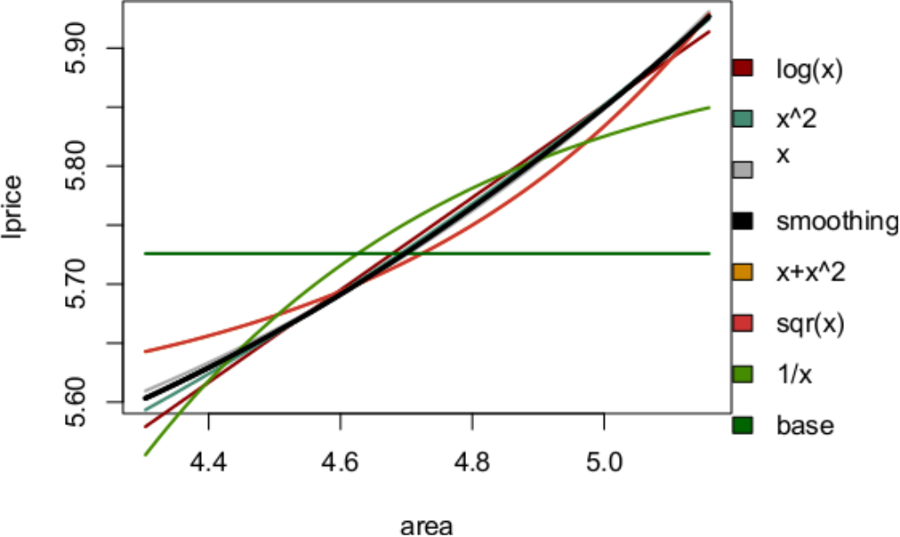
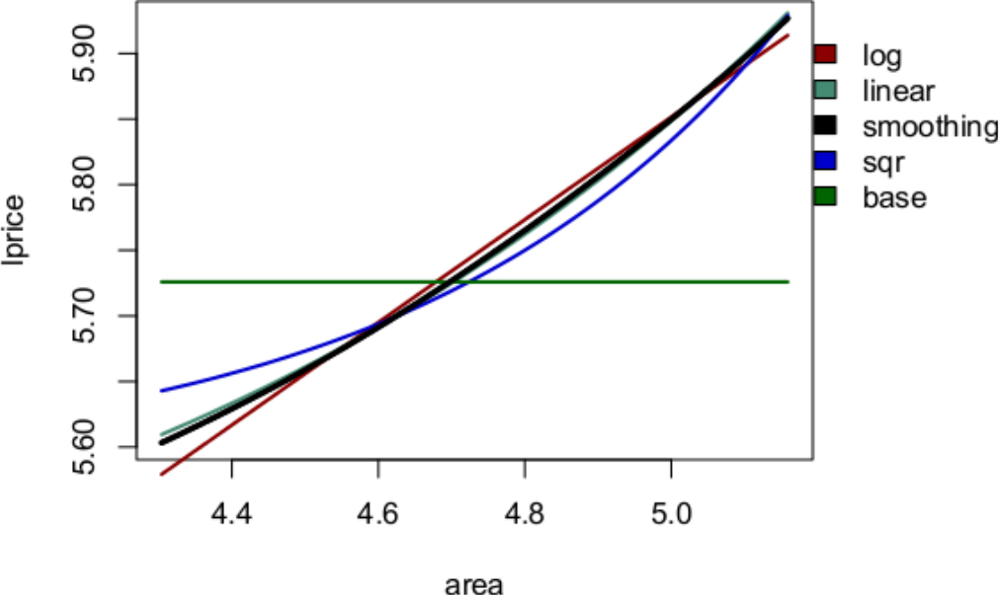
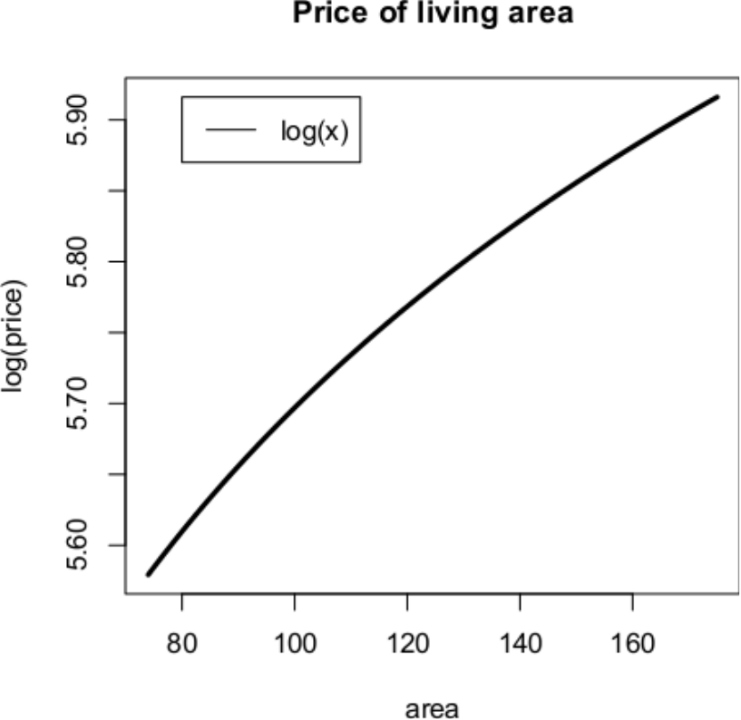

::: article
# Introduction

A model that fits data well but is unrelated to theory can only describe
correlations. In contrast, a model with both a good fit and a
theoretically sound foundation can give insights into hypotheses on
causality. The functional form in a regression model describes the
relationship between a dependent variable and its covariates. There are
numerous examples of researchers who have neglected functional form
relationships and applied the default linear relationship between
variables in their regression models
[@box1976science; @breiman2001statistical; @berk2004regression; @angrist2010credibility].
From a superficial point of view, these models may provide efficient
parameter estimates with narrow standard errors, high t-values, and
significance. A strong non-linear relationship between a dependent
variable and a covariate will often offer reasonable test statistics
with a default linear functional form specification. However, positive
test statistics are not the same as proof of a linear relationship. Even
more important is the fact that a misspecified functional form can lead
to an incorrect interpretation and prediction of the relationship
between the dependent variable and a given covariate. The specification
should be driven by theory with an a priori hypothesis of the
relationship between the dependent and covariates.

[***PanJen***](https://CRAN.R-project.org/package=PanJen) was developed
over several years of applied research on property value models. Here,
the sales price is estimated as a function of its characteristics, such
as the size of the living space, the number of rooms, and access to
shopping. However, the package is applicable to most cases in which the
relationship between a continuous dependent variable and its covariates
is explored. In the applied econometrics literature, this task has
commonly been solved using power transformations in initial analyses
[@Palmquist2005].

Two examples of power-transformations are Box-Cox and Box-Tidwell
[@Box1962; @box1976science]. The power-transformations are easy to use;
the ability of these two power transformations to detect functional
forms has been studied extensively in the academic literature, e.g.,
[@kowalski1986market; @brennan1984office; @clark1984estimation], and
they are still used in applied studies
[@cohen2013applied; @farooq2010hedonic; @link2014cost; @Joshi201735; @benson1998pricing; @Troy2008233].

The popularity of these power-transformations is surprising given that
their shortcomings are well described in the literature
[@Levin1993; @Wooldridge1992]. While power transformations perform well
in many circumstances, they do not perform well in the presence of
omitted variables, inefficiency, heteroscedasticity and endogeneity.
Furthermore, a transformation can be challenging to interpret, does not
necessarily relate back to a theory-driven hypothesis and does not
detect whether the relationship changes across the distribution of the
dependent variable.

Another approach to the functional form issue is to abandon the
parametric model and approach the challenge from a non- or
semi-parametric angle. In the academic literature, a number of
alternatives have been proposed and used, such as non-parametric or
semi-parametric methods
[@Anglin1996; @Gencay1996; @Clapp2002; @Bin2004; @Geniaux2008]. Non- or
semi-parametric models provide data-driven approaches to establish the
relationship between a dependent variable and covariates. A
non-parametric model can be attractive, because the functional form is
revealed by the data instead of being be predefined by the researcher.
However, the gained flexibility of non-parametric analysis comes at the
cost of more difficult interpretation of the estimates, which is perhaps
why parametric models are often used in applied work.

In non-parametric models, the relationship is fitted to the sample to
the extent that the estimated relationship is at risk of being
over-fitted. In other words, the estimated effect captures random error
or noise in combination with the underlying relationship in the
population [@wood2006generalized]. Additionally, a central critique
concerning this approach is that the results from a non-parametric model
are difficult to generalize or extend outside of the sample
[@McMillen2010]. Even so, a non-parametric model holds great potential
in exploratory analysis.

We are certainly not the first researchers to consider the possibility
of utilizing the apparent advantages of the non-parametric modelling to
explore functional form relationships in parametric modelling. The
literature on using a non-parametric model to test different parametric
specifications is large [@gonzalez2013updated]. The primary approach in
the existing literature has been to test a parametric version of a model
against a non-parametric version
[@wooldridge1992test; @horowitz1994testing; @zheng1996consistent; @li2016consistent].
However, to the best of our knowledge, none of these tests have been
widely adopted in the empirical literature. ***PanJen***is developed to
allow applied researchers to utilize non-parametric estimation to
identify a better parametric functional form. The package offers a test
based on well-established measures and is provided on a well-established
software platform. We believe that very few empirical researchers know
about the existing tests, and the few that do perceive them as too
complicated due to their non-parametric basis. ***PanJen*** offers the
user a transformation-ranking based on the parametric transformation
that captures most of the variance of the dependent variable. The
ranking includes a non-parametric specification that can detect if the
relationship between the dependent variable and covariate is
non-stationary. In contrast to existing tests, semi-parametric
transformations are only included as a benchmark rather than as an
incremental part of the test. The engine in the PanJen ranking is the
well-known Akaike Information Criterion (AIC) and Bayesian Information
Criterion (BIC) measures. These model-fit measures are already widely
applied in the empirical literature and should not be a hindrance for
the empirical researcher. With the PanJen ranking, we hope to introduce
an approach that will make applied researchers explicitly consider
functional form in their parametric models.

In the next section, we briefly describe the main idea behind the
ranking in the package (PanJen ranking. In the following section, we
describe the workhorse behind it, the Generalized Additive Model (GAM).
In section 4, we explain how the PanJen ranking works. In section 5, we
illustrate how to use the package by using a real example from our
research. Section 6 offers a comparison between the PanJen ranking and
the Box-Tidwell transformation. We simulated 10,000 datasets and
recovered the functional form of one variable in a model with different
impediments to show the merits of ***PanJen*** relative to a
conventional approach. In section 6, we conclude the paper with a short
discussion of when and how the researcher should use the package with an
emphasis on the risk of pre-test bias.

# The main idea of the PanJen ranking 

***PanJen*** is built on the idea that the choice of a functional form
can be guided by model fit. In the PanJen ranking, a given number of
models that vary only in the transformation of one covariate are
estimated. One of these transformations is a so-called function that for
now we will simply note makes this one model semi-parametric. All the
estimated models are then ranked according to their BIC). The BIC
provides a relative goodness-of-fit measure that accounts for the
complexity of the model. More formally, the PanJen ranking estimates a
model $Y=\beta_0+X\beta_k+g(x)\beta_l+\varepsilon$ where $Y$ is the
dependent variable, $\varepsilon$ is an i.i.d. error-term, $X$ is a
vector of k of covariates, $\beta_k$ is the corresponding vector of
parameter estimates, $g(x)$ represents a set of functional form
transformations among the set:

$$\begin{aligned}
g(x)\beta_l=\left\{ \frac{1}{x^{2}}\beta_{1},\frac{1}{x}\beta_{1},\frac{1}{\sqrt{x}}\beta_{1},log(x)\beta_{1},\sqrt{x}\beta_{1},x\beta_{1},x^{2}\beta_{1},x\beta_{1}+x^{2}\beta_{2},f(x),0\right\}
\end{aligned}$$
where $\beta_l$ the corresponding l parameter estimates for the
parametric transformations. In the last two transformations, there is no
parameter estimate for $g(x)$, because $f(x)$ is the non-parametric
smoothing and $0$ leaves out the explanatory variable.

The ranked BIC-values show how each transformation performs relative to
the others. The semi-parametric transformation allows the user to assess
how well parametric transformations perform relative to a flexible
semi-parametric function. If the data generation process does not
resemble any of the parametric transformations, the smoothing function
will still capture the relationship. The BIC scores are supplemented by
the closely related AIC. In practice, both the AIC and the BIC penalize
model complexity, although the penalty term in BIC is larger than in AIC
[@burnham2004multimodel]. The smoothing function is highly flexible, but
the flexibility comes at a cost. Therefore, it is not necessarily ranked
the highest since both AIC and BIC penalize the model complexity. There
is no objective and transparent way to choose between the measures. The
right measure depends on the user's a priori theory of the data
generation process. If the users assume that one of their models
perfectly fits the underlying data generation process, then the BIC is
the right measure. If they instead assume that the underlying data
generation process is extremely complex and none of the possible models
will be able to perfectly capture it, then AIC is the right measure
[@Aho2014].

The PanJen ranking is supported by a plot function that graphically
outlines the relationship between the dependent variable and covariate.
The plot is created by predicting the dependent variable using the
median for all independent variables other than the one in question. The
variable in question varies across a scale from the 5th quantile to the
95th quantile of the actual distribution in the dataset. The plot shows
the user how each transformation captures the relationship across the
distribution of the dependent variable. If the smoothing far outperforms
all parametric transformations, the reason may be that the relationship
changes across the distribution and the proposed simple parametric
transformation does not capture the relationship between the dependent
and independent variable. The plot will reveal this.

# A semi-parametric model for benchmark

We estimate the parametric transformations using the Generalized Linear
Model (GLM) and the semiparametric using GAM. GAM is a special case of
the Generalized Linear Model (GLM) in which it is possible to include
one or more so-called smoothing functions. A smoothing function is a
non-parametric way to include a continuous covariate in a parametric
model and make it semi-parametric.

The GAM can be written as follows:
$$\begin{aligned}
 Y_{i}=X_{i}\beta+f_{1}(x_{1i})+\epsilon_{i}\label{eq:gam_model}
\end{aligned}   (\#eq:gam-model)$$
$Y_{i}$ is the dependent variable of observation i. It is distributed as
an exponential family distribution, e.g.the normal, the gamma or
chi-square distribution. Xi is a matrix of covariates that are
parametrically related to the dependent variable. $\beta$ is the
corresponding vector of the parameter estimate, and $f_{i}$ is a
smoothing function of covariate $x_{1i}$.

The GAM provides a flexible specification of a covariate by only
specifying it as a smoothed function. By entering a variable with a
smoothing function, the researcher does not specify a functional form,
but instead lets the data speak. The smoothing function comprises the
sum of $k$ thin plate regression spline bases
$b_{h}\left(\bullet\right)$ multiplied by their coefficients. It is
estimated as follows:
$f=\sum_{h=1}^{k}\beta_{h}b_{h}\left(x_{1}\right)$. The non-parametric
component of the model is fitted with a penalty on wiggliness (how
flexible the smoothing is). The penalty, $\theta$, is determined from
the data using generalized cross-validation or related techniques. The
penalty directly enters the objective function through an additional
term capturing wiggliness in the smoothing function, i.e.,

$$\begin{aligned}
\left\Vert Y_{i}-\widehat{Y_{i}}\right\Vert ^{2}+\theta\int f''(x_{1})^{2}dx_{1}
\end{aligned}$$

Here, $\widehat{Y}$ is the fitted dependent variable, and the second
derivatives of the smoothing function describe its wiggliness. We
estimate the GAM using the mgcv R-package
[***mgcv***](https://CRAN.R-project.org/package=mgcv) [@mgcvpackage].
For a thorough introduction to GAM, please see [@wood2006generalized].

# Using the package

We illustrate the use of ***PanJen*** using a hedonic house pricing
model. The central idea is that the sale price of a home is a function
of its characteristics, understood as both the characteristics of the
home itself and its surroundings. The latter poses a problem in the
empirical application of the hedonic method because observations can be
correlated through space. A very flexible solution to this problem is to
use the GAM framework to smooth over the x-y coordinates, thus allowing
one to non-parametrically control for spatial correlations.
[@von2015alternative] illustrated the relationship between smoothing
over space and classic spatial econometrics with weight-matrices and
fixed spatial effects. They also showed that smoothing is a better
alternative when the researcher does not know the underlying spatial
data generation process. For recent applications, please see
[@RAJAPAKSA2017317] or [@schafer2017urban].

In our example here, we solely focus on the structural characteristics.
These characteristics are measured by a range of variables. The
researcher does not a priori know how the characteristics of the house
are related to its price. For example, we expect the price to increase
with the size of the home, but we do not know if that relationship is
linear. It could be that going from 2 to 3 bedrooms is different than
going from 7 to 8 bedrooms, i.e., we want to know if we should take
account of marginally increasing or decreasing price-relationships.
***PanJen*** was developed to answer this type of question by finding
the functional form relationship between the home price and different
home characteristics.

## An example: the implicit price for living area

::: {#t1}
  --------------------------------------------------------
  Names        Description
  ------------ -------------------------------------------
  lprice       log transformed price in 1000 EUR

  area         living area in square meters

  age          build year

  bathrooms    number of bathrooms

  lake_SLD     distance to nearest lake in meters

  highways     distance to nearest highway in meters

  big_roads    distance to nearest large road in meters

  railways     distance to nearest railway in meters

  nature_SLD   distance to nearest nature area in meters
  --------------------------------------------------------

  : Table 1: Continous variables
:::

The package features a dataset called `hvidovre`. It includes 901 single
detached homes sold between 2007 and 2010 within the Danish municipality
of Hvidovre. The dataset was compiled from different Danish databases as
a part of a larger hedonic study on households' willingness to pay for
different urban and recreational services [@lundhede2013vaerdisaetning].
We have 9 continuous and 7 dummy variables for quality at our disposal.
In addition, the dataset includes 3 year dummies to control for price
trends. The variables are listed in Tables [1](#t1) and [2](#t2):

::: {#t2}
  -------------------------------------------------
  Names         Description
  ------------- -----------------------------------
  rebuild70     home rebuild in 1970's

  rebuild80     home rebuild in 1980's

  rebuild90     home rebuild in 1990's

  rebuild00     home rebuild in 2000's

  brick         Construction made out of brick =1

  roof_tile     roof made out of tiles =1

  roof_cement   roof made out of cement=1

  y7,y8,y9      home sold in 2007, 2008, or 2009
  -------------------------------------------------

  : Table 2: Dummy variables
:::

First, we load the package and the dataset:

``` r
> library(PanJen) 
> data("hvidovre")
```

Then, we set up a `formula`-object. We log-transform the prices because
this introduces flexibility and is the convention within the hedonic
literature [@diewert2003hedonic]. It is possible to test different
transformations by simply transforming the variable or test different
link-functions by leaving `variable` empty in `fform()`. Ten of the
variables are dummy variables where transformations are irrelevant. We
include only these in the first regression:

``` r
> formBase<-formula(lprice ~brick+roof_tile+roof_cemen
+                     + rebuild70+rebuild80+rebuild90+rebuild00+y7+y8+y9)
> summary(gam(formBase, method="GCV.Cp",data=hvidovre))

Family: gaussian 
Link function: identity 

Formula:
lprice ~ brick + roof_tile + roof_cemen + rebuild70 + rebuild80 + 
    rebuild90 + rebuild00 + y7 + y8 + y9

Parametric coefficients:
            Estimate Std. Error t value Pr(>|t|)    
(Intercept)  5.61058    0.02909 192.902  < 2e-16 ***
brick        0.11530    0.02660   4.334 1.63e-05 ***
roof_tile    0.06238    0.02328   2.679 0.007511 ** 
roof_cemen   0.08845    0.02969   2.979 0.002969 ** 
rebuild70    0.08357    0.03158   2.646 0.008285 ** 
rebuild80    0.14506    0.04382   3.310 0.000970 ***
rebuild90    0.14718    0.05356   2.748 0.006122 ** 
rebuild00    0.21120    0.04275   4.940 9.33e-07 ***
y7           0.14188    0.02653   5.347 1.14e-07 ***
y8           0.09193    0.02847   3.229 0.001286 ** 
y9          -0.09633    0.02784  -3.460 0.000566 ***
---
Signif.\ codes:  0 ‘***’ 0.001 ‘**’ 0.01 ‘*’ 0.05 ‘.’ 0.1 ‘ ’ 1


R-sq.(adj) =  0.146   Deviance explained = 15.5%
GCV = 0.089003  Scale est.\ = 0.087916  n = 901
```

This initial model explains nearly 15% of the variation in price. The
next characteristic we want to control for is the size of the home. In
the dataset, the living area in square metres is stored under `area`.

We start out by using the default transformations supplied by the
***PanJen*** function `fform()`. This function ranks the fit of nine
predefined transformations and a smoothing. The mandatory inputs are the
name of the dataset, the model formula and the new variable we wish to
test using the PanJen ranking:

``` r
> PanJenArea<-fform(hvidovre,"area",formBase,distribution=Gamma(link=log))

             AIC    BIC ranking (BIC)
log(x)    435.07 497.51             1
x^2       435.39 497.84             2
x         437.07 499.52             3
smoothing 436.82 501.42             4
x+x^2     443.96 506.41             5
sqr(x)    444.00 506.44             6
1/x       445.66 508.11             7
base      511.35 568.99             8
[1] "Smoothing is a semi-parametric and data-driven transformation,
 please see Wood (2006) for an elaboration"
```

The results are ranked according to their BIC. Strictly according to
this ranking, we should log-transform the area. This implies
approximately that a % change in living area results in a % change in
price. Given the respondent variable has been log-transformed previous
to the model-fitting, any interpretation at the the original scale
should be done with care , see e.g. [@barrera2015package].

The differences in the score for the four lowest BIC are small, and it
might be a matter of differences in the tails of the distribution. This
can be checked by plotting the predicted price against the area. The
function `plotff()` generates a plot with the predicted price against
the area from the 5th to the 95th percentiles with all other covariates
variables at their median value:

``` r
>  plotff(PanJenArea) 
```

{#figure:f1
width="100%" alt="graphic without alt text"}

The black line is the smoothing function. The log-squared and the linear
specification closely follow this line. In conclusion, the implicit
price for the living area is positive and slightly marginally declining.
You can specify your own transformations using `choose.fform()`. In the
following, we test three transformations: $area$, $\log(area)$ and
$area^{2}$. We start out by defining a list of transformations:

``` r
> fxlist = list(linear = function(x) x,sqr = function(x) x^2,log=function(x) log(x))

> PanJenAreaC <- choose.fform(data=hvidovre, variable="area", base_form=formBase,
+ functionList=fxlist) 

             AIC    BIC ranking (BIC)
log       290.04 352.49             1
linear    291.70 354.15             2
smoothing 291.53 355.91             3
sqr       299.15 361.60             4
base      379.20 436.84             5
[1] "Smoothing is a semi-parametric and data-driven transformation,
 please see Wood (2006) for an elaboration"


> plotff(PanJenAreaC)
```

{#figure:f2
width="100%" alt="graphic without alt text"}

We $\log$ transform the area and are now able to explain nearly 24% of
the variation in price:

``` r

> hvidovre$larea<-log(hvidovre$area)

> formArea<-formula(lprice ~brick+rebuild80+rebuild90+rebuild00+y7+y8+y9+larea)

> summary(lm(formArea, data=hvidovre))

Call:
lm(formula = formArea, data = hvidovre)

Residuals:
    Min      1Q  Median      3Q     Max 
-3.2109 -0.1000  0.0194  0.1479  0.9255 

Coefficients:
            Estimate Std. Error t value             Pr(>|t|)    
(Intercept)  3.76482    0.17863  21.076 < 0.0000000000000002 ***
brick        0.08695    0.02477   3.510             0.000471 ***
rebuild80    0.07485    0.04224   1.772             0.076714 .  
rebuild90    0.11285    0.05084   2.220             0.026690 *  
rebuild00    0.12213    0.04126   2.960             0.003159 ** 
y7           0.14800    0.02517   5.880        0.00000000579 ***
y8           0.09012    0.02704   3.333             0.000894 ***
y9          -0.10620    0.02645  -4.015        0.00006453604 ***
larea        0.40308    0.03793  10.627 < 0.0000000000000002 ***
---
Signif.\ codes:  0 ‘***’ 0.001 ‘**’ 0.01 ‘*’ 0.05 ‘.’ 0.1 ‘ ’ 1

Residual standard error: 0.2818 on 892 degrees of freedom
Multiple R-squared:  0.2352,	Adjusted R-squared:  0.2284 
F-statistic:  34.3 on 8 and 892 DF,  p-value: < 0.00000000000000022
```

## A changing relationship

The first transformation was rather straightforward because the relation
between area and price is stable across the price-distribution. The age
of the home is a characteristic with which this is not the case. The
reason is that the building changes over the years. As the home gets
older, there is not a direct link between the age and state of the home.
Where a newly built home is likely to be built with modern standards and
tastes in mind, an old house can instead be charming and authentic. At
the same time, in general, houses built during periods of building
booms, which in Denmark were in the 1960s, are of lesser quality than
those built in the 1950s or 1970s. We can show this by running `fform()`
and plotting the results.

``` r

> PanJenAge<-fform(data=hvidovre,variable="age",base_form=formArea)

             AIC    BIC ranking (BIC)
base      285.82 333.85           1.5
1/x       285.82 333.85           1.5
log(x)    286.72 339.55           3.0
x         286.72 339.56           4.5
x^2       286.72 339.56           4.5
smoothing 274.92 359.94           6.0
x+x^2     359.69 407.73           7.0
sqr(x)    359.72 407.76           8.0


[1] "Smoothing is a semi-parametric and data-driven transformation,
 please see Wood (2006) for an elaboration"
> plotff(PanJenAge)
```

{#figure:f3 width="100%" alt="graphic without alt text"}

Based on BIC, the best parametric transformation is $1/x$. However,
omitting the variable altogether, as described by the \"base\", works
equally well.

The plot shows the relationship between age and price from the 5th to
95th percentile of the age distribution. Given the plot, it is difficult
to think of a parametric relationship that will capture this
relationship. If the age of the home is somehow related to the research
question, the best solution might be to use the smoothing function. If
age is nothing more than a control variable, one could perhaps resort to
interval dummies similar to the year dummies in the model. As a part of
the final test of the model, it would be worthwhile to test to what
degree the variable of interest is robust to the way age enters the
pricing function. In our setting, what should be noted is that the
complexity of the relation between age and price would have gone
unnoticed if we had compared only the parametric transformations.

## Interacting with other packages:

When you run `choose.fform()` or `fform()`, all generated models and
datasets are stored in a new list of list-object. Within the list
`models`, all estimated models are stored as `gam`, `glm` and
`lm`-objects. This means that all objects used to create the fform
output are easily available. The plotting function in ***PanJen*** is
simple, but perhaps not enough when the researcher needs to produce
plots for a third party. Here, we show how to use this to make a plot
using base R, but we could just as well have used the ***tlm*** if we
wanted a more detailed plot [@tlmpackage].

For example, you can create a new plot of just one transformation using
`predict()` from ***mgcv*** and the base R plot. Here, we choose to look
at `log(area)`:

``` r

## The name of the models
> names(PanJenArea$models)
(1) "model_log(x)"    "model_x^0.5"     "model_smoothing" "model_x"        
(5) "model_x+x^2"     "model_1/x"       "model_x^2"       "model_1/x^2"    
(9) "model_base"


## getting the variable names used in the log model transformation
> namesVariables<-all.vars(formula(PanJenArea$models[["model_log(x)"]]))[1:11]

## creating a prediction dataframe with median values 
> pred_frame<-data.frame(matrix(rep(sapply(hvidovre[namesVariables],median)
+ ,each=100),nrow=100))

## giving the prediction dataframe variable names
> names(pred_frame)<-namesVariables

## Finding the 0.05 quantile and the 0.95 quantile of the area variable
> min05<-as.numeric(quantile(hvidovre$area,0.05))
> max95<-as.numeric(quantile(hvidovre$area,0.95))

## Create prediction scale from  0.05 quantile to the 0.95 percentile
> pred_frame$area<-seq(min05,max95,length.out=100)

## predicting  lprice using the prediction dataframe 
> pred_frame$var<-log(pred_frame$area)
> pred_frame$lprice=predict(PanJenArea$models[["model_log(x)"]],
+ newdata=pred_frame, type="response")

## Defining limits for plot 
> limx=c(min(pred_frame$area),max(pred_frame$area))
> limy=c(min(pred_frame$lprice),max(pred_frame$lprice))


## Start plot
> plot(pred_frame$lprice~pred_frame$area, data=pred_frame, type="l",sub="",
> xlab="area",ylab="log(price)", lwd=3, col="black", xlim=limx, ylim=limy, 
+ main="Price of living area") 

## create legend
> legend(80,limy[2] , cex=1,lty=1,  "log(x)",  horiz=FALSE) 
 
```

{#figure:f4
width="100%" alt="graphic without alt text"}

# Monte Carlo simulations

We tested the performance of the PanJen ranking against the well-known
Box-Tidwell transformation [@Box1962]. We choose this as a benchmark
since it is the most structured choice applied in existing empirical
work. Power transformations such as Box-Cox and Box-Tidwell were
suggested in the 1960s by @Box1964 and @Box1962. The Box-Tidwell
transformation identifies the transformation that minimizes
non-normality in the error term and linearizes the relationship between
the dependent variable and the covariate using a maximum likelihood
function. Thus, the researcher can use the test to find the
power-transformation with the highest likelihood. This section presents
the results from nine Monte Carlo simulations in which the performance
of the Box-Tidwell and PanJen is tested.

The simulations are centred on a base model:

$$\begin{aligned}
 Y=x_{1}\beta_{1}+x_{2}\beta_{2}+f(x_{3})+\varepsilon
\end{aligned}$$
where $x_{3}$ is the variable of interest and $x_{1}$ and $x_{2}$ are
two other covariates. The functional relationship between $Y$ and
$f(x_{3})$ was then tested using PanJen ranking and Box-Tidwell
transformations. Table [3](#t3) summarizes the results. The fourth and
fifth columns show the share of times each method reported the true
functional form. In the Box-Tidwell case, the transformation parameter
was allowed to vary by up to 0.2 from the correct specification.

::: {#t3}
  -----------------------------------------------------------------------------------------
  Simulation           Simulation description                           PanJen   BoxTidwell
  -------------------- ---------------------------------------------- -------- ------------
  Identification       $f(x_{3})=x_{3}^{2}$                                100           97

  Identification       $f(x_{3})=x_{3}$                                     94           77

  Identification       $f(x_{3})=x_{3}^{0.5}$                              100          100

  Efficiency           $f(x_{3})=x_{3}^{2}$, high variance                  99           65

  Collinearity         $f(x_{3})=x_{3}^{2}$ , $x_{2}$ correlated           100           97

  Omitted variable     $f(x_{3})=x_{3}^{2}$ , omitted variable             100           93

  Heteroscedasticity   $f(x_{3})=x_{3}^{2}$, heteroskedastic                98           52

  Endogeneity          $f(x_{3})=x_{3}^{2}$ , $x_{3}$ is endogenous        100           15

  Misspecification     $f(x_{3})=x_{3}^{2}$ , $x_{2}$ misspecified         100           97
  -----------------------------------------------------------------------------------------

  : Table 3: Simulation results - 10.000 simulations
:::

Each of the nine simulations tested the robustness of the methods in
relation to different well-known econometric methods. Overall, the
PanJen ranking performed acceptably. The method pointed to the correct
functional form in 97 to 100% of the cases. The Box-Tidwell
transformation performed just as well when the dataset was
\"well-behaved.\" It was already well-established in the literature that
the method is sensitive to endogeneity, inefficient model estimates,
heteroscedasticity and endogeneity, and this is also what we find in our
study. In conclusion, PanJen Ranking performs better or just as well as
Box-Tidwell.

# Conclusion

In this paper, we present the ***PanJen*** package. We provide a simple
and intuitive description of the PanJen ranking. Based on a house price
dataset, we show how the functions in the package can be applied to
determine the relationship between a dependent variable and its
covariates. Furthermore, we compare the PanJen ranking method to the
Box-Tidwell transformation and show that the PanJen ranking performs
just as well as or better than the Box-Tidwell transformations. The
Panjen ranking outperforms Box-Tidwell in situations where the model
suffers from inefficiency, heteroscedasticity or endogeneity. In some
circumstances, the theory provides little or no guidance on the
functional relationship between the dependent and covariates in multiple
regression models. In such circumstances, ***PanJen*** can support users
in their decision on the functional form of the covariates. If the
functional form relationship is more complex than a simple parametric
transformation, we suggest considering a semi- or non-parametric model.
The package has deliberately been restricted to test one covariate at a
time without a silent output option. We want to deter the user from
looping over every explanatory variable in search of a fit using the
PanJen ranking, because this increases the pre-test bias. However, we
also recognize that exploratory analysis is part of any empirical
application of statistical modelling. Learning is a sequential process,
and in many circumstances, we have not properly thought out an a priori
hypothesis on which to base our models [@wallace1977pretest]. People
perform exploratory model estimations and in many cases under-report
their approach. Even so, pre-test bias is not a problem caused or
exacerbated by PanJen Ranking. Regardless of how a researcher performs
multiple model estimations, the risk of pre-test bias can be reduced by
adopting a sampling approach. The sampling approach can be implemented
by dividing data into training and test datasets, where the explorative
analysis is conducted on the first. It is our hope that people will use
***PanJen*** to improve their models by specifying relationships that
more accurately fit their data. In doing so, users should consider
PanJen ranking as a guide and not as a substitute for a priori
hypothesis.
:::
