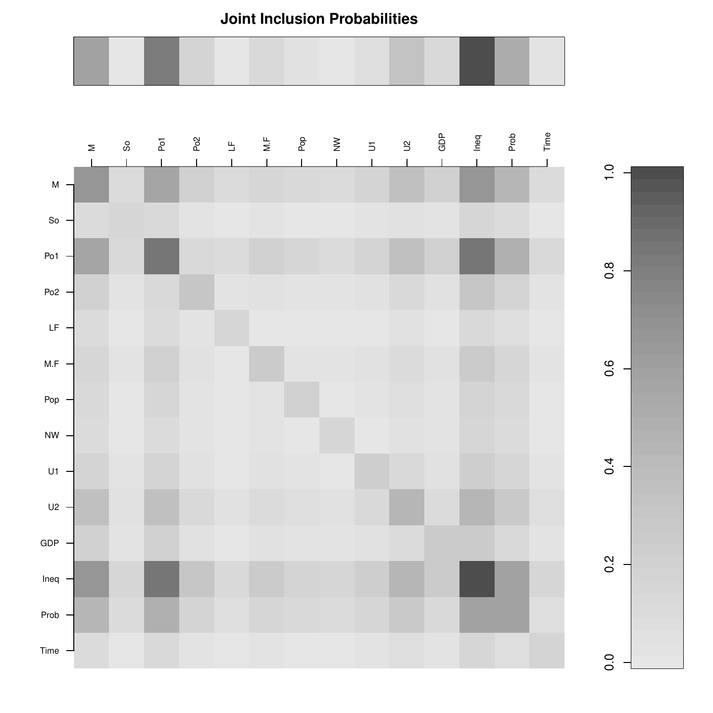
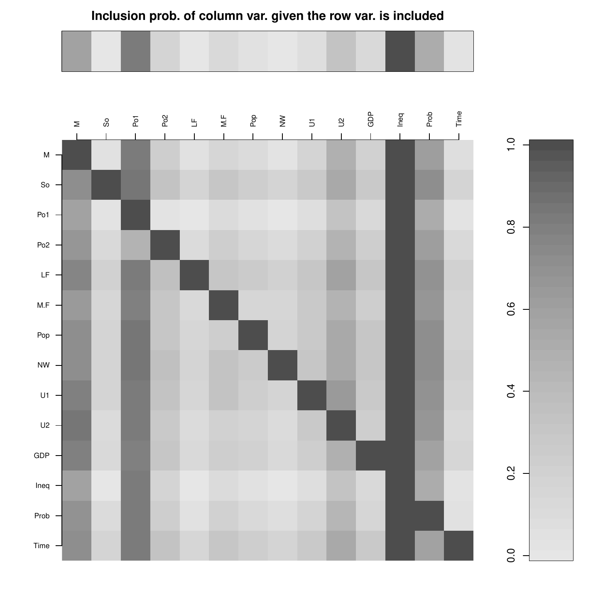
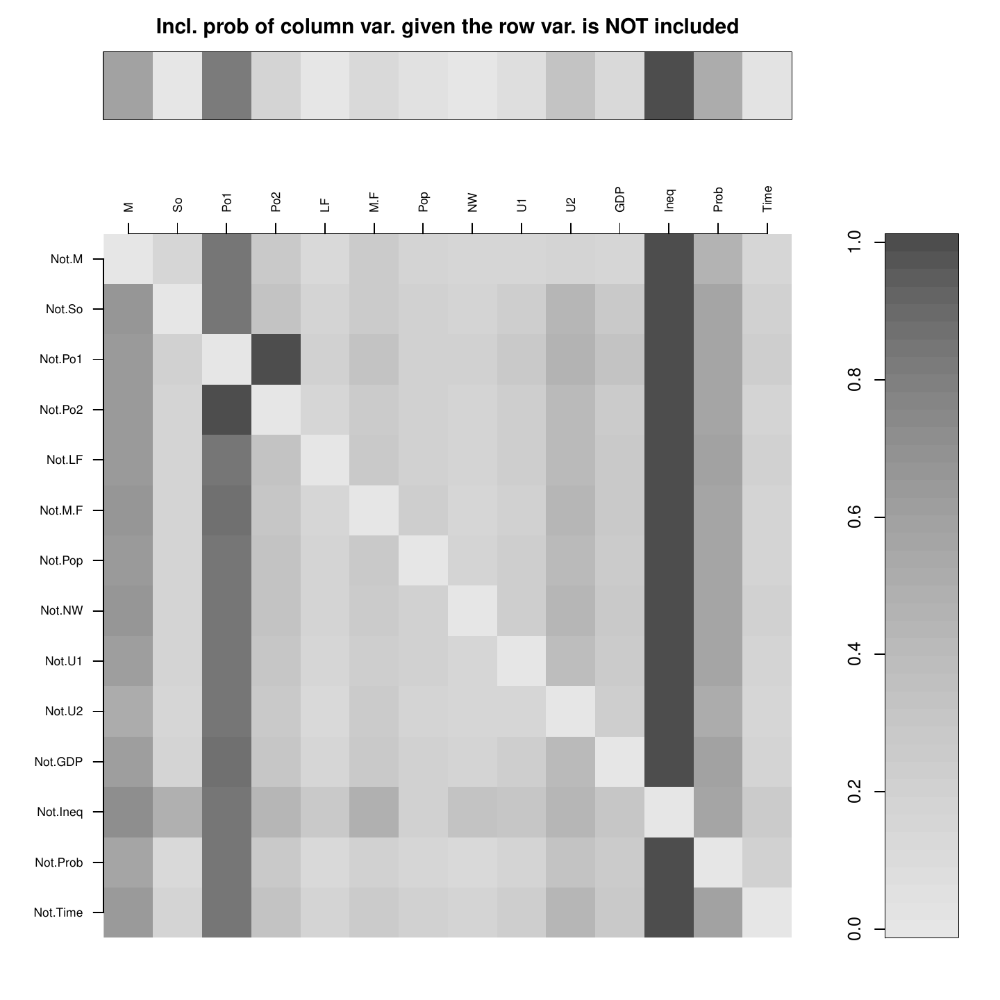
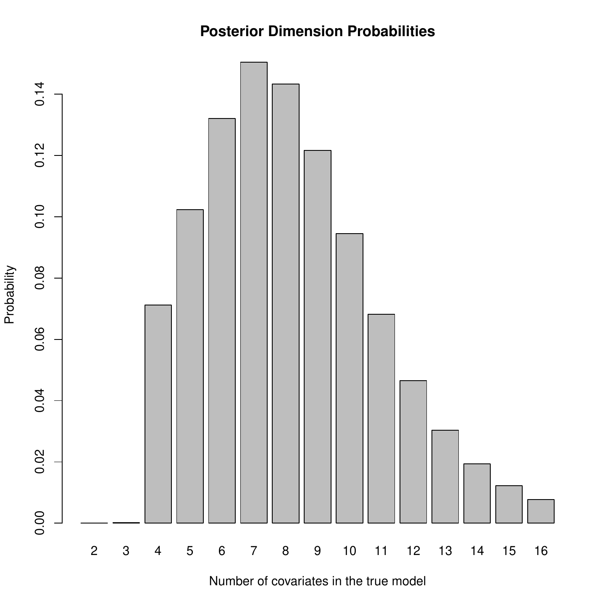
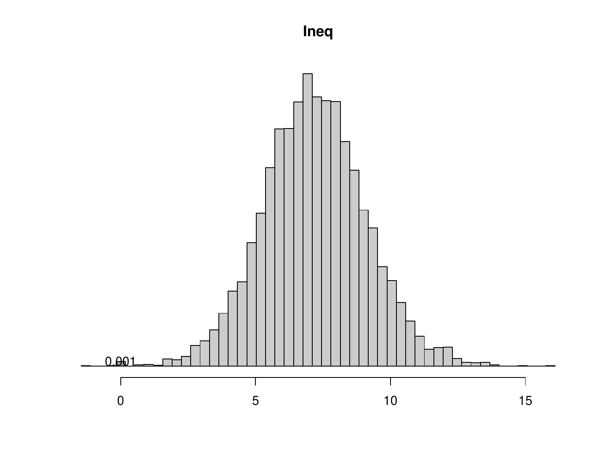
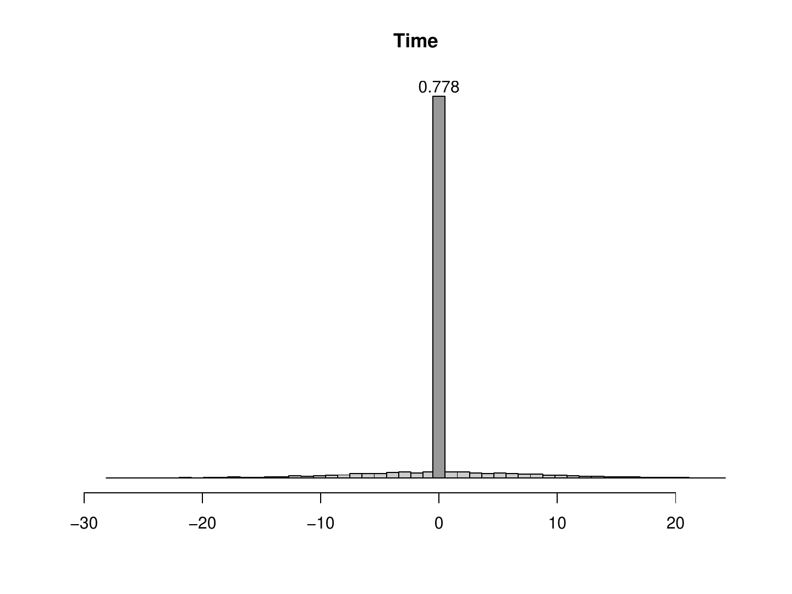
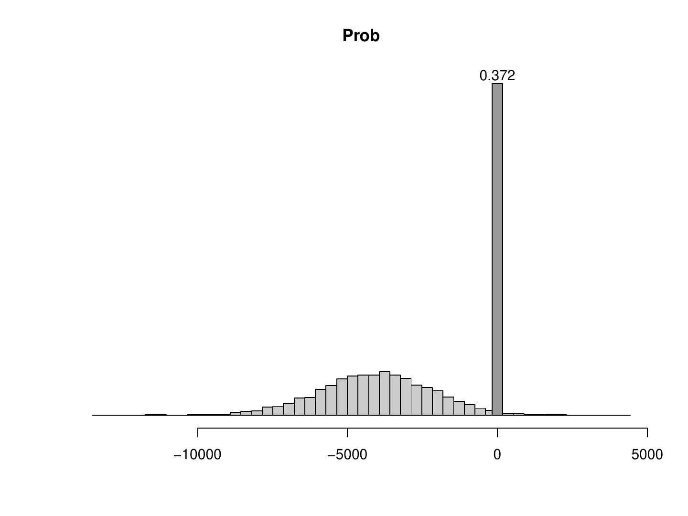

::: article
# An illustrated overview of ***BayesVarSel***

Testing and variable selection problems are taught in almost any
introductory statistical course. In this first section we assume such
background to present the essence of the Bayesian approach and the basic
usage of
[***BayesVarSel***](https://CRAN.R-project.org/package=BayesVarSel)
[@GarFor15] with hardly any mathematical formulas. Our motivating idea
in this first section is mainly to present the appeal of the Bayesian
answers to a very broad spectrum of applied researchers. This
introductory section concludes with a discussion about connections with
potentially related R packages.

The remaining six sections are organized as follows. In the second
section, on page , the problem is presented and the notation needed is
introduced jointly with the basics of the Bayesian methodology. Then,
two sections follow with explanations of the details concerning the
obtention of posterior probabilities in hypothesis testing and variable
selection problems, respectively, in ***BayesVarSel***. In a later
section, on page , several tools to describe the posterior distribution
are explained, while the section on page  is devoted to model averaging
techniques. The paper concludes with a section with plans for the future
of the ***BayesVarSel*** project. This paper is supplemented with an
appendix, with formulas for the most delicate ingredient in the
underlying problem in ***BayesVarSel***, namely the prior distributions
for parameters within each model.

The version of ***BayesVarSel*** presented here is 1.8.0.

## Testing {#sec.ov.test}

In testing problems, several competing hypotheses, $H_i$, about a
phenomenon of interest are postulated. The role of statistics is to
provide summaries about the evidence in favor (or against) the
hypotheses once the data, ${\mathbf{y}}$, have been observed. There are
many important statistical problems with roots in testing like model
selection (or model choice) and model averaging.

The formal Bayesian response to testing problems is based on the
posterior probabilities of the hypotheses that summarize, in a fully
understandable way, all the available information. In the R package
***BayesVarSel*** a number of popular objective priors [in the sense
explained in @Ber06] are available. Any of these priors have the great
appeal of being fully automatic for users.

For illustrative purposes consider the nutrition problem in @Lee97, page
143, with data:

``` r
> weight.gains <- c(134, 146, 104, 119, 124, 161, 107, 83, 113, 129, 97, 123,
+ 70, 118, 101, 85, 107, 132, 94)
```

There it is tested, based on the sample of 19 weight gains (expressed in
grams) of rats, whether there is a difference between the population
means of the group with a high proteinic diet (the first 12) or the
control group (the rest):

``` r
> diet <- as.factor(c(rep(1,12), rep(0,7)))
> rats <- data.frame(weight.gains = weight.gains, diet = diet)
```

This problem (usually known as the two-samples $t$-test) is normally
written as $H_0:\mu_1=\mu_2$ versus $H_1:\mu_1\ne\mu_2$, where it is
assumed that the weight gains are normally distributed with an unknown
(but common) standard deviation. The formulas that define each of the
models under the postulated hypotheses are in R language

``` r
> M0 <- weight.gains ~ 1
> M1 <- weight.gains ~ diet
```

The function to perform Bayesian tests in ***BayesVarSel*** is `Btest`
which has an intuitive and simple syntax (see the section on page  for a
detailed description). In this example

``` r
> Btest(models = c(H0 = M0, H1 = M1), data = rats)
Bayes factors (expressed in relation to H0)
 H0.to.H0  H1.to.H0
1.0000000 0.8040127
---------
Posterior probabilities:
   H0    H1
0.554 0.446	
```

From these results, we clearly conclude that both hypotheses are
similarly supported by the data. Hence there is no evidence that the
diet has any impact on the average weight.

A useful guide to interpret Bayes factors and probabilities, follows
from the categories proposed by [@KassRaf95], reproduced in
Table [1](#tbl:incl). For the problem above, none of the hypotheses is
worth more than a bare mention.

::: {#tbl:incl}
  -----------------------------------------------------------------------------
  $B_{10}$                  Probability    Evidence against the null
  ------------------------- -------------- ------------------------------------
  1 to 3                    0.5 to 0.75    Not worth more than a bare mention

  3 to 20                   0.75 to 0.95   Substantial

  20 to 150                 0.95 to 0.99   Strong

  $>$`<!-- -->`{=html}150   $>$ 0.99       Decisive
  -----------------------------------------------------------------------------

  : Table 1: Interpretation of Bayes factors from [@KassRaf95] ($B_{10}$
  stands for the Bayes factor of $H_1$ to the null hypothesis $H_0$).
  The column probability is obtained assuming that both hypotheses are
  equally likely a priori.
:::

Another illustrative example concerns the classic dataset `savings` in
[@Bels] considered by [@faraway2002], page 29 and distributed under the
package [***faraway***](https://CRAN.R-project.org/package=faraway)
[@far16].

``` r
> data("savings", package = "faraway")
```

This dataset contains macroeconomic data on 50 different countries
during 1960-1970 and the question posed is to elucidate if `dpi`
(per-capita disposable income in U.S), `ddpi` (percent rate of change in
per capita disposable income), population under (over) 15 (75) `pop15`
(`pop75`) are all explanatory variables for `sr`, the aggregate personal
saving divided by disposable income which is assumed to follow a normal
distribution. This can be written as a testing problem about the
regression coefficients associated with the variables with hypotheses
$$H_0:\beta_{dpi}=\beta_{ddpi}=\beta_{pop15}=\beta_{pop75}=0,$$
versus the alternative, say $H_1$, that all predictors are needed. The
competing models can be defined as

``` r
> fullmodel <- sr ~ pop15 + pop75 + dpi + ddpi
> nullmodel <- sr ~ 1
```

and the testing problem can be solved with

``` r
> Btest(models = c(H0 = nullmodel, H1 = fullmodel), data = savings)
---------
Bayes factors (expressed in relation to H0)
H0.to.H0 H1.to.H0
  1.0000  21.46007
---------
Posterior probabilities:
    H0    H1
 0.045 0.955
```

Now, the conclusion is that there is strong evidence favoring $H_1$, the
hypothesis that all considered predictors explain the response `sr`.

Of course, more hypotheses can be tested at the same time. For instance,
a simplified version of $H_1$ that does not include `pop15` is
$$H_2:\beta_{dpi}=\beta_{ddpi}=\beta_{pop75}=0,$$
that can be included in the analysis as

``` r
> reducedmodel <- sr ~ pop75 + dpi + ddpi
> Btest(models = c(H0 = nullmodel, H1 = fullmodel, H2 = reducedmodel), 
+  data = savings)
Bayes factors (expressed in relation to H0)
  H0.to.H0   H1.to.H0   H2.to.H0
 1.0000000 21.4600656  0.7017864
---------
Posterior probabilities:
   H0    H1    H2
 0.043 0.927 0.030
```

Obviously, as more hypotheses are considered, the usefulness of
Table [1](#tbl:incl) to interpret posterior probabilities reduces since
it was conceived for two hypotheses. Nevertheless, in this case, $H_1$
is clearly supported by the data as the best explanation for the
experiment among those considered.

This scenario can be extended to check which subset of the four
covariates is the most suitable one to explain `sr`. In general, the
problem of selecting the best subset of covariates from a group of
potential ones is better known as variable selection.

## Variable selection {#sec.over.vs}

Variable selection is a multiple testing problem where each hypothesis
proposes a possible subset of the $p$ potential explanatory variables
initially considered. Notice that there are $2^p$ hypotheses, including
the simplest one (the null hypothesis) stating that none of the
variables should be used.

A variable selection approach to the economic example above with $p=4$
has 16 hypotheses and can be solved using the `Btest` function.
Nevertheless, ***BayesVarSel*** has specific facilities to handle the
specificities of variable selection problems. A main function for
variable selection is `Bvs`, fully described in the section on page . It
has a simple syntax inspired by the well-known `lm` function. The
variable selection problem in this economic example can be solved by
executing:

``` r
> Bvs(formula = sr ~ pop15 + pop75 + dpi + ddpi, data = savings)
The 10 most probable models and their probabilities are:
   pop15 pop75 dpi ddpi        prob
1      *     *   *    * 0.297315642
2      *     *        * 0.243433493
3      *              * 0.133832367
4      *                0.090960327
5      *         *    * 0.077913429
6      *     *          0.057674755
7      *         *      0.032516780
8      *     *   *      0.031337639
9                       0.013854369
10           *        * 0.006219812
```

With a first look at these results, we can see that the most probable
model is the model with all covariates (probability 0.30), which is
closely followed by the one without `dpi` with a posterior probability
of 0.24. Note that the results are sensitive to the choice of parameter
priors (see the appendix for more details on the priors).

As we will see later, a variable selection exercise generates a lot of
valuable information of which the above printed information is only a
very reduced summary. This additional information can be accessed with
specific methods that explore the characteristics of objects of the type
created by `Bvs`.

## Related packages

In a recent study, [@Foretal16] analyse the differences among available
R packages that, according to either title and/or description, perform
common variable selection (and related) tasks. The main underlying
motivation in that study was to clarify the commonalities/differences of
the different packages available sharing a common theoretical framework
(Bayesian variable selection with a particular type of priors). Five
packages turned out to have these characteristics:
[***BayesFactor***](https://CRAN.R-project.org/package=BayesFactor)
[@MorRou15]; ***BayesVarSel***;
[***BMS***](https://CRAN.R-project.org/package=BMS) [@FeldZeu15];
[***mombf***](https://CRAN.R-project.org/package=mombf) [@Rossell14] and
[***BAS***](https://CRAN.R-project.org/package=BAS) [@Clyde17]. These
were further compared taking into account relevant aspects like
flexibility on prior specification, types of summaries provided, and
even computational skills. The main conclusion was that, despite the
connections, there are important differences (e.g., on prior
specifications or implemented summaries) that will dictate the choice of
package [for more details see @Foretal16].

Another package worth mentioning is
[***BMA***](https://CRAN.R-project.org/package=BMA) [@RafHoetal15]. This
is one of the most downloaded packages for variable selection in CRAN.
***BMA*** performs variable selection based on the (BIC) Bayesian
Information Criterion (which was developed as an asymptotic
approximation to Bayes factors).

# Basic formulae {#sec.BasFor}

The problems considered in ***BayesVarSel*** concern Gaussian linear
models. Consider a response variable ${\mathbf{y}}$, size $n$, assumed
to follow the linear model (the subindex $F$ refers to the *full* model)
$$\label{eq.full}
M_F:{\mathbf{y}}={\mathbf{X}}_0{\mathbf{\alpha}}+{\mathbf{X}}{\mathbf{\beta}}+{\mathbf{\varepsilon}},\,\,\,{\mathbf{\varepsilon}}\sim N_n({\mathbf{0}},\sigma^2{\mathbf{I}}_n),   (\#eq:eq-full)$$
where the matrices ${\mathbf{X}}_0:n\times p_0$,
${\mathbf{X}}:n\times p$ and the regression vector coefficients are of
conformable dimensions. Suppose you want to test
$H_0:{\mathbf{\beta}}={\mathbf{0}}$ versus
$H_F:{\mathbf{\beta}}\ne{\mathbf{0}}$, that is, to decide whether the
regressors in ${\mathbf{X}}$ actually explain the response. This problem
is equivalent to the model choice (or model selection) problem with
competing models $M_F$ and
$$\label{eq.null}
M_0:{\mathbf{y}}={\mathbf{X}}_0{\mathbf{\alpha}}+{\mathbf{\varepsilon}},\,\,\,{\mathbf{\varepsilon}}\sim N_n({\mathbf{0}},\sigma^2{\mathbf{I}}_n),   (\#eq:eq-null)$$
and we will refer to models or hypotheses indistinctly.

Posterior probabilities are based on the Bayes factors [see @KassRaf95],
a measure of evidence provided by ***BayesVarSel*** when solving testing
problems. The Bayes factor of $H_F$ to $H_0$ is
$$B_{F0}=\frac{m_F({\mathbf{y}})}{m_0({\mathbf{y}})},$$
where $m_F$ is the integrated likelihood or prior predictive marginal
for the full model:
$$m_F({\mathbf{y}})=\int M_F({\mathbf{y}}\mid{\mathbf{\alpha}},{\mathbf{\beta}},\sigma)\,\pi_F({\mathbf{\alpha}},{\mathbf{\beta}},\sigma)d{\mathbf{\beta}}\,d{\mathbf{\alpha}}\,d\sigma,$$
and, similarly:
$$m_0({\mathbf{y}})=\int M_0({\mathbf{y}}\mid{\mathbf{\alpha}},\sigma)\,\pi_0({\mathbf{\alpha}},\sigma)d{\mathbf{\alpha}}\,d\sigma.$$
Above, $\pi_0$ and $\pi_F$ are the prior distributions for the
parameters within each model. The assignment of such priors (which we
call model selection priors) is quite a delicate issue [see
@BergerPericchi01] and has inspired many important contributions in the
literature, particularly from an objective point of view. Of these, the
package ***BayesVarSel*** allows using many of the most important
proposals, which are fully detailed in the appendix. The prior
implemented by default is the robust prior by @Baetal11, as it can be
considered optimal in many senses and is based on a foundational basis.

Posterior probabilities can be obtained as
$$Pr(H_F\mid{\mathbf{y}})=\frac{B_{F0}Pr(H_F)}{(Pr(H_0)+B_{F0}Pr(H_F))},\,\,Pr(H_0\mid{\mathbf{y}})=1-Pr(H_F\mid{\mathbf{y}}),$$
where $Pr(H_F)$ is the probability, a priori, that hypothesis $H_F$ is
true.

Similar formulas can be obtained when more than two hypotheses, say
$H_1,\ldots,H_N$, are tested. In this case
$$\label{eq.post}
Pr(H_i\mid{\mathbf{y}})=\frac{B_{i0}({\mathbf{y}})Pr(H_i)}{\sum_{j=1}^N B_{j0}({\mathbf{y}})Pr(H_j)},\,\, i=1,\ldots,N,   (\#eq:eq-post)$$
which is the posterior distribution over the model space (the set that
contains all competing models). For simplicitly, the formula in
\@ref(eq:eq-post) has been expressed, without any loss of generality,
using Bayes factors to the null model but the same results would be
obtained by fixing any other model. The default definition for $Pr(H_i)$
in testing problems is to use a constant prior, which assigns the same
probability to all models, that is, $Pr(H_i)=1/N$.

For instance, within the model
$$M_3:{\mathbf{y}}=\alpha{\mathbf{1}}_n+\beta_1{\mathbf{x}}_{1}+\beta_2{\mathbf{x}}_{2}+{\mathbf{\varepsilon}},$$
we cannot test the hypotheses $H_1:\beta_1=0,\beta_2\ne 0$,
$H_2:\beta_1\ne 0,\beta_2=0$, $H_3:\beta_1\ne 0,\beta_2\ne 0$ since
neither $M_1$ (the model defined by $H_1$) nor $M_2$ are nested in the
rest. Nevertheless, it is perfectly possible to test the problem with
the four hypotheses $H_1,H_2,H_3$ (as just defined) plus
$H_0:\beta_1=0,\beta_2=0$, but of course $H_0$ *must* be, a priori, a
plausible hypothesis. In this last case $H_0$ would take the role of
null model.

Hypotheses do not have to be necessarily of the type
${\mathbf{\beta}}={\mathbf{0}}$ and, if testable [see @ravdey02 for a
proper definition], any linear combination of the type
${\mathbf{C}}^t{\mathbf{\beta}}={\mathbf{0}}$ can be considered a
hypothesis. For instance one can be interested in testing
$\beta_1+\beta_2=0$. In @BayGar07 it was formally shown that these
hypotheses can be, through reparameterizations, reduced to hypotheses
like ${\mathbf{\beta}}={\mathbf{0}}$. In next section we show examples
of how to solve these testing problems in ***BayesVarSel*** .

Variable selection is a multiple testing problem but is traditionally
presented with convenient specific notation that uses a $p$ dimensional
binary vector ${\mathbf{\gamma}}=(\gamma_1,\ldots,\gamma_p)$ to identify
the models. Consider the full model in \@ref(eq:eq-full), and suppose
that ${\mathbf{X}}_0$ contains fixed covariates that are believed to be
sure in the true model (by default ${\mathbf{X}}_0={\mathbf{1}}_n$ that
would make the intercept present in all the models). Then each
$\gamma\in\{0,1\}^p$ defines a hypothesis $H_\gamma$ stating which
$\beta$'s (those with $\gamma_i=0$) corresponding to each of the columns
in ${\mathbf{X}}$ are zero. Then, the model associated with $H_\gamma$
is
$$\label{eq.mgamma}
M_\gamma:{\mathbf{y}}={\mathbf{X}}_0{\mathbf{\alpha}}+{\mathbf{X}}_\gamma{\mathbf{\beta}}_\gamma+{\mathbf{\varepsilon}},\,\,\,{\mathbf{\varepsilon}}\sim N_n({\mathbf{0}},\sigma^2{\mathbf{I}}_n),   (\#eq:eq-mgamma)$$
where ${\mathbf{X}}_\gamma$ is the matrix with the columns in
${\mathbf{X}}$ corresponding to the ones in ${\mathbf{\gamma}}$. Notice
that ${\mathbf{X}}_\gamma$ is a $n\times p_\gamma$ matrix where
$p_\gamma$ is the number of 1's in ${\mathbf{\gamma}}$.

Clearly, in this variable selection problem there are $2^p$ hypotheses
or models and the null model is \@ref(eq:eq-null) corresponding to
${\mathbf{\gamma}}={\mathbf{0}}$.

A particularity of variable selection is that it is affected by
multiplicity issues. This is because, and specially for moderate to
large $p$, the possibility of a model showing spurious evidence is high
(just because many hypotheses are considered simultaneously). As
concluded in @ScottBerger06 multiplicity must be controlled with the
prior probabilities $Pr(H_\gamma)$ and the constant prior does not
control for multiplicity. Instead, these authors propose using
$$\label{eq.sb}
Pr(H_\gamma)=\big((p+1) {p\choose p_\gamma} \big)^{-1}.   (\#eq:eq-sb)$$
The assignment above states that models of the same dimension (the
dimension of $M_\gamma$ is $p_\gamma+p_0$) should have the same
probability which must be inversely proportional to the number of models
of that dimension. In the sequel we refer to this prior as the
ScottBerger prior.

Both the ScottBerger prior and the Constant prior for $Pr(H_\gamma)$ are
particular cases of the very flexible prior
$$\label{eq:MSprior}
Pr(M_{\gamma}\mid\theta)=\theta^{p_\gamma}(1-\theta)^{p-p_\gamma},   (\#eq:MSprior)$$
where the hyperparameter $\theta\in(0,1)$ has the interpretation of the
common probability that a given variable is included (independently of
all others).

The Constant prior corresponds to $\theta=1/2$ while the ScottBerger to
$\theta\sim Unif(0,1)$. [@LeySteel09] study priors for $\theta$ of the
type
$$\label{eq:Beta1b}
\theta\sim Beta(\theta\mid 1,b).   (\#eq:Beta1b)$$
They argue that, on many occasions the user has, a priori, some
information regarding the number of covariates (among the $p$ initially
considered) that are expected to explain the response, say $w^\star$. As
they explain, this information can be translated into the analysis
assigning in \@ref(eq:Beta1b) $b=(p-w^\star)/w^\star$. The resulting
prior specification has the property that the expected number of
covariates is precisely $w^\star$.

Straightforward algebra shows that assuming \@ref(eq:Beta1b) into
\@ref(eq:MSprior) is equivalent to (integrating out $\theta$)
$$\label{eq:MSpriorb}
Pr(M_{\gamma}\mid b)\propto \Gamma(p_\gamma+1)\Gamma(p-p_\gamma+b).   (\#eq:MSpriorb)$$

The prior over the model space implemented by default in
***BayesVarSel*** is the ScottBerger prior.

# Hypothesis testing with ***BayesVarSel*** {#sec.testing}

Tests are solved in ***BayesVarSel*** with `Btest` which, in its default
usage, only depends on two arguments: `models` a named list of
`formula`-type objects defining the models compared and `data` the data
frame with the data.

The prior probabilities assigned to the hypotheses is constant, that is,
$Pr(H_i)=1/N$. This default behavior can be modified specifying
`prior.models = "User"` jointly with the argument `priorprobs` that must
contain a named list (with names as specified in the main argument
`models`) with the prior probabilities to be used for each hypotheses.

Suppose that in the last example of first subsection, we establish a
priori that the simpler model is twice as likely as the other two. This
can be specified as:

``` r
> Btest(models = c(H0 = nullmodel, H1 = fullmodel, H2 = reducedmodel), 
+  data = savings, prior.models = "User",
+  priorprobs = c(H0 = 1/2, H1 = 1/4, H2 = 1/4))
---------
Bayes factors (expressed in relation to H0)
  H0.to.H0   H1.to.H0   H2.to.H0 
 1.0000000 21.4600656  0.7017864 
---------
Posterior probabilities:
   H0    H1    H2 
0.083 0.888 0.029 
```

Notice that the Bayes factor remains the same, and the change is in
posterior probabilities.

`Btest` tries to identify the null model (i.e. the model nested in all
the others) using the names of the variables. If such a model does not
exist, the execution of the function stops with an error message.
Nevertheless, there are important situations where the simplest (null)
hypothesis is defined through linear restrictions (sometimes known as
'testing a subspace') making it very difficult to determine its
existence just using the names. In this situation, the user must provide
the name of the simplest model in the argument `null.model`.

To illustrate this case, consider for instance the extension of the
savings example in [@faraway2002], page 32 where
$H_{eqp}:\beta_{pop15}=\beta_{pop75}$ is tested against the full
alternative. This null hypothesis states that the effect on personal
savings, `sr`, of both segments of populations is similar. The model
under $H_{eqp}$ can be specified as:

``` r
> equalpopmodel <- sr ~ I(pop15 + pop75) + dpi + ddpi
```

but the command

``` r
> Btest(models = c(Heqp = equalpopmodel, H1 = fullmodel), data = savings)
```

produces an error, although it is clear that $H_{eqp}$ is nested in
$H_1$. To overcome this error, the user must make the name of the null
model explicit. In our example:

``` r
> Btest(models = c(Heqp = equalpopmodel, H1 = fullmodel), data = savings, 
+  null.model = "Heqp")
Bayes factors (expressed in relation to Heqp)
Heqp.to.Heqp   H1.to.Heqp 
  1.0000000    0.3336251 
---------
Posterior probabilities:
Heqp   H1 
0.75 0.25 
```

Still, the code would produce an error if it detects that the model
defined as the null model does not have the largest sum of squared
errors or if it is not of a smaller dimension than all the others.

# Variable selection with ***BayesVarSel*** {#sec.vs}

The number of entertained hypotheses in a variable selection problem,
$2^p$, can range from a few to an extremely large number. This makes it
necessary to program specific tools to solve the multiple testing
problem in variable selection problems. ***BayesVarSel*** provides two
different functions for variable selection

-   `Bvs` performs exhaustive enumeration of hypotheses and hence the
    size of problems must be small or moderate (say $p\le 25$),

-   `GibbsBvs` simulates from the posterior distribution over the model
    space using a Gibbs sampling scheme (intended to be used for large
    problems, with $p>25$).

Except for a few arguments that are specific to the algorithm
implemented (e.g., the number of cores in `Bvs` or the number of
simulations in `GibbsBvs`) the usage of the two functions is very
similar. We describe the common use in the first of the following
sub-sections and the function-specific arguments in the second.

`Bvs` and `GibbsBvs` return objects of class `"Bvs"` which are a list
with relevant information about the posterior distribution. For these
objects, ***BayesVarSel*** provides a number of functions, based on the
tradition of model selection methods, to summarize the corresponding
posterior distribution (e.g., what is the hypothesis most probable a
posteriori) and for its posterior usage (e.g., to obtain predictions or
model averaged estimates). These capabilities are described in next two
sections.

For illustrative purposes we use the following datasets:

#### `UScrime` data.

The US crime data set was first studied by [@E73] and is available from
the package `MASS` [@MASS]. This data set has a total of $n=47$
observations (corresponding to states in the US) of $p=15$ potential
covariates aimed at explaining the rate of crimes in a particular
category per head of population (labelled `y` in the data).

#### `SDM` data.

This dataset has a total of $p=67$ potential drivers for the annual GDP
growth per capita between 1960 and 1996 for $n = 88$ countries (response
variable labelled `y` in the data). This data set was initially
considered by [@SDM] and revisited by [@LeySteel07].

## Common arguments {#sec.vs.common}

The customary arguments in `Bvs` and `GibbsBvs` are `formula`, with a
definition of the most complex model considered (the full model in
\@ref(eq:eq-full)) and `data` (a data frame with the data). The default
execution setting corresponds to a problem where the null model
\@ref(eq:eq-null) contains just the intercept
(i.e. ${\mathbf{X}}_0={\mathbf{1}}_n$) and prior probabilities for
models are defined as in \@ref(eq:eq-sb).

A different null model can be specified with the optional argument
`null.model`, that must take the value of the formula of the the null
model (a model that should be nested in the full model).

Suppose for example that in the `UScrime` dataset and apart from the
constant, theory suggests that the covariate `Ed` must be used to
explain the dependent variable. To consider these conditions we execute
the command

``` r
> crime.Edfix <- Bvs(formula = y ~ ., data = UScrime, 
+  null.model = y ~ Ed)
Info. . . .
Most complex model has 16 covariates
From those 2 are fixed and we should select from the remaining 14 
M, So, Po1, Po2, LF, M.F, Pop, NW, U1, U2, GDP, Ineq, Prob, Time
The problem has a total of 16384 competing models
Of these, the  10 most probable (a posteriori) are kept
Working on the problem...please wait.
> crime.Edfix
```

During the execution (which takes about 0.22 seconds in a standard
laptop) the function informs which variables take part of the selection
process. The number of these defines $p$ which in this problem is $p=14$
(and the model space has $2^{14}$ models). In what follows, and unless
otherwise stated we do not reproduce this informative output to save
space.

The assignment of priors probabilities, $Pr(H_i)$, is regulated with
`prior.models`, an argument that by default takes the value
`"ScottBerger"` corresponding to the proposal in \@ref(eq:eq-sb). Other
options for this argument are `"Constant"`, which stands for
$Pr(H_i)=1/2^p$, and the more flexible value, `"User"`, under which the
user must specify the prior probabilities with the extra argument
`priorprobs`.

The argument `priorprobs` is a $p+1$ numeric vector, which in its $i$-th
position defines the probability of a model of dimension $p_0+i-1$
(these probabilities can be specified except for the normalizing
constant).

Suppose that in the `UScrime` dataset with null model just the
intercept, we want to specify the prior in eq \@ref(eq:MSprior) with
$\theta=1/4$, this can be done as (notice that here $p=15$)

``` r
> theta <- 1/4; pgamma <- 0:15
> crime.thQ <- Bvs(formula = y ~ ., data = UScrime, prior.models = "User", 
+  priorprobs = theta^pgamma*(1-theta)^(15-pgamma))
> crime.thQ
```

In variable selection problems it is quite standard to have the
situation where the number of covariates is large (say larger than 30)
preventing the exhaustive enumeration of all the competing models. The
`SDM` dataset is an example of this situation with $p=67$. In these
contexts, the posterior distribution can be explored using the function
`GibbsBvs`. To illustrate the elicitation of prior probabilities as
well, suppose that the number of expected covariates to be present in
the true model is $w^\star=7$. This situation is considered in
[@LeySteel09] and can be implemented as (see \@ref(eq:MSpriorb))

[]{#exgw label="exgw"}

``` r
> set.seed(1234)
> data(SDM)
> p <- ncol(SDM) - 1; wstar <- 7; 
> b <- (p-wstar)/wstar; pgamma <- 0:p
> growth.wstar7 <- GibbsBvs(formula = y ~ ., data = SDM, prior.models = "User", 
+  priorprobs = gamma(pgamma+1)*gamma(p-pgamma+b), n.iter = 10000, n.thin = 1,
+  time.test = FALSE)		
> growth.wstar7		
```

The above code took 18 seconds to run.

One last common argument to `Bvs` and `GibbsBvs` is `time.test`. If it
is set to `TRUE` and the problem is of moderate size ($p\ge 18$ in `Bvs`
and $p\ge 21$ in `GibbsBvs`), an estimation of computational time is
calculated and the user is asked about the possibility of not executing
the command.

## Specific arguments

#### In `Bvs`

The algorithm implemented in `Bvs` is exact in the sense that the
information collected about the posterior distribution takes into
account *all* competing models as these are all computed. The logical
parameter `parallel`, if set to `TRUE`, distributes the task among the
number of processors specified in the argument `n.nodes`. By default the
parameter `parallel` is set to `FALSE`. To save computational time and
memory it is quite appropriate to keep only a moderate number of the
best (most probable a posteriori) models. This number can be specified
with the argument `n.keep` which must be an integer number between 1
(only the most probable model is kept) and $2^p$ (a full ordering of
models is kept) (or $2^p$ divided by `n.nodes` in the case of parallel
computation). The default value for `n.keep` is 10.

The argument `n.keep` is not of great importance to analyze the
posterior distribution over the model space. Nevertheless, it has a more
relevant effect if model averaging estimates or predictions are to be
obtained (see the corresponding section on page ) since, as
***BayesVarSel*** is designed, only the `n.keep` retained models are
used for these tasks.

#### In `GibbsBvs`

The algorithm in `GibbsBvs` samples models from the posterior over the
model space and this is done using a simple (yet very efficient) Gibbs
sampling scheme introduced in [@GeorgeMcCulloch97], later studied in
[@Ga-DoMa-Be13] in the context of large model spaces. The type of
default arguments that can be specified in `GibbsBvs` are typical in any
Monte Carlo Markov Chain scheme (as usual the default values are given
in the assignment)

-   `init.model = "Full"` The model at which the simulation process
    starts. Options include `"Null"` (the model only with the covariates
    specified in `null.model`), `"Full"` (the model defined by
    `formula`), and `"Random"` (a randomly selected model) a vector with
    $p$ zeros and ones defining a model.

-   `n.burnin = 500` Length of burn in, i.e. the number of iterations to
    discard at the start of the simulation process.

-   `n.iter = 10000` The total number of iterations performed after the
    burn in process.

-   `n.thin = 1` Thinning rate that must be a positive integer. Set
    `n.thin > 1` to save memory and computation time if `n.iter` is
    large.

-   `seed = runif(1, 0, 16091956)` A seed to initialize the random
    number generator.

Notice that the number of total iterations is `n.burnin+n.iter` but the
number of models that are used to collect information from the posterior
is, approximately, `n.iter/n.thin`.

# Summaries of the posterior distribution {#sec.summaries}

In this section we describe the tools implemented in
***BayesVarSel*** conceived to summarize (in the tradition of the
relevant model selection literature) the posterior distribution over the
model space. In R, this corresponds to describing methods to explore the
content of objects of class `"Bvs"`.

Printing a `"Bvs"` object created with `Bvs` shows the best 10 models
with their associated probability (see examples in first section). If
the object was built with `GibbsBvs` the 10 most probable a posteriori
models among the visited ones are shown. Though, in this case, posterior
probabilities of models are not provided, as these are unknown.

The rest of the summaries are very similar, independent of the routine
used to create it, but recall that if the object was obtained with `Bvs`
(likely because $p$ is small or moderate) the given measures here
explained are *exact*. If instead `GibbsBvs` was used, the reported
measures are approximations of the exact ones (that likely cannot be
computed due to the huge size of the model space). In
***BayesVarSel*** these approximations are based on the frequency of
visits of $M_\gamma$ as an estimator since, as studied in
[@Ga-DoMa-Be13], these provide quite accurate summaries.

The HPM is returned when an object of class `"Bvs"` is summarized (via
`summary`) jointly with the inclusion probabilities for each competing
variable, $Pr(x_i\mid{\mathbf{y}})$. These are the sum of the posterior
probabilities of models containing that covariate and provide evidence
about the individual importance of each explanatory variable. The model
defined by those variables with an inclusion probability greater than
0.5 is called a Median Probability Model (MPM), which is also included
in the summary. [@BarBer04] show that, under general conditions, if a
single model has to be utilized with predictive purposes, the MPM is
optimal.

For instance, if we summarize the object `crime.Edfix`[^1] of the fourth
section, we obtain:

``` r
> summary(crime.Edfix)

Inclusion Probabilities:
     Incl.prob. HPM MPM
M        0.6806       *
So       0.2386        
Po1      0.8489   *   *
Po2      0.3663        
LF       0.2209        
M.F      0.3184        
Pop      0.2652        
NW       0.2268        
U1       0.2935        
U2       0.4765        
GDP      0.3204        
Ineq     0.9924   *   *
Prob     0.6174       *
Time     0.2434        
```

Inclusion probabilities implicitly answer a testing problem with two
hypotheses, namely if the variable should or should not be included.
This is made sensible (and practical) using the categorization in
Table [1](#tbl:incl) to interpret them. With this guide, the importance
of `Ineq` is decisive followed by `Po1`, `M` and `Prob` with a
substantial evidence in favour of their relevance in explaining the
response.

#### Graphical summaries and jointness

The main graphical support in ***BayesVarSel*** is contained in the S3
function `plot`[^2] which depends on `x` (an object of class `"Bvs"`)
and the argument `option` specifying the type of plot to be produced:

-   `option="joint"` A matrix plot with the joint inclusion
    probabilities, $Pr(x_i,x_j\mid{\mathbf{y}})$ (marginal inclusion
    probabilities in the diagonal).

-   `option="conditional"` A matrix plot with
    $Pr(x_i\mid x_j,{\mathbf{y}})$, the conditional inclusion
    probabilities (ones in the diagonal).

-   `option="not"` A matrix plot with
    $Pr(x_i\mid {Not  x_j}, {\mathbf{y}})$, the conditional inclusion
    probabilities (zeroes in the diagonal).

-   `option="dimension"` A bar plot representation of the posterior
    distribution of the dimension of the true model (number of
    variables, ranging from $p_0$ to $p_0+p$).

-   `option="trace"` A trace plot with the evolution of the inclusion
    probabilities with the iterations in Gibbs sampling (useful to check
    convergence; only available for `GibbsBvs`).

The first three options above are basic measures describing aspects of
the joint effect of two given variables, $x_i$ and $x_j$, and can be
understood as natural extensions of the marginal inclusion
probabilities. In Figure [1](#fig:plotBvs), we have reproduced the first
three plots (from left to right) obtained with the following lines of
code:

``` r
> mj <- plot(crime.Edfix, option = "joint")
> mc <- plot(crime.Edfix, option = "conditional")
> mn <- plot(crime.Edfix, option = "not")
```

Apart from the plot, these functions return (invisibly) the matrix
represented for futher study. For the conditional probabilities
(`conditional` and `not`) the variables in the row are the conditioning
variables (e.g., in `mc` above, the position $(i,j)$ is the inclusion
probability of variable in $j$-th column conditional on the variable in
$i$-th row).

Within these matrices, the most interesting results correspond to
variations from the marginal inclusion probabilities (represented in the
top of the plots as a separate row for reference). Our experience
suggests that the most valuable of these is `option="not"`, as it can
reveal key details about the relations between variables in relation
with the response. For instance, take that plot in
Figure [1](#fig:plotBvs) (plot on the left of the second row) and
observe that while variable `Po2` barely has any effect on `y` (crime),
it becomes relevant if `Po1` is removed. This is the probability
$Pr(Po2\mid Not\, Po1,{\mathbf{y}})$ with value

``` r
> mn["Not.Po1", "Po2"]
[1] 0.9996444
```

which, as we observed in the graph, is substantially large compared with
the inclusion probability of `Po2`

``` r
> crime.Edfix$inclprob["Po2"]
      Po2 
0.3662537 
```

Similarly, we observe that `Po1` is of even more importance if `Po2` is
not considered as a possible explanatory variable. All this implies
that, in relation with the dependent variable, both variables contain
similar information and one can act as proxy for the other.

<figure id="fig:plotBvs">
<table>
<caption> </caption>
<tbody>
<tr class="odd">
<td style="text-align: center;"></td>
<td style="text-align: center;"></td>
</tr>
<tr class="even">
<td style="text-align: center;"></td>
<td style="text-align: center;"></td>
</tr>
</tbody>
</table>
<figcaption>Figure 1: Plots corresponding to the four possible values of
the argument <code>option</code> in <code>plot</code> over the object
<code>crime.Edfix</code> of section four. From left to right:
<code>joint</code>, <code>conditional</code>, <code>not</code>, and
<code>dimension</code>.</figcaption>
</figure>

We can further investigate this idea of a relationship between two
covariates with respect to the response using the *jointness* measures
proposed by [@LeySteel07]. These are available using a function
`Jointness` that depends on two arguments: `x`, an object of class
`"Bvs"` and `covariates`, a character vector indicating which pair of
covariates we are interested in. The default `covariates="All"` will
output the matrices with the jointness measurement for every pair of
covariates. In particular, three jointness measures relative to two
covariates are reported by this function: i) the joint inclusion
probability, ii) the ratio between the joint inclusion probability and
the probability of including at least one of them, and iii) the ratio
between the joint inclusion probability and the probability of including
one of them alone.

For instance:

``` r
> joint_measures <- Jointness(crime.Edfix, covariates = c("Po1" , "Po2"))
> joint_measures 
---------
The joint inclusion probability for Po1 and Po2 is:  0.22 
---------
The ratio between the probability of including both covariates and the probability of
 including at least one of then is: 0.22
---------
The probability of including both covariates together is 0.27 times the probability of
 including one of them alone 
```

Alternatively, the single numbers can be accessed using:

``` r
> joint_measures$prob_joint
[1] 0.215181
> joint_measures$joint_LS1
[1] 0.2151926
> joint_measures$joint_LS2
[1] 0.274198
```

With these results we must conclude that it is unlikely that both
variables, `Po1` and `Po2`, are to be included together in the true
model.

Finally, within `plot`, the assignment `option="dimension"` produces a
plot that speaks about the complexity of the true model in terms of the
number of covariates that it contains. The last plot in
Figure [1](#fig:plotBvs) is the output of executing:

``` r
> plot(crime.Edfix, option = "dimension")
```

From this plot we conclude that the number of covariates is about 7 but
with a high variability. The exact values of this posterior distribution
are in the component `postprobdim` of the `Bvs` object.

The last possibility for the `plot` method corresponds to
`option="trace"` which produces a trace plot of the inclusion
probabilities. The resulting graph is useful to asses the convergence of
the posterior inclusion probabilities when Gibbs sampling was used and
we can informally check if the number of iterations is enough. For
instance, Figure [2](#fig:plottrace) shows how the posterior inclusion
probabilities in this setting stabilize after roughly 8000 iterations.

``` r
> plot(growth.wstar7, option = "trace")
```

{#fig:plottrace
width="100%" alt="graphic without alt text"}

# Model averaged estimations and predictions {#sec.ma}

In a variable selection problem it is explicitly recognized that there
is uncertainty regarding which variables make up the true model.
Obviously, this uncertainty should be propagated in the inferential
process (as opposed to inferences using just one model) to produce more
reliable and accurate estimations and predictions. These type of
procedures are normally called model averaging [@MadRaf94; @Raf95] and
are performed once the model selection exercise is performed (that is,
the posterior probabilities have been already obtained). In
***BayesVarSel*** these inferences can be obtained acting over objects
of class `"Bvs"`.

Suppose that $\Lambda$ is a quantity of interest and that under model
$M_\gamma$ it has a posterior distribution
$\pi^N(\Lambda\mid{\mathbf{y}},M_\gamma)$ with respect to certain
non-informative prior $\pi^N_\gamma$. Then, we can average over all
entertained models using the posterior probabilities in
\@ref(eq:eq-post) as weights to obtain
$$\label{eq.ma}
f(\Lambda\mid{\mathbf{y}})=\sum_\gamma\, \pi^N(\Lambda\mid{\mathbf{y}},M_\gamma)\, Pr(M_\gamma\mid{\mathbf{y}}).   (\#eq:eq-ma)$$
In ***BayesVarSel*** for $\pi^N_\gamma$ we use the reference prior
developed in [@BerBer92] and further studied in [@BerBerDon09]. This is
an objective prior with very good theoretical properties. The formulas
for the posterior distribution with a fixed model are known [@BerSmi94].
These priors are different from the *model selection* priors used to
compute the Bayes factors (see the second section), but, as shown in
[@Consonni2016], the posterior distributions approximately coincide, and
so $f(\Lambda\mid{\mathbf{y}})$ basically can be interpreted as the
posterior distribution of $\Lambda$.

There are two different quantities, $\Lambda$, that are of main interest
in variable selection problems. First is a regression parameter
$\beta_i$ and second is a future observation $y^\star$ associated with
known values of the covariates ${\mathbf{x}}^\star$. In what follows we
refer to each of these problems as (model averaged) estimation and
prediction, respectively, to which we devote the next subsections.

## Estimation

Inclusion probabilities $Pr(x_i\mid{\mathbf{y}})$ can be roughly
interpreted as the probability that $\beta_i$ is different from zero.
Nevertheless, it does not say anything about the magnitude of the
coefficient $\beta_i$ nor anything about its sign.

Such type of information can be obtained from the distribution in
\@ref(eq:eq-ma) which in the case of
$\Lambda\equiv({\mathbf{\alpha}},{\mathbf{\beta}})$ is
$$\label{eq.ma.est}
f({\mathbf{\alpha}},{\mathbf{\beta}}\mid{\mathbf{y}})=\sum_\gamma\, St_{p_\gamma+p_0}(({\mathbf{\alpha}},{\mathbf{\beta}}_\gamma)\mid (\hat{{\mathbf{\alpha}}},\hat{{\mathbf{\beta}}}_\gamma),({\mathbf{Z}}_\gamma^\top{\mathbf{Z}}_\gamma)^{-1}\frac{SSE_\gamma}{n-p_\gamma-p_0},n-p_\gamma-p_0)\, Pr(M_\gamma\mid{\mathbf{y}}),   (\#eq:eq-ma-est)$$
where $\hat{{\mathbf{\alpha}}},\hat{{\mathbf{\beta}}}_\gamma$ is the
maximum likelihood estimator under $M_\gamma$ (see \@ref(eq:eq-mgamma)),
${\mathbf{Z}}_\gamma=({\mathbf{X}}_0,{\mathbf{X}}_\gamma)$ and
$SSE_\gamma$ is the sum of squared errors in $M_\gamma$. $St$ above
refers to the multivariate student distribution:
$$St_k({\mathbf{x}}\mid{\mathbf{\mu}},{\mathbf{\Sigma}},df)\propto \big(1+\frac{1}{df}({\mathbf{x}}-{\mathbf{\mu}})^\top{\mathbf{\Sigma}}^{-1}({\mathbf{x}}-{\mathbf{\mu}})\big)^{-(df+k)/2}.$$

In ***BayesVarSel*** the whole model averaged distribution in
\@ref(eq:eq-ma-est) is provided in the form of a random sample through
the function `BMAcoeff` which depends on two arguments: `x`, a `"Bvs"`
object and `n.sim`, the number of observations to be simulated (with
default value of 10000). The returned object is an object of class
`"bma.coeffs"` which is a column-named `matrix` with `n.sim` rows (one
per each simulation) and $p+p_0$ columns (one per each regression
parameter). The way that `BMAcoeff` works depends on whether the object
was created with `Bvs` or with `GibbsBvs`. This is further explained
below.

#### If the `Bvs` object was generated with `Bvs`

In this case the models over which the average is performed are the
`n.keep` (previously specified) best models. Hence, if `n.keep` equals
$2^p$ then all competing models are used; while, if `n.keep`\<$2^p$,
only a proportion of them are used and posterior probabilities are
re-normalized to sum to one.

On many occasions where estimations are required, the default value of
`n.keep` (which we recall is 10) is small and should be increased.
Ideally $2^p$ should be used but, as noticed by [@Rafteryetal97] this is
normally unfeasible and commonly it is sufficient to average over a
reduced set of good models that accumulate a reasonable posterior mass.
This set is what [@Rafteryetal97] call the "Occam's window." The
function `BMAcoeff` informs about the total probability accumulated in
the models that are used.

For illustrative purposes, let us retake the `UScrime` dataset and, in
particular, the example in first section in which, apart from the
constant, the variable `Ed` was assumed as fixed. The total number of
models is $2^{14}=16384$ and we execute `Bvs` again but now with
`n.keep`=2000:

``` r
> crime.Edfix <- Bvs(formula = y ~ ., data = UScrime, 
+ null.model = y ~ Ed, n.keep = 2000)
> crime.Edfix
```

(This takes about 1.9 seconds). The `crime.Edfix` object contains
identical information as the one previously created with the same name,
except for the models retained, which in this case are the best 2000.
These models accumulate a probability[^3] of roughly 0.90, which seems
quite reasonable to derive the estimates. We do so executing the second
command of the following script (the seed is fixed for the sake of
reproducibility).

``` r
> set.seed(1234)
> bma.crime.Edfix <- BMAcoeff(crime.Edfix)
Simulations obtained using the best 2000 models
that accumulate 0.9 of the total posterior probability
```

The distribution in \@ref(eq:eq-ma-est) and hence the simulations
obtained can be highly multimodal and providing default summaries of it
(like the mean or standard deviation) is potentially misleading. For a
first exploration of the model averaged distribution,
***BayesVarSel*** comes armed with a plotting function, `histBMA`, that
produces a histogram-like representation borrowing ideas from
[@ScottBerger06] and placing a bar at zero with height proportional to
the number of zeros obtained in the simulation.

The function `histBMA` depends on several arguments:

-   `x` An object of class `bma.coeffs`.

-   `covariate` A string specifying the name of an explanatory variable
    whose accompanying coefficient is to be represented. This must be
    the name of one of the columns in `x`.

-   `n.breaks` The number of equal width bars for the histogram. Default
    value is 100.

-   `text` If set to `TRUE` (default value) the frequency of zeroes is
    added at the top of the bar at zero.

-   `gray.0` A numeric value between 0 and 1 that specifies the
    darkness, in a gray scale (0 is white and 1 is black) of the bar at
    zero. Default value is 0.6.

-   `gray.no0` A numeric value between 0 and 1 that specifies the
    darkness, in a gray scale (0 is white and 1 is black) of the bars
    different from zero. Default value is 0.8.

For illustrative purposes let us examine the distributions of
$\beta_{Ineq}$ (inclusion probability 0.99); $\beta_{Time}$ (0.24) and
$\beta_{Prob}$ (0.62) using `histBMA`

``` r
> histBMA(bma.crime.Edfix, covariate = "Ineq", n.breaks = 50)
> histBMA(bma.crime.Edfix, covariate = "Time", n.breaks = 50)
> histBMA(bma.crime.Edfix, covariate = "Prob", n.breaks = 50)
```

The plots obtained are reproduced in Figure [3](#fig.plotbma). We can
see that `Ineq` has a positive effect. This distribution is unimodal so
there is no drawback to summarizing the effect of the response `Ineq`
over `y` (crime) using say, the mean or quantiles, For example:

``` r
> quantile(bma.crime.Edfix[, "Ineq"], probs = c(0.05, 0.5, 0.95))
       5%       50%       95% 
 4.075685  7.150184 10.326606 
```

This implies an estimated effect of 7.2 with a 90% credible interval
\[4.1,10.3\]. The situation of `Time` is clear and its estimated effect
is basically null (in agreement with a low inclusion probability).

Much more problematic is reporting estimates of the effect of `Prob`
with a highly polarized estimated effect being either very negative
(around -4100) or zero (again in agreement with its inconclusive
inclusion probabilty of 0.62). Notice that, in this case, the mean
(approximately -2500) should not be used as a sensible estimation of the
parameter $\beta_{Prob}$.

<figure id="fig.plotbma">
<table>
<caption> </caption>
<tbody>
<tr class="odd">
<td style="text-align: center;"></td>
<td style="text-align: center;"></td>
<td style="text-align: center;"></td>
</tr>
</tbody>
</table>
<figcaption>Figure 3: Representation provided by the function
<code>histBMA</code> of the Model averaged posterior distributions of
<span
class="math inline"><em>β</em><sub><em>I</em><em>n</em><em>e</em><em>q</em></sub></span>,
<span
class="math inline"><em>β</em><sub><em>T</em><em>i</em><em>m</em><em>e</em></sub></span>and
<span
class="math inline"><em>β</em><sub><em>P</em><em>r</em><em>o</em><em>b</em></sub></span>
for the <code>UScrime</code> dataset with a constant and <code>Ed</code>
considered as fixed in the variable selection exercise.</figcaption>
</figure>

#### If the `Bvs` object was generated with `GibbsBvs`

In this case, the average in (\@ref(eq:eq-ma-est)) is performed over the
`n.iter` (an argument previously defined) models sampled in the MCMC
scheme. Theoretically this corresponds to sampling over the whole
distribution (all models are considered) and leads to the approximate
method pointed out in [@Rafteryetal97]. All previous considerations
regarding the difficult nature of the underlying distribution apply
here.

Let us consider again the `SDM` dataset in which analysis we created
`growth.wstar7` in the fourth section. Suppose we are interested in the
effect of the variable `P60` on the response `GDP`. The `summary` method
informs that this variable has an inclusion probability of 0.77.

``` r
> set.seed(1234)
> bma.growth.wstar7 <- BMAcoeff(growth.wstar7)
Simulations obtained using the  10000  sampled models.
Their frequencies are taken as the true posterior probabilities
> histBMA(bma.growth.wstar7, covariate = "P60", n.breaks=50)
```

The distribution is bimodal (graph not shown here to save space) with
modes at zero and 2.8, approximately. Again, it is difficult to provide
simple summaries to describe the model averaged behaviour of P60.
Nevertheless, it is always possible to answer relevant questions such
as: what is the probability that the effect of `P60` over savings is
greater than one?

``` r
> mean(bma.growth.wstar7[, "P60"] > 1)
[1] 0.7511
```

## Prediction

Suppose we want to predict a new observation $y^\star$ with associated
values of covariates $({\mathbf{x}}^\star)^\top\in{\cal R}^{p_0+p}$ (in
what follows, the product of two vectors corresponds to the usual scalar
product). In this case, the distribution \@ref(eq:eq-ma) adopts the form
$$\label{eq.ma.pred}
f(y^\star\mid{\mathbf{y}},{\mathbf{x}}^\star)=\sum_\gamma\, St(y^\star\mid {\mathbf{x}}^\star_\gamma\,\, (\hat{{\mathbf{\alpha}}}, \hat{{\mathbf{\beta}}}_\gamma), \frac{SSE_\gamma}{h_\gamma}, n-p_\gamma-p_0)\, Pr(M_\gamma\mid{\mathbf{y}}),   (\#eq:eq-ma-pred)$$
where
$$h_\gamma=1-{\mathbf{x}}^\star_\gamma\big(({\mathbf{x}}^\star_\gamma)^\top{\mathbf{x}}^\star_\gamma+{\mathbf{Z}}_\gamma^\top{\mathbf{Z}}_\gamma\big)^{-1}({\mathbf{x}}^\star_\gamma)^\top.$$
As with estimations, ***BayesVarSel*** has implemented a method for the
S3 function `predict`, designed to simulate a desired number of
observations from \@ref(eq:eq-ma-pred). A main difference with model
averaged estimations is that, typically, the above predictive
distribution is unimodal.

The `predict` method depends on `object`, an object of class `"Bvs"`,
`newdata`, a data frame with the values of the covariates (the
intercept, if needed, is automatically added) and `n.sim` the number of
observations to be simulated. The considerations about the calculation
of the probabilities described in the previous section for the `Bvs`
object depending on the type of function originally used apply here.

The `predict` method returns a matrix with `n.sim` rows (one per each
simulated observation) and with the number of columns being the number
of cases (rows) in the data frame `newdata`.

For illustrative purposes, consider the `"Bvs"` object named
`growth.wstar7` from the analysis of the `SDM` dataset. Simulations from
the predictive distribution \@ref(eq:eq-ma-pred) associated with values
of the covariates fixed at their means can be obtained with the
following code. Here, a histogram is produced (see
Figure [4](#fig.plotpred)) as a graphical approximation of the
underlying distribution.

``` r
> set.seed(1234)
> pred.growth.wstar7 <- predict(object = growth.wstar7,
+  newdata = data.frame(t(colMeans(SDM))))
> hist(pred.growth.wstar7[, 1], main = "SDM", 
+  border = gray(0.6), col = gray(0.8), xlab = "y")
```

{#fig.plotpred
width="100%" alt="graphic without alt text"}

# Future work {#sec.futw}

The first version of ***BayesVarSel*** was released on December 2012
with the main idea of making available the C code programmed for the
work [@Ga-DoMa-Be13] to solve exactly moderate to large variable
selection problems. Since then, seven versions have followed with new
abilities that make up the complete toolbox that we have described in
this paper.

Nevertheless, ***BayesVarSel*** is an ongoing project that we plan to
continue in the future as solid and contrasted methods become available.
The emphasis is placed on the prior distribution that should be used,
since this is a particularly relevant aspect of model selection/testing
problems.

New functionalities that we expect to incorporate in the future are:

-   The case where $n<p+p_0$ and possibly $n<<p+p_0$,

-   specific methods for handling factors,

-   heteroscedastic errors,

-   other types of error distributions.

# Acknowledgments

This paper was supported in part by the Spanish Ministry of Economy and
Competitivity under grant MTM2016-77501-P (BAiCORRE). The authors would
like to thank the referees for their many valuable comments that helped
to greatly improve both, this paper and our package ***BayesVarSel***.
Also, we would like to thank Jim Berger for his suggestions during the
process of building the package and Carlos Vergara for his invaluable
help with the use of the versions control system *Git*.

# Appendix: Model selection priors for parameters within models

A key technical component of Bayes factors and hence of posterior
probabilities is the prior distribution for the parameters within each
model. That is, the prior
$\pi_\gamma({\mathbf{\alpha}},{\mathbf{\beta}}_\gamma,\sigma)$ for the
specific parameters of the model
$$\label{eq.gamma}
M_\gamma:{\mathbf{y}}={\mathbf{X}}_0{\mathbf{\alpha}}+{\mathbf{X}}_\gamma{\mathbf{\beta}}_\gamma+{\mathbf{\varepsilon}},\,\,\,{\mathbf{\varepsilon}}\sim N_n({\mathbf{0}},\sigma^2{\mathbf{I}}_n).   (\#eq:eq-gamma)$$
In ***BayesVarSel*** the prior used is specified in main functions
`Btest`, `Bvs`, and `GibbsBvs` with the argument `prior.betas` with
default value `"Robust"` that corresponds to the proposal the same name
in [@Baetal11]. It is argued in this paper, based on foundational
arguments, that the robust prior is an optimal choice for testing in
linear models.

The robust prior for $M_\gamma$ can be specified hierarchically as
$$\begin{aligned}
\label{eq.ourprior}
\pi_\gamma^R({\mathbf{\alpha}},{\mathbf{\beta}}_\gamma,\sigma)=\sigma^{-1}\,N_{p_\gamma}({\mathbf{\beta}}_\gamma\mid {\mathbf{0}},g\,{\mathbf{\Sigma}}_\gamma),
\end{aligned}   (\#eq:eq-ourprior)$$
where
${\mathbf{\Sigma}}_\gamma=\sigma^2\, ({\mathbf{V}}_\gamma^\top{\mathbf{V}}_\gamma)^{-1}$,
with
$$\label{eq:Vmatrix}
{\mathbf{V}}_{\gamma} = ({\mathbf{I}}_{n}-{\mathbf{X}}_{0}({\mathbf{X}}_{0}^{\top}{\mathbf{X}}_{0})^{-1}{\mathbf{X}}_{0}^{\top}){\mathbf{X}}_{\gamma},   (\#eq:Vmatrix)$$
and
$$\label{eq:piR-g}
g\sim p_\gamma^{R}(g)=\frac{1}{2}\sqrt{\frac{1+n}{p_\gamma+p_0}}(g+1)^{-3/2},\,\,\,\,\,\,g>\frac{1+n}{p_\gamma+p_0}-1.   (\#eq:piR-g)$$
For the null model, the prior assumed is
$\pi_0({\mathbf{\alpha}},\sigma)=\sigma^{-1}$.

The idea of using the matrix ${\mathbf{\Sigma}}_\gamma$ to scale
variable selection priors dates back to [@ZellSiow80] and is present in
other very popular proposals in the literature. As we next describe,
these proposals differ about which distribution should be used for the
hyperparameter $g$. Many of these can be implemented in
***BayesVarSel*** through the argument `prior.betas`.

-   `prior.betas="ZellnerSiow"` ([@Jef61; @ZellSiow80; @ZellSiow84])
    corresponds to $g\sim IGa(1/2,n/2)$ (leading to the very famous
    proposal of using a Cauchy).

-   `prior.betas="gZellner"` ([@Zellner86; @KassWass95]) corresponds to
    fixing $g=n$ (leading to the so called Unit Information Prior).

-   `prior.betas="FLS"` ([@FLS01]) corresponds to fixing
    $g=\max\{n,p^2\}$.

-   `prior.betas="Liangetal"` ([@liang08]) corresponds to
    $g\sim\pi(g)\propto (1+g/n)^{-3/2}$.
:::

[^1]: Notice that variable `Ed` is not on the list as it was assumed to
    be fixed.

[^2]: Depending on $p$, this function may produce very large plots
    causing margin-type errors to be thrown if either the device or the
    active graphical window are too small. In these cases the user must
    consider ways of enlarging the graphical output recipient.

[^3]: `sum(crime.Edfix$modelsprob$prob)`
