# Introduction {#intro}

There are many statistical procedures for one-way independent groups
designs. The one-way fixed effects analysis of variance (ANOVA) is the
most common one being used for comparing *k* independent group means.
Independence of the observations in each group and between groups,
normality (i.e., *k* samples come at random from normal distribution)
and variance homogeneity (i.e., *k* populations have equal variances)
are three basic assumptions of ANOVA. ANOVA is a valid and powerful test
for identifying group differences provided that these assumptions are
held. However, most of the data sets in practice are not normally
distributed and group variances are heterogeneous, and it is difficult
to find a data set that satisfies both assumptions. When the assumptions
underlying ANOVA are violated, the drawn inferences are also invalid.
There have been remarkable efforts to find an appropriate and robust
test statistic under non-normality and variance heterogeneity. Several
procedures alternative to ANOVA were proposed, including Welch's
heteroscedastic *F* test [@WELCH:1951], Welch's heteroscedastic *F* test
with trimmed means and Winsorized variances [@WELCH:1951],
Alexander-Govern test [@alexander1994], James second order test
[@JAMES:1951; @JAMES:1954], Brown-Forsythe test
[@brown1974a; @brown1974b] and Kruskal-Wallis test [@kruskal1952].

In the literature, there are many studies in which the comparison of
ANOVA and its alternative tests was made with respect to type I error
rate and power when the assumptions of ANOVA are not satisfied. The
effects of sample size (balanced/unbalanced case), non-normality,
unequal variances, and combined effects of non-normality and unequal
variances were investigated in details
[@wilcox1988; @cribbie2012; @lantz2013; @gamage1998; @parra2013; @cribbie2007].
In the light of these studies, we conduct a Monte Carlo simulation study
in an attempt to give recommendations for applied researchers on the
selection of appropriate one-way tests.

ANOVA, Welch's heteroscedastic *F* test, Welch's heteroscedastic *F*
test with trimmed means and Winsorized variances, Kruskal-Wallis test,
and Brown-Forsythe test are available under some packages (given in
Table [1](#compTable)) on the Comprehensive R Archive Network (CRAN).
Alexander-Govern test and James second order test are also found to be
robust to assumption violations, but have been overlooked as their
calculation and implementation were not easily available elsewhere.

In this paper, we introduce an R package, ***onewaytests***
[@Dag2017onewaytests] which implements Alexander-Govern test and James
second order test, in addition to the ANOVA, Welch's heteroscedastic *F*
test, Welch's heteroscedastic *F* test with trimmed means and Winsorized
variances, Kruskal-Wallis test, and Brown-Forsythe test. Besides the
omnibus tests, the package provides pairwise comparisons to investigate
which groups create the difference providing that a statistically
significant difference is obtained by the omnibus test. Moreover, the
package offers several graphic types such as grouped box-and-whisker
plot and error bar graph. Also, it provides statistical tests and plots
(i.e. Q-Q plot and histogram) to assess variance homogeneity and
normality, in the package version 1.5 and later. The
[***onewaytests***](https://CRAN.R-project.org/package=onewaytests)
package is publicly available on the CRAN.

The organization of this paper is presented as follows. First, we give
the theoretical background on the one-way tests in independent groups
designs. Second, we introduce the ***onewaytests*** package and
demonstrate the applicability of the package using two real-life
datasets. Third, the web interface of the ***onewaytests*** package is
introduced. A Monte Carlo simulation study is also conducted to give
recommendations for applied researchers on the selection of appropriate
tests included in the package. Results of this simulation study and the
general conclusions on the effects of assumption violations are
mentioned.

# One-way tests in independent groups designs {#method}

In this section, the statistical tests that are used to test the
equality of several populations in the one-way independent groups
designs are explained. Among these tests, ANOVA, Welch's heteroscedastic
*F* test [@WELCH:1951], Alexander-Govern test [@alexander1994], James
second order test [@JAMES:1951; @JAMES:1954] and Brown-Forsythe test
[@brown1974a; @brown1974b] test the null hypothesis
$H_0: \mu_1=\mu_2= \ldots =\mu_k$ versus alternative $H_1:$ at least one
$\mu_j$ ($j=1,2,\ldots, k$) is different. Welch's heteroscedastic *F*
test with trimmed means and Winsorized variances [@WELCH:1951] tests the
equality of population trimmed means,
$H_0: \mu_{t1}=\mu_{t2}= \ldots =\mu_{tk}$ versus alternative $H_1:$ at
least one $\mu_{tj}$ is different, where $\mu_{tj}$ represents the
trimmed mean of the *j*th population ($j=1,2,\ldots, k$). Kruskal-Wallis
test [@kruskal1952] tests the null hypothesis
$H_0: \theta_1=\theta_2= \ldots =\theta_k$ versus alternative $H_1:$ at
least one $\theta_j$ ($j=1,2,\ldots, k$) is different. For the
Kruskal-Wallis test, $\theta_j$ represents sum of the ranks of the *j*th
population.

## ANOVA

The one-way fixed effects analysis of variance (ANOVA) is the most
common statistical procedure to test the equality of *k* independent
population means. Underlying assumptions associated with ANOVA include
homogeneity of group variances, normality of distributions and
statistical independence of errors. Under these conditions, the ANOVA
test statistic,

$$\label{anova}
F=\frac{\sum_{j}n_j(\bar{X}_{.j}-\bar{X}_{..})^2/(k-1)}{\sum_{i}\sum_{j}(X_{ij}-\bar{X}_{.j})^2/(N-k)},   (\#eq:anova)$$

follows an *F* distribution with $k-1$ degrees of freedom for the
numerator and $N-k$ degrees of freedom for the denominator. In Equation
(\@ref(eq:anova)), *k* is the number of groups, $N$ is the total number
of observations, and $n_j$ is the number of observations in the *j*th
group. $X_{ij}$ is the *i*th observation ($i=1,2, \ldots, n_j$) in the
*j*th group ($j=1,2,\ldots, k$), $\sum_j n_j=N$, $\bar{X}_{..}$ is the
overall mean, where $\bar{X}_{..}=\sum_{j}n_j(\bar{X}_{.j})/N$ and
$\bar{X}_{.j}$ is sample mean for the *j*th group, where
$\bar{X }_{.j}=\sum_{i}X_{ij}/n_j$. ANOVA is more powerful if the
assumptions of normality and variance homogeneity hold true.
Non-normality has minimal effect on the type I error when the variances
are equal [@lantz2013] but when the variances are not equal, ANOVA
provides poor control over the type I and type II error rates
[@bishop1976heteroscedastic].\

## Welch's heteroscedastic *F* test

@WELCH:1951 proposed a heteroscedastic alternative to ANOVA that is
robust to the violation of variance homogeneity assumption. Under the
null hypothesis $H_0: \mu_1=\mu_2= \ldots =\mu_k$, the test statistic
$F_w$,

$$\label{welch}	
F_w=\frac{\sum_{j}w_j(\bar{X}_{.j}-X_{..}^{'})^2/(k-1)}{\left[1+\frac{2}{3}((k-2)\nu) \right ]},   (\#eq:welch)$$

follows an *F* distribution with degrees of freedom $k-1$ for the
numerator and $1/ \nu$ degrees of freedom for the denominator. In
Equation (\@ref(eq:welch)), $w_j=n_j/S_j^2$,
$S_j^2=\sum_{i}(X_{ij}-\bar{X}_{.j})^2/(n_j-1)$,

$$X_{..}^{'} =\frac{\sum_{j}w_j\bar{X}_{.j}}{\sum_{j}w_j},$$

and
$$\nu =\frac{3\sum_{j}\left[\left(1-\frac{w_j}{\sum_{j}w_j}\right)^2/(n_{j}-1)\right]}{k^2-1}.$$

Welch's heteroscedastic *F* test is robust and less sensitive to
heteroscedasticity when compared to the ANOVA as within groups variance
is based on the relationship between the different sample sizes in the
different groups instead of a simple pooled variance estimate
[@lantz2013].

## Welch's heteroscedastic *F* test with trimmed means and Winsorized variances

Welch's heteroscedastic *F* test with trimmed means and Winsorized
variances [@WELCH:1951] is a robust procedure that tests the equality of
means by substituting trimmed means and Winsorized variances for the
usual means and variances. Therefore, this test statistic is relatively
insensitive to the combined effects of non-normality and variance
heterogeneity [@keselman2008]. Let
$X_{(1)j}\leq X_{(2)j}\leq \ldots  \leq X_{(n_j)j}$ be the ordered
observations in the *j*th group and $g_j= \|\epsilon n_j \|$, $\epsilon$
is the proportion to be trimmed in each tail of the distribution. After
trimming, the effective sample size for the *j*th group becomes
$h_j=n_j-2g_j$. Then *j*th sample trimmed mean is
$$\bar{X}_{tj}=\frac{1}{h_j}\sum_{i=g_j+1}^{n_j-g_j}X_{(i)j},$$

and *j*th sample Winsorized mean is

$$\bar{X}_{wj}=\frac{1}{n_j}\sum_{i=1}^{n_j}Y_{ij},$$

where

$$Y_{ij} =
\begin{cases}
X_{(g_{j}+1)j} & \text{if  $X_{ij}  \leq X_{(g_j+1)j}$ },\\
X_{ij} & \text{if $X_{(g_j+1)j}< X_{ij}< X_{(n_j-g_j)j}$,}\\
X_{(n_j-g_j)j} & \text{if $X_{ij}\geq X_{(n_j-g_j)j}$.}
\end{cases}$$

The sample Winsorized variance is

$$s_{wj}^2=\frac{1}{(n_j-1)}\sum_{i=1}^{n_j}(Y_{ij}-\bar{X}_{wj})^2.$$

Let

$$q_j=\frac{(n_j-1)s_{wj}^2}{h_j(h_j-1)},$$

$$w_j=\frac{1}{q_j},$$

$$U=\sum_{j}w_j,$$

$$\tilde{X}=\frac{1}{U}\sum_{j}w_j\bar{X}_{tj},$$

$$A=\frac{1}{k-1}\sum_{j}w_j(\bar{X}_{tj}-\tilde{X})^2,$$

$$B=\frac{2(k-2)}{k^2-1}\sum_{j}\frac{(1-w_j/U)^2}{h_j-1}.$$

Under $H_0: \mu_{t1}=\mu_{t2}= \ldots =\mu_{tk}$, Welch's
heteroscedastic *F* test with trimmed means and Winsorized variances
$F_{wt}$,

$$\label{Welch2}
F_{wt}=\frac{A}{B+1},   (\#eq:Welch2)$$

follows an approximately *F* distribution with $k- 1$ and $\nu'$ degrees
of freedom, where $\nu'$ is

$$\nu' =\left(\frac{3}{k^2-1}\sum_j \frac{(1-w_j/U)^2}{h_j-1}  \right)^{-1}.$$

$F_{wt}$ is not only less sensitive to heteroscedasticity and
non-normality but also robust to the negative effects of outliers as it
utilizes the trimmed means and Winsorised variances [@keselman2008].

## Brown-Forsythe test

@brown1974a [@brown1974b] proposed the following test statistic:
$$F_{BF}=\frac{\sum_{j}n_{.j}(\bar{X}_{.j}-\bar{X}_{..})^2}{\sum_{j}(1-n_j/N)S_j^2}.$$
Under the null hypothesis, $F_{BF}$ statistic has an approximately *F*
distribution with $k-1$ and $f$ degrees of freedom, where *f* is
obtained with
$$f=\left(\sum_{j}c_j^2/(n_j-1)\right)^{-1},$$
and
$$c_j=\frac{(1-n_j/N)S_j^2}{\left[ \sum_{j}(1-n_j/N)S_j^2\right ]}.$$

$F_{BF}$ is a modification of ANOVA which has the same numerators as the
ANOVA but an altered denominator. This test is more powerful when some
variances appear unusually low [@brown1974a].

## Alexander-Govern test

@alexander1994 presented another robust test that is alternative to
ANOVA, and it is used when group variances are not homogeneous. The test
statistic for Alexander-Govern test is

$$\label{AG}
\chi_{AG}^2 = \sum_{j=1}^{k} z_j^2.   (\#eq:AG)$$

Under the null hypothesis, $\chi_{AG}^2$ is distributed as $\chi ^2$
distribution with $k-1$ degrees of freedom. In Equation (\@ref(eq:AG)),
$$z_j = c+\frac{(c^3+3c)}{b}-\frac{(4c^7+33c^5+240c^3+855c)}{(10b^2+8bc^4+1000b)},$$
where $c=[\alpha \times ln (1+t_j^2/v_j)] ^{1/2}$, $b=48\alpha^2$,
$\alpha =v_j-0.5$ and $v_j = n_j - 1$. The *t* statistic for each group
is

$$\label{t}
t_j=\frac{\bar{X}_{.j}-X^+}{S_j^{'}}.   (\#eq:t)$$

The variance-weighted mean is $X^+=\sum_{j=1}^{k}w_j\bar{X}_{.j}$ and
the standard error for the *j*th group is

$$S_j^{'}=\left[\frac{\sum_{i=1}^{n_j}(X_{ij}-\bar{X}_{.j})^2}{n_j (n_j-1)}\right]^{1/2}.$$

Also, weights for each group are defined as
$$\label{wj}
w_j=\frac{1/S_j^{'2}}{\sum_{j=1}^{k}1/S_j^{'2}}.   (\#eq:wj)$$

$\chi_{AG}^2$ is another modification of ANOVA under heterogeneity of
variance using the normalizing transformation of the one-sample $t$
statistic. This test provides a good control of type I and II error
rates for normally distributed data, but it is not robust to
non-normality [@myers1998].

## James second order test

An alternative test to ANOVA was proposed by @JAMES:1951. This test
statistic (*J*) is
$$J=\sum_{j}t_j^2,$$
where $t_j$ is given in Equation (\@ref(eq:t)). The test statistic, *J*,
is compared to a critical value, $h(\alpha)$, where

$$\begin{split}
h(\alpha)& =r+\frac{1}{2}(3\chi_4+\chi_2) T + \frac{1}{16}(3\chi_4+\chi_2)^2 \left(1-\frac{k-3}{r}\right)T^2\\
&+\frac{1}{2}(3\chi_4+\chi_2) (8R_{23}-10R_{22}+4R_{21}-6R_{12}^2+8R_{12}R_{11}-4R_{11}^2)  \\
&+(2R_{23}-4R_{22}+2R_{21}-2R_{12}^2+4R_{12}R_{11}-2R_{11}^2)(\chi_2-1)\\
&+\frac{1}{4}(-R_{12}^2+4R_{12}R_{11}-2R_{12}R_{10}-4R_{11}^2+4R_{11}R_{10}-R_{10}^2)(3\chi_4-2\chi_2-1)\\
&+(R_{23}-3R_{22}+3R_{21}-R_{20})(5\chi_6+2\chi_4+\chi_2)\\
&+\frac{3}{16}(R_{12}^2-4R_{23}+6R_{22}-4R_{21}+R_{20})(35\chi_8+15\chi_6+9\chi_4+5\chi_2)\\
&+\frac{1}{16}(-2R_{22}+4R_{21}-R_{20}+2R_{12}R_{10}-4R_{11}R_{10}+R_{10}^2)(9\chi_8-3\chi_6-5\chi_4-\chi_2)\\
&+\frac{1}{4}(-R_{22}+R_{11}^2)(27\chi_8+3\chi_6+\chi_4+\chi_2)+\frac{1}{4}(R_{23}-R_{12}R_{11})(45\chi_8+9\chi_6+7\chi_4+3\chi_2).
\end{split}$$

For any integers *s* and *t*, $R_{st}=\sum_{j}(n_j-1)^{-s}w_j^t$,
$\chi_{2s}=r^s/\left[ \right (k-1)(k+1)\ldots(k+2s-3)]$ where *r* is the
$(1-\alpha)$ centile of a $\chi^2$ distribution with $k-1$ degrees of
freedom, $T=\sum_j(1-w_j)^2/(n_j-1)$ and $w_j$ is defined in Equation
(\@ref(eq:wj)). If the test statistic, *J*, exceeds $h(\alpha)$, then
the null hypothesis is rejected.

The James second order test has been acknowledged as the best option for
both normal heteroscedastic data [@alexander1994] and non-normal
symmetric heteroscedastic data [@oshima1992a]. The disadvantage of this
method is the complexity of the computation of critical values.

## Kruskal-Wallis test

@kruskal1952 proposed the nonparametric alternative to ANOVA. Let
$r_{ij}$ denote the rank of $X_{ij}$ when $N=n_1+ \ldots +n_k$
observations are ranked from smallest to largest.
$R_j=\sum_{i=1}^{n_j} r_{ij}$ is the sum of ranks assigned to the
observations in the *j*th group and $\bar{R}_j=R_j/n_j$ is the average
rank for these observations. Under these definitions, the Kruskal-Wallis
test statistic is given by

$$\label{KW}
\chi_{KW}^2=\frac{1}{S^2}\left(\sum_{j=1}^k \frac{R_j^2}{n_j}-\frac{N(N+1)^2}{4}\right),   (\#eq:KW)$$

where

$$S^2=\frac{1}{N-1}\left(\sum_{j=1}^k \sum_{i=1}^{n_j} r_{ij}^2 - \frac{N(N+1)^2}{4}\right).$$

When $n_j \rightarrow \infty$, $\chi_{KW}^2$ has an asymptotic $\chi^2$
distribution under the null hypothesis
$H_0: \theta_1=\theta_2= \ldots =\theta_k$. We reject $H_0$ if
$\chi_{KW}^2\geq \chi_{k-1,\alpha}^{2}$ where $\chi_{k-1,\alpha}^{2}$ is
the upper $\alpha$ percentile for the $\chi^2$ distribution with $k-1$
degrees of freedom. Note that, when there are no ties, $S^2$ simplifies
to $N(N+1)/12$.

The Kruskal-Wallis test is robust to non-normality as it utilizes ranks
instead of actual values. However, it assumes that the observations in
each group come from populations with the same shape of distribution.
Therefore, if different groups have different shapes (e.g., some are
skewed to the right and another is skewed to the left), the
Kruskal-Wallis test may give inaccurate results [@fagerland2009].

There are other R packages including one-way tests in independent groups
designs; namely, ***stats*** [@Rcore], ***lawstat*** [@lawstat],
***coin*** [@hothorn2006lego], ***car*** [@applied2011], ***WRS2***
[@Wilcox2017], ***welchADF*** [@Robust2017]. The `aov.test`
(***onewaytests***) can be seen as a simplified version of `anova`
(***stats***) and `Anova` (***car***), but the latter two are more
flexible and comprehensive in a way that they can handle two or more
variables (e.g., two-way ANOVA, multivariate ANOVA, repeated measures
ANOVA, etc.). Amongst the alternatives, the ***onewaytests*** is the
first package including seven different one-way independent design tests
that are covered in one package. A brief comparison between these
packages and ***onewaytests*** is given in Table [1](#compTable). In
Table [1](#compTable), the numbers in parentheses indicate the rankings
of the functions in terms of computational speed and the checks indicate
the availability of the specific one-way design test in the packages.
The ***onewaytests*** package has the fastest running times except for
Welch's heteroscedastic *F* test, where the ***stats***'s function
elapse time is 0.001 seconds faster. Note that the computational time is
system-specific and may vary according to the number of iterations and
the inclusion of additional arguments in the functions.

::: {#compTable}
  -------------------------------------------------------------------------------------------------------------------------------------------------
  **Test**                **stats**          **car**         **lawstat**      **welchADF**        **WRS2**          **coin**       **onewaytests**
  ------------------- ----------------- ----------------- ----------------- ----------------- ----------------- ----------------- -----------------
  **$F$**              $(2)\checkmark$   $(3)\checkmark$                                                                           $(1)\checkmark$

  **$F_w$**            $(1)\checkmark$                                       $(4)\checkmark$   $(3)\checkmark$                     $(2)\checkmark$

  **$F_{wt}$**                                                               $(3)\checkmark$   $(2)\checkmark$                     $(1)\checkmark$

  **$F_{BF}$**                                             $(2)\checkmark$                                                         $(1)\checkmark$

  **$\chi_{AG}^2$**                                                                                                                 $\checkmark$

  **$J$**                                                                                                                           $\checkmark$

  **$\chi_{KW}^2$**    $(2)\checkmark$                                                                           $(3)\checkmark$   $(1)\checkmark$
  -------------------------------------------------------------------------------------------------------------------------------------------------

  : Table 1: Comparison of R packages including one-way independent
  design tests
:::

[]{#compTable label="compTable"}

# Demonstration of the ***onewaytests*** package {#application}

The ***onewaytests*** package includes several functions specially
designed for one-way independent groups designs along with functions for
assessing fundamental assumptions via relevant tests and plots. In this
section, we demonstrate the usage of ***onewaytests*** package by using
two different data sets from different fields.

## Iris data

In this part, we work with iris data set, collected by
[@anderson1935irises], available in R. [@fisher1936use] introduced this
data set as an application of the linear discriminant analysis. At
present, the popularity of the data set still continues within a variety
of studies; examples include the studies related to data mining
[@hu2005new], multivariate normality assessment [@korkmaz2014mvn], and
so on.

This data set includes iris flowers' length and width measurements of
sepal and petal characteristics in centimeters along with a grouping
variable indicating the type of iris flowers (setosa, virginica and
versicolor). For illustrating the implementation of our package, we use
sepal length measurements as a response variable and iris types as a
grouping variable. This data set has a total of 150 observations (50
observations in each type of iris flowers).

After installing and loading ***onewaytests*** package, the functions
designed for one-way independent groups designs are available to be
used. One-way tests in this package generally give test statistics and
p-values to decide on the hypothesis of the statistical process, except
for James second order test. In this test, test statistic and critical
value are given as an output since the asymptotic distribution of the
test statistic is not available.

The ***onewaytests*** package is also able to give some basic
descriptive statistics of the given groups.

``` r
# obtain some basic descriptive statistics
R> describe(Sepal.Length ~ Species, data = iris)

            n  Mean   Std.Dev Median Min Max  25th 75th  Skewness Kurtosis NA
setosa     50 5.006 0.3524897    5.0 4.3 5.8 4.800  5.2 0.1164539 2.654235  0
versicolor 50 5.936 0.5161711    5.9 4.9 7.0 5.600  6.3 0.1021896 2.401173  0
virginica  50 6.588 0.6358796    6.5 4.9 7.9 6.225  6.9 0.1144447 2.912058  0
```

For all functions in the ***onewaytests*** package, the argument must be
specified as a formula in which left and right-hand sides of the formula
give sample values and its corresponding groups, respectively. The left
and right-hand sides of the formula must have one variable. The variable
on the left must be a numeric while the variable on the right must be a
factor. Otherwise, each function returns an error message.

The functions for one-way design tests are coded from scratch. The
function for pairwise comparison is coded for pairwise comparison of
one-way independent groups designs by using the p-value adjustment
methods available in the `p.adjust` function under ***stats*** package.
For checking assumptions, the tests are used from different packages
(***stats***, ***car*** and ***nortest*** [@nortest2015]) and adapted
for one-way independent groups designs. The function for the graphics is
coded from scratch using the ***ggplot2*** package [@ggplot2009].

### One-way tests in independent groups designs {#onewaytests_imp}

The ***onewaytests*** package includes seven one-way tests in
independent groups designs. In this part, the implementations of these
tests are presented.

### ANOVA: aov.test(\...)

The `aov.test` is utilized to test the equality of *k* independent
population means.

``` r
R> aov.test(Sepal.Length ~ Species, data = iris, alpha = 0.05, na.rm = TRUE, 
     verbose = TRUE)

  One-Way Analysis of Variance 
--------------------------------------------------------- 
  data : Sepal.Length and Species 

  statistic  : 119.2645 
  num df     : 2 
  denom df   : 147 
  p.value    : 1.669669e-31 

  Result     : Difference is statistically significant. 
--------------------------------------------------------- 
```

Here, the `statistic` is the ANOVA test statistic distributed as F with
the degrees of freedom for the numerator (`num df`) and denominator
(`denom df`). Also, `p.value` is the significance value of the test
statistic. Since the p-value, derived from `aov.test`, is lower than
0.05, it can be concluded that there is statistically significant
difference between the iris species (F = 119.2645, p-value =
1.669669\^-31).

`alpha` is the level of significance to assess the statistical
difference. Default is set to `alpha` = 0.05. `na.rm` is a logical value
indicating whether NA values should be stripped before the computation
proceeds. Default is `na.rm` = TRUE. `verbose` is a logical for printing
output to R console. Default is set to `verbose` = TRUE. These arguments
are available in the functions for one-way tests and checking
assumptions. The users who would like to use the statistics in the
output in their programs can use the following codes.

``` r
R> result <- aov.test(Sepal.Length ~ Species, data = iris, alpha = 0.05, na.rm = TRUE, 
     verbose = FALSE)

# the ANOVA test statistic
R> result$statistic
[1] 119.2645

# the degrees of freedom for numerator and denominator
R> result$parameter
[1]   2 147

# the p-value of the test
R> result$p.value
[1] 1.669669e-31
```

Here, the codes for how to obtain the statistics from the ANOVA output
are given. Since all one-way design tests return similar outputs,
similar codes are not repeated in the other tests. For all tests, the
level of significance is taken as 0.05.

### Welch's heteroscedastic *F* test: welch.test(\...)

One may use the `welch.test` function in the ***onewaytests*** package
to perform Welch's heteroscedastic *F* test.

``` r
R> welch.test(Sepal.Length ~ Species, data = iris)

  Welch's Heteroscedastic F Test 
--------------------------------------------------------- 
  data : Sepal.Length and Species 

  statistic  : 138.9083 
  num df     : 2 
  denom df   : 92.21115 
  p.value    : 1.505059e-28 

  Result     : Difference is statistically significant. 
--------------------------------------------------------- 
```

In the output, similar to `aov.test`, the `statistic` is the Welch's
test statistic distributed as F with the degrees of freedom for the
numerator (`num df`) and denominator (`denom df`). One can conclude that
the difference between the species is statistically significant (F$_w$ =
138.9083, p-value = 1.505059\^-28).

### Welch's heteroscedastic *F* test with trimmed means and Winsorized variances: welch.test(\...)

The `welch.test` function in the ***onewaytests*** package is also used
to perform Welch's heteroscedastic *F* test with trimmed means and
Winsorized variances.

``` r
R> welch.test(Sepal.Length ~ Species, data = iris, rate = 0.1)

Welch's Heteroscedastic F Test with Trimmed Means and Winsorized Variances 
----------------------------------------------------------------------------- 
  data : Sepal.Length and Species 

  statistic  : 123.6698 
  num df     : 2 
  denom df   : 71.64145 
  p.value    : 5.84327e-24 

  Result     : Difference is statistically significant. 
----------------------------------------------------------------------------- 
```

Here, the `statistic` is the test statistic distributed as F with the
degrees of freedom for the numerator (`num df`) and denominator
(`denom df`). Moreover, the `rate` is the rate of observations trimmed
and Winsorized from each tail of the distribution. If `rate = 0`, it
performs Welch's heteroscedastic *F* test. Otherwise, one can perform
Welch's heteroscedastic *F* test with trimmed means and Winsorized
variances. Default is set to `rate = 0`. One can conclude that there is
a statistically significant difference between the species (F$_{wt}$ =
123.6698, p-value = 5.84327\^-24).

### Brown-Forsythe test: bf.test(\...)

One may use the `bf.test` function in the ***onewaytests*** package to
perform Brown-Forsythe test to compare more than two groups.

``` r
R> bf.test(Sepal.Length ~ Species, data = iris)

  Brown-Forsythe Test 
--------------------------------------------------------- 
  data : Sepal.Length and Species 

  statistic  : 119.2645 
  num df     : 2 
  denom df   : 123.9255 
  p.value    : 1.317059e-29 

  Result     : Difference is statistically significant. 
--------------------------------------------------------- 
```

In the output, the `statistic` is the Brown-Forsythe test statistic
distributed as F with the degrees of freedom for numerator (`num df`)
and denominator (`denom df`). It can be concluded that there is a
statistically significant difference between the iris species (F$_{BF}$
= 119.2645, p-value = 1.317059\^-29).

### Alexander-Govern test: ag.test(\...)

The `ag.test` function in the ***onewaytests*** package is used to
perform Alexander-Govern test.

``` r
R> ag.test(Sepal.Length ~ Species, data = iris)

  Alexander-Govern Test 
----------------------------------------------------------- 
  data : Sepal.Length and Species 

  statistic  : 146.3573 
  parameter  : 2 
  p.value    : 1.655451e-32 

  Result     : Difference is statistically significant. 
-----------------------------------------------------------
```

Here, `statistic` is the Alexander-Govern test statistic distributed as
$\chi^2$ with the degrees of freedom (`parameter`). One can conclude
that the difference between the species is statistically significant
($\chi_{AG}^2$ = 146.3573, p-value = 1.655451\^-32).

### James second order test: james.test(\...)

One may use the `james.test` function in the ***onewaytests*** package
to perform James second order test.

``` r
R> james.test(Sepal.Length ~ Species, data = iris, alpha = 0.05)

  James Second Order Test 
--------------------------------------------------------------- 
  data : Sepal.Length and Species 

  statistic     : 279.8251 
  criticalValue : 6.233185 

  Result        : Difference is statistically significant. 
--------------------------------------------------------------- 
```

Here, `alpha` is the significance level, statistic is the James second
order test statistic, *J*, `criticalValue` is the critical value,
$h(\alpha)$, corresponding to the significance level, $\alpha$. If *J*
exceeds $h(\alpha)$, then the null hypothesis is rejected. Since
$\textit{J} =279.8251$, obtained from `james.test`, is higher than
$h(\alpha) =  6.233185$, it can be concluded that there is a
statistically significant difference between the iris species.

### Kruskal-Wallis test: kw.test(\...)

The `kw.test` function in the ***onewaytests*** package is utilized to
perform Kruskal-Wallis test.

``` r
R> kw.test(Sepal.Length ~ Species, data = iris)

  Kruskal-Wallis Test 
--------------------------------------------------------- 
  data : Sepal.Length and Species 

  statistic  : 96.93744 
  parameter  : 2 
  p.value    : 8.918734e-22 

  Result     : Difference is statistically significant. 
--------------------------------------------------------- 
```

In the output, `statistic` is the Kruskal-Wallis test statistic
distributed as $\chi^2$ with the degrees of freedom (`parameter`). One
can conclude that the difference between the species is statistically
significant ($\chi_{KW}^2$ = 96.93744, p-value = 8.918734\^-22).

### Pairwise comparisons

In this part, we present the pairwise comparisons to investigate which
groups create the difference. We utilized the `p.adjust` function under
the [***stats***](https://CRAN.R-project.org/package=stats) package
[@Rcore] for our `paircomp` function. The `paircomp` function has also
the same p-value adjustment methods as `p.adjust`, including
`bonferroni`, `holm` [@holm1979], `hochberg` [@hochberg1988], `hommel`
[@hommel1988], `BH` [@benjamini1995], `BY` [@benjamini2001], and `none`.
The default is set to \"`bonferroni`\". Pairwise comparisons are made by
adjusting p-values according to the specified method, except when the
method is James second order test, which requires adjusting the
significance level instead of the p-value.

One-way tests return a list with class \"owt\" except for James second
order test. The reason for returning a list with class \"owt\" is to
introduce the output to the `paircomp` function for pairwise comparison
adjusting p-values according to the specified method. Besides, James
second order test returns a list with class \"jt\" introducing the
output to the `paircomp` function for pairwise comparison by adjusting
the significance level instead of the p-value.

In the iris example, there is a statistically significant difference
between iris species in terms of sepal length measurements. All pairwise
comparisons of groups can be conducted using `paircomp` function. For
simplicity, the Bonferroni correction is applied to show the usage of
the pairwise comparisons following the significant result obtained by
Alexander-Govern test and James second order test.

``` r
# Alexander-Govern test
R> out <- ag.test(Sepal.Length ~ Species, data = iris, verbose = FALSE)
R> paircomp(out, adjust.method = "bonferroni")

  Bonferroni Correction (alpha = 0.05) 
------------------------------------------------------ 
   Level (a)  Level (b)      p.value   No difference
1     setosa versicolor 8.187007e-17          Reject
2     setosa  virginica 1.105024e-25          Reject
3 versicolor  virginica 5.913702e-07          Reject
------------------------------------------------------ 

# James second order test
R> out <- james.test(Sepal.Length ~ Species, data = iris, verbose = FALSE)
R> paircomp(out, adjust.method = "bonferroni")

  Bonferroni Correction (alpha = 0.0166666666666667) 
---------------------------------------------------------------- 
   Level (a)  Level (b) statistic criticalValue   No difference
1     setosa versicolor  110.6912      5.959328          Reject
2     setosa  virginica  236.7350      5.992759          Reject
3 versicolor  virginica   31.6875      5.938643          Reject
---------------------------------------------------------------- 
```

In both Alexander-Govern and James second order tests with Bonferroni
correction, statistical differences between all types of iris flowers
are significant in terms of sepal length measurements.

### Checking assumptions via tests and plots

Two main assumptions, normality and variance homogeneity, can be checked
through the ***onewaytests*** package. One can assess the variance
homogeneity via `homog.test`, which has options including `Levene`
(Levene's test), `Bartlett` (Bartlett's test) and `Fligner`
(Fligner-Killeen test). Also, the normality of data in each group can be
checked through `nor.test`, which has options including `SW`
(Shapiro-Wilk test), `SF` (Shapiro-Francia test), `LT` (Lilliefors test
known as Kolmogorov-Smirnov test), `AD` (Anderson-Darling test), `CVM`
(Cramer-von Mises test), `PT` (Pearson Chi-square test). Moreover, the
`nor.test` has options to assess the normality of data in each group
through plots (Q-Q plots and Histograms with normal curves).

``` r
# Bartlett's homogeneity test 
R> homog.test(Sepal.Length ~ Species, data = iris, method = "Bartlett")

 Bartlett's Homogeneity Test 
----------------------------------------------- 
  data : Sepal.Length and Species 

  statistic  : 16.0057 
  parameter  : 2 
  p.value    : 0.0003345076 

  Result     : Variances are not homogeneous. 
----------------------------------------------- 
```

Bartlett's homogeneity test results reveal that the variances between
iris species are not homogeneous ($\chi^2$ = 16.0057, p-value =
0.0003345076).

``` r
# Shapiro-Wilk normality test
R> nor.test(Sepal.Length ~ Species, data = iris, method = "SW", plot = "qqplot-histogram")

  Shapiro-Wilk Normality Test 
-------------------------------------------------- 
  data : Sepal.Length and Species 

       Level Statistic   p.value   Normality
1     setosa 0.9776985 0.4595132  Not reject
2 versicolor 0.9778357 0.4647370  Not reject
3  virginica 0.9711794 0.2583147  Not reject
-------------------------------------------------- 
```

Shapiro-Wilk normality test results state that there is not enough
evidence to reject the normality of sepal length values in each iris
species since all p-values are greater than 0.05. Also, the normality of
data in each group can be assessed visually by Q-Q plots and histograms
with normal curves (Figure [1](#normalityplotss)).

<figure id="normalityplotss">
<div class="center">
<p>!<span>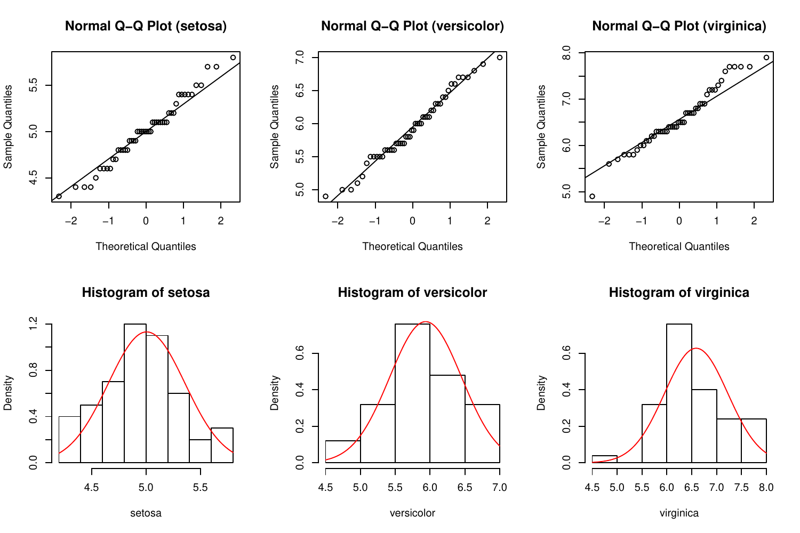</span></p>
</div>
<figcaption>Figure 1: Q-Q plots and histograms with normal
curves</figcaption>
</figure>

### Graphical approaches

The users can obtain several graphic types of given groups via the
`gplot`, which has options involving box-and-whisker plot with violin
line - a rotated density line on each side - (Figure
[2](#graph:graphics)a), box-and-whisker plot (Figure
[2](#graph:graphics)b), mean $\pm$ standard deviation graph (Figure
[2](#graph:graphics)c) and mean $\pm$ standard error graph (Figure
[2](#graph:graphics)d). These graphics can be obtained via the following
codes:

``` r
# Box-and-whisker plot with violin line
R> gplot(Sepal.Length ~ Species, data = iris, type = "boxplot")
```

``` r
# Box-and-whisker plot
R> gplot(Sepal.Length ~ Species, data = iris, type = "boxplot", violin = FALSE)
```

``` r
# Mean +- standard deviation graph
R> gplot(Sepal.Length ~ Species, data = iris, type = "errorbar", option = "sd")
```

``` r
# Mean +- standard error graph 
R> gplot(Sepal.Length ~ Species, data = iris, type = "errorbar", option = "se")
```

<figure id="graph:graphics">
<table>
<caption> </caption>
<tbody>
<tr class="odd">
<td style="text-align: center;">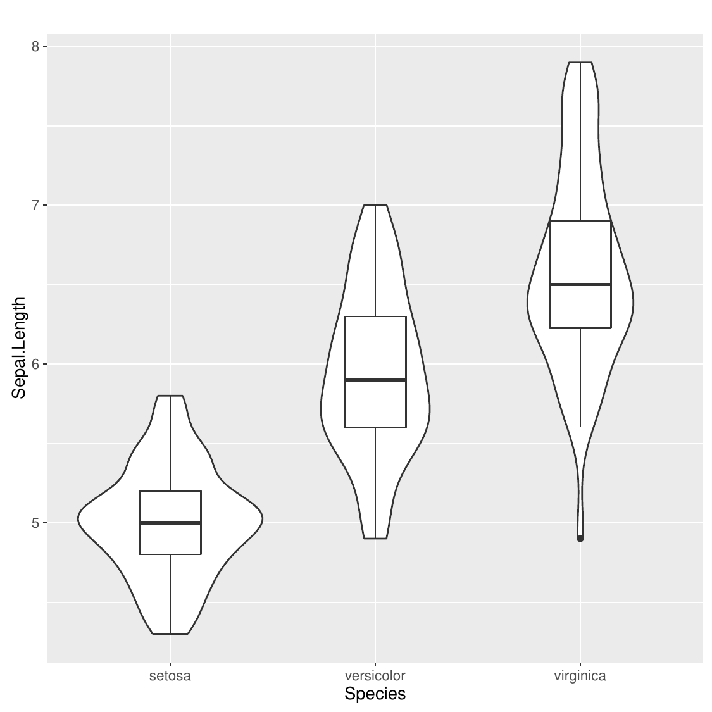</td>
<td style="text-align: center;">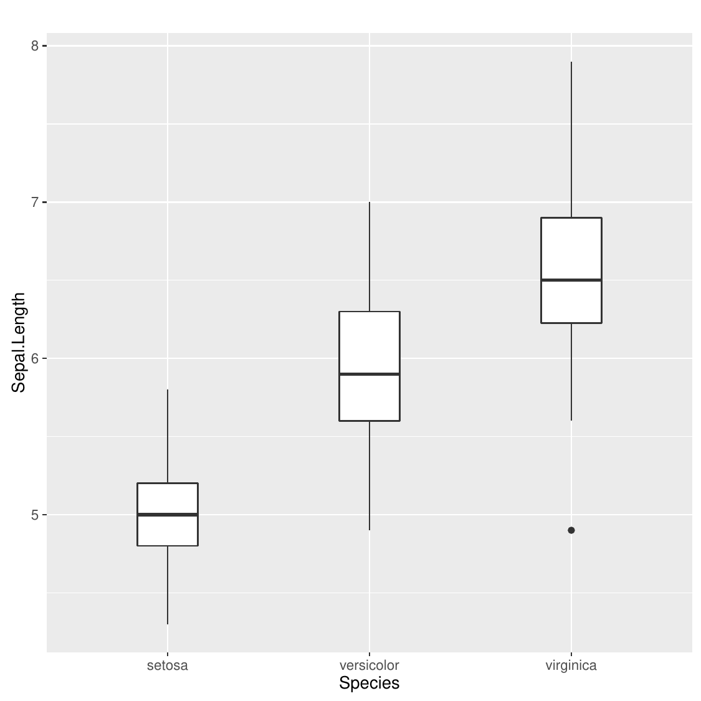</td>
</tr>
<tr class="even">
<td style="text-align: center;">(a) <span>Box-and-whisker plot with
violin line </span></td>
<td style="text-align: center;">(b) <span>Box-and-whisker
plot</span></td>
</tr>
<tr class="odd">
<td style="text-align: center;">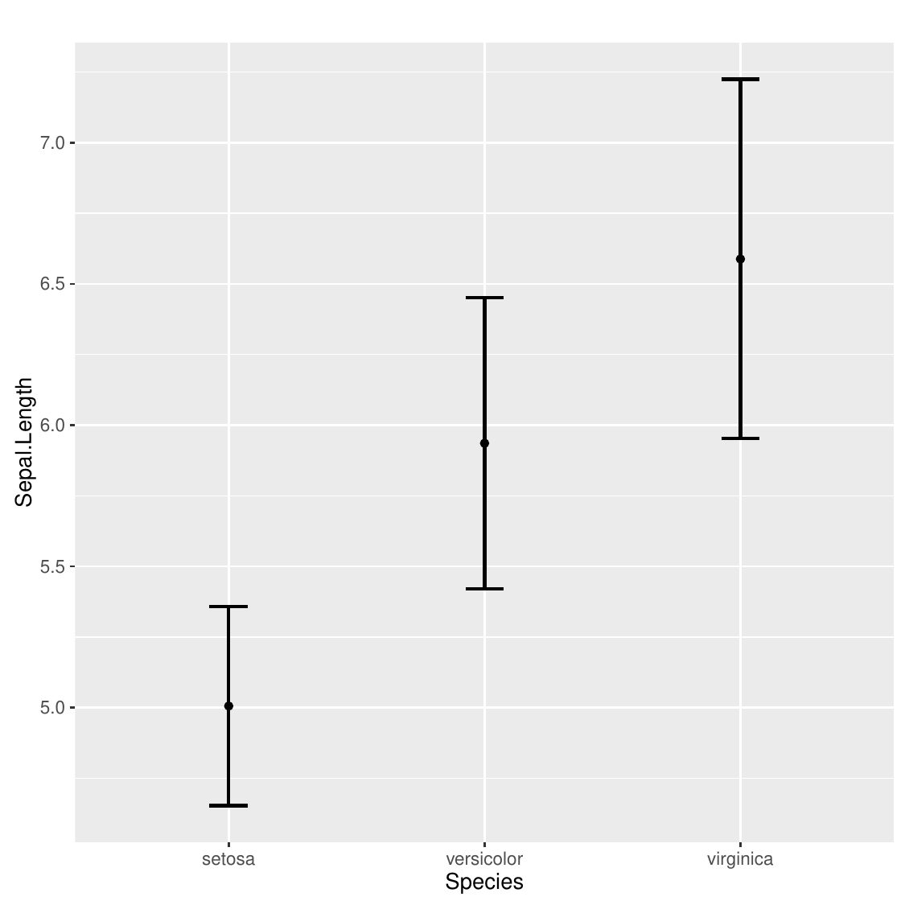</td>
<td style="text-align: center;">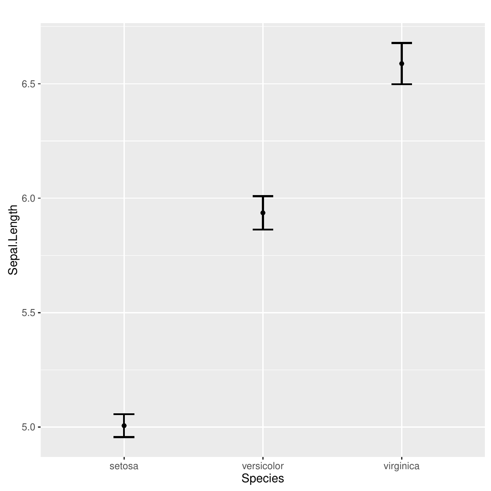</td>
</tr>
<tr class="even">
<td style="text-align: center;">(c) <span>Mean <span
class="math inline">±</span> standard deviation graph</span></td>
<td style="text-align: center;">(d) <span>Mean <span
class="math inline">±</span> standard error graph</span></td>
</tr>
</tbody>
</table>
<figcaption>Figure 2: Graphics of given groups</figcaption>
</figure>

## German breast cancer data

In this part, we utilize German breast cancer study group (GBSG) data
set, available in the ***mfp*** package [@mfp2015] in R. This data set
was collected from a cohort study and measurements from patients with
primary node positive breast cancer were taken between July 1984 and
December 1989. Seven risk factors, including menopausal status, tumor
size, tumor grade, age, number of positive lymph nodes, progesterone and
oestrogen receptor concentrations were examined in the work done by
[@sauerbrei1999]. For illustrative purposes, we take the dependent
variable as recurrence - free survival times of patients, of whom an
event for recurrence-free survival occurs, and the factor as tumor
grade. This factor is a three-level categorical variable: 1 = grade I, 2
= grade II , and 3 = grade III. A total of 299 observations (18, 202, 79
observations in each group, respectively) are available.

The objective of adding GBSG dataset is showing the usage of the package
in practice rather than demonstrating the usage of all functions in the
***onewaytests*** package. After checking the normality and variance
homogeneity assumptions, an appropriate one-way test is decided to
compare groups. Also, pairwise comparisons are applied when it is
necessary to determine which groups create the difference.

After installing and loading the ***mfp*** package, GBSG dataset can be
reached by using the following R code.

``` r
# load GBSG data 
R> data("GBSG")

# select the patients of whom an event for recurrence-free survival occurs
R> GBSG_subset <- GBSG[GBSG$cens == 1,]

# obtain the descriptive statistics of the tumor grades in terms of recurrence-free
# survival times
R> describe(rfst ~ tumgrad, data = GBSG_subset)

    n      Mean  Std.Dev Median Min  Max 25th    75th  Skewness Kurtosis NA
1  18 1052.1111 444.5332  969.0 476 1990  729 1290.25 0.8712495 2.938206  0
2 202  845.9505 511.2683  729.5  72 2456  487 1160.75 0.9484978 3.253876  0
3  79  616.6076 432.2091  476.0  98 2034  312  758.00 1.4487566 4.698735  0
```

The assumptions of variance homogeneity and normality are assessed by
using `homog.test` and `nor.test`, respectively.

``` r
# Bartlett's homogeneity test 
R> homog.test(rfst ~ tumgrad, data = GBSG_subset, method = "Bartlett")

  Bartlett's Homogeneity Test 
----------------------------------------------- 
  data : rfst and tumgrad 

  statistic  : 3.262419 
  parameter  : 2 
  p.value    : 0.1956927 

  Result     : Variances are homogeneous. 
-----------------------------------------------
```

Bartlett's homogeneity test results reveal that there is no enough
evidence to reject the variance homogeneity ($\chi^2$ = 3.262419,
p-value = 0.1956927) since p-value is larger than 0.05.

``` r
# Shapiro-Wilk normality test
R> nor.test(rfst ~ tumgrad, data = GBSG_subset, method = "SW")

  Shapiro-Wilk Normality Test 
-------------------------------------------------- 
  data : rfst and tumgrad 

  Level Statistic      p.value   Normality
1     1 0.9097324 8.510408e-02  Not reject
2     2 0.9195909 4.749653e-09      Reject
3     3 0.8489033 1.708621e-07      Reject
--------------------------------------------------
```

Shapiro-Wilk normality test results state that there is not enough
evidence to reject the normality of recurrence - free survival times of
the patients with tumor grade I since p-value is greater than 0.05. The
normality of recurrence - free survival times of the patients with tumor
grade II and III is not met since the p-value is smaller than 0.05. Our
simulation study results suggest that ANOVA is the appropriate one-way
test in such case.

``` r

R> aov.test(rfst ~ tumgrad,data = GBSG_subset)

  One-Way Analysis of Variance 
--------------------------------------------------------- 
  data : rfst and tumgrad 

  statistic  : 8.875494 
  num df     : 2 
  denom df   : 296 
  p.value    : 0.000180542 

  Result     : Difference is statistically significant. 
---------------------------------------------------------
```

Since the p-value, derived from `aov.test`, is lower than 0.05, it can
be concluded that there is a statistically significant difference
between the tumor grades with respect to recurrence - free survival
times (F = 8.875494, p-value = 0.000180542).

On the other hand, we observe that recurrence - free survival times of
the patients with tumor grade II and III have few outliers and
positively-skewed distributed. [@liao2016outlier] suggests that
Kruskal-Wallis test should be used in such cases. Therefore, this test
is also utilized along with ANOVA to compare groups.

``` r

R> kw.test(rfst ~ tumgrad, data = GBSG_subset)

  Kruskal-Wallis Test 
--------------------------------------------------------- 
  data : rfst and tumgrad 

  statistic  : 23.42841 
  parameter  : 2 
  p.value    : 8.176855e-06 

  Result     : Difference is statistically significant. 
---------------------------------------------------------
```

One can conclude that the difference between the tumor grades with
respect to recurrence - free survival times is statistically significant
($\chi_{KW}^2$ = 23.42841, p-value = 8.176855\^-06) since p-value is
smaller than 0.05.

Both ANOVA and Kruskal-Wallis test results reveal that there is a
statistically significant difference between tumor grade groups in terms
of recurrence-free survival times. In the next step, we need to
determine which groups create the difference.

``` r
# ANOVA
R> out <- aov.test(rfst ~ tumgrad, data = GBSG_subset, verbose = FALSE)
R> paircomp(out, adjust.method = "bonferroni")

  Bonferroni Correction (alpha = 0.05) 
------------------------------------------------------ 
  Level (a) Level (b)      p.value   No difference
1         1         2 0.2980174599      Not reject
2         1         3 0.0006698433          Reject
3         2         3 0.0014901832          Reject
------------------------------------------------------
```

``` r
# Kruskal-Wallis test
R> out<- kw.test(rfst ~ tumgrad, data = GBSG_subset, verbose = FALSE)
R> paircomp(out, adjust.method = "bonferroni")

  Bonferroni Correction (alpha = 0.05) 
------------------------------------------------------ 
  Level (a) Level (b)      p.value   No difference
1         1         2 0.0949942647      Not reject
2         1         3 0.0001333143          Reject
3         2         3 0.0002457434          Reject
------------------------------------------------------
```

Pairwise comparisons with Bonferroni correction after both ANOVA and
Kruskal-Wallis test indicate that there is no statistically significant
difference between the patients with tumor grade I and those with tumor
grade II in terms of recurrence-free survival times. On the other hand,
there exists a statistically significant difference between the patients
with tumor grade I/II and those with tumor grade III.

# Web interface of ***onewaytests*** package

The objective of this package is to provide the users with one-way tests
in independent groups designs, pairwise comparisons, graphical
approaches, and assess variance homogeneity and normality of data in
each group via tests and plots. At times, it is difficult for new R
users or applied researchers to deal with R codes. Thus, we have
developed a web interface of ***onewaytests*** package by using
***shiny*** [@Chang2017shiny]. The web interface is available at
<http://www.softmed.hacettepe.edu.tr/onewaytests>.

<figure id="fig:webtool">
<table>
<caption> </caption>
<tbody>
<tr class="odd">
<td style="text-align: center;">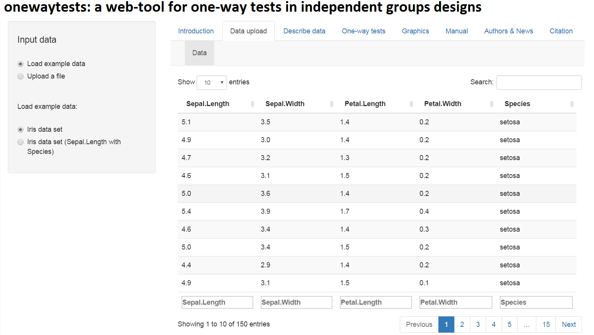</td>
<td style="text-align: center;">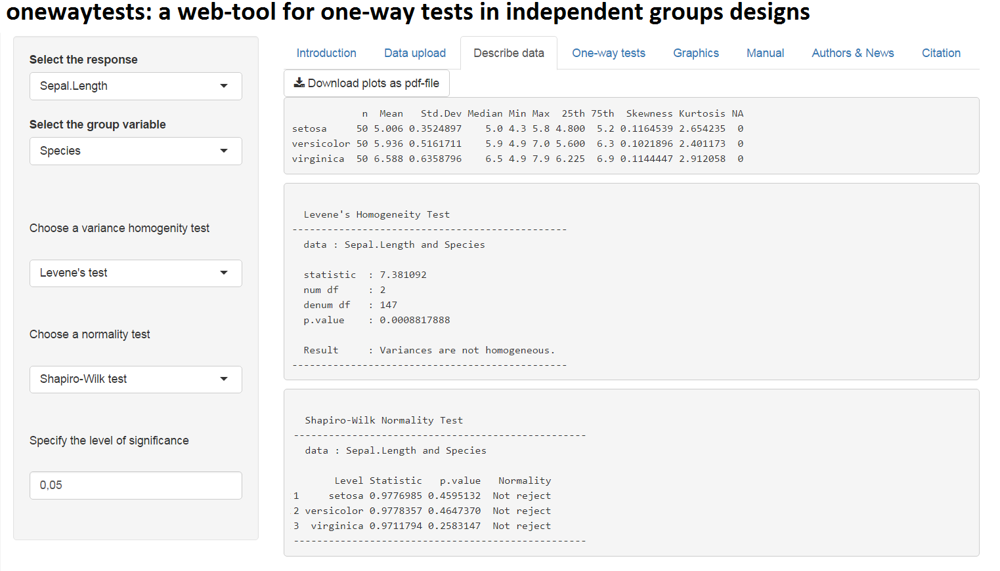</td>
</tr>
<tr class="even">
<td style="text-align: center;">(a) <span>Data upload</span></td>
<td style="text-align: center;">(b) <span>Describe data</span></td>
</tr>
<tr class="odd">
<td style="text-align: center;">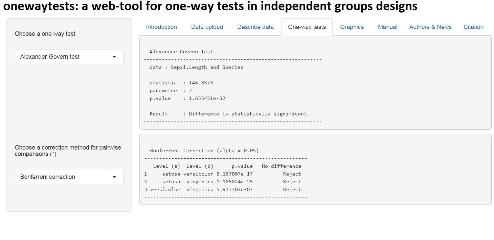</td>
<td style="text-align: center;">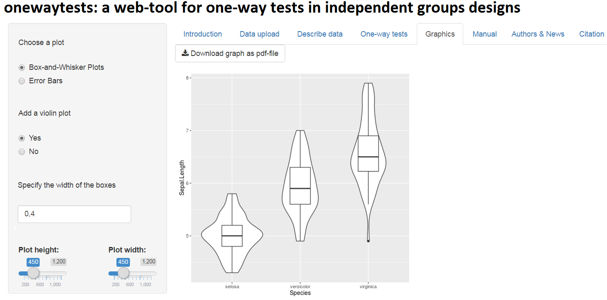</td>
</tr>
<tr class="even">
<td style="text-align: center;">(c) <span>One-way tests</span></td>
<td style="text-align: center;">(d) <span>Graphics</span></td>
</tr>
</tbody>
</table>
<figcaption>Figure 3: Web interface of onewaytests package</figcaption>
</figure>

Users can upload their data to the tool via *Data upload* tab (Figure
[3](#fig:webtool)a). There exist two demo datasets on this tab for the
users to test the tool. Basic descriptive statistics can be obtained
through *Describe data* tab (Figure [3](#fig:webtool)b). Moreover,
assumptions of variance homogeneity and normality can be checked via
this tab to decide on which one-way test is appropriate to test the
statistical difference. Variance homogeneity is checked by variance
homogeneity tests (Levene's test, Bartlett's test, Fligner-Killeen
test). The normality of data in each group is assessed by normality
tests (Shapiro-Wilk, Cramer-von Mises, Lilliefors (Kolmogorov-Smirnov),
Shapiro-Francia, Anderson-Darling, Pearson Chi-Square tests) and plots
(Q-Q plot and Histogram with a normal curve). After describing the data,
users can test statistical difference between groups through *One-way
tests* tab (Figure [3](#fig:webtool)c). In this tab, there exist one-way
tests (ANOVA, Welch's heteroscedastic *F*, Welch's heteroscedastic *F*
test with trimmed means and Winsorized variances, Brown-Forsythe,
Alexander-Govern, James second order test, Kruskal-Wallis tests) and
pairwise comparison methods (Bonferroni, Holm, Hochberg, Hommel,
Benjamini-Hochberg, Benjamini-Yekutieli, no corrections). Moreover,
users can obtain the graphics of given groups (Figure
[2](#graph:graphics)) through *Graphics* tab (Figure
[3](#fig:webtool)d).

# Simulation study

In this section, it is aimed to compare the performances of seven tests
in terms of type I error and adjusted power [@lloyd2005], and give some
general suggestions on which test(s) should be used or avoided under the
violations of assumptions. The adjusted power, $R(\alpha)$, is

$$\label{adjpower}
R(\alpha)= \Phi (\hat{\delta} +\Phi^{-1}(\alpha)),   (\#eq:adjpower)$$
with

$$\hat{\delta} =\Phi ^{-1}(1-\hat{\beta} )-\Phi ^{-1}(\hat{\alpha} ).$$

In Equation (\@ref(eq:adjpower)), $\hat{\alpha}$ is the estimated type I
error, $\hat{\beta}$ is the estimated type II error, $\alpha$ is the
nominal size for type I error, $\Phi$ and $\Phi ^{-1}$ are the
cumulative and inverse cumulative distribution functions of the standard
normal distribution, respectively.

## Simulation design

A Monte Carlo simulation is implemented to illustrate the performances
of these tests for the scenarios in which the assumptions of normality
and/or variance homogeneity are held or not. The algorithm of the
simulation study can be depicted as follows:

i)  Generate three random samples from normal or skew normal
    distribution with means $\mu_1$, $\mu_2$ and $\mu_3$ and standard
    deviations $\sigma_1$, $\sigma_2$, $\sigma_3$. Group standard
    deviations are taken as $\sigma_1=\sigma_2=\sigma_3=1$ for
    homogeneous case, and $\sigma_1= 1$, $\sigma_2= \sqrt{2}$,
    $\sigma_3= 2$ for heterogeneous case. Skewness $\gamma$ is set to
    $\gamma = 0$ for normal distribution, $\gamma = 0.5$ for positive
    skew normal distribution and $\gamma=-0.5$ for negative skew normal
    distribution with different sample size combinations (balanced and
    unbalanced). Set $\mu_1= \mu_2= \mu_3= 0$ for gathering type I
    error; $\mu_1= 0$, $\mu_2= 0.25$, $\mu_3= 0.5$ or $\mu_1= 0$,
    $\mu_2= 0.5$, $\mu_3= 1$ or $\mu_1= 0$, $\mu_2= 1$, $\mu_3= 2$ for
    power.

ii) Check whether groups are different by the corresponding one-way test
    in independent groups designs at the level of significance $\alpha$
    ($\alpha = 0.05$).

iii) Repeat steps i) - ii) for 10,000 times and calculate the
     probability of rejecting the null hypothesis when the null
     hypothesis is true (type I error) or false (power).

iv) Calculate adjusted power (given in @lloyd2005) by using the
    estimated type I error and power found in iii).

## Results

In this section, the performances of one-way tests in independent groups
designs are investigated through type I error and adjusted power. All
results are not given here to protect the content integrity, but
attached as supplementary tables [2](#tbl1)--[4](#tab:tbl3).

### Type I error rates

In this part, we compare seven one-way tests in terms of their type I
errors. We observed that the type I errors get closer to nominal level
as sample size increases under the data generated from normal
distribution ($\gamma=0$) with equal variances
($\sigma_1= \sigma_2= \sigma_3= 1$). Kruskal-Wallis test tends to be
more conservative compared to the rest of them in the unbalanced small
sample sizes ($n_1 = 6, n_2 = 9, n_3 = 15$). When variance homogeneity
is not held under normality, unbalance of sample sizes causes a decline
in type I error rates of ANOVA and Kruskal-Wallis test regardless of
sample size.

When the data in each group come from right skew normal distribution
($\gamma=0.5$) with unbalanced small sample size setting, type I error
rate of ANOVA is estimated to be 0.052 under variance homogeneity
($\sigma_1 = \sigma_2 = \sigma_3 = 1$) whereas it declines to 0.026
under variance heterogeneity
($\sigma_1 = 1, \sigma_2 = \sqrt{2}, \sigma_3 = 2$). The type I error
rate of ANOVA is negatively affected by the combined effect of
heterocedasticity and unbalanced sample size. Especially, when the
smaller variances are associated with groups having smaller sample size,
the empirical type I error rate of ANOVA is halved compared to the
homoscedastic case. Kruskal-Wallis test is dramatically affected by
variance heterogeneity. It tends to be conservative in the unbalanced
case whereas it becomes liberal in the balanced case.

James second order test, Alexander-Govern test, Welch's heteroscedastic
*F* test and Welch's heteroscedastic *F* test with trimmed means and
Winsorized variances control the type I error rate at the nominal size
for all simulation scenarios. Brown-Forsythe test is not able to control
type I error rate; especially when the variances are heterogeneous, it
becomes liberal.

### Adjusted powers

Adjusted power is important to compare tests having different type I
errors since it adjusts power with respect to type I error. The results
are illustrated in Figures [4](#figure1)--[5](#figure2) to see the clear
difference among the tests.

Within the tests discussed in this study, ANOVA is the best one with
respect to adjusted power when the sample sizes are not equal under
normality ($\gamma=0$) and variance homogeneity
($\sigma_1=\sigma_2=\sigma_3=1$). Under the same condition, ANOVA and
Brown-Forsythe test are superior to the rest of them in terms of
adjusted power when the design of sample size is balanced. As expected,
ANOVA performs poor under normality when variances are unstable
($\sigma_1= 1, \sigma_2= \sqrt{2}, \sigma_3= 2$); however,
Alexander-Govern, James and Welch's heteroscedastic *F* tests have
higher adjusted powers compared to other tests. Brown-Forsythe and
Kruskal-Wallis tests perform poorly compared to the others under the
same condition.

When the data are generated from positive skew normal distribution
($\gamma=0.5$) with equal variances, ANOVA and Kruskal-Wallis test
perform better than other tests. ANOVA is slightly better than
Kruskal-Wallis test for small sample sizes and vice versa is true for
the medium sample sizes. James, Alexander-Govern and Welch's
heteroscedastic *F* tests have the highest adjusted powers among the
whole tests for all scenario combinations under the data generated from
a positive skew normal distribution with heterogeneous variances.

ANOVA, Brown-Forsythe test and Kruskal-Wallis test perform better than
the other tests when the data are generated from negative skew normal
distribution ($\gamma=-0.5$) with homogeneous variances and equal sample
sizes; however, Kruskal-Wallis test is slightly superior to ANOVA and
Brown-Forsythe test. The adjusted power of ANOVA seems not to be
affected by the skewness and it performs best under the same condition
when the design of sample size is unbalanced. When the data are
generated from the negative skew normal distribution with heterogeneous
variances, Kruskal-Wallis test performs best for low
($\mu_1 = 0, \mu_2 = 0.25, \mu_3 = 0.5$) and medium
($\mu_1 = 0, \mu_2 = 0.5, \mu_3 = 1$) effect sizes while Welch's
heteroscedastic *F* test with trimmed mean and Winsorized variance has
higher performance compared to other tests for high effect size
($\mu_1 = 0, \mu_2 = 1, \mu_3 = 2$).

It is noted that the Kruskal-Wallis test is affected by the skewness of
the distribution especially under heterogeneity of variance
($\sigma_1= 1$, $\sigma_2= \sqrt{2}$, $\sigma_3= 2$). Kruskal-Wallis
test has the highest adjusted power when the data are generated from a
negatively skewed distribution ($\gamma=-0.5$). On the other hand, it
has the lowest adjusted power when the data are generated from a
positively skewed distribution (**$\gamma=0.5$**).

<figure id="figure1">
<div class="center">
<p>!<span>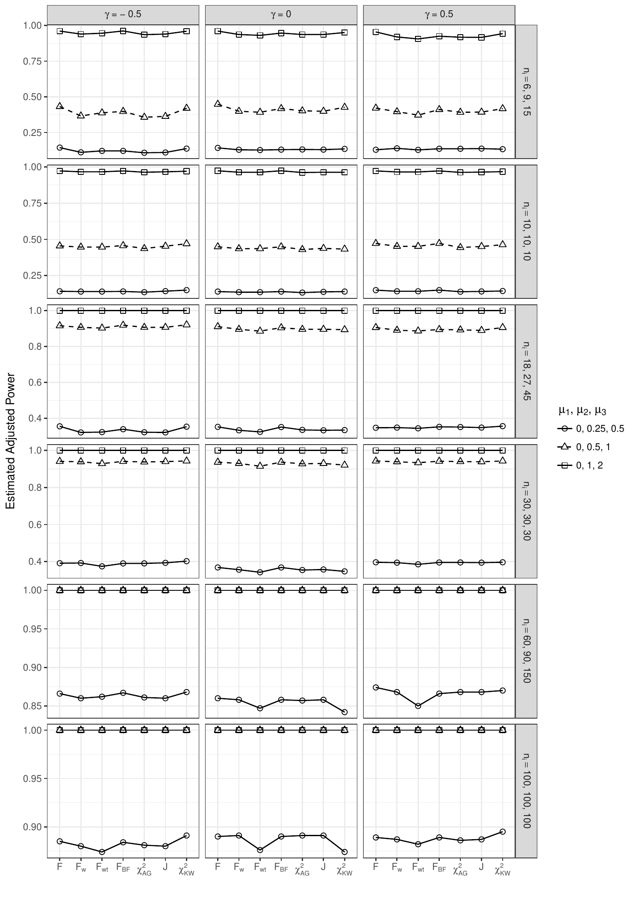</span></p>
</div>
<figcaption>Figure 4: Estimated adjusted power results under
homogeneous-variance (<span
class="math inline"><em>σ</em><sub>1</sub> = <em>σ</em><sub>2</sub> = <em>σ</em><sub>3</sub> = 1</span>)
scenarios</figcaption>
</figure>

<figure id="figure2">
<div class="center">
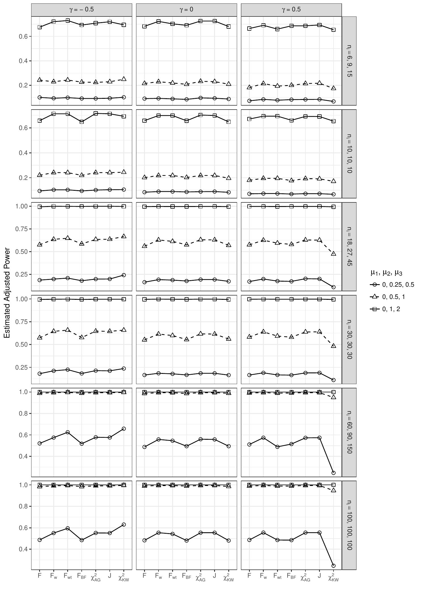
</div>
<figcaption>Figure 5: Estimated adjusted power results under
heterogeneous-variance (<span class="math inline">$\sigma_1= 1,
\sigma_2= \sqrt{2}, \sigma_3= 2$</span>) scenarios</figcaption>
</figure>

# Summary and further research {#conclusion}

One-way tests in independent groups designs are the most commonly
utilized statistical methods with applications on the experiments in
medical sciences, pharmaceutical research, agriculture, biology,
chemistry, engineering, and social sciences. In this paper, we present
the ***onewaytests*** package for researchers to investigate treatment
effects on the dependent variable.

The ***onewaytests*** package includes well-known one-way tests in
independent groups designs including one-way analysis of variance,
Kruskal-Wallis test, Welch heteroscedastic *F* test, Brown-Forsythe
test. In addition to these well-known tests, Alexander-Govern test,
James second order test and Welch heteroscedastic *F* test with trimmed
means and Winsorized variances, not available in most statistical
software, are able to be reached via this package. Also, pairwise
comparisons can be applied if the statistically significant difference
is obtained.

Normality and variance homogeneity are the vital assumptions for the
selection of the appropriate test. Therefore, this package also enables
the users to check these assumptions via variance homogeneity and
normality tests. It also enables the users some basic descriptive
statistics and graphical approaches.

ANOVA is the most commonly used method for one-way independent groups
designs. However, this method has two certain assumptions, homogeneity
of variances and normality, to be satisfied. When these assumptions are
not met, there are some other alternatives for one-way independent
groups designs, which include Welch's heteroscedastic *F* test, Welch's
heteroscedastic *F* test with trimmed means and Winsorized variances,
Alexander-Govern test, James second order test, Brown-Forsythe test and
Kruskal-Wallis test.

In this paper, we also compared seven one-way tests in ***onewaytests***
package with respect to the type I error rate and adjusted power. In the
light of Monte Carlo simulation, it is noted that the normality
assumption does not have a negative effect on the adjusted power of the
tests as severe as variance homogeneity assumption. ANOVA is suggested
to be used if the variance homogeneity assumption is held. Otherwise,
Alexander-Govern, James second order and Welch's heteroscedastic *F*
tests are recommended to be utilized. It is pointed out that under the
negatively skew normal distribution with heterogeneous variances,
Kruskal-Wallis test performs best with small and medium effect sizes
while the Welch's heteroscedastic *F* test with trimmed means and
Winsorized variances has the highest adjusted power with large effect
size.

At present, the ***onewaytests*** package offers the one-way tests in
independent groups designs, pairwise comparisons, graphical approaches,
and assessment of variance homogeneity and normality via tests and
plots. The package and its web-interface will be updated at regular
intervals.

# Acknowledgment

We thank the anonymous reviewers for their constructive comments and
suggestions which helped us to improve the quality of our paper.

# Supplementary Material {#supplementary-material .unnumbered}

::: {#tbl1}
  -----------------------------------------------------------------------------------------------------------------------------------------------------------
   **Distribution**   **$\sigma_1, \sigma_2, \sigma_3$**   **$n_1, n_2, n_3$**    $F$    $F_w$   $F_{wt}$   $F_{BF}$   $\chi_{AG}^2$    *J*    $\chi_{KW}^2$
  ------------------ ------------------------------------ --------------------- ------- ------- ---------- ---------- --------------- ------- ---------------
                                                                6, 9, 15         0.046   0.047    0.047      0.046         0.046       0.047       0.041

                                                               10, 10, 10        0.052   0.050    0.050      0.050         0.049       0.051       0.047

                                                               18, 27, 45        0.049   0.051    0.051      0.048         0.051       0.051       0.048

                                   1, 1, 1                     30, 30, 30        0.051   0.052    0.053      0.051         0.052       0.052       0.051

                                                               60, 90, 150       0.050   0.049    0.050      0.051         0.049       0.049       0.050

        Normal                                                100, 100, 100      0.051   0.050    0.052      0.051         0.050       0.050       0.050

                                                                                                                                              

     ($\gamma=0$)                                               6, 9, 15         0.023   0.045    0.047      0.051         0.043       0.046       0.029

                                                               10, 10, 10        0.058   0.051    0.051      0.053         0.050       0.052       0.054

                                                               18, 27, 45        0.025   0.050    0.050      0.053         0.049       0.050       0.032

                               1, $\sqrt{2}$, 2                30, 30, 30        0.058   0.052    0.051      0.056         0.051       0.052       0.055

                                                               60, 90, 150       0.025   0.051    0.051      0.055         0.051       0.051       0.034

                                                              100, 100, 100      0.059   0.052    0.052      0.059         0.052       0.052       0.059

                                                                6, 9, 15         0.052   0.055    0.053      0.051         0.056       0.055       0.047

                                                               10, 10, 10        0.048   0.048    0.048      0.046         0.048       0.050       0.045

                                                               18, 27, 45        0.053   0.054    0.052      0.052         0.053       0.054       0.050

                                   1, 1, 1                     30, 30, 30        0.047   0.046    0.045      0.047         0.045       0.046       0.046

                                                               60, 90, 150       0.046   0.046    0.050      0.046         0.046       0.046       0.049

     Skew Normal                                              100, 100, 100      0.052   0.052    0.052      0.052         0.052       0.052       0.050

                                                                                                                                              

    ($\gamma=0.5$)                                              6, 9, 15         0.026   0.052    0.051      0.053         0.052       0.053       0.032

                                                               10, 10, 10        0.059   0.051    0.051      0.054         0.051       0.053       0.052

                                                               18, 27, 45        0.023   0.051    0.053      0.055         0.050       0.051       0.038

                               1, $\sqrt{2}$, 2                30, 30, 30        0.053   0.046    0.046      0.052         0.046       0.046       0.057

                                                               60, 90, 150       0.022   0.048    0.052      0.052         0.048       0.048       0.052

                                                              100, 100, 100      0.058   0.050    0.053      0.058         0.050       0.050       0.082

                                                                6, 9, 15         0.048   0.050    0.051      0.048         0.053       0.051       0.045

                                                               10, 10, 10        0.051   0.048    0.048      0.048         0.048       0.048       0.043

                                                               18, 27, 45        0.048   0.051    0.049      0.049         0.050       0.051       0.047

                                   1, 1, 1                     30, 30, 30        0.048   0.047    0.048      0.048         0.047       0.047       0.045

                                                               60, 90, 150       0.049   0.051    0.050      0.050         0.050       0.051       0.049

     Skew Normal                                              100, 100, 100      0.053   0.054    0.054      0.053         0.053       0.054       0.052

                                                                                                                                              

   ($\gamma=-0.5$)                                              6, 9, 15         0.024   0.047    0.049      0.048         0.047       0.049       0.031

                                                               10, 10, 10        0.058   0.051    0.051      0.054         0.050       0.052       0.053

                                                               18, 27, 45        0.024   0.049    0.049      0.053         0.048       0.049       0.037

                               1, $\sqrt{2}$, 2                30, 30, 30        0.054   0.048    0.048      0.052         0.047       0.048       0.059

                                                               60, 90, 150       0.022   0.050    0.050      0.054         0.049       0.050       0.054

                                                              100, 100, 100      0.058   0.054    0.055      0.058         0.054       0.054       0.085
  -----------------------------------------------------------------------------------------------------------------------------------------------------------

  : Table 2: Estimated type I error rates
:::

[]{#tbl1 label="tbl1"}

::: {#tab:tbl2}
  -----------------------------------------------------------------------------------------------------------------------------------------------------------------------------------------------
   **Distribution**   **$\sigma_1,\sigma_2,\sigma_3$**   **$n_1,n_2,n_3$**   **$\mu_1,\mu_2,\mu_3$**      $F$        $F_w$     $F_{wt}$    $F_{BF}$    $\chi_{AG}^2$      *J*      $\chi_{KW}^2$
  ------------------ ---------------------------------- ------------------- ------------------------- ----------- ----------- ----------- ----------- --------------- ----------- ---------------
                                                                                  0, 0.25, 0.5         **0.141**     0.129       0.127       0.130         0.132         0.130         0.136

                                                             6, 9, 15               0, 0.5, 1          **0.447**     0.400       0.392       0.417         0.404         0.399         0.428

                                                                                     0, 1, 2           **0.961**     0.937       0.931       0.948         0.937         0.937         0.951

                                                                                                                                                                                  

                                                                                  0, 0.25, 0.5           0.140       0.136       0.136     **0.141**       0.133         0.138         0.139

                                                            10, 10, 10              0, 0.5, 1            0.449       0.436       0.436     **0.451**       0.430         0.437         0.433

                                                                                     0, 1, 2           **0.973**     0.963       0.963     **0.973**       0.961         0.964         0.963

                                                                                                                                                                                  

                                                                                  0, 0.25, 0.5         **0.353**     0.335       0.324       0.351         0.334         0.334         0.335

                                  1, 1, 1                   18, 27, 45              0, 0.5, 1          **0.911**     0.897       0.886       0.905         0.895         0.896         0.894

                                                                                     0, 1, 2           **1.000**   **1.000**   **1.000**   **1.000**     **1.000**     **1.000**     **1.000**

                                                                                                                                                                                  

                                                                                  0, 0.25, 0.5           0.367       0.356       0.343     **0.368**       0.356         0.356         0.347

                                                            30, 30, 30              0, 0.5, 1          **0.937**     0.930       0.915     **0.937**       0.929         0.930         0.920

                                                                                     0, 1, 2           **1.000**   **1.000**   **1.000**   **1.000**     **1.000**     **1.000**     **1.000**

                                                                                                                                                                                  

                                                                                  0, 0.25, 0.5         **0.861**     0.858       0.848       0.859         0.858         0.858         0.842

                                                            60, 90, 150             0, 0.5, 1          **1.000**   **1.000**   **1.000**   **1.000**     **1.000**     **1.000**     **1.000**

                                                                                     0, 1, 2           **1.000**   **1.000**   **1.000**   **1.000**     **1.000**     **1.000**     **1.000**

                                                                                                                                                                                  

                                                                                  0, 0.25, 0.5         **0.891**     0.890       0.877     **0.891**     **0.891**       0.890         0.874

                                                           100, 100, 100            0, 0.5, 1          **1.000**   **1.000**   **1.000**   **1.000**     **1.000**     **1.000**     **1.000**

        Normal                                                                       0, 1, 2           **1.000**   **1.000**   **1.000**   **1.000**     **1.000**     **1.000**     **1.000**

                                                                                                                                                                                  

     ($\gamma=0$)                                                                 0, 0.25, 0.5           0.091       0.093       0.089       0.086       **0.096**       0.093         0.087

                                                             6, 9, 15               0, 0.5, 1            0.214       0.228       0.220       0.209       **0.232**       0.229         0.207

                                                                                     0, 1, 2             0.682       0.721       0.703       0.691       **0.724**       0.723         0.677

                                                                                                                                                                                  

                                                                                  0, 0.25, 0.5           0.084     **0.089**   **0.089**     0.086         0.087       **0.089**       0.082

                                                            10, 10, 10              0, 0.5, 1            0.200       0.217       0.217       0.200         0.217       **0.219**       0.195

                                                                                     0, 1, 2             0.657       0.697       0.697       0.655       **0.702**       0.700         0.647

                                                                                                                                                                                  

                                                                                  0, 0.25, 0.5           0.164       0.192       0.186       0.175         0.192       **0.193**       0.170

                              1, $\sqrt{2}$, 2              18, 27, 45              0, 0.5, 1            0.562       0.629       0.612       0.574       **0.630**     **0.630**       0.568

                                                                                     0, 1, 2             0.995     **0.997**     0.996       0.996       **0.997**     **0.997**       0.995

                                                                                                                                                                                  

                                                                                  0, 0.25, 0.5           0.167       0.185       0.180       0.166       **0.187**       0.185         0.165

                                                            30, 30, 30              0, 0.5, 1            0.553       0.615       0.600       0.554       **0.619**       0.615         0.561

                                                                                     0, 1, 2             0.996       0.997       0.997       0.996       **0.998**       0.997         0.994

                                                                                                                                                                                  

                                                                                  0, 0.25, 0.5           0.491       0.559       0.545       0.496         0.558       **0.560**       0.496

                                                            60, 90, 150             0, 0.5, 1            0.987     **0.994**     0.992       0.987       **0.994**     **0.994**       0.988

                                                                                     0, 1, 2           **1.000**   **1.000**   **1.000**   **1.000**     **1.000**     **1.000**     **1.000**

                                                                                                                                                                                  

                                                                                  0, 0.25, 0.5           0.483       0.553       0.545       0.482       **0.554**       0.553         0.483

                                                           100, 100, 100            0, 0.5, 1            0.988     **0.994**     0.992       0.988       **0.994**     **0.994**       0.985

                                                                                     0, 1, 2           **1.000**   **1.000**   **1.000**   **1.000**     **1.000**     **1.000**     **1.000**

                                                                                  0, 0.25, 0.5           0.128     **0.137**     0.127       0.135         0.136       **0.137**       0.134

                                                             6, 9, 15               0, 0.5, 1          **0.419**     0.395       0.372       0.410         0.392         0.393         0.418

                                                                                     0, 1, 2           **0.955**     0.919       0.906       0.924         0.918         0.917         0.944

                                                                                                                                                                                  

                                                                                  0, 0.25, 0.5         **0.150**     0.141       0.141       0.149         0.138         0.141         0.144

                                                            10, 10, 10              0, 0.5, 1          **0.472**     0.450       0.450       0.470         0.443         0.450         0.463

                                                                                     0, 1, 2           **0.972**     0.964       0.964       0.971         0.961         0.964         0.967

                                                                                                                                                                                  

                                                                                  0, 0.25, 0.5           0.348       0.350       0.345       0.352         0.351         0.350       **0.359**

     Skew Normal                  1, 1, 1                   18, 27, 45              0, 0.5, 1          **0.907**     0.891       0.887       0.895         0.892         0.891       **0.907**

    ($\gamma=0.5$)                                                                   0, 1, 2           **1.000**   **1.000**   **1.000**   **1.000**     **1.000**     **1.000**     **1.000**

                                                                                                                                                                                  

                                                                                  0, 0.25, 0.5           0.397       0.395       0.386       0.397         0.396         0.395       **0.398**

                                                            30, 30, 30              0, 0.5, 1            0.942       0.939       0.934       0.942         0.940         0.939       **0.943**

                                                                                     0, 1, 2           **1.000**   **1.000**   **1.000**   **1.000**     **1.000**     **1.000**     **1.000**

                                                                                                                                                                                  

                                                                                  0, 0.25, 0.5         **0.875**     0.868       0.851       0.867         0.869         0.868         0.870

                                                            60, 90, 150             0, 0.5, 1          **1.000**   **1.000**   **1.000**   **1.000**     **1.000**     **1.000**     **1.000**

                                                                                     0, 1, 2           **1.000**   **1.000**   **1.000**   **1.000**     **1.000**     **1.000**     **1.000**

                                                                                                                                                                                  

                                                                                  0, 0.25, 0.5           0.890       0.887       0.882       0.890         0.887         0.887       **0.894**

                                                           100, 100, 100            0, 0.5, 1          **1.000**   **1.000**   **1.000**   **1.000**     **1.000**     **1.000**     **1.000**

                                                                                     0, 1, 2           **1.000**   **1.000**   **1.000**   **1.000**     **1.000**     **1.000**     **1.000**
  -----------------------------------------------------------------------------------------------------------------------------------------------------------------------------------------------

  : Table 3: Adjusted power results
:::

[]{#tab:tbl2 label="tab:tbl2"}

::: {#tab:tbl3}
  -----------------------------------------------------------------------------------------------------------------------------------------------------------------------------------------------
   **Distribution**   **$\sigma_1,\sigma_2,\sigma_3$**   **$n_1,n_2,n_3$**   **$\mu_1,\mu_2,\mu_3$**      $F$        $F_w$     $F_{wt}$    $F_{BF}$    $\chi_{AG}^2$      *J*      $\chi_{KW}^2$
  ------------------ ---------------------------------- ------------------- ------------------------- ----------- ----------- ----------- ----------- --------------- ----------- ---------------
                                                                                  0, 0.25, 0.5           0.072     **0.085**     0.077       0.083       **0.085**     **0.085**       0.068

                                                             6, 9, 15               0, 0.5, 1            0.181     **0.216**     0.193       0.199         0.215       **0.216**       0.172

                                                                                     0, 1, 2             0.664       0.691       0.659       0.684         0.687       **0.693**       0.652

                                                                                                                                                                                  

                                                                                  0, 0.25, 0.5           0.072       0.072       0.072       0.069         0.072       **0.073**       0.067

                                                            10, 10, 10              0, 0.5, 1            0.180     **0.194**   **0.194**     0.176       **0.194**       0.192         0.170

                                                                                     0, 1, 2             0.672     **0.693**   **0.693**     0.661       **0.693**       0.692         0.653

                                                                                                                                                                                  

                                                                                  0, 0.25, 0.5           0.169       0.199       0.174       0.171       **0.200**       0.198         0.109

     Skew Normal              1, $\sqrt{2}$, 2              18, 27, 45              0, 0.5, 1            0.573       0.625       0.591       0.579       **0.627**       0.625         0.475

    ($\gamma=0.5$)                                                                   0, 1, 2           **0.997**   **0.997**     0.995       0.996       **0.997**     **0.997**       0.993

                                                                                                                                                                                  

                                                                                  0, 0.25, 0.5           0.167     **0.189**     0.167       0.166         0.188       **0.189**       0.111

                                                            30, 30, 30              0, 0.5, 1            0.584     **0.639**     0.593       0.582         0.638       **0.639**       0.483

                                                                                     0, 1, 2             0.997     **0.998**     0.997       0.997       **0.998**     **0.998**       0.994

                                                                                                                                                                                  

                                                                                  0, 0.25, 0.5           0.514     **0.573**     0.489       0.516       **0.573**     **0.573**       0.246

                                                            60, 90, 150             0, 0.5, 1            0.991     **0.994**     0.989       0.991       **0.994**     **0.994**       0.949

                                                                                     0, 1, 2           **1.000**   **1.000**   **1.000**   **1.000**     **1.000**     **1.000**     **1.000**

                                                                                                                                                                                  

                                                                                  0, 0.25, 0.5           0.487     **0.554**     0.486       0.487       **0.554**     **0.554**       0.245

                                                           100, 100, 100            0, 0.5, 1            0.990     **0.994**     0.990       0.990       **0.994**     **0.994**       0.946

                                                                                     0, 1, 2           **1.000**   **1.000**   **1.000**   **1.000**     **1.000**     **1.000**     **1.000**

                                                                                  0, 0.25, 0.5         **0.144**     0.111       0.120       0.120         0.107         0.111         0.135

                                                             6, 9, 15               0, 0.5, 1          **0.432**     0.364       0.386       0.396         0.355         0.365         0.417

                                                                                     0, 1, 2             0.961       0.940       0.946     **0.962**       0.935         0.940         0.959

                                                                                                                                                                                  

                                                                                  0, 0.25, 0.5           0.142       0.142       0.142       0.142         0.138         0.142       **0.150**

                                                            10, 10, 10              0, 0.5, 1            0.455       0.449       0.449       0.457         0.439         0.451       **0.470**

                                                                                     0, 1, 2           **0.972**     0.966       0.966     **0.972**       0.963         0.966         0.970

                                                                                                                                                                                  

                                                                                  0, 0.25, 0.5         **0.358**     0.322       0.325       0.340         0.322         0.322         0.356

                                  1, 1, 1                   18, 27, 45              0, 0.5, 1            0.917       0.908       0.903       0.920         0.907         0.908       **0.921**

                                                                                     0, 1, 2           **1.000**   **1.000**   **1.000**   **1.000**     **1.000**     **1.000**     **1.000**

                                                                                                                                                                                  

                                                                                  0, 0.25, 0.5           0.391       0.392       0.376       0.390         0.390         0.393       **0.401**

                                                            30, 30, 30              0, 0.5, 1            0.941       0.939       0.929       0.941         0.937         0.939       **0.943**

                                                                                     0, 1, 2           **1.000**   **1.000**   **1.000**   **1.000**     **1.000**     **1.000**     **1.000**

                                                                                                                                                                                  

                                                                                  0, 0.25, 0.5           0.867       0.860       0.862     **0.868**       0.861         0.860         0.867

                                                            60, 90, 150             0, 0.5, 1          **1.000**   **1.000**   **1.000**   **1.000**     **1.000**     **1.000**     **1.000**

                                                                                     0, 1, 2           **1.000**   **1.000**   **1.000**   **1.000**     **1.000**     **1.000**     **1.000**

                                                                                                                                                                                  

                                                                                  0, 0.25, 0.5           0.884       0.880       0.874       0.884         0.880         0.880       **0.892**

                                                           100, 100, 100            0, 0.5, 1          **1.000**   **1.000**   **1.000**   **1.000**     **1.000**     **1.000**     **1.000**

     Skew Normal                                                                     0, 1, 2           **1.000**   **1.000**   **1.000**   **1.000**     **1.000**     **1.000**     **1.000**

                                                                                                                                                                                  

   ($\gamma=-0.5$)                                                                0, 0.25, 0.5           0.101       0.094       0.098       0.092         0.091         0.094       **0.102**

                                                             6, 9, 15               0, 0.5, 1            0.240       0.229       0.243       0.225         0.223         0.230       **0.249**

                                                                                     0, 1, 2             0.672       0.720     **0.728**     0.691         0.707         0.720         0.694

                                                                                                                                                                                  

                                                                                  0, 0.25, 0.5           0.094       0.103       0.103       0.094         0.102       **0.104**     **0.104**

                                                            10, 10, 10              0, 0.5, 1            0.220       0.240       0.240       0.220         0.242         0.242       **0.243**

                                                                                     0, 1, 2             0.658       0.713       0.713       0.649       **0.717**       0.713         0.692

                                                                                                                                                                                  

                                                                                  0, 0.25, 0.5           0.188       0.197       0.207       0.178         0.197         0.197       **0.242**

                              1, $\sqrt{2}$, 2              18, 27, 45              0, 0.5, 1            0.579       0.635       0.645       0.582         0.633         0.636       **0.666**

                                                                                     0, 1, 2             0.993     **0.999**   **0.999**     0.996       **0.999**     **0.999**       0.998

                                                                                                                                                                                  

                                                                                  0, 0.25, 0.5           0.180       0.213       0.225       0.183         0.213         0.212       **0.238**

                                                            30, 30, 30              0, 0.5, 1            0.574       0.646       0.658       0.576         0.647         0.646       **0.659**

                                                                                     0, 1, 2             0.994       0.997     **0.998**     0.994         0.997         0.997         0.997

                                                                                                                                                                                  

                                                                                  0, 0.25, 0.5           0.518       0.576       0.624       0.517         0.577         0.576       **0.659**

                                                            60, 90, 150             0, 0.5, 1            0.988       0.994     **0.996**     0.988         0.994         0.994       **0.996**

                                                                                     0, 1, 2           **1.000**   **1.000**   **1.000**   **1.000**     **1.000**     **1.000**     **1.000**

                                                                                                                                                                                  

                                                                                  0, 0.25, 0.5           0.487       0.552       0.595       0.486         0.552         0.552       **0.630**

                                                           100, 100, 100            0, 0.5, 1            0.984       0.992       0.994       0.984         0.992         0.991       **0.995**

                                                                                     0, 1, 2           **1.000**   **1.000**   **1.000**   **1.000**     **1.000**     **1.000**     **1.000**
  -----------------------------------------------------------------------------------------------------------------------------------------------------------------------------------------------

  : Table 4: Adjusted power results continued
:::

[]{#tab:tbl3 label="tab:tbl3"}

