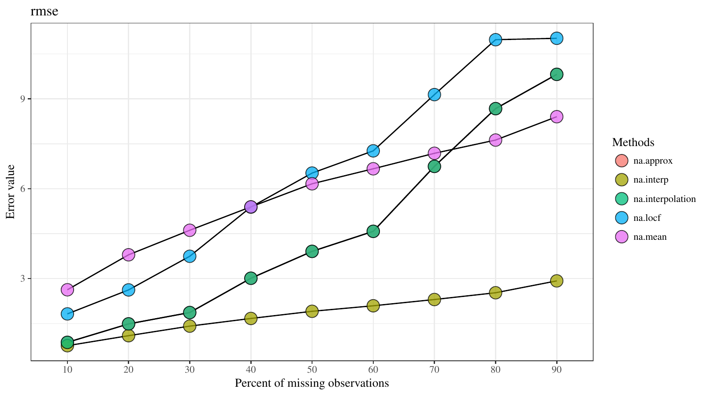
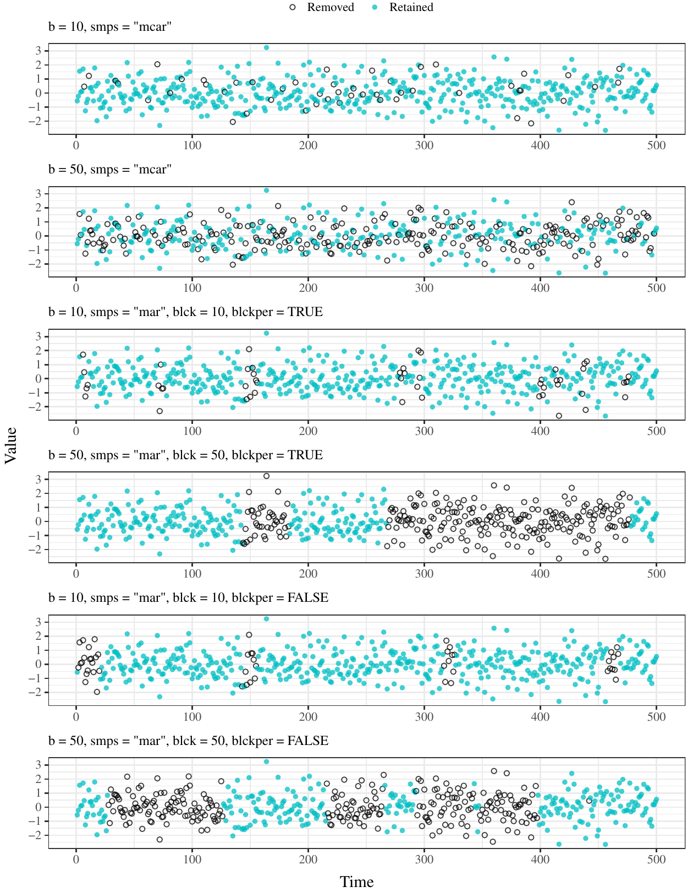
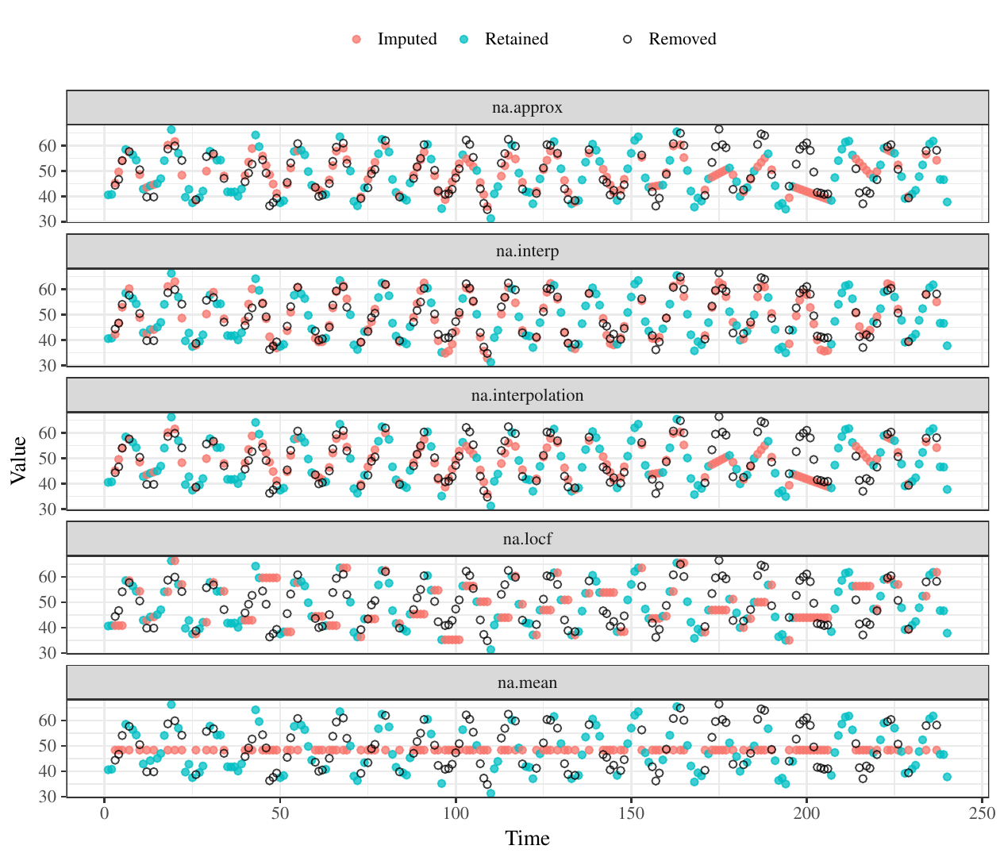

::: article
# Introduction

Univariate time series data provide valuable information that forms the
basis of analysis across several disciplines. The most notable
characteristic of time series data is time-dependent correlations
between observations such that the likelihood of observing a single
value depends on the values of past or future observations
[@Shumway11; @Box15]. This precludes the use of most conventional
statistical methods that require independence of observations as a
fundamental assumption prior to analysis. However, unique methods have
been developed that account for and leverage the statistical
characteristics of time series data to provide insight beyond those
provided by more conventional techniques. For example, additive or
multiplicative models can be used to separate a univariate time series
data into unique components with different structures [e.g., @Gould08],
whereas multiple methods for signal processing seek to isolate dominant
components that are independent of random variation in the observed data
[e.g., @Mendel00].

Many analysis methods for time series require complete observations at
each time step across the period of interest. Complete datasets rarely
exist such that missing observations are often defining characteristics
of time series data [e.g., @Gomez94; @Honaker10]. Missing observations
can occur for several reasons, although the type and amount of missing
values depend on characteristics of the data [@Schafer97; @Schafer02].
For example, a time series with no serial dependence between
observations is more likely to have missing observations that are
completely random [@Rubin76]. A more common scenario for time series
data is missing observations in 'chunks' or data missing in sequence for
a period of time [@Schafer97; @Donder06]. The occurrence of missing
chunks relates directly to the correlation structure of time series
data, as in cases when experiments are not continuously maintained,
remote data fail to transmit from the source to the user, or funding
mechanisms for monitoring programs are discontinuous. As such, the
accuracy of imputation methods can vary considerably depending on
characteristics of the dataset [@Yozgatligil13]. Similar to the
application of analysis methods that use time-dependent information,
imputation methods must also faithfully reconstruct missing observations
in this context.

Identifying an appropriate imputation method is often the first step
towards more formal time series analysis. Different imputation methods
will have differing precision in reproducing missing values, where
precision will depend on how much data are missing and how the data are
missing (i.e., individual observations missing at random or data missing
in continuous chunks). The characteristics of the dataset will also
influence imputation precision between methods. An expectation is that
imputation methods that leverage characteristics of the dataset to
predict missing values will perform better than more naïve methods, if
indeed there is sufficient temporal structure. Accordingly, choosing an
appropriate imputation method can be facilitated by using a standardized
method of comparison. A simple approach for method comparison is to
evaluate prediction accuracy from imputed values after removing
observations from a test dataset, where the test dataset should have
characteristics similar to the one requiring imputation. For example,
[@zhu2011missing] proposed a kernel-based iterative estimation method
for missing data and compared the approach to other conventional
frequency estimators. The methods were compared by simulating different
amounts of missing data, predicting the missing values with each method,
and then comparing the predictions to the actual data that were removed.
Table [1](#tab:label1) reproduces the results, where the rows show
root-mean squared error (*RMSE*) between observed and predicted data for
each imputation method after removing and predicting 10% and 80% of the
complete dataset. Additional studies have used a similar workflow to
compare the performance of imputation methods
[@jornsten2007meta; @li2015hybrid; @nguyen2013diagnosing; @ran2015traffic; @tak7444178].

::: {#tab:label1}
  -------------- --------- ------- --------- ------
                  **10%**           **80%**  

  Method names      *T*      *V*      *T*     *V*

  Mixing             8      0.085     20      1.53

  Poly              10      0.103     25      2.11

  RBF               11      0.107     29      2.86

  Normal            14      0.121     30      3.01

  FE                13      0.117     29      2.59
  -------------- --------- ------- --------- ------

  : Table 1: An approach for comparing imputation methods. Methods in
  the left column are compared by varying the amount of missing data
  (10% and 80%) in a complete dataset and number of iterations (*T*) for
  which the missing data are removed at random. *V* is the mean *RMSE*
  of the imputed values. Reproduced from [@zhu2011missing].
:::

There are several challenges for adopting a standardized approach to
compare imputation methods. An obvious concern is the amount of missing
data, such that a complete gradient from very few to many observations
should be evaluated with each method [@zhu2011missing]. For example, one
method may be superior for very few missing observations but perform
poorly relative to other methods for many missing observations.
Additionally, missing data as random or in chunks could also influence
the comparisons of prediction accuracy depending on the dataset
[@Donder06]. Interpretations may also be influenced by the choice of
error metric (e.g., *RMSE*) as different metrics have different
objectives [@Yozgatligil13].

This paper describes the
[***imputeTestbench***](https://CRAN.R-project.org/package=imputeTestbench)
package to simultaneously compare different imputation methods for
univariate time series [@imputeTB]. The goal of this package is to
provide an evaluation toolset that addresses the above challenges for
identifying an appropriate imputation method before more detailed
analysis. This package provides several options for simulating missing
observations with repeated sampling from a complete dataset. Missing
values are imputed using any of several methods and then compared with a
common error metric chosen by the user. Plotting functions are available
to visualize the simulation methods for missing data, the predicted time
series from each method, and overall evaluation of prediction accuracy
between methods. Example applications are provided to demonstrate how
***imputeTestbench*** can be used to understand why different methods
have different prediction accuracy given characteristics of the original
data and characteristics of the missing data.

{#figure:Fig1
width="100%" alt="graphic without alt text"}

# Overview of ***imputeTestbench***

The theoretical foundation of ***imputeTestbench*** is shown in Figure
[1](#figure:Fig1). Comparing imputation methods begins by identifying
the range of missing observations to remove and the number of
repetitions for randomly removing the data. The removed data are imputed
using one of several methods for each percentage of missing observations
up to the maximum. Error metrics are used to identify the prediction
accuracies of each imputation method for each repetition and interval of
missing data.

Components of the workflow in Figure [1](#figure:Fig1) are executed with
the functions in ***imputeTestbench***. The primary function is
`impute_errors()` which is used to evaluate different imputation methods
with missing data that are randomly generated from a complete dataset.
The `sample_dat()` function is used to generate missing data within
`impute_errors()` and includes a plotting option to demonstrate how the
missing data are generated. The default error metrics for the imputed
data are in the `error_functions()` function. The remaining two
functions, `plot_impute()` and `plot_errors()`, are used to visualize
imputation results and error summaries for the chosen methods.
Dependencies include additional packages for data manipulation
([***dplyr***](https://CRAN.R-project.org/package=dplyr), [@dplyr];
[***reshape2***](https://CRAN.R-project.org/package=reshape2),
[@reshape2]; [***tidyr***](https://CRAN.R-project.org/package=tidyr),
[@tidyr]), graphing
([***ggplot2***](https://CRAN.R-project.org/package=ggplot2),
[@ggplot2]), and imputation
([***forecast***](https://CRAN.R-project.org/package=forecast),
[@forecast];
[***imputeTS***](https://CRAN.R-project.org/package=imputeTS),
[@imputeTS]; [***zoo***](https://CRAN.R-project.org/package=zoo),
[@zoo]).

## The `impute_errors()` function:

The `impute_errors()` function evaluates the accuracy of different
imputation methods based on changes in the amount and type of missing
observations from the complete dataset. The default methods included in
`impute_errors()` are three methods for linear interpolation
(`na.approx()`, ***zoo***; `na.interp()`, ***forecast***;
`na.interpolation()`, ***imputeTS***), last-observation carried forward
(`na.locf()`, ***zoo***), and mean replacement (`na.mean()`,
***imputeTS***). These methods are routinely applied in time series
analysis, are easily understood compared to more complex approaches, and
have relatively short computation times [@imputeTS]. Moreover, these
methods represent a gradient from none to more complex dependence on the
serial correlation of the time series - replacing missing data with
overall means (`na.mean()`), replacing missing data with the last prior
observation (`na.locf()`), and gap interpolation with linear methods
(`na.approx()`, `na.interp()`, `na.interpolation()`). Note that the
three linear methods vary considerably in the optional arguments that
affect the imputation output. An expectation with the default methods
included in ***imputeTestbench*** is varying imputation accuracy based
on how each method relies on characteristics of a dataset to predict
missing observations. Although we acknowledge that the effectiveness of
a chosen method depends on the data, the default techniques represent a
broad range that is sufficient for most applications. As noted below,
additional methods can be added as needed.

The `impute_errors()` function has the following arguments:

``` r
impute_errors(dataIn, smps = "mcar", 
  methods = c("na.approx","na.interp", 
  "na.interpolation", "na.locf", "na.mean"), 
  methodPath = NULL, errorParameter = "rmse", 
  errorPath = NULL, blck = 50, blckper = TRUE,
  missPercentFrom = 10, missPercentTo = 90, 
  interval = 10, repetition = 10, addl_arg = 
  NULL)
```

### `dataIn`:

A `ts` ([***stats***](https://CRAN.R-project.org/package=stats)) or
numeric object that will be evaluated. The input object is a complete
dataset to evaluate by simulating missing data for performance
evaluation and comparison of imputation methods. The examples in the
documentation use the `nottem` time series object of average air
temperatures recorded at Nottingham Castle from 1920 to 1930
([***datasets***](https://CRAN.R-project.org/package=datasets) package).

### `smps`:

The desired type of sampling method for removing values from the
complete time series provided by `dataIn`. Options are `smps = ’mcar’`
for missing completely at random (MCAR, default) and `smps = ’mar’` for
missing at random (MAR). Both methods provide different approaches to
generating missing data in time series. In general, MCAR removes
individual observations where the likelihood of a single observation
being removed does not depend on whether observations closer in time
have also been removed. By contrast, MAR removes observations in
continuous blocks such that the likelihood of an observation being
removed depends on whether observations closer in time have also been
removed. The methods are described in detail in the section
[2.3](#samp).

### `methods`:

Methods that are used to impute the missing values generated by `smps`:
replace with means (`na.mean()`), last-observation carried forward
(`na.locf()`), and three methods of linear interpolation (`na.approx()`,
`na.interp()`, `na.interpolation()`). All five default methods are used
unless the argument is changed by the user. For example,
`methods = ’na.approx’` will use only `na.approx()` with
`impute_errors()`. Methods not included with the default options can be
added by including the name of the function in `methods` and providing
the path to the script in `methodPath`. Additional arguments passed to
each method can be included in `addl_arg` described below.

### `methodPath`:

A character string for the path of the user-supplied script that
includes one to many functions passed to `methods`. The path can be
absolute or relative within the current working directory for the R
session. The `impute_errors()` function sources the file indicated by
`methodPath` to add the user-supplied function to the global
environment.

### `errorParameter`:

The error metric used to compare the true, observed values from `dataIn`
with the imputed values. Metrics included with ***imputeTestbench*** are
root-mean squared error (*RMSE*), mean absolute percent error (*MAPE*)
and mean absolute error (*MAE*). The metric can be changed using
`errorParameter = ’rmse’` (default), `’mape’`, or `’mae’`. Formulas for
the error metrics are as follows:
$$RMSE = \sqrt {\frac{{\sum\limits_{{i = 1}}^n {{{\left( {{x_i} - {\widehat{x}_i}} \right)}^2}} }}{n}}$$

$$MAPE = 100 \cdot \frac{{\sum\limits_{{i = 1}}^n {|\left({x_i} - {\widehat{x}_i}\right) / x_i |} }}{n}$$

$$MAE = \frac{{\sum\limits_{{i = 1}}^n {|{{x_i} - {\widehat{x}_i}}|} }}{n}$$
where $n$ is the total number of missing observations, $x$ are the
actual observations, and $\widehat{x}$ are the imputed observations.
Additional error measures can be provided as user-supplied functions.

### `errorPath`:

A character string for the path of the user-supplied script that
includes one to many error methods passed to `errorParameter`.

### `blck`:

The block size for missing data if the sampling method is at random,
`smps = ’mar’`. The block size can be specified as a percentage of the
total amount of missing observations to remove or as a number of time
steps in the input dataset. For example, if `blck = 50` and
`blkper = TRUE` (indicating `blck` is a percentage), each block has a
size that is 50% of the total amount of observations to remove. A time
series with 100 observations will have two missing chunks of 20
observations each if a total of 40% of the observations are removed and
each chunk is 50% of the total. The total amount of observations to
remove depends on values inherited from `missPercentFrom`,
`missPercentTo`, and `interval`.

### `blckper`:

A logical value indicating if the value for `blck` is a percentage
(`blckper = TRUE`) of the total number of observations to remove or a
sequential number of time steps (`blckper = FALSE`) to remove for each
block. This argument only applies if `smps = ’mar’`.

### `missPercentFrom`, `missPercentTo`:

The minimum and maximum percentages of missing values, respectively,
that are introduced in `dataIn`. Appropriate values for these arguments
are $10$ to $90$, indicating a range from few missing observations to
almost completely absent observations.

### `interval`:

The interval of missing data from `missPercentFrom` to `missPercentTo`.
The default value is $10$% such that missing percentages in `dataIn` are
evaluated from $10$% to $90$% at an interval of $10$%, i.e., $10$%,
$20$%, $30$%, \..., $90$%. Combined, these arguments are identical to
`seq(from = 10, to = 90, by = 10)`.

### `repetition`:

The number of repetitions at each `interval`. Missing values are placed
randomly in the original data such that multiple repetitions must be
evaluated for a robust comparison of the imputation methods.

Considering the default values for the above arguments, the
`impute_errors()` function returns an `"errprof"` object as the *error
profile* for the imputation methods:

``` r
library(imputeTestbench)
set.seed(123)
a <- impute_errors(dataIn = nottem)
a
## $Parameter
## [1] "rmse"
## 
## $MissingPercent
## [1] 10 20 30 40 50 60 70 80 90
## 
## $na.approx
## [1] 0.87 1.49 1.87 3.01 3.91 4.58 6.75
## [8] 8.68 9.82
## 
## $na.interp
## [1] 0.76 1.09 1.41 1.67 1.91 2.09 2.30
## [8] 2.53 2.92
## 
## $na.interpolation
## [1] 0.87 1.49 1.87 3.01 3.91 4.58 6.75
## [8] 8.68 9.82
## 
## $na.locf
## [1]  1.8  2.6  3.7  5.4  6.5  7.3  9.1
## [8] 11.0 11.0
## 
## $na.mean
## [1] 2.6 3.8 4.6 5.4 6.2 6.7 7.2 7.6 8.4
```

The `"errprof"` object is a list with seven elements. The first element,
`Parameter`, is a character string of the error metric used for
comparing imputation methods. The second element, `MissingPercent`, is a
numeric vector of the missing percentages that were evaluated in the
input dataset. The remaining five elements show the average error for
each imputation method at each interval of missing data in
`MissingPercent`. The averages at each interval are based on the
repetitions specified in the initial call to `impute_errors()`, where
the default is `repetition = 10`. Although the print method for the
`"errprof"` object returns a list, the object stores the unique error
estimates for every imputation method, repetition, and missing data
interval. These values are used to estimate the averages in the printed
output and to plot the distribution of errors with `plot_errors()` shown
below. All error values can be accessed from the `errall` attribute,
i.e., `attr(a, ’errall’)`.

## Viewing results from `impute_errors()`

The `plot_errors()` function can be used to view summaries of the
imputation errors for each method. This function uses the `"errprof"`
object as input and returns a graph of error values to compare results
from the methods across the range of missing data. Three plot types are
provided by `plot_errors()` and are specified with the `plotType`
argument using one of three values: "boxplot", "bar", or "line". The
default value is `plotType = ’boxplot’` that graphs the distribution of
error values for each method and missing data interval using boxplot
summaries (i.e., 25th, 50th, and 75th percentile shown by the box,
whiskers as 1.5 times interquartile range, and outliers beyond). The
boxplots are created using all error values stored in the `’errall’`
attribute of the `"errprof"` object (Figure [2](#fig:Fig2)).

``` r
plot_errors(a)
```

{#fig:Fig2 width="100%" alt="graphic without alt text"}

The bar and line options for `plotType` show the average error values
for each repetition. Similar information is shown as the `boxplot`
option, although the range of error values for each imputation method is
not shown ('line' option shown in Figure [3](#fig:Fig3)).

``` r
plot_errors(a, plotType = 'line')
```

<figure id="fig:Fig3">

<figcaption>Figure 3: Average error values for each imputation method
and interval of missing observations. The <code>line</code> option is
used for <code>plot_errors()</code>.</figcaption>
</figure>

## Sampling methods for missing observations {#samp}

The `impute_errors()` function uses `sample_dat()` to remove
observations for imputation from the input dataset. Observations are
removed using one of two methods relevant for univariate time series:
MCAR and MAR. The MCAR sampling scheme assumes all observations have
equal probability of being selected for removal and is appropriate for
understanding imputation accuracy with univariate time series that are
not serially correlated [@Rubin76]. Conversely, the MAR sampling scheme
selects observations in blocks such that the probability of selection
for a single observation depends on whether an observation closer in
time was also selected [@Schafer02]. The MAR scheme is appropriate for
time series with serial correlation. The `sample_dat()` function has the
following syntax:

``` r
sample_dat(datin, smps = "mcar", repetition = 10, b = 50, blck = 50, blckper = TRUE,
  plot = FALSE)
```

### `datin`:

Input `"ts"` object or numeric vector, inherited from `dataIn` from
`impute_errors()`.

### `smps, repetition, blck, blckper`:

Arguments that are inherited as is from `impute_errors()` indicating the
sampling type (`smps`), number of repetitions for each missing data type
(`repetition`), block size (`blck`), and block type as percentage or
count (`blckper`).

### `b`:

Numeric indicating the total amount of missing data as a percentage to
remove from the complete time series. The arguments `missPercentFrom`,
`missPercentTo`, and `interval` from `impute_errors()` define `b` for
each simulation of missing observations with `sample_dat()`. For
example, missing data will be simulated with `sample_dat()` for
percentages of the total sample size as `b = 10, 20, ..., 90` if
`missPercentFrom = 10`, `missPercentTo = 90`, and `interval = 10` for
`impute_errors()`.

### `plot`:

Logical indicating if a plot is returned that shows one repetition of
the sampling scheme defined by the arguments (Figure [4](#fig:Fig4)).

The MCAR sampling scheme is used if `smps = ’mcar’`, where the only
relevant arguments are `missPercentFrom`, `missPercentTo`, and
`interval` from `impute_errors()` for the missing data. The amount of
data to remove for each interval is passed to the `b` argument in
`sample_dat()`. Alternatively, the MAR sampling scheme requires
additional arguments to control the block size for removing data in
continuous chunks, in addition to the total amount of data to remove
defined by `b`. The block size argument, `blck`, can be given as a
percentage or as number of observations in sequence. The type of block
size passed to `blck` is controlled by `blckper`, where `blckper = TRUE`
indicates a percentage and `FALSE` indicates a count for `blck`. For
example, if the total sample size of the dataset is 1000, `b = 50`,
`blck = 20`, and `blckper = TRUE` means half the dataset is removed
(`b = 50`, 500 observations) and each block will have 100 observations
(20% of 500). For both percentages and counts, the blocks are
automatically selected until the total amount of missing data is equal
to that specified by `b`. Final blocks may be truncated to make the
total amount of missing observations equal to `b`. The starting location
of each block is selected at random and overlapping blocks are not
uniquely counted for the required sample size given by `b` (i.e., blocks
larger than that specified by `blck` may occur of two separate blocks
overlap).

The `sample_dat()` function is typically not used independently of
`impute_errrors()`, although an optional plotting argument is provided
to visualize different sampling schemes for removing data. Figure
[4](#fig:Fig4) shows examples of sampling with MCAR and MAR.

<figure id="fig:Fig4">

<figcaption>Figure 4: Examples of sampling schemes for missing data
provided by <code>sample_dat()</code>, plotted using the argument
<code>plot = T</code>. Values to be removed and imputed are shown as
open circles and the data to be kept are in blue. From top to bottom,
sampling is MCAR with 10% missing, MCAR with 50% missing, MAR with 10%
missing and block size 10% of total missing, MAR with 50% missing and
block size 50% of total missing, MAR with 10% missing and block size of
ten observations, and MAR with 50% missing and block size of fifty
observations.</figcaption>
</figure>

## The `plot_impute()` function

The third plotting function available in ***imputeTestbench*** is
`plot_impute()`. This function returns a plot of the imputed values for
each imputation method in `impute_errors()` for one repetition of
sampling for missing data. The plot shows the results in individual
panels for each method with the points colored as retained or imputed
(i.e., original data not removed and imputed data that were removed). An
optional argument, `showmiss`, can be used to plot the original values
as open circles that were removed from the data. The `plot_impute()`
function shows results for only one simulation and missing data type
(e.g., `smps = ’mcar’` and `b = 50`). Although the plot from
`plot_errors()` is a more accurate representation of overall performance
of each method, `plot_impute()` is useful to better understand how the
methods predict values for a sample dataset (Figure [5](#fig:Fig5)).

``` r
plot_impute(dataIn = nottem, showmiss = T)
```

<figure id="fig:Fig5">

<figcaption>Figure 5: Output from the <code>plot_impute()</code>
function that shows the data that were retained (blue), removed (open
circles), and imputed (red).</figcaption>
</figure>

## Including additional arguments

Additional arguments for the imputation functions used by
`impute_errors()` can easily be modified. This is useful for changing
the default arguments, particularly for the three linear interpolation
methods (`na.approach()`, `na.interp()`, `na.interpolation()`). Although
these methods are very similar in the default configuration, the amount
of flexibility varies considerably. For example, `na.interpolation()`
provides spline interpolation as an alternative that is not provided by
the other functions. Using each method without modifying the additional
arguments is not suggested given that no information is gained by
comparing the linear interpolation methods with the default setup.

Accordingly, additional arguments can be passed to any of the imputation
methods using the `addl_arg` argument. These additional arguments are
passed as a `list` of lists, where the list contains one to many
elements that are named by the methods in `methods`. The elements of the
list are lists with arguments that are specific to each imputation
method. For example, the default imputation function `na.mean()` has an
additional `option` argument that specifies the algorithm for missing
values, where possible values are `"mean"`, `"median"`, and `"mode"`.
This argument can be changed from the default `option = "mean"` with
`addl_arg` in `impute_errors()`, as shown below. Arguments to
user-supplied imputation functions (below) can be changed similarly.

``` r
# changing the option argument for na.mean
impute_errors(dataIn = nottem, 
  addl_arg = list(na.mean = list(option = 'mode'))
  )
```

# Adding imputation methods and error metrics

Additional imputation methods saved as an R script can be added to
`impute_errors()`. Attention should be given to the format of the
user-supplied function shown below. The time series data (as numeric or
`"ts"` object) with missing values is required as input and the return
value is the input dataset with imputed values, where the input and
output objects have the same length. The `impute_errors()` function will
not process the data correctly if the format is incorrect. The file path
for the R script is supplied as an input string to the `methodPath`
argument and the function name is added to the `methods` argument for
the `impute_errors()` function.

``` r
# function to include with impute_errors
new_imp <- function(In){
  out <- imputeTS::na.random(In)
  out <- as.numeric(out)
  return(out)
}
```

As described above, the error metrics included with
***imputeTestbench*** are *RMSE*, *MAE*, and *MAPE*. These metrics
provide different information and contrasting approaches to evaluate
imputation methods. For example, *RMSE* is a commonly used metric that
maintains the scale of observations in the input data. The *MAE* metric
is similar but more interpretable as the differences are in proportion
to the absolute values of the errors, which differs from *RMSE* that
uses the sum of squared deviations. The *MAPE* metric is a simple
extension of *MAE* that scales the output by the range of observations
in the input data and is useful for comparing datasets that differ in
scale. Users should choose a metric based on the information provided by
each. For example, imputation comparisons with different datasets should
use the `MAPE` metric that standardizes the scale of assessment.

Each of the metrics are called by the `error_functions()` function
internally within `impute_errors()`. Additional error metrics are added
using an approach similar to that used for adding imputation methods.
The following example shows use of the percent change in variance
(*PCV*, [@tak7444178]) as an alternative error metric:

$$ {PCV} = \frac{var(\bar{V}) - var(V)}{var(V)} $$

The user-supplied error function must include two arguments as input,
the first being a vector of observed values and the second being a
vector of imputed missing values equal in length to the first. The
function must also return a single value as a summary of the errors or
differences. As before, the new error function should be saved as an R
script. The file path is added to the `errorPath` argument and the error
function name is added as a character string to the `errorParameter`
argument for `impute_errors()`.

``` r
# error metric to include with impute_errors
pcv <- function(dataIn, imputed)
{
  d <- (var(imputed) - var(dataIn)) *
    100/ var(imputed)
  d <- as.numeric(d)
  return(d)
}
```

# Demonstration of ***imputeTestbench***

This example demonstrates how ***imputeTestbench*** can be used to
compare imputation methods, and more importantly, how it can be used to
better understand the effects of time series characteristics on
prediction accuracies. The objective of the comparison is to relate
prediction accuracies of each method to the time series characteristics
of each dataset, including a description of how the amount and type of
missing data influence the results. Three univariate datasets with
different characteristics are evaluated (Figure [6](#fig:Fig6)). The
first dataset, `nrm`, is a sample of 100 random observations from a
standard normal distribution to simulate a dataset with no temporal
correlation. The second dataset, `austres`, is a `"ts"` object of
Australian population in thousands, measured quarterly from 1971 to 1994
[@brockwell96]. This dataset includes a simple correlation structure
with minimal random noise. The final dataset is `nottem` as described
above. This dataset is characterized by a cyclical or repeating seasonal
component. Lagged correlations show the differences in the temporal
dependencies between the datasets (Figure [6](#fig:Fig6)).

{#fig:Fig6 width="100%" alt="graphic without alt text"}

Each dataset was evaluated by simulating missing observations from 10%
to 90% of the complete data using MCAR (`smps = ’mcar’`) and MAR
(`smps = ’mar’`) sampling. The size of each chunk (`blck` argument) for
MAR sampling was evaluated at 20% and 100% of the total percentage of
missing observations to evaluate an effect of chunk size (small chunks
to one large chunk) on imputation accuracy. As such, the analysis
evaluated imputation accuracy between the default methods as affected by
dataset type (`nrm` - no correlation structure, `austres` - simple
correlation, `nottem` - seasonal correlation) and characteristics of the
missing observations (MAR, MCAR, varying amounts of missing data and
chunk sizes). All comparisons used the *MAPE* metric to evaluate
imputation errors given scale differences between the datasets. The
following code demonstrates the analysis setup.

``` r
# load packages, set seed
library(tidyverse)
library(imputeTestbench)
set.seed(123)

# create nested list of datasets
dats <- list(
  nrm = rnorm(100),
  aust = austres,
  nott = nottem
  ) %>%
  enframe('nms', 'dataIn')

# create parameters to vary with imputeTestbench
prms <- crossing(
  smps = c('mcar', 'mar'),
  blck = c(20, 100), 
  nms = dats$nms
  ) %>% 
  mutate( # blck does not matter for mcar
    blck = ifelse(smps %in% 'mcar', NA, blck)
  ) %>% 
  unique

# join parameters with data
# map parameter and data to impute_errors
ests <- prms %>% 
  left_join(dats, by = 'nms') %>%
  mutate(
    est = pmap(
      list(smps = smps, blck = blck, dataIn = dataIn),
      .f = impute_errors,
      errorParameter = 'mape'
      )
    )
```

).
Missing observations were simulated from the complete datasets as MCAR
and MAR with missing chunks of different sizes from 20% and 100% of the
total. The total percentage of missing observations from the complete
datasets varied from 10% to 90%.](figure/Fig7.png){#fig:Fig7
width="100%" alt="graphic without alt text"}

The prediction errors varied considerably between the datasets,
imputation method, and type of simulation for missing observations
(Figure [7](#fig:Fig7)). As expected, the type of simulation (MCAR and
MAR with different chunk sizes) did not have a noticeable influence on
prediction accuracy for the normally distributed dataset with no
correlation structure (`nrm`). This dataset is described by only two
parameters (mean and standard deviation) and the observations are
completely independent such that imputation accuracy was similar for
both MCAR and MAR sampling, although accuracy decreased with the
addition of missing observations which is not unexpected. The
`na.mean()` function generally outperformed the other imputation methods
that incorporate some level of information about the relationship
between observations. The `nrm` dataset has observations that are not
correlated and the use of imputation methods that leverage temporal
dependence in the input dataset is expected to induce bias in the
imputation, as shown by larger errors.

By comparison, the prediction errors for the `austres` and `nottem`
datasets differed in both the type of simulation for missing
observations and the imputation method. For `austres`, linear
interpolations consistently produced imputations with the least error
and each of the three linear interpolation methods (`na.approx()`,
`na.interp()`, `na.interpolation()`) performed equally well regardless
of simulation type for missing data. This result is not surprising given
that `austres` can be described as a monotonic linear increase with
minimal variation. That is, imputing a straight line between
observations reproduces the original dataset with high accuracy.
However, relative prediction accuracies between methods were affected by
the type of simulation for removing observations. Imputations with
`na.locf()` method had increasing error with increasing size of the
missing chunk and errors exceeded `na.mean()` for large chunk sizes and
high percentages of missing data (i.e., \> 60% missing as one large
chunk). These results can be explained by viewing sample imputations
with `plot_impute()` (Figure ([8](#fig:Fig8)). As in Figure
[7](#fig:Fig7), the `na.mean()` function performs poorly for most
scenarios because it does not capture the linear increase through time.
However, the `na.locf()` and `na.approx()` functions perform equally
well for small percentages of missing data but error values diverge for
larger percentages. Errors for `na.locf()` exceed those for `na.mean()`
when large chunks are removed given that the latter produces less biased
estimates, although the method performs poorly overall.

{#fig:Fig8
width="100%" alt="graphic without alt text"}

Finally, imputations of the `nottem` dataset had similar prediction
errors independent of how the data were removed, although the imputation
methods varied considerably. Specifically, the `na.interp()` function
consistently had lower prediction errors for all percentages of missing
observations. Interestingly, the `na.approx()` and `na.interpolation()`
functions did not have similar performance as `na.interp()`, although
all three methods are similarly documented as linear interpolations.
Examples in Figure [5](#fig:Fig5) demonstrate differences in the
imputations between the three methods. Both `na.approx()` and
`na.interpolation()` do not describe the seasonal variation in the data
that is well-described by `na.interp()`. As noted in the documentation,
`na.interp()` optionally performs periodic decomposition for seasonal
time series based on characteristics of the input data [@forecast]. This
highlights the need to carefully understand the assumptions of each
method and that the default behavior between ostensibly similar
approaches could vary. Users should be familiar with the help
documentation and are advised to make use of the `addl_args` argument in
`impute_errors()` to modify the default behavior of the chosen
imputation functions. The ***imputeTestbench*** package provides
sufficient flexibility to accommodate differences among methods for each
approach evaluated with `impute_errors()`.

# Summary

The applied example demonstrated the value of ***imputeTestbench*** for
informing the use of imputation methods as a necessary step towards more
formal time series analysis. For all examples, a complete dataset was
used to demonstrate how characteristics of the temporal correlation
structure can influence the prediction accuracy. The default imputation
methods in the package have different approaches to imputing missing
values that vary in the amount of dependence on the correlation
structure of input data. As expected, the accuracy of each imputation
method varied depending on the dataset and a general conclusion is that
users should carefully evaluate the correlation structure and periodic
components of actual data as an approach to choosing an imputation
method. The ***imputeTestbench*** package greatly facilitates this
preliminary step by simultaneously comparing different methods and
considering the type and amount of missing observations. In practice,
observational data that contain missing values cannot be used directly
with the package because the intent is to evaluate hypothetical
scenarios of missing observations with complete data. As such, the
sample dataset used with ***imputeTestBench*** should have
characteristics similar to the dataset for which imputation is needed.
Our applied example evaluated three time series data with different
characteristics and additional comparisons of datasets with more complex
temporal dependencies could be helpful towards informing practical
applications.

We also demonstrated how the package can be modified to include
additional imputation methods or comparison metrics. By default, the
package provides a core set of existing imputation methods
(`na.approx()`, `na.interp()`, `na.interpolation()`, `na.locf()`, and
`na.mean()`), which are simultaneously compared using *RMSE*, *MAE*, or
*MAPE* error metrics. These simple methods will likely be sufficient for
most users, although we recognize that the comparison of other methods
and error metrics will be required in more advanced cases. As such, the
package allows users to include additional imputation methods for
comparison, which could be particularly useful given the capability of R
to interface with other programming languages (e.g,
[***Rcpp***](https://CRAN.R-project.org/package=Rcpp) for compiled
languages, [@rcpp];
[***matlabr***](https://CRAN.R-project.org/package=matlabr) for MatLab,
[@matlabr]). As such, the simple architecture of ***imputeTestbench***
to add or remove multiple methods and error metrics makes it a robust
and useful tool to evaluate existing and proposed imputation techniques
for univariate time series.

# Acknowledgments

We thank the R user community for providing feedback that improved
earlier versions of the software. The views expressed in this paper are
those of the authors and do not necessarily reflect the views or
policies of the U.S. Environmental Protection Agency.
:::
